# 第十一章：无线渗透测试

在我们之前的讨论中，我们已经研究了连接到有线网络时涉及的渗透测试技术。这包括内部**局域网**（**LAN**）和在公共互联网上进行的 Web 应用程序评估等技术。值得关注的一个重点是无线网络。无线网络是无处不在的，在商业、政府、教育和住宅环境中都得到部署。因此，渗透测试人员应确保这些网络具有适当数量的安全控制，并且没有配置错误。

在本章中，我们将讨论以下主题：

+   **无线网络**：在这个主题中，我们将讨论管理客户端（如笔记本电脑和平板电脑）如何认证和与无线网络接入点通信的基础协议和配置。

+   **侦察**：就像我们在有线连接上进行的渗透测试一样，在 Kali Linux 和其他工具中可以添加和利用工具来识别潜在的目标网络，以及我们在攻击过程中可以利用的其他配置信息。

+   **认证攻击**：与试图破坏远程服务器不同，我们将讨论的攻击是围绕获取对无线网络的认证访问。一旦认证，我们就可以连接，然后实施之前研究过的工具和技术。

+   **认证后该怎么做**：在这里，我们将讨论在认证机制被破解后可以采取的一些行动。这些包括针对接入点的攻击以及如何绕过无线网络中实施的常见安全控制。还将讨论嗅探无线网络流量以获取凭证或其他信息。

对无线网络渗透测试的深入了解变得越来越重要。技术正在迅速采用**物联网**（**IoT**）的概念，旨在将更多用于舒适和便利的设备移至互联网。无线网络将推动这一进展。

因此，将需要更多这些网络，这对应着攻击面的增加。客户和组织将需要了解风险以及攻击者如何攻击这些系统。

# 技术要求

在本章中，使用了两种不同的 USB 天线。第一种是 TP-LINK TL-WN722N 无线 N150 高增益 USB 适配器，另一种是 Alfa AWUSO36NH 高增益 USB 无线 G/N 长距离 Wi-Fi 网络适配器。这两种产品都可以在商业市场上找到。有关支持的无线天线和芯片组的更多信息，请参考以下网站：[`aircrack-ng.org/doku.phpid=compatibility_drivers&DokuWiki=090ueo337eqe94u5gkjo092di6#which_is_the_best_card_to_buy`](http://aircrack-ng.org/doku.phpid=compatibility_drivers&DokuWiki=090ueo337eqe94u5gkjo092di6#which_is_the_best_card_to_buy)。

# 无线网络

无线网络遵循协议和配置，方式与有线网络类似。无线网络利用无线电频谱频率在接入点和连接的网络之间传输数据。对于我们的目的，**无线局域网**（**WLANs**）与标准**局域网**（**LANs**）有很多相似之处。渗透测试人员的主要重点是识别目标网络并获取访问权限。

# 802.11 概述

统治无线网络的最高标准是 IEEE 802.11 标准。这一套规则最初是为了方便使用和快速连接设备而开发的。对于最初在 1997 年发布的标准，安全性方面的担忧并未得到解决。从那时起，这些标准已经进行了许多修订；其中对无线网络产生重大影响的第一个是 802.11b。这是最广泛接受的标准，于 1999 年发布。

由于 802.11 标准使用无线电信号，特定地区有不同的法律和法规适用于无线网络的使用。尽管如此，802.11 标准及其相关修订中只内置了少数几种安全控制类型。

# 有线等效隐私标准

**Wired Equivalent Privacy**（**WEP**）标准是与 802.11 标准一起开发的第一个安全标准。WEP 首次部署于 1999 年，与第一个广泛采用的 802.11 版本一起，旨在提供与有线网络上发现的相同数量的安全性。这是通过使用 RC4 密码来提供保密性和使用 CRC32 来提供完整性来实现的。

连接到 WEP 网络的认证是通过使用 64 位或 128 位密钥来完成的。64 位密钥是通过输入一系列 10 个十六进制字符来派生的。这些初始的 40 位与 24 位**Initialization Vector**（**IV**）相结合，形成 RC4 加密密钥。对于 128 位密钥，104 位密钥或 26 个十六进制字符与 24 位 IV 相结合，创建 RC4 密钥。

连接到 WEP 无线网络的认证是一个四阶段的过程：

1.  客户端向 WEP 接入点发送认证请求。

1.  WEP 接入点向客户端发送明文消息。

1.  客户端获取输入的 WEP 密钥，并加密接入点传输的明文消息。客户端将其发送到接入点。

1.  接入点使用自己的 WEP 密钥解密客户端发送的消息。如果消息被正确解密，客户端就被允许连接。

正如之前所提到的，WEP 并不是以消息保密性和完整性为中心设计的。因此，WEP 实施存在两个关键漏洞。首先，CRC32 算法并不是用于加密，而是用作错误的校验和。其次，RC4 容易受到所谓的初始化向量攻击。IV 攻击是可能的，因为 RC4 密码是流密码，因此相同的密钥不应该被两次使用。在繁忙的无线网络中，24 位密钥太短而无法使用。在大约 50%的情况下，相同的 IV 将在 5000 次使用内在无线通信频道中使用。这将导致碰撞，从而可以反转 IV 和整个 WEP 密钥。

由于安全漏洞，WEP 从 2003 年开始逐步淘汰，以更安全的无线实现为代价。因此，您可能不会在野外看到 WEP 的实施，但商业市场上仍有出售启用 WEP 的接入点。此外，您可能会遇到仍在使用此协议的传统网络。

# Wi-Fi Protected Access（WPA）

随着 WEP 无线网络实现的安全漏洞显而易见，802.11 标准进行了更新，以在无线网络的保密性和完整性周围应用更高程度的安全性。这是通过设计**Wi-Fi Protected Access**（**WPA**）标准来实现的，该标准首次在 2003 年的 802.11i 标准中实施。WPA 标准在 2006 年进一步升级为 WPA2，从而成为 Wi-Fi Protected Access 网络的标准。WPA2 有三个不同的版本，每个版本都使用自己的认证机制：

+   **WPA-Personal**：这种 WPA2 实现通常在住宅或中小型企业环境中找到。WPA2 使用预共享密钥，该密钥由口令和无线网络的广播**服务集标识符**（**SSID**）的组合派生而来。这个口令由用户配置，可以是 8 到 63 个字符的任何内容。然后，这个口令与 SSID 一起进行盐处理，再通过 SHA1 哈希算法的 4,096 次交互。

+   **WPA-Enterprise**：WPA/WPA2 的企业版本使用 RADIUS 认证服务器。这允许对用户和设备进行认证，并严重减少了暴力破解预共享密钥的能力。

+   **Wi-Fi Protected Setup (WPS)**：这是一种更简单的认证方式，它使用 PIN 码而不是密码或口令。最初开发为连接设备到无线网络的更简单方式，我们将看到这种实现如何被破解，揭示出 PIN 码和无线网络实现中使用的口令。

为了我们的目的，我们将专注于测试 WPA-Personal 和 WPS 的实现。在 WPA-Personal 的情况下，认证和加密是通过四路握手来处理的：


1.  接入点向客户端发送一个随机数，称为**ANonce**。

1.  客户端创建另一个称为**SNonce**的随机数。SNonce、ANonce 和用户输入的口令组合在一起，创建了所谓的**消息完整性检查**（**MIC**）。MIC 和 SNonce 被发送回接入点。

1.  接入点将 ANonce、SNonce 和预共享密钥进行哈希处理，如果匹配，则对客户端进行认证。然后向客户端发送一个加密密钥。

1.  客户端确认加密密钥。

WPA-Personal 实现中存在两个关键的漏洞，我们将重点关注：

+   **弱预共享密钥**：在 WPA-Personal 实现中，用户配置接入点的设置。通常，用户会配置一个简短、易记的口令。正如之前所示，我们能够嗅探到接入点和客户端之间的流量。如果我们能够捕获到四路握手，我们就有了反向破解口令并认证到网络所需的所有信息。

+   **WPS**：Wi-Fi Protected Setup 是终端用户通过 PIN 码将设备连接到无线网络的用户友好方式。打印机和娱乐设备通常会使用这项技术。用户只需在启用 WPS 的接入点上按下一个按钮，然后在启用 WPS 的设备上按下相同的按钮，就可以建立连接。缺点是，这种认证方式是通过 PIN 码完成的。这个 PIN 码可以被反向破解，不仅可以揭示 WPS PIN 码，还可以揭示无线口令。

# 无线网络侦察

与渗透测试局域网或公共互联网一样，我们需要进行侦察，以识别我们的目标无线网络。与拥有网络连接不同，我们还必须小心确保我们不会攻击未经授权测试的网络。当讨论无线渗透测试时，这成为一个重要问题，因为你经常会发现许多无线网络与目标网络混在一起。特别是在我们的目标组织及其相关网络位于办公大楼或公园的情况下。

# 天线

开始无线渗透测试时的一个关键考虑因素是天线的选择。虚拟机和笔记本电脑通常没有适当的无线网卡和天线来支持无线渗透测试。因此，您将不得不获取一个受支持的外部天线。大多数这些天线可以在网上以适中的价格轻松购买。

# Iwlist

Kali Linux 有几个工具可用于识别无线网络；其中一个基本工具是`iwlist` Linux 命令。此命令列出了无线卡范围内可用的无线网络。打开命令提示符，输入以下内容：

```
    # iwlist wlan0 scan 
```

以下屏幕截图显示了输出：


虽然是一个简单的工具，但它为我们提供了一些有用的信息。这包括无线访问点的 BSSID 或 MAC 地址（这将在以后变得重要），认证和加密类型以及其他信息。

# Kismet

Kismet 是一个组合无线扫描仪、IDS/IPS 和数据包嗅探器，它已安装在 Kali Linux 2.0 上。Kismet 是用 C++编写的，提供了一些通常在纯命令行工具中找不到的附加功能。要启动 Kismet，您可以导航到应用程序|无线攻击|Kismet，或在命令提示符中键入以下内容：

```
    # kismet 
```

命令执行后，您将被带到一个窗口。有不同的颜色方案可用，初始消息将验证您是否能在终端中看到 Kismet：


如果您没有问题看到终端，请单击“是”。

Kismet 需要有一个用于分析的来源。这将是您 Kali Linux 安装上的无线接口。如果您不确定，请在命令提示符中键入`ifconfig`；以 WLAN 开头的接口是您的无线接口：

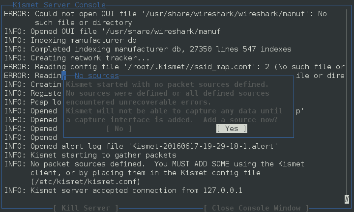

按*Enter*键表示“是”。

下一个屏幕允许您输入 Kismet 用于扫描的接口。在下面的屏幕截图中，我们输入`wlan0`，因为这是我们正在使用的接口：

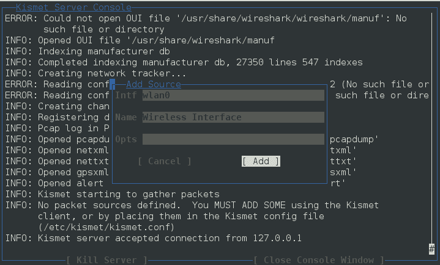

按*Enter*键添加接口。此时，Kismet 将开始收集无线访问点。这包括每个访问点正在使用的 BSSID 和信道：


从 Kismet 的输出中，您可以开始了解您的系统可见的无线网络。从这里开始，尝试识别那些无线访问点或网络，这些网络是您渗透测试的一部分。

# WAIDPS

另一个有用的命令行工具是 WAIDPS 工具，用于无线渗透测试。虽然被宣传为无线网络入侵检测平台，但这个 Python 脚本对于收集有关无线网络和客户端的信息非常有用。要使用 WAIDPS，只需从[`github.com/SYWorks/waidps`](https://github.com/SYWorks/waidps)的网站下载`WAIDPS.py` Python 脚本。

下载后，将脚本放入任何目录，然后使用以下命令运行它：

```
    # python waidps.py
```

命令执行后，您将被带到一个屏幕，脚本将通过配置运行：


WAIDPS 具有一个可选功能，它将无线访问点的 MAC 地址与已知制造商的列表进行比较。如果您知道特定目标为其访问点使用了特定制造商，则此功能非常有用：


一旦初始配置运行，WAIDPS 将提供一个范围内的访问点和无线网络列表。此外，还有有关正在使用的加密类型以及认证机制的信息。另一个很好的信息是 PWR 或功率指示器。这表示特定访问点信号的强度。数字越接近零，信号越强。如果信号比您想要的要弱，这表明您可能需要更靠近实际的访问点：


除了识别无线访问点外，WAIDPS 还具有扫描可能启用了无线但未与访问点关联的客户端的能力。如果您需要伪造一个看似来自合法客户端的 MAC 地址，这些信息可能会很有用：

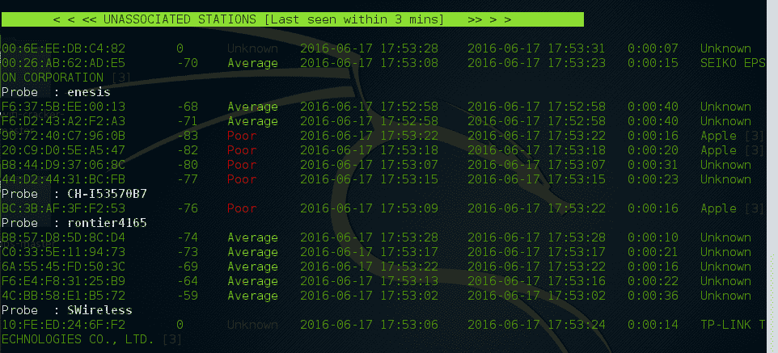

# 无线测试工具

Kali Linux 预装了许多命令行和基于 GUI 的工具。这些工具可以用来将我们的网络接口转换为网络监视器，捕获流量，并反向验证身份验证密码。其中第一个工具是 Aircrack-ng，它是一套工具。此外，我们将研究一些其他命令行和 GUI 工具，涵盖了无线渗透测试所涉及的全部任务。

# Aircrack-ng

Aircrack-ng 是一套工具，允许渗透测试人员测试无线网络的安全性。该套件包括执行以下与无线渗透测试相关任务的工具：

+   **监控**：这些工具专门设计用于捕获流量以供以后分析。我们将更深入地了解 Aircrack-ng 工具捕获无线流量的能力，我们可以将其用于其他第三方软件，如 Wireshark，进行检查。

+   **攻击**：这些工具可用于攻击目标网络。它们包括允许进行去认证攻击和重放攻击的工具，这些攻击利用了 Aircrack-ng 进行数据包注入的能力，Aircrack-ng 实际上将数据包发送到无线数据流中，既发送到客户端又发送到访问点，作为攻击的一部分。

+   **测试**：这些工具允许测试诸如无线网卡之类的硬件的无线功能。

+   **破解**：Aircrack-ng 工具集还具有破解 WEP、WPA 和 WP2 中发现的无线预共享密钥的能力。

除了命令行工具外，Aircrack-ng 还用于许多基于 GUI 的工具。对 Aircrack-ng 的工作原理有扎实的了解将为我们稍后在本章中探讨的其他工具的使用提供坚实的基础。

# WPA 预共享密钥破解

现在我们将使用 Aircrack-ng 套件的工具来攻击 WPA2 无线网络。该过程涉及识别我们的目标网络，捕获四路握手，然后利用一个字典来暴力破解与无线网络的 SSID 相结合的密码，即预共享密钥。通过破解密码，我们将能够对目标无线网络进行身份验证：

1.  确保您已插入无线网络卡，并且它正常工作。为此，请在命令行中输入以下命令：

```
    # iwconfig
```

该命令应输出类似于以下屏幕截图的内容。如果您没有看到无线接口，请确保它已正确配置：


在这里，我们已经将我们的无线接口标识为`wlan0`。如果您有多个接口，您可能也会看到`wlan1`。在进行这些测试时，请确保您使用的是正确的接口。

1.  Aircrack-ng 套件中我们将使用的第一个工具是`airmon-ng`。这个工具允许我们将无线网络卡切换到所谓的监视模式。这很像将网络接口放入混杂模式。这使我们能够捕获比普通无线网络卡看到的更多的流量。要找出`airmon-ng`中可用的选项，输入以下命令：

```
    # airmon-ng -h
```

这将产生以下结果：


要将无线网络卡切换到监视模式，输入以下命令：

```
    # airmon-ng start wlan0
```

如果成功，我们会看到这个：


如果我们再次使用`iwconfig`检查接口，我们会看到我们的接口也已经改变了：


有时会有干扰将无线卡放入监视模式的进程。当执行`airmon-ng start wlan0`命令时，可能会看到以下消息：


在这种情况下，有三个可能干扰监视模式下无线卡的进程。在这种情况下，我们运行以下命令：

```
    # airmon-ng check kill

```


此时，执行以下命令将允许我们继续：

```
    # pkill dhclient
    #pkill wpa_supplicant

```

这会终止可能干扰`airmon-ng`的进程。要重新启用这些进程，在使用 Aircrack-ng 工具完成后，输入以下两个命令到命令行中：

```
    # service networking start
    # service network-manager start 
```

如果仍然有任何问题，可以重新启动 Kali Linux，这些服务将被重新启用。

在下一步中，我们需要扫描我们的目标网络。在上一节中，我们讨论了一些必要的侦察工作来识别潜在的目标网络。在这种情况下，我们将使用一个名为`airodump-ng`的工具来识别我们的目标网络，以及确定它正在使用的 BSSID 和正在广播的信道。要访问`airodump-ng`的选项，输入以下命令到命令提示符中：

```
    # airodump-ng -help
```

这将产生以下部分输出：

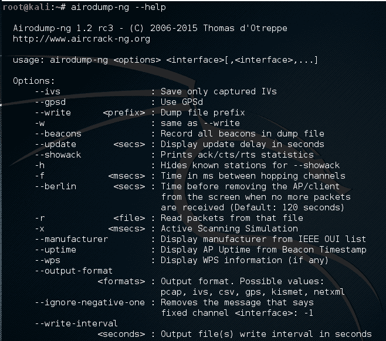

现在我们将使用`airodump-ng`命令来识别我们的目标网络。输入以下命令：

```
    # airodump-ng wlan0mon  
```

`airodump-ng`会一直运行，直到你停止它。一旦看到目标网络，按下*Ctrl* + *C*来停止。你会看到以下输出。我们已经用红色标识出了我们要尝试破解的网络：


1.  上一步为我们确定了三个关键信息。首先，我们确定了我们的目标网络`Aircrack_Wifi`。其次，我们有了 BSSID，即目标网络的 MAC 地址`44:94:FC:37:10:6E`，最后，信道号`6`。下一步是捕获与我们的目标接入点之间的无线流量。我们的目标是捕获四次握手。要开始捕获流量，输入以下命令到命令提示符中：

```
    # - airodump-ng wlan0mon -c 6 --bssid 44:94:FC:37:10:6E -w wificrack  
```

该命令告诉`airodump-ng`使用监视接口来捕获目标网络的 BSSID 和信道的流量。以下截图显示了命令的输出：


当命令运行时，我们要确保捕获到握手。如果客户端连接并获得有效的握手，命令输出会显示已捕获到握手：


如果无法获得 WPA 握手，查看是否有客户端访问网络。在这种情况下，我们看到一个连接到目标无线网络的站点，MAC 地址为`64:A5:C3:DA:30:DC`。由于这个设备已经认证，它很可能在连接暂时丢失时自动重新连接。在这种情况下，我们可以在命令行中输入以下命令：

```
    # aireplay-ng -0 3  -a 44:94:FC:37:10:6E - c 64:A5:C3:DA:30:DC  wlan0mon 
```

`aireplay-ng`命令允许我们向通信流中注入数据包并取消客户端的认证。然后，这将迫使客户端完成一个我们可以捕获的新的 WPA 握手。

1.  在我们捕获到握手后，我们通过按下*Ctrl* + *C*来停止`airodump-ng`。如果我们检查根文件夹，我们会看到从我们的转储中创建的四个文件：

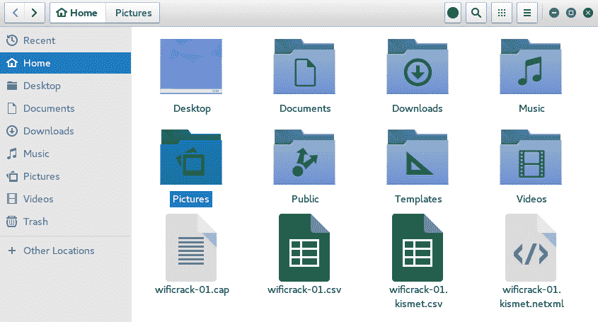

我们可以在 Wireshark 中检查`wificrack-01.cap`文件。如果我们深入到 EAPOL 协议，我们实际上可以看到我们捕获到的四路握手：


进一步的检查显示了特定的 WPA 密钥 Nonce 及其相关信息：


1.  我们有必要的信息来尝试破解 WPA 预共享密钥。为此，我们使用`aircrack-ng`工具。以下是`aircrack-ng`命令：

```
        #aircrack-ng -w rockyou.txt -b 44:94:FC:37:10:6E wificrack-01.cap

```

在前面的命令中，我们使用`-b`选项标识目标网络的 BSSID。然后，我们指向捕获文件`wificrack-01.cap`。最后，我们使用一个单词列表，就像我们会破解密码文件一样。在这种情况下，我们将使用`rockyou.txt`单词列表。一旦命令设置好，按*Enter*，`aircrack-ng`就会开始工作：


Aircrack-ng 将利用`rockyou.txt`密码列表并尝试对捕获文件进行每种组合。如果预共享密钥中使用的`passcode`在文件中，`aircrack-ng`将产生以下消息：


从前面的截图中，我们可以看到`passcode "15SHOUTINGspiders"`在我们用于暴力破解的`rockyou.txt`文件中。还要注意，这大约花了一小时 42 分钟，最终尝试了总共 8,623,648 个不同的 passcodes。这种技术可以尝试使用任何密码列表，就像我们在密码破解章节中讨论的那样。只要记住，passcode 的长度可以是 8 到 63 个字符。可用的组合数量太多，无法尝试。不过，这种攻击对于易记或短密码短语是成功的，就像密码破解一样。

# WEP 破解

WEP 破解的过程与用于破解 WPA 的过程非常相似。识别目标网络，捕获流量（包括认证机制），然后指向一个暴力破解攻击以反向密钥。不过，也有一些不同之处。与 WPA 破解相反，我们只需要捕获四路握手，而在 WEP 破解中，我们必须确保收集足够的**初始化向量**（**IVs**）以正确破解 WEP 密钥。虽然这可能看起来很困难，但有技术可用来强制这个过程，并使得嗅探流量所需的时间尽可能短。

1.  为了开始 WEP 破解过程，我们以与 WPA 破解相同的方式将无线网卡置于监视模式。输入以下命令：

```
    # airmong-ng start wlan0
```

1.  我们尝试使用以下命令找到目标网络：

```
    # airodump-ng wlan0mon 
```

这产生了无线网络列表：

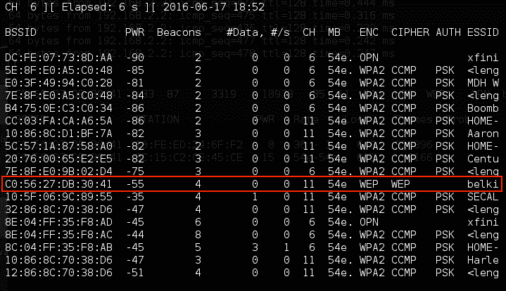

我们已经确定了一个使用 BSSID 为`C0:56:27:DB:30:41`的 WEP 目标网络。同样，我们需要记下这一点，以及接入点使用的频道，这种情况下是`11`频道。

1.  捕获目标无线网络的数据。在这里，我们将使用`airodump-ng`命令来捕获这些数据：

```
    # airodump-ng -c 11 -w belkincrack --bssid C0:56:27:DB:30:41

```

这个命令将`airdump-ng`指向我们目标网络的适当频道。此外，我们正在捕获写入`"belkincrack"`文件的流量。这个命令产生以下输出：


请注意，我们尚未看到任何数据通过该接入点移动。这很重要，因为我们需要捕获包含 IVs 的数据包，以便破解 WEP 密钥。

1.  我们必须伪装认证到我们的目标网络。基本上，我们使用一个名为`aireplay-ng`的 Aircrack-ng 工具告诉接入点我们有正确的 WEP 密钥，并且准备好进行认证。即使我们没有正确的密钥，以下命令也让我们伪装认证，并允许我们与 WEP 接入点进行通信：

```
      # aireplay-ng -1 0 -a C0:56:27:DB:30:41 wlan0mon
```

在上述命令中，我们让`aireplay-ng`使用`"-1"`伪装认证，`"0"`作为重传时间，`"-a"`作为目标接入点的 BSSID。该命令产生以下结果：


现在我们有能力与 WEP 接入点进行通信。

1.  正如我们在步骤 3 中看到的，通过该接入点来回传输的数据非常少。我们需要捕获大量数据，以确保我们能够抓住那些 IVs 并强制发生碰撞。我们可以再次使用`aireplay-ng`来增加数据到接入点。在以下命令中，我们将进行 ARP 请求重放攻击。在这种攻击中，我们将使用`aireplay-ng`向接入点重发 ARP 请求。每次这样做时，它都会生成一个新的 IV，增加我们强制发生碰撞的机会。打开第二个命令提示符，输入以下内容：

```
      # aireplay-ng -3 -b C0:56:27:DB:30:41 wlan0mon
```

在上述命令中，`"-3"`告诉`aireplay-ng`对以下网络进行 ARP 请求重放攻击，`"-b"`是特定接口`"wlanomon"`。命令运行后，您需要通过 ping 同一网络上的另一个主机来强制 ARP 请求。这将强制 ARP 请求。一旦开始，您将看到以下输出：


如果我们回到第一个正在运行`airodump-ng`的命令提示符，我们会看到数据速率开始增加。在这种情况下，超过 16,000 个 IVs：


1.  打开第三个终端。在这里，我们将开始 WEP 破解。这可以在`airodump-ng`命令捕获 IVs 的同时运行。要启动该过程，请输入以下命令：

```
    # aircrack-ng belkincrack-01.cap

```

在上述命令中，`aircrack-ng`指向正在运行的捕获文件。`aircrack-ng`立即开始工作，如截图所示：


`aircrack-ng`可能会指示 IVs 不足，并在 IVs 足够时重新尝试。正如我们在以下截图中看到的，`aircrack-ng`能够确定 WEP 密钥。总共捕获了 15,277 个 IVs，用于破解。此外，在不到三分钟内测试了 73253 个密钥：


正如我们在这次攻击中看到的，通过正确数量的无线流量和`aircrack-ng`工具套件，我们能够确定 WEP 密钥，从而允许我们对网络进行认证。正是这种攻击的简易性导致了从 WEP 到 WPA 认证的转变。虽然由于这种攻击，WEP 网络在野外变得越来越少，但您仍然可能会遇到一些。如果您确实遇到它们，这种攻击非常适合向客户展示存在的重大安全漏洞。

# PixieWPS

PixieWPS 是一种离线暴力破解工具，用于破解 WPS 无线接入点的 PIN。PixieWPS 的名称来自 Dominique Bongard 发现的 Pixie-Dust 攻击。此漏洞允许对 WPS PIN 进行暴力破解。（有关此漏洞的更详细信息，请参阅 Bongard 的演示：[`passwordscon.org/wp-content/uploads/2014/08/Dominique_Bongard.pdf`](https://passwordscon.org/wp-content/uploads/2014/08/Dominique_Bongard.pdf)。）

要访问 PixieWPS，请在命令提示符中输入以下内容：

```
    # pixiewps
```

该命令将为您提供不同的命令选项。为了使 PixieWPS 正常工作，必须获取大量信息。这包括以下内容：

+   受训者公钥

+   注册公钥

+   受训者哈希-1

+   受训者哈希-2

+   认证会话密钥

+   受训者 nonce

由于需要所有这些组件，PixieWPS 通常作为另一个工具的一部分运行，比如 Wifite。

# Wifite

Wifite 是一个自动化的无线渗透测试工具，利用了与 Aircrack-ng、Reaver 和 PixieWPS 命令行工具相关的工具。

这使得 Wifite 能够捕获流量并反向验证 WEP、WPA 和 WPS 类型的无线网络的认证凭据。导航到应用程序|无线攻击|Wifite 或通过命令行启动 Wifite：

```
    # wifite
```

任一都会带您到初始屏幕：

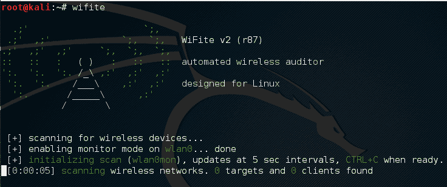

Wifite 将自动将无线卡置于监视模式，然后开始扫描无线网络：


一旦在列表中看到目标网络，比如 ESSID 或广播 SSID Brenner，按下*Ctrl* + *C*。这时，您将被提示输入一个单个数字或一个测试范围。在这种情况下，我们输入数字`4`并按*Enter*：


Wifite 会自动通过捕获必要的信息来启动 WPS Pixie 攻击。如果成功，将显示以下内容：


如果存在 WPS 漏洞，就像这里的无线网络一样，Wifite 能够确定 WPA 密钥和 PIN。

# Fern Wifi-Cracker

Fern Wifi-Cracker 是一个用 Python 编写的基于 GUI 的工具，用于测试无线网络的安全性。目前有两个支持的版本：一个是付费的专业版本，具有更多的功能，另一个是免费版本，功能有限。Kali Linux 附带的版本需要`aircrack-ng`和其他无线工具才能正常运行。

要启动 Fern，您可以导航到应用程序|无线攻击|Fern Wifi Cracker，或者在命令提示符中键入以下内容：

```
    # fern-wifi-cracker
```

以下屏幕截图是加载的初始页面：


我们将使用 Fern Wifi Cracker 来攻击相同的无线网络 Aircrack-Wifi，利用 GUI 而不是使用命令行进行攻击：

1.  选择接口。单击“选择接口”下拉菜单。在这种情况下，我们将选择 wlan0。Fern 将自动将我们的接口置于监视模式：


1.  单击“扫描访问点”按钮。Fern 将自动扫描天线范围内的无线网络。扫描完成后，Wifi WEP 和 WiFi WPA 按钮将从灰色变为彩色，表示检测到使用这些安全设置的无线访问点：


1.  单击 Wifi WPA 按钮会显示一个攻击面板，其中包含我们可以攻击的 WPA 无线访问点的图形表示。在这种情况下，我们将选择 Aircrack_Wifi 按钮！[](img/83f620b6-8ddb-4af1-abfb-b1725a4b359d.png)

1.  此屏幕提供了有关所选访问点的详细信息。此外，Fern Wifi Cracker 允许进行 WPA 攻击或 WPS 攻击。在这种情况下，我们将使用 WPA 攻击！[](img/c8335752-2280-48c1-82ec-769b4ba93e11.png)

1.  设置 Fern Wifi-Cracker 将用于反向密码的密码文件。在这种情况下，我们制作了一个特殊的 Wi-Fi 密码列表，并将 Fern Wifi-Cracker 指向该文本文件！[](img/b5271b9f-5995-44b3-be4d-198794ecd298.png)

1.  点击 Wifi 攻击按钮。Fern Wifi-Cracker 完成了我们之前在 Aircrack-ng 部分介绍的整个过程。这包括解认证客户端，然后捕获四次握手。最后，Fern Wifi-Cracker 将通过密码文件，并且如果密码文件中有该密码，将出现以下消息：


Fern Wifi-Cracker 负责破解 Wi-Fi 网络和接入点的后台工作。虽然使用这个工具可能更容易，但最好对 Aircrack-ng 的工作原理有一个扎实的理解。Fern Wifi-Cracker 和其他基于 GUI 的 Wi-Fi 破解程序都是基于 Aircrack-ng 的，对该工具集有扎实的理解可以让您完全理解这些程序背后发生了什么。

# 恶意双子攻击

在任何大城市或企业环境中几乎不可能找不到 Wi-Fi 信号。其中许多，特别是在公共场所，Wi-Fi 热点不需要身份验证，其他则会显示一个强制门户，可能只需要您接受一些条款和条件，或者要求您使用您的电子邮件或 Facebook 账户登录。

恶意双子攻击，也称为流氓接入点或虚假接入点，是一个伪装成合法接入点而没有所有者知识或同意的接入点。连接到合法接入点的终端用户将连接到虚假接入点，因为虚假接入点通常信号更强。

设置了虚假接入点的攻击者现在将能够捕获受密码保护的 SSID 的实际密码，为中间人和其他攻击做好准备。

我们需要包括 Aircrack Suite 和`dnsmasq`。dnsmasq 是一个小巧、轻量级的工具，可以作为易于配置的 DNS 转发器和 DHCP 服务器。根据您想要使用的攻击向量，您将需要一些额外的工具，比如`apache2`和`dnsspoof`：

1.  验证您是否拥有这些工具。我们知道 Aircrack 工具和 Apache2 已经预装在 Kali 上。在终端中，输入`apt-get install dnsmasq`。如果已经安装，您将无需进行任何操作；如果没有安装，系统将提示您进行安装确认。

1.  通过将无线适配器之一设置为监视模式`airmon-ng start <interface>`来确定目标网络，然后启动`airodump-ng <interface>`来开始列出当前正在广播的所有网络：


1.  您可能会看到类似于屏幕截图中的错误。在大多数情况下，这些错误是可以忽略的。如果遇到问题，使用`kill <PID>`来结束进程。例如，我会使用`kill 610`来结束`NetworkManager`进程：

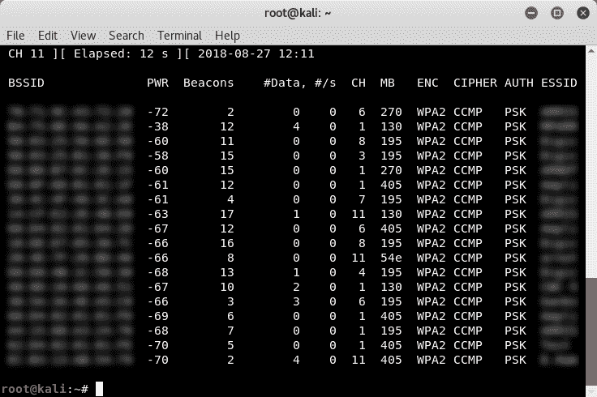

注意目标网络的 BSSID（MAC 地址）、ESSID（广播名称、SSID）和信道。

1.  设置一个`dnsmasq`的配置文件。我在我的主目录下创建了一个名为`tmp`的文件夹，使用`mkdir tmp`。然后改变目录，在终端输入`touch dnsmasq.conf`。这将创建一个名为`dnsmasq`的文件。输入`nano dnsmasq.conf`将在`cli`的`nano`文本编辑器中打开`dnsmasq.conf`文件。输入以下行：

```
interface=<at0>
dhcp-range=10.0.0.10,10.0.0.250,12h
dhcp-option=3,10.0.0.1
dhcp-option=6,10.0.0.1
server=8.8.8.8
log-queries
log-dhcp
listen-address=127.0.0.1
```

在`dnsmasq.conf`文件中，我们只指定了接口（`at0`）、要使用的`dhcp`范围（`10.0.0.10 - 10.0.0.250`，`12h`租约时间）、`dhcp-option=3`作为网关（`10.0.0.1`），以及`dhcp-option=3`作为 DNS 服务器（`10.0.0.1`）。为什么接口是`at0`？这是因为`airbase-ng`创建了一个名为`at0`的默认桥接口。

使用*Ctrl* + *O*在 nano 中保存更改，使用*Ctrl* + *X*退出。

1.  设置`airbase-ng`。这将创建我们的访问点。使用`airbase-ng -e <ESSID> -c <channel> <monitor interface>`进行设置。我的目标`ESSID`设置为`ARRIS-4BE2`，频道设置为`11`，监视接口为`wlan0mon`：


1.  启用`at0`接口，稍微调整`iptables`，并启用/禁用流量通过。您可以像之前一样依次执行这些操作。


使用`dnsmasq -C <config file> -d`启动`dnsmasq`： 

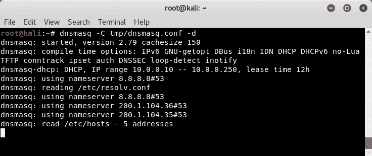

1.  您可以阻止流量通过并像之前一样捕获 IVS（使用`echo 0 > /proc/sys/net/ipv4/ip_forward`），或者您可以向用户提供一个强制门户网站或允许流量通过（使用`echo 1 > /proc/sys/net/ipv4/ip_forward`），只重定向特定目标站点以设置 MitM 攻击。

在这里，我们可以朝着几个方向发展。我们可以继续并建立一个成熟的恶意双子（Rogue AP）以捕获网络的密码，或者我们可以建立一个中间人攻击，通过整合其他工具（如`dsniff`工具套件或`sslstrip`）或将其与**浏览器利用框架**（**BeEF**）结合起来，直接攻击客户端，劫持用户的浏览器。

# 破解后

如果您成功获取了 WPA 或 WEP 密钥，现在您有了认证到网络的能力。一旦连接到无线网络，您就拥有了我们在本书中讨论过的一系列工具。这是因为一旦得到适当的认证，您的 Kali Linux 安装就只是**局域网**（**LAN**）的一部分，就像我们通过网络电缆连接一样。因此，我们有能力扫描其他设备，利用漏洞，利用系统，并提升我们的凭据。

# MAC 欺骗

有一些技术对于演示我们可以探索的无线网络上的其他漏洞是有用的。其中一个问题是绕过一个称为 MAC 过滤的常见无线控制。MAC 过滤是一些路由器上的一种控制，只允许特定的 MAC 地址或 MAC 类型。例如，您可能正在测试一个使用 iPad 的商业位置。无线网络只会允许具有`34:12:98`前三个十六进制字符的 MAC 地址。其他组织可能有一组允许加入的 MAC 地址。

如果您能够破解 WPA 密钥，但发现无法加入网络，则目标组织可能正在使用某种形式的 MAC 地址过滤。为了绕过这一点，我们将使用 Macchanger 命令行工具。这个简单的命令允许我们将 MAC 地址更改为允许我们连接的内容。首先，您可以轻松地从以前的侦察和破解尝试中找到一个新的 MAC 地址。Airodump-ng 工具将识别连接到无线网络的客户端。此外，使用 Wireshark 解析捕获文件将允许您识别潜在有效的 MAC 地址。

在这个例子中，我们已经确定了一个连接到目标无线网络的无线客户端，其 MAC 地址为`34:12:98:B5:7E:D4`。要将我们的 MAC 地址更改为模拟合法的 MAC 地址，只需在命令行中输入以下内容：

```
    # macchanger -mac=34:12:98:B5:7E:D4 wlan0
```

该命令产生以下输出：


此外，如果我们运行`ifconfig wlan0`命令，我们可以看到我们伪造的 MAC 地址：


现在我们有能力绕过接入点上正在进行的任何 MAC 过滤。现在有能力连接到无线网络。与我们能够破坏的任何系统一样，建立持久性是另一个关键步骤。这使我们有一定的确定性，如果我们失去连接，我们将能够再次访问系统。

# 持久性

一旦我们有有效的身份验证无线网络的方法并能够连接，下一步就是建立持久性。一个要关注的领域是无线路由器。大多数无线路由器都有基于 Web 的或其他控制台，合法管理员可以登录并管理路由器。通常，这些路由器位于我们连接的无线局域网子网的开头。例如，如果我们连接到`Wifi_Crack`并运行`ifconfig wlan0`命令，它会将我们标识为具有 IP 地址`10.0.0.7`。

如果我们通过 Iceweasel 浏览器导航到[`http://10.0.0.1`](http://10.0.0.1)，我们会被带到这个页面。您还可以在终端中输入`route -n`，这将给您默认网关：


如果我们输入`admin`用户名而没有密码并单击确定，我们会得到这个：


我们看到的是管理员帐户的默认密码。虽然不常见，但并非不可能，这个网络的系统管理员留下了无线路由器的默认凭据。如果我们没有收到这个错误消息，互联网上有大量资源汇总了各种路由器、交换机和无线接入点的默认管理员帐户。

一个这样的网站是[`www.routerpasswords.com/`](http://www.routerpasswords.com/)。如果这不起作用，下一个选择是使用我们之前介绍过的技术来暴力破解登录。

如果我们能够破坏管理员帐户并访问管理设置，注意允许您再次登录的信息，例如 WPS PIN：

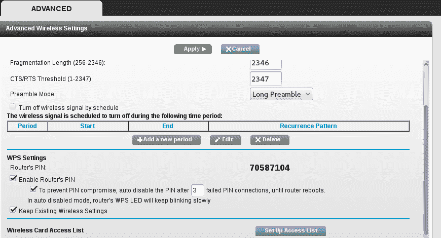

管理员可能会更改无线接入点的 WPA 密码，但通常会保留 WPS PIN。此外，您应该检查是否有能力访问 MAC 地址过滤控件：


从这里，您可以输入几个 MAC 地址，以便将来使用。

# 嗅探无线流量

在检查嗅探无线流量的技术时，有两种类型的技术可用。第一种是在经过身份验证并连接到目标无线局域网时嗅探无线局域网流量。在这种情况下，有能力利用中间人攻击与 Ettercap 等工具，将网络流量强制通过我们的测试机器。

第二种技术是嗅探我们可以从特定无线网络获取的所有无线流量，并使用 WPA 或 WEP 密码解密它。如果我们试图通过不连接到无线局域网来限制我们的足迹，这可能是必要的。通过被动嗅探流量并稍后解密，我们减少了被发现的机会。

# 嗅探无线局域网流量

就像有线局域网一样，在无线局域网上，我们有能力嗅探网络流量。以下嗅探技术要求您已经正确地经过身份验证连接到正在测试的无线网络，并从路由器那里收到了有效的 IP 地址。这种嗅探将利用 Ettercap 工具进行 ARP 欺骗攻击并嗅探凭据：

1.  通过转到应用程序|嗅探和欺骗|Ettercap-gui 或在命令提示符中输入`ettercap-gui`来启动 Ettercap。导航到 Sniff 并单击 Unified Sniffing。然后，您将看到一个网络接口的下拉列表。选择您的无线接口，在我们的情况下是 WLAN0:

1.  单击主机，然后单击扫描主机。扫描完成后，单击主机列表。如果是活动无线网络，您应该会看到一些主机。

1.  单击 MiTM，然后 ARP 毒化。在下一个屏幕上，选择一个 IP 地址，然后单击目标 1，然后选择第二个 IP 地址，然后单击目标 2: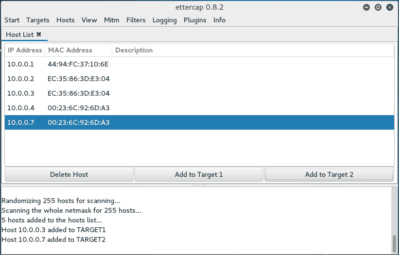

1.  单击嗅探远程连接单选按钮，然后单击确定:

这将启动 ARP 毒化攻击，从而我们将能够看到我们选择的两个主机之间的所有流量。

1.  开始 Wireshark 捕获。当您被带到第一个屏幕时，确保选择无线接口，在这种情况下是 WLAN0:


当您检查流量时，我们可以看到捕获的各种类型的流量。最显著的是我们两个主机之间打开的 Telnet 会话：


如果我们右键单击 Telnet 会话并选择跟踪 TCP 流，我们可以看到 Metasploitable 实例的 Telnet 凭据以明文形式显示：


# 被动嗅探

在被动嗅探中，我们未经过网络认证。如果我们怀疑可能会触发入侵防范控制（如流氓主机检测）的可能性，这是一种避开这些控制但仍然可能获得潜在机密信息的好方法：

1.  在目标网络上被动扫描无线流量。确保您的无线网卡处于监视模式：

```
    # airmon-ng start wlan0  
```

1.  使用`airodump-ng`工具来嗅探网络流量，就像我们在 WPA 破解部分所做的那样：

```
    # airodump-ng wlan0mon -c 6 --bssid 44:94:FC:37:10:6E -w wificrack
```

1.  运行工具的时间长短由你决定。为了确保我们能够解密流量，我们需要确保捕获完整的四路握手，如果是 WPA 网络的话。一旦我们捕获到足够的流量，按下*Ctrl* + *C*。

1.  导航到捕获文件所在的文件夹，然后双击。这应该会自动在 Wireshark 中打开捕获！[](img/70f0c58a-fcd1-484b-bebf-bd79a78627a0.png)

捕获是加密的，只能看到一些`802.11`数据包。

1.  在 Wireshark 中，导航到编辑，然后到首选项。将打开一个新的窗口；单击协议旁边的三角形，然后单击 802.11\. 应该会打开以下内容：

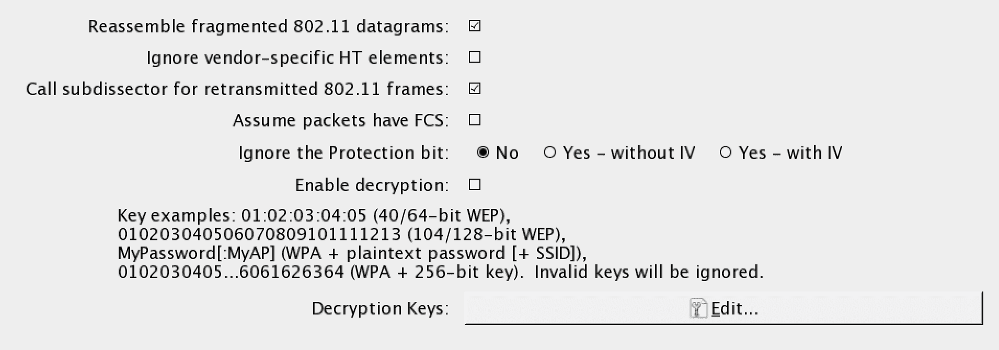

1.  单击编辑。这将带您到一个屏幕，输入 WEP 或 WPA 解密密钥。单击新建。在密钥类型下，输入`WPA`，然后输入密码和 SSID。在这种情况下，它将是`Induction:Coherer`。单击应用和确定：


1.  要将此解密密钥应用于我们的捕获，导航到“查看”，然后到“无线工具栏”。启用无线工具栏。在主屏幕上，您将看到以下内容：


1.  在无线工具栏上，单击解密密钥。将会出现一个框。在左上角的下拉菜单中，选择 Wireshark 作为解密模式。确保选择适用的密钥。单击应用和确定：


1.  Wireshark 将解密密钥应用于捕获，并在适用的情况下能够解密流量：


正如前面的屏幕截图所示，我们可以解密我们捕获的流量，而无需加入网络。重申一点，这种技术需要为每个捕获的会话进行完整的四路握手。

# 摘要

无线网络的使用渗透到所有组织中。与迄今为止我们探讨过的任何系统一样，无线网络也存在漏洞。这些漏洞，无论是流量加密方式还是身份验证方法，都可以利用 Kali Linux 提供的工具。渗透测试人员演示这些漏洞及其相关的利用方式，可以让那些使用这些类型网络的人清楚地了解他们需要采取什么措施来保护自己免受攻击。随着世界向着越来越无线化的方向发展，智能手机、笔记本电脑和物联网的出现，无线网络及其安全控制的不断测试变得至关重要。

在下一章中，我们将讨论无线网络作为渗透测试的一个更大方法论的一部分：使用 Kali Linux 的 Nethunter 作为移动设备渗透测试平台。我们将以一种新的方式展示几种技术，使用一种灵活的渗透测试工具。
