# 第十二章：使用 Kali NetHunter 进行移动渗透测试

Kali NetHunter 专门设计用于在 Android 移动平台上运行，为渗透测试人员提供了更大的灵活性和移动性。

Kali NetHunter 具有我们讨论过的许多工具，以及一些额外的工具，可以进行更多的移动渗透测试。在本章中，我们将讨论安装 Kali NetHunter 以及如何使用关键工具。最后，将讨论 NetHunter 平台在某些用例中相比尝试使用更传统的 Kali Linux 方法具有显著优势的情况。

在本章中，我们将讨论以下内容：

+   Kali Linux NetHunter 概述

+   部署 NetHunter

+   安装 NetHunter 的一般概述

+   工具和技术

+   无线攻击

+   人机界面设备攻击

# 技术要求

在本章中，OnePlus One 和 Nexus 4 设备都用于运行 NetHunter。兼容设备的完整列表可在[`github.com/offensive-security/kali-nethunter/wiki`](https://github.com/offensive-security/kali-nethunter/wiki)上找到。

# Kali NetHunter

NetHunter 是建立在开源 Android 平台上的第一个移动渗透测试操作系统。这是 Offensive Security 和 Kali 社区成员 Binky Bear 之间的合作开发。NetHunter 可以安装在以下 Google Nexus 设备上：Nexus 5、Nexus 6、Nexus 7、Nexus 9、Nexus 10 和 OnePlus One。兼容设备的完整列表可在[`github.com/offensive-security/kali-nethunter/wiki`](https://github.com/offensive-security/kali-nethunter/wiki)上找到。Offensive Security 提供了基于设备和制造年份的多个 NetHunter 镜像。

# 部署

由于其大小，NetHunter 可以以三种一般方式部署。这些部署策略利用了 NetHunter 平台内的工具以及可以轻松获取的额外硬件。这些部署策略允许渗透测试人员测试各种环境中发现的广泛的安全措施。

# 网络部署

前面大部分章节都致力于介绍渗透测试人员用于测试远程或本地网络的工具和技术。这些工具需要通过物理连接访问这些网络。NetHunter 也具有相同的能力。利用 USB Android 适配器和 USB 以太网适配器的组合，渗透测试人员可以直接连接到墙壁插座，或者如果他们能够获得网络硬件的访问权限，可以直接连接到交换机。

这种部署策略适用于那些希望秘密进入区域而不想携带笔记本电脑的测试人员。使用 Nexus 智能手机甚至小型平板电脑，渗透测试人员可以连接到物理网络，入侵本地系统并在那里设置持久性，然后继续前进。在测试公共可用网络插孔周围的安全性时，这种方法也很有用。

# 无线部署

NetHunter 在一个便携包中包含了许多相同的工具。在某些渗透测试中，使用平板电脑或智能手机测试平台而不是笔记本电脑，可以更轻松地在大型校园周围移动，识别网络并捕获无线流量以供以后破解。

要以这种方式部署 NetHunter，需要使用外部天线和 USB 到 Android 适配器。一旦连接，这些硬件工具允许充分使用 NetHunter 的无线工具。

# 主机部署

NetHunter 平台相对于 Kali Linux 平台的一个优势是在 Android OS 中找到的本机 USB 支持。这使得渗透测试人员能够将 NetHunter 平台直接连接到诸如笔记本电脑和台式机之类的主机。这种能力允许渗透测试人员利用执行人机界面设备攻击的工具。在这些攻击中，渗透测试人员能够利用允许连接到主机设备并模拟所谓的**人机界面设备**（**HID**）的工具。HID 是诸如键盘和鼠标之类的设备，通过 USB 连接到主机。

HID 攻击利用这一特性，强制主机系统执行命令或直接下载有效负载脚本到系统。这种攻击更难阻止的原因在于，即使数据丢失预防控制不允许连接 USB 存储设备，HID 设备也是允许的。

# 安装 Kali NetHunter

一般来说，安装 NetHunter 的过程包括对设备进行 root、将其恢复到出厂镜像，然后将 Kali NetHunter 镜像刷入设备。您应该给自己一个小时来完成整个过程。这里提供的是一个概述，让您有一个很好的起点来收集必要的工具和镜像。

以下是您 root 设备、放置恢复镜像和最后安装 NetHunter 镜像所需的一些资源：

+   在本地系统上安装 Android SDK 工具集。可在[`developer.android.com/studio/index.html`](https://developer.android.com/studio/index.html)上找到。

+   TWRP 恢复镜像将在这个过程中使用；您可以在[`twrp.me`](https://twrp.me)上找到它。 [](https://twrp.me)

+   要从 Windows 对设备进行 root，您将需要特定的 root 工具包。Nexus root 信息可在[`www.wugfresh.com/nrt/`](http://www.wugfresh.com/nrt/)上找到，Oneplus Bacon Root Toolkit 可在[`www.wugfresh.com/brt/`](http://www.wugfresh.com/brt/)上找到。有关使用 Windows 机器安装 NetHunter 的指南可在[`github.com/offensive-security/kali-nethunter/wiki/Windows-install`](https://github.com/offensive-security/kali-nethunter/wiki/Windows-install)上找到。

+   NetHunter 镜像可在[`www.offensive-security.com/kali-linux-nethunter-download/`](https://www.offensive-security.com/kali-linux-nethunter-download/)上找到。

确保您按照正确的顺序仔细遵循说明。在这个过程中不要着急。

# NetHunter 图标

一旦 NetHunter 安装在您的设备上，作为镜像的一部分安装了两个图标。您将在应用程序菜单中找到它们。您将会广泛使用这些图标，所以我建议您将它们移动到顶层屏幕。第一个图标是 Kali NetHunter 菜单。该菜单包括在渗透测试中常用的配置设置和工具。首先，点击 NetHunter 图标：

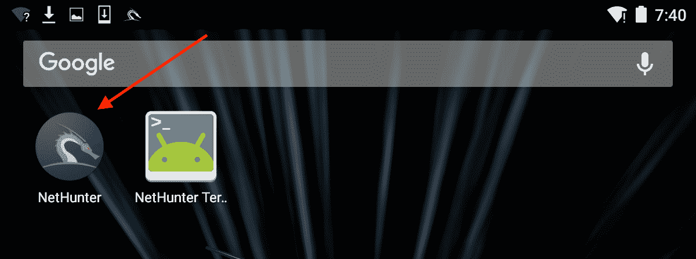

您将被带到一个主屏幕，上面有一系列工具，以及一些配置设置菜单。我们现在要检查的菜单是 Kali Services 菜单。该菜单允许您配置 NetHunter 上可用的不同服务，而无需使用命令行：

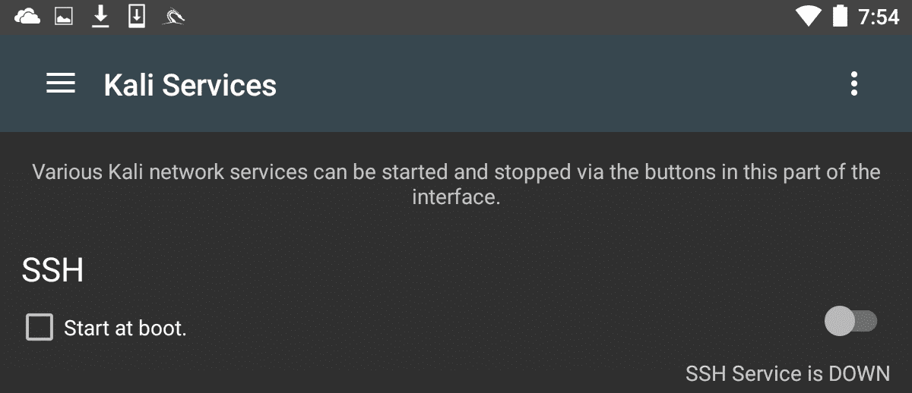

在这个菜单中，您可以配置许多服务在启动时启动，或根据您的具体要求切换开关。我们在其他章节中介绍过的两个特定服务包括 Apache Web 服务器和 Metasploit 服务。这两个服务都可以从这个菜单中启动：

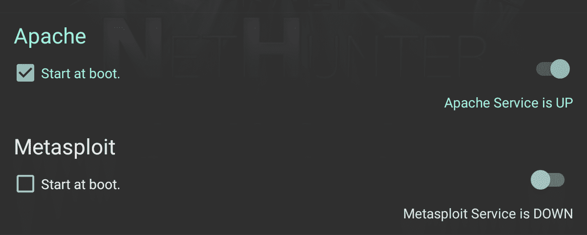

除了菜单选项之外，NetHunter 还有一个用于访问命令行的图标。要访问终端，请点击 NetHunter 终端：


然后将打开命令提示符，看起来与我们在之前章节中看到的标准界面相同：


右上角的三个垂直点将允许您访问选项，这些选项允许您使用特殊键，访问帮助菜单，并设置您的首选项，以及其他选项。此外，Kali NetHunter 预先配置了 Hacker's Keyboard。导航到平板菜单中的应用程序页面。您将找到 Hacker's Keyboard 的图标。这个键盘更加用户友好，在使用命令行时非常有用。

# NetHunter 工具

由于它基于 Kali Linux 操作系统，我们在之前章节中探讨过的许多工具都是 NetHunter 平台的一部分。因此，在渗透测试期间可以使用相同的命令和技术。在接下来的部分中，我们将讨论两个在渗透测试中最常用的工具，并检查一些可以成为个人 NetHunter 平台一部分的其他工具。

# Nmap

其中一个最常用的工具是 Nmap，我们已经详细介绍过。虽然您可以在 NetHunter 中使用与 Kali Linux 相同功能的命令行运行 Nmap，但 NetHunter Nmap 界面减少了输入这些命令所需的工作量。要进入 NMAP，点击 NetHunter 图标，然后导航到 Nmap。在这里，我们有一个界面，允许我们输入单个 IP 地址、范围或 CIDR 表示法。在这种情况下，我们将使用一个路由器的单个 IP 地址：

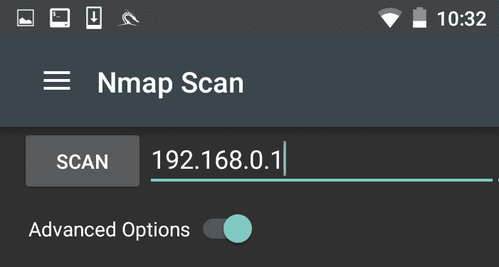

NetHunter 界面允许您设置 NMAP 扫描类型、操作系统检测、服务检测和 IPv6 支持。还可以设置特定的端口扫描选项。渗透测试人员可以根据自己的规格设置扫描，或选择 NMAP 应用程序选项来限制他们的端口扫描：


通过点击选择时间模板，可以设置扫描时间。与 NMAP 的命令行版本一样，扫描的时间可以根据情况进行调整。最后，还可以设置扫描类型。点击选择扫描技术将显示可用的扫描类型选项。这包括 SYN 或 TCP 扫描等选项：


配置好扫描后，点击扫描按钮。NetHunter 将打开一个命令窗口并运行扫描：


NetHunter 附带的 GUI 非常适合运行简单的扫描。对于更详细的扫描或使用脚本，您将需要切换到 NMAP 的命令行版本。

# Metasploit

在之前的章节中，我们讨论过许多强大的渗透测试工具之一是 Metasploit。Metasploit 框架包含在 NetHunter 中，并且与 Kali Linux 的功能完全相同。例如，让我们使用 NetHunter 平台尝试利用运行 Metasploitable 的目标系统中的后门漏洞。

首先，我们点击 NetHunter 终端图标，然后输入以下内容：

```
    # msfconsole
```

我们将利用 Metasploitable 中 IRC 守护程序的后门漏洞。因此，我们将使用`unreal_ircd_3281_backdoor`漏洞。我们在命令行中输入以下内容：

```
    msf > use exploit/unix/irc/unreal_ircd_3281_backdoor
```

接下来，我们将远程主机设置为我们的 Metasploitable 机器：

```
    msf >exploit(unreal_ircd_3281_backdoor) >set RHOST 192.168.0.182  
```

最后，我们运行漏洞利用。以下截图显示了前面命令的输出：

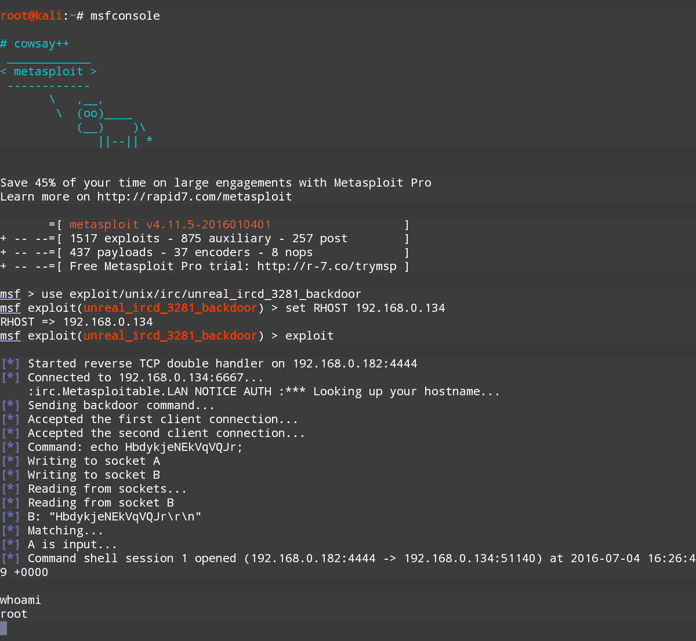

一旦触发了漏洞利用，我们可以运行`whoami`命令，并将其标识为根命令 shell。正如我们通过这个例子看到的那样，NetHunter 在 Metasploit 框架方面具有与 Kali Linux OS 相同的功能。这使得渗透测试人员可以利用 NetHunter 平台在更小更便携的平台上进行攻击。利用 Metasploit 框架的一个缺点是在平板电脑或手机上输入命令。

就像在 Kali Linux 中一样，NetHunter 还包括用于 Metasploit 的 Msfvenom 有效负载创建器。此 GUI 可用于生成用于 Metasploit 框架的自定义有效负载。要访问此工具，请单击 NetHunter 图标，然后导航到 Metasploit 有效负载生成器。您将被带到以下菜单：

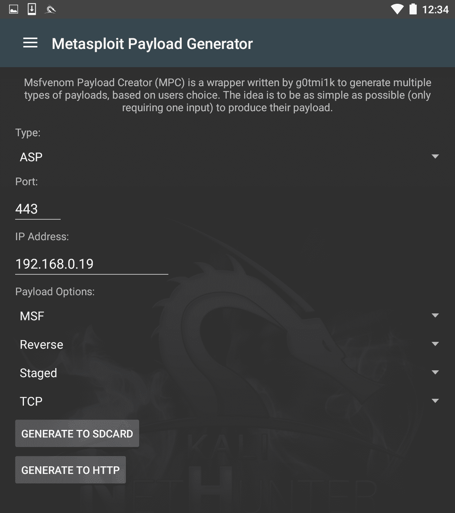

从此菜单中，我们拥有与 Kali Linux 版本的 Msfvenom 相同的选项。此外，此 GUI 允许我们创建特定的有效负载并将其保存到 SD 卡以供进一步使用。

NetHunter 中与 Metasploit 一起使用的另一个工具是 Searchsploit。此工具查询[`www.exploit-db.com/`](https://www.exploit-db.com/)上的 Exploit 数据库，并允许用户搜索可与 Metasploit 中的漏洞一起使用的其他漏洞。

# MAC 更改器

在对目标无线网络进行攻击或连接到物理网络的情况下，可能需要更改 NetHunter 平台的 MAC 地址。为了方便起见，NetHunter 预装了 MAC Changer。要访问 MAC Changer，请单击 NetHunter 图标，然后单击 MAC Changer。您将被带到以下屏幕：

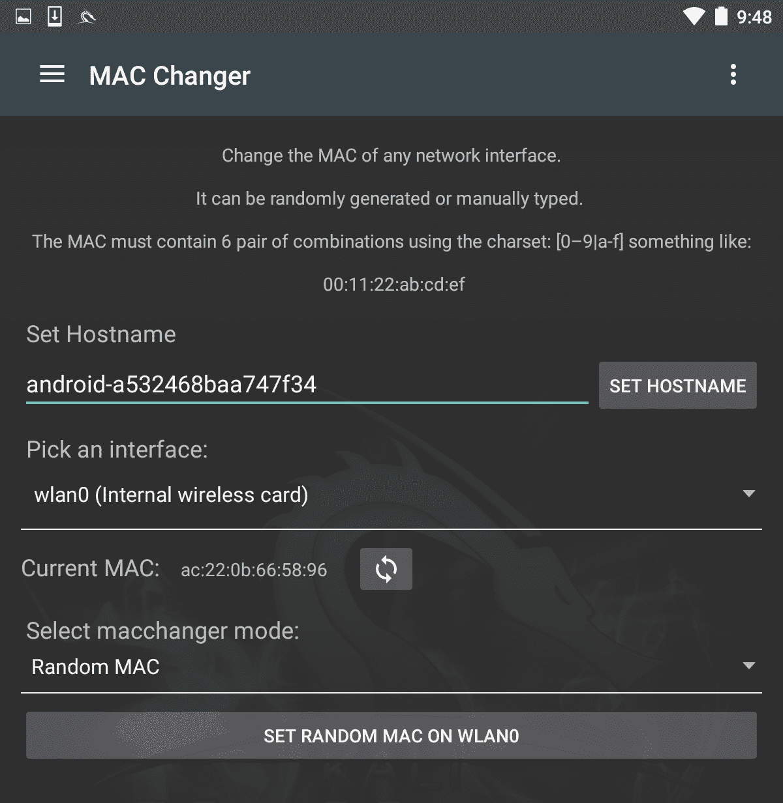

MAC 更改器允许您将主机名设置为您选择的主机名。将主机名设置为模仿目标组织的命名约定，可以在网络上记录活动的系统存在的情况下掩盖您的活动。此外，MAC 更改器允许您设置 MAC 地址或允许工具为每个接口随机分配 MAC 地址。

# 第三方 Android 应用程序

除了您的 NetHunter 安装外，通过浏览主菜单，您还应该注意到其他六个已安装的 Android 应用程序。

已安装的应用程序是**NetHunter 终端应用程序，DriveDroid，USB 键盘，Shodan，Router Keygen**和**cSploit**。尽管这些第三方应用程序在 NetHunter 文档中被列为正在进行的工作，但我发现它们都可以使用。根据您的移动设备及其硬件，某些应用程序或应用程序中的功能可能无法正常工作。

# NetHunter 终端应用程序

就像 Kali 和 NetHunter 中的终端一样，NetHunter 终端应用程序允许用户在各种类型的终端之间进行选择，包括 Kali 终端、Android 终端和 AndroidSU（root Android）终端：


# DriveDroid

DriveDroid 允许您的 Android 设备模拟可引导的闪存驱动器或 DVD。然后，设备本身可以在从 PC 引导时用作可引导媒体（例如可引导的闪存驱动器）。

DriveDroid 应用程序允许用户在创建可引导的 Android 驱动器时从本地存储或下载的 OS 映像（.iso）中进行选择。DriveDroid 也可以直接从 Google Play 商店下载：[`play.google.com/store/apps/details?id=com.softwarebakery.drivedroid&hl=en`](https://play.google.com/store/apps/details?id=com.softwarebakery.drivedroid&hl=en)。

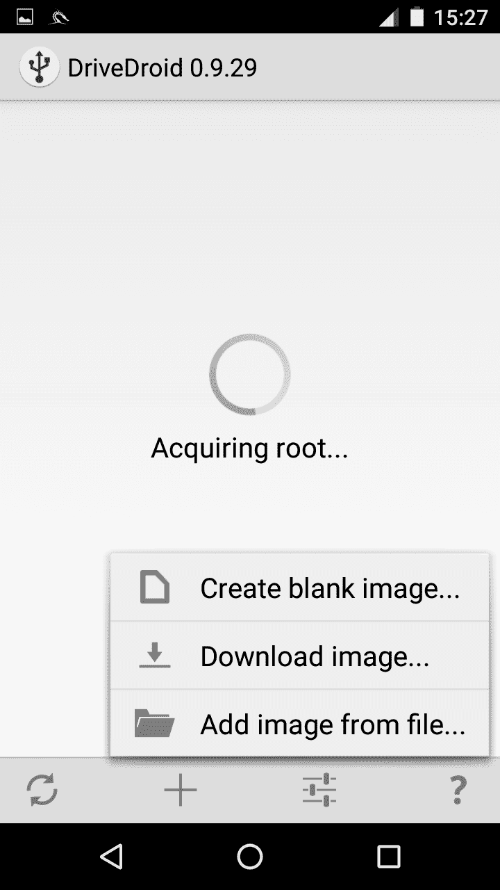

# USB 键盘

这个功能，正如其名称所示，允许使用 USB 键盘。使用此功能的能力可能取决于所使用的 Android 设备的型号。

# Shodan

Shodan 工具，通常被称为黑客的搜索引擎，也有一个适用于 NetHunter 用户的移动版本。使用 Shodan 应用程序还需要一个 API 密钥，如果您在第四章注册了帐户，您已经被分配了一个 API 密钥，*足迹和信息收集*。访问[`www.shodan.io`](http://www.shodan.io)并登录（或注册）以查看浏览器右上角的 API 密钥。在移动设备上提示时，将 API 密钥输入 Shodan 应用程序中。

一旦您获得并输入了您的代码，您可以像在浏览器中一样使用 Shodan 应用程序：

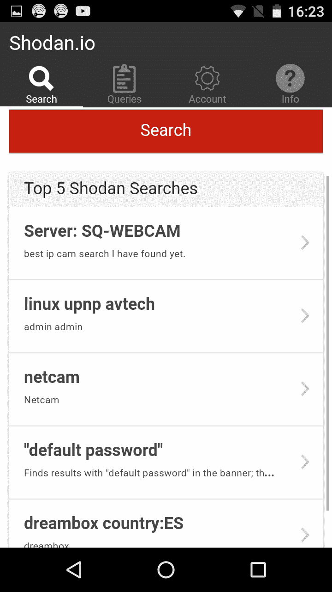

# Router Keygen

Router Keygen 是一个为支持 WEP 和 WPA 加密的路由器生成密钥的应用程序。该应用程序首先扫描 Wi-Fi 网络，以确定攻击是否受支持。


点击支持的网络会生成可能用于连接路由器和网络的密钥：


Router Keygen 也可以直接从 Google Play 商店下载，网址为[`play.google.com/store/apps/details?id=io.github.routerkeygen&hl=en_US`](https://play.google.com/store/apps/details?id=io.github.routerkeygen&hl=en_US)。

# cSploit

cSploit 应用程序允许轻松进行信息收集、会话劫持和**拒绝服务**（**DoS**）和**中间人**（**MitM**）攻击，只需轻按按钮。启动时，cSploit 首先提示用户选择目标网络。然后用户将看到几个模块，如下面的屏幕截图所示：


考虑到所有模块都可以从移动设备运行，并且可以在渗透测试人员的身上隐藏或在攻击进行时轻松隐藏，这个工具相当令人印象深刻，只要电池还能用。

# 无线攻击

使用 NetHunter 平台的一个明显优势是其体积和隐蔽性。如果您被要求测试一个站点的无线安全性，同时又想保持一定的隐蔽性，这是一个有用的优势。坐在目标位置的大厅里，打开笔记本电脑并连接外部天线可能会引起一些不必要的注意。相反，将 NetHunter 部署在 Nexus 5 手机上，并将离散的外部天线隐藏在报纸或日程安排后面，是保持低调的更好方式。NetHunter 平台在进行无线渗透测试时的另一个关键优势是能够覆盖更广泛的区域，比如校园环境，而无需携带大型笔记本电脑。

# 无线扫描

正如在上一章中讨论的那样，识别无线目标网络是无线渗透测试中的关键步骤。NetHunter 平台中包含了可以执行无线扫描和目标识别的工具。还有第三方应用程序，具有用户友好的界面，通常可以收集与可能的目标网络相同或更详细的信息。

NetHunter 包括在第十一章*,* *无线渗透测试*中讨论的 Aircrack-ng 工具套件，并且可以通过命令行以相同的方式工作。在这里，我们将打开一个命令 shell 并输入`airoddump-ng`来识别潜在的目标网络：


就像在 Kali Linux 操作系统中一样，我们能够确定 BSSID、信道和正在广播的 SSID。

# WPA/WPA2 破解

正如我们之前讨论的，Aircrack-ng 套件工具在 NetHunter 中也包含了我们在第十一章中讨论过的工具。这使我们能够执行相同的攻击，而无需修改命令或技术。此外，我们可以利用在[第十一章](https://cdp.packtpub.com/kali_linux_assuring_security_by_penetration_testing__fourth_edition/wp-admin/post.php?post=377&action=edit#post_343)中使用的相同天线，以及外部适配器。以下破解是针对我们在[第十一章](https://cdp.packtpub.com/kali_linux_assuring_security_by_penetration_testing__fourth_edition/wp-admin/post.php?post=377&action=edit#post_343)中讨论过的相同访问点和相同的 BSSID 进行的。所有这些都是通过 NetHunter 命令行完成的。

在下面的截图中，我们看到了`#airodump-ng -c 6 --bssid -w NetHunter`命令的输出：

！[](img/8f84ff58-f389-4ecd-8e81-9a8f0e11a99b.png)

Aircrack-ng 能够像 Kali Linux 版本一样抓取四路握手。正如我们在[第十一章](https://cdp.packtpub.com/kali_linux_assuring_security_by_penetration_testing__fourth_edition/wp-admin/post.php?post=377&action=edit#post_343)中讨论的那样，我们可以使用预配置的列表来反向获取密码。为了演示目的，预配置的列表很短。

`#aircrack-ng -w wifipasscode.txt -b 44:94:FC:37:10:6E NetHunter-01.cap`命令产生了以下输出：

！[](img/f8059557-81b7-471e-a80f-c069606a7198.png)

使用 NetHunter 键盘可能会在破解目标网络的密码方面有点乏味，但是可以做到。此外，这种攻击在需要坐在笔记本电脑和外部天线旁引起不必要注意的情况下是有用的。另一个有用的技术是使用 NetHunter 平台来扫描和捕获握手，然后将捕获文件传输到您的 Kali Linux 平台并在那里运行破解程序。这产生了相同的结果，同时给渗透测试人员保持隐身的能力。

# WPS 破解

在 NetHunter 键盘上输入命令可能会有点令人沮丧，NetHunter 还使用了我们在[第十一章](https://cdp.packtpub.com/kali_linux_assuring_security_by_penetration_testing__fourth_edition/wp-admin/post.php?post=377&action=edit#post_343)中讨论过的 Wifite 工具。这个工具允许我们通过简单输入一个数字来进行攻击。打开 Kali 命令 shell，输入`wifite`命令，然后按 Enter。这将产生以下输出：

！[](img/c782b594-b89e-405c-ba41-3846062f427f.png)

正如我们所看到的，NetHunter 的输出有一些细微的差异。有两个 WLAN 接口：内部无线接口和我们自己的外部天线。还有`P2P0`接口。这是 Android 操作系统的对等无线接口。然后我们通过输入数字`3`将我们的 WLAN1 接口设置为监视模式。

这产生了以下输出：

！[](img/8e9afa46-c059-4ce7-925d-0170f144a74c.png)

就像我们在[第十一章](https://cdp.packtpub.com/kali_linux_assuring_security_by_penetration_testing__fourth_edition/wp-admin/post.php?post=377&action=edit#post_343)中看到的那样，我们看到了我们之前测试过的相同网络。在我们停止扫描并输入数字`15`然后*Enter*之后，Wifite 运行了与之前相同的攻击：

！[](img/4f6ff15d-e07e-4383-afbf-dee9a1126c71.png)

从前面的截图中，我们可以看到我们已经为无线网络 Brenner 找到了相同的 WPA 和 PIN。

# 恶意 AP 攻击

**邪恶接入点**（evil AP）攻击是一种无线 MitM 攻击。在这种攻击中，我们试图让目标设备连接到我们设置的伪装成合法接入点的无线接入点。我们的目标认为这是一个合法的网络，因此连接到它。客户端的流量在转发到下游的合法接入点时被嗅探。来自合法接入点的任何流量也会通过我们设置的 AP 路由，再次我们有能力嗅探该流量。

以下图表说明了这种攻击。左边是我们目标的笔记本电脑。中间是我们的 NetHunter 平台。右边是一个连接到互联网的合法接入点。当目标连接到我们的 NetHunter 平台时，我们能够在转发到合法接入点之前嗅探流量。来自接入点的任何流量也会被嗅探，然后转发到客户端：


这只是我们过去讨论过的 MitM 攻击的一个变体。与以往不同的是，我们不需要了解客户端或他们所在网络的任何信息，因为我们将控制他们使用的网络。这是一种经常发生在使用免费无线互联网的公共区域的攻击，例如机场、咖啡店和酒店。

# Mana 邪恶 AP

在 NetHunter 平台中我们将使用的工具是**Mana Wireless Toolkit**。从 NetHunter 图标导航到 Mana Wireless Toolkit。您将被带到的第一页是`hostapd-karma.conf`屏幕。

这使我们能够配置我们的邪恶 AP 无线接入点：


首先要考虑的是您需要确保有两个可用的无线接口。Android 的无线接口，很可能是 WLAN0，需要连接到具有互联网连接的接入点。这可以由您控制，或者只是我们位置上可用的免费无线互联网。WLAN1 接口将是我们的外部天线，它将提供虚假接入点。接下来，您可以将 BSSID 配置为模仿实际接入点的 MAC 地址。此外，我们还可以配置 SSID 来广播任何接入点的标识。其他设置涉及使用 Karma 漏洞进行攻击。这是对邪恶 AP 的变体。（有关更多信息，请参见[`insights.sei.cmu.edu/cert/2015/08/instant-karma-might-still-get-you.html.`](https://insights.sei.cmu.edu/cert/2015/08/instant-karma-might-still-get-you.html.)）我们可以将这些设置保持为默认值。在这种情况下，我们将保持默认设置，导航到三个垂直点并点击开始 mana。

这将启动虚假接入点：

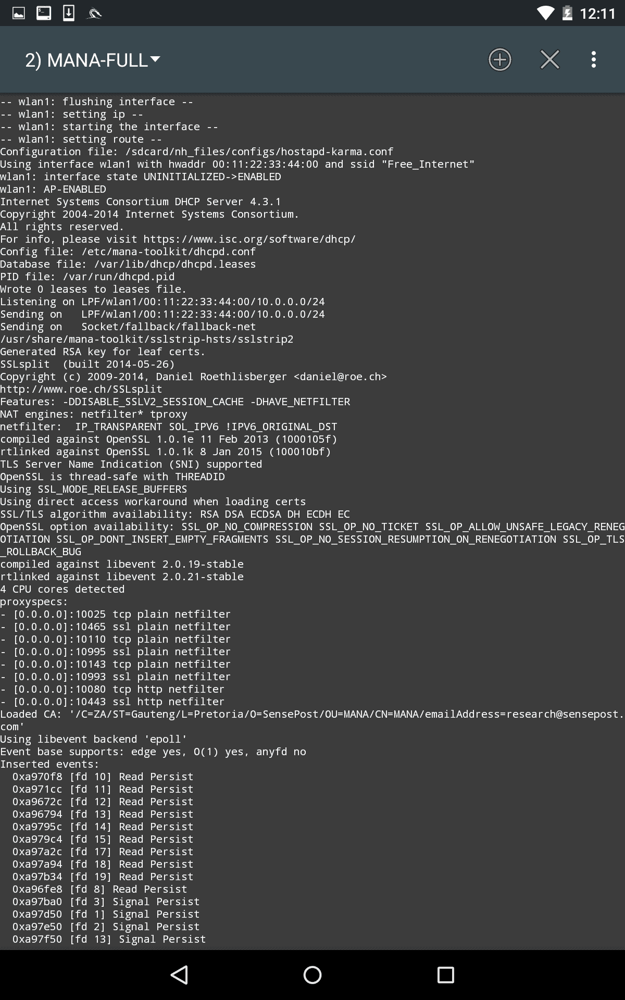

在上一张截图中，我们可以看到 Mana 邪恶 AP 清除缓存信息并设置新的接入点。如果我们切换到设备，我们可以看到无线接入点 Free_Internet。此外，我们能够无需任何身份验证即可连接：

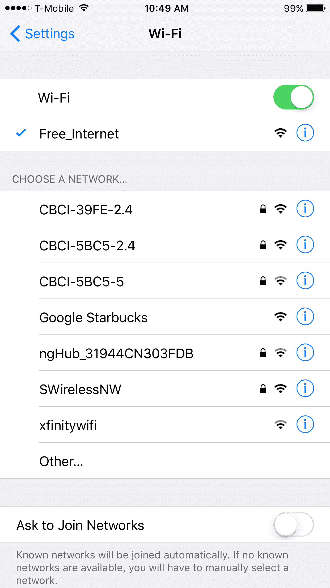

现在，在 NetHunter 平台上的另一个终端上，我们通过使用以下命令配置`tcpdump`捕获来配置我们的数据包捕获：

```
    # tcpdump -I wlan1
```

这产生了以下结果：


作为连接的设备接收和发送帧时，我们能够嗅探该流量。另一个可用的选项是以`.pcap`文件的形式捕获流量，然后将其卸载以在 Wireshark 中查看。

这是在目标组织的公共区域的有用攻击。这次攻击的另一个关键方面是，多个目标设备可以连接。但需要注意的是，如果有多个设备连接，可能会导致流量传输到目标的速度明显变慢。还有一种可以利用这个工具和一些移动设备中发现的漏洞的技术。许多移动设备会自动配置为连接到以前连接过的任何网络。这种自动连接不会查看无线接入点的 MAC 地址，而是正在广播的 SSID。在这种情况下，我们可以将我们的 Mana 邪恶 AP 称为常见的位置 SSID。当人们经过时，他们的移动设备将自动连接，并且只要它们在范围内，它们就会通过我们的设备路由其流量。

# HID 攻击

NetHunter 有几个内置工具，允许您配置 HID 攻击。在这些工具中，NetHunter 利用标准命令行来执行一系列命令。要访问 HID 攻击菜单，请单击 NetHunter，然后单击 HID Attacks。在 HID Attacks 屏幕上，我们将看到两个选项。一个是 PowerSploit 攻击，另一个是 Windows CMD 攻击。在本节中，我们将详细介绍 Windows CMD 攻击。

在这种情况下，我们将使用 NetHunter 平台并将其连接到目标机器。我们的攻击将利用 HID 漏洞来运行`ipconfig`命令，并使用`net user offsec NetHunter! / add`命令将用户`offsec`添加到系统中。

最后，我们将使用`net localgroup administrators offsec /add`命令将该用户帐户添加到本地管理员组中：

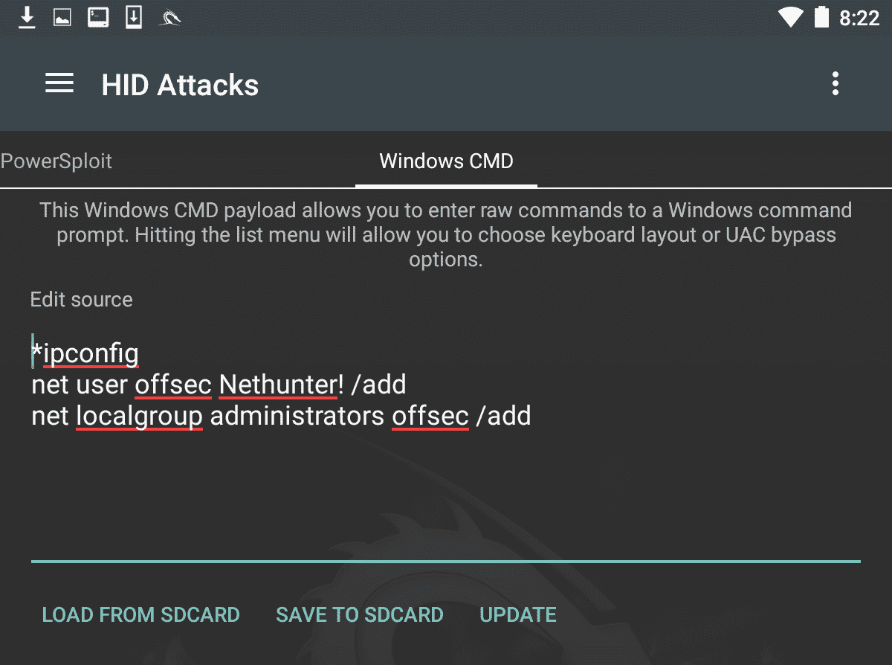

接下来，我们需要设置**用户帐户控制**（**UAC**）绕过。这允许 NetHunter 以管理员身份运行命令行。单击 UAC Bypass 以为适当的 Windows OS 进行配置：


在这种情况下，我们正在尝试针对 Windows 10 OS 的 HID 攻击，因此我们将 UAC Bypass 设置为 Windows 10：


在配置 UAC Bypass 后，将 USB 电缆插入目标机器。单击三个垂直点，然后单击执行攻击。

随着攻击的开始执行，您将看到目标机器正在打开命令提示符作为管理员的过程。然后执行在 NetHunter 中设置的命令。在这里，我们看到第一个命令`ipconfig`已经运行：

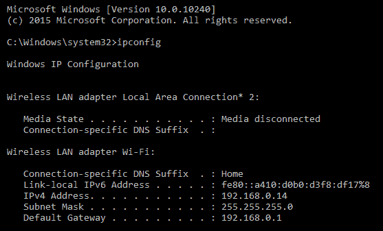

接下来，我们看到`offsec`用户已输入相关密码。用户帐户现已输入到目标计算机上的本地管理员组中：


如果您身处某个位置并观察到开放的工作站，则此攻击非常有用。您可以配置多种不同的命令，然后简单地将您的 NetHunter 平台连接到系统并执行。这可能包括使用 PowerShell 或其他脚本攻击的更复杂的攻击。

# DuckHunter HID 攻击

DuckHunter HID 攻击将 USB Rubber Ducky 脚本转换为 NetHunter HID 攻击，如前所述。可以从 Hak5 的 Darren Kitchen 的 GitHub 页面[`github.com/hak5darren`](https://github.com/hak5darren)下载 USB Rubber Ducky 脚本，并加载到 Convert 选项卡中的 NetHunter HID 工具中。

有效载荷包括（但绝对不限于）以下内容：

+   WiFi 密钥抓取器

+   具有持久性的反向 Shell

+   从活动文件系统中检索 SAM 和 SYSYTEM

+   Netcat 反向 Shell

+   OSX 本地 DNS 中毒

+   批量擦除/驱动擦除

+   Wifi 后门

# 总结

Kali NetHunter 平台在其体积方面具有很多功能。对于渗透测试人员来说，最明显的优势是，工具和技术基本上与 Kali Linux 和 NetHunter 相同，这减少了学习新工具集所需的时间，同时使渗透测试人员能够从手机或平板电脑上运行渗透测试。这使测试人员能够更接近目标组织，同时也能够模糊其一些行动。添加 HID 等攻击进一步使渗透测试人员能够执行其他工具无法完成的攻击。NetHunter 是一个非常好的平台，可以加入到您的渗透测试工具包中。

在下一章中，我们将继续讨论**PCI DSS**（**Payment Card Industry Data Security Standard**）并讨论范围、调度、分割以及执行 PCI DSS 扫描的各种工具。

# 问题

+   哪些版本的 OnePlus 和 Nexus 手机支持 Kali NetHunter？

+   NetHunter 在移动设备上需要 root 访问权限吗？

+   NetHunter 包括哪些第三方安卓应用程序？

+   Router Keygen 支持哪些类型的无线加密？

+   cSploit 应用程序的一些特点是什么？

+   MitM 无线攻击工具的名称是什么？

+   DuckHunter HID 攻击是什么？

# 进一步阅读

+   NetHunter 文档：[`github.com/offensive-security/kali-nethunter/wiki`](https://github.com/offensive-security/kali-nethunter/wiki)

+   在安卓设备上安装 NetHunter：[`www.androidauthority.com/how-to-install-kali-nethunter-android-896887/`](https://www.androidauthority.com/how-to-install-kali-nethunter-android-896887/)

+   使用 NetHunter 进行 DNS 欺骗：[`cyberarms.wordpress.com/category/nethunter-tutorial/`](https://cyberarms.wordpress.com/category/nethunter-tutorial/)
