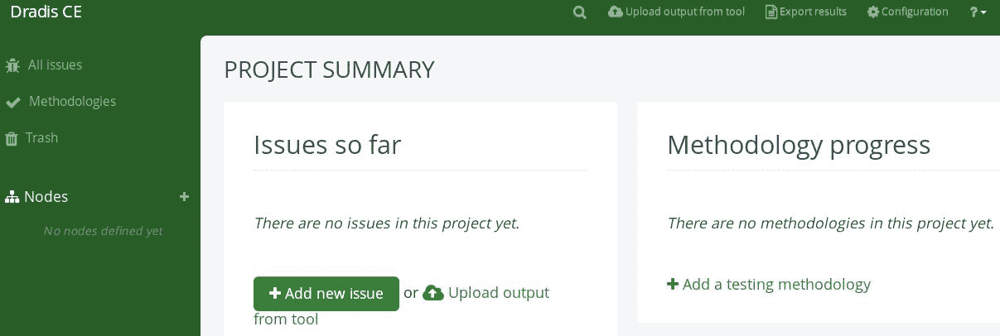
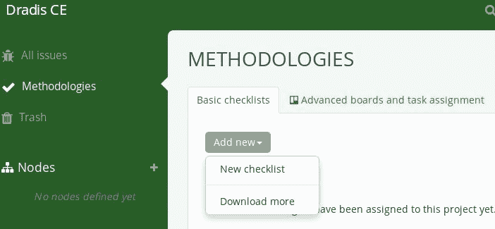
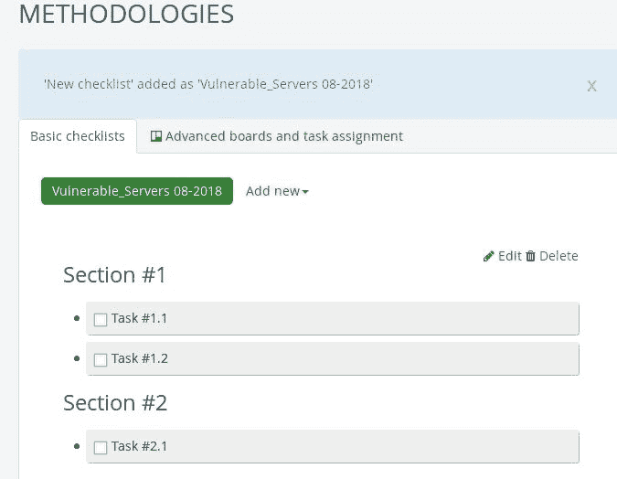
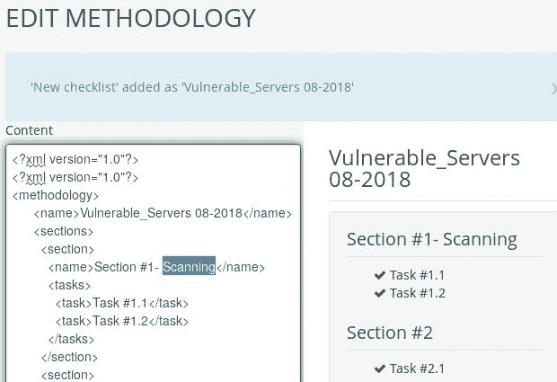
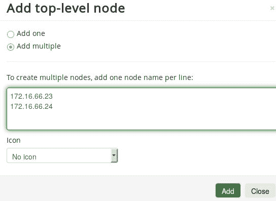
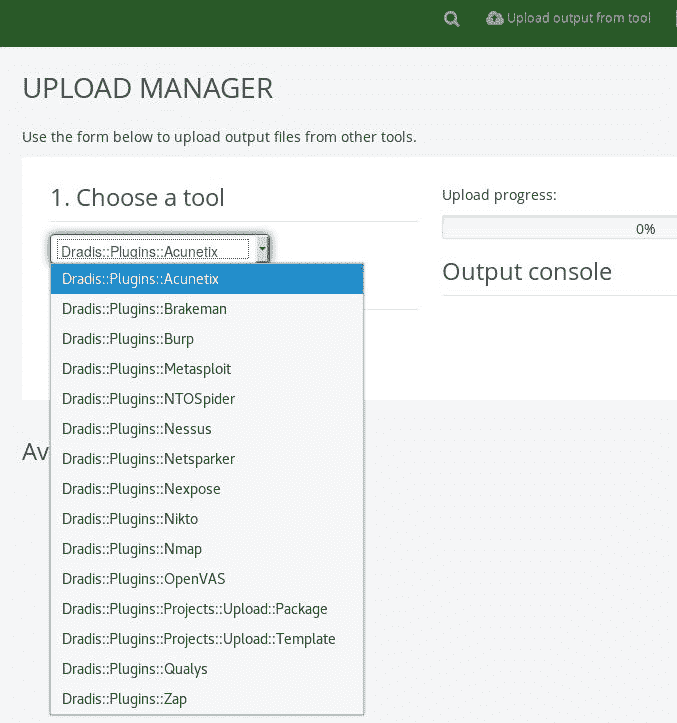
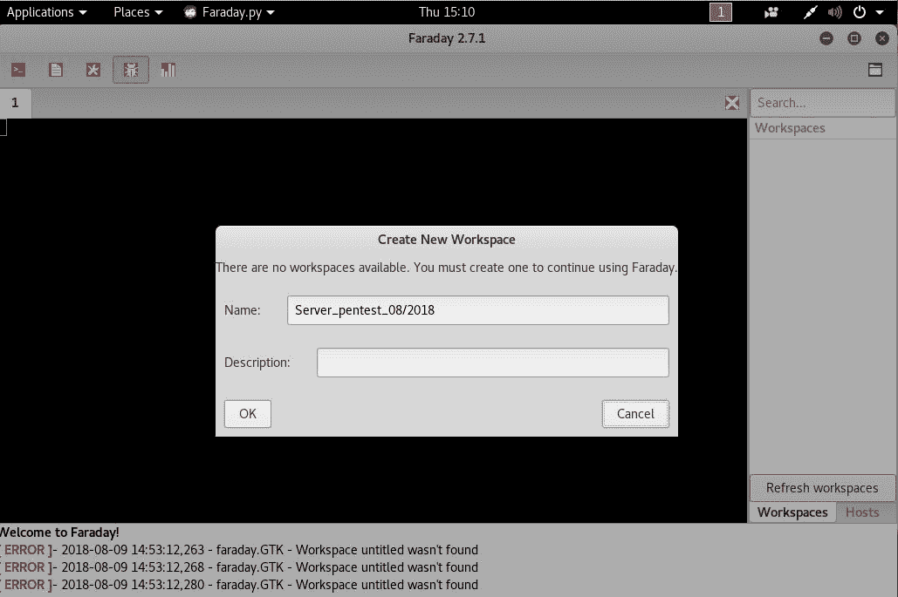
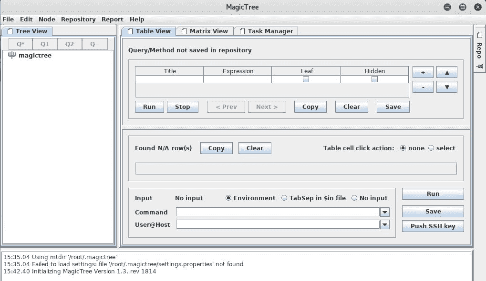

# 第十四章：渗透测试报告工具

评估跟踪和文档是专业渗透测试的关键方面。应记录测试工具的每个输入和输出，以确保在需要时可以以准确和一致的方式再现发现。请记住，渗透测试过程的一部分包括向客户呈现发现结果。这些客户很可能希望减轻漏洞，然后尝试模仿您的步骤，以确保他们的减轻措施有效。根据范围的不同，您可能需要执行额外的测试，以验证客户所做的任何改进实际上是否消除了您发现的漏洞。准确记录您的步骤将有助于确保在后续过程中进行完全相同的测试。

适当的测试文档提供了执行操作的记录，因此允许您在客户在约定的测试时间窗口内遇到非测试相关事件时追踪您的步骤。详细记录您的操作可能非常繁琐，但作为专业的渗透测试人员，您不应忽视这一步骤。

文档编制、报告准备和演示是必须以系统化、结构化和一致的方式处理的核心领域。本章提供了详细的说明，将帮助您调整文档编制和报告策略。本章将涵盖以下主题：

+   结果验证，确保只报告经过验证的发现。

+   将从执行、管理和技术角度讨论报告类型及其报告结构，以最好地反映参与渗透测试项目的相关当局的利益。

+   演示部分提供了一般提示和指南，有助于了解您的观众及其对所提供信息的接受程度。

+   测试后程序；即作为报告的一部分应包括的纠正措施和建议，以及在相关组织中为建议团队提供支持的使用。这种练习非常具有挑战性，需要对安全考虑下的目标基础设施有深入的了解。

以下各节将为准备文档、报告和演示提供坚实的基础，特别是突出它们的作用。即使是一个小错误也可能导致法律问题。您创建的报告必须与您的发现保持一致，并且不仅仅指出目标环境中发现的潜在弱点。例如，它应该准备充分，并展示对客户可能要求的已知合规要求的支持证据。此外，它应清楚地说明攻击者的作案手法、应用工具和技术，并列出发现的漏洞和经过验证的利用方法。主要是关注弱点，而不是解释用于发现它们的事实或程序。

# 技术要求

需要一台至少配备 6GB RAM、四核 CPU 和 500GB 硬盘空间的笔记本电脑或台式机。对于操作系统，我们使用 Kali Linux 2018.2 或 2018.3 作为虚拟机，或安装在硬盘、SD 卡或 USB 闪存驱动器上。

# 文档和结果验证

在大多数情况下，需要进行大量的漏洞验证，以确保您的发现实际上是可以利用的。缓解工作可能会很昂贵，因此漏洞验证对于您的声誉和诚信而言是一项关键任务。根据我们的经验，我们注意到有几种情况，人们只是运行一个工具，获取结果，然后直接呈现给他们的客户。这种不负责任和对评估的控制不足可能会导致严重后果，并导致您的职业生涯的垮台。在存在错误的情况下，甚至可能通过出售虚假的安全感来使客户处于风险之中。因此，测试数据的完整性不应受到错误和不一致性的影响。

以下是一些可能在将测试结果记录和验证成最终报告之前帮助您的程序：

+   **详细记录**：在信息收集、发现、枚举、漏洞映射、社会工程、利用、权限提升和持久访问渗透测试过程的每个步骤中都要做详细记录。

+   **记录模板**：为您从 Kali 对目标执行的每个工具制作一个记录模板。模板应清楚地说明其目的、执行选项和为目标评估对齐的配置文件，并提供空间记录相应的测试结果。在从特定工具得出最终结论之前，重复练习至少两次是至关重要的。这样，您可以对任何意外情况对结果进行认证和测试。例如，当使用 Nmap 进行端口扫描时，我们应该制定我们的模板，包括任何必要的部分，如使用目的、目标主机、执行选项和配置文件（服务检测、操作系统类型、MAC 地址、开放端口、设备类型等），并相应地记录输出结果。

+   **可靠性**：不要依赖单一工具。依赖单一工具（例如，用于信息收集）是绝对不切实际的，可能会给您的渗透测试带来不一致性。因此，我们强烈建议您使用专为类似目的而制作的不同工具进行相同的练习。这将确保验证过程的透明度，提高生产力，并减少错误的阳性和阴性。换句话说，每个工具都有其处理特定情况的专长。在适用的情况下，手动测试某些条件也是值得的，并利用您的知识和经验来验证所有报告的发现。

# 报告类型

在收集到您验证的每个测试结果后，您必须将它们合并成一个系统化和结构化的报告，然后再提交给目标利益相关者。有三种不同类型的报告；每种都有其自己的模式和布局，与参与渗透测试项目的商业实体的利益相关。报告类型如下：

+   执行报告

+   管理报告

+   技术报告

这些报告是根据接收者理解和理解渗透测试人员传达的信息的能力水平而准备的。在接下来的部分中，我们将检查每种报告类型及其报告结构，以及可能需要完成您的目标的基本元素。

重要的是要注意，所有这些报告在交给利益相关者之前都应遵守保密政策、法律通知和渗透测试协议。

# 执行报告

执行报告，一种评估报告，更短，更简洁，从业务战略的角度指出了渗透测试输出的高层视图。该报告是为目标组织的 C 级高管（CEO、CTO、CIO 等）准备的。它必须包含一些基本元素，如下所示：

+   **项目目标**：本部分定义了您与客户之间渗透测试项目的相互同意的标准。

+   **漏洞风险分类**：本部分解释了报告中使用的风险级别（关键、高、中、低和信息性）。这些级别应该清晰区分，并应强调严重程度方面的技术安全风险。

+   **执行摘要**：本部分简要描述了在定义的方法论下渗透测试任务的目的和目标。它还强调了发现和成功利用的漏洞数量。

+   **统计数据**：本部分详细介绍了在目标网络基础设施中发现的漏洞。这些也可以以饼状图或其他直观的形式呈现。

+   **风险矩阵**：本部分量化和分类了所有已确定的漏洞，确定了潜在受影响的资源，并以简略格式列出了发现、参考和建议。

在准备执行报告时，始终是一种理想的方法是创造性和表达性，并牢记您不需要反映评估结果的技术基础，而是提供从这些结果中加工出的事实信息。报告的总体大小应为两到四页。请参考本章末尾的*进一步阅读*部分，了解示例报告。

# 管理报告

管理报告通常旨在涵盖问题，包括目标安全姿态的监管和合规性测量。实际上，它应该通过一些可能对**人力资源**（**HR**）和其他管理人员感兴趣的部分，以及协助他们的法律程序来扩展执行报告。以下是可能为您提供有价值的基础，用于创建这样一个报告的关键部分：

+   **合规性达成**：这包含已知标准的列表，并将其各个部分或子部分与当前的安全状况进行映射。它应该突出显示发生的任何监管违规行为，并可能无意中暴露目标基础设施并构成严重威胁。

+   **测试方法**：这应该简要描述，并包含足够的细节，以帮助管理人员了解渗透测试生命周期。

+   **假设和限制**：这突出了可能阻止渗透测试人员达到特定目标的已知因素。

+   **变更管理**：这有时被视为纠正过程的一部分；然而，它主要针对处理受控 IT 环境中的所有变化的战略方法和程序。从安全评估中产生的建议和推荐应该与程序中的任何变化保持一致，以最小化对服务的意外事件的影响。

+   **配置管理**：这关注系统的功能操作和性能的一致性。在系统安全的背景下，它遵循可能已经引入到目标环境中的任何变化（硬件、软件、物理属性等）。这些配置变化应该受到监控和控制，以维持系统配置状态。

作为一名负责任和知识渊博的渗透测试人员，您有责任在进行渗透测试生命周期之前澄清任何管理术语。这项工作肯定涉及一对一的对话和就目标特定评估标准达成协议，比如必须评估何种合规性或标准框架，是否在遵循特定测试路径时有任何限制，建议的变更是否在目标环境中可持续，以及如果引入任何配置变更是否会影响当前系统状态。这些因素共同建立了目标环境中当前安全状态的管理视图，并根据技术安全评估提供建议和建议。

# 技术报告

技术评估报告在解决渗透测试过程中提出的安全问题方面起着非常重要的作用。这种报告通常是为想要了解目标系统处理的核心安全功能的技术人员而制定的。报告将详细说明任何漏洞，它们如何被利用，可能带来的业务影响，以及如何开发抵御任何已知威胁的抗性解决方案。它必须与全面的安全指南进行沟通，以保护网络基础设施。到目前为止，我们已经讨论了执行和管理报告的基本要素。在技术报告中，我们扩展了这些要素，并包括一些可能引起目标组织技术团队极大兴趣的特殊主题。有时，项目目标、漏洞风险分类、风险矩阵、统计数据、测试方法和假设和限制等部分也是技术报告的一部分。技术报告包括以下部分：

+   **安全问题**：在渗透测试过程中提出的安全问题应该清楚地详细列出，对于每种应用的攻击方法，您必须提到受影响资源的列表、其影响、原始请求和响应数据、模拟攻击请求和响应数据，为修复团队提供外部来源的参考，并提供专业建议来修复目标 IT 环境中发现的漏洞。

+   **漏洞地图**：提供了在目标基础设施中发现的漏洞列表，每个漏洞都应该很容易与资源标识符（例如 IP 地址和目标名称）匹配。

+   **利用地图**：提供了成功检查和验证的针对目标的利用列表。还要提到利用是私有还是公开。详细说明利用代码的来源以及它已经可用多长时间可能是有益的。

+   **最佳实践**：这强调了目标可能缺乏的任何更好的设计、实施和运行安全程序。例如，在大型企业环境中，部署边缘级安全可能有利于减少威胁数量，使其无法进入企业网络。这些解决方案非常方便，不需要与生产系统或传统代码进行技术交流。

一般来说，技术报告向相关组织成员提出了现实情况。这份报告在风险管理过程中起着重要作用，并可能被用来制定可行的修复任务。

# 网络渗透测试报告

正如有不同类型的渗透测试一样，报告结构也有不同类型。我们提供了一个基于网络的渗透测试报告的通用版本，几乎可以扩展到几乎任何其他类型的渗透测试（例如，Web 应用程序、防火墙、无线和网络）。除了以下目录外，您还需要一个封面页面，上面列出了测试公司的名称、报告类型、扫描日期、作者姓名、文档修订号以及简短的版权和保密声明。

以下是基于网络的渗透测试报告的目录：

+   法律声明

+   渗透测试协议

+   介绍

+   项目目标

+   假设和限制

+   漏洞风险等级

+   执行摘要

+   风险矩阵

+   测试方法

+   安全威胁

+   建议

+   漏洞图

+   利用图

+   合规评估

+   变更管理

+   最佳实践

+   附件

正如您所看到的，我们已将所有类型的报告合并为一个具有明确定义结构的完整报告。每个部分都可以有自己相关的子部分，可以更好地对测试结果进行分类，更详细地进行分析。例如，附件部分可以用于列出测试过程的技术细节和分析、活动日志、来自各种安全工具的原始数据、研究细节、对任何互联网来源的引用以及术语表。根据客户要求的报告类型，您有责任在开始渗透测试之前了解您的职位的重要性和价值。

# 准备您的演示

为了成功进行演示，了解您的受众的技术能力和目标是有帮助的。您需要根据受众调整材料；否则，您将面临负面反应。您的主要任务是让客户了解您测试过的领域周围的潜在风险因素。例如，高管级别的经理可能没有时间担心社会工程攻击向量的细节，但他们会对当前的安全状态以及应采取哪些整改措施来改善他们的安全状况感兴趣。

虽然没有正式的程序来创建和呈现您的发现，但您应该保持专业的态度，以使您的技术和非技术受众受益。了解目标环境及其技术人员的技能水平，并帮助他们了解您以及对组织的任何关键资产，也是您的职责的一部分。

指出当前安全状况的不足之处，并在没有情感附着的情况下暴露弱点，可以导致成功和专业的展示。记住，您在那里是为了坚持事实和发现，从技术上证明它们，并相应地向整改团队提供建议。由于这是一种面对面的练习，强烈建议您提前准备好以支持事实和数据回答任何问题。

# 测试后程序

整改措施、纠正步骤和建议都是指测试后程序。在这些程序中，您将充当目标组织的整改团队的顾问。在这个角色中，您可能需要与不同背景的技术人员互动，因此请记住，您的社交形象和人际关系技能在这里可能非常有价值。

此外，除非您接受过培训，否则不可能拥有目标 IT 环境所需的所有知识。在这种情况下，处理和纠正每个脆弱资源的每个实例而不得到专家网络的支持是非常具有挑战性的。我们制定了几条通用指南，可以帮助您向客户推送关键建议：

+   重新审视网络设计，并检查报告中指出的脆弱资源的可利用条件。

+   集中精力在边缘级或数据中心保护方案上，以减少在后端服务器和工作站同时受到攻击之前发生的安全威胁的数量。

+   客户端或社会工程攻击几乎是不可能抵抗的，但可以通过培训员工使用最新的对策和意识来减少。 

+   根据渗透测试人员提供的建议，减轻系统安全问题可能需要进行额外的调查，以确保对系统的任何更改不会影响其功能特性。

+   在必要时部署经过验证和可信赖的第三方解决方案（IDS/IPS、防火墙、内容保护系统、防病毒软件、IAM 技术等），并调整引擎以安全高效地工作。

+   使用分而治之的方法，将安全网络区域与目标基础设施上的不安全或面向公众的实体分开。

+   加强开发人员编写目标 IT 环境中安全应用程序的技能。评估应用程序安全性并执行代码审计可以为组织带来有价值的回报。

+   采用物理安全对策。采用多层入口策略，包括安全的环境设计、机械和电子门禁、入侵警报、闭路电视监控和人员识别。

+   定期更新所有必要的安全系统，以确保其保密性、完整性和可用性。

+   检查和验证所有记录的解决方案，作为建议提供，以消除入侵或利用的可能性。

# 使用 Dradis 框架进行渗透测试报告

Dradis 框架是一个用户友好的报告框架，也支持协作。使用多种工具进行测试和评估可能非常令人兴奋；然而，当涉及组织文档时，这可能会变得有点令人不知所措，考虑到报告中需要包含输出文件以及输出文件的屏幕截图，以及评估期间使用的命令，这些也必须记录。 Dradis 框架通过提供易于使用的界面来协助这一领域，支持许多工具的插件，额外的合规性指南，并且可以轻松定制检查表。

可以通过单击应用程序，然后单击 12-Reporting Tools，然后单击 Dradis 框架，在 Kali 菜单中找到 Dradis 框架。

Dradis 也可以通过在终端中键入`dradis`来直接启动：

前面两种方法都会在浏览器中打开 Dradis Web 界面，URL 为`127.0.0.1:3000/setup`。输入将由所有访问服务器的人使用的密码，然后单击创建共享密码并继续。

接下来，输入用户名和密码，然后点击让我进来！这将带我们到 Dradis CE（社区版）仪表板。 Dradis CE 允许用户创建作为方法论的检查表。您可以通过单击 Methodologies（在左窗格上），或者在主窗口的 Methodology progress 部分下单击+Add a testing methodology 来执行此操作：

Dradis 给用户提供了两种选择，要么创建一个新的方法论，要么在其他合规包之间进行选择（必须下载）。如果您希望为您的方法论使用特定模板，而不是创建一个新的模板，可以选择“下载更多”选项，该选项将引导用户转到合规包页面（[`dradisframework.com/academy/industry/compliance/`](https://dradisframework.com/academy/industry/compliance/)），其中包括以下内容：

+   HIPAA 合规审计工具

+   **Offensive Security Certified Professional** (**OSCP**) 报告

+   OWASP 测试指南 v4

+   PTES 技术指南

要为您的方法论创建一个检查表，请选择“新检查表”选项：

给新的检查表命名，然后单击“添加到项目”。这将创建一个未填充的检查表，其中包含两个部分标题，以便我们开始：

要编辑部分和任务，请单击“编辑”按钮并编辑 XML 内容。例如，我在第 1 部分区域中添加了“扫描”。编辑完成后，滚动到 XML 文件底部，然后单击“更新方法论”：

在左窗格中，单击“节点”以添加 Dradis CE 将创建报告的设备。如果使用多个节点，请输入节点的 IP（每行一个），然后单击“完成”：

在左窗格的“注释”部分下单击各个 IP 后，将打开节点摘要仪表板。在这里，您可以添加证据、注释，甚至根据需要添加子节点，如下面的屏幕截图所示：

Dradis 还通过插件能够处理来自各种工具的输出，包括 Acunetix、Burp、Metasploit、Nessus、Nikto、OpenVas 等，用于报告。单击仪表板顶部的“从工具上传输出”。选择一个工具，然后选择要上传到 Dradis 的文件，如下所示：

要完成报告，请单击仪表板顶部的“导出结果”。报告可以生成为 CSV 和 HTML 格式，以及自定义的 Word 和 Excel 报告。选择一个模板，然后单击“导出”以生成您的文件，如下所示：

# 渗透测试报告工具

Dradis 并不是 Kali Linux 2018 中唯一可用的工具。单击“应用程序”，然后单击“报告工具”，我们可以看到其他可用的工具，例如 Faraday IDE，MagicTree 和 pipal：

# Faraday IDE

Faraday IDE 是另一个旨在支持协作的工具，其中包含大约 40 个内置工具用于生成报告。支持的插件包括 Metasploit、Nmap 和 Nessus。Faraday IDE 提出了多用户渗透测试的概念，在这种环境中，它的功能与在终端中单独运行工具完全相同。

要启动 Faraday IDE，请单击“应用程序”，然后单击“Faraday”。加载界面后，为您的工作区命名以开始使用该应用程序，如下所示：

有关安装和使用 Faraday IDE 的更多信息，请访问[`github.com/infobyte/faraday/wiki`](https://github.com/infobyte/faraday/wiki)。

# MagicTree

MagicTree 是 Kali Linux 中的另一个工具，用于生成和管理报告。Nmap 用户可能会发现这个工具特别有趣，因为它允许用户直接从应用程序中运行 Nmap 扫描。可以通过单击“应用程序”，然后单击“报告工具”来启动 MagicTree。该工具应该看起来像下面的屏幕截图：

有关使用 MagicTree 的更多信息，请访问[`www.gremwell.com/using_magictree_quick_intro`](https://www.gremwell.com/using_magictree_quick_intro)。

# 总结

在本章中，我们探讨了创建渗透测试报告所需的一些基本步骤，并讨论了在客户面前进行演示的核心方面。起初，我们充分解释了如何记录来自各个工具的结果的方法，并建议您不要仅依赖单个工具来获得最终结果。因此，在记录结果之前，您的经验和知识在验证测试结果时至关重要。确保保持您的技能更新并足以在需要时手动验证发现。

然后，我们研究了报告工具，主要关注了 Dradis Framework，同时涉及了 Faraday IDE 和 MagicTree。我们鼓励您尝试它们，因为您可能希望将这些工具结合起来进行各种目的和合作。

最后，我们希望您喜欢这本书，并祝愿您在网络安全和渗透测试的冒险中一切顺利。

# 问题

1.  向客户呈现的渗透测试报告有哪三种主要类型？

1.  在执行报告中，风险矩阵量化了什么？

1.  漏洞地图的目的是什么？

1.  利用地图的目的是什么？

1.  测试方法论应包含什么？

1.  如何减少客户端或社会工程攻击？

# 进一步阅读

+   样本渗透测试报告：[`www.offensive-security.com/reports/sample-penetration-testing-report.pdf`](https://www.offensive-security.com/reports/sample-penetration-testing-report.pdf)

+   撰写渗透测试报告的提示：[`www.sans.org/reading-room/whitepapers/bestprac/writing-penetration-testing-report-33343`](https://www.sans.org/reading-room/whitepapers/bestprac/writing-penetration-testing-report-33343)

+   Nessus 样本报告：[`www.tenable.com/products/nessus/sample-reports`](https://www.tenable.com/products/nessus/sample-reports)

+   技术渗透测试报告样本：[`tbgsecurity.com/wordpress/wp-content/uploads/2016/11/Sample-Penetration-Test-Report.pdf`](https://tbgsecurity.com/wordpress/wp-content/uploads/2016/11/Sample-Penetration-Test-Report.pdf)
