# 第二章：磨刀

一个工匠只有他的工具那么好，而工具需要设置和维护。由于您已经有了对您感兴趣的 Kali Linux 发行版的想法，本章将帮助您设置和配置平台的个人版本。Kali Linux 是多才多艺的，可以用于多种用途。

当您首次决定使用 Kali Linux 时，您可能还没有考虑到各种常见和不常见的用途。本章向您介绍了最适合您的 Windows 渗透测试要求的工具，我们用来确保测试结果准备和呈现正确的文档工具，以及您需要操作这些工具的 Linux 服务的详细信息。许多书籍，包括 Wolf Halton 撰写的有关渗透测试的第一本书，将其章节按照 Kali 安全桌面中的子菜单顺序排列。我们发现这不够直观。我们将所有设置放在开头，以减少第一次使用 Kali 用户的困惑，并且因为某些事情，例如文档工具，必须在您开始使用其他工具之前理解。本章标题为*磨刀*的原因是因为一个劣质的工匠，或者一个经验不足的黑客，总是责怪他的工具，而一个熟练的工匠会花更多时间准备工具，以便他们的工作更快进行。

在 Kali Gnome3 桌面菜单中，有一个名为**收藏夹**的子菜单，在您第一次运行时，这些工具将是 Kali Linux 的创建者认为对于工作中的安全分析师来说最不可或缺的武器。在本章中，安装和设置后，我们将向您展示我们最常使用的工具。这些可能成为您的收藏夹。以下屏幕截图显示了默认的收藏夹菜单。默认值如下：

+   **Firefox ESR**：Web 浏览器

+   **终端**：Bash 终端仿真器

+   **文件**：类似于 Windows 资源管理器的文件管理器.exe

+   **metasploit framework**：利用框架的黄金标准

+   **armitage**：Metasploit 的图形用户界面前端

+   **burpsuite**：Web 应用攻击代理

+   **beef xss framework**：跨站脚本工具

+   **faraday IDE**：支持 70 多种工具的多用户渗透测试环境，包括 Metasploit、Burpsuite、终端等

+   **Leafpad**：文本编辑应用程序

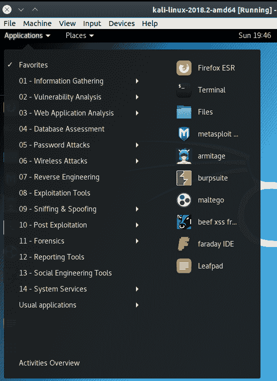

Kali Linux 上的许多系统服务与基于 Debian 平台的 Ubuntu 和其他 Linux 服务器上的服务相同，但由于有使用客户端/服务器模型的安全工具，因此需要提前启动一些服务才能成功运行测试。

在本章中，我们将学习以下主题

+   将 Kali Linux 安装到加密的 USB 驱动器上

+   从 Live DVD 上运行 Kali

+   安装和配置应用程序

+   设置和配置 OpenVAS

+   报告测试

+   在 Kali Linux 上运行服务

# 技术要求

+   您选择的 Kali 发行版（Gnome、KDE、LXDE 或 MATE）

+   一个至少 16GB 大小的空白 USB 驱动器。

+   具有手动引导选项的笔记本电脑或工作站

# 将 Kali Linux 安装到加密的 USB 驱动器上

像大多数有 IT 部门的组织中发现的那样安全的网络环境对安全工程师提出了一些挑战。公司可能有一个特定的批准应用程序列表。防病毒应用程序通常是从中央位置管理的。安全工具通常被错误地归类为邪恶的黑客工具或恶意软件包。许多公司对在公司计算硬件上安装任何不是 Microsoft Windows 的操作系统都有防御性规定。

为了增加挑战，他们禁止在公司网络上使用非公司资产。您将发现的主要问题是，针对 Windows 编写的经济实惠的渗透测试工具非常少，而少数有 Windows 版本的工具，如**Metasploit**，往往会与较低级别的操作系统功能发生冲突。由于大多数公司笔记本电脑必须在系统上运行反病毒软件，因此您必须在 Metasploit 的目录上进行一些严重的例外处理。反病毒软件将隔离所有病毒和随 Metasploit 一起提供的工具。此外，本地入侵保护软件和本地防火墙规则会引起问题。这些操作系统功能和安全附加组件旨在防止黑客攻击，而这正是您准备要做的事情。

支付卡行业数字安全标准（PCI DSS 3.2.1）要求处理付款数据的任何 Windows 机器或与处理付款数据的任何机器在同一网络上的机器都应该打补丁，运行防火墙，并在其上安装反病毒软件。此外，许多公司的 IT 安全政策规定，任何终端用户都不能在没有处罚的情况下禁用反病毒保护。

将 Windows 机器用作您的渗透测试机器的另一个问题是，您可能会不时地进行外部测试。为了进行适当的外部测试，测试机器必须连接到公共互联网。将 Windows 机器悬挂在公共网络上，并关闭所有安全应用程序是不明智的。这样的配置可能在将其连接到互联网后的 20 分钟内就会被感染蠕虫。

那么答案是什么呢？一个加密的可启动 USB 驱动器，加载了 Kali Linux。在 Kali 的安装屏幕上，有一个选项可以将 Kali 安装到一个带有所谓**持久性**的 USB 驱动器上。这使您能够将 Kali 安装到 USB 驱动器上，并且可以将文件保存到 USB 中，但该驱动器没有加密。通过在 Linux 机器上挂载 USB 驱动器，您的文件就可以被获取。这对于尝试 Kali 来说是可以的，但您不希望真正的测试数据漂浮在一个 USB 驱动器上。通过对 USB 驱动器进行正常的全面安装，可以在磁盘上使用全磁盘加密。如果 USB 被入侵或丢失，数据仍然是安全的。

在本章中，我们将把 Kali 安装到一个 64GB 的 U 盘上。您可以使用更小的 U 盘，但请记住您将从测试中收集数据，即使在一个小型网络上，这也可能会产生大量数据。我们几乎每天都在进行测试，所以我们使用了一个 1TB 的 USB 3.0 驱动器。64GB 的驱动器对于大多数测试来说是一个不错的大小。

# 安装的先决条件

在本章中，您将需要一个 64GB 的 U 盘，一个刻录了 Kali 的 DVD 和一台具有 DVD 播放器和 USB 启动功能的机器。您可以在[`www.kali.org/downloads/`](https://www.kali.org/downloads/)下载 Kali，并查找下载您想要的版本的链接。以下截图显示了下载页面的一部分：


由于我们在第一章中向您展示了几种 Kali 的发行版，*选择您的发行版*，以下截图显示了当您一次下载所有可用的 Kali Linux ISO 文件时会发生什么。

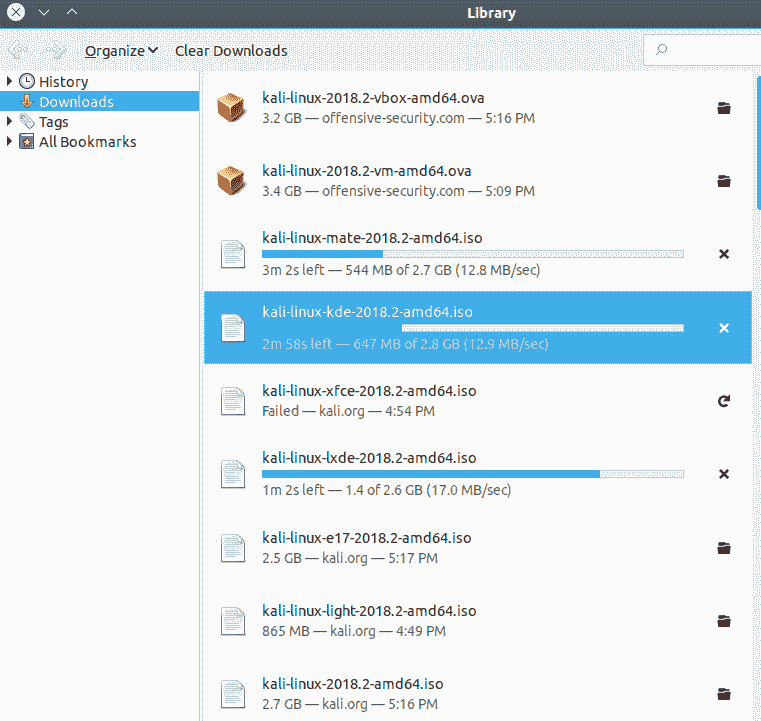

# 启动

准备好后，将 DVD 和 U 盘插入您的机器。

确保在启动机器之前插入 U 盘。您希望机器在启动时看到 U 盘，这样安装程序在安装过程中就能看到它。

现在启动机器，您将看到以下屏幕。从菜单中选择图形安装。

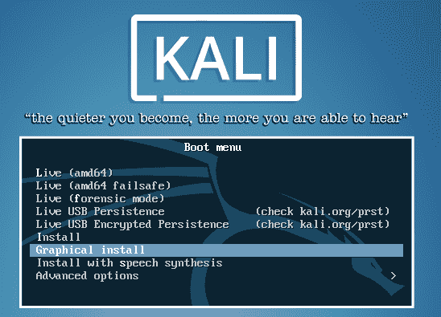

如果选择第六行的安装命令，还可以使用文本安装程序进行安装。

# 配置安装

如果您曾经安装过任何 Linux 发行版，安装的第一部分应该看起来非常熟悉。您将看到一系列用于设置国家、语言和键盘的屏幕。为您的地区和选择的语言设置这些。通常安装程序会自动发现键盘，您可以单击所选的键盘。在美国，默认选择是标准英语和标准键盘映射。进行适当的更改，然后在每个页面上单击“继续”按钮。

在进行这些配置之后，您将获得以下窗口以提供**主机名**。给它一个独特的名称，而不是默认的名称。这在以后使用保存的数据和截图时会很有帮助。如果有几个人使用 Kali，而所有机器都被命名为 Kali，那么数据来自哪里可能会让人感到困惑。


下一个截图要求输入域名。使用您或您公司控制的真实域名。不要使用虚假的域名，如`.local`或`.localdomain`。如果您在互联网上做生意，或者是一名学生并希望成为一名安全专业人员，请使用一个合适的域名。这样可以更容易地跟踪路由和跟踪数据包。域名很便宜。如果域名属于您的雇主，而您不能只使用他们的域名，请请求一个子域，比如`testing.mycompany.com`。


在下一个窗口中，您将被要求提供 root 密码。给它一个*强大*的密码。密码越长越复杂，越好。请记住，经过几次测试，您的网络密钥将存储在这台设备上。与大多数计算机操作不同，在渗透测试期间，您将使用 root 帐户，而不是普通用户帐户。您需要能够打开和关闭端口，并完全控制网络堆栈。

标准的 Kali 安装不会给您添加标准用户的机会。如果您在笔记本电脑上安装 Kali，并且除了测试之外还使用这台笔记本电脑进行其他事情，请创建一个标准用户并赋予它`sudoer`权限。您永远不希望养成使用您的`root`帐户来浏览互联网和发送电子邮件的习惯。

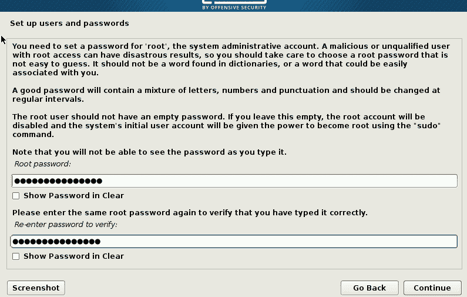

接下来，您将被要求选择您的时区。根据地图上的位置或下拉菜单设置，或选择您的 UTC 偏移。Kali Linux 上的许多工具会输出时间戳，这些时间戳是您所做的事情的法律证据，以及您所说的时间。 

# 设置驱动器

下一步是设置驱动器，对其进行加密，并对其进行分区。下一个对话框将要求您选择此安装的分区类型。

1.  选择引导-使用整个磁盘并设置加密的 LVM。这将完全加密整个驱动器，而不仅仅是加密`/home`目录。

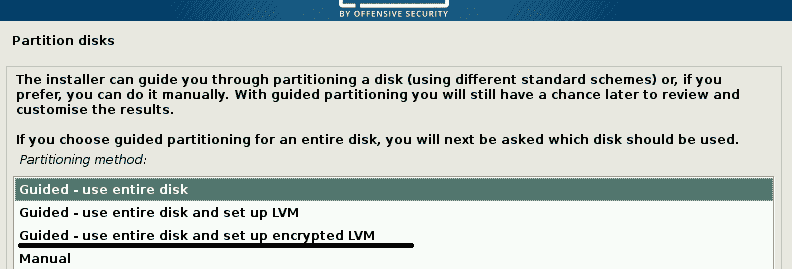

在下一个窗口中，您将被要求选择要安装 Kali Linux 的磁盘。

警告。小心选择 USB 驱动器而不是本地驱动器。如果选择本地驱动器，将会擦除该驱动器上的操作系统。注意：在接下来的窗口中，您可以看到 USB 驱动器和 VMware 虚拟磁盘。虚拟磁盘是用于此演示的虚拟机的硬盘。

1.  选择 USB 驱动器并单击“继续”。


1.  在下一个窗口中，您将被要求如何对驱动器进行分区。选择默认选项并单击“继续”。

接下来，您将被要求保存分区信息，并开始分区过程。

当您单击“继续”时，磁盘上的所有数据都将丢失。单击“是”，然后单击“继续”。

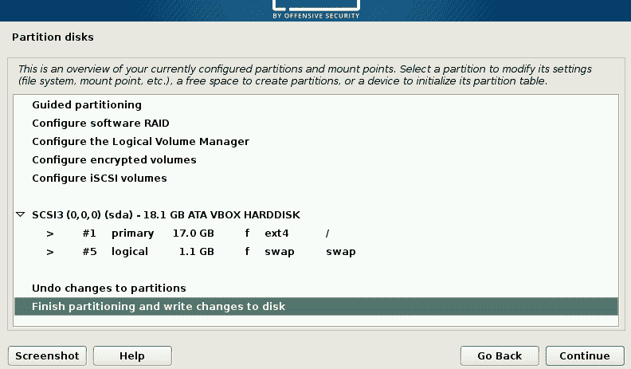

这将启动磁盘加密和分区过程。首先，驱动器将被完全擦除和加密。这将需要一些时间。喝杯咖啡，或者更好的是，出去散散步。1TB 驱动器需要大约 30 小时才能加密。64GB 驱动器需要大约 30 分钟。

在下一个窗口中，您将被要求为驱动加密创建一个密码。您在启动 Kali 时将使用此密码。请注意术语**密码**。

使用一些长而易于记忆的东西：一首歌的一行歌词或一句诗或引用！越长越好！*玛丽有一只小羊，牵着它去了城里*。即使这个短语中没有数字，John the Ripper 也需要一个多月的时间才能破解。

接下来，您将被要求确认这些更改。选择**完成分区并将更改写入磁盘**，然后点击**继续**。

现在系统将开始分区过程。

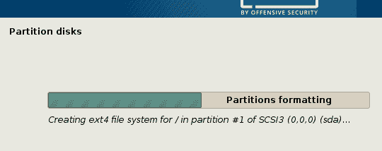

分区过程完成后，系统安装将开始。USB 是一个慢协议，甚至与 ATA 硬盘相比，所以现在是暖茶的时候了。


接下来，您将被问及是否要使用网络镜像。在这上点击**是**！这将选择靠近您位置的存储库镜像，并在以后更新系统时加快更新速度。

您的安装过程现在将完成，并且将要求您重新启动系统。在重新启动之前，请务必删除安装光盘。

# 启动您的新安装的 Kali

现在我们准备启动 Kali。将 Kali USB 驱动器插入计算机并启动。在启动过程开始时，您将有能力手动选择启动驱动器。具体的按键将取决于您的计算机类型和制造商。无论您的计算机使用什么过程，您将得到一个可用启动驱动器的菜单。选择 USB 驱动器并继续。系统启动时，将出现一个要求输入密码的屏幕。这是您在安装过程中选择的密码。这不是 root 登录密码。输入密码并按*Enter*键。

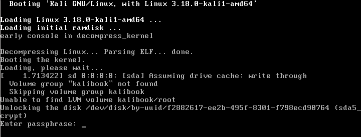

这将从现在未加密的驱动器启动系统的实际启动过程。一旦系统启动，您将看到以下登录屏幕。以下屏幕是您安装 Kali Linux 的 e17 版本后看到的。 

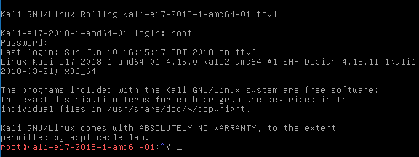

在 e17 版本中，您可以使用 root 凭据登录到终端模拟器屏幕，然后输入`startx`打开 GUI。

以下屏幕截图是您安装标准 Gnome3 版本后看到的。

在标准的 Gnome3 GUI 安装中，您将看到一个**GUI 桌面管理器**（**GDM**）登录截图如下：

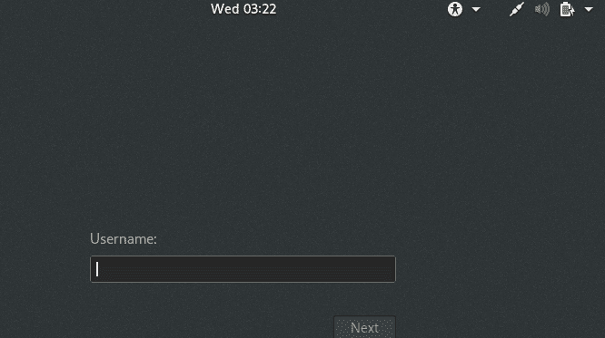

**黑客技巧**：

在我们继续之前，我们建议您只在您已经获得授权测试的系统上使用这些工具，或者您个人拥有的系统上使用这些工具。在未经授权测试的计算机上使用这些工具是违反各种联邦和州法律的。当您被抓到时，您将被监禁。黑客的判决往往是非常长的。

获取公司接收的测试豁免的个人副本，以允许他们测试客户的网络和系统。此文档应包含测试的日期和时间以及要测试的 IP 地址和/或网络。这是您测试的范围。这个文档是您的*免于监禁的牌*。没有这个文档不要进行测试。

现在说完了，让我们登录并继续设置。以下屏幕截图显示了 Gnome3 桌面。

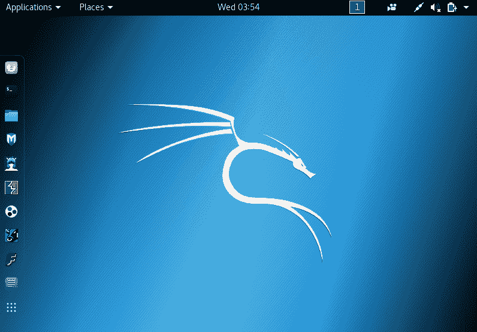

第一次登录时，请检查一切是否都是最新的。由于这是一个滚动发行版，几乎总会有一些更新。有几种方法可以进入终端仿真器：

1.  通过单击左上角的应用程序菜单栏中的终端窗口。转到应用程序|常用应用程序|系统工具|终端。

1.  在相同的应用程序菜单中，转到应用程序|收藏夹|终端。

1.  您可能会注意到收藏夹菜单也显示为桌面左侧的按钮栏。单击终端按钮。

1.  在裸机安装（而不是虚拟机安装）中，您可以按*Alt* + *F2*打开运行对话框，然后键入`gnome-terminal`。

任何一种方法都应该打开终端或命令行窗口。键入以下内容：

```
root@kalibook :~#  apt-get update  
```

这将刷新更新列表并检查新的更新。接下来，运行：

```
root@kalibook :~#  apt-get -y upgrade  
```

这将作为`-y`自动回答升级的升级过程。系统将升级所有应用程序。如有必要，重新启动。

# 从 Live DVD 运行 Kali

从 Live Disk 运行 Kali Linux 最适合进行取证或恢复任务。Live Disk 不会向计算机的硬盘写入任何内容。某些工具，例如**OpenVAS**，根本无法工作，因为它们必须进行配置并且文件更新必须保存。您无法从 DVD 上执行此操作。

要从 DVD 运行 Kali，只需将光盘放入您正在测试的机器中并从中启动。您将看到以下屏幕。这是您在本章的前一节中选择图形安装程序的屏幕。我们现在将讨论选项。请注意，从 DVD 启动现场有几个选项。

+   从第一个选项启动将加载具有工作网络堆栈的 Kali。您可以使用此选项通过网络运行许多工具。此模式的最佳用途之一是恢复死机的机器。在操作系统驱动器死机后，它可能允许您恢复崩溃的机器。无论您对 fsck 和其他磁盘实用程序做了什么，它都不会自行恢复。如果您从现场 DVD 启动，然后运行 fsck，很可能可以使驱动器恢复到足够的状态以从中复制数据。然后，您可以使用 Kali 将数据从驱动器复制到网络上的另一台机器。

+   从第二个选项启动将启动 Kali，没有运行的服务和没有网络堆栈。当系统真的出现问题时，这个选项很好。也许它被闪电击中，网络接口卡受损。您可以在此模式下执行上述操作并将数据复制到已挂载的 USB 驱动器中。

+   第三个选项是取证模式。使用此选项启动时，它会尽量不触及机器本身。不会启动任何驱动器，并且与正常启动不同，内存不会完全刷新。这允许您捕获上次启动的旧内存，并允许您对任何驱动器进行取证复制，而实际上不触及数据。您没有工作的网络堆栈或运行的服务。

+   从第四和第五个选项启动需要您将 Kali 安装到 USB 驱动器上并从 USB 驱动器运行它。当您从 USB 启动时，您将看到相同的屏幕，但您将选择其中一个选项。有关带持久性选项的 USB，请参阅列出的链接（[`kali.org/prst`](http://kali.org/prst)）以获取出色的教程。

+   如果您熟悉 Linux 命令行，您可能需要第六个选项。这是**Debian Ncurses**安装程序。它具有图形安装程序的所有功能，但缺少图形安装程序的现代外观。您还可以使用此安装程序以选项完全安装到加密的 USB。步骤都是一样的。

+   **图形安装**用于直接安装到硬盘，并且，如我们的演示所示，您还可以使用它来对 USB 或闪存驱动器进行完全安装。

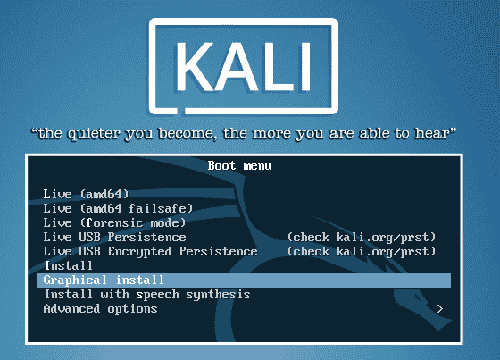

# 安装和配置应用程序

大多数你需要的东西都预装在 Kali 上。如果您在特定领域使用 Kali，Kali 在[`tools.kali.org/kali-metapackages`](https://tools.kali.org/kali-metapackages)页面提供了特定类别工具的列表，如下截图所示：

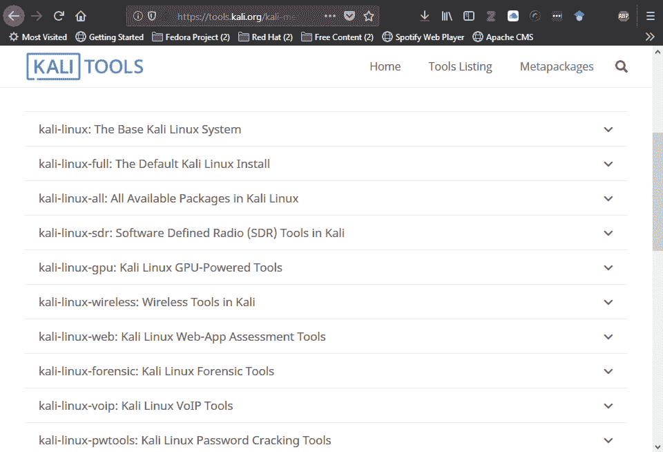

这是一个有用的数据源，但它可能会让你的生活变得有点复杂，因为它会迫使你做出选择。我们发现了一些有用的应用程序，这些应用程序在基本安装中没有加载。我们还将设置和配置 OpenVAS，用作我们的漏洞扫描器。

# Gedit- Gnome 文本编辑器

Kali 默认的文本编辑器是**Leafpad**。这是一个非常轻量级的文本编辑器。Kali 的桌面是基于 Gnome 的，Gnome 文本编辑器**Gedit**是一个更好的编辑器。安装：

```
root@kalibook :~#  apt -y install gedit  
```

安装完成后，您将在常用应用程序|附件下找到它。

# Geany-跨平台代码 IDE

Geany 是 Wolf 最喜欢的文本编辑器/集成开发环境。它具有很强的字符串编辑能力，以及自动代码标签闭合和高亮功能。最后，它可以在从 Kali 到 Windows 的任何平台上运行。拥有一个在您接触的所有平台上都能够运行的编辑器，可以节省时间。来自 Geany 项目网站（[`www.geany.org/Main/About`](https://www.geany.org/Main/About)）的一些其他功能如下：

+   构建系统来编译和执行您的代码

+   代码折叠

+   代码导航

+   构建完成/片段

+   符号名称自动完成

+   支持的文件类型包括 C、Java、PHP、HTML、Python、Perl 等

+   符号列表

+   简单的项目管理

+   插件接口

安装：

```
root@kalibook :~#  apt -y install geany  
```

安装完成后，您将在常用应用程序|编程下找到它。

以下截图显示了 Geany 在 Kali Linux 上的实现。请注意代码高亮和包含的终端以显示输出。

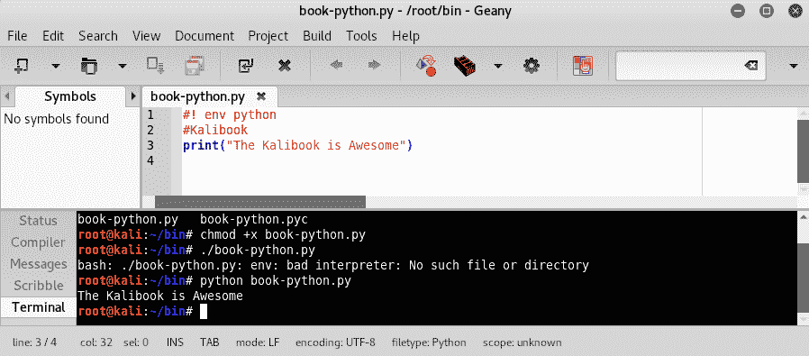

# Terminator-多任务终端仿真器

这是 Bo 最喜欢的终端应用程序。您可以将屏幕分成几个窗口。当同时运行多个 SSH 会话时，这将成为一个很大的帮助。它还具有广播功能，您可以同时在所有窗口中运行相同的字符串。以下是来自终结者网站（[`gnometerminator.blogspot.com/p/introduction.html`](https://gnometerminator.blogspot.com/p/introduction.html)）的一些主要功能：

+   将终端排列成网格

+   标签

+   拖放重新排序终端

+   键盘快捷键

+   GUI 首选项编辑器，可让您保存多个布局和配置文件

安装：

```
    root@kalibook :~#  apt -y install terminator

```

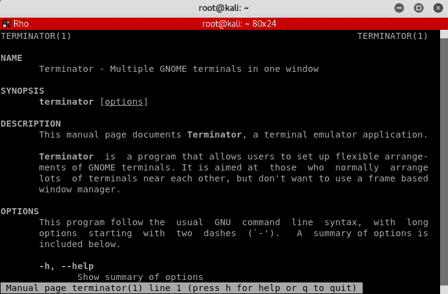

# Etherape-图形协议分析工具

这是一个很棒的视觉被动/主动网络嗅探工具。它非常适用于嗅探 Wi-Fi 网络。它会显示服务运行的位置，还可以显示用户正在进行可疑的比特流下载等行为，这些行为在大多数公司网络上都是不被允许的。

安装：

```
root@kalibook :~#  apt -y install etherape 
```

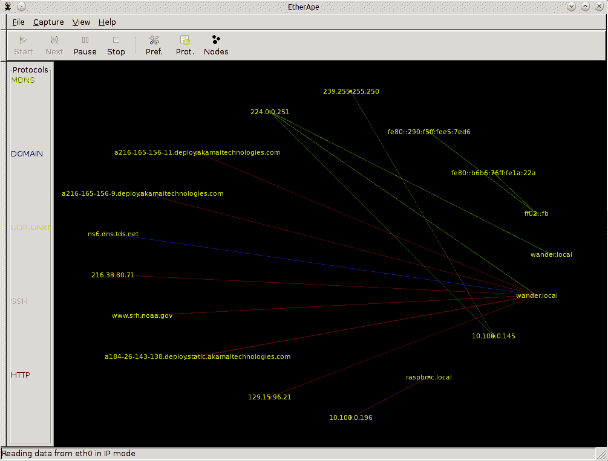

# 设置和配置 OpenVAS

侦察就是一切，因此一个好的漏洞扫描器是必不可少的。Kali 以前是预装了 OpenVAS 的。现在你必须安装 OpenVAS。

安装：

```
root@kalibook :~#  apt -y install openvas  
```

在使用之前必须进行配置和更新。幸运的是，Kali 带有一个有用的脚本来设置这一点。这可以在应用程序|漏洞分析|openvas 初始设置下找到。单击这个将打开一个终端窗口并为您运行脚本。这将为 SSL 设置自签名证书并下载最新的漏洞文件和相关数据。它还将为系统上的管理员帐户生成一个密码。

确保保存此密码；您将需要它进行登录。您可以在第一次登录后更改它。

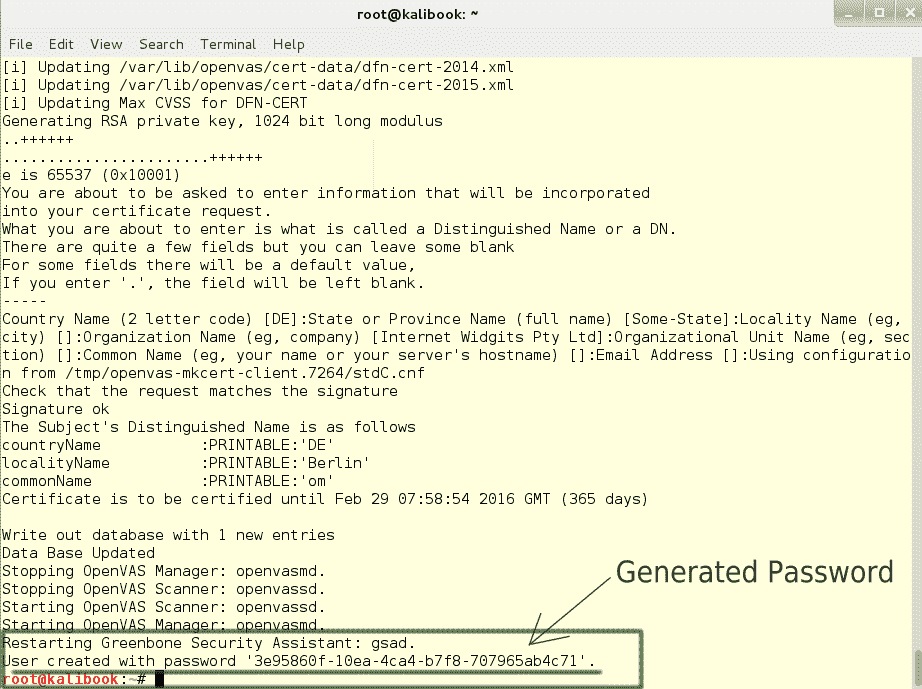

Kali 还配备了一个设置脚本，用于检查服务和配置。如果出现问题，它将提供有关问题的帮助信息。此脚本可以在应用程序 | 系统服务 | openvas check setup 中找到。

单击此按钮，将打开一个终端窗口并运行脚本。


脚本结果如下截图所示：

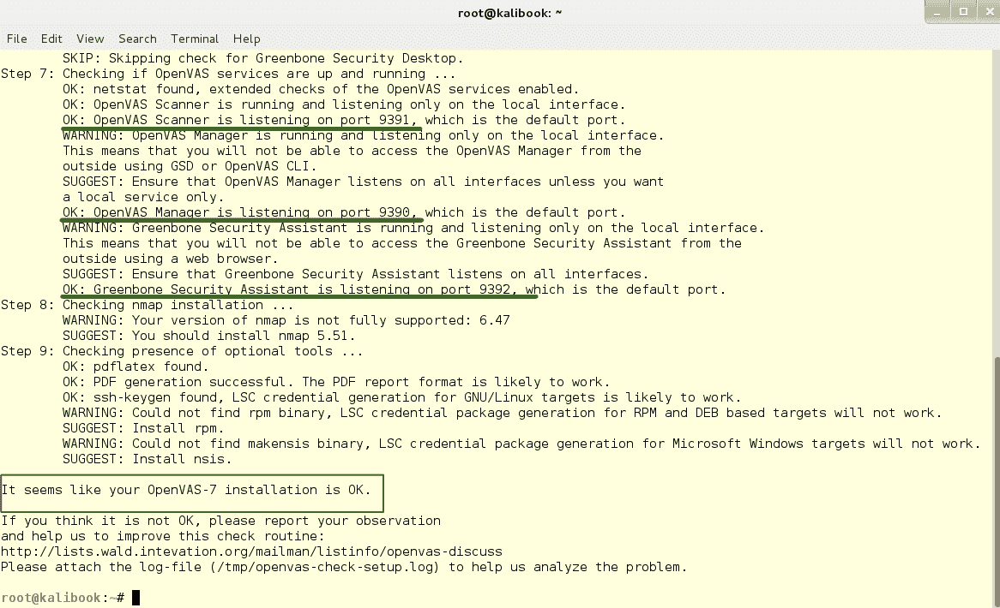

请注意，此检查显示服务的运行端口。检查显示警告，表明这些服务仅在本地接口上运行。这对您的工作来说是可以接受的。在某些时候，您可能会发现将 OpenVAS 服务器运行在其他机器上以提高扫描速度是有用的。

接下来，我们将登录到 Greenbone web 界面，检查 Openvas。

1.  打开浏览器，转到`https://localhost:9392`。您将看到一个自签名证书的安全警告；接受它，您将看到一个登录屏幕，如下所示：

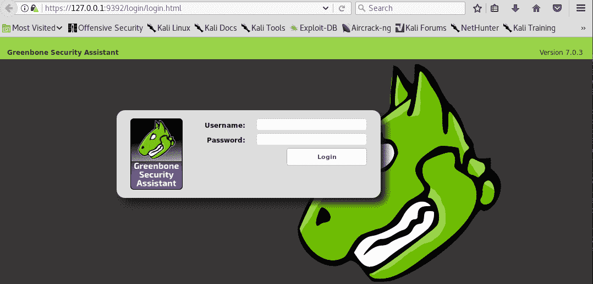

1.  您将使用用户名`admin`和在设置期间生成的非常长且复杂的密码登录。别担心，一旦登录，我们就会更改密码。登录后，您将看到以下页面。

1.  现在转到 Administration | Users 选项卡，如下所示：

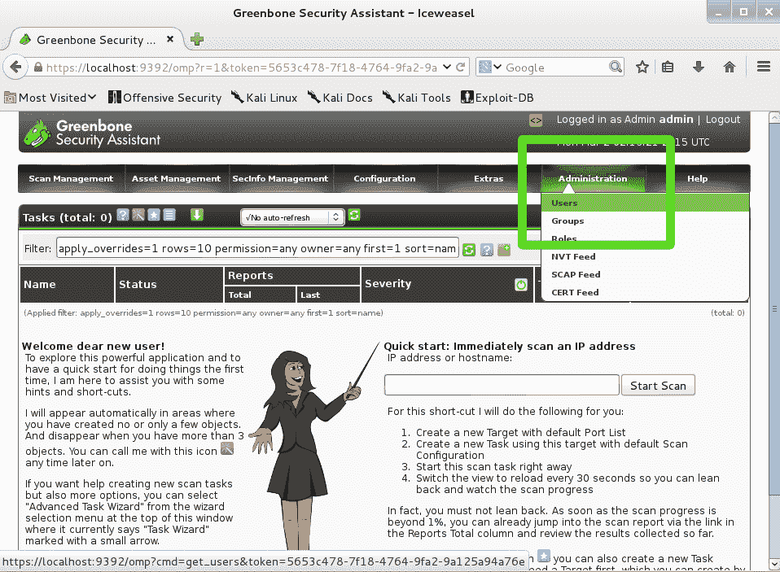

这将带您到用户管理页面。

1.  单击名称`admin`旁边的扳手链接；这将打开管理员用户的编辑页面。

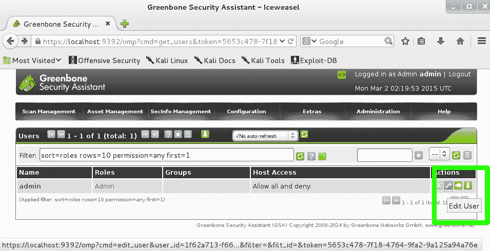

1.  将使用现有值的单选按钮更改为空字段；添加新密码并单击保存按钮。

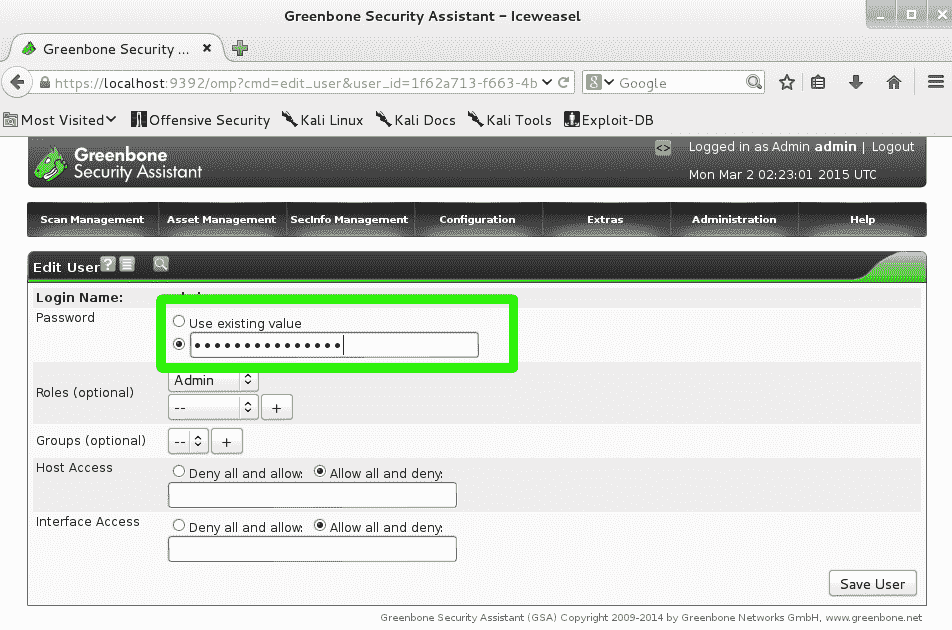

我们现在已经完成了 OpenVAS 的设置，并准备做一些真正的工作。

# 报告测试

清晰的文档有助于报告您的工作。我们使用两种文档工具来保持文档的组织：

+   KeepNote

+   Dradis

文档组织者不仅仅是一个被吹捧的文本编辑器或弱的文字处理器。正确的文档需要有组织的文件结构。当然，Windows 安全分析师可以创建一个让他们在 Kali Linux 中组织文档的文件夹结构，就像他们在 Windows 工作站上一样。文档组织应用程序内置了这些功能，并且使用它们可以减少丢失或意外递归文件夹的机会。更容易跟踪您的调查文档。您还可以为目录结构创建模板，以便您可以标准化结构，这也会让您的工作更容易。

# KeepNote - 独立文档组织者

**KeepNote**是一个更简单的工具，如果您是独自工作，它就足够了。要找到 KeepNote，打开应用程序菜单，然后点击应用程序 | 常用应用程序 | 办公 | KeepNote。下面的截图显示了一个类似于记录短测试的 KeepNote 设置。

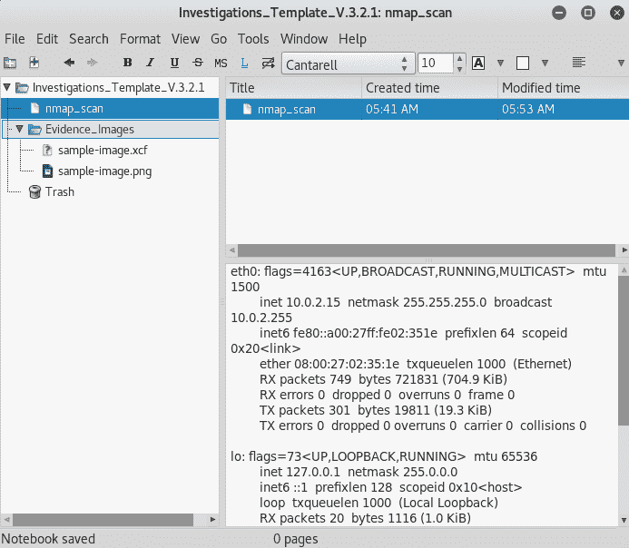

**黑客笔记**：

要编辑图像，如前面的截图所示，打开终端并键入：

`**root@kalibook: ~# apt install gimp**`

`**然后将图像从您的工作图像目录拖到 keepnote 目录中。**`

# Dradis - 基于 Web 的文档组织者

**Dradis**是一个 Web 应用程序，可用于与团队共享文档。Dradis 的默认 URL 是`https://127.0.0.1:3004`。该应用程序可以托管在远程安全服务器上，这是 Dradis 的最佳功能。以下截图来自[`dradisframework.org`](http://dradisframework.org)。

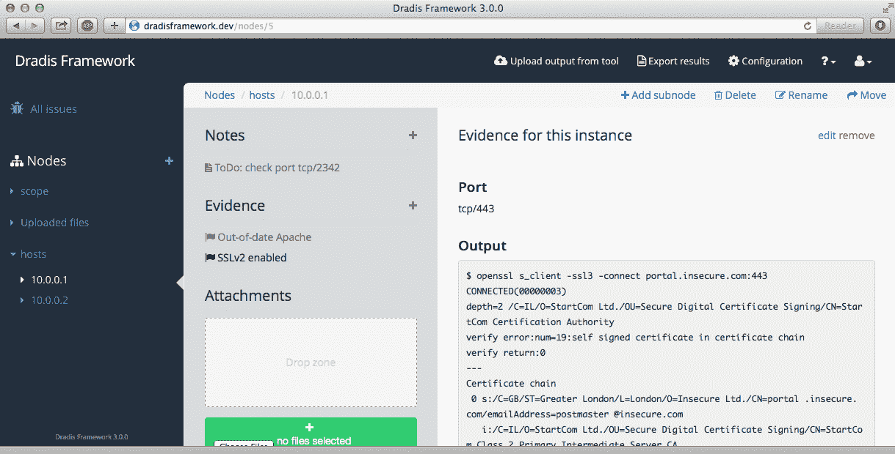

# 在 Kali Linux 上运行的服务

当您需要时，您会希望启动几个服务。在 Windows 和 Linux 中，服务的一般用途是在计算机启动时启动它们。除非出现问题，大多数管理员很少花时间管理服务。在 Kali 系统中，您倾向于在实际进行安全分析任务时关闭工作站，并且您肯定不希望您在工作站上拥有的安全工具，如 OpenVAS 或 Metasploit，可以通过互联网访问。这意味着您会在需要时启动它们，并在不使用它们时关闭它们。

您可以从应用程序菜单—应用程序|系统服务中找到启动和停止 Kali 服务的命令

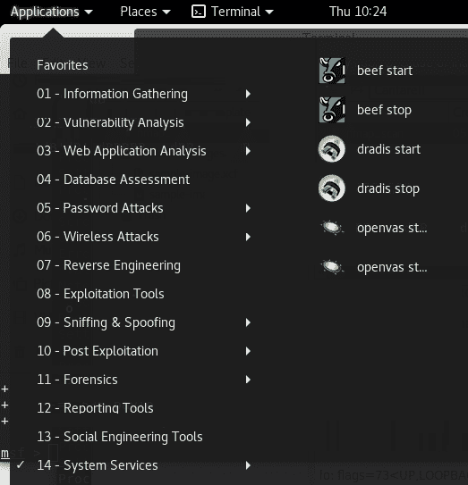

另一种处理服务的方法是在命令行上使用`systemctl`。例如，考虑 HTTP（Apache2）。有几个服务选项：

+   **开始**: 这将启动 Apache web 服务器并显示**进程 ID**（**PID**）*.*

+   **状态**: 显示服务器的状态。它是启动的吗？它是关闭的吗？它卡住了吗？

+   **重新启动**: 将服务器关闭并在不同的 PID 上重新启动。如果服务器卡住或者您已更改服务器依赖的网络进程，请使用此选项。

+   **重新加载**: 重新读取配置。当您对配置进行轻微更改时，请使用此选项。

+   **停止**: 关闭 web 服务器。

以下屏幕截图显示了对 apache2 web 服务器进行状态请求的`apache2ctl`和`systemctl`的比较。可能可以写一本关于强大的`systemctl`命令的整本书。


# 总结

本章向您展示了两种设置 Kali Linux 的方法，以便您可以使用公司发放的 Windows 笔记本电脑或任何其他笔记本电脑，以便更好地发挥 Kali Linux 的性能，而不必为 Kali 专门购置新设备。大多数企业不允许您在计算机上进行双重启动，并且在虚拟机上运行 Kali 会限制 Kali 安装的资源。此外，本章向您展示了我们使用的两种报告工具，以及每种工具最合适的情况。我们向您展示了如何首次设置 OpenVAS。我们还向您展示了如何在 Kali Linux 上运行服务。
