# 第三章：信息收集和漏洞评估

有一个误解，认为所有的 Windows 系统都很容易受到攻击。这并不完全正确。几乎任何 Windows 系统都可以加固到需要花费太长时间才能利用其漏洞的程度。在本章中，你将学习如何对你的 Windows 网络进行足迹识别，并在坏人之前发现漏洞。

你还将学习调查和映射你的 Windows 网络，找到易受攻击的 Windows 系统。在某些情况下，这将增加你对前 10 个安全工具的了解；在其他情况下，我们将向你展示全新的工具来处理这类调查。

我们将在本章中涵盖以下主题：

+   对网络进行足迹识别

+   Nmap 命令选项的注释列表

+   使用 OpenVAS

+   使用 Maltego

+   使用 KeepNote

# 技术要求

要跟着本章进行学习，你需要以下内容：

+   运行的 Kali Linux 版本

+   一些需要扫描的网络上的 Windows 主机

# 对网络进行足迹识别

没有一张好地图，你就无法找到路。在本章中，我们将学习如何收集网络信息并评估网络上的漏洞。在黑客世界中，这被称为**足迹识别**。这是任何正当的黑客行动的第一步。这是你将节省时间和大量头痛的地方。

没有对目标进行足迹识别，你只是在盲目射击。任何优秀的渗透测试人员工具箱中最重要的工具是你的**心态**。你必须有狙击手的心态。你要了解你的目标习惯和行为。你要了解目标所在网络的流量流向。你要找到目标的弱点，然后攻击这些弱点。搜索和摧毁！

为了进行良好的足迹识别，你必须使用 Kali 提供的几个工具。每个工具都有其优势，并从不同角度观察目标。对目标的多个视角，可以制定更好的攻击计划。

足迹识别将根据你的目标是外部公共网络上的还是内部局域网上的而有所不同。我们将涵盖这两个方面。

对公共网络上的机器进行扫描和使用这些工具，如果你没有书面许可访问，那就是一种联邦犯罪。

在这本书中，对于大多数 Kali Linux 实例，我们将使用专门为本书构建的在**VMware**和**Oracle VirtualBox**上运行的虚拟机。我们日常使用的 Kali 实例都经过了相当大的定制，涵盖这些定制需要整本书的篇幅。对于外部网络，我们将使用互联网上的几台实时服务器。

请尊重并不要攻击这些地址，其中两个是 Bo 的个人服务器，还有几个在亚特兰大云技术服务器集群中。

请再次阅读前面的说明，并记住你没有我们的许可攻击这些机器。*如果你做不到，就不要犯罪*。

# Nmap

谈论网络就不能不谈**Nmap**。Nmap 是网络管理员的瑞士军刀。它不仅是一个很好的足迹识别工具，也是任何系统管理员都可以拥有的最好和最便宜的网络分析工具。它真的是网络分析的瑞士军刀：

+   这是一个检查单个服务器端口是否正常运行的好工具

+   它可以心跳 ping 整个网络段或网络上的几台主机

+   它甚至可以在 ICMP（ping）被关闭时发现机器

+   它可以用来压力测试服务。如果机器在负载下冻结，就需要修理

Nmap 是由 Gordon Lyon 于 1997 年创建的，他在互联网上使用 Fyodor 这个名号。Fyodor 仍在维护 Nmap，并可以从[`insecure.org`](http://insecure.org/)下载。您还可以在该网站上订购他关于 Nmap 的书。这是一本很棒的书。物有所值！Fyodor 和 Nmap 黑客已经在该网站上收集了大量信息和安全电子邮件列表。由于您正在运行 Kali Linux，您已经安装了完整的 Nmap！

以下是针对 Kali Linux 实例运行 Nmap 的示例：

1.  从顶部栏的图标或单击菜单链接打开终端：应用程序 | 附件 | 终端。如果您愿意，也可以选择 Root 终端，但由于您已经以 Root 身份登录，您不会看到任何区别。

1.  在命令提示符中键入`nmap -A 10.0.0.4`。（您需要输入要测试的机器的 IP。）

1.  输出显示了 1,000 个常用端口中的开放端口。在这个例子中，没有开放端口，所以为了使其更有趣，可以执行以下操作。

1.  通过输入`/etc/init.d/apache2 start`来启动内置的 Web 服务器。

1.  启动 Web 服务器后，再次运行 Nmap 命令，如下：`nmap -A 10.0.0.4`。

1.  如您所见，Nmap 正在尝试发现操作系统并告诉 Web 服务器版本：

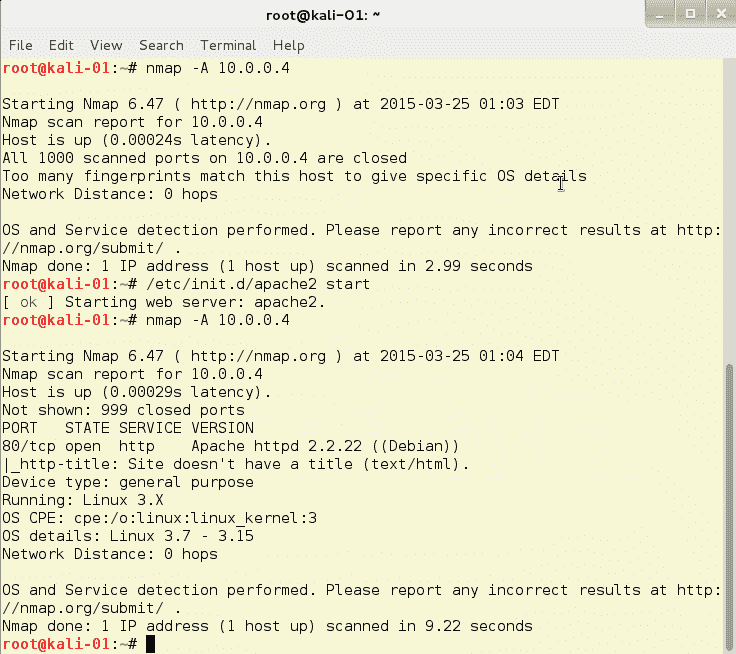

以下是在 Git Bash 应用程序中运行 Nmap 的示例，该应用程序允许您在 Windows 桌面上运行 Linux 命令。此视图显示了 Nmap 的一个很好的功能。如果您感到无聊或焦虑，并认为系统扫描时间太长，您可以按下箭头键，它将打印出一个状态行，告诉您扫描完成的百分比。这与告诉您扫描还剩多少时间不同，但它确实让您了解已经完成了多少工作：


Nmap 也作为 Windows 可安装应用程序提供给您的 Windows 机器。如果您是网络或系统管理员，您会发现这是一个很好的工具，不仅用于足迹识别，还用于系统和网络故障排除。对于其他系统，您可以在[`nmap.org/download.html`](https://nmap.org/download.html)找到 Nmap 安装程序。

# Zenmap

Nmap 附带一个名为**Zenmap**的图形用户界面。Zenmap 是 Nmap 应用程序的友好图形界面。您可以在 Kali Linux | 信息收集 | 网络扫描仪 | Zenmap 下找到 Zenmap。界面如下所示：


Zenmap 的一个很酷的功能是，当您使用按钮设置扫描时，应用程序还会写出命令行版本的命令，这将帮助您学习在命令行模式下使用 Nmap 的命令行标志。

黑客提示：

大多数黑客在 Linux **命令行界面**（**CLI**）上非常熟悉。您希望在命令行上学习 Nmap 命令，因为您可以在自动化的 bash 脚本中使用 Nmap，并创建 cron 作业以使常规扫描变得更简单。您可以设置一个 cron 作业在非高峰时段运行测试，当网络较为安静时，您的测试对网络的合法用户影响较小。

强烈扫描选项会生成一个命令行`nmap -T4 -A -v`：

+   这将产生一个快速扫描；`T`代表时间（从 1 到 5），默认时间是`-T3`。时间越快，测试越粗糙，如果网络正在运行**入侵检测系统**（**IDS**），则越有可能被检测到。

+   进行深度端口扫描，包括操作系统识别和尝试查找监听端口的应用程序以及这些应用程序的版本。`-A`代表全部。

+   最后，`-v`代表冗长。`-vv`表示非常冗长。

在下面，我们看到一个下拉框中列出了最常见的扫描方式：

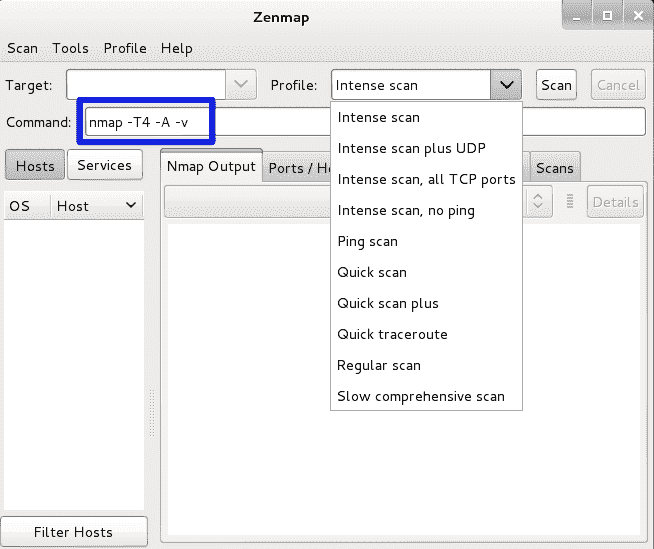

# 冗长性的差异

下面的三个截图展示了冗长在 OS 扫描中的差异。OS 扫描包括隐形扫描，因此`nmap -O hostname`和`nmap -sS -O hostname`是完全相同的。

通过点击拓扑标签，然后点击主机查看器按钮，您可以得到一个主机的好列表。通过点击地址，您可以看到每个主机的详细信息。请注意，地址是不同的颜色。Nmap 为您挑出了最容易的目标。绿色表示安全，而黄色和红色表示有漏洞或服务，可能会被利用。

这里的冗长版本已经稍作调整，以适应截图中的所有细节。当将`-v`或`-vv`选项添加到搜索字符串时，不同的扫描选项会有不同的增强内容。当您选择一些可能的目标时，使用`-v`或`-vv`是有意义的。


# 扫描网络范围


如果网络关闭了 ICMP，尝试对机器进行 ping 测试会花费很长时间。几乎和对目标机器的 UDP 端口进行 ping 测试一样长。对于任何一种情况，每台机器大约需要 75 秒每个端口。在第一种情况下，这意味着对六台机器进行 ping 测试需要 450 秒才能失败。UDP 搜索测试每台机器的端口要多得多。在标准 UDP 端口扫描中测试了 1,000 个端口，你将需要大约 21 小时才能测试 UDP。如果没有一个真正好的理由使用 Nmap 检查 UDP 端口，这不是一种具有成本效益的做法。

Zenmap 还具有一个用于比较扫描结果的很好的功能。您可以在菜单栏中找到它，路径是 Tools | Compare Results。在下面的截图中，您将看到我们对网络运行了两次扫描。当我们比较这两次扫描时，我们可以看到在第二次扫描中发现了一台新机器。在第一次扫描的结果中，它标记为红色，并显示`192.168.202.131`为关闭。当它是绿色时，它显示为开启，并显示了开放的端口和系统信息。

在下一个截图中，我们在冗长标志中添加了另一个`v`(`-vv`)并重新运行了扫描。正如我们所看到的，关于系统和扫描的更多信息被输出。

如果您有一个大型网络，只想找到 Windows 机器，以便专注于 Windows 漏洞，您可以使用以下命令运行快速扫描：`nmap -T4 -F 10.0.0.0/24`。或者，您可以选择快速扫描 Plus，输入`nmap -sV -T4 -O -F -version-light 10.0.0.0/24`。这将让您对哪些机器真正感兴趣有一个很好的了解。看起来`10.0.0.12`是一台 Windows 机器，因为五个开放端口中有四个是与 Windows 相关的。

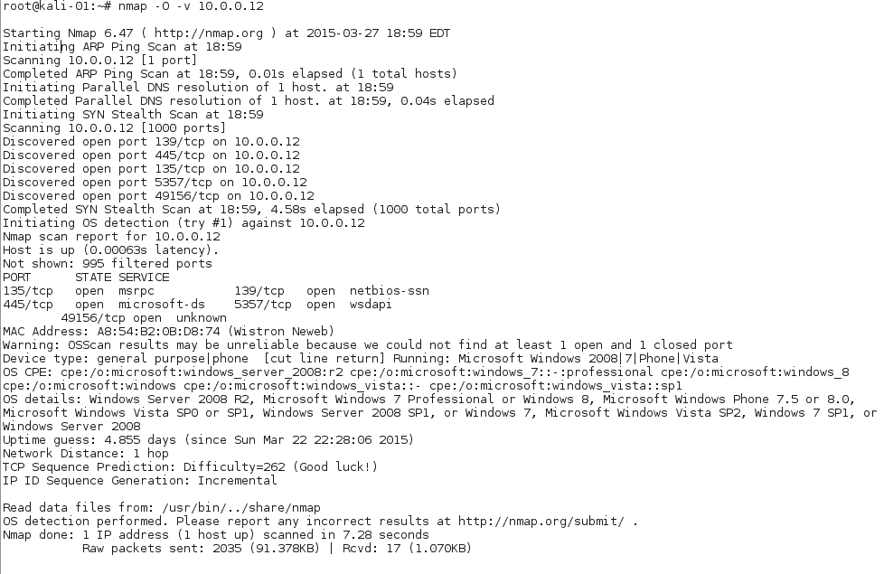

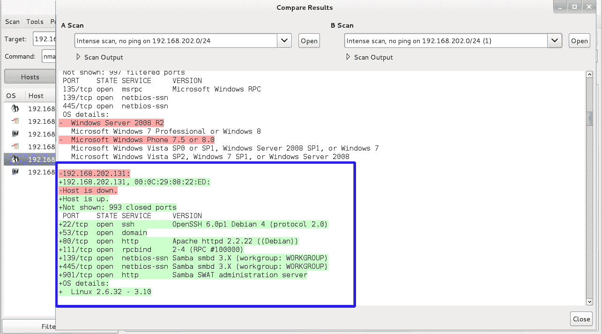

以下截图是从命令行运行 Nmap 的结果。正如您之前看到的，Nmap 已经移植到了 Windows。如果您的公司允许，Nmap 可以通过命令行在 Windows 系统上运行，可以在命令窗口或通过 Windows PowerShell 运行。

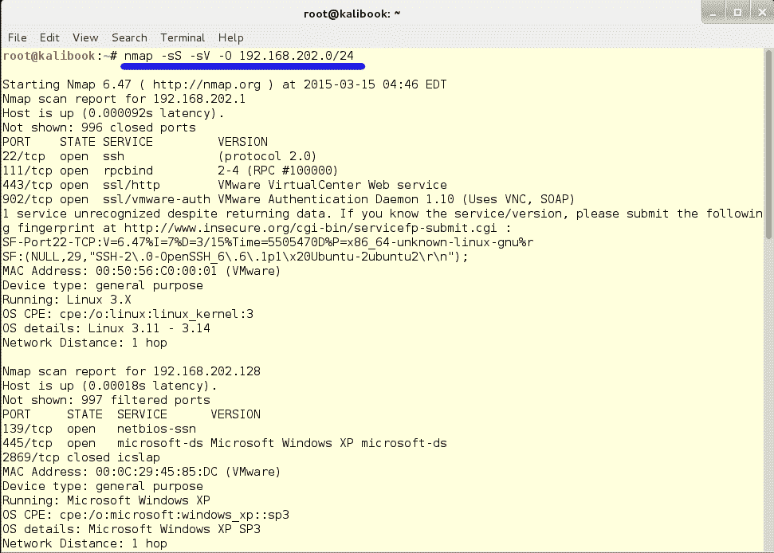


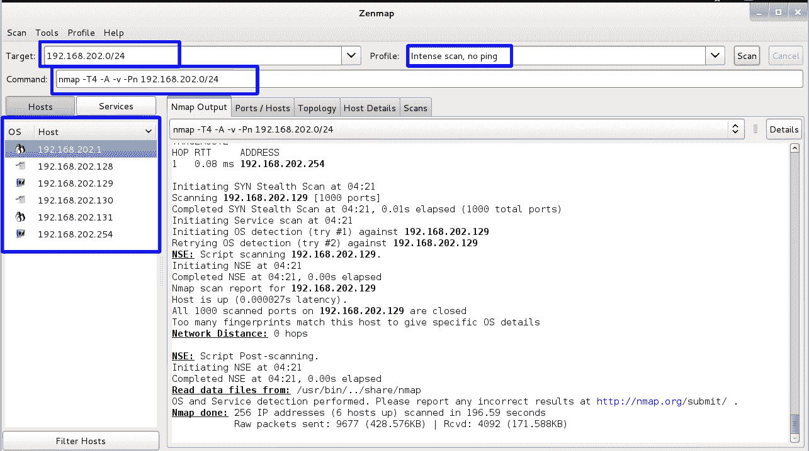

当您查看拓扑标签时，可以通过更改窗口底部控件的值来调整组的大小。通过增加**兴趣因素**来增加图形的大小。标准视图将本地主机放在组的中心，但如果单击其他主机中的一个，它将被带到中心，如下所示：

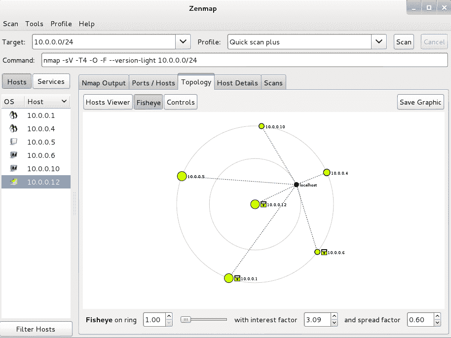

# Nmap 命令选项的注释列表

即使 Zenmap 有一个简短，有力的下拉列表，列出了流行和有用的扫描，但您可以使用各种命令和选项来自定义扫描。

**您在哪里可以找到有关此事的说明？**

在 Linux 框中，有三个地方可以找到有关命令行应用程序的更多信息：

+   **帮助页面**：几乎所有的 Unix 和 Linux 应用程序都有一个帮助文件，您可以通过在命令行上输入应用程序名称和`-h`来访问。考虑以下示例：`root@kali-01: ~# nmap -h`。

+   **man 页面**：这是大多数现代命令行应用程序的完整手册，您可以通过在命令行上键入`man`和应用程序名称来访问。看以下示例：`root@kali-01: ~#-`。这会为您提供如何使用 Rsync 的相当好的解释，这是安全和记录的文件传输协议。man 页面的质量不一，其中许多实际上是由火箭科学家编写的，因此新手可能需要研究如何阅读手册页面才能对他们有用。Nmap 的 man 页面写得很清楚，有可理解的示例可供尝试。

+   **信息页面**：对于 Bash shell 内置命令，有一组信息页面，而不是 man 页面。要查看信息页面，请键入`info`和应用程序名称。例如，`root@kali-01: ~# info ls`将为您呈现 ls 命令的信息页面，这是 DOS 中 DIR 命令的 Linux 版本。

`-h`命令会在终端窗口中呈现内联文本，因此在信息滚动过去后，您会立即返回到命令提示符。`man`和`info`命令启动文本阅读器**Less**，因此您可以在文档上下滚动，即使您仍然在终端窗口中。要从**Less**中退出，只需按 Q 键。

Shift 键是 Linux 终端模拟器中的好朋友。

如果您想在终端窗口中上下滚动，例如，如果`-h`帮助文件比单个屏幕长，只需按住 Shift +上或下光标键。

复制和粘贴的热键序列分别是*Shift* + *Ctrl* + *C*和*Shift* + *Ctrl* + *V*。*Ctrl* + *C*意味着关闭 Bash Shell 中正在运行的应用程序，*Ctrl* + *V*则根本不起作用。

Nmap 6.47 帮助文件可以在[`nmap.org`](http://nmap.org)找到。

| **用法**：`nmap [扫描类型] [选项] {目标规范}` |
| --- |
| **目标规范**： |  |
| **例如**：`atlantacbudtech.com`，`aarrrggh.com/26`，`192.168.3.111`；`10.1-16.0-255.1-254` |
| - ` -L <inputfilename>`： | 从主机/网络列表输入。 |
| - ` -R <num hosts>`： | 选择随机目标。 |
| - ` -exclude <host1，[host2]，[host3]，...>`： | 排除主机/网络。 |
| - ` -exludefile <exclude_file>`： | 从文件中排除列表。 |
| **主机发现**： |  |
| - ` -sL`： | 列出扫描 - 只是列出要扫描的目标。 |
| - ` -sn`： | Ping 扫描 - 禁用端口扫描。 |
| - ` -Pn`： | 将所有主机视为在线 - 跳过主机发现的 ping。 |
| - ` -PS/PA/PU/PY [portlist]`： | TCP SYN/ACK，UDP 或 SCTP 发现到给定端口。 |
| - ` -PE/PP/PM`： | ICMP 回显，时间戳和子网掩码请求发现探测。 |
| - ` -PO [protocol list]`： | IP 协议 ping，而不是 ICMP ping。 |
| - ` -n/-R`： | 从不进行 DNS 解析/始终解析[默认：有时]。 |

解析 DNS 可以为您提供有关网络的更多信息，但它会产生 DNS 请求流量，这可能会提醒系统管理员有一些不太正常的事情正在发生，特别是如果他们在网络中没有使用 DNS。

这是 Nmap 带有我们的注释的帮助文件视图（您可以在[`nmap.org/book/man/`](http://nmap.org/book/man/)的手册页面找到更多信息）：

+   `--dns-servers <serv1[,serv2],...>`：指定自定义 DNS 服务器。

+   `--system-dns`：使用操作系统的 DNS 解析器。这是默认行为。

+   `--traceroute`：跟踪到每个主机的跳数路径。这只在大型，复杂，分段的网络中才有意义。

**扫描技术：**

+   `-sS/sT/sA/sW/sM`：TCP SYN/Connect()/ACK/Window/Maimon 扫描

+   `-sU`：UDP 扫描

+   `-sN/sF/sX`：TCP Null，FIN 和 Xmas 扫描

+   `--scanflags <flags>`：自定义 TCP 扫描标志

NS-ECN-nonce 隐瞒保护（这是实验性的：有关更多信息，请参阅 RFC 3540）。

+   `CWR`：拥塞窗口减小。用于指示正在减小数据包大小以在拥塞的网络条件下维持流量。

+   `ECE`：ECN-Echo 具有双重作用，取决于 SYN 标志的值：

+   如果 SYN 标志设置（1），则表示 TCP 对等方支持 ECN。

+   如果 SYN 标志清除（0），则表示在正常传输期间接收到 IP 标头中设置了拥塞经历标志的数据包（这是由 RFC 3168 添加到标头中的）。

+   `URG`：这表示紧急指针字段很重要。

+   `ACK`：这表示确认字段很重要。

+   `PSH`：推送功能。要求将缓冲数据推送到接收应用程序。

+   `RST`：重置连接。

+   `SYN`：同步序列号。

+   `FIN`：发送方不再有数据。

+   `-sI <zombie host[:probeport]>`：空闲扫描。

+   `-sY/sZ`：SCTP INIT/COOKIE-ECHO 扫描。

+   `-sO`：IP 协议扫描。

+   `-b <FTP relay host>`：FTP 反弹扫描。

端口规范和扫描顺序：

`-p <端口范围>`：仅扫描指定端口。

例如，考虑以下代码：`-p22; -p1-65535; -p U:53,111,137,T:21-25,80,139,8080,S:9`

+   `-F`：快速模式-扫描比默认扫描更少的端口

+   `-r`：连续扫描端口-不随机化

+   `--top-ports <number>`：扫描<number>最常见的端口

+   `--port-ratio <ratio>`：扫描比给定的`<ratio>`更常见的端口

服务/版本检测：

+   `-sV`：探测开放端口以确定服务/版本信息

+   `--version-intensity <level>`：设置从 0（轻）到 9（尝试所有探测）的强度

+   `--version-light`：限制为最可能的探测（强度 2）

+   `--version-all`：尝试每个单独的探测（强度 9）

+   `--version-trace`：显示扫描活动的详细版本（用于调试）

脚本扫描：

+   `-sC`：等同于`-script=default`

+   `--script=<Lua scripts>`：`<Lua scripts>`是一个逗号分隔的目录，脚本文件或脚本类别列表

+   `--script-args=<n1=v1,[n2=v2,...]>`：为脚本提供参数

+   `--script-args-file=filename`：在文件中提供 NSE 脚本参数

+   `--script-trace`：显示发送和接收的所有数据

+   `--script-updatedb`：更新脚本数据库

+   `--script-help=<Lua scripts>`：显示有关脚本的帮助

+   `<Lua scripts>`是一个逗号分隔的脚本文件或脚本类别列表

操作系统检测：

+   `-O`：启用 OS 检测

+   `--osscan-limit`：将 OS 检测限制为有希望的目标

+   `--osscan-guess`：更积极地尝试猜测操作系统

时间和性能：

指定时间间隔的选项以秒为单位，或者我们可以在值后附加'ms'（毫秒），'s'（秒），'m'（分钟）或'h'（小时）。例如，`23ms`将被翻译为 23 毫秒。

+   `-T<0-5>`：设置时间模板（更高表示更快，也更吵）

+   `--min-hostgroup/max-hostgroup <size>`：并行主机扫描组大小

+   `--min-parallelism/max-parallelism <numprobes>`：探测并行化

+   `--min-rtt-timeout/max-rtt-timeout/initial-rtt-timeout <time>`：指定探测往返时间

+   `--max-retries <tries>`：限制端口扫描探测的重传次数

+   --host-timeout <time>：在此时间间隔后放弃目标

+   --scan-delay/--max-scan-delay <time>：调整探测之间的延迟

+   --min-rate <number>：每秒发送的数据包不慢于<number>

+   --max-rate <number>：每秒发送的数据包不超过<number>

防火墙/IDS 规避和欺骗：

+   -f; --mtu <val>：分段数据包（可选带有给定的 MTU）

+   -D <decoy1,decoy2[,ME],...>：用伪装物隐藏扫描

+   -S <IP_Address>：欺骗源地址

+   -e <iface>：使用指定的接口

+   -g/--source-port <portnum>：使用给定的端口号

+   --proxies <url1,[url2],...>：通过 HTTP/SOCKS4 代理中继连接

+   --data-length <num>：向发送的数据包附加随机数据

+   --ip-options <options>：发送带有指定 IP 选项的数据包

+   --ttl <val>：设置 IP 生存时间字段

+   --spoof-mac <mac address/prefix/vendor name>：欺骗您的 MAC 地址

+   --badsum：发送带有虚假 TCP/UDP/SCTP 校验和的数据包

输出：

+   -oN/-oX/-oS/-oG <file>：将扫描以正常、XML、s|<rIpt kIddi3 和 grepable 格式输出到给定的文件名

+   -oA <basename>：同时以三种主要格式输出

+   -v：增加详细级别（使用`-vv`或更高级别效果更好）

+   -d：增加调试级别（使用`-dd`或更高级别效果更好）

+   --reason：显示端口处于特定状态的原因

+   --open：仅显示打开（或可能打开）的端口

+   --packet-trace：显示发送和接收的所有数据包

+   --iflist：打印主机接口和路由（用于调试）

+   --log-errors：将错误/警告记录到正常格式的输出文件

+   --append-output：追加到指定的输出文件，而不是覆盖

+   --resume <filename>：恢复中止的扫描

+   --stylesheet <path/URL>：使用 XSL 样式表将 XML 输出转换为 HTML

+   --webxml：从 nmap.org 引用样式表以获得更便携的 XML

+   --no-stylesheet：防止将 XSL 样式表与 XML 输出关联

杂项：

+   -6：启用 IPv6 扫描。

+   -A：启用操作系统检测、版本检测、脚本扫描和跟踪路由。这是`-sS -sV --traceroute -O`的快捷方式。这是 Wolf 最喜欢的扫描选项。

+   --datadir <dirname>：指定自定义 Nmap 数据文件位置。

+   --send-eth/--send-ip：使用原始以太网帧或 IP 数据包发送。

+   --privileged：假设用户完全具有特权。

+   --unprivileged：假设用户缺少原始套接字权限。

+   -V：打印 Nmap 版本号。与其他选项一起使用无效。

+   -h：打印帮助摘要页面。

示例：

```
nmap -v -A boweaver.com
nmap -v -sn 192.168.0.0/16 10.0.0.0/8
nmap -v -iR 10000 -Pn -p 80  
```

您可以构建自定义的 Nmap 扫描字符串并将其复制到 Zenmap 中，以便享受 Zenmap 界面的好处。

# 使用 OpenVAS

在第二章中，我们为漏洞扫描设置了 OpenVAS。Nmap 在报告端口和服务方面做得很好，但缺乏扫描漏洞的能力。OpenVAS 将发现漏洞并对系统进行报告。OpenVAS 的人员每周更新他们的漏洞列表，因此最好在运行扫描之前更新 OpenVAS。要在 Kali 上执行此操作，请从终端窗口运行以下命令：

```
root@kalibook : ~ # OpenVAS-nvt-sync  
```

这将为 OpenVAS 运行漏洞更新。第一次运行时，您将看到以下截图中可见的信息，要求您迁移到使用 Rsync 来更新漏洞。键入`Y`并按*Enter*键。更新将开始。第一次运行此命令时，需要相当长的时间，因为它必须提供完整的插件和可用测试列表。在随后运行`update`命令时，它只会添加新的或更改的数据，并且速度要快得多：


您还需要运行以下命令：

```
root@kalibook : ~ # OpenVAS-scapdata-sync  
```

更新完成后，我们已经准备就绪。现在让我们启动 OpenVAS 服务。转到应用程序 | Kali Linux | 系统服务 | OpenVAS | 启动 OpenVAS。一个终端窗口将打开，您将看到相关服务正在启动。一旦它们启动，您可以关闭此窗口并转到以下链接：`https://localhost:9392`。

何时不使用 OpenVAS？

在一些公司网络中，已经有了可以用来扫描漏洞的扫描服务。除非您怀疑官方公司扫描工具未正确配置以适应搜索范围，或者未更新以包括对最新漏洞的搜索，否则没有必要重复进行扫描。诸如 Qualys、Nexpose 和 Nessus 之类的扫描工具都是很好的扫描工具，可以完成与 OpenVAS 相同的任务。所有这些服务都以 XML 格式导出其数据，然后可以将其导入到诸如 Metasploit 之类的工具中。

现在，使用在设置步骤中生成的极长且复杂的密码登录 OpenVAS Web 界面。通常，用户是`admin`。

现在是一个很好的时机，去管理选项卡并将密码更改为仍然复杂但更容易记住的内容。

要运行您的第一次扫描，只需将要扫描的网络子网或单个 IP 地址输入到扫描文本框中，然后点击按钮开始扫描。这个小极客女巫会为您设置几个正常参数并运行扫描。您还可以设置自定义扫描，甚至安排在特定日期和时间运行作业：


一旦扫描开始，您将看到以下屏幕。此时，您将看到它标记为“已请求”，大约一分钟后屏幕将刷新，您将看到进度条开始移动。根据您要扫描的网络大小，您可以去喝杯咖啡，吃顿饭，明天回来，或者周末离开。这将需要一些时间。值得注意的是，在整个过程中，您无需紧挨着点击“下一步”按钮。

现在扫描已经完成，您将看到一个类似以下的屏幕。转到扫描管理选项卡，然后在下拉菜单中选择报告。这将带您到报告页面，如下所示：


报告页面将向您提供扫描结果，将发现的漏洞从最严重到最低进行分类，如下所示：


在这里，您可以以各种格式生成报告。选择所需的格式，然后点击绿色按钮，如下面的屏幕截图所示：


然后您可以下载报告。您可以编辑报告以显示您公司的标志和任何未包含在文档中的必要公司信息：


# 使用 Maltego

**Maltego**是一个信息收集工具，除了收集网络信息外，还有许多其他用途。您还可以从各种来源收集有关人员和公司的信息。现在，我们将使用它来收集有关公共网络的网络信息。

第一次启动 Maltego 时，您需要进行一些设置，并在其网站上注册，以便登录到转换服务器。这很容易，免费，没有垃圾邮件，因此提供您的电子邮件地址不会成为问题。首先，您需要选择要使用的版本。Maltego XL 和 Classic 是专业版本，您必须支付才能获得许可证。CE 版本是免费版本，而您正在学习如何使用此工具时，我们将在以下部分中使用的 CE 版本将完全正常工作。如果您是以渗透测试为生，那么 Classic 版本的许可证有点昂贵，但是非常值得。付费版本将在搜索中提取超过 10,000 个实体。CE 版本对每个实体的限制为 10 个。

1.  因此，选择 CE 版本，然后点击“运行”：


1.  接下来，填写您用于注册的信息，解决验证码，然后点击“下一步”：


1.  所以，我们都注册了，然后我们得到了以下窗口。点击“下一步”继续：


1.  接下来，我们会得到一个询问如何开始的窗口。我们将选择一个空白图表，然后点击“完成”，如下所示：

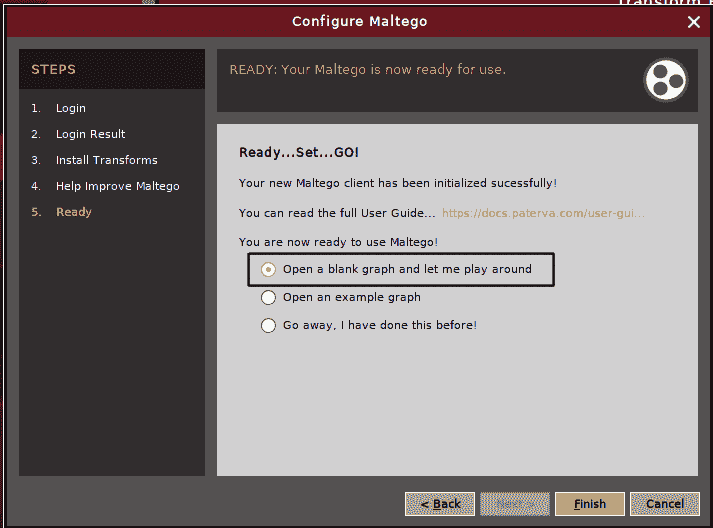

1.  点击“完成”后，我们会得到一个空白图表页面，如下所示：

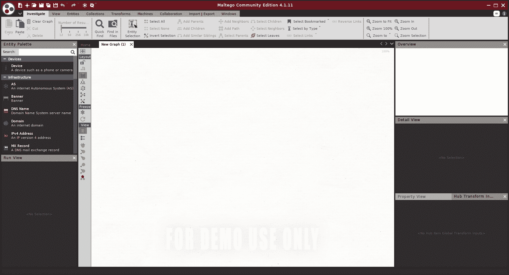

所以，让我们足迹一个域名。

1.  点击并将左侧工具栏中的域图标拖动到图表页面的中心。默认域显示为 paterva.com。这是 Maltego 的网站，现在只是一个占位符。


在右下角的工具栏中，在属性视图中，将 paterva.com 更改为您想要足迹的域。

记住：永远不要测试您不拥有或没有书面许可的任何东西！监狱不好玩，有关黑客行为的权力正在严厉打击，您不想被贴上*网络恐怖分子*的标签。不，您没有权限测试我的东西。请友好相处！

在接下来的部分中，我们将足迹作者的一个域：`boweaver.com`。由于我拥有该域，我允许自己测试该域：

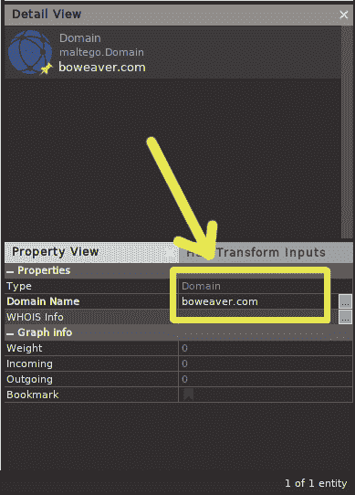

1.  接下来，右键单击域图标，您将会得到一个命令窗口。

1.  点击双箭头。这将在域上运行所有转换。这将花费一分钟来运行。

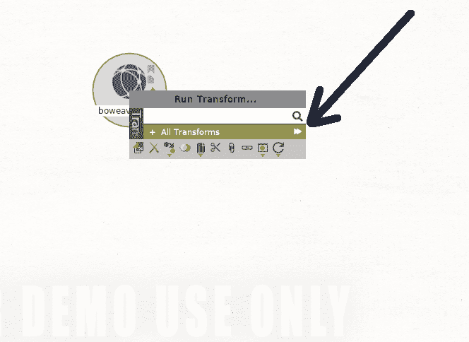

一旦转换完成，您将在屏幕上看到输出信息。只需点击一下，应用程序就会出去，检查许多在线来源，并提取有关域的许多基本信息：所有者、IP 地址、该地址的物理位置等等。现在，您可以右键单击任何这些实体，以深入了解并收集更多信息：

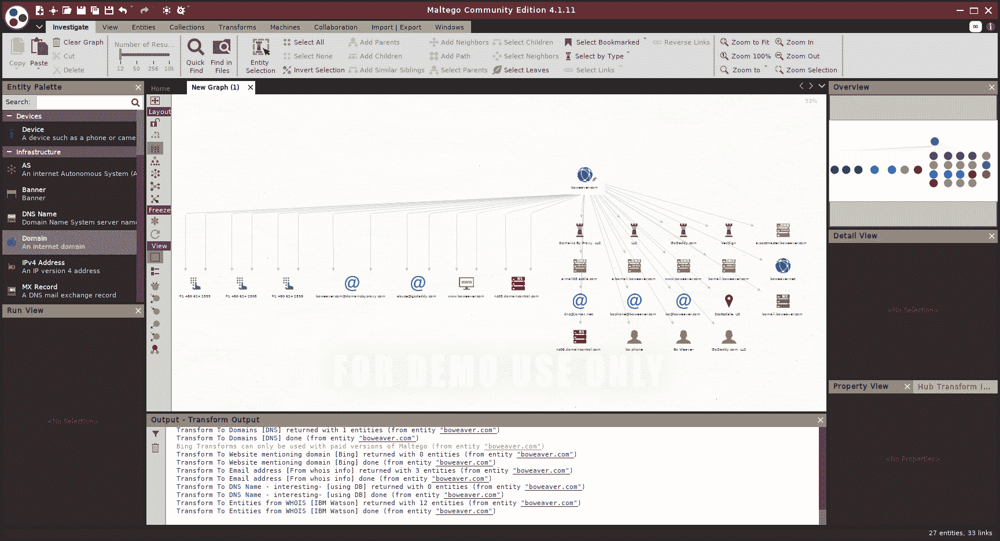

现在我们已经生成了一些数据，我们需要保存我们的结果。点击 Maltego 图标（窗口左上角的三个彩色圆圈组成的圆圈），然后点击“另存为”，将文件保存到项目工作区，如下所示：


现在让我们看一下收集到的一些信息。从第一行，我们可以看出该域名在 GoDaddy 注册。DNS 列出的管理员电子邮件地址是`postmaster@boweaver.com`。在第二行，我们看到其他 DNS 记录条目，显示了邮件服务器（`bomail`）和 Web 服务器（`www`）。我们还看到与域`boweaver.net`有关系。在第三行，我们看到搜索从转换源找到的几个电子邮件地址。此外，该域的 MX 记录列表显示了`bomail.boweaver.com`和该域的邮件服务器。第四行显示了 NS 服务器和与该域连接的实体。

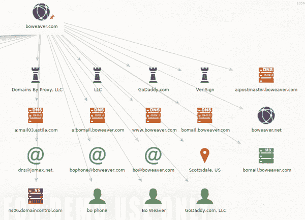

我们可以在以下截图中看到数据输出的左侧部分。通过查看列出的滥用电子邮件地址，我们可以知道该域名设置了隐私保护，因此电话号码和电子邮件地址指向了 GoDaddy。我们还看到了相关网站`www.boweaver.com`。因此，一个简单的一键搜索揭示了关于该域名、其结构和所有者的大量信息。


通过右键单击网站，我们得到以下窗口。通过单击“解析为 IP”旁边的双箭头，我们可以获取该网站的 IP 地址和网络信息：

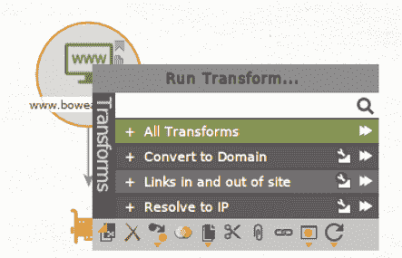

因此，通过深入挖掘，我们已经找到了 IP 地址、分配的网络块和自治系统号（ASN）。我们还可以看到该网站托管在 Digital Oceans 的纽约数据中心：


Maltego 允许您将此信息保存到表格（CSV 文件），生成报告，或将图表导出为图像：

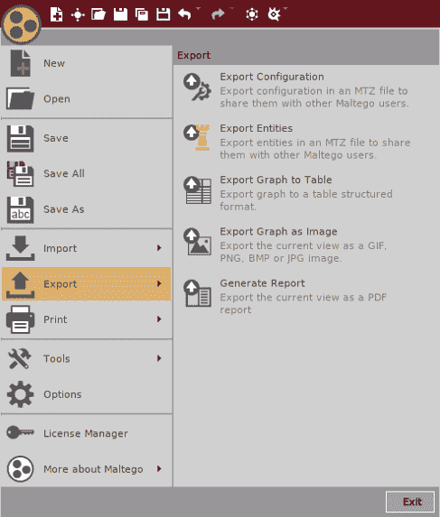

因此，通过这个应用程序的两次鼠标点击，而实际上并没有触及目标的任何资产，我们已经确定了大量关于目标的信息。

这只是这个工具的简单用法。这个工具可以挖掘的信息深度令人震惊，也有点可怕，特别是如果您使用专业版。这个工具的完整使用超出了本书的范围。关于这个工具的深入使用有很多在线资源。

# 使用 KeepNote

在这里要说一下笔记！渗透测试收集了大量数据，即使是在一个小网络上，我是说非常多！因此，在进行渗透测试时，您需要在进行测试时能够收集到来的数据。Kali 配备了几个应用程序来实现这一点。无论您选择哪一个，只需选择一个并使用它。测试运行后六周，当您需要回头验证某些内容时，您会为自己的选择感到高兴。此外，在进行高安全环境的测试时，比如必须符合 HIPPA 或 PCI 标准的网络，这些笔记在撰写报告时尤其有用。另外，请确保将所有项目文件放在一个目录中，并与此框架一起使用。做好笔记的另一个原因是，如果出现法律诉讼，您的笔记可能是您最好的辩护。

以下截图显示了 Bo 使用的框架。他为客户组织创建一个文件夹，然后为实际测试创建一个带有日期的文件夹名称。可以肯定的是，无论您在哪里从事业务，您都会反复看到相同的客户。如果您没有看到重复的业务，那么您自己的业务模式可能存在问题。Ext-20150315 表示在 20150315 进行的外部测试。20150315 是一个 Unix 风格的日期，可以分解为 YYYYMMDD。如果您看到看起来像 20150317213209 的 Unix 风格日期戳，那么这可以被分解到秒。在该文件夹内，Bo 设置了用于证据、笔记和扫描文档的目录。所有收集的证据，包括截图，都放入`evidence`文件夹。来自 KeepNote 的笔记保存在`notes`文件夹中，扫描和其他相关文档保存在`scans-docs`文件夹中。当我们在本书的后面开始进行测试时，您将看到这个框架被使用。

以下是文件夹布局的截图。在这种情况下，我们使用 LXDE 文件管理器：


即使您只为一家公司工作，也要保持每个测试的数据分开并标记日期；这将帮助您跟踪测试情况。

对于实际的笔记，Kali 配备了几个应用程序，如之前所示；Maltego 是其中之一，能够将所有数据保存在一个地方。

博最喜欢的是 KeepNote。您在第一章中看到了 KeepNote 的介绍，*选择您的发行版*。KeepNote 是一个简单的笔记应用程序。在 Bo 的测试中，他保存了手动利用的输出副本，单独的扫描数据和截图。好处在于您可以随时格式化数据，因此稍后将其导入模板只是复制/粘贴的问题。


# 摘要

在本章中，您已经了解了 Nmap 工具的许多用途，以及其 GUI 界面 Zenmap。我们了解了 OpenVAS 漏洞扫描器的详细用法，以及在攻击中使用这些数据。我们还了解了信息收集工具 Maltego 的用法。

# 进一步阅读

+   **Fydor 的 Nmap 网络扫描**: [`nmap.org/book/`](https://nmap.org/book/)

+   **OpenVAS 文档**: [`www.openvas.org/documentation.html`](http://www.openvas.org/documentation.html)

+   **Maltego 用户指南**: [`www.paterva.com/web7/docs/userguides/user_guide.php`](https://www.paterva.com/web7/docs/userguides/user_guide.php)
