# 第十章：逆向工程和压力测试

如果您想知道恶意软件的行为，最简单的方法是让它在您的网络中肆虐，并跟踪其在野外的行为。这不是您想要了解恶意软件行为的方式。您可能会轻易错过您的网络环境没有执行的某些内容，然后您将不得不从网络中的所有计算机中删除恶意软件。Kali 有一些精选的工具可以帮助您做到这一点。本章还涵盖了压力测试您的 Windows 服务器或应用程序。如果您想发现 DDoS 会让您的服务器崩溃多少，这是一个很好的主意。本章是如何开发一个抗脆弱、自我修复的 Windows 网络的开端。

在本章中，我们将学习以下主题：

+   建立测试环境

+   逆向工程理论

+   使用布尔逻辑

+   逆向工程实践

+   压力测试您的 Windows 机器

与 Kali Linux 1.x 相比，Kali Linux 2.0 中提供的逆向工程工具有一些变化。一些工具已经从菜单结构中消失，如果您希望，可以使用第六章的最后一节，*NetBIOS 名称服务和 LLMNR - 已过时但仍然致命*，将它们放回。一些工具根本没有包含在 Kali Linux 2 中，尽管在各处都有它们的痕迹。以下表格显示了这些变化。

显示完整路径的工具在默认的 Kali 2.0 菜单中根本不存在，NASM Shell，Metasploit Framework 套件的一部分，在 Kali 1.x 菜单中也不存在。

以下表格显示了 Kali 1.x 和 2.0 中工具的区别：


# 技术要求

对于本章，您将需要以下内容：

+   运行中的 Kali Linux 机器

+   运行中的 Windows 操作系统副本（可以是虚拟机）

# 建立测试环境

开发您的测试环境需要对您正在测试的所有 Windows 操作系统进行虚拟机示例。例如，应用程序开发人员可能正在运行非常旧的浏览器/操作系统测试机器，以查看对于运行古董硬件的客户来说会出现什么问题。在这个例子中，我们正在运行 Windows XP、Windows 7 和 Windows 10。我们正在使用 Oracle VirtualBox 进行桌面虚拟化，但如果您更喜欢使用 VMWare，那就使用它。重要的是要使用您可以与主网络隔离的机器，以防恶意软件表现如其应该，并试图感染周围的机器。

# 创建您的受害机器

如果您已经为其他目的设置了 Windows 虚拟机，您可以克隆它们（可能是最安全的选项）或者从快照中运行它们（这是设置的最快方式）。在构建完它们后，这些机器不应该能够访问主网络，并且您可能应该将它们设置为仅与内部网络通信。

# 测试您的测试环境

1.  启动您的 Kali 虚拟机

1.  确保您的 Kali 实例可以与互联网通信，以便轻松获取更新

1.  确保您的 Kali 实例可以与您的主机机器通信

1.  启动您的目标 Windows 实例

1.  确保您的 Windows 受害者无法访问互联网，或者您的私人以太网局域网，以避免恶意软件的意外传播

我们测试网络上的三台虚拟机都在 Oracle VirtualBox 内部的仅主机网络上。DHCP 由主机提供（`192.168.56.100`），三台测试网络机器分别是`101`、`102`和`103`，如下所示：


# 逆向工程理论

理论因某种原因使 IT 专业人员感到恐慌。这并不真正有根据，因为理论是您所有故障排除的基础。这可能是您通过 X 年的艰难试错学到的公理。在定性研究领域，这实际上被称为**基础理论研究方法**。逆向工程的基本理论是输出推断应用程序的内部行为。当您面对一种恶意软件时，您将开始从以下混合物中提出工作假设：

+   从与被视为相似的恶意软件的交互中回忆的先验知识

+   与测试中的恶意软件的交互的感知结果的概括

**黑客提示**：

在*a priori*的情况下给应用程序贴标签可能没有用。这可能掩盖了应用“如果它走起来像鸭子，叫起来像鸭子，那它可能就是鸭子”的公理。特别是对于恶意软件，设计可能包括一些欺骗性特征，预期会让你走上错误的道路。考虑一下作为其第一个任务删除其他特洛伊木马和 rootkit 的特洛伊木马和 rootkit。它们正在清理你的环境，但是，它们真的是你的朋友吗？

恶意软件应用程序旨在从输入中提供输出，但是知道输出和输入并不能真正让你了解输出是如何实现的。输出可以通过几种不同的方式产生，您可能会发现开发人员选择创建应用程序的方式很重要。

# 逆向工程的一个一般理论

这个理论是由李和约翰逊-莱尔德在 2013 年发表在《认知心理学杂志》上的，对信息安全从业者有用，因为它在布尔系统中显示。布尔系统是逻辑门。条件要么为真，要么为假。问题的一个非常常见的定义可能如下：

“任何要进行逆向工程的系统都包含一定数量的组件，这些组件共同作用产生了系统的行为。其中一些组件是可变的，也就是说，它们可以处于影响系统性能的多个不同状态，例如，数码相机上允许播放或删除照片的设置。系统的其他组件不变，例如，从开关到灯泡的导线。系统具有用户的一些不同输入和一些随之而来的输出，并且它们由有限数量的相互连接的组件中介。在某些系统中，一个组件可能具有潜在的无限数量的特定状态，例如，不同的电压。但是，为了进行逆向工程，我们假设所有可变组件都可以被视为具有有限数量的不同状态，也就是说，整个系统等同于有限状态自动机。换句话说，模拟系统可以被数字化，例如数码相机、CD 和其他以前的模拟设备。我们还假设设备旨在是确定性的，尽管非确定性有限状态设备总是可以被确定性设备模拟。”

–（李和约翰逊-莱尔德，2013）

逆向工程理论及其在布尔系统中的应用。*认知心理学杂志，25(4)*，365-389。[`doi.org/10.1080/20445911.2013.782033`](http://doi.org/10.1080/20445911.2013.782033)。

李和约翰逊-莱尔德模型仅使用布尔内部模型来表示可能的内部条件，以揭示已注意到的行为。由于不可能测试无限数量的输入，因此测试仅可能的输入和输出的子集更有用。我们可以从一个简单的例子开始，例如这里：

+   如果恶意软件降落在苹果平台上，并且旨在利用 Windows 漏洞，那么它很可能根本无法运行（开关 1）。

+   如果它落在 Windows 机器上，但是针对 XP 版本的漏洞，它可能会测试该操作系统版本，并且如果发现自己在 Windows Server 2012 上则不执行任何操作（开关 2）

+   如果碰巧是 Windows XP，但已修补所寻找的漏洞，它也可能不执行任何操作（开关 3）

+   如果它落在一个包含所寻找的未修补漏洞的 Windows XP 机器上，它会释放其有效负载


# 使用布尔逻辑

计算机程序由使用条件和决策的**数据结构**组成，以获得所需的输出。我们将在这里使用 Python 符号，因为它很简单，而且您可能以前见过它。基本的数据结构如下。

+   迭代器，如 while 循环和 for 循环。迭代器循环的次数与其被告知的次数一样多，每次循环时运行其他命令。

+   决策点，如 if 结构和 case 结构。前面的图是一组嵌套的 if 结构。

| **布尔运算符** |
| --- |
| **符号** | **描述** | **示例** |
| --- | --- | --- |
| X == Y | X 等于 Y。这不总是一个数字值集。 | "shirts" == "hats" 评估为 FALSE。"shirts" == "shirts" 评估为 TRUE。1 == 11 评估为 FALSE。11 == 11 评估为 TRUE。 |
| X != Y | X 不等于 Y。 | "shirts" != "hats" 评估为 TRUE。"shirts" != "shirts" 评估为 FALSE。1 != 11 评估为 TRUE。11 != 11 评估为 FALSE。 |
| X <= Y | X 小于或等于 Y。 | "shirts" <= "hats" 评估为 FALSE。"shirts" <= "shirts" 评估为 TRUE。（它在计算字符。）1 <= 11 评估为 TRUE。11 <= 11 评估为 TRUE。 |
| X >= Y | X 大于或等于 Y。 | "shirts" >= "hats" 评估为 TRUE。"shirts" >= "shirts" 评估为 TRUE。（它在计算字符。）1 <= 11 评估为 TRUE。11 <= 11 评估为 TRUE。 |
| X < Y | X 小于 Y。 | "shirts" < "hats" 评估为 FALSE。"shirts" < "shirts" 评估为 FALSE。（它在计算字符。）1 < 11 评估为 TRUE。11 < 11 评估为 FALSE。 |
| X > Y | X 大于 Y。 | "shirts" > "hats" 评估为 TRUE。"shirts" > "shirts" 评估为 FALSE。（它在计算字符。）1 > 11 评估为 FALSE。11 > 11 评估为 FALSE。 |

下表显示了用于逻辑操作的布尔变量，以连接元素以获得更复杂条件。您可能希望有以下限制条件：

+   X 和 Y 都为真

+   X 和 Y 都为假

+   X 或 Y 为真

+   除了 X 之外的任何东西

+   除了 Y 之外的任何东西

| **布尔变量** |
| --- |
| **变量** | **描述** | **示例** |
| --- | --- | --- |
| AND | 产生一个布尔比较，只有当所有元素都为真时才为真。 | `if ((1 == 1) and (2 == 2))` 评估为 TRUE，因为所有元素都为真。`if ((1 == 1) and (2 > 2))` 评估为 FALSE，因为只有一个元素为真。`if ((1 < 1) and (2 > 2))` 评估为 FALSE，因为没有一个元素为真。 |
| OR | 产生一个布尔比较，如果任何一个元素为真则为真。 | `if ((1 == 1) or (2 == 2))` 评估为 TRUE，因为所有元素都为真。`if ((1 == 1) or (2 > 2))` 评估为 FALSE，因为只有一个元素为真。`if ((1 < 1) or (2 > 2))` 评估为 FALSE，因为没有一个元素为真。 |
| NOT | 产生一个布尔比较，只有当所有元素都不为真时才为真。 | `X = 2``if not (X == 3)` 评估为 TRUE，因为 X 不是 3。`X = 3``if not (X == 3)` 评估为 FALSE，因为 X 是 3。 |

以下代码正在测试`X`的两个条件与 NOT 的布尔变量。您可能已经开始看到输出可以从许多不同的内部编码选择中绘制出来。攻击者或原始人可能会通过多种条件来测试条件，因此您必须考虑获得输出的所有方式：


# 审查 while 循环结构

`while`循环是由真/假选择点明确启动和停止的。这些看起来可能非常复杂，但它们最终会解决为一组有限的测试，针对一个条件：

```
X = 0 
Y = 20 
while (X != Y): print (X), X = X + 1 
```

这个 Python 3 循环将重复打印`X`的值，直到它达到 10，然后停止。如果我们说`while X < Y`，它将完全相同工作，因为循环结构正在测试`X`的增量。使用一个随机数作为增量器元素的更复杂的循环，可能会在随机命中等于`Y`的`X`值之前进行更长时间的运行（或者不运行）：

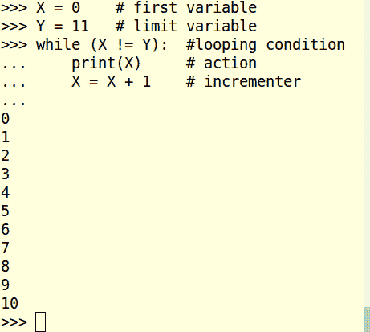

很明显，程序每次都在测试循环条件。这是使用随机`X`值的一个例子。首先，选择`X`值，然后运行两次`print(X)`命令。由于`X`只在第一行设置了一次，所以在两次打印命令中它没有改变。当`X`的值被重置时，它打印了一个不同的值。条件是`X`不等于`Y`。我们在几行上设置了`Y`的值，所以不需要重新设置它来运行这个例子。`X`只返回一次的原因是第二次，`X`被随机设置为`11`。从随机抽取中设置为`11`的几率是 11 分之 1，远远超过你赢得 Powerball 彩票的概率：

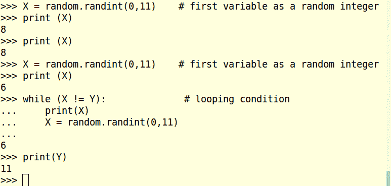

如果我们再次运行循环，它可能会运行更多次，因为它随机避开了等于`Y`的`X`值。同样，它不会打印`X = 11`的值，因为这是被`while`循环条件排除的：


# 审查 for 循环结构

`for`循环不需要增量器，因为它将范围构建到条件中，与`while`循环相反，后者只包括一个超出该循环不会运行的限制。使用 Python 符号，以下代码显示了如果您从`0`值的`X`和从一到十一的范围开始会发生什么。`X`的预设值对`for`循环迭代并不重要。它将所有测试的值应用于`X`：

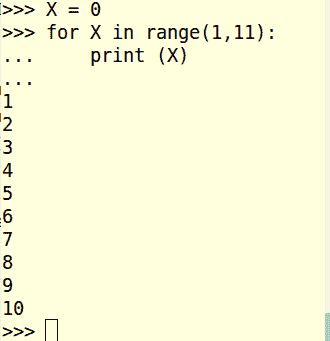

我们从`X`设置为`100`开始，但`for`循环从它自己的条件中获取`X`的值：


如果你真的希望`X`保持不变，你可以将它用作不同范围的基础，如下所示：


# 理解决策点

`if`结构是一个二进制决定：要么是，要么不是。墙上的开关灯是一个 if 结构的物理例子。如果开关处于一种位置，灯是亮的，如果它处于另一种位置，灯是灭的：

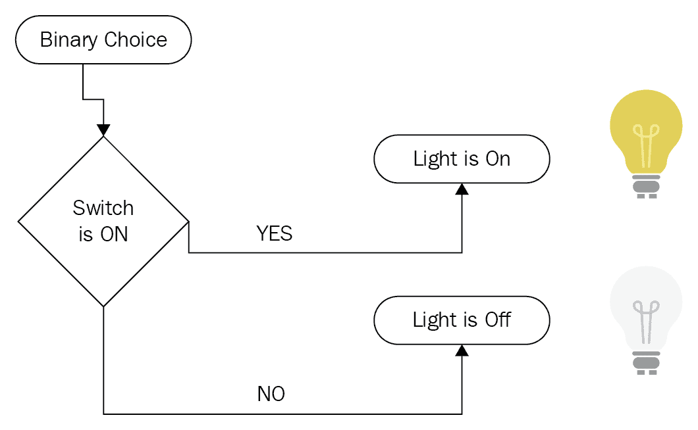

`case`结构是一个具有多个正确答案的决策结构，不只有一个 YES，而没有一个 NO。一个例子可能是一个有三种口味的冰淇淋分配器——巧克力、草莓和香草。如果你不想要冰淇淋，你甚至不会接近这台机器。你有三种选择，它们都是正确的：

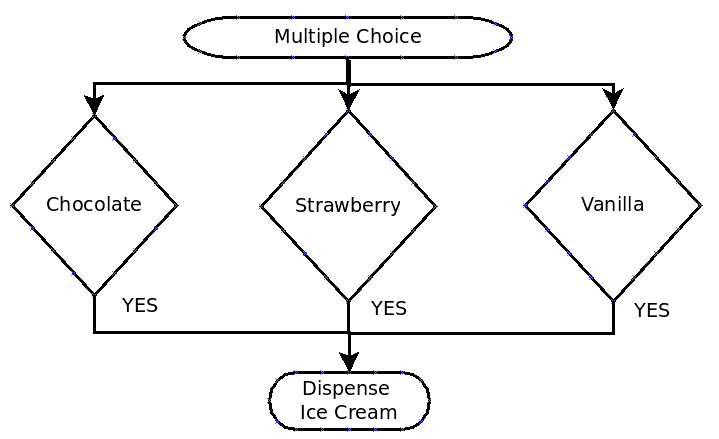

# 练习逆向工程

由于知道输入和输出不能确保为您提供要逆向工程的应用程序的内部构造的真实图像，让我们看一些来自 Kali Linux 的有用工具，这些工具可能会使事情变得更容易。我们将看看三个调试器，一个反汇编工具和一个杂项逆向工程工具。

我们将展示两个基于 Linux 的调试器**Valgrind**和**EDB-Debugger**的用法和输出，然后展示一个仅适用于 Windows 的调试器**OllyDbg**的类似输出。

反汇编器是**JAD**，它是一个 Java 反编译器：

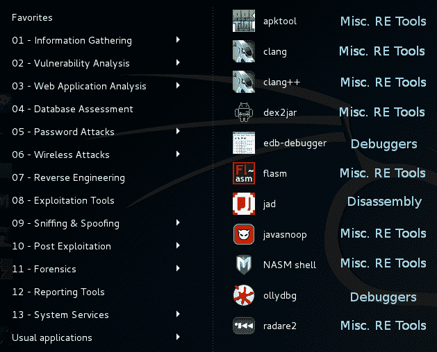

# 使用调试器

调试是什么？通常错误地将这个术语的创造归功于格雷斯·霍珀上将军，她的团队成员在哈佛大学的马克 II 计算机内发现了一只（但已死）蛾卡在继电器内。这个术语实际上可能来自托马斯·爱迪生，因为他提到并定义了术语为*小错误和困难*。在软件开发中，错误通常是逻辑错误，而不是代码中的拼写错误。拼写错误通常会导致代码根本无法编译，因此它们不会离开开发人员的实验室。逻辑错误不会阻止程序编译，但可能会导致输出失败或在启动程序时出现意外行为。与**bug**同义的另一个词是**defect**。项目中的**技术债务**是项目中未修复的缺陷数量。不同的项目经理对未修复的错误有不同的容忍度。许多恶意软件包在发布版本中有几个严重的错误，但一些更复杂的最近的恶意软件包似乎在技术债务方面非常低。

调试器允许您以逐步方式观察应用程序的行为。您可以看到什么被放入内存，进行了什么系统调用，以及应用程序如何获取和释放内存。我们使用调试器的主要原因是检查我们可以访问源代码的程序的行为。这是因为我们最有可能调试的程序是在我们自己的研讨会中制作的代码。这并不完全构成代码安全审计，但可以帮助找出程序泄漏内存的位置，以及它如何清理已使用的内存。许多程序在命令行上显示状态报告，如果您以这种方式启动它们，这些都是内部调试信息。这些信息可能在应用程序发布后进行清理，但在大多数情况下，最终用户从未看到其中任何内容。

# 使用 Valgrind 调试器

程序通常从总内存中保留内存。我们发现在命令行上进行调试的一个有用程序是`valgrind`，它不在默认的 Kali 安装中。当我们发现需要进行初步调试时，我们会添加它。例如，有一次，[`www.openoffice.org/`](http://www.openoffice.org/)的一个版本，在 Linux 上有一个错误，允许安装，但无法运行程序。它在显示初始启动画面时就卡住了。运行以下命令显示它正在寻找一个不存在的文件。我们没有只是发送一个错误报告，并希望解决方案作为补丁添加到源代码中，而是只是添加了缺失的文件作为空白文本文件。这使得 OpenOffice 能够启动。OpenOffice 开发人员后来添加了一个补丁，去除了错误，但我们不必等待。作为`valgrind`的一个例子，以下是在`gedit`上运行测试的命令行代码：

```
valgrind -v --log-file="gedit-test.txt" gedit  
```

在将程序包装在调试器中启动时需要更长的时间，并且整个输出将进入指定的日志文件。一旦程序打开，您可以通过在命令行上按下*Ctrl* + *C*来关闭程序，或者如果被测试的应用程序具有 GUI 界面，您可以关闭窗口，`valgrind`将在观察您正在测试的应用程序关闭后关闭。

在这个例子中，调试器输出了 600 多行，您需要使用一个更用户友好的调试器来找到更有用的信息。请记住，gedit 是一个非常成熟的程序，每次我们使用它来编辑文本文件时都能完美运行，但在打开 gedit，输入几个字符并在不保存新文档的情况下关闭时，`valgrind`在这种简单的用例中记录了 24 个内存错误：

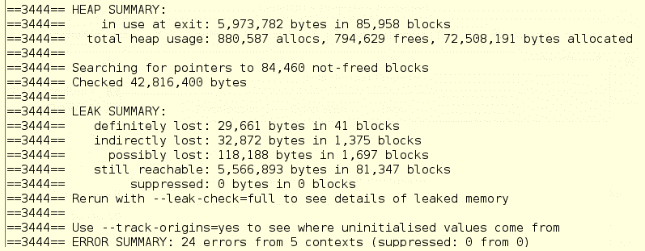

# 使用 EDB-调试器

EDB-Debugger 是一个名为 Olly debugger 的 Windows 应用程序的版本。EDB-Debugger 具有以下功能：

+   开发人员称之为直观的 GUI 界面

+   标准调试操作（步入/步过/运行/中断）

+   更多不寻常的条件断点

+   作为插件实现的调试核心（您可以插入替换核心插件）

+   一些平台可能有多个可用的调试 API，如果是这种情况，您可能有一个实现其中任何一个的插件

+   基本指令分析

+   查看/转储内存区域

+   有效地址检查

+   数据转储视图是分页的，允许您同时打开多个内存视图，并可以快速在它们之间切换

+   它允许导入和生成符号映射

+   具有扩展可用性的插件

EDB-Debugger 旨在调试 Linux 应用程序，我们将使用 EDB-Debugger 查看相同的应用程序 gedit。GUI 界面显示如下：

+   标题栏中正在测试的应用程序和进程 ID

+   内存位置

+   命令

+   通用二进制命令映射

+   书签：代码中感兴趣的地方

+   为数据保留的寄存器（特别是在 2/3 中标记的行）

+   数据转储：内存位置和内容

+   内存堆栈数据

以下是 GUI 的截图：

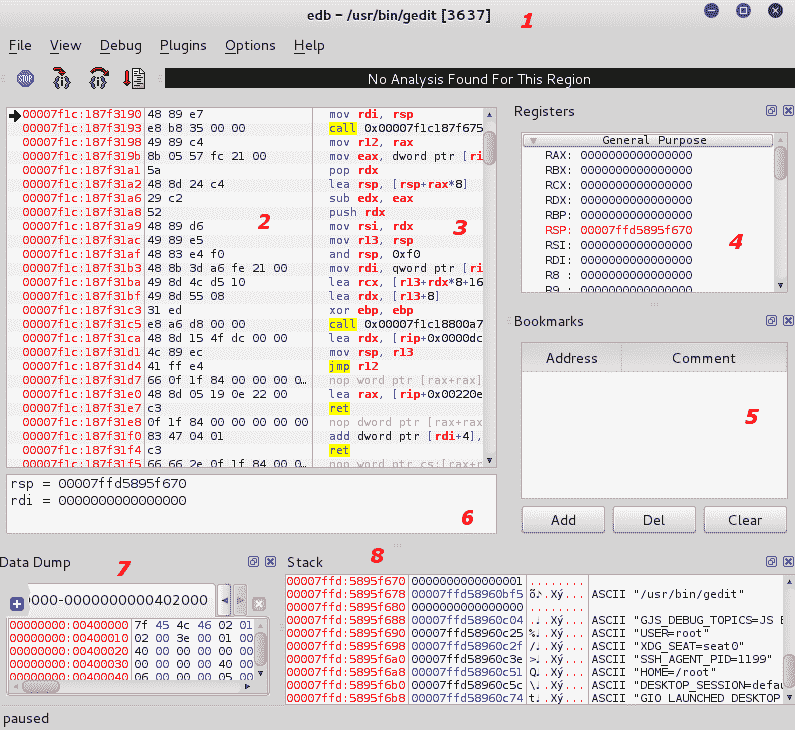

# EDB-Debugger 符号映射器

EDB-Debugger 可以通过以下命令行输入给您一个符号映射：

```
edb --symbols /usr/bin/gedit > gedit.map 
```

符号表映射程序中的函数、行或变量。对于 gedit，符号表如下所示：


# 运行 OllyDbg

如果您正在运行 Kali Linux 2.0 的 64 位版本，您首先需要更新 Kali。它缺少 32 位 wine 基础设施，而没有这个基础设施，wine 甚至不想启动。幸运的是，Kali Linux 给了您一个有用的错误消息。您只需复制错误消息中的引号部分并运行它：


OllyDbg 的 GUI 窗口看起来很像 EDB-Debugger，尽管在图形上有点丑陋。我们正在查看`notepad.exe`，这是一个仅适用于 Windows 的编辑器，类似于 gedit 的简化版本。窗口分为以下部分：

+   标题栏中正在测试的应用程序

+   内存位置

+   符号映射

+   命令

+   寄存器

+   数据转储：内存位置和内容

+   内存堆栈数据

当您打开一个可执行文件（EXE、PIF 或 COM）时，它会显示整个运行程序：


您可以选择在目标 Windows 机器上运行 OllyDbg，通过将其文件夹复制到闪存驱动器并将闪存驱动器携带到受感染的机器上来查看正在进行的感染。您还可以按照第一章中提到的内容，将 Kali Linux 安装到可引导的闪存驱动器上，并直接在受感染的机器上运行 Kali。

# 反汇编器简介

反汇编器将编译的二进制代码显示为汇编代码。这与调试器可以显示的内容类似。

# 运行 JAD

JAD 是 Kali Linux 附带的 Java 反编译器，似乎是分析潜在危险的来自网页的 Java 小程序的有用工具。它最大的问题是自 2011 年以来就没有维护者了，因此很难找到，除非在 Kali 存储库和 Tomas Varaneckas 的博客页面*Jad Decompiler Download Mirror* ([`varaneckas.com/jad/`](http://varaneckas.com/jad/))中。

以下是 JAD 帮助文件中的一页，您可以从主菜单访问，或者通过在命令行中输入`jad`来访问：


为了简单地演示使用`jad`，我们为您创建了一个 Java 类。以下三个插图是以下内容的插图

1.  原始源代码（不一定总是可用）

1.  运行`jad`

1.  反编译源代码

所以，这里是一个小的 Java 类的源代码：


应用程序正在运行。我们展示了使用内联帮助的结果（在字母选择中键入问号），只是为了展示可用的详细级别。然后我们选择了`a`，`jad`覆盖了源代码。当您只有编译后的类时，这不会是一个问题：


最后，这是反编译的源代码：


# 使用 Capstone 创建自己的反汇编代码

Capstone 反编译引擎得到很好的维护，并且有一个简单的 API。基本的 Capstone 库默认安装在 Kali Linux 上，您可以使用任何您熟悉的语言构建自己的前端。我们使用 Python，因为它是我们首选的脚本语言。使用`aptitude search <keyword>`命令结构，您可以确保您有可用的软件包，并查看软件包的状态。在这种情况下，您可以看到第一列中的`p`表示有一个可用的软件包，`i`表示已安装。第二列中的`A`表示该软件包是自动安装的，可能是某个其他软件包的依赖。我们选择`install libcapstone-dev`，用于 Kali 实例上的 64 位架构，以防我们想尝试自定义 Capstone 的行为。您不需要这样做来使用 Capstone：

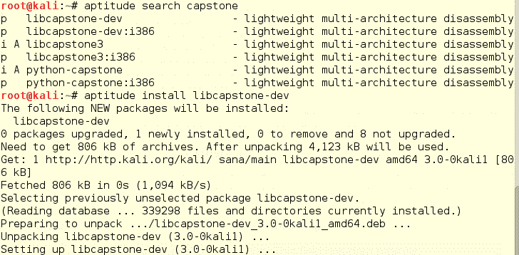

这是一个简单的反汇编脚本，基于[`www.capstone-engine.org/lang_python.html`](http://www.capstone-engine.org/lang_python.html)上的示例。这可以更加自动化，但为了这个例子，十六进制代码是硬编码到脚本中的：

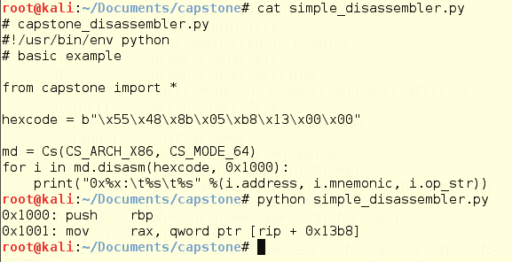

# 一些其他的逆向工程工具

有一大类其他的逆向工程工具，在 Kali Linux 1.x 菜单中列为此类，但在 Kali Linux 2.0 菜单中没有分类。我们不是随机选择其中的一些，而是向您展示了由 Radare2 领导的一套集成工具。

# 运行 Radare2

您可以通过单击逆向工程下的菜单链接来启动 Radare2。您现在可能更习惯于使用命令行，所以您可能想直接在命令行中打开它。通过键入键盘快捷键*Alt* + *F2*来打开命令行启动器。然后，以下命令在新的终端窗口中打开程序的帮助文件：

```
bash -c "radare2 -h" #  this makes sure that you are opening the bash 
 shell  
                     #  rather than some other possible default shell  
                     #  like the dash shell 
```

让我们为您解释一下这个命令：

+   `bash`打开一个 Bash shell。

+   `-c`指示破折号从一个命令字符串中读取，该命令字符串在双引号中跟随，而不是等待键盘的标准输入。

+   `radare2`是我们正在打开的应用程序。

+   `-h`是打开终端窗口中的帮助文件的选项，如果存在的话。`--help`是该选项的长格式（这些选项几乎在每个 Linux 命令行工具上都可用）。

Radare2 是一个高级的命令行十六进制编辑器、反汇编器和调试器。Radare2 ([`radare.org`](http://radare.org))表示 Radare2 是一个具有以下特点的可移植逆向框架：

+   对许多不同的架构进行反汇编（和汇编）

+   使用本地本机和远程调试器进行调试（gdb、rap、webui、r2pipe、winedbg 和 windbg）

+   在 Linux、*BSD、Windows、OSX、Android、iOS、Solaris 和 Haiku 上运行

+   对文件系统和数据进行取证和数据刻录

+   用 Python、JavaScript、Go 等脚本编写

+   支持使用嵌入式 Web 服务器进行协作分析

+   可视化多种文件类型的数据结构

+   修补程序以发现新功能或修复漏洞

+   使用强大的分析能力加快逆向

+   帮助软件开发


Radare2 是一个集成了十个插件和其他几个应用程序的框架的顶端。为了保持 PG 评级，我们模糊了最后一个插件的名称：


# Radare2 工具套件的其他成员

我们将在以下部分讨论 Radare2 工具套件的其他成员。

# 运行 rasm2

rasm2 `/usr/bin/rasm2`是一个用于多种架构的命令行汇编器/反汇编器，例如 Intel x86 和 x86-64、MIPS、ARM、PowerPC、Java 和 MSIL。当 JAD 不再可用时，这可能是你的反汇编工具：


# 运行 rahash2

rahash2 `/usr/bin/rahash`是一个基于块的哈希工具，支持许多算法，例如 MD4、MD5、CRC16、CRC32、SHA1、SHA256、SHA384、SHA512、par、xor、xorpair、mod255、hamdist 和 entropy。你可以使用`rahash2`来检查文件、内存转储和磁盘的完整性，并跟踪变化：

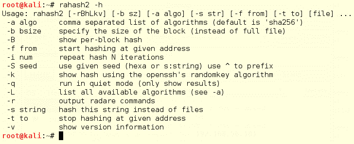

以下是对小文件进行 sha256 哈希测试的示例：


# 运行 radiff2

radiff2 是一个使用各种算法比较文件的二进制实用程序。它支持二进制文件的字节级或增量比较，以及代码分析比较，以找到`radare`代码分析产生的代码块中的变化。以下是一个比较`/var/log/message`日志在几秒钟内的两个状态的测试。这是一个在位级别进行比较的测试，用于随机更改：


# 运行 rafind2

rafind2 旨在在文件中搜索模式。在下面的示例中，`rafind2 -s "string searched" <file>`向我们展示了当我们搜索一个我们知道存在的字符串和一个我们知道不存在的字符串时，我们能看到什么：


# 运行 rax2

rax2 是一个命令行的数学表达式求值器。你可以进行许多转换操作，包括对浮点值、十六进制表示、十六进制对字符串到 ASCII 的基数转换等等。它还支持字节序设置，如果没有给出参数，可以用作交互式 shell：

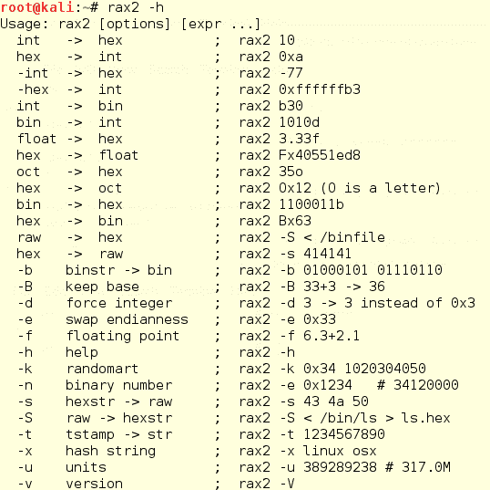

以下是 rax2 的一些示例转换：

+   十进制转十六进制

+   十六进制转十进制

+   八进制转十六进制

+   对两个字符串进行哈希

+   对单个字符串进行哈希


# 压力测试 Windows

接下来，让我们看一些会让你的 Windows 机器哭泣的工具。对系统进行压力测试可以显示出你的机器和网络能承受多大负荷。你也可以进行一个小实验。在 Windows 机器上设置一个服务，在 Linux 机器上设置相同类型的服务，看看哪个能更好地处理负载。结果可能会让你感到惊讶。结果可能会让你问*为什么我要使用 Windows？*

**黑客提示**：

将 Linux 作为你的日常驱动操作系统——我就是！

# 处理拒绝

**ATK6-Denial6**是一个 IPv6 网络压力测试工具，它向目标主机发送数据包并将其击败。这是 ATK6-Denial6 的帮助文件：


以下截图是对易受攻击的 Windows 7 目标机器进行的`nmap -A`读取。我们想要找出它是否有开放的端口，以及它们是哪些端口。我们可以看到端口`139`、`445`、`2869`、`5357`和`10243`是开放的。这个工具的一个大问题是测试网络是 IPv4：


让我们找一个可以攻击我们的 IPv4 网络的工具。

# 让网络陷入围攻

Siege 是一个 Web 压力测试工具。Siege 是一个多线程的 HTTP 负载测试和基准测试实用程序。它旨在让 Web 开发人员在压力下测量其代码的性能。它允许您使用可配置数量的并发模拟用户访问 Web 服务器。

正是这些用户将 Web 服务器置于*围攻*之下。性能指标包括以下内容，每次运行结束时都会进行量化和报告：

+   经过的时间

+   总传输数据

+   服务器响应时间

+   事务率

+   吞吐量

+   并发

+   OK 返回计数

它们的含义和重要性稍后会讨论。围攻基本上有三种操作模式：

+   回归（在被轰炸时调用）

+   模拟互联网

+   蛮力

使用 siege 的格式如下：

+   `siege [options]`

+   `siege [options] [url]`

+   `siege -g [url]`


围攻模拟了 15 个用户访问 Windows 7 目标机器上的网站。总体性能并不算太差。在四分半钟内，网站有 8072 次点击。Windows 7 目标机器保持 100%的可用性，响应时间低于 1/100 秒。

# 配置您的围攻引擎

如果我们将围攻者的数量增加到 10,000，你认为会发生什么？配置文件在`/usr/bin/siege.config`。当我们在命令行上运行时，它告诉我们我们已经有一个本地配置文件在`/root/siegerc`，所以让我们去看看：


要编辑`/root/.siegerc`，我们可以使用命令行或运行启动器（*Alt* + *F2*）输入我们喜欢的文本编辑器的名称。在这里，我们将使用 gedit，所以输入 gedit `/root/.siegerc`。或者，我们可以在`Usual Applications`/`Accessories`文件夹中找到 gedit，打开文件对话框并打开隐藏文件，然后在`/root`目录中找到`.siegerc`。你可能已经开始明白为什么 Linux 管理员如此喜欢命令行了。

在配置文件的第 162 行，您会找到并发用户的数量。当前默认值为`15`，但让我们将其更改为 10,000。让我们看看我们能否破解这个：


在强制关闭 Kali 实例后，让我们尝试使用更少的围攻者。并发用户数量越多，它在您的 Kali 机器上使用的 RAM 也就越多：

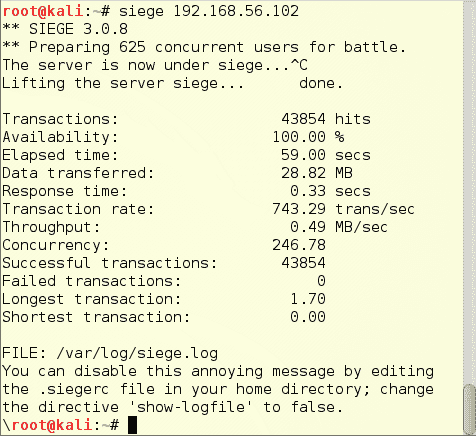

使用 625 个围攻者，我们得到了一个稳定的结果，而没有使测试机器崩溃。期间，我们测试了 5,000、2,500 和 1,250，但它们都使机器崩溃了。如果您有一点乐趣，您可以测试更高的数字，比如 940、1,090 等。您可以使用测试机器上的资源来决定您可以使用的围攻者数量。

# 总结

逆向工程以获得复杂应用的实际代码的明确答案是不太可能的，因为有许多通过循环或选择结构实现相同输出的方法。通过测试其中几种可能的输入处理方法，更容易获得统计列表。您可能会从查看**EDB-Debugger**或**OllyDbg**的汇编代码输出中获得更多细节。您可能已经注意到，Linux 和 Windows 应用程序的汇编代码基本上是相同的。高级语言如 C 和 C++只是访问汇编代码的方式，可以轻松转换为机器代码，告诉机器该做什么。

对 Windows 主机进行压力测试归结为检查它们在任何开放端口上在短时间内接收许多输入的能力。请记住，在进行压力测试时，您将在网络上制造很多噪音，任何正确配置的入侵检测工具都会注意到您的攻击。您还可能使目标机器脱离网络，因此在开始测试之前最好通知管理层。

由于这是最后一章，我们希望您喜欢这本书，也希望您学到了一些东西，以便更好地理解渗透测试和对 Windows 操作系统的利用。

感谢阅读本书。

# 进一步阅读

+   **有关 Radare2 工具套件的更多阅读**：[`rada.re/r/`](https://rada.re/r/)

+   **Radare2 备忘单**：[`github.com/pwntester/cheatsheets/blob/master/radare2.md`](https://github.com/pwntester/cheatsheets/blob/master/radare2.md)

+   **有关 EDB-Debugger 的更多信息**：[`github.com/eteran/edb-debugger`](https://github.com/eteran/edb-debugger) 和 [`codef00.com/projects`](http://codef00.com/projects)

+   **有关 OllyDbg 的更多信息**：[`www.ollydbg.de/`](http://www.ollydbg.de/)

+   **有关 Capstone 的更多信息**：[`www.capstone-engine.org/lang_python.html`](http://www.capstone-engine.org/lang_python.html)
