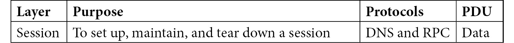

# 八、概述 OSI 模型

有效的数据包分析始于对**开放系统互连** ( **OSI** )模型的深入理解。OSI 模型是一个七层框架，概述了**操作系统** ( **OS** )如何转换、封装和准备数据以便在网络上传输。在本章中，我们将介绍七个层次以及每一层的作用和目的。此外，您将了解在 OSI 模型中，有三层使用特定的地址或标识符。传输层有关联端口，网络层使用**互联网协议** ( **IP** )地址，数据链路层需要**媒体访问控制** ( **MAC** )地址。为了使您能够区分每一层的标识符，我们将回顾并描述每一层的意义。

然后，我们来看看每层的**协议数据单元** ( **PDU** )。

完成后，您将更加熟悉术语，并对每层中的一些协议有更好的理解。从**超文本传输协议** ( **HTTP** )请求当数据从一个网页检索到它在网络上传输的比特，你将知道数据是如何转换的。此外，我们还将了解每个 PDU 如何进入下一层，正确格式化帧，以便使用适当的介质发送数据。

在本章中，我们将讨论以下主要话题:

*   OSI 模型概述
*   发现每层的用途、协议和 PDU
*   探索封装过程
*   在 Wireshark 中演示帧的形成

# OSI 模型概述

OSI 模型是一个七层框架，概述了每层的主要功能，代表了执行特定功能的一组协议。了解该模型将有助于您更好地准备使用 Wireshark 分析流量。此外，您将能够认识到在交易过程中所涉及的协议的角色。

注意

所有协议在网络上都有特定的用途。今天，Wireshark 已经为大多数协议提供了解析器，并且一直在添加新的解析器。

在本节中，我们将后退一步，了解框架是如何开始的，并认识到谁会从使用该模型中受益。

让我们从 OSI 模型背后的灵感开始。

## 开发框架

我们在 20 世纪 60 年代末到 70 年代中期开始了这段旅程，在这段时间里，我们看到了计算的扩展，以及总体技术的进步。除此之外，我们还见证了计算机的发展，从小型个人计算机到超级计算机，如 1976 年的 Cray，以及视频游戏，如 1972 年的 Pong。

在这个开发的同时，两个国际组织，即**国际标准化组织** ( **ISO** )和**国际电报电话咨询委员会** ( **CCIT** )，开始致力于一个参考模型来定义和标准化网络互操作性。最终，在 1983 年，这两个组织开发了 OSI 模型。

OSI 模型有多种用途，包括:

*   为开发人员提供一个通用框架
*   缩小网络管理员的问题范围
*   支持各层和设备之间的互操作性。
*   分解每一层，帮助学生更好地理解数据封装的整个过程。

结果，许多人从使用 OSI 模型中受益，我们将在下面概述。

## 使用框架

虽然 OSI 模型是一个参考模型，但是有许多组织在使用它。这些群体包括:

*   开发人员参考 OSI 模型来概述系统如何相互通信。
*   网络管理员在排除网络故障时，会根据他们认为应对故障负责的层来提及问题。
*   设备制造商依靠 OSI 模型来确保他们的产品能够跨所有层工作。

此外，学生使用该模型开始他们的网络之旅。每个大学新生网络课程的主要内容是 OSI 模型的介绍。在大多数情况下，这些学生从来没有听说过这个，所以以简单的方式提出一个复杂的话题可能是困难的。因为这是他们第一次见面，所以以简单易学的方式传达这一信息很重要。

此外，该模型还提供了每一层中正在发生的事情的可视化描述。该模型定义了协议、PDU 和每层的用途，如下一节所述。

# 发现每层的用途、协议和 PDU

在这一节中，我们将带仔细看看 OSI 模型的七个层中的每一层，并描述以下内容:

*   OSI 模型的各层，从层七层到层一层:**应用**，**演示**，**会话**，**传输**，**网络**，**数据链路**，以及**物理**。
*   在封装过程中使用源寻址和目的寻址的三层:传输、**网络**和**数据链路层**。
*   每个层的 PDU，它定义了数据在通过到上面的层或下面的层时的形状。

在下图中，我们可以看到 OSI 模型的总结:


图 8.1–OSI 模型

在深入研究各层之前，使用记忆方法来记住每一层的第一个字母是很有帮助的。对于 OSI，我们有两个，如下图所示:


图 8.2–OSI 助记符

一旦你知道了这些层的名字，下一步就是解决每个层的角色、目的和协议。

当概述每一层时，我通常从**应用**层开始，因为这是我们开始与网络联系的地方。接下来我们来讨论这个。

## 评估应用层

**应用**层(或第 7 层)包含允许进程间通信的协议，这使我们能够完成以下任务:

*   检索网页
*   获取或发送电子邮件
*   将文件上传到 FTP 服务器
*   请求动态分配的 IP 地址

在 TCP/IP 网络上，每个**应用**层协议根据其功能遵循特定的建议、要求和选项。让我们讨论一下这一层 PDU 的一些协议。

### 探索应用层协议

应用层有数百个协议。许多常见的或众所周知的协议在 20 世纪 80 年代很早就被开发和标准化了。有些已经弃用，我们很少见到，比如 Telnet 和**简单认证和安全层** ( **SASL** )。然而，根据需要，新的协议被开发出来，以跟上今天的需求，例如**受限应用协议** ( **CoAP** )和**消息队列遥测传输** ( **MQTT** )，它们都与**物联网** ( **物联网**)设备一起使用。以下是应用层协议的候选名单:


表 8。1–应用层协议

在许多情况下，这一层的协议涉及一系列客户端请求和服务器响应。接下来，我们来谈谈这一层的 PDU。

### 了解应用层 PDU

**应用层**的 **PDU** 是专用于所用协议的数据。

每个协议的报头结构会有所不同，因为每个协议都是特定于应用的。除此之外，客户端的标头通常不同于服务器的标头。

大多数协议都有一个相关的端口，该端口位于传输层报头中。以下是应用层的总结:


表 8。2–应用层概述

数据离开应用层后，会被传递到**表示层**，以便正确格式化数据。接下来我们来探讨一下。

## 剖析表示层

**表示层**负责正确的数据格式化，以及可选的压缩和加密。这一层确保在将数据呈现给应用(如 Word 文档)之前，或者在将数据发送到网络之前，数据处于正确的格式。例如，如果你从互联网上下载一个扩展名为`.gz`的文件，那么**表示层**将搜索一个与之相关的应用，这样操作系统就可以正确打开该文件。如果没有安装该应用，您将会看到一条消息，如下面的屏幕截图所示:


图 8.3–选择应用的对话框

如果您没有安装应用，那么您可以进入并手动选择您想要用来打开文件的应用,或者获取并安装正确的应用。

**表示层**还提供可选的服务来压缩和解压缩数据。压缩消除了冗余，使数据变得更小。这个函数是可选的，因为不是所有的数据都被压缩。

此外，这一层还处理加密，包括使用密钥对数据进行加扰，使其处于不可读的格式，除非拥有密钥，否则对任何人都没有意义。因为加密也是一个可选功能，所以这可能不是必需的。

在**表示层**中，有一些协议，我们将在下一节和 PDU 一起研究。

### 描述协议和 PDU

在这一层中，协议处理适当的数据翻译和编码/解码，例如**外部数据表示** ( **XDR** )。此外，由于**表示层**在加密中的作用，您会发现以下协议:

*   **传输层安全(TLS)/安全套接字层(SSL)** :这些协议使用加密保护端到端通信，如银行交易和网页检索。
*   **安全/多部分互联网邮件扩展(S/MIME)** :这些协议以数字方式对电子邮件消息进行签名和加密。

在**表示**层， **PDU** 仍然是数据，我们看到数据被翻译或转换成正确的格式。下面的是展示层的总结:


表 8.3-表示层总结

在许多方面，表示层是应用层的扩展。接下来是会话层，在这里我们可以看到会话管理的所有关键元素。

## 了解会话层

**会话**层(或第 5 层)负责建立、维护和拆除会话。在开始与网络联系后交换任何数据之前，操作系统必须建立一个会话。创建会话时，操作系统将创建适当的套接字，即 IP 地址和端口。这是为了使两个端点可以相互交换数据。

在网络上通信时，您将建立多个并发会话和连接。您可以通过进入命令行并运行`netstat`来查看您的活动连接，如下面的屏幕截图所示:


图 8.4-显示活动连接的 Netstat

在前面的截图中，我们只看到了**传输控制协议** ( **TCP** )连接。TCP 是一个面向连接的协议，两个端点都需要相互交流数据事务的状态。因此，您将看到一个本地和外地地址，以及交易的状态。例如，下面表示一个连接:

```
TCP 172.20.4.31:51393 104.118.222.227:443  ESTABLISHED
```

除了管理两个端点之间的通信，**会话**层还提供其他服务，包括:

*   **认证**:通过要求密码或其他形式的认证来验证和识别一个实体。
*   **授权**:如果实体有适当的权限，这允许访问系统资源。
*   **检查点**:它监控会话的错误，并确保所有数据都已接收。如果传输中有错误，会话层可能会重新请求任何丢失的数据。

通信流结束后，**会话**层安全关闭会话。接下来，我们来看看这一层的一些关键协议。

### 识别协议和 PDU

在**会话**层中存在几个协议。尽管大多数协议可能起源于其他层，但这些协议部分始于会话层:

*   **实时传输控制协议(RTCP)** :它与**实时传输协议** ( **RTP** )一起工作，将控制信息传递给所有**IP 语音** ( **VoIP** )呼叫中的参与者。
*   **域名系统(DNS)** :将主机名解析为 IP 地址，以便进行会话。
*   **点对点隧道协议(PPTP)** :这通过使用通用路由封装隧道来创建 VPN，以提供比使用纯文本更安全的方式来传递数据。
*   远程过程调用(RPC) :这允许一个程序在共享网络上的另一个主机上运行一个子程序。

在**会话**层，PDU 是数据。以下是会话层的总结:



表 8.4-会话层总结

**会话**层管理会话的所有方面，使主机能够在对话中相互通信。在这一点上，数据然后移动到**传输层**层，在那里它现在变成一个段，在传输层报头中有必要的端口寻址。

## Appreciating the Transport layer

The **Transport** layer (or layer 4) is responsible for transporting the data, either using a connectionless or connection-oriented protocol across the network. The encapsulation process starts at this layer. The data will have additional headers added as it traverses down the layers to become a frame, ready to be sent on the network.

所选择的传输协议将取决于应用。数据主要使用 TCP 或**用户数据报协议** ( **UDP** )进行传输。然而，传输层还有其他几种协议。让我们来看看它们。

### 区分协议和 PDU

传输层有几个协议来传输数据，包括:


表 8.5-传输层中的常见协议

虽然还有其他一些鲜为人知的传输层协议，但我们将从使用更广泛的 TCP 协议开始，讨论两个主要的协议:TCP 和 UDP。

#### 通过 TCP 提供可靠性

TCP 是面向连接的协议具有端到端的可靠性。TCP 以三方握手开始一个会话，以交换**finish**(**FIN**)数据包结束会话。

TCP 使用 11 字段报头中的字段值主动对数据进行排序和确认，以确保所有数据都到达终端设备。

一旦进入连接，TCP 就会经历一系列状态。例如，在*图 8.4* 中，可以看到`ESTABLISHED`和`TIME_WAIT`状态。

TCP 状态列表如下:

*   **LISTEN** :系统等待远程主机的连接请求。
*   **SYN_SENT** :客户端发出连接请求后，系统等待响应。
*   **SYN _ RECEIVED**:SYN 请求返回给客户端后，服务器等待最终的 ACK 来启动连接。
*   **ESTABLISHED** :这是两个端点主动通信的正常状态。
*   **FIN_WAIT_1** :主机等待响应发送到远程主机的 FIN 的 ACK 或来自远程主机的 FIN 请求。
*   **FIN_WAIT_2** :主机等待来自远程主机的 FIN 请求。
*   **CLOSE_WAIT** :这意味着服务器已经从客户端收到一个 FIN 包，正在等待结束会话。
*   **关闭**:FIN 包发出后，主机开始关闭连接，等待相应的确认，以便完全关闭会话。
*   **LAST_ACK** :发送 FIN 包后进行最终确认，以确保远程主机已收到终止请求。
*   **TIME_WAIT** :发送终止请求后，此状态等待确保远程主机已经收到结束会话的请求。
*   **关闭**:这根本不是一种状态；它代表一个封闭的连接。

对于面向连接的会话，获取通信流的所有部分非常重要，TCP 是传输层协议的首选。然而，当需要数据传输的速度时，UDP 是更好的选择。UDP 是一种只有四个字段值的无连接协议，我们将在下面学习。

#### 使用 UDP 确保及时交付

UDP 是一种无连接的轻量级传输层协议，它有一个四字段的报头。UDP 没有任何握手或连接过程、排序或可靠性服务，也没有拆卸。作为一个轻量级协议，它非常适合速度是一个问题的地方，并且用于时间敏感的应用，例如:

*   **动态主机配置协议** ( **DHCP** )
*   **路由信息协议** ( **RIP** )
*   **网络电话(VoIP)**
*   **琐碎的文件传输协议** ( **TFTP** )。

无论使用 TCP 还是 UDP，传输层都是确保数据传输的关键组件。在封装过程中，数据开始转换，PDU 现在是一个数据段。此时，传输层需要一个端口号(或地址),该端口号与正在使用的应用或进程相关联。这将在下一节讨论。

### 提供端口寻址

在传输层，我们添加一个端口地址，用于标识特定的应用或进程。端口号分为三大类:

*   **众所周知的**端口范围在 1 到 1，023 之间，包括 HTTP、DNS 和 SMTP 等协议。
*   **注册的**端口范围在 1，024 到 49，151 之间，被分配并用于特定服务，如游戏应用、OpenVPN 和 IPsec。
*   **动态**、**私有**或**短暂**端口在 49，152–65，535 的范围内，并且没有分配给任何特定的应用。它们通常由客户端在会话期间临时使用。

当传输层报头应用于数据时，会添加源端口和目的端口。使用的端口类型取决于数据包是来自客户端还是服务器:

*   如果一个**客户端**发送一个数据包，那么源端口将是(在大多数情况下)一个随机分配的动态或临时端口。因此，当服务器向主机发送数据包时，它会使用该端口来发送数据。
*   如果一个**服务器**发送一个数据包，那么源端口将是一个众所周知的端口或者是一个注册端口。

传输层提供端点之间的主机间通信。下面概述了传输层:


表 8.6-传输层总结

传输层之后，下一层是网络层。正如我们将在下一节中看到的，这一层完全是为了将数据传输到正确的网络。

## 解释网络层

**网络**层(或第 3 层)有两个关键作用:寻址和路由数据。这一层使用逻辑 IP 地址提供寻址。此外，**网络**层确定通过其他网络传输的数据包的最佳逻辑路径，以便它们能够到达目的地。它通过在路由过程中与其它设备通信来实现这一点。

除了数据转发之外，网络层还会传达传输中的错误。为了实现这一点，网络层有几个关键协议，我们将在下一节看到。

### 区分协议和 PDU

网络层负责寻址和路由。这一层的主要有三个协议:IP、**地址解析协议** ( **ARP** )、以及**互联网控制消息协议** ( **ICMP** )。先说 IP。

#### 用 IP 路由数据包

IP 是一种尽力而为的无连接协议，它使用逻辑 IP 地址将数据包从源路由到目的地。

多年来，TCP/IP 套件中的许多原始协议都有微小的变化、更新和修改。然而，IP 不得不做出重大改变，这主要是由于缺少地址空间。因此，有两个版本的 IP: IPv4 和 IPv6。以下是两者的简要比较:

*   **IPv4** 有一个 32 位地址空间。私有 IP 地址的使用延长了 IPv4 在局域网上的寿命，但是向 IPv6 的迁移很慢。
*   **IPv6** 拥有 128 位的地址空间，并提供了对该协议的总体增强，例如简化的网络配置和更高效的路由。

接下来，我们来看看 ARP，它将 IP 地址解析为 MAC 地址。

#### 使用 ARP 解析地址

IP 通过网络将流量路由到目的局域网。当一个包到达局域网时，它不再需要 IP 地址。它需要一个物理地址或 MAC 地址才能到达目的地。ARP 发出广播，将 IPv4 地址解析为 T2 局域网 T3(T4 局域网 T5)上的 MAC 地址，这样就可以传送帧。

注意

ARP 是一种不常见的协议，因为它出现在 OSI 模型的第三层和第二层之间。ARP 将 IP 地址(网络层)解析为 MAC 地址(数据链路层)地址。然而，许多人认为它是第三层协议。

除了 IP 和 ARP，我们还需要 ICMP 来帮助报告数据传输过程中可能出现的任何问题。这将在下一节讨论。

#### 使用 ICMP 传送消息

ICMP 是另一个重要的网络协议。但是，ICMP 不交换或传输数据。它的主要作用是错误报告。因为 IP 是一个尽力而为的、不可靠的协议，ICMP 必须由每个 IP 模块来实现，正如最初的**征求意见稿** ( **RFC** )中所概述的，可以在[https://tools.ietf.org/html/rfc792](https://tools.ietf.org/html/rfc792)找到。ICMP 报告传输过程中遇到的任何问题，例如网络不可达和主机不可达。因为有两个 IP 版本，所以有两个 ICMP 版本:

*   **IPv4** 使用 ICMP。
*   **IPv6** 使用 ICMPv6。

在封装过程中，网络层的 PDU 是一个数据包。网络层负责路由和寻址数据。一个关键要素是 IP(或逻辑)地址，如下所述。

### 为数据包提供 IP 地址

在这一层，IP 报头将保存 IPv4 格式或 IPv6 格式的源地址和目的地址。两者都被称为逻辑地址，并表示为如下:

*   IPv4 地址有 32 位，Wireshark 将使用点分十进制表示法显示。
*   IPv6 地址有 128 位，Wireshark 将使用由冒号分隔的十六进制数字来显示。

在上一节中，我们讨论了另外两种协议:ARP 和 ICMP。让我们结合寻址的需要来讨论这两个问题。

我们知道 IP 使用包含 IP 地址的报头。但是，ARP 和 ICMP 都是独特的，如下所述:

*   **ARP** 没有 IP 报头。ARP 是一种将 IPv4 地址解析为 MAC 地址的服务协议。
*   **ICMP** 是 IP 的伙伴协议，它报告传输过程中遇到的问题，例如网络不可达和主机不可达。ICMP 本身不需要 IP 地址，因为它封装在 IP 报头中，如以下 ICMP 回送请求的屏幕截图所示:


图 8.5–ICMP 回应请求

到目前为止，您应该已经了解网络层通过提供逻辑寻址和路径确定，允许不同网络上的主机相互通信。

下表概述了网络层:


表 8.7-网络层总结

随着数据被封装并沿 OSI 模型向下传递，下一步是**数据链路层**,其中一个关键作用是正确的帧形成，以便帧可以在局域网上传输。让我们来看看。

## 检查数据链路层

**数据链路**层(或第 2 层)主要关注正确的帧形成，并在数据在网络上发送之前准备好数据。在**数据链路层**层中，有几个协议负责正确格式化数据，以便数据能够在目的网络上成功传输。接下来让我们关注几个关键的**数据链路层**协议。

### 研究协议和 PDU

数据链路层是数据沿着 OSI 模型传输的最后一站，因为这一层添加了帧头和帧尾来为网络准备帧。这一层使用的协议包括:

*   **以太网 II** 是当今应用最广泛的以太网技术。它使用物理(或 MAC)地址在 LAN 上建立连接。
*   **高级数据链路控制** ( **HDLC** )使用帧将数据从点到点传送。

在这一层，PDU 是一个帧。每个帧都需要一个地址，我们将在下面概述。

### 描述数据链路层地址

在局域网上，**数据链路层**使用目的机器的 MAC 地址而不是 IP 地址。数据链路层有一个帧头，包含源和目的 MAC 地址，也称为物理地址。预告片，或帧校验序列，保存一个称为**循环冗余校验** ( **CRC** )的值，用于网络上的错误检测。

下表总结了数据链路层:


表 8.8-数据链路层总结

数据链路层确保通过网络介质传输时，帧的格式和链路的访问正确，并能进行错误检测。然后，数据传输到物理层，我们将在下一节中看到。

## 穿越物理层

物理层(或第一层)通过媒体以比特流的形式传输数据。

一旦数据被格式化成帧，**网络接口卡** ( **NIC** )就以比特流的形式将其发送到网络媒体。

### 示例协议

在物理层，有几种不同的协议用于通过网络介质传输数据:

*   **数字用户线** ( **DSL** )通过电话线为的居民和企业提供宽带。
*   **综合业务数字网** ( **ISDN** )利用**公共交换电话网** ( **PSTN** )传输语音、视频和数据。ISDN 主要用于广播行业。
*   **IEEE 802.3**—以太网物理层—根据媒体类型定义传输属性，如快速以太网、**千兆(GB)** 以太网。

物理层是通过网络介质进行二进制传输的地方。让我们回顾一下这一层的 PDU。

### 描述 PDU

在这一层，帧形成完成并准备在介质上传输。PDU 是最基本的形式，即比特。传播的方法将取决于媒介。

网络媒体包括以下内容:

*   **铜缆**采用**非屏蔽双绞线** ( **UTP** )、**屏蔽双绞线** ( **STP** )，或者同轴；用电脉冲传输
*   **光纤**使用多模或单模电缆；用光脉冲传输
*   **无线**使用 802.11 规范；通过无线电波传输

下表总结了物理层:


表 8.9-物理层概述

在通过网络传输之前，数据必须采用正确的格式。下一节将探讨封装过程，即添加报头和地址，并为通过介质传输数据做好准备。

# 探索封装过程

现在我们已经对各层有了了解，让我们看看在封装过程中各层如何协同工作来创建一个帧。

在帧形成期间，该过程从数据开始。随着数据沿各层向下移动，一个接一个地添加报头，直到帧完整。每个框架都有以下组件:

*   数据和适当的应用层报头(如果适用)
*   段标题
*   数据包(或 IP)报头
*   帧头

我们将从帧的数据部分开始。

## 查看数据

在大多数情况下，当帧形成和封装开始时，我们从数据开始，如下所示:


图 8.6-封装过程-数据

该数据可能是以下任何一种:

*   HTTP `GET`请求
*   将主机名解析为 IP 地址的 DNS 请求
*   请求动态分配 IP 地址的 DHCP 广播

然后，数据继续它的旅程，成为一个片段。

## 识别细分市场

接下来发生的事情是数据将(在大多数情况下)变成使用 TCP 报头或 UDP 报头的数据段:


图 8.7–封装过程-分段

该段包含一个源和目的端口地址，如图 8.7 所示。封装过程的下一步是添加 IP 报头，使其成为数据包。我们接下来将讨论这一点。

## 表征数据包

随着数据被封装，我们现在有了数据，以及保存 TCP 或 UDP 端口地址的数据段。封装的下一部分是通过将源和目的 IPv4 或 IPv6 地址添加到 IP 报头来创建数据包，如下所示:


图 8.8–封装过程—数据包

封装过程的最后一部分是添加帧头，这将在下一节中演示。

## 形成框架

创建框架之旅的最后一站是添加标题。在该框架中，我们有以下内容:

*   数据，如 HTTP 请求或 DNS 回复
*   传输层报头(或数据段)
*   网络层报头(或数据包)

此时，我们通过添加源 MAC 地址和目的 MAC 地址来完成帧，如下所示:


图 8.9-封装过程-框架

对于一个帧，我们不仅有一个帧头，还有一个帧尾，称为**帧校验序列** ( **FCS** )。FCS 保存一个称为循环冗余校验的值，该值用于网络上的错误检测,并在行进途中被校验。

注意

FCS 用于错误*检测*，而不是错误*校正*。

下一节将介绍当 Wireshark 捕获流量并将其呈现给用户时，帧的结构是什么样子。

# 演示 Wireshark 中的帧结构

一旦您理解了封装和帧形成，您将能够学习 Wireshark 如何表示帧形成，如下面的截图所示:


图 8.10-Wireshark 中的帧结构

注意

并非所有帧都包含数据；然而，这一个有，所以它是一个完全封装的帧的好例子。

查看单个帧时，您会在*图 8.10* 的顶部看到`Frame 4371`行，这是关于该单个帧的*元数据*，它总结了该帧的内容。该帧的元数据包括诸如`401 bytes on wire`和`401 bytes captured`的信息。

在帧元数据之后，您将看到以下内容:

*   **帧**:帧头显示以太网 II，之后是源和目的 MAC 地址。
*   **数据包**:IP 头代表网络层，保存源和目的 IP 地址。
*   **段**:TCP 报头代表传输层，它保存源和目的端口地址。
*   **数据**:HTTP 头表示应用层。在这种情况下，它是一个 web 请求。

这是 Wireshark 如何显示封装过程及其与 OSI 模型关系的示例。

既然您已经了解了 Wireshark 中的封装过程和帧形成过程，那么让我们来看看 NIC，看看 OSI 模型在您自己的系统上的运行情况。

## 检查网络绑定

在你自己的笔记本电脑或台式机上，你可以很容易地看到 OSI 模型的运行。如果您检查您的网络连接，然后选择您的网络接口卡的属性，如下面的屏幕截图所示，您可以看到 OSI 模型中的各层是如何表示的:


图 8.11–网络绑定

下面描述了不同的层以及它们在**以太网属性**中的表现方式:

*   数据链路层和物理层在网卡中表示。
*   微软网络的**客户端和微软网络**的**文件和打印共享中表现了应用层、表示层和会话层。**
*   网络层显示为**互联网协议(TCP/IP)** 。

到目前为止，您应该能够识别 OSI 模型的每一层，以及每一层在 Wireshark 中是如何表示的。

# 总结

在本章中，我们仔细研究了一个重要的概念，OSI 模型和封装过程。OSI 模型是一个服务于多种目的的框架。该模型为开发人员提供了一个通用框架，并提供了一种方法来帮助学生理解每一层发生的过程。除此之外，了解每一层、PDU 和寻址将有助于您更好地理解 Wireshark 中的流程，并提高您的数据分析技能。

至此，您应该对每一层的作用、目的、协议和 PDU 有了更好的理解。我们探讨了封装过程，并研究了 Wireshark 中的帧结构。为了帮助您理解您的系统如何使用 OSI 模型，我们查看了该模型在网络绑定中是如何表示的。

在下一章中，我们将仔细研究如何解码两个主要的传输层:TCP 和 UDP。我们将首先回顾传输层的用途，然后讨论 TCP 并研究 Wireshark 中的 11 字段报头格式。然后，我们将对 UDP 的目的进行概述，并检查四个字段的报头和每个字段值的重要性。

# 问题

现在是时候检查你的知识了。选择最佳答案，然后将您的答案与*评估*附录中列出的答案进行核对:

1.  ____ 层或第 5 层负责建立、维护和拆除会话。
    1.  运输
    2.  应用
    3.  会议
    4.  介绍会；展示会
2.  ____ 层或第 4 层负责传输数据，要么使用无连接协议，要么使用面向连接的协议。
    1.  运输
    2.  应用
    3.  会议
    4.  介绍会；展示会
3.  ____ 层或第 6 层负责正确的数据格式化以及可选的压缩和加密。
    1.  运输
    2.  应用
    3.  会议
    4.  介绍会；展示会
4.  TCP 端口`334`在 _____ 端口范围内。
    1.  短暂的
    2.  众所周知
    3.  注册的
    4.  安全的
5.  传输层的 PDU 是 _____。
    1.  数据
    2.  基本框架
    3.  小包裹
    4.  段
6.  ARP 没有(n) ___ 报头，因为它是一种将 IPv4 地址解析为 MAC 地址的服务协议。
    1.  数据传输器
    2.  基本框架
    3.  互联网协议(Internet Protocol)
    4.  段
7.  在局域网中，数据链路层使用目的机器的 _____ 地址，而不是 IP 地址。
    1.  测量与控制(Measurement and Control)
    2.  短暂的
    3.  小包裹
    4.  段