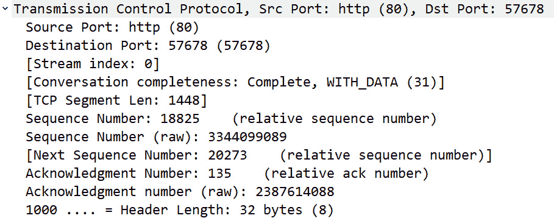

# 九、解码 TCP 和 UDP

自从 20 世纪 80 年代早期标准化以来，**传输控制协议/互联网协议** ( **TCP/IP** )套件已经定义了数据如何被寻址、打包、传输和路由。多年来，TCP/IP 套件已经过修改，以在当今不断变化的网络中提供更高的效率。本章将重点介绍该套件的 TCP 部分，即**开放系统互连** ( **OSI** )模型的传输层(或第 4 层)。第 4 层有几种传输数据的协议；然而，我们将重点放在最广泛使用的传输层协议，TCP 和 UDP。

在本章中，我们将首先回顾传输层的作用和目的。然后，我们将进一步了解 TCP(一种面向连接的协议)及其用途。为了便于您分析 TCP，我们将详细检查报头格式和字段值，例如序列号、偏移量、**窗口大小** ( **WS** )和 TCP 标志。我们将回顾一下**用户数据报协议** ( **UDP** )，并讨论这种轻量级、无连接协议的常见用途。我们将通过检查 UDP 的简化的四字段报头来结束。

本章将涵盖以下内容:

*   查看传输层
*   描述 TCP
*   检查 11 字段 TCP 报头
*   了解 UDP
*   发现四字段 UDP 报头

# 查看传输层

OSI 模型的传输层负责通过在 IP 网络上使用无连接或面向连接的协议来提供端到端的数据传输。所使用的传输协议将取决于应用。

除了 TCP 和 UDP 之外，这一层还有几个协议，包括:

*   **可靠数据协议** ( **RDP** ):用于以面向连接的方式传输数据
*   **流控制传输协议** ( **SCTP** ):为有多个 IP 地址的数据流提供可靠的传输

虽然还有其他传输层协议，但两个主要的协议是 TCP 和 UDP，如下图所示:

图 9.1-OSI 模型-传输层

UDP 是无连接的，在需要快速传输数据时使用。UDP 有一个轻量级的四字段报头，其长度总是 8 个字节。

注意

与 TCP 不同，UDP 目前没有任何报头选项。然而，由于互联网不断变化的特性，人们一直在积极讨论是否可能包含 UDP 选项。你可以查看名为*UDP*传输选项的草案，这里:[https://www . IETF . org/archive/id/draft-IETF-tsvwg-UDP-Options-13 . txt](https://www.ietf.org/archive/id/draft-ietf-tsvwg-udp-options-13.txt)。

与 UDP 相反，TCP 是面向连接的协议。它有一个 11 字段的标题，能够包含选项。在下一节中，我们将了解该协议在监控拥塞和提供流量控制的同时确保完整数据传输的能力是多么令人印象深刻。

# 描述 TCP

TCP 是面向连接的协议具有端到端的可靠性。这两个重要特征描述如下:

*   **面向连接**意味着在传输任何数据之前，两个端点必须建立连接。要开始一个会话，TCP 以一次(三方)握手开始，以一系列**finish**(**FIN**)数据包结束，从而结束会话。
*   **端到端可靠性**是指在数据传输过程中，数据被排序和确认。所有数据都被仔细监控，如果传输中有任何间隙，TCP 将请求任何丢失的数据包。

两台主机建立连接后，TCP 会监控会话，以确保数据传输完成，而不会给主机或网络造成过度压力。在下一节中，我们将总结 TCP 连接期间发生的情况。

## 建立和维护连接

使用 TCP 时，在进行任何数据交换之前，会话必须从主机之间的三方握手开始。握手确立了对话的参数。在开始通信之前，客户端和服务器必须就所有参数达成一致。

在许多情况下，除了 TCP 报头之外，还有报头选项来概括和进一步定义对话的参数。

任何 TCP 选项都可以在三次握手的前两个数据包中找到。例如，两个常见选项如下:

*   **窗口缩放**:通过提供乘数来扩展*规定的* WS 的值，该乘数更准确地反映了*真实的* WS。
*   **Selective Acknowledgements** (**SACK**): When SACK is enabled, the receiver will notify the sender only if there are any missing packets.

    注意

    TCP 选项将在第十章 、*管理 TCP 连接*中详细介绍。

一旦两台主机之间建立了连接，本地和外部(或远程)主机的操作系统都会创建一个套接字，它是一个 IP 地址和一个端口。

要查看 Windows 机器上所有活动的 TCP 连接，请打开命令行提示符并运行`netstat -anp tcp`。这将显示您的活动连接。

在顶部，您会看到以下标题:

原始本地地址外部地址状态

这些定义如下:

*   `Proto`(协议)
*   `Local Address`(本地 IP 地址和端口)
*   `Foreign Address`(远程 IP 地址和端口)
*   `State`连接的

运行`netstat`命令后，我的输出如下:

图 9.2–显示 TCP 连接状态的 Netstat

在*图 9.2* 中，您会看到一个*本地* IP 地址和端口，以及一个*外地*(或远程)IP 地址和端口。例如，在第一行中，我们看到以下内容:

*   `Proto` : `TCP`
*   `Local Address` : `10.0.0.148:49559`
*   `Foreign Address` : `172.249.124.141:5223`
*   `State` : `ESTABLISHED`(或主动沟通)

在对话过程中，TCP 会确认收到的所有数据包，以确保数据的完整传递。每次 TCP 收到数据，接收方主机都会向发送方发回一个**确认** ( **ACK** )数据包，通知发送方收到了什么数据。

会话结束后，TCP 通过交换 FIN 数据包来结束会话。

接下来，让我们看看这个强大的协议是如何帮助控制数据流和减少网络拥塞的。

### 管理流程

在连接过程中，TCP 主动监控连接，发送方和接收方不断相互通信。在数据交换期间，TCP 将按如下方式管理主机和网络的数据:

*   **流量控制**是一种使用 WS 的端到端控制方法，因此发送方不会传输太多数据，并且*会淹没主机*。
*   **拥塞控制**防止一个节点发送过多数据*使网络*不堪重负。

当提供拥塞控制时，有两个在数据传输期间计算的状态变量:

*   **拥塞窗口** ( **Cwnd** ):发送方限制定义了主机在接收到确认之前可以发送*的数据量。*
*   **接收窗口** ( **Rwnd** ):接收端限制定义了主机可以接收的数据量。

在 TCP 连接中，这两个变量共同调节数据流，最大限度地减少拥塞，并提高网络性能。

很难相信，但是在一个单独的帧中有大量的细节，并且每个帧可以包含许多组件。组件可以包括各种标题、标题中的字段值和可选数据。在下一节中，我们将查看单个 TCP 帧中的所有信息。

## 探索单个 TCP 帧

要深入了解 TCP 报头，请访问 https://www.cloudshark.org/captures/0012f52602a3 的。在 Wireshark 中下载并打开`HTTP.cap`数据包捕获文件。

如下面的屏幕截图所示，选择`Frame 4`并关注数据包细节窗格:

图 9.3–帧 4 的数据包详细信息窗格

每个标题都有一个摘要，后面是标题的详细信息。要查看协议摘要，将光标放在协议上，单击右键，然后选择**协议首选项**，如下所示:

图 9.4–TCP 的协议首选项

进入后，选择**显示协议树**中的 TCP 摘要，如图所示。此外，您可以通过单击右侧的箭头(或插入符号， **>** )来展开标题，以查看详细信息。

我们来分解一下`Frame 4`的各个元素，从画面细节开始。

### 描述框架细节

从*图 9.3* 的顶部开始，我们看到`Frame 4`。点击左侧的箭头展开框架标识符，查看如下详细信息:

图 9.5–单个帧上的帧元数据

注意

标识符`Frame`不是一个协议，它是由 Wireshark 生成的值列表，描述关于单个帧的信息(或元数据)。

如*图 9.5* 所示，我们看到的是关于`Frame 4`的元数据，它总结了帧的内容，比如帧长度和任何着色规则。

下一个标识符开始真正的帧封装，正如我们看到的`Ethernet II`报头。

### 扩展以太网 II 报头

(真正的)帧头是`Ethernet II`帧，这是一种常见的帧格式，可以在**局域网** ( **局域网**)上找到。帧头跟随元数据摘要，并提供关于源和目的**媒体访问控制** ( **MAC** )地址的信息，如下面的截图所示:

图 9.6–帧标题

在报头中，我们在帧的最后一行看到了下面的:`Type: IPv4 (0X0800)`。这意味着跟在后面的下一个报头是 IPv4 报头，我们接下来将对此进行研究。

### 查看 IP 报头

`Internet Protocol Version 4`报头以包括源和目的地 IP 地址的总结开始，随后是 IPv4 字段值。

注意

IPv4 报头将在第十一章 、*分析 IPv4 和 IPv6* 中详细介绍。

`Frame 4`的 IPv4 报头如下图所示:

图 9.7–IP v4 报头

类似于帧头，我们在帧内看到下面的:`Protocol: TCP (6)`。这意味着接下来的下一个报头是 TCP 报头。

### 导航 TCP 报头

TCP 报头以标识符`Transmission Control Protocol`开始，并列出源和目的地端口、序列和确认号。此外，您还会看到 Wireshark 生成的数据，显示在`[ ]`中，比如`[Stream index: 0]`。

`Frame 4`的 TCP 报头如下图所示:

图 9.8–TCP 报头

这里我们看到了 TCP 报头的细节。在这种情况下，我已经禁用了协议树协议首选项中的 **Show TCP summary，因此整个报头能够适合页面。**

`Frame 4`的最后一个组件是**超文本传输协议** ( **HTTP** )头。

### 检查 HTTP 头

因为客户端正在从 web 服务器请求数据，所以使用的应用是 HTTP。在这种情况下，我们会看到 HTTP 标头，如下所示:

图 9.9–HTTP 标题

注意

HTTP 协议将在 [*第十五章*](B18389_15_ePub.xhtml#_idTextAnchor298) 、*解码 HTTP* 中详细介绍。

既然我们已经介绍了单个帧中的细节，让我们详细检查 TCP 报头和每个字段值的。

# 检查 11 字段 TCP 报头

TCP 有一个 11 字段的报头。字段包含跟踪对话的值，如下图所示:

图 9.10–TCP 报头

TCP 使用字段的值来监控通信。一旦接收到所有字节，TCP 将指示终端设备已成功接收到所有数据。如果在数据传输过程中出现问题，TCP 会提醒另一台主机任何丢失的数据段。

在本节中，我们将查看每个报头字段，以便您更好地理解 TCP 如何能够在主机之间提供可靠的通信。在适当的时候，我将以下面的方式列出字段和大小，`[Field: Size]`，以便您理解组成 TCP 报头的值。

从`HTTP.cap`的`Frame 4`中的 TCP 报头顶部开始，我们可以看到标签`Transmission Control Protocol`，如图*图 9.8* 所示。在标签下方，您可以看到 TCP 报头字段。

查看 TCP 报头内容时，Wireshark 生成的任何信息都会显示在括号中。这些生成的内容将帮助您更好地理解标题的细节，例如`[Timestamps]`和`[SEQ/ACK analysis]`，如靠近*图 9.8* 底部所示。

让我们从端口和 TCP 数据段长度开始，逐步查看前几个报头字段。

## 探索 TCP 端口

在 Wireshark 中，您可以解析物理、网络和传输层地址。数据包捕获`HTTP.cap`使用传输层名称解析。因此，只要使用已知或注册的端口，Wireshark 就会识别与该端口号相关联的应用。比如 HTTP 使用端口`80`，使用端口`80`时会被识别为 HTTP。

下面列出了端口号，以及 Wireshark 提供的生成信息，如`Stream Index`和`Segment Length`:

*   **源端口 16 位** : `Frame 4`是客户端对服务器的请求。通过指示一个端口号，告诉服务器，*当你传送数据时，使用这个端口*。在这种情况下，值为`Source Port: 57678 (57678)`，其中不与任何应用相关联；它是在此连接中使用的短暂(或临时分配的)端口。因此，您不会看到端口号前列出的协议。
*   **目的端口 16 位** : `Frame 4`是客户端对服务器的请求，很可能是 web 服务器，因为值是`Destination Port: http (80)`。
*   **流索引**:该值显示在括号中，Wireshark 计算该值以跟踪流的，其中每个流是两个端点之间的通信。在`Frame 4`中，我们可以看到`[Stream index: 0]`，这意味着这是该捕获中的第一个流。该值在进行分析时是一个有用的工具，因为您可以轻松地右键单击一个帧并选择**跟随**，然后选择一个流(如 TCP 或 HTTP ),如下面的屏幕截图所示:

图 9.11–顺流而下

*   **对话完成度**:这个生成的值表示对话是否完成。在这种情况下，我们看到`Complete, WITH_DATA (31)]`。这意味着捕获的对话是完整的，因为它具有完整对话的所有元素，例如握手、数据传输和 FIN 数据包交换。
*   **TCP 段长度**:在传输层，**协议数据单元** ( **PDU** )是一个段。段长度是 TCP 有效载荷的值，它是 TCP 报头和任何选项之后的数据。Wireshark 计算该值，如括号中所示。在`Frame 4`中，我们可以看到`[TCP Segment Len: 134]`，它与`TCP payload (134 bytes)`的值相同，如*图 9.8* 最后一行所示。

接下来，我们将看看记录数据传输期间发送和接收的数据的字段。

## 排序字节

因为 TCP 是面向连接的协议，所以操作系统跟踪收到的每个字节(或八位字节)数据。每个字节被排序，一旦被接收，就被确认。三次握手开始排序过程。

在看序列号之前，让我们讨论一下它们是如何计算的。

### 同步序列号

在交换数据之前，客户端和服务器必须同步序列号。这是通过使用 TCP 报头中的**同步** ( **同步**)标志来实现的。SYN 数据包位于三次握手的前两个数据包中，负责同步连接期间使用的序列号。

例如，如下面截图中的所示，客户端向服务器发送一个 SYN 数据包，其**序列** ( **SEQ** )编号为`100`:

图 9.12-三次握手

注意

在本例中，序列号 100 是随机选择的。在实际的 TCP 连接中，操作系统将生成一个随机序列号来启动该过程。

服务器通过发送带有序列号`300`和 ACK`101`的**同步确认** ( **SYN，ACK** )进行响应。客户端发送一个序列号为`301`的最终 ACK 和一个序列号为`101`的 ACK。序列号现在已同步。

注意

你可以在`HTTP.cap`的前三包里看到一个的例子三次握手。

接下来，我们将评估 Wireshark 在分析数据时如何表示序列号。

### 了解序列号

当处理数据包捕获时，您可以选择如何表示您的序列号。Wireshark 能够生成*相对*序列号，主要是因为*实际*(或绝对)序列号非常大。相对序列号易于理解，表示与特定对话的值相关的值*。*

要进行切换，右击 TCP 报头的任意位置，选择**协议首选项**，然后选择**相对序列号**。

请记住，为了显示相对序列号，您还必须选择**分析 TCP 序列号**，如下图所示:

图 9.13-协议首选项-相对序列号

这将把序号调整为更容易理解的值。

使用相对序列号时，绝对序列号在下方显示为`Sequence Number (raw): 3344099089`，如以下截图所示:

图 9.14–查看序列号

现在你已经了解了序列号是如何产生和显示的，让我们看看在数据传输过程中它们是如何表示的。

### 查看序列字段值

正如我们所知，处理序列的字段值有助于提供 TCP 连接期间交换的数据的快照。这些字段如下所示:

*   **序列号(32 位)**:握手结束后，数据流开始。在`Frame 4`中，我们可以看到`Sequence number: 18825 (relative sequence number)`。
*   **序列号(原始)**:该值代表未改变的序列号。在`Frame 4`中，我们可以看到值为`3344099089`。
*   **下一个序列号**:括号内为计算值。Wireshark 将当前序列号添加到 TCP 数据段长度中，以获得下一个序列号。

除了对数据进行排序，TCP 还会确认所有数据的接收。

## 确认数据

在数据传输过程中，操作系统通过使用序列号来跟踪所有字节和重新排序。每次操作系统接收数据时，接收主机都会确认数据已收到，并准备好接收更多数据，从下一个预期字节开始。

该过程与服务器发送数据同时发生。因此，它被称为**期望确认**。如下图所示，客户端向服务器发送 ACK，声明他们已经收到 524 字节的数据，并准备好接收更多数据，从 525 字节开始:

图 9.15–确认数据

在 TCP 报头中，有几个用于确认收到数据的字段。这些字段如下所示:

*   **确认号 32 位**:在`Frame 4`中，我们可以看到值为`Acknowledgment Number: 1 (relative ack number)`。该值为`1`，因为它是来自客户端的第一个数据包。
*   **确认号(原始)**:该值代表未更改的确认号。在`Frame 4`中，我们可以看到值为`3344080265`。

在图 9.14 中*确认号后的一行，您会看到`1000`。这一行代表数据**偏移**字段，它以 32 位倍数表示 TCP 报头的长度。先说这个值是怎么算出来的。*

### 计算偏移

固定 TCP 报头字段的大小是 20 字节。然而，在当今的网络中，TCP 报头通常具有额外的选项。因此，该值并不总是一致的。为了使接收设备知道数据何时开始，**偏移**字段将指示报头的*长度*，因为紧接在 TCP 报头之后，数据部分开始。

`Frame 4`的 TCP 报头按以下方式计算:

1.  偏移值为`1000`，二进制等于八(8)。
2.  偏移量以四(4)个字节为增量。
3.  计算出的 TCP 报头长度: *8 * 4 = 32* 字节。

`Frame 4`的偏移值(或 TCP 报头)是 32 字节。

评估 TCP 报头时，请记住以下几点:

*   *最小* TCP 报头长度为 20 字节。
*   *最大* TCP 报头长度为 60 字节。

如果您想快速检查报头长度，将光标放在`Frame 4`的 TCP 报头上，该值将反映在状态栏中，如下所示:

图 9.16–查看 TCP 报头长度

在跟踪数据交换的同时，TCP 报头中的另一个重要元素是标志的使用，这将在下一节中讨论。

## 跟随旗帜

TCP 标志用于指示对话期间的特定状态。有些是常见的，比如 ACK、FIN、SYN 但有些在实际应用中很少见到。TCP 有八个控制标志，如下所示:

表 9。1–定义 TCP 控制标志

TCP 标志在被设置时，将讲述 TCP 连接的故事。Wireshark 将在数据包列表窗格的`Info`列中反映这一状态:

图 9.17–查看 TCP 标志

注意

TCP 被广泛使用，标志对于控制每个会话非常重要。但是，TCP 标志可以被恶意使用来发起攻击或逃避检测。因此，安全分析器应确保对设备进行调整，以监控 TCP 标志的非标准和不当使用。

TCP 标志提供了对话过程中正在发生的事情的指示。保持数据移动是很重要的。正如我们将在下一节中看到的，WS 用于通知发送方主机在任何给定时间可以接收多少数据。

## 解剖窗口大小

TCP 是一种全双工通信协议，其中发送方和接收方不断地相互通信。在激活的连接期间，会发生以下情况:

*   服务器向客户端发送数据。
*   客户端用一个 ACK 和一个 WS 值(以字节为单位)来响应，WS 值表示客户端可以接受多少数据。

通过每个 ACK 传输 WS 有助于控制数据流。让我们来谈谈这是如何工作的。

### 控制流量

流量控制是 TCP 使用的一种协议。在此过程中，客户端会在每个 ACK 中发送一个 WS，这样发送方就不会传输太多数据而使主机不堪重负:

1.  如果客户端无法处理所有数据，客户端将发送一个具有较低 WS 值的 ACK。
2.  一旦客户机通告了一个较小的 WS，服务器就抑制数据传输。
3.  当客户端恢复并能够接受更多数据时，客户端会发送一个 ACK，其中包含反映新值的窗口更新。
4.  然后，服务器可以继续发送数据，直到所有数据都发送到客户端。

请记住，WS 值可以在对话过程中随时更改。

注意

流量控制的一个相关术语叫做**滑动窗口**，因为随着端点调整它可以接受的流量，该值将来回滑动。

在`Frame 4`的情况下，我们可以看到`Window: 46`:

图 9.18–查看窗口大小

尽管客户端已经指示 WS 为 46 字节，但是这个值很可能更大。先说为什么这个值不一样。

### 计算窗口大小

沿着`Window: 46`线，如图*图 9.18* 所示，我们可以看到`[Calculated window size: 5888]`。这个值比实际的 WS 大，因为这个流使用了一个*缩放因子*，它改变了窗口大小的值。这是由于 WS 随时间的不同而不同。

最初的 TCP **征求意见稿** ( **RFC** ) `793`写于 1981 年。当时，缓冲区空间较小，16 位窗口大小值字段将容纳 20 世纪 80 年代可用的实际窗口大小。

如果所有 16 位都被使用，这将意味着窗口大小等于 216，或 65，536 字节。随着时间的推移，硬件得到了改进，缓冲区空间也超出了这一限制。因此，选项用于扩展 TCP 报头中的 WS 值。在 20 世纪 90 年代早期，RFC 被编写来解决较大的缓冲区大小，并且窗口缩放选项提供了解决实际 WS 的方法。

因此，Wireshark 通过将 128 的*缩放因子*乘以所列的 46 字节的窗口大小字段值来计算窗口大小，这为我们提供了 5888 字节的计算窗口大小。

接下来，我们来看看比例因子是如何确定的。

### 缩放窗口值

`[Window Size scaling factor: 128]`由 Wireshark 计算。这反映了三方握手期间交换的 TCP 选项的比例因子。如三次握手的第一个包(`Frame 1`)所示，我们可以看到服务器发送的 TCP 选项将最后一个选项列为`Window scale: 7 (multiply by 128)`，如下图:

图 9.19–TCP 选项

Wireshark 将通过将比例因子乘以窗口大小字段值来确定计算出的 WS。

如果捕获是在三次握手之后开始的，Wireshark 无法知道缩放因子是什么，将显示`[Window Size scaling factor: -1 (unknown)]`。你也可能看到`[Window size scaling factor: -2 (no window scaling used)]`。在这种情况下，Wireshark 将显示*实际的*窗口大小。

如果您知道比例因子，您可以修改该值。右键单击 TCP 报头中的任意位置，选择**协议首选项** | **缩放因子，以便在无法从捕获**中获得时使用。在那里，选择适当的值，如下面的屏幕截图所示:

图 9.20–TCP 协议首选项

除了监控通信的字段值，TCP 报头中还有一些其他字段值和选项。让我们来看看。

## 查看附加标题值

报头的最后一部分列出了额外的值和帮助保持 TCP 连接正常的选项。

在数据传输过程中，可能会出现错误。校验和是数据包数据部分的计算值，在传输过程中会定期重新计算以确保数据完整性。校验和用于错误检测，而不是校正。如果在重新计算过程中校验和不准确，数据包将被丢弃。

在`Frame 4`中，我们可以看到校验和的值为`Checksum: 0x4729 [unverified]`。进行数据包捕获时，在硬件或网络驱动程序计算校验和之前，捕获的数据包会呈现给 Wireshark。它可能被错误地计算，这将导致错误。

为了避免校验和错误，您可以通过右键单击 TCP 报头中的任意位置，选择**协议首选项**，以及*取消选中* **来禁用校验和验证，如果可能的话**。

TCP 标志(包括 URG 标志)指示应该具有优先级的数据包。如果设置了 URG 标志，接收主机将需要检查帧以获取相关数据。这个很少用。一个更常用的标志是 PSH，因为它通知 TCP 数据应该立即被发送到堆栈上。

### 添加 TCP 选项

在任何 TCP 对话之前，有一个三方握手的。在握手过程中，TCP 通常有几种选择。在 SYN 包交换期间，选项将被列出。在`Frame 4`中，选项包括`Timestamps`和**不操作** ( **NOP** )，如下图:

图 9.21–第 4 帧的 TCP 选项

在捕获过程中，Wireshark 收集统计数据并计算可用于分析的值。

### 计算值

在 TCP 报头的底部，有两个计算，`[Timestamps]`和`[SEQ/ACK analysis]`，如下面的截图所示:

图 9.22–TCP 报头中的计算值

`[Timestamps]`计算指示经过的时间，并用于提供关于在**统计** | **捕获文件属性**中找到的捕获的详细信息。

`[SEQ/ACK analysis]`是一个计算字段，它包括诸如确认了什么帧和**往返时间** ( **RTT** )等信息，这些信息用于诸如在**统计** | **TCP 流图**下找到的时序图等功能中。

列出的最后一个组件是`TCP payload (134 bytes)`，它(如前所述)是计算出的偏移值。

如您所见，TCP 有很多优点，它提供可靠的数据传输。在下一节中，我们将了解 UDP，这是一种在数据传输需要速度而非可靠性时使用的传输协议。

# 了解 UDP

UDP 是用于数据传输的轻量级无连接协议。UDP 没有握手或连接过程，也没有拆卸。

要查看 Windows 机器上所有活动的 UDP 连接，请打开命令行并运行`netstat -anp udp`，如下面的屏幕截图所示:

图 9.23–显示 UDP 连接状态的 Netstat 命令

UDP 没有任何订购或可靠性服务；它只是传递数据。因此，不需要外部(或远程)IP 地址和端口。因此，如*图 9.23* 所示，您将只看到一个用于 UDP 的*本地* IP 地址和端口。

由于 UDP 的流线型本质，它是对时间敏感的应用的合适协议，例如:

*   **动态主机配置协议** ( **DHCP** )
*   **域名系统** ( **DNS** )
*   **琐碎的文件传输协议** ( **TFTP** )
*   **网络电话** ( **网络电话**)

UDP 是一种轻量级协议，长度只有 8 个字节。在下一节中，让我们看看单个 UDP 帧的元素。

## 研究单个 UDP 帧

与 TCP 不同，UDP 是一种轻量级的协议，具有非常简单的报头。UDP 只有四个字段，没有选项。

要检查 UDP 并深入研究 UDP 报头，请到 https://www.cloudshark.org/captures/0320b9b57d35 的[下载`DNS Question & Answer.pcapng`文件。前往`Frame 1`，这样你就能跟上。选择后，您将看到以下详细信息:](https://www.cloudshark.org/captures/0320b9b57d35)

图 9.24–显示数据包详细信息窗格的第 1 帧

Wireshark 从顶部开始列出这一帧的内容。

在`Frame 1`中，我们可以看到以下内容:

*   `Frame 1`:`Frame`标签不是一个协议。它是由 Wireshark 生成的值或元数据的列表，描述关于单个帧的信息。
*   `Ethernet II`:帧头跟随元数据，提供关于源和目的 MAC 地址的信息。
*   `Internet Protocol Version 4`:提供所用 IP 协议的详细信息，包括源和目的 IP 地址。
*   `User Datagram Protocol`:提供 UDP 头的详细信息。

既然我们已经查看了单个 UDP 帧中的信息，让我们检查 UDP 报头和每个字段值。

# 发现四字段 UDP 报头

UDP 有一个包含四个字段的头,其中包含跟踪会话的值，如下图所示:

图 9.25–UDP 报头

现在，让我们来看看四个 UDP 报头。

## 分析 UDP 报头字段

从 UDP 报头的顶部开始，我们可以看到`User Datagram Protocol`，后面是报头所代表内容的摘要。标题和摘要下面是 UDP 标题字段，如下所示:

图 9.26–Wireshark 中显示的 UDP 报头

与 TCP 不同，UDP 有一个简单的报头，没有列出额外的通信细节，如`Timestamps`或`SEQ/ACK analysis`。

在标题之后，您将看到以下内容:

*   **源端口 16 位**:源端口字段是发送方的端口。在`Frame 1`中，发送方是一个 DNS 客户端，使用`Source Port: 54585`，不与关联任何应用；它是在此连接中使用的短暂或临时分配的端口。
*   **目的端口 16 位**:目的端口字段是接收方的端口。在这种情况下，`Frame 1`中的端口是`Destination Port: domain (53`，它是 DNS 服务器上接受解析域名请求的端口。
*   **Length 16-bit** :在一个 UDP 包中，Length 代表 UDP 头和后面任何数据的字节数。在`Frame 1`中，我们可以看到`Length: 36`，它等于 UDP 头(8 字节)和 DNS 头(28 字节)。
*   **Checksum 16-bit**: The UDP checksum is a calculated value of the data portion of the packet that is periodically recalculated during transmission to ensure data integrity.

    注意

    使用 IPv4 时，使用 UDP 校验和是可选的；但是，使用 IPv6 时需要*。使用 IPv6 时需要校验和的原因是 IPv6 没有校验和，UDP 报头中的值用于确保数据完整性。*

 *UDP 总是 8 字节长，因为它没有任何报头选项。此外，UDP 是无连接的。因此，如果在数据传输过程中出现问题，则由更高级别的协议来传达任何问题或请求任何丢失的数据。

# 总结

在本章中，我们重点介绍了 OSI 模型的传输层(或第 4 层)，特别是这一层中的两个主要协议:TCP 和 UDP。我们从传输层的概述开始。然后我们评估了 TCP，一种面向连接的协议。我们看到，为了实现可靠性，TCP 对每个二进制八位数进行排序和确认。我们现在了解了，除了传输数据之外，TCP 如何监控传输，并且不仅提供流量控制，还提供拥塞控制。我们还仔细查看了标题以及八个控制标志，然后回顾了窗口缩放是如何工作的。

除了 TCP 之外，我们还研究了另一种主要的传输层协议 UDP，它可以确保对时间敏感的数据和协议(如 DHCP 和 DNS)的快速传输。我们回顾了四字段 UDP 报头的细节，它提供了足够的信息来传递数据，而没有额外的开销。

现在您已经对 TCP 有了坚实的了解，下一步是更详细地了解 TCP 如何建立和拆除连接。在下一章中，我们将逐步完成启动 TCP 对话的过程。我们将研究 TCP 三次握手和由此产生的套接字创建。此外，我们还将学习数据包交换，并进一步了解 TCP 选项。最后，我们将概述 TCP 如何通过交换 FIN 包来结束数据传输。

# 问题

现在，是时候检查你的知识了。选择最佳答案，然后检查您的答案，这些答案可在*评估*附录中找到:

1.  ____ 被定义为 IP 地址和端口。
    1.  窗户
    2.  (电源)插座
    3.  校验和
    4.  顺序
2.  ACK 725 表示*我已经收到了 _____ 字节的数据，并准备好接收更多数据，从 _____* 开始。
    1.  七百和八百
    2.  724 和 725
    3.  725 和 726
    4.  725 和 725
3.  ____ 标志通知 TCP 应该立即发送数据。
    1.  `RST`
    2.  `SYN`
    3.  `ACK`
    4.  `PSH`
4.  如果偏移值是 0101，则 TCP 报头长度= ___ 字节。
    1.  Thirty-two
    2.  eight
    3.  Twenty
    4.  Sixty-four
5.  在正常连接中，___ 将使用 UDP。
    1.  超文本传送协议
    2.  简单邮件传输协议
    3.  动态主机配置协议
    4.  文件传送协议
6.  与 TCP 不同，UDP 报头没有任何 _____。
    1.  港口
    2.  套接字
    3.  总和检查（checksum 的复数形式）
    4.  选择
7.  如果客户端公布的缩放因子为 9，操作系统将需要将 WS 乘以 ____。
    1.  Two
    2.  nine
    3.  One hundred and twenty-eight
    4.  Five hundred and twelve

# 延伸阅读

要了解 Wireshark 中 TCP 分析的更多信息，请访问[https://www . Wireshark . org/docs/wsug _ html _ chunked/chadvtcpanalysis . html](https://www.wireshark.org/docs/wsug_html_chunked/ChAdvTCPAnalysis.html)。*