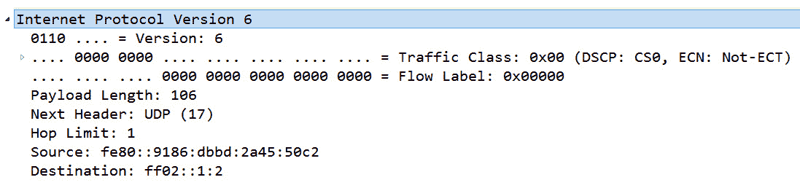
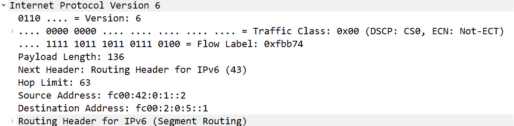

# 十一、解析 IPv4 和 IPv6

任何参与网络的人都需要了解互联网协议，这是一种负责在网络上传输数据的网络层协议。在本章中，我们将首先回顾网络层，更具体地说，IP 作为主要网络协议的目的。然后，我们将进一步了解 IPv4 和 IPv6，它们负责两个关键角色:寻址和路由数据。Wireshark 为 IPv4 和 IPv6 提供了出色的支持。为了加强您的分析技能，我们将从两个版本的全面概述开始，并检查每个协议的报头格式。

您将开始理解每个版本中的字段值是如何进行比较和对比的，并能够识别每个字段的重要性。由于寻址是一个重要的概念，我们将研究特殊和私有 IPv4 寻址的使用。此外，我们将概述 IPv6 中使用的不同地址类型。为了让您了解如何自定义 Wireshark 显示 IP 的方式，我们将评估协议首选项。最后，由于 IPv4 的报头格式与 IPv6 完全不同，我们将研究在双栈环境中，两者如何通过使用各种隧道协议共存。

本章将通过涵盖以下内容来解决所有这些问题:

*   查看网络层
*   概述 IPv4
*   探索 IPv6
*   编辑协议首选项
*   发现隧道协议

# 查看网络层

网络层(或第三层)有两个关键角色:寻址和路由数据。这一层使用逻辑 IP 地址提供寻址。此外，网络层确定数据包通过其它网络传输的最佳逻辑路径，以便它们能够到达目的地。它通过在路由过程中与其它设备通信来实现这一点。

如图所示，网络层有三个主要协议，IP、ARP 和 ICMP，它们是传送数据的基本协议:


图 11.1-OSI 模型-网络层

除了 IP 之外，其他协议包括:

*   **地址解析协议** ( **ARP** ): ARP 将一个 IPv4 地址(网络层)解析为局域网上的**媒体访问控制** ( **MAC** )(数据链路层)地址，这样帧就可以被传送到合适的主机。ARP 显示在第 3 层和第 2 层之间，因此，许多人认为 ARP 是第 3 层协议。
*   **互联网控制消息协议** ( **ICMP** ):报告传输过程中遇到的问题，如网络不可达或主机不可达。

接下来，我们将讨论 IP 的作用和目的，以及当数据包必须通过网络才能到达最终目的地时，它是如何帮助数据包找到路径的。

## 理解知识产权的目的

IP 是一种网络层协议，它有两个关键作用:寻址、使用逻辑 IP 地址和路由流量。当传输层*传输*数据时，网络层与其他设备通信以确定数据包的最佳逻辑路径*。*

 *网络层的主要协议之一是 IP，它提供尽力而为的无连接服务，如下所述:

*   **Best-effort** 表示不保证数据会被传送。这类似于使用一般递送邮寄一封信。虽然有些邮件会丢失，但大多数情况下还是会到达最终目的地。
*   **无连接**表示 IP 不保留任何状态信息；那个过程留给了更高层的协议，比如**传输控制协议** ( **TCP** )。

虽然 IP 不能保证传送，但它可以*优先化*流量，这样时间敏感的数据，如**IP 语音** ( **VoIP** )和流媒体，比电子邮件或网页更优先传送。

由于互联网的不可预测性，优先考虑某些类型的流量将有助于更快地传输数据。优先级以下列方式标记:

*   在 **IPv4** 中，通过使用**区分服务** ( **DiffServ** )字段
*   在 **IPv6** 中，通过使用的**流量类的**字段

为了详细检查 IP 报头，我们将使用位于[http://tcpreplay . app neta . com/wiki/captures . html # big flows-pcap](http://tcpreplay.appneta.com/wiki/captures.html#bigflows-pcap)的`bigFlows.pcap`数据包捕获。下载文件并在 Wireshark 中打开它。

让我们从对 IPv4 的评估开始。

# 概述 IPv4

1981 年，**征求意见稿** ( **RFC** ) 791 概述了 IPv4 的规范。RFC 概述了 IPv4 有两个主要任务，寻址和分段，如*1.4 节所定义。操作*，在[https://tools.ietf.org/html/rfc791#section-1.4](https://tools.ietf.org/html/rfc791#section-1.4)找到。

如上所述，IPv4 最初的作用之一是分段，它将数据包分开。在当时，这是必要的，因为在 20 世纪 80 年代初，大多数网络带宽有限，无法传输大数据包。

随着时间的推移，人们一直在努力升级和替换陈旧的数据路径，互联网的大部分已经被高速光纤电缆所取代。因此，在今天的网络中，很少使用分段。

注意

当**最大传输单位** ( **MTU** )小于 1500 字节时，使用分片。

随着时间的推移，我们可以看到，为了将数据发送到最终目的地，IPv4 仍然在寻址方面发挥着重要作用，路由也是如此。

IPv4 于 1983 年标准化，使用 32 位地址空间。科学家们在早期就发现了对更大地址空间的需求。IPv6 拥有 128 位地址空间，并提供了对协议的增强，例如简化的网络配置和更高效的路由。向 IPv6 的迁移很慢，主要是因为在 T4 的局域网上使用私有 IP 地址延长了 IPv4 的寿命。

因此，IPv4 仍然被广泛使用。为了让您在处理 IPv4 时具备应对日常网络相关问题所需的技能，在下一节中，我们将研究 IPv4 报头和每个字段值。一旦您理解了字段值，您在查看数据包捕获时就会更有信心，这样您就能够快速深入问题。

## 解析 IPv4 报头

IPv4 报头有几个字段，如下图所示:


图 11.2–IP v4 报头

有些字段很少使用，比如那些处理碎片的字段。其他的提供有助于故障排除的信息，例如解决网络冲突时的地址字段。

要检查 IPv4 报头，打开`bigFlows.pcap`，转到**帧 1** ，如下所示:


图 11.3-大流量帧 1-IP v4 报头

下一节将列出每个字段，使用多少位或字节，以及每个字段所代表的信息。我们将从版本和长度字段开始。

### 发现版本和长度

IPv4 报头中的前两个字段如下:

*   **版本(4 位)**:该字段值表示正在使用的 IP 版本。许多设备同时支持 IPv4 和 IPv6 因此，获取版本很重要，这样设备就知道如何处理流量。在**帧 1** 中，我们看到`Version: 4`，这意味着这是一个 IPv4 报头。
*   **报头长度(4 位)**:报头长度是 4 字节的倍数，等于基本报头和任何选项。尽管长度可以变化(因选项而异)，但最小*值*必须是 5，等于 20 字节的报头长度。在**帧 1** 中，数值显示为`Header Length: 20 bytes (5)`。

在这两个字段之后，我们看到一个名为`DiffServ`的字段，它将在下一节中介绍。

### 分解服务类型

互联网是不可预测的，这可能会影响时间敏感的数据，如 VoIP 和流媒体。因此，IPv4 具有`DiffServ`字段来对时间敏感的流量进行优先级排序，从而使其比电子邮件或网页的优先级更高。

`DiffServ`字段为 8 位，分为两个功能:**服务质量** ( **QoS** )和**显式拥塞通知** ( **ECN** )。

在第一帧的**中，我们可以看到`Differentiated Services Field: 0X00 (DSCP: CSO, ECN: Not-ECT)`。**

如上所述，`DiffServ`字段有两个功能。让我们看看这代表了什么。我们将从`DiffServ`字段的前 6 位开始，它用于表示通过网络时请求的 QoS。

#### 确保服务质量

QoS 提供了选项来区分流量的优先级。大多数(但不是全部)设备支持 QoS。当请求优先级时，字段值将通过使用几个不同的**类选择器** ( **CS** )值之一来指示这一点。

例如，`CS6`和`CS7`用于包括以下内容的网络控制协议:

*   **增强型内部网关路由协议** ( **EIGRP** )
*   **先开最短路径** ( **OSPF** )
*   **热备路由协议** ( **HSRP** )
*   互联网密钥交换 ( **艾克**)
*   **边界网关协议** ( **BGP** )

这些网络协议的优先级更高，因为任何延迟都会影响网络性能。

其他值如下表所示:


表 11.1–差异化服务字段值

第一列显示了**区分服务码点** ( **DSCP** )，其中列出了 CS。如**帧 1** 所示，在*图 11.3* 中，该字段值汇总显示`DSCP: CS0`(或类选择器 0)。CS0 是默认或最大努力设置，因为没有为该数据包分配优先级。使用此设置的流量可以正常传送。

要查看高于尽力而为的 CS 的示例，请转到`bigFlows.pcap`并进入`ip.dsfield.dscp > 0`显示过滤器。选择**第 4 帧**，这里会列出 CS 值，如下图所示:


图 11.4–CS1

`Class Selector 1 (8)`用于清道夫应用，如 YouTube、游戏应用和 P2P，因为这种流量在互联网上传输时会受益于(稍微)更高的优先级。

注意

CS1 被列为清道夫应用。这个类意味着应用将在任何可用的时候获取带宽

`DiffServ`字段的最后 2 位用于标识 ECN，这有助于管理网络上的拥塞。让我们看看这是如何工作的。

#### 发送 ECN

你可能还没有意识到 ECN 及其重要性；但是，这可能会影响设备在网络上传递拥塞信息的方式。让我们来看看这 2 位如何改善数据流。

在最初的 RFC 791 中，`DiffServ`字段的最后 2 位是`Reserved for Future Use`，如下图所示:


图 11.5–服务位分配

在 2001 年，RFC 3168 发现了最后 2 位的用途。RFC 3168 概述了 ECN，它在网络上提供拥塞通知，是对管理网络拥塞的传统方法的改进。

通常，当 TCP 遇到拥塞时，主机通过进入拥塞控制来响应丢弃的数据包，这会导致以下结果:

*   **客户端**发送重复的确认，表示有丢失的数据包。
*   **服务器**使用快速重传，重新发送丢失的数据包。

ECN 是对这种行为的改进，它提供了网络拥塞的通知。这最终防止了当存在重复确认和快速重传时出现的额外流量。

ECN 使用 TCP 和 IP 报头，如下所述:

*   **IP 头**使用`DiffServ`字段末尾的 2 位来表示 **ECN 能力传输** ( **ECT** )和**经历拥塞** ( **CE** )。
*   **TCP 头**使用两个标志:**拥塞窗口缩小** ( **CWR** )和 **ECN Echo** ( **ECE** )。

使用 ECN 时,`DiffServ`字段的 2 位标识代码点。在下表中，您将看到这些位、组合所指示的内容，以及在 Wireshark 中显示`DiffServ`字段值时作为指示器可能看到的内容:


表 11.2-DiffServ 字段中的标识符

可以看到，代码点与`10`和`01`的值基本相同。

在**帧 1 下的`bigFlows.pcap`，**中，如果我们展开 IPv4 报头，我们会看到`Explicit Congestion Notification: Not ECN-Capable Transport (0)`，这意味着该连接不支持 ECN，如下所示:


图 11.6–不支持 ECT

连接中涉及的设备将相互通信，并在可用时使用 ECN，这有助于通知端点网络拥塞问题。

虽然 IP 是一种无连接协议，但它提供了提高流量优先级的方法，以及通知设备网络拥塞问题的方法。

在 IPv4 报头的下一组字段值中，我们将评估处理使用分段的字段。

### 分割数据

在 RFC 791 中，IP 负责寻址和分段。我们将在后面的部分讨论寻址，但是现在，让我们概述一下什么是分段以及为什么它是必要的。

在网络上，监控各种值:

*   **最大段尺寸** ( **MSS** )就是数据有效载荷。
*   **最大传输单元** ( **MTU** )是 MSS 加上传输层头。

当数据在网络上路由时，它可能会遇到一个 MTU 小于数据包大小的数据段。如果允许，可以使用碎片化；这将数据报分成更小的片段，以便它们可以在具有限制性 MTU 的网络上发送。

以下三个字段与碎片相关:**标识**、**标志**和**碎片偏移**，如下所述:

*   **标识(16 位)**:该**标识** ( **ID** )字段用于在数据分片时标识数据报。在这种情况下，所有片段将具有相同的 ID。
*   **Flags** :在一个 IP 头中，有三个标志，如下面的截图所示:


图 11.7–IP 标志

*   **片段偏移量(13 位)**:在 IP 报头中的三个标志之后，该字段提供使用分片时如何重组片段的信息。

在大多数情况下，IP 报头标志将在`Don't Fragment`设置。这是因为在今天的网络中，没有使用分段，因为大多数管道都有足够的带宽和可接受的 MTU。

虽然在当今的网络中，我们很少看到碎片，但是熟悉一些场景中处理碎片的字段和标志是一个好主意:

*   在*故障排除*期间，您可能需要查看字段，以确定数据无法通过的原因。
*   在*安全评估*期间，碎片字段的使用可能表示恶意活动。

网络设备监控数据报长度，并可能施加大小限制。在这种情况下，如果数据包太大，可能需要将其分段或重新路由才能传递。

**总长度** IPv4 字段在评估大小限制时提供了一个度量，因为它指示报头长度和任何数据的值。该字段值为 16 位，这意味着整个长度不能超过 216，即 65，535 字节。

**互联网控制消息协议** ( **ICMP** )充当 IP 的侦察兵。当 ICMP 遇到一个 MTU 比数据包的大小小的网络，并且设置了位时，路由器将丢弃该数据包。ICMP 然后会通过发送一个`Type 3 Code 4` ICMP 消息:`Destination Unreachable: Fragmentation Needed and Don't Fragment was Set`来通知源。

如果数据包被丢弃在带宽受限、不允许分段的网段上，发送主机必须使用较小的 MSS 重新传输数据。

接下来的几个字段更具管理性。它们保存与跳数、遵循 IPv4 报头的协议以及用于错误检测的校验和相关的值。

### 查看 TTL、协议和校验和

查看 IPv4 报头时，有几个字段与数据包的路由或寻址没有直接关系，但其作用可能会影响其他类型的行为。我们的第一个例子是**生存时间** ( **TTL** )字段，它的存在是因为互联网之父很早就意识到必须有一种方法来阻止数据包继续在网络中传输。如果配置错误和/或数据包处于路由环路中，就会发生这种情况。

注意

TTL 字段是 8 位，因此最大值是 28，即 255 跳。

在正常的网络运行期间，这种情况很可能不会发生。然而，如果存在路由环路，IP 报头中的`TTL`字段值是在丢弃分组之前分组可以经过的路由器或跳数。TTL 的工作方式如下:

*   每当数据包到达路由器时，该数字就减 1。
*   当 TTL 值达到 0 时，数据包被丢弃，ICMP `Type 11` (TTL 在传输中过期)被发送到发送方。

要查看 TTL 值的示例，打开`bigFlows.pcap`，并转到**帧 1** ，其中`TTL`字段被设置为`Time to live: 64`，这是该字段的默认值。

提供与管理流量和通知设备相关的信息的另外两个字段如下:

*   **协议(8 位)**:`protocol`字段标识跟随 IPv4 报头的高层协议。该字段标识数据报中携带的协议(通常是传输层协议)。在**帧 1** 中，我们看到值为`Protocol: UDP (17)`。
*   **Header checksum (16-bit)**: This field is used to house the checksum value. Similar to the checksum in the TCP header, this value is used for error detection. In **Frame 1**, we see the checksum and notification from Wireshark that the checksum validation is disabled.

    报头校验和:0x ee5e[验证禁用]

    [标题校验和状态:未验证]

在大多数情况下，最好禁用验证，因为校验和卸载到**网络接口卡** ( **NIC** )会导致值不正确。

在处理 IPv4 时，在处理寻址时还有一些额外的考虑，例如特殊和私有 IP 地址，我们将在下一节中讨论。

### 了解 IPv4 寻址

在本节中，我们将检查 IPv4 报头中的最后两个字段。此外，我们将回顾 IPv4 中的不同类别，以及特殊和私有 IP 地址的概述。

IP 报头中最重要的元素之一是寻址。在最后两个字段中，我们看到了**源**和**目的地址** (32 位)。每个字段包含源或目的 IPv4 地址，以易于理解的点分十进制格式表示。在**帧 1** 中，我们看到以下值:

```
Source Address: 172.16.133.57
```

```
Destination Address: 68.64.21.62
```

IPv4 将整个地址块分成多个类。在每个类别中，都有特殊的私有 IP 地址。让我们来看看那些概念。

#### 比较 IPv4 类别和地址

当编写 IPv4 的 RFC 时，开发人员有一个将 IP 细分为五类或五种地址格式的概念。IPv4 地址分为 A-E 类，如下所示:


表 11.3–IP v4 地址的类别

如上所述，A 类、B 类和 C 类主要分配给公司。D 类仅用于**组播**，E 类用于**实验**，不使用。

除了有五类寻址之外，IPv4 还有几个特殊和私有 IPv4 地址范围，如下所述。

#### 检查特殊和私有 IP 地址

IPv4 的局限性之一是地址空间有限。为了扩大 IPv4 的使用范围，起草了一组 A、B 和 C 类专用 IP 地址，仅用于内部网络。还有一个很大的环回范围和一个广播 IP 地址。

下面的表显示了主要专用和私有 IPv4 地址的列表:


表 11.4-特殊和私有 IPv4 地址

此外，**自动私有 IP 寻址** ( **APIPA** )还有一个范围，当动态主机配置协议 ( **DHCP** )服务器没有 IP 地址时，它会给主机一个 IP 地址。

虽然这种情况很少见，但是可以使用 IPv4 选项，如下一节所述。

## 修改 IPv4 的选项

对于 IPv4，可能有必要使用提供源路由信息、时间戳和其他信息的选项。几个 IP 选项已被否决，不再使用。有关正式否决选项的更完整讨论，请参考 RFC 6814。

使用时，`options`字段必须是 32 位或 4 字节的倍数。可能需要填充，以便报头是 32 位的倍数。

既然我们已经回顾了 IPv4，那么让我们更深入地了解一下 IPv6。

# 探索 IPv6

早期，科学家们意识到 IPv4 的 32 位地址空间将会耗尽。虽然没有人有一个确切的日期，但是已经制定了用改进版本 IPv6 取代 IPv4 的计划。1998 年，IPv6 的 RFC 发布，可以在 https://www.ietf.org/rfc/rfc2460.txt 找到。

IPv6 有许多增强，包括以下内容。

*   **流线型表头**:表头字段较少；但是，它更大，主要是由于扩展的地址空间。
*   **流标签**:在 IPv6 中，有一个流标签。该字段值可用于标识需要特殊处理的流，例如实时流量。
*   **对扩展和选项的支持**:虽然 IPv4 可以添加选项，但 IPv6 更容易做到。IPv6 提供了添加选项的能力，例如分段，它具有将数据分段的参数，以及逐跳，它确保路径中的所有设备都读取该选项。

IPv6 报头可以容纳更大的地址空间。但是，如下图所示，标题是简化的，因为没有太多的字段值:


图 11.8–IPv6 报头

要跟踪并检查 IPv6 报头，打开`bigFlows.pcap`，并转到**帧 347** 。IPv6 报头如下图所示:



图 11.9-大流量帧 347-IPv6 报头

请注意，IPv6 地址要大得多，因为它们是 128 位的，而 IPv4 地址是 32 位的。与 IPv4 中使用的点分十进制表示法相反，地址使用十六进制表示法。

在下一节中，我们将回顾 IPv6 中的每个字段，每个字段包含的比特或字节数，以及每个字段所代表的信息。

## 导航 IPv6 报头字段

正如我们将看到的，IPv6 报头删除了不必要的字段值，只添加了传输数据所需的内容。让我们逐步了解字段值并了解它们的重要性。我们将从版本开始，一个字段用于存放流量类，一个标签用于保存特定流的值。

### 识别版本、流量类别和流标签

IPv6 报头中的前三个字段如下:

*   **版本(4 位)**:该字段表示正在使用的 IP 版本。在**第 347 帧**，我们看到`Version 6`。
*   **流量等级(8 位)**:当在互联网上发送数据时，有些流量需要特殊处理和优先排序。与 IPv4 类似，该字段包含两个值:
    *   **TOS** :该字段的前 6 位用于传达所请求的服务类型。TOS 使用与 IPv4 相同的 DSCP 值。**帧 347** 使用`Differentiated Services Codepoint: Default (0)`默认值。
    *   **ECN** :该字段的最后 2 位用于指示网络上的拥塞，方式与 IPv4 相同。在**帧 347** 中，该值为`Explicit Congestion Notification: Not ECN-Capable Transport (0)`。
*   **流标签(20 位)**:该字段可用于标识特定的信息流，以便提供排序或请求路径中的路由器进行特殊处理。在**第 347 帧**中，我们可以看到`Flow Label: 0x00000`。在 RFC 2460，*附录 A:流标签字段*的语义和用法中，有关于流标签的扩展讨论。

随着时间的推移，我们看到流标签的使用越来越多。让我们讨论如何使用它，并检查一个填充的流标签。

#### 管理流程

该标签可用于区分流量的优先级，如实时数据(语音和视频)，但也可用于其他用途。当使用时，一个随机分配的数字被附加到流标签上，然后所有流量将属于同一个流或流。

要查看正在使用的流标签的示例，请在您的网络上运行捕获，并收集大约 1，000 个数据包。应用`(!(ipv6.flow == 0x00000)) && (ipv6)`过滤器，它将只显示带有填充流标签的 IPv6 数据包。

另外，你可以去[https://wiki . wireshark . org/sample captures # IPv6-and-tunneling-mechanism](https://wiki.wireshark.org/SampleCaptures#ipv6-and-tunneling-mechanism)。选择`sr-header.pcap`文件并在 Wireshark 中打开它。

在这次捕获中，有 10 个数据包。使用`ipv6.flow == 0xd684a`过滤器，它将显示属于同一个流的六个数据包。

注意

流标签是一个 20 位的字段。在 Wireshark 中，您将首先看到位值，然后是十六进制值(通过在值前使用`0x`来标识)。例如，如果填充了该字段，您将在 Wireshark 中看到以下值:`.... 1101 0110 1000 0100 1010 = Flow Label: 0xd684a`。

接下来的三个字段处理在 IPv4 报头中发现的类似值，但是有细微的差别，如下所示。

### 评估长度、下一个报头和跳数限制

在 IPv6 报头中，接下来的三个字段提供了有关有效载荷长度、IP 报头之后的协议以及数据包在离开之前可以经过多少跳的信息。这些字段如下所示:

*   **有效载荷长度(16 位)**:有效载荷长度表示数据包的有效载荷，包括高层报头、数据和任何扩展报头。与 IPv4 类似，整个长度不能超过 216，即 65，535 字节。在某些情况下，有效负载可能会超过 65，535 字节，这在使用扩展标头时可能会发生。如果该值大于 65，535 字节，则字段值设置为零(`0`)。
*   **下一个报头(8 位)**:该字段标识 IP 报头之后的高层协议。这类似于 IPv4 中的`protocol`字段，使用相同的值来标识更高层协议。然而，如果存在扩展报头，则该字段将指示 IPv6 报头之后是什么扩展报头。
*   **跳数限制(8 位)**:在 IPv4 中，IP 报头中的`TTL`字段值是一个分组在丢弃该分组之前可以经过的路由器或跳数。在 IPv6 中，这是相同的概念。然而，这一领域更多地反映了它今天所做的事情。该字段使用 8 位，可以保存不大于 255 的值。如果跳数限制达到 0，数据包将被丢弃。

在**帧 347** 中，字段值是`Hop Limit: 1`，这是有意义的，因为该帧是来自试图获得 IP 地址的主机的 DHCPv6 多播。

与 IPv4 一样，IPv6 报头中的最后两个字段是地址字段，如下所述。

### 检查 IPv6 地址和地址类型

IPv6 有特定的寻址要求。在本节中，我们将检查最后两个字段，**源地址**和**目的地址(128 位)**，以及 IPv6 地址类型的概述。源地址和目的地址是 128 位字段，以容纳 IPv6 地址。Wireshark 以冒号分隔的十六进制数显示地址，这与 IPv4 中使用的点分十进制表示法相反。

在 IPv6 中，有各种不同的地址类型，而不是类别。现在让我们来看看你可能遇到的不同类型。

### 比较 IPv6 地址类型

IPv6 不像 IPv4 那样使用广播。但是，有几种类型的地址，如下所示:

*   **全球单播**就像一个公共 IPv4 地址。该地址是全球公认的，可以在互联网上路由。
*   **本地链路**用于与同一子网中的主机通信。这个地址总是以 FE80 开头。
*   **单播**是网络上的单个主机。
*   **组播**数据包使用一个组播地址发送到网络上的所有节点。
*   **Anycast** 用于向具有相同 IP 地址的多个位置发送数据。数据包被传送到最近的目的地。

在**帧 347** 中，我们看到源地址和目的地址:

```
Source: fe80::9186:dbbd:2a45:50c2
```

```
Destination: ff02::1:2
```

如果可能，Wireshark 将使用适当的快捷方式，如目的地址所示。IPv6 快捷方式删除前导零，并折叠两个或更多包含连续零的块。

对于许多协议(但不是全部)，Wireshark 提供了一种修改 Wireshark 显示数据方式的方法。以下内容让我们了解了如何调整 IPv4 和 IPv6 的首选项。

# 编辑协议首选项

在 Wireshark 中，您可以通过执行以下任一操作来修改大多数协议:

*   在 IP 头上单击鼠标右键，选择**协议首选项**，您会看到一个首选项列表
*   进入**编辑** | **首选项** | **协议**，然后选择合适的协议

让我们从 IPv4 的协议首选项开始，因为这是目前局域网上最常用的协议。

## 查看 IPv4 首选项

要修改 IPv4 首选项，您可以使用前面列出的方法之一，或者您可以在标题上单击鼠标右键并选择**协议首选项**，然后选择**开放互联网协议版本 4 首选项...**快捷方式，如图所示:


图 11.10–IP v4 首选项快捷方式

选择快捷方式后，将会列出一个首选项列表，如下图所示:


图 11.11–IP v4 首选项

在那里，您可以按如下方式修改选择:

*   **将 IPv4 TOS 字段解码为 DiffServ 字段** : RFC 791 使用 TOS 对流量进行分类。随着时间的推移，该字段被修改为使用`DiffServ`来识别流量，这允许更大范围的分类。在大多数情况下，这应该是启用的。
*   **重组分片的 IPv4 数据报**:必要时，可能会对 IPv4 数据包进行分片。启用后，这将重新组装碎片 IP 数据报。
*   **在协议树**中显示 IPv4 摘要:启用时，该选项将摘要报头内容。对于大型捕获，启用此功能可能会影响性能。
*   **如果可能，验证 IPv4 校验和**:在大多数情况下，这是不启用的。
*   **支持从支持 IP TSO 的硬件捕获数据包** : **TCP 分段卸载** ( **TSO** )是一种在虚拟化环境中使用的性能提升技术。使用时，数据包长度可能不准确。启用此选项将尝试纠正任何错误。
*   **启用 IPv4 地理定位** : Wireshark 使用 IP 地址通过`[GeoIP]`数据库识别数据包来源。选择是否要使用此选项。
*   **将保留标志解释为安全标志(RFC 3514)**:2003 年 4 月 1 日(愚人节)，Steven M. Bellovin 写了一个 RFC，认为 IP 报头中的保留位应该被恶意参与者用来标记数据包，如果它包含恶意软件，那么 IDS 和防火墙将知道它包含恶意软件。如果使用的话，这个钻头被称为**邪恶钻头**。
*   **首先尝试启发式子解析器**:此选项有助于 Wireshark 通过使用端口号来正确解析数据包，从而尝试识别所使用的应用类型。
*   **IPv4 UDP 端口:0...**:如果您希望在 LAN 上使用时将协议行为更改为特定端口，请使用此选项。
*   **禁用 IPv4** :如果您想禁用 IPv4 并只关注帧头，请使用此选项(如图 11.10 所示)。请记住，如果选择了此选项，IPv4 和任何更高级别的协议(第 3-7 层)将不会被解析。

如您所见，有许多方法可以定制 IPv4 的首选项。接下来，我们来看看 IPv6 的选项。

## 调整 IPv6 的首选项

您可以通过进入**编辑** | **首选项**然后选择**开放互联网协议版本 6 首选项来修改 IPv6 中的首选项...**快捷方式。这将打开一个对话框，如下所示:


图 11.12–IPv6 首选项

在那里，您可以修改任何选项，如下所述:

*   **重组分片的 IPv6 数据报**:启用后，将重组分片的 IPv6 数据报。
*   **在协议树中显示 IPv6 摘要**:启用时，该选项汇总报头内容。
*   **启用 IPv6 地理定位** : Wireshark 使用 IP 地址通过`[GeoIP]`数据库识别数据包来源。选择是否要使用此选项。
*   **对 RPL 源路由头(RFC 6554)** 执行严格检查:如果启用，这将有助于使用**路由协议对低功率和有损耗网络**(**【RPL】**)的流进行故障排除。
*   **首先尝试启发式子解析器** : Wireshark 将通过使用端口号来正确解析数据包，尝试识别使用的是什么类型的应用。
*   **在根协议树下显示 IPv6 扩展头** : IPv6 有几个扩展头，比如路由头和分片头。启用此选项将在根协议树下显示标题。
*   **Use a single field for IPv6 extension header length**: Enabling this will display a single field for the IPv6 extension header length (if any). If this is not enabled, the field will appear on two lines as follows:

    长度:0 (8 字节)

    [长度:8 字节]

*   **支持从支持 IPv6 TSO 的硬件捕获数据包** : TSO 是一种在虚拟化环境中使用的性能提升技术。使用时，数据包长度可能不准确。启用此选项将尝试纠正任何错误。
*   **IPv6 UDP 端口:0…** :如果要更改协议行为，请使用此选项。

从 IPv4 到 IPv6 的迁移一直不温不火，因为许多网络管理员继续在局域网上使用 IPv4，主要是因为使用私有 IP 地址的灵活性。以下部分概述了这两种协议如何使用各种隧道协议在同一网络中共存。

# 发现隧道协议

一些组织已经决定转向专用的 IPv6 网络环境。但是，许多公司运行的是双栈环境，在这种环境下，同时使用 IPv4 和 IPv6 的主机必须能够相互通信。

显然，IPv4 报头与 IPv6 报头完全不同。为了让流量从 IPv4 网络通过 IPv6 网络，反之亦然，流量必须使用隧道协议。RFC 7059 概述了通过 IPv4 网络传输 IPv6 数据包的各种方式，可在 https://tools.ietf.org/html/rfc7059 的[找到。下图显示了在 IPv4 数据包中封装 IPv6 数据包的正确格式:](https://tools.ietf.org/html/rfc7059)


图 11.13–在 IPv4 数据包中封装 IPv6 数据包

支持 IPv6 数据包在 IPv4 网络上传输的一些隧道协议包括:

*   **站内自动隧道寻址协议** ( **ISATAP** ):通过 IPv4 网络向使用 IPv6 的主机发送数据，以及从使用 IPv6 的主机接收数据
*   **通用路由封装** ( **GRE** ):在 IPV4 网络内创建点对点 IPv6 连接
*   **Teredo** :在 Windows 操作系统中生成，当**网络地址转换** ( **NAT** )就绪时，允许 IPv4 主机连接到 IPv6 网络。

隧道协议之一 Teredo 用 IPv4 报头包装(或封装)IPv6 数据包，以便数据包可以通过使用 NAT 的 IPv4 环境传输。要看特雷多隧道的例子，请去 https://www.cloudshark.org/captures/c0b7d1a1d1ec?filter = frame % 20 and % 20 eth % 20 and % 20ip % 20 and % 20 UDP % 20 and % 20 teredo，并在 Wireshark 中打开。转到**第 29 帧**，我们看到 IPv6 数据包封装在 IPv4 报头中，使用 UDP 作为传输协议，如下所示:


图 11.14–封装在 IPv4 报头中的 IPv6 数据包

虽然有几种隧道协议，但它们本质上都做同样的事情:用一个报头封装另一个报头，这样数据就可以在网络中传输。因此，创建隧道以及添加额外的报头会带来额外的开销。

由于我们复杂的网络环境，在排除网络故障时，您很可能会遇到隧道协议。

# 总结

在这一章中，我们首先讲述了知识产权的简史。我们了解了两个版本的 IP 如何完成路由和寻址的工作；但是，IPv4 和 IPv6 报头之间存在一些差异。我们检查并解释了 IPv4 和 IPv6 的每个字段值。此外，为了让您更好地理解这两种协议，我们比较了 IPv4 和 IPv6 之间的一些相似之处和不同之处。

为了帮助您巩固寻址知识，我们简要介绍了 IPv4 地址的类别，并回顾了不同类型的 IPv6 地址。然后，我们看了如何通过修改协议首选项来个性化 IPv4 和 IPv6 的设置。最后，由于需要两种 IP 版本在今天的网络上共存，我们比较了目前使用的不同类型的隧道协议。

在下一章，我们将学习 ICMP，IP 的伴生协议，它工作在 OSI 模型的网络层。我们将评估用于 IPv4 的 ICMP 和用于 IPv6 的 ICMPv6。然后我们将深入研究 ICMP 在这两个版本中是如何工作的，您将对这两种类型的消息有更好的理解:错误报告和查询。在本章的最后，您将看到 ICMP 如何成为 IP 的侦察兵，以及它的使用如何在传递数据中至关重要。

# 问题

现在是时候检查你的知识了。选择最佳答案，然后检查您的答案，这些答案可在*评估*附录中找到:

1.  `DiffServ`字段中的类别选择器 6 与 _____ 一起使用。
    1.  发信号
    2.  广播视频
    3.  网络控制
    4.  实时
2.  `172.18.23.119` IP 地址是:
    1.  C 类 IPv4 地址
    2.  B 类私有 IPv4 地址
    3.  E 类 IPv4 地址
    4.  D 类私有 IPv6 地址
3.  IPv6 地址有 _____ 位。
    1.  Thirty-two
    2.  Forty-eight
    3.  Sixty-four
    4.  One hundred and twenty-eight
4.  在 IPv4 中，我们使用生存时间值来表示它在网络中传输时可以经过的跳数。在 IPv6 中，该字段值称为 _____。
    1.  路由器通行证
    2.  班级停课
    3.  晶体管-晶体管逻辑。
    4.  跳跃总数
5.  IPv4 标头有 _____ 个标志。
    1.  one
    2.  Two
    3.  three
    4.  four
6.  下图显示了 IPv6 报头。流量标签的价值是什么？



图 11.15–IPv6 报头

1.  `0X00`
2.  `fc00`
3.  `0xfbb74`
4.  `136`

1.  在 IPv4 或 IPv6 报头中，有效负载长度不能超过 _____ 字节。
    1.  Sixty-five thousand five hundred and thirty-five
    2.  One thousand one hundred and eleven
    3.  Two hundred and fifty-six
    4.  One hundred and twenty-eight

# 延伸阅读

请参考以下链接了解更多信息:

*   2021 年，IANA 更新了 IP 报头中下一个报头字段的列表。该列表可在[https://www . iana . org/assignments/protocol-numbers/protocol-numbers . XHTML](https://www.iana.org/assignments/protocol-numbers/protocol-numbers.xhtml)找到。
*   请访问[https://tools.ietf.org/html/rfc3168](https://tools.ietf.org/html/rfc3168)了解更多关于 RFC 3168 的信息。
*   TTL 值因操作系统而异。要查看各种操作系统的 TTL 值，请前往[https://subinsb.com/default-device-ttl-values/](https://subinsb.com/default-device-ttl-values/)。
*   要查看 IPv4 选项列表，请访问[https://www . iana . org/assignments/IP-parameters/IP-parameters . XHTML # IP-parameters-1](https://www.iana.org/assignments/ip-parameters/ip-parameters.xhtml#ip-parameters-1)，2018 年 5 月 3 日更新。
*   IPv6 报头的详细解释可以在[https://www.microsoftpressstore.com/articles/article.aspx?找到 p=2225063 &序列号=3](https://www.microsoftpressstore.com/articles/article.aspx?p=2225063&seqNum=3) 。
*   IPv4 有几个特殊和私有 IPv4 地址范围。要查看完整列表，请访问 https://en.wikipedia.org/wiki/Reserved_IP_addresses。*