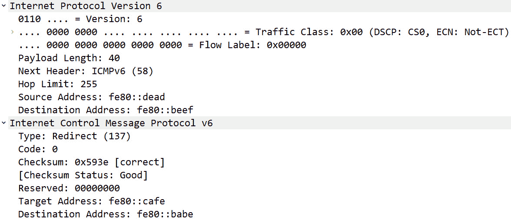

# 十二、探索 ICMP

大家都熟悉**互联网协议** ( **IP** ，负责路由和寻址流量。然而，许多人并不熟悉**互联网控制消息协议** ( **ICMP** )，这是一个强大的协议，在传递数据方面起着重要作用。在本章中，我们将学习 ICMP，它是 IP 的伴生协议，工作在 OSI 模型的网络层。我们将从概述开始，以便您对 ICMP 的主要功能有一个大致的了解。

然后，我们将评估 ICMP(与 IPv4 一起使用)和 **ICMPv6** (与 IPv6 一起使用)，以便您可以比较一些主要差异。此外，您将更好地理解两种类型的消息:**错误报告**和**查询**。然后，我们将查看常见的**类型**和**代码**值，并讨论哪些类型的 ICMP 消息不再使用。最后，我们将讨论恶意行为者如何利用 ICMP 发动攻击。然后，我们将概述一些基本的防火墙指南，说明在您的网络上允许什么类型的 ICMP 消息。

本章将通过涵盖以下内容来解决所有这些问题:

*   了解 ICMP 的目的
*   剖析 ICMP 和 ICMPv6
*   发送 ICMP 消息
*   评估类型和代码值
*   配置防火墙规则

# 了解 ICMP 的目的

20 世纪 80 年代初，科学家们开发了驱动互联网流量的协议。此外，他们还发现了可能会阻止流量到达目的地的潜在问题，尤其是在使用 IP 时。这主要是因为 IP 不能保证传输，并且无法与终端设备交流网络问题。ICMP 通过发送查询消息和生成可能需要注意的问题的错误报告来克服 IP 的缺陷。

如下表所示，网络层负责寻址和路由:


图 12.1–OSI 模型网络层

网络层有三种主要的协议，它们对于传输数据至关重要。除了 ICMP 之外，其他协议如下:

*   **IP** 是一种尽力而为的无连接协议，使用逻辑 IP 地址将数据包从源路由到目的地。
*   **地址解析协议** ( **ARP** )将一个 IPv4 地址(网络层)解析为**局域网** ( **LAN** )上的一个**媒体访问控制** ( **MAC** )(数据链路层)地址，这样帧就可以被传送到合适的主机。

正如我们在 [*第十一章*](B18389_11_ePub.xhtml#_idTextAnchor211) 、*分析 IPv4 和 IPv6* 中了解到的，网络层负责寻址和路由流量。因为 IP 是一个尽力而为的、不可靠的协议，所以 ICMP 对于数据传输是必不可少的，并且必须由每个 IP 模块来实现。

ICMP 有两个主要任务:

*   **传达阻止数据传送的错误**。常见问题包括网络或端口不可达。
*   **发出查询**，例如在 ping 网络实用工具中使用的 echo 请求/回复，或者路由器请求，它提供了一种请求和接收路由器信息的方法。

因为有两个 IP 版本，所以也有两个 ICMP 版本。这些角色特定于各自的 IP 版本:

*   **IPv4** 使用 ICMP。
*   **IPv6** 使用 ICMPv6。

由于其在协助 IP 传送数据中的作用，ICMP 的使用在针对 ICMP 两个版本的**意见征询** ( **RFC** )中做了如下说明:

*   如 RFC 792 中所述，*“ICMP 实际上是 IP 不可分割的一部分，必须由每个 IP 模块来实现。”*
*   如 RFC 4443 中所述，*“icmp V6 是 IPv6 不可分割的一部分，基础协议必须由每个 IP 版本 6 节点完全实现。”*

为了传递查询或错误，ICMP 消息必须在报头中提供信息。在下一节中，我们将了解 ICMP 数据包如何跟随 IP 报头，以及两个版本中都存在的三个字段。

## 了解 ICMP 报头

当传递信息时，ICMP 和 ICMPv6 数据包都将跟随 IP 数据包，如下图所示:


图 12.2–IP 报头后的 ICMP 消息

所有 ICMP 消息都有一个共同的结构，以**类型**、**代码**和**校验和**开头，如下图顶部所示:


图 12.3–ICMP 消息

ICMP 报头中一致的三个字段描述如下:

*   **类型(8 位)**:该字段表示类型，如`Type: 3 (Destination unreachable)`。
*   **代码(8 位)**:`code`字段*进一步定义了*`type`字段。例如，`Code: 1 (Host unreachable)`。
*   **校验和(16 位)**:该字段保存用于错误检测的数值。

在`type`、`code`和`checksum`字段值之后，您将找到数据有效载荷。内容取决于 ICMP 类型和代码，可以是 ICMP 错误报告或查询消息。

整个有效负载封装在一个帧中，如下图所示:


图 12.4–以太网 II 帧中的 ICMP 消息

这里我们看到各种报头，包括帧头、IP 头、ICMP 报文、数据和**帧校验序列** ( **FCS** )。

注意

ICMP *没有*传输层报头，因为它不交换或传输数据。它的主要作用是测试可达性并报告传输错误。

为了详细检查 ICMP 的几个示例，我们将使用位于[http://tcpreplay . app neta . com/wiki/captures . html # big flows-pcap](http://tcpreplay.appneta.com/wiki/captures.html#bigflows-pcap)的`bigFlows.pcap`数据包捕获。下载文件并在 Wireshark 中打开它。一旦打开，应用`icmp`过滤器。选择任何 ICMP 数据包，您将看到`Type`、`Code`和`Checksum`字段。如此处所示，我们看到了**帧 202** 的细节:


图 12.5–帧 202 - ICMP 消息

在画面细节中，我们看到以下内容:

*   `Ethernet II`:帧头
*   `Internet Protocol Version 6` : IP 头
*   `Internet Control Message Protocol`:消息
*   `Data`:特定于 ICMP 回应回复

如图*图 12.5* 所示，此类 ICMP 消息的细节包括用于标识符和序列号的字段，有助于匹配相应的回应和回复。主机使用此信息来重建发送原始数据报的过程。

在`Type`、`Code`和`Checksum`字段之后，ICMP 消息中有一个*数据部分*。下一节解释了您可能在数据有效负载中发现的内容。

## 调查数据有效负载

在 ICMP 数据报中，有效负载取决于消息的类型。在标准 ICMP 请求/回复中，数据有效载荷是无意义的，并且将具有 ASCII 字符或空值，这取决于**操作系统** ( **OS** )。

在本节中，我们将探索您可能在 ICMP 数据包中遇到的不同有效载荷。除了数据之外，ICMP 有效负载还可以包括水印，甚至是隐藏数据的证据，例如您可能在 Loki 攻击中看到的内容。

让我们先回顾一下在 ICMP 回应请求中可能会看到什么。

### 查看回应请求/回复

要查看回应请求的示例，请打开`bigFlows.pcap`，然后转到**帧 38** ，显示一条`Type 8`、`Code 0`消息。展开 ICMP 标头，如以下屏幕截图所示:


图 12.6–ICMP 回应请求详细信息

例如，在**帧 38** 中所示的回应回复中，数据部分是如下字符串:

```
00000000138a1a34abcdabcdabcdabcdabcdabcdabcdabcdabcdabcdabcdab cdabcdabcd
```

此外，您应该在标准 ICMP 回复中看到类似的有效载荷，您可以在**帧 74** 中看到。

在回送请求/回复中，您将看到一个字符串，而错误消息具有不同的有效负载格式。让我们来看看。

### 报告错误

每当 ICMP 遇到错误时，ICMP 必须将 IP 报头*加上原始数据报*的至少前 8 个字节(或 64 位)返回给发送方。

注意

ICMP 错误消息的总长度不能超过 576 字节。

要查看示例，请打开`bigFlows.pcap`并使用`icmp.type == 3`过滤器，这将显示所有带有`Type 3: Destination unreachable error`消息的 ICMP 数据包。

选择**帧 4794** 并展开 ICMP 标题，您将看到 ICMP `Type: 3 (Destination unreachable) Code: 3 (Port unreachable) fields`，如第一部分所示:


图 12.7–ICMP 回应请求详细信息

因为这是一个错误，ICMP 已经返回了 IP 头和原始数据报。正如您所看到的，ICMP 数据包有几个部分，如下所示:

*   第一部分( **1** )是指示错误的 ICMP 报头。
*   第二段( **2** )是原始的 IP 头。
*   第三个段( **3** )是原始的**用户数据报协议** ( **UDP** )头，后面跟着数据。

在大多数情况下，您可能遇到的唯一 ICMP 有效负载是一个 echo 请求/回复以及错误消息。但是，在其他情况下，您可能会看到有效负载。让我们探索一下这可能在什么时候发生。

### 包括其他数据

ICMP 被设计成在网络上发出查询和传达错误。然而，随着时间的推移，ICMP 已被用于其他目的，因为 ICMP 请求中的数据部分可以被修改。一种方法是在监控网络时使用非恶意水印来识别公司。另一种方式是通过使用 ICMP 隧道恶意泄漏数据。

让我们先来看看水印是如何使用的。

#### 创建水印

一家网络监控公司([https://www.paessler.com/ping-monitoring](https://www.paessler.com/ping-monitoring))使用 ping 监控来评估网络上设备的健康状况。在 Wireshark 中收集数据包时，您会看到佩斯勒的数据包带有水印，如下图所示:


图 12.8–带水印的 Ping 请求

在**数据包字节**面板中，您可以在右下角看到一个突出显示的区域。数据如下:`P•I•N•G• •b•y• •P•R•T•G• •N•`。

在这种情况下，水印不是恶意的。然而，一个 ICMP 信息包可以被修改成秘密地发送数据，我们将在下面看到。

#### 秘密发送命令

恶意行为者找到了许多方法来隐藏他们的活动。通过网络发送命令的一种方式是使用 **Loki** 工具执行隐蔽通道攻击，其工作方式如下:

1.  数据嵌入在 ICMP 回应数据包中。
2.  数据然后通过网络秘密发送。

与上一节描述的水印不同，这种类型的活动会带来安全风险。因此，网络管理员应该调整设备来检查 ICMP 数据。如果发现有效载荷包含无法识别的数据模式，设备应发送警报，因为这可能是秘密 ICMP 隧道的迹象。

我们现在可以看到，ICMP 是一个重要的网络层协议，它与 IPv4 和 IPv6 一起使用，提供错误报告和信息性消息。接下来我们来对比一下 ICMP 和 ICMPv6 两个版本。

# 剖析 ICMP 和 ICMPv6

尽管 IPv4 和 IPv6 都负责路由和寻址数据，但这两种协议有许多不同之处。因此，有两个版本的 ICMP。

在下一节中，我们将探讨 ICMP 和 ICMPv6，以便您理解在报告网络问题中的一些基本角色和功能。

先说 ICMP，和 IPv4 一起用。

## 查看 ICMP

ICMP 与 IPv4 一起用于交流阻止数据传送的网络问题。ICMP 错误和查询消息可以在连接出现问题时提醒终端系统，还可以从中间系统获得诊断信息，例如往返时间。

尽管 ICMP 功能强大，但它无法使 IP 成为可靠的协议；它只通过提供错误消息和信息来帮助数据传递。有时数据传输延迟的原因不在 ICMP 可以发送和报告的消息范围内。在这种情况下，由**传输控制协议** ( **TCP** )或其他更高层的协议来通知主机传输过程中的传输错误。

接下来，让我们看看 ICMPv6，它有许多相同的功能，但还提供了支持 IPv6 的额外功能。

## 概述 ICMPv6

虽然 IPv4 和 IPv6 在整体功能上很相似，但 IPv6 还有许多其他的优势，包括:

*   选项和扩展
*   改进的多播路由
*   **无状态地址自动配置** ( **SLAAC**

因此，ICMPv6 是为 IPv6 开发的，用于传递更新或错误消息。ICMPv6 消息包含**类型**、**代码**和**校验和**细节，随后是取决于类型和代码的内容。但是，ICMPv6 有与 IPv6 流量相关的选项。

一个例子是 ICMPv6 **路由器请求**消息，它警告网络上的其他路由器它们的存在。要查看 ICMPv6 消息与网络上其他设备通信的示例，请访问 CloudShark:[https://www.cloudshark.org/captures/0f90f2c2de86?过滤器=帧% 20 和% 20 eth % 20 和% 20 IPv6 % 20 和%20icmpv6](https://www.cloudshark.org/captures/0f90f2c2de86?filter=frame%20and%20eth%20and%20ipv6%20and%20icmpv6) 。

在 Wireshark 中下载并打开`test55.pcap`。在显示过滤器中，输入`icmpv6` 并按下*输入*来运行过滤器。在下面的截图中，**第 63 帧**有一条 ICMPv6 路由器请求消息:


图 12.9-icmp V6 路由器请求

注意

IPv6 `ff02::2`目的地址是一个组播地址，使用一个地址发送给网络上的所有节点。

ICMP 和 ICMPv6 都可以提供对网络活动的洞察。下一节将探讨 ICMP 的两个主要功能:报告错误和查询。

# 发送 ICMP 消息

ICMP 消息分为两类:错误报告和查询。一些消息特定于每个版本；但是，有一些是两个版本共有的，如下所示:


图 12.10–ICMP 消息

对于这两个类别，每个 ICMP 数据包都有`type`、`code`和`checksum`字段。查询的有效负载不同于错误消息，因为每一个都有不同的目的，我们将在下面的章节中看到。

让我们先回顾一下 ICMP 如何报告错误。

## 报告网络上的错误

ICMP 错误消息报告阻止数据传送的网络问题。通常发送的错误消息被分为具有特定用途的类别，包括以下内容:

*   **目的地不可达**是指路由器通知主机无法到达所请求的目的地地址。
*   当 IPv4 **生存时间** ( **TTL** )值或 IPv6 跳数限制达到零时，发送**超时**。
*   **参数问题**当确定标题或扩展标题中的字段值出现问题时，可以报告。

接下来，让我们看看您可能在网络中看到的一些错误示例。

### 查看示例

我们已经在调查数据有效载荷部分的*中看到了一个`Destination Unreachable`消息的例子。另一个错误是`Time Exceeded`。要查看该错误的示例，打开`bigFlows.pcap`，然后转到**框 7217** ，显示一条`Type 11`、`Code 0`信息。展开 ICMP 标头，如以下屏幕截图所示:*


图 12.11–ICMP 超时错误消息

在这种情况下，一旦数据包到达路由器，TTL 将达到零，这将触发 ICMP 错误。

另一个例子是`Parameter Problem`错误消息。我们可以去 https://www.cloudshark.org/captures/bed61f75bde3 的[云鲨](https://www.cloudshark.org/captures/bed61f75bde3)找到这个。在 Wireshark 中下载并打开`alive6-1.pcap`。进入**画面 3** ，展开 ICMPv6 表头，如图所示:


图 12.12–icmp V6 参数问题错误消息

在这种情况下，错误消息是`Type: Parameter Problem (4) Code: 2 (unrecognized IPv6 option encountered)`。

如前所述，ICMPv6 具有许多与 ICMP 相同的功能，但也提供了额外的报告来支持 IPv6。特定于 ICMPv6 的消息之一是`Packet Too Big`。让我们来看看。

### 监控数据包大小

除了 IPv4 中报告的三个错误消息之外，ICMPv6 还包括另一个错误`Packet Too Big`，如下图所示，列出了 ICMPv6 的一些错误消息:


图 12.13–icmp V6 错误消息

我们在 [*第十一章*](B18389_11_ePub.xhtml#_idTextAnchor211) ，*解析 IPv4 和 IPv6* 中了解到，净荷长度是 IPv6 中的一个字段值。当数据在网络中传输时，会监控数据包的大小。如果数据包太大，ICMPv6 将报告`Packet Too Big`错误。当设备无法发送数据时，发送该错误，因为数据包大于输出链路的**最大传输单位** ( **MTU** )。

要查看 ICMPv6 `Packet Too Big`消息的示例，请访问 CloudShark:【https://www.cloudshark.org/captures/7dd0b50eb768。在 Wireshark 中下载并打开`packet too big.pcap`。打开后，转到**框 3** 并展开 ICMPv6 标题，如下所示:


图 12.14–icmp V6 数据包太大错误

由于网络的复杂性，有时很难避免这种错误。让我们看看当有效载荷对 MTU 来说太大时我们有什么选择。

#### 管理数据包太大错误

当发送数据时，大多数操作系统采用**路径 MTU 发现** ( **PMTUD** )，该过程用于确定允许多大的数据包在网络网段上传输。如果数据包太大，路由器会向主机发回一条 ICMPv6 `Packet Too Big`消息。在这种情况下，必须做两件事之一:

*   该分组必须被丢弃。
*   如果允许，数据包必须分段。

将数据包分段可以解决数据包过大的问题，因为这样就可以将数据包发送到网络上。正如我们所知，IPv6 报头*没有*的分片字段，并试图不对数据包进行分片；然而，它*可以通过使用扩展头*分段。你可以在*图 12.14* 的最后一行看到一个`Fragment Header for IPv6`片段扩展头的例子。

注意

网络上的许多设备会阻止碎片数据包，这是有原因的。碎片会给设备带来额外的压力，并可能带来安全风险。

ICMP 错误消息提供了额外的信息，以便主机可以确切地看到发生了什么。TCP、IP 或用户应用接收并处理错误。但是，在某些情况下，ICMP 消息会被忽略。

除了发送错误消息，ICMP 还可以请求和提供信息，这将在下一节中讨论。

## 发布查询消息

ICMP 查询有两个消息(一个请求和一个回复),它们一起工作，有一个特定的目的:提供状态更新和信息。

请求和答复的两个例子如下:

*   **回应请求/回复**:ICMP 数据包作为一个探针来测试远程主机的可达性。
*   **路由器请求/广告**:提供一种请求和接收路由器信息的方式，该信息提供了可用路由器接口的 IP 地址。

在主要使用 IPv4 的网络上，大多数 ICMP 消息提供了足够的信息。然而，为了帮助 IPv6 传递数据，ICMPv6 需要提供特定于 IPv6 的信息，我们将在下面看到。

## 使用 ICMPv6 提供信息

虽然在很多方面，ICMP 和 ICMPv6 相似，但 ICMPv6 的责任更多。原因是 IPv6 不再使用 ARP 广播或**互联网群组消息协议** ( **IGMP** )。因此，ICMPv6 提供了额外的服务来交流网络上的问题，如下图所示:


图 12.15–icmp V6 信息性消息

ICMPv6 特有的一些消息如下:

*   **邻居请求** / **广告**:这些类型用于**邻居发现协议** ( **NDP** )为主机提供在网络上共享其存在的方法。
*   **组播监听查询** / **报告**:用于向路由器和主机交换组组播信息。
*   **组成员关系**:用于提醒组播组成员关系中包含的主机上的邻居路由器。

要查看与网络上其他设备通信的众多 ICMPv6 消息的示例，请在 Wireshark 中打开`test55.pcap`。在显示过滤器中，输入`icmpv6`并按下*输入*来运行过滤器。

通过完成以下步骤创建流程图:

1.  进入**统计**，然后进入**流程图**。
2.  一旦打开，转到左下角并选择**限制以显示过滤器**。

结果如以下截图所示:


图 12.16–icmp V6 流程图

在流程图中，您可以看到**多播监听器报告**和**路由器请求** ICMPv6 数据包。

一些 ICMPv6 报告有更多的细节。对于示例，在单独的捕获文件中，我们可以看到单个报告中提供的详细信息，如下所示:


图 12.17–icmp V6 多播侦听器报告

ICMPv6 如何在网络上通信的另一个例子是使用邻居请求。这里的是一台失去了与网关的连接的主机。为了建立连接，**帧 99** 中的主机在网络上发出组播**邻居请求**消息，如下图所示:


图 12.18–icmp V6 邻居发现

您看到多个 ICMPv6 数据包的原因是主机无法到达网关。**邻居请求**消息将继续，直到连接恢复。

如您所见，ICMPv6 是一个强大的协议。除了错误和信息消息之外，ICMPv6 还提供额外的信息，并与 IPv6 一起保持连接。

如前所述，ICMP 报头包含类型和代码的值。让我们看看这两个字段，以便帮助我们理解 ICMP 试图告诉我们什么。

# 评估类型和代码值

ICMP 最初的目标是提供网络状态的更新和其他信息性消息。在本节中，我们将回顾 ICMP 和 ICMPv6 的类型和代码值。先说 ICMP。

## 查看 ICMP 类型和代码值

ICMP 用于 IPv4 已经很多年了。有许多不同类型的 ICMP 消息，其中一些应该看起来很熟悉，例如:

*   **类型 0** :回显回复
*   **类型 3** :目的地不可达
*   **类型 5** :重定向
*   **类型 8** :回送请求
*   **类型 9** :路由器广告

一些(但不是全部)ICMP 类型有一组相应的代码值，用于进一步定义 ICMP 消息。例如，**类型 3** 和**类型 9** 都有一组代码值。

**类型 3** (目的地不可达)有许多代码值，包括以下内容:

*   **代码 0** :网(网络)不可达
*   **代码 1** :主机不可达
*   **代码 2** :协议不可达
*   **代码 3** :端口不可达
*   **代码 4** :需要分段，且**不分段**位被置位

**类型 9** (路由器广告)只有两个代码值:

*   **代码 0** :正常路由器广告
*   **代码 16** :不路由普通流量

类型和代码是 ICMP 消息中的前两个字段,用于传递信息。例如在**第 543 帧**中，ICMP 已经返回了一个 ICMP `Type: 3`和`Code: 13`，如下面的截图所示:


图 12.19–ICMP 类型 3 和代码 13

当 ICMP 返回`Type: 3 Destination Unreachable` `Code: 13 (Communication Administratively Prohibited)`时，这意味着防火墙正在阻止该请求。

正如我们所了解的，ICMP 报头包含类型和代码的值，以传达网络上发生的情况。但是，有些 ICMP 类型已不再使用，并且已被弃用。我们来探讨一下这个。

### 不鼓励使用过时的类型值

虽然 ICMP 列出了多种类型值，但许多已经不再使用，因为随着时间的推移，它们已经被发现是无效的。过时和无效的类型被认为是过时的。以下是一些不推荐使用的 ICMP 类型:

*   **类型 4** :源淬火
*   类型 33 : IPv6 你在哪里
*   **Type 34** : IPv6 I-am-here
*   **类型 35** :移动注册请求
*   **类型 37** :域名请求

不鼓励使用不推荐使用的 ICMP 类型值。要阅读更多关于处理 ICMP 类型和代码值的最佳实践，请访问位于 https://datatracker.ietf.org/doc/html/rfc7279/的 RFC 7279。

与 ICMP for IPv4 一起，ICMPv6 用于传递更新或错误消息，并有自己的一组类型和代码值。在下一节中，我们将回顾 ICMPv6 的一些值。

## 定义 ICMPv6 类型和代码值

因为 ICMPv6 提供了关于 IPv6 路由器和主机配置的附加数据，所以您会发现有助于提供这些信息的特定类型值。

ICMPv6 类型值的简短列表包括以下内容:

*   **类型 1** :目的地不可达
*   **类型 2** :数据包太大
*   **类型 3** :超时
*   **类型 4** :参数问题
*   **类型 130** :组播监听查询
*   **类型 131** :组播监听报告

在某些情况下，该类型将有一个相应的代码值来进一步定义消息，类似于 IPv4。如果该类型没有对应的代码值，该字段值将被设置为`0`，如图*图 12.17* 所示。

下面是 ICMPv6 的各种类型和相应代码值的示例。

**类型 1** (目的地不可达)有几个代码值。其中一些如下:

*   **代码 0** :没有到目的地的路线
*   **代码 1** :与目的地的通信被行政禁止
*   **代码 2** :超出源地址范围
*   **代码 3** :地址不可达

**类型 3** (超时)有两个代码，如下:

*   **代码 0** :传输中超过跳数限制
*   **代码 1** :碎片重组时间超过

正如我们所知，ICMP 可以在网络上提供大量信息，因此，了解该协议可能被恶意使用是很重要的。因此，应该调整防火墙规则以防止恶意活动，如下一节所述。

# 配置防火墙规则

ICMP 支持 IP 以帮助确保数据传送；但是，它也可能被恶意使用。例如，ICMP 可以被用来作为攻击的前兆进行侦察，甚至帮助规避防火墙规则。在本节中，我们将举例说明如何使用 ICMP 来获取网络信息或重定向流量。然后，我们将评估一些用于限制攻击有效性的防火墙规则。

让我们先简要讨论几个使用 ICMP 的攻击。

## 恶意行事

ICMP 可以确定网络的大量信息。因此，它可以用作有效的扫描工具。此外，如果安全设备没有调整到不允许某些类型的 ICMP 数据包，您可能会成为攻击的受害者，例如 T2 分布式拒绝服务或重定向攻击。

首先，让我们从概述 **ping 扫描**开始，这是一种用于查看哪些网络主机可能处于唤醒状态并做出响应的技术。

### 发送恶意 ping 扫描

恶意行为者在攻击前使用各种技术扫描网络中易受攻击的主机。一种方法是通过使用 ICMP ping 数据包来确定哪些主机处于活动状态并做出响应。ping 扫描(或 ping 扫描)使用局域网上的一系列 ICMP echo 请求数据包来查看哪些主机处于活动状态并正在响应。如下图所示，攻击者在网络上发送一系列 ping 数据包。发送后，攻击者会等待收到主机的回应，以回应/回复的形式表示主机处于活动状态:


图 12.20–ICMP ping 扫描

一旦识别出响应主机，攻击者将发送更高级的探测来获取有关该主机的更多信息。

除了使用一系列回应请求/回复之外，恶意行为者还可以使用几个 ICMP 查询来在发起攻击之前侦察信息。要查看使用 ICMP 数据包探测网络的示例，请访问 CloudShark:[https://www.cloudshark.org/captures/51eabf15169e](https://www.cloudshark.org/captures/51eabf15169e)。

在 Wireshark 中下载并打开`sniffer_cybercop_scan_1-4223.cap`。在显示过滤器中，输入`((ip.src == 192.168.10.33) && (icmp)) && !(ip.src == 192.168.10.138)`并按下 *Enter* 运行过滤器，过滤器将显示 12 个数据包。通过完成以下步骤创建流程图:

1.  进入**统计**，然后进入**流程图**。
2.  一旦打开，转到左下角并选择**限制以显示过滤器**。

结果如以下截图所示:


图 12.21–在侦察期间发送 ICMP 数据包

在这个流程图中，我们看到在`192.168.10.33`的恶意参与者如何向`192.168.10.138`主机发送各种 ICMP 消息。除了 ICMP 请求包，恶意行为者也使用时间戳和地址掩码请求。这种类型的探测器发送各种 ICMP 数据包，希望得到回复，以帮助扫描软件排除不同的操作系统以及主机上的其他信息。

接下来，我们来看看另一种使用 ICMP 重定向消息来重定向流量的攻击。

### 重定向流量

虽然 ICMP 被设计用来帮助数据在网络上移动，但是恶意的参与者已经找到了使用某些类型的消息来发起攻击的方法。

ICMP 和 ICMPv6 都有重定向消息:

*   **ICMP** 使用`Type 5 – Redirect`
*   **ICMPv6** 用途`Type 137 – Redirect Message`

当用于发起攻击时，恶意行为者会创建专门设计的重定向消息，可用于修改路由表。该消息包含指示存在发送流量的更优路由的信息。一旦攻击被设置，恶意行为者就伪装成路由器，并在网络上发送特制的 ICMP 消息。

要查看使用 ICMP 重定向数据包的示例，请访问[https://github . com/bro/bro/blob/master/testing/btest/Traces/ICMP/ICMP 6-redirect . pcap](https://github.com/bro/bro/blob/master/testing/btest/Traces/icmp/icmp6-redirect.pcap)。在页面中间，选择**查看原始数据**，然后在 Wireshark 中打开`icmp6-redirect.pcap`。只有一包。展开 IP 和 ICMP 报头，如该屏幕截图所示:



图 12.22–icmp V6 重定向数据包

一旦主机收到重定向消息，流量将被重定向到恶意参与者。然后，恶意参与者可以拦截流量以获取敏感信息，将流量重定向到另一台服务器，或者为更高级的攻击做准备。

我们要讨论的最后一种攻击是 IP/ICMP 分段 DDoS 攻击。

### 拒绝服务

破坏业务的方法之一是发起 DDoS 攻击。当在内部网络上发起时，一种类型的攻击是**容量 DDoS** 。容量型 DDoS 试图用大量流量淹没设备或网络，从而消耗所有资源，合法流量被封锁。

一个例子是碎片化 IP/ICMP 容量 DDoS 攻击。要查看您在这种类型的攻击中可能会看到的示例，请访问[https://www.cloudshark.org/captures/962444a14a56](https://www.cloudshark.org/captures/962444a14a56)。在 Wireshark 中下载并打开 fragmented-icmp-traffic.pcapng。打开后，您将看到以下内容:


图 12.23–分段 icmp 流量. pcapng

在这个捕获中，您将看到以下内容:

1.  在`192.168.12.1`的主机在**帧 1** 发送`Fragmented IP protocol`。
2.  接下来是第二帧的**中的`Echo (ping) request`。**
3.  然后，`192.168.12.1`处的主机在来自`192.168.12.2`处的主机的每个`Echo (ping) reply`之后重复该模式。

这意味着在`192.168.12.2`的主机必须不断地重组碎片包，这将需要额外的资源。

如果您展开**帧 1** 中的 IP 报头，您将看到以下内容:


图 12.24–碎片数据包

如(1)所示，跟随 IP 报头的协议是`Protocol: ICMP (1)`。我们还通过(2)看到数据包是`[Reassembled IPv4 in frame: 2]`。

`fragmented-icmp-traffic.pcapng`捕获只有 20 个包；但是，如果攻击继续，这可能导致设备无法响应合法主机。

事实证明，ICMP 可用于获取主机信息，并以恶意方式进行操作。因此，最好了解各种类型，只允许绝对必要的 ICMP 数据包，我们将在下一节中看到。

## 只允许必要的类型

由于 ICMP 可以影响重要系统功能的运行并获取配置信息，黑客在对网络进行侦察或进行主动攻击时会使用 ICMP 消息。因此，最佳实践可以包括以下内容:

*   在防火墙上用**访问控制列表** ( **ACL** )阻止某些 ICMP 消息，尤其是在边界路由器上的
*   配置一个**入侵检测系统** ( **IDS** )以便在检测到 ICMP 重定向消息时阻止或警告管理员

虽然 ICMP 可能被恶意使用，但我们必须记住，诊断实用工具(如 Ping 和 Tracert)需要 ICMP。因此，网络管理员必须决定网络上应该允许什么类型的 ICMP 数据包。在设置防火墙时，请记住*唯一重要的* ICMP 流量是`Destination Unreachable`(ICMP 的`Type 3`和 ICMPv6 的`Type 1`)，以及相应的代码。

所有其他 ICMP 类型都是可选的，这取决于您是否希望在您的网络中允许它们。根据您的组织，允许的其他类型包括:

*   **类型 8/0** :回应请求/回复
*   **类型 11** :超时

ICMP 有助于确保数据得到传递；但是，它可以被恶意使用，因此，您需要确保防火墙得到适当的调整。

# 总结

现在，您可以看到 ICMP 的许多方面，它是 TCP/IP 套件中的一个重要协议。我们研究了 ICMP 的目的，ICMP 是一种交流阻止数据传输的问题的方法。我们比较了 ICMP 和 ICMPv6，它们的功能相似，但我们现在明白 ICMPv6 的作用更大。因此，您可以在排除故障时使用此协议，我们发现 ICMP 消息可以与主机通信以报告传输错误。此外，我们看到了如何使用查询消息来尝试从主机获取信息。

为了更好地理解 ICMP 类型和代码值，我们研究了它们在传递信息时是如何工作的。此外，我们了解到，有些 ICMP 类型您很少会看到，因为它们现在已被弃用和/或不受支持。到目前为止，您应该认识到 ICMP 是一种功能强大的协议，它有助于在网络上传输流量，但也可能被恶意使用。因此，您应该配置允许或拒绝特定 ICMP 类型的防火墙规则，以减少 LAN 上恶意 ICMP 流量的威胁。

在下一章中，我们将仔细研究如何用 Wireshark 检查**域名系统** ( **DNS** )流量。使用实际的例子，您将能够理解 DNS 在将主机名解析为 IP 地址时是如何工作的。您将发现 DNS 头中的字段值，并逐步完成 DNS 请求/响应事务。此外，由于 DNS 问题在许多网络中很常见，我们将回顾一下可以帮助您使用 Wireshark 计算 DNS 响应时间的工具，以及保护 DNS 的方法。

# 问题

现在，是时候检查你的知识了。选择最佳答案，然后将您的答案与*评估*附录中的答案进行核对:

1.  ICMP 传达阻止数据传送的问题。常见问题包括网络或端口是 _____。
    1.  宏伟威严的
    2.  检查
    3.  不能得到的
    4.  ARP 已启用
2.  一些 ICMP 类型已经不再使用，因为随着时间的推移，它们已经被发现是无效的，并被认为是 _____。
    1.  熄灭
    2.  不能得到的
    3.  数字的
    4.  反对
3.  在 ICMPv6 中，当确定 IPv6 标头或 IPv6 扩展标头中的字段值出现问题时，可以发送 _____ 消息。
    1.  超过时间
    2.  参数问题
    3.  数据包太大
    4.  源抑制
4.  设置防火墙规则时，唯一重要的 ICMP 流量是 _____。其他的是可选的。
    1.  `Type 3`代表 ICMP，`Type 1`代表 ICMPv。
    2.  `Type 123`代表 ICMP，`Type 17`代表 ICMPv。
    3.  `Type 1`代表 ICMP，`Type 3`代表 ICMPv。
    4.  `Type 9`代表 ICMP，`Type 104`代表 ICMPv。
5.  ICMP 可以被恶意使用。一种方法是 ______ 扫描，它使用网络上的一系列 ICMP 回应请求数据包来查看哪些主机处于活动状态并正在响应。
    1.  有效载荷
    2.  砰
    3.  港口
    4.  校验和
6.  在 ICMPv6 中，当设备由于数据包大于传出链路的 MTU 而无法发送数据时，可以发送 _____ 消息。
    1.  超过时间
    2.  参数问题
    3.  数据包太大
    4.  源抑制
7.  一些(但不是全部)ICMP 类型有一组相应的代码值，用于进一步定义 ICMP 消息。例如，_____ 都有一组代码值。
    1.  `Type 0`和`Type 7`
    2.  `Type 1`和`Type 2`
    3.  `Type 1`和`Type 6`
    4.  `Type 3`和`Type 9`

# 延伸阅读

请参考以下链接了解更多信息:

*   要了解更多关于 RFC 792、*互联网控制消息协议*的信息，请访问 https://datatracker.ietf.org/doc/html/rfc792。
*   从 RFC 4443，*互联网协议第 6 版(IPv6)规范*的互联网控制消息协议(ICMPv6)，https://datatracker.ietf.org/doc/html/rfc4443 了解更多关于 ICMPv6 的信息。
*   要查看各种攻击的讨论，包括 Loki ICMP 攻击，请访问[https://resources.infosecinstitute.com/topic/icmp-attacks/](https://resources.infosecinstitute.com/topic/icmp-attacks/)。
*   有关使用隐蔽通道提取数据的三种不同方法的讨论，请访问[https://www . giac . org/paper/gsec/2601/radar-covert-communication s-channels/104464](https://www.giac.org/paper/gsec/2601/radar-covert-communications-channels/104464)。
*   在某些时候，您可能需要引用 ICMP 类型或代码值。要查看最新值的摘要，请访问:
    *   对于 ICMP，请访问[https://www . iana . org/assignments/ICMP-parameters/ICMP-parameters . XHTML](https://www.iana.org/assignments/icmp-parameters/icmp-parameters.xhtml)。
    *   对于 ICMPv6，请访问[https://www . iana . org/assignments/icmp V6-parameters/icmp V6-parameters . XHTML](https://www.iana.org/assignments/icmpv6-parameters/icmpv6-parameters.xhtml)。