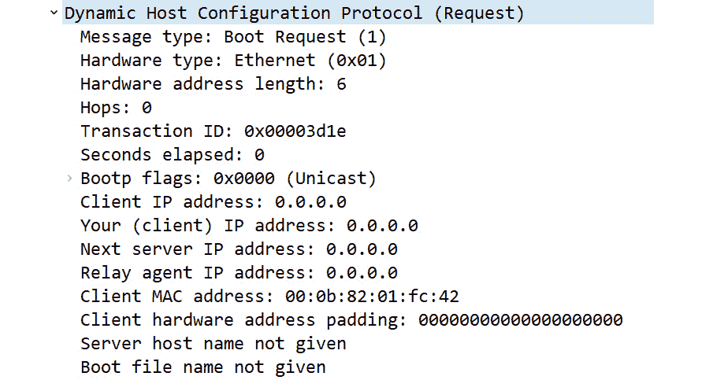

# 十四、检查 DHCP

每当你第一次启动你的机器开始你的一天，你的**操作系统** ( **OS** )会经历一系列的事件。其中一个事件是获得一个**互联网协议** ( **IP** )地址。用来获取你的 IP 地址的协议被称为**动态主机配置协议** ( **DHCP** )。在本章中，我们将从回顾 DHCP 的目的开始。然后，我们逐步完成 DHCP 过程，它有四个步骤:**发现**、**提供**、**请求**和**确认**，也称为**多拉**过程。

为了熟悉使 DHCP 过程成为可能的元素，我们将仔细研究 DHCP 报头中的字段值。此外，在这个过程中，您将更好地理解客户机和服务器的角色。我们还将了解 DHCPv6，它用于为越来越多的采用 IPv6 的网络提供 IP 地址。我们还将回顾这个基本协议的一些安全方面，然后提供一个 DHCP 事务的例子。

在本章中，我们将讨论以下主题:

*   认识 DHCP 的目的
*   逐步完成 DORA 流程
*   剖析 DHCP 报头
*   以 DHCP 为例

# 认识 DHCP 的目的

网络中的每台主机都必须有唯一的 IP 地址，才能与其它网络主机通信。一些主机，比如服务器和打印机，有一个硬编码的 IP 地址，因为他们不希望 IP 地址改变。但是，绝大多数主机都有一个动态分配的 IP 地址。

DHCP 是一种在网络上使用的方法，用于向网络上的主机提供配置信息。除了提供 IP 地址之外，大多数响应还提供了其他信息。这些信息可以包括**域名服务** ( **DNS** )服务器的 IP 地址和**网络时间协议** ( **NTP** )，为网络提供时间服务。

DHCP 让您在繁忙的网络上节省 IP 地址。它还消除了对单个 IP 地址的繁琐和不必要的硬编码的需要。

DHCP 是一种客户端-服务器模型，其中主机请求一个 IP 地址，服务器用一个由*租借*一段时间的 IP 地址来响应。租用时间可能会有所不同，因为通常由网络管理员来配置 DHCP 服务器的不同参数。

当你请求一个 IP 地址时，一个客户至少会收到一个，但在许多情况下，会提供两个，因为许多网络使用多个服务器来实现冗余。

在企业网络中，DHCP 将使用以下元素:

*   **DHCP 客户端**:这些主机已经被配置为在其网络绑定中自动获取 IP 地址。
*   **DHCP 服务器**:这些服务器从可用的地址池中向网络上的客户端发布 IP 地址，以及特定时间段的配置数据。
*   **DHCP 中继代理**:当 DHCP 服务器与 DHCP 客户端位于不同的子网时，可以选择使用这个代理。中继代理接收请求，并代表客户端将(单播)消息定向到另一个子网上的 DHCP 服务器。

每当主机加入网络或醒来时，它将开始 DHCP 进程以获取 IP 地址并开始通信。为此，必须将主机配置为自动获取 IP 地址。

## 配置客户端的 IP 地址

在大多数情况下，DHCP 是在主机上自动配置的，例如，进入**网络连接**并选择您的网络接口卡的属性，**互联网协议第 4 版(TCP/IPv4)属性**。在那里，您可能会看到**自动获取 IP 地址**设置，如下面的截图所示:

图 14.1–互联网协议版本 4 (TCP/IPv4)属性

一个**局域网** ( **LAN** )上的大多数主机都被配置为自动获取一个 IP 地址。每当客户端启动时，它将通过尝试访问 DHCP 服务器来获取 IP 地址。然而，有时 DHCP 服务器与客户端不在同一个子网中。在这种情况下，必须使用中继代理。

## 使用 DHCP 中继代理

在 IPv4 子网络上，依赖于使用 DHCP 获取 IP 地址的客户端使用网络上的广播开始该过程。如果子网上没有 DHCP 服务器，客户端将需要一种到达服务器的方法。大多数路由器不转发广播，因此如果 DHCP 服务器在路由器的另一端，客户端将需要使用中继代理来代表它们请求 IP 地址。

中继代理配置有 DHCP 服务器的 IP 地址。代理驻留在 DHCP 客户端驻留的路由器接口上，以便它可以响应 DHCP 广播。一旦发现数据包被接受，中继代理将使用单播数据包直接与 DHCP 服务器通信。

中继充当代理，并在 DHCP 客户端和服务器之间提供桥梁，如下图所示:

图 14.2–在路由器上使用 DHCP 中继代理

在使用中继代理的子网络上，使用 DHCP 获取 IP 地址的过程按以下方式进行:

1.  客户端在子网上发送发现广播。
2.  中继代理代表客户端收集请求。
3.  请求被重新打包，然后通过单播直接发送到 DHCP 服务器。
4.  服务器用一个包含 IP 地址的提议来响应中继代理，以及客户机请求的任何可选信息。
5.  中继代理将要约转发给客户端，并将继续在客户端和服务器之间交换消息，直到最终确认。

DHCP 为 IPv4 主机提供了一种获取 IP 地址的方式。在下一节中，我们将概述网络上使用 IPv6 的客户端获取 IP 地址的方式。

## 使用 IPv6 地址

虽然今天许多局域网主要使用 IPv4，但我们开始看到一小部分组织采用 IPv6。使用 IPv6 时，有三种方式在主机上配置 IP 地址:

*   在需要静态 IP 地址的主机(如服务器和打印机)上手动配置地址。
*   使用**无状态地址自动配置** ( **SLAAC** )自动分配给一个 IP 地址。
*   使用 DHCPv6 从预先配置的地址池中发布地址。

虽然 LAN 中的少数主机会有一个手动分配的 IPv6 地址，但绝大多数主机需要通过其他方式获得网络地址。让我们比较一下 IPv6 客户端获取 IP 地址的方式。我们将从讨论如何使用 SLAAC 开始。

### 使用 SLAAC

在 IPv6 网络上，SLAAC 是分配 IP 地址的首选方式。当你使用 SLAAC 时，网络管理员需要配置一个路由器来发布它的前缀。然后使用前缀，以便每个客户端可以生成自己的 IPv6 地址。

SLAAC 通过执行以下操作来创建 IPv6 地址:

1.  首先，它从客户端的**网卡** ( **NIC** )获取一个 12 位(48 位)**媒体访问控制** ( **MAC** )地址。
2.  然后，它将**组织唯一标识符** ( **OUI** )和网卡序列号分开。
3.  最后，它在 OUI 和 NIC 序列号之间插入 16 位标识符`0xFFFE`。

完成后，它将如下所示:

图 14.3–使用 SLAAC 生成 IPv6

当您使用 SLAAC 时，为网络主机生成 IPv6 地址是自动完成的。但是，DHCPv6 仍然可以使用，因为它可以为主机提供额外的配置选项。

### 使用 DHCPv6 提供信息

虽然 SLAAC 可以提供一种有效的方法来自动创建 IPv6 地址，但是主机可能需要附加信息，这些信息可以通过使用 DHCPv6 来提供。

DHCPv6 服务器可以向网络上的客户端提供的一些配置数据包括以下内容，以及相应的**注释请求** ( **RFC** ，您可以在这里找到更多信息:

表 14.1–DHCP V6 选项

例如，如果一个客户端已经使用 SLAAC 获得了一个 IP 地址，他们可以发送一个带有概述所请求的配置参数的**选项请求**的`Information-Request`数据包消息。下面是一个例子:

图 14.4–DHCP V6 选项请求

DHCP 是一种广泛使用的协议，它使主机能够自动获取 IP 地址。然而，在使用 DHCP 时，解决可能的安全风险是很重要的。

## 解决安全问题

DHCP 于 1993 年正式成为一种协议。在那段时间里，很少有人考虑提供方法来保护 DHCP 和 DHCP 服务器免受恶意活动的攻击。然而，流氓设备有可能发起攻击，例如 DHCP 饥饿攻击。

出现这种情况的一个主要原因是，当使用 DHCP 时，客户端和服务器之间没有本地身份验证或授权。因此，网络管理员应该采取措施，确保在任何 DHCP 交互之前，DHCP 服务器只与网络上的合法客户端进行交互。

一种方法是使用 DHCP 侦听。当在第 2 层设备(如交换机)上配置时，DHCP 侦听将监控流量并执行以下操作:

*   允许有效的 DHCP 客户端消息与 DHCP 服务器通信。
*   允许有效的 DHCP 服务器消息与 DHCP 客户端通信。
*   拒绝并丢弃来自不可信来源的流量。

此外，在 Windows Server 环境中，DHCP 服务器必须在 Active Directory 中获得授权，才能开始租用地址。这是一个验证检查，以确保客户端不会从恶意 DHCP 服务器接收地址。

在下一节中，我们将描述使用 DORA 进程获取 IP 地址的过程。

# 逐步完成 DORA 流程

DHCP 过程是一种向客户端提供地址的有效方式。因为我们想要我们的 IP 地址快，它使用**用户数据报协议** ( **UDP** )作为传输层协议。

DHCP 使用下列 UDP 端口:

*   客户端使用端口`68`。
*   服务器和中继代理使用端口`67`。

DHCPv6 使用下列 UDP 端口:

*   客户端使用端口`546`。
*   服务器和中继代理使用端口`547`。

当我们检查 DHCP 流量时，您会看到这些端口正在使用。

DHCP 进程在事务处理过程中会经历不同的状态，这将在下一节中介绍。

## 在 DHCP 状态间移动

在 DHCP 事务的过程中，客户端可以处于六种状态之一。了解这些状态和发生的情况将有助于故障排除。这些 DHCP 状态如下:

*   **Initiate** :客户端通过在网络上发送广播来搜索 DHCP 服务器，从而开始这个过程。
*   **选择**:客户端将选择服务器发送的报价。
*   **请求**:客户端将正式向服务器请求报价。
*   **绑定**:一旦服务器发送 IP 地址，客户端将保持绑定状态，直到租约到期。
*   **续租**:在此状态下，客户端会请求续租。此时，两件事情中的一件可能发生:
    *   如果服务器发送了一个 ACK，租约将被更新，客户端将返回到绑定到*的*阶段。
    *   如果服务器没有发送 ACK，并且 87.5%的时间已经过去，则客户端移动到*重新绑定*阶段。
*   **重新绑定**:在此状态下，客户端将尝试重新绑定。此时，可能会发生以下两种情况之一:
    *   如果服务器发送了一个 ACK,则租约被更新，并且客户端回复到绑定到*的*阶段。
    *   If the lease expires or the server sends a **Negative Acknowledgment** (**NAK**), the client will revert to the *initiate* stage.

        注意

        当您处理数据包捕获时，您可能会看到 Wireshark 将应用识别为引导协议(`bootpc`)，因为这是协议的原始名称，如 RFC 951 中所述。但是，要仅查看 DHCP 流量，请使用显示过滤器工具栏中的`dhcp`(小写)过滤器。

当你经历 DHCP 过程的各个阶段时，必须有一种方法将事务保持在一起。让我们看看**交易标识符** ( **XID** )在这个过程中扮演什么角色。

### 定义交易 ID

在整个 DORA 过程中，您将看到一个由客户端随机生成的 XID。服务器将采用相同的 XID，客户端和服务器都将能够识别哪些事务属于同一个事务。

在极少数情况下，客户无法提供 XID。在这些情况下，服务器将使用**客户端硬件地址** ( **chaddr** )来识别客户端。通常不建议使用 chaddr，因为它可能会导致不良后果。此外，恶意行为者可以通过使用伪造的 chaddr 向 DHCP 服务器发送大量请求来尝试饥饿攻击。这可能会阻止合法用户获得 IP 地址。

每当客户需要一个 IP 地址时，它就开始通过四个步骤的 DORA 过程。让我们仔细分析一下这个过程。

## 获取 IP 地址

DORA 流程经历了四个阶段，如所示:

*   **DHCP Discover** :这个过程始于客户端在网络上发出广播，请求 IP 地址。
*   **DHCP Offer** :服务器通过提供一个 IP 地址来响应。在回复中，通常有许多参数。
*   **DHCP 请求**:客户端正式请求 IP 地址。
*   **DHCP ACK**: The server offers an IP address.

    注意

    DHCP 过程通常用四个步骤来描述。然而，实际上有*两个*操作——客户端请求 IP 地址，客户端正式请求 IP 地址。因此，前两个和后两个数据包的 XID 可能不同。

在这一节中，我们将概述每个步骤中发生的事情，从客户端尝试定位服务器开始。

### 搜索 DHCP 服务器

当主机需要 IP 地址时，它通过向子网发出 DHCP `Discover`广播消息来开始 DORA 进程。chaddr 与客户选择的 XID 一起列出。

在`Discover`包中，可能有请求附加配置参数的 DHCP 选项，以及对 IP 地址的可能建议。

如果在与 DHCP 客户机相同的子网上没有 DHCP 服务器，中继代理将需要从另一个子网上的 DHCP 服务器请求 IP 地址。

一旦广播在 LAN 上发出，一台或多台 DHCP 服务器将响应一个提议。

### 提供地址

一旦服务器接受了`Discover`数据包，下一步就是检查 DHCP 池中可用的 IP 地址。如果有可用的地址，服务器将记录 XID 并返回一个 DHCP offer。

报价将有一个供客户使用的网络地址，以及租赁时间参数。此外，客户端可能会在 DHCP `Discover`数据包中发送对所请求选项的响应。

注意

尽管客户端可能已经请求了一个特定的 IP 地址(例如，一个以前使用过的地址)，但是服务器并不一定要接受这个请求。但是，最好的做法是向客户端提供一个请求的 IP 地址，以避免任何冲突。

此时，客户端将从一个或多个 DHCP 服务器接收提议。

### 请求地址

一旦客户收到报价，下一步就是正式请求 IP 地址。如果 DHCP 客户端收到多个提议，它将检查每个提议，并接受、丢弃或拒绝提议，如下所示:

*   如果客户端接受来自服务器的 DHCP 提议，DHCP 请求消息将作为*广播*发送，其中必须包括**服务器标识符**选项，以及由 DHCP 服务器提供的 IP 地址。
*   当客户端收到 DHCP offer 消息时，它将检查以确保 DHCP offer XID 与 DHCP discover 消息的 XID 相匹配。如果它们不匹配，客户端将放弃 DHCP 提供。
*   如果客户端收到多个提议，它将通过向其中一个服务器发送 DHCP 拒绝消息来拒绝提议。

最后一步是服务器用一个 IP 地址或 **DHCP NAK** 来响应客户端，我们接下来会看到。

### 确认参数

在发送一个 IP 地址后，服务器等待客户机的响应。一旦服务器接收到广播，它将向客户端发送 **DHCP 确认** ( **DHCP ACK** )以指示四包 DHCP 发现过程的完成。

确认数据包包含 IP 地址，以及客户端在 DHCP 请求数据包中请求的任何配置选项。

然而，有时服务器无法为客户端提供 IP 地址。如果发生这种情况，服务器将向客户端发送 DHCP NAK，客户端必须再次启动 DORA 进程。

DHCP NAK 消息很少出现，但是如果您在网络上看到多个 DHCP NAK 消息，您将需要评估客户端无法获得 IP 地址的根本原因。造成这种情况的一些原因如下:

*   配置错误的 DHCP 地址池。
*   DHCP 地址池已耗尽(IP 地址已用完)。
*   DHCP 服务器是饥饿攻击的受害者。
*   配置错误的 DHCP 中继代理。

好消息是，在大多数情况下，客户端会收到一个 IP 地址。此后，客户端将检查是否有任何其他主机正在使用相同的 IP 地址。

### 检查重复的 IP 地址

一旦客户端获得了一个 IP 地址，它将经历一个过程，以确保新分配的地址还没有被使用。

要检查重复的 IP 地址，可以使用以下方法:

*   在 IPv4 网络上，客户端会将**地址解析协议** ( **ARP** )请求从广播到网络上，然后等待另一台主机是否响应。
*   在 IPv6 网络上，客户端会发送**互联网控制消息协议** ( **ICMPv6** )邻居请求消息。

如果一个 IP 地址已经被使用，客户端必须向服务器发送 DHCP 拒绝，并重新开始 DORA 过程。然而，在大多数情况下，IP 地址还没有被分配，所以客户端可以接受这个 IP 地址。

一旦客户端接受了 IP 地址，并且服务器发送了最终的 DHCP ACK，客户端就进入绑定状态，直到租期结束。接下来，让我们看看当客户端从服务器租用 IP 地址时会涉及到什么。

## 租用 IP 地址

租赁背后的想法是，网络地址只在短期内需要，在某个时候，主机将不再需要 IP 地址。这使得能够实现更加灵活的环境和有限 IP 地址的高效共享。

租用时间定义了客户端可以使用 IP 地址的时间长度，根据环境的不同而有所不同。

### 定义租赁时间

DHCP 租借时间默认为 24 小时(1440 分钟)。但是，该值通常由网络管理员设置，并且可能会有所不同，如下所示:

*   在一个高度不稳定的环境中，客户停留的时间很短，例如在健身房或发廊，将租赁时间设置为 60-90 分钟是合适的。
*   在短暂的环境中，客户会短暂停留，将租赁时间设置为 1 到 3 天是合适的。
*   在稳定的环境中，主机很少移动，客户端会停留很长时间，将租用时间设置为 1 到 3 周是合适的。

当计时器开始计时时，租用时间会经历不同的状态，如下图所示:

图 14.5–DHCP 租用时间过程

一旦服务器发送了最终的确认，客户机就启动一个定时器来监控租用时间。**定时器 1** ( **T1** )至**定时器 2** ( **T2** )的值如下:

*   Rebind (T1)表示 50%的租用时间。
*   续订(T2)占租赁时间的 87.5%。

随着租赁时间从 T1 移到 T2，会发生各种事件。让我们概述一下这个过程，从 T1 之前发生的事件开始。

#### 接近更新阶段

一旦客户端获得租约，计时器就开始计时。当计时器逐渐接近 T1 时，客户可能(也可能不会)选择延长租期。如果客户端想要更新 IP 地址，更新数据包将直接发送到 DHCP 服务器。此时，如果服务器发送 DHCP ACK，租约将被续订，客户端将恢复到绑定阶段。

但是，如果服务器没有发送 ACK，并且已经过了 87.5%的时间，则客户端进入重新绑定阶段。

#### 走向重新绑定阶段

如果服务器没有及时发送 DHCP ACK，客户端将通过在网络上广播 DHCP 请求消息来尝试重新绑定。如果服务器发送了一个 ACK，租约将被更新，客户端将返回到绑定到**的**阶段。

但是，如果租约到期或服务器发送 NAK，客户端必须返回到 **initiate** 阶段，重新开始该过程。

现在您已经了解了 DORA 过程，让我们来看看 DHCP 报头，并回顾一下字段值、标志和端口号。

# 剖析 DHCP 报头

查看 DHCP 数据包时，您会看到报头中有许多字段，如下所示:

图 14.6–DHCP 数据包结构

要跟进，请从[https://wiki . Wireshark . org/uploads/_ _ moin _ import _ _/attachments/sample captures/DHCP . PCA pand](https://wiki.wireshark.org/uploads/__moin_import__/attachments/SampleCaptures/dhcp.pcapand)获取一份`DHCP.cap`的副本，并在 Wireshark 中打开它。展开**帧 1** 中的 DHCP 报头，如下所示:

图 14.7–DHCP 报头

正如我们所见，每个 DHCP 报头都包含关键字段和标识符。让我们更详细地看看这些。

## 检查 DHCP 字段值

在标题中，您将看到帮助 DORA 流程在各种状态间移动的关键字段。字段值如下所示:

*   **操作码** ( **op** ):表示报文类型；比如`1 = BOOTREQUEST`或者`2 = BOOTREPLY`。在 Wireshark 中，这显示为`Message type`，如前面的截图所示。
*   **硬件类型**(**h 类型**):这定义了会话的连接类型。通常，这个字段被列为`Ethernet (0X01)`，因为消息通常来自以太网或 802.11 客户端。
*   **硬件长度** ( **hlen** ):以字节为单位定义硬件地址的长度。以为例，在**帧 1** 中，长度为 6(字节)，这是 MAC 地址的常见大小。
*   **跳数**:该字段为，可选由中继代理使用。通常，该值设置为 0。
*   **XID** :由客户端选择，用于跟踪客户端和服务器之间的消息。
*   **秒** ( **秒**):这指定了从开始 DORA 或更新过程以来已经过去的时间。该值由客户端设置。
*   **旗帜**:有两个旗帜，如下:
    *   **广播标志**:该选项由客户端设置，指示服务器如何将消息发送回客户端。
    *   **保留标志**:未使用。
*   **客户端 IP 地址** ( **ciaddr** ):这是客户端的当前 IP 地址，只有当客户端处于以下三种状态之一时才会有一个值:绑定、续订或重新绑定。
*   **您的 IP 地址**(**yiaddr**):DHCP 服务器提供的 IP 地址。
*   **服务器 IP 地址** ( **siaddr** ):响应请求的 DHCP 服务器的 IP 地址。
*   **中继代理 IP 地址** ( **giaddr** ):中继代理或网关的 IP 地址。
*   **chaddr**:客户端的 MAC 地址。
*   **服务器主机名** ( **sname** ):可选值，包含服务器的名称。
*   **引导文件**:这是一个可选文件，用于**预引导执行环境** ( **PXE** )，比如瘦客户端，其中设备通过网络引导。
*   **Options**: DHCP options are listed after the main header.

    注意

    在报头字段的末尾，您会看到一个名为`Magic cookie: DHCP`的字段，它提醒网络主机选项是 DHCP，而不是传统的`Bootstrap Protocol (BOOTP)`。

当你在检查 DHCP 流量时，经常会看到像`DHCPDISCOVER`和`DHCPOFFER`这样的消息。但是，DHCP 还使用其他一些消息来传递信息。

## 了解 DHCP 消息

DHCP 消息在客户端和服务器之间交换，以请求配置数据等信息或提供状态更新。下表概述了各种类型的消息及其用途:

表 14.2–DHCP 消息

在 DHCP 报头之后，可能会列出几个选项。在接下来的几节中，我们将简要了解一些我们可能会遇到的 DHCP 选项。

## 比较 DHCP 选项

在`DHCP.cap`的**帧 1** 的 DHCP 报头中，紧接着`Magic cookie`标识符之后，可以看到一个选项列表，如下所示:

图 14.8–DHCP 报头

DHCP 可以有多个选项，如下所述:[https://www . iana . org/assignments/BOOTP-DHCP-parameters/BOOTP-DHCP-parameters . XHTML](https://www.iana.org/assignments/bootp-dhcp-parameters/bootp-dhcp-parameters.xhtml)。

其中一些选项如下:

*   **DHCP 选项 3** :路由器(或网关)地址
*   **DHCP 选项 6** : DNS 服务器地址
*   **DHCP 选项 50** :请求的 IP 地址
*   **DHCP 选项 51** :该 IP 地址的租用时间
*   **DHCP 选项 53** :报文类型

在每个选项中，将列出各种参数。例如，在**帧 1** 中，我们可以看到`Option: (61) Client identifier`，它列出了客户端的 MAC 地址，如下所示:

图 14.9–DHCP 选项 61

虽然有几个选项，但最常用的选项是`Option: (53)`，它描述了消息的类型。例如，在下面的截图中，我已经展开了`Option`字段，您可以看到消息的类型是 DHCP `Release`:

图 14.10–DHCP 版本选项

现在我们已经了解了 DHCP 的一般作用和用途，以及报头字段值和选项，让我们来看一个 DORA 过程的例子。

# 以 DHCP 为例

当主机启动并试图加入网络时，他们必须做的第一件事就是获得一个 IP 地址。

在这一节中，我们将看看当客户端发布 DHCP 版本时，您可能会看到什么。然后，我们将逐步完成 DORA 过程，并概述当客户端获得 IP 地址时所采取的每个步骤的细节。

让我们先来看看当一个客户端释放他们的网络地址时会发生什么。

## 释放 IP 地址

有时您可能需要释放和更新 IP 地址，例如在故障排除练习期间。

在 Windows 机器上释放 IP 地址的一种方法是打开命令提示符并键入`ipconfig /release`。要更新 IP 地址，请键入`ipconfig /renew`。

我做了手动释放，然后在用 Wireshark 捕获流量时更新。结果如下所示:

图 14.11–DHCP 释放和更新

在**第一帧**中，可以看到我发布 IP 地址的地方，还有一个`0xa7c87247`的`XID`，如下图所示:

图 14.12–DHCP 释放消息

注意

当您发送 DHCP Release 消息时，服务器通过使用 chaddr(即`18:47:3d:4d:35:bb`)和 ciaddr(即`10.0.0.75`)来识别客户端。

一旦 DHCP 服务器收到释放消息，IP 地址就会返回到地址池中。

接下来，我进入`ipconfig /renew`命令，开始 DORA 进程，如图**帧 2** 、**帧 3** 、**帧 4** 、**帧 5** 。在这个多拉过程中，我们可以看到一个`0xb5de0170`的`XID`。

最后，在**帧 6** 中，一旦我接受了 IP 地址，我就发送一个 ARP 探测来检查重复的 IP，以确保我的 IP 地址没有被其他主机使用。

现在，让我们一起浏览一下 DORA 流程。要跟进，请在 Wireshark 中打开`DHCP.cap`,这样您就可以看到前四个数据包中 DORA 过程的四个步骤，如下所示:

图 14.13–四包 DORA 流程

注意

虽然已经列出了各种选择，但我们将主要关注交易的细节。

该过程从客户端在网络上发送广播消息开始。

## 广播发现包

在**帧 1** 中，我们可以看到`DHCP Discover`消息，如下图所示:

图 14.14–DHCP 发现数据包

在`Discover`消息中，您可以看到以下关键值:

*   `Message type: Boot Request (1)`
*   `Transaction ID: 0xb5de0170`
*   `Your (client) IP address: 0.0.0.0`
*   `Client MAC address: 18:47:3d:4d:35:bb`

此时，客户端的 IP 地址是`0.0.0.0`。`Transaction ID`是`0x00003d1d`，客户端和服务器都将使用它来跟踪事务。在**帧 1** 的选项中，我们没有看到对特定 IP 地址的请求。但是，如果被请求，服务器通常会提供客户端使用的最后一个地址。

一旦广播在局域网上发出，一台或多台 DHCP 服务器将响应一个提议。

## 发出要约

服务器接受`Discover`数据包后，下一步是检查 DHCP 池中的可用 IP 地址。如果有可用的地址，服务器将记录 XID 并返回一个 DHCP Offer。下一步是直接向 DHCP 客户端发送要约。请记住，可能有多个服务器向客户端发送要约。

在**帧 2** 中，服务器为客户端提供一个 IP 地址，如下所示:

图 14.15–DHCP 提供数据包

在`Offer`消息中，您将看到以下关键值:

*   `Message type: Boot Reply (2)`
*   `Transaction ID: 0x00003d1d`
*   `Your (client) IP address: 0.0.0.0`
*   `Client MAC address: 00:0b:82:01:fc:42`

此时，客户端 IP 地址仍然是`0.0.0.0`，并且`Transaction ID` : `0x00003d1d`与`Discover`消息相同。

在 DORA 过程中，DHCP 客户端可能会收到多个报价。如果发生这种情况，客户将检查每一项，接受、放弃或拒绝报价。如果客户机选择接受提议，下一步就是向服务器发送正式请求。

## 请求 IP 地址

一旦报价被接受，客户端就通过*广播*在网络上发送 DHCP 请求。

如**帧 3** 所示，该请求将包括由 DHCP 服务器提供的`Option: (54) DHCP Server Identifier (192.168.0.1)`和`Option: (50) Requested IP Address (192.168.0.10)`:

图 14.16–DHCP 请求数据包

在`Request`消息中，您将看到以下关键值:

*   `Message type: Boot Request (1)`
*   `Transaction ID: 0x00003d1e`
*   `Your (client) IP address: 0.0.0.0`
*   `Client MAC address: 00:0b:82:01:fc:42`

客户端的 IP 地址仍然是`0.0.0.0`，因为它没有 IP 地址。不过，`Transaction ID`现在是`0x00003d1e.`

最后一步是服务器用一个 IP 地址或一个 DHCP NAK 来响应客户机，我们将在下面看到。

## 确认要约

在**帧 4** 中，服务器发送一个指示 IP 地址的最终确认，以及租用时间的参数，如下所示:

图 14.17–DHCP 确认数据包

在 ACK 消息中，您将看到以下关键值:

*   `Message type: Boot Reply (2)`
*   `Transaction ID: 0x00003d1e`
*   `Your (client) IP address: 192.168.0.10`
*   `Client MAC address: 00:0b:82:01:fc:42`

客户端的 IP 地址现在是`192.168.0.10`并且`Transaction ID`是`0x00003d1e`。

在这些选项中，我们可以看到租赁时间和其他参数的详细信息，如下:

图 14.18–DHCP 确认选项

此时，客户端有了一个 IP 地址，租约计时器开始倒计时。客户端现在可以开始与网络上的其他主机进行交易。

# 总结

DHCP 是几乎所有局域网都使用的基本协议。如果配置得当，DHCP 是一种无缝分配 IP 地址的方式，几乎不需要干预。在本章中，我们讲述了 DHCP 的用途，并了解了它在为主机提供 IP 地址和配置细节方面的重要作用。我们发现了中继代理的作用，概述了 IPv6 获取 IP 地址的各种方式，并简要讨论了使用 DHCP 时的安全问题。

然后，我们查看了 **DORA** 流程—**discover**、 **offer** 、 **request** 和**acknowledge**——并研究了 DHCP 租借时间的机制。现在，您应该对 DHCP 报头字段值以及消息类型有了更好的理解。此外，您应该能够识别各种 DHCP 选项。我们总结了这一点，把所有的东西放在一起，并逐步通过一个 DHCP 示例。我们从最初的网络广播发展到提供和正式请求，再到主机获得 IP 地址以便在网络上通信。

在下一章，我们将研究**超文本传输协议** ( **HTTP** )，一种用于浏览网页的应用层协议。我们将学习 HTTP，包括可用的版本和连接方法，并剖析客户机和服务器的头和字段。之后，我们将比较请求和响应消息，看看当我们跟踪一个 HTTP 流时能学到什么。

# 问题

现在，你该检查一下你的知识了。选择最佳答案，然后检查您的答案，这些答案可在*评估*附录中找到:

1.  DHCP 过程从一个(n) ___ 数据包开始，该数据包在网络上发出广播请求 IP 地址。
    1.  提供
    2.  请求
    3.  发现
    4.  呼吁
2.  DHCP _____ 数据包由客户端发送，并正式向服务器请求 IP 地址。
    1.  提供
    2.  请求
    3.  请愿
    4.  呼吁
3.  获取 IPv6 地址的一种方法是使用 _ _ _ _ _ 自动分配 IP 地址。
    1.  自动请求
    2.  就绪选项
    3.  松木期权
    4.  打起精神来
4.  DHCPv6 客户端使用 UDP 端口`546`。服务器和中继代理使用端口 _____。
    1.  `546`
    2.  `547`
    3.  `68`
    4.  `67`
5.  在 DHCP 报头中，____ 以字节为单位定义了硬件地址的长度。
    1.  htype
    2.  XID
    3.  ciaddr
    4.  选吧
6.  DHCP 有几个选项。选项 50 代表 _____。
    1.  DNS 服务器地址
    2.  请求的 IP 地址
    3.  此 IP 地址的租用时间
    4.  消息的类型
7.  当您发送 DHCP Release 消息时，服务器识别客户端的方式是同时使用 chaddr 和 _____。
    1.  ciaddr
    2.  旗帜
    3.  贾克德
    4.  htype

# 延伸阅读

请参考以下链接，了解有关本章所涵盖主题的更多信息:

*   请访问[https://www . computernetworkingnotes . com/ccna-study-guide/dhcp-configuration-parameters-and-settings-explained . html](https://www.computernetworkingnotes.com/ccna-study-guide/dhcp-configuration-parameters-and-settings-explained.html)了解有关 DHCP 配置设置的更多信息。
*   要了解更多关于 SLAAC 的信息，请访问[https://www . network academy . io/ccna/IPv6/stateless-address-auto configuration-SLAAC](https://www.networkacademy.io/ccna/ipv6/stateless-address-autoconfiguration-slaac)。
*   请访问[https://www . network world . com/article/3297800/why-dhcps-days-may-be-numbered . html](https://www.networkworld.com/article/3297800/why-dhcps-days-might-be-numbered.html)了解有关 DHCP 和 DHCPv6 的更多信息。
*   DHCPv6 有几个选项。要查看完整列表，请前往[http://www.networksorcery.com/enp/protocol/dhcpv6.htm](http://www.networksorcery.com/enp/protocol/dhcpv6.htm)。
*   要了解当客户端在使用 DHCPv6 时仅需要配置信息时会涉及哪些内容，请访问 h[ttps://tech hub . hpe . com/eginfolib/networking/docs/switches/5130 ei/5200-3942 _ L3-IP-SVCs _ CG/content/483572567 . htm](https://techhub.hpe.com/eginfolib/networking/docs/switches/5130ei/5200-3942_l3-ip-svcs_cg/content/483572567.htm)。
*   有关 DHCP 监听的更多信息，请访问 https://www . Cisco . com/c/en/us/TD/docs/switches/LAN/catalyst 6500/IOs/12-2 sxf/native/configuration/guide/swcg/snood DHCP . pdf。
*   防御 DHCP 饥饿攻击。请访问[https://tech hub . hpe . com/eginfolib/networking/docs/switches/5940/5200-1022 b _ L3-IP-SVCs _ CG/content/491966649 . htm](https://techhub.hpe.com/eginfolib/networking/docs/switches/5940/5200-1022b_l3-ip-svcs_cg/content/491966649.htm)了解更多信息。
*   有关 DHCP 和 DHCPv6 选项的详细列表，请访问[https://www . incognito . com/tutorials/DHCP-options-in-plain-English/](https://www.incognito.com/tutorials/dhcp-options-in-plain-english/)。
*   要了解如何在获得 IP 地址后使用 ARP 的更多信息，请访问[https://www . netmanias . com/en/post/tech docs/5999/DHCP-network-protocol/understanding-the-detailed-operations-of-DHCP](https://www.netmanias.com/en/post/techdocs/5999/dhcp-network-protocol/understanding-the-detailed-operations-of-dhcp)。