# 第一章：介绍 Android 取证

移动取证是数字取证的一个分支，正在当今的数字时代不断发展，并随着新手机的发布和操作系统的更新而不断变化。Android 取证涉及通过各种技术提取、恢复和分析 Android 设备上的数据。由于 Android 操作系统的开放性，这些取证技术和方法不仅适用于手机，还可以应用于更多设备：冰箱、汽车娱乐系统、电视、手表等许多设备都运行 Android 系统。

在我们深入了解如何提取数据之前，清晰理解平台及其他基础知识非常重要。本章将涵盖以下内容：

+   移动取证

+   移动取证方法

+   移动取证中的挑战

+   Android 架构

+   Android 安全

+   Android 硬件组件

+   Android 启动过程

当今世界正经历着前所未有的技术创新，这种增长在移动设备领域几乎呈指数级增长。科技研究和咨询公司 Gartner 在 2018 年 1 月发布的预测中估计，2017 年全球手机出货量为 22.8 亿部，预计 2018 年将增加到 23.2 亿部。仅这一统计数据就反映了移动设备前所未有的增长。手机不仅数量增加，而且在功能上也变得更加复杂。从 1997 年到 2018 年，手机用户数量的增长显著。

你可能不需要被告知，智能手机已成为移动电话中越来越大的一个子集。这些设备在计算能力和数据存储方面的改进，使我们能够执行各种活动，并且我们越来越依赖这些移动设备。除了执行日常任务，如打电话、发短信等，这些设备还支持其他活动，如发送电子邮件、浏览互联网、录制视频、创建和存储文档、通过**全球定位系统**（**GPS**）服务识别位置，以及管理业务任务。换句话说，移动设备现在已经成为敏感个人信息的存储库。

设备中的数据往往比设备本身更有价值。假设有一起涉及嫌疑恐怖分子智能手机的案件；如果执法机关能够访问嫌疑人发送或接收的每一条联系人、电话、短信或电子邮件，这将有多么有用？或者，更好的是，能够访问手机曾经所在的每一个位置？虽然大部分数据通常可以通过服务提供商获取，但这往往需要额外的搜查令或传票，而且可能需要相当长的时间。此外，考虑到第三方应用程序；例如，WhatsApp 聊天内容是端到端加密的，任何数量的传票都无法从 Facebook 恢复这些数据。本书将向你展示如何恢复一些数据，比如 WhatsApp 聊天内容，这些数据通过其他方法可能无法恢复。移动取证在解决 2010 年时代广场汽车炸弹袭击未遂事件和波士顿马拉松爆炸案等案件中发挥了关键作用，进一步证明了移动取证在许多案件解决中的日益重要性。

# 移动取证

移动设备取证是数字取证的一个分支，专门处理在取证环境下从移动设备中提取、恢复和分析数字证据或数据。简而言之，它涉及访问存储在设备上的数据，包括短信、联系人、通话记录、照片、视频、文档、应用程序文件、浏览历史等，并使用各种取证技术恢复设备中已删除的数据。如果证据必须在法庭上作为证据使用，那么恢复或访问设备详细信息的过程必须符合取证规范，以保持证据的完整性。如果证据需要在法庭上使用，重要的是只处理镜像文件，而不是原始设备本身。

*取证规范*这一术语常用于数字取证领域，用以澄清某一特定取证技术或方法的正确使用。由于 Android 设备在市场上占据 85%的份额（根据市场研究公司 IDC 的数据显示），移动取证，特别是 Android 取证，正在快速发展。

正如 Eoghan Casey 在他的书《*数字取证与调查*》中所解释的，取证的准确性不仅仅是保持原始证据不被更改。即使是使用硬件写入阻止器从硬盘驱动器获取数据的常规操作，也可能会导致硬盘上的更改（例如，使隐藏区域变得可访问）。取证准确性的关键之一是文档记录。从一开始就记录设备的处理方式非常重要。因此，如果获取过程能够保持原始数据，并且能够验证其真实性和完整性，那么调查就可以被认为是取证上有效的。证据完整性检查确保证据自收集以来没有被篡改。通过将收集时的证据数字指纹与当前状态下的证据数字指纹进行比较来进行完整性检查。

由于以下一些原因，移动取证的需求正在不断增长：

+   移动电话存储个人信息的使用

+   移动电话在执行在线活动中的使用增多

+   移动电话在多种犯罪中的使用

对特定设备的移动取证主要依赖于底层操作系统。因此，我们有不同的领域，如 Android 取证、iOS 取证等。

# 移动设备取证方法

一旦从设备中提取数据，根据案件的不同背景，使用不同的分析方法。由于每项调查都有其独特性，因此不可能为所有案件制定一个统一的确切程序。然而，整体过程可以分为五个阶段，如下图所示：

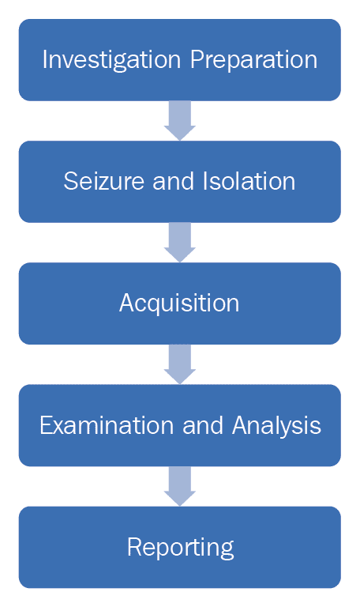

以下部分将详细讨论每个阶段。

# 调查准备

这一阶段从接收到检查请求时开始。它包括准备所有必要的文书和表格，以记录证据链、所有权信息、设备型号、目的、请求方所寻求的信息等。证据链指的是按时间顺序记录的文件或纸质档案，展示了物理或电子证据的扣押、保管、控制、转移、分析和处置。根据请求方提交的细节，重要的是要清楚地了解每项检查的目标。

# 扣押和隔离

扣押设备时的处理是执行取证分析中的一个重要步骤。证据通常通过防静电袋运输，这些袋子旨在保护电子元件免受静电损坏。设备一旦被扣押，必须小心确保我们的操作不会导致设备上的数据修改。同时，也不应错过任何有助于调查的机会。以下是处理安卓设备时需要注意的几点：

+   随着用户对安全性和隐私的关注不断增加，现在大多数设备默认启用屏幕锁定。在扣押期间，如果有机会（例如，手机恢复解锁状态），请禁用密码。一些设备在禁用锁屏选项时，不要求用户重新输入密码。

+   如果设备已解锁，尝试更改设备设置以允许更大的访问权限。以下是一些可以考虑的设置，以实现这一目标：

    +   **启用 USB 调试**：启用此选项将通过**安卓调试桥**（**ADB**）连接为设备提供更大的访问权限。我们将在第二章《设置安卓取证环境》中详细介绍 ADB。这将大大帮助取证调查人员在数据提取过程中。在安卓设备中，这个选项通常可以在设置 | 开发者选项下找到，如下图所示。从安卓 4.2 开始，新的安卓版本默认隐藏开发者选项。要启用它们，请转到设置 | 关于手机（或在安卓 8.0 及更高版本中选择**设置 | 系统 | 关于手机**），然后点击“版本号”七次。

    +   **启用保持唤醒设置**：启用此选项并在充电时将使设备保持唤醒状态；换句话说，它不会被锁定。在安卓设备中，这个选项通常可以在设置 | 开发者选项下找到，如下图所示：

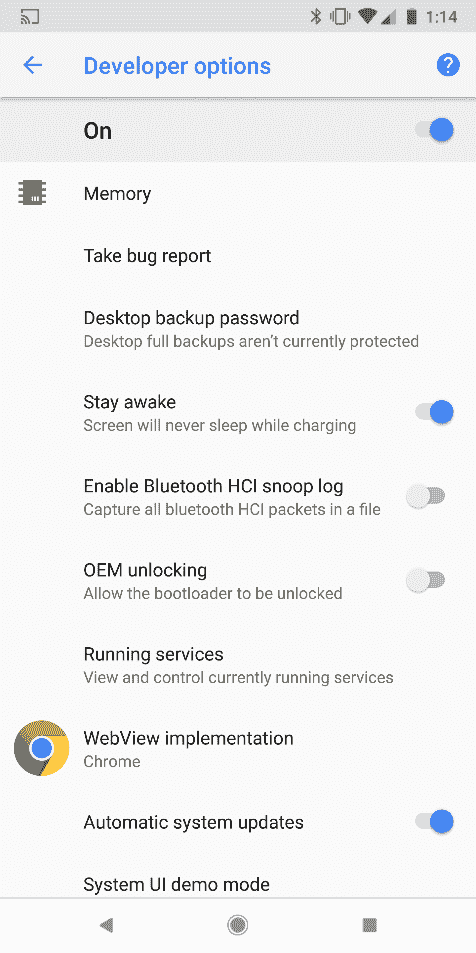

+   +   **增加屏幕超时**：这是设备解锁后保持活动状态的时间。根据设备型号，这个时间最长可以设置为 30 分钟。在大多数设备中，可以通过设置 | 显示 | 屏幕超时进行访问。

请注意，访问这些选项的位置会因安卓手机的不同版本和型号而有所不同，某些版本可能没有该选项。

在移动取证中，保护被扣押设备至关重要，以确保我们与证据的互动（或者说攻击者试图远程与设备互动）不会改变证据内容。在计算机取证中，我们可以使用软件和硬件写保护器来执行此功能。但在移动取证中，由于我们需要与设备互动以提取数据，这些写保护器并不起作用。另一个重要方面是，我们还需要防止设备与无线电网络互动。如前所述，攻击者很可能会发出远程擦除命令，删除设备上的所有数据，包括电子邮件、应用程序、照片、联系人和其他文件。

Android 设备管理器和其他一些第三方应用程序允许远程擦除或锁定手机。这可以通过登录配置在手机上的 Google 账户来完成。使用这些软件，攻击者还可以定位设备，这可能带来安全风险。出于这些原因，将设备与所有通信源隔离非常重要。

你有没有考虑过不通过互联网进行远程擦除的选项？**移动设备管理**（**MDM**）软件，企业常用来管理公司设备，可以通过发送短信来提供远程擦除功能。将设备与所有通信选项隔离是至关重要的。

要将设备与网络隔离，如果我们能够访问该设备，可以将设备设置为飞行模式。飞行模式会禁用设备的无线传输功能，如蜂窝网络、Wi-Fi 和蓝牙。然而，由于现在飞机上也提供 Wi-Fi，一些设备在飞行模式下也允许连接 Wi-Fi。以下截图显示了通过从锁屏下拉顶部菜单栏访问的快速设置：

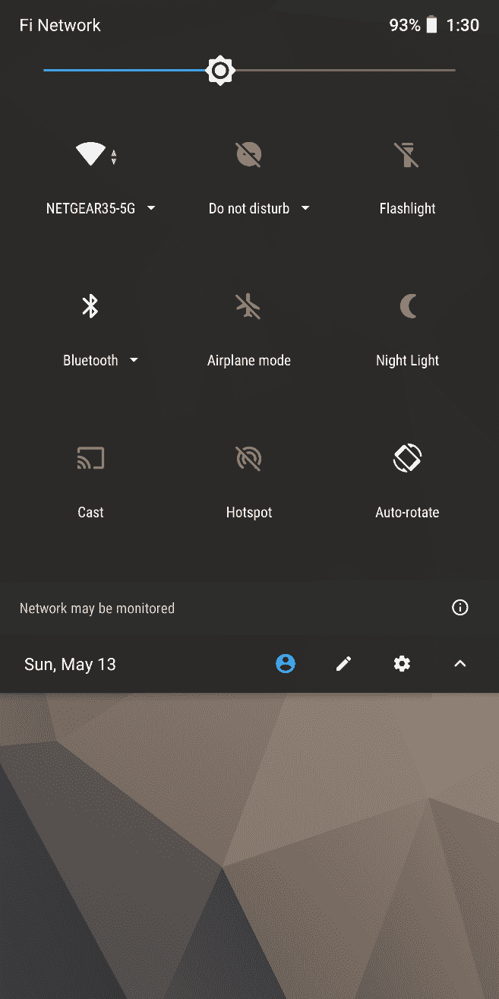

请注意，这些切换选项是可定制的，并且可能并非所有设备都能使用；有些设备可能还需要解锁设备才能进行这些更改。

另一种解决方案是使用法拉第袋或 RF 隔离盒，它们都能有效地屏蔽手机信号的收发。这些隔离方法的一个问题是，一旦使用了它们，手机的触摸屏或键盘无法正常使用，因为你无法透过隔离设备查看手机。为了解决这个问题，存在法拉第帐篷和房间，如下图所示：


即使采取了所有这些预防措施，某些自动功能，如闹钟，仍然可能会触发。如果遇到这种情况，必须正确记录。

# 获取阶段

获取阶段指的是从设备中提取数据。由于移动设备固有的安全特性，提取数据并不总是简单直接的。提取方法主要取决于操作系统、品牌和型号。以下是可以用于从设备中提取数据的获取方法类型：

+   **手动获取**是所有获取方法中最简单的一种。检查员使用手机的用户界面浏览和调查。这里不需要特殊的工具或技术，但其限制在于只能提取通过正常用户界面可见的文件和数据。通过其他方法提取的数据也可以通过这种方式进行验证。需要注意的是，这种选项非常容易修改设备上的数据（例如，打开未读的短信将其标记为已读），因此这些更改应尽可能详细地记录。

+   **逻辑获取**，也称为**逻辑提取**，通常指的是提取存在于逻辑存储中的文件，如文件系统分区。这包括从手机中获取如短信、通话历史记录和图片等数据类型。逻辑提取技术通过使用原始设备制造商的**应用程序编程接口**（**API**）来同步手机内容与计算机。这种技术通常涉及提取以下证据：

    +   通话记录

    +   短信

    +   多媒体短信

    +   浏览器历史记录

    +   人物

    +   联系方式

    +   联系人扩展

    +   联系人组

    +   联系人电话

    +   联系人设置

    +   外部图像媒体（元数据）

    +   外部图像缩略图媒体（元数据）

    +   外部媒体、音频及杂项（元数据）

    +   外部视频（元数据）

    +   多媒体短信部分（包括通过 MMS 发送的完整图像）

    +   位置详情（GPS 数据）

    +   网络活动

    +   组织

    +   所有已安装应用及其版本列表

    +   社交网络应用数据，如 WhatsApp、Skype 和 Facebook

+   **文件系统获取**是一个逻辑过程，通常指从移动设备中提取完整的文件系统。文件系统获取有时可以帮助恢复从设备中删除的内容（存储在 SQLite 文件中）。

+   **物理获取**涉及对整个闪存存储设备进行逐位复制，相当于对硬盘的完整镜像。通过此方法提取的数据通常是原始数据（以十六进制转储的形式），然后可以进一步解析以获取文件系统信息或可读数据。由于所有调查工作都是在此镜像上进行的，这一过程也确保了原始证据未被更改。

# 检查和分析

在此阶段，使用不同的软件工具从内存映像中提取数据。除了工具外，调查员可能还需要十六进制编辑器的帮助，因为工具并不总是能提取所有数据。没有单一工具能够在所有情况下使用。因此，检查和分析需要对各种文件系统、文件头等有扎实的知识。

# 报告  

在整个过程中应进行考试文档记录，记录下每个阶段所做的工作。以下是检查员可能记录的一些要点：  

+   考试开始的日期和时间  

+   手机的物理状况  

+   收到手机时的状态（开/关）  

+   手机的品牌、型号和操作系统  

+   手机及其各个组件的图片  

+   调查过程中使用的工具（包括版本号）  

+   在检查过程中记录的数据  

从移动设备提取的数据应清晰地呈现给接收方，以便能够导入到其他软件中进行进一步分析。在民事或刑事案件中，尽可能地收集手机上存在的数据的图片，因为这些图片对陪审团来说具有视觉冲击力。  

# 移动取证中的挑战  

随着 Android 设备的使用增加以及它们支持的通信平台种类的扩展，对取证检查的需求自然也增加了。在与移动设备合作时，取证分析员面临着许多挑战。以下几点揭示了今天面临的一些**移动取证挑战**：  

+   **防止设备上的数据篡改**：法医学中的一个基本规则是保留原始证据。换句话说，应用于设备上的法医技术提取任何信息时，不应改变设备上现有的数据。然而，在移动设备法医学中，这通常并不实际，因为仅仅开启设备也可能会改变设备上的某些状态变量。在移动设备中，后台进程始终在运行，从一种状态到另一种状态的突然过渡可能会导致数据的丢失或修改。因此，数据可能会被法医分析师故意或无意地篡改。除此之外，攻击者（或用户）有很大可能性能够远程更改或删除设备的内容。由于移动电话使用不同的通信通道（如蜂窝网络、Wi-Fi、蓝牙、红外等），应该消除通过这些通道进行通信的可能性。像远程数据擦除这样的功能使得攻击者能够通过发送短信或仅仅按下一个按钮来向 Android 设备发送擦除请求，从而远程擦除整个设备。与计算机法医学不同，移动设备法医学不仅仅是将设备与网络隔离，*手机在检查期间不能总是保持关闭状态*。

+   **操作系统和设备型号的广泛性**：市场上可用的各种移动操作系统使得法医分析师的工作更加困难。虽然 Android 是移动世界中最主流的操作系统，但仍有一些设备运行其他操作系统，包括 iOS、Blackberry 和 Windows，这些设备在调查中经常遇到。此外，对于给定的操作系统，有成千上万的移动设备可用，它们在操作系统版本、硬件以及其他各种特性上有所不同。根据制造商的不同，获取法医证据的方法也会有所变化。为了保持竞争力，制造商快速发布新型号和更新，难以追踪所有设备。有时，即使是同一操作系统中，数据存储选项和文件结构也会发生变化，这让工作变得更加困难。目前没有任何单一工具能够适用于所有类型的移动操作系统。因此，法医分析师必须保持对最新变化和技术的更新，并理解本书中的基本概念，以便在工具失效时仍能成功。

+   **固有的安全特性**：随着隐私概念日益重要，手机制造商正朝着在设备上实施强大安全控制的方向发展，这使得获取设备数据的过程更加复杂。例如，如果设备设置了密码保护，法医调查员必须首先找到绕过密码的方法。同样，许多现代设备上实施的全盘加密机制阻止了执法机构和法医分析人员访问设备上的信息。苹果的 iPhone 默认使用内置硬件密钥加密设备上的所有数据。从 Android Nougat 开始，Android 默认强制全盘加密（尽管如果操作系统被制造商修改，可能会有所不同）。在 2017 年 Google I/O 大会上，Google 宣布 80%的 Android 7.0 Nougat 设备已加密，70%的设备使用了安全锁屏。随着越来越多的制造商在初始设置过程中强制加密，这些数字可能会继续增长。对于检查员来说，使用暴力破解等技术打破这些加密机制是非常困难的。

+   **法律问题**：移动设备可能涉及跨越全球的犯罪，并可能跨越地理边界。为了应对这些跨司法管辖区的问题，法医检查员需要了解犯罪的性质和区域法律。

# Android 架构

在我们深入研究 Android 法医之前，本节将向您介绍 Android 作为操作系统，并介绍一些必须理解的基本概念，这些概念是获得法医经验所必需的。

任何操作系统（桌面或手机）都负责管理系统资源，并为应用程序提供与硬件或物理组件进行交互的方式，以完成某些任务。Android 操作系统也不例外。它为手机提供动力，管理内存和进程，执行安全性，处理网络问题等等。Android 是开源的，大部分代码是根据 Apache 2.0 许可证发布的。实际上，这意味着手机设备制造商可以访问它，免费修改它，并根据任何设备的需求使用该软件。这是其普及的主要原因之一。

Android 操作系统由一层层叠加运行的层组成。要最好地理解 Android 架构，需要了解这些层是什么以及它们的作用。以下屏幕截图（由[`developer.android.com`](http://developer.android.com)提供）展示了 Android 软件堆栈中涉及的各个层：

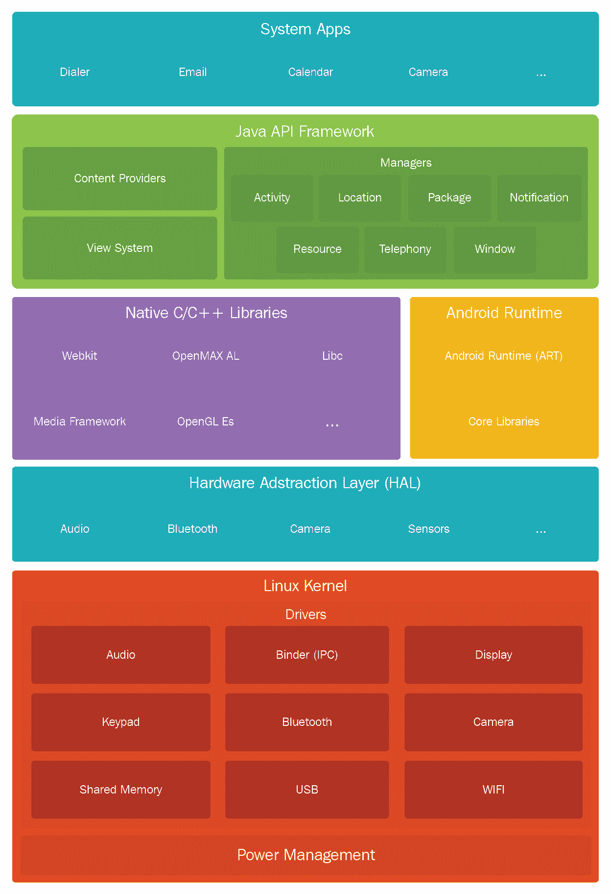

Android 架构以软件栈的形式存在，包括内核、库、运行时环境、应用程序、中间件和服务。栈的每一层以及每一层中的元素，都是以一种最佳的方式集成在一起，为移动设备提供最佳的执行环境。接下来的章节将重点介绍 Android 软件栈中的不同层，从底层的 Linux 内核开始。

# Linux 内核

Android 操作系统建立在 Linux 内核之上，并由 Google 做了一些架构上的改动。选择 Linux 是因为它是一个便于移植的平台，能够在不同硬件上轻松编译。Linux 内核位于软件栈的最底层，为设备硬件和上层之间提供了一个抽象层。它还充当了软件与设备硬件之间的抽象层。为了更好地理解这一点，考虑一下拍照的过程。当你按下手机上的摄像头按钮拍照时，实际发生了什么？在某个时刻，硬件指令（按下按钮）必须转换为软件指令（拍照并将照片存储到相册中）。内核包含的驱动程序可以帮助实现这一过程。当摄像头按钮点击被检测到时，指令会发送到内核中相应的驱动程序，该驱动程序向摄像头硬件发送必要的命令，类似于按下键盘上的某个键。简单来说，内核中的驱动程序控制着底层硬件。正如之前截图所示，内核包含与 Wi-Fi、蓝牙、USB、音频、显示等相关的驱动程序。

Android 的所有核心功能，如进程管理、内存管理、安全性和网络连接，都是由 Linux 内核管理的。Linux 是一个经过验证的、安全性和进程管理都非常可靠的平台。Android 利用了现有的 Linux 开源操作系统，为其生态系统构建了一个坚实的基础。每个版本的 Android 都有不同版本的底层 Linux 内核。目前，Google 要求运行 Android 8.0 Oreo 操作系统的设备至少要搭载 Linux 内核 4.4 版本。

# 硬件抽象层

硬件抽象层（HAL）允许更高层次的 Java API 框架通过标准接口与移动设备的硬件进行交互。这得益于多个库模块，它们为不同类型的硬件组件（如蓝牙或摄像头）提供接口。

# Android 运行时

自 Android 5.0 起，每个应用程序都在自己的进程中运行，并且拥有独立的 Android 运行时（ART）实例。它通过执行 DEX（Dalvik 可执行文件）文件，使得在低内存设备上运行多个虚拟机成为可能。需要注意的是，在 5.0 版本之前，Dalvik 是 Android 运行时，因此为 Dalvik 开发的应用程序应该能在 ART 上正常运行。

# 原生 C/C++ 库

许多核心 Android 系统组件和服务，包括之前提到的 HAL 和 ART，都是由本地代码构建的，因此它们需要用 C 和 C++ 编写的本地库。

# Java API 框架

Java API 框架允许开发者使用模块化的系统组件和服务作为构建块来创建应用程序：

+   视图系统允许构建应用程序的用户界面，包括列表、网格、文本框、按钮等。

+   资源管理器提供访问应用程序的非代码组件，如本地化字符串、图形和布局文件。

+   通知管理器允许应用程序显示自定义警报。

+   活动管理器管理应用程序的生命周期，以及它们的后退栈——即每个活动打开的顺序。

+   内容提供者允许应用程序访问其他应用程序的数据，并共享自己的数据。

# 应用程序层

Android 堆栈中的最上层由应用程序（称为 **应用**）组成，这些是用户直接交互的程序。这里讨论了两种类型的应用程序：

+   **系统应用**：这些是预装在手机上的应用程序，随手机一起出厂。像默认浏览器、电子邮件客户端和联系人等就是系统应用的例子。这些应用程序通常无法被用户卸载或更改，因为它们在生产设备上是只读的，尽管某些设备提供了*禁用*这些应用程序的功能。如果系统应用被禁用，应用程序及其所有数据仍然保留在设备的系统分区中，应用程序图标只是从用户界面中隐藏。这些应用程序通常可以在 `/system` 分区找到。在 Android 4.4 KitKat 之前，所有位于 `/system` 分区的应用程序都被视为平等。但从 Android 4.4 开始，安装在 `/system/priv-app/` 下的应用程序被视为特权应用，并被授予带有保护级别 signatureOrSystem 的权限。

+   **用户安装的应用**：这些是用户从各种分发平台（如 Google Play）下载并安装的应用程序。Google Play 是 Android 操作系统的官方应用商店，用户可以浏览和下载应用程序。根据 Statista 2017 年 12 月的统计数据，Google Play 商店中大约有 350 万款 Android 应用程序。这些应用程序位于 `/data` 分区。关于如何在它们之间执行安全性管理的更多信息将在接下来的章节中讨论。

# Android 安全

Android 作为平台，其架构内置了某些功能，确保用户、应用程序和数据的安全性。尽管这些安全功能有助于保护数据，但有时它们会阻止调查人员访问必要的数据。从取证的角度来看，首先要了解内在的安全特性，以便清楚地了解在正常情况下可以访问哪些数据，哪些不能访问。所内置的安全功能和服务旨在实现三项目标：

+   保护用户数据

+   保护系统资源

+   确保一个应用程序无法访问另一个应用程序的数据

下一节将概述 Android 操作系统中的关键安全功能。

# 通过 Linux 内核在操作系统级别确保安全

Android 操作系统建立在 Linux 内核之上。在过去几十年中，Linux 已经发展成为一个安全的操作系统，全球许多企业信任其安全性。通过将 Linux 内核作为平台的核心，Android 试图确保操作系统级别的安全性。此外，Android 在 Linux 中内建了大量与移动环境相关的特定代码。随着每次 Android 发布，内核版本也随之变化。下表显示了 Android 版本及其相应的 Linux 内核版本：

| **Android 版本** | **Linux 内核版本** |
| --- | --- |
| 1.0 | 2.6.25 |
| 1.5 | 2.6.27 |
| 1.6 | 2.6.29 |
| 2.2 | 2.6.32 |
| 2.3 | 2.6.35 |
| 3.0 | 2.6.36 |
| 4.0 | 3.0.1 |
| 4.1 | 3.0.31 |
| 4.2 | 3.4.0 |
| 4.3 | 3.4.39 |
| 4.4 | 3.8 |
| 5.0 | 3.16.1 |
| 6.0 | 3.18.10 |
| 7.0 | 4.4.1 |
| 7.1 | 4.4.1 |
| 8.0 | 4.10 |
| 9.0 | 4.4.107, 4.9.84, 和 4.14.42 |

Linux 内核为 Android 提供以下关键安全特性：

+   基于用户的权限模型

+   进程隔离

+   可扩展的安全 IPC 机制

# 权限模型

Android 为单独的应用程序实现了权限模型。应用程序必须在清单文件中声明它们需要哪些权限。在 Android 的早期版本中，用户在安装之前会看到应用程序请求的完整权限列表。

Android 的新版本在每次应用程序需要权限时，都会提示用户。这种模型允许用户在不授予应用程序所要求的所有权限的情况下使用该应用，尽管功能可能会减少。

# Android 中的示例权限模型

与桌面环境不同，这为用户提供了提前了解应用程序请求访问的资源的机会。换句话说，必须获得用户许可才能访问设备上的任何关键资源。通过查看请求的权限，用户能够更清楚地意识到安装应用程序时所涉及的风险。

如前所述，开发者需要在名为`AndroidManifest.xml`的文件中识别权限。例如，如果应用需要访问互联网，则需要在`AndroidManifest.xml`文件中使用以下代码指定`INTERNET`权限：

```
<manifest 
package="com.example.rohit">
…
<uses-permission android:name="android.permission.INTERNET" />
…
</manifest>
```

Android 权限分为四个等级：

| **权限类型** | **描述** |
| --- | --- |
| 普通权限 | 这是默认值。此类权限属于低风险权限，不会对其他应用、系统或用户构成风险。此权限会在安装时自动授予用户，无需用户批准。 |
| 危险权限 | 这些权限可能会对系统和其他应用造成危害，因此在安装过程中需要用户授权。 |
| 签名权限 | 如果请求的应用与声明/创建此权限的应用使用相同证书签名，则此权限会自动授予该应用。此级别旨在允许一组应用或相关应用共享数据。 |
| 签名/系统权限 | 只有 Android 系统镜像中的应用或与声明此权限的应用使用相同证书签名的应用，才能获得系统授予的此类权限。 |

# 应用沙箱机制

为了将应用相互隔离，Android 利用了 Linux 基于用户的保护模型。在 Linux 系统中，每个用户都有一个唯一的**用户 ID**（**UID**），并且用户之间是隔离的，一个用户不能访问另一个用户的数据。特定用户下的所有资源都在相同权限下运行。同样，每个 Android 应用都分配有一个 UID，并以独立进程的方式运行。这意味着，即使已安装的应用尝试做一些恶意行为，它也只能在其自身的上下文中进行，并且只能在它拥有的权限范围内进行。这种应用沙箱机制是在内核层面实现的。应用与系统之间在进程级别的安全性是通过标准的 Linux 设施（如分配给应用的用户和组 ID）来确保的。例如，以下截图来自[`www.ibm.com/developerworks/library/x-androidsecurity/`](http://www.ibm.com/developerworks/library/x-androidsecurity/)展示了沙箱机制：

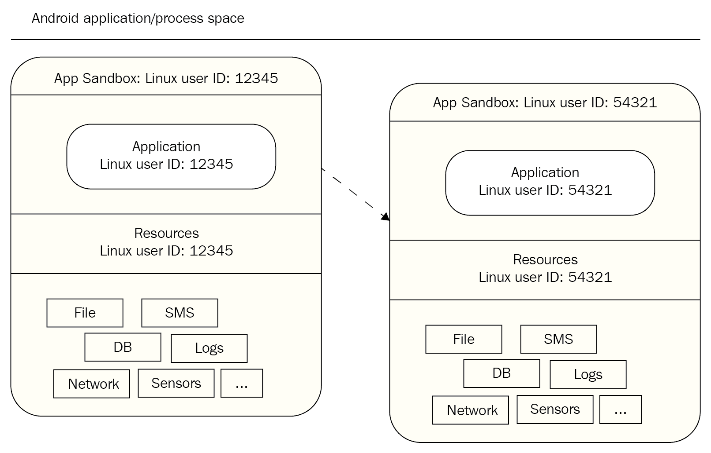

默认情况下，应用程序不能读取或访问其他应用程序的数据，并且对操作系统的访问权限受到限制。例如，如果应用程序 A 尝试读取应用程序 B 的数据，操作系统会对此进行保护，因为应用程序 A 没有适当的用户权限。由于应用程序沙箱机制是在内核级别实现的，它适用于本地应用程序和操作系统应用程序。因此，操作系统库、应用程序框架、应用程序运行时以及所有应用程序都在应用程序沙箱内运行。绕过此沙箱机制将需要破坏 Linux 内核的安全性。

# Android 中的 SELinux

从 Android 4.3 开始，**增强安全 Linux**（**SELinux**）已被 Android 安全模型所支持。Android 安全基于自主访问控制，这意味着应用程序可以请求权限，用户可以授予或拒绝这些权限。因此，恶意软件通过获得权限可以对手机造成破坏。Android 使用 SELinux 强制实施强制访问控制，确保应用程序在隔离的环境中运行；这包括作为 root 或超级用户运行的应用程序。因此，即使用户安装了恶意应用，恶意软件也无法轻易访问操作系统并破坏设备。SELinux 用于在所有进程上强制实施**强制访问控制**（**MAC**），包括那些具有 root 权限的进程。SELinux 的运作原则是 *默认拒绝*。任何没有明确允许的操作都会被拒绝。SELinux 可以在两种全局模式下运行：宽容模式，在该模式下，权限拒绝会被记录，但不会强制执行；和强制模式，在该模式下，拒绝操作会被记录并强制执行。根据 Google 的文档，在 Android 5.0 Lollipop 版本中，Android 实现了对 SELinux 的全面强制执行。这是在 4.3 版本的宽容发布和 4.4 版本的部分强制执行基础上的进一步改进。简而言之，Android 正在从仅限于几个关键领域（`installd`、`netd`、`vold` 和 `zygote`）的强制执行，转向对所有领域（超过 60 个领域）的全面强制执行。

# 应用程序签名

所有 Android 应用在安装到设备上之前都需要使用证书进行数字签名。使用证书的主要目的是识别应用的作者。这些证书不需要由证书授权机构签发，Android 应用通常使用自签名证书。应用开发者持有证书的私钥。开发者可以使用相同的私钥为应用程序提供更新，并在应用之间共享数据。在调试模式下，开发者可以使用 Android SDK 工具生成的调试证书为应用签名。你可以运行和调试以调试模式签名的应用，但该应用不能分发。要分发应用，应用需要使用你自己的证书进行签名。在此过程中使用的密钥库和私钥需要由开发者加以保护，因为它们对推送更新至关重要。以下截图显示了导出应用时显示的密钥库选择选项：

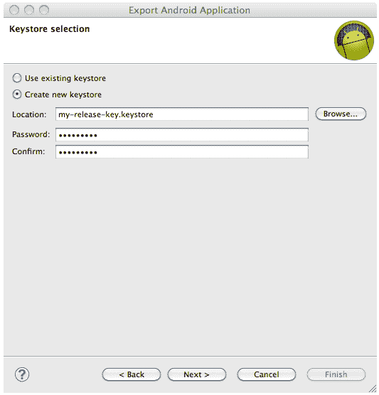

# 安全的进程间通信

如前所述，应用程序的沙盒机制是通过在不同的进程中以不同的 Linux 身份运行应用程序来实现的。系统服务在单独的进程中运行，并具有更多的权限。因此，为了组织这些进程之间的数据和信号，需要一个**进程间通信**（**IPC**）框架。在 Android 中，这是通过使用 Binder 机制来实现的。

Android 中的 Binder 框架提供了组织各种进程间通信所需的能力。Android 应用组件，如 Intents 和内容提供者，也都是建立在这个 Binder 框架之上的。通过使用这个框架，可以执行多种操作，如调用远程对象的方法，就像它们是本地的一样，支持同步和异步方法调用，以及在进程间传递文件描述符。假设进程 A 中的应用程序想要使用运行在进程 B 中的 Service 暴露的某些行为。在这种情况下，进程 A 是客户端，进程 B 是服务。使用 Binder 的通信模型如下图所示：

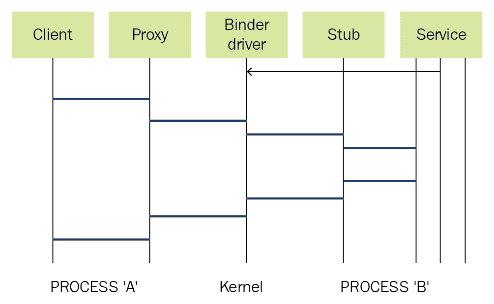

# Binder 通信模型

使用 Binder 框架的所有进程间通信都通过 Linux 内核驱动程序`/dev/binder`进行。对该设备驱动程序的权限设置为可供所有用户读取和写入，这意味着任何应用程序都可以读写该设备驱动程序。客户端和服务器之间的所有通信都通过客户端侧的代理和服务器侧的存根进行。代理和存根负责发送和接收通过 Binder 驱动程序发送的数据和命令。

每个通过 Binder 机制暴露的服务（也称为 Binder 服务）都会分配一个令牌。这个令牌是一个 32 位的值，在系统中所有进程中都是唯一的。客户端可以在发现这个值后开始与服务进行交互，这可以通过 Binder 的上下文管理器来实现。基本上，上下文管理器充当一个命名服务，使用服务的名称提供服务的句柄。为了使这个过程正常工作，每个服务必须向上下文管理器注册。因此，客户端只需要知道服务的名称即可进行通信。

名称由上下文管理器解析，客户端接收到令牌，该令牌随后用于与服务进行通信。Binder 驱动程序将发送方进程的 UID 和 PID 值添加到每个事务中。如前所述，系统中的每个应用程序都有自己的 UID，因此该值用于标识调用方。接收方可以检查获得的值，并决定是否完成该事务。因此，安全性得到了保障，Binder 令牌充当了安全令牌，因为它在所有进程中都是唯一的。

# Android 硬件组件

Android 与多种硬件组件兼容。Linux 内核使这一切变得简单，因为 Linux 支持各种各样的硬件。这为制造商提供了很大的灵活性，因为他们可以根据自己的需求进行设计，而不必担心兼容性问题。这对法医分析师在调查过程中提出了重大挑战。因此，了解硬件组件和设备类型将大大有助于理解 Android 法医分析。

# 核心组件

设备中存在的组件因制造商和型号的不同而有所变化。然而，有一些组件在大多数移动设备中都有出现。以下章节提供了 Android 设备中常见组件的概述。

# 中央处理单元（CPU）

CPU，也称为处理器，负责执行手机上发生的所有操作。它告诉设备该做什么以及如何做。它的性能通过每秒可以完成的任务数量来衡量，这称为 **周期**。例如，一个 1 GHz 的处理器每秒可以处理十亿个周期。处理器的容量越大，手机的性能就会越流畅。在智能手机中，我们会遇到以下术语：ARM、x86（Intel）、MIPS、Cortex，以及 A5、A7 或 A9。ARM 是一家公司，授权其架构（品牌为 Cortex），每年推出不同的型号，如前面提到的 A 系列。基于这些架构，芯片制造商发布了自己的芯片系列（如 Snapdragon、Exynos 等），这些芯片被用于移动设备。较新的智能手机采用双核、四核甚至八核处理器。

# 基带处理器

现代智能手机支持多种移动通信协议，包括 GSM、3G、4G 和 LTE。这些协议非常复杂，需要大量的 CPU 计算能力来处理数据、生成数据包，并将其传输到网络提供商。为了处理这一过程，智能手机现在使用*基带调制解调器*，这是一种与主处理器通信的独立芯片。这些基带调制解调器拥有自己的处理器，称为*基带处理器*，并运行自己的操作系统。基带处理器管理多个无线控制功能，如信号生成、调制、编码以及频率偏移。它还可以管理信号的传输。

基带处理器通常位于与 CPU 相同的电路板上，但由一个独立的无线组件组成。

# 内存

安卓手机和普通计算机一样，使用两种主要的内存类型：RAM 和 ROM。尽管大多数用户对这些概念很熟悉，但在移动设备上，仍然存在一些混淆。

RAM 是随机存取存储器（Random Access Memory）的缩写。它是易失性的，意味着断电后内容会被删除。RAM 访问速度非常快，主要用于软件应用程序的运行时内存（包括设备的操作系统和所有应用程序）。换句话说，它被系统用来加载和执行操作系统及其他应用程序。可以同时运行的应用程序和进程的数量取决于 RAM 的大小。

ROM（通常被称为**安卓 ROM**）是只读存储器（Read-Only Memory）的缩写。它是非易失性的，这意味着即使断电，内容也会被保留。安卓 ROM 包含启动加载程序、操作系统、所有下载的应用程序及其数据、设置等。

注意，启动加载程序和安卓系统使用的那部分内存通常是锁定的，只有通过固件升级才能更改。其余部分的内存被一些厂商称为*用户内存*。这里存储的每个应用程序的数据不会被其他应用程序访问。一旦这部分内存被填满，设备的运行速度就会变慢。RAM 和安卓 ROM 通常被制造成一个单独的组件，称为**多芯片封装**（**MCP**）。

# SD 卡

SD 卡在手机取证中具有重要意义，因为它上存储的数据常常是关键证据，即使设备被锁定或加密，也能访问。许多安卓设备具有可拆卸的存储卡，通常被称为**安全数字**（**SD**）卡。与此不同，苹果的 iPhone 没有 SD 卡的插槽。SD 卡是非易失性的，这意味着即使它们断电，数据仍然保存在其中。SD 卡使用闪存，这是一种**电可擦可编程只读存储器**（**EEPROM**），它以大块而非单个字节的方式进行擦写。大多数多媒体数据和大文件由应用程序存储在 SD 卡中。为了与其他设备互操作，SD 卡实现了特定的通信协议和规范。

在一些手机中，尽管存在 SD 卡接口，但部分机载 NAND 内存（非易失性）被划分出来，用于创建一个模拟的 SD 卡。这实际上意味着 SD 卡是不可拆卸的。因此，法医分析师需要检查他们处理的是实际的 SD 卡还是模拟的 SD 卡。SD 内存卡有几种不同的尺寸。迷你 SD 卡和微型 SD 卡与原始 SD 内存卡使用相同的技术，但尺寸更小。

# 显示屏

近年来，手机屏幕发展迅速。以下是一些常见手机屏幕类型的简要描述。

+   **TFT LCD**代表**薄膜晶体管液晶显示屏**，这是手机中最常见的屏幕类型。这些屏幕下面有一盏灯，透过像素使其可见。

+   **AMOLED**代表**主动矩阵有机发光二极管**；这是一种基于有机化合物的技术，以其优异的图像质量和低功耗而闻名。与 LCD 屏幕不同，AMOLED 显示器不需要背光—每个像素都会发光—因此使用 AMOLED 的手机可能更薄。

这些内容可以在[`www.in.techradar.com/news/phone-and-communications/mobile-phones/Best-phone-screen-display-tech-explained/articleshow/38997644.cms`](http://www.in.techradar.com/news/phone-and-communications/mobile-phones/Best-phone-screen-display-tech-explained/articleshow/38997644.cms)上找到。

# 电池

电池是手机的命脉，也是现代智能手机用户最关心的因素之一。你使用设备及其组件的频率越高，电池消耗的速度就越快。以下是手机中使用的不同类型的电池：

+   **锂离子**（**Li-Ion**）电池是手机中最常用的电池，因为它们轻便易携带，且以高能量密度和低维护著称。然而，与其他类型的电池相比，它们的制造成本较高。

+   **锂聚合物**（**Li-Poly**）电池具有锂离子电池的所有特性，但具有超薄几何形状和简化的包装。它们是最新技术，只在少数移动设备中出现。

+   **镍镉**（**NiCd**）电池是旧技术电池，且会受到记忆效应的影响。因此，电池的整体容量和使用寿命都会降低。此外，镍镉电池由有毒材料制成，对环境不友好。

+   **镍氢**（**NiMH**）电池与镍镉电池相似，但可以容纳更高的能量，并且可以运行 30%到 40%更长的时间。它们仍然会受到记忆效应的影响，但相比于**镍镉**（**NiCd**）电池要少得多。它们广泛应用于手机，并且价格实惠。

电池类型可以通过查看其外壳上的详细信息来识别。

通常，SD 卡位于电池后面。在取证分析过程中，访问 SD 卡可能需要拆卸电池，这将关闭设备电源。这可能会产生一些后果，后续章节将详细讨论。

除了之前描述的组件外，以下是一些其他知名组件：

+   **全球定位系统**（**GPS**）

+   Wi-Fi

+   **近场通信**（**NFC**）

+   蓝牙

+   摄像头

+   按键盘

+   USB

+   加速度计和陀螺仪

+   扬声器

+   麦克风

# Android 启动过程

了解 Android 设备的启动过程有助于我们理解涉及在不同层面与设备交互的其他取证技术。当 Android 设备首次开机时，会执行一系列步骤，帮助设备将必要的固件、操作系统、应用数据等加载到内存中。以下信息来自原文发布于[`community.nxp.com/docs/DOC-102546`](https://community.nxp.com/docs/DOC-102546)。

以下是 Android 启动过程中涉及的步骤顺序：

1.  启动 ROM 代码执行

1.  启动加载程序

1.  Linux 内核

1.  初始化过程

1.  Zygote 和 Dalvik

1.  系统服务器

我们将详细研究每个步骤。

# 启动 ROM 代码执行

在设备开机之前，设备的 CPU 处于未进行任何初始化的状态。一旦 Android 设备开机，执行将从启动 ROM 代码开始。此启动 ROM 代码是特定于设备所用 CPU 的。如下图所示，此阶段包括 A 和 B 两个步骤：

+   **步骤 A**：当启动 ROM 代码执行时，它会初始化设备硬件并尝试检测启动媒体。因此，启动 ROM 代码会一直扫描，直到找到启动媒体。这与计算机启动过程中的 BIOS 功能几乎相同。

+   **步骤 B**：一旦启动序列建立，初始引导加载程序会被复制到内部 RAM 中。此后，执行权转移到加载到 RAM 中的代码：

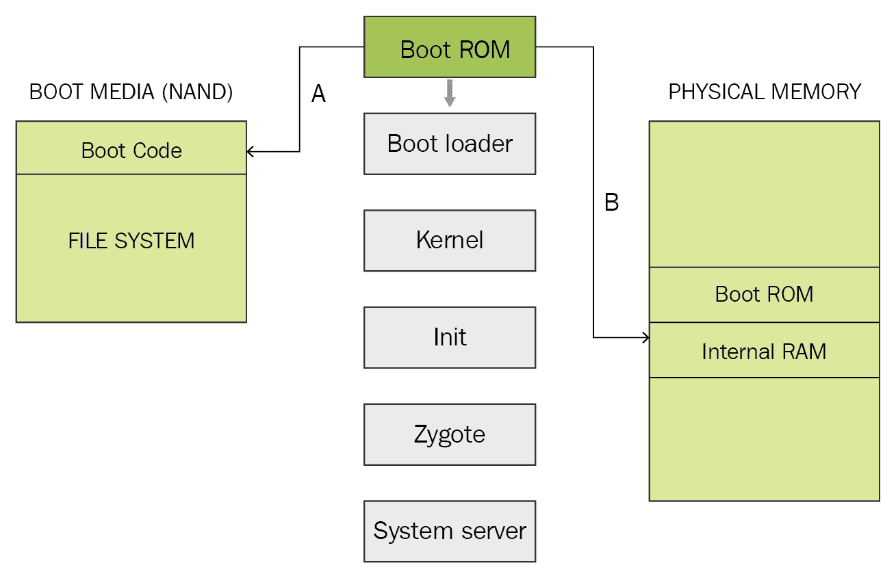

# 引导加载程序

引导加载程序是一个在操作系统开始工作之前执行的小程序。引导加载程序存在于台式电脑、笔记本电脑和移动设备中。在 Android 引导加载程序中，有两个阶段——**初始程序加载**（**IPL**）和**第二程序加载**（**SPL**）。如下面的截图所示，这涉及到这里解释的三个步骤：

+   **步骤 A**：IPL 负责检测和设置外部 RAM。

+   **步骤 B**：一旦外部 RAM 可用，SPL 会被复制到 RAM 中，并且执行权转移到它。SPL 负责加载 Android 操作系统。它还提供访问其他引导模式的功能，如 fastboot 和 recovery。它会初始化多个硬件组件，如控制台、显示器、键盘、文件系统、虚拟内存和其他功能。

+   **步骤 C**：SPL 会尝试查找 Linux 内核。它会从引导媒体中加载该内核，并将其复制到 RAM 中。一旦引导加载程序完成这个过程，它将把执行权转移给内核：

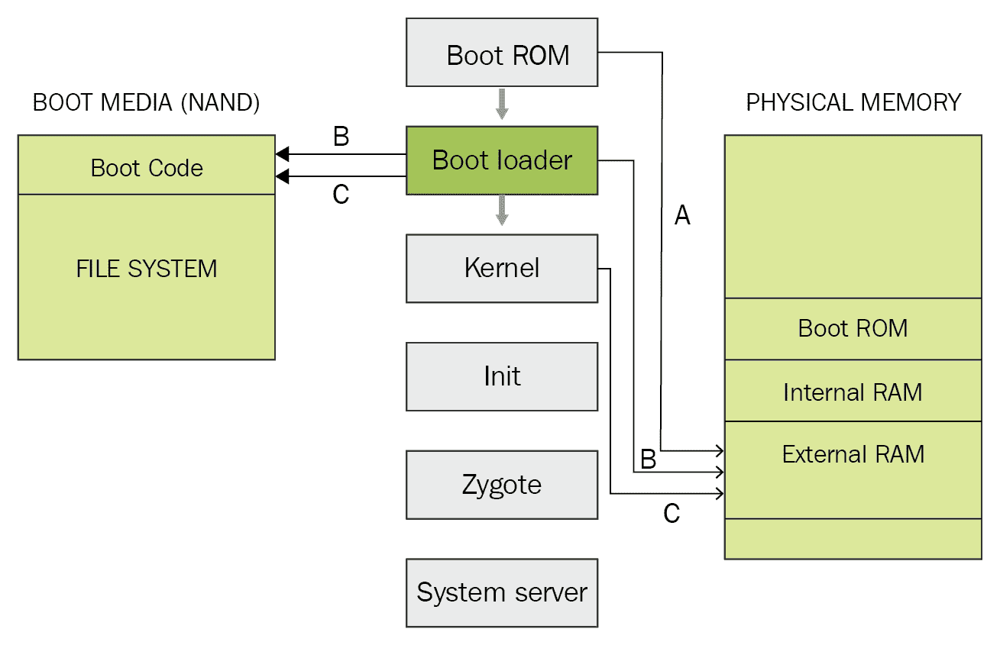

# Linux 内核

Linux 内核是 Android 操作系统的核心，负责进程管理、内存管理以及在设备上执行安全性控制。内核加载后，它会挂载**根文件系统**（**rootfs**），并提供对系统和用户数据的访问：

+   **步骤 A**：当内存管理单元和缓存初始化完成后，系统可以使用虚拟内存并启动用户空间进程。

+   **步骤 B**：内核将在 `rootfs` 中查找 `init` 进程，并将其作为初始用户空间进程启动：


# Init 进程

Init 是第一个启动的进程，是所有其他进程的根进程：

+   **步骤 A**：Init 过程会寻找一个名为 `init.rc` 的脚本。这个脚本描述了系统服务、文件系统以及需要设置的其他参数：

    +   `init` 进程可以在以下位置找到：`<android source>/system/core/init`。

    +   `init.rc` 可以在以下位置找到：`<android source>/system/core/rootdir/init.rc`。

更多关于 Android 文件层次结构的详细内容将在第三章中讨论，*理解 Android 设备上的数据存储*。

+   **步骤 B**：Init 进程会解析 init 脚本并启动系统服务进程。在此阶段，你将在设备屏幕上看到 Android 标志：

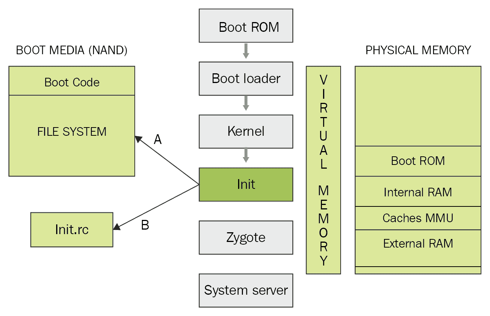

# Zygote 和 Dalvik

Zygote 是设备启动后创建的第一个初始化进程之一。它初始化 Dalvik 虚拟机，并尝试创建多个实例来支持每个 Android 进程。如前面章节所讨论，Dalvik 虚拟机是执行用 Java 编写的 Android 应用程序的虚拟机。

Zygote 通过在虚拟机中共享代码来实现，因此帮助节省内存并减轻系统负担。之后，应用程序可以通过请求新的 Dalvik 虚拟机来运行。Zygote 为 zygote 连接注册一个服务器套接字，并预加载某些类和资源。这个 zygote 加载过程已在 [`elinux.org/Android_Zygote_Startup`](https://elinux.org/Android_Zygote_Startup) 中更清晰地解释：

+   `Load ZygoteInitclass`：加载 `ZygoteInit` 类。源代码：`` `<Android Source> /frameworks/base/core/java/com/android/internal/os/ZygoteInit.java` ``

+   `registerZygoteSocket()`：此方法为 `zygote` 命令连接注册一个服务器套接字。

+   `preloadClasses()`：这是一个简单的文本文件，包含需要预加载的类列表，该文件将在此执行。该文件可以在以下位置找到：`<Android Source>/frameworks/base`。

+   `preloadResources()`：此方法处理本地主题和布局，并加载所有包含 `android.R` 文件的内容：

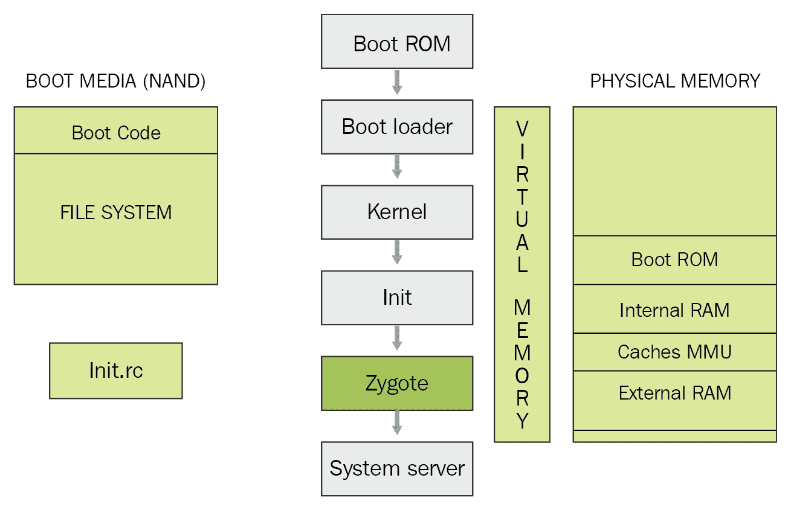

# 系统服务器

设备的所有核心功能，如电话功能、网络功能以及其他重要功能，都是由系统服务器启动的，如下图所示：

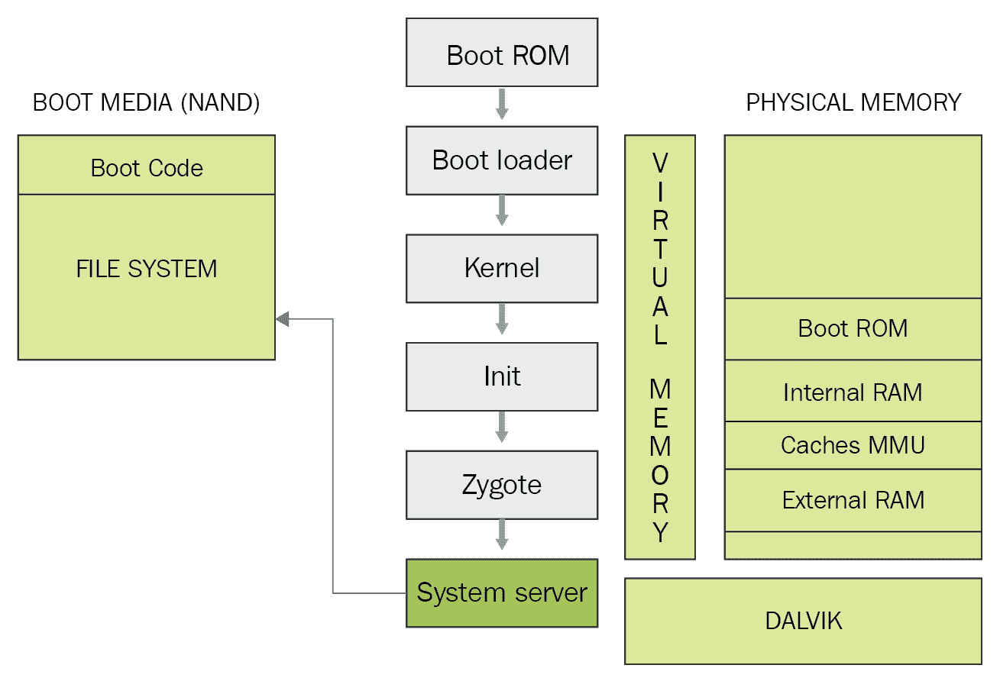

以下是该过程中启动的一些核心服务：

+   启动电源管理器

+   创建活动管理器

+   启动电话注册表

+   启动包管理器

+   将活动管理器服务设置为系统进程

+   启动上下文管理器

+   启动系统上下文提供者

+   启动电池服务

+   启动警报管理器

+   启动传感器服务

+   启动窗口管理器

+   启动蓝牙服务

+   启动挂载服务

系统发送一个广播动作，称为 `ACTION_BOOT_COMPLETED`，告知所有依赖进程启动过程已完成。之后，设备会显示主屏幕，并准备好与用户交互。

如前所述，多个厂商在其设备上使用 Android 操作系统。这些设备厂商大多数会根据其硬件和其他需求定制操作系统。当 Android 发布新版本时，这些设备厂商必须将其自定义软件和调整移植到最新版本。

# 总结

理解 Android 架构和安全模型对于正确理解 Android 取证至关重要。Android 操作系统中固有的安全功能，如应用程序沙箱和权限模型，能够保护设备免受各种威胁，同时也成为取证专家在调查过程中面临的障碍。掌握了 Android 内部结构的知识后，我们将在下一章讨论设备上存储了哪些数据，以及这些数据是如何存储的。
