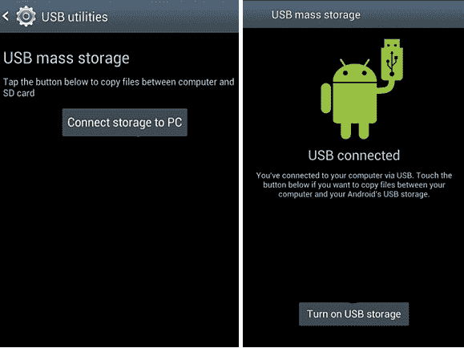

# 第二章：设置 Android 取证环境

在开始取证检查之前，您需要一台工作站。取证分析师需要时刻完全掌控他们的工作站。本章将带您了解建立用于检查 Android 设备的取证环境所需的一切。以下主题将在本章中讨论：

+   Android 取证设置

+   Android 调试桥

+   Rooting Android

# Android 取证设置

在开始任何调查之前，建立一个健全且受控的取证环境至关重要。首先使用一台全新且取证无污染的计算机。取证无污染的计算机是指能够防止交叉污染并且不引入不必要数据的计算机。这是为了确保计算机上的软件不会干扰当前的调查。安装一些基本软件，如下所列，它们是连接设备和进行分析所必需的：

+   Android SDK

+   移动设备驱动程序

+   办公软件包

+   用于分析的工具

# Android SDK

我们需要从 Android Studio 和 Android SDK 开始讨论。**Android Studio** 是一个功能齐全的 **集成开发环境**（**IDE**），包含从头开始构建完整应用所需的所有工具。Android **软件开发工具包**（**SDK**）是 Android Studio 的一个子集，只包括通过命令行与设备通信所需的工具。它包括软件库、API、模拟器、参考资料以及许多其他工具，这些工具不仅有助于创建 Android 应用，还提供了有助于 Android 设备取证分析的文档和实用程序。对 Android SDK 有充分的了解，可以帮助您理解设备的特性，从而在调查过程中提供帮助。

在检查过程中，SDK 帮助我们连接到设备并访问数据。SDK 支持 Windows、Linux 和 OS X，可以从 [`developer.android.com/studio`](https://developer.android.com/studio) 免费下载。

本书仅需要 SDK。它可以在前面链接的 *仅命令行工具* 部分找到。

# 安装 Android SDK

以下是在 Windows 10 机器上安装 Android SDK 的逐步过程：

1.  在开始安装 Android SDK 之前，确保系统已安装最新的**Java 开发工具包**（**JDK**），因为 Android SDK 依赖于 Java SE 开发工具包。可以从[`www.oracle.com/technetwork/java/javase/downloads/index.html`](http://www.oracle.com/technetwork/java/javase/downloads/index.html)下载 JDK。根据您的操作系统选择正确的下载版本。

1.  从 [`developer.android.com/studio/#command-tools`](https://developer.android.com/studio/#command-tools) 下载最新版本的 SDK 工具包。

1.  解压你刚刚下载的压缩包到你选择的位置。就是这样：你已经准备好开始使用了。

从法医角度来看，让我们看看 SDK 工具中最有趣的部分：

+   `apkanalyzer`：这个工具允许你快速有效地检查 APK 文件的内容。例如，你可以收集有关应用程序 ID、版本号和版本名称的信息，并分析其清单文件、其中的 DEX 文件以及资源（如文本、图片和字符串）。你可以在 `\sdk\tools\bin` 目录下找到它。

+   `avdmanager`：这个工具允许你通过命令行创建和管理**Android 虚拟设备**（**AVDs**）。这些 AVD 可以帮助你进行恶意软件分析，或者如果你没有物理 Android 设备，但想研究不同的应用程序以及新的法医证据，也可以使用它。你可以在 `\sdk\tools\bin` 目录下找到它。

+   `emulator`：这是一个基于 QEMU 的设备仿真工具，允许你在实际的 Android 运行时环境中调试和测试应用程序，包括恶意应用。你可以在 `\sdk\emulator` 目录下找到它。

+   `sdkmanager`：这个工具帮助你保持 SDK 工具的更新。通过这个工具，你可以查看、安装、更新和卸载软件包。你可以在 `\sdk\tools\bin` 目录下找到它。

+   `adb` 或 Android 调试桥：这是一个命令行工具，允许你与设备进行通信。它不仅可以用来安装应用或从设备中复制数据，还可以为法医检查员提供一个 Unix shell。你可以在 `\sdk\platform-tools` 目录下找到它。

+   `fastboot`：这个工具允许你为设备刷入不同的系统镜像。例如，它可以用来刷入自定义的恢复镜像——你将在本章后面了解它们。你可以在 `\sdk\platform-tools` 目录下找到它。

需要注意的是，所谓的 SDK 平台工具默认并不包含在 SDK 工具中，你需要安装它；以下是安装方法：

```
sdkmanager.bat "platform-tools"
```

如果你认为不需要所有 SDK 工具，只想使用平台工具，你可以从 Android 开发者网站获取它：[`developer.android.com/studio/releases/platform-tools`](https://developer.android.com/studio/releases/platform-tools)。你只需要将下载的压缩包解压到你选择的目录，就可以开始使用这些工具了。

# Android 虚拟设备

安装了 Android SDK 后，你可以创建一个 AVD，这是一个在工作站上运行的模拟器。开发者通常在创建新应用时使用模拟器。然而，模拟器在法医调查中也被认为是有用的，因为它可以帮助调查员了解某些应用的行为，以及理解应用的安装如何影响设备。另一个优点是，你可以设计一个带有所需版本的模拟器。这对于处理运行较旧版本 Android 的设备尤其有帮助。而且，AVD 默认带有 root 权限。

以下步骤将指导你如何在工作站上创建 AVD：

1.  确保在 `\sdk` 目录下有 `emulator` 子目录；如果没有，运行以下命令来安装它：`sdkmanager.bat "emulator"`。

1.  我们需要一个虚拟设备的系统镜像，例如 `system-images;android-28;google_apis;x86`；你可以通过以下方式下载它：`sdkmanager.bat "system-images;android-28;google_apis;x86"`。

1.  现在我们可以使用 `avdmanager` 创建 AVD：`avdmanager.bat create avd -k "system-images;android-28;google_apis;x86" -n test`。正如你可能已经猜到的，`k` 选项让你选择系统镜像，而 `n` 选项让你为 AVD 选择名称。

1.  现在是时候启动它了！使用 `emulator.exe` 来启动：`emulator.exe -avd test`。以下是 AVD 启动成功后的屏幕截图：


运行 Android 9（Pie）的 Android 虚拟设备（AVD）

模拟器可用于配置电子邮件帐户、安装应用程序、浏览互联网、发送短信等。法医分析师和安全工程师可以通过利用模拟器，检查网络、文件系统和数据工件，了解关于 Android 及其操作的很多信息。在模拟器上工作的过程中创建的数据会存储在你的主目录下，名为`.android`的文件夹中。例如，在我们的示例中，我们之前创建的测试 AVD 的详细信息存储在 `C:\Users\0136\.android\avd\test.avd` 中。该目录下有几个文件，以下是一些对于法医分析师有用的文件：

+   `cache.img`：这是`/cache`分区的磁盘镜像。

+   `sdcard.img`：这是 SD 卡分区的磁盘镜像。

+   `Userdata-qemu.img`：这是`/data`分区的磁盘镜像。`/data`分区包含有关设备用户的重要信息。

+   `config.ini`：此文件包含所使用的系统镜像信息。

+   `hardware-qemu.ini`：此文件包含模拟器的硬件选项，如架构、RAM 大小和屏幕类型。

# 连接和访问 Android 设备从工作站

为了从 Android 设备中提取信息，首先需要将其连接到工作站。如前所述，必须确保工作站是法医上干净的，并且仅用于调查目的。法医上干净的工作站指的是具有正确配置并且没有恶意软件的工作站。因此，如果你熟悉虚拟机和快照，使用虚拟机可能是进行移动取证（尤其是 Android 取证）的一个好主意，因为你每次需要检查新设备时，都可以拥有一个完全干净的工作站。

当设备连接到计算机时，可以对设备进行更改，因此法医检查员必须始终保持对设备的控制。在移动设备取证领域，使用写保护机制可能帮助不大，因为它们会阻止成功获取设备数据。这是因为在获取数据时，某些命令需要推送到设备上以提取必要的数据。而且，有时甚至需要安装小型应用程序来提取更多数据，或者例如为设备获取 root 权限。

# 确认正确的设备数据线

安卓设备可以通过设备的物理 USB 接口与工作站连接。这个物理 USB 接口允许设备与计算机连接、共享数据并进行充电。USB 接口的类型可能因制造商而异，也因设备而异。常见的类型有 micro-USB、USB-C 和一些不太流行的专有格式。以下是最广泛使用的连接器类型的简要描述：

| **连接器类型** | **描述** |
| --- | --- |
| Micro-USB | 它的大小约为 6 x 1.5 毫米，两个角被切割成梯形。 |
| USB-C | 它的大小为 8.4 x 2.6 毫米，呈矩形带圆角的形状。 |

因此，获取数据的第一步是确定需要什么类型的设备数据线。

# 安装设备驱动程序

移动设备只有在计算机上安装了必要的设备驱动程序后才能与计算机进行通信。如果没有必要的驱动程序，计算机可能无法识别和与连接的设备配合使用。由于安卓系统允许制造商进行修改和定制，所以没有一个通用的驱动程序能够适用于所有安卓设备。每个制造商都有自己的专有驱动程序，并与手机一同分发。因此，确定需要安装的特定设备驱动程序非常重要。当然，一些安卓取证工具包会附带一些通用驱动程序或最常用的驱动程序集合，但它们可能无法与所有型号的安卓手机兼容。某些 Windows 操作系统能够在设备插入后自动检测并安装驱动程序，但往往失败。每个制造商的设备驱动程序可以在其官方网站上找到。

# 访问设备

安装必要的设备驱动程序后，使用 USB 数据线将安卓设备直接连接到计算机以进行访问。使用原厂专用数据线非常重要，因为通用数据线可能与某些设备不兼容，且调查人员可能会遇到驱动程序相关的问题。有些设备可能不兼容 USB 3.0，这可能导致驱动程序安装失败。在这种情况下，建议尝试切换到 USB 2.0 端口。一旦设备连接，它会显示为一个新驱动器，你可以访问外部存储中的文件。某些旧款安卓设备可能无法访问，除非在设备的“设置 | USB 实用工具”中启用“连接存储到 PC”选项。

在这种情况下，连接设备通过 USB 后，需要选择“开启 USB 存储”选项，如下图所示：



USB 大容量存储连接

这是因为旧款安卓设备需要 USB 大容量存储模式来在计算机和设备之间传输文件。最新的安卓设备使用 MTP 或 PTP 协议，因为 USB 大容量存储协议存在一些问题。使用 USB 大容量存储时，驱动器会完全向计算机开放，就像它是一个内部驱动器一样。但问题在于，访问存储的设备需要对其进行独占访问。换句话说，当设备驱动器连接到计算机时，必须与设备上的安卓操作系统断开连接才能正常工作。因此，当设备连接到计算机时，存储在 SD 卡或 USB 存储中的文件或应用程序将无法使用。在**媒体传输协议**（**MTP**）中，安卓设备不会将其整个存储暴露给 Windows。相反，当你将设备连接到计算机时，计算机会查询设备，设备会响应一个它提供的文件和目录列表。如果计算机需要下载某个文件，它会向设备发送请求，设备将通过连接发送该文件。**图片传输协议**（**PTP**）也与 MTP 类似，通常由数码相机使用。在这种模式下，安卓设备将与支持 PTP 但不支持 MTP 的数码相机应用程序一起工作。在最新设备上，你可以在“设置 | 存储 | USB 计算机连接”下选择 MTP 或 PTP 选项。

在某些安卓设备上，只有在将设备连接到计算机后，才会提供选择 MTP 和 PTP 协议的选项。连接设备后，观察屏幕顶部的**通知**栏，你会看到 USB 图标出现。下拉通知栏，你将找到一个可以在 MTP 和 PTP 之间切换的选项。

如下图所示，MTP 和 PTP 选项仅在连接设备到计算机并下拉通知栏后才会显示：


更改 Android 设备上的 USB 连接模式

默认选择是充电。当选择文件传输选项时，它将被挂载为磁盘驱动器。当设备作为磁盘驱动器挂载时，您将能够访问设备上的 SD 卡。

从法医学的角度看，SD 卡具有重要的价值，因为它可能包含对调查重要的文件。大多数与多媒体相关的图像和大文件存储在这种外部存储器中。SD 卡通常使用 FAT32 文件系统格式化，但您可能也会遇到一些使用 exFAT 和其他文件系统的情况。正如在第一章中讨论的*介绍 Android 取证*，请注意，大多数最新的设备具有模拟 SD 卡功能，使用设备的 NAND 闪存创建一个非可移动的 SD 卡。因此，可以通过这种方式访问外部存储器上存在的所有敏感文件。但是，存储在`/data/data`下的核心应用数据将保留在设备上，不能通过这种方式访问。

# Android 调试桥

在 Android 取证中，**Android 调试桥**（**ADB**）起着非常关键的作用。它位于`<sdk_path>/platform-tools`位置。要使用 ADB，需要启用 USB 调试选项。在大多数 Android 手机和平板电脑上，您可以在设置 | 开发者选项下找到它，如下图所示：


USB 调试选项

然而，并非所有设备都是如此，因为不同的设备有不同的环境和配置功能。有时，检查人员可能需要使用某些技术来访问一些设备上的开发者选项。这些技术是特定于设备的，需要由法庭分析师根据设备类型和型号进行研究和确定。

在一些设备上，**开发者选项**菜单是隐藏的，可以通过点击**生成号码**字段（位于设置 | 系统 | 关于手机下）七次来启用。

一旦选择 USB 调试选项，设备将在后台运行 ADB 守护进程（`adbd`），并持续寻找 USB 连接。该守护进程通常在非特权 shell 用户账户下运行，因此无法访问内部应用数据。但在已 root 的手机上，`adbd`将在根账户下运行，因此可以访问所有数据。在安装了 Android SDK 的工作站上，`adbd`将作为后台进程运行。此外，在同一工作站上，将运行一个客户端程序，可以通过发出`adb`命令来调用该程序，我们将在以下部分看到。当启动 ADB 客户端时，它首先检查是否已运行 ADB 守护进程。如果没有，则启动一个新进程来启动 ADB 守护进程。守护进程通过它们的本地主机在`5555`到`5585`端口上进行通信。偶数端口用于与设备的控制台通信，而奇数端口用于 ADB 连接。ADB 客户端程序通过`5037`端口与本地的`adbd`通信。

# 使用 ADB 访问设备

正如前面所述，ADB 是一个强大的工具，允许您与 Android 设备通信。现在我们将看看如何使用 ADB 访问设备的某些无法正常访问的部分。重要的是要注意，通过 ADB 收集数据可能会根据各国法律而被接受或不被接受作为证据。以下部分列出了一些常用的 ADB 命令及其在逻辑顺序中的含义和用法。

# 检测连接的设备

将设备连接到工作站后，在发出其他 ADB 命令之前，了解 Android 设备是否正确连接到 ADB 服务器是很有帮助的。这可以通过 ADB devices 命令完成，该命令列出所有连接到计算机的设备，如下面的命令行所示。如果模拟器在发出命令时正在运行，则还会列出模拟器：

```
adb devices
List of devices attached
52037762b835835b     device
```

请记住，如果未安装必要的驱动程序，则上述命令将显示空白消息。如果遇到这种情况，请从制造商处下载必要的驱动程序并安装它们。

如前面的命令行所示，输出包含设备的序列号，后跟连接状态。序列号是 ADB 用于识别每台 Android 设备的唯一字符串。可能的连接状态值及其含义在以下行中解释：

+   **离线**: 实例未连接到 ADB 或未响应。

+   **设备**: 实例已连接到 ADB 服务器。

+   **无设备**: 没有连接的设备。

+   **未授权**: USB 调试未授权。

# 将命令定向到特定设备

如果系统连接了多个设备，则在发出命令时必须指定目标设备。例如，考虑以下情况：

```
adb devices
List of devices attached
4df16ac5115e4e04       device
7f1c864544456o6e        device
```

如前面的命令行输出所示，工作站上连接了两台设备。在这种情况下，`adb` 需要与 `–s` 选项一起使用，以向你选择的设备发出命令：

```
adb shell -s 4df16ac5115e4e04
```

类似地，`d` 开关可用于将 `adb` 命令定向到唯一连接的 USB 设备，`e` 开关可用于将 `adb` 命令定向到唯一运行的模拟器实例。

# 发出 shell 命令

如第一章中所述，*Android 取证简介*，Android 运行在 Linux 内核上，因此提供了访问 shell 的方式。使用 `adb`，你可以访问一个 shell 来在 Android 设备上运行多个命令。对于不熟悉 Linux 环境的人来说，Linux shell 是一个特殊程序，允许你通过键盘输入特定命令与其交互；shell 会执行这些命令并显示其输出。有关 Linux 环境下的工作原理的更多细节，请参见本章中的 *Rooting Android device* 部分。

`adb shell` 命令可用于进入远程 shell，如以下命令行输出所示。进入 shell 后，你可以执行大多数 Linux 命令：

```
adb shell
shell@android:/ $
```

执行命令后，用户会看到 shell 提示符，可以在设备上执行命令。例如，如以下命令行所示，`ls` 命令可用于查看目录中的所有文件：

```
shell@android:/ $ ls
acct
adb_keys
bin
bugreports
cache
charger
config
d
data
default.prop
dev
etc
...
```

以下部分将解释一些在与 Android 设备交互时非常有用的 Linux 命令。

# 基本 Linux 命令

接下来我们将查看一些与 Android 设备相关的 Linux 命令及其用法：

+   `ls`：`ls` 命令（无选项）列出当前目录中存在的文件和目录。使用 `l` 开关时，此命令显示文件和目录的大小、修改日期和时间、文件所有者及其权限等，如以下命令行输出所示：

```
shell@android:/ $ ls -l
dr-xr-xr-x 64 root root 0 2018-09-16 13:21 acct
 -rw-r--r-- 1 root root 724 2018-07-31 17:54 adb_keys
 lrw-r--r-- 1 root root 11 2018-07-31 18:13 bin -> /system/bin
 lrw-r--r-- 1 root root 50 2018-07-31 18:13 bugreports -> /data/user_de/0/com.android.shell/files/bugreports
 drwxrwx--- 2 system cache 4096 2018-07-31 17:54 cache
 lrw-r--r-- 1 root root 13 2018-07-31 18:13 charger -> /sbin/charger
 drwxr-xr-x 4 root root 0 2018-09-16 13:21 config
 lrw-r--r-- 1 root root 17 2018-07-31 18:13 d -> /sys/kernel/debug
 drwxrwx--x 39 system system 4096 2018-09-16 13:21 data
 lrw------- 1 root root 23 2018-07-31 18:13 default.prop -> system/etc/prop.default
 drwxr-xr-x 15 root root 2580 2018-09-16 13:21 dev
 lrw-r--r-- 1 root root 11 2018-07-31 18:13 etc -> /system/etc
...
```

类似地，以下是一些可以与 `ls` 命令一起使用的选项：

| **选项** | **描述** |
| --- | --- |
| `a` | 列出隐藏文件 |
| `c` | 按时间戳显示文件 |
| `d` | 仅显示目录 |
| `n` | 显示长格式列表，包含 GID 和 UID 数字 |
| `R` | 还显示子目录 |
| `t` | 按时间戳显示文件 |
| `u` | 显示文件访问时间 |

根据需求，调查人员可以使用一个或多个这些选项来查看详细信息。

+   `cat`：`cat` 命令读取一个或多个文件，并将其输出到标准输出，如以下命令行所示：

```
shell@android:/ $ cat adb_keys
QAAAADeVcId5z+6WTzB5Qtyj4RMBmP3IsbHsiLC2Q8EpmIRDAHywZ45jjUENg+2NF4TUnXlBAU0LyycR/ER7/EZBUjTaLE09gWJuMbZQ4RcwFjM9nnhHquctYFNB4MzobWNDeZxdYXaDEqzycEij50ae3zZ3H5F7eVSoCvwaulOWf3oxwxaeWQsDBNt0EX0yqznfxO2GIPQhwzOdtYQsAxJye16OaazCHCsXLwMNcuZLDYpH37em71S/mUfz8hwDrDlnN0CqnpQcvXW6Q0dE1RdkJZP+FCmbYCMautkEJR5vx70Xrfv1PE+2rXzXw582h8i8Ctq8V567l7DDRLaoyO4FtST4Lw/toV3KgTcVmHo7FHhhuml5ZNUwAMtBxkw8sDOTaoU9o5LjcPZdxK+0Iik/XFFZz2IxlNxQsmn9zErA7mJghkEjuZ2L4ZxPPB38HuCiCBXjTNecX2S4QPeOTVSq+VTHi9tHwN+9fKcYIwhczMg7JSNIxHDVOlLudjwzISSmWfp2/0i9J8nUHHH8jmXOe+bHv6QvFvzUl/8wtyV+prS5EcJ6sAqoCqu1Xr+9FdKqmjyNyYK3K6fZTkAetjLFuTJat/lkqUfiIL1B3chQyRP09mEk8EklWpugo0chec17ZL3Vv0CPPJIy/2rTITZDj7MKwdZi7kEAo6Rgcg/ypAESuHlMWQEAAQA= android-eng@google
```

+   `>` 操作符可用于将多个文件合并为一个文件。`>>` 操作符可用于向现有文件追加内容。

+   `cd`：`cd`命令用于从一个目录切换到另一个目录。在从一个文件夹导航到另一个文件夹时，这个命令非常常用。以下示例展示了用于切换到系统文件夹的命令：

```
shell@android:/ $ cd /data
shell@android:/data $
```

+   `cp`：`cp`命令可用于将文件从一个位置复制到另一个位置。此命令的语法如下：

```
$ cp [options] <source> <destination>
```

以下是此命令的主要选项：

| **选项** | **描述** |
| --- | --- |
| `s` | 创建一个`symlink`函数，而不是复制 |
| `l` | 创建一个硬链接，而不是复制 |
| `R` | 递归复制子目录中的文件 |
| `p` | 保留时间戳、所有权和模式 |

+   `chmod`：`chmod`命令用于更改文件系统对象（文件和目录）的访问权限。它还可以更改特殊的模式标志。此命令的语法如下：

```
$ chmod [option] mode files
```

例如，`chmod 777`给文件赋予所有人读、写和执行的权限。

+   `dd`：`dd`命令用于复制文件，并根据操作数进行转换和格式化。在 Android 中，`dd`命令可以用于创建 Android 设备的逐位映像。有关映像的更多详细信息，请参阅第四章，*从 Android 设备逻辑提取数据*。以下是与此命令一起使用的语法：

```
$ dd if=/test/file of=/sdcard/sample.image
```

+   `rm`：`rm`命令可用于删除文件或目录。以下是此命令的语法：

```
$ rm file_name
```

+   `grep`：`grep`命令用于在文件或输出中搜索特定模式。以下示例展示了如何在`default.prop`文件中搜索`secure`：

```
shell@android:/ # cat default.prop | grep secure
ro.secure=1
```

+   `pwd`：`pwd`命令显示当前的工作目录。例如，以下命令行输出显示当前的工作目录是`/data`：

```
shell@android:/data $ pwd
/data
```

+   `mkdir`：`mkdir`命令用于创建一个新目录。以下是此命令的语法：

```
$ mkdir [options] directory
```

使用`p`开关，您还可以在需要时创建父目录。

+   `exit`：`exit`命令用于退出当前的 shell。只需在 shell 中输入`exit`即可退出。

# 安装应用程序

在取证分析过程中，可能会有需要在设备上安装一些应用程序以提取数据的情况。为此，可以使用`adb install`命令。与此命令一起，如以下命令行输出所示，需要指定要安装的`.apk`文件的路径：

```
adb install C:\test.apk
Success
```

然而，重要的是要注意，安装第三方应用程序在法律上可能不被接受。因此，取证调查员在安装任何第三方应用程序之前需要谨慎。

# 从设备提取数据

您可以使用`adb pull`命令将 Android 设备上的文件拉取到本地工作站。以下是使用此命令的语法：

```
adb pull <remote> <local>
```

`<remote>` 指的是文件在 Android 设备上的路径，而 `<local>` 指的是本地工作站上需要存储该文件的位置。例如，以下命令行输出显示了一个 `Sample.png` 文件从 Android 设备被拉取到计算机上的 `temp` 文件夹：

```
adb.exe pull /sdcard/Pictures/MyFolder/Sample.png C:\temp
[100%] /sdcard/Pictures/MyFolder/Sample.png
```

然而，在普通的安卓手机上，由于操作系统强制实施的固有安全特性，您无法使用 `adb pull` 命令下载所有文件。例如，在未获得 root 权限的 Android 设备上，无法以这种方式访问 `/data/data` 文件夹中的文件。关于这个话题的更多细节已经在 第四章 *从 Android 设备逻辑提取数据* 中进行了解释。

# 将数据推送到设备

您可以使用 `adb push` 命令将文件从本地工作站复制到 Android 设备。以下是使用此命令的语法：

```
adb push <local> <remote>
```

`<local>` 指的是文件在本地工作站上的位置，而 `<remote>` 指的是 Android 设备上需要存储该文件的路径。例如，以下命令行输出显示了 `filetest.pngcopied` 从计算机复制到 Android 设备的 `Pictures` 文件夹：

```
adb push C:\temp\test.png /sdcard/Pictures
[100%] /sdcard/Pictures/test.png
```

您只能将文件推送到用户帐户具有权限的那些文件夹。

# 重新启动 ADB 服务器

在某些情况下，您可能需要终止 ADB 服务器进程并重新启动它。例如，如果 `adb` 对某个命令没有响应，您可以终止服务器并重新启动它，这可能解决问题。

要停止 ADB 服务器，请使用 `kill-server` 命令。然后，您可以通过执行其他任何 `adb` 命令来重新启动服务器。

# 恢复模式与 fastboot

在处理 root 过程之前，有必要先了解 Android 中的引导加载程序、恢复和 fastboot 模式。以下各节将详细解释这些内容。

# 恢复模式

一部安卓手机可以看作是一个包含三个主要分区的设备：引导加载程序、Android ROM 和恢复分区。*引导加载程序*位于第一个分区，并且是手机开机时运行的第一个程序。这个引导加载程序的主要工作是处理低级硬件初始化，并启动其他分区。默认情况下，它通常会加载被称为**Android ROM**的 Android 分区。Android ROM 包含所有必要的操作系统文件，以使设备能够运行。*恢复分区*，通常称为原厂恢复，是用于删除所有用户数据和文件，或者执行系统更新的分区。

这两个操作都可以从正在运行的 Android 系统启动，或者通过手动启动进入恢复模式。例如，当你在手机上执行恢复出厂设置时，恢复模式会启动并擦除文件和数据。同样，进行更新时，手机会启动进入恢复模式，以安装直接写入 Android ROM 分区的最新更新。因此，恢复模式是你在设备上安装任何官方更新时看到的屏幕。

# 进入恢复模式

恢复映像存储在恢复分区，并由硬件按钮控制的简单用户界面组成的 Linux 映像。可以通过两种方式访问恢复模式：

+   在启动设备时按特定的按键组合（通常是启动时按住音量+、音量-和电源按钮）

+   通过向已启动的 Android 系统发出`adb reboot recovery`命令

以下是 Android 设备上官方恢复模式的截图：


Android 官方恢复

Android 的官方恢复模式故意在功能上非常有限。它提供了重新启动系统、通过 ADB 和 SD 卡应用更新、恢复出厂设置等选项。然而，定制恢复提供了更多选项。

# 定制恢复

定制恢复是由第三方创建的恢复环境。它可以用来替换目标设备上的默认官方恢复环境，提供一个定制的恢复环境。以下是定制恢复中常见的功能列表：

+   它提供完整的备份和恢复功能（如 NANDroid）。

+   它允许未签名的更新包，或者允许使用自定义密钥的签名包。

+   它会选择性地挂载设备分区和 SD 卡。

+   它提供对 SD 卡或数据分区的 USB 大容量存储访问。

+   它提供完整的 ADB 访问权限，且 ADB 守护进程以 root 身份运行。

+   它包含一个功能齐全的 BusyBox 二进制文件。BusyBox 是一个将多个强大的命令行工具集合在一个单一二进制可执行文件中的工具。

市面上有多种定制恢复映像可供选择，如 ClockworkMod 恢复、TeamWin 恢复项目等。以下截图显示了**TeamWin 恢复项目 (TWRP) 3.0.0.0**的可用选项：


TWRP 恢复

# 查看日志数据

在 Android 中，`logcat`命令提供了一种查看系统调试输出的方法。来自各个应用程序和系统部分的日志被收集在一系列循环缓冲区中，然后可以使用此命令查看和过滤：

```
adb.exe logcat
--------- beginning of system
 09-17 10:04:52.463 2477 2477 I vold : Vold 3.0 (the awakening) firing up
 09-17 10:04:52.463 2477 2477 V vold : Detected support for: exfat ext4 f2fs ntfs vfat
 09-17 10:04:52.475 2477 2482 D vold : e4crypt_init_user0
 09-17 10:04:52.475 2477 2482 D vold : e4crypt_prepare_user_storage for volume null, user 0, serial 0, flags 1
 09-17 10:04:52.475 2477 2482 D vold : Preparing: /data/system/users/0
 09-17 10:04:52.476 2477 2482 D vold : Preparing: /data/misc/profiles/cur/0
 09-17 10:04:52.476 2477 2482 D vold : Preparing: /data/system_de/0
 09-17 10:04:52.477 2477 2482 D vold : Preparing: /data/misc_de/0
 09-17 10:04:52.477 2477 2482 D vold : Preparing: /data/user_de/0
 09-17 10:04:52.477 2477 2482 D vold : e4crypt_unlock_user_key 0 serial=0 token_present=0
 09-17 10:04:52.712 2477 2480 D vold : Disk at 7:64 changed
 09-17 10:04:52.933 2590 2590 I android.hardware.wifi@1.0-service: Wifi Hal is booting up...
 09-17 10:04:53.023 2619 2619 I installd: installd firing up
 09-17 10:04:53.166 2627 2627 I wificond: wificond is starting up...
 09-17 10:04:53.285 2626 2666 I /system/bin/storaged: storaged: Start
 09-17 10:04:55.120 2760 2760 I SystemServer: InitBeforeStartServices
 09-17 10:04:55.122 2760 2760 I SystemServer: Entered the Android system server!
 09-17 10:04:55.358 2760 2760 I SystemServer: StartServices
 09-17 10:04:55.358 2760 2760 I SystemServer: Reading configuration...
 09-17 10:04:55.358 2760 2760 I SystemServer: ReadingSystemConfig
 09-17 10:04:55.359 2760 2760 I SystemServer: StartInstaller
 09-17 10:04:55.360 2760 2760 I SystemServiceManager: Starting com.android.server.pm.Installer
 09-17 10:04:55.362 2760 2760 I SystemServer: DeviceIdentifiersPolicyService
 09-17 10:04:55.362 2760 2760 I SystemServiceManager: Starting com.android.server.os.DeviceIdentifiersPolicyService
 09-17 10:04:55.363 2760 2760 I SystemServer: StartActivityManager
 09-17 10:04:55.363 2760 2760 I SystemServiceManager: Starting com.android.server.am.ActivityManagerService$Lifecycle
 09-17 10:04:55.382 2760 2760 I ActivityManager: Memory class: 192
 09-17 10:04:55.406 2760 2760 D BatteryStatsImpl: Reading daily items from /data/system/batterystats-daily.xml
 09-17 10:04:55.421 2760 2777 E BatteryExternalStatsWorker: no controller energy info supplied for telephony
...
```

这里显示的日志信息只是示例消息，在调查过程中，日志需要仔细分析，以收集位置信息、日期/时间信息、应用程序详细信息等。每条日志以消息类型指示符开头，如下表所示：

| **消息类型** | **描述** |
| --- | --- |
| V | 详细信息 |
| D | 调试 |
| I | 信息 |
| W | 警告 |
| E | 错误 |
| F | 致命 |
| S | 静默 |

# 获取 Android Root 权限

获取 Root 权限是一个与 Android 设备相关的常见术语。作为一名取证专家，了解这一点至关重要。这将帮助你获得必要的知识，以理解设备的内部结构，并在调查过程中获得处理若干问题的专业知识。获取 Android 手机的 Root 权限已成为一种常见现象，取证过程中常常会遇到已 Root 的手机。此外，根据不同的情况和需要提取的数据，取证专家本身也可能需要对设备进行 Root 以提取某些数据。接下来的部分将详细介绍获取 Android 设备 Root 权限以及其他相关概念。

# 什么是获取 Root 权限？

要理解获取 Root 权限，首先必须了解类 Unix 系统的工作原理。原始的 Unix 操作系统是 Linux 和其他类 Unix 系统的基础，它从一开始就被设计为多用户系统。之所以这样设计，主要是因为个人电脑当时尚未普及，因此需要一种机制来隔离并保护各个用户的资源，同时允许他们同时使用系统。但为了执行一些特权任务，比如授予和撤销普通用户的权限，或者访问关键的系统文件来修复或升级系统，就需要一个具有超级用户权限的系统管理员账户。因此，我们有两种类型的账户：具有较少权限的普通用户账户和具有所有权限的超级用户或**root 账户**。

因此，*root* 是指默认情况下具有对 Linux 或其他类 Unix 操作系统中所有命令和文件的访问权限的用户名或账户。它也被称为 root 账户、root 用户和超级用户。所以，在 Linux 中，root 用户有权限启动/停止任何系统服务、编辑/删除任何文件、更改其他用户的权限等。我们之前了解到 Android 使用的是 Linux 内核，因此 Linux 中的大多数概念也适用于 Android。然而，当你购买一部 Android 手机时，通常并不允许你以 root 用户身份登录。获取 Android 手机的 Root 权限就是通过获得该设备的 root 权限，执行通常不允许在设备上进行的操作。

还需要理解 *rooting* 和 *jailbreaking* 之间的区别，因为两者常常被误认为是相同的。对运行 Apple iOS 操作系统的设备进行越狱，可以移除 Apple 设置的一些限制和限制。例如，Apple 不允许在设备上安装未签名的应用程序。因此，通过越狱，你可以安装未经 Apple 批准的应用程序。相反，Android 在功能上允许侧载应用程序。越狱手机涉及同时绕过多个安全限制。因此，获取设备的 root 权限只是越狱设备的一个方面。

# 为什么要 root？

很多人 root Android 设备的目标是克服运营商和硬件制造商对 Android 设备的限制。通过 root 一个 Android 设备，你可以修改或替换系统应用程序和设置，运行需要管理员权限的专用应用程序，或者执行普通 Android 用户无法访问的操作，例如卸载手机自带的默认应用程序（特别是那些预装的垃圾应用）。Rooting 也常用于极限定制；例如，可以下载并安装新的自定义 ROM。然而，从取证分析的角度来看，root 的主要原因是访问那些通常无法访问的系统部分。大多数公共 root 工具会导致永久性 root，所做的修改即使设备重启后也会持续存在。而在临时 root 中，一旦设备重启，所做的修改将丢失。在取证案件中，应该始终优先选择临时 root。

如第一章《介绍 Android 取证》所述，在 Linux 系统中，每个用户都会分配一个唯一的**用户 ID**（**UID**），用户之间被隔离，以防一个用户访问另一个用户的数据。类似地，在 Android 中，每个应用程序都会分配一个 UID，并作为一个独立的进程运行。应用程序 UID 通常按照安装顺序分配，从 10001 开始。这些 ID 存储在 `/data/system` 目录下的 `packages.xml` 文件中。除了存储 UID 之外，该文件还存储了每个程序在其清单文件中描述的 Android 权限。每个应用程序的私有数据存储在 `/data/data` 位置，仅该应用程序可以访问。因此，在调查过程中，无法访问该位置下的数据。但通过获取 root 权限，可以访问任何位置的数据。需要注意的是，获取 root 权限会带来一些影响，具体如下：

+   **安全风险**：root 手机可能会使设备暴露于安全风险之中。例如，想象一下一个恶意应用，它可以访问整个操作系统以及设备上所有其他应用程序的数据。

+   **变砖您的设备**：如果 Root 操作不正确，可能会导致设备变砖。变砖是一个通常用于那些无法开机的手机的术语。

+   **取消保修**：根据制造商和运营商的不同，对设备进行 Root 可能会取消您的保修，因为它会使设备面临多种威胁。

+   **取证影响**：对 Android 设备进行 Root 可以让调查人员访问更多数据，但这涉及到对设备某些部分的更改。因此，只有在绝对必要时才应对设备进行 Root。

# Fastboot 模式

Fastboot 是一种协议，可用于在设备上重新刷写分区。它是 Android SDK 随附的工具之一，是用于安装、更新和在某些情况下解锁启动加载器的替代方法。在 fastboot 模式下，您可以通过 USB 连接从计算机修改文件系统映像。因此，在某些情况下，这是安装恢复映像和仅仅启动的一种方式。一旦手机进入 fastboot 模式，您就可以向内部存储器刷写镜像文件。例如，可以以这种方式刷入之前讨论过的自定义恢复映像，如 TWRP 恢复。

您只需输入几个命令。首先，将设备重启至引导加载器/快速启动模式：

```
adb reboot bootloader
```

然后，使用以下命令刷入 TWRP：

```
fastboot flash recovery twrp.img
```

现在您可以使用以下命令重启设备：

```
fastboot reboot
```

在刷入 TWRP 之前，请确保您已阅读 XDA Developers 论坛关于目标设备的主题（[`forum.xda-developers.com/`](https://forum.xda-developers.com/)）。

# 锁定和解锁的启动加载器

启动加载程序可以被锁定或解锁。锁定的启动加载程序不允许您通过在启动加载器级别实施限制（通常通过加密签名验证）对设备的固件进行修改。因此，无法向设备刷入未签名代码。换句话说，要运行任何恢复映像或自己的操作系统，首先需要解锁启动加载器。解锁启动加载器可能会导致严重的安全问题。如果设备丢失或被盗，攻击者可以通过上传自定义 Android 引导映像或刷入自定义恢复映像来恢复其中的所有数据。这样做后，攻击者就可以完全访问设备上包含的数据。因此，在解锁锁定的启动加载器时会在手机上执行出厂数据重置，以便擦除所有数据。因此，仅在绝对必要时执行此操作非常重要。某些设备有正式解锁它们的方法。对于这些设备，可以将设备置于 fastboot 模式并运行 `fastboot oem unlock` 命令来解锁启动加载器。这将解锁启动加载器并完全擦除 Android 设备。

其他一些制造商通过不同的方式提供解锁功能，例如通过其官网。以下截图显示了小米官网提供的解锁支持：


小米官网提供解锁引导加载程序的支持

# 如何获取 root 权限

本部分内容基于底层引导加载程序是锁定还是解锁。对于解锁的引导加载程序设备，获取 root 权限非常容易，而对于锁定的引导加载程序设备，获取 root 权限则相对复杂。接下来的部分将详细解释这一点。

# 获取 root 权限（针对解锁的引导加载程序）

在类 Unix 系统中，超级用户是一个用于系统管理的特殊用户帐户，具有访问和修改操作系统中所有文件的权限。root 权限的过程主要涉及将`su`（超级用户）二进制文件复制到当前进程路径中的某个位置（`/system/xbin/su`），并使用`chmod`命令授予其可执行权限。因此，第一步是解锁引导加载程序。如*引导加载程序的锁定与解锁*部分所解释，根据设备的不同，解锁引导加载程序可以通过 fastboot 模式或按照厂商特定的引导加载程序解锁流程完成。

`su`二进制文件通常会伴随一个 Android 应用程序，如 SuperUser，该应用程序在每次应用程序请求 root 权限时提供图形提示，如下图所示：


超级用户请求

一旦引导加载程序解锁，你就可以对设备进行所有想要的修改。因此，复制`su`二进制文件并授予其可执行权限的方法有很多。最常见的方法是启动自定义恢复镜像，这样可以将`su`二进制文件复制到系统分区，并通过自定义更新包设置相应的权限。

这里是如何获取三星 Galaxy S7（国际版 SM-G930F/FD/X、韩国版 SM-G930K/L/S 和加拿大版 SM-G930W8 Exynos 模型）root 权限的方法：

1.  确保在开发者选项中启用**OEM 解锁**。

1.  下载 ODIN（可以从此处获取：[`build.nethunter.com/samsung-tools/Odin_3.12.3.zip`](https://build.nethunter.com/samsung-tools/Odin_3.12.3.zip)），并将压缩包中的内容解压到你选择的目录中。

1.  下载 TWRP 镜像（可以从此处获取：[`teamw.in/devices/samsunggalaxys7.html`](http://teamw.in/devices/samsunggalaxys7.html)）。

1.  重启设备进入下载模式。方法是，在设备重启时按住[音量下] + [Home]按钮。当你看到下载模式警告屏幕时，按[音量上]继续。

1.  启动 Odin 并将 TWRP 镜像放入[AP]插槽；不要忘记禁用**自动重启**。开始刷入恢复。

1.  要退出下载模式，按住[音量下] + [Home] + [电源]；当屏幕熄灭时，立即将[音量下]更改为[音量上]。

1.  通过向右滑动来允许系统修改。

1.  下载**SuperSU**（可在此处下载：[`download.chainfire.eu/supersu`](https://download.chainfire.eu/supersu)）。

1.  通过 MTP 将 SuperSU 存档传输到设备，并通过相应的 TWRP 选项进行安装。

自 Android 4.1 版本起，引入了一项名为 sideload 模式的新功能。此功能允许通过 ADB 应用更新 ZIP，而无需事先将其复制到设备。要 sideload 更新，运行 `adb sideload su-package.zip` 命令，其中 `su-package.zip` 是你电脑上更新包的文件名。

或者，你也可以修改工厂镜像以添加 `su` 二进制文件。这可以通过解压缩一个 ext4 格式的系统镜像，添加 `su` 二进制文件并重新打包来完成。如果刷入该镜像，它将包含 `su` 二进制文件，并且设备将被 Root。

Root 是一个高度设备特定的过程，因此法医调查员在对任何 Android 设备应用这些技术之前需要谨慎。

# 解锁启动引导器进行 Root

当启动引导器被锁定并且无法通过任何可用方式解锁时，Root 设备需要找到可以利用的安全漏洞。但在此之前，首先要识别启动引导器锁的类型。它可能因制造商和软件版本而异。有些手机可能不允许通过 fastboot 访问，但你仍然可以使用制造商专有的闪存协议进行刷机，例如三星的 ODIN。一些设备只对特定分区（如 boot 和 recovery）强制执行签名验证。因此，可能无法进入自定义恢复模式。然而，你仍然可以修改出厂镜像以包括 `su` 二进制文件，如前一部分所述。

如果启动引导器无法通过任何方式解锁，那么唯一的选择是找到设备上的某个漏洞，利用该漏洞并添加`su`二进制文件。漏洞可能存在于 Android 内核中，或者在以 root 身份运行的进程中，或其他任何问题。这是设备特定的，必须在尝试之前进行广泛的研究。

以下是最受欢迎的 Android 根权限应用：

+   Kingo ([`www.kingoapp.com/`](https://www.kingoapp.com/))

+   Root Genius ([`www.shuame.com/en/root/`](http://www.shuame.com/en/root/))

+   iRoot ([`www.iroot.com/`](http://www.iroot.com/))

# 在 Root 设备上的 ADB

我们已经看到如何使用 ADB 工具与设备交互并在设备上执行某些命令。然而，在正常的 Android 手机上，某些位置，例如`/data/data`，是无法访问的。例如，以下是尝试访问正常设备上的`/data/data`时的命令行输出：

```
adb shell
shell@android:/ $ cd /data/data
cd /data/data
shell@android:/data/data $ ls
ls: .: Permission denied
```

这是因为所有应用程序的私人数据都存储在此文件夹中，Android 会对其进行安全性保护。只有 root 用户才能访问此位置。因此，在 root 设备上，你将能够看到此位置下的所有数据，正如以下命令行所示：

```
adb shell
shell@android:/ $ su
shell@android:/ # ls /data/data
android
 com.android.backupconfirm
 com.android.bips
 com.android.bluetooth
 com.android.bluetoothmidiservice
 com.android.calllogbackup
 com.android.camera2
 com.android.captiveportallogin
 com.android.carrierconfig
 com.android.carrierdefaultapp
 com.android.cellbroadcastreceiver
 com.android.certinstaller
 com.android.companiondevicemanager
 com.android.contacts
 com.android.cts.ctsshim
 com.android.cts.priv.ctsshim
 com.android.defcontainer
 com.android.development
 com.android.dialer
 com.android.documentsui
 com.android.dreams.basic
 com.android.dreams.phototable
 com.android.egg
 com.android.email
 com.android.emergency
 com.android.externalstorage
 com.android.facelock
 com.android.gallery3d
...
```

如前面的代码所示，现在可以轻松地通过导航到相应的文件夹来查看所有应用程序的私人数据。因此，在 root 设备上，ADB 工具非常强大，允许检查员访问设备上所有已安装应用程序的数据，前提是设备没有设置图案锁或 PIN 码保护，或没有通过 RSA 密钥注册到计算机。

有时候，即使在已获得 root 权限的手机上，你也会看到权限被拒绝的提示。在这种情况下，执行`adb shell`命令后，可以尝试通过输入`su`进入 SuperUser 模式。如果 root 权限已经启用，你将看到`#`，且不需要输入密码。

# 总结

在对 Android 设备进行调查之前，搭建一个合适的取证环境至关重要。安装 Android SDK 是必要的，因为其中包含了 ADB 等工具。通过 ADB，检查员可以与设备进行通信，查看设备上的文件夹，提取数据，并将数据复制到设备上。然而，并非所有文件夹都能在普通手机上通过这种方式访问，因为设备的安全措施会阻止检查员查看包含私人数据的位置。因此，root 设备可以解决这个问题，因为它提供了对设备上所有数据的无限访问权限。解锁引导加载程序的设备 root 过程相对简单，而锁定引导加载程序的设备 root 则涉及到利用一些安全漏洞。

在掌握了如何访问设备的知识后，我们将继续讨论第三章，*理解 Android 设备上的数据存储*中有关数据如何组织以及其他许多细节。
