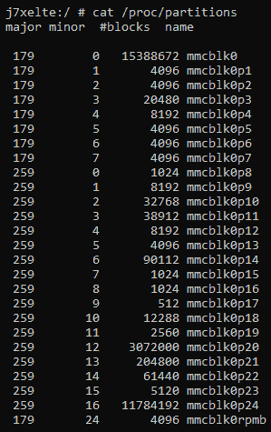
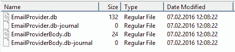

# 第三章：理解安卓设备的数据存储

法医分析的主要目的是从设备中提取必要的数据。因此，为了有效的法医分析，必须知道设备上存储了什么类型的数据，数据存储的位置，存储的方式，以及数据存储的文件系统的详细信息。对于法医分析员来说，这些知识非常重要，可以帮助他们做出明智的决定，了解在哪些位置寻找数据，并且可以使用哪些技术来提取数据。本章我们将学习以下内容：

+   安卓分区布局

+   安卓文件层次结构

+   设备上的应用数据存储

+   安卓文件系统概述

# 安卓分区布局

分区是设备持久存储内存中创建的逻辑存储单元。分区允许你将可用空间逻辑地划分为多个可以独立访问的部分。

# 安卓中常见的分区

分区布局在不同厂商和版本之间有所不同，但所有安卓设备都存在一些共同的分区。以下是大多数安卓设备中常见的一些分区：

+   `BOOT`：顾名思义，此分区包含了手机启动所需的信息和文件。它包含内核和 RAMDisk，因此没有这个分区，手机无法启动其进程。

+   `CACHE`：此分区用于存储经常访问的数据以及其他各种文件，如恢复日志和通过空中下载的更新包。

+   `RECOVERY`：恢复分区允许设备启动到恢复控制台，通过该控制台可以执行如手机更新及其他维护操作。为此，存储了一个最小的安卓启动镜像，作为故障安全保护。

+   `SYSTEM`：此分区包含除内核和 RAMDisk 以外的所有主要组件。此处的安卓系统镜像包含安卓框架、库、系统二进制文件和预安装应用程序。如果没有这个分区，设备无法正常启动。

+   `USERDATA`：此分区通常称为数据分区，是设备的内部存储，用于存储应用程序数据。大量的用户数据存储在此，并且这是我们大多数法医证据所在的位置。它存储了所有的应用数据和标准通讯记录。

# 识别分区布局

对于给定的安卓设备（如三星 Galaxy J7），可以通过多种方式确定分区布局。`/proc`下的分区文件将提供关于设备上所有可用分区的详细信息。

以下截图显示了分区文件的内容：



安卓中的分区文件

上面的条目仅显示了分区名称。要获取这些分区与其逻辑功能的映射，请查看位于`/dev/block/platform/13540000.dwmmc0`目录下的目录内容。以下截图显示了该目录的内容：


块与其逻辑功能的映射

如前面的输出所示，`SYSTEM`和`USERDATA`等多个分区出现在分区布局中。

# 安卓文件层次结构

要对任何系统（桌面或移动设备）进行取证分析，理解底层的文件层次结构非常重要。基本理解安卓如何在文件和文件夹中组织数据，有助于取证分析师将研究范围缩小到特定位置。如果你熟悉类 Unix 系统，你会非常了解安卓的文件层次结构。在 Linux 中，文件层次结构是一个单一的树形结构，树的顶端表示为`/`，称为*根目录*。这与 Windows 中按驱动器组织文件的概念不同。

无论文件系统是本地的还是远程的，它都将位于*根目录*下。安卓的文件层次结构是现有 Linux 层次结构的定制版本。根据设备制造商和底层的 Linux 版本，该层次结构可能会有一些不太显著的变化。要查看完整的文件层次结构，您需要 root 权限。以下截图显示了安卓设备上的文件层次结构：


安卓根目录下的文件夹

# 目录概览

以下各节概述了安卓设备文件层次结构中的目录。

# acct 目录

这是`acct`控制组（`cgroup`）的挂载点，它提供了用户计费功能。

# cache 目录

这是 Android 存储经常访问的数据和应用组件的目录(`/cache`)。清除缓存不会影响你的个人数据，只是删除了其中现有的数据。此文件夹中还有另一个名为`lost+found`的目录，用于存储因文件系统损坏（如未卸载直接移除 SD 卡）而恢复的文件（如果有的话）。缓存中可能包含与取证相关的文件，如图像、浏览历史记录和其他应用数据。

# config 目录

该目录包含 SDCardFS（内核中的 FAT32 仿真层）和 USB 小工具的配置文件。

# 数据目录

`/data/data`分区包含所有应用程序的私有数据。大多数属于用户的数据存储在此文件夹中。该文件夹从取证角度来看具有重要意义，因为它保存了有价值的数据。此分区在*内部存储*部分中有详细介绍。以下截图显示了数据分区的内容：


安卓设备的数据分区内容

# dev 目录

该目录包含所有设备的特殊设备文件。这是`tempfs`文件系统的挂载点，该文件系统定义了应用程序可用的设备。

# mnt 目录

该目录作为所有文件系统（包括内外部 SD 卡等）的挂载点。以下截图显示了该目录中存在的挂载点：


# proc 目录

这是 `procfs` 文件系统的挂载点，它提供对内核数据结构的访问。多个程序使用 `/proc` 作为信息来源。它包含有关进程的有用信息。例如，以下截图所示，`/proc` 下的 `meminfo` 文件提供有关内存的信息：


Android 中 proc 文件夹下的 meminfo 文件

# sbin 目录

该目录包含多个重要守护进程的二进制文件。从取证角度来看，它并不特别重要。

# 存储目录

在这里，你可以找到 SD 卡的内容。请注意，这张 SD 卡可以是可拆卸存储或不可拆卸存储。任何具有 `WRITE_EXTERNAL_STORAGE` 权限的应用程序都可能在此位置创建文件或文件夹。大多数手机中都存在一些默认文件夹，如 `Android`、`DCIM` 和 `Downloads`。以下截图显示了 `/storage/self/primary` 位置的内容：


/storage/self/primary 的内容（/sdcard 是一个符号链接）

**数码相机图像**（**DCIM**）是数码相机、智能手机、平板电脑及相关固态设备的默认目录结构。一些平板电脑有一个 `Photos` 文件夹，指向相同的存储位置。在 DCIM 文件夹内，你会找到你拍摄的照片、视频和缩略图（缓存文件）。照片存储在 `/DCIM/Camera` 中。

Android 开发者参考资料中解释了有一些公共存储目录，这些目录并不绑定到特定的程序。以下是这些文件夹的快速概览：

+   `Music`：媒体扫描器将此位置下的所有媒体分类为用户音乐

+   `Podcasts`：媒体扫描器将此位置下的所有媒体分类为播客

+   `Ringtones`：此处的媒体文件被归类为铃声

+   `Alarms`：此处的媒体文件被分类为闹钟

+   `Notifications`：该位置下的媒体文件用于通知声音

+   `Pictures`：所有照片，除了用相机拍摄的，都会存储在此文件夹中

+   `Movies`：所有电影，除了用相机拍摄的，都会存储在此文件夹中

+   `Download`：杂项下载

# 系统目录

该目录包含库、系统二进制文件和其他与系统相关的文件。与手机一起预安装的应用程序也存储在此分区中。以下截图显示了 Android 设备上系统分区中的文件：


Android 设备系统分区的内容

# 设备上的应用数据存储

Android 设备通过应用存储大量敏感数据。虽然我们之前将应用分为系统应用和用户安装的应用，但这里有一个更详细的划分：

+   随 Android 附带的应用

+   制造商预装的应用

+   无线运营商预装的应用

+   用户安装的应用

所有这些都在设备上存储不同类型的数据。应用数据通常包含大量与调查相关的信息。以下是 Android 设备上可能找到的一些数据的示例：

+   短信

+   彩信

+   聊天信息

+   备份

+   电子邮件

+   通话记录

+   联系人

+   图片

+   视频

+   浏览器历史

+   GPS 数据

+   下载的文件或文档

+   属于已安装应用的数据（如 Facebook、Twitter 和其他社交媒体应用）

+   日历预约

不同应用的数据可以存储在内部或外部。在外部存储（SD 卡）的情况下，数据可以存储在任何位置。但在内部存储的情况下，位置是预定义的。具体来说，设备上所有应用的内部数据（无论是系统应用还是用户安装的应用）会自动保存在 `/data/data` 的一个以包名命名的子目录中。例如，默认的 Android 邮件应用的包名为`com.android.email`，其内部数据存储在`/data/data/com.android.email`。我们将在后续章节中详细讨论这一点，但目前这些知识足以理解以下细节。

Android 为开发者提供了一些选项来将数据存储到设备上。可以使用的选项取决于要存储的底层数据。属于应用的数据可以存储在以下位置之一：

+   共享首选项

+   内部存储

+   外部存储

+   SQLite 数据库

+   网络

以下各节提供了有关这些选项的详细说明。

# 共享首选项

共享首选项提供了一个框架，用于以 XML 格式存储原始数据类型的键值对。原始数据类型包括布尔值、浮动、整数、长整型和字符串。字符串以**Unicode 转换格式**（**UTF**）存储。这些文件通常存储在应用的`/data/data/shared_pref`路径下。例如，Android 邮件应用的`shared_pref`文件夹包含以下三个 XML 文件：


Android 邮件应用的 shared_prefs 文件夹内容

如第二章《设置 Android 法医环境》中所解释的，可以使用`cat`命令查看这些文件的内容。以下截图显示了`UnifiedEmail.xml`文件的内容：


Android 邮件应用的共享首选项文件内容

不同的 XML 文件可能包含不同的有用信息，例如帐户名甚至密码，这对法医检查非常有帮助。

# 内部存储

这里存储的文件位于内部存储中。它们通常位于应用的 `/data/data` 子目录中。存储在这里的数据是私有的，其他应用无法访问。即使是设备所有者也无法查看这些文件（除非他们具有 root 权限）。

然而，根据需求，开发者可以允许其他进程修改和更新这些文件。以下截图展示了应用在 `/data/data` 目录下以包名存储的详细信息：


Android 中的 /data/data 文件夹内容

每个应用的内部数据存储在各自的文件夹中。例如，下面的截图展示了 Android 设备上属于 YouTube 应用的内部存储：


Android YouTube 应用的内部存储

通常，`databases`、`lib`、`shared_pref`、`cache` 文件夹会为大多数应用创建。以下表格简要描述了这些文件夹：

| **子目录** | **描述** |
| --- | --- |
| `shared_prefs` | 共享偏好设置的 XML 文件 |
| `lib` | 应用所需的自定义库文件 |
| `files` | 开发者保存的文件 |
| `cache` | 应用缓存的文件 |
| `databases` | SQLite 和日志文件 |

除这些文件夹外，其他文件夹是应用开发者创建的自定义文件夹。`databases` 文件夹包含对司法调查至关重要的数据。如以下截图所示，这个文件夹中的数据以 SQLite 文件形式存储：



Android 浏览器应用中 `databases` 文件夹下的 SQLite 文件

可以使用如 DB Browser for SQLite 等工具查看这些数据。关于如何提取数据的更多细节，请参考第四章，*从 Android 设备中逻辑地提取数据*。

# 外部存储

应用也可以将文件存储在外部存储中。外部存储可以是可移动的媒体，如 SD 卡，或者是手机自带的不可移动存储。在可移动 SD 卡的情况下，只需移除 SD 卡并插入其他设备，数据就可以在其他设备上使用。SD 卡通常采用 FAT32 文件系统格式，但越来越多的使用 EXT3 和 EXT4 文件系统。与内部存储不同，外部存储没有严格的安全措施。换句话说，存储在这里的数据是公开的，其他应用可以访问，只要请求应用具有必要的权限。

# SQLite 数据库

SQLite 是一种流行的数据库格式，广泛应用于许多移动系统中，用于结构化数据存储。SQLite 是开源的，并且与许多其他数据库不同，它具有紧凑性并提供丰富的功能。Android 通过专用的 API 支持 SQLite，因此开发者可以利用这一特性。SQLite 数据库是法医数据的重要来源。应用程序使用的 SQLite 文件通常存储在 `/data/data/<ApplicationPackageName>/databases` 路径下。例如，在 Android 邮件应用中，以下截图展示了其数据库文件夹中的 SQLite 文件。我们将在接下来的章节中进一步探讨这些细节。从法医的角度来看，这些文件非常有价值，因为它们通常存储了应用程序处理的大量重要数据。

# 网络

你可以使用网络存储和检索你自己基于 Web 的服务中的数据。要进行网络操作，可以使用 `java.net.*` 和 `android.net.*` 包中的类。这些包为开发者提供了与网络、Web 服务器等交互所需的低级 API。

# Android 文件系统概述

在 Android 法医分析中，理解文件系统非常重要，因为它帮助我们了解数据是如何存储和检索的。关于文件系统的属性和结构的知识在法医分析中非常有用。文件系统指的是数据如何存储、组织和从存储设备中检索的方式。一个基本的安装可能基于一个卷划分成多个分区；在这种情况下，每个分区可以由不同的文件系统管理。Microsoft Windows 用户通常熟悉 FAT32 或 NTFS 文件系统，而 Linux 用户则更熟悉 EXT2 或 EXT4 文件系统。正如在 Linux 中一样，Android 使用挂载点而非驱动器（即 `C:` 或 `E:`）。每个文件系统都定义了自己管理卷上文件的规则。根据这些规则，每个文件系统在文件检索、速度、安全性、大小等方面提供不同的表现。Linux 使用多种文件系统，Android 也如此。从法医角度来看，了解 Android 使用了哪些文件系统，并识别对调查具有重要意义的文件系统非常重要。例如，存储用户数据的文件系统对我们来说是主要关注点，而用于启动设备的文件系统则较为次要。

如前所述，Linux 以支持大量文件系统而闻名。系统使用的这些文件系统不是通过驱动器名称访问的，而是合并成一个单一的层级树结构，代表了一个整体的文件系统。每当一个新的文件系统被挂载时，它就被加入到这个单一的文件系统树中。

在 Linux 中，挂载是将一个额外的文件系统附加到当前可访问的计算机文件系统的过程。

因此，文件系统被挂载到一个目录上，位于该文件系统中的文件现在成为该目录的内容。这个目录称为*挂载点*。无论文件系统存在于本地设备上还是远程设备上，都没有区别。一切都整合到一个以根目录为起点的单一文件层级中。每个文件系统都有一个单独的内核模块，它将其支持的操作注册到一个叫做**虚拟文件系统**（**VFS**）的东西中。VFS 使得不同的应用程序可以以统一的方式访问不同的文件系统。通过将实现与抽象分离，添加新的文件系统变得只是编写另一个内核模块的问题。这些模块要么是内核的一部分，要么是在需要时动态加载。Android 内核提供了一个包含从**日志文件系统**（**JFS**）到 Amiga 文件系统等多种文件系统的子集。所有的后台工作都由内核处理，当文件系统被挂载时。

# 查看 Android 设备上的文件系统

可以通过检查`proc`文件夹中存在的`filesystems`文件的内容来确定 Android 内核支持的文件系统。可以使用以下命令查看该文件的内容：

```
j7xelte:/ # cat /proc/filesystems
 nodev sysfs
 nodev rootfs
 nodev tmpfs
 nodev bdev
 nodev proc
 nodev cgroup
 nodev devtmpfs
 nodev debugfs
 nodev securityfs
 nodev sockfs
 nodev pipefs
 nodev ramfs
 nodev configfs
 nodev devpts
 ext3
 ext2
 ext4
 nodev sdcardfs
 cramfs
 vfat
 msdos
 sdfat
 nodev ecryptfs
 fuseblk
 nodev fuse
 nodev fusectl
 f2fs
 nodev pstore
 nodev selinuxfs
 nodev functionfs
```

在前面的输出中，带有`nodev`属性的文件系统未被挂载到设备上。

# 常见的 Android 文件系统

Android 中存在的文件系统可以分为三大类：

+   闪存文件系统

+   基于媒体的文件系统

+   假文件系统

# 可以通过逻辑方式恢复哪些数据？

在大多数情况下，任何和所有的用户数据都可以通过逻辑方式恢复：

+   联系人

+   通话记录

+   短信/MMS

+   应用数据

+   系统日志和信息

这些数据的绝大部分存储在 SQLite 数据库中，因此通过逻辑提取恢复大量删除的数据成为可能。

# 闪存文件系统

闪存是一种持续供电的非易失性存储器，它可以在称为块的内存单元中被擦除并重新编程。由于闪存的特殊性质，写入媒体并处理某些块长时间擦除的文件系统需要特殊设计。虽然不同的 Android 设备支持的文件系统各不相同，但常见的闪存文件系统如下：

+   **扩展文件分配表**（**exFAT**）是微软专有的文件系统，专为闪存驱动器优化。由于许可要求，它不包含在标准 Linux 内核中。但仍然有一些厂商提供对该文件系统的支持。

+   **闪存友好文件系统**（**F2FS**）是三星推出的一种开源文件系统。其基本目的是构建一个考虑到基于 NAND 闪存存储设备特性的文件系统。

+   **日志闪存文件系统版本 2**（**JFFS2**）是 Android 使用的一种日志结构化文件系统。自冰淇淋三明治版本以来，JFFS2 一直是**Android 开源项目**（**ASOP**）的默认闪存文件系统。像 LogFS、UBIFS、YAFFS 等文件系统已经被开发出来，作为 JFFS2 的替代方案。

+   **另一个闪存文件系统版本** **2**（**YAFFS2**）是一个开源的单线程文件系统，发布于 2002 年。它主要设计用于在处理 NAND 闪存时具有较高的速度。YAFFS2 利用**带外**（**OOB**）存储，而在法医数据采集过程中，这些信息往往无法正确捕获或解码，这使得分析变得困难。YAFFS2 曾一度是最受欢迎的版本，至今在 Android 设备中仍广泛使用。YAFFS2 是一个日志结构化文件系统，即使在突然断电的情况下，数据完整性也能得到保证。2010 年，发布的公告称，在 Gingerbread 版本之后，设备将从 YAFFS2 迁移到 EXT4。目前，YAFFS2 不再在更新的内核版本中得到支持，但某些手机制造商可能仍会继续支持它。

+   **强大的文件系统**（**RFS**）支持三星设备上的 NAND 闪存。RFS 可以总结为一个启用了事务日志的 FAT16（或 FAT32）文件系统。许多用户抱怨三星应该坚持使用 EXT4。已知 RFS 存在滞后问题，减缓了 Android 的功能表现。

# 基于媒体的文件系统

除了前述的闪存文件系统，Android 设备通常还支持以下基于媒体的文件系统：

+   **EXT2/EXT3/EXT4（扩展文件系统）**，是 1992 年专为 Linux 内核推出的文件系统，是最早的文件系统之一，使用了虚拟文件系统。EXT2、EXT3 和 EXT4 是后续版本。EXT3 相比 EXT2 的主要优势是引入了日志功能。使用 EXT3 时，在发生意外关机时，不需要验证文件系统。EXT4 文件系统，作为第四版扩展文件系统，在实现双核处理器的移动设备中变得尤为重要。已知 YAFFS2 文件系统在双核系统上存在瓶颈。随着 Android Gingerbread 版本的发布，YAFFS 文件系统被 EXT4 取代。

+   **FAT**（文件分配表）文件系统，如 FAT12、FAT16 和 FAT32，由 MSDOS 驱动程序支持。

+   **VFAT**（虚拟文件分配表）是 FAT16 和 FAT32 文件系统的扩展。微软的 FAT32 文件系统被大多数 Android 设备支持。它几乎可以被所有主要操作系统（包括 Windows、Linux 和 macOS）支持。这使得这些系统能够轻松读取、修改和删除 Android 设备上 FAT32 分区中的文件。大多数外部 SD 卡都是使用 FAT32 文件系统格式化的。

# 虚拟文件系统

除了这些文件系统外，还有伪文件系统，可以将其视为文件的逻辑分组。以下是一些在 Android 设备中常见的重要伪文件系统：

+   `cgroup` 伪文件系统提供了一种访问和定义多个内核参数的方法。存在许多不同的进程控制组。如以下命令行输出所示，可以在 `/proc/cgroups` 文件中查看到组的列表：


Android 设备使用该文件系统来跟踪它们的工作。它们负责聚合任务并跟踪任务的状态。

+   `rootfs` 文件系统是 Android 的主要组成部分之一，包含启动设备所需的所有信息。当设备启动时，它需要访问许多核心文件，因此会挂载根文件系统。此文件系统挂载在 `/`（即 `root` 文件夹）下。因此，这是所有其他文件系统逐步挂载的文件系统。如果该文件系统损坏，设备将无法启动。

+   `Procfs` 文件系统包含有关内核数据结构、进程和其他系统相关信息，这些信息存储在 `/proc` 目录下。例如，`/proc/filesystems` 文件显示设备上可用文件系统的列表。以下命令显示设备 CPU 的所有信息：


+   `sysfs` 文件系统挂载了 `/sys` 文件夹，其中包含有关设备配置的信息。以下输出显示了 Android 设备中 `sys` 目录下的各个文件夹：

```
j7xelte:/sys # ls -1
 bcm-dhd
 block
 bus
 class
 dev
 devices
 firmware
 fs
 kernel
 mms_ts
 module
 power
```

由于这些文件夹中的数据大多与配置相关，通常对法医调查员来说并没有太大意义。但在某些情况下，我们可能需要检查手机上是否启用了某个特定设置，分析这个文件夹可能会在这种情况下有用。请注意，每个文件夹包含大量文件。通过法医获取这些数据是确保在检查过程中数据不会被更改的最佳方法。

+   `tmpfs` 是设备上的一种临时存储设施，将文件存储在 RAM（易失性内存）中。通常，它会挂载在 `/dev` 目录下。使用 RAM 的主要优点是访问和检索速度更快。但是，一旦设备重启或关闭，这些数据将不再可访问。因此，对于法医调查员来说，在设备重启之前检查 RAM 中的数据或提取数据非常重要。

你可以使用 `mount` 命令查看设备上可用的不同分区及其文件系统，命令如下：

```
j7xelte:/ # mount
 rootfs on / type rootfs (ro,seclabel,size=850052k,nr_inodes=212513)
 tmpfs on /dev type tmpfs (rw,seclabel,nosuid,relatime,mode=755)
 devpts on /dev/pts type devpts (rw,seclabel,relatime,mode=600)
 proc on /proc type proc (rw,relatime,gid=3009,hidepid=2)
 sysfs on /sys type sysfs (rw,seclabel,relatime)
 selinuxfs on /sys/fs/selinux type selinuxfs (rw,relatime)
 /dev/block/mmcblk0p20 on /system type ext4 (ro,seclabel,relatime,errors=panic,data=ordered)
 none on /acct type cgroup (rw,relatime,cpuacct)
 tmpfs on /mnt type tmpfs (rw,seclabel,relatime,mode=755,gid=1000)
 none on /config type configfs (rw,relatime)
 none on /dev/cpuctl type cgroup (rw,relatime,cpu)
 pstore on /sys/fs/pstore type pstore (rw,seclabel,relatime)
 /dev/block/mmcblk0p3 on /efs type ext4 (rw,seclabel,nosuid,nodev,noatime,discard,journal_checksum,journal_async_commit,noauto_da_alloc,data=ordered)
 adb on /dev/usb-ffs/adb type functionfs (rw,relatime)
 tmpfs on /storage type tmpfs (rw,seclabel,relatime,mode=755,gid=1000)
 /dev/block/mmcblk0p4 on /cpefs type ext4 (rw,seclabel,nosuid,nodev,noatime,data=ordered)
 /dev/block/mmcblk0p21 on /cache type ext4 (rw,seclabel,nosuid,nodev,noatime,discard,journal_checksum,journal_async_commit,noauto_da_alloc,errors=panic,data=ordered)
 /dev/block/mmcblk0p24 on /data type ext4 (rw,seclabel,nosuid,nodev,noatime,discard,journal_checksum,journal_async_commit,noauto_da_alloc,errors=panic,data=ordered)
 tmpfs on /sbin type tmpfs (rw,seclabel,relatime)
 /dev/block/mmcblk0p20 on /sbin/.core/mirror/system type ext4 (ro,seclabel,relatime,errors=panic,data=ordered)
 /dev/block/mmcblk0p24 on /sbin/.core/mirror/bin type ext4 (rw,seclabel,nosuid,nodev,noatime,discard,journal_checksum,journal_async_commit,noauto_da_alloc,errors=panic,data=ordered)
 /sbin/.core/block/loop08 on /sbin/.core/img type ext4 (rw,seclabel,relatime,data=ordered)
 /dev/fuse on /mnt/runtime/default/emulated type fuse (rw,nosuid,nodev,noexec,noatime,user_id=1023,group_id=1023,default_permissions,allow_other)
 /dev/fuse on /storage/emulated type fuse (rw,nosuid,nodev,noexec,noatime,user_id=1023,group_id=1023,default_permissions,allow_other)
 /dev/fuse on /mnt/runtime/read/emulated type fuse (rw,nosuid,nodev,noexec,noatime,user_id=1023,group_id=1023,default_permissions,allow_other)
 /dev/fuse on /mnt/runtime/write/emulated type fuse (rw,nosuid,nodev,noexec,noatime,user_id=1023,group_id=1023,default_permissions,allow_other)
 /dev/block/mmcblk0p24 on /sbin/.core/db-0/magisk.db type ext4 (rw,seclabel,nosuid,nodev,noatime,discard,journal_checksum,journal_async_commit,noauto_da_alloc,errors=panic,data=ordered)
```

如前述命令行输出所示，不同的分区有不同的文件系统，它们会根据需要进行挂载。

# 总结

熟悉 Android 的分区布局、文件系统和重要位置，将有助于取证调查员在从设备中提取数据的过程中进行工作。Android 设备上的 userdata 位置包含大量用户信息，这些信息对任何取证调查都可能至关重要。然而，这些文件大多数只能在已 root 的手机上访问（尤其是`/data/data`目录下的文件）。我们还讨论了 Android 数据存储选项、Android 使用的各种文件系统及其重要性。

有了这些知识，我们将在接下来的章节中学习如何从 Android 设备中逻辑和物理地提取数据。
