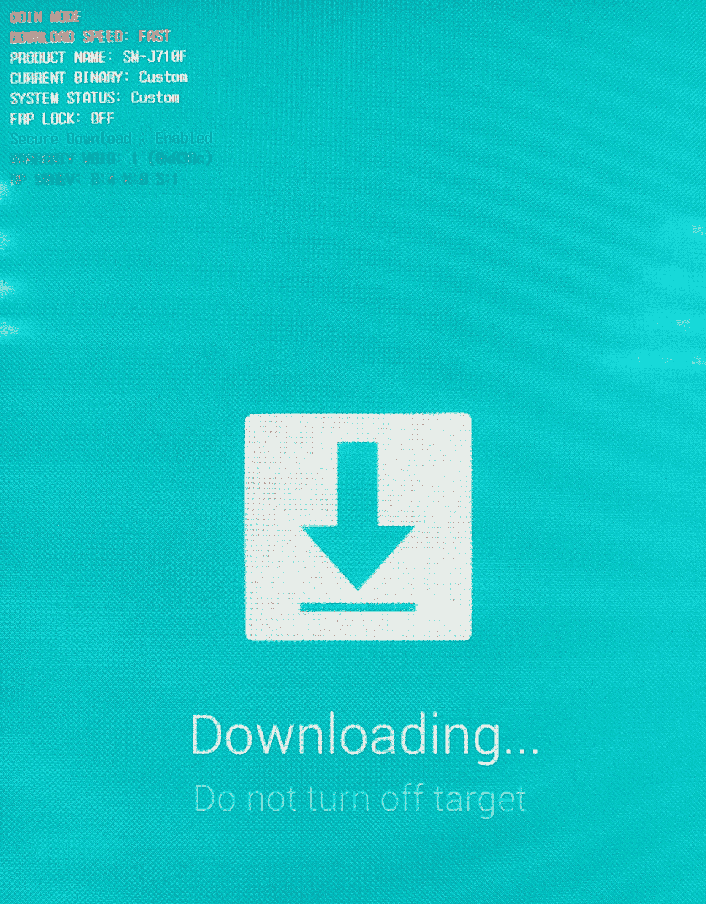
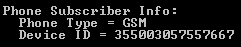

# 第四章：从安卓设备中逻辑提取数据

本章将涵盖逻辑数据提取，尽可能使用免费和开源工具。本章中大多数内容将使用之前在第二章中讨论过的**Android 调试桥**（**ADB**）方法，*设置安卓取证环境*。

到本章结束时，读者应熟悉以下内容：

+   逻辑提取概述

+   手动 ADB 数据提取

+   ADB 备份提取

+   ADB dumpsys

+   绕过安卓锁屏

+   安卓 SIM 卡提取

# 逻辑提取概述

在数字取证中，逻辑提取一词通常用于指不恢复删除数据或不包括证据的完整逐位复制的提取方法。然而，逻辑提取的更准确定义，也在第一章中定义，*介绍安卓取证*，是任何需要与基本操作系统进行通信的方法。由于与操作系统的交互，取证员不能确定是否已恢复所有可能的数据；操作系统在决定允许取证员访问哪些数据。因此，在传统的计算机取证中，逻辑提取类似于复制和粘贴一个文件夹来提取系统中的数据；此过程仅会复制用户可以访问和看到的文件。如果在被复制的文件夹中有任何隐藏或已删除的文件，它们将不会出现在粘贴的文件夹中。

然而，正如你将看到的，在移动设备取证中，逻辑提取和物理提取之间的界限，比传统计算机取证中更为模糊。例如，由于 SQLite 数据库广泛用于存储数据，删除的数据通常可以从移动设备的逻辑提取中恢复。此外，几乎所有的移动提取都需要与安卓操作系统进行某种形式的交互；没有类似于拔出硬盘并对其进行镜像而不启动硬盘的简单等效物。就我们而言，我们将逻辑提取定义为获取用户可见数据的过程，并可能包括已标记为删除的数据。

# Root 访问权限

在进行安卓设备的取证分析时，限制因素通常不是所寻求的数据类型，而是检查员是否能够访问数据。Root 访问权限在第二章中已做过详细讨论，*设置安卓取证环境*，但这一点足够重要，值得重复。之前列出的所有数据，当存储在内部闪存中时，都受到保护，并且需要 Root 权限才能读取。唯一的例外是存储在 SD 卡上的应用数据，本书后续将进行讨论。

没有 root 访问权限，取证检查员无法简单地从 `/data` 分区复制信息。检查员将不得不找到某种方法来提升权限以访问联系人、通话记录、短信/MMS 和应用程序数据。这些方法通常伴随着许多风险，如可能*销毁*或*砖化*设备（使其无法启动），并可能修改设备上的数据以获得永久性。

方法通常因设备而异，没有通用的一键方法可以获取每台设备的 root 访问权限。商业移动取证工具如 Oxygen Forensic Detective 和 Cellebrite UFED 具有内置功能，可以临时和安全地 root 许多设备，但不涵盖所有 Android 设备的广泛范围。

在本章中，我们将注意到每个技术演示所需的 root 权限位置。

决定对设备进行 root 是根据您当地的操作程序和法院意见。通过 root 获取的证据的法律接受度因司法管辖区而异。

# 手动 ADB 数据提取

`adb pull` 命令可用于直接从设备将单个文件或整个目录拉到取证检查员的计算机。这种方法在涉及短信消息的严格调查中尤其有用，检查员可以选择仅拉取相关文件，如果可能的话。

# USB 调试

在本书中先前已讨论了设置 ADB 环境。但是，检查的设备也必须正确配置。USB 调试是取证员计算机与设备通信的实际方法。USB 调试位于设置菜单中的开发者选项下。然而，截至**Android 8.1**，开发者选项菜单是隐藏的；要显示它，用户必须转到设置 | 系统 | 关于手机，然后点击构建号字段七次。返回到上一个屏幕—现在可以找到开发者选项了；简单地打开这个菜单并选择启用 USB 调试。

除了 USB 调试外，检查员计算机上必须安装正确的驱动程序。通常可以在线找到它们，要么是从制造商的网站，要么是从[www.xda-developers.com](https://www.xda-developers.com/)。如果在机器上安装了商业取证工具，则可能已经安装了适当的驱动程序。

在 Android 4.2.2 之前，启用 USB 调试是与设备通过 ADB 通信的唯一要求。在 Android 4.2.2 中，Google 添加了**安全 USB 调试**。安全 USB 调试增加了在设备屏幕上选择连接到计算机的额外要求；这可以防止来自不受信任计算机的 ADB 访问已锁定设备：


RSA 指纹对话框（Android 8.1）

一旦启用了 USB 调试并且通过了 **安全 USB 调试** 检查（根据 Android 版本的不同），设备就可以开始检查了。为了验证设备是否已连接并准备好使用 ADB，可以执行以下命令：

```
adb devices
```

如果选择了“始终允许此计算机连接”，设备将存储计算机的 RSA 密钥，并且未来连接该计算机时，即使设备处于锁定状态，也不会再次出现提示。

如果设备状态显示为 **离线** 或 **未授权**，需要在屏幕上选择安全调试提示：


如果一切正常，**设备** 状态应该显示如下界面：


# 恢复模式

为了确保法医取证的有效性，ADB 数据提取不应在手机开启时进行。设备在运行时，时间戳可能会被修改，应用程序也可能在后台运行并更新文件。为了避免这种情况，审查员应尽可能将设备置于自定义恢复模式，如第二章《设置 Android 法医环境》中所示。标准 Android 恢复模式下无法进行 ADB 访问。通常，刷入自定义恢复模式是获取设备 ROOT 权限过程中的第一步，以便在出现问题时能够修复设备。ROOT 设备更可能包含自定义恢复模式，但也可以将自定义恢复模式刷入非 ROOT 设备。这种方法还可以让审查员避开新版 Android 中的安全 USB 调试提示，尽管我们的测试表明，这在 Android Lollipop 及更高版本中不起作用。恢复模式通常不需要启用 USB 调试，这使得它成为绕过锁定设备的理想选择。

该方法无法在启用了完整磁盘加密的设备上使用。启动恢复模式时不会解密 `/data` 分区。

启动恢复模式的过程因设备而异。通常，需要关机并同时按住音量键和电源键。针对特定型号的指南可以轻松在线查找。

标准恢复模式通常会显示一个正在操作的 Android 图标：


标准恢复模式

需要注意的是，恢复模式下将无法进行 ADB 通信；运行 `adb devices` 会显示没有设备。

许多设备的自定义恢复镜像可以在以下位置找到：

[`twrp.me/Devices/`](https://twrp.me/Devices/)

如果设备处于自定义恢复模式，并且在审查员的计算机上已安装正确的驱动程序，设备可以像实时设备一样通过 ADB 访问。请注意，使用 `adb devices` 命令时，它的状态现在显示为处于恢复模式：


在检查员可以开始通过 ADB 提取数据之前，还有一个最后步骤：必须挂载`/data`分区才能访问用户数据。一些自定义恢复可能会自动挂载此分区，而其他的可能不会。如果使用前面提到的网址中的**Team Win Recovery Project**镜像，可以通过选择 Mount 然后选择`/data`分区来挂载。恢复菜单通常可以通过使用音量键上下移动，电源键选择，或者根据使用的自定义恢复镜像可能是触摸操作的方式进行导航。

对于 TWRP 恢复，请按照以下步骤操作：

1.  从主恢复屏幕，选择 Mount：


1.  选择 Mount 后，选择要挂载的分区：


一旦`/data`分区（以及检查员想要调查的其他分区）被挂载，检查员就可以进行 ADB 数据提取，如本章前面所示。

在许多运行 Android 6.0（Marshmallow）或更高版本的设备上，userdata 分区默认加密，因此无法使用自定义恢复镜像挂载和提取。

如果设备没有自定义恢复，以下部分将展示如何启动到自定义恢复或如何刷入自定义恢复镜像。

# 启动到自定义恢复镜像

一旦确认引导加载程序已解锁，检查员将需要从一个自定义恢复镜像启动。一个很好的恢复镜像来源是 [`twrp.me/Devices/`](https://twrp.me/Devices/)。

选择正确的恢复镜像对于被检查的设备至关重要；它们不可互换，启动错误的镜像可能会使设备变砖。

一旦选择并下载了恢复镜像，设备需要进入 fastboot 模式。这可以通过以下两种方式之一实现：

+   ADB

+   物理设备按钮

要通过 ADB 进入 fastboot 模式，设备必须已经启用 USB 调试。以下是通过 ADB 进入 fastboot 模式的命令：

```
adb reboot bootloader
```

如果无法启用 USB 调试或无法使用 ADB，通常也有一组按键可以在设备启动时按下，类似于进入恢复模式。每个设备的确切组合可以在网上查找。

一旦设备进入 fastboot 模式，运行以下命令将验证设备是否已连接并准备好进行通信：

```
fastboot devices
```

以下命令将把自定义恢复镜像加载到 RAM 中并启动设备进入恢复模式：

```
fastboot boot 'path to image'
```

设备现在应该重新启动并进入恢复模式。如恢复模式部分所示，可能需要挂载`/data`分区才能访问用户数据。

如果 fastboot boot 命令失败，可能表示设备的引导加载程序已锁定。

# 使用 adb shell 来确定设备是否已 root

确定设备是否已 root 的最简单方法是使用 `adb shell`。这将在设备上打开一个 shell，并将其访问权限传递到检查员的计算机；这意味着在 shell 中运行的任何命令都将在设备上执行。一旦启用了 USB 调试并绕过了安全 USB 调试（或从恢复模式，如后续讨论的那样），在本地计算机上打开终端并运行以下命令：

```
adb shell
```

shell 可能以两种方式之一出现，要么是 `$`，要么是 `#`：


在 Linux 系统上，`#` 用于表示 root 用户；`$` 表示非 root 用户。如果 shell 返回显示 `#`，则说明 shell 已具有 root 权限：


在一些已 root 的设备上，可能需要进一步的步骤。如果 shell 返回 `$`，尝试运行 `su` 命令（如前面的截图所示）：

```
su
```

如果设备上安装了 `su` 二进制文件（通常是 root 过程的一部分），则如果 shell 没有以 root 权限打开，这将提升 shell 的权限为 root。

请注意，一些旧设备会自动以 root 权限运行 shell；只需打开 `adb shell` 可能就足以给检查员 root 权限。

# adb pull

如第二章中所述，*设置 Android 法医环境*，`adb pull` 用于将文件从设备传输到本地工作站。以下显示了 `adb pull` 命令的格式：

```
adb pull [-p] [-a] <remote> [<local>]
```

可选的 `–p` 标志显示传输的进度，而可选的 `–a` 标志将复制文件的时间戳和模式。`<remote>` 参数是设备上文件的确切路径。可选的 `<local>` 参数是文件将在检查员的工作站上写入的路径。如果没有指定本地路径，文件将写入当前工作目录。一个示例 `adb pull` 命令可能如下所示：

```
adb pull –p /sdcard/Pictures/1.png D:\Test 
```

让我们看看以下截图：


该命令将从设备中提取图像文件并将其写入我们选择的目录。同样，请注意，如果您希望提取例如 `mmssms.db` 数据库（该数据库包含已发送和接收的 SMS 和 MMS），设备必须是 root 的；否则，输出只会显示提取了 `0` 个文件。

输出显示文件大小为 `599401` 字节。根据我们的命令，`1.png` 现在位于 `Test` 文件夹中。

类似地，如果调查员希望提取整个应用程序的文件，也可以使用 `adb pull`：


这次，`adb pull` 命令提取了 `Pictures` 目录中的每个文件。如前面的截图所示，提取了三个文件。传输的总大小显示为 `1310468` 字节。

甚至可以执行以下操作：

```
adb pull –p /data/data/ D:\Test
```

这将从 `/data/data` 目录中提取所有可用的逻辑文件，并将它们放入检查员的 `Test` 文件夹中。这与物理镜像不同，因为某些文件会被跳过，已删除的文件不会被复制，但它是提取用户大部分应用数据的简单方法。

`adb pull` 命令的另一个优势是它对脚本化非常有用。经验丰富的检查员可以维护一个常见文件路径的列表，并编写一个脚本，自动从设备中提取这些文件，甚至让脚本自动提取整个 `/data/data` 目录。以下是执行此功能的简单 Python 代码示例：

```
from subprocess import Popen
from os import getcwd
command = "adb pull /data/data " + getcwd() + "\data_from_device"
p = Popen(command)
p.communicate()
```

请注意，代码并不精细；它的唯一目的是说明 `adb` 命令脚本化的简便性。至少，正确实现代码应该包括指定输出目录的选项并处理任何错误。然而，之前展示的六行代码足以在启用 USB 调试并且设备已获取 root 权限的情况下，逻辑上提取整个 `/data/data` 目录。

# Fastboot 模式

Fastboot 是 Android 软件开发工具包中内置的另一种协议工具，用于直接与设备的引导加载程序进行交互。从本质上讲，它是 ADB 的更低级版本，常用于将新镜像刷入设备。那么，这对检查员有什么帮助呢？

Fastboot 允许检查员从自定义恢复镜像启动设备，并临时获得 root 权限，从而访问通常无法获得的数据。Fastboot 不要求启用 USB 调试或 root 权限。将自定义引导加载程序加载到设备上的过程通常被商业取证工具用来临时获取设备的 root 权限，但熟练的检查员也可以手动执行该过程。使用这种方法，恢复镜像被加载到 RAM 中；设备上的任何永久性数据都不会以任何方式被更改。

使用 fastboot 的最重要要求是解锁引导加载程序；锁定的引导加载程序不允许设备从没有被制造商专门签名的代码启动。不幸的是，对于取证目的，大多数设备现在都不再出厂时解锁引导加载程序，因为这会带来严重的安全风险，而手动解锁引导加载程序通常会清除用户数据。因此，这种方法可行的设备数量有限。但当它有效时，它对检查员来说是一个非常宝贵的工具。

如果设备启用了全盘加密，这种方法将无法使用。启动到恢复模式将**不会**解密 `/data` 分区。

# 确定引导加载程序状态

与所有涉及 Android 取证的内容一样，没有一种方法可以百分百确定引导加载程序是否被锁定，因为这取决于制造商。要启动到引导加载程序，请使用 `adb` 命令：

```
adb reboot bootloader
```

设备应启动到显示引导加载程序信息的屏幕。通常，这个屏幕会显示引导加载程序的状态，如下图所示。

以下是来自 Nexus 5 的通用标准 fastboot 菜单。请注意，锁定状态指示引导加载程序已解锁：


以下是标准的三星 Odin 模式屏幕；Odin 是三星专有的 fastboot 等效模式：



三星 Odin 模式屏幕

# ADB 备份提取

Google 从 Android 4.0（冰淇淋三明治）开始实现了 ADB 备份功能。它允许用户（以及取证检查员）通过 ADB 将应用程序数据备份到本地计算机。这一过程不需要 root 权限，因此对取证非常有用。然而，它并不会获取设备上所有安装的应用程序。当开发者创建一个新应用时，默认情况下允许备份，但开发者可以修改这一设置。实际上，大多数开发者会保持默认设置，这意味着备份会捕获大多数第三方应用程序。不幸的是，大多数 Google 应用禁用了备份功能；像 Gmail 和 Google Maps 这样的应用的完整数据将不会被包含在内。大多数消息应用也存在同样的问题——它们的数据无法通过 ADB 备份获取。

此方法在设备被锁定时无效；需要用户与屏幕进行交互。

# 通过 ADB 提取备份

`adb backup`命令的格式如下所示：

```
adb backup [-f <file>] [-apk|-noapk] [-obb|-noobb] [-shared|-noshared] [-all] [-system|-nosystem] [<packages...>]
```

可用的标志如下：

+   `-f`：指定输出文件的路径。如果未指定，默认为当前工作目录中的`backup.ab`。

+   `[-apk|noapk]`：选择是否备份`.apk`文件。默认值为`–noapk`。

+   `[-obb|-noobb]`：选择是否备份`.obb`（APK 扩展）文件。默认值为`–noobb`。

+   `[-shared|-noshared]`：选择是否备份共享存储和 SD 卡中的数据。默认值为`–noshared`。

+   `[-all]`：包含所有已启用备份的应用程序。

+   `[-system|-nosystem]`：选择是否包括系统应用程序。默认值为`–system`。

+   `[<packages>]`：明确指定要备份的应用程序包。如果使用`–all`或`–shared`，则无需指定。

一个示例`adb backup`命令，用于捕获所有可能的应用程序数据如下：

```
adb backup –f C:/Users/0136/Test/backup.ab –shared –all
```

或者，一个示例`adb backup`命令，用于捕获特定应用程序的数据如下：

```
adb backup –f C:/Users/0136/Test/facebook.ab com.facebook.katana
```

你应该看到类似以下内容的屏幕：


在执行备份时，用户必须在设备上批准备份；这意味着在绕过屏幕锁定之前无法执行备份：


根据安装的应用程序数量，备份过程可能会花费相当长的时间。

# 解析 ADB 备份

生成的备份数据以`.ab`文件的形式存储，但实际上是一个经过 Deflate 算法压缩的 TAR 文件。如果在备份创建时在设备上输入了密码，文件还会进行 AES 加密。还应该提到，这些文件可能存在于嫌疑人的计算机上，并可以使用相同的方法进行分析。

有许多免费的工具可以将`.ab`备份文件转换为可以查看的`.tar`文件。一个这样的工具是 Android Backup Extractor，网址为：[`sourceforge.net/projects/adbextractor/`](http://sourceforge.net/projects/adbextractor/)。

要使用 Android Backup Extractor，只需将其文件提取到备份所在的目录中。运行该工具的命令如下所示：

```
java –jar abe.jar unpack backup.ab backup.tar
```

`.tar`文件将位于命令行指定的路径中，如果没有指定路径，则位于当前工作目录中。可以在 Linux 命令行手动解压`.tar`文件，也可以使用诸如 WinRAR 或 7Zip 等 Windows 压缩工具：


备份中的目录，在 7-Zip 中查看

# ADB 备份中的数据位置

现在，备份已被转换为`.tar`文件并提取出来，检查员可以查看备份中包含的数据。在我们的示例中，备份根目录下发现了两个目录：

+   `apps`：包含备份中包含的应用程序的`/data/data`中的数据

+   `shared`：包含来自 SD 卡的所有数据；仅在命令行传递了 shared 参数时才会出现

请注意，apps 目录中的文件按其包名存储在目录中（就像在`adb shell`中看到的`/data/data`），shared 目录则是用户将 SD 卡插入计算机后看到的内容。以下是从备份中提取的用户数据的良性示例，显示了用户的 Pandora 活动。Pandora 是一款在 Google Play 商店下载量达到百万的流媒体音乐服务。Pandora 的应用数据将包含在备份的`apps`文件夹中，文件夹名为`com.pandora.android`：


来自备份的 Pandora 目录

这是 Android 应用程序的一个标准布局，如第二章《设置 Android 取证环境》中所讨论的那样。应用程序的数据库将位于`db`文件夹中：


Pandora 备份的 db 文件夹中的文件

XML 配置设置将位于`sp`文件夹中：


Pandora 备份的 sp 文件夹中的文件

使用数据库查看器查看`pandora.db`可以查看用户创建的电台以及创建时间戳：


从备份中的 pandora.db 内容

查看 XML 配置文件，可以在 `firstInstallId` 下找到应用安装的时间戳。注意，转换时间戳的确切方法在第七章，*Android 应用程序的法医分析*中有展示：


XML 配置文件内容

如果由于某些奇怪的原因，用户的 Pandora 使用情况在调查中是一个重要问题，那么检查员可以从这两个看似无害的文件中得出什么结论？

首先，`lastTransmission` 和 `firstInstallID` 时间戳的毫秒级差异表明，应用程序安装后从未被使用。此外，每个站点的创建日期早于应用程序的安装日期，有些情况下提前几年。这可能表明用户在其他设备上使用过 Pandora；这可能对调查高度相关。

虽然 Pandora 通常与数字法医调查无关，但它是可以通过简单的 ADB 备份获取的数据的一个示例。更详细的应用程序分析将在第七章，*Android 应用程序的法医分析*中介绍。

# ADB dumpsys

Dumpsys 是 Android 操作系统中内置的工具，通常用于开发目的，显示设备上正在运行的服务的状态。然而，它也可能包含法医分析中有趣的信息。Dumpsys 不需要 root 权限，但像所有 ADB 命令一样，需要在设备上启用 USB 调试并绕过安全 USB 调试。

可查看的精确服务因设备和 Android 版本而异。要查看所有可能的可转储服务列表，请运行以下命令：

```
adb shell service list
```

命令的输出将显示为一个列表，如下所示：


位于冒号前的服务名称是我们将传递给 `dumpsys` 的参数。一个有效的 `dumpsys` 命令，使用前面提到的服务编号七（`iphonesubinfo`），如下所示：

```
adb shell dumpsys iphonesubinfo
```

在下文中，我们看到 `iphonesubinfo` 服务的输出包括设备 IMEI：



有许多在法医分析中有趣的 `dumpsys` 服务；以下是几个示例。由于 `dumpsys` 服务可能因操作系统版本和设备而有所不同，此列表并非全面，旨在展示 `dumpsys` 对法医检查员的实用性：

+   `iphonesubinfo`

+   `batterystats`

+   `procstats`

+   `user`

+   `appops`

+   `wifi`

+   `notification`

# Dumpsys batterystats

Batterystats 用于显示正在运行的应用程序的使用情况。其输出可能非常冗长，具体取决于使用的应用程序数量；在以下截图中，由于输出内容太多，无法在 Windows 命令行中显示，因此将输出重定向到文件：


这显示了我们 Google Chrome 的网络使用情况。此信息可用于证明该应用程序最近被使用，即使 Chrome 在隐身模式下使用，也不会在其他地方留下取证证据，这些信息仍然存在。

注意，*Wakelock* 部分对于检测恶意软件非常有用。Wakelock 是一种保持设备处于唤醒状态（即不进入睡眠模式）的方法，通常表示某个应用程序试图保持在后台运行。

# Dumpsys procstats

Procstats 是一个显示运行中的应用程序处理器使用情况的服务。与 batterystats 类似，它是另一种可以用来显示某个应用程序最近在设备上被使用的方法：


# Dumpsys 用户

从 Android Jelly Bean 开始，谷歌为平板设备添加了多用户支持。随着 Lollipop 的发布，谷歌将这一支持扩展到手机设备。在数字取证中，长期以来最具挑战性的问题之一就是证明在进行有罪行动时，设备由谁使用，也就是：*谁在键盘后面？*

对用户服务运行 `dumpsys` 将显示所有用户的最后登录信息：


由于一次只能登录一个用户，因此查看最近登录的用户可以识别当前在设备上使用的账户。

# Dumpsys App Ops

App Ops 可能是最有趣的 `dumpsys` 服务。App Ops 这个术语通常用来指代应用程序可以访问的权限。在 Android 的早期版本中，有传言称谷歌将为用户提供撤销特定权限的功能，虽然这一功能从未实现，但这个服务至少保留了下来，并显示应用程序最后一次使用每个可访问权限的时间。以下是来自 Google Chrome 的另一个示例：


在前面的输出中，我们可以看到大约 `appops` 被 `dumpsys` 导出前的 1 小时 7 分钟，Chrome 使用了 `TAKE_AUDIO_FOCUS` 权限，之后又使用了 `AUDIO_MEDIA_VOLUME`。这表明 Chrome 被用来听某些东西，并且说明了它发生的时间。

一个更有趣的例子是电话应用：


44 分钟前，用户使用了电话应用并要求 `READ_CONTACTS` 权限，随后立即使用了 `WRITE_CALL_LOG` 权限。我们可以推测，用户在 44 分钟前打了一个电话；即使他们之后删除了通话记录。

# Dumpsys Wi-Fi

Wi-Fi 服务将显示已保存连接的所有 SSID 列表。例如，这对于证明用户曾经在某个位置是有用的。更详细的 Wi-Fi 信息也可以在文件系统中找到，但需要 root 权限才能查看。使用 `dumpsys`，我们可以无需 root 权限就能访问这些数据：


# Dumpsys 通知

通知服务将提供当前活动通知的信息。这对于记录设备在被扣押时的状态或识别哪个应用正在显示特定通知可能会很有用。每个通知可能非常大，包含大量信息，其中只有一部分可能有用。以下是一个来自 Gmail 应用的来邮件通知示例，其中包含主题（`这是测试邮件`）和正文（`查看测试通知`）：


# Dumpsys 结论

运行不带服务名称的`dumpsys`命令将对所有可用服务运行`dumpsys`。然而，输出将非常大，应该将其重定向到文本文件中。在大多数平台上，执行此操作的命令通常如下：

```
adb shell dumpsys > dumpsys.txt
```

这将把输出写入当前工作目录下的`dumpsys.txt`文件。然后可以搜索该输出或运行解析脚本以提取已知的相关字段。

Dumpsys 是一个非常强大的工具，可以显示设备上无法通过其他方式获得的信息。我们建议在每个 Android 设备被扣押后，关闭前运行`dumpsys`。这样可以保存各种有可能后续使用的信息，并且不需要 root 权限。

# Helium 备份提取

根据开发者的说法，Helium 是*Android 设备缺失的应用同步和备份解决方案*。它不需要 root 权限，可以提取一些 ADB 备份无法获取的数据；例如，短信和通话记录。

实际上，检查员需要两个应用：一个 Android 应用和一个 PC 应用。Android 应用可以从 Google Play 下载：

[`play.google.com/store/apps/details?id=com.koushikdutta.backup`](https://play.google.com/store/apps/details?id=com.koushikdutta.backup)。

桌面版本可以在这里获取：

[`www.clockworkmod.com/carbon`](http://www.clockworkmod.com/carbon)。

让我们按照以下步骤提取数据：

1.  一旦你打开 Android 应用，你将看到以下界面：


1.  打开桌面应用并启用 Helium。你将看到一条消息，提示 Helium 已在你的 Android 设备上启用。

1.  你可以选择你想备份的数据；在我们的例子中，是消息和通话记录：


1.  由于我们希望将备份保存到法医工作站，让我们进入右上角的菜单，选择适当的选项，PC 下载：


1.  检查 Helium 服务器的 IP 地址和端口；在我们的例子中，它是`192.168.1.71`和`5000`：


1.  从你选择的网页浏览器访问该地址，选择你要备份的应用程序，然后点击“开始备份”：


在你的默认下载文件夹中，你会找到一个名为 `backup.zip` 的 ZIP 压缩包。

压缩包中有三个文件：

+   `backup.json`：它包含有关备份的信息，如包名、备份日期和智能手机的操作系统版本。

+   `com.android.providers.telephony.ab`：它本身是一个备份，包含提取的数据，在我们的案例中，是短信和通话记录。

+   `com.android.providers.telephony.png`：它备份了应用程序的图标。

同样，要提取 `com.android.providers.telephony.ab` 的内容，我们需要使用 Android Backup Toolkit（[`sourceforge.net/projects/adbextractor/`](https://sourceforge.net/projects/adbextractor/)）中的某个工具，这次使用 Helium Backup Extractor：

```
java -jar hbe.jar -force com.android.providers.telephony.ab
```

现在，在当前的工作目录中，有一个 `app` 文件夹，在 `apps\com.android.providers.telephony\cb` 目录下，我们可以找到 `custom.cb` 文件。这个文件包含了以 JSON 格式备份的应用程序数据；这是一个例子：

```
{"number":"+79165555555","new":1,"duration":10,"date":1540479309458,"type":1}
```

`number` 字段显示电话号码，`new` 字段（如果是最近的通话），`duration`（通话时长），`date`（通话日期，采用 Unix 时间戳格式——毫秒），以及 `type`（通话类型）；在我们的案例中，它是 `1`，即来电。

当然，这种方法可能在法医上不太可靠，因为我们需要在目标移动设备上安装一个应用程序，但有时这是提取宝贵数字证据的唯一方法。更重要的是，许多商业移动法医工具使用小型应用程序，即所谓的**代理**，在逻辑获取过程中提取更多数据。你将在第八章中了解更多关于 Android 法医工具的内容，*Android 法医工具概述*。

# 绕过 Android 锁屏

锁屏是 Android 法医检查中最具挑战性的部分。调查的整个过程通常取决于检查员是否能够访问被锁定的设备。虽然有一些绕过的方法，但这往往取决于操作系统版本、设备设置以及检查员的技术能力。没有任何一种方法能够在所有设备上每次都奏效。像 Cellebrite 和 Oxygen 这样的商业法医工具具有相当强大的绕过能力，但远非万无一失。本章将展示检查员如何利用免费工具和方法提高绕过锁定设备的几率。

检查员绝不应尝试猜测设备上的图案/PIN/密码。许多制造商实现了一种设置，在多次失败尝试后会擦除设备。许多厂商还允许用户减少这个失败次数。

# 锁屏类型

用于保护设备的方法有很多，绕过每种方法的方式各不相同：

+   无/滑动

+   图案

+   PIN

+   密码

+   智能锁：可信面部、可信声音、可信位置、可信设备、身体检测

可能还存在其他安全选项；由于 Android 是开源的，可能性仅受开发者想象力的限制。这些是 Google 发布的 Android Oreo 系统原生版本中提供的选项。大多数厂商使用的安全选项通常都使用其中一种原生选项作为备用，以防用户无法使用其独特选项登录。首次使用该设置的版本也被称为原生 Android；不同厂商可能会更早实现这些选项。

# 无/滑动锁屏

*滑动解锁* 屏幕是大多数 Android 设备的默认设置。它不提供任何安全性，通过在屏幕上按指示方向滑动手指即可绕过。

# 图案锁屏

图案锁屏是 Android 的标志性安全方法。通常被称为 *滑动密码* 或类似名称，这要求用户用手指在设备上划出一个图案。绕过此锁定的常见方法是 *污迹攻击*，通过观察用户手指留下的图案来破解。

# 密码/PIN 锁屏

熟悉苹果 iOS 的用户会识别此选项。它要求用户输入密码或 PIN 码才能解锁设备。它们被归为一类，因为从取证角度来看，它们是相同的：它们以相同的方式存储密码。

# 智能锁

智能锁是 Android Lollipop 中引入的术语，尽管面部解锁选项之前已经存在。它们需要特定条件来解锁设备：用户的面部必须被识别，用户必须处于已知位置，或者必须有特定的其他设备在附近。

# 信任面部

面部解锁按字面意思工作：它通过面部识别来判断用户是否已经设置为信任用户。较早版本的面部锁定容易被信任用户的照片欺骗，尽管较新的版本可能需要用户眨眼才能解锁设备。

# 信任语音

**OK Google** 语句可被用户用来解锁手机。这种类型的锁定并不适用于许多设备，因为手机需要在屏幕关闭时持续监听用户的声音，这会消耗电池。

# 信任位置

信任位置也常被称为 **地理围栏**。如果用户处于已标记为可信的位置（如家或工作地点），设备将不会锁定。用户无需任何输入，但必须启用 GPS。

# 信任设备

信任设备通过蓝牙工作；如果设置为信任设备的设备在附近，锁屏将被禁用。这可以与智能手表、通过蓝牙配对的车辆、蓝牙耳机或任何其他支持蓝牙的设备一起使用。

# 体感检测

体感检测利用手机的运动传感器，例如加速度计和陀螺仪，当设备处于用户手中、口袋或包内时，保持解锁状态。

所有智能锁选项都需要图案/PIN/密码作为备用安全方法。这意味着我们只需要学习如何绕过图案/PIN/密码，就能破解所有的安全选项。

# 一般绕过信息

在所有情况下，绕过锁屏将需要从设备中获取文件。图案锁以哈希值存储在`/data/system/gesture.key`，而 PIN/密码锁以哈希值存储在`/data/system/password.key`（直到 Android 5.0，Lollipop）。此外，`password.key`的哈希值是加盐的；盐值存储在 Android 4.4 之前的设备中`/data/data/com.android.providers.settings/databases/settings.db`，在 Android 4.4 及更高版本的设备中则存储在`/data/system/locksettings.db`。

Android 6.0（Marshmallow）引入了 Gatekeeper 密码存储——一种新的 PIN 和图案锁的混淆层。现在，锁存储在`gatekeeper.pattern.key`和`gatekeeper.password.key`中，不再使用哈希值。Gatekeeper 使用**基于哈希的消息认证码**（**HMAC**）和硬件支持的密钥来管理和验证密码。

如果设备被锁定，检查员该如何访问这些文件？再次强调，没有一个能够每次都有效的魔法解决方案，但以下是一些可选方案：

+   ADB：

    +   需要 root

    +   需要 USB 调试

    +   需要安全的 USB 调试配对（取决于操作系统版本）

+   启动进入自定义恢复模式：

    +   不需要 root（root 将通过恢复镜像提供）

    +   不需要 USB 调试（通过 fastboot 实现）

    +   不需要安全的 USB 调试（这一点完全被绕过）

    +   需要解锁的引导加载程序

    +   不适用于加密 userdata 分区的设备

+   JTAG/芯片脱机：

    +   高度复杂

    +   不需要任何特定的设备设置或选项

    +   不适用于加密 userdata 分区的设备

# 移除 Android 锁屏

PIN 或密码可以通过简单地覆盖或删除文件来绕过。然而，这会改变原始证据，在你的管辖范围内可能不具有法医效力。

# 使用 ADB 移除 PIN/密码

根据你正在检查的设备及其操作系统版本，可能需要删除不同的文件。如果设备中包含`*.key`文件在`/data/system/`目录下，你需要删除这些文件；如果没有此类文件，可能需要删除`locksettings.db`，如果可能的话，或者更新其中的一些记录（请参见下一节）。

下面是如何通过 ADB 删除感兴趣的文件：

```
adb shell
su
cd /data/system
rm *.key
```

现在设备应该重新启动。重启后，将不再需要 PIN 或密码。

# 使用 ADB 和 SQL 移除 PIN/密码

最近的 Android 设备上没有`*.key`文件，如运行 Oreo 或 Pie 的设备，但仍然存在`/data/system`目录下的`lockscreen.db`数据库。

下面是如何删除此数据库中用于更改的 PIN 或密码的方法：

```
adb shell
su
cd /data/system
sqlite3 locksettings.db
update locksettings set value=0 where name='lockscreen.password_salt';
update locksettings set value=0 where name='sp-handle';
.quit
```

重启设备，屏幕锁将被移除。

# Android SIM 卡提取

传统上，SIM 卡用于在设备之间传输数据。过去，SIM 卡用于存储多种类型的数据，如下所示：

+   用户数据

+   联系人

+   短信

+   拨打的电话

+   网络数据

+   **集成电路卡标识符（ICCID）**：SIM 卡的序列号

+   **国际移动用户身份（IMSI）**：将 SIM 卡与特定用户账户绑定的标识符

+   **MSISDN**：分配给 SIM 卡的电话号码

+   **位置区域标识符（LAI）**：标识用户所在的基站

+   **认证密钥（Ki）**：用于认证移动网络

+   其他各种网络特定信息

随着设备存储容量、SD 卡和云备份的增加，将数据存储在 SIM 卡上的必要性已经减少。因此，大多数现代智能手机通常不会在 SIM 卡上存储大量甚至任何用户数据。前面提到的所有网络数据仍然保留在 SIM 卡上，因为 SIM 卡是连接所有现代（4G）蜂窝网络所必需的。

然而，像所有 Android 设备一样，虽然没有明确规定不能将用户数据存储在 SIM 卡上，但默认情况下它不会发生。各个设备制造商可以轻松决定将用户数据写入 SIM 卡，个人用户也可以下载应用程序来提供该功能。这意味着在取证检查过程中，设备的 SIM 卡应始终进行检查。这是一个非常快速的过程，绝不能忽视。

# 获取 SIM 卡数据

SIM 卡应始终从设备中取出并单独检查。虽然一些工具声称可以通过设备接口读取 SIM 卡，但这可能无法恢复已删除的数据或 SIM 卡上的所有数据；取证人员要确保所有数据已被获取，唯一的方法是通过经过测试和验证的独立 SIM 卡读取器读取 SIM 卡。

SIM 卡的位置因设备而异，但通常存储在电池下方或位于设备侧面的托盘中。移除 SIM 卡后，应将其放入 SIM 卡读取器中。市场上有数百种 SIM 卡读取器可供选择，所有主要的移动取证工具都配有与其软件兼容的读取器。通常，取证工具还会支持第三方 SIM 读取器。

出人意料的是，市场上缺乏完善且免费的 SIM 卡读取软件。任何使用的软件在实际取证调查之前，应该始终在一个已填充已知数据的 SIM 卡上进行测试和验证。此外，请注意，许多免费的软件适用于较旧的 2G/3G SIM 卡，但可能无法在现代 4G SIM 卡上正常工作。我们在以下截图中使用了 Mobiledit! Lite，这是 Mobiledit!的免费版本。可以在以下网址下载：[`www.mobiledit.com/downloads`](http://www.mobiledit.com/downloads)。

以下是从运行 Android 4.4.4 版本的 Android 手机中提取的 4G SIM 卡示例；请注意，尽管该 SIM 卡已活跃使用超过一年，但未获取任何可视为用户数据的内容，尽管诸如 ICCID、IMSI 和 MSISDN（本机号码）等字段可能对传票/令状或调查的其他方面有所帮助：


SIM 卡提取概述

以下截图突出了 SIM 卡上的短信：


以下截图突出了 SIM 卡的通讯录：


以下截图突出了 SIM 卡的电话号码（也称为 MSISDN）：


# SIM 卡安全

由于 SIM 卡符合既定的国际标准，所有 SIM 卡提供相同的安全功能：一个 4 到 8 位的 PIN。通常，必须通过设备上的菜单来设置此 PIN。在 Android 设备上，这个设置可以在“设置”|“安全”|“设置 SIM 卡锁定”中找到。SIM PIN 完全独立于任何锁屏安全设置，只有在设备启动时才需要输入。SIM PIN 仅保护 SIM 上的用户数据；即使 SIM 卡被 PIN 锁定，所有网络信息仍然是可以恢复的。

SIM 卡允许三次输入 PIN 尝试；如果其中一次正确，计数器将重置。另一方面，如果所有尝试都失败，SIM 卡将进入**个人解锁密钥**（**PUK**）模式。PUK 是由运营商分配的 8 位数字，通常可以在购买 SIM 卡时的文档中找到。通过任何商业法医软件都无法绕过 PUK；因此，检查员绝不应尝试在设备上输入 PIN，因为设备不会显示剩余尝试次数，直到 PUK 激活为止。检查员可能会不小心将 SIM 卡锁定在 PUK 模式，无法访问设备。然而，法医工具会显示在 PUK 激活前剩余的尝试次数，如前面的截图所示。

SIM 卡的常见运营商默认 PIN 是 0000 和 1234。如果在激活 PUK 前剩余三次尝试，检查员可能会使用这些默认 PIN 成功解锁 SIM 卡。

运营商在发放 SIM 卡时通常会保留 PUK 密钥。这些密钥可能通过对运营商发出的传票或令状获得。

# SIM 卡克隆

SIM PIN 本身几乎不会提供额外的安全性，并且可以通过 SIM 克隆轻松绕过。SIM 克隆是几乎所有商业移动取证软件都提供的功能，尽管“克隆”这个术语有点误导。在移动取证的情况下，SIM 克隆是指将网络数据从一个锁定的 SIM 卡复制到一个法医干净的 SIM 卡上，这个 SIM 卡没有激活 PIN。手机会基于这些网络数据（通常是 ICCID 和 IMSI）识别克隆的 SIM 卡，并认为它与之前插入的 SIM 卡相同，但这次没有 SIM PIN。此克隆 SIM 卡也无法访问蜂窝网络，这使得它成为类似于飞行模式的有效解决方案。因此，SIM 克隆将允许检查员访问设备，但原始 SIM 卡上的用户数据仍然无法访问，因为它被 PIN 保护。

我们不知道任何可以执行法医 SIM 克隆的免费软件。然而，几乎所有商业移动取证工具包都支持此功能。这些工具包通常包括一个 SIM 卡读取器、用于执行克隆的软件以及多个空白 SIM 卡用于克隆过程。

# 总结

本章讨论了与 Android 设备的逻辑提取相关的多个主题。作为总结，以下是各种方法及其要求：

| **方法** | **要求** |
| --- | --- |
| ADB 拉取 |

+   启用 USB 调试

+   在 4.2.2+ 版本中绕过安全 USB 调试

+   获取 root 权限以获取用户数据

|

| 从恢复模式下拉取 ADB |
| --- |

+   必须使用自定义恢复模式才能启用 ADB 访问

+   获取 root 权限以获取用户数据

|

| 从自定义恢复镜像启动 Fastboot |
| --- |

+   解锁的引导加载程序

+   设备的启动镜像

|

| ADB 备份 |
| --- |

+   启用 USB 调试

+   在 4.2.2+ 版本中绕过安全 USB 调试

+   必须从正在运行的设备执行（不能在恢复模式下）

|

| ADB Dumpsys |
| --- |

+   启用 USB 调试

+   在 4.2.2+ 版本中绕过安全 USB 调试

+   必须从正在运行的设备执行（不能在恢复模式下）

|

| SIM 卡提取 |
| --- |

+   无要求，应该独立于设备执行

|

此外，用户的有价值数据还可以从 SD 卡恢复，这将在第五章中讨论，*从 Android 设备中物理提取数据*。

如果屏幕被锁定，检查员可以通过前面列出的方法，从 `locksettings.db` 数据库中删除关键文件或删除某些记录。

本章包含了大量数据，为了简化理解，下面展示了一个建议的 *最佳实践* 流程图：


Android 取证流程图
