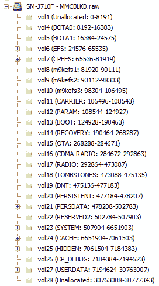

# 第五章：从 Android 设备中物理提取数据

本章将介绍物理数据提取，尽可能使用免费和开源工具。本章中大多数内容将使用我们之前在本书中讨论的**Android 调试桥**（**ADB**）方法。到本章结束时，读者应熟悉以下内容：

+   物理提取意味着什么

+   使用`dd`、`nanddump`和 Magnet ACQUIRE 进行物理数据提取

+   RAM 成像和分析

+   SD 卡数据获取

+   JTAG 和芯片拆卸方法

# 物理提取概述

在数字取证中，物理提取是电子媒体的精确位对位镜像，这一定义同样适用于移动设备。在传统计算机取证中，这通常涉及从嫌疑人的计算机中取出证据硬盘，并通过写保护器进行成像，而不启动该硬盘，从而得到一个包含嫌疑人硬盘精确副本的镜像文件。输出通常称为**原始镜像**，或简而言之是二进制（`.bin`）文件。物理提取与逻辑提取的区别在于，物理提取是设备内存的精确副本，包括未分配的空间、文件空白、卷空白等。

在移动取证中，结果是相同的——设备的精确位对位镜像——但方法略有不同。例如，将闪存从设备中拆卸下来进行成像既费时又昂贵，而且需要大量专业知识（尽管这可以做到，正如本章后面的*芯片拆卸*部分所讨论的那样）。此外，除非使用先进的 JTAG 或芯片拆卸方法，否则设备必须至少启动一定程度（并且在许多情况下写入）才能访问数据。最后，找到一个可以解析最终镜像文件的工具可能非常困难。硬盘镜像和文件系统早已被文档化和研究，而移动镜像和文件系统则经常变化；在某些情况下，移动文件系统甚至是特定厂商独有的。知道获取镜像后该怎么处理，可能和获取镜像本身一样具有挑战性！

在第四章中讨论的许多技术，*从 Android 设备中逻辑提取数据*，在这里仍然适用：启动自定义恢复模式仍然是最符合取证要求的过程；如果可能的话，应避免物理获取一个活跃的设备。

# 可以通过物理方式获取哪些数据？

简短的回答是：一切。由于物理采集是设备的精确映像，设备上的每一比特数据都会出现在映像文件中。如前所述，在物理提取中，检查员通常仅受限于他们找到相关数据的能力。通常，这是因为移动取证领域缺乏良好的映像分析工具。更糟糕的是，应用程序已知会对用户数据进行编码或其他形式的混淆，因此仅仅通过十六进制编辑器浏览映像往往会错过宝贵的证据。本章将介绍各种挂载或以其他方式查看物理提取文件系统的方法，而第七章《安卓应用程序取证分析》将专注于分析来自特定应用程序的数据。

# Root 权限

再次强调，就像逻辑提取一样，root 权限在物理提取中也至关重要。为了手动创建设备映像，我们必须通过 ADB shell 在设备上执行命令，而这些命令需要 root 权限。如果无法获得 root 权限，SD 卡通常仍然可以创建映像。除此之外的唯一备选方法是 JTAG 或芯片拆除方法。

# 使用`dd`命令提取物理数据

`dd`命令对于任何做过传统硬盘取证的检查员来说应该都很熟悉。`dd`是一个 Linux 命令行工具，定义上用于转换和复制文件，但在取证中常常用于创建整个硬盘的逐比特映像。`dd`有很多变种，如`dcfldd`、`dc3dd`、`ddrescue`和`dccidd`，这些工具在实际操作中也很常见。由于`dd`是为 Linux 系统设计的，它经常包含在 Android 平台中。这意味着，创建设备映像的方法往往已经存在于设备上！

`dd`命令有许多可设置的选项；以下列表中仅涵盖与取证相关的重要选项。可以在[`man7.org/linux/man-pages/man1/dd.1.html`](http://man7.org/linux/man-pages/man1/dd.1.html)查看完整的命令选项列表。`dd`命令的格式如下：

```
dd if=/dev/block/mmcblk0 of=/sdcard/blk0.img bs=4096 conv=notrunc,noerror,sync 
```

让我们定义`dd`命令的前述格式：

+   `if`：指定输入文件的路径。

+   `of`：指定输出文件的路径。

+   `bs`：块大小。数据按指定的块大小读取和写入，如果未指定，则默认大小为 512 字节。

+   `conv`：转换选项：

    +   `notrunc`：不截断输出文件。

    +   `noerror`：遇到错误时继续生成映像。

    +   `sync`：与 no error 配合使用时，对于发生错误的块，它会写入`\x00`。这对于保持映像中的文件偏移量非常重要。

不要混淆`if`和`of`标志，因为这可能会导致覆盖目标设备！

请注意，`bs`、`noerror`和`sync`标志之间有一个重要的关系：如果遇到错误，将会为读取到的整个块写入`\x00`（这由块大小决定）。因此，较小的块大小会在发生错误时减少丢失的数据。缺点是，通常较小的块大小会导致较慢的传输速率。检查员需要根据是否优先考虑及时性或更准确的获取来做出决定。

如前一章所述，进入恢复模式进行成像处理是最具法医证据效力的方法。

# 确定要成像的内容

在对计算机进行成像时，检查员首先必须确定磁盘的挂载位置，例如`/dev/sda`。对 Android 设备的成像也是如此。第一步是启动 ADB shell，并通过以下命令查看`/proc/partitions`文件：

```
cat /proc/partitions
```

输出将显示设备上的所有分区：


在之前的输出中，`mmcblk0`是设备上整个闪存的代表。为了提取整个闪存的镜像，我们可以使用`/dev/blk/mmcblk0`作为`dd`命令的输入文件标志（`if`）。接下来的内容，由 p1-24 表示，是闪存的各个分区。每个分区的大小以块为单位显示。在本例中，块大小为 1,024 字节，总内存大小约为 16 GB。为了获取设备内部存储的完整镜像，我们需要运行`dd`命令，并将`mmcblk0`作为输入文件。

当然，我们并不关心设备上的每个分区，因为大多数分区几乎不包含任何相关信息。正如你所知道的，最感兴趣的部分是`/data`分区。通常它是最大的，所以它可能是`mmcblk0p24`，即 11,784,192 个块。让我们通过运行`df`命令来了解更多关于它的信息：


从前面的截图中可以看到，我们的判断是正确的——`mmcblk0p24`就是 userdata 分区。

# 写入 SD 卡

`dd`的输出文件可以写入设备的 SD 卡。只有在嫌疑人的 SD 卡可以移除并替换为法医无菌 SD 卡的情况下，才应进行此操作。这样可以确保`dd`输出不会覆盖证据。显然，如果你正在写入 SD 卡，确保 SD 卡的容量大于要成像的分区。

在较新的设备中，`/sdcard`分区实际上是一个指向`/storage/self/primary`的符号链接。在这种情况下，使用`dd`将`/data`分区复制到 SD 卡上是行不通的，且可能会损坏设备，因为输入文件实际上会被写入到自身。

让我们看看在`/storage`下还可以找到什么：


如你所见，我们还找到了`6264-3264`和`emulated`子目录。那么我们的 SD 卡挂载在哪里呢？我们来运行`mount`命令：


我们正在使用 128 GB 的 SD 卡，因此它必须安装在 `6264-3264` 下。现在我们已准备好开始镜像 `/data` 分区的过程：


现在，在 SD 卡上存在 `/data` 分区的镜像。可以使用 `adb pull` 将其拉取到检查人员的机器上，或者直接从 SD 卡中读取。

# 直接使用 netcat 将数据写入检查人员的计算机

如果无法将镜像写入 SD 卡，检查人员可以使用 `netcat` 将镜像直接写入其计算机。`netcat` 是用于通过网络连接传输数据的 Linux 工具。建议在 Linux 或 macOS 计算机上使用 `netcat`，因为它是内置的，尽管 Windows 版本也存在。以下示例是在 SIFT 工作站（Linux Ubuntu）上执行的。

# 在设备上安装 netcat

在过去，几乎没有任何 Android 设备预装了 `netcat`。要检查，只需打开 ADB shell 并键入 `nc`。如果返回 `nc` 未找到，则必须手动在设备上安装 `netcat`。可以在许多在线资源中找到为 Android 编译的 `netcat`；例如，[`github.com/MobileForensicsResearch/netcat`](https://github.com/MobileForensicsResearch/netcat)。

如果我们回顾上一节中挂载命令的结果，可以看到 `/dev` 分区被挂载为 `tmpfs`。`tmpfs` 是 Linux 的一个术语，意味着该分区被视为设备上的实际文件系统，但实际上只存储在 RAM 中。这意味着我们可以在不对设备进行任何永久更改的情况下，将 `netcat` 推送到这里，使用以下命令在检查人员的计算机上进行操作：

```
adb push nc /dev/Examiner_Folder/nc
```

该命令应该在 `/dev` 中创建了 `Examiner_Folder`，并在其中放置了 `nc`。可以通过在 ADB shell 中运行以下命令来验证：

```
ls /dev/Examiner_Folder
```

在当前版本的安卓系统（从 Marshmallow 开始），**Toybox** ——一款免费且开源的软件，实现了一些 Unix 命令行实用程序，包括 `netcat`——已经预装，因此检查人员无需再次安装它。

# 使用 netcat

我们需要打开两个终端窗口，其中一个要打开 ADB shell。另一个用来监听从设备发送的数据。

现在，我们需要通过 ADB 在检查人员的计算机上启用端口转发：

```
adb forward tcp:9999 tcp:9999
```

`9999` 是我们选择用于 `netcat` 的端口；在 Linux 或 macOS 系统上，它可以是介于 `1023` 和 `65535` 之间的任意端口号（`1023` 及以下保留给系统进程，需要 root 权限才能使用）。Windows 则允许分配任何端口。

在具有 ADB shell 的终端窗口中运行以下命令：

```
dd if=/dev/block/mmcblk0p24 bs=1024 | toybox nc –l –p 9999
```

`mmcblk0p24` 是此设备上的 userdata 分区，但也可以使用此方法对整个闪存或其他任何分区进行镜像。在大多数情况下，最佳实践是对整个闪存进行镜像，以便获取设备中的所有可能数据。一些商业取证工具可能也要求整个内存镜像，并且可能无法正确处理单个分区的镜像。

在另一个终端窗口中，运行以下命令：

```
nc 127.0.0.1 9999 > userdata.dd
```

应该已经在检查员计算机的当前目录中创建了`userdata.dd`文件。当数据传输完成后，两个终端中的`netcat`将终止并返回命令提示符。这个过程可能需要相当长的时间，具体取决于镜像的大小。

# 使用 nanddump 物理提取数据

在我们迄今为止涵盖的所有示例中，分区都是 MMC 块，这通常出现在较新的设备中。然而，旧设备更有可能由**内存技术设备**（**MTD**）块组成。我们过去见过`dd`无法正确镜像 MTD 块的情况，尽管通常情况下它工作正常。如果`dd`失败，有一个广泛分发的工具叫做 MTD-Utils，用于读取和写入 MTD 块；`nanddump`是 MTD-Utils 的一部分，可以像`dd`一样用于从 MTD 块中读取。在`dd`失败的情况下，`nanddump`总是能够成功。

适用于 Android 的`nanddump`版本可以在许多地方找到；我们使用的是在此处找到的版本：[`github.com/jakev/android-binaries/blob/master/nanddump`](https://github.com/jakev/android-binaries/blob/master/nanddump)。

将`nanddump`放置到设备上的过程与之前使用`netcat`的方法相同：

```
adb push nanddump /dev/Examiner_Folder/nanddump
chmod +x /dev/Examiner_Folder/nanddump
```

就像`dd`一样，`nanddump`也可以通过`netcat`写入 SD 卡或检查员的计算机：

1.  从终端窗口运行以下命令：

```
adb forward tcp:9999 tcp:9999
```

1.  在 ADB Shell 中的另一个终端窗口中运行以下命令：

```
/dev/Examiner_Folder/nanddump /dev/block/mmcblk0p34 | /dev/Examiner_Folder/nc –l –p 9999
```

1.  在第一个终端窗口中，使用`adb forward`时，运行以下命令：

```
nc 127.0.0.1 9999 > data_partition.img
```

# 使用 Magnet ACQUIRE 物理提取数据

ACQUIRE 是 Magnet Forensics 提供的一款免费工具，可以用于获取各种潜在的数字证据来源，从硬盘和智能手机到云数据。当然，它支持对 Android 设备进行逻辑和物理提取，直到最新的运行 Android Pie 的设备。注册后可以在此处下载该工具：[`www.magnetforensics.com/magnet-acquire/`](https://www.magnetforensics.com/magnet-acquire/)。

在这个示例中，我们将对一部运行 Android Oreo 的 rooted 智能手机进行镜像：

1.  从列表中选择合适的设备：


如您所见，我们的设备具有特权访问权限 — 这意味着它已 root。此外，我们立即获得了一些元数据，如操作系统版本、设备序列号等。如果因某种原因要镜像的设备未列出，可以使用“没有显示我要查找的设备”选项。这包含了关于如何使工具检测到它的逐步指南。

1.  一旦选择了正确的设备，您可以选择镜像类型：


1.  有两个选项：完整和快速。第一个是物理获取，不总是可用，而第二个是逻辑获取，适用于任何 Android 设备。由于我们的设备已 root，因此我们可以选择完整选项。

1.  最后，选择文件夹和镜像名称，目标以及必要时填写其他字段：


1.  单击获取按钮将启动获取过程。在我们的示例中，对 16 GB 存储的成像仅需 10 分钟。如果查看日志文件 (`activity_log.txt`)，您会注意到实际使用了相同的工具 — `dd` 和 `toybox`：


如您所见，使用 Magnet ACQUIRE 对 Android 设备进行影像的方式比使用 `dd` 和 `netcat` 要简单得多，但在底层，这个过程是相同的。有时，该工具甚至可以帮助您对非 root 设备进行物理获取，因为它包含多个能够获取临时特权访问权限的漏洞，以及可用于获取未加密设备完整镜像的 TWRP 自定义恢复。

# 验证完整的物理镜像

验证图像文件与设备相同是传统数字取证中的关键步骤。在 Android 设备上，这可能有点棘手，甚至不可能。可以使用检查人员通常使用的任何工具对已创建的图像进行哈希处理。通过 ADB shell 可以通过以下命令验证设备上的内存，其中给定的路径是已镜像的块或分区：

```
md5sum /dev/block/mmcblk0
```

然而，并非所有 Android 设备都包含 `md5sum` 命令。如果没有包含在内，鉴定人员可以尝试在网上找到适用于其设备的编译版本，并将其推送到设备的 `tmpfs` 分区中，就像之前展示的那样，使用 `netcat` 和 `nanddump`。

另一个问题是如果图像是在现场获取的，即不是在恢复模式下获取的，如前一章讨论的。可以几乎肯定地说，MD5 散列值将不匹配，因为设备上的数据不断变化（即使是 RF 屏蔽或处于飞行模式）。在这种情况下，鉴定人员必须记录设备在获取时处于活动状态，并解释散列值不匹配是预料之外的情况。

# 分析完整的物理镜像

一旦通过前面的方法获取了镜像，检查员可能会手动浏览镜像并提取每个分区，但通常会更倾向于避免这样做。幸运的是，有各种各样的移动取证工具可以处理物理镜像，例如 Cellebrite UFED、Oxygen Forensic、Magnet AXIOM、Belkasoft Evidence Center 等等。不幸的是，这些工具都不是免费的或开源的；目前最流行的免费开源分析工具是由 Basis Technology 开发的 Autopsy。

# Autopsy

Sleuth Kit 最初是一套基于 Linux 的命令行工具，用于取证；后来，加入了一个名为 Autopsy 的基于浏览器的 GUI。最近，Autopsy 被作为独立平台在 Windows 上发布，并支持分析 Android 镜像。以下截图展示的是版本 4.9.0。加载和分析镜像的完整过程将在第八章中介绍，*Android 取证工具概览*。

可以从[`www.sleuthkit.org/autopsy/download.php`](https://www.sleuthkit.org/autopsy/download.php)下载 Autopsy。

图像加载完成后，展开图像会显示 Autopsy 找到的所有卷：



这些卷之一将是数据分区，如以下截图所示：


请注意，前面截图中的媒体目录就是 SD 卡，因为它与数据分区进行了符号链接。`/data` 分区中的 `data` 文件夹将包含应用程序数据：


每当安装一个应用程序时，系统会为其创建一个目录。

请注意，文件夹上显示红色 X 图标表示该文件夹已被删除，这意味着应用程序已从设备中移除。

最后，Autopsy 能够自动提取一些数据供检查员使用，但和所有取证工具一样，这些信息应手动验证。我们将在第七章中介绍，*Android 应用程序的取证分析*：


# 分析物理转储时的问题

我们在许多取证论坛和邮件列表上看到的最常见问题是，检查员获取了物理转储后，无法将其加载到声称支持该设备的工具中。绝大多数情况下，这是因为检查员没有考虑到**带外**（**OOB**）区域。

OOB 区域，有时称为备用区域，是闪存中的一小部分，专门保留用于元数据。元数据通常包含**错误纠正码**（**ECC**）、坏块信息，有时还包含文件系统信息。这对检查员来说是一个问题，因为大多数移动取证工具没有考虑 OOB 区域；它们假设图像中不包括此区域。当工具遇到包含备用区域的图像时，通常不知道该如何处理，导致无法正确解析数据。

工具无法考虑 OOB 区域的原因是，OOB 区域未包含在`dd`图像中，而大多数工具使用`dd`来创建图像。当使用`nanddump`时，OOB 区域可能会被包含在内，但根据使用的二进制文件，可能会有一个选项来排除它。OOB 区域通常会包含在芯片脱离和 JTAG 图像中。

为了正确地将图像加载到取证工具中，首先需要去除 OOB 区域。一个常见的经验法则是，OOB 大小基于设备的页面大小；每 512 字节的页面大小会有 16 字节的 OOB 空间。例如，一个页面大小为 2,048 字节的设备，可能会在每个页面的末尾有 64 字节的 OOB 区域。然而，这完全取决于内存制造商。在尝试移除 OOB 区域之前，检查员应该查找特定内存芯片的数据手册，以确认页面和 OOB 区域的大小。通常可以通过在手机的电路板上找到内存芯片，并搜索该芯片的型号来完成此操作。

以下是一个 Python 脚本示例代码，用于从图像中移除 OOB 区域。正如上一章所述，我们并不声称自己是 Python 专家，我们确信有更好、更高效的方法来实现这一点，但它确实有效：

```
import sys
file_to_parse = open(sys.argv[1],'rb')
file_after_removal = open('file_out.bin','wb')
while file_to_parse:
   lines_out = file_to_parse.read(2048)
   if lines_out:
         file_after_removal.write(lines_out)
         file_to_parse.seek(64,1)
   if not lines_out:
         break
print 'Done'
file_to_parse.close()
file_after_removal.close()
```

如果该文件名为`OOB_Remover.py`，则可以使用以下命令执行：

```
python OOB_Remover.py C:\Users\Android_Examiner\physicaldump.bin
```

输出文件将命名为`file_out.bin`，并存放在执行脚本的目录中，该文件不包含 OOB 区域。原始文件不会以任何方式进行编辑或修改。

请注意，代码的编写假设页面大小为 2,048 字节，OOB 大小为 64 字节；这两个数字需要根据图像所提取的内存芯片的具体大小进行编辑。之后，输出文件应该能够加载到商业移动取证工具中。

# 映像和分析 Android 内存

由于需要 root 权限，提取 Android 内存在许多情况下是不可行的。大多数公共 root 过程涉及重启手机，这会清除易失性 RAM，这意味着当检查员获得 root 权限以进行 RAM 成像时，已经太晚，因为 RAM 已经被清除。因此，由于这个原因，可能还有其他原因，商业取证领域对 Android RAM 成像和分析的支持并不强大。然而，也有一些情况可以使用 RAM 成像，并可能对案件至关重要。如果设备在被扣押时已经 root，那么 RAM 成像应该成为扣押过程中的必备步骤。由于关闭手机会清除 RAM，因此设备应该设置为飞行模式（并禁用所有其他网络连接，如 Wi-Fi 和蓝牙），并应立即对 RAM 进行成像，以避免设备电池耗尽前无法提取 RAM。

RAM 分析的主要挑战是数据处理。RAM 是完全原始的、无结构的数据；没有文件系统。当在十六进制编辑器中查看时，RAM 看起来只是一个巨大的数据块，几乎没有任何规律或提示来帮助检查员理解他们正在查看的内容。这个难度因现代设备通常有数 GB 的 RAM 而加剧。RAM 可以使用传统的取证工具和方法通过关键词进行搜索，但这要求检查员完全知道他们在寻找什么。

# 在 RAM 中可以找到什么？

任何写入闪存的数据都必须经过 RAM；处理器与闪存的通信只能通过 RAM 进行。这意味着，几乎所有在设备上进行的操作都可能出现在 RAM 转储的内容中。根据设备的使用情况，数据可能会在 RAM 中无限期存在，直到需要被覆盖。RAM 转储通常包含设备上输入的文本，包括用户名和密码，以及没有永久存储在设备上的应用数据。例如，Facebook 应用程序曾将用户新闻源的内容存储在其应用文件夹中的数据库里。新版本不再保存用户的新闻源，但它仍然存在于 RAM 中。

# 使用 LiME 对 RAM 进行成像

Android RAM 获取最常用的工具是**Linux 内存提取器**（**LiME**），之前称为 DMD。LiME 是免费的开源工具，但并不是非常用户友好，因为它要求用户从源代码编译，这只能在 Linux 系统上完成。编译过程还必须为每个被检查的设备的每个 Android 版本单独进行，这在一定程度上限制了它在实际应用中的可用性。这是必要的，因为 LiME 不是二进制工具（像我们之前使用的`netcat`和`nanddump`工具）；相反，它是一个内核模块，必须为每个将要加载的内核专门编译。

为了确保正确的内核源代码被下载，我们需要确定设备的型号和软件版本，可以通过滚动手机菜单至设置 | 系统 | 关于手机来完成。或者，这些信息也可以通过在 ADB shell 中运行以下命令来获取：

```
cat /system/build.prop
```

型号的软件版本应该位于文件顶部的前几行。

幸运的是，大多数 Android 厂商都会发布他们的内核源代码；通过快速的 Google 搜索，通常可以找到每个型号和软件版本的源代码。以下是一些主要厂商的开源发布网站：

+   **三星**: [`opensource.samsung.com/reception.do`](http://opensource.samsung.com/reception.do)

+   **摩托罗拉**: [`sourceforge.net/motorola/`](http://sourceforge.net/motorola/)

+   **HTC**: [`www.htcdev.com/devcenter`](http://www.htcdev.com/devcenter)

+   **谷歌（Nexus 设备）**: [`source.android.com/source/building-kernels.html`](https://source.android.com/source/building-kernels.html)

必须使用正确的型号和版本源。使用错误的内核源来编译 LiME 至少会导致设备无法运行。加载不兼容的内核模块也可能导致设备崩溃。

要获取 LiME 的源代码，请访问 [`github.com/504ensicsLabs/LiME`](https://github.com/504ensicsLabs/LiME)，选择“Download ZIP”选项，然后解压 `.zip` 文件。

网上有许多优秀的资源解释了如何为特定内核编译 LiME，甚至如何创建自定义的 Volatility 插件来检查生成的 RAM 转储，因此这里不会重复介绍：

+   **Linux 内存提取器**: [`github.com/504ensicsLabs/LiME/tree/master/docV`](https://github.com/504ensicsLabs/LiME/tree/master/doc)

+   **波动性**: [`github.com/volatilityfoundation/volatility/wiki/Android`](https://github.com/volatilityfoundation/volatility/wiki/Android)

# 获取 Android SD 卡

如本章及之前章节所讨论的，SD 卡可以指物理的外部 SD 卡或闪存内的一个分区。可拆卸的外部 SD 卡可以通过写保护器与典型的计算机取证工具分开成像，或者使用之前展示的 `dd/nanddump` 技术进行成像，尽管前者通常由于不需要通过 `netcat` 写入数据而更快。

物理成像 SD 卡与我们之前讨论的物理成像非常相似；事实上，如果 SD 卡与 `/data` 分区符号链接，它将作为 `/data` 分区的一部分被获取，如 *Autopsy* 部分的截图所示。唯一的不同之处在于，如果正在对 SD 卡进行成像，输出文件不能写入到 SD 卡中！这意味着，使用我们之前讨论的 `netcat` 方法是进行内置 SD 卡物理成像的最佳选择。

# SD 卡上可以找到什么？

默认情况下，SD 卡通常用于存储大文件，包括下载的内容和用设备拍摄的照片。许多应用程序还会在 SD 卡上创建自己的目录，用于存储通过聊天应用发送或接收的图像等数据。在某些情况下，正如在第八章《*Android 取证工具概述*》中所看到的，甚至有些应用程序会定期将所有数据备份到 SD 卡。这对取证检查员特别有用，因为他们可能无法访问内部存储器，原因可能是安全设置或无法获取 root 权限，但他们可能能够访问 SD 卡。

常见的 SD 卡位置包括但不限于以下内容：

+   `/Alarms`: 可能包含自定义闹钟

+   `/Android/data`: 一些应用程序数据的存储位置

+   `/DCIM/Camera`: 包括用设备相机拍摄的照片

+   `/Download`: 可能包含下载的文件

+   `/Movies`: 可能包含下载的视频文件

+   `/Notifications`: 可能包含自定义通知

+   `/Pictures`: 可能包含不同的图像，包括在设备上拍摄的截图

+   `/Podcasts`: 可能包含下载的播客

+   `/Ringtones`: 可能包含自定义铃声

即使应用程序已被删除，`/Android/data` 文件夹仍然可能存在。文件夹的内容将被删除，但文件夹可能会保留，这表明该应用程序之前曾安装在设备上。

这些只是常见的默认位置；如果设备已获取 root 权限，用户可以将任何内部存储的数据转移到 SD 卡上。
