# 第六章：从 Android 设备恢复已删除的数据

本章将介绍数据恢复技术，使我们能够查看已从设备中删除的数据。已删除的数据可能包含高度敏感的信息，因此数据恢复是移动取证中的一个关键方面。

本章将涵盖以下主题：

+   数据恢复概述

+   从 SD 卡中恢复已删除的数据

+   从 SQLite 数据库中恢复数据

+   从手机内部存储中恢复删除的数据

+   使用文件雕刻恢复已删除的数据

# 数据恢复概述

数据恢复是数字取证中的一个强大概念。它是从设备或 SD 卡中检索已删除数据的过程，当这些数据无法正常访问时，恢复数据至关重要。能够恢复用户已删除的数据有助于解决民事或刑事案件。这是因为许多被告只是删除设备上的数据，希望证据被销毁。因此，在大多数刑事案件中，已删除的数据可能至关重要，因为它可能包含用户希望从 Android 设备中擦除的信息。例如，考虑一下从恐怖分子那里查获的手机。如果知道他们删除了哪些项目，岂不是最为重要吗？获取任何已删除的短信、图片、拨打的号码等信息可能至关重要，因为它们可能揭示大量敏感信息。

从普通用户的角度来看，恢复已删除的数据通常意味着参考操作系统内置的解决方案，比如 Windows 中的回收站。虽然从这些位置恢复数据是可能的，但由于用户意识的提高，这些选项往往不再有效。例如，现在人们在桌面计算机上使用*Shift* + *Del*来完全删除文件。同样，在移动环境中，用户知道应用程序提供的恢复操作等。尽管存在这些情况，数据恢复技术仍然使法医调查员能够访问已从设备中删除的数据。

就 Android 而言，可以恢复大部分已删除的数据，包括短信、图片、应用程序数据等。但重要的是要以正确的方式查封设备并遵循某些程序，否则数据可能会被永久删除。为确保已删除的数据不丢失，建议牢记以下几点：

+   查封手机后，切勿进行任何操作。已删除的短信仍存在于设备中，直到某些其他数据占用该空间，因此必须避免对手机进行任何操作，以防止数据被覆盖。

+   即使手机没有使用，且没有我们干预，数据仍然有可能被覆盖。例如，接收的短信会自动占用空间，从而覆盖已删除的数据。此外，远程清除命令也可以擦除设备上存在的内容。为了防止这种情况发生，可以考虑将设备放入法拉第袋中，正如第一章《介绍 Android 取证》一文中所解释的那样。这样，应特别小心避免通过任何通讯方式传送新消息或数据。

# 如何恢复已删除的文件？

当用户从设备中删除任何数据时，数据并不会被实际擦除，而是继续存在于设备上。被删除的是指向该数据的指针。所有文件系统都包含元数据，它保存有关文件层次结构、文件名等的信息。删除操作并不会真正擦除数据，而是移除文件系统的元数据。因此，当文本消息或其他文件从设备中删除时，它们只是对用户不可见，但文件仍然存在于设备上，只要没有被其他数据覆盖。因此，在新数据添加并占用空间之前，仍有恢复它们的可能。删除指针并标记空间为可用的操作与实际擦除设备上的所有数据相比是一个极其快速的操作。因此，为了提高性能，操作系统仅删除元数据。

恢复 Android 设备上已删除数据涉及三种情况：

+   恢复从 SD 卡删除的数据，如照片、视频等

+   恢复已删除的 SQLite 数据库数据，如短信、聊天记录、网页历史等。

+   恢复已删除的设备内部存储数据

以下章节将介绍可以用于从 SD 卡、SQLite 数据库和 Android 设备内部存储中恢复已删除数据的技术。

# 从 SD 卡恢复已删除的数据

存储在 SD 卡上的数据能够揭示许多在法医调查中有用的信息。事实上，照片、视频、语音录音和应用数据都存储在 SD 卡上，这进一步证明了这一点。如前几章所述，Android 设备通常在其 SD 卡上使用 FAT32 或 exFAT 文件系统。这样做的主要原因是这些文件系统被包括 Windows、Linux 和 macOS X 在内的大多数操作系统广泛支持。FAT32 格式化驱动器上的最大文件大小约为 4GB。随着现在越来越高的分辨率格式的出现，这一限制常常被突破，这就是为什么较新的设备支持 exFAT：这种文件系统没有这样的限制。如果外部 SD 卡可以作为驱动器挂载，恢复已删除的数据相对容易。

如果 SD 卡是可移动的，可以通过使用卡读器将其连接到计算机，从而将其作为驱动器挂载。在挂载时，可以向 SD 卡转移任何文件。某些使用 USB 大容量存储的旧设备也会在通过 USB 电缆连接时将设备挂载为驱动器。如前所述，在取证中，为确保原始证据不被修改，通常会对磁盘进行物理镜像，所有后续实验也都在镜像文件上进行。类似地，在 SD 卡分析中，也需要制作 SD 卡的镜像。镜像过程与第五章中解释的*从 Android 设备中物理提取数据*相似。一旦镜像完成，我们将得到一个原始镜像文件。在我们的示例中，我们将使用 AccessData 的 FTK Imager，这是一个镜像工具。除了创建磁盘镜像外，它还可以用来探索磁盘镜像的内容。

以下是使用此工具恢复 SD 卡内容的步骤：

1.  启动 FTK Imager，点击菜单中的“文件”，然后选择“添加证据项...”，如以下截图所示：

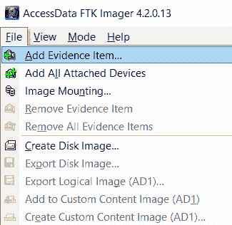

向 FTK Imager 添加证据来源

1.  在“选择源”对话框中选择“映像文件”，然后点击“下一步”。

1.  在“选择文件”对话框中，浏览到下载`sdcard.dd`文件的位置，选择它，然后点击“完成”，如下面的截图所示：

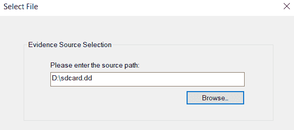

在 FTK Imager 中选择用于分析的图像文件

1.  FTK Imager 的默认显示将展示 SD 卡内容，显示在右下角的查看窗格中。你还可以点击左下角的属性标签查看磁盘镜像的属性。

1.  现在，在左侧窗格中，驱动器已打开。可以通过点击加号打开文件夹。当选中一个文件夹时，右侧窗格会显示其内容。选择一个文件后，其内容会显示在底部窗格。

1.  如下图所示，被删除的文件会在其文件扩展名图标上方显示一个红色的`X`：

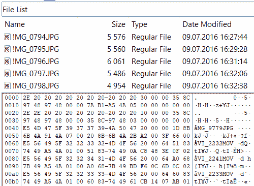

被删除的文件在图标上显示红色 X

1.  如下图所示，要导出文件，请右键点击包含图片的文件，然后选择“导出文件...”：

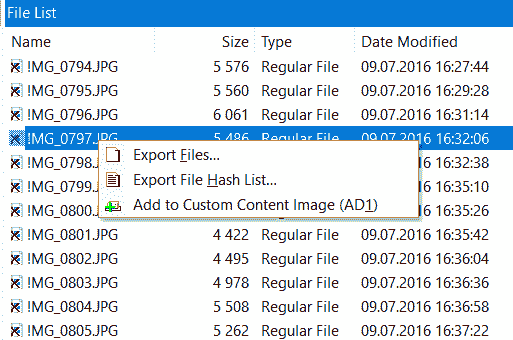

有时，只能恢复文件的一部分，这部分无法直接读取或查看。在这种情况下，我们需要查看空闲或未分配空间中的更多数据。文件雕刻技术可以用来从空闲和未分配的空间中恢复文件。PhotoRec 是可以帮助你完成此操作的工具之一。接下来的部分你将学习如何使用 PhotoRec 进行文件雕刻。

# 从 SQLite 数据库恢复已删除的记录

安卓中大部分的应用数据都存储在 SQLite 数据库中。与短信、电子邮件以及大多数应用数据相关的数据都存储在 SQLite 数据库中。这些数据库可以在数据库内部存储已删除的数据。用户标记为删除的记录不再出现在活动的 SQLite 数据库文件中。因此，通过分析这些 SQLite 文件，可以恢复已删除的数据，例如短信、联系人等。SQLite 页面中有两个区域可以包含已删除的数据：未分配块和空闲块。大多数商业取证工具通过扫描 SQLite 页面的未分配块和空闲块来恢复已删除的数据。解析已删除的数据可以使用例如 Belkasoft Evidence Center 等工具进行。该商业取证工具的试用版可以在这里下载：[`belkasoft.com/get`](https://belkasoft.com/get)。

在我们的例子中，我们将从安卓设备中恢复已删除的短信。恢复已删除的短信是设备取证分析中常见的请求，主要因为它是最流行的通信方式。有不同的方法可以恢复安卓设备上的已删除短信。但是，就解析 SQLite 文件来进行恢复而言，我们需要了解短信存储在设备上的位置。在第四章，*从安卓设备中逻辑地提取数据*，我们解释了安卓设备上存储用户数据的重要位置。

让我们来查看`bugle_db`，这是一个包含通过 Android 消息应用程序发送或接收的短信的 SQLite 数据库。该数据库位于`/data/data/com.android.messaging/databases`目录下。如果你有设备的物理镜像，你可以使用 FTK Imager 提取数据库，就像提取已删除的文件一样。如果你想直接从设备中提取，可以使用`adb pull`命令（设备必须已经 root）。

找到已删除记录的最简单方法是使用商业移动取证工具，如 Belkasoft Evidence Center、Cellebrite UFED Physical Analyzer、Oxygen Forensic Detective 等，但也有一些开源工具能够从未分配空间和空闲列表中恢复数据。一个这样的工具是由 Mari DeGrazia 开发的 SQLite Deleted Records Parser。你可以在她的 GitHub 上下载这个工具：[`github.com/mdegrazia/SQLite-Deleted-Records-Parser`](https://github.com/mdegrazia/SQLite-Deleted-Records-Parser)。

该工具有三种版本：Python 脚本、命令行版本和 GUI 版本。为了演示，我们将使用 GUI 版本，如下所示的例子所示：

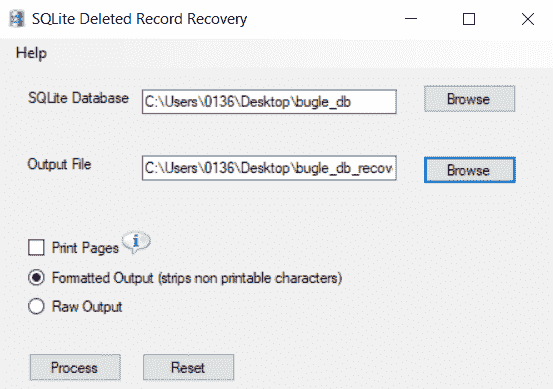

使用该工具非常简单，您只需要选择源数据库和目标文件，然后点击处理。结果将得到一个 TSV 文件（如果选择了格式化输出），其中包含恢复的记录，包括其来源（未分配空间或空闲块）、偏移量和长度。

# SD 卡安全

在旧版安卓系统中，简单地将手机插入计算机，通常会自动挂载 SD 卡并允许检查员访问其数据。在某个版本的安卓系统（可能是 3.0 版）中，这一行为发生了变化，尽管我们在多个变更日志中没有找到具体版本的描述。新版本的安卓系统如果启用了屏幕锁定，将不会自动允许从计算机访问 SD 卡，这意味着需要绕过屏幕锁定才能访问 SD 卡。唯一的例外是，物理外部 SD 卡仍然可以被取出，并使用传统的计算机取证方法进行分析。

SD 卡也可以被加密，如果是内置 SD 卡，则通过设备的全盘加密进行加密；如果是外部 SD 卡，则通过第三方应用程序进行加密。在某些情况下，启用全盘加密会使 SD 卡保持未加密状态，尽管这取决于设备制造商。

在安卓 Lollipop 系统中引入的全盘加密也对 SD 卡进行了加密。

# 高级取证方法

除了前几章中讨论的方法，还有一些更先进的、专业化的方法可供使用。JTAG 和芯片拆卸方法在许多常见情况下是非常有用的工具，但它们需要高级培训（并且在处理实际证据之前需要大量的实践！）。最后一种高级方法——冷启动攻击以恢复加密密钥，更加理论化。

# JTAG

JTAG，**联合测试行动小组**（**JTAG**）是由**电气和电子工程师协会**（**IEEE**）制定的标准。在设备生产过程中，JTAG 用于通过专用接口与处理器进行通信，进行测试。幸运的是，对于取证检查员来说，它还允许他们直接与处理器通信，并获取闪存的完整物理映像。

要执行 JTAG 提取，设备必须拆开，直到电路板。电路板上将包含多个接点（设备电路板上的物理接触点），虽然它们通常没有标签，且接点数量通常远多于 JTAG 所需的数量。为了确定正确的接点，检查员必须查找引脚图（可以在网上找到，或随所选工具提供），或使用电子测试设备确定每个接点的功能。

检查员接下来需要将一根线焊接到每个接点上，或者使用商业上可用的适配器（有时称为夹具），并通过提供的适配器将其连接到 JTAG 盒子：

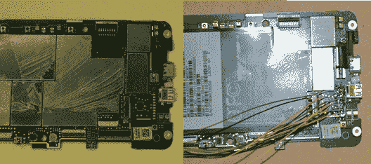

HTC Evo 在连接 JTAG 前后的情况（感谢 http://lowcostwin4n6.blogspot.com/）

JTAG 听起来可能很复杂（因为它确实很复杂），但它有许多有用的用途：

+   它不需要设备开机：

    +   即使设备损坏，也可能成功

    +   无射频屏蔽问题

+   它不需要 root、ADB 或 USB 调试：

    +   可用于绕过设备的 PIN 码/密码

    +   可以映像整个闪存

许多制造商生产 JTAG 工具，许多用于移动取证的常见工具可以在 [`teeltech.com/mobile-device-forensic-software/teel-tech-jtag-box-sets/`](http://teeltech.com/mobile-device-forensic-software/teel-tech-jtag-box-sets/) 找到。该网站上列出的 RIFF box 可能是最常用于移动取证的工具，因为它支持（包括针脚排布）多种设备。

JTAG 并不总是成功，甚至有时无法实现。尽管接口几乎总是在电路板上，制造商可以选择在设备制造后禁用它。

# 拆芯片

拆芯片涉及加热设备的电路板，直到固定组件的焊接点融化，然后拆除闪存芯片。随后，可以使用商业工具读取内存芯片，从而获得完整的物理映像。拆芯片技术，像 JTAG 一样，源自商业电子生产过程。熔化焊料的过程（通常称为回流或返工）用于将组件放置到电路板上或从电路板上移除，读取内存所使用的设备用于读取和写入内存芯片，通常以批量形式进行操作：

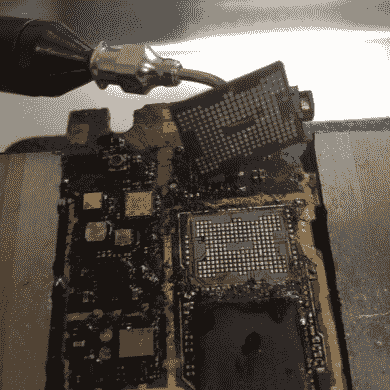

从损坏的手机中取出的内存芯片（感谢 www.binaryintel.com）

拆芯片具有与 JTAG 相同的优点：它不需要设备开机，并且可以用来绕过锁定设备的 PIN 码/密码。拆芯片通常被视为一种破坏性过程。虽然内存芯片可以被替换，但这是一个技术要求较高的过程，需要进一步的培训。但是，作为最后的手段，拆芯片是对于那些否则无法检查的设备来说是一个极好的替代方案。

拆芯片比 JTAG 显著更昂贵，因为需要专用的返工站和商业内存读卡器。有数十种返工站可供选择，它们提供的功能基本相同。也有多种内存读卡器，尽管我们在使用这个价格合理的型号时取得了很大成功：[`www.dataman.com/programmers/universal/dataman-48pro2-super-fast-universal-isp-programmer.html`](http://www.dataman.com/programmers/universal/dataman-48pro2-super-fast-universal-isp-programmer.html)。返工站和读卡器并不是拆芯片唯一的成本；大多数读卡器还需要为每个要读取的芯片型号配备特定的适配器。

# 总结

本章中，我们讨论了几种用于物理成像内部存储或 SD 卡的技术，以及它们相关的一些常见问题：

| **技术** | **相关问题** |
| --- | --- |
| `dd` |

+   通常预安装在设备上

+   可能无法在 MTD 块上使用

+   无法获取带外区域

|

| `nanddump` |
| --- |

+   设备上通常没有此功能，必须将其推送到设备上

+   与 MTD 块配合良好

+   可以基于使用的二进制文件中的选项获取带外区域

|

此外，每种成像技术可以用于将图像保存到设备上（通常是 SD 卡），或使用`netcat`将文件写入检查员的计算机：

| **技术** | **特性** |
| --- | --- |
| 写入 SD 卡 |

+   简单，不需要将额外的二进制文件推送到设备上

+   对大多数检查员来说很熟悉

+   如果 SD 卡与正在成像的分区存在符号链接，则无法使用

+   如果正在成像整个内存，则无法使用

|

| 使用`netcat` |
| --- |

+   通常需要将另一个二进制文件推送到旧设备上

+   稍显复杂，必须严格按照步骤操作

+   无论成像的是什么，都能正常工作

+   可能比写入 SD 卡更费时

|

还介绍了一些可以用于 RAM 成像的工具：

| **工具** | **特性** |
| --- | --- |
| LiME |

+   必须为每个被检查的设备编译

+   非常复杂的过程

+   具有已知且良好文档化的分析程序

+   输出是所有 RAM 的转储

|

最后，我们简要讨论了芯片拆卸和 JTAG 技术的入门级内容。

在下一章中，我们将演示如何从物理镜像（如本章创建的镜像）中恢复已删除的数据。

# 恢复内部存储已删除的数据

从 Android 的内部存储中恢复已删除的文件，如应用数据等，并不像从 SD 卡和 SQLite 数据库中恢复这些数据那样简单，但当然并非不可能。许多商业取证工具能够从 Android 设备中恢复已删除的数据，当然，前提是物理获取是可能的，并且 userdata 分区没有加密。但对于现代设备，尤其是运行最新操作系统版本（如 Oreo 和 Pie）的设备，这并不常见。

大多数安卓设备，尤其是现代智能手机和平板电脑，使用 EXT4 文件系统来组织其内部存储中的数据。该文件系统在基于 Linux 的设备中非常常见。因此，如果我们想从设备的内部存储中恢复已删除的数据，我们需要一款能够从 EXT4 文件系统中恢复已删除文件的工具。一个这样的工具是 extundelete。该工具可以在此下载：[`extundelete.sourceforge.net/`](http://extundelete.sourceforge.net/)。

为了恢复一个 inode 的内容，extundelete 会在文件系统的日志中查找该 inode 的旧副本。inode 中包含的信息帮助工具定位文件在文件系统中的位置。为了恢复文件的内容及其名称，extundelete 可以在目录中查找已删除的条目，将文件的 inode 编号与文件名匹配。

要使用这个工具，你需要一台 Linux 工作站。大多数法医 Linux 发行版已经自带该工具。例如，下面是来自**SIFT Workstation**的截图——这是一个由 Rob Lee 和他的 SANS 学院团队创建的流行数字取证和事件响应 Linux 发行版（[`digital-forensics.sans.org/community/downloads`](https://digital-forensics.sans.org/community/downloads)）：

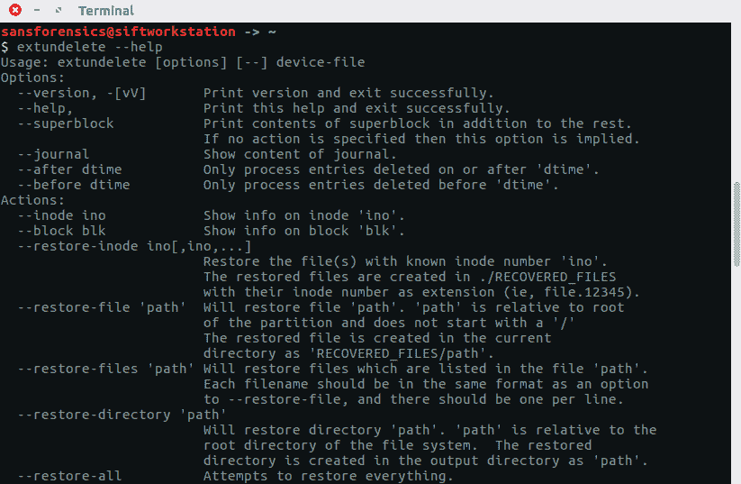

extundelete 命令行选项

在开始恢复过程之前，你需要挂载一个之前已镜像的 userdata 分区。在这个示例中，我们将使用通过芯片脱离技术镜像的 Android 设备——你已经在第五章中了解过这种技术，*物理提取 Android 设备数据*。

首先，我们需要确定 userdata 分区在镜像中的位置。为此，我们可以使用来自**Sleuth Kit**的`mmls`，如下所示的截图：

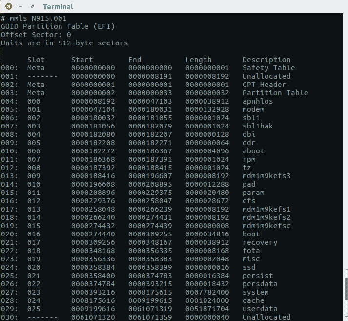

Android 设备分区

如截图所示，userdata 分区是最后一个，起始扇区为`9199616`。为了确保 userdata 分区是 EXT4 格式的，我们可以使用`fsstat`，如下所示的示例：

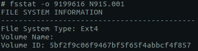

fsstat 输出的部分内容

现在你需要做的是挂载 userdata 分区并运行 extundelete，如下所示的示例：

```
extundelete /userdata/partition/mount/point --restore-all
```

所有恢复的文件将被保存在当前目录的子目录`RECOVERED_FILES`中。如果你有兴趣恢复指定日期之前或之后的文件，可以使用`--before date`和`--after-date`选项。请注意，这些日期必须采用 UNIX 纪元格式。有很多在线和离线工具可以转换时间戳，例如，你可以使用[`www.epochconverter.com/`](https://www.epochconverter.com/)。

如你所见，这种方法不太简单且速度较慢，但有一种更好的方法：使用 Autopsy，这是一款开源数字取证工具，已在第三章中介绍过，*理解 Android 设备上的数据存储*。

在下面的示例中，我们使用了内置的文件扩展名过滤器，找到了 Android 设备上的所有图片，并发现了大量已删除的文件：

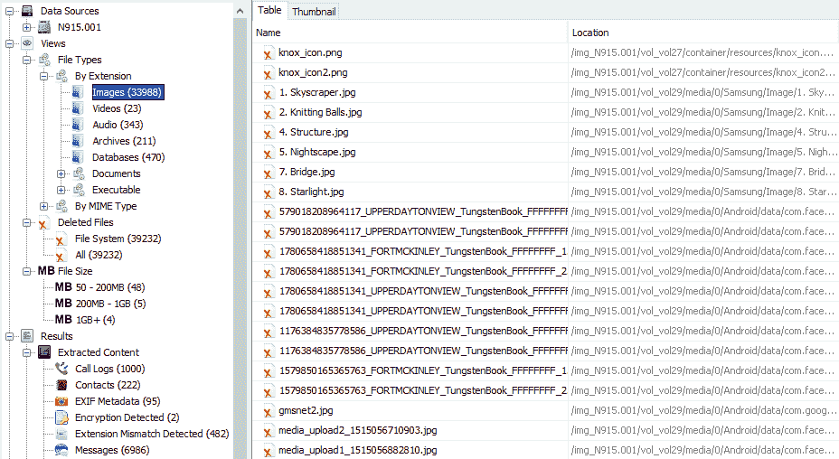

使用 Autopsy 从 EXT4 分区恢复已删除的文件

使用文件系统日志恢复已删除的文件并不总是可能的，这正是文件雕刻派上用场的地方。

# 使用文件雕刻恢复已删除的数据

文件雕刻是取证中一种非常有用的方法，因为它可以恢复已删除或隐藏的数据进行分析。简而言之，文件雕刻是从没有文件系统元数据的碎片中重新组装文件的过程。在文件雕刻中，会在二进制数据中搜索并提取指定的文件类型，从而创建分区或整个磁盘的取证镜像。文件雕刻仅基于文件结构和内容，从驱动器的未分配空间中恢复文件，而不依赖任何匹配的文件系统元数据。

未分配空间是指驱动器中不再包含任何文件信息的部分，这些信息由文件系统结构如文件表指示。

通过扫描磁盘的原始字节并重新组装它们，可以恢复或重建文件。这可以通过检查文件的头部（前几个字节）和尾部（最后几个字节）来完成。

文件雕刻方法是根据所使用的底层技术进行分类的。**头尾雕刻方法**依赖于根据文件的头部和尾部信息恢复文件。例如，JPEG 文件以 `0xffd8` 开头，以 `0xffd9` 结尾。头部和尾部的位置被识别出来，介于这两个端点之间的内容会被雕刻出来。类似地，**文件结构雕刻方法**基于文件的内部布局来重建文件。但传统的文件雕刻技术，如我们已经解释过的那些，如果数据是碎片化的，可能无法奏效。为了克服这一问题，新的技术，如 **智能雕刻**，利用多种流行文件系统的碎片特征来恢复数据。

一旦手机映像完成，就可以使用如 PhotoRec 等工具进行分析。PhotoRec 是一个强大的免费工具，可以雕刻文件。该工具分析块数据库存储，识别已删除的文件并恢复它们。Scalpel 是文件系统无关的，并且已知能够在多种文件系统上工作，包括 EXT4、exFAT、FAT32 等。以下步骤说明了如何在 Windows 工作站上使用 PhotoRec 恢复文件：

1.  从 [`www.cgsecurity.org/wiki/TestDisk_Download`](https://www.cgsecurity.org/wiki/TestDisk_Download) 下载工具。将压缩包解压到你选择的目录中。

1.  使用管理员权限打开命令提示符，并运行 `photorec.exe`，并将 Android 物理镜像作为参数。

1.  选择你想从中雕刻数据的分区，在我们的例子中是 `USERDATA`。如下截图所示：

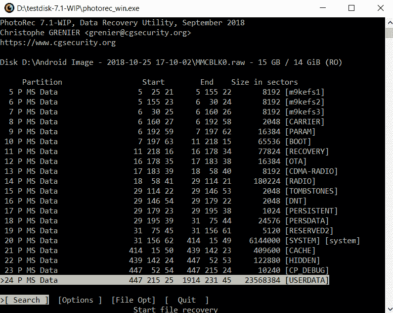

在 PhotoRec 中选择分区

1.  如果你只想雕刻特定的文件类型，可以前往 `File Opt`。在我们的例子中，我们只关心 JPG 图像，因此我们只选择了一种文件类型，如下图所示：

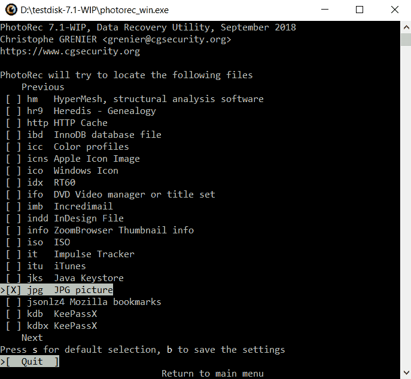

在 PhotoRec 中选择文件类型

1.  选择文件系统类型，在我们的例子中是 EXT4，如以下示例所示：

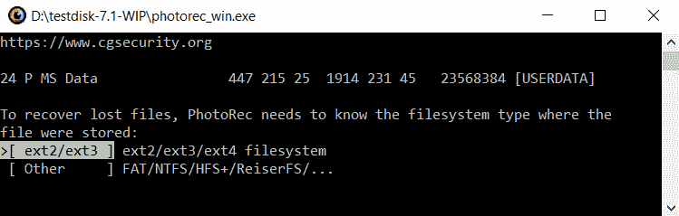

在 PhotoRec 中选择文件系统类型

1.  现在，你应该选择工具是只扫描空闲空间，还是扫描整个分区。第二个选项会给你带来更多的数据，但它将与那些未被删除的文件混合在一起。以下示例展示了这些选择：

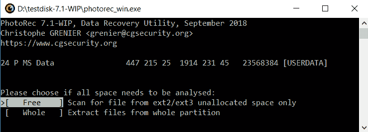

选择是否需要分析所有空间

1.  最后，选择恢复的文件将存储的文件夹。你可以使用箭头键来完成此操作，然后按 *C*，如以下截图所示：

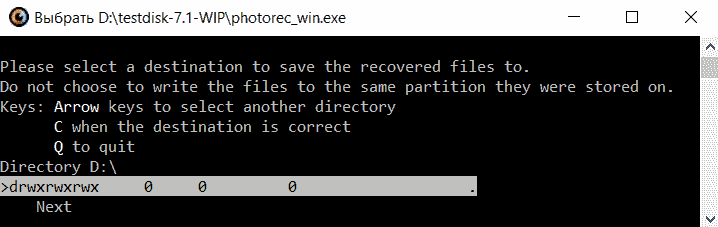

恢复的文件将保存在所选目录下名为 `recup_dir` 的子目录中。

# 总结

数据恢复是从设备中恢复已删除数据的过程，因此它是取证中非常重要的概念。在本章中，我们介绍了从 SD 卡和内部存储中恢复已删除数据的各种技术。虽然从可移动 SD 卡恢复数据相对容易，但从内部存储中恢复数据则涉及一些复杂性。SQLite 文件解析和文件雕刻技术有助于取证分析人员恢复 Android 设备内部存储中已删除的项目。

在下一章中，我们将尝试理解取证视角以及对 Android 应用程序的分析。
