# 第七章：Android 应用程序的法医分析

本章将覆盖应用程序分析。本章将重点分析通过 第四章 *从 Android 设备中逻辑提取数据* 和 第五章 *从 Android 设备中物理提取数据* 中详细描述的任何逻辑或物理技术恢复的数据。本章还将大量依赖于 第二章 *设置 Android 法医环境* 中讨论的存储方法；我们将看到来自该章节中描述的文件层次结构内不同位置的 SQLite 数据库、XML 文件以及其他文件类型。到本章结束时，读者应当熟悉以下内容：

+   应用程序分析概述

+   为什么要进行应用程序分析？

+   第三方应用程序以及流行应用程序用于存储和混淆数据的各种方法

# 应用程序分析概述

法医分析应用程序既是一门科学，也是一门艺术。应用程序可以通过各种方式存储或混淆其数据。即便是同一版本的应用程序，其数据存储方式也可能不同。开发者在选择数据存储方式时，实际上只受限于他们的想象力（以及 Android 平台的限制）。正因为这些因素，应用程序分析是一项不断变化的工作；分析人员今天使用的方法，明天可能就完全不再适用。

法医分析应用程序的最终目标始终是相同的：了解应用程序的用途，并找到用户数据。

本章将探讨许多常见应用程序的当前版本。由于应用程序可能会通过更新更改其数据存储方式，本章中的内容并不是分析这些应用程序的权威指南。相反，我们将查看各种不同的应用程序，以展示它们存储数据时所使用的多种不同方法。大多数情况下，我们将重点关注非常常见的应用程序（例如，Google Play 上有数百万次下载的应用程序），除非在分析一些冷门应用时能揭示出有趣的新数据存储方式。

# 为什么要进行应用程序分析？

首先，Android 设备上的标准电话功能，如联系人、通话和短信，都是通过应用程序来实现的，因此即使是获取基本数据也需要分析应用程序。其次，一个人使用的应用程序可以告诉你很多关于他们的信息：他们去过哪里（以及何时去的），他们与谁沟通过，甚至他们未来可能会有什么计划。

许多手机预装了超过 20 个应用程序。检查员实际上无法知道这些应用中哪些可能包含对调查有用的信息，因此必须对所有应用进行分析。检查员可能会想跳过那些看起来似乎没有什么有用数据的应用，如游戏。然而，这样做是个坏主意；许多流行的游戏都有内置聊天功能，可能会提供有价值的信息。我们的分析将重点关注消息应用程序，因为我们的经验表明，这些应用在法医分析中通常最有价值。

# 本章布局

对于我们检查的每个应用程序，我们将提供一个包名和相关文件。所有应用默认将其数据存储在 `/data/data` 或 `/data/user_de/0`（较新的设备）目录下；如果应用在安装时请求此权限，应用也可以使用 SD 卡。包名是该应用在这些目录中的文件夹名称。*相关文件* 部分中的路径是从包名根目录开始的。SD 卡上的数据路径以 `/sdcard` 开头。请不要期望在应用的 `/data/data` 或 `/data/user_de/0` 目录中找到以 `/sdcard` 开头的数据路径！

我们将从一些谷歌应用程序开始，因为这些应用通常预装在大多数设备上（尽管并非必须如此）。然后，我们将查看可以在 Google Play 上找到的第三方应用程序。

# 确定安装了哪些应用

若要查看设备上有哪些应用程序，检查员可以导航到 `/data/data` 并运行 `ls` 命令。但这并不会提供格式良好的数据，无法在法医报告中显示得很好。我们建议提取 `/data/system/packages.list` 文件；该文件列出了设备上每个应用的包名和其数据路径（如果该文件在设备上不存在，`adb shell pm list packages –f` 命令是一个不错的替代选择）。例如，以下是 Google Chrome 的一条记录（我们测试设备上的完整文件包含 120 条记录）：

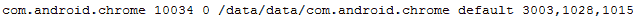

这是数据存储方法 1：纯文本。我们常常看到应用以纯文本形式存储数据，甚至包括一些你意想不到的数据（例如密码）。

也许更有趣的是 `/data/system/package-usage.list` 文件，它显示了某个包（或应用）最后一次被使用的时间。这个文件并不完美；文件中显示的时间与我们最后一次使用该应用的时间并不完全一致。看起来应用更新或接收通知（即使用户没有查看它们）也可能影响时间，然而它对于一般了解用户最后使用的应用来说是有用的：


如果你想知道那一行中哪里可以找到时间，它采用的是被称为 Unix 纪元时间的格式。

# 理解 Unix 纪元时间

**Unix 纪元时间**，也称为 Unix 时间或 Posix 时间，是以自 1970 年 1 月 1 日午夜 UTC 以来的秒数（或毫秒数）表示的。10 位数值表示秒数，13 位数值表示毫秒数（至少对于智能手机上常见的时间，因为自 2001 年以来，9 位秒数和 12 位毫秒数值已不再出现）。在我们的示例中，值为`1422206858650`；表示自 1970 年 1 月 1 日午夜以来，Google Chrome 上次使用的时间是 14 亿 2 千 2 百 20 万 6 千 8 百 58 秒 650 毫秒！不用担心，我们也不知道这是哪个日期/时间。可以下载许多脚本和工具来将其转换为人类可读的格式；我们喜欢 DCode，这是一个免费的工具，可以在这里找到：[`www.digital-detective.net/digital-forensic-software/free-tools/`](http://www.digital-detective.net/digital-forensic-software/free-tools/)。

在 DCode 中，只需从下拉列表中选择**Unix: 毫秒值**，在**要解码的值**字段中输入值，然后点击**解码**：

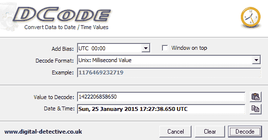

可以选择**添加偏差**字段，将时间转换为所需的时区。

另外，您还可以使用一个非常有用的在线纪元计算器，网址为[`www.epochconverter.com/`](http://www.epochconverter.com/)。

使用任一方法，我们可以看到 Google Chrome 实际上是在 2015 年 1 月 25 日 17:27:38.650 UTC 上次使用的。Unix 纪元时间在 Android 设备中经常用于存储日期/时间值，并且在我们的应用分析中会反复出现。

# Wi-Fi 分析

Wi-Fi 技术上不是一个应用程序，但它是一个宝贵的数据来源，应该进行检查，所以我们在这里简要讨论一下。Wi-Fi 连接数据位于`/data/misc/wifi/wpa_supplicant.conf`中。`wpa_supplicant.conf` 文件包含用户选择自动连接的接入点列表（当新接入点连接时，默认情况下会设置此选项）。用户通过设备设置*忘记*的接入点不会显示。如果接入点需要密码，密码也以明文形式保存在文件中。在以下示例中，`NETGEAR60` 接入点需要密码（`ancientshoe601`），而 `hhonors` 则不需要：

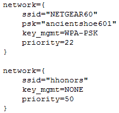

文件中存在的 SSID 并不意味着该设备已连接到该接入点。这些设置保存在用户的 Google 帐户中，并在该帐户设置时添加到设备中。检查者只能得出结论，用户从某个 Android 设备连接了这些接入点，而不一定是正在检查的设备。

# 联系人/通话分析

联系人和通话记录存储在同一个数据库中。用户无需显式添加联系人，当通过 Gmail 发送电子邮件、在 Google+ 上添加联系人或通过其他许多方式时，联系人可能会自动填充。

**包名**：`com.android.providers.contacts`

**关注的文件**:

+   `/files/`:

    +   `photos/`

    +   `profile/`

+   `/databases/`:

    +   `contacts2.db`

    +   `calllog.db`

`files` 目录包含用户联系人照片存储在 `photos` 目录中的照片，以及用户个人资料照片存储在 `profile` 目录中的照片。

`contacts2.db` 数据库包含用户 Google 帐户中所有联系人的所有信息：

| **表格** | **描述** |
| --- | --- |
| `accounts` | 显示设备上有权限访问联系人列表的帐户。至少有一个帐户会显示用户的 Google 帐户电子邮件地址。该列表可能包括已安装的第三方应用程序，这些应用程序有权限访问联系人列表（我们将在 Tango、Viber 和 WhatsApp 部分看到这一点）。 |
| `contacts` | 包含部分联系人信息（更多数据可以在 `raw_contacts` 表中找到）。`name_raw_contact_id` 值对应于 `raw_contacts` 表中的 `_id` 值。`photo_file_id` 值对应于在 `/files/photos` 目录中找到的文件名。`times_contacted` 和 `last_time_contacted` 显示该联系人通过设备拨打或接听的次数，以及最后一次通话的时间，时间格式为 Unix 时间戳格式。 |
| `data` | 此表包含每个联系人的所有信息，如电子邮件地址和电话号码。`raw_contact_id` 列是每个联系人的唯一值，可以与 `raw_contact_id` 中的 `_id` 值相关联来识别联系人。请注意，每个联系人可能有多行记录，如相同的 `raw_contact_id` 值所示。共有 15 个数据列（`data1`-`data15`），包含一些关于联系人的信息，但没有明显的规律。同一列可能包含联系人姓名、电子邮件地址、Google+ 个人资料等。`data14` 列的值与 `files/profiles` 路径下的图片文件名相关联。`data15` 列包含联系人的个人资料照片缩略图。 |
| `deleted_contacts` | 包含 `contact_id` 值和 Unix 时间戳格式的 `deleted_contact_timestamp`。然而，无法将其与其他表格关联以识别被删除联系人的姓名。不过，可能可以使用 第六章 中的已删除数据恢复技巧，*从 Android 设备恢复已删除数据*，来恢复联系人的姓名。`contact_id` 值对应于 `raw_contacts` 表中的 `contact_id` 列。 |
| `groups` | 显示联系人列表中的群组，可以是自动生成的或用户创建的。群组的标题是群组的名称。似乎没有办法识别每个群组中的用户。 |
| `raw_contacts` | 包含联系人列表中每个联系人的所有信息。`display_name` 显示联系人的姓名（如果有）。要确定联系人的电话号码、电子邮件地址或其他信息，必须将 `_id` 列的值与数据表中的 `raw_contact_id` 值匹配。`sync3` 列显示一个时间戳，但根据我们的测试，这不能假设为联系人添加的时间；我们有一些联系人已经好几年了，但这个月才同步。`times_contacted` 和 `last_time_contacted` 列仅适用于电话；发送电子邮件或 SMS 给联系人并不会增加这些值。我们无法识别任何方法来确定联系人是通过手机界面添加的、通过 Google+ 添加为好友的，还是通过其他方式添加的。 |

`calllog.db` 包含关于来电、去电和未接来电的所有信息：

| **表格** | **描述** |
| --- | --- |

| `calls` | 包含设备上所有进出通话的信息。`number` 列显示远程用户的电话号码，以及该通话是拨出还是接听。`date` 列是通话的日期/时间，存储为 Unix 时间戳格式。`duration` 列是通话的持续时间（秒）。`type` 列表示通话类型：

+   收件

+   外发

+   未接来电

`name` 列显示远程用户的姓名，如果该号码已存储在联系人列表中。`geocoded_location` 显示电话号码的位置，基于区号（美国号码）或国家代码。|

# SMS/MMS 分析

SMS 和 MMS 消息存储在同一数据库中。根据我们的经验，无论使用什么应用程序发送 SMS/MMS（也就是说，通过 Google Hangouts 发送 SMS 将填充此数据库，而不是这里检查的 Hangouts 数据库），此数据库都会被使用，尽管第三方应用程序也可能在其自己的数据库中记录这些数据。

**包名**：`com.android.providers.telephony`

**感兴趣的文件**：

+   `/files`

+   `/databases/`:

    +   `mmssms.db`

    +   `telephony.db`

`files` 目录包含作为 MMS 发送的附件，包括发送和接收的文件。

`telephony.db` 数据库较小，但包含一个潜在有用的信息源：

| **表格** | **描述** |
| --- | --- |
| `siminfo` | 包含设备中使用过的所有 SIM 卡的历史数据，包括 ICCID、电话号码（如果它存储在 SIM 卡上）和 MCC/MNC，后者可用于识别网络提供商。 |

`mmssms.db` 数据库包含有关 SMS 和 MMS 消息的所有信息：

| **表格** | **描述** |
| --- | --- |
| `part` | 包含关于 MMS 附件文件的信息。每条消息至少有两个部分：SMIL 头和附件—可以在 `mid` 和 `ct` 列以及附加的文件类型中看到。`_data` 列提供了在设备上查找文件的路径。 |
| `pdu` | 包含每条彩信的元数据。`date`列标识消息发送或接收的时间，采用 Linux 纪元格式。`_id`列似乎对应于`part`列中的 mid 值；关联这些值可以显示特定图片发送的时间。`msg_box`列显示消息的方向（`1` = 接收，`2` = 发送）。 |
| `sms` | 包含每条短信的元数据（不包括彩信信息）。地址列显示远程用户的电话号码，无论消息是发送还是接收。`person`列包含一个可以在`contacts2.db`数据库中查找的值，并与`data`表中的`raw_contact_id`对应。如果是发送的消息，或者远程用户不在联系人列表中，`person`列将为空。`date`列显示消息发送的时间戳，采用 Linux 纪元格式。`type`列显示消息的方向（`1` = 接收，`2` = 发送）。`body`列显示消息内容。`seen`列表示消息是否已读（`0` = 未读，`1` = 已读）；所有发送的消息将标记为未读。 |
| `words`, `words_content`, `words_segdir` | 似乎包含消息的重复内容；该表的具体目的尚不清楚。 |

# 用户字典分析

用户字典是检查员获取数据的一个不可思议的来源。每当用户输入一个未被识别的单词并选择保存该单词以避免被自动更正标记时，用户字典就会被填充。有趣的是，我们的测试设备中包含了许多我们从未输入或保存过的单词；这些数据似乎会与用户的 Google 账户同步，并在多个设备之间持久存在。从账户同步的单词按字母顺序添加到数据库的顶部，而手动添加的单词则按添加顺序出现在底部。

**包名**：`com.android.providers.userdictionary`

**感兴趣的文件**：

+   `/databases/user_dict.db`

| **表格** | **描述** |
| --- | --- |
| `words` | `word`列包含添加到字典中的单词。频率列可能应被忽略；无论我们使用该单词多少次，它显示的值始终是（250）。 |

以下是用户字典中的一些示例条目：

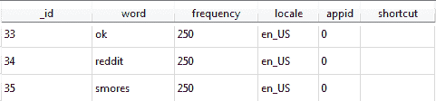

# Gmail 分析

Gmail 是由 Google 提供的电子邮件服务。在设备第一次设置时，通常会要求提供 Gmail 账户，虽然这不是必须的。

**包名**：`com.google.android.gm`

**感兴趣的文件**：

+   `/cache`

+   `/databases/`：

    +   `mailstore.<username>@gmail.com.db`

    +   `databases/suggestions.db`

+   `/shared_prefs/`：

    +   `MailAppProvider.xml`

    +   `Gmail.xml`

    +   `UnifiedEmail.xml`

应用程序文件夹中的`/cache`目录包含最近的邮件附件文件，无论是已发送还是已接收的。这些附件即使没有被用户明确下载，也会保存在这里。

`mailstore.<username>@gmail.com.db`文件包含各种有用的信息。数据库中的有趣表格包括：

| **表** | **描述** |
| --- | --- |
| `附件` | 关于附件的信息，包括它们的大小和在设备上的文件路径（上文提到的`/cache`目录）。每一行还包含一个`messages_conversation`值；该值可以与对话表进行对比，以关联附件和它所在的邮件。`filename`列标识文件在设备上的存储路径。 |
| `对话` | 在旧版本中，可以恢复完整的电子邮件对话。在当前版本中，Google 不再在设备上存储完整的对话，可能假设用户会有数据连接来下载完整对话。现在，只能恢复主题行和一个片段。片段大致是应用通知栏或收件箱屏幕中显示的文本量。`fromCompact`列标识发件人和其他收件人。 |

`suggestions.db`数据库包含了在应用内搜索的术语。

`shared_prefs`目录中的 XML 文件可以确认与应用程序一起使用的账户。`Gmail.xml`包含了与我们测试账户关联的另一个账户，但该账户从未在应用中使用。`UnifiedEmail.xml`包含了一部分向该账户发送邮件的发件人列表，但没有明确的规律；许多发件人出现在列表中，但远不是所有的，而且它们没有特定的顺序。`Gmail.xml`还包含了应用程序上次同步的时间，格式为 Unix 时间戳。

# Google Chrome 分析

Google Chrome 是一款网页浏览器，是许多设备的默认浏览器。设备上的 Chrome 数据有些独特，因为它包含的不仅仅是设备上的数据，还包含了用户在所有登录了 Chrome 的设备上的数据。这意味着，用户在台式电脑上浏览的数据很可能会出现在手机数据库中。然而，这也导致了考察者需要处理大量数据，但这也是一个好问题。

**包名**：`com.android.chrome`

**感兴趣的文件**：

+   `/app_chrome/Default/`：

    +   `同步数据/SyncData.sqlite3`

    +   `书签`

    +   `Cookies`

    +   `Google Profile Picture.png`

    +   `历史记录`

    +   `登录数据`

    +   `Preferences`

    +   `热门网站`

    +   `Web 数据`

+   `/app_ChromeDocumentActivity/`

`/app_chrome/Default`文件夹中列出的所有文件，除了那个 PNG 文件、`Bookmarks`和`Preferences`，都是 SQLite 数据库，尽管它们没有文件扩展名。

`SyncData.sqlite3` 数据库非常有趣，因为它似乎包含了一份从用户账户在设备上同步到 Google 服务器的数据列表。我们的数据库中，活跃的 Chrome 账户包含超过 2700 条记录，包括浏览历史、自动填充表单信息、密码和书签。例如，我们能够找到其中一位作者在 2012 年搜索的一个术语，见下图：

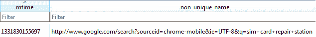

| **表格** | **描述** |
| --- | --- |
| `metas` | 数据库中有许多包含时间戳的列，在我们的数据库中，每个条目的时间戳似乎相差仅仅几秒。尚不清楚哪个时间对应于条目添加的确切时间，但所有时间大致与用户账户中活动的时间一致。包含时间戳的列有 `mtime`、`server_mtime`、`ctime`、`server_ctime`、`base_version` 和 `server_version`。`non_unique_name` 和 `server_non_unique_name` 列显示已同步的内容。例如，我们的一个条目显示：`autofill_entry&#124;LNAME&#124;Tindall`。这些列中的其他条目包括访问过的 URL、密码，甚至账户使用过的设备。 |

`Bookmarks` 文件是一个纯文本文件，包含与账户同步的书签信息。它包括每个书签站点的名称、URL 以及书签添加的日期/时间，时间以我们尚未遇到的格式存储：Webkit 格式。要解码这些值，请参见 *解码 Webkit 时间格式* 部分。

这是数据存储方法 3：Webkit 时间格式。

`Cookies` 数据库存储了访问过网站的 cookie 信息（取决于网站和 Chrome 设置），包括网站名称、cookie 保存日期以及最后访问 cookie 的时间，时间以 Webkit 时间格式存储。

`Google Profile Picture.PNG` 文件是用户的个人资料图片。

`History` 数据库包含用户的网页历史记录。

| **表格** | **描述** |
| --- | --- |
| `keyword_search_terms` | 包含在 Chrome 中使用 Google 搜索的术语列表。术语列显示搜索的内容，而 `url_id` 可以与 URL 表进行关联，以查看搜索的时间。 |
| `segments` | 该表包含一些访问过的 URL，但并非所有的 URL。尚不清楚是什么原因导致数据被输入到这个表中。 |
| `urls` | 包含 Google 帐号在所有设备上的浏览历史记录，而不仅仅是从中提取数据库的设备。我们的历史记录追溯大约 3 个月，包含了 494 条记录，尽管 Google 帐号比这更早，我们在这段时间内肯定访问了超过 494 个页面。目前尚不清楚导致这种差异的具体原因，或者是什么决定了历史记录的截止日期。`id` 列是每行数据的唯一值。`url` 和 `title` 列分别包含访问的 URL 和页面的名称。`visit_count` 列似乎准确计数了访问该 URL 的次数。`typed_count` 始终小于或等于 `visit_count`，但我们不确定它具体表示什么。对于某些网站，可以通过计算通过书签访问网站而非直接输入 URL 的次数来解释这种差异，但并非所有情况都如此。`last_visit_time` 是访问该 URL 的最后时间，以 Webkit 时间格式表示。 |
| `visits` | 包含每次访问 `urls` 表格中 URL 的记录；该表格中每个 URL 的条目数与 `url` 表格中的 `visit_count` 列值相对应。`url` 列值与 `url` 表格中的 `id` 列值相关联。每次访问的时间可以在 `visit_time` 列中找到，同样是 Webkit 时间格式。 |

`Login Data` 数据库包含保存在 Chrome 中的登录信息，并且会在使用 Google 帐号的所有设备之间同步：

| **表格** | **描述** |
| --- | --- |
| `logins` | `origin_url` 是用户最初访问的网站，`action_url` 是如果用户被重定向到登录页面的 URL；如果第一个访问页面就是登录页面，那么两个 URL 是相同的。`username_value` 和 `password_value` 列显示为该 URL 存储的用户名和密码（明文）；我们不会包括数据库的截图！`date_created` 是首次保存登录信息的日期/时间，以 Webkit 时间格式表示。`date_synced` 列是登录数据被同步到设备本地的日期/时间，同样采用 Webkit 时间格式。`times_used` 列显示登录信息在保存后由 Chrome 自动填充的次数（不包括第一次登录，因此某些值可能为 0）。 |

+   `Preferences` 文件是一个文本文件，包含用户已登录 Chrome 的 Google 帐号。

+   `Top Sites` 数据库包含最常访问的网站，这些网站在 Chrome 启动时默认显示。

+   `Web Data` 数据库包含用户为自动填充网站表单而保存的信息。

| **表格** | **描述** |
| --- | --- |
| `autofill` | 包含网页表单上的字段列表和用户输入的值。`name` 列显示用户输入的字段名称，`value` 列显示用户输入的内容。`date_created` 和 `date_last_used` 很容易理解，并以 Linux 纪元格式存储。请注意，尽管这可能是非常有价值的信息（例如，我们的数据库中包含了一些没有存储在其他地方的用户名），但也很少有上下文可供参考。无法确定存储这些信息的 URL，并且可能无法确定。 |
| `autofill_profile_emails` | 包含用户保存的用于自动填写网页表单中 `email` 字段的所有值。 |
| `autofill_profile_names` | 包含用户保存的用于自动填写网页表单中 **First**、**Middle**、**Last** 和 **Full Name** 字段的所有值。 |
| `autofill_profile_phonwa` | 包含用户保存的用于自动填写网页表单中 **Phone Number** 字段的所有值。 |
| `autofill_profiles` | 包含用户保存的用于自动填写网页表单中地址信息字段的所有值。 |

`/app_ChromeDocumentActivity/` 目录包含设备上最近打开的标签页的历史记录文件。可以从这些文件中恢复访问过的网站的 URL。

# 解码 Webkit 时间格式

这是一个 Webkit 时间值的示例：13066077007826684。

乍一看，它似乎与 Unix 纪元时间非常相似，只是稍微长一些（也许它存储的是纳秒？）。尝试将其解码为纪元时间的检查员将得到一个 2011 年 5 月的日期，这看起来可能很准确，但实际上与正确日期相差了好几年！

Webkit 时间 *是* 一种纪元时间，它只是基于不同于 Unix 纪元时间的起点。Webkit 纪元时间是自 1601 年 1 月 1 日午夜以来的微秒数。是的，我们说的是 1601 年。一旦知道纪元的起点，将其转换为一个可识别的格式就只是一个数学问题。但，再次强调，我们还是更愿意使用 DCode。

这次在 DCode 中，选择 **Decode Format** 下拉菜单中的 Google Chrome Value，然后点击 **Decode**：

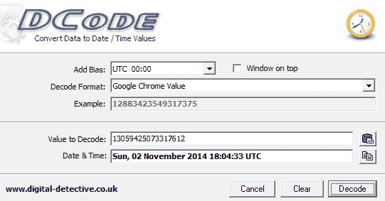

我们示例的实际值是 2014 年 11 月 2 日 18:04:33 UTC；这与我们如果以 Unix 纪元时间来解读所得到的值有显著不同！

# Google Maps 分析

Maps 是由 Google 提供的地图/导航应用程序。

**包名**： `com.google.android.apps.maps`

**感兴趣的文件**：

+   `/cache/http/`

+   `/databases/`：

    +   `gmm_myplaces.db`

    +   `gmm_storage.db`

`/cache/http` 文件夹包含许多文件，扩展名为 `.0` 和 `.1`。`.0` 文件是对应 `.1` 文件的网页请求。`.1` 文件主要是图像文件，可以通过适当更改扩展名来查看；在我们的测试设备上，它们要么是 `.jpg` 文件，要么是 `.png` 文件。这些文件主要是用户附近的位置，不一定是用户特意搜索的位置。

这是数据存储方法 4：错误命名的文件扩展名

总是验证无法打开的文件的头部，或使用 EnCase 等自动化工具检测不匹配的头部/文件扩展名。验证文件签名的好资源是 [`www.garykessler.net/library/file_sigs.html`](http://www.garykessler.net/library/file_sigs.html)。

`gmm_myplaces.db` 数据库包含用户保存的位置。这些位置与用户的 Google 账户同步，因此这些位置未必是通过该应用程序保存的。

`gmm_storage.db` 包含搜索点击和已导航至的位置：

| ** 表格** | **描述** |
| --- | --- |
| `gmm_storage_table` | `_key_pri` 列似乎标识了位置的类型，bundled 看起来是一个在搜索中出现的点击，而 `ArrivedAtPlacemark` 标识了实际导航到的位置。 `_data` 列包含了位置的地址。 |

# 谷歌即时通讯分析

Hangouts 是 Google 提供的聊天/SMS 应用程序。在 Android 设备上，Hangouts 是默认的 SMS 客户端。

**包名**：`com.google.android.talk`

**感兴趣的文件**：

+   `/cache/volleyCache/`

+   `/databases/babel#.db`（我们的设备上有 `babel0.db` 和 `babel1.db`）

+   `/shared_prefs/accounts.xml`

`cache` 目录包含 `.0` 文件，如在 Google 地图示例中讨论的那样。这些文件包含一个用于获取联系人头像的 URL，以及文件中嵌入的 JPG。访问该 URL 或从文件中切割 JPG 将恢复联系人的图片。

`babel#.db` 文件包含所有的消息数据。在我们的测试设备上，`babel0.db` 是空白的，而 `babel1.db` 包含了活跃账户的所有数据。数据库中有许多值得查看的表格：

| **表格** | **描述** |
| --- | --- |
| `conversations` | 包含会话数据。每个聊天都有一个唯一的 `conversation_id`。 `latest_message_timestamp` 是最近聊天的时间，采用 Linux epoch 格式。 `generated_name` 列列出了设备上的所有参与者，减去账户本身。 `snippet_text` 列是最近消息的内容；与 Gmail 类似，设备上不会存储整个聊天记录。 `latest_message_author_full_name` 和 `latest_message_author_first_name` 列标识了 `snippet_text` 列的作者。 `inviter_full_name` 和 `inviter_first_name` 列标识了发起会话的人。 |
| `dismissed_contacts` | 列出了曾经发消息的联系人的姓名列表。这些在应用程序内被标记为 **隐藏联系人**。 |
| `messages` | 如预期的那样，包含每个对话的详细消息历史记录。文本列包含消息内容，时间戳列是 Linux 时间戳格式的日期/时间。`remote_url` 列再次是一个 URL，用于检索消息中共享的图像，可以公开访问。`author_chat_id` 是一个值，可以与参与者表相关联，用来识别每条消息的作者。 |
| `participants` | 包含与之聊天的人的列表。包括全名、个人资料图片 URL 和一个 `chat_id` 用于在消息表中标识该人。 |

`accounts.xml` 文件有一个 `phone_verification` 字段，包含与 Google 账户关联的电话号码，当 Hangouts 配置为发送 SMS 时使用。这可能非常有用，因为通常很难获取设备的电话号码，因为它通常不存储在设备中。

# Google Keep 分析

Keep 是由 Google 提供的便签应用。它还可以用于设置提醒，提醒可以在某个特定日期/时间或用户位于指定位置时触发。

**包名**: `com.google.android.keep`

**相关文件**:

+   `/databases/keep.db`

+   `/files/1/image/original`

`/files/1/image/original` 目录包含使用应用程序拍摄的照片。便签和提醒都可以与图像相关联。

`Keep.db` 包含所有关于便签和提醒的信息。再次提到，有几个重要的表格：

| **表格** | **描述** |
| --- | --- |
| `alert` | 包含关于基于位置的提醒信息。`reminder_id` 可以与提醒表中的条目相关联。`reminder_detail` 表包含为提醒设置的纬度和经度。`scheduled_time` 是设置提醒的日期/时间，采用 Linux 时间戳格式。 |
| `blob` | 包含 `/files` 目录中图像的元数据，包括文件名和大小。`blob_id` 可以与 `blob_node` 表中的 `_id` 列相关联。 |
| `blob_node` | 包含 `/files` 目录中图像的创建时间值，采用 Linux 时间戳格式。 |
| `list_item` | 存储设备上每个便签的数据。文本列包含每个便签的完整内容。`list_parent_id` 列是每个便签的唯一值；如果多行具有相同的值，则表示它们是在同一便签内作为列表创建的。`time_created` 和 `time_last_updated` 列分别是便签的创建时间和最后一次与 Google 服务器同步的时间，采用 Linux 时间戳格式。 |
| `reminder` | 包含应用中设置的每个提醒的数据。如果提醒是基于时间的，`julian_date` 和 `time_of_day` 列将被填充。 |

# 转换 Julian 日期

儒略日类似于 Linux 纪元格式，只是从不同的日期开始。儒略日系统计算的是自公元前 4713 年 1 月 1 日中午以来的天数。美国海军天文台提供了一个优秀的儒略日计算器：[`aa.usno.navy.mil/data/docs/JulianDate.php`](http://aa.usno.navy.mil/data/docs/JulianDate.php)。要从数据库中获取儒略日，只需将两列结合在一起，中间用小数点隔开，例如：

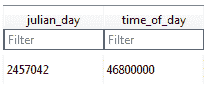

这将对应于儒略日`2457042.46800000`。当此值输入到网站时，我们可以得知设置的提醒日期是 2015 年 1 月 19 日，23:13:55.2 UT。如果设置了基于位置的提醒，`location_name`、`latitude`、`longitude`和`location_address`字段将会被填充。最后，`time_created`和`time_last_updated`字段分别表示笔记创建的时间和最后与 Google 服务器同步的时间，以 Linux 纪元时间表示。

数据存储方法 5：儒略日

# 从 Skype 恢复视频消息

如前所述，视频消息不会保存在设备上。幸运的是，我们可以通过互联网访问它们。第一步是通过查看`body_xml`列中的 Messages 表来验证视频消息是否已发送。接下来，记下该消息的`convo_id`字段：

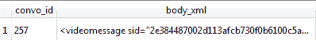

我们的视频消息在`convo_id`为`257`。

然后，在 Chats 表中查找该`convo_id`在`conv_dbid`列中的记录，并找到`dbpath`值。这将是会话备份文件的名称：

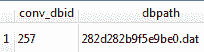

要找到备份文件，请查看`files/<用户名>/chatsync`目录。每个会话都会有一个文件夹，文件夹的名称是备份名称的前两位数字。我们的备份将位于`28`文件夹中。

在十六进制编辑器中打开备份文件，并搜索`videomessage`。你应该能找到一个 URL 和一个用于访问视频的代码：

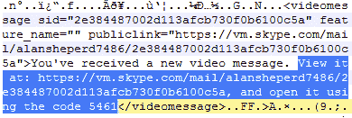

实际访问该 URL 可能需要额外的逮捕令或法律许可，这取决于当地的法律管辖区。由于这些数据不在设备上，且属于私人数据，未经法律指导访问这些数据可能会使视频中的任何证据无效。

# Google Plus 分析

Google Plus 是一个基于 Google 的社交网络。它允许分享文本/视频/图片，添加朋友，关注他人并进行消息交流。根据用户的设置，Google Plus 还可能自动上传用户设备上拍摄的所有图片。

**包名**：`com.google.android.apps.plus`

**感兴趣的文件**：

+   `/databases/es0.db`

`Es0.db`包含了调查员期望从社交媒体账户中找到的所有信息：

| **表格** | **描述** |
| --- | --- |
| `all_photos` | 包含一个 URL，用于下载用户共享或与用户共享的图像，以及以 Linux 纪元格式显示的创建日期/时间 |
| `activities` | 显示在用户动态流中的数据（即他们的新闻推送）。每个帖子的创建和修改时间再次以 Linux 纪元时间格式存储。标题和评论列将包含帖子的标题以及至少一些评论。永久链接列包含一个可以点击查看帖子的 URL（如果帖子是公开分享的）。如果帖子是私密分享的，仍然可以从嵌入表中恢复其内容。相关表包含由 Google 自动生成的与帖子的相关标签，即使帖子是私密的，也会填充这些标签。 |
| `activity_contacts` | 包含在活动表中发布的人员的姓名列表。 |
| `all_photos` | 包含用户备份到 Google Plus 的所有照片的列表，无论这些照片是否已被分享。`image_url` 可用于下载用户的任何照片，并且是公开可用的。删除 URL 末尾的 `-d` 可以在不下载的情况下查看图片。时间戳列是图片被 *拍摄* 的日期/时间，基于图片的元数据；它不表示图片上传的时间。 |
| `all_tiles` | 包含 `all_photos` 的一个未知子集，还包括用户共享的图像。 |
| `circle_contact` | 包含用户已添加到其圈子中的人员列表。不包含姓名，但一些 `link_person_id` 值包含电子邮件地址。`link_circle_id` 值可以与圈子表关联，以识别每个圈子的名称。然后，`link_person_id` 可以与联系人表关联，以识别每个用户属于哪个圈子。 |
| `circles` | 包含用户创建的所有圈子，以及每个圈子的成员数量。 |
| `contacts` | 用户圈子中的所有联系人列表。 |
| `events` | 用户被邀请的所有事件的列表，无论是否参加。名称列是事件的标题。`creator_gaia_id` 可以与联系人表中的 `gaia_id` 列关联，以识别事件的创建者。`start_time` 和 `end_time` 列表示事件的开始时间和结束时间，采用 Linux 纪元格式。`event_data` 列包含创建者输入的事件描述，以及如果有添加的地点信息。还列出了所有其他被邀请参加事件的用户。 |
| `squares` | 用户加入的群组列表。 |

# Facebook 分析

Facebook 是一款社交媒体应用，已在 Google Play 上被下载超过 10 亿次。

**包名**: `com.facebook.katana`

**感兴趣的文件**：

+   `/files/video-cache/`

+   `/cache/images/`

+   `/databases/`

    +   `bookmarks_db2`

    +   `contacts_db2`

    +   `nearbytiles_db`

    +   `newsfeed_db`

    +   `notifications_db`

    +   `prefs_db`

    +   `threads_db2`

`/files/video-cache` 目录包含来自用户新闻推送的视频，但似乎没有办法将这些视频与发布它们的用户关联起来。

`/cache/images` 目录包含来自用户新闻源的图片，以及联系人个人资料照片。该目录包含多个其他子目录（我们测试的手机上有 65 个），每个子目录可以包含多个 `.cnt` 文件。`.cnt` 文件通常是 JPG 文件或其他图像格式。

`bookmarks_db2` 数据库是显示在用户新闻源侧边的项目列表，如群组和应用程序。许多这些书签是 Facebook 自动生成的，但也可以由用户创建。

| **表格** | **描述** |
| --- | --- |
| bookmarks | 包含数据库中的所有信息。`bookmark_name` 列是显示给用户的书签名称。`bookmark_pic` 列包含一个可以公开访问的 URL，用于查看显示给用户的书签图标。`bookmark_type` 列标识组的类型；我们的测试显示包括 `profile`、`group`、`app`、`friend_list`、`page` 和 `interest_list`。最后，`bookmark_unread_count` 列显示该组中用户未读的消息数量。 |

`contacts_db2` 数据库，顾名思义，包含所有用户联系人的信息：

| **表格** | **描述** |
| --- | --- |
| `contacts` | 包含关于用户所有联系人信息。`fbid` 列是唯一标识符，用于在其他数据库中标识该联系人。`first_name`、`last_name` 和 `display_name` 列显示联系人的姓名。`small_picture_url`、`big_picture_url` 和 `huge_picture_url` 包含联系人个人资料照片的公共链接。`communication_rank` 似乎是一个数字，表示该联系人与用户之间的沟通频率（考虑了消息、评论，可能还有其他因素）；较高的数字表示与该联系人的沟通频率较高。`added_time_ms` 显示联系人作为朋友被添加的时间（以 Linux 纪元格式表示）。`bday_day` 和 `bday_month` 列显示联系人的生日日期，但不包括年份。`data` 列包含数据库中其他所有数据的副本，还包含联系人位置，这是数据库中其他地方找不到的。 |

`nearbytiles_db` 是一个包含用户附近可能感兴趣的位置的数据库；显然，这个数据库会持续更新，即使用户没有查看这些位置。这个数据库很有趣，因为，虽然它不是精确的位置（我们的大部分测试显示的地点距离我们的位置大约 6-10 英里），但它提供了一个粗略的用户活动区域：

| **表格** | **描述** |
| --- | --- |
| `nearby_tiles` | 包含用户附近位置的纬度和经度值，以及从 Facebook 服务器获取该位置的时间（以 Linux 纪元格式表示）。 |

`newsfeed_db` 包含显示在用户新闻源中的数据。根据应用程序的使用情况，它可能是一个非常大的文件：

| **表格** | **描述** |
| --- | --- |
| `home_stories` | `fetched_at` 列显示故事从 Facebook 服务器拉取的时间，通常与用户使用应用程序或查看故事的时间非常接近。`story_data` 列包含故事，作为数据块存储。当在十六进制或文本编辑器中查看时，可以找到发布故事的用户名。帖子内容也可以以纯文本形式找到，并且通常会以 `text` 标签作为前缀。下面是一个示例： |

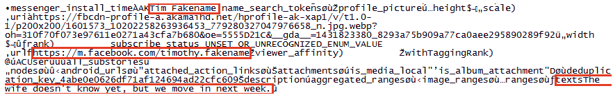

请注意，`story_data` 列中的这个单元格的实际内容包含超过 10,000 字节的数据，尽管实际消息只有大约 50 字节。

`notifications_db` 包含发送给用户的通知：

| **表格** | **描述** |
| --- | --- |
| `gql_notifications` | `seen_state` 列显示通知是否已被查看和阅读。更新列包含通知更新的时间（即如果未读则为发送时间，或者为阅读时间），以 Linux 时间戳格式显示。`gql_payload` 列包含通知的内容以及发送者，类似于 `newsfeed_db` 中的 `story_data` 列。消息内容通常会以 `text` 标记为前缀。少量数据（显示通知文本）可以在 `summary_graphql_text_with_entities` 和 `short_summary_graphql_text_with_entities` 列中找到。`profile_picture_uri` 包含一个公共 URL，用于查看发送者的个人资料图片，而 `icon_url` 列则有一个链接，用于查看与通知相关的图标。 |

`prefs_db` 数据库包含应用程序偏好设置：

| **表格** | **描述** |
| --- | --- |
| `preferences` | `/auth/user_data/fb_username` 行显示用户的 Facebook 用户名。`/config/gk/last_fetch_time_ms` 值是应用程序最后一次与 Facebook 服务器通信的时间戳，但可能不是用户最后一次与应用程序互动的确切时间。`/fb_android/last_login_time` 显示用户通过应用程序登录的最后时间。数据库中包含许多其他时间戳，当这些时间戳组合在一起时，可以用来构建一个不错的应用使用情况档案。`/auth/user_data/fb_me_user` 包含关于用户的数据，包括他们的姓名、电子邮件地址和电话号码。 |

`threads_db` 数据库包含消息信息：

| **表格** | **描述** |
| --- | --- |
| `messages` | 每条消息在 `msg_id` 列中都有一个唯一的 ID。文本列包含消息的纯文本。发送者列标识消息发送者的 Facebook ID 和姓名。`timestamp_ms` 列是消息发送的时间，采用 Linux 时间戳格式。附件列包含一个公共 URL，用于检索附加的图片。坐标列将显示发送者的经纬度，如果他们选择显示位置的话。来源列标识消息是通过网站还是应用程序发送的。 |

# Facebook Messenger 分析

Facebook Messenger 是一款独立于主 Facebook 应用程序的消息应用。它在 Play Store 上的下载量超过 5 亿。

**包名**: `com.facebook.orca`

**感兴趣的文件**：

+   `/cache/`

    +   `audio/`

    +   `fb_temp/`

    +   `image/`

+   `/sdcard/com.facebook.orca`

+   `` `/files/ rti.mqtt.analytics.xml` ``

+   `/databases/`

    +   `call_log.sqlite`

    +   `contacts_db2`

    +   `prefs_db`

    +   `threads_db2`

`/cache/audio` 目录包含通过应用程序发送的音频消息。这些文件的扩展名为 `.cnt`，但实际上是 RIFF 文件，可以使用 Windows Media Player、VLC 媒体播放器等程序播放。

`/cache/fb_temp` 路径包含通过应用程序发送的图片和视频的临时文件。文件将保留多久尚不明确；在我们的测试中，我们发送和接收了共五个文件，且一周后所有五个文件仍然保留在临时文件夹中。

`/cache/image` 目录包含许多其他目录（我们测试的手机上有 33 个），每个目录可以包含多个 `.cnt` 文件。应验证每个文件的文件头，因为其中一些是视频文件，另一些是图片。我们找到了几个来自 `fb_temp` 文件夹的文件，以及一些联系人的头像。

SD 卡上的 `fb_temp` 文件夹仅包含已发送的图片和视频。

该应用程序还包括一个选项（默认情况下禁用），用于将所有接收到的图片/视频下载到设备的图库中。如果选择此选项，所有接收到的图片/视频将出现在 SD 卡上。

`/files/rti.mqtt.analytics.xml` 文件包含用户的 Facebook UID。

`call_log.sqlite` 数据库包含通过应用程序进行的通话记录。`person_summary` 表包含相关数据：

| **表格** | **描述** |
| --- | --- |
| `person_summary` | `user_id` 列包含远程用户的 Facebook ID；可以通过与 `contacts_db2` 中的 `fbid` 列关联来确定该用户的名字。`last_call_time` 列包含上次通话的时间，采用 Linux 时间戳格式。此表不包含通话方向的信息（发送或接收）。 |

`contacts_db2` 文件是一个 SQLite 数据库，尽管没有文件扩展名。该数据库中有用的表包括：

| **表格** | **描述** |
| --- | --- |
| `contacts` | 此表包括用户添加的联系人，以及从用户手机簿中抓取的联系人（如果手机簿联系人使用 Facebook Messenger）。它包含每个联系人的名字和姓氏，以及该联系人的 Facebook ID（如在 `call_log.sqlite` 表中讨论）。`added_time_ms` 显示每个用户添加到应用程序的时间。这可以一定程度上揭示联系人是手动添加还是自动添加；在几毫秒内添加的大量联系人很可能是在应用程序安装时自动创建的。`small_picture_url`、`big_picture_url` 和 `huge_picture_url` 列包含联系人公开的个人资料图片链接。联系人的电话号码可以在数据列中的信息块中找到。需要注意的是，我们不知道此数据库中的某些联系人来源。他们不是我们 Facebook 账户的好友，也不是设备电话簿中的联系人，但是在抓取电话簿时被添加进来。我们最好的猜测是我们电话中的一些联系人具有 Facebook 关联到其他用户的电话号码。 |
| `favorite_contacts` | `favorite_contacts` 表显示用户添加为收藏的联系人。它们由 `fbid` 列标识，可以与联系人表关联。 |

`prefs_db` 数据库包含有关应用程序和账户的有用元数据：

| **表格** | **描述** |
| --- | --- |
| `preferences` | `/messenger/first_install_time` 值表示应用程序的安装时间，以 Linux 纪元时间为准。`/auth/user_data/fb_username` 值显示与应用程序关联的用户名。`/config/neue/validated_phonenumbe`r 值显示与应用程序关联的电话号码。用户的名字和姓氏可以在 `/auth/user_data/fb_me_user` 值中找到。 |

最后，`threads_db2` 数据库包含有关消息的数据：

| **表格** | **描述** |
| --- | --- |
| `group_clusters` | 显示用户创建的文件夹。 |
| `group_conversations` | 包含每个群组聊天的 `thread_key` 值；这可以与消息表相关联。 |
| `messages` | `thread_key` 是为每个聊天会话生成的唯一 ID。文本列包含发送和接收的每条短信的内容。这也通过 `You called Facebook User.`、`Facebook User called you.` 和 `You missed a call from Facebook User` 这些短语来标识语音电话。发送者列标识每条消息（或每个电话）的发送者。`timestamp_ms` 列显示每条消息的发送时间，采用 Linux 时间戳格式。附件列将显示每个发送或接收的附件的数据，文件类型也可以在数据中看到。`pending_send_media_attachment` 显示设备上用于恢复已发送附件的路径。直接找到接收到的附件似乎是不可能的，尽管它们在 `/cache/images` 目录中被恢复，但没有办法将它们与特定的消息或发送者相关联。 |

# Skype 分析

Skype 是一个语音/视频通话应用程序，也是一个由微软拥有的消息应用程序，在 Google Play 上已有超过 1 亿次安装。

**包名**：`com.skype.raider`

**关注的文件**：

+   `/cache/skype-4228/DbTemp`

+   `/sdcard/Android/data/com.skype.raider/cache/`

+   `/files/`

    +   `shared.xml`

    +   `<username>/thumbnails/`

    +   `<username>/main.db`

    +   `<username>/chatsync`

`/cache/skype-4228/DbTemp` 目录包含多个没有扩展名的文件。我们设备中的一个文件（`temp-5cu4tRPdDuQ3ckPQG7wQRFgU`）实际上是一个 SQLite 数据库，包含它曾连接过的无线接入点的 SSID 和 MAC 地址。

SD 卡路径将包含在聊天中接收到的任何图片或文件。如果下载了文件，它将保存在 SD 卡根目录下的 Downloads 文件夹中。

`shared.xml` 文件列出了账户的用户名，以及最后一次连接到 Skype 的 IP 地址：

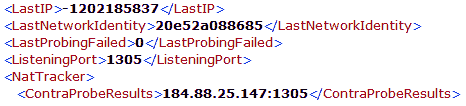

`<username>/thumbnails` 目录包含用户的个人资料图片。

`main.db` 数据库，顾名思义，包含所有应用的使用历史记录。以下是一些重要的表格：

| **表格** | **描述** |
| --- | --- |
| `Accounts` | 显示设备上使用的账户以及相关联的电子邮件地址。 |
| `CallMembers` | 应用的通话记录。持续时间表是通话的时长，`start_timestamp` 是通话开始的时间，采用 Linux 时间戳格式；如果通话未接听，这两列都不会被填充。`creation_timestamp` 是通话的实际开始时间；它会在通话在应用中启动时立即填充，因此即使通话没有接听，仍然会显示在这一列中。`ip_address` 列显示连接通话时用户的 IP 地址。类型列指示通话是拨出还是接入（1 = 接入，2 = 拨出）。`guid` 列也显示通话方向，列出每个参与者从左到右，左侧的用户为发起通话的用户。`call_db_id` 列可以与通话表进行关联，找到有关通话的更多信息。 |
| `Calls` | 与 `CallMembers` 非常相似，但信息较少。值得注意的是，此表中的 `begin_timestamp` 列与 `CallMembers` 中的 `creation_timestamp` 相同。还有一个 `is_incoming` 列显示通话的方向：0 表示外呼，1 表示接听。最后需要注意的是，某些通话的时长与 `CallMembers` 表中的数据不匹配。一个时长比另一个表中显示的多了一秒钟。看起来 `CallMembers` 表是根据 `start_timestamp` 计算通话时长，而 `Calls` 表是根据 `begin_timestamp` 计算时长。时长差异可能是由于用户接受通话所花费的时间。 |
| `ChatMembers` | 显示每个聊天中的用户。`adder` 列列出了发起聊天的用户。 |
| `Chats` | 列出了每个独特的聊天会话。时间戳列是对话开始的日期/时间，采用 Linux 时间戳格式。`dialog_partner` 列显示聊天中的用户，不包括设备上的账号。`posters` 表显示每个在聊天中发表评论的用户，如果设备上的账号有发表内容，也会包括在内。`participants` 列与 `dialog_partner` 列类似，但包括用户的账号。最后，`dbpath` 列包含存储在 `<username>/chatsync` 目录中的聊天备份文件的名称。这个信息在本分析中将会变得非常重要。 |
| `Contacts` | 这是一个非常误导的表。在我们的测试中，我们将两个用户添加到联系人列表中，但 `Contacts` 表却有 233 条记录！`is_permanent` 列表示该表中列出的用户状态；如果为 1，则表示该用户被作为实际联系人添加到应用中。其他 231 条记录似乎是我们在搜索联系人时出现的名字，但我们并未与这些人进行过沟通或添加为联系人。 |
| `Conversations` | 我们不清楚 `Conversations` 和 `Chats` 之间的区别。它们包含了几乎相同的信息，实际上似乎指向相同的聊天会话。 |

| `Messages` | 包含每一条来自聊天/对话的单独消息。`convo_id` 列为每个对话提供唯一的值；任何具有相同 `convo_id` 值的消息都来自同一对话。`author` 和 `from_dispname` 列显示每条消息的作者。时间戳列再次显示消息的日期/时间，采用 Linux 时间戳格式。`type` 列表示发送的消息类型；以下是我们测试时的值：

+   **50**: 好友请求

+   **51**: 请求已接受

+   **61**: 纯文本消息

+   **68**: 文件传输

+   **30**: 通话开始（语音或视频）

+   **39**: 通话结束（语音或视频）

+   **70**: 视频消息

`body_xml` 列包含消息的内容。对于纯文本消息和好友请求，内容就是消息的文字。文件传输显示文件的大小和名称。视频消息则显示它是视频消息，但不提供其他信息。通话记录显示如果通话已接通则显示时长，如果通话未接或被忽略则不显示时长。身份列显示每条消息的发送者，如果是设备上的用户账户发送的消息，可能为空。原因列似乎是用于通话，显示 `no_answer` 或 `busy` 来解释为什么通话未接通。

| `Participants` | 与 `ChatMembers` 类似，显示每个参与聊天/对话的用户。 |
| --- | --- |
| `SMSes` | 我们的测试没有包括 SMS 消息；然而，这张表中的每一列都是自解释的。 |
| `Transfers` | 显示已传输文件的信息，包括文件名、大小和设备上的路径。`partner_dispname` 列显示开始文件传输的用户。 |
| `VideoMessages` | 显示视频消息的作者和创建时间戳。请注意，视频消息不会存储在设备上；获取它们的方式将在下文的另一个部分介绍。 |
| `VoiceMails` | 我们的测试没有包括语音邮件；然而，这张表中的每一列看起来都是自解释的。 |

# Snapchat 分析

Snapchat 是一款图片分享和文本消息服务，下载量超过 1 亿次。它的标志性特点是，用户发送的图片和视频会在发送者设定的时间限制（1-10 秒）后“自毁”。此外，如果用户截取了图片的屏幕截图，发送者会收到通知。文本聊天没有过期计时器。

**包名**: `com.snapchat.android`

**相关文件**:

+   `/cache/stories/received/thumbnail/`

+   `/sdcard/Android/data/com.snapchat.android/cache/my_media/`

+   `/shared_prefs/com.snapchat.android_preferences.xml`

+   `/databases/tcspahn.db`

`/cache/stories/received/thumbnail` 包含用户在设备上拍摄的图片的缩略图。`/sdcard` 路径包含完整尺寸的图片。即使时间限制已过且接收者无法再访问这些图片，它们仍然会保留。这些位置的文件可能没有正确的文件扩展名。

`com.snapchat.android_preferences.xml` 文件包含用于创建账户的电子邮件地址以及与账户注册的设备的电话号码。

`tcspahn.db` 数据库包含关于应用程序使用的所有其他信息。

| **表格** | **描述** |
| --- | --- |
| `Chat` | 列出所有文本聊天。显示发送者、接收者、Linux 时间戳以及消息的文字内容。 |
| `ContactsOnSnapchat` | 显示用户电话簿中也安装了 Snapchat 的所有联系人。`isAddedAsFriend` 列如果用户已被添加为联系人，则会显示 1。 |
| `Conversation` | 包含每个打开对话的信息。包括发送方和接收方，以及最后发送和接收快照的时间戳（Linux 纪元格式）。 |
| `Friends` | 类似于`ContactsOnSnapchat`，但仅包括已添加为朋友的用户。包含每个用户添加另一个用户的时间戳。 |
| `ReceivedSnaps` | 接收到的图片和视频的元数据。一旦图片/视频被查看，它似乎在某个时刻从此表中移除。包含每条消息的时间戳、状态、是否截图以及发送方。 |
| `SentSnaps` | 发送的图片和视频的元数据。一旦图片/视频被查看，它似乎在某个时刻从此表中移除。包含每条消息的时间戳、状态和接收方。 |

# Viber 分析

Viber 是一款消息和语音/视频通话应用，下载量超过 1 亿。

**包名**：`com.viber.voip`

**相关文件**：

+   `/files/preferences/`

    +   `activated_sim_serial`

    +   `display_name`

    +   `reg_viber_phone_num`

+   `/sdcard/viber/media/`

    +   `/User Photos/`

    +   `/Viber Images/`

    +   `/Viber Videos/`

+   `/databases/`

    +   `viber_data`

    +   `viber_messages`

`/files/preferences`中的文件包含 SIM 卡的 ICCID、用户在应用中显示的名称以及用于注册应用的电话号码。

`/sdcard/viber/media`路径中的文件是用户联系人列表中使用 Viber 的人的个人资料照片（无论是否已经在应用中添加为朋友），以及通过该应用发送的所有图片和视频。

`viber_data`文件是一个数据库，尽管它没有`.db`文件扩展名。它包含有关用户联系人信息：

| **表格** | **描述** |
| --- | --- |
| `calls` | 这个表没有填充数据，尽管我们从应用中拨打了电话。 |
| `phonebookcontact` | 从法医角度来看，这个表格可能非常有价值。当 Viber 首次打开时，它会抓取用户的电话簿并将找到的所有条目添加到此数据库中。这意味着它可能包含关于用户联系人历史数据；如果用户稍后从电话簿中删除了某个条目，它可能仍然能在这个数据库中恢复。此表格仅包括电话簿中联系人的姓名。 |
| `phonebookdata` | 类似于电话簿联系人，但还包括设备电话簿中联系人的电子邮件地址和电话号码。 |
| `vibernumbers` | 显示设备电话簿中每个联系人使用 Viber 应用的电话号码。`actual_photo`中的值对应于`/sdcard/viber/media/User/ Photos`目录中的文件名。 |

`viber_messages`文件是一个数据库，尽管它没有`.db`文件扩展名。它包含关于应用使用的信息：

| **表格** | **描述** |
| --- | --- |
| `conversations` | 包含每个唯一对话的唯一 ID、接收方和日期。 |
| `messages` | 包含所有对话中的每条单独消息。地址是远程方的电话号码。日期列为 Unix 时间戳格式。类型列对应于消息的方向：1 表示发送消息，0 表示接收消息。如果共享了位置，`location_lat` 和 `location_lng` 列将被填充。共享的文件可以附带描述性文字；这些信息在描述列中找到。 |
| `messages_calls` | 这个表格没有被填充，即使我们从应用内进行了通话。 |
| `participants_info` | 包含与用户进行过对话的每个账户的个人资料信息。 |

# Tango 分析

Tango 是一款语音/文本/视频消息应用，已在 Play Store 上拥有超过 1 亿次下载。

**包名**: `com.sgiggle.production`

这个包名看起来无害，可能会被检查人员误认为是一个游戏。这是每个应用都应该进行分析的原因之一。

**感兴趣的文件**：

+   `/sdcard/Android/data/com.sgiggle.production/files/storage/appdata/`

    +   `TCStorageManagerMediaCache_v2/`

    +   `conv_msg_tab_snapshots/`

+   `/files/`

    +   `tc.db`

    +   `userinfo.xml.db`

`/TCStorageManagerMediaCache_v2` 路径在 SD 卡中包含了通过应用发送和接收的图片，以及联系人头像。然而，它也包含了许多从未在应用中查看或使用的图片；这些图片看起来要么是广告图片，要么是可以附加到对话中的表情符号类型的图片。可以通过与 `tc.db` 关联，找到在对话中使用的具体图片。

`conv_msg_tab_snapshots` 路径在 SD 卡中包含扩展名为 `.dat` 的文件。当在十六进制编辑器中查看时，我们能够找到部分明文的对话片段，以及发送和接收的图片路径和 URL。尚不清楚是什么原因导致这些文件的存在，但可能可以从这些文件中恢复在 `tc.db` 中已删除的内容。

`tc.db` 数据库是 Tango 用来存储所有消息信息的：

| **表格** | **描述** |
| --- | --- |
| `conversations` | 每个对话在 `conv_id` 列中有唯一标识。 |

| `messages` | 包含通过应用发送和接收的消息。`msg_id` 列是每条消息的唯一标识，`conv_id` 列标识消息来自哪个对话。`send_time` 列标识消息发送或接收的时间，取决于消息的方向。方向列显示消息的方向：1 = 发送，2 = 接收。类型列标识消息的类型；根据我们的测试，类型如下：

+   **0**: 明文消息

+   **1**: 视频消息

+   **2**: 语音消息

+   **3**: 图片

+   **4**: 位置/坐标

+   **35**: 语音通话

+   **36**: 尝试过的语音通话（双方均未接听）

+   **58**: 附带的股票图片，例如在 `TCStorageManagerMediaCache_v2` 路径下找到的表情符号

最后，负载列包含了消息的内容……可以这么说。这些数据是 Base64 编码的，下面会详细讨论。|

`user_info_xml.db` 包含有关账户的元数据，例如用户的姓名和电话号码。然而，它的数据完全是 Base64 编码的，就像 `tc.db` 中的消息一样。

数据存储方法 6：Base64

# 解码 Tango 消息

Base64 是一种常用于数据传输的编码方案；它不被视为加密，因为它有一个已知的解码方法，并且不需要唯一的密钥来解码数据。Base64 包含可打印的 ASCII 字符，但底层数据是二进制的（这会使我们的输出稍显杂乱！）。来自 tc.db 中消息表的负载列示例如下：

```
EhZtQzVtUFVQWmgxWnNRUDJ6aE44cy1nGAAiQldlbGNvbWUgdG8gVGFuZ28hIEhlcmUncyBob3cgdG8gY29ubmVjdCwgZ2V0IHNvY2lhbCwgYW5kIGhhdmUgZnVuIYABAKoBOwoFVGFuZ28SABoWbUM1bVBVUFpoMVpzUVAyemhOOHMtZyILCgcKABIBMRoAEgAqADD///////////8BsAHYioX1rym4AYKAgAjAAQHQAQDoAdC40ELIAgTQAgDqAgc4MDgwODg5yAMA2AMA2AXTHw==
```

注意我们消息末尾的等号；这是一个强烈的指示符，表明数据是 Base64 编码的。需要被编码的输入必须能够被 3 整除，以便 Base64 背后的数学方法能够正常工作。如果输入不能被 3 整除，它会被填充，导致输出中出现等号。

例如，考虑以下表格：

| **输入字符串** | **字符/字节数** | **输出** |
| --- | --- | --- |
| `Hello, World` | `12` | `SGVsbG8sIFdvcmxk` |
| `Hello, World!` | `13` | `SGVsbG8sIFdvcmxkIQ==` |
| `Hello, World!!` | `14` | `SGVsbG8sIFdvcmxkISE=` |

你可以看到，12 字节的输入（可被 3 整除）没有填充，而另外两个输入则有填充，因为它们不能被 3 整除。这一点很重要，因为它表明，虽然等号是 Base64 的强烈指示符，但没有等号并不意味着它就不是 Base64！

现在我们对 Base64 有了一定了解，并且认识到我们的负载列很可能是以 Base64 编码的，我们需要对其进行解码。有一些网站允许用户粘贴编码后的数据，并将其解密（例如：[www.base64decode.org](http://www.base64decode.org)），但对于大量数据来说，这种方式不太方便，因为每条消息必须单独输入（而且在大多数情况下，将证据数据上传到互联网上也是不被推荐的）。同样，也可以在基于 Linux 的系统的命令行中解码，但对于大量数据同样不太方便。我们的解决方案是构建一个 Python 脚本，从数据库中提取 Base64 数据，解码后再写入到一个新文件中：

```
import sqlite3
import base64
conn = sqlite3.connect('tc.db')
c = conn.cursor()
c.execute('SELECT msg_id, payload FROM messages')
message_tuples = c.fetchall()
with open('tcdb_out.txt', 'w') as f:
   for message_id, message in message_tuples:
         f.write(str(message_id) + '\x09')
         f.write(str(base64.b64decode(message)) + '\r\n')
```

要运行该代码，只需将此代码粘贴到一个新文件中，命名为 `tcdb.py`，将脚本与 `tc.db` 放在同一目录下，然后在命令行中导航到该目录并运行以下命令：

```
python tcdb.py
```

脚本将在同一目录下生成名为 `tcdb_out.txt` 的文件。用文本编辑器打开该文件（或将其导入到 Excel 中作为制表符分隔的文件）将显示 `msg_id` 值，以便检查员可以将消息与消息表关联，并且解码后的有效载荷显示为明文消息（在数据库中标注为类型 0）：

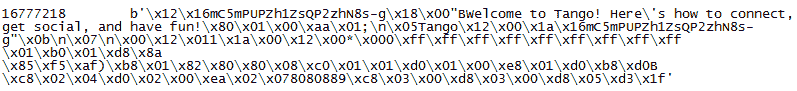

请注意，现在消息内容以明文形式显示，并且前面是会话 ID。输出中还有大量的二进制数据，这很可能是 Tango 使用的元数据或其他信息。如果消息是收到的，用户的姓名也会出现在输出中（这里是 Tango）。

还有其他类型的消息值得查看。这里是视频消息的解码有效载荷条目：

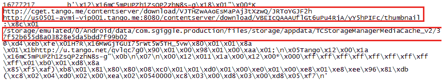

请注意，在视频消息中，我们可以看到两个网址。它们都是公开的，意味着任何拥有链接的人都可以访问它们。以缩略图结尾的 URL 是视频的缩略图，而另一个 URL 将下载完整的视频，格式为 MP4。还显示了 SD 卡路径和图像文件名。

图片和音频消息以非常相似的格式存储，包含查看或下载文件的 URL，以及 SD 卡上的文件路径。

这是一个示例位置消息：

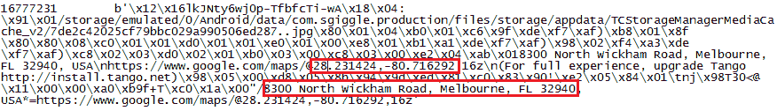

这一次，我们可以看到用户的确切坐标以及地址。同样，SD 卡路径也存在，并将显示该位置的地图视图。与其他消息类型一样，收到的消息也会显示发送者的姓名。

最后，让我们来看一下 `userinfo.xml.db` 数据库。以下是解码之前它的样子：

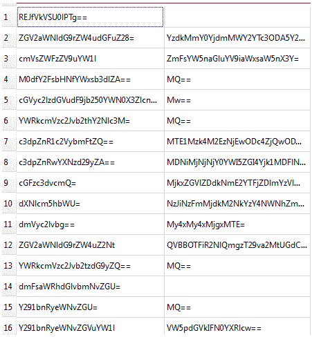

我们编写了另一个与第一个非常相似的脚本，用于解析 `userinfo.xml.db` 数据库：

```
import sqlite3
import base64
conn = sqlite3.connect('userinfo.xml.db')
c = conn.cursor()
c.execute('SELECT key, value FROM profiles')
key_tuples = c.fetchall()
with open('userinfo_out.txt', 'w') as f:
   for key, value in key_tuples:
         if value == None:
               value = 'Tm9uZQ=='
         f.write(str(base64.b64decode(key)) + '\x09')
         f.write(str(base64.b64decode(value)) + '\r\n')
```

唯一的不同之处在于文件名、表名和数值发生了变化，并且这一次数据库中的两列都进行了 base64 编码。再次提醒，可以通过将其放在与 `userinfo.xml.db` 相同的位置并运行以下命令来执行它：

```
python userinfo.py
```

这是结果文件中相关部分的输出，显示了用户用于注册帐户的个人数据：

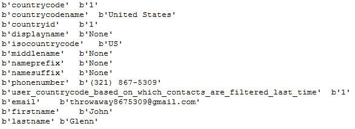

在输出的进一步部分，还有一个列表，列出了所有使用 Tango 的用户联系人，包括联系人的姓名和电话号码。

# WhatsApp 分析

WhatsApp 是一款流行的聊天/视频消息服务，在 Google Play 上已有超过 5 亿次下载。

**包名**: `com.whatsapp`

**感兴趣的文件**：

+   `/files/`

    +   `Avatars/`

    +   `me`

    +   `me.jpeg`

+   `/shared_prefs/`

    +   `RegisterPhone.xml`

    +   `` `VerifySMS.xml` ``

+   `/databases/`

    +   `msgstore.db`

    +   `wa.db`

+   `/sdcard/WhatsApp/`

    +   `Media/`

    +   `Databases/`

`/files/avatars` 目录包含使用该应用程序的联系人头像的缩略图，而 `me.jpg` 是用户头像的全尺寸版本。该 `me` 文件包含与账户关联的电话号码。

与账户关联的电话号码也可以在 `/shared_prefs/RegisterPhone.xml` 中恢复。`/shared_prefs/VerifySMS.xml` 文件显示账户验证的时间（当然是 Unix 纪元格式），指示用户首次开始使用该应用的时间。

`msgstore.db` 数据库，顾名思义，包含消息数据：

| **表格** | **描述** |
| --- | --- |
| `chat_list` | `key_remote_jid` 列显示用户与之沟通过的每个账户；表中的值是远程用户的电话号码。例如，如果值是 `13218675309@s.whatsapp.net`，那么远程用户的号码就是 `1-321-867-5309`。 |
| `group_participants` | 包含群聊的元数据。 |
| `messages` | 显示所有消息数据。再次强调，`key_remote_jid` 字段标识远程发送者。`key_from_me` 值表示消息的方向（0=接收，1=发送）。数据列包含消息文本，时间戳是发送或接收的时间，采用 Linux 纪元格式。对于附件，`media_mime_type` 标识文件格式；`media_size` 和 `media_name` 列应该不言而喻。如果附件有标题，文本将显示在 `media_caption` 列中。如果附件是位置，纬度和经度列将相应填充。`thumb_image` 列包含大量无用数据，但也包含设备上附件的路径。`raw_data` 列包含图片和视频的缩略图。 |

`wa.db` 数据库用于存储联系人信息：

| **表格** | **描述** |
| --- | --- |
| `wa_contacts` | 和其他应用一样，WhatsApp 会抓取并存储用户的整个电话簿，并将信息存储在自己的数据库中。它包含联系人的姓名和电话号码，以及该联系人是否是 WhatsApp 用户的状态。 |

SD 卡是 WhatsApp 数据的宝藏。`/sdcard/WhatsApp/Media` 文件夹包含每种类型媒体的文件夹（音频、通话、图片、视频和语音笔记），并将该类型的所有附件存储在该文件夹中。发送的媒体存储在一个名为 Sent 的目录中。接收的媒体则直接存储在文件夹的根目录下。

`Databases` 目录是一个更大的信息源。WhatsApp 每晚都会备份 `msgstore.db`，并将备份存储在这里。这使得检查人员能够查看可能已被删除的历史数据；如果我今天删除了一条聊天记录，但你查看昨天的备份，你将能够访问我删除的数据。该应用程序甚至贴心地将日期包含在文件名中，例如：`msgstore-2018-12-12.1.db.crypt12`。唯一的问题是这些备份是加密的！

# 解密 WhatsApp 备份

幸运的是，现有工具可以用来解密备份。它可以在此找到，并附有详细的说明：[`andreas-mausch.de/whatsapp-viewer/`](https://andreas-mausch.de/whatsapp-viewer/)。WhatsApp Viewer 可以用来解密不同版本的加密 WhatsApp 数据库。在此示例中，我们将解密其最新版本`.crypt12`：

1.  转到文件 | 解密 .crypt12….

1.  选择加密的数据库文件和密钥文件（可以在`/files`目录中找到）：

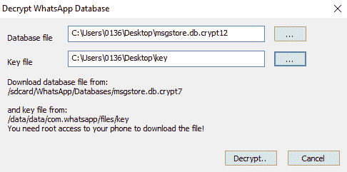

1.  点击“解密…”按钮并选择解密后的数据库文件位置。

数据存储方式 7：加密文件

# Kik 分析

Kik 是一个即时通讯应用，已在 Play 商店下载超过 1 亿次。

**包名**：`kik.android`

**感兴趣的文件**：

+   `/cache/`

    +   `chatPicsBig/`

    +   `contentpics/`

    +   `profPics/`

+   `/files/staging/thumbs`

+   `/shared_prefs/KikPreferences.xml`

+   `/sdcard/Kik/`

+   `/databases/kikDatabase.db`

`/cache`中的`chatPicsBig`和`contentpics`目录包含在应用中发送和接收的图像。`contentpics`中的文件包含看似嵌入在图像之前的`Kik`元数据；JPG 文件必须从这些文件中提取出来。在我们的测试中，`contentpics`中的所有文件也存储在`chatPicsBig`中，尽管随着应用使用的增加，情况可能会发生变化。用户的个人资料图片位于`/profPics`目录中。

数据存储方式 8：基本隐写术；一个文件存储在一个更大的文件中。

`/files/staging/thumbs`目录包含发送和接收图像的缩略图；我们的测试发现该位置的图像与`/cache`目录中的图像相同，但同样地，随着应用使用的增加，情况可能会有所不同。

`/shared_prefs`中的`KikPreferences.xml`文件显示了用户在应用中使用的用户名和电子邮件地址。有趣的是，它还包含用户密码的未加盐 SHA1 哈希值。

`/sdcard/Kik`目录包含在应用中发送和接收的全尺寸图像。文件名可以与`kikDatabase.db messagesTable`中的数据进行关联，以识别包含图像的消息。

`kikDatabase.db`数据库包含来自应用的所有消息数据：

| **表格** | **描述** |
| --- | --- |
| `KIKContentTable` | 该表格包含已发送和接收图像的元数据。每条消息都分配有一个唯一的`content_id`值，该值与`sdcard/Kik`目录中的文件名相对应。每张图像的预览和图标值对应于`/files/staging/thumbs`中的文件名。每张图像还包含一个`file-url`值；这是一个公共 URL，可以用来查看该文件。 |
| `KIKcontactsTable` | 该表显示了每个联系人对应的`user_name`和`display_name`。`in_roster`值似乎是为用户明确添加的联系人设置的（如果值为`1`）；`in_roster`值为 0 的联系人似乎是自动添加的。`jid`列是每个联系人的唯一值。 |
| `messagesTable` | 该表包含了通过应用发送和接收的所有消息数据。`body`列显示了消息中发送的文本数据。`partner_jid`值可以与`KIKcontactTable`中的`jid`列关联，识别远程用户。`was_me`列用于表示消息的方向（`0` = 发送，`1` = 接收）。`read_state`列显示消息是否已读（`500` = 已读，`400` = 未读）。时间戳仍然以 Linux 纪元格式表示。`content_id`列填充了消息附件，可以与`KIKContentTable`关联以获取更多信息。 |

# 微信分析

微信是一款在 Play 商店下载超过 1 亿次的消息应用。

**包名**：`com.tencent.mm`

请注意，这些路径中有些包含星号（*）。这表示一个唯一的字符串，每个账户都会不同。我们的设备在星号位置使用了`7f804fdbf79ba9e34e5359fc5df7f1eb`。

**关注的文件**：

+   `/files/host/*.getdns2`

+   `/shared_prefs/`

    +   `com.tencent.mm_preferences.xml`

    +   `system_config_prefs.xml`

+   `/sdcard/tencent/MicroMsg/`

    +   `diskcache/`

    +   `WeChat/`

+   `/sdcard/tencent/MicroMsg/*/`

    +   `image2/`

    +   `video/`

    +   `voice2/`

+   `/MicroMsg/`

    +   `CompatibleInfo.cfg`

    +   `*/EnMicroMsg.db`

在`/files/host`中找到的`*.getdns2`文件可以作为文本文件或十六进制编辑器打开。文件中有一个名为`[clientip]`的部分，显示了用户连接的 IP 地址以及连接时间（以 Linux 纪元格式表示）。我们的设备包含了三个这样的文件，显示了三次不同的连接，但随着应用使用量的增加，可能会生成超过三个这样的文件。

`/shared_prefs`中的`com.tencent.mm_preferences.xml`文件记录了设备的电话号码，在`login_user_name`字段中。`system_config_prefs.xml`文件包含了用户设备上个人资料图片的路径，以及稍后需要的`default_uin`值。

SD 卡包含了大量的微信数据。`/tencent/MicroMsg/diskcache`目录中包含了一张从未在应用中使用过的图片；我们认为它是在附加另一张图片时放入的，因为微信会加载设备图库中的许多图片。`/WeChat`目录位于`/sdcard/tencent/MicroMsg`中，包含了从设备发送的图片。

`/sdcard/tencent/MicroMsg/*`中的`/video`、`/voice`和`/voice2`文件夹包含了它们所说的内容：通过应用发送的视频和语音文件。

微信的一个独特之处在于，它并不使用应用程序目录结构中的`/databases`目录；`MicroMsg`目录充当其等效物。`CompatibleInfo.cfg`包含设备的 IMEI，稍后会用到。

`/MicroMsg`目录中的`*`文件夹包含`EnMicroMsg.db`数据库。只有一个问题：该数据库是使用 SQLCipher 加密的！SQLCipher 是一个开源的 SQLite 扩展，能够加密整个数据库。幸运的是，与其他使用加密的应用一样，解密该文件的密钥存储在设备上。

数据存储方法 9：SQLCipher，完整的数据库加密

# 解密微信的 EnMicroMsg.db

幸运的是，Forensic Focus 网站有一篇非常好的文章，正是讲如何完成这项操作：[`articles.forensicfocus.com/2014/10/01/decrypt-wechat-enmicromsgdb-database/`](http://articles.forensicfocus.com/2014/10/01/decrypt-wechat-enmicromsgdb-database/)。

他们甚至提供了一个 Python 脚本来帮我们完成这项工作：[`gist.github.com/fauzimd/8cb0ca85ecaa923df828/download#`](https://gist.github.com/fauzimd/8cb0ca85ecaa923df828/download#)。

要运行 Python 脚本，只需将`EnMicroMsg.db`文件和`system_config_prefs.xml`文件放在与脚本相同的目录下，然后在命令行中输入以下内容：

```
python fmd_wechatdecipher.py
```

脚本接下来会提示你输入设备的 IMEI。这可以在`/MicroMsg/CompatibleInfo.cfg`文件中找到，或者在设备上某个地方打印出来（如电池后面、SIM 卡托上，或设备背面刻印的位置），或者通过在键盘上输入`*#06#`来获取。

脚本应能正常运行，并在目录中生成一个名为`EnMicroMsg-decrypted.db`的文件。

现在我们可以检查`EnMicroMsg-decrypted.db`了：

| **表格** | **描述** |
| --- | --- |
| `ImgInfo2` | 包含发送和接收图像的路径信息。`bigImgPath`列包含图像的文件名；可以在 SD 卡上搜索该文件名来找到图像。或者，图像会存储在`/sdcard/tencent/MicroMsg/*/image2`目录下的文件夹中，文件夹名称与文件名相对应。例如，`3b9edb119e04869ecd7d1b21a10aa59f.jpg`文件可以在`/3b/9e`路径下的`image2`目录中找到。文件夹按文件名的前两个字节、然后是接下来的两个字节进行划分。`thumbImgPath`列包含图像缩略图的名称。 |
| `message` | 包含应用程序的所有消息信息。`isSend`列表示消息的方向（`0` = 接收，`1` = 发送）。`createTime`列是消息的时间戳，采用 Linux 纪元格式。talker 列包含远程用户的唯一 ID，可以与`rcontact`表相关联来识别远程用户。content 列显示作为文本发送的消息数据，视频通话则标识为`voip_content_voice`。`imgPath`包含图片缩略图的路径，可以与`ImgInfo2`表相关联，以定位完整大小的图片。它还包括音频文件的文件名，可以在`/sdcard/tencent/MicroMsg/*/voice2`目录中搜索或找到。 |
| `rcontact` | 包含联系人列表，并包括许多应用程序默认添加的联系人。用户名可以与消息表中的 talker 列相关联。昵称列显示用户的名称。类型列是一个指示联系人是手动添加还是自动添加的标志（`1` = 设备用户，`3` = 用户添加，`33` = 应用程序添加）。例外情况是`weixin`用户，该用户是自动添加的，但类型值为 3。 |
| `userinfo` | 该表包含用户信息，包括姓名和电话号码。 |

# 总结

本章深入研究了特定的安卓应用程序，以及它们如何/在哪里存储数据。我们研究了 19 个特定的应用程序，发现了 9 种不同的数据存储和混淆方法。知道应用程序以多种方式存储数据应该能帮助检查员更好地理解他们正在检查的数据，并希望在找不到他们期望应用程序有的数据时，促使他们更加仔细地寻找。检查员必须能够适应不断变化的应用程序分析世界；由于应用程序不断更新，检查员必须能够更新自己的方法和能力，以跟上步伐。

下一章将介绍几款免费的/开源的和商业的工具，用于镜像和分析安卓设备。
