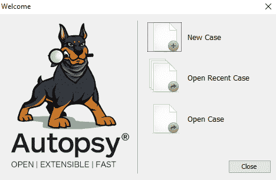

# 第八章：Android 取证工具概述

本章概述了免费/开源和商业的 Android 取证工具，并将展示如何使用这些工具处理常见的调查场景。在本章结束时，读者应熟悉以下工具：

+   Autopsy

+   Belkasoft 证据中心

+   Magnet AXIOM

# Autopsy

Autopsy 是一个免费且开源的分析工具，最初由 Brian Carrier 开发。Autopsy 作为底层基于 Linux 的 SleuthKit 工具集的图形用户界面开始，但自版本 3 起，它已成为一款独立的 Windows 工具。Autopsy 可以从[`www.sleuthkit.org/autopsy/`](http://www.sleuthkit.org/autopsy/)下载。

Autopsy 并不用于进行移动设备的获取，但可以分析大多数常见的 Android 文件系统（如 YAFFS 和 EXT）。在这个例子中，我们将加载通过`dd`从三星 Galaxy J7 获取的完整物理镜像。

# 在 Autopsy 中创建案件

打开 Autopsy 后，用户将被提示创建**新案件**、**打开最近的案件**或**打开案件**：

我们将创建一个新案件。请按照以下步骤操作：

1.  填写完案件名称字段后，下一步按钮将变为可用：

1.  可选的案件编号和检查员信息可以输入：

1.  选择“完成”后，将显示选择要添加的数据源类型的屏幕。选择虚拟机文件的磁盘镜像选项：

1.  点击“下一步”并使用浏览按钮选择要加载的镜像文件：

1.  点击“下一步”按钮，进入配置导入模块向导：

导入模块是 Autopsy 内置的工具，可以在案件启动时运行，或者在之后的任何时间运行。以下是该版本 Autopsy 中的默认模块：

+   **最近活动**：提取最近的用户活动，如网页浏览、最近使用的文档和已安装的程序。

+   **哈希查找**：使用提供的哈希数据库识别已知和显著的文件，如标准 NSRL 数据库。允许我们导入自定义哈希数据库。

+   **文件类型识别**：根据二进制签名匹配文件类型。

+   **嵌入式文件提取器**：提取嵌入式文件（ZIP, RAR, DOCX, XLSX）。自动提取这些文件类型并将其内容放入目录树中。

+   **退出解析器**：导入 JPEG 文件并检索其 EXIF 元数据。

+   **关键词搜索**：使用关键词和正则表达式在列表中进行文件索引和定期搜索。允许加载自定义关键词/列表。

+   **电子邮件解析器**：此模块检测并解析 Mbox 和 PST/OST 文件，并在黑板中填充电子邮件证据。

+   **扩展名不匹配检测器**：标记具有非标准扩展名的文件，基于其文件类型。

+   **E01 验证器**：验证 E01 文件的完整性。

+   **加密探测器**：查找具有指定最小熵的文件。

+   **有趣文件标识符**：根据有趣项目规则集识别有趣的项目。

+   **PhotoRec 切割器**：使用 PhotoRec 从数据源中切割未分配的空间。

+   **关联引擎**：将属性保存到中央存储库以供后续分析。

+   **虚拟机提取器**：提取虚拟机文件并将其添加到案件中。

+   **Android 分析器**：提取 Android 系统和第三方应用程序数据。

请注意，许多这些模块在 Android 设备上是不需要的（例如 E01 验证器和电子邮件解析器）。仅选择有用的模块可以加快数据导入速度。还要注意，点击模块可能会显示更多选项。

1.  点击 **下一步** 将加载数据源并开始导入过程。遇到的任何错误都将被记录：

1.  选择“完成”将带领检查员进入主屏幕，以便分析已导入的案件：

# 在 Autopsy 中分析数据

即使案件仍在加载中，数据导入模块正在运行（如上图右下角的进度条所示），检查员也可以开始分析案件。通过扩展左上角的图像文件，可以显示 Autopsy 识别的分区/卷：

Autopsy 识别了我们设备上的 28 个分区。为了找到数据分区（因为我们知道大部分感兴趣的数据都存储在那里），我们可以简单地展开已分配的分区，直到找到看起来像数据分区的那个：

在我们的图像中，第 27 卷是数据分区。我们可以看到它有一个 `app` 目录（存储 APK 文件的地方）、一个 `data` 目录（存储应用程序数据的地方）以及一个 `media` 目录（SD 卡的符号链接位置）。

展开 `data` 目录将显示我们应该从第七章 *Android 应用程序的法医分析*中记住的信息：

立刻，我们可以看到 `com.android.providers.telephony` 和 `userdictionary`。如何分析这些应用程序的内容，请参阅第七章，*Android 应用程序的法医分析*；这就是如何使用 Autopsy 访问相关文件。例如，展开 `com.android.providers.telephony` 将显示用于分析 SMS 和 MMS 数据的 `mmssms.db` 文件：

“应用程序”标签让检查员在内置查看器中查看 SQLite 数据库：

现在，让我们来看看 Autopsy 的其他功能。在屏幕左侧展开“视图”部分将显示一些使用的获取模块的结果：

**文件类型**视图展示了由**文件类型识别**模块识别的文件。**最近文件**显示了来自**最近活动**模块的结果；在这种情况下，设备似乎已经六天没有使用，然后在**最后一天**被使用。查看这里识别的文件可以显示用户在该时间段内的活动。请注意红色的 X，它表示这些文件中的一些已被删除，但被 Autopsy 恢复了：

在我们的案例中，我们可以看到`downloads.db`和`EmailProvider.db`数据库已被修改。分析这些文件会显示一封带附件的电子邮件被接收，附件随后被下载到设备上。

最后，**视图**部分识别了已删除的文件（这些文件在移动设备上非常常见，因磨损均衡而被删除），以及大文件（这些文件有助于快速找到图像/视频，或识别隐写术）。

**结果**部分将显示来自**Android 分析器**和**关键字搜索**模块的输出：

在提取内容下看到的 Android 分析结果大多符合预期。值得注意的是，**联系人（1）**部分只指向 contacts.db 文件，并没有实际解析其中的数据。例如，**通话记录**显示了从`contacts2.db`提取的数据，如第七章中所述，*安卓应用的取证分析*：

**检测到扩展名不匹配**的结果还显示了我们在第七章中发现的数据，*安卓应用的取证分析*。有几个应用程序被描述为具有`.cnt`文件，而这些文件实际上是 JPEG 图像，这些文件被 Autopsy 正确识别：

双击任何一个文件将带用户到文件在文件系统中找到的位置。

**关键字命中**部分正确地找到了许多电子邮件地址和电话号码，但其中许多是在应用程序文件中找到的（即应用程序开发者的联系信息）以及其他并非由用户实际存储的地方（这在移动和计算机取证工具中非常常见）。

Autopsy 还有许多更高级的功能，这里没有涵盖；要了解更多，基础技术提供了一个 Autopsy 培训课程：[`www.autopsy.com/training/`](https://www.autopsy.com/training/)。

# Belkasoft 证据中心

Belkasoft Evidence Center 是一个商业数字取证产品，允许检查员从不同来源获取、处理和分析数据，包括移动设备，如 Android 智能手机和平板电脑。

该产品的试用版可以从[`belkasoft.com/get`](https://belkasoft.com/get)下载。

# 在 Belkasoft Evidence Center 中创建案件

要开始在 BEC 中创建新案件，请执行以下步骤：

1.  点击**新建案件**按钮，填写以下字段：

    +   **案件名称**：案件名称或编号。

    +   **根文件夹**：存储所有案件数据的文件夹。

    +   **案件文件夹**：当前案件数据存储的文件夹。

    +   **调查员**：检查员的姓名。

    +   **时区**：显示时间戳时使用的时区（推荐使用 UTC）。

    +   **描述**：案件概述：

1.  创建并打开按钮将带你进入下一个窗口，即**添加数据源**窗口：

Belkasoft 提供了带有产品的测试镜像，因此我们可以使用一个 Android 备份进行演示。当然，也可以使用自己的镜像，包括逻辑镜像和物理镜像。如果你没有镜像，但想获取一个，可以在**获取与分析**部分选择**移动设备**选项：

1.  由于我们决定使用提供的 Android 备份，因此可以直接点击**下一步**并选择要从中提取的工件：

一个好的策略是只选择与 Android 相关的工件，但有时选择更多的工件可能会带来更好的结果，所以如果你有足够的时间，可以选择所有类型的工件来处理镜像。

由于我们处理的是逻辑镜像，因此**雕刻**选项不可用。使用物理镜像时，该选项可用，因此检查员可以使用数据雕刻来恢复和提取更多数据。

1.  点击**完成**按钮将初始化镜像处理过程。如果案件只有一个镜像，请在最后一个窗口点击**否**按钮：

# 在 Belkasoft Evidence Center 中分析数据

BEC 的不同功能分布在多个标签页中。我们先来看一些，首先是**案件浏览器**：

这里显示的是处理后提取的工件数量，在我们的案例中是 210 个。实际数据可以在右侧窗格查看。有多种视图选项：你可以查看项目的属性，或者以常规形式或十六进制形式查看它。BEC 还拥有一个强大的**SQLite 浏览器**，支持从**预写日志**（**WAL**）中提取数据，并从空闲列表和未分配空间中恢复已删除记录。

另一个有用的标签是**时间线**：

这对于 Android 恶意软件调查特别有用。你可以轻松找到恶意应用安装前发生的事情，例如，用户收到一条带有该应用链接的可疑短信，点击后用网页浏览器下载了该应用。当然，这也可以用于常规案件，例如，如果你需要了解用户在特定时间段内使用手机时做了什么。

最后，如果需要，你可以执行手动文件系统分析。在下一张截图中，你可以看到一个包含应用数据的文件夹内容：

如果你想使用关键词进行数据搜索，**搜索结果**标签也会非常有用，因为它是存放关键词搜索命中的地方。要在工件中进行搜索，你可以按*Ctrl* + *F*，点击主工具栏上的搜索图标，或者选择**编辑**主菜单中的**搜索...**选项。进行搜索时，你可以使用单个单词或短语、关键词列表、正则表达式，或者预定义的搜索，比如`adult sites`。

# Magnet AXIOM

Magnet AXIOM 是另一款强大的商业数字取证产品，能够获取、处理和分析移动设备，包括运行 Android 操作系统的设备。

本产品的试用版可以从[`www.magnetforensics.com/try-magnet-axiom-free-30-days/`](https://www.magnetforensics.com/try-magnet-axiom-free-30-days/)下载。

# 在 Magnet AXIOM 中创建案件

要在 Magnet AXIOM 中创建案件，请执行以下步骤：

1.  启动 AXIOM 进程并点击**创建新案件**按钮：

1.  第一个窗口是**案件详情**；在这里，我们需要填写一些字段，如案件编号、类型、案件文件路径和已获取的数据：

1.  **证据来源**窗口允许检查员选择数据源或直接从设备获取镜像：

1.  为了演示，我们将使用三星智能手机的实物图片，因此请选择**ANDROID**选项：

1.  由于我们决定使用一个预制的镜像，选择**加载证据**选项：

如果你想使用 Magnet AXIOM 创建一个镜像并进行处理，你可以选择**获取证据**选项。

1.  由于我们使用的是镜像，在下一步中选择**镜像**选项：

现在我们可以看到，我们的证据源已添加到案件中：

让我们继续进行并配置处理细节：

+   **添加关键词以进行搜索**：你可以在处理开始之前添加关键词搜索词，甚至可以添加列表，这样你就能在 AXIOM Examine 的关键词过滤器下找到相关内容。

+   **MAGNET.AI 聊天分类**：AXIOM 使用内置类别对聊天记录进行分类，因此它可以通过机器学习自动从数千条消息中提取有用的证据。

+   **搜索存档和手机备份**：此选项对于计算机取证特别有用；如果 AXIOM 找到存档或手机备份，它会处理并将其数据添加到案件中。

+   **计算哈希值**：你可以导入哈希集以排除已知的好文件：

+   **分类图片和视频**：允许检查员使用来自 Project VIC 和 CAID 的已知媒体文件哈希集或 JSON 文件。

+   **将 CPS 数据添加到搜索中**：允许检查员导入并使用 **儿童保护系统** (**CPS**) 网站的数据。

+   **查找更多证据**：允许检查员使用动态应用查找器查找当前不受产品支持的应用数据：

1.  选择检查员希望提取的证据。由于我们的源是 Android 镜像，我们选择了所有移动设备证据：

当然，如果需要，证据列表是可以定制的：

现在我们准备开始图像处理：

AXIOM 检查窗口将自动打开，因此你可以在处理阶段开始分析。AXIOM 处理窗口仍然很有用，你可以监控处理进度。

# 在 Magnet AXIOM 中分析数据

**案例仪表盘**标签将为你提供 AXIOM 处理从数据源中提取的证据概览——在我们的案例中，共提取了**42,156**个证据：

案例仪表盘标签

要更详细地查看提取的数据，让我们进入 **证据** 查看器，你可以从下拉菜单中选择它（点击 **案例仪表盘**）：

所以我们有相当多的证据，例如 230 个移动设备证据。它们是什么？让我们学习一下：

如你所见，AXIOM 提取了关于用户账户、通话记录、Wi-Fi 配置文件、Google Play 搜索记录和已安装应用的信息。

如果你更喜欢手动分析，可以使用 **文件系统** 查看器。你可以在以下截图中看到包含应用数据的文件夹：

这个查看器拥有进行手动分析所需的一切，包括 SQLite 浏览器和十六进制查看器。

# 总结

本章概述了几款可供 Android 法医检查员使用的免费和商业工具。当然，市场上还有更多商业工具，但我们选择了 Belkasoft Evidence Center 和 Magnet AXIOM，因为它们都有适用于每个人的试用版。

当然，解决一个案例并不总是需要复杂的工具，有时候你只需要一个好的 SQLite 浏览器，甚至是一个十六进制查看器。

下一章将向你介绍 Android 恶意软件，并带你了解一些识别其的方法。
