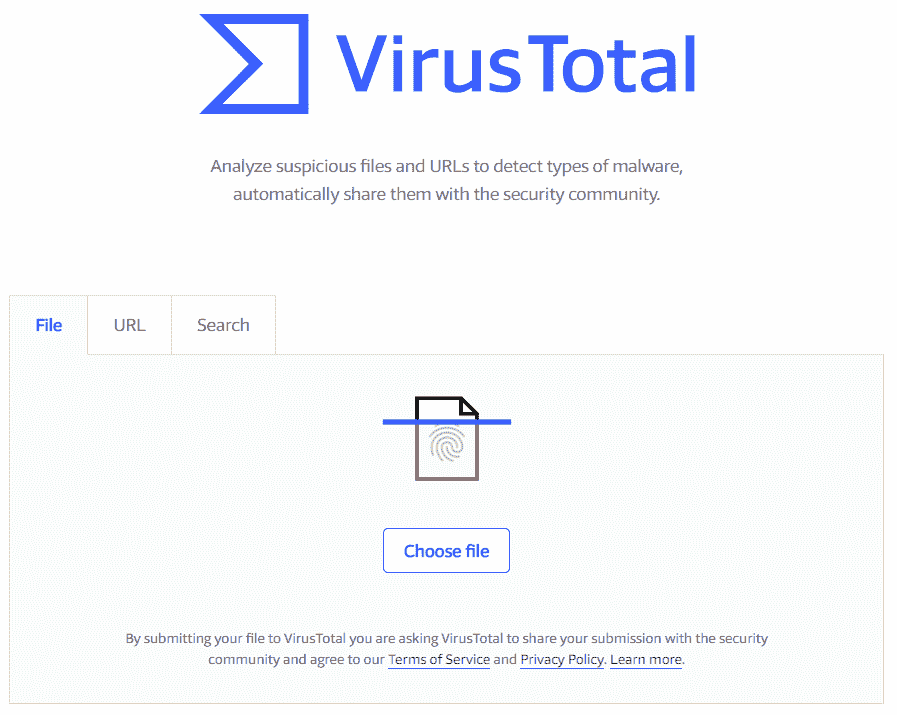
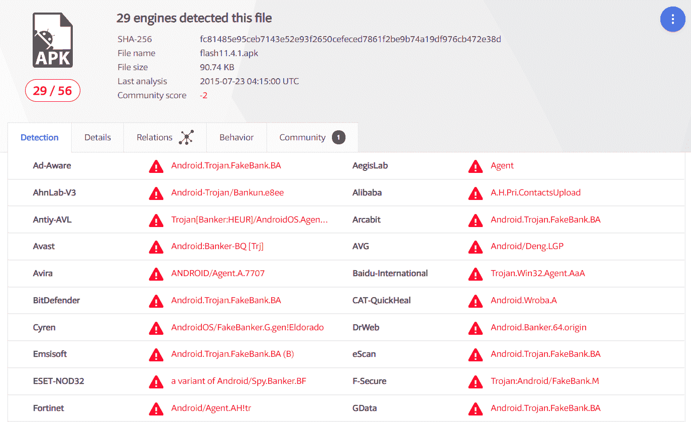

# 第九章：识别安卓恶意软件

识别恶意软件是许多安卓取证检查中的典型任务。本章将首先介绍最常见的安卓恶意软件类型概述，然后带你了解使用不同方法识别安卓设备中的恶意软件的过程。

本章将涵盖以下主题：

+   安卓恶意软件简介

+   安卓恶意软件概述

+   识别安卓恶意软件

# 安卓恶意软件简介

如今，恶意程序在任何操作系统上都很常见，移动设备也不例外。即使是像运行 iOS 的设备、iPhone 和 iPad 这样的安全设备，也可能会感染恶意软件。一个很好的例子是**Pegasus**间谍软件，它在 2016 年被用于攻击阿拉伯人权捍卫者 Ahmed Mansoor。它能够越狱目标设备并植入间谍软件，从而使攻击者能够读取受害者的消息、追踪电话、收集密码、定位手机，并从不同的应用程序收集信息。

如果我们谈论安卓系统，情况更为严重。从不受信任的来源安装应用程序更容易，这使得安卓成为受恶意软件影响最严重的移动平台。更重要的是，安全研究人员经常在 Google Play 商店发现大量恶意软件样本！一个很好的例子是**Android Grabos**运动，它是在 2017 年底/2018 年初由 McAfee 发现的。这个运动将不需要的应用推送给毫无防备的用户——这通常被称为按下载付费骗局。安全研究人员发现并从 Google Play 中移除了 144 个应用程序。但在它们被移除之前，全球约有 1750 万台智能手机设备已经下载了这些应用。

现在让我们进一步了解最常见的安卓恶意软件类型。

# 安卓恶意软件概述

如你所知，不同类型的恶意软件有不同的目标，因此它们的功能也各不相同。一些恶意程序会监视受害者并试图窃取应用数据，例如短信和电子邮件，而另一些则仅仅是向用户显示不需要的广告。本节将向你介绍最常见的安卓恶意软件类型。

# 银行恶意软件

银行恶意软件是安卓平台上最常见的恶意软件之一。它可以伪装成假冒银行应用程序来窃取用户输入的银行信息，或者作为一个第三方应用从真实的银行应用中窃取信息。此外，银行木马通常可以拦截银行交易，并执行典型的间谍软件行为，例如发送、删除和拦截短信，以及键盘记录。一些银行木马甚至具有更高级的功能。一个很好的例子是**MysteryBot**——它还可以从受感染设备发送垃圾邮件，并具备勒索软件功能。

# 间谍软件

间谍软件监视、记录并将目标设备的重要信息发送到攻击者的服务器。这些信息可能包括短信消息、录音电话、截屏、按键记录、电子邮件或可能对攻击者感兴趣的任何其他应用程序数据。一个有趣的例子是 **BusyGasper**，由卡巴斯基实验室专家于 2018 年初发现。它不仅具有收集来自 WhatsApp、Viber 和 Facebook 等流行消息应用程序的信息的常见间谍软件功能，还具有设备传感器监听器，包括运动检测器。

# 广告软件

广告软件是另一种在 Android 设备上非常常见的恶意或不需要的应用程序类型。它相对容易检测，因为受害者会在其设备屏幕上接收持续的弹出窗口和广告。这些不受欢迎的程序并不总是无害的，因为弹出窗口可能导致下载另一种恶意软件，包括已提到的间谍软件和银行木马。

# 勒索软件

当然，勒索软件的主要目标是桌面 Windows 计算机和服务器，但它也存在于移动平台上，尤其是 Android。通常，它只锁定设备屏幕并附上勒索信息，但有时也会加密用户的数据。一个很好的例子是 2017 年针对中国 Android 用户的 **WannaLocker** 勒索软件，它使用 AES 加密用户的文件，除了其路径名以 `.` 开头和包含 `DCIM`、`download`、`miad`、`android` 和 `com` 的文件。

# 加密货币挖掘恶意软件

加密货币现在非常流行，因此这种类型的恶意程序甚至适用于 Android 等移动平台。此类应用程序的目标是使用受害者设备的计算能力来挖掘加密货币，例如 Monero。有时，这种类型的恶意软件甚至会使智能手机硬件处于风险之中。例如，具有加密货币挖掘功能的木马 **Loapi** 会让受害者的手机工作得非常辛苦，以至于其电池在不到 48 小时内膨胀！

下一节将指导您识别 Android 设备上的恶意应用程序。

# Android 恶意软件识别

本节将指导您如何使用防病毒扫描器、VirusTotal 和 YARA 规则在取证镜像中识别 Android 恶意软件的过程。

# 使用防病毒扫描器在 Android 设备上识别恶意软件

使用防病毒扫描器是查找已知恶意软件的典型方法，因此这是选择低 hanging fruit 的推荐第一步。有许多防病毒扫描器，其中许多都有免费版本，移动取证检查员可以使用这些版本完成这些任务。其中大多数是基于 Windows 的，因此第一步是挂载先前创建的物理镜像，以便操作系统和防病毒扫描器可以访问它。

如你所知，大多数 Android 设备使用 EXT4 作为文件系统，尤其是从取证角度来看最有趣的分区——userdata 分区。默认情况下，Windows 不支持这种文件系统，因此我们需要一个第三方工具来挂载它，更重要的是，必须以只读模式进行挂载，因为我们不希望防病毒扫描器删除我们将要检查的镜像中的任何内容。

当然，取证检查员有这样的工具可以使用。它叫做*Linux 文件系统 for Windows*，其试用版可以在此下载：[`www.paragon-drivers.com/en/lfswin/`](https://www.paragon-drivers.com/en/lfswin/)。安装后，你就可以开始挂载 userdata 分区了。你需要 FTK Imager，但应该已经安装了它，因为我们在前面的章节中使用过它。以下是在 Windows 主机上挂载 ext4 分区的两步简单操作：

1.  打开 FTK Imager，点击文件|映像挂载...


AccessData FTK Imager

1.  选择镜像文件。在我们的例子中，它是一个 Android 9 userdata 分区的物理镜像。选择物理与逻辑作为挂载类型，选择块设备 / 只读作为挂载方式，然后点击挂载按钮：


使用 FTK Imager 挂载 EXT4 镜像

就这样！现在文件系统作为逻辑磁盘`E:`在我们的 Windows 10 主机上可用了：


Windows 资源管理器中挂载的文件系统的一部分

现在可以使用防病毒扫描器轻松扫描它。通常，用户安装的应用程序可以在`/data/app`目录下找到，因此，开始我们的恶意软件检测时扫描这个文件夹可能是一个非常好的主意。对于本例，我们将使用 ESET NOD32 防病毒软件（[`www.eset.com/int/home/antivirus/`](https://www.eset.com/int/home/antivirus/)）。从取证的角度来看，它有一个非常有趣的选项——**扫描不清除**。这使得检查人员能够找到恶意软件，但不会删除或隔离它。要选择此选项，右键点击你选择的文件夹，然后进入高级选项。在我们的例子中，扫描只用了几秒钟，结果显示出了两个恶意对象：


防病毒扫描日志

如你所见，有时候，尤其是如果你知道在哪里查找，使用防病毒引擎可以非常快速、轻松地找到 Android 恶意软件。当然，你使用的软件可能没有包含相应的签名，可能会漏掉恶意应用程序，因此强烈建议使用多个引擎进行扫描。

# 使用 VirusTotal 识别 Android 恶意软件

VirusTotal 是一个免费的服务，可以用来分析可疑的文件和 URL 是否包含恶意软件。如你所见，Android 应用程序的文件扩展名为 `.apk`，所以如果你发现一个可疑文件，你可能会想把它上传到 VirusTotal，检查它是否真的是恶意的。为什么这比使用杀毒软件扫描更好？因为它会使用至少 55 个杀毒引擎扫描你的文件！更重要的是，你可能不希望将真实案例中的文件上传到互联网上，但这不是问题，因为你可以通过文件的哈希值 MD5、SHA1 或 SHA256 来查找已经上传的文件。此服务可以在这里使用：[`www.virustotal.com`](https://www.virustotal.com)。

我们已经在 Android 9 镜像中发现了两个恶意文件，因此让我们将其中一个文件上传到 VirusTotal，看看它是如何被其他杀毒引擎检测到的。使用你选择的网页浏览器访问 VirusTotal，然后点击“选择文件”按钮：



VirusTotal 界面

如果文件的哈希值已经在数据库中，你将立即被重定向到包含结果的页面；如果没有，系统将需要一些时间来扫描该文件。在我们的例子中，文件的哈希值已立即找到，我们看到了结果：



VirusTotal 扫描结果

如你所见，我们的恶意软件样本已经被 56 个杀毒引擎中的 29 个检测到——表现还不错。但如果我们不想上传我们的样本呢？如前所述，你可以使用哈希值在 VirusTotal 上查找恶意文件。

若要获取可疑文件的哈希值，你可以使用 Eric Zimmerman 提供的免费工具 Hasher，该工具可在 [`ericzimmerman.github.io`](https://ericzimmerman.github.io) 上下载。接下来请按照以下步骤操作：

1.  启动工具，进入工具 - 选项，选择哈希算法。在我们的案例中，我们选择了 MD5 和 SHA256。

1.  要选择你想要哈希的文件，进入文件 - 选择文件，或者按 *Alt* + *1*。你将在主窗口看到结果：


哈希值结果

要复制哈希值，点击相应字段并按 *Alt* + *C*。现在你可以前往 VirusTotal，点击搜索标签，并粘贴哈希值：


使用哈希值在 VirusTotal 上搜索

由于我们使用的是已经由 VirusTotal 扫描过的文件的 SHA256 哈希值，我们将被重定向到相同的页面。但即使我们没有上传文件，由于该文件已经被第三方上传，我们也能获得结果。

有时候，你需要扫描一大堆文件，逐个上传可能会很麻烦。为了自动上传一堆文件，你可以使用 VirusTotal Uploader，该工具可以在这里下载：[`support.virustotal.com/hc/en-us/articles/115002179065-Desktop-Apps`](https://support.virustotal.com/hc/en-us/articles/115002179065-Desktop-Apps)。

要上传一个文件或多个文件，请单击“选择文件”并上传：


VirusTotal 上传工具界面

为了演示目的，让我们上传我们已经识别的第二个恶意文件。它的哈希值也被找到了，所以工具立即打开了包含扫描结果的浏览器选项卡：


VirusTotal 扫描结果

这个文件的检测结果更好 —— 60 个引擎中有 34 个。但如果文件没有被任何防病毒引擎检测到，因为没有对应的签名，法医检查员该怎么办呢？使用 YARA 编写您自己的规则吧！您将在接下来的章节中学习如何做到这一点。

# 使用 YARA 规则进行 Android 恶意软件识别

根据官方文档（可在[`yara.readthedocs.io/en/v3.8.1/`](https://yara.readthedocs.io/en/v3.8.1/)找到），YARA 是一个旨在帮助恶意软件研究人员（当然也包括计算机和移动设备的法医检查员）识别和分类恶意软件样本的工具。

借助 YARA 的帮助，检查员可以基于文本或二进制模式编写规则。这里是这样一个规则的示例：

```
rule test_rule
{
   meta:
      description = "Test YARA rule"
      author = "Oleg Skulkin"
   strings:
      $string = "teststring"
   condition:
      $string
}
```

此规则将检测包含`teststring`字符串的任何文件。让我们仔细看看规则的主要部分：

+   `meta`：此部分包含规则的元数据，例如它确切地检测到什么以及谁编写了它。它甚至可能不包含在规则中。

+   `strings`：这些是您的恶意软件样本必须包含的字符串，以便进行检测。您可以使用多个字符串或甚至二进制模式。字符串可以区分大小写，也可以是 ASCII 格式或宽字符形式（两个字节用于编码一个字符），或者两者兼有。

+   `condition`：这部分包含一个布尔表达式，告诉我们在什么情况下文件满足规则。它可以是在`strings`部分定义的所有字符串，也可以是其中有限数量的字符串。

让我们编写一个 YARA 规则来检测我们在前几节已经识别的恶意软件。首先，我们必须找到唯一的字符串。为了能够做到这一点，让我们使用 Eric Zimmerman 的另一个法庭工具 bstrings：[`ericzimmerman.github.io/`](https://ericzimmerman.github.io/)。

这是一个命令行工具，因此您必须从 Windows 命令提示符中运行它。使用`-f`开关指定要从中提取字符串的文件：


使用 bstrings 从 APK 文件中提取字符串

从一开始就出现了一个有趣的字符串 —— `com.example.horsenjnj`。但我们如何确定它是否是唯一的呢？一个好主意是在 Google 或其他可用的搜索引擎中搜索这个字符串：


谷歌搜索结果

正如您所见，只有一个搜索结果，这使我们找到的字符串变得独特。而且，如果我们点击链接，它将带我们到我们在前一部分已经看过的 VirusTotal 页面。

如果我们滚动字符串的输出，我们会发现更多有趣的字符串，例如 `res/xml/shit.xml`—这个名称并不是应用程序资源中的常见 XML 文件名称。

让我们用我们发现的两个字符串编写一个 YARA 规则来检测我们的恶意软件样本。如您从前面的章节中记得，大多数杀毒引擎将其检测为 Android Banker，所以我们将我们的规则命名为 `android_banker`。同样可以在描述中写出—**检测 Android Banker**；我们会将其添加到 `meta` 部分。我们有两个字符串供规则使用。由于我们不知道它们的编码方式，我们可以在它们后面添加 `ascii wide`。最后一部分—条件（将被规则检测到的文件）必须包含这两个字符串，因此我们将使用 `all of them` 作为条件。

这是我们最终得到的结果：

```
rule android_banker
{
  meta:
     description = "Detects Android Banker"
     author = "Oleg Skulkin"
strings:
     $s1 = "com.example.horsenjnj" ascii wide
     $s2 = "res/xml/shit.xml" ascii wide
condition:
   all of them
}
```

要使用它，您必须将其保存为一个以`.yar`扩展名结尾的文件。现在，您需要的只是一个能够使用 YARA 规则的扫描器。您可以在这里获得： [`github.com/virustotal/yara/releases/`](https://github.com/virustotal/yara/releases/)。

扫描器是另一个命令行工具。使用 `-r` 开关递归扫描您选择的目录：


使用 YARA 规则扫描恶意软件

如您从前面的截图中看到的，我们的恶意软件样本已成功被 YARA 扫描器识别。

当然，您可以创建更复杂的规则，官方的 YARA 文档是一个非常好的参考资源。您可以在这里找到它：[`yara.readthedocs.io/en/v3.8.1/`](https://yara.readthedocs.io/en/v3.8.1/)。

# 总结

本章向您展示了如何使用杀毒扫描器、VirusTotal 和 YARA 规则，在 Android 智能手机和平板电脑的取证镜像中识别恶意软件，以及如何编写您自己的规则。

最后一章将向您介绍 Android 恶意软件分析技术，包括恶意应用程序的动态和静态分析基础。
