# 第十章：Android 恶意软件分析

在本章中，我们将对在上一章中识别的恶意 Android 应用进行动态和静态分析。我们将涵盖以下主题：

+   使用在线沙箱进行恶意 Android 应用的动态分析

+   恶意 Android 应用的静态分析：

    +   解包 Android 应用

    +   Manifest 文件解码与分析

    +   Android 应用反编译

    +   查看和分析反编译代码

# 恶意 Android 应用的动态分析

分析恶意 Android 应用的最简单方法是将其运行在受控环境中。你已经知道如何运行模拟器并通过 ADB 安装应用程序，因此你可以在干净的虚拟系统中安装一个可疑应用程序，并查看运行后留下的任何痕迹。例如，你可以找到恶意应用程序收集的数据的 SQLite 数据库，或其配置文件。

# 使用在线沙箱进行动态分析

更简单且高效的方法是使用预构建的沙箱进行恶意软件分析。其中一个沙箱是**Joe Sandbox**。它支持自动化的动态分析，涵盖多种应用类型，包括 Windows、macOS、Linux、iOS，当然还有 Android。你可以注册一个免费账户，每月启用 10 次免费的分析。Android 应用的沙箱可以在这里访问：[`www.joesandbox.com/#android`](https://www.joesandbox.com/#android)。

只需要几个简单的步骤即可在沙箱中运行应用程序：

1.  首先，使用**选择文件...**按钮选择你要分析的文件。

1.  调整运行时间；你可以在沙箱中运行应用程序 30 到 500 秒。

1.  接受条款和条件，并点击**分析**按钮。

一旦分析完成，你将收到一封带有分析结果链接的电子邮件。在我们的案例中，它是[`www.joesandbox.com/analysis/67297`](https://www.joesandbox.com/analysis/67297)。

让我们浏览 HTML 报告并讨论其最重要的部分。

Joe Sandbox 有自己基于自动化分析结果的检测机制。在我们的案例中，样本得到了 72 分（满分 100），并被分类为**恶意**：

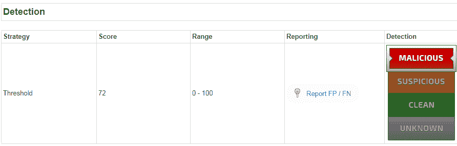

它还使用杀毒引擎和 VirusTotal 扫描上传的样本。根据报告，我们的样本被 Avira 检测为**ANDROID/Spy.Banker.YD.G****en**，并且 51% 的杀毒引擎在 VirusTotal 上也进行了检测，截图如下：

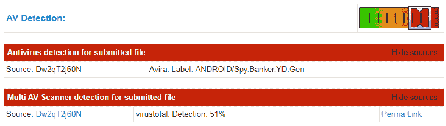

根据下一部分，我们的样本尝试提升其权限，通过运行 `su` 命令请求 root 权限，然后尝试添加新的设备管理员：

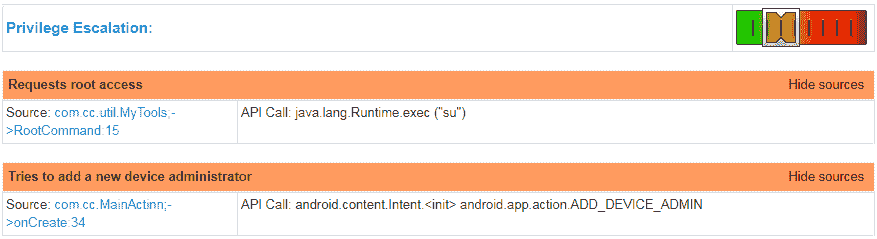

我们来看一下**网络**部分。看起来我们的示例尝试从`www.poog.co.kr`下载一个新的 APK 文件`new.apk`，但由于文件不可用，下载失败：

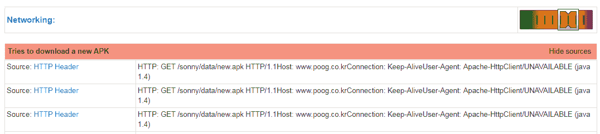

另一个有趣的部分是**电子银行欺诈**。我们的样本包含与银行相关的包名字符串；它们可能用于检测设备上安装的银行应用。此外，它还能够为其他应用添加覆盖层，并具有列出当前运行应用程序的权限：

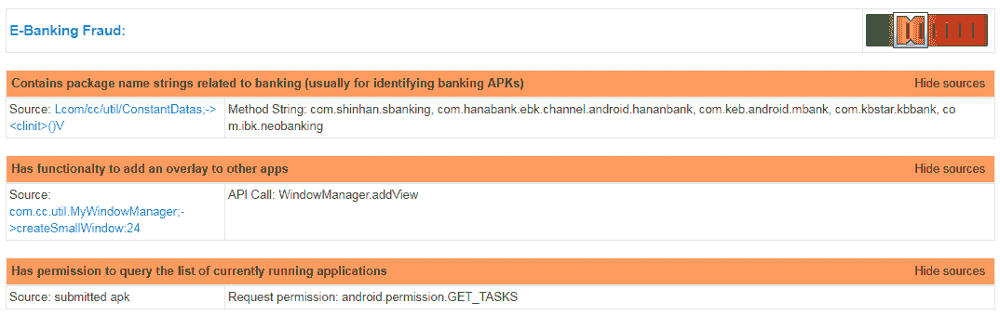

接下来的部分显示分析的应用请求了在后台进行电话拨打、发送短信和写入短信存储的权限。此外，它还能够使用 SmsManager 发送短信并结束来电；这些行为是银行木马的典型特征：

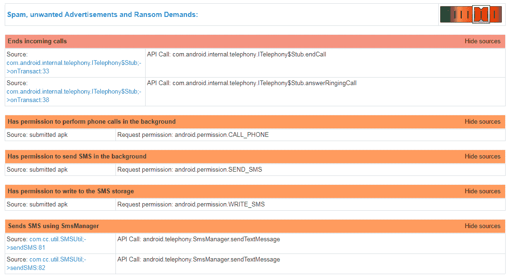

**系统摘要**部分向我们展示了样本请求的潜在危险权限列表：

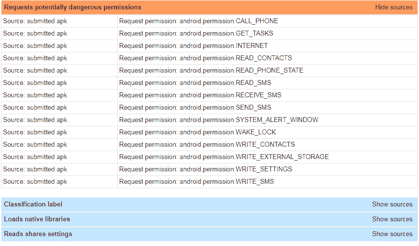

让我们仔细看一下它们：

+   `CALL_PHONE`：允许应用发起电话拨打

+   `GET_TASKS`：允许应用收集关于当前运行应用程序的信息

+   `INTERNET`：允许应用打开网络套接字

+   `READ_CONTACTS`：允许应用读取联系人数据

+   `READ_PHONE_STATE`：允许应用以只读模式访问电话状态，包括电话号码和蜂窝网络信息

+   `READ_SMS`：允许应用读取短信

+   `RECEIVE_SMS`：允许应用接收短信

+   `SEND_SMS`：允许应用发送短信

+   `SYSTEM_ALERT_WINDOW`：允许应用创建在所有其他应用上方显示的窗口

+   `WAKE_LOCK`：允许应用防止处理器进入睡眠状态或防止屏幕变暗

+   `WRITE_CONTACTS`：允许应用写入联系人数据

+   `WRITE_EXTERNAL_STORAGE`：允许应用写入外部存储，例如 SD 卡

+   `WRITE_SETTINGS`：允许应用读取或写入系统设置

+   `WRITE_SMS`：允许应用写入存储在手机或 SIM 卡上的短信，或删除它们

我们已经知道我们的样本尝试下载一个 APK 文件。如果我们查看**持久性和安装行为**部分，我们会发现它不仅能够下载应用程序，还能安装它们：

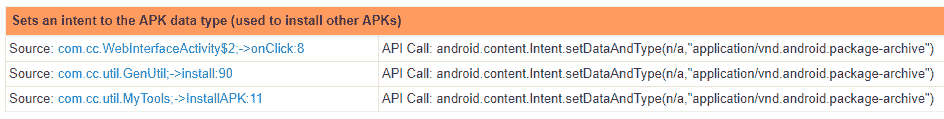

为了在重启后生存，样本请求了在手机重启后执行代码的权限（`RECEIVE_BOOT_COMPLETED`），创建了一个新的唤醒锁来保持设备处于开启状态，并能够启动一个服务以实现自启动功能：

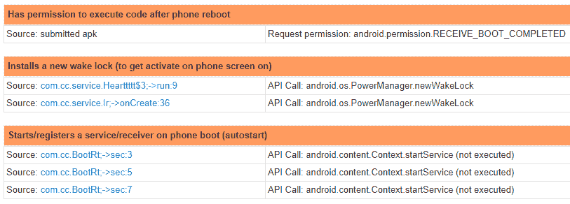

让我们深入了解**钩子和其他隐藏及保护技术**部分。该样本能够中止广播事件；它帮助恶意应用隐藏电话事件，如接收到的短信：

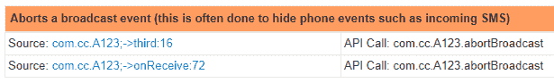

另一个有趣的信息是，我们的样本请求了终止后台进程的权限：

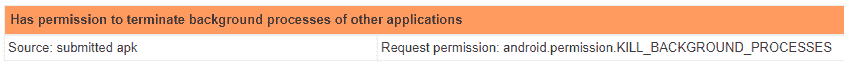

**Language, Device and Operating System Detection**部分显示样本收集了有关 SIM 提供商国家代码、服务提供商名称、移动国家代码、移动网络代码、WiFi MAC 地址、语音邮件号码、操作系统版本以及唯一设备 ID 的信息，如**国际移动设备身份识别码**（**IMEI**）、**移动设备识别码**（**MEID**）和**电子序列号**（**ESN**）：

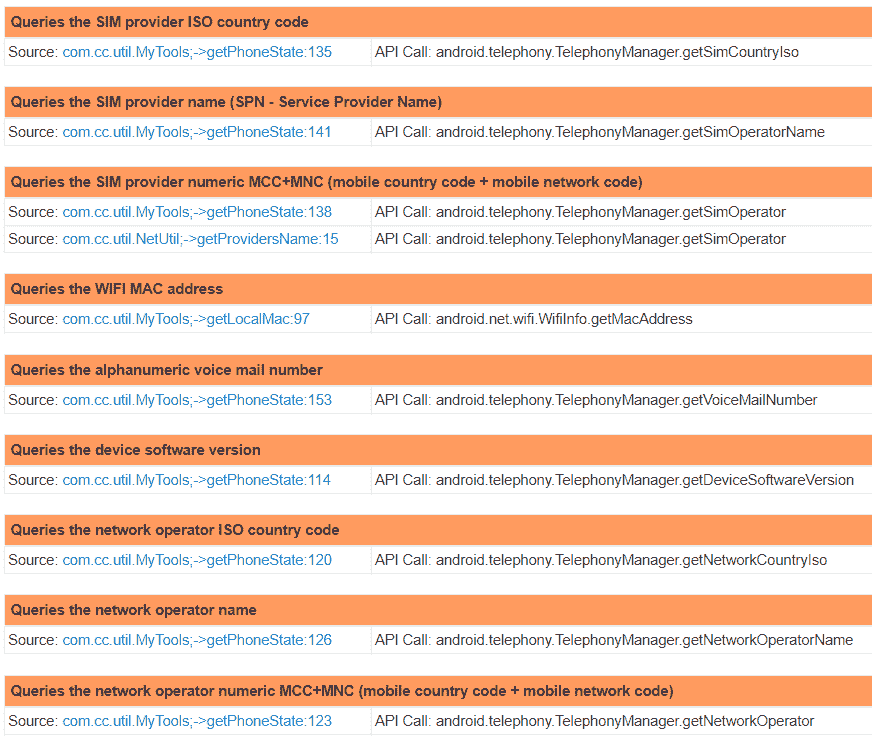

以下截图显示了样本收集的唯一设备 ID：

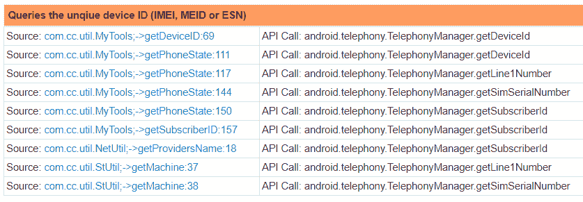

下一部分显示应用程序监控外拨电话，能够创建短信数据，并检查是否安装了 SIM 卡：

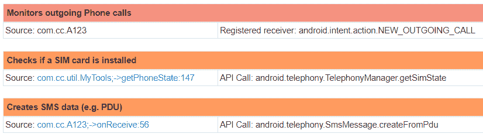

更重要的是，它监控来电并读取来电号码，解析短信（正文和来电号码），并查询已安装的应用程序和包列表：

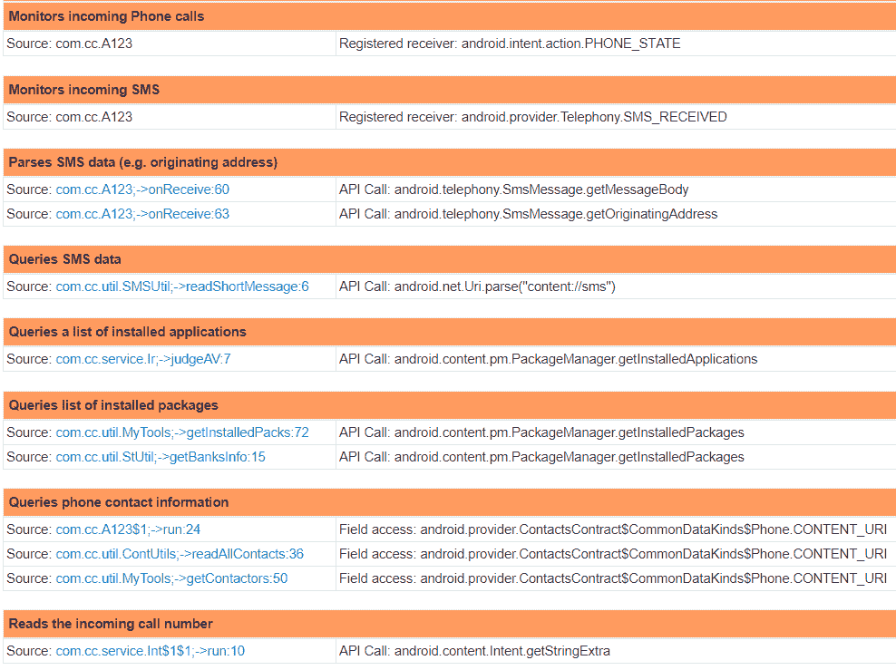

最后，如果我们查看**Antivirus Detection**部分的**URLs**子部分，我们可以看到我们的样本试图下载的 APK 文件被 Avira URL Cloud 检测为恶意：

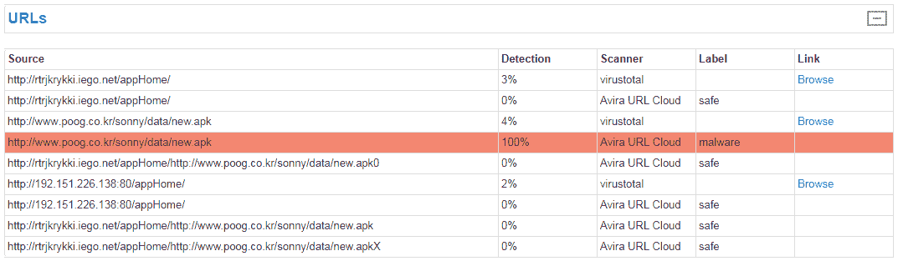

你可能已经注意到在之前的截图中有更多的 URLs；这些可能是恶意软件的命令与控制服务器。

总结一下，让我们汇总从**Joe Sandbox**动态分析中得到的信息：

+   基于病毒检测和我们发现的伪装物品，我们分析的这款恶意软件是一个银行木马。

+   它能够从`www.poog.co.kr`下载其他恶意软件。

+   它收集有关银行相关应用程序的信息。

+   它能够为其他应用程序添加覆盖层。

+   它能够监控进出电话，读取和写入短信，并拦截它们。

+   它能够终止其他应用程序的进程。

+   它能够收集运行设备的信息。

+   它请求在手机重启后执行代码，以实现持久性。

+   它可能使用`http://rtrjkrykki.iego.net/appHome/`或`http://192.151.226.138:80/appHome/`作为命令与控制服务器。

接下来的部分将带你了解执行 Android 恶意应用静态分析所需的步骤。

# 恶意 Android 应用程序的静态分析

为了对之前识别的恶意 Android 应用程序进行动态分析，我们在 Joe Sandbox 的帮助下将其运行在受控环境中。与动态分析相比，静态分析允许检查员在不实际运行恶意软件的情况下理解其行为。让我们从解包开始，进行我们的恶意软件样本的静态分析。

# 解包 Android 应用程序

要查看 APK 文件的内容，你可以使用任何压缩工具。一个好的例子是 7-Zip，这是一个免费的开源压缩工具，可以在这里下载：[`www.7-zip.org/download.html`](https://www.7-zip.org/download.html)。

要解压 APK 文件，右键点击它，选择 **7-Zip**，然后选择 **打开压缩包**：

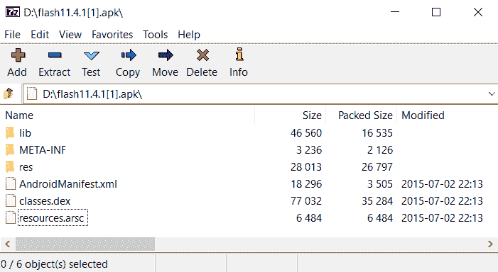

APK 文件内容

现在你可以浏览 APK 文件的内容并导出其部分内容进行进一步分析。在下一节中，我们将重点关注 Android 清单文件：`AndroidManifest.xml`。

# Manifest 文件解码与分析

Manifest 文件描述了应用程序的基本信息，供 Android 构建工具、Android 操作系统和 Google Play 使用。如果你在文本编辑器中打开这样的文件，你会看到大部分数据被编码，无法正常查看。

如果我们想分析其内容，我们需要使用 Android 二进制 XML 解码器。一个这样的解码器是 `axmldec`，可以在这里下载：[`github.com/ytsutano/axmldec/releases`](https://github.com/ytsutano/axmldec/releases)。

要解码提取的 manifest 文件，请在命令提示符下运行 `axmldec`，并使用以下参数：

```
axmldec.exe -i AndroidManifest.xml -o manifest_decoded.xml
```

输出文件可以通过你选择的文本编辑器轻松查看。该文件包含大量有用的信息。例如，我们可以获取包名：

```
<manifest  android:versionCode="1" android:versionName="1.0" package="com.example.horsenjnj">
```

此外，我们还可以获取有关主活动的信息。主活动是用户启动应用时第一个出现的屏幕。每个活动可以启动另一个活动以执行不同的操作。在我们的例子中，主活动是 `com.cc.MainActinn`：

```
<activity android:label="type1/2131034112" android:name="com.cc.MainActinn" android:excludeFromRecents="true">
     <intent-filter>
         <action android:name="android.intent.action.MAIN"/>
         <category android:name="android.intent.category.LAUNCHER"/>
     </intent-filter>
 </activity>
```

还有另一个活动 – `com.cc.WebInterfaceActivity`：

```
<activity android:theme="type1/16973835" android:name="com.cc.WebInterfaceActivity" android:screenOrientation="1"/>
```

这个活动有若干 **广播接收器**。广播接收器允许应用程序接收系统或其他应用程序广播的 **意图**。意图是由意图对象定义的消息，描述了要执行的操作。当一个应用程序向系统发出意图时，系统会根据 manifest 文件中的意图过滤器声明，定位一个能够处理该意图的应用组件。

让我们从 `com.cc.MyAdminReceiver` 开始，它用于获取设备管理员权限：

```
<receiver android:label="type1/2131034112" android:name="com.cc.MyAdminReceiver" android:permission="android.permission.BIND_DEVICE_ADMIN" android:description="type1/2131034112">
     <meta-data android:name="android.app.device_admin" android:resource="type1/2130968576"/>
     <intent-filter>
         <action android:name="android.app.action.DEVICE_ADMIN_ENABLED"/>
     </intent-filter>
 </receiver>
```

下一个广播接收器是 `com.cc.BootRt`：

```
<receiver android:name="com.cc.BootRt" android:enabled="true" android:exported="true">
     <intent-filter android:priority="2147483647">
         <action android:name="android.intent.action.BOOT_COMPLETED"/>
         <action android:name="android.intent.action.ACTION_SHUTDOWN"/>
         <action android:name="android.intent.action.USER_PRESENT"/>
 </intent-filter>
 </receiver>
```

如你所见，它接收以下信息：

+   设备是否完成了启动过程

+   设备是否正在关机

+   设备唤醒后是否有用户在场

另一个广播接收器是 `com.cc.A123`：

```
<receiver android:name="com.cc.A123">
     <intent-filter android:priority="2147483647">
         <action android:name="android.intent.action.BOOT_COMPLETED"/>
         <action android:name="android.intent.action.PHONE_STATE"/>
         <action android:name="android.intent.action.NEW_OUTGOING_CALL"/>
         <action android:name="android.intent.action.ACTION_POWER_CONNECTED"/>
         <action android:name="android.intent.action.ACTION_POWER_DISCONNECTED"/>
         <action android:name="android.intent.action.TIMEZONE_CHANGED"/>
         <action android:name="android.intent.action.TIME_SET"/>
         <action android:name="android.intent.action.TIME_TICK"/>
         <action android:name="android.intent.action.UID_REMOVED"/>
         <action android:name="android.intent.action.UMS_CONNECTED"/>
         <action android:name="android.intent.action.UMS_DISCONNECTED"/>
         <action android:name="android.intent.action.PACKAGE_ADDED"/>
         <action android:name="android.intent.action.PACKAGE_CHANGED"/>
         <action android:name="android.intent.action.PACKAGE_DATA_CLEARED"/>
         <action android:name="android.intent.action.PACKAGE_FIRST_LAUNCH"/>
         <action android:name="android.intent.action.PACKAGE_FULLY_REMOVED"/>
         <action android:name="android.intent.action.PACKAGE_INSTALL"/>
         <action android:name="android.intent.action.PACKAGE_NEEDS_VERIFICATION"/>
         <action android:name="android.intent.action.PACKAGE_REPLACED"/>
         <action android:name="android.intent.action.PACKAGE_REMOVED"/>
         <action android:name="android.intent.action.PACKAGE_RESTARTED"/>
         <action android:name="android.intent.action.MY_PACKAGE_REPLACED"/>
         <action android:name="android.intent.action.MEDIA_UNMOUNTED"/>
         <action android:name="android.intent.action.MEDIA_UNMOUNTABLE"/>
         <action android:name="android.intent.action.PACKAGE_REMOVED"/>
         <action android:name="android.intent.action.MANAGE_PACKAGE_STORAGE"/>
         <action android:name="android.intent.action.MEDIA_BAD_REMOVAL"/>
         <action android:name="android.intent.action.MEDIA_BUTTON"/>
         <action android:name="android.intent.action.MEDIA_CHECKING"/>
         <action android:name="android.intent.action.MEDIA_EJECT"/>
         <action android:name="android.intent.action.MEDIA_MOUNTED"/>
         <action android:name="android.intent.action.MEDIA_NOFS"/>
         <action android:name="android.intent.action.MEDIA_REMOVED"/>
         <action android:name="android.intent.action.MEDIA_SCANNER_FINISHED"/>
         <action android:name="android.intent.action.MEDIA_SCANNER_SCAN_FILE"/>
         <action android:name="android.intent.action.MEDIA_SCANNER_STARTED"/>
         <action android:name="android.intent.action.MEDIA_SHARED"/>
         <action android:name="android.intent.action.LOCALE_CHANGED"/>
         <action android:name="android.intent.action.INPUT_METHOD_CHANGED"/>
         <action android:name="android.intent.action.HEADSET_PLUG"/>
         <action android:name="android.intent.action.GTALK_DISCONNECTED"/>
         <action android:name="android.intent.action.GTALK_CONNECTED"/>
         <action android:name="android.intent.action.EXTERNAL_APPLICATIONS_UNAVAILABLE"/>
         <action android:name="android.intent.action.EXTERNAL_APPLICATIONS_AVAILABLE"/>
         <action android:name="android.intent.action.DOCK_EVENT"/>
         <action android:name="android.intent.action.DEVICE_STORAGE_OK"/>
         <action android:name="android.intent.action.DEVICE_STORAGE_LOW"/>
         <action android:name="android.intent.action.DATE_CHANGED"/>
         <action android:name="android.intent.action.CLOSE_SYSTEM_DIALOGS"/>
         <action android:name="android.intent.action.CAMERA_BUTTON"/>
         <action android:name="android.intent.action.BATTERY_OKAY"/>
         <action android:name="android.intent.action.BATTERY_LOW"/>
         <action android:name="android.intent.action.BATTERY_CHANGED"/>
         <action android:name="android.intent.action.AIRPLANE_MODE"/>
         <action android:name="android.intent.action.PROVIDER_CHANGED"/>
         <action android:name="android.intent.action.ACTION_SHUTDOWN"/>
         <action android:name="android.intent.action.USER_PRESENT"/>
         <action android:name="android.intent.action.WALLPAPER_CHANGED"/>
         <action android:name="android.net.wifi.WIFI_STATE_CHANGED"/>
         <action android:name="com.noshufou.android.su.REQUEST"/>
         <action android:name="android.net.conn.CONNECTIVITY_CHANGE"/>
         <action android:name="android.provider.Telephony.SMS_RECEIVED"/>
         <category android:name="android.intent.category.HOME"/>
     </intent-filter>
 </receiver>
```

它接收以下信息/执行以下操作：

+   如果设备完成了启动过程，手机状态

+   如果开始了一个新的外拨电话

+   是否连接了电源

+   是否断开了电源

+   如果时区发生变化

+   如果时间已设置

+   如果时间已更改

+   如果用户 ID 已被删除

+   如果设备已进入 USB 大容量存储模式

+   如果设备已退出 USB 大容量存储模式

+   如果已安装新的应用包

+   如果现有的应用包已被更改

+   如果用户已清除包的数据

+   如果应用程序首次启动

+   如果应用程序已从设备中完全移除

+   如果应用程序已下载并安装

+   如果需要验证包

+   如果安装了应用包的新版本

+   如果应用程序已完全或部分卸载

+   如果用户重新启动了一个包

+   如果现有的应用程序被新版本安装并覆盖

+   如果外部媒体存在但无法挂载

+   如果由于内存不足，需要启动包管理

+   如果外部媒体从 SD 卡槽中移除，但挂载点未被卸载

+   如果按下了**媒体按钮**

+   如果外部媒体存在并正在进行磁盘检查

+   如果用户表示希望移除外部存储媒体

+   如果外部媒体存在并已挂载

+   如果外部媒体存在，但使用了不兼容的文件系统或是空白的

+   如果外部媒体已被移除

+   如果媒体扫描器已完成扫描目录

+   请求媒体扫描器扫描一个文件并将其添加到媒体数据库

+   如果媒体扫描器已开始扫描目录

+   如果外部媒体因通过 USB 大容量存储共享而被卸载

+   如果当前设备的区域设置已更改

+   如果输入法已更改

+   如果插入或拔出了有线耳机

+   如果 GTalk 连接已断开

+   如果 GTalk 连接已建立

+   如果一组包的资源当前不可用，因为存储它们的媒体不可用

+   如果一组包的资源当前可用

+   如果设备的物理对接状态发生变化

+   如果设备上不再存在存储空间不足的情况

+   如果设备存储空间不足

+   如果日期发生变化

+   如果用户操作要求显示临时系统对话框以进行关闭

+   如果按下了相机按钮

+   如果电池在低电后已恢复正常

+   如果设备处于低电状态

+   充电状态、电池电量级别及其他电池信息

+   如果用户已将手机切换到飞行模式或退出飞行模式

+   如果服务提供商的数据发生变化，例如未读电子邮件数量发生变化

+   如果设备正在关机

+   如果设备唤醒后用户存在

+   如果当前系统的壁纸已更改

+   如果 Wi-Fi 已启用、禁用、正在启用、正在禁用或状态未知

+   调用`su`二进制文件以获取 root 权限

+   如果网络连接发生变化

+   如果设备接收到新的基于文本的短信

此外，我们在恶意应用程序的清单文件中有关于三个服务的信息，`com.cc.service.Int`、`com.cc.service.Ir`和`com.cc.service.Hearttttt`：

```
<service android:name="com.cc.service.Int" android:persistent="true" android:enabled="true">
     <intent-filter>
         <action android:name="android.intent.action.BOOT_COMPLETED"/>
     </intent-filter>
 </service>
 <service android:name="com.cc.service.Ir" android:persistent="true" android:enabled="true">
     <intent-filter>
         <action android:name="android.intent.action.BOOT_COMPLETED"/>
     </intent-filter>
 </service>
 <service android:name="com.cc.service.Hearttttt" android:persistent="true" android:enabled="true">
     <intent-filter>
         <action android:name="android.intent.action.BOOT_COMPLETED"/>
     </intent-filter>
 </service>
```

与活动不同，服务没有可视的用户界面。如果你查看它们的意图过滤器，你会注意到每个服务在设备完成启动过程后都会接收到一个广播信号，因此它可以在后台自动启动。

清单文件的最后部分包含应用程序使用的权限：

```
<uses-permission android:name="android.permission.VIBRATE"/>
 <uses-permission android:name="android.permission.READ_SMS"/>
 <uses-permission android:name="android.permission.WRITE_SMS"/>
 <uses-permission android:name="android.permission.RECEIVE_SMS"/>
 <uses-permission android:name="android.permission.SEND_SMS"/>
 <uses-permission android:name="android.permission.READ_CONTACTS"/>
 <uses-permission android:name="android.permission.WRITE_CONTACTS"/>
 <uses-permission android:name="android.permission.WRITE_SETTINGS"/>
 <uses-permission android:name="android.permission.READ_PHONE_STATE"/>
 <uses-permission android:name="android.permission.CALL_PHONE"/>
 <uses-permission android:name="android.permission.READ_CALL_LOG"/>
 <uses-permission android:name="android.permission.WRITE_CALL_LOG"/>
 <uses-permission android:name="android.permission.INTERNET"/>
 <uses-permission android:name="android.permission.WRITE_EXTERNAL_STORAGE"/>
 <uses-permission android:name="android.permission.ACCESS_NETWORK_STATE"/>
 <uses-permission android:name="android.permission.READ_PHONE_STATE"/>
 <uses-permission android:name="android.permission.RECEIVE_BOOT_COMPLETED"/>
 <uses-permission android:name="android.permission.UPDATE_APP_OPS_STATS"/>
 <uses-permission android:name="android.permission.GET_TASKS"/>
 <uses-permission android:name="android.permission.VIBRATE"/>
 <uses-permission android:name="android.permission.KILL_BACKGROUND_PROCESSES"/>
 <uses-permission android:name="android.permission.ACCESS_WIFI_STATE"/>
 <uses-permission android:name="android.permission.SYSTEM_ALERT_WINDOW"/>
 <uses-permission android:name="android.permission.WAKE_LOCK"/>
```

我们已经在动态分析部分讨论过权限问题，因此这里不再重复。现在，让我们深入研究并开始进行代码反编译。

# 安卓应用程序反编译

在这一步中，我们需要从 APK 文件中获取另一个文件：`classes.dex`。为了将`.dex`（Dalvik 执行文件）转换为`.class`文件并打包到`.jar`容器中，我们需要进行反编译。我们可以使用`dex2jar`来完成这个任务，工具下载地址：[`github.com/pxb1988/dex2jar`](https://github.com/pxb1988/dex2jar)。

要反编译`classes.dex`，请在命令提示符中运行`d2j-dex2jar.bat`，并使用以下参数：

```
d2j-dex2jar.bat classes.dex -o classes.jar
```

就是这里。现在，我们有一个`classes.jar`文件，里面包含了`classes.dex`中的所有 Java 类。我们将在下一部分查看和分析这个`.jar`文件。

# 查看和分析反编译的代码

现在我们可以查看和分析我们在之前步骤中解压和反编译的数据。我们可以使用 JD-GUI 来进行这个操作。JD-GUI 是一个免费的工具，能够显示`.class`文件的 Java 源代码。你可以在这里下载这个工具：[`jd.benow.ca/`](http://jd.benow.ca/)。

这是 JD-GUI 显示的`classes.jar`内容：

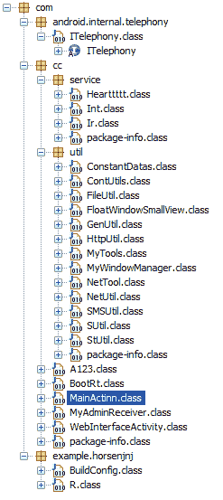

`classes.jar`的内容

我们已经知道了很多关于银行木马的信息，现在让我们通过代码分析来学习一些新的东西。通过动态分析，我们识别出了两个可疑的 URL，`rtrjkrykki.iego.net/appHome/`和`192.151.226.138:80/appHome/`。很可能这两个是同一个服务器，所以我们可以尝试在代码中使用 JD-GUI 查找至少一个 URL：

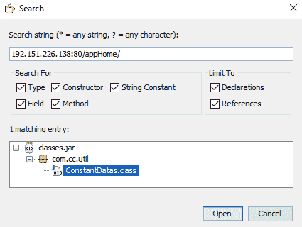

使用 JD-GUI 搜索 URL

好的，现在我们知道 URL 位于`ConstantDatas.class`中。让我们看一下：

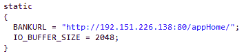

`ConstantDatas.class`内容的一部分

如果我们搜索`BANKURL`，我们会发现它在`MainActinn.class`中被使用：

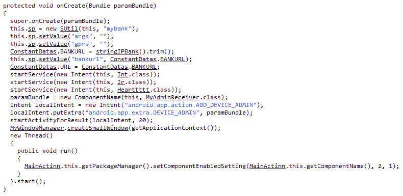

`MainActinn.class`内容的一部分

看看这一行："ConstantDatas.URL = ConstantDatas.BANKURL;"。现在让我们搜索`ConstantDatas.URL`。我们会在`Hearttttt.class`中找到一个很好的匹配：

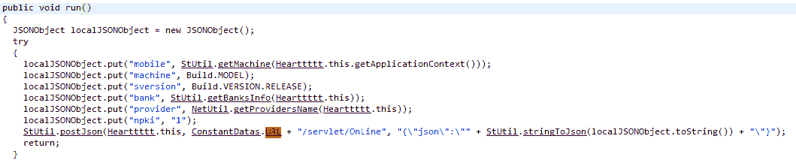

`Hearttttt.class`内容的一部分

在这里，你可以看到应用程序收集关于设备的信息，包括安装的操作系统、已安装的银行应用程序、移动国家代码和移动网络代码、唯一的用户订阅 ID 等，并将这些数据以 JSON 格式发送到`192.151.226.138:80/appHome/servlet/OnLine`。

如你所见，通过静态代码分析，你可以获得大量的附加信息；有时这相对简单，有时则不然，因为恶意软件样本可能会高度混淆。

为了以更高的成功率进行代码分析，我们强烈建议你开始学习 Android 编程。请参考*深入阅读*部分提供的书籍。

# 总结

本章介绍了恶意 Android 应用程序的动态和静态分析。你已经学习了如何使用在线沙箱进行动态分析，如何解包 Android 应用程序，分析其清单文件，并反编译其代码。最后，你已经了解了反编译代码分析的概念。

# 深入阅读

请参阅以下参考资料：

+   *应用开发者文档*：[`developer.android.com/docs/`](https://developer.android.com/docs/)

+   *John Horton，《Android 编程入门（第二版）》*：[`www.packtpub.com/application-development/android-programming-beginners-second-edition`](https://www.packtpub.com/application-development/android-programming-beginners-second-edition)
