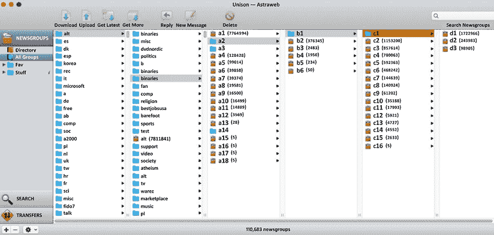
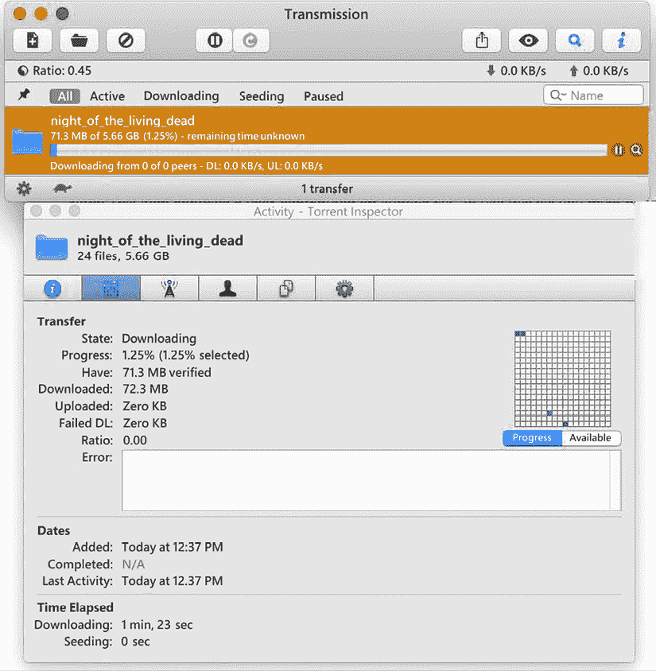
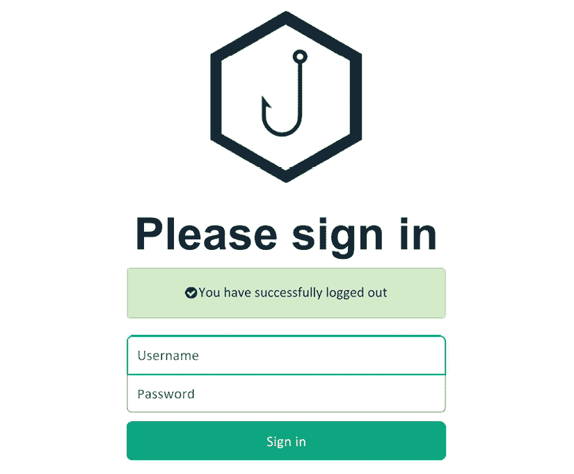
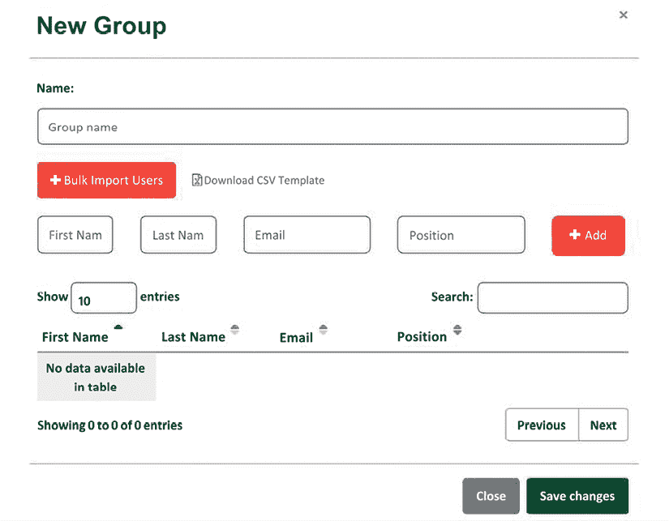

# 第一章：基于计算机的调查类型

欢迎来到 21 世纪，几乎生活中的每一件事都与电子设备相连。门铃内有数字摄像头；你的智能手机追踪你从家到工作的日常行程；你去健身房、看演出或去新城市旅行时，社交媒体会更新你的动态。

你的电话、银行访问和医疗预约都是通过数字技术进行跟踪的。如果它跟踪你平凡的日常活动，那犯罪或不道德的行为呢？当然，这些行为也会被追踪，如果你是数字法医调查员，你必须知道数字证据的存储位置以及如何分析它。所有的活动，无论是无害的还是犯罪的，很可能都会生成某种数字证据。作为调查员，你的任务是找到所有相关数据，处理它，并将证据呈交给事实裁定者。本章将介绍计算机基础的不同调查主题，从警察调查的犯罪行为，到员工实施的民事和可能非法的行为，以及由非政府调查员调查的外部第三方行为。

尽管目标相同，都是呈现与事件相关的证据，但证据收集和证据呈现的方法略有不同。因此，你需要理解哪些地方存在相似性，哪些地方存在差异。

本章将涵盖以下主题：

+   基于计算机的调查的差异

+   刑事调查

+   企业调查

# 基于计算机的调查简介

本书旨在向初学者介绍数字法医学领域。什么是数字法医学？它是法医学的一个分支，涉及从数字设备中恢复和分析数据。曾几何时，“数字法医学”一词被视为计算机法医学的同义词，但如今它涵盖了所有能够存储数字数据的设备。无论使用什么术语，目标都是识别、收集并检查/分析数字数据，同时保持其完整性。数字法医学不仅仅是寻找证据，它是对数字证据的正式检查/分析，旨在证明或反驳被告是否犯有该罪行。

作为法医检查员，调查不仅仅是证明嫌疑人有罪；你还有道德义务寻找**无罪证据**，证明当事人的无辜。此外，在展示调查结果时，你必须是一个公正的第三方。在刑事检查中，你的发现可能剥夺某人的自由，而在企业调查中，你的发现可能导致刑事调查，或使某人失去生计。作为数字法医检查员，你的结论可能对调查对象产生重大影响。

成为数字取证检查员，你需要有提问的欲望，拥有专业的设备，并接受必要的培训。从教导那些对这个领域感兴趣的人中，我发现最优秀的学生能够批判性地审视呈现的事实和情况，并利用这种能力，集中精力有效地得出准确的结论。不幸的是，我发现许多学生希望按下一个“找到证据”按钮，找到所有的证据物件，打印出千页报告，完成任务。这不是数字取证。

数字取证并不是找到证据物件。所谓证据物件，我指的是浏览器历史记录中的有罪谷歌搜索，嫌疑人与共谋者之间的有罪电子邮件，或者文件系统中发现的非法图片。证据物件是指向进行非法活动的人的线索。然而，仅凭这些证据物件，并不能识别出创建这些物件的用户，或者间接负责其创建的用户。这个领域最大的挑战之一就是识别出正在实际操作设备的用户。你希望将用户与特定的嫌疑人联系起来，而要做到这一点，你必须分析——这是关键词——数字证据，将其与特定用户关联起来。

如果你从事 IT 领域工作，你会理解网络和计算机操作系统，但你可能缺乏如何保全证据、维护证据链，并在刑事/行政程序中展示证据的知识。

如果你是调查员，你会理解证据链、证据保全以及在刑事/行政程序中作证。然而，你可能在数字领域缺乏经验。成为一名有效的数字取证检查员，你必须融入这两个领域。你必须了解数据是如何在数字领域中创建、共享和保存的，并以法医学上可靠的方式保存这些证据，同时能够在程序中作证。有时，在大庭广众面前回答来自双方律师提出的挑战性问题，可能是这个领域最难的部分。

与任何领域一样，你变得更好、更有效的方法是实践，进行真实和模拟检查，接受培训，并愿意向同行请教建议。既然你正在阅读这本书，你已经迈出了第一步。你可能是独自阅读这本书，将其作为你所修读的大学课程的教材，或者在企业培训课程中使用它。原因并不重要。阅读这本书将使你走上成为更有效的数字取证检查员的道路。

什么是网络犯罪？数字取证专家调查哪些犯罪？数字取证专家可能调查任何与数字世界相关的涉嫌不当行为。几乎每个人都有一部移动设备。有时，一个人拥有或使用多个移动设备、笔记本电脑和传统的台式电脑。所有这些设备都可能存储与调查相关的大量信息。例如，我曾调查过一起针对某人的犯罪案件，受害人因身体原因无法与警方沟通。这是如何成为一宗需要使用数字取证专家的犯罪案件的呢？

好吧，在这个案例中，她通过一个网站和即时消息与嫌疑人保持联系，并通过移动设备进行沟通。因此，尽管他们没有直接与正在调查的犯罪相关的证据，但他们掌握了关于受害人与嫌疑人关系的证据。在 21 世纪，几乎任何犯罪都有可能有数字格式的证据。现在，有些犯罪是通过计算机作为工具来实施的，例如发送骚扰邮件、欺诈和伪造、黑客攻击、企业间谍活动或非法图片交易。你的职业将决定你对情境的反应；如果你是执法人员，你将遵循一套程序，而如果你在企业界工作，你将遵循另一套程序。虽然不同领域中的一些程序可能会重叠，但每个领域都有其独特的差异，我们接下来会讨论这些差异。

# 刑事调查

作为执法专业人员，你首先需要考虑的是警员安全。现场是否**安全且稳妥**，可以处理和保护证据？当调查开始时，你可能会参与一个或多个角色。最基本的职位如下：

+   第一响应者

+   调查员

+   犯罪现场技术员

根据你所在机构的规模，你可能会填补一个或全部三个职位，并且你可能需要向一个或多个上级汇报。现在，面对数字证据，负责现场的人应该意识到数字证据的脆弱性。这使得相关人员能够采取适当的程序，确保证据不被破坏。

让我们谈谈每个角色的职责。

## 第一响应者

第一响应者是第一个到达现场的人。他们会在可能混乱的现场进行控制。他们会识别以下内容：

+   潜在受害人

+   证人

+   潜在嫌疑人

+   如何最好地维持控制

他们会一直这样做，直到调查员到达。第一响应者的主要任务是确保现场安全，防止任何人污染证据。正如你可以想象的那样，犯罪现场可能会有所不同，根据犯罪性质的不同，可能是一个动态的犯罪现场或一个相对静态的犯罪现场。在这两种情况下，第一响应者都必须具备基本的知识，了解在他们确保现场安全时，哪些物品可能包含数字证据。我们不希望嫌疑人拿起手机或笔记本电脑并进行任何操作。

那么，第一响应者如何保护犯罪现场呢？就像你在电视剧和电影中看到的那样，黄色犯罪现场带是最常见的方法。它是犯罪现场屏障的最直观可见标志，在我们的文化中，人们通过那条薄薄的黄色塑料带就能识别出犯罪现场的边界。一个或多个人员需要监控犯罪现场，以管理谁可以越过这条线进入现场。

## 调查员

调查员将在接到第一响应者的请求后赶到现场。到达现场后，第一响应者和调查员将进行协调，信息共享将开始。第一响应者将提供基本信息，这通常包括五个 W 和一个 H，具体来说是关于事件的谁、什么、何时、何地、为什么和如何。

第一响应者还将提供关于他们或其他人在调查员到达之前所采取的任何行动的信息。例如，调查员需要知道第一响应者是否接触过任何物品、移动过任何东西或改变过现场的任何东西。这可能是诸如对受害者进行急救或开关计算机等物理行动。我记得做过一次检查，当时第一响应者没有透露他们曾经访问过受害者的计算机。在进行我的检查时，我做了时间线分析，发现受害者死后活动出现了异常。这种异常是由于第一响应者未报告的行动所导致的。这里需要理解的关键是，第一响应者的行为并没有错。造成复杂情况的是他们没有报告这些行为，这导致了额外的工作和解释。

调查员负责指挥现场并指导所有活动。他们将指挥其他团队成员的调查工作，确保关于证据扣押的正确文档得以完成。有时，第一响应者会扣押证据并交给调查员。必须完成并保存一份证据链文件，记录谁发现了物品，并且谁在司法或行政程序完成之前一直掌控该物品。

## 犯罪现场技术员

最后，我们来介绍犯罪现场技术员。这可以是执法机构内的宣誓或未宣誓职位。他们接受过专门的证据收集培训。收集的证据可以是物理证据，如指纹、工具对比、收集生物液体以及犯罪现场摄影，这些都需要专业的培训和设备。数字证据的收集需要与物理证据收集相同水平的专业知识。

**注意**

我们可以将执法工作分为两个基本类别。

**宣誓**：可以宣誓支持其管辖区的法律；他们有权进行逮捕并携带枪支。

**未宣誓**：可以宣誓，但没有逮捕权。这些职位通常是犯罪现场分析员或执法支持技术员（这将取决于你的管辖区）。

犯罪现场技术员负责保存证据并启动证据的传递链。他们可能执行的操作包括获取计算机系统的易失性内存、创建存储设备的取证镜像，或者从服务器创建逻辑文件的取证镜像。接下来，证据将被装袋、标记并运输到安全地点。*装袋和标记*是什么意思呢？他们会将物理证据或包含数字证据的物品放入适当的存储容器中。然后，填写标签并标明证据属于哪个调查、由谁收集以及容器中包含的证据。

在接下来的章节中，我们将更详细地介绍犯罪现场技术员的职责。

一名执法人员可能是首位应急响应者、调查员或犯罪现场技术员，在所有角色中，他们都是政府的代理人。根据你的管辖区，政府可能会限制何时以及如何可以扣押和搜查财产。我将讨论美国的司法程序，你所在的地区可能有不同的法律和程序。

在美国，公民的隐私权受到美国宪法第四修正案的保护，该修正案规定：

> “人民有权对其人身、住宅、文件和物品免受不合理的搜查和扣押，不得侵犯，除非有合理的理由，并且该理由必须由宣誓或确认支持，并特别描述要搜查的地方以及要扣押的人员或物品。”

从基本层面上讲，这意味着在政府扣押任何证据之前，必须有（a）基于合理原因的搜查令，或（b）所有者的同意。所有者给予的同意必须是自愿的，并且必须能够撤销，这可能在某些司法管辖区成为一个问题，因为数字证据的处理可能需要数月，甚至在一些司法管辖区可能需要几年。如果所有者撤回同意或拒绝提供同意，执法部门有哪些选择？搜查令。

执法人员如何获得搜查令？正如我们从前面的段落中了解到的，必须基于合理的原因。合理的原因的定义是申请人必须合理地相信被搜索的物品位于该位置。谁来判断什么是合理的？这将由司法官员决定，例如法官、治安法官等。

执法人员提出书面请求，而法官会审核该请求并决定批准或拒绝。如果批准，执法人员可以在司法官员指定的指导方针下扣押和搜索财产。法律规定，只有政府代理人才能获得搜查令来扣押和搜索财产。如果你在公司工作，这个过程与你无关。

现在，让我们讨论一些可能会让你被叫去调查的潜在犯罪。这将是对犯罪本身的高层次概述。在本书的后续部分，我们将讨论我们应该分析的具体证据，以判断是否发生了犯罪行为。

### 非法图片

几乎每个人都通过我们的移动设备、平板电脑、笔记本电脑和计算机连接到不同形式的数字网络——我们总是以某种方式保持连接。根据你问的人，这要么是世界上最棒的事，要么是最糟糕的事。也有一些很棒的方面；社交媒体使人们和家人无论身处何地都能保持联系。全球所有的知识仅需几次点击就能获取。你可以阅读来自你之前不了解的世界部分的新闻报道。这是一场等待发生的冒险。不过，这并不是一个充满独角兽和彩虹的世界。像任何社会一样，互联网也有一些黑暗和危险的部分，你应该对其保持谨慎。这包括非法图片的来源和共享。就我们的目的而言，非法图片是指其主题内容在你的文化或法律背景下是令人反感或非法的图像。

在互联网的普及和广泛使用之前，走私违禁图片几乎已被根除，那么究竟发生了什么变化？违禁图片的消费者不再需要亲自到场拿取实体图片。互联网使用户能够相对匿名地访问违禁图片，并且接触这些内容的暴露最小。我曾读到一些报告指出，我们大多数人所享受的高速数据网络之所以如此快速，是因为消费者希望更快的吞吐速度来下载违禁图片。

违禁图片的消费者可以通过简单的鼠标点击自由访问数以 TB 计的数据。如果消费者想要更高质量或特定主题的图片，找到一个供应商来满足其需求并不复杂，价格也可以商量。

你的司法管辖区将决定什么是或不是违禁图片，以及与违禁图片的持有和/或分发相关的刑事程度。我不会区分或指定具体的主题来定义违禁图片。相反，我将使用违禁图片或走私图片这一通用标题来讨论它们。你可以根据你所在的司法管辖区是否违法来选择使用其中任何一个词组。

人们是如何分享违禁图片的？从基本层面来说，文件就是文件。一张日落的 JPEG 图片与一张违禁内容的 JPEG 图片并无区别。任何人都可以利用互联网的任何一部分来分享文件——文件的内容并不重要。如果系统允许用户共享数据，那么这些共享文件的内容可能是合法的，也可能是非法的。我们来看看一些可能用来交换非法图片的媒介。

#### 基于电子邮件的通信

电子邮件是两人或多人之间通过文件分享信息最简单的方式之一。一个电子邮件地址并不自动指向一个特定用户。一些服务提供商积极宣传其电子邮件帐户用户的匿名性。该服务提供商表示，他们不会保存交易信息，如源 IP、连接的日期和时间或账单信息。该服务提供商可能位于调查违禁内容的司法管辖区之外，这使得该服务提供商可以忽视要求提供订阅者信息的司法文件。

#### 新闻组/USENET

这是互联网的第一个组成部分之一，并且已经不再被普通用户所关注。最初，互联网由万维网组成，包括网页浏览、电子邮件和 USENET 等组件。网页浏览和电子邮件几乎每个互联网用户都知道，而 USENET 则逐渐淡出公众的视野。然而，这并不意味着它没有被使用。USENET 就像老式的公告板系统，用户可以加入特定的组，发布消息、附加文件，其他用户可以下载文件和评论。用户可以仅发布一条文本消息，或者附加一个文件。这个附加的文件被称为二进制文件。

这个 USENET 附件将是一个文件类型，例如数字图像、视频、音频软件或任何其他用户可以访问的文件类型。用户必须使用新闻客户端来访问 USENET。有免费和付费版本的新闻客户端，用户可以通过它们订阅 USENET 服务。就像我们之前讨论的电子邮件服务提供商一样，USENET 服务提供商的一个卖点是匿名性；它们明确声明不会保存用户的交易数据或账单记录，或者它们位于那些法律可能无法充分处理服务器上违禁内容的司法管辖区：

图 1.1：Unison 应用程序

前面的截图显示了在 macOS 上运行的 Unison 程序，并访问服务提供商 Astraweb。

从左到右看，你可以看到 USENET 使用的层级系统。我选择了最左侧列中的**alt**，这将填充下一个列，显示许多命名文件夹。这些文件夹的命名规则显示了组的主题。我选择了**binaries**，这意味着我在寻找与帖子相关的附件文件。我们可以看到第三列中的文件夹图标，还有一个带有文件从顶部伸出的棕色文件夹图标。文件夹图标表示文件夹内包含其他组，而棕色文件夹图标表示一个新闻组。

正如你从前面的截图中看到的，用户可以探索各种各样的主题；某些组可能包含，也可能不包含违禁图像/文件。你所在的司法管辖区将决定在调查过程中哪些是合法的，哪些是非法的。

#### 点对点文件共享

**点对点**（**P2P**）文件共享是一种去中心化的文件共享方式。在传统的文件共享中，服务器托管文件，客户端访问服务器来下载文件。在 Napster 和音乐共享的早期，这种方式成为了版权侵权的责任源。服务提供商因托管一目录包含版权文件而被司法程序追诉。

作为回应，P2P 方法发生了变化；不再创建集中式数据库，而是用户能够直接搜索网络中其他用户共享的文件夹。用户连接到一个共享网络并充当服务器和客户端。在 P2P 文件共享中，当用户识别出他们想下载的文件时，软件会联系到拥有该文件的其他用户。每个用户然后提供文件的一部分给接收者。当所有部分都收集完毕时，软件会将它们重新组装成原始配置。然后，用户可以作为一个节点参与（在讨论 P2P 时，“节点”指的是用户的系统，它连接到 P2P 网络并共享文件），并开始共享他们刚刚下载的文件：

图 1.2：Transmission 应用

上述截图显示了**Transmission**程序在 macOS 上运行。我正在从公共领域（[archive.org](https://archive.org)）下载一部电影，在截图的下方部分，你可以看到文件已被分割成许多更小的部分。高亮的部分显示了我已下载的文件部分。稍后，我们将深入探讨 P2P 文件共享以及在文件系统中留下的痕迹。

## 跟踪罪

尽管互联网提供了很多好处，但它也为人们提供了一个渠道，允许他们利用、骚扰和欺凌他人。受害者可能是与施害者认识的人，或者曾以某种方式与受害者的网络形象互动，认为受害者对自己造成了伤害。我们在网络活动中看到的很多不良行为，正是因为互联网为攻击者/施害者提供了匿名性。当有人在旁观时，或者我们知道攻击者的真实身份时，他们的行为会改变，以符合社会规范。不幸的是，社会需要时间才能通过数字媒介认识到某些行为的犯罪性。

网络跟踪或网络欺凌现在正受到监管，并被视为一种实际犯罪。根据你的管辖区，定义可能会有所不同，政府在起诉这些犯罪时投入的资源也会有所不同。请记住，在数字世界另一端的用户身份可能很难达到法庭所要求的高标准来证明。

根据全国犯罪受害者中心的资料，[`web.archive.org/web/20201028110630/https://members.victimsofcrime.org/our-programs/past-programs/stalking-resource-center/stalking-information`](https://web.archive.org/web/20201028110630/https://members.victimsofcrime.org/our-programs/past-programs/stalking-resource-center/stalking-information)，在美国，历史上约有 1,500,000 人（其中大多数是女性）通过数字媒介遭受过受害、骚扰和欺凌，且这些攻击持续了超过两年。此外，如果攻击者与受害者曾是亲密伴侣，攻击的持续时间通常会更长。

这种犯罪行为的影响是巨大的；受害者可能会失去工作时间，可能不得不搬家（有时甚至多次），并且可能会遭受由于成为目标而引发的身体和心理上的影响，如焦虑和抑郁。此外，在数字世界中跟踪前亲密伴侣，打开了对前伴侣施加重大暴力的可能性，在某些情况下，甚至可能导致其死亡。

什么行为可以构成网络跟踪？通常，网络跟踪是指跟踪者进行一系列行动，这些行动可能会使受害者感到恐惧和担忧。例如，一名已被解雇的员工将他们的主管被篡改的照片发送给组织成员和公众。这种活动持续了数月，直到停止。尽管骚扰已经结束并且肇事者被识别，但主管仍然感觉有必要辞去工作，更改姓名并搬到另一个社区。

那么，在我们试图调查这种犯罪时，从哪里开始呢？面谈将是最好的起点。询问受害者是否知道或怀疑是谁在背后骚扰是第一个问题。

根据我的经验，大多数情况下，受害者对骚扰者的身份会有一个大致的了解，特别是如果是前亲密伴侣。现在，一些受害者可能患有可能会复杂化评估的心理健康问题。作为调查员，您必须倾听整个故事，以理解事件的全部经过。仅因为某人可能显得偏执并不意味着他们的担忧或恐惧是没有根据的。作为调查员，您必须保持开放的态度，不要让自己的先入之见导致您错过可能可见的证据或指示。

如果受害者对骚扰者的身份有所猜测，请确保记录他们可以提供的所有相关信息。姓名、地址、用户名、电子邮件地址、屏幕名称和社交媒体位置都将为您提供宝贵的信息，以便您可以开始调查。

确定骚扰的方式和开始时间。例如，是 Facebook 群组？Snapchat？短信？聊天室？是否涉及移动设备的文本消息、未接来电等？骚扰是否通过邮局寄出实体信件的传统方式进行？

暴力威胁可能会加重犯罪的严重性，不应忽视。

调查员需要确保获得数字证据的法医可靠副本以开始调查。这将创建数字证据的责任链，并标志着调查的开始。

我们将详细讨论数字证据中发现的特定物件，但一旦您获得了攻击者用于进行攻击的帐户用户名和 IP 地址，您就有了一个开始识别他们的起点。

在美国，需要传票才能获取订阅者信息。这些信息包括用户的名字、姓氏、物理地址、他们访问账户的频率以及用于访问账户的 IP 地址。关于这些信息的保存期限，不同的服务提供商有所不同。有时可能只有几周，也可能长达多年，这取决于提供商。您还可以提交法律文件要求他们“冻结”账户，以防用户禁用或删除任何具有罪证性的信息。

为了获取账户中包含的信息，如电子邮件内容、消息内容或任何与内容相关的东西，必须向法官签署的搜查令服务提供商提交。如果服务提供商与司法当局在同一司法管辖区内，则通常没有问题。然而，当服务提供商位于美国境内的另一个司法管辖区内或美国境外的司法管辖区时，这个过程就会变得更加困难，有时甚至无法继续进行。

你获得的一些订阅者信息可能准确也可能不准确。用户用虚假信息完成注册表格并不罕见。例如，如果你有一个电子邮件地址，你可以进行开放源代码搜索，看看用户是否在其他地方使用了这个电子邮件地址。例如，有些在线论坛会将电子邮件地址用作用户名，如果是这样，用户可能会在与其他用户的通信中发布身份信息。这个论坛现在成为了你可以发出传票获取订阅者信息的信息源。

如你所见，跟踪信息的线索可能会带你到从未考虑过的信息源。而且，这可能会非常复杂和耗时。

## 刑事阴谋

刑事阴谋和数字取证：在数字取证调查员的世界中，这些方面如何交汇？首先，让我们定义什么是阴谋：当两个或更多人同意共同实施违法行为时。然而，仅仅决定实施非法行为是不够的；还必须采取行动来推动阴谋。这一切意味着什么？对于实际的抢劫犯罪，罪犯 A 联系罪犯 B 讨论抢劫受害者 C 的情况。罪犯 A 和 B 之间的谈话并不符合阴谋的法定定义。然而，假设罪犯 A 支付罪犯 B 并同意以某笔资金作为对抢劫受害者 C 服务的交换，那么我们就有了进一步实施抢劫阴谋的行为。那么，数字取证调查员可以在数字领域找到哪些罪行？几乎可以想象的任何犯罪。让我们来看一个这样的犯罪示例：

> ”Michelle Theer 因犯有针对某人的罪行而被定罪。她与 John Diamond 密谋共同对她的丈夫 Marty 实施犯罪。调查人员没有直接证据、没有物理证据，也没有目击证人证言，但他们获得了显示密谋犯罪的数字证据。调查人员回收了超过 80,000 封来自 Diamond 和 Theer 之间的电子邮件和即时消息，这些信息显示了两人之间的个人关系，并且这些消息显示了他们共同密谋实施犯罪。”

你可以在[`caselaw.findlaw.com/nc-court-of-appeals/1201672.html`](https://caselaw.findlaw.com/nc-court-of-appeals/1201672.html)上详细了解这个案件。

如今，人们比以往任何时候都更依赖设备来进行日常活动。犯罪分子利用自己的设备来帮助组织犯罪活动，并不令人难以想象。数字取证调查员必须了解所有潜在的数字证据来源，并认识到**物联网**（**IoT**）是一个未被充分利用的数字证据宝藏。什么是物联网？

家庭助手程序如 Siri 和 Alexa、智能手表、家庭安全系统和 GPS 设备——任何具有应用程序的设备——可能包含证据，并显示犯罪分子的犯罪意图。未能识别这些数字设备可能会导致调查遭受重大损害。例如，有过这样的情况：调查对象被带入审讯室，但调查员未能识别出嫌疑人戴着一只智能手表。当他们将嫌疑人留在审讯室无人看管时，嫌疑人能够与同谋者沟通，指挥他们销毁证据并干扰调查。一旦调查员意识到嫌疑人的行为，他们利用智能手表展示了犯罪密谋。调查员通过这些证据为被拘留的嫌疑人及其同谋增加了额外指控。

社交媒体也是展示密谋行为的数字证据来源。例如，看看 Larry Jo Thomas 的案件。政府以 Thomas 对 Rito Llamas-Juarez 实施犯罪而定罪。最初，调查人员只知道一种特定类型的物品对 Llamas-Juarez 造成了伤害。然而，在处理犯罪现场时，发现了一只“独特的”手链，并将其作为证据收集。调查人员检查了 Thomas 的 Facebook 页面，看到了一张 Thomas 与类似于犯罪现场物品的物品合影的照片。在另一张照片中，他们发现了 Thomas 戴着那只“独特的”手链。尽管数字证据并未直接影响犯罪调查，但它展示了嫌疑人具备作案手段，并曾出现在犯罪现场。

车辆也是证明阴谋的证据来源之一。新型车辆连接到网络，具有自己的 Wi-Fi 连接，并且能够同步移动设备、GPS 数据和车辆的黑匣子数据。调查员可以利用这些信息展示目标的侦察活动、共谋者在同一地点的会面，或者他们使用通行费记录追踪他们的旅行和归来路径。

科技正在迅速变化和发展，普通民众在使用技术，犯罪分子也是如此。普通民众利用技术规划他们的日常，而犯罪分子也用相同的技术规划他们的犯罪活动。我总是感到震惊，当犯罪分子利用移动设备规划和执行犯罪活动，甚至还拍照纪念他们的非法行为。

现在我们已经了解了刑事调查、角色以及信息共享的方式，让我们进入下一个调查类型——企业调查。

# 企业调查

现在我们将从民间或非执法的角度讨论计算机取证。由于你不是政府的执法人员，搜索令的要求并不适用于你。（你的具体司法管辖区可能会有所不同。）虽然你可能不需要搜索令，但你不能擅自扣押和分析私人财产。我的意思是什么呢？假设你是一个大型跨国公司的调查员，你怀疑某名员工骚扰其他员工，可能在其公司笔记本电脑上查看了非法图片。那么，你需要满足哪些法律要求才能检查这名员工的笔记本电脑内容？如果你是政府的执法人员，员工有隐私权的期望。然而，作为一名使用公司设备的员工，在美国法院判决中，员工对设备中的数据仅有有限的隐私期望。

**重要提示**

这可能会根据你所在的地方管辖区有所不同。我曾在德国教授一门课程，课程中学生们解释道，德国法律赋予员工较高的隐私期望。在他们的司法管辖区内，必须满足特定要求，才能检查员工的电脑。

除了搜索令的要求外，企业调查员的职责与执法人员相似。他们仍然必须获取证据、分析证据并展示调查结果。他们可以在行政程序中展示调查结果，或在必要时将其转交给执法部门，可能需要在司法程序中作证。在任何情况下，数字取证调查员都必须确保数字证据是在法医合理的方式下收集的，并且保持数字证据的链条完整性。

如果数字取证审查员无法认证证据，他们不能在行政/司法程序中作证或提交证据。公司数字取证调查员还会调查各种各样的指控。通常，他们不会调查涉及伤害或死亡的犯罪。然而，他们仍然可以调查欺诈、伪造、公司政策和程序的违反、企业间谍活动，或者如果他们认为某个员工盗窃了知识产权或试图伤害公司本身。那么，让我们来讨论一下员工不当行为。

## 员工不当行为

作为员工的雇佣条件，他们必须遵守公司制定的政策。通常，雇主会有一本“员工手册”或一套政策和程序，规定哪些行为是可接受的，哪些行为不可接受。这些政策还包括确保在公司日常运营中，公司以尊严和尊重对待所有员工的具体规范。可能会有规则规定如何接受组织桌面和笔记本电脑的使用，违反这些规则可能会导致对这些设备的调查分析，正如我们之前提到的那样。

现在，我使用了“政策和程序”这个术语，我发现这两个词常常让人困惑，尤其是当它们一起使用时。政策是组织针对某个特定问题所做的声明，而程序则是关于如何实现政策目标的具体指示。例如，组织可以制定一项政策，限制员工使用公司电脑访问非组织邮件。程序将有两个受众：所有员工和 IT 工作人员。程序将告知员工如何访问公司邮件，同时指导 IT 工作人员如何阻止访问非组织邮件。

在组织起草和实施政策及相关程序时，你需要遵循一些基本指南，具体如下：

+   政策应该简明易懂。简短有力——不要让它复杂化。如果有员工能“误解”政策，那么他们会争辩自己是否违反了政策。

+   程序应明确规定实施政策中任务所需的所有步骤。如果你没有明确要求读者做什么，千万不要假设他们能理解。

+   组织必须告知员工违反政策可能带来的后果。

+   组织不能实施违反法律的政策。

+   组织必须执行政策。我曾进行过许多调查，其中多名员工违反了政策，但组织从未执行过该政策。如果他们在 51 周内不执行该政策，然后在第 52 周时，组织对一些员工执行了政策，而对其他员工没有执行，那么在第 52 周员工如何为自己的行为负责？

+   必须有文件证明员工知悉并理解组织已实施该政策及违反该政策的处罚。

如果员工违反了组织的政策或程序，执法部门是否必须介入？当然不是。这将取决于违规的性质，是否构成犯罪行为，以及组织是否有责任通知执法部门。有时，法律可能要求组织在发现员工犯有刑事违规行为时通知执法部门。确保你了解所在司法管辖区的法定要求，并在调查过程中与内部法律顾问沟通。

作为数字取证调查员，通常并不是你来决定是否通知执法部门。而是，在你咨询了组织的法律顾问和高层管理人员后，他们会做出这个决定。无论调查是否涉及刑事或非刑事事项，对于数字取证调查员来说，这一点并不重要。

记住，我们会将*每一*次调查都当作可能需要进入法庭作证的情况来处理。虽然初步调查可能涉及政策违规，但你可能会发现存在刑事违规行为，这要求执法部门参与调查。检方和辩方会在执法部门介入前审查你所有的调查工作。如果你没有保持调查过程的标准，可能会削弱起诉方的案件。

作为公司组织的数字取证调查员，组织可能会要求你调查各种违规行为。其中一个较为常见的事件是骚扰投诉或敌对工作环境。这是指某个人使一个或多个人感到恐吓、骚扰、受到身体威胁、羞辱或其他任何使工作环境变得令人不悦的行为。你会如何调查一个敌对工作环境的案例？在与投诉员工进行访谈后，他们可能会提供关于如何被嫌疑人造成骚扰/敌对工作环境的陈述。

你的调查将决定行为是身体上的、语言上的，还是在数字媒体上进行的，以及不当行为的频率。是有一个员工的行为令人反感，还是组织内部存在某种文化？如果有主管被通知或要求加害者停止行为，努力阻止不当行为的结果是什么？该员工可能通过组织的通信网络发送冒犯性的短信、电子邮件或即时消息。假设所指控的行为发生在或通过组织的设备进行，在这种情况下，你应当开展调查，确定是否存在任何数字证据来支持或反驳指控，因为这些财产属于组织，限制了员工的隐私期望。（记住，这可能因地区不同而有所变化。）

一旦你获得了上级批准进行数字取证检查，调查就可以继续进行。凭借现有的信息，你可以筛选出存储设备中可能包含的大量额外数据。为了高效处理当今高容量设备中的庞大数据集，你必须过滤掉与调查无关的数据。例如，如果我们处理的是骚扰邮件，你可以将检查范围限制为仅电子邮件流量。

现在，根据你在初步检查中获得的发现，调查可能会扩展。例如，在查看电子邮件时，你发现发件人向其他员工发送了非法图像。基于这一违规行为以及可能涉及的违规者数量，你的调查范围已经扩大。不要仅限于检查嫌疑人的计算机；你需要检查嫌疑人和投诉人的设备。

投诉人可能有冒犯性电子邮件的证据，而嫌疑人可能使用反取证技术将源邮件从他们的计算机中删除。或者你可能发现投诉人已将邮件内容更改为包含冒犯性材料。你需要尽可能彻底，这意味着必须检查发件人和收件人双方的电子邮件。

通常情况下，你不会被要求判断行为是否令人反感——这是一个非常主观的判断。一个员工认为冒犯的行为，另一个员工可能不会觉得不妥。你的工作是恢复出证据，让事实查明者能够做出明智的决定，判断投诉人的陈述是否能得到证实。人力资源部门或内部法律顾问将决定该员工的行为是否令人反感。你的任务是作为一个公正的第三方，展示调查结果。这可以通过行政程序，如听证会，或者你可以向高级管理人员进行汇报。记住，一旦组织被告知员工的冒犯行为而未采取行动，组织可能会被追究责任。

## 企业间谍行为

在企业环境中，无论规模大小，你都不希望与整个世界分享有关你组织的特定信息。例如，你可能向另一组织提供专有小部件或拥有消费者食品产品的独家配方。在几乎每种情况下，你的组织提供服务，他们因提供服务而获得报酬。如果竞争对手可以查看组织的内部运作，这种观察可能会减少组织在竞争中的任何优势。

我们可以将企业间谍行为定义为一个组织间谍活动以实现商业或财务利益。国家间使用的策略也被企业行为者用于相互竞争；例如：

+   通过物理或数字侵入获取数据或信息

+   冒充任何员工以获得进入组织建筑或其他设施

+   拦截语音或数据通信或操纵竞争对手的网站

+   操纵社交媒体以对抗竞争对手

有些我刚列出的行动不在数字领域内，那么数字取证调查员如何确定发生了什么？

### 安全

这归结为物理和数字安全。组织必须积极主动地识别需要保护的关键基础设施。一旦确定了关键基础设施，组织就可以实施安全和文档控制。如果攻击者成功了，数字取证调查员将不得不确定攻击者是如何绕过已建立的协议的。组织的物理和数字防御应该是多方面的，而不是依赖于单一方面。我的意思是应该有物理和数字缓解措施的混合。例如，访问控制非常重要；锁上的门可以是访问控制，例如控制对服务器房间的访问。现在，这扇门可以通过生物识别或物理令牌锁上和解锁。组织应在离岸设施中维护访问控制日志。

如果攻击者篡改并使用了员工的访问控制令牌，数字取证调查员可以分析日志，并确定哪个用户身份访问了服务器房间。实施数字监视录像将允许调查员观察到此次攻击，并决定是员工还是未知第三方的问题。对于数字攻击，你必须分析来自网络安全设备的日志，例如防病毒日志、认证服务器、路由器和防火墙，所有这些都是侦察控制。虽然侦察控制允许你调查发生了什么，但它不能防止事件，也不是威慑手段。访问控制是关于保护资产；你控制用户并防止未经授权的访问。

### 威胁行为者

你可能是来自威胁行为者的攻击的受害者。什么是威胁行为者？通常来说，它是指一个恶意用户获得对属于他人的信息系统的访问权限。

你可能会看到“黑帽”或“白帽”威胁行为者这样的术语，其中帽子的颜色决定了威胁行为者的意图。

“白帽”威胁行为者是一个积极的行为者。这个人或一群人的目标是识别系统中的漏洞，以便组织的所有者或供应商可以修复它们。“黑帽”威胁行为者是攻击系统的恶意行为者；他们的目标是侵犯并利用组织的数据系统。最后，还有“激进分子威胁行为者”，他们出于政治原因寻找系统中的漏洞进行利用。攻击可能是破坏系统中保存的信息，或者对组织发起分布式拒绝服务攻击。以下是一个表格，帮助突出不同点：

| **白帽黑客** | **黑帽黑客** | **激进分子** |
| --- | --- | --- |
| 他们入侵系统，发现潜在的责任，抢在恶意行为者之前。 | 他们入侵系统谋取个人利益。（恶意行为者） | 他们入侵系统暴露活动，骚扰所有者，或推动政治议程。（恶意行为者） |

恶意行为者不仅仅依赖技术手段访问系统；他们还会通过员工来攻击组织。这被称为使用社会工程学，接下来我们将讨论这一点。

### 社会工程学

社会工程学是另一种在企业环境中相对常见的攻击形式。其中一种就是“网络钓鱼攻击”，攻击者试图欺骗用户，以获取诸如用户名和密码等机密信息。通常，这种攻击是通过电子邮件进行的，发件人声称自己是银行或某个权威人士，要求用户提供个人信息，如姓名、出生日期、政府身份证号码、用户名和密码。

如果用户相信该电子邮件并提供相关信息，攻击者可以冒充用户，尝试进入组织的数据系统。

存在一些自动化工具，设计用于对组织进行社会工程攻击，如网络钓鱼攻击。这些工具不需要大量的专业知识即可实施。使用这些工具的人被称为“脚本小子”，他们可能使用这些自动化工具攻击你的组织。

这些工具的供应商声明其设计目的是供组织用来测试防御，但一旦下载了该软件，就没有方法控制用户如何使用它。

#### Gophish

Gophish 就是这样一款自动化工具。它支持三大主流操作系统，且任何人都可以免费下载。它不需要复杂的安装技能；您只需解压并运行可执行文件，程序就会启动。以下截图显示了软件启动后首次登录的界面：

图 1.3：Gophish 登录

登录后，您将看到该服务的**仪表盘**。

**注意**

本书并不是关于运行 Gophish 或其他程序的；它只是为了让您了解现有的工具和方法。

请遵守所有适用的法律和法规。

您可以创建电子邮件模板并发送给各个组织。您可以使用**开放源情报技术**（**OSINT**）捕获组织成员的电子邮件，并将其导入程序中：

图 1.4：Gophish 导入电子邮件

进行钓鱼攻击时，常见的一个手段是通过发送邮件要求用户重置密码，当他们按照指示操作时，会将他们引导到一个仿造的官方登录页面。攻击者捕获到用户名和密码后，用户会被重定向到官方页面，而他们永远不知道发生了什么。

### 真实世界的经验

有一次，我受雇于某个组织进行漏洞分析。作为情景的一部分，他们没有向我提供关于数据网络内部工作原理或大楼物理安全的信息。大楼在正常营业时间内对公众开放。在正常的工作时间里，我在组织内四处走动，进行侦察，看看是否能识别出任何漏洞。

要进入大楼的行政层，我需要在保安台签到并领取一个**射频识别**（**RFID**）通行证。在签到时，他们没有要求我出示任何身份证明，也没有询问我的目的或目的地。我签到后，得到了一个访客 RFID 卡，然后被放行。我乘电梯到达顶楼，环绕行政层走了一圈。我穿着典型的商务休闲服，携带着我的笔记本电脑包。我找到一个没有上锁的培训室，进入后设置好笔记本电脑，接入了网络并访问了系统。几位员工在我待在培训室时走了进来，但没有人质疑我为什么在这里，独自一人坐着，拼命地敲打着电脑键盘。我在房间里待了四个小时，直到大楼关闭。在这段时间里，没有人质疑我在这里的原因。我收拾好笔记本电脑，整个晚上都能自由进出行政层。

如果我是一个真实的攻击者，你们怎么调查发生了什么？组织维护的哪些证据来源可以被处理？第一步将是确定发生事件的潜在时间线。这个漏洞测试的控制措施之一是不要破坏网络并访问控制文件。控制文件是一个没有任何价值的普通文档，可以安全地进行操作，显示未经授权的访问。操作过的文件将包含时间戳，显示未经授权的访问发生的时间。时间戳将为调查人员提供一个起点，开始进行调查。

这将通过检查服务器日志和防火墙日志并识别我在网络中的数字足迹来实现。一旦他们确定了发生泄露的物理设备位置，他们可以查看监控录像，倒推我是如何进入高层管理区域、RFID 保护电梯以及我完成的物理安全日志的。仅仅在系统中记录泄露反应并不能解决数字取证调查员所面临的巨大任务。

如果组织及时发现了泄露事件，那么调查会更加直接，但假设泄露没有在几天、几周甚至几个月内被发现呢？几个月后，如何判断当时发生了什么，难度会有多大？

以 2014 年索尼影业的被入侵事件为例。虽然攻击的确切持续时间尚不清楚，但攻击者至少在网络内部待了两个月复制文件，有些报告称攻击者曾在内部网络中待了整整一年。尽管这一点从未得到证实，攻击者声称他们已经窃取并转移了超过 100TB 的索尼影业数据。信息泄露并非唯一的攻击方式；他们还使员工的计算机无法使用，并入侵了该组织的一些社交媒体账户。此外，组织的员工也成为了攻击者盗取个人信息的受害者。

## 内部威胁

一个组织不能假设攻击会来自外部威胁。虽然大多数协议和缓解措施的设计目的是保护组织免受外部威胁，但内部威胁可能比外部威胁更危险。组织不再能单单依赖外部安全措施，如防火墙、建筑物访问控制系统、入侵防御系统或入侵检测系统；他们还必须评估并监控内部的漏洞，以减轻来自内部的威胁。这并非易事；内部威胁者了解外部威胁者所不知道的安全协议、政策以及潜在的漏洞。

2016 年，几乎 1/3 的电子犯罪已知/疑似由内部威胁引起。内部人员造成的损害比外部攻击更为严重。没有任何行业能免受内部攻击者的侵害；如果你是美国联邦机构或防务承包商，政府要求你制定一个正式的内部威胁程序，这并不令人惊讶，因为过去十年内发生了近 100 起内部威胁事件。（我们并非在谈论间谍事件。）几乎 3/4 的内部攻击者仍在联邦机构中担任职务，而 1/3 则并非直接受雇，例如承包商或其他机构的员工。大多数联邦案件涉及欺诈行为，且由内部人员为谋取经济利益而实施。

谁通常会实施内部攻击？是新员工吗？是老员工吗？记住，为了使内部攻击有效，内部人员必须被信任。如果我们看一下联邦政府部门，几乎一半的内部人员在该组织工作超过五年，其中大多数人滥用其权限并伪造文件。

现在，在信息技术领域，内部攻击的特点略有不同。近 75%的攻击者是前员工，且在组织工作不到一年。此外，几乎 20%的人在离开组织时并未停用其账户。这意味着，即使他们已经离职，他们仍然可以使用自己的凭据访问机密信息。

作为调查员，这应该是一个警告，说明该组织的政策和程序存在问题，必须立即进行修正。

拥有一个程序，用于在员工离职前或辞职后不久停用其账户，将阻止 1/5 的已记录攻击。

调查内部威胁将是困难的。你正在处理那些在某种程度上已经获得组织信任的员工。调查员必须尽力弄清楚，内部人员在每天展现的形象背后究竟有什么样的心态。他们是机会主义者吗？他们是不满的员工吗？他们是想要报复高层管理者的人吗？这些都是你可能要应对的潜在攻击者。你希望在攻击发生前做好准备工作。

组织的各个部门——人力资源、法律和 IT——将参与规划任何潜在的响应措施，并且也是响应的一部分。响应小组将识别可能涉及内部威胁的人，包括以下人员：

+   高级管理人员

+   董事

+   有权限访问数据的员工

如果你必须在调查时确定任何潜在的数据来源，你将需要检查以下内容：

+   公司发放的笔记本电脑

+   公司发放的平板电脑

+   手机或移动设备

+   任何云账户访问权限

你必须将用户与其设备对访问关键数据的关联起来，团队还需事先确定哪些数据是关键数据。何时应启动内部威胁调查？通常，这会从法律部门或人力资源部门的通知开始。组织也可以实施一项政策，当员工离职时进行调查。

如果员工的职位使他们能够访问敏感或特权信息，那么应对其在组织内的活动进行审查。这可以从广泛的角度开始；你需要收集来自移动设备、笔记本电脑、台式机，甚至可能是云端的数据。然后，你需要筛选这些数据，以反映对关键数据的访问。

一旦员工辞职或组织决定解雇员工，数据收集过程应立即开始。数据收集过程应该在告知员工将被解雇之前就开始。我建议组织收集员工 30 至 90 天的活动数据。收集的数据越多，调查员对员工行为的了解就越充分。一些有助于判断员工是否窃取数据的证据可能包括：

+   USB 设备

+   云账户

+   通过社交媒体共享文件

+   刻录 CD/DVD

你还将分析围绕关键数据的活动。这应该是一个标准活动，以便了解什么是正常的。然后，你必须监控数据以获取正常基准，从而理解何时发生异常流量。例如，你可以监控关键数据的流量，突然间，访问该数据的频率激增。是攻击引发了这一激增，还是因为这是支付周期的结束，且会计人员按标准流程访问数据，属于正常现象？

另一个例子是数据是否在正常工作时间之外被访问。是否有合法的理由访问该数据？这些情况需要在调查开始之前确认。预先了解这些情况将帮助你过滤掉所有正常数据，仅关注那些超出常规的数据。

调查可能显示没有恶意意图，也可能表明存在恶意意图。无论结果如何，你都需要将调查结果报告给团队，以决定下一步的行动。这可能会导致对政策和程序的审查，以及实施新的控制措施以减少未来的攻击。

数字证据在刑事或民事诉讼中的有效性如何？在审判过程中，有许多变量需要考虑，从陪审团成员（如果有的话）到律师如何以最有利的方式呈现数字证据以帮助实现他们的目标。接着，你还需要考虑将会就数字证据作证的专家证人。

专家证人能够向非技术性观众解释高度技术性的主题，这一点将至关重要。

# 案例研究

以下案例研究是您可能会在行政或司法程序中看到的快照。请注意，在许多程序中，法院（或程序的官员）不会将数字证据透露给程序之外的任何人。可能的解释包括数字证据中可能包含违禁品，例如**儿童剥削材料**（**CEM**），也叫**儿童性虐待材料**（**CSAM**），或者它可能包含敏感信息，法院已决定将这些材料保密。

## Dennis Rader

当我开始我的法医培训时，我了解到的第一个涉及数字证据的全国性案件就是**绑架折磨杀人**（**BTK**）连环杀手 Dennis Rader 的案件。

最初，作为一名青年，Rader 有关于女性的性幻想，认为她们是被困住且无助的。Rader 还表现出其他令人担忧的行为，例如杀害和折磨小动物，以及通过窥视女性邻居来展现偷窥癖。成年后，Rader 辍学并加入了美国空军，服役了四年。退役后，他搬到了堪萨斯州的威奇托地区。Rader 很快结婚，并最终与妻子育有两个孩子。

Rader 曾从事多种类型的工作，包括 ADT 的安全系统安装工、堪萨斯州 Park City 的动物合规官以及美国人口普查局的运营监督员。此外，Rader 还积极参与社区活动，担任过童子军领导，并当选为教会委员会主席。

Rader 的杀戮狂潮始于 1974 年 1 月，当时他杀害了 Otero 一家四口。此案在孩子们放学回家后被发现。1974 年 10 月，Rader 在一封手写信中详细描述了这些杀人事件，并将信件放在公共图书馆的一本工程书中。Rader 继续在 1974 年春季至 1977 年底之间进行杀戮，在这段时间里，他又杀害了三名女性。1978 年，电视台 KAKE 收到了 Rader 写的信，信中承认了 Otero 一家和三名女性（Kathryn Bright、Shirley Relford 和 Nancy Fox）的死亡责任。信中还包含了一些建议，提议新闻台可以使用的关于这些谋杀案的绰号。这就是 BTK 这一绰号的起源。电视台收到了第二封信，要求媒体给予更多的关注。Rader 在 1991 年 1 月杀害了他的最后一名受害者 Dolores Davis。

2004 年，雷德开始与当地媒体进行联系。大量信件和包裹被发送到电视台并放置在社区中。其中一些物品包括身份证件、对执法部门的威胁以及一些用塑料袋捆绑四肢并将头部包住的娃娃。雷德留下的一件物品是一盒麦片，他把它放在一辆停在家得宝商店停车场的皮卡车床上。当雷德向执法部门询问这盒麦片时，他意识到他们并没有找到这盒麦片。皮卡车的车主把麦片盒丢进了垃圾桶。当执法人员来到停车场时，他们成功找回了麦片盒，里面包含了雷德在与执法部门的通信中提出的问题。雷德问如果他将自己的写作存储在软盘上，执法部门是否能够追踪它的来源。雷德告诉执法部门，通过在当地报纸上发布“Rex，一切都会没事的”来回应。执法人员找到了一段监控录像，显示一名不明身份的男子驾驶一辆黑色吉普大切诺基停在皮卡车附近，然后走到车周围。

2005 年 2 月，一家电视台 KSAS 收到了一个包裹，里面包含一张 Memorex 软盘、一封信、一条项链以及一本书《猎物的规则》的封面复印件。

当调查人员对这张软盘进行法医检查时，他们恢复了一个之前被删除的 Microsoft Word 文档。嵌入的元数据包含了注册该版本 Microsoft Word 的组织信息；在这种情况下，检查人员发现嵌入的元数据中组织名称为“基督路德教会”。元数据还包含了最后修改该文档的用户信息，标识为“Dennis”。通过互联网搜索，Dennis Rader 被确定为基督路德教会的教会理事会主席。

通过实地监视，执法部门发现雷德拥有一辆黑色吉普大切诺基。执法人员获得了搜查令，从雷德女儿的宫颈涂片中提取了 DNA 样本，并与受害者的 DNA 进行了对比。测试结果显示，两个样本之间存在亲缘关系。雷德随后被逮捕、审判并定罪。雷德被判处连续十个终身监禁。

## 丝绸之路

丝绸之路是第一个在暗网托管的在线黑市。为了访问这个市场，用户需要使用 Tor 浏览器，这样可以匿名访问供应商，避免流量被第三方监控。丝绸之路的创始人以化名“恐怖海盗罗伯茨”闻名，后来被确定为罗伯特·乌尔布里希特。

2011 年 2 月，乌尔布里希特创建了丝绸之路，取名源自印度、中国与欧洲之间的历史贸易路线，并结合 Tor 网络与比特币加密货币实现匿名交易，供匿名用户使用。

丝绸之路的成功促使了 Adrian Chen 撰写的文章《你可以购买任何你能想象到的毒品的地下网站》，该文章发布在 Gawker 网站上。随着公众的关注，执法部门和联邦政府也开始注意到。首先，多个不同的机构开始了调查，**联邦调查局**（**FBI**）对 Tor 网络进行了深入的审查，以识别潜在的漏洞。接下来，**国税局**（**IRS**）开始追踪资金，了解匿名用户如何购买丝绸之路上提供的服务。最后，**毒品执法局**（**DEA**）和**国土安全部**（**DHS**）将其精力集中在拦截非法毒品运输包裹上。

美国国税局（IRS）深入研究了丝绸之路的起源。调查人员开始研究互联网流量，例如发帖到留言板、新闻组和讨论论坛，寻找可能在丝绸之路公开时用户或管理员发布的信息。他们成功挖掘到一个名为“Altoid”的用户在讨论论坛上关于丝绸之路的帖子。随着调查人员追踪 Altoid 的历史，他们发现了一个与 Google Plus 账户相关的帖子，进一步追溯到罗伯特·乌尔布里希特。不幸的是，没有证据表明乌尔布里希特与丝绸之路有任何联系，甚至没有证据表明乌尔布里希特有计算机系统或网络背景。

2013 年 7 月，**国土安全调查局**（**HSI**）截获了一份包含伪造身份证件的包裹，包裹上有乌尔布里希特的照片。该包裹原本打算送到乌尔布里希特位于加利福尼亚州旧金山的地址。HSI 探员继续调查这起伪造身份证的案件，并与乌尔布里希特进行了交谈。那时，探员们还没有意识到丝绸之路调查与乌尔布里希特之间的联系。

联邦调查局（FBI）继续努力识别任何可能的漏洞，以便进一步调查，识别丝绸之路的运营者和用户。探员们成功找到了一个因编码错误暴露的 IP 地址，该地址指向冰岛境内的地理位置。冰岛政府同意与 FBI 合作，并创建了服务器的克隆备份，但不幸的是，服务器内容被加密。最终，FBI 破解了加密，服务器的内容可以进行检查。凭借这些信息，FBI 创建了丝绸之路服务器的镜像，识别出了员工信息、账目信息以及用户之间的聊天记录。

一次聊天记录中提到用户“海盗罗伯茨”。聊天内容显示，海盗罗伯茨同意支付一笔费用，以谋杀一位对手。其他聊天记录表明，海盗罗伯茨经常与他人合作，支付他们杀死那些被认为对海盗罗伯茨构成威胁的人。

最终，在 2013 年 7 月，调查丝绸之路网站的不同机构坐下来共享信息。当美国国税局提到罗伯特·乌尔布里希特的名字时，四个机构能够进行彻底的背景调查。背景调查显示，乌尔布里希特曾前往多米尼加，这是许多希望隐藏其从美国政府获得的货币收益的人的目的地。他们还找到了乌尔布里希特使用的一个电子邮件地址，这个地址也与服务器上的一个用户账户相匹配。

FBI 随后开始对乌尔布里希特进行实地监视，并能够将海盗罗伯茨的活动与乌尔布里希特的活动相匹配。在 2013 年 10 月，他们决定是时候逮捕乌尔布里希特了。

当时有担忧认为，乌尔布里希特在被捕之前可能会销毁数字证据。FBI 等到乌尔布里希特前往公共图书馆并打开他的电脑时才行动。丝绸之路网站曾聘请了一名 FBI 卧底作为新员工，并向海盗罗伯茨发送了一条信息，要求检查一个管理员账户的帖子，这个帖子被标记了。当卧底看到乌尔布里希特操作电脑时，他们制造了一个干扰。一个男性和一个女性卧底开始发生口角并且逐渐升级为肢体冲突。当乌尔布里希特分心时，一名卧底接近并拿走了他打开的笔记本电脑，立刻交给了另一名卧底。接着他们没有进一步发生冲突地将乌尔布里希特带走。当调查员检查电脑时，发现硬盘加密已经启动。当卧底完成电脑检查后，调查员发现了近 15 万个比特币、丝绸之路网站的账户信息、所有丝绸之路服务器的列表，以及乌尔布里希特记录的日记条目，内容涉及丝绸之路的创建和运营细节。

FBI 随后关闭了丝绸之路网站，乌尔布里希特被审判并定罪。

## 圣贝纳迪诺恐怖袭击

恐怖分子于 2015 年 12 月 2 日在加利福尼亚州圣贝纳迪诺发起了协调一致的袭击。袭击使用了半自动步枪和爆炸物。此次袭击的目标是公共卫生部门举办的一个培训活动和圣诞派对，袭击者为赛义德·法鲁克和塔什芬·马利克。法鲁克和马利克为夫妻，居住在加州雷德兰兹。袭击造成 14 人死亡，22 人重伤。法鲁克出生在美国，是公共卫生部门的员工。马利克出生在巴基斯坦，是美国的合法居民。

调查将法鲁克和马利克定性为“本土暴力极端分子”。他们并不是任何恐怖组织或恐怖网络的成员。据信法鲁克和马利克在袭击发生前已被激进化，在事件发生之前，他们曾在私下对话中表达了对圣战主义和殉道的忠诚。法鲁克和马利克在他们的住所积累了武器、弹药和制造炸弹的材料。

2016 年 2 月 9 日，FBI 的报告称他们无法解锁法鲁克使用的 iPhone 5C，这部手机属于县政府并作为其工作的一部分发给了法鲁克。**国家安全局**（**NSA**）被要求破解该手机，但未能成功。FBI 随后要求苹果开发一个基于 RAM 的操作系统以绕过 iPhone 的安全保护。苹果拒绝了这一请求，因为他们的政策是绝不破坏软件的安全性。苹果的回应促使 FBI 请求美国地方法官发布法院命令，要求苹果开发并向 FBI 提供该软件。地方法官批准了这一请求。

苹果认为构建这种类型的后门是对其用户的重大安全隐患，并对此判决提出了挑战。

美国**司法部**（**DOJ**）在苹果拒绝配合后，要求法院强制苹果遵守法院命令。司法部通知法院，联邦调查局（FBI）将部署该软件，并允许苹果通过远程连接在手机上移除该软件。

苹果报告称，他们向 FBI 提出了其他访问 iPhone 存储数据的方案。然而，FBI 的行动由于操作失误，已经排除了其中一个较为有希望的方法。当 FBI 找回嫌疑人的手机时，他们要求圣贝纳迪诺县重设该用户的 iCloud 账户密码。这将允许他们访问存储在 iCloud 备份中的数据。然而，当县政府重设密码时，除非用户在手机上输入密码，否则无法将手机备份到 iCloud。

3 月 28 日，司法部撤回了对苹果的诉讼，称他们已经解锁了 iPhone。关于如何获得手机数据的访问权限，报道了几种情况：以色列公司 Cellebrite 同意协助 FBI，或者 FBI 支付威胁行为者利用 iOS 中的零日漏洞。

苹果拒绝遵守法院命令引发了公众的混合反应。CBS 的民调显示，50%的人支持 FBI，45%的人支持苹果。

## 知识产权盗窃

你可能遇到的不仅仅是刑事案件，民事案件也需要法医调查员。以下案例来自 Cyber Diligence, Inc.公司。

该公司受聘协助一位世界著名科学家的法律团队，这位科学家被指控从前雇主那里窃取知识产权，并且此案件已提交到联邦法院。这起案件涉及大量与计算机取证相关的发现过程。人们担心前雇主滥用法律程序，阻止客户与另一家雇主合作。前雇主与客户之间没有签署不竞争协议。前雇主希望获得禁令，因为他们认为客户窃取了知识产权。客户的律师事务所提供了所有法院文件和发现材料的副本，包括证词记录和专家陈述。对这些文件的审查表明，在提起诉讼之前，前雇主并未怀疑知识产权被盗。

在联邦法院提起诉讼之前，前雇主没有对客户使用的工作站进行取证分析。取证专家的陈述中包含了不准确的信息，例如客户从雇主处删除了电子邮件，因为 OST 文件的修改日期时间戳显示该文件是在客户离开公司前一天被修改的。

OST 文件（`.ost`）用于 Microsoft Outlook。此文件允许用户在离线状态下工作。当用户恢复连接时，他们可以与 Exchange 服务器同步任何更改。

相关专家声明称，这证明了客户提取了属于该组织的电子邮件。专家无法想到除非法目的外，用户创建 OST 文件的有效理由。Outlook 在客户端连接到 Exchange 服务器时会创建 OST 文件。这是一个自动化过程，而非由用户启动。修改的时间戳指示了 OST 文件内容发生变化的时间，例如接收和发送电子邮件。为了了解前雇主的网络配置，进行了与客户的访谈。与客户的法律团队进行的咨询帮助制定了应对专家陈述的计划，这些陈述延长了问题的处理时间并消耗了客户的财务资源。

客户的法律团队请求将数字证据交给取证团队进行检查。取证团队进行了分析，为了准备质询对方的取证专家。还注意到，前雇主的法律团队提交了专家的声明，这些声明缺乏专家的数字或物理签名。当对客户使用的工作站的取证镜像进行检查并与专家六份声明中呈现的“事实”进行对比时，他们发现这些发现并不准确。下一步是面谈辩方专家，但这比预想的要困难得多。最终，审理此案的联邦法官命令前雇主出示专家，并确保专家可供客户的法律团队使用。

他们的专家表示，他并没有得出报告中所见的结论，也不是他所创建的报告。前雇主法律团队提交的专家报告是伪造的。地区法官基于简易判决驳回了此案，并命令前雇主支付客户的律师费。

# 总结

在本章中，你已经了解了在数字取证检查过程中可能遇到的不同类型的问题。你学会了数字世界与物理世界如何互动，以及如何利用数字世界来帮助证明或反驳指控。你还了解了不同的程序以及在调查不当行为时如何收集和管理证据。

在下一章中，我们将讨论取证分析过程，以最大化你调查的效率。

# 问题

1.  点对点文件共享仅用于共享非法文件。

    1.  正确

    1.  错误

1.  第一响应者识别了什么？

    1.  潜在受害者

    1.  证人

    1.  主题

    1.  以上所有

1.  在每种类型的调查中，你都可能会发现数字证据。

    1.  正确

    1.  错误

1.  美国宪法的哪项修正案保护公民免受非法搜查和扣押？

    1.  首先

    1.  其次

    1.  第三

    1.  第四

1.  什么是“二进制”？

    1.  一颗星

    1.  一份附加文件

    1.  一篇 USENET 帖子

    1.  一个网页浏览工具

1.  在美国，获取订阅者信息需要什么？

    1.  一份搜查令

    1.  传票

    1.  同意

    1.  黑客攻击

1.  犯罪分子利用社交媒体进行非法活动。

    1.  正确

    1.  错误

答案可以在本书后面的*评估*部分找到。

# 进一步阅读

John Vacca 和 Michael Erbschloe. *计算机取证：计算机犯罪现场调查*. Charles River Media, 2002 (可在[`www.amazon.com/Computer-Forensics-Investigation-CD-ROM-Networking/dp/1584500182`](https://www.amazon.com/Computer-Forensics-Investigation-CD-ROM-Networking/dp/1584500182)查看)

# 加入我们在 Discord 上的社区

加入我们社区的 Discord 空间，与作者和其他读者讨论：

[`packt.link/CyberSec`](https://packt.link/CyberSec)

