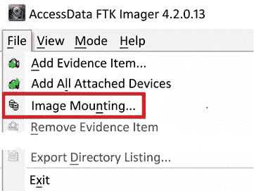

# 第二章：法医分析过程

现在我们将讨论法医分析过程。作为法医调查员，你需要制定一项战略，以便高效地进行调查。你还需要确保熟悉你的工具及其提供的结果。没有流程，你会浪费时间检查那些对调查没有影响的数据，并且无法依赖你的工具。此外，你还需要确保使用的工具能提供有效的结果。最后，为了做到全面和高效，你必须运用批判性思维来确定最佳的调查或检查方法。

尽管每项调查都有相似之处，但你会发现一些差异，这些差异要求你制定一个检查策略以提高效率。我个人不喜欢保留一个检查清单，因为有些领域并不相关，例如不同的操作系统、网络的物理拓扑、犯罪分子和嫌疑人等。这些变量确保了没有两项调查或检查是完全相同的，并要求调查员为每项调查制定不同的策略。

法医分析过程由五个子集组成：

+   预调查注意事项

+   理解案件信息和法律问题

+   理解数据采集

+   理解分析过程

+   报告你的发现

接下来的部分将详细讨论这些内容。

# 预调查注意事项

预调查是你确定进行法医检查所需的能力和设备规格的阶段，无论是在现场还是实验室环境中。此时需要确定你的硬件、人员和培训预算。部分成本不是一次性支出，而是持续的预算开销。设备必须更新，人员培训需要保持，随着新技术的出现，还需要购买新的技术。

成为一名数字法医调查员，不仅仅是购买设备、参加培训课程，并且之后再也不更新这些东西。随着技术的变化，隐藏数据或进行犯罪活动的方法也在变化，因此调查员必须随时准备适应这些变化。

在准备开始调查之前，你必须先做好准备工作。这将提高效率，并带来更好的工作成果。这包括准备设备，并熟悉当前的法律和法律裁决，以及组织的政策和程序。

一些设备可以重复使用，另一些则不能。对于一次性物品，确保在事件结束后有人及时更换它们。

**注意**

我无法告诉你我有多少次带着我的“随身”工具包赶到现场，结果发现另一位侦探已经使用过它并且没有更换消耗品。那是我没有在出发前检查它的错误，也应该是我的搭档没有更换物品的错误。

接下来我们将讨论你作为调查员将使用的设备。

## 法医工作站

每当你把法医调查员聚集在一起时，一个常见的话题是法医工作站。多少**随机存取内存** (**RAM**)? 多少**固态硬盘** (**SSD**)? 使用哪个**中央处理单元** (**CPU**)? 哪种**操作系统** (**OS**)? 这些都是你可能会常常听到的问题。关于法医工作站的配置，总会有不同的看法。没有任何一种观点是错误的，因为调查员的工作站配置取决于他们的预算以及正在调查的案件。

法医工作站不便宜。根据调查员的技能水平，他们可以自己组装工作站，或者购买一台预制的法医工作站。多家供应商会根据你的规格配置工作站。例如，可以考虑供应商 SUMURI（[`sumuri.com`](https://sumuri.com)）及其 TALINO 工作站。基础型号的价格大约为 8,000 美元，配置如下：

+   英特尔 Core i9-10900X 3.7 GHz 10 核 LGA 2066 处理器

+   32GB DDR4 2666 MHz RAM

+   500GB M.2 NVMe SSD

这是一台基础法医工作站，你仍然需要为法医图像添加存储。高端版本的价格超过 18,000 美元，配置如下：

+   双英特尔 Xeon Gold 5220 18 核处理器

+   128GB DDR4 RAM

+   1TB SSD 用于操作系统

+   1TB M.2 NVMe SSD 用于临时文件和处理

+   2TB M.2 NVMe SSD 用于数据库

+   八块 6TB 硬盘配置为 RAID 10，用于证据存储

+   一款 30 系列 GDDR6 **图形处理单元** (**GPU**)，例如 NVIDIA RTX 3070 或 3080

法医调查员在使用法医工作站时可能会遇到的一个瓶颈是数据传输。我建议使用 SSD，因为它们的传输速度远高于典型的机械硬盘。高速的 CPU 和大量的 RAM 能够为法医分析提供最佳性能。然而，这些机器不便于携带，且你并不总能在工作站的相对舒适环境中进行分析或获取数据。法医笔记本电脑也是一项昂贵的设备。打印时，TALINO OMEGA 配备了：

+   英特尔 Core i9-11900K 处理器

+   64GB DDR4 2933 MHz RAM

+   500GB M.2 NVMe SSD 用于操作系统

+   250GB M.2 NVMe SSD 用于临时文件和处理

+   1TB M.2 NVMe SSD 用于数据库

+   2TB M.2 NVMe SSD 用于证据文件

+   NVIDIA GeForce RTX 3080 GPU，配备 16GB GDDR6 视频内存

**注意**

你需要在两台工作站上都包含千兆以太网接口，以便在局域网上进行通信。

如你所见，数字取证工作站永远不可能有过多的 CPU、RAM 或存储空间。我描述的设备属于高端设备；你也可以使用较便宜的设备进行数字取证检查，并且依然能达到相同的结果。此外，更高端的设备将减少所需的时间。如果你是跨国公司或大型执法机构的成员，你可能有预算购买高端设备。较小的执法机构、小型组织或单独执业的人员则需要根据自己的情况确定更合适的成本。

有时你必须离开实验室，这意味着你需要额外的便携设备。我们现在来讨论一下你反应包中所需的设备。

## 反应包

数字证据并不总是直接送到你的工作空间。有时，你可能需要前往第三方地点去获取这些证据。收集证据是你进行任何数字取证检查的基本构建块。就像在你的工作空间进行检查一样，你需要合适的工具和辅助设备来完成这项任务。你需要准备一个反应包，其中应包括文书材料、笔和存储容器来存放数字证据。

反应包是每个数字取证调查员独特的。没有哪个包是完美的；所有的包都始终可以改进。你反应包的目标是让你拥有收集数字证据所需的所有物品，我们将讨论一些在我经验中有帮助的设备：

+   **数码相机**：能够进行静态和视频录制。你需要记录到达现场时的情况。如果你在正式的诉讼程序中作证，你将向法庭展示你到达时所看到的事实。一些组织还会录制数字取证调查员在收集数字证据时的所有活动。

    **注意**

    一点建议：我会禁用麦克风，以避免录制音频。你可能会就如何继续进行讨论使用一些可能被视为不太专业的语言。这些讨论和语言使用可能会成为对方在呈递证据时的干扰。

+   **乳胶或丁腈手套**：这些手套保护了证据收集的多个方面——你不会留下指纹，并且还能保护自己免受现场可能存在的生物危害。我指的是血液、尿液、粪便和你能想到的任何其他生物液体。

+   **记事本**：你需要记录现场的操作。记事本是保存这些信息的完美工具。你可以记下你与谁交谈，谁确保了现场的安全，以及案件的基本事实。当你开始调查时，大量信息会涌向你，如果没有记录，可能很容易忘记某个具体的操作。一些组织还会手写草图，标明数字证据的收集位置。你所在组织的政策和程序将决定是否需要草图。

+   **组织文件**：这可能是用于扣押证据的财产报告，其中列出了所扣押物品的具体信息，包括物品的来源、物品上的特定标识或序列号。你还可以附上标签或标识来识别含有数字证据的物品。

+   **纸质存储袋/抗静电袋**：你必须将数字证据的容器存放在某个地方，以防止未经授权的访问。数字证据非常脆弱，你要确保存储方式不会产生静电。静电可能使存储介质无法使用，从而导致无法访问任何数据。

+   **存储介质**：硬盘可以是传统的旋转磁盘或固态硬盘（SSD）和 USB 设备。企业数字取证调查员通常不会关闭服务器来创建取证镜像，而是会以日志文件、RAM 或用户目录等形式收集特定数据集，并将它们存储在适当大小的存储介质上。

+   **写保护设备**：这可以是硬件设备，例如 Tableau TK8u USB 3.0 取证桥（[`security.opentext.com/tableau/hardware/details/t8u`](https://security.opentext.com/tableau/hardware/details/t8u)），它允许你访问存储设备而不改变其内容。我们将在*第三章*，*证据采集*中详细讨论证据采集。此外，你还可以使用取证启动盘，如 SUMURI 的 PALADIN，这是基于 Ubuntu 的 Linux 发行版，允许以取证可靠的方式收集数字证据。SUMURI 提供 PALADIN 的免费版本下载，网址为[`sumuri.com/software/paladin`](https://sumuri.com/software/paladin)。

+   **频率屏蔽材料**：这可能包括商业铝箔、法拉第袋或任何能屏蔽无线电传输的容器。当你扣押移动设备时，将使用这些材料，以防止用户远程清除或重置设备。然而，请注意，将设备放入这些容器后，电池会迅速耗尽，因为设备会尝试重新连接网络。如果你能访问移动设备的菜单，可以将设备切换到飞行模式。这样，设备将不再尝试连接到网络。确保记录你对设备所做的任何更改。

+   **工具包**：一个小型精密工具包，配有多种螺丝刀头，用于拆解笔记本电脑、台式机或移动设备，以访问数字存储介质。你需要确保拥有多种螺丝刀头，以适应不同制造商使用的螺丝。有时，制造商会使用两种或三种不同类型的螺丝头来组装他们的设备。

+   **杂项物品**：这可以包括额外的电源线、数据线、USB 集线器、螺丝或任何在深夜到达目标地点时可能难以获得的物品，那时你可能无法去商店购买缺失的物品。如果你正在响应商业现场，建议带一个备用鼠标和键盘，以防需要访问服务器时这些设备不可用。（如果你进行的是基于网络的调查，你可能还想带上一个网络探测器。）这个子集包含了那些你认为不需要的物品，直到你到现场才发现它们非常重要。

+   **法医笔记本电脑**：确保你的所有软件都是最新的。我建议创建一个文件夹，包含你将使用的任何表格的数字版本、你需要记录的任何流程，以及你认为对完成任务有帮助的任何应用程序。

+   **加密**：如果你要出国前往目标地点，可能需要加密包含所需分析数据的目标驱动器。安全服务或海关没收设备的情况并不罕见。这将确保你所获取的数据不会被泄露。

+   **软件安全密钥**：这也被称为加密狗。你会发现有些商业软件要求插入基于 USB 的安全密钥才能使用。你需要确保随身携带这些密钥，因为没有安全密钥，软件是无法使用的。

**注意**

一个叫做 VirtualHere 的程序（[`virtualhere.com/home`](http://virtualhere.com/home)）允许你远程使用 USB 设备。你在目的地和家中插入 USB 密钥的地方都需要网络连接。如果你不确定网络连接的质量，建议你将密钥随身携带。

现在，关键问题是：你如何将这些物品从一个地点搬运到另一个地点？

我的推荐是选择一个类似 Pelican 的防水防压箱，以保护设备。如果你必须乘坐美国的商业航班，还需要包含一个符合 TSA 要求的锁具。

我们刚才讨论的物品清单仅为建议。你可以根据手头任务的需求对这个清单进行添加或删减。没有绝对正确或错误的答案来配置你的响应工具包。预算、组织结构和当前任务将决定所需的设备。

政府/执法机关的数字取证调查员可能会在现场获取完整的取证镜像，因此他们需要更大的存储设备。随着经验的积累，你将能够准确判断在执行任务时所需的设备。

结果是，当你离开办公室去获取数字数据或应对任何事件时，你需要一个响应工具包。如何装备这个工具包完全取决于你，作为取证调查员。关键在于让你的工作更加轻松高效。

上面已经介绍了一些所需的硬件和物理设备。接下来我们将讨论软件部分。

## 取证软件

这是你将用来分析数据的软件。你可以选择使用为取证过程设计的商业软件或开源工具。你需要确保在工作环境中使用的是完全授权的软件。

没有什么比组织使用盗版软件进行调查，更让人尴尬的了，而且这种事实如果在行政或司法程序中曝光，将会对你的声誉造成严重打击。如果你使用盗版软件进行调查，不仅会质疑你的诚信和道德，还会质疑你的调查结果以及取证工具提供的结果。我必须强调：你必须在取证过程中使用完全授权的软件。那么，开源工具和商业工具之间有什么区别呢？

供应商通常会将开源软件免费提供给任何人使用。通常，开源软件的使用没有任何限制；你可以用于教育、盈利或测试目的。积极的一面是，在大多数情况下，它是免费的。负面的一面是，如果出现问题，你几乎得不到技术支持。完全取决于你的技能水平和使用这些工具时的舒适度。此外，许多开源工具采用**命令行界面**（**CLI**），而非**图形用户界面**（**GUI**），这可能会让新用户感到害怕。

商业工具通常会提供更好的客户支持、文档和及时的更新。缺点是，你需要为这些服务付费。实际上，大多数情况下，任何商业取证工具能够做到的事情，开源工具也能做到。商业工具可能会执行多种功能，而在开源框架中，你可能需要使用不同的开源工具来完成相同的任务。

两种选择都没有错。作为数字取证调查员，你必须了解数据的来源，并确保工具能够准确地反映数据。不论该工具是开源还是商业版，都必须验证工具提供的结果。我们将在本章稍后讨论验证的内容。

我经常收到关于某个特定软件是否被法院认可的问题。取证软件并不是法院认可的，但你需要在行政/司法过程中解释你使用的工具是否能产生可靠的结果，并且这些结果是否被取证界所接受。

在美国，这被称为达伯特标准，来源于最高法院案件**达伯特诉美瑞尔·道药品公司** 509 U.S. 579 (1993)。该标准用于确定专家证人的证词是否基于科学有效的推理，并且是否可以适当地应用于案件事实。法院考虑的因素如下：

+   该理论或技术是否可以或已经经过测试

+   是否已经经过同行评审并发表

+   已知或潜在的错误率

+   标准的存在与维护

+   它在科学界的接受程度

最初，法院仅使用科学证据的标准。这一点在**库姆霍轮胎公司诉卡迈克尔案** 526 U.S. 137 (1999) 中发生了变化；最高法院澄清了达伯特裁决中使用的因素也可以适用于非科学证词，即工程师和其他非科学家的专家证词。因此，正如你所看到的，关键不在于使用的软件，而在于数字取证调查员的专业知识。商业取证工具简化了过程，有时还具有**查找证据**按钮。然而，作为数字取证调查员，你仍然需要知道取证工具是从文件系统中的哪里提取的证据。（你所在的地区可能有不同的看法。）

**国家标准与技术研究院**（**NIST**）资助了**计算机取证工具测试项目**（**CFTT**）([`www.nist.gov/itl/ssd/software-quality-group/computer-forensics-tool-testing-program-cftt`](https://www.nist.gov/itl/ssd/software-quality-group/computer-forensics-tool-testing-program-cftt)），该项目通过制定通用工具规范、测试程序、测试标准、测试集和测试硬件，建立了计算机取证软件工具的测试方法。该项目在其网站上提供了用于测试取证工具结果的来源。他们还提供了一些测试媒体，供你验证取证软件时使用。将取证工具的结果进行验证，至少每年一次或每次工具更新时进行验证，是你的最佳实践之一。无论你是政府还是私营部门的数字取证调查员：你需要对你的工具有信心，并能够证明你已经测试并验证了这个过程。

2011 年，在凯西·安东尼（Casey Anthony）一案的审判中，这一验证过程受到质疑。凯西·安东尼面临以下指控：一等谋杀、严重虐待儿童、过失杀人及四项向警方提供虚假信息的指控，警方正在调查她孩子的死亡。在审判过程中，检方提出了一个重大主张，称有人在安东尼的电脑上搜索了“氯仿”一词 84 次。然而，在审判进行时，发现数字取证调查员使用的取证工具错误解读了互联网历史数据库中的数据。用户实际上只访问了该网站一次，而不是报告中的 84 次。该取证工具的软件设计师在审判进行期间意识到了这一错误，并通知了审判团队。我的建议是，你应该使用多个取证工具来验证你的发现。例如，你可以使用两个商业取证工具，或者一个商业工具和一个开源工具，或者两个开源工具，但你需要验证你的发现。

一些开源取证工具包括以下内容：

+   **Autopsy**: Autopsy 是一套完整的取证工具，允许你进行全面的取证检查。它是免费的，可以在 [`www.autopsy.com`](https://www.autopsy.com) 找到。

+   **SIFT Workstation**: SIFT 是一款虚拟机，使用 Ubuntu 操作系统并预装多个取证工具。它是免费的，可以在 [`digital-forensics.sans.org/community/downloads`](https://digital-forensics.sans.org/community/downloads) 找到。

+   **PALADIN Forensic Suite**: PALADIN 是基于 Ubuntu 的实时 Linux 发行版，并在名为 PALADIN 工具箱的用户界面中实现了多个开源取证工具。它是免费的，可以在 [`sumuri.com/software/paladin/`](https://sumuri.com/software/paladin/) 找到。

+   **CAINE**: **计算机辅助调查环境**（**CAINE**）是一个数字取证项目，提供图形用户界面和多个开源取证工具，且免费提供。你可以在 [`www.caine-live.net/`](https://www.caine-live.net/) 找到它。

这些只是一些开源取证工具套件，可能还有其他我没有提到的工具，或者你可能希望使用单一用途的工具。只要你能够找到揭示调查事项真相的证据，使用什么工具并不重要。关键是利用你的培训和经验来解释证据的相关性，并阐明你是如何判断工具提供可靠结果的。

这里有一些适用于基于 Windows 的用户的商业取证工具：

+   **X-Ways Forensics**: [`www.x-ways.net/`](https://www.x-ways.net/)

+   **EnCase**: [`www.guidancesoftware.com/encase-forensic`](https://www.guidancesoftware.com/encase-forensic)

+   **Forensic Toolkit**（**FTK**）：[`accessdata.com/products-services/forensic-toolkit-ftk`](https://accessdata.com/products-services/forensic-toolkit-ftk)

+   **Forensic Explorer**（**FEX**）：[`www.forensicexplorer.com/`](http://www.forensicexplorer.com/)

+   **Belkasoft Evidence Center**：[`belkasoft.com/ec`](https://belkasoft.com/ec)

+   **Axiom**：[`www.magnetforensics.com/products/magnet-axiom/`](https://www.magnetforensics.com/products/magnet-axiom/)

以下是一些基于 Macintosh 的工具：

+   **Cellebrite Inspector**：[`cellebrite.com/en/inspector/`](https://cellebrite.com/en/inspector/)

+   **RECON LAB**：[`sumuri.com/software/recon-lab/`](https://sumuri.com/software/recon-lab/)

+   **RECON ITR**：[`sumuri.com/software/recon-itr/`](https://sumuri.com/software/recon-itr/)

一款基于 Linux 的工具是**SMART**：[`www.asrdata.com/forensic-software/smart-for-linux/`](http://www.asrdata.com/forensic-software/smart-for-linux/)

这只是一些可供使用的商业取证工具的示例。每个工具都有其优缺点，同行们可以在这些问题上进行无休止的讨论。

目前，我更倾向于将 X-Ways 作为我的主要工具，并通过 FEX 和 Belkasoft Evidence Center 进行补充。

你可以拥有所有工具、软件和硬件，但如果没有培训，你能有多有效？接下来是一些你可以考虑的培训选项。

## 取证调查员培训

如果你走上了数字取证的职业道路，你将需要不断提升自己的技能和培训，这应该视为一项持续的开支。仅仅通过一个 40 小时的课程，并不能自动使某人成为一名数字取证调查员。相反，他们只是踏上了这条职业道路的第一步，但他们仍然需要继续参加培训课程，并与其他志同道合的同行交流。

认证并不意味着用户一定知道自己在做什么。相反，认证表明用户达到了获得该认证的最低标准。有很多认证可供选择，其中一些比其他的更有价值。在加入某个组织并参与其认证过程之前，你必须做好尽职调查，了解认证的费用、可用性以及该认证在取证社区中的接受度。大多数认证机构都会要求每年缴纳会费，并有年度培训要求，以便重新认证。某些工具和供应商特定的认证会测试你使用供应商取证工具的能力，以及对数字取证基本知识的理解。另一类是工具无关的认证，你可以使用任何工具来完成认证过程。

以下是一些可用认证的列表：

+   **Certified Forensic Computer Examiner (CFCE)（工具无关）**：[`www.iacis.com/`](https://www.iacis.com/)

+   **EnCase 认证检查员**（**EnCE**）（工具特定）：[`www.Opentext.com/products-and-solutions/services/training-and-learning-services/encase-training/certifications`](https://www.Opentext.com/products-and-solutions/services/training-and-learning-services/encase-training/certifications)

+   **ACE**（工具特定）：[`training.accessdata.com/exams`](https://training.accessdata.com/exams)

+   **计算机黑客取证调查员**（**CHFI**）（工具无关）：[`www.eccouncil.org/programs/computer-hacking-forensic-investigator-chfi/`](https://www.eccouncil.org/programs/computer-hacking-forensic-investigator-chfi/)

+   **全球信息保障认证**（**GIAC**）（工具无关）：[`www.giac.org/certifications`](https://www.giac.org/certifications)

+   **认证取证 Mac 检查员（CFME）**（工具无关）：[`sumuri.com/mac-training/`](https://sumuri.com/mac-training/)

现在我们已经探讨了设备和培训选项，接下来你还需要通过了解与调查相关的法律和案件信息来做好准备。所以，我们接下来将讨论法律问题。

# 理解案件信息和法律问题

让我们来讨论案件信息和法律问题。在你启动工作站查看数字证据之前，必须获取这些信息。你需要从请求你服务的人员那里收集信息。你最好问以下问题：

+   这次调查的性质是什么？例如，它是一起毒品案件、凶杀案件还是员工不当行为？在你听取这些信息时，你需要制定出如何继续进行的计划。

+   你预计在现场能找到哪些数字证据？我曾经遇到过这样的情况，调查员只在寻找一台笔记本电脑，但当我们到达现场时，发现了多台笔记本、多台桌面电脑以及许多移动设备。请记住，你获得的信息可能并不总是准确的，因此你还需要做好准备应对这种可能性。

+   法律依据是什么？对于执法机构——搜索的理由是什么？同意吗？搜查令吗？无论是书面同意还是书面搜查令：你都需要阅读搜查令和同意书，以了解搜查所施加的限制。这些限制可能是现场的物理限制，也可能是你在数字设备上可以搜索的内容的数字限制。

+   作为一名政府和企业的数字取证调查员，我曾多次受到限制，无法在数字设备上搜索或查看某些内容。要了解这些限制；如果你发现与调查权限范围无关的相关证据，它们不能在案件中使用，如果使用它们，你可能会面临处罚。

+   涉事者和嫌疑人是谁，他们在调查中扮演什么角色？现在，根据你的角色，你可能会或可能不会与相关的涉事者和嫌疑人接触。然而，如果你有这个能力，试着与他们交谈。如果你能与他们进行文明对话，你可能会获得关于数字容器和数据的额外信息。

如果你在想，“我们已经从第一批回应者那里收集了信息，也已经收集了涉及的其他主题的信息；现在我们可以直接开始收集证据！”——嗯，还没有。你需要确保犯罪现场已经得到了充分的记录和保护。对于执法部门来说，这包括清除现场的多余人员、限制访问权限，并允许某人记录现场情况。

最简单的方法是拍摄一切。他们可能会要求你在 12 个月、18 个月、24 个月甚至更久后出庭作证。律师可能会问你某个特定物品的位置，除非你有现场的照片（或草图），否则你可能无法回答这个问题。

对于公司调查——例如，在一个机密地点发现了隐藏摄像头——你该怎么办？发现者的行为可能会妨碍你的调查。例如，我曾调查过一个位于男女共用洗手间的隐藏摄像头。一位洗手间用户发现摄像头时，固定它的胶带松脱，摄像头掉到了地上。该用户将摄像头交给了他们的上司。上司打开摄像头并取出了数字存储卡。然后，他们将存储卡插入读卡器并接入电脑。在与我联系之前，至少有五个人接触了摄像头和 SD 卡，并将其插入了多个电脑系统。每次插入 SD 卡，他们都会更改证据。当你访问 SD 卡上的数据时，你会更改所访问文件的日期和时间戳。一个组织必须培训其成员在发生事件时不要查看数字证据，并应该联系专业人员。这将确保证据在保持其原始状态的情况下，可以在司法或行政程序中呈现。

这个案件需要采访所有涉事人员，处理数字摄像机和 SD 卡，并检查五个工作站。由于这是一个公司环境，且最初执法部门不会介入，我拍摄了工作站和连接的照片，以识别特定的工作站及其用户。记住，我们处在一个公司环境中，随处可见相同型号的多版本计算机。

有时你会在别人收集数字证据后才接手。你仍然必须提出问题，而你答案的来源可能仅限于调查报告。你将希望知道以下内容：

+   为什么会没收这个物品？

+   它是否包含犯罪活动的证据或被认为是有利于被告的证据？

+   这个物品是否有完整的物证链？

+   有多少人曾接触过它？

+   这个物品是在哪里找到的？

+   它是在受保护的地点还是现场的公共区域找到的？

+   是否有日期和时间的参考信息？

+   调查应该集中在哪些方面？

+   调查员何时需要数字取证检查的结果？

在你开始证据收集过程之前，需要查看相关文档。当调查员将包含数字证据的容器（如计算机）交给你时，你需要确保搜索令状授权了扣押这些物品。曾经发生过一些案件，尽管包含数字证据的设备已被扣押，但在使用这些数字证据方面存在灰色地带。

搜索令状将对你的搜索活动做出限制。例如，如果是调查非法图像，你可能只能查看图像。你有责任阅读所有的司法文书，理解它们授权的内容和不授权的内容。只有这样，你才能制定计划，确保你的行动在规定范围内。

你还需要预见到在进行数字取证检查时可能遇到的问题。例如，是否有某些调查方面是你培训和经验不足的领域？这并不是什么可耻的事情，但应该被承认，这样你可以寻求帮助以提升你的培训和经验。你有哪些资源可以帮助你？

一旦法律准备工作完成，我们就可以进入下一部分的流程。现在，你必须以法医合理的方式获取数据。

# 理解数据获取

那么，让我们回顾一下：你已经接受了数字取证调查员的培训，并可能已经获得了认证。你已经搭建或购买了数字取证工作站和取证笔记本电脑，并且创建了应急工具包。你已抵达现场并确保现场已被妥善保护。你已经验证没有人更改现场，并且通过拍照记录了现场。现在，是时候处理现场并收集数字证据了。接下来，我们将讨论数据的获取，也就是证据的获取。

在多种情况下，可能有人要求你为数字取证调查获取数据。例如，作为一名执法人员，你可能会到现场，识别潜在的数字取证证据来源，然后扣押这些物品。作为一名私营部门或公司调查员，你可能会被要求获取员工的工作站，或响应服务器机房（无论是通过物理访问还是远程访问）来收集你需要分析的数据。我们将在下一部分讨论的程序可以在每个环境中使用。

一个潜在证据来源是易失性内存。过去，易失性内存中包含的数据常被忽视，采取的是“拔掉插头”的心态。这取决于执法人员是否响应现场并且计算机已经开机运行。最佳做法要求执法人员拔掉电源来关闭系统。

然而，易失性内存在系统运行时才可用。因此，当调查员拔掉电源时，他们丧失了所有这些数据，包括任何潜在的证据。随着数字取证领域的发展，我们已经了解到，以前我们认为的最佳做法，实际上并非如此。

为了收集易失性证据，我们应从最易失性的开始收集。这就是所谓的**易失性顺序**，其顺序如下：

1.  活系统

1.  正在运行

1.  网络

1.  虚拟

1.  物理

我们在收集易失性数据时，采取的心态与创建法医镜像相同。你必须记录你采取的步骤，因为在收集易失性数据时，你会与机器进行互动，这会改变证据。实际上，你所做的更改通常不会影响你正在调查的内容。但你应该意识到系统正在发生变化；在行政或司法程序中作证时，你可能会被问到关于证据潜在更改的问题。如果你不知道答案，可能会在职业上感到尴尬。

你在收集易失性数据时所做的更改将影响内存中发现的进程。这就是为什么你需要做笔记并记录你所做的每一件事。一些我们收集的易失性数据示例包括系统的当前状态、网络信息（如 ARP 表、连接、路由表和名称缓存）、登录的用户、运行的服务、运行的进程、共享驱动、远程活动以及打开的加密容器。

我们必须平衡所做的更改与可能永远丢失的证据之间的关系。“法医合理的方式”意味着在收集过程中留下尽可能小的足迹，以最小化数据被更改的量。收集易失性数据的顺序非常重要，因为如果你以错误的顺序收集易失性数据，你可能会破坏你正在寻找的证据。内存被认为是所有易失性数据中最易失的，因此我们会优先收集它。

请记住以下几点：

+   根据你在现场遇到的具体情况，收集易失性数据可能并不总是可行的。

+   如果你发现机器上正在运行一个破坏性进程，并且你想收集的信息正在被改变或覆盖，你可能不想花时间收集内存，因为证据正在被篡改。

+   如果是远程连接引发了破坏性进程，你需要记录该连接，切断连接，然后收集内存。再次强调，这取决于你的调查以及你尝试获取的信息。

+   如果攻击者是通过远程连接并访问高度敏感的数据，您希望攻击者在您收集 RAM 时保持访问权限，还是希望中断连接？如果这不是关键信息呢？

+   您是否希望在继续处理的同时让攻击者继续访问？

最终，数字取证的目标是创建一个用于分析的法医镜像。因此，在正常情况下，在收集过程中不适宜更改数字证据。

在今天的环境下，这并非总是可能的。由于全盘加密或完整卷加密的容易获取，直接切断计算机系统的电源已不再被接受。

让我们稍微绕一下话题，谈谈什么是加密。从基础上讲，加密是对信息进行编码，以保护信息的机密性，并仅允许拥有解密密钥的人访问它。所有的加密都可以被破解，如果攻击者有足够的时间。

以今天的设备水平来看，这个时间因素被测量为数百年。随着技术的发展和处理能力的提高，解密顶级加密所需的时间在减少。因此，曾在 1990 年代被认为安全的加密，现在已经被认为是脆弱的。这就是为什么如果系统可能使用了加密，切断电源就显得至关重要。没有解密密钥，您无法访问数据。

每个情况、每个犯罪现场和调查都会不同，这意味着您采取的行动将基于您遇到的特定情况。利用您的问题解决技巧，并根据您所掌握的有限信息快速做出决策。

现在我们有了证据，我们如何保持对其的控制呢？让我们来谈谈证据链。

## 证据链

保持**证据链**是保存和验证物理及数字证据以供行政或司法程序使用的一个重要组成部分。证据链记录了所有对证据的访问，谁访问了它，何时访问以及为何访问。

NIST 提供了一个证据链文档，如下图所示。这是一个通用的证据链表格，您可以根据需要调整，并且可以在[`www.nist.gov/document/sample-chain-custody-formdocx`](https://www.nist.gov/document/sample-chain-custody-formdocx) 下载。该表格用于跟踪证据链，并在每次证据转交时进行记录：

图 2.1：一个证据表单

如你所见，某些字段可能与您无关。例如，作为一名企业数字取证调查员，您可能不需要**受害人**字段，因此您可以更改或完全删除它。

此表单的目的是追踪数字证据并保持控制，以便以后验证证据。在**证据描述**字段中，你需要描述承载数字证据的容器。它可以是不可重复使用的介质，例如为了后续检查而刻录了日志文件的 DVD。

在下图中，你可以看到**证据描述**部分。**物品**编号指的是一个顺序编号系统，用于帮助追踪物品。**数量**是物品的实际数量，**物品描述**字段显而易见：

图 2.2：证据的描述

例如，在前面的图中，DVD 被列为物品**CD-001**。你可能会扣押多个 CD 或 DVD，遇到区分一个磁盘与另一个磁盘的问题。这个问题不仅仅出现在 CD 或 DVD 上，也会出现在硬盘上。通常你不会仅仅扣押一件特定介质类型的物品。

我使用以下编号系统作为我的工作流程的一部分：

+   CD/DVD：**CD-XXX**

+   硬盘：**HD-XXX**

+   U 盘：**TD-XXX**

+   手机：**CP-XXX**

+   移动设备（非手机）：**MD-XXX**

**注意**

顺便提一下，你还需要在被扣押的物品上做一个永久标记，但应尽量避免以降低物品价值的方式进行标记。

你可以在下图中看到，硬盘标记为**HDD001**，并附有日期以及扣押该设备的警员的姓名首字母：

图 2.3：一块硬盘

当法医镜像创建完成后，该设备将在后续过程中被称为**HDD001**。

如果你不能在设备上进行写入而不永久性地降低其价值，如 iPad，请不要使用永久性标记笔写上**MD-XXX**。相反，使用粘性标签标记信息。

**注意**

使用一个适合你的系统。当你制定好系统后，确保每次都使用它。这样可以防止丢失证据或标记错误。

当我们到现场并扣押包含数字证据的物品和容器时，我们要确保这样做的方式是法医上可行的。因此，我们不会分析原始证据；我们会创建一个副本进行检查，以确保不对原始证据做出任何更改。

我们有三种选择来制作工作副本：

+   **法医副本**：这是源数据到目标设备的逐位复制。在今天的环境中，这并不常见。确保目标设备没有来自先前调查的旧数据。你不希望当前的数字法医调查和过去的调查发生交叉污染。我们将恢复已删除的文件、文件空白区和分区空白区。稍后我们将在本书中讨论如何擦除硬盘。

+   **法医镜像或法医证据文件**：我们创建源设备的逐位拷贝，但我们将这些数据存储在法医镜像格式中。这可以是**DD**镜像、**E01**镜像或**AFF**镜像。我们将源数据包装在法医镜像的保护外壳中。我们将恢复已删除的文件、文件空白和分区空白。

+   **逻辑法医镜像**：有时，我们仅限于访问特定的数据集。它们不允许我们访问整个容器。我们不能创建逐位拷贝的法医镜像/法医证据文件或法医副本。当我们从服务器提取数据且无法关闭服务器以从源硬盘创建法医镜像时，可以使用此方法。因此，我们可以对与调查相关的文件和文件夹进行逻辑复制。我们不会恢复已删除的文件、文件空白和分区空白。

在稍后的*第三章*中，*证据获取*，我们将讨论如何从我们已扣押的设备或现场扣押的数据中创建法医镜像。

现在我们已经讨论了在获取数据集时需要考虑的事项，我们将讨论在分析数据时需要理解的内容。

# 理解分析过程

一旦您从现场收集了数据，您就返回到实验室，现在是时候开始您的法医分析了。您会发现自己很快就会被存储设备中庞大的数据量压倒。您必须迅速确定存储容器中包含的信息是否与您的调查相关。

这就是在案例信息收集和法律问题阶段中，信息收集将发挥重要作用的地方。

因此，您必须捕捉调查中的五个 W（如*第一章*中提到的，*计算机基础调查类型*）。首先，将计算机系统上的活动与特定用户关联，并确定该用户为现实生活中的一个人。

如果调查已经识别出活跃的嫌疑人，您将把该嫌疑人与计算机系统上的用户进行关联。我们将讨论一些可以与商业或开源法医工具一起使用的指南。目标是理解这个过程，而不依赖于任何特定的法医工具。

现在我们已经讨论了在获取数据集时需要考虑的事项，我们将讨论在分析数据时需要理解的内容。

## 日期和时区

如果数字法医调查员忘记考虑日期和时区，可能会造成问题。例如，如果您仅在特定时区进行检查，而且所有扣押的数据来自同一时区，您面临的问题就微不足道。但如果数据来自多个时区，或者您旅行到不同的时区，如果不考虑时区问题，它们可能会引起一些混乱。

将取证计算机和工具设置为使用**世界协调时间**（**UTC**）作为标准参考框架有助于解决这个问题。同时，确保调整任何发生犯罪活动的时间段到 UTC 格式。操作系统/文件系统以不同的时区格式保存元数据并无帮助。你还必须考虑到嫌疑人可能已更改计算机上的时区设置，以隐藏其非法活动。时间线分析在进行取证检查时至关重要。

接下来，我们需要能够识别我们知道无关的文件，并即时识别违禁图像。我们可以通过哈希分析做到这一点。

## 哈希分析

什么是哈希值？哈希是文件或数字媒体的数字指纹。它是通过单向加密算法生成的。

数字取证中使用的标准加密算法是**消息摘要算法 5**（**MD5**）和**安全哈希算法**（**SHA-1**）。MD5 生成一个 128 位的数字指纹，而 SHA-1 则生成一个 160 位的数字指纹。使用哈希算法允许通过可变输入生成固定长度的输出。

如果输入中的一位发生变化，它将导致不同的输出。更多哈希信息将在本书后续提供。让我们通过下面的练习来看看这如何运作：

1.  创建一个包含`This is a test`文本的文件，文件名为`Hash Test.txt`：

图 2.4：哈希文本

1.  使用免费的 Jacksum 工具（[`jacksum.loefflmann.net/en/index.html`](https://jacksum.loefflmann.net/en/index.html)）获取哈希值：

    图 2.5：Jacksum 值

    正如你在上图中看到的，`ce114e4501d2f4e2dcea3e17b546f339`值是`F:\Hash Test.txt`文件的 MD5 标准长度输出。

    第二个值，`a54d88e06612d820bc3be72877c74f257b561b19`，是 SHA-1 的输出。无论我使用哪个取证工具，这些值都是这个特定文件的数字指纹。

1.  更改文件内容的一个部分：

    图 2.6：文本的变化

    我在句子的末尾添加了一个感叹号—一个非常小的变化—但是任何变化都会改变哈希值。

1.  再次使用 Jacksum，你将得到一个完全不同的哈希值：

图 2.7：Jacksum 值的变化

现在 MD5 值是`702edca0b2181c15d457eacac39de39b`，与原始值`ce114e4501d2f4e2dcea3e17b546f339`不同。

哈希算法生成的标准输出是单向过程。你无法输入字母数字值来反转过程，恢复哈希过程中使用的原始数据集。如果你有一个已知非法图像的哈希集，里面的值不能用来重新生成这些非法图像。

存在哈希集（多个哈希值的集合），用于识别已知的良好文件。这些文件对调查员没有意义，通常是操作系统或应用程序中使用的标准文件。使用已知的良好哈希集可以帮助你筛选出没有证据价值的文件。另一方面，如果你已经识别出有价值的文件，比如非法图像或被盗的已知文件，任何可能对调查员有用的数据也可以被突出显示。对于已知的坏文件，需要有人访问原始文件，以创建用来识别该文件的哈希值。

使用哈希分析可以在调查过程中节省一些时间和精力：

+   你可以用它来验证证据是否发生变化。

+   它可以用来排除文件。

+   它可以用来识别有价值的文件。

美国国家标准与技术研究院（NIST）创建了**国家软件参考库**（**NSRL**）（[`www.nist.gov/software-quality-group/national-software-reference-library-nsrl`](https://www.nist.gov/software-quality-group/national-software-reference-library-nsrl)），该库收集了来自多个来源的软件并创建了**参考数据集**（**RDS**）。

RDS 是一个大型哈希集，用于在进行检查时帮助识别已知的良好文件。RDS 对执法机关、政府和私人行业是免费的。有些文件在 RDS 中可能被认为是恶意的，例如黑客工具。调查员仍然需要将这些文件放入上下文中，看看它们是否被用于非法目的。RDS 不包含非法数据的哈希值，例如非法图像。

碰撞发生在两个不同的变量输入结果相同的固定长度输出时。这意味着两个不同的文件具有相同的哈希值，这显然不利于基于哈希值识别证据（根据我们之前的讨论）。然而，一些国家已成功操控变量输入，以创建相同的固定长度输出。

这是否意味着哈希技术已经过时？不，它并没有过时。至今在实际情况中，还没有发现两个不同的文件具有相同的哈希值。所有发生的哈希碰撞都是对文件进行了篡改。当独立的检查员分析这些篡改后的文件时，发现它们并没有任何用户可读的内容。虽然有担忧认为这会影响数字证据的可接受性，但在 2009 年的**美国诉施密特案**中，法院裁定文件碰撞的几率微乎其微，因此不构成问题。

现在我们已经确定了数字指纹，让我们确保文件得到了正确识别。

## 文件签名分析

接下来的步骤是进行文件签名分析，以确保文件扩展名与文件类型匹配。你在文件系统中找到的许多文件类型都已标准化，并拥有唯一的文件签名，用于向文件系统标识自己。这不是文件扩展名，例如具有`.doc`或`.docx`扩展名的 Microsoft Word 文档。

用户可以更改文件扩展名来隐藏罪证。进行文件签名分析的目的是确定文件签名和文件扩展名是否匹配。

以下截图展示了当文件扩展名与文件签名不匹配时，X-Ways 如何标记文件：

图 2.8：文件签名不匹配

文件扩展名将文件识别为 GIF 文件，但 X-Ways 已将其识别为 JPEG 文件。下一张图展示了该 GIF 文件的文件头：

图 2.9：文件头

GIF 文件应具有十六进制**47 49 46 38**文件签名，而不是十六进制**FF D8 FF E0**。在某些情况下，签名不匹配是由于文件系统的正常使用，而不是用户的操作。你必须检查数据，确保不匹配的原因可以归因于特定的用户。

加里·凯斯勒（Gary Kessler）创建了一个网站，可以根据文件扩展名或签名搜索数据库。你可以访问这个网站：[`filesignatures.net/`](https://filesignatures.net/)：

图 2.10：filesignatures.net

你可以通过文件扩展名或文件签名进行搜索。输入文件扩展名后，在本例中为`JPG`，你将得到与 JPEG 标准相关联的文件签名：

图 2.11：JPG 文件签名的结果

在确保文件已被正确识别后，我们需要识别系统中可能存在的任何恶意软件。我们可以通过防病毒程序来完成此操作。

## 防病毒

在几乎每次我进行的调查中，都会听到被指控不当行为的对象声称“是病毒干的”。你是否已经确定这是否是有效的说法？例如，系统上是否存在恶意软件，它是否在没有用户交互或知识的情况下导致了你正在调查的行为？

这是我们收集易失性数据的一个原因，用以查看在收集时系统上发生了什么。如果其他人已经收集了证据，而您手头只有取证镜像，您仍然可以扫描该取证镜像，帮助确定是否有人安装了恶意软件。一些取证工具允许您将取证镜像“挂载”为只读驱动器，然后您可以扫描文件系统，帮助确定是否安装了恶意软件。

FTK Imager 是由 AccessData 提供的免费工具，下载地址为 [`accessdata.com/product-download/ftk-imager-version-4.2.0`](https://accessdata.com/product-download/ftk-imager-version-4.2.0)，该工具允许您挂载取证镜像。

镜像挂载允许您将取证镜像挂载为驱动器或物理设备。您的查看模式为只读。挂载取证镜像有许多好处，例如可以像查看连接到计算机的设备一样，使用文件资源管理器查看它。此外，您可以原生查看不同的文件类型，使用杀毒软件扫描取证镜像，通过网络共享挂载的取证镜像，或从挂载的取证镜像中复制文件。

接下来，我们将在以下练习中讲解如何使用 FTK Imager 挂载取证镜像：

1.  要在 FTK Imager 中挂载取证镜像，您需要选择**文件**菜单，然后从菜单中选择**镜像挂载...**，如下图所示：

图 2.12：镜像挂载

1.  然后，它会向您展示**挂载镜像到驱动器**菜单：

图 2.13：挂载镜像

在对话框中，您需要选择要挂载的取证镜像。如果这是一个分段取证镜像，您只需指向第一个分段即可：

+   **挂载类型**：您可以选择**物理和逻辑**、仅**物理**或仅**逻辑**。如果选择**物理和逻辑**，软件会将取证镜像挂载为物理设备，并挂载任何逻辑分区。

+   **驱动器字母**：这是您希望看到取证镜像的地方。在前面的图中，显示下一个可用的驱动器字母是**M**。您可以选择任何可用的驱动器字母。

+   **挂载方式**：您有以下几种选择：

    +   **块设备 / 只读**：这将以块设备方式读取设备，这意味着执行物理名称查询的 Windows 应用程序可以查看挂载的设备。

    +   **块设备 / 可写**：原始证据不会做出任何更改。它会将您尝试进行的更改保存在缓存文件中。

    +   **文件系统 / 只读**：该设备作为只读设备，任何人都可以使用 Windows 资源管理器查看。

在下面的截图中，您可以看到我们已经挂载了一个取证镜像，并且该取证镜像中包含了分区：

图 2.14：挂载的镜像

系统已将分区挂载为驱动器**M**和驱动器**P**。现在，你可以选择你喜欢的杀毒软件对这些磁盘进行扫描，查看是否安装了任何恶意软件。

如果恶意软件已经安装，这仍然不能作为嫌疑人的辩解。确定发现的恶意软件是否能够执行嫌疑人所声称的行为。我曾调查过许多非法图像案件，其中被告声称恶意软件下载了这些图像。然而，我至今没有发现任何恶意软件能够搜索、找到、下载并根据内容分类存储在嫌疑人电脑上的非法图像。你仍然需要分析内容，以确定数字证据的背景。

现在，你可以开始分析文件系统和操作系统。我们将在本书的剩余部分讨论具体的取证信息。操作系统用于在应用程序和硬件之间进行通信。常见的操作系统包括 Microsoft Windows、Macintosh 和 Linux。几乎每一个在操作系统中进行的操作，不论是用户还是机器生成的，都将在操作系统中留下痕迹。你需要分析这些操作系统控制的痕迹，以确定用户是否犯了错误。

文件系统是数据的存储机制。文件系统独立于操作系统。文件系统跟踪数据存储的位置以及可用空间。文件系统有许多种，例如 NTFS、HFS+、FAT 32 和 Ext 4。某些格式与多个操作系统兼容，而某些则不兼容。例如，NTFS 是 Microsoft Windows 系统首选的文件系统。

一旦我们确定系统中没有恶意软件，我们就可以继续报告调查结果。

# 报告你的调查结果

我们现在处于流程的最后一步：编写报告。你已经完成了准备工作，购买了设备，参加了培训，并创建了响应工具包，当任务到来时，你及时响应并赶赴现场。你成功获取了案件信息，并在到达时处理了可能的法律问题。你收集了易失性数据，识别了数字证据容器，并在将其运输回实验室时妥善保管了证据链。接着，你进行了分析，发现了能够证明嫌疑人是否做了他们被指控的事情的证据。

那么现在该怎么办呢？你必须能够向非技术人员解释你的发现。你需要把一个非常技术性的话题，以非技术人员能够理解的方式进行阐述。这是数字取证调查员最具挑战性的方面之一，也是需要掌握的重要技能。

根据受众的不同，你可能需要创建不同版本的报告。你的目标读者将阅读并解读你的报告，而第三方可能会在司法或行政听证会上质疑你的报告。

## 报告中需要包含的细节

你需要提供足够的细节，以便回忆起发生了什么。在处理过程中做笔记会对你大有帮助。我曾多次没有按照这个建议去做，结果不得不重新进行处理，因为我没有记录下某些内容。你的笔记可以采取多种形式，比如手写笔记、电子笔记、截图或使用你最喜欢的法证工具内置的博客功能做的笔记。没有正确或错误的笔记方式，重要的是在过程中做好笔记。

那么，你想记录什么？以下内容可以给你一些启示：

+   主调查员与检察官/C-suite 高管之间的沟通

+   证据容器的状况

+   存储设备的具体信息（品牌、型号、序列号和状况）

+   嫌疑人、受害人和证人的个人身份信息（如果是刑事案件）

+   证人、响应团队、责任高层的个人身份信息（如果是民事案件）

+   使用的法证硬件

+   使用的法证软件

+   你检查了什么（即使检查结果没有发现有证据价值的内容）

+   你的调查结果

+   术语表（定义技术术语）

将所有内容整合在一起，以便非技术读者能够理解调查过程、你所采取的步骤以及你做出结论的原因。和数字取证中的其他所有事情一样，报告格式没有固定标准。你将根据雇主、报告接收者和个人偏好来调整报告格式。

我建议你在报告中包括以下内容。你应该将报告分为三个主要部分：

+   你的叙述

+   相关展品

+   支持性文件

叙述就是字面上的意思。在这一部分，你需要解释发生了什么，做了什么，以及这些意味着什么。你应该包括一份执行总结，突出关键点和结论，然后进入详细的叙述。在叙述中，你应该提供你所讨论的证据截图。不要在没有解释的情况下加上截图，也不要假设读者能够理解截图的相关性。你需要向读者解释截图的意义。确保你的截图集中在你正在讨论的证据上。

假设你的报告包含了违禁品的截图，例如非法图片。在这种情况下，你需要确保对报告进行适当的控制，以防止违禁品图片的意外泄露。你还需要创建第二份报告，删除违禁品图片，供不能合法拥有这些图片的读者查看。

在执行摘要之后，你应该包括基本的行政信息。接下来，识别涉及的各方，包括受害人、嫌疑人、证人和其他调查人员。

## 记录事实和情况

关于列出你分析的证据，你有两个选择。在一些更大的案件中，列出数字证据可能需要两页或更多。长篇累牍的清单并不会帮助读者理解你的报告。更可能的是，读者会跳过证据清单，直接跳到下一部分。如果调查没有涉及大量的数字设备，那么你可以在这里列出它们，包括那些没有发现有价值证据的设备。如果你有很多数字设备，我建议你只列出那些含有证据价值的设备，并将完整的证据清单放在报告的末尾。

你还应该列出法证图像创建的详细信息。我通常会在叙述部分包含收集细节的总结。然后，我会创建一个详细的法证图像创建步骤过程作为附件。再次强调，在报告的叙述部分给出一步步的过程并不能帮助读者理解这个过程。给读者提供法证图像过程的高层次细节，然后在其他地方提供详细信息，可以提高报告的可读性。

数字证据的分析将构成报告的主要部分。在这里，你将一步步地引导读者了解你发现的具有犯罪指控性质的证据以及为何该证据重要。我经常看到一些报告，某个特定的图像被强调为重要，但随后却没有解释为什么这个图像重要。是图像所在的位置重要，还是图像本身重要？解释为什么该特定证据重要，以及你是如何确定其重要性的。

**注意**

记住，你正在将一个技术性话题解释给非技术读者。不要列出重要文件并假设读者能理解哪些是重要的。

我发现按时间顺序呈现证据最为合适。例如，如果你正在调查非法下载受版权保护的材料，你会从潜在地识别计算机所有者以及任何可以识别特定用户的证据开始。然后，你可以展示用户在查找受版权保护的材料时进行的任何浏览器搜索，再到下载该材料的具体步骤。假设用户与其他人有关于该受版权保护材料的持续通讯，那么你可以利用这些通讯来支持你关于用户下载该版权材料活动的假设。

你也可以按主题展示证据。例如，如果你正在调查非法图片的拥有和分发，你可以展示表明用户查看了这些图片的证据。这将表明用户知道他们系统中的图片，并且是否主动与其他用户分享过这些图片。仅仅一张图片是不够的；你还必须找到操作系统的证据来支持你关于图片的假设。在撰写分析部分时，你需要避免做出绝对性声明。我见过一些法医报告处理非法图片时，调查员毫不含糊地声明用户知道该非法图片的存在。他们在缩略图缓存数据库中找到了相关图片。然而，图片在缩略图缓存数据库中的位置并不能绝对证明用户知道图片的存在。系统可以在不让用户知道的情况下将图片包含在缩略图缓存数据库中。所以，你在表述时要非常小心。不要包含个人意见—只提供事实信息。

我见过一些报告将证据描述为“令人不安的儿童图片”。“令人不安的图片”这一术语并非基于事实—它是一种个人观点。最好直接描述证据本身，而不要加入你对它的情感色彩。更好的描述可能是“描述一名年轻男性裸体，站在树林中的图片”。在描述归属于某个特定用户或人的证据时要小心。最难证明的事项是“谁在键盘前”。除非有视频证明嫌疑人**A**在特定时间确实在键盘前，否则你永远不能百分之百确定嫌疑人**A**进行过犯罪活动。在这里，你不应发表个人意见；不要假设某个项目的归属或用户身份。

## 报告结论

你叙述的最后部分是结论。这一部分是你可以基于在报告分析部分中描述的证据提出自己观点的地方。但你在表达观点时仍需小心。尽量没有偏见地审视证据，并判断事实是否再次验证了你的假设。如果你无法做出决定，可以在报告中写明这一点。记住，这并不总是关于证明嫌疑人的罪行或责任。你也必须提供证据来说明嫌疑人没有做他们被指控的事。

你可能会创建一个电子报告供分发；标准格式通常是 PDF。不论你使用何种格式，确保你对报告进行数字签名。数字签名会表明自你签署报告后没有人篡改过报告内容。

**注意**

记住，报告是你和调查的体现。如果你制作了一份质量差的报告，这会对你、调查以及你的组织产生负面影响。

校对至关重要。不要自己校对报告，应该使用同行评审过程。你会错过排版错误、糟糕的句子结构和不清晰的发现。你脑海中可能觉得清晰的内容，在书面形式中未必能准确表达。假设调查进入行政或司法程序，我可以保证对方将逐字逐句剖析你的报告，寻找不一致之处以及你没有客观的地方。

记住，如果读者不理解你关于发现的工件的描述，那么你的整个调查工作就白费了。

# 摘要

本章我们讨论了法医分析过程。你现在知道如何准备进行数字取证检查，从获取适当的设备到培训和认证。此外，你现在也理解了在没收数字证据之前获取信息的重要性，并确保与其他参与调查的人员或工作人员沟通。

我无法过分强调收集易失性数据的重要性；如果不这样做，你将失去大量潜在证据。接下来，我们讨论了进行检查的一些策略，以及操作系统工件和文件系统工件之间的区别。最后，我们讨论了如何报告你的发现，以便读者能轻松理解。

下一章将详细介绍证据获取的具体过程以及如何验证你的工具以创建无误的法医镜像。

# 问题

1.  以下哪项应包含在你的响应工具包中？

    1.  一台数码相机

    1.  乳胶手套

    1.  一种写入保护设备

    1.  以上所有

1.  你必须使用商业软件进行有效的法医检查。

    1.  正确

    1.  错误

1.  接收数字证据时需要问哪些问题？

    1.  为什么会没收数字证据？

    1.  链接的证据在哪里？

    1.  谁访问了证据？

    1.  以上所有。

1.  RAM 是最易失的证据。

    1.  正确

    1.  错误

1.  链接证据的文件 _____________。

    1.  谁控制了证据

    1.  谁目击了犯罪？

    1.  嫌疑人的指纹

    1.  以上都不是

1.  以下哪项最适合进行数字取证检查？

    1.  一份法医副本

    1.  一份法医镜像

    1.  一份逻辑法医镜像

    1.  B 和 C 都是

1.  以下哪项是哈希算法？

    1.  疾病控制与预防中心（CDC）

    1.  美国联邦调查局（FBI）

    1.  MD5

    1.  LSD

答案可以在书本末尾的*评估*部分找到。

# 进一步阅读

Warren Kruse 和 Jay Heiser, 《计算机取证：事件响应基础》（*Addison Wesley，2001*）

你可以从[`www.amazon.com/Computer-Forensics-Incident-Response-Essentials/dp/0201707195`](https://www.amazon.com/Computer-Forensics-Incident-Response-Essentials/dp/0201707195)购买本书。

# 加入我们的 Discord 社区

加入我们社区的 Discord 空间，与作者和其他读者讨论：

`packt.link/CyberSec`

