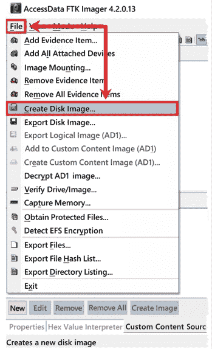

# 第三章：证据的获取

数字证据是调查人员可能处理的最不稳定的证据之一，任何细微的错误或不当处理都可能严重影响调查。例如，你可能会永远丢失数据或丢失其中的一部分。此外，数据的不经意操作可能会对你的调查能力产生怀疑，或质疑数据在调查中的完整性。本章将通过使用工具验证过程来最小化或消除这些问题，从而创建一个无错误且经过验证的法医影像。

本章将涵盖以下主题：

+   探索证据

+   理解法医检查环境

+   工具验证

+   创建无菌培养基

+   定义法医影像

# 探索证据

什么是证据？字典中的定义是可用的事实或信息集合，表明某个信念或命题是否真实或有效。现在看来，这似乎是一个简短、简单、常识性的答案，回答了一个简单的问题。实际上，当你考虑到某个司法管辖区的规定、法律和证据规则时，这个问题会变得更加复杂，而当考虑多个司法管辖区时，复杂度则呈指数增长。证据是由事实裁判者作出的判断。事实裁判者将决定证据是否符合该程序和司法管辖区的标准。

我举个例子：假设你正在调查一起谋杀案件，并且你在嫌疑人的车辆中发现了受害人和嫌疑人的血迹；在嫌疑人的袜子上发现了受害人的血迹；在现场发现了一只沾血的手套，而其配对手套则在嫌疑人的房子里被发现。

基于这些证据，你可能认为政府对嫌疑人有一个无懈可击的案件。但是，在这个案例中，辩方成功地对证据进行了辩驳和挑战，最终导致了嫌疑人的无罪释放。正如你所看到的，尽管某物是证据，如果它无法经受住对方的挑战，那么它就会成为一个负担。

我曾在数字证据的司法过程中担任过双方的工作，每一次，数字证据的数量之庞大让我惊讶不已，这些证据从未曝光。如果我们没有将证据提交给事实裁判者，那么在程序中它就不存在。任何一方都不会在程序中引用或提出这些证据，它们根本就不存在。

对方如何攻击事实裁判者已接受的证据？要么是通过攻击证据本身，要么是通过攻击与证据收集和分析相关的过程和人员。

考虑以下例子：

一名检查员分析了系统的缩略图缓存，看到一个 URI（**URI**是基于互联网工程任务组（IETF）创建的标准的**统一资源标识符**；在本实例中，它是一个文件路径）指向原始图像的位置。原始目标文件夹在系统中已不存在，缓存中的缩略图源图像也不复存在。

如以下截图所示，缓存中缩略图的源图像位于**bob**用户账户的**Picture Drive**中的**New**文件夹中。*图 3.1*显示了在缩略图元数据中找到的 URI：

图 3.1：来自缩略图的 URI

在以下截图中，您可以看到在相同缩略图缓存中的另一个缩略图元数据中找到的 URI。该路径与在 URI 图片中找到的路径非常相似。然而，这里有显著的差异——用户账户是**bobby**，而不是**bob**，并且**New**文件夹并不存在：

图 3.2：URI 图片：bobby

在被分析的系统上，未找到**bob**用户账户，也没有任何证据表明**bob**账户曾被创建或删除。数字取证专家修改了报告，并错误地声称，基于 URI 的相似性，**Picture Drive**在两次实例中是相同的。最初，数字取证专家指出，元数据中的 URI 代表文件路径，这些路径无法验证。

数字取证专家进行了第二次检查，发现**Picture Drive**上有一个名为**New**的已删除文件夹，并修改了报告以反映这一点。元数据中的 URI 代表证据项 HDD 001。**New**文件夹是在此日期和时间被删除的。（出于显而易见的原因，我没有使用确切的名称或日期。）

根据文件路径和当前的用户，无法判断元数据中的**New**文件夹是否与已删除的**New**文件夹相同。当律师质询数字取证专家这些不一致之处时，他们承认犯了错误。我认为他们犯错是因为文件路径的相似性，并未注意到具体细节。我完全相信，这个错误不是恶意或故意的，而是对方数字取证专家的一个诚实错误。正如你所看到的，有时一个简单的错误可能会引发更多关于证据收集、报告生成及其过程的疑问。

在我参与的另一起案件中，被告被控试图引诱儿童。在这一特定情况下，被告与**卧底警员**（**UC**）进行了交流，并向卧底警员发送了许多非法图片。当执法人员将被告拘捕时，被告接受了审讯，供认并写了一封道歉信。

供词、超过 400 页的聊天记录以及十多张非法图片作为证据提交到司法程序中。再一次，你会期望根据这些证据做出定罪。

在审判过程中，揭露了政府删除了一些短信，并编辑了供词录音的视频文件。司法机关向陪审团通报了被篡改的证据。此外，陪审团被告知，他们唯一能考虑的结论是，政府的代理人篡改了数字证据，以隐藏那些会妨碍政府起诉的事实。陪审团最终判定被告所有指控不成立。

如果你没有遵循组织的最佳实践、政策和程序，证据将无法进入法庭。如果有缺陷的证据被接纳，反方的攻击将削弱其效力。这些攻击可能产生足够的合理怀疑，从而导致无罪判决。

那么，我们该如何减轻对方的攻击呢？首先，不管你站在哪一方；如果对方认为你的发现会对他们的案件不利，他们就会攻击你的结论。

不要忽视正确的证据处理程序。正确的证据处理不仅仅是收集现场证据。当证据从现场运输到安全地点时，每当有人检查证据时，你必须保持证据的链条和安全。

在进行数字取证调查时，不要忽视使用正确的程序、方法论或流程。不要走捷径。

验证任何程序、方法论或流程。你必须经过验证过程；不能依赖第三方验证。你的验证必须能够在你或其他人执行时反复产生相同的结果。

准备并进行数字取证检查时，保持这样的心态：有人会审查你所采取的每一步，并质疑你做出的每一项发现。带着这种心态，你应该能够减轻对你数字取证检查的任何攻击。关键是，你必须做好准备。如果你没有为攻击做好准备，那么在司法/行政程序中作证时，你可能会显得不胜任。

我们已经讨论了证据，但你将在哪种环境下进行调查呢？现在我们将讨论如何控制审查环境。

# 理解取证检查环境

从我第一次参加 IACIS 的培训开始，我就一直听到一个词语，那就是*取证无误的检查环境*。虽然这个概念听起来复杂，但其实它是一个相对简单的概念：

+   数字取证检查员控制数字取证检查的工作环境。

+   除非数字取证检查员有意进行某个操作，否则不会发生任何操作。

+   当操作完成后，检查员将合理地知道预期的结果是什么。

这个概念不仅仅适用于物理位置，而是适用于我们完成数字取证检查或执行支持数字取证调查的任何地方。这可以是在实验室、办公室，或者是在收集数字证据的现场。

取证无误的检查环境是数字取证检查员的一种心态。你希望在支持数字取证检查时，做到有条不紊、彻底。这种心态有助于消除过程中可能发生的一些错误。

例如，组织派了两位同事前往偏远地区获取几台工作站。他们在 2 到 3 天内完成了数据获取。调查人员没有在现场对数据集进行筛查或检查数据集，但预期他们回到中央实验室后会完成这些工作。这个偏远地点距离数百英里远，一旦我的同事们离开，他们就无法返回获取源设备。一到达中央实验室，我的同事们开始进行数字取证检查。同事 A 开始检查其中一个取证镜像，作为过程的一部分，他们查看了文件系统的文件夹结构。在查看安装的程序时，他们震惊地发现嫌疑人的系统上安装了商业取证工具。当他们进一步深入文件系统时，开始发现一些上面有他们名字的文件。再次感到震惊；嫌疑人是如何获得同事 A 的信息的？

嫌疑人无法访问这些信息。

同事 A 在创建取证镜像时犯了一个错误。他们没有对嫌疑人的设备进行镜像，而是将取证笔记本的系统驱动器进行了镜像。在创建取证镜像时，他们忽视了细节。幸运的是，程序要求每位同事对源设备制作一个取证镜像，总共制作了两个取证镜像。

尽管这个故事让人尴尬，但没有产生长期后果，因为我们可以使用第二份备份。想象一下，如果你是同事 A，而没有第二份备份可用，你会有什么感受。你如何向上司或客户解释，你未能按要求完成任务，现在你无法访问源设备？

为了防止这种情况发生，我们将关注工具验证。

# 工具验证

早些时候，我们讨论过对你、你的检查和你的发现的潜在攻击。对方律师将集中关注你的检查方式以及你用于执行检查的工具。你化解对手律师攻击的能力与你的准备和检查期间创建的文件有直接关系。了解并遵循最佳实践对于成功捍卫你的行动至关重要。你如何做到这一点？通过继续教育。该领域不断变化，你必须保持对这些变化的了解。

详细程度可能会让新的数字取证调查员感到不知所措，因为他们需要知道如何成功地化解对手的攻击。虽然你不需要了解特定编程或代码工具使用的具体编程，但你需要知道工具找到的文物在文件系统/操作系统中的位置，这样你才能在作证或创建报告时充分解释清楚。我经常看到调查员依赖同事提供的清单或在互联网上找到的清单，但对清单上列出的项目为何存在或用于恢复文物的过程却知之甚少。这可能只是恢复一个已删除文件的简单过程。如果数字取证调查员无法解释文件系统如何处理用户请求删除文件的过程，以及工具如何恢复已删除文件，那么他们在作证时的时间将非常尴尬。如果你连基础都无法解释清楚，对方将质疑你的发现。

你需要确定你的工具是否产生有效结果。正如我们在*第二章*中之前讨论的那样，《取证分析过程》中，在 Casey Anthony 案件中，由于取证工具报告的错误，对方律师成功化解了数字证据。如果发现取证工具存在缺陷，那么该工具可能会被用来质疑考试的完整性和调查员的能力。

如何化解对你的流程或工具的攻击？

+   理解它们的功能

+   记录你的培训

+   在检查过程中记笔记

+   验证工具的有效性

你关于考试的证词、你的发现以及工具的使用是基于你的个人经验的。你不能对他人的验证作证。你不知道第三方使用了哪些参数。这个过程是你必须亲自进行的。使用已知数据集来测试工具，看它是否按预期执行。如果你不验证你的取证工具，如何证明它提供准确的结果？如果在法庭上被质疑，你该如何回答？对方律师重现你所做的取证考试并不罕见。对方将尝试使用相同的取证过程和取证工具来判断是否能得到相同的结果。如果他们使用相同的方法和工具得到不同的结果，会发生什么？如果他们使用相同的过程但不同的工具得到不同的结果，又会发生什么？如果你不验证你的方法和取证工具，如何为这种攻击做好准备，保护你自己或你的检查？

正如我之前提到的，**NIST**创建了**计算机取证参考数据集**。此外，你可以通过这个链接来帮助你验证工具：[`www.cfreds.nist.gov`](https://www.cfreds.nist.gov)。这些数据集*为调查人员提供了经过文档化的模拟数字证据集以供检查*。NIST 还提供了用于创建测试镜像的资源。

我们可以以多种方式使用这些数据集：

+   验证测试

+   能力测试

+   培训

使用你的数据集或第三方数据集时，必须确保有文档说明数据集中包含了什么内容，以及测试数据在数据集中所处的位置。在以下示例中，我们将使用 NIST 提供的 DCFL 控制镜像。

以下示例将使用两个取证工具：开源工具 Autopsy 和商业工具 X-Ways。如以下截图所示，文档中指出应有两个逻辑文件：

图 3.3：DCFL 控制镜像哈希值

文档中提供了逻辑文件名和扩展名、十六进制偏移量，以及该文件的 MD5 哈希值（记住，哈希值是文件的数字指纹）。

在以下截图中，我们看到的是 Autopsy 的界面，显示有两个逻辑文件（通过它们的文件扩展名识别）：一个图像文件和一个音频文件。

到目前为止，这与我们为控制镜像提供的文档是匹配的：

图 3.4：DCFL 控制镜像 – 文件类型

在以下截图中，我们看到的是 X-Ways 的界面，它也识别出了两个逻辑文件，这些文件名与控制匹配：

图 3.5：DCFL 控制镜像 – X-Ways 逻辑文件

在以下屏幕截图中，我们查看的是 Autopsy 提供的图像文件元数据，我们可以看到文件名、扩展名和哈希值与控制文档中提供的信息匹配：

图 3.6：DCFL 控制镜像 – JPG 元数据

在以下屏幕截图中，我们查看的是 X-Ways 界面中的相同文件的元数据，并发现它与控制文档中提供的信息相匹配：

图 3.7：DCFL 控制镜像 – X-Ways JPG 元数据

你可以继续检查其余的控制镜像，以确保所选的取证工具能够正常工作并产生准确的结果。你可以使用多个控制数据集来验证你的工具。在进行验证测试之前，不能保证你的工具正常工作。你的组织应该有一项政策，规定验证测试应该在何时进行以及如何记录和记录验证测试结果。如果你没有记录验证测试，反方律师在请求这些记录时可能会质疑其有效性。

这涵盖了你工具的验证，但存储容器呢？让我们来讨论无菌介质，并定义它是什么。

# 创建无菌介质

无菌介质也是我第一次培训时强调的一个概念。目前关于今天的取证环境是否仍然需要无菌介质存在持续的讨论。是否使用无菌介质来存储取证数据，将取决于数据采集和你将使用的检查类型。无菌介质可以在取证过程开始之前和结束之后使用。使用无菌介质有多种理由，接下来我们将讨论这些理由。数字取证刚开始时，我们无法创建取证镜像；我们被迫制作取证副本进行检查。记住，我们在*第二章*《取证分析过程》中提到过取证副本，并定义了取证副本如下：

> “源数据到目标设备的直复制，逐位复制。这在今天的环境中并不常见；确保你的目标设备没有来自先前调查的旧数据。你不希望当前的数字取证调查与过去的调查发生交叉污染。我们将恢复已删除的文件、文件空闲区和分区空闲区。”

如果你的源设备和目标设备是相同的品牌、型号和容量，那么可能不会出现问题。但在现实生活中，这种情况很少发生，所以为了安全起见，确保你使用更大容量的设备作为目标设备。将数据从源设备复制到目标设备后，目标设备上将有未分配空间。

假设你没有擦除或使用无菌媒体作为目标设备。那么，在目标设备上可能存在预先存在的数据，这就可能导致数据混合。因此，在使用法证复制过程并查找未分配空间或闲置空间中的数据时，你必须使用无菌媒体。

有时审查员会使用新购买的存储设备或提供给他们的存储设备；他们仍然必须擦除并消毒所有现有数据。假设你没有这样做，目标设备提供给对方律师，他们发现了与手头事务无关的数据。这可能会对审查的诚信性和审查员的能力提出质疑。

关于包含数字证据的旧存储设备，你会怎么处理？你销毁它们吗？你回收利用它们吗？你将它们交给你的组织，然后不再担心吗？在存储设备离开你的控制之前，你必须擦除该设备，以确保没有机密信息或违禁品被释放给未经授权的实体。这样，你可以确信在设备上找不到任何与数字取证检查相关的数据。

那么，什么是无菌媒体呢？简单来说，就是设备上的每一个字节都被十六进制`00`覆盖。从技术上讲，你可以使用任何你喜欢的字符。如果使用十六进制`00`，验证媒体的灭菌是否成功会更容易。我们使用 64 位校验和来验证灭菌过程。如果对无菌媒体运行 64 位校验和，生成的校验和值将会是零。我不建议使用 MD5 或 SHA-1 哈希算法来验证灭菌过程，它们不会给你一个可以立即识别成功灭菌过程的值。

让我们来看看灭菌过程。我们将使用 SUMURI Forensics 的 PALADIN。PALADIN 是 Ubuntu 的现场启动版本。这意味着你必须将 PALADIN 安装在 USB 或 DVD/CD 上。使用 USB 或 CD/DVD 将允许计算机引导到 USB/CD/DVD 上包含的操作系统。PALADIN 将使你能够访问主机计算机，同时不修改数字证据。PALADIN 工具箱允许我们创建法证图像，转换法证图像，并创建无菌媒体。

在下面的截图中，我已经打开了 PALADIN 工具箱，并选择了**磁盘管理器**：

图 3.8：PALADIN 工具箱

在我们查看前面的截图时，可以看到系统上有三台设备：两块 10 GB 的硬盘和一台 CD-ROM 驱动器。CD-ROM 驱动器里装的是 PALADIN 操作系统，而两块硬盘则是计算机上的存储驱动器。我们将擦除其中一块存储驱动器，在本例中是 `/dev/sdb`。当你查看设备列表下方的界面时，会看到各种选项。在最右侧，有一个名为 **Wipe** 的按钮。在我们左键单击要擦除的设备后，将选择此按钮。在擦除设备之前，您不想将其挂载。

一旦 PALADIN 完成擦除/灭菌过程，它将显示已使用的过程日志。以下截图显示了它输入了 `00` 模式，并且覆盖的扇区数。最后一行告诉我们操作完成的时间。您需要保存此日志并将其与您刚刚擦除的存储设备一起存储：

图 3.9：PALADIN 工具箱 – 擦除结果

但我们如何验证结果以确保工具按预期工作呢？在这里，我们将使用商业工具 X-Ways Forensics。X-Ways Forensics 是由 X-Ways Software Technology AG 提供的一款商业工具，它是我进行数字取证检查时的首选工具。我觉得它易于安装、价格适中，并且可以在多个平台上使用，这些都是它的吸引人的特点。并不是说其他工具不值得使用，这只是我个人的偏好。

我们已将设备添加到 X-Ways 中，现在我们想验证使用 PALADIN 执行的灭菌过程。请按照以下步骤进行验证：

1.  右键点击设备并选择 **Properties**：

图 3.10：X-Ways – 属性菜单

1.  设备的 **Properties** 窗口将出现。在右下角，您会找到 **Compute hash** 按钮。当我们左键单击它时，将看到可用的哈希选项：

图 3.11：X-Ways – 哈希配置

1.  你需要选择 **Checksum (64 bit)**，如果灭菌过程正确完成，系统会返回零：

图 3.12：X-Ways – 选择 Checksum (64 bit)

如果选择 MD5、SHA-1 或任何其他哈希算法，您将获得设备的哈希值，但该值无法让您确定设备上是否有残留数据。

1.  如下图所示，哈希校验结果是一串零。这告诉我们媒体灭菌过程已正确完成。我们还验证了取证工具的另一个方面：

图 3.13：X-Ways – 校验和结果

现在我们已经有了无污染的介质，但如何保护原始证据呢？答案是执行写入阻止，接下来我们将讨论这一点。

## 理解写入阻止

写入阻止是取证环境的核心。由于数字证据的脆弱性，我们需要确保不改变源设备上的任何一个数据位。证据处理是检查过程中的一项基本功能，我们必须确保满足所有要求，以避免改变或损坏证据。例如，如果我将设备插入基于 Windows 的计算机系统，为了增强用户体验，操作系统会扫描并向该设备写入数据，这会改变证据。为了防止源设备被更改，我们必须使用写入阻止器。

你可以选择使用“硬件写入阻止器”或“软件写入阻止器”。

### 硬件写入阻止器

当操作系统发出命令时，它将从源设备读取/写入数据。硬件写入阻止器是一种拦截并阻止对源设备进行任何修改的设备。它通过物理连接的方式位于计算机与源设备之间，完成这一任务。市面上有一些独立的硬件写入阻止器，它们是自包含的，允许你连接源设备和目标设备，然后创建取证镜像。

以下图片显示了 2018 年 10 月国土安全部测试的 Tableau Forensic SATA/IDE 取证桥接器 T35u。该设备允许你通过计算机的 USB 3.0 连接来进行 SATA 和 IDE 设备的取证获取：

图 3.14：Tableau 写入阻止器

NIST 创建了计算机取证工具测试计划，该计划列出了硬件写入阻止器的测试结果（[`www.nist.gov/itl/ssd/software-quality-group/computer-forensics-tool-testing-program-cftt/cftt-technical/hardware`](https://www.nist.gov/itl/ssd/software-quality-group/computer-forensics-tool-testing-program-cftt/cftt-technical/hardware)）。在这里，你可以找到 T35u 及其他设备的报告。

### 软件写入阻止器

软件写入阻止是通过对操作系统进行更改，以阻止其向设备写入数据。例如，你可以在基于 Windows 的系统中进行注册表更改，以防止向附加的 USB 设备写入数据。

另一种选择是使用可启动操作系统，如 PALADIN 或 Win FE。

在下面的截图中，我们可以看到 PALADIN 工具箱，它列出了系统中的驱动器。默认情况下，PALADIN 不会自动挂载附加的存储设备。这意味着它不会进行任何修改，也不会查看这些设备，直到你告诉软件去挂载设备：

图 3.15：PALADIN 工具箱 – 磁盘管理器

挂载设备时有两个选项：

+   只读

+   读/写

除非你确实想要更改设备，否则最好不要以读/写方式挂载设备。例如，如果你想要创建该设备的法医影像，你应该将设备以只读方式挂载。

如下截图所示，有一列标记为**模式**，我们可以看到 CD-ROM 被挂载为读/写，并以红色高亮显示，而硬盘则显示为绿色，且为只读模式：

图 3.16：PALADIN 工具箱 – 磁盘管理模式状态

现在我们已经用原始证据保护了源设备，接下来让我们开始创建法医影像。

# 定义法医影像

我一直强调，我们绝不希望更改源设备/数字证据。这就是为什么我们从不对原始设备进行数字法医检查的原因。你只能在副本上进行数字法医分析，而不是原始设备。你必须记住，所做的法医复制也将被视为证据，并且在证据方面将具有与源设备相同的证据效力。那么，我们将从源设备转移到法医复制中的是什么？所有东西！我想查看已分配的文件、已删除的文件、空闲区、未分配空间和未分区空间。我想收集源设备上的每一位数据。早些时候在本书的*第二章*，*法医分析过程*中，我给出了以下定义：

+   **法医复制**：这是一种将源设备到目标设备的逐位复制。这在今天的环境中并不常见，因此请确保目标设备没有来自先前调查的旧数据。你不希望当前的数字法医调查与过去的调查发生交叉污染。

    我们将恢复已删除的文件、文件空闲区和分区空闲区。我们将在本书后面讨论如何擦除硬盘。

+   **法医影像或法医证据文件**：我们正在创建源设备的逐位复制，但我们将数据存储在法医影像格式中。这可以是 DD 影像、E01 影像或 AFF 影像。我们将源数据包装在法医影像的保护外壳中。我们将恢复已删除的文件、文件空闲区和分区空闲区。

+   **逻辑法医影像**：有时，我们只能访问特定的数据集。它们不允许我们访问整个容器。在这种情况下，我们无法创建逐位复制的法医影像或法医复制。这通常发生在从服务器提取数据时，且不能关闭服务器以从源硬盘创建法医影像。因此，我们可以制作与调查相关的文件和文件夹的逻辑副本。但我们将无法恢复已删除的文件、文件空闲区和分区空闲区。

对于法医副本和法医图像，我们会获取源设备上的每一位数据；如果有限制，则只能复制逻辑文件。然后我们将这些逻辑文件放入法医容器中，容器会将它们封装成一种保护格式，以防止我们收集数据后数据被更改。这些不是备份，如同在企业环境中看到的那样。在企业环境中，它们并没有以法医上可靠的方式创建那些备份。这些备份不会包含有关文件空闲区、未分配空间、已删除文件或任何不由文件系统维护的数据信息。我不建议在使用商业/开源备份软件收集证据的情况下进行数字取证检查。只使用经过验证的可信法医工具，以法医可靠的方式收集数据集。

法医图像有两种常见格式（还有其他格式，但 DD 和 E01 是我常见的政府和企业数字取证调查员使用的两种格式）。我们现在来看一下它们。

## DD 图像

DD 是一个 UNIX 命令，有人称它为最古老的成像工具，已迁移到其他平台。你可以找到适用于 Linux、Windows 或 Mac 的 DD 版本，它们的工作方式都大致相同。它的设计目的是将数据从源设备复制到目标设备。很简单，不是吗？

使用 DD 命令，你可以创建一个法医副本，其中源设备的每个字节都会传送到目标设备。你也可以选择创建源设备的扁平文件/RAW 图像。图像文件可以是单一文件，也可以分割成多个文件片段。

DD 命令不会压缩法医图像，因此你必须确保目标设备的容量与源设备相同或更大。

以下截图展示了一个未分割且大小为 21 GB 的 DD 图像示例。根据存储设备的格式，你可能需要分割法医图像以满足文件系统的约束。你还可能会看到 DD 图像的不同文件扩展名：`.001`、`.dd` 和 `.img` 是常见的文件扩展名：

图 3.17：DD 图像示例

`dcfldd` ([`dcfldd.sourceforge.net/`](http://dcfldd.sourceforge.net/)) 是 `dd` 命令的一个版本，集成了额外的功能，例如：

+   即时哈希

+   状态输出

+   磁盘擦除

+   验证图像或清除

+   多重输出

+   输出分割

+   管道输出和日志记录

`dcfldd` 是由 Nick Harbor（前 DCFL 员工）编写的。

**注意**

`dcfldd` 在对故障驱动器进行成像时存在问题。NIST 报告称，在源设备遇到故障扇区后，`dcfldd` 会导致图像中的数据错位。您可以访问此链接了解更多信息：[`www.dhs.gov/sites/default/files/publications/DCFLDD%201%203%204-1%20Test%20Report_updated.pdf`](https://www.dhs.gov/sites/default/files/publications/DCFLDD%201%203%204-1%20Test%20Report_updated.pdf)。

`dc3dd` ([`sourceforge.net/projects/dc3dd/`](https://sourceforge.net/projects/dc3dd/)) 是 `dd` 命令的另一个版本。而 `dcfldd` 是 `dd` 命令的一个分支，`dc3dd` 是 `dd` 命令的一个补丁。虽然这些选项相似，但它们具有稍微不同的代码库和功能集。当 `dd` 命令更新时，`dc3dd` 也会自动更新。

`dc3dd` 上可用的一些功能包括以下内容：

+   实时哈希的能力

+   直接将错误写入文件的能力

+   创建错误日志模式擦除的能力

+   验证模式的能力

+   创建进度报告的能力

+   分割输出的能力

Jesse Kornblum 在国防部网络犯罪中心开发了 `dc3dd`。接下来我们将讨论的是 EnCase 证据文件。

## EnCase 证据文件

我们将讨论的另一种法证图像格式是 EnCase 证据文件，通常称为 `eo1/ex01` 或专家证人文件格式。`dd` 命令是直接的比特对比拷贝；`eo1/ex01` 格式也是比特对比拷贝，但在法证图像格式中包含了额外的数据。EnCase Forensics 是由 Guidance Software（现在是 Open Text）创建的商业法证工具之一，是最早可用的商业数字取证工具之一。Andy Rosen 创建了被称为 `eo1/ex01` 格式、**专家证人格式**（**EWF**）或 EnCase 图像文件格式的法证图像文件。当前版本的 EnCase 证据文件是 **Ex01**，应尽可能使用，而不是 `eo1/ex01` 格式。`ex01` 格式包括 AES256 加密、LZ 压缩、MD5 和 SHA-1 哈希，这是对 `eo1/ex01` 格式的升级。

`eo1/ex01` 文件格式是一个法证图像，封装了来自源设备的原始数据，以防止获取后发生更改。而 `dd` 图像仅包含来自源设备的数据，`eo1/ex01` 法证图像包含头部信息，包括证据名称/编号、获取日期和时间、调查员注释以及用于创建法证图像的法证工具信息。`eo1/ex01` 法证图像还具有额外的安全功能，以确保法证图像的有效性。在创建法证图像文件时，每 64 个扇区进行一次 CRC 计算。它将 CRC 值存储在法证图像中，以便您的法证工具每次使用法证图像时都可以验证它。

如下截图所示，您可以看到`eo1/ex01`文件格式的布局。**案例信息**位于文件头部，从头部信息创建一个**CRC**，然后将一个 64 扇区块添加到图像文件中，并为该 64 扇区块创建一个**CRC**值并添加到取证图像中。

**数据**块和相应的**CRC**块处理会一直持续，直到获取整个源设备。一旦处理到源设备的末尾，将生成所有数据块（*仅*数据块）的**MD5**哈希值，并附加到取证图像的末尾。使用`eo1/ex01`取证图像时，还可以启用压缩；而使用`dd`图像则无法做到这一点：

图 3.18：专家证人格式文件布局

接下来，我们需要讨论 SSD 驱动器，因为在进行影像时，SSD 设备有一些特殊考虑。

## SSD 设备

**固态存储**（**SSD**）是一种在商业和消费市场中越来越普遍的新型存储设备。随着固态存储设备价格的下降，它们的使用将增加。SSD 在数字取证方面带来了独特的问题。设备固件会运行自动化流程。数字取证检查员无法停止或拦截存储设备上的固件命令。磨损均衡是一项功能，确保设备上的存储块以类似的速率使用。如果存储设备上的某些块被过度使用，或者块不平衡，这可能导致某些存储块过早失效。固件将决定在存储设备上移动数据的位置。插入固态设备可能会导致固件移动数据。

垃圾收集是数字取证领域中引起关注的另一个固件功能。当用户删除文件、格式化分区或删除分区时，固件会启动垃圾收集过程，使用修剪命令。不幸的是，这会导致现在未分配的空间被擦除，已删除的数据将不再可访问。

在您创建源设备的取证图像并获得预处理和后处理哈希值后，经过几天、几周甚至几个月后，当您再次对源设备进行哈希时，可能会得到不同的哈希值。对于容量大、影像时间长的驱动器，预处理和后处理的哈希值可能不匹配。

如果您能解释 SSD 驱动器的问题，您就不会遇到任何问题。

接下来，我们将继续讨论影像工具。

## 影像工具

请记住，您不希望在原始媒体上进行调查，特别是 SSD 设备。正如我在前一节中提到的，磨损平衡和**trim**命令会改变原始证据。有许多取证工具可供您用于镜像需求；我们现在将讨论两个免费可用的工具以及如何创建取证镜像。

### FTK Imager

FTK Imager 是 AccessData 提供的免费工具。您可以访问[`accessdata.com/product-download/ftk-imager-version-4.2.0`](https://accessdata.com/product-download/ftk-imager-version-4.2.0)，这将帮助您为源设备创建哈希值，对其进行镜像，然后创建后哈希值以验证在镜像过程中未对源设备进行任何更改：

图 3.19：FTK Imager – 创建哈希值

现在我将逐步介绍创建取证镜像的步骤。在使用适当的写入阻断器后，我们将一个 2 GB 的 USB 闪存驱动器（金士顿数据旅行者）连接到系统上。我们现在将获取设备的预哈希值。这个哈希值给出了设备的起始值。此值将用于确定源设备是否发生了任何更改。在上述截图中，您可以看到我们已将物理设备加载到 FTK Imager 中，然后右键单击它以显示**验证驱动器/镜像**菜单。只需单击**验证驱动器/镜像**，让 FTK Imager 完成其工作。

结果将在之后显示，如下图所示：

图 3.20：FTK Imager – 驱动器/镜像验证结果

现在我们知道起始哈希值是什么，我们可以继续创建取证镜像：

图 3.21：FTK Imager – 创建磁盘镜像菜单

如前面的截图所示，单击**文件**菜单，然后选择**创建磁盘镜像**。

从这里，您将选择您的源。使用 FTK Imager，我们有一些选择要做：

图 3.22：FTK Imager – 选择源菜单

让我们详细讨论每个选项：

+   **物理驱动器**：物理设备将为我们提供源上的每一位数据。

+   **逻辑驱动器**：您只会获得分区边界内的数据。如果源设备上有已删除的分区或边界之外的数据，您将无法恢复该数据。

+   **镜像文件**：如果您想更改取证镜像的格式；例如，将其从`eo1/ex01`更改为`dd`镜像。

+   **文件夹的内容**：您只会获得逻辑数据。您将不会获得已删除的数据或未分配的空间。有时，您可能无法关闭系统以创建物理镜像，例如服务器，因此您必须获取逻辑文件进行分析。

+   **Fernico 设备**：如果你有一个 Fernico FAR 系统，请使用此选项。

由于我们想获取设备上的所有数据，因此我们将选择 **物理驱动器**：

图 3.23：FTK Imager – 选择驱动器菜单

然后，你将看到 **选择驱动器** 对话框。在上面的截图中，显示了许多物理驱动器，因此你必须确保选择正确的设备！

**注意**

你可以使用 Windows（或你选择的操作系统）磁盘管理器来获取物理设备编号。

我们要选择物理设备 12，它是 Kingston Data Traveler：

图 3.24：FTK Imager – 创建镜像菜单

现在，左键点击 **添加** 按钮，选择你要保存取证镜像的位置以及你希望创建的取证镜像类型：

图 3.25：FTK Imager – 选择镜像类型菜单

你想创建哪种类型的取证镜像？你有四个选项可供选择：

+   **原始（dd）**

+   **SMART**

+   **E01**

+   **AFF**

我们已经讨论过两种最常见的格式：`dd` 和 `eo1/ex01`。你还可以创建另外两种类型的取证镜像：

+   **SMART**：SMART 取证是一个基于 Linux 平台的商业取证工具，由 ASR 提供，可以在 [`www.asrdata.com`](http://www.asrdata.com) 找到。它可以创建压缩或未压缩的取证镜像，并且能够分割取证镜像。

+   **AFF**：**高级取证格式**（**AFF**）是一种用于创建取证镜像的开源格式。设计者的目标是创建一种非专有的取证镜像格式。Simson Garfinkel 和 Basis Technology 最初开发了 AFF（你可能会发现多个专有的非标准化版本 AFF4。这是因为商业组织通过添加/更改 AFF 标准并没有与社区共享这些更改，从而创建了非标准化版本）。

我不记得曾创建过不是 EnCase 格式或 `dd` 图像的取证镜像。我的偏好是创建 `dd` 图像，因为它比创建 `eo1/ex01` 格式的取证镜像更快。一旦检查完成，我将把 `dd` 图像转换为 `eo1/ex01` 格式，并进行高压缩以帮助减小文件大小。

一旦你选择了取证镜像格式，你将被要求输入证据项信息（如下图所示），这些信息包括以下内容：

图 3.26：FTK Imager – 证据项信息窗口

让我们详细讨论每个选项：

+   **案件编号**：这应该是调查的整体标识符。

+   **证据编号**：这应该是一个标识符，用于帮助你跟踪数字证据。如果你有大量的调查，涉及多个源设备，这将帮助你准确识别正在处理的取证镜像。

+   **唯一描述**：在这里，我会添加源设备的品牌、型号、容量和序列号。

+   **备注**：在这里，我会添加一些具体的细节，比如源设备来自笔记本电脑还是台式机。

下一个选项是选择目的地（如以下截图所示），将取证镜像存储在图像目标文件夹中。此存储位置可以是本地计算机附加的存储设备、连接的 RAID 设备或一种**网络附加存储**（**NAS**）：

图 3.27：FTK Imager – 选择图像目标窗口

接下来，你需要做出关于文件名的选择。我建议使用类似于证据编号的标识符，以避免混淆。

**图像碎片大小**将会影响文件系统以及数据归档方式。在过去，我使用 2 GB 的碎片大小来确保取证镜像可以在多种文件系统中使用。如果我不预计取证镜像会离开我的环境，我将不会使用碎片化的镜像。

一些文件系统对最大文件大小有所限制。例如，FAT32 的最大文件大小为 4 GB，而 ExFAT、HFS+、APFS 和 NTFS 没有此限制。你必须了解哪些文件系统存在文件大小限制。

我很少使用压缩，因为压缩会增加创建取证镜像的时间。

最后的选项是加密取证镜像。如果你加密了取证镜像，确保使用一个你不会忘记的密码。如果你忘记密码，无法使用该取证镜像。

一旦你完成了所需信息的填写，正如前面的截图所示，你将看到**创建镜像**窗口，显示你所选择的选项。你还可以选择添加第二个目标，以同时创建两个取证镜像：

图 3.28：FTK Imager – 创建镜像窗口

一旦 FTK Imager 完成创建取证镜像，它将提供一个状态更新，显示已用时间：

图 3.29：FTK Imager – 创建镜像完成窗口

这还会显示结果窗口，如以下截图所示（同时会自动创建一个文本文件，并存储在与取证镜像相同的位置）：

图 3.30：FTK Imager – 最终验证窗口

FTK Imager 并不是唯一可以用来创建取证镜像的工具。你还可以使用一个开源取证工具——PALADIN。PALADIN 有很多功能，但在这里我们只讨论它如何创建取证镜像。

### PALADIN

SUMURI 的 PALADIN 是基于 Ubuntu 的 Linux 发行版，允许以法医合规的方式收集数字证据。以下截图显示了你启动 PALADIN 后看到的桌面：

图 3.31：PALADIN – 桌面

为了使用 PALADIN 创建法医镜像，我们将遵循与 FTK Imager 相同的一般步骤，唯一不同的是我们不需要使用硬件写保护器。PALADIN 是 Ubuntu 的实时发行版，因此你需要将计算机启动到 USB 设备或 CD/DVD 上。一旦你看到前述截图中的桌面，表示你已准备好开始成像：

1.  左键点击 PALADIN 工具箱图标以开始操作。

1.  一旦 PALADIN 工具箱打开，左键点击**磁盘管理器**（如下面的截图所示），以查看系统中连接的设备。你会看到系统上有三台 SATA 设备：

    +   SDA–20 GB 硬盘。

    +   SDB–256 GB U 盘，带一个分区（sdb1）。

    +   SDC–2 GB U 盘。

    所有三个设备都以黑色文本表示。

1.  一旦 PALADIN 挂载设备，文本会变为绿色表示只读访问，变为红色表示读写访问：

图 3.32：PALADIN 工具箱

1.  在开始法医成像过程之前，我们必须预先对源设备进行哈希处理。只需选择源设备，然后在**磁盘管理器**中点击**验证**按钮。你将看到以下截图中的输出：

图 3.33：PALADIN – 哈希结果

1.  在下图中，你现在可以选择源设备、要创建的法医镜像类型和目标位置：

图 3.34：PALADIN – 工具箱成像屏幕

1.  当你选择源设备的下拉菜单时，你将看到系统识别的设备列表。这与我们在设备管理器中看到的设备列表相同。选择正确的设备在创建法医镜像时至关重要。在这里，我们将选择 `sdc` 设备：

图 3.35：PALADIN – 工具箱选择源设备下拉菜单

1.  当你选择镜像格式下拉菜单时，会提供更多选项。我们已经讨论过 `dd`、`e01` 和 `SMART` 法医镜像，因此让我们考虑下图中显示的其他选项：

    图 3.36：PALADIN – 工具箱镜像格式下拉菜单

    让我们详细讨论它们：

    **DMG**：这是一个专有的 Apple 磁盘映像文件。它是一个原始的法医镜像。

    **VMDK**：**VMware 虚拟磁盘格式**。这是一个虚拟化磁盘镜像。

    **VHD**：**虚拟硬盘**。这是一种虚拟硬盘格式，通常用于 Microsoft Virtual PC、Virtual Server 和 Hyper V Server。

1.  你的下一个选择是选择目标设备。使用 PALADIN 时，你必须确保目标设备以读/写模式挂载。我已确保 `sdb1` 被挂载为读/写，并且有足够的空间来存储法医镜像：

图 3.37：PALADIN – 工具箱目标下拉菜单

1.  剩下的就是添加标签，即文件名。我建议使用相同的命名规范来识别不同的证据。由于这是一个 USB 设备，并且它是我第一次创建镜像的设备，我将其标记为`usb001`：

图 3.38：PALADIN – 工具箱镜像器

你还可以选择**创建后验证**以及是否希望创建分段的法医镜像。

你还可以选择同时创建第二个法医镜像。

一旦法医镜像创建过程完成，PALADIN 将展示给你一个过程日志。如以下截图所示，PALADIN 正在使用`dc3dd`创建法医镜像：

图 3.39：PALADIN – 完成的镜像屏幕

就这样，你已经使用 PALADIN 创建了一个法医镜像。

# 总结

在本章中，我们讨论了证据以及如何验证你的过程和法医工具，以确保结果的准确性。你了解了法医环境的基本要求，以及如何保持对环境的控制。这个环境不仅仅存在于实验室内，还包括你开始法医分析过程的任何时刻。我们已经讨论了如何验证法医工具、创建无菌介质，并探索了不同的写入阻止选项。接下来，我们将探讨如何使用法医工具（如 FTK Imager 和 PALADIN）创建法医镜像，并详细讨论了创建法医镜像的不同格式。现在，我们可以继续探索计算机的运作方式，并了解不同的文件系统。

在下一章中，我们将深入了解计算机系统的工作原理以及你可能遇到的存储设备。

# 问题

1.  数字证据是 _______________。

    1.  易失性

    1.  非易失性

    1.  很好拥有

    1.  在你有供词时不需要

1.  为什么在重新使用硬盘存储证据之前擦除它是个好主意？

    1.  证据链

    1.  为确保它正确格式化

    1.  为确保设备上没有先前的数据

    1.  这是审查员的选择（审查员可以决定行动的方向）

1.  在创建法医镜像时，你必须使用写入阻止器在源设备上。

    1.  正确

    1.  错误

1.  谁控制法医环境的正确性？

    1.  嫌疑人

    1.  第一响应者

    1.  审查员

    1.  视情况而定

1.  检查员必须在使用前验证所有工具。

    1.  正确

    1.  错误

1.  在创建法医镜像时，哪个选项是最佳选择？

    1.  法医副本

    1.  法医镜像

    1.  逻辑法医镜像

    1.  备份副本

1.  `dd` 镜像可以被压缩。

    1.  正确

    1.  错误

答案可以在本书的后面找到，位于*评估*部分。

# 进一步阅读

Zatyko, K., 2011。*评论：定义数字法医学*。摘自 [`www.forensicmag.com/`](http://www.forensicmag.com/)。

# 加入我们社区的 Discord

加入我们社区的 Discord 频道，与作者及其他读者进行讨论：

[`packt.link/CyberSec`](https://packt.link/CyberSec)

