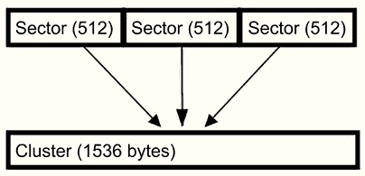

# 第四章：计算机系统

正如我们在前几章中讨论的那样，数字取证调查员必须控制他们所操作的环境。计算机硬件、操作系统和文件系统的多样性要求数字取证调查员对可能遇到的各种配置有深刻的理解。这要求数字取证调查员必须有保护数字证据及其检查过程完整性的程序或控制措施。如果你不了解启动过程以及系统启动时的反应，或者不清楚存储设备上使用的是哪种文件系统，你可能会犯下致命的错误。此外，你还必须了解它们是如何协同工作的。不了解这些基本组件可能会导致你篡改数字证据。你还会发现，当你在司法或行政程序中作证时，你的效果会大打折扣。

在本章中，我们将涵盖以下主题：

+   理解启动过程

+   理解文件系统

+   理解 NTFS 文件系统

# 理解启动过程

要控制环境以开始我们的调查，我们必须理解该环境。在这里，数字证据被存储、创建和访问。在大多数情况下，这将是一个计算机系统。我使用“计算机系统”这个术语，它包括操作系统、文件系统和硬件，这些组成部分结合在一起，构成了一个计算机。为了有效工作，你必须理解数据存储介质、存储设备上使用的文件系统，以及数据在存储设备上是如何被跟踪和访问的。

一旦你理解了这一过程，你就可以实施控制措施，以保护数字证据的完整性。

那么，什么是启动过程呢？当你按下电源按钮并且电流激活系统时，命令被发出。在执行这些命令时，系统像爬楼梯一样一步步地走向运行操作系统的目标。如果某个步骤出现故障，系统将无法加载。

第一步是**开机自检**（**POST**）；CPU 将访问**只读存储器**（**ROM**）和**基本输入输出系统**（**BIOS**），并测试主板的基本功能。你在开机时听到的“滴”的声音就来源于此。如果发生错误，系统将通过蜂鸣代码通知你错误。如果没有主板手册，使用 Google 搜索即可帮助你确定具体蜂鸣代码的含义。

一旦**POST**测试成功完成，BIOS 被激活并执行。请注意，系统尚未访问存储介质。这是因为所有程序执行都发生在主板级别，而非存储设备上。用户可以通过使用显示在屏幕上的正确按键组合来访问 BIOS。

**注意**

您按正确按键的时间有时可能相对较短。如果您未成功，系统将继续启动并访问存储设备。如果您尝试访问嫌疑人的计算机系统，请在开始之前断开可访问的存储设备。这将确保您不会启动到嫌疑人的存储设备并破坏证据。

BIOS 将包含系统的基本信息：RAM 的大小、CPU 的类型、附加驱动器的信息以及系统的日期和时间。记录这些信息的最简单方法是拍下它显示在屏幕上的照片。这也是您可以更改启动顺序的地方。通常，系统首先检查 CD/DVD，然后是指定的硬盘。这也是我们稍后在本章中创建启动介质时可以更改启动设备设置的地方。更改启动设备告诉 BIOS 访问我们提供的设备，而不是嫌疑人的设备。

在 2010 年，BIOS 功能被 **统一可扩展固件接口** (**UEFI**) 取代。它提供与 BIOS 相同的服务，但进行了以下增强：

+   通过在预启动过程中提供更好的安全性

+   更快的启动

+   将支持大于 2 TB 的驱动器

+   支持 64 位设备驱动程序

+   支持 **GUID 分区表** (**GPT**)

安全启动功能允许我们在启动计算机系统时使用经过认证的操作系统。如果您尝试使用替代的启动设备，这可能会成为一个问题。

如下图所示，一旦打开电源并完成 POST 测试，根据系统的不同，它可能会使用 BIOS 启动，或者可能会使用 UEFI 方案启动：

图 4.1：启动过程

BIOS 将查找引导设备的 **主引导记录** (**MBR**)。MBR 位于第零扇区，保存有关分区、文件系统以及已安装操作系统的引导加载程序代码的信息。一旦在引导加载程序中找到并激活 MBR，控制权将交给操作系统以完成启动过程。

UEFI 会查找 GPT；GPT 会包含一个保护性 MBR，以确保旧系统不会错误地将其识别为未分区并覆盖数据。它还将包含分区条目和备份分区表头。Windows 操作系统的 GPT 磁盘最多可以包含 128 个分区。与 BIOS 方案类似，一旦找到活动分区和引导加载程序，操作系统将接管启动过程。

既然您已经了解了启动过程，我们仍然希望通过创建法医启动介质来控制启动环境，接下来我们将讨论这一部分。

## 法医启动介质

移除系统硬盘以创建取证镜像是一种广泛使用的做法。然而，有时调查员无法从系统中移除存储设备，需要创建存储设备的取证镜像。为此，你需要使用可启动的 CD/DVD 或 USB 设备来创建取证环境，并生成取证镜像。

使用启动介质时，你需要确保它能创建一个稳定的取证环境，而不会对源设备造成任何更改。正如我们在启动过程中讨论的，我们希望拦截任何可能对源设备的更改，并确保系统在我们控制的环境中启动。尽管仍然可以使用 CD/DVD 启动，但没有光驱的系统变得越来越常见。没有光驱时，我们必须使用 USB 启动设备来创建一个可靠的取证环境，以访问存储设备。

Linux 是一种标准操作系统，通常用于创建基于 USB 的（实时）操作系统，以创建进行设备检查所需的取证环境。如*第三章*《证据采集》中所述，PALADIN 就是其中一个工具。如果你希望将其预装在 USB 设备上，它可以免费下载和购买。Sumuri 还提供 PALADIN 操作的有限技术支持。

还有一种基于 Windows 的可启动环境，称为 **WinFE**（**Windows 取证环境**）。WinFE 是由 Troy Larson 于 2008 年开发的，并且衍生出其他工具，例如由 Brett Shavers 和 Misty 开发的 Mini-WinFE（[`reboot.pro/files/file/375-mini-winfe/`](http://reboot.pro/files/file/375-mini-winfe/)）。使用 Windows 可启动环境的好处是，你可以使用基于 Windows 的取证工具。在这个安全环境中，X-Ways 或 FTK Imager 是可以运行的。我不推荐使用资源占用较大的工具。我的意思是，一些取证套件，如 EnCase Forensic 或 FTK，需要大量的资源才能有效运行。X-Ways 可以从 USB 设备上运行，一些特定工具如 RegRipper 也可以。

与任何工具或程序一样，你必须验证它以确保得到预期的结果。这意味着，在你去现场利用取证 USB 设备启动嫌疑人计算机之前，你必须在实验室环境中进行测试，以确保不会做出任何更改。

作为检查员，在使用可启动 USB 设备时，需要关注的一些挑战包括以下几点：

+   确保系统能够从设备启动，而不是从内部硬盘启动，需要在 BIOS 中更改启动顺序

+   在一些系统中，在启动过程中很难在规定时间内访问 BIOS

+   确保系统可以从 USB 设备启动——一些较老的系统无法支持

+   了解可启动设备能够写保护哪些文件系统，哪些文件系统不能写保护

+   处理 UEFI 引导过程中的安全启动功能

如前所述，安全启动是 UEFI 过程中的一个安全特性，允许受信任的操作系统启动系统。因此，如果我们要使用可引导的取证操作系统，必须禁用安全启动功能。

你必须通过按下快捷键进入 UEFI 环境，例如*F2*或*F12*（这取决于计算机制造商）。进入设置实用程序后，导航到**安全**菜单（这可能因计算机制造商而异），并禁用安全启动选项。一些 Linux 发行版和 WinFE 已获得签名状态，并能够在启用安全启动的系统上启动。

在整个过程中，你必须记录你的步骤。例如，如果你错过了按下快捷键并开始了主操作系统的引导过程，你必须记录下这一事件。即使是开始部分引导，也会改变时间戳并在操作系统的各种日志中留下条目。

现在你了解了什么是可引导的取证设备，让我们在下一节中继续创建一个。

### 创建可引导的取证设备

要创建一个可引导的取证设备，你需要一个 USB 设备（我建议使用 8GB 或更大的设备）以及一个你希望安装的操作系统的 ISO 文件。我将演示使用 PALADIN 的 ISO 和名为 Rufus 的免费软件（[https:/rufus.ie/](https://rufus.ie/)）。Rufus 是一个用于创建可引导 USB 设备的工具。

下载 Rufus 后，执行可执行文件，程序将运行：

图 4.2：Rufus

会出现类似上图（Rufus）的界面，你需要从下拉菜单中选择合适的选项：

+   **设备**：这是目标位置。它是你希望托管可引导操作系统的 USB 设备。

+   **引导选择**：这将是“实时”操作系统。在这里，我使用的是 PALADIN 7.04 的 ISO 文件。

+   **分区方案**：你可以选择使用 MBR 或 GPT。使用 MBR 将为你提供更大的设备引导灵活性。

+   **目标系统**：选择 MBR 作为分区方案后，你可以在 BIOS 或 UEFI 系统上使用该设备。如果你选择 GPT 作为分区方案，则只能在 UEFI 系统上使用。

在**格式选项**下，接受默认值，然后点击**开始**按钮。一旦程序完成，你将拥有一个完全功能的可引导取证环境。

我们已经创建了一个取证引导环境；现在让我们讨论你将遇到的存储介质。接下来我们将讨论硬盘。

## 硬盘

“物理驱动器存储设备”一词指的是硬盘驱动器本身。这是一个物理设备，包含盘片或固态存储，用于保存数据。而“逻辑设备/卷/分区”指的是物理设备的格式化。一个物理设备可以包含一个或多个逻辑设备/卷/分区。很多人误认为“C 盘”指的是物理设备，但实际上，它指的是物理设备上的一个逻辑分区。

硬盘的内部由多个组件组成（如下图所示）。如果你打开硬盘外壳，你会发现硬盘由一个或多个盘片组成。一个或多个盘片可能会堆叠在一起，并且中央有一个主轴。盘片由金属合金或玻璃制成，表面涂有磁性物质，磁头通过磁性方式在盘片上编码信息。磁头可以在盘片的两面写入数据。硬盘的主轴使盘片以每分钟几千转的速度旋转；主轴旋转得越快，访问盘片上数据的效率就越高。为了读写盘片上的数据，磁头与盘片表面之间的距离小于**0.1**微米。此外，执行器控制磁头，它会在盘片上摆动，将磁头放置到正确的位置以进行数据的读取或写入。

存储设备的制造精度非常高，且在突发的剧烈移动或机械冲击下可能会损坏：

图 4.3：硬盘

硬盘可能会有不同的接口，例如，你可能会遇到以下几种：

+   **小型计算机系统接口（SCSI）**：一种较旧的标准，通常在企业环境中使用。最多支持 16 个连接设备，并且链条末端会有终端装置。

+   **集成驱动电子（IDE/EIDE）**：一种旧标准，但在一些老旧的消费类计算机系统中仍然可以找到。

+   **串行高级技术附件（SATA）**：当前在许多消费类和商业环境中使用的标准。

+   **串行附加 SCSI（SAS）**：一种当前标准，通常出现在商业环境中。

**固态硬盘**（**SSDs**）是没有任何活动部件的存储设备。它们由内存芯片组成。如我们之前讨论的，传统硬盘有多个活动部件，用于读取/写入数据到旋转的盘片上。而在 SSD 存储设备中，所有数据都存储在内存芯片中，从而带来了以下优点：

+   减轻重量

+   提高可靠性

+   提升数据访问速度

+   降低功耗

为了使 SSD 能够可靠地工作，设备的固件会控制若干操作。这些功能如下：

+   **磨损平衡**：这会将写入操作分布到不同的芯片上，从而使芯片的使用速率保持一致。

+   **修剪**：这将清除设备的未分配空间。

+   **垃圾回收**：当固件扫描内存模块时，它可能会识别出数据块中已经删除的页面。固件将把已分配的页面移动到新的块，并清除数据块以便重新使用这些块。固件只能在块级别删除数据。

对取证的实际影响是，我们无法再恢复处于或曾处于未分配空间中的数据。由于这些操作是在固件层进行的，一旦设备通电，这些操作就会自动启动。

### 驱动器几何结构

硬盘驱动器几何结构详细说明了数据如何存储在设备上；驱动器几何结构定义了磁头的数量、轨道的数量、柱面以及每轨道的扇区数。制造商进行所谓的低级格式化，创建磁盘的基本结构，定义扇区和轨道。轨道是盘面表面上的圆形路径，如下图所示。红色圆圈（**A**）是单个轨道，每个盘面都有自己的轨道集合。然后，他们将轨道划分为扇区。一个扇区（**B**）是设备上的最小存储单位。

最初，扇区的大小是 512 字节；然而，新的磁盘正在使用 4,096 字节的扇区大小进行格式化：

图 4.4：驱动器示意图

磁盘有一种寻址方案来定位数据；最初使用的是**柱面、磁头、扇区**（**CHS**）。**柱面**指的是所有磁盘上相同扇区的垂直轴。**磁头**指的是读写磁头；每个盘面有两个磁头。最后，**扇区**指的是每轨道的扇区数量。这个寻址方案适用于大容量硬盘；然而，随着存储容量的增加，由于文件大小的限制，CHS 方案无法扩展，因此出现了**逻辑块寻址**（**LBA**）。通过 LBA 方案，你可以通过从零开始的扇区编号来寻址扇区。

现在，我们已经讨论了设备的物理组件。接下来，我们将深入探讨一些内部方面。

## MBR（主引导记录）分区

在计算机系统可以使用存储设备之前，需要进行三个步骤。首先，我们讨论了由制造商进行的低级格式化，但现在我们将讨论分区。

分区是指我们将物理设备划分为称为“卷”的逻辑片段。在 MBR 分区方案下，我们最多只能创建四个主分区。例如，在一个物理设备上，你可以创建一个主分区来承载 Windows 操作系统，另一个主分区用来承载 Linux 操作系统。请注意，必须有一个主分区才能启动操作系统。当用户选择启动的操作系统时，这个分区就是**活动分区**。

为了突破分区限制，开发人员创建了扩展分区。四个分区记录中的一个被指定为扩展分区，该分区可以进一步划分为逻辑卷。

如我们之前讨论的，我们可以在零扇区找到 MBR。MBR 包含操作系统启动所需的信息。MBR 将位于零扇区，因此其大小不超过 512 字节。分区表会显示哪个分区是活动分区。一旦找到活动分区的起始扇区，启动过程将继续：

图 4.5：MBR 映射

上面的 MBR 映射显示了硬盘的零扇区。这是物理磁盘的 MBR。前 440 字节已被高亮显示；这部分是启动代码。接下来的 4 字节是磁盘签名，用于将磁盘标识给操作系统。接下来的 64 字节是分区表。每个 16 字节的条目都指向一个特定的分区。请记住，这将限制我们在使用 MBR 分区方案时只能创建 4 个主分区。最后的 2 字节是 MBR 的签名，标识 MBR 的结束，它将是扇区的最后 2 字节。

在下表中，我提取了四个分区表并重新格式化了十六进制值，便于阅读。第一个字节将指示哪个分区是活动分区。`x/80` 的值表示活动的可启动分区。

`x/00` 的值表示非活动（可启动）分区：

图 4.6：分区表

通常情况下，你会看到第一个分区被标记为活动分区；在这个例子中，它是第二个分区，表示它是可启动的。接下来的 3 字节表示 CHS 计算的起始扇区。因此，当我们检查分区表时，我们会看到物理设备上有分区 0 和分区 1，分区 2 和分区 3 的条目为零。这意味着物理设备上只有两个分区。

第五个字节表示分区上的文件系统。对于分区 0，我们可以看到 **DE** 的十六进制值，这表明它是戴尔 PowerEdge 服务器工具的一部分。分区 1 的十六进制值为 **07**，表示 NTFS 文件系统。

如果我发现十六进制值为 **05** 或 **0f**，那将表示扩展分区。然后我们需要查看扩展分区的扩展引导记录。

**注意**

你可以在[`www.win.tue.nl/~aeb/partitions/partition_types-1.html`](https://www.win.tue.nl/~aeb/partitions/partition_types-1.html)找到分区标识符的完整列表。

接下来的 3 个字节是 CHS 计算中用于结束扇区的值。接下来的 4 个字节显示分区的起始扇区，最后 4 个字节显示分区的大小。

在 CHS 计算中使用的扇区值是旧版存储设备的遗留值。显示起始扇区和总扇区数（分区大小）的值仍被用于当前使用 LBA 的驱动器。

每个分区的第一个扇区将包含**卷引导记录**（**VBR**）。系统使用 VBR 来引导该卷中的操作系统。它是操作系统特定的产物，并在分区格式化时创建。

它也会出现在未分区的设备上，例如可移动介质，比如 USB 驱动器或软盘。

主分区并不是你可能遇到的唯一分区；你还可能遇到扩展分区，这将是下一节的内容。

### 扩展分区

MBR 的限制只能容纳四个主分区，因此产生了扩展主分区。在这里，它替代了一个（且仅一个）主分区，并使用户能够在四个主分区之上创建额外的逻辑分区。

下图展示了一个主分区被扩展分区替代的情况：

图 4.7：分区映射

下图展示了扩展分区。在这里，用户已经在扩展分区边界内创建了多个逻辑分区：

图 4.8：扩展分区映射

扩展分区没有 VBR。它将包含一个**扩展引导记录**（**EBR**），指向第一个扩展逻辑分区。第一个扩展逻辑分区将包含关于它本身的信息以及指向下一个扩展逻辑分区的指针。实际上，这将创建一个从一个扩展逻辑分区到下一个的指针链。

我们现在已经讨论完了与 MBR 相关的部分，接下来我们将讨论 GPT 格式的内容。

## GPT 分区

GUID 是**全局唯一标识符**，使用 128 位十六进制值来标识计算机系统的不同方面。一个 GUID 由五组组成，格式为`00112233-4455-6677-8899-aabbccddeeff`，虽然没有中央机构来确保唯一性，但可以说你不太可能得到重复的 GUID。

RFC 4122 定义了五种不同的 GUID，如下所示：

+   **版本 1**：日期时间和 MAC 地址：系统通过当前时间和客户端 MAC 地址生成此版本。这意味着，如果你有一个版本 1 的 GUID，你可以通过检查时间戳值来确定它的创建时间。

+   **版本 2**：DCE 安全性：此版本在 RFC 4122 中未明确定义，因此不必由符合标准的生成器生成。它类似于版本 1 GUID，只是时间戳的前四个字节被用户的 POSIX UID 或 GID 替代，时钟序列的高字节被 POSIX UID 或 GID 域替代。（**UID** 代表 **用户标识符**。**POSIX** 代表 **可移植操作系统接口**，它是一组确保操作系统之间兼容性的标准。）

+   **版本 3**：MD5 哈希和命名空间：此 GUID 通过取一个命名空间（例如，完全限定的域名）和一个名称，将其转换为字节，进行连接，并进行哈希处理。确定了版本和变体等特殊位后，它会将结果字节转换为十六进制形式。关于此版本的特殊属性是，从同一命名空间中相同名称生成的 GUID 即使在不同时间生成也将是相同的。

+   **版本 4**：随机：系统使用随机数创建此 GUID。在 GUID 的 128 位中，保留了 6 位供特殊使用（版本 + 变体位），因此剩余的 122 位可以随机填充。

+   **版本 5**：SHA-1 哈希和命名空间：此版本与版本 3 相同，唯一的区别是哈希步骤中使用了 SHA-1，而不是 MD5。

GPT 是一种用于新型存储设备的分区方案，并且是新的 UEFI 标准的一部分。UEFI 标准替代了 BIOS，而 GPT 替代了 MBR 分区方案。

GPT 分区方案使用 LBA，并且在物理扇区零中可以找到保护 MBR。保护 MBR 允许一定的向后兼容性，并有助于消除在使用不识别 GPT 分区方案的传统工具时出现的任何问题。保护 MBR 中没有可用的引导代码。如以下图所示，这是保护 MBR 分区表的第一个分区项。该分区由十六进制值**EE**标识，表示它是一个 GPT 分区磁盘，如下所示的 GPT 十六进制：

图 4.9：GPT 十六进制

虽然 MBR 包含物理扇区 `0` 中的分区表，但 GPT 将分区表头放置在物理扇区 `1` 中。GPT 头可以通过十六进制值 `45 46 49 20 50 41 52 54` 的 **EFI** 标识符来识别，如下图所示：

图 4.10：EFI 分区

下表显示了 GPT 头的布局，您可以用它来识别磁盘的布局：

图 4.11：GPT 头格式

GPT 分区项通常位于物理扇区 `2` 中。下图显示了 GPT 分区表项：

图 4.12：GPT 扇区 2

每个分区条目为 128 字节，提供有关分区的信息。下表展示了分区条目的内容，包括分区类型 GUID、该特定分区的唯一 GUID、起始和结束扇区以及分区名称（以 Unicode 表示）：

图 4.13：GUID

一个分区应该存储磁盘内该分区边界内的所有数据；然而，磁盘上也有一些超出正常分区边界的空间，技术用户可以在这些区域中隐藏数据。接下来我们将讨论这些区域。

## 主机保护区域（HPA）和设备配置覆盖（DCO）

HPA 和 DCO 是硬盘上的隐藏区域，由制造商创建。制造商使用 HPA 来存储恢复和诊断工具，用户无法更改或访问这些工具。DCO 允许制造商使用标准部件来制造不同的产品。它将使在组件上创建一组标准扇区成为可能，从而实现统一性。例如，制造商可能会使用一组部件来制造 500 GB 的硬盘，而在使用相同组件的情况下，也能制造 600 GB 的硬盘。通常，用户无法访问这个位置。然而，一些工具是公开可用的，用户可以使用这些工具来访问这些位置并存储数据。

以下截图显示了 HPA 在 X-Ways 中的显示方式：

图 4.14：HPA 1

以下截图显示了 HPA 在 FTK Imager 中的显示方式：

图 4.15：HPA 2

接下来让我们继续讨论一些你可能会遇到的文件系统。

# 了解文件系统

一个硬盘可以有多个分区，每个分区内通常（在大多数情况下）都有一个文件系统。一个分区中可能包含数十万到数百万个文件。文件系统跟踪每个文件的位置以及分区边界内可用的空间。

我们在*硬盘*部分中已经讨论过扇区；它们是存储数据的最小单位。文件系统基于簇来存储数据。簇由一个或多个扇区组成。簇是文件系统能够写入的最小分配单元。文件系统有很多种，一些文件系统仅限于特定操作系统，除非用户启用驱动程序，否则操作系统无法读取这些文件系统。

现在我们来看看一些你可能会遇到的常见文件系统。

## FAT 文件系统

**文件分配表**（**FAT**）文件系统自家庭计算机的早期便已存在，它是少数几种几乎所有操作系统都能读取的文件系统之一。它是可移动设备的事实标准文件系统。

随着时间的推移，FAT 文件系统经历了许多变化：

+   **FAT12**：第一个版本创建于 1977 年，使用 12 位（因此称为 FAT12）来寻址可用簇。这使得它只能用于包含 4,096 个簇的存储设备。如今很少见，但你可能会在软盘中找到它。

+   **FAT16**：这是 1984 年创建的，使用 16 位（我看到一个规律）来寻址可用簇。它与 FAT12 有相同的问题，无法扩展到更大容量的设备上使用。

+   **VFAT**：这是 Windows 95 引入的，并添加了虚拟文件分配表。它支持**长文件名**（**LFN**）和额外的时间戳。

+   **FAT32**：此格式使用 28 位地址可用的簇，理论上最大卷大小为 2.2 TB。微软实施了限制，将卷大小限制为 32 GB，最大文件大小为 4 GB。它至今仍在使用，并且可以在大多数可移动设备上找到。

我们将在本节剩余部分讨论 FAT32 文件系统。

FAT 文件系统分为两个区域（如以下图示所示，图 4.16 – FAT 区域）：

+   **系统区**：这里存储卷启动记录和 FAT 表

+   **数据区**：这里存储根目录和文件：

图 4.16：FAT 区域

接下来，我们将讨论**系统区**中的内容。

### 启动记录

我们在系统区有**VBR**。它位于逻辑扇区 0（LS 0），即分区边界内的第一个扇区。启动过程在分区格式化时创建 VBR，并包含有关卷和启动代码的信息，以继续操作系统的启动过程。如果它是主分区，VBR 将由多个扇区组成，通常是扇区 0、1 和 2，并在扇区 6、7 和 8 中有备份。VBR 及其备份存储在“保留区域”，通常位于第一个文件分配表开始之前的 32 个扇区：

图 4.17：VBR

在前面的图示中，我们可以看到一个卷启动扇区，它有助于解码以下信息：

+   `x00`：我们将在此找到系统继续启动的跳转指令

+   `x03`：OEM ID 显示了用于格式化设备的操作系统

+   `x0B`：每扇区字节数

+   `x0E`：保留扇区的数量

+   `x10`：FAT 的数量（这应该是 2）

+   `x11`：未使用的根目录条目（对于 FAT32，这应该是 0，因为根目录存储在数据区）

+   `x13`：扇区数（如果扇区数量超过 65,536，则此值为 0）

+   `x15`：介质描述符（`xF8`表示硬盘，`xF0`表示可移动设备）

+   `x16`：每个 FAT 的扇区数（对于 FAT32，这应该是 0）

+   `x18`：每磁道扇区数（对于硬盘来说，这应该是 63）

+   `x1A`：磁头数（对于硬盘来说，这应该是 255）

+   `x1C`：隐藏扇区的数量（FAT 卷开始前的隐藏扇区数量）

+   `x20`：总扇区数（即卷的总扇区数）

+   `x24`：每个 FAT 的逻辑扇区数

+   `x28`：扩展标志

+   `x2A`：FAT 版本

+   `x2C`：根目录集群的起始位置（通常为集群 2）

+   `x30`：文件系统信息扇区的位置（通常设置为 1）

+   `x32`：备份扇区的位置（通常设置为 6）

+   `x34`：保留（设置为 0）

+   `x40`：物理驱动器号（硬盘为`x80`）

+   `x41`：保留

+   `x42`：扩展引导签名（应为`x29`）

+   `x43`：卷标序列号（通常是从日期和时间生成的 32 位值；可以追踪可移动设备）

+   `x47`：卷标（这可能不准确；不同的操作系统可能不使用此字段）

+   `x52`：文件系统类型

接下来，我们将查看文件分配表。

### 文件分配表

FAT 文件系统的下一个组成部分是文件分配表，它紧接着 VBR。默认情况下，有两个文件分配表（FAT1 和 FAT2）。FAT2 是 FAT1 的副本。

文件分配表的目的是追踪集群并追踪哪些文件占用了哪些集群。每个集群在文件分配表中以集群 0 开始表示。文件分配表每个集群条目使用 4 个字节（32 位）。文件分配表将使用以下条目来表示集群的当前状态：

+   **未分配**：`x0000 0000`

+   **已分配**：文件使用的下一个集群（例如，它表示集群 7 为`x0700 0000`）

+   **已分配**：文件使用的最后一个集群（`xFFFF FFF8`）

+   **坏集群**：不可用（`xFFFF FFF7`）

集群是文件系统能够寻址的最小分配单元。扇区是磁盘上的最小分配单元。一个集群由一个或多个扇区组成。如果你混淆了这两个术语，很容易产生困惑。考虑以下集群示例：

图 4.18：集群示例

随着用户向数据区添加文件，系统将更新文件分配表。一个文件可能占用一个或多个集群。此外，集群可能不是连续的，因此文件的数据可能分布在磁盘的不同物理位置；我们通常称之为碎片化。

在下图中，我们可以看到文件分配表的表示；在此场景中，我们有一个文件占用了三个集群：**集群 4**、**集群 5**和**集群 6**。你可以看到，**集群 4**指向**集群 5**，**集群 5**指向**集群 6**。**集群 6**的十六进制值表示**文件结束**（**EOF**）：

图 4.19：非碎片化的文件条目

在以下图示中，我们可以看到文件分配表的类似表示，且做了一些修改。现在有两个文件，文件 1 占用了簇 **4** 和 **6**。我们可以看到，**簇 4** 指向包含文件数据的下一个簇，即 **簇 6**。这是文件碎片化的一个示例。文件 2 完全包含在 **簇 5** 的边界内。

**簇 5** 不会指向后续簇；相反，它具有 EOF 十六进制值：

图 4.20：碎片化文件条目

我们已经讨论了 FAT 的系统区，现在将讨论 FAT 文件系统的数据区。

## 数据区

根目录存放在数据区，因为当系统将其存储在系统区时，它无法增长到足以与大容量设备配合使用。根目录的关键组成部分是目录项。如果有文件、目录或子目录，就会有相应的目录项。

每个目录项的长度为 32 字节，帮助跟踪文件的名称、起始簇和文件大小（以字节为单位）。

在以下图示中，我们可以看到一个包含多个文件条目的 FAT32 目录。当文件系统遇到十六进制 `00` 时，它会停止寻找文件条目，之后的所有值都将被忽略：

图 4.21：FAT 目录项

在下面的 FAT 目录映射中，我们可以看到目录项的布局，以及带有特定偏移量高亮显示的**短文件名**（**SFN**）目录项：

图 4.22：FAT 目录映射

如果第一个字节是 `xE5`，则文件系统会将该条目视为已删除。文件或目录名称的其余字节将保留，其他元数据也会保留。

短文件名必须符合以下规范：

+   允许八个字符；如果少于八个字符，则名称将用 `x20` 填充。

+   为文件扩展名分配三个字符（如果少于三个字符，则名称将用 `x20` 填充）。

+   不允许使用空格和以下字符：**“+ * , . / : ; < = > ?[\]|**。

目录项始终以大写字母存储。属性字节（偏移量 `x0B`）被视为打包字节，这意味着不同的值具有不同的含义。

以下图示显示，`属性` 标志中的位值可以组合，结果的十六进制值将反映这些组合。如果文件具有**只读**标志和**隐藏**标志，那么这将给我们一个值 `0000 0011`，转换为十六进制后得到值 `x03`：

图 4.23：打包字节

当我们查看前面 FAT 目录映射底部的示例时，我们会发现在偏移位置`x0B`处有一个十六进制值为 20；当我们将该十六进制值转换为二进制时，得到 `0010 0000`。这告诉我们该文件是一个归档文件。

我们也会遇到 **长文件名（LFN）**；处理长文件名的方法稍微复杂一些。我们将在下一节讨论 LFNs。

## 长文件名

当用户创建一个长文件名（LFN）时，系统会生成一个符合 SFN 标准的别名。它会格式化这个别名，使得前 3 个字符会成为文件扩展名点后的扩展名。前 6 个字符会转换为大写并用于别名。然后，别名会添加一个 **~** 字符，并跟随一个数字。如果有多个文件具有相同的别名，数字会从 1 开始并逐渐增加。

下图显示了一个带有长文件名（LFN）的文件目录项；文件名为 `long filename.txt`：

图 4.24：长文件名（LFN）

由于这是一个长文件名（LFN），文件系统将创建额外的目录项。在这个特定的例子中，将会有两个额外的目录项来方便使用 LFN。每个额外目录项的第一个字节是序列字节。右边的半字节是序列号。我们看一下前面图示的目录项，SFN 目录项上方的目录项的十六进制值为 `x01`。这里，`1` 的值告诉我们这是序列中的第一个值。当我们移动到第二个目录项时，可以看到它的十六进制值为 `x42`，右边的半字节告诉我们这是该 LFN 文件的第二个目录项。值的左边半字节 `4` 告诉我们这是文件的最后一个目录项。在每个 LFN 目录项中，你会发现属性字节是 `x0F`。

但当一个文件被删除时会发生什么呢？你或许可以恢复文件及其相关的元数据。在接下来的部分，我们将讨论如何恢复已删除的文件。

## 恢复已删除的文件

当文件在 FAT 文件系统中被删除时，数据本身不会被改变。相反，目录项的第一个字符会被改为 `xE5`，而文件分配表中的条目会被重置为 `x00`。当文件系统读取目录项并遇到 `xE5` 时，它会跳过该条目，继续读取随后的条目。

要恢复已删除的文件，我们需要逆转文件系统删除文件的过程。记住，文件内容本身并没有改变，它们仍然物理地存储在它们分配的簇中。因此，我们现在需要逆向工程来恢复删除操作，并重新创建文件目录项以及文件分配表中的相关项。为此，我们需要找到文件的第一个簇、文件大小以及卷中簇的大小。

在下图中，我们有一个目录项，显示文件已被删除。我们可以看到目录项的开始位置是`xE5`。（注意，这需要使用十六进制编辑器进行更改。）

然后，我们必须确定起始簇，`x00``x08`（在图中显示为`x08 x00`）。这个值表示簇编号 8。接着，要确定文件大小，请查看最后 4 个字节，`x27 x00 x00 x00`（记住 FAT 文件系统以小端格式存储数据，这意味着最不重要的字节在左边，所以我们读取该值为`x00 x00 x00 x27`，转换为十进制时，文件大小为 39 字节）：

图 4.25：已删除的条目

现在，我们必须确定一个簇包含多少个扇区，以及每个扇区的大小。你需要去启动记录中获取这些信息。启动记录告诉我们每个扇区有 512 字节，每个簇有 8 个扇区，这样簇的大小为 4,096 字节（如下图所示）：

图 4.26：启动记录

这意味着我们的文件将只占用一个单独的簇。然后，我们转到文件分配表，查看簇 8 的条目，并看到它已被清零：

图 4.27：已删除的 FAT

要恢复已删除的文件，执行以下步骤：

1.  你需要将文件分配表中的条目从`x0000 0000`更改为`xFFFF FFF8`或`xFFFF FF0F`。如果这是一个较大的文件，你需要将文件分配表条目更改为指向下一个簇，直到你到达最后一个簇和文件大小的末尾。当你重新链接条目时，如果你发现一个标记为已分配的条目，而你本应找到未分配的条目，可能是你遇到了碎片化文件。另一种可能是，当簇被文件系统释放时，系统将新文件放入当前可用的扇区中，这会导致数据被覆盖。如果遇到这两种情况之一，你的选择不多。如果数据被覆盖，你将无法恢复。如果文件碎片化，你需要猜测下一个簇的位置，这在大容量设备上是不太可能的。

1.  下一步是返回目录项，并将`xE5`替换为另一个字符。在替换目录项中文件名的`xE5`字符时，要小心不要猜测字符是什么。如果选择了不正确的字符，可能会改变文件名的含义或产生偏差，这样会不正确。在恢复已删除文件时，建议将第一个字符替换为下划线或短横线，以避免对文件名的误解。

在恢复具有 LFN（长文件名）的文件时，必须将 LFN 重新链接到 SFN（短文件名）。这是因为当为容纳 LFN 而创建额外的目录时，系统会根据 SFN 的数据创建一个校验和。因此，当你更改 SFN 条目上的`xE5`值时，你也需要对 LFN 目录条目的后续`xE5`值使用相同的替代字符。将 LFN 链接到 SFN 是因为 SFN 目录条目包含了诸如日期和时间、起始簇以及文件大小等信息。

仍然有可能恢复磁盘上曾存在但在文件系统中不再有任何痕迹的数据。这些信息会存储在空闲空间中，稍后会在下一节中讨论。

## 空闲空间

现在是时候提到空闲空间了。记住，文件系统可以写入的最小单位是簇，簇由一个或多个扇区组成。我一直重复这一点，是因为我见过许多新手对两者之间的区别感到困惑。这一点非常重要，因为文件的大小各异；几乎没有文件会恰好适合簇的边界。因此，你会遇到文件溢出到下一个簇的情况。逻辑文件的末尾与簇边界之间的空间被称为“文件空闲”。这个空闲空间可能包含来自前一个文件的数据。直到这些数据被覆盖，它们才会消失，留给你进行检查。

你可能会发现文件、数字图像、聊天记录或电子邮件的痕迹；任何曾经存储在设备上的数据，在用户删除文件后，可能会在空闲空间中找到残留数据。

本节讲解完毕，*FAT 文件系统*部分结束；接下来是 NTFS。

# 理解 NTFS 文件系统

**新技术文件系统**（**NTFS**）是 Microsoft Windows 操作系统的默认文件系统。FAT32 存在一些显著的缺点，迫切需要一个更可靠和高效的文件系统，并且在管理上做出改进，以帮助 Microsoft 在企业环境中保持竞争力。他们最初为服务器环境设计了 NTFS；然而，随着硬盘容量的增加，它现在成为 Windows 操作系统在商业和消费市场中的默认文件系统。

NTFS 比 FAT 文件系统复杂得多；然而，它的总体目的保持不变：

+   记录文件的元数据，即文件名、日期时间戳和文件大小

+   标记文件占用的簇

+   记录哪些簇已分配，哪些簇未分配

NTFS 文件系统包括以下系统文件：

图 4.28：NTFS 表

要识别 NTFS 分区，我们需要查看 MBR 或 GPT，这取决于使用了哪种格式化方案。在下图中，我们可以看到硬盘的 MBR 和在引导代码后高亮显示的分区表：

图 4.29：NTFS MBR

查看分区表时，我们可以看到有一个单一的分区，并且在分区表开始处偏移十进制 `11` 的位置，我们可以看到十六进制值 `07`。正如我们在本章前面讨论的那样，这是 NTFS 的文件系统标识符。

在 NTFS 格式化的分区中，我们看不到像 FAT 格式化分区那样的系统或数据区域。NTFS 中的一切都被视为文件，包括系统数据。当我们查看 VBR 时，可以看到它包含系统继续引导过程所需的信息：

图 4.30：NTFS VBR

VBR 中的信息是一个文件；`$Boot` 记录包含了我们在 VBR 中期望找到的所有信息。以下 `$Boot` 图示展示了 `$Boot` 文件的数据结构：

图 4.31：$Boot 记录

可以说，NTFS 文件系统中最重要的系统文件是 `$MFT`（主文件表）。MFT 跟踪卷中的所有文件，包括它自身。它通过称为文件记录的文件条目跟踪 MFT 中的每个文件。每个文件记录都是唯一编号的，大小为 1,024 字节。每个文件记录以一个头部开始，头部包含 ASCII 文本 **“FILE”**，并具有十六进制的 `FF FF FF FF` 作为 EOF 标记。当文件被添加到卷时，会创建一个新的文件记录。如果文件已被删除，该记录会被清零并准备好再次使用。MFT 会寻找一个空的文件记录并在创建新记录之前使用它。文件记录可以很快被重用，这会覆盖文件记录中的先前数据。

如下所示的 NTFS 文件记录示例中，我们可以看到一个文件记录和文件头，文件头以 **FILE** 的 ASCII 值开始。如果记录已损坏或出现错误，你将看到 **BAAD** 的 ASCII 值。文件头大小为 `56` 字节：

图 4.32：NTFS 文件记录

在以下 NTFS 文件记录映射中，我们可以看到文件记录头的数据信息结构：

图 4.33：NTFS 文件记录映射

文件记录还包含称为文件属性的已定义数据块。这些数据块存储关于文件的特定类型信息。以下文件属性表显示了在几乎每个记录中可能看到的几个常见文件属性：

图 4.34：文件属性表

让我们详细看看这些属性。

**`$Standard_Information Attribute (0x10)`**：文件属性位于文件头之后，包含有关文件的信息，有时还包括实际文件本身。以下图示展示了文件属性。前四个字节表示属性类型；在本例中，它是`$10`标准信息属性，包含一般信息、标志、访问时间、写入时间、创建时间、所有者和安全 ID。它通过十六进制头`x/10 00 00 00`进行标识。文件属性映射包含解码后的值：

图 4.35：`$Standard_Information`属性

以下是你将在属性中找到的值的映射：

图 4.36：文件属性映射

**`$File_Name Attribute (0x30)`**：下一个属性是`$30`文件名属性。此属性存储文件名，并且总是常驻的。文件名的最大长度为 255 个 Unicode 字符。它通过十六进制头`x/30 00 00 00`进行标识：

图 4.37：`$File_Name`属性

以下是你将在属性中找到的值的映射：

图 4.38：文件名属性映射

**`$Data Attribute (0x80)`**：此条目的下一个属性是`$80`数据属性。数据属性包含文件的内容或指向卷中内容的指针。此属性即为文件数据本身。

如果数据属性是常驻的，我们只会看到属性头和常驻内容头。属性的常驻内容即文件数据。只有小文件才会有常驻数据属性。我们将在本章后面讨论常驻数据与非常驻数据的区别。

每个文件可能会有多个数据属性。在此记录中，第二个`$80`数据属性，Dropbox，已向文件添加了一些信息：

图 4.39：`$Data`属性

以下是你将在属性中找到的值的映射：

图 4.40：数据属性映射

当检查`$Data Attribute 0x80`时，文件系统可能会将文件的内容存储在 MFT 文件记录中。由于文件记录为 1,024 字节，因此它必须是一个小文件。当文件的内容适合文件记录时，它被称为“常驻数据”：

图 4.41：常驻数据文件

在当前示例中，我们有一个名为`resident.txt`的文件，大小为 23 字节。这比文件记录的 1,024 字节要小。要查看文件的数据，我们需要查看文件记录中的`$Data Attribute 0x80`，如下所示：

图 4.42：常驻数据示例

检查属性时，我们可以看到在前面驻留数据示例中观察到的文件内容的 ASCII 和十六进制表示。当处理一个非驻留文件时，如下图所示，我们可以看到`nonresident.txt`文件，其大小为 145 KB，超过了 1,024 字节的文件记录：

图 4.43：非驻留数据

当你查看文件的`$Data Attribute 0x80`时，如前图所示，我们并没有看到文件的内容，而是看到了指向文件在卷边界内位置的指针。我们将其视为非驻留内容。一旦属性的内容变为非驻留，它将永远无法变为驻留内容。我们通常将文件记录中的属性指针称为“运行列表”，用于非驻留数据的运行：

图 4.44：非驻留数据示例

在`$Data Attribute` `0x80`中，你可以有单个数据运行或多个数据运行。解读数据运行的运行列表可能是棘手的。在以下运行列表中，我们有`$Data Attribute 0x80`，其中包含两个运行列表：

图 4.45：运行列表

如果文件没有碎片化，那么你将会有一个指向数据运行的运行列表。如果文件被碎片化（这非常常见），那么你将会有多个运行列表，提供每个碎片的起始簇的信息。我已经提取了前面列表中标出的两个运行列表，并创建了如下图表：

图 4.46：运行列表图

第一个运行列表由十六进制值`31 07 E8 E3 48`组成。取头部的第一个字节（`x/31`），并加上左右半字节（3+1 = 4）。4 是运行列表条目的字节数（即`x/07 E8 E3 48`）。

右边的半字节（`x/1`）告诉我们，1 个字节表示该碎片所使用的簇的数量。我们在长度字段中找到了`x/07`，这表示该碎片使用了 7 个簇。左边的半字节（`x/3`）告诉我们，3 个字节（`x/E8 E3 48`）将表示碎片的逻辑起始簇。在第一个运行结束时，我们有一个第二个运行列表`x/31 14 44 47 17`。

像之前的运行列表一样，我们取头部的第一个字节（`x/31`），并加上左右半字节（3+1 = 4）。4 就是运行列表条目的字节数（即`x/14 44 47 17`）。右边的半字节（`x/1`）告诉我们，1 个字节表示该碎片所使用的簇的数量。我们在长度字段中找到了`x/14`，这表示该碎片使用了 20 个簇。

左边的半字节（`x/3`）告诉我们，3 个字节（`x/44 47 17`）将表示从前一个运行列表集群的偏移量。这个过程会一直进行，直到系统遇到 `x/ 00 00 00 00`，这表示运行列表的结束。

这就是我们对 NTFS 世界的探险。如果你感到头疼，别担心，你并不孤单！这仅仅是文件系统的基础知识。如果你想深入了解，可以找到关于 NTFS 的整本书籍。

# 总结

在本章中，我们了解了物理磁盘如何构建和准备，以便存储数据。我们讨论了不同的分区方案及其如何处理逻辑分区的创建。我们还学习了文件系统的区别以及数据如何组织。

在下一章中，我们将学习计算机调查过程，以及如何分析时间线、分析媒体和进行字符串搜索数据。

# 问题

1.  更新的计算机系统使用 BIOS 启动方法。

    1.  正确

    1.  错误

1.  基于 UEFI 的计算机系统将使用 ____________ 来启动。

    1.  MBR

    1.  VBR

    1.  GPT

    1.  LSD

1.  集群是硬盘上最小的存储单元。

    1.  正确

    1.  错误

1.  MBR 格式的磁盘可以有超过四个主分区。

    1.  正确

    1.  错误

1.  FAT32 格式的分区被划分为两个区域：一个是系统区域，另一个是 ___________ 区域。

    1.  磁盘

    1.  圆环

    1.  数据

    1.  设计师

1.  在 FAT32 格式化的分区中，根目录位于系统区域。

    1.  正确

    1.  错误

1.  在 NTFS 格式化的分区中，文件名存储在 _______________ 属性中。

    1.  标准信息

    1.  文件名

    1.  数据

    1.  安全描述符

答案可以在书的最后部分的*评估*栏目中找到。

# 深度阅读

Carrier, B. *文件系统取证分析*。Addison-Wesley 出版社，宾夕法尼亚州雷丁市，2005 年 3 月（可通过[`www.kobo.com/us/en/ebook/file-system-forensic-analysis-1`](https://www.kobo.com/us/en/ebook/file-system-forensic-analysis-1)获得）。

# 加入我们在 Discord 上的社区

加入我们社区的 Discord 空间，与作者和其他读者进行讨论：

[`packt.link/CyberSec`](https://packt.link/CyberSec)

