# 第五章：计算机调查流程

成为数字取证检查员需要你有一个调查计划。例如，有一种所谓的“厨房水槽方法”——即请求检查的人说，*我要所有的信息*。然而，这种方法并不实际，因为最小的驱动器可能包含数十万页或事件。因此，尽管“厨房水槽方法”是一个计划，但它可能不是最有效的。

实际上，你的搜索方法将取决于你正在调查的犯罪类型，以及搜索范围是否有限制。例如，在某些调查中，司法机关可能会限制调查员访问数字证据，只能查看电子邮件信息，或者你可能仅限于在法医镜像中查找特定日期和时间。

本章将首先讲解时间轴分析，分析用户活动的*时间性*。接下来，我们将检查用户使用的存储容器。你还将了解字符串搜索，即通过匹配字符字符串在数据集中进行搜索。最后，在最后一节中，我们将分析从文件系统中删除的数据。

本章将介绍以下内容：

+   时间轴分析

+   媒体分析

+   字符串搜索

+   恢复删除的数据

# 时间轴分析

在调查过程中，你可能会发现看似显示被告有罪或无罪的遗留物。然而，我们不能仅凭遗留物的存在就推断嫌疑人有罪或无罪。相反，这些遗留物需要放在用户和系统活动的背景下进行分析。

例如，我被聘为一个案件的顾问；他们指控嫌疑人身体虐待自己的孩子。作为反对嫌疑人的证据之一是关于如何处理伤害的 Google 搜索次数过多。他们将这些搜索归咎于被告，即父亲。最具挑战性的证据是，在争议行为发生时，如何证明键盘背后的用户身份。由于这些项目出现在互联网历史记录中（我们将在*第九章*，*互联网遗留物*中深入讨论），我想检查搜索发生的时间背景。妻子是这台笔记本电脑的主要拥有者，但丈夫也是这台笔记本的常用用户。那么，如何将这些搜索归因于特定用户，尤其是在有多个用户使用同一台笔记本并且使用相同账户的情况下？

一个人的互联网浏览习惯几乎可以像指纹一样具有独特性。当我查看超过一百万行的互联网历史记录时，我能够区分笔记本电脑上的两个不同用户。我能够将社交媒体的使用与每个用户相关联，并将 Google 搜索归因于孩子的母亲。当她面对这些发现时，母亲承认她曾搜索如何处理孩子的伤势。在出示了证据和母亲的证词后，陪审团判定客户无罪，不构成虐待儿童罪。

假设在做出起诉决定之前他们进行了时间线分析，我相信父亲不会被起诉，因为唯一针对他的证据是从妻子的笔记本电脑中发现的数字证据。

你创建时间线以分析系统和用户行为的能力，让你能够对数字证据有更深入、更全面的理解。当我刚开始从事这个领域时，时间线是初步的，通常基于文件系统的 MAC 时间。**MAC**时间指的是**修改时间、访问时间和创建时间**，这些记录由文件系统在文件创建、编辑或访问时生成。仅使用 MAC 时间进行时间线分析的缺点是记录的时间可能不准确。例如，当文件从一个卷移动到另一个卷，或者用户使用第三方工具更改时间戳，并且时间戳依赖于系统时间时，就可能发生这种情况。

我们现在将使用多个来源来帮助我们确定系统中与特定证据相关的事件上下文。这些附加来源可能不像 MAC 时间那样容易被篡改，并且能够确定时间戳中的任何异常。例如，使用法医镜像中的多个资源，我们可以看到用户登录、启动可执行文件，并访问与可执行文件相关联的文件。这种访问多个来源的方法有助于我们确认并验证 MAC 时间提供的信息。

将多个参考框架应用于正在调查的事件，能帮助我们支持对事件的假设。例如，我们是否能够判断调查事件是由用户活动引起的，还是系统进程的结果？此外，使用所有可用的资源，如事件日志、文件系统日志或系统捕获的互联网历史记录，可以帮助我们深入细节，了解事件的上下文。

通过从多个来源收集数据点，你可以创建出罗布·李（Rob Lee）在 SANS 研究所所称的超级时间线，因为你需要筛选的大量数据点会使得这一过程更加复杂。

硬盘容量并没有变小，反而以惊人的速度在增长。用户和开发人员利用这种增加的容量来存储更多的数据，并增加可以追踪系统中发生事件的日志数量。在某些调查中，你可能不需要检查文件的内容；例如，在涉及非法图片的调查中，我无需查看文件的视觉内容。相反，为了回答一个用户是否知道某个特定文件的存在，我可以使用时间线分析来做出这个判断。

商业取证工具（以及开源工具）在创建时间线方面取得了许多进展。例如，曾经你需要使用多个工具来提取数据以创建时间线。现在，你只需使用一个工具就可以创建时间线。

**注意**

在本章中，我们将讨论日期和时间，这些将被转换为 UTC/GMT。始终注意你的数据集操作的时区以及它存储的时区。我在进行审查时使用 GMT/UTC 作为标准。

在本章中，我将演示使用几种工具，让你了解它们输出的区别，并讨论这些工具从哪里获取信息。

## X-Ways

X-Ways Forensics 内置了一个非常强大的时间线创建工具，叫做**事件列表**。X-Ways 整合了多个来源的数据，如文件系统级别的时间戳、内部时间戳、浏览器历史记录、事件日志、注册表配置单元、电子邮件等。当你启动事件列表时，数据将按时间顺序呈现，形成时间线。事件列表是一条非常详细的时间线，包含大量信息，允许你看到你正在调查的事件的时间顺序。

**注意**

在你探索新工具的功能时，记得用已知的数据集来验证工具。我们将在本实验中使用 Digital Corpora 提供的取证镜像。你可以访问[`digitalcorpora.org/`](https://digitalcorpora.org/)并查看 2008 年 M–57 Jean 案例，获取更多信息。

在这种情况下，你正在调查一起数据泄露事件。有人将一份包含某组织机密信息的电子表格发布到竞争对手的网站上，而这份电子表格来自首席财务官（CFO）Jean 的计算机。在她的面谈中，Jean 表示她根据总裁 Allison 的要求，将这份电子表格通过邮件发送给了她。电子表格名为`m57plan.xls`，可以在 Jean 账户的桌面上找到。该文件的 MD5 哈希值为`e23a4eb7f2562f53e88c9dca8b26a153`，修改时间为**2008-JUL-20 01:28:03 GMT**，这与 Jean 关于她何时发送电子表格的陈述相符。

文件名和时间范围为我们提供了进行时间线分析的起点。当你进入 X-Ways Forensics 的用户环境时，选择事件列表图标：

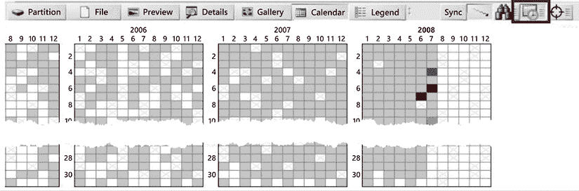

图 5.1：X-Ways

如前图所示，当你选择**日历**选项时，它会显示日历界面，方便你深入查看特定日期。如果我不对事件列表中的结果进行筛选，那么会有超过一百万条记录需要我逐一解析。我的首选工作流程是从大的数据集开始，然后逐步筛选结果，以满足调查的需求。

当我将筛选范围缩小到 7 月 20 日时，我将结果减少到了 4,052 个事件，更加易于管理。

一旦筛选了结果，我们可以搜索文件名，看看发生了什么活动。第一个结果显示，在 01:27:42，系统为电子表格创建了一个链接文件。在接下来的截图中，你可以看到从 01:27 到 01:28 的用户活动。在 01:27 时，创建了一个预取文件（`EXCEL.EXE-1C75F8D6.pf`），这表示用户启动了 Excel 程序并打开了电子表格，正好对应了链接文件的创建。

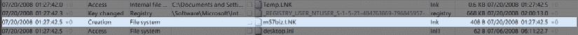

图 5.2：筛选结果

查看事件列表时，你可以看到法医工具获取并展示信息的来源。预取文件的创建始于 NT `user.dat` 文件的变更。工具会跟踪从内部文件元数据到操作系统工件的整个过程。我们可以跟踪并观察用户和系统层面的活动，记录下用户操作的全过程。

如果你查看时间戳 01:28:00，可以看到 Jean 发送了一条消息。在**名称**列中，我们可以看到邮件的主题，双击后可以查看邮件内容：

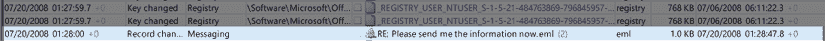

图 5.3：Jean 的邮件

我们可以看到 Jean 发出了邮件，收件人看似是 `allison@M57.biz`，但实际上是发送到了 `tuckgorge@gmail.com`。然后，我们可以根据文件类型进行筛选，在这种情况下是 `.eml` 文件，筛选结果如下：

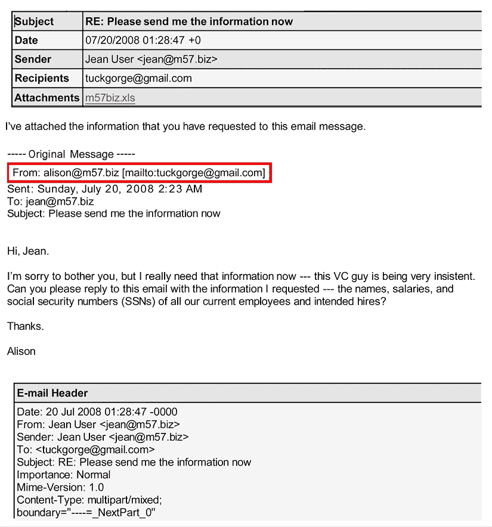

图 5.4：Jean 的邮件头

查看**发件人**和**收件人**列，并按时间顺序排列数据，你可以大致了解攻击者与 Jean 之间的邮件通讯。看起来他们已经入侵了 Allison 的账户，因为我们可以看到“Alex”这个名字和与该账户关联的邮件地址 `tuckgorge@gmail.com`。

使用 X-Ways Forensics 的事件列表功能可以帮助我们准确定位文件何时被篡改以及通过什么途径。现在我们可以将调查方向指向 Allsion 的计算机，以确定攻击者是否侵入了她的系统。根据这些初步结果，我认为攻击者通过网络钓鱼攻击瞄准了 Jean。

我喜欢 X-Ways Forensics 的一点是，它能够从传统来源收集日期和时间，并将这些信息与实际的证据（在本例中为电子邮件）结合起来。这为你的调查提供了更高的细节层次和背景。

X-Ways Forensics 文档列出了以下内容作为事件列表功能的信息来源：

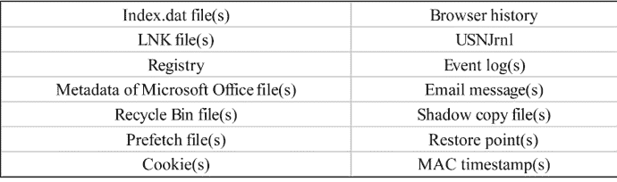

如你所见，这展示了一个非常多样化的信息来源列表。然而，在用于分析时，它可以使调查员更加信赖他们在调查中报告的日期时间戳。

我发现法医套件也包含了时间线分析功能。我曾讨论过 X-Ways Forensics 及其通过事件列表功能创建时间线进行分析的能力。我列出了你可以用来分析时间线数据的一些其他法医套件。以下列表并不包含所有可用的法医套件：

+   Belkasoft Evidence Center: [belkasoft.com/ec](https://belkasoft.com/ec)

+   Autopsy: [www.sleuthkit.org/autopsy](https://www.sleuthkit.org/autopsy)

+   Recon Lab: [sumuri.com/software/recon-lab](https://sumuri.com/software/recon-lab)

+   PALADIN: [sumuri.com/software/paladin](https://sumuri.com/software/paladin)

X-Ways 并不是唯一可以用来创建时间线的工具；你还可以使用一些开源工具。最常见的工具之一是**Plaso/log2timeline**，我们接下来将讨论它。

### Plaso（Plaso Langar Að Safna Öllu）

Plaso（Plaso Langar Að Safna Öllu）是一个 Python 后端和`log2timeline`工具的框架。`log2timeline`是一个法医工具，它从系统中提取时间戳并创建一个所有事件的数据库，也叫超级时间线。

**注意**

你可以从[`github.com/log2timeline/plaso`](https://github.com/log2timeline/plaso)下载 Plaso。

Plaso 适用于大多数操作系统，最初设计用于替代 Perl 版本的`log2timeline`。然而，开发现在已经转向模块化，并且他们创建了多个由 Plaso 后台支持的 CLI 工具。

Plaso 支持的工具是通过**命令行界面**（**CLI**）激活的。尽管 CLI 可能会让用户感到害怕，但如果你慢慢来，逐步进行操作，你会发现 CLI 并不神秘。许多开源工具使用 CLI 而不是**图形用户界面**（**GUI**）。CLI 的核心由两部分组成：可执行文件和修饰符。一旦你掌握了 CLI 命令的特定修饰符，你会发现一切都能井然有序地运作。

让我们来谈谈 Plaso 中包含的工具：

+   `image_export`

+   `log2timeline`

+   `pinfo`

+   `psort`

+   `psteal`

#### image_export

`image_export` 将从设备、媒体镜像或法医镜像中导出文件内容。你可以使用多个参数来定义你希望提取的信息。

在 Windows 版本的可执行文件中，可执行文件以`.exe`结尾。而在 macOS 中，可能会看到它以`.sh`结尾。

使用`–h`或`--help`将给出完整的参数列表：

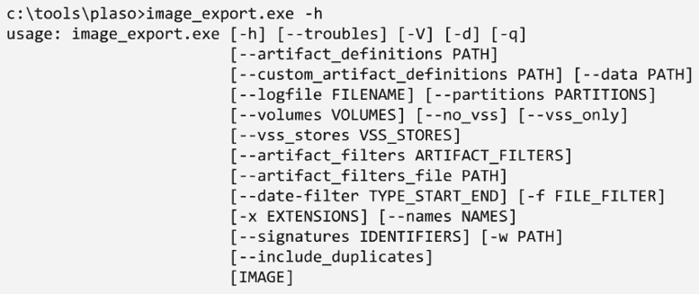

图 5.5：image_export

在屏幕下方，你将看到修饰符的详细解释。请注意，我只会涵盖最常用的选项；这里有更多的文档，我们将不再讨论：

+   `--names NAMES`：对文件名的过滤。此选项接受一个用逗号分隔的字符串，表示所有文件名，例如，`x NTUSER.DAT, UsrClass.dat`。

+   `-w PATH`, `--write PATH`：提取的文件应存储的目录。

+   `--data PATH`：包含数据文件的目录路径。

+   `-x EXTENSIONS`, `--extensions EXTENSIONS`：对文件名扩展名的过滤。此选项接受多个用逗号分隔的值，例如，`csv`，`docx`，和`pst`。

如果使用以下命令，它将把`.xls`文件导出到`files`文件夹中：

```
image_export --names 'm57plan.xls' C:\tools\plaso\image\jean.001 -w C:\tools\plaso\export\files 
```

你可以看到前面命令的分解如下：

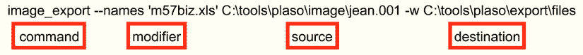

图 5.6：CLI 映射

在这里，使用`image_export`命令，我们使用`names`修饰符来查找特定文件。在此情况下，它是`M57plan.xls`。

现在，你可以告诉可执行文件在哪里进行搜索；在此命令中，我们在取证镜像`jean.001`中进行搜索（确保包含取证镜像所在位置的完整路径）。接下来，你可以指定将导出的文件发送到哪里。`-w`修饰符将指定写入位置。

你会发现，这些修饰符与 Plaso 框架中的命令有一些共通之处。

#### log2timeline

`log2timeline`是一个命令行工具，旨在从文件、目录、取证镜像和设备中提取基于时间的事件。它将创建一个数据库文件（`.plaso`），然后可以通过各种工具进行分析。

如下图所示，`-h`修饰符（帮助）将显示命令的选项。与之前一样，虽然有些详细解释没有显示，但它们能为这些命令提供额外的上下文。你应该能够从我们之前看的命令中识别出一些：

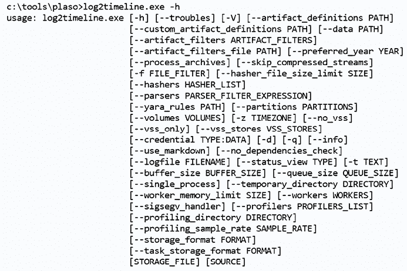

图 5.7：log2timeline

尝试使用`info`修饰符，如下所示：

```
c:\tools\plaso>log2timeline.exe --info 
```

你将看到所有支持的插件、解析器和输出模块的列表：

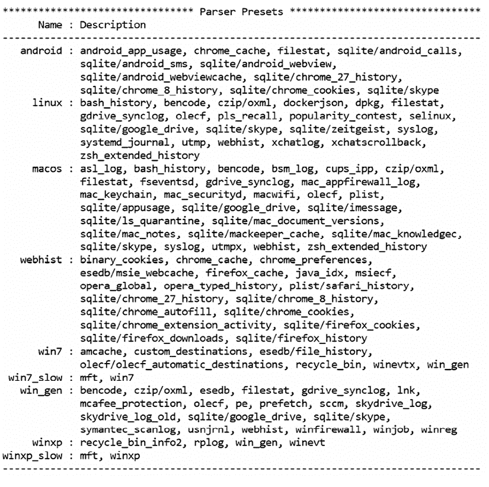

图 5.8：info 修饰符的结果

从前面的输出中，你可以看到一些预设包括从多个文件系统中收集工件。

在一个非常基础的层面上，你可以使用以下命令结构：

```
log2timeline OUTPUT INPUT 
```

`log2timeline`的一个特点是，输出文件是可执行文件的第一个修饰符，然后你再指定输入：

```
log2timeline C:\tools\plaso\export\files\jean.plaso C:\tools\plaso\image\jean.001 
```

当命令执行时，你应该在屏幕上看到以下输出：

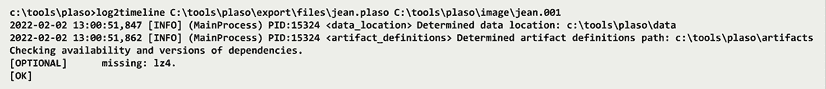

图 5.9：输出

当命令执行时，它会定位包含可执行文件依赖项的数据文件夹，然后搜索包含可能存储在系统中的工件信息的文件。这是一个默认文件夹，在你安装 `plaso` 时会自动安装。

现在我们有了一个 `.plaso` 文件，可以在 `files` 文件夹中找到它。在某些情况下，你可能不希望为每个选项都创建数据库文件，即不想“厨房水槽式”地处理所有内容。相反，你可能希望对时间线进行有针对性的检查，这时你需要使用过滤器。使用 `-f` 修饰符可以实现这一点。

**注意**

如果你想下载一些预制的过滤器，可以访问 [`github.com/mark-hallman/plaso_filters`](https://github.com/mark-hallman/plaso_filters)。

我下载了预制的过滤器，并在 `plaso` 安装路径下创建了一个名为 `filter` 的文件夹。如以下截图所示，我将 `plaso` 安装在了 `C` 盘根目录下的一个名为 `tools` 的文件夹中：

```
log2timeline -f filter_windows.txt C:\tools\plaso\export\files\jeanfilter.plaso C:\tools\plaso\image\jean.001 
```

如以下截图所示，工具能够在 `artifacts` 文件夹中找到我的过滤器，并创建了一个新的 Plaso 数据库文件：

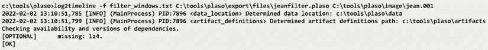

图 5.10：过滤器

到目前为止，我们已经介绍了几个命令；然而，我们还有更多内容要讲解。框架中的下一个命令是 `pinfo`。

#### pinfo

`pinfo` 是一个命令行，用于显示关于 Plaso 数据库文件（`.plaso`）的信息。

`plaso` 数据库文件将包含以下信息：

+   用户执行工具时

+   执行工具时使用的选项

+   工具在预处理阶段获取的信息

+   数据库元数据

+   解析了什么内容以及使用的参数

+   提取的事件数量

+   标记事件

要了解更多关于前述选项的信息，请使用 `-h` 修饰符执行命令。虽然这些选项相似，但与其他工具相比，你的选择会少得多，正如下图所示：

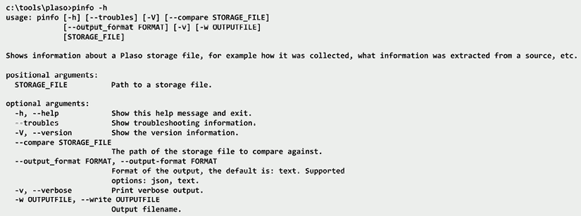

图 5.11：pinfo

当你以最简单的形式使用 `pinfo` 命令时，将获得以下结果：

```
---------------------------------------------------------------
*********************** Plaso Storage Information ***********************
Filename: jeanfilter.plaso 
Format version: 20190309 
Serialization format: JSON 
---------------------------------------------------------------
*********************************** Sessions *****************************
276a7520-999e-428b-a6b4-11fcf9cf987d : 2019-07-19T22:19:36.092703Z 
--------------------------------------------------------------- 
```

如前面的输出所示，你可以查看文件的存储信息以及创建该文件所用的会话数量。

你可以将结果发送到标准输出，也就是显示器，或者使用 `-w` 修饰符将结果保存到一个文本文件中。对 `.plaso` 文件使用额外工具将生成 GUID 以及分析进行时的日期时间戳。

该工具还可以提供你正在检查的源系统的系统信息：

```
--------------------------------------------------------------------------
******* System configuration: 276a7520-999e-428b-a6b4-11fcf9cf987d *******
Hostname: N/A 
Operating system: Windows NT 
Operating system product: Microsoft Windows XP 
Operating system version: 5.1 
Code page : cp1252 
Keyboard layout: N/A 
Time zone: GMT 
-------------------------------------------------------------------------- 
```

在验证数据库文件中的信息后，你可以继续执行下一个命令。

#### psort

`psort` 是一个命令行工具，允许你筛选、排序并分析 `plaso` 数据库文件的内容。就像其他命令一样，`-h` 修饰符将显示该命令的所有选项。在下面的 `psort` 截图中，你可以看到可用选项，并且你应该能识别出所有 `plaso` 架构中命令选项的共性：

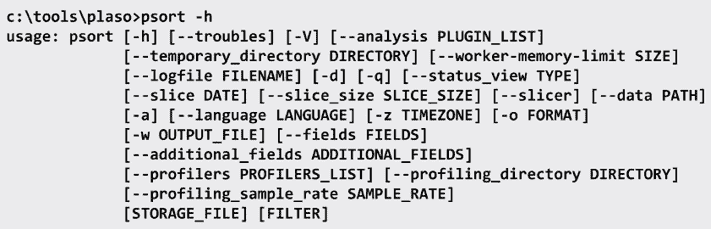

图 5.12：psort

让我们讨论一些新的选项：

```
-o FORMAT, --output_format FORMAT, --output-format FORMAT 
```

以下是可用的输出格式列表：

| **名称** | **描述** |
| --- | --- |
| `dynamic` | 将事件输出为分隔符（默认是逗号）分隔的值格式，支持动态选择字段。 |
| `elastic` | 将事件输出到 ElasticSearch 数据库。需要 elasticsearch-py。 |
| `elastic_ts` | 将事件输出到 ElasticSearch 数据库，以供 Timesketch 使用。需要 elasticsearch-py。仅供 Timesketch 后端使用。 |
| `json` | 将事件输出为 JSON 格式。 |
| `json_line` | 将事件输出为 JSON 行格式。 |
| `kml` | 将含有地理数据的事件输出为 KML 格式。 |
| `l2tcsv` | 将事件输出为 `log2timeline.pl` 的传统 CSV 格式，包含 17 个固定字段。 |
| `l2ttln` | 将事件输出为 `log2timeline.pl` 的扩展 TLN 格式，包含 7 个固定字段。 |
| `null` | 不输出事件。 |
| `rawpy` | 以“原始”（或本地）Python 格式输出事件。 |
| `tln` | 将事件输出为 TLN 格式，包含 5 个固定字段。 |
| `xlsx` | 将事件输出为 Excel 电子表格（XLSX）。 |

当你使用 `psort` 进行处理时，可以将结果导出到 `plaso` 数据库之外。你可以使用多种选项导出数据以便分析。一个常见的导出格式是 `l2tcsv`，它是 `log2timeline` 的传统格式，采用 `.csv` 工作表格式。

在创建 `.csv` 工作表时，你可能会遇到一个潜在问题，即如果你创建的文件太大，一些工具可能无法分析它，或者你无法用你喜欢的电子表格程序打开它。

`--analysis list`：`psort` 默认安装了分析插件（你仍然可以创建自定义插件），允许你浏览数据库文件并提取和分析内容。

你可以使用 `--analysis` `list` 修饰符查看完整的插件列表：

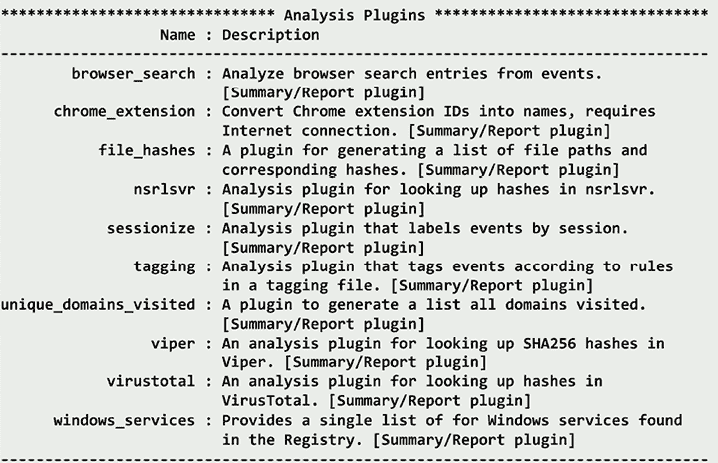

图 5.13：分析插件列表

如果我们运行该命令，它会遍历 `plaso` 数据库文件，标记在 `tag_windows.txt` 文件中已识别的特定事件（该文件是默认安装的一部分，可以在 `data` 目录中找到）：

```
psort -o null --analysis tagging --tagging-file tag_windows.txt c:/tools/plaso/export/files/jean.plaso 
```

处理完成后，它会显示已应用于数据库的标签数量：

```
************************** Analysis report: 0 **************************
String: Report generated from tagging 
Generated on:2019-07-20T20:04:46.000000Z 
Report text: Tagging plugin produced 9754 tags
--------------------------------------------------------------- 
```

此外，你还可以使用 `--slice` 修饰符过滤掉多余的数据。

**注意**

5 分钟是默认值。如果你想要更长或更短的时间切片，可以在`DATE TIME`后添加`--slice_size <VALUE>`来指定。

如果你发现了`GET`事件，你可能希望通过观察发生在之前和之后的事件来为其提供上下文：

```
psort -q --slice '2008-07-20 01:26:17' c:/tools/plaso/export/files/jean.plaso -w c:/tools/plaso/export/files/jeansliceoutput.csv 
```

该命令将创建一个`csv`文件，包含时间戳前后各 5 分钟的事件。

框架中的最后一个工具是`psteal`，我们接下来会讨论它。

#### psteal

`psteal`是 plaso 框架中的最终 CLI 命令。它将`log2timeline`和`psort`命令结合在一起，通过一步操作提取和处理事件。这是一种典型的“万金油”方法，也可以称为“我想要所有的”，与框架中其他 CLI 命令相比，它有一个有限的修饰符选择。

再次提醒，`-h`会为你提供命令的选项列表，具体内容如下截图所示：

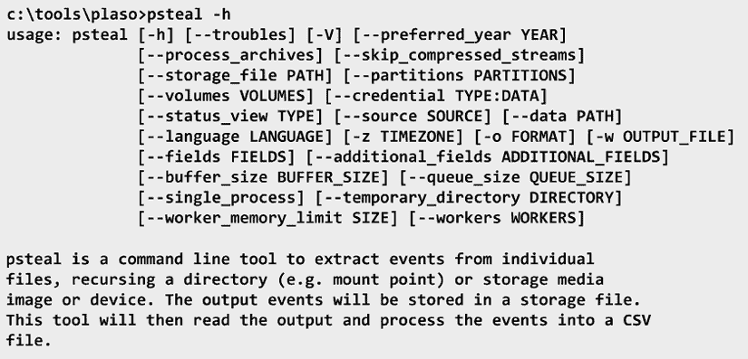

图 5.14：psteal

至少需要指定源和输出。该过程将创建 plaso 数据库文件，并将其放置在 plaso 安装目录的根目录中。此位置允许你在命令完成后执行额外的标记、筛选或分析。创建的数据库文件的命名约定为`<timestamp>-<source>.plaso`。

这是命令。它创建了一个几乎 1GB 大小的`.csv`文件。然而，如果我将输出更改为`.xlsx`，文件大小会减少到 35MB。所以，请记住，你正在处理和分析你的数据集：

```
psteal --source C:/tools/plaso/image/jean.001 -o l2tcsv -w c:/tools/plaso/export/files/jean.csv 
```

我正在使用一个相对较小的 20GB 硬盘的法医镜像。试想一下，如果你使用的是 500GB 或 1TB 的硬盘，并且该硬盘已经使用了较长时间，会是什么情况。

现在我们已经创建了数据库文件并导出了与调查相关的数据集，接下来该做什么呢？是时候分析数据集，找出能够证明或反驳指控的证据了。你用来分析的工具可以是你喜欢的 Office 套件中的电子表格阅读器，也可以是专门为此目的设计的商业开源工具。

本书无法涵盖所有可供检查员使用的工具选项。我将突出显示一些可用的选项并为你总结这些工具。最终，数据的分析是检查员通过查看数据集并审查结果来完成的。再次强调，这都归结于对法医工具的验证/确认，确保它们提供准确的结果。

以下是一些工具：

+   **ELK 堆栈**：可以在[`www.elastic.co`](https://www.elastic.co)找到。它是三个开源项目的缩写：Elasticsearch、Logstash 和 Kibana。Elasticsearch 是搜索和分析引擎，Logstash 是数据处理和摄取引擎，而 Kibana 是可视化工具。您可以选择下载这三个引擎并安装到您选择的操作系统中。提供了 macOS、Windows 和 Linux 版本。如果您不希望在自己的环境中托管这些系统，还可以选择付费使用云环境。

+   **TimelineMaker Pro**：可以在[www.timelinemaker.com](https://www.timelinemaker.com)找到。它是一个专门设计用于创建时间轴图表的商业产品。通过这个工具，您可以导入使用 plaso 框架创建的 CSV 文件。

+   **TimeSketch**：可以在[`github.com/google/timesketch`](https://github.com/google/timesketch)找到。它是一个开源的取证时间轴分析工具。它是基于 Linux 的。我已经将它安装在一个虚拟环境中，这样我就可以根据需要使用它。不同团队成员也可以共同使用它。您还可以从各种 plaso 框架输出选项中导入数据。

+   **Aeon Timeline**：可以在[www.aeontimeline.com](https://www.aeontimeline.com)找到。它是一个专门设计用于创建可视化时间轴的商业产品。它将帮助您查看事件之间的关系。最初是为作家设计的，但也可以用来分析超时间轴。您可以导入使用 plaso 框架创建的 CSV 文件。

+   **Timeline Explorer**：可以在[ericzimmerman.github.io/#!index.md](https://ericzimmerman.github.io#%252521index.md)找到。Timeline Explorer 是由 Eric Zimmerman 创建的开源平台，旨在提供一个无需使用 Microsoft Excel 即可读取 MAC 时间和 plaso 生成的 CSV 文件的工具。它并不是专门设计来查看非常大的 CSV 文件；事实上，Zimmerman 明确建议，最好打开较小且有针对性的时间轴，而不是一个巨大的时间轴。

# 媒体分析

您可以在多个维度上使用时间轴分析，例如网络分析、媒体分析、软件分析和硬件分析。网络分析是分析日志文件、跟踪文件以及用户与其设备之间的通信内容。媒体分析是分析物理存储设备，如硬盘、SSD 驱动器、U 盘或光盘存储。您将检查内容、分配的空间以及空闲空间。最后，在进行软件分析时，您将逆向工程恶意代码并分析保护代码，以防止潜在的外泄。

那么，让我们来看看媒体分析。您的数字调查的主要来源将是存储设备（如硬盘、SSD、USB 设备、光盘以及智能手机等移动设备）的取证映像。根据您的组织，您可能是负责创建取证映像的人，或者取证映像可能是由组织的其他部门提供给您的。请记住，取证映像是源设备的逐位复制。在大多数情况下，您不希望使用备份作为数字取证调查的源，因为备份不会包含存储设备上的所有信息。

存储设备可能包含四种不同类型的数据，您可能需要检查：

+   **已分配空间**：这是存储设备上被文件占用的空间。文件系统将该存储空间识别为已使用。

+   **未分配空间**：这是存储设备上未被文件占用的空间。文件系统将该存储空间识别为可用空间。

+   **空闲空间**：当数据存储在一个簇中时，如果文件没有完全填满簇，未被文件占用的剩余空间被称为空闲空间。

+   **坏块/扇区/簇**：这是磁盘上由于缺陷而被文件系统标记为坏的空间。它也可以被用户用来隐藏数据，以防被随意检查。

Brian Carrier 在他的论文《定义数字取证检查和分析工具》中描述了媒体分析的进展，内容如下：

+   **磁盘**：物理存储设备，如硬盘、SSD 或闪存介质。

+   **卷**：一个容器，由单个磁盘或多个磁盘组成。您可能会在单个磁盘上找到多个卷，或者一个卷可能跨越多个磁盘。您可能会看到“卷”一词与“分区”一词互换使用。Brian Carrier 将分区定义为仅限于单个物理磁盘，而卷是一个或多个分区的集合。

+   **文件系统**：这是在卷的边界内使用的，跟踪文件分配和簇的使用情况。

+   **数据单元**：文件系统可用的最小分配单元。在大多数情况下，这将是簇，或者在基于 UNIX 的系统中，它将是块。

+   **元数据**：这是关于数据的数据。它包括修改、访问和创建的日期时间戳，以及文件系统和某些应用程序跟踪的关于文件的其他信息。

在数字取证调查中的媒体分析目标是找到相关的证据，这些证据将支持或反驳您正在调查的指控。此外，在进行数字取证调查时，您可能会发现一些证据，它们会将您的注意力引导到其他位置。

现在，我们将讨论在数字取证调查过程中可能使用的一些不同分析技术。

# 字符串搜索

在你的数字取证调查过程中，可能会使用字符串或字节搜索。这个搜索技术在你有一个特定的关键词列表时使用。大多数商业和开源的取证工具都允许进行字符串搜索，并会搜索分配区、未分配区和文件空闲区。你可以使用特定的单词、符号或字母组合作为搜索条件。一般来说，你会希望在开始数字取证调查之前，先准备一些预定义的关键词列表。

你的关键词列表将属于以下类别之一：

+   **通用关键词列表**：这是你在每个案件中都会使用的关键词列表。这个列表还可以根据调查的主题进一步分类。例如，你可能会有一个用于调查欺诈活动的数字取证案件的关键词列表，也有一个用于调查非法图像的数字取证案件的关键词列表。

+   **特定案件关键词列表**：这是你将在特定数字取证调查中使用的关键词列表。在你准备进行数字取证调查时，你将根据参与者、地点以及有时参与者使用的俚语来确定关键词。例如，你可以有基于用户名、电子邮件地址、物理地址、电话号码、信用卡号码等的关键词。

**备注**

你应该避免使用那些通用的或具有其他含义的关键词。例如，如果你正在调查一起凶杀案，“kill”这个词看似是一个有效的搜索词。不幸的是，“kill”也是你在计算机系统中可能遇到的编程语言中的一个术语。这会导致大量的假阳性。理想情况下，目标是通过关键词列表帮助过滤掉无关数据，以便高效集中精力。

在你进行数字取证图像搜索时，可能会遇到不同的编码方案，例如以下几种：

+   **美国信息交换标准代码** (**ASCII**) 是一种最初基于美国英语的字符编码方案，且限制为 256 个字符代码。

+   **Unicode** 是为了克服 ASCII 的限制而开发的。每个字符都有一个独特的 2 字节值，从而能够定义超过 65,000 个字符。

尽管关键词搜索非常强大，但它也有一个缺点，因为在根据关键词搜索内容时，它是非常字面上的。例如，如果你搜索一个单词，它不会找到替代拼写；也就是说，如果你搜索`ally`，过滤器不会找到`alley`。幸运的是，还有一种替代的搜索方法，叫做模式匹配/正则表达式。

正则表达式使用字符字符串来创建搜索模式，并找到所有与该模式匹配的实例。以下是一些常用符号及其在创建正则表达式时的含义：

+   **星号符号（**`*`**）**：匹配前面的字符（或字符集）重复 `X` 次。例如，`ca*t` 将返回匹配 `ct`、`cat`、`caat` 和 `caaat` 的结果。

+   **井号（**`#`**）**：这将匹配一个数字（0-9）。

+   **反斜杠（**`\`**）**：接下来的字符将按字面意思解释。`\.` 将被解释为句点。

+   **脱字符（**`^`**）**：匹配文本的开始。例如，`¹²³` 会使匹配的结果以 `123` 开头。

+   **美元符号（**`$`**）**：匹配文本的结束。例如，`123$` 将导致匹配结果以 `123` 结尾。

+   **加号符号（**`+`**）**：重复前面的字符（或字符集）一次或多次。例如，`ca+t` 将返回匹配 `cat`、`caat` 和 `caaat` 的结果。

+   **大括号（**`{…}`**）**：重复前面的字符（或字符集）`X` 次（取决于大括号中的值）。

+   **方括号（**`[...]`**）**：这将匹配方括号中的任何单个字符。例如，`[b,c,d]` 将匹配 b、c 或 d。

+   **方括号 w/ ^ [^...]**：这将匹配方括号中不包含的任何单个字符。例如，`[^b,c,d]` 将匹配除 b、c 或 d 以外的任何字符。

+   **方括号（范围）[..-..]**：这将匹配给定范围内的任何字符。`[0-9]` 将匹配从 0 到 9 的任何字符。

+   **点号（**`.`**）**：点号可以代替任何字符。

+   **问号（**`?`**）**：前面的字符可能会出现也可能不会出现。例如，`.e01?` 将返回 `.e0(x)` 值。`x` 表示它可能会找到 `.e0` 后的任何值。

+   **管道符号（**`|`**）**：这匹配由管道符号（`|`）分隔的任何一个字符集。例如，`br(ead|ake|east)` 将返回匹配 `bread` 或 `brake` 或 `breast` 的结果。

以下是一些常见的模式匹配示例，可能对你有所帮助。

要搜索 IP 地址，你可以使用以下正则表达式：

```
\d{1,3}\.\d{1,3}\.\d{1,3}\.\d{1,3} 
```

`\d` 表示接下来的内容将匹配一个数字。大括号 `{1,3}` 表示数字可以是 1 到 3 位。`\.` 表示搜索 `.` 字符。`\d{1,3}` 模式将重复三次，直到获得 IPv4 地址的值。

要搜索美国电话号码，你可以使用以下表达式：

```
((\(\d{3}\) ?)|(\d{3}-))?\d{3}-\d{4} 
```

`\(` 将匹配开括号。`\d{3}` 将匹配三位数。`\)` 将匹配闭括号。这个模式将给出区域代码 `(###)`，格式为 `(###)`。其余的正则表达式将提供前面三位数字 `\d{3}`、破折号 `-` 和最后四位数字 `\d{4}`，这是美国电话号码的格式。如果电话号码不是按照 `(###) ###-####` 或 `###-###-####` 格式提供的，你将无法得到匹配。

正则表达式是一个强大的工具，但它们也可能非常复杂。我喜欢使用正则表达式库（可以在 [`regexlib.com/Default.aspx`](http://regexlib.com/Default.aspx) 找到）来帮助我提升正则表达式技能。

那么，当用户从媒体中删除一个文件或文件夹时会发生什么呢？接下来我们来讨论当文件或文件夹被删除时会发生什么。

# 恢复已删除的数据

当文件在 FAT 文件系统中被删除时，数据本身并没有被改变。目录条目的第一个字符会被更改为`xE5`，并且文件分配表条目会被重置为`x00`。当文件系统读取目录条目时，如果遇到`xE5`，它将跳过该条目，并开始读取后续条目。

要恢复已删除的文件，我们需要逆转文件系统删除文件的过程。记住，它并没有改变文件内容；它们仍然物理存在于它们分配的簇中。现在我们需要逆向工程删除操作，并重新创建文件条目和文件分配表中的条目。为此，我们需要找到文件的第一个簇、文件的大小以及卷中簇的大小：


图 5.15：已删除的条目

在上面的截图中，我们有一个目录条目，显示一个文件已被删除。我们看到目录条目开头的`xE5`。（这需要使用十六进制编辑器进行修改。）接下来，我们必须确定起始簇，`x00 x08`（显示为`x08 x00`），即簇号`8`。要确定文件大小，请查看最后四个字节（记住，FAT 文件系统以小端格式存储数据，这意味着最不重要的字节在左侧，因此我们读取的值是`x00 x00 x00 x27`，而不是显示的`x27 x00 x00 x00`），当我们将十六进制值转换为十进制时，得到文件大小为 39 字节。

现在我们需要确定一个簇由多少个扇区组成以及每个扇区的大小。你需要查看引导记录以获取这些信息。引导记录显示每个扇区有 512 字节，每个簇有 8 个扇区，这意味着簇大小为 4,096 字节：

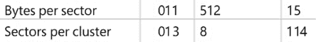

图 5.16：引导记录

这意味着我们的文件只占用一个簇。接下来，我们查看文件分配表，并查看簇号 8 的条目，发现它已被清零：

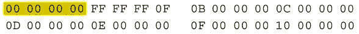

图 5.17：已删除的 FAT

要恢复已删除的文件，请执行以下步骤：

1.  你需要将文件分配表中的条目从`x0000 x0000`更改为`xFFFF FFF8`或`xFFFF FF0F`。如果这是一个较大的文件，你需要将文件分配表条目更改为指向下一个簇，直到你到达包含文件末尾的簇。如果你在到达文件末尾之前找到标记为已分配的条目，可能是你在处理一个碎片化的文件。另一种可能性是，在文件被删除时，簇被释放，新的文件数据被放置在这些可用空间中，这样就会导致旧数据被新文件的数据覆盖。

1.  下一步是返回目录条目并将`xE5`替换为另一个字符。在替换目录条目中文件名的`xE5`字符时，要小心不要猜测字符是什么。如果选择了错误的字符，可能会改变其含义或使新文件名产生偏差，这样是不正确的。

我建议在恢复删除的文件时，将第一个字符替换为下划线或破折号，以避免对文件名的误解。

在恢复长文件名的文件时，重要的是要将长文件名与短文件名重新链接。这是因为当为适应长文件名而创建附加目录时，系统会基于短文件名的数据生成校验和。当你更改了短文件名条目的`xE5`值时，你还需要为长文件名目录条目的后续`xE5`条目使用相同的替换字符。将长文件名与短文件名链接的原因是，短文件名目录条目包含诸如日期和时间、起始簇和文件大小等信息。

正如我们在*第四章*中讨论的，*《计算机系统》*，当在 NTFS 卷上创建文件/目录时，系统会在`$MFT`文件中创建一个条目。MFT 记录将包含关于文件/目录的元数据；如果文件内容是非驻留的，那么`$Bitmap`文件将更新，显示文件占用的簇已被分配。

当文件/目录被删除时，MFT 文件记录头中的序列计数会增加一位。记录的分配状态将从已分配更改为未分配。如果文件数据是非驻留的，系统会更新`$Bitmap`文件，显示文件占用的簇现在是未分配的。

每个 MFT 文件条目将以文件的文件签名开始，你可以使用它作为搜索词，在未分配空间中定位 MFT 文件条目。直到磁盘上包含数据的簇被覆盖，我们才能恢复数据。

如果 MFT 文件记录未使用，则可以反向操作并恢复该文件。您可以解密文件记录，如我们在*第四章*，*计算机系统*中讨论的那样。如果文件存在于文件记录中，当您恢复 MFT 文件记录时，将恢复数据。如果数据是非驻留的，那么您将需要解密 MFT 文件记录，以确定数据是否连续并识别占用的簇。

如果系统已覆盖 MFT 文件记录，则无法恢复已删除的 MFT 文件记录数据或任何驻留数据。您可能可以恢复非驻留数据，但这取决于文件的大小和碎片化程度。一旦 MFT 记录被覆盖，您将失去有关数据运行和哪些簇包含数据的任何信息。

# 总结

在本章中，我们详细讨论了使用开源和商业取证工具进行时间线创建和时间线分析。我们深入探讨了利用商业取证工具 X-Ways Forensics 和开源 plaso 框架进行`log2timeline`的使用。我们还提到使用“厨房水槽法”或针对数据集的定向检查。记住，我们不是分析文件的内容，而是分析与文件和操作系统及文件系统内的其他事件相关的时间线。

在下一章中，我们将讨论文件的内容，具体来说，是 Windows 工件。

# 问题

1.  对考察员来说，了解证据收集时的时区非常重要。

    1.  正确

    1.  错误

1.  在创建 _________ 列表时，您可以使用 X-Way Forensics 进行时间线分析。

    1.  时间线

    1.  日期/时间

    1.  事件

    1.  方

1.  Plaso 是一个包含多少个工具的框架？

    1.  一

    1.  三

    1.  五

    1.  七

1.  `pinfo`会给你提供什么信息？

    1.  考察员信息

    1.  数据库文件信息

    1.  取证机器信息

    1.  嫌疑人信息

1.  `log2timeline`是一个基于 ___________ 的工具。

    1.  CLI

    1.  GUI

    1.  VFD

    1.  XYZ

1.  `psort`将给你 ___________。

    1.  排序能力

    1.  过滤能力

    1.  连接能力

    1.  以上所有

1.  您可以使用 Excel 电子表格进行时间线分析。

    1.  正确

    1.  错误

# 进一步阅读

您可以参考以下链接，获取更多关于本章内容的信息：

+   *T. P. P. A. (2019 年 7 月 8 日). Plaso 文档. 取自 Plaso 项目*: [`buildmedia.readthedocs.org/media/pdf/plaso/latest/plaso.pdf`](https://buildmedia.readthedocs.org/media/pdf/plaso/latest/plaso.pdf)

+   *Carvey, H. (2014). Windows 取证分析工具包：针对 Windows 8 的高级分析技术；马萨诸塞州沃尔瑟姆：Syngress*. 可在以下网址获取：[`www.abebooks.com/servlet/SearchResults?sts=t&cm_sp=SearchF-_-home-_-Results&an=&tn=Windows+forensic+analysis+toolkit&kn=&isbn=`](https://www.abebooks.com/servlet/SearchResults?sts=t&cm_sp=SearchF-_-home-_-Results&an=&tn=Windows+forensic+analysis+toolkit&kn=&isbn= )

# 练习

## 数据集

`Chapter 5 Emails.xlsx`

`Chapter 5 Carving.dd`

## 所需软件

时间线探索器 - [`ericzimmerman.github.io/#!index.md`](https://ericzimmerman.github.io/#!index.md)

需要 Microsoft .NET 6 或更高版本。如果没有至少.NET 6，您会遇到错误。若有疑问，请安装它！如果计划运行任何 GUI 程序，请确保安装**桌面**运行时。

Autopsy - [`www.autopsy.com/`](https://www.autopsy.com/)

## 邮件练习

一名 m57.biz 外部人员从 Craigslist 购买了一台笔记本电脑。这台笔记本电脑包含儿童色情内容，该人员决定向警方报告。

调查人员能够追踪到这台笔记本电脑属于 m57.biz。当警方联系 m57.biz 的 CEO 时，CEO 报告称该笔记本电脑以及其他物品已从 m57 的库存中被盗。

m57 的 CEO 同意让警方调查员搜索 m57.biz 并对所有 m57.biz 电脑、公司电话及 USB 驱动器进行成像。

分析在`Chapter 5 emails.xlsx`电子表格中找到的电子邮件，识别潜在嫌疑人及其活动时间线。

## 数据切割练习

1.  启动 Autopsy 并开始一个新案件。

1.  选择**磁盘映像**或**虚拟机文件**作为数据源。

1.  导航到存储图像`Chapter 5 Carving.dd`的文件夹。仅选择以下导入模块：

    +   PhotoRec Carver 嵌入式文件提取器

1.  从下拉菜单中选择**所有文件**、**目录**和**未分配空间**。

分析结果。

# 加入我们社区的 Discord

加入我们社区的 Discord 空间，与作者和其他读者进行讨论：

[`packt.link/CyberSec`](https://packt.link/CyberSec)


