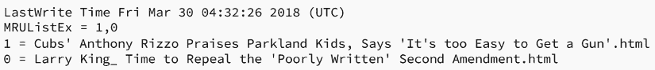
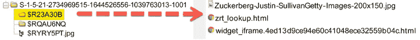

# 第六章：Windows 人工制品分析

世界上大多数设备都运行 Microsoft Windows 操作系统，微软的操作系统市场份额接近 90%（[`netmarketshare.com/`](https://netmarketshare.com/)）。根据我个人的经验，我检查过的 Windows 操作系统远远多于其他任何操作系统；macOS 是第二常见的操作系统，而 Linux 则排名第三。尽管你必须准备分析所有操作系统，但无论哪个操作系统在你所工作领域中最为常见，你应该将重点放在它上面。

本章将帮助你理解 Windows 操作系统以及你可能发现的人工制品。关于 Windows 操作系统有整本书籍讨论；本章的目标是让你了解在调查过程中可能遇到的更常见的操作系统人工制品。你将从用户配置文件入手，检查大多数用户数据所在的地方。接着，我们将研究 Windows 注册表，以识别 Windows 设置。你还将查看人工制品，以确定用户的活动并了解如何识别在系统上使用过的 USB 设备。最后，我们将在以下主题中全面覆盖这些内容：

+   了解用户配置文件

+   了解 Windows 注册表

+   确定帐户使用情况

+   确定文件知识

+   确定物理位置

+   探索程序执行

+   了解 USB/附加设备

操作系统管理硬件资源，并允许用户运行其他应用程序，这些程序本质上是操作系统环境中的程序。它可以成为一个宝贵的资源库，帮助我们在任何特定时刻重建用户或系统的活动。当我们讨论 Windows 操作系统时，这个话题可能涵盖多个版本。目前 Windows 操作系统的版本是 Windows 11，但 Windows 10 仍然占据大多数系统的份额。这并不意味着你检查的每一台系统上都安装了 Windows 10。即使在企业环境中，你仍然有可能检查到 Windows XP 客户端，尽管微软在 2001 年发布了它并且不再提供支持。

在本章剩余部分，我将重点讨论 Windows 7、8 和 10。然而，首先可能会提到 Windows XP，因为微软对该操作系统的遗留支持。

我想讨论的第一个问题是不同类型的用户配置文件，以及操作系统会将用户数据存储在哪里。

# 了解用户配置文件

当 Windows 操作系统安装时，它会创建一个默认的文件夹结构来存储用户和应用程序数据。有时，仅仅查看文件夹结构就能告诉你是否安装了某个版本。

当你寻找用户帐户配置文件时，位置可能会根据操作系统的版本而有所不同：

+   针对 Windows XP、WinNT 和 Win2000

    +   `C:\Documents and Settings\%UserName%`

+   对于 Windows Vista、7、8 和 10

    +   `C:\Users\%UserName%`

当用户首次登录系统时，系统会创建一个用户配置文件。此配置文件将用于任何后续的登录，并且现在成为用户在系统上活动的环境。微软定义了不同类型的用户配置文件：

+   **本地用户配置文件**：当用户首次登录计算机时，会创建此配置文件。您会在硬盘上找到该配置文件。当对配置文件进行更改时，这些更改将特定于用户并存储在本地计算机上。

+   **漫游用户配置文件**：此配置文件是由管理员创建的基于网络的配置文件。当用户登录到系统时，配置文件将被下载到本地主机。当在本地主机上对配置文件进行任何更改时，用户注销本地主机时更改也会同步到服务器副本。此配置文件类型消除了用户在登录网络中的不同主机时需要创建配置文件的要求。（此类型的配置文件仅在企业环境中存在。）

+   **强制用户配置文件**：此配置文件由网络管理员创建，用于在用户使用网络中的主机时锁定一组特定的设置。未经管理员批准，用户将无法更改该配置文件。用户对本地主机环境所做的任何更改将在用户注销本地主机时丢失。

+   **临时用户配置文件**：当系统加载用户配置文件时发生错误时，会创建此配置文件。用户注销时，配置文件将被删除。在运行 Windows 2000 及更高版本的计算机上，您会看到临时配置文件的使用。

每个用户配置文件都会有一个注册表哈希文件 —— `NTUSER.DAT` —— 并且在用户登录时会映射到系统注册表项**HKEY Current User**。该注册表哈希包含用户的偏好设置和配置。

每个用户配置文件包含以下文件夹：

+   `\Users\$USER$\Documents`

+   `\Users\$USER$\Music`

+   `\Users\$USER$\Pictures`

+   `\Users\$USER$\Videos`

`AppData` 文件夹是一个隐藏文件夹，包含特定于用户的偏好设置和配置，并进一步分为三个子文件夹：

+   `\Users\$USER$\AppData`

+   `\Users\$USER$\AppData\Local`

+   `\Users\$USER$\AppData\LocalLow`

+   `\Users\$USER$\AppData\Roaming`

`Roaming` 文件夹包含可以在服务器环境中同步的数据。例如，Web 浏览器的收藏夹或书签将随着用户的登录在不同的工作站之间传递：

+   `\Users\$USER$\AppData\Roaming\Microsoft\Windows\Cookies`

+   `\Users\$USER$\AppData\Roaming\Microsoft\Windows\Network Shortcuts`

+   `\Users\$USER$\AppData\Roaming\Microsoft\Windows\Printer Shortcuts`

+   `\Users\$USER$\AppData\Roaming\Microsoft\Windows\Recent`

+   `\Users\$USER$\AppData\Roaming\Microsoft\Windows\SendTo`

+   `\Users\$USER$\AppData\Roaming\Microsoft\Windows\Start Menu`

+   `\Users\$USER$\AppData\Roaming\Microsoft\Windows\Templates`

`Local` 文件夹包含与程序安装相关的数据。它是特定于工作站的，并且不会与服务器（在服务器环境中）同步。临时文件也会存储在这里：

+   `\Users\$USER$\AppData\Local`

+   `\Users\$USER$\AppData\Local\Microsoft\Windows\History`

+   `\Users\$USER$\AppData\Local\Microsoft\Windows\Temporary Internet Files`

`LocalLow` 文件夹包含低级别的访问数据，例如浏览器在受保护模式下运行时的临时文件。

这完成了我们关于用户账户的讨论，现在让我们转向注册表，它是 Windows 操作系统的核心和灵魂。

# 理解 Windows 注册表

Windows 注册表是 Windows 操作系统的核心，它将成为我们稍后章节中讨论的许多重要内容的来源。首先，我将提供注册表的高层次概览。然后，假设你想深入了解注册表的细节，强烈推荐哈兰·卡维（Harlan Carvey）的书籍 *Windows Registry Forensics – Advanced Digital Forensic Analysis of the Windows Registry*。哈兰·卡维也是工具 RegRipper 的开发者，这个工具是我们在本章节中将要使用的工具。

什么是注册表？微软将注册表定义为一个中央层级数据库。这个数据库用于存储关于用户、硬件设备和应用程序的配置信息。

但是，这对法医调查员意味着什么呢？Windows 在操作过程中不断引用注册表中的信息。注册表中的信息将包含每个用户的配置文件、已安装的应用程序、不同的文档类型以及文件夹和应用程序图标的属性设置。注册表还将包含关于系统硬件的信息，包括用于网络连接的端口信息。

哇，真是内容繁多，但简单来说，注册表包含了关于计算机系统几乎所有内容的信息。

注册表的组件位于 `%SystemRoot%\System32\Config` 文件夹中，称为 hive 文件。你会找到 `SAM`、`SECURITY`、`SOFTWARE` 和 `SYSTEM` 分支。以下是各个分支的简要描述：

+   `SAM` 分支是安全账户管理器，包含关于用户的登录信息。

+   `SECURITY` 分支包含安全信息，并可能包含密码信息。

+   `SOFTWARE` 分支包含关于应用程序信息和默认 Windows 设置的信息。

+   `SYSTEM` 分支包含关于硬件和系统配置的信息。

还有一个额外的 hive，`NTUser.dat`，它存储在用户配置文件的根目录中。这个 hive 包含关于用户行为和设置的信息。

另一个 hive 格式的文件是`UsrClass.dat`文件，它位于用户账户的`\AppData\Local\Microsoft\Windows`文件夹中。你会找到关于**用户访问控制**（**UAC**）配置和关于**图形用户界面**（**GUI**）显示的用户体验的信息。

Hive 包括包含**值**、**类型**和特定**数据**或设置的子键。这将为我们提供参考框架，帮助我们探索注册表中包含的遗留物。

如下图所示，难以解读子键和值的含义以及它们代表的内容：


图 6.1：注册表编辑器显示 USBSTOR 注册表项

在浏览这些遗留物时，我将向你展示你将在注册表查看器中看到的视图，以及通过取证工具创建的更易读的解析版本。

在本章中，我们将使用一些开源工具：

+   RegRipper（可以从[`github.com/keydet89/RegRipper3.0`](https://github.com/keydet89/RegRipper3.0)下载），由哈兰·卡维（Harlan Carvey）创建。

+   埃里克·齐默尔曼（Eric Zimmerman）（他的作品可以从[`ericzimmerman.github.io/#!index.md`](https://ericzimmerman.github.io/#!index.md)下载）创建了几个开源工具来解析 Windows 遗留物。

我们会在几个类别中寻找遗留物。我喜欢使用 SANS 目录中对遗留物的描述，可以在[`digital-forensics.sans.org/community/posters`](https://digital-forensics.sans.org/community/posters)找到，具体如下：

+   账户使用情况

+   文件知识

+   物理位置

+   程序执行

+   USB/驱动器使用情况

+   浏览器使用（我们将在*第九章*，*互联网遗留物*中讨论）

在了解了用户档案后，我们将讨论一些能确定与用户账户相关的操作的遗留物。

# 确定账户使用情况

识别键盘后面的用户是进行数字取证检查时最难的任务之一。你需要解析许多遗留物来帮助做出这个判断。首先，你需要尽可能多地收集有关该用户账户的信息，并查看是否能将其与物理人物关联起来。你会希望尽可能多地了解该用户账户及其与正在调查事项相关的活动。接下来，我们将讨论一些来自基于 Windows 的操作系统的遗留物，这些遗留物可以帮助你确定并识别该账户的活动，从用户的最后一次登录或密码更改开始。

## 最后登录/最后密码更改

以下路径将包含有关系统上用户账户的信息：

```
C:\windows\system32\config\SAM\Domains\Account\Users 
```

为了导航到包含用户账户信息的位置，我将使用埃里克·齐默尔曼的注册表浏览器。我已经从取证镜像中导出了注册表数据文件来运行注册表浏览器和 RegRipper。

在以下截图中，我们可以看到我已经打开了文件夹路径和子键，在**Users**子键中，有以十六进制名称命名的文件夹和一个名为`Names`的文件夹。在`Names`子键中，你会看到该计算机上帐户的列表：


图 6.2：注册表浏览器显示 USERS 键和子键

它列出了英文名称，因此易于读取。在显示的六个帐户中，一个已被删除（`defaultuser0`），一个用户名为`jcloudy`。`jcloudy`子键的值将指向具有十六进制值的子键。在这里，`jcloudy`指向`x3E9`。

在子键`x3E9`中，如下图所示，我看到有一个**F**和一个**V**值，在下面，我可以看到与用户密码相关的信息：


图 6.3：注册表子键 X3E9

为了简化，我们可以运行 RegRipper，看看是否能得到更易读取的输出。以下是`jcloudy`帐户的输出示例：


图 6.4：jcloudy 帐户的 RegRipper 输出

RegRipper 解析数据并以易于读取的格式呈现。我们可以看到帐户何时创建，密码提示，用户最后一次登录时间，以及用户登录系统的次数。

当你查看用户名`jcloudy`时，你可以看到数字`1001`，在下面是一个标记为`SID`的条目。

**SID**是 Windows 操作系统用于标识内部对象的**安全标识符**。这是 Windows 如何在内部寻址组件。在 SID 的末尾是**相对标识符**（**RID**），它是 SID 后的最后几位数字。例如，如果你看到`500`作为 RID，那将标识该系统的管理员帐户。访客帐户的 RID 将是`501`。在这种情况下，如下图所示，我们看到 RID 为`1001`。这告诉我`jcloudy`帐户是用户创建的，而不是系统通过自动化过程创建的帐户：


图 6.5：SID 的细分

在做考试时，最常查看的 SID 部分是 RID。我们可以将 RID 与特定的用户帐户关联。当用户在系统上创建帐户时，RID 会增加一个数字。例如，我们可能有一个用户`user X`，其 RID 为`1005`，如果我找不到`1001`到`1004`的帐户，可能是有人或某些东西删除了这些用户帐户。

我们正在通过注册表查找支持（或不支持）我们关于发生了什么的假设的证据。帮助确定系统上发生了什么的另一个信息来源是事件日志。

Windows 将事件分类为三种不同的类别：

+   **系统**：由 Windows 操作系统生成的信息

+   **应用程序**：本地计算机上应用程序生成的信息

+   **安全**：与登录尝试相关的信息

在 Windows Vista 到 Windows 10 中，我们可以在以下路径找到事件日志：

```
C:\Windows\System32\winevt\logs 
```

当用户因被指控使用系统进行犯罪或不当行为而辩解时，常见的借口是其他人曾访问过他们的系统。**远程桌面协议**（**RDP**）是一种从另一位置访问主机的方法。安全日志将记录任何使用 RDP 协议的访问。你需要查找事件 ID **4778** 和 **4779**，它们会显示服务连接/重新连接的时间和断开连接的时间。

你还可以搜索系统的登录类型。例如，当我们检查安全日志中的事件 ID **4624**时，它将告诉我们登录的日期、时间、用户名和登录成功的方式。正如你在以下**事件查看器**的截图中看到的，你可以使用这个应用程序查看导出的日志文件。

一旦加载了你要查看的日志文件，你可以过滤结果，只显示与你的调查相关的事件：


图 6.6：事件查看器显示事件信息

登录类型也很重要。用户是在键盘前坐着，还是从远程站点登录的？事件 ID `4624`将标识用户使用的登录类型。在以下截图中，你可以看到事件查看器的输出，显示用户何时登录以及使用了哪种登录类型。

这里显示了用户的登录类型为 2，即“交互式”：


图 6.7：事件查看器显示登录类型

以下是 Microsoft 列出的其他登录类型及其描述：


图 6.8：Microsoft 登录类型

你可能还想建立尝试登录的事件，以确定攻击者是否入侵了账户。以下事件 ID 将帮助你做出这个判断：

+   `4624` - 登录成功

+   `4625` - 登录失败

+   `4634` - 登录会话终止

+   `4647` - 用户终止的登录会话

+   `4648` - 用户尝试使用不同凭据登录

+   `4672` - 用户使用管理员权限登录

+   `4720` - 用户账户创建

可以在以下位置找到 Microsoft Windows 事件 ID 的完整列表：

[`www.ultimatewindowssecurity.com/securitylog/encyclopedia/`](https://www.ultimatewindowssecurity.com/securitylog/encyclopedia/)

假设你看到很多失败的登录尝试，或者一个平时没有超级用户权限的用户被授予了管理员权限。在这种情况下，这些事件 ID 提供了额外的调查线索，帮助你确定发生了什么。

现在我们已经检查了用户的账户活动，接下来我们将讨论与用户账户文件访问相关的遗留文件。

# 确定文件知识

一些你调查的事件可能涉及非法图像、被窃取的数据或非法访问数据。你需要判断用户是否知道相关文件的存在，或者这些文件是否存在于用户的系统中。

现在我们将讨论一些你可以在 Windows 操作系统中找到的遗留文件，这些文件可以帮助你做出判断。

## 探索缩略图缓存

缩略图缓存是使用 Windows 资源管理器在缩略图视图中时创建的缩略图图像数据库。根据缩略图的大小，可能会有多个数据库，存储着相同的图像但大小不同。这取决于用户在 Windows 资源管理器中选择的视图。数据库中找到的图像并不能实质性地证明用户知道该图像存在于系统中。系统可以在用户不知情的情况下将缩略图添加到缓存中。缩略图缓存可以在用户的个人资料中找到，路径如下：

```
AppData\Local\Microsoft\Windows\Explorer 
```

你的商业取证工具将能够顺利处理缩略图缓存。如果你想使用开源工具，可以使用缩略图查看器（可在 [`thumbcacheviewer.github.io/`](https://thumbcacheviewer.github.io/) 下载）。

以下是缩略图查看器输出的示例：


图 6.9：缩略图查看器输出

如你所见，缩略图的文件名与源图像不同。为了识别创建缩略图的原始文件，我们需要查看 Windows 搜索索引数据库 `Windows.edb`，该数据库可以在以下路径找到：

```
C:\ProgramData\Microsoft\Search\Data\Applications\Windows\Windows.edb 
```

你将需要一个额外的工具来查找有关用于创建缩略图的图像的信息。你可以使用 `ESEDatabaseView`（位于 [`www.nirsoft.net/utils/ese_database_view.html`](https://www.nirsoft.net/utils/ese_database_view.html)）。

缩略图的名称是 `96 5a be bc cc 2b f2 27`，由十六进制字符组成。为了在数据库中搜索，我们需要将这些值反转，因此我们将搜索 `27 f2 2b cc bc be 5a 96`。我们要寻找的信息根据操作系统的不同，可能位于不同的位置。

+   在 Windows 7 系统上，你可能想要查看表 `SystemIndex_0A` 的内容。

+   在 Windows 8/10 计算机上，你可能想要查看表 `SystemIndex_PropertyStore` 的内容。

一旦我们将十六进制值输入到筛选器中，它将数据缩减为一行：


图 6.10：筛选后的数据库结果

在以下截图中，我们可以看到文件来自用户`jcloudy`的桌面。图片的名称是`MyTiredHead.jpg`：


图 6.11：数据库中的文件名显示

在以下截图中，当我们查看`System_ThumbnailCacheID`字段时，可以验证这是正确的文件：


图 6.12：数据库中的缩略图名称

这完成了关于缩略图缓存的讨论。接下来，我们将探索由 Edge/Internet Explorer/文件资源管理器浏览器创建的人工制品。

## 探索微软浏览器

微软使用相同的方法记录用户的文件活动和 Internet Explorer/文件资源管理器/Edge 浏览器的互联网历史。此外，它还记录本地和远程文件访问。大多数商业取证工具可以轻松解析这些文件。根据版本，历史文件将位于以下位置：


图 6.13：IE 位置

在以下截图中，你可以看到用户正在使用 10/11 版本，因为存在`WebCacheV01.dat`文件：


图 6.14：文件资源管理器显示 WebCacheV01.dat 文件

`.dat`文件是一个 ESE 数据库。如果你想使用单次用途的取证工具，你可以将`.dat`文件从取证镜像中导出，并使用开源取证工具如`ESEDatabaseView`查看它。

（位于[`www.nirsoft.net/utils/ese_database_view.html`](https://www.nirsoft.net/utils/ese_database_view.html)）

你需要导航到`Containers`表。以下截图是来自 X-Ways Forensics 的输出：


图 6.15：X-Ways 显示 WebCache 的内容

如你所见，我们有一个日期和时间戳，以及查看的文件路径。我们看到有一个离线 HTML 文件（第一行），它位于用户的桌面上。我们看到用户打开了两个 PDF 文件、两个 JPEG 文件、一个 HTML 文件和一个 DOCX 文件。

还有一些额外的人工制品，显示了用户帐户访问了一个文件，我们接下来将讨论这些。

## 确定最近使用/最近访问

**MRU**（**最近使用**）是存储在用户**NTUSER.DAT**注册表中的一个最近使用文件的列表。当你打开一个应用程序并看到应用程序的历史记录列表时，这些文件就是 MRU 列表中的文件。注册表文件中存储着很多 MRU 列表。我们将讨论一些常见的存储位置。

来自用户 **NTUSER.DAT** 文件的 **OpenSavePidlMRU** 跟踪通过 Windows 公共对话框打开/保存的最后 20 个文件（这些是常见的 **打开/另存为** 对话框）。在以下示例中，我们可以看到用户最近使用的 20 个文件：


图 6.16：NTUSER.DAT 密钥的内容 - OpenSavePidlMRU

另一个需要查看的密钥是：

```
NTUSER.DAT\Software\Microsoft\Windows\CurrentVersion\Explorer\RecentDocs 
```

此密钥包含通过 Windows 资源管理器应用程序执行/打开的文件列表。你还将拥有子键，根据文件扩展名列出已执行/打开的文件。系统将按文件执行/打开的时间顺序存储这些条目。

查看密钥的最后一个条目/修改时间时，它将与列表中的最后一个条目对应。此密钥将跟踪最近打开/执行的 150 个文件。以下是该密钥的输出（为简洁起见，我只显示了顶级条目）：


图 6.17：最近的文档条目

这是我之前描述的文件扩展名子键的一个示例，它显示了最近使用的 CSV 文件：

```
Software\Microsoft\Windows\CurrentVersion\Explorer\RecentDocs\.csv 
```


图 6.18：NTUSER.DAT 密钥的内容 - Software\Microsoft\Windows\CurrentVersion\Explorer\RecentDocs 中的 CSV 文件

这是我之前描述的文件扩展名子键的一个示例，它显示了最近使用的 DOCX 文件：

```
Software\Microsoft\Windows\CurrentVersion\Explorer\RecentDocs\.docx 
```


图 6.19：NTUSER.DAT 密钥的内容 - Software\Microsoft\Windows\CurrentVersion\Explorer\RecentDocs\.docx

这是我之前描述的文件扩展名子键的一个示例，它显示了最近使用的 HTML 文件：

```
Software\Microsoft\Windows\CurrentVersion\Explorer\RecentDocs\.html 
```



图 6.20：NTUSER.DAT 密钥的内容 - Software\Microsoft\Windows\CurrentVersion\Explorer\RecentDocs\.html

还有一个额外的子键，`\Folder`，它列出了用户在系统上打开文件夹的时间，具体如下所示：

```
Software\Microsoft\Windows\CurrentVersion\Explorer\RecentDocs\Folder 
```


图 6.21：NTUSER.DAT 密钥的内容 - Software\Microsoft\Windows\CurrentVersion\Explorer\RecentDocs\Folders

可能有兴趣的条目包括 OneDrive 和 CloudLog。如果我在寻找特定文件的证据，目标可能将数据存储在云存储中。当我看到显示使用云存储的证据时，这就提供了额外的位置信息，我需要定位并获取这些数字证据，以继续我的数字取证调查。

如你所见，这些是查看用户访问了哪些文件的好证据，但如果用户删除了文件，会发生什么呢？这就引出了我们下一个话题，回收站。

## 查看回收站

**回收站**是微软为了保护用户免受错误操作的努力。它为用户删除文件时提供了一个中介步骤。Windows 会将文件移入一个称为**回收站**的暂存区。

**回收站**是一个隐藏的文件夹，存储在系统每个固定磁盘的根目录中。文件夹名为`$Recycle.Bin`。在 NTFS 格式化的磁盘上，将会有以用户 SID 命名的子文件夹。这些子文件夹会在用户首次登录系统时创建：

+   `$Recycle.Bin`

    +   `S-1-5-21-2734969515-1644526556-1039763013-1001`

当用户删除一个文件时，原始文件会被重命名，并成为`Recycle.Bin`文件集的一部分。系统会将原始文件重命名为`$R`，然后是六个随机的字母数字字符作为文件名，文件扩展名保持不变。系统会创建第二个文件，以`$I`开头，后面跟着与`$R`文件相同的六个字母数字字符。`$I`文件也将与`$R`文件具有相同的文件扩展名。

`$I`文件将跟踪删除时间和原始文件位置的路径：

+   **大小**：4.9 MB

+   **已移至回收站**：`04/05/2018 02:20:17 +0 C:\Users\jcloudy\Desktop\Larry King_ Time to Repeal the 'Poorly Written' Second Amendment_files`

如你所见，我们得到了原始文件的大小、用户删除文件的时间以及包括文件名在内的原始路径。

如果用户删除了一个目录，你仍然会保留该目录的`$R`和`$I`文件。`$R`文件将包含所有子目录和所有具有原始名称的文件，如下图所示：



图 6.22：已删除的目录

用户可以清空**回收站**。当这样做时，文件系统会更新，标记这些簇现在可以重新使用。在系统覆盖数据之前，您可以从未分配的簇中恢复数据。请注意，`$I`（在 NTFS 卷上）将是 MFT 中的常驻数据。NTFS 在重用 MFT 中的文件条目方面非常高效，因此很难恢复`$I`文件中的信息。

如果**回收站**被清空，其他遗留物可能仍然引用该文件。接下来我们要讨论的内容是链接（LNK）文件。

## 理解快捷方式（LNK）文件

`.lnk`文件是 Windows 操作系统用作快捷方式或链接到文件、应用程序或资源的文件。它是一种简单、易用的方法，让用户可以访问常用的文档或应用程序。链接文件将包含对数字取证调查员有用的信息，包括以下内容：

+   文件的 MAC 时间

+   文件大小

+   文件路径

+   卷详细信息

即使目标文件已被删除，这些信息仍将保留。每次双击文件或使用**文件打开**对话框时，系统都会创建一个链接文件。这些链接文件将存储在位于以下路径的`Recent`文件夹中：

```
%Username%\Appdata\Roaming\Microsoft\Windows\ 
```

大多数商业取证工具可以分析链接文件。一个开源选项是 Eric Zimmerman 的 LECmd 工具（可以在[`ericzimmerman.github.io/`](https://ericzimmerman.github.io/)找到）。

当我们分析链接文件的内容时，我们可以看到大量可能对数字取证调查员有帮助的信息：


图 6.23：链接文件内容

我们可以看到目标文件是存储在用户桌面上的 Microsoft Word 文档。当我们查看字段 ID 列表时，我们还可以看到文件的内部元数据（MAC 值）。这些数据在试图将文件的知识与特定用户关联时可能非常重要。我们还可以看到系统创建链接文件的日期/时间。其他信息包括卷类型/序列号和主机名，这使我们能够将此链接文件与目标文件的特定位置关联起来。请注意，这是用户或系统管理员可以关闭的选项。与 LNK 文件类似的另一个工件是 JumpList。

## 解读 JumpLists

JumpLists 在 Windows 7 中引入，与`Recent`文件夹非常相似（我们在 LNK 文件中讨论过）。它们允许用户从 Windows 任务栏访问常用/最近使用的文件。即使用户清空了`Recent`文件夹，也不会清除 JumpLists 中存储的信息。

JumpLists 可以在以下路径中找到：

+   `%UserProfile%\AppData\Roaming\Microsoft\Windows\Recent\Automaticdesti nations`

+   `%UserProfile%\AppData\Roaming\Microsoft\Windows\Recent\CustomDestinations`

JumpLists 有两种类型：

+   自动 – 系统创建的。记录有关文件使用的信息。

+   自定义 – 应用程序创建的。记录有关应用程序的任务特定信息。

在下方的截图中，你可以看到`AutomaticDestinations`文件夹，文件夹内将包含包含 JumpLists 的文件：


图 6.24：JumpList 显示

系统根据 JumpLists ID 命名 JumpLists。例如，在前面的截图中，我们看到`5d696d521de238c3.automaticDestinations-ms`。在 JumpLists ID 列表中搜索（可以在[`community.malforensics.com/t/list-of-jump-list-ids/158`](https://community.malforensics.com/t/list-of-jump-list-ids/158)找到）显示，这是 Google Chrome 浏览器的 JumpLists ID。

大多数商业取证工具都会解析出 JumpLists。一个开源选项是 Eric Zimmerman 的 JumpList Explorer。

（位于[`ericzimmerman.github.io/`](https://ericzimmerman.github.io/)）

以下是文件中包含的信息。你可以看到用户正在使用 Chrome 浏览器查看 PDF 文件和离线 HTML 文件。它还包含用户打开文件的日期/时间：

+   `7 04/06/2018 03:56:32 +0 C:\Users\jcloudy\Desktop\LeftUsesBoycotts.pdf`

+   `6 04/06/2018 03:55:00 +0 C:\Users\jcloudy\Desktop\AMEN.pdf`

+   `5 04/05/2018 05:51:41 +0 C:\Users\jcloudy\Desktop\UKknifeBan.pdf`

+   `4 04/05/2018 05:48:40 +0 C:\Users\jcloudy\Desktop\SelfDefenseisMurder.pdf`

+   `3 03/30/2018 04:32:25 +0 C:\Users\jcloudy\Desktop\Cubs' Anthony Rizzo Praises Parkland Kids, Says 'It's too Easy to Get a Gun'.html`

+   `2 03/30/2018 04:29:48 +0 C:\Users\jcloudy\Desktop\Larry King_ Time to Repeal the 'Poorly Written' Second Amendment.html`

+   `1 03/27/2018 09:51:18 +0 C:\Users\jcloudy\OneDrive\Getting started with OneDrive.pdf desktop-pm6c56d`

跳转列表是关于文件的工件；下一个工件将显示用户访问了哪些文件夹。

## 打开 shellbags

Shellbags 是一组注册表键，记录了用户通过 GUI 访问的文件夹和库的大小和位置。此外，你还可能找到显示用户与网络设备、可移动媒体或加密容器互动的工件。

你可以在名为`USRCLASS.DAT`的注册表树中找到它们，该文件位于用户的`AppData\Local\Microsoft\Windows`文件夹中。

大多数商业取证工具会解析`USRCLASS.DAT`文件中的 shellbags，但工件的呈现方式会有所不同。我喜欢使用 Eric Zimmerman 的 Shellbag Explorer 作为开源替代方案。

在以下截图中，你可以看到用户通过 Windows GUI 访问的文件夹的图形表示。此截图来自 Shellbag Explorer：


图 6.25：Shellbag Explorer：shellbags 的图形表示

通过这个工件，你无法判断用户是否访问了文件夹内的任何文件。这个工件显示的是用户访问了该文件夹。从显示的信息来看，我看到用户正在使用三个云存储服务。我们之前已经见过关于 Box Sync 和 Dropbox 的工件，但这是我第一次看到关于 Google Drive 的相关信息。

在以下 RegRipper 输出中，我们可以看到访问日期和时间戳，以及第一次访问的日期/时间：


图 6.26：RegRipper 输出 Google Drive

如果受访者表示他们不知道文件/文件夹的位置，那么这个工件非常重要。这个工件是通过用户的操作生成的。下一个工件也可以用来显示用户对文件的了解。

## 理解预取

预取是微软引入的一项功能，用于提升用户在 Windows 操作系统中的体验。它通过预加载数据到内存中，提前满足用户或系统的需求，从而加快响应时间。你可以在以下路径找到预取文件：

```
%WINDOWS%\PREFETCH 
```

这些文件的扩展名为 `.pf`。此外，预取文件将包含与其关联的可执行文件的信息，例如可执行文件使用的文件列表、用户运行该可执行文件的次数以及用户上次运行该可执行文件的日期/时间。

大多数商业法证工具都会解析预取文件。对于开源选项，您可以使用 NirSoft 的 **WinPrefetchViewtool**。

（位于 [`www.nirsoft.net/utils/win_prefetch_view.html`](https://www.nirsoft.net/utils/win_prefetch_view.html)）

在以下截图中，我们正在查看 `WinPrefetchView` 的输出。您可以看到日期和时间戳以及可执行文件的进程路径（请注意，由于系统监控预取文件的方法，您可能需要从创建/修改时间中减去 10 秒，以获取准确的时间）：


图 6.27：WinPrefetchView 显示的预取文件

使用这些工件，您可以确定用户正在使用哪些应用程序，这可能会导致发现隐藏的分区、移动设备、加密容器或云存储。

随着操作系统的更改或更新，工件可能会移动或被删除。您需要保持更新，了解已知的变化。接下来我们将查看帮助我们确定系统物理位置的工件。

# 确定物理位置

知道系统的物理位置可能有助于您证明或反驳针对您正在调查的对象的指控。例如，曾经对某组织网络泄露事件进行过调查。由于该员工在解雇过程中曾有威胁，该前员工成为了攻击的嫌疑人。在对嫌疑人进行面谈时，他否认自己在该地区，并表示他当时不在本州。一位法官批准了对嫌疑人移动设备和笔记本电脑的搜查令。在对笔记本电脑进行法证分析时，检查员发现它已恢复到操作系统的新版本。未分配空间中的工件使我们相信该用户已擦除该设备（该用户用十六进制 00 字符覆盖了所有可用扇区）。嫌疑人没有篡改移动设备，且我们能够对设备进行分析。我们能够绘制出该设备在嫌疑人声称不在本州时所连接的 Wi-Fi 热点。当面对这些数字证据时，嫌疑人承认了自己忘记了手机，并表示它自动连接到了 Wi-Fi 热点。

现在我们将讨论一些您可以查看的系统工件，以帮助确定事件发生时的物理位置。

## 确定时区

系统的时区信息为你提供了一个起点，用于将记录的活动与事件发生的日期/时间进行关联。所有内部日期和时间戳将基于注册表中记录的时区信息。我们可以在系统 hive 中找到时区信息。相关的键位路径如下：

```
SYSTEM\CurrentControlSet\Control\TimeZoneInformation 
```

这将通过 RegRipper 给出以下输出：


图 6.28：RegRipper 输出 - SYSTEM\CurrentControlSet\Control\TimeZoneInformation

`Tzres.dll`是时区资源的`DLL`。你可以看到`Bias`和`ActiveTimeBias`字段，分别显示为`300`和`240`，即与 GMT 的时间偏移分钟数。然后是时区的常用名称，在这种情况下是`东部标准时间`。

时区并不总是准确的——用户可以将时区设置为自己选择的区域。接下来我们将检查的文物可能有助于定位物理位置。

## 探索网络历史

了解嫌疑人连接过哪些网络，无论是有线还是无线，可能会为你提供关于他们在事件发生时位置的线索。你可以在`Software hive`或操作系统管理的 XML 文档中找到相关信息。Wi-Fi 文档的路径如下：

```
C:\ProgramData\Microsoft\Wlansvc\Profiles\Interfaces 
```

该目录包含每个接口的子文件夹（使用 GUID 命名规则）。XML 文档将包含该接口连接过的网络的**SSID**（**服务集标识符**）。以下输出与您在 XML 文档中找到的信息一致：


图 6.29：WLAN 配置文件的 XML 输出

如你所见，网络的 SSID 是`Net 2.4`，并且使用`WPA2PSK`认证。

如果你访问注册表位置，你将找到包含网络信息的子 hive，比如`Profiles`子键，它提供了嫌疑人连接的无线网络的更多信息：

```
SOFTWARE\Microsoft\Windows NT\CurrentVersion\NetworkList 
```

以下是`networklist`子 hive 的 RegRipper 输出：


图 6.30：RegRipper 输出 - SOFTWARE\Microsoft\Windows NT\CurrentVersion\NetworkList

注册表 hive 提供了更多信息，包括 MAC 地址、连接的日期和时间戳。我们还可以查看另一个日志文件：WLAN 事件日志。

## 理解 WLAN 事件日志

微软 Windows 也会记录无线连接的事件日志。该日志可以在以下路径找到：

```
C:\windows\System32\winevt\Logs\Microsoft-Windows-WLAN-AutoConfigOperational.evtx 
```

该日志包含 SSID 信息、MAC 地址，以及连接的日期和时间戳。以下事件 ID 号可能与您的调查相关：

+   `11000` - 无线网络关联

+   `8001` - 已连接到无线网络

+   `8002` - 无法连接到无线网络

+   `8003` - 已断开与无线网络的连接

+   `6100` - 网络诊断（系统日志）

**注意**

关于 Microsoft Windows 的所有信息，你可以在[`docs.microsoft.com/en-us/`](https://docs.microsoft.com/en-us/)找到。

以下输出与你在事件日志中看到的内容一致：


图 6.31：WIFI 访问事件日志

这是`11000`事件 ID，表示无线连接的开始。因此，基于这个特定的痕迹，你可以表明在 2018 年 3 月 27 日 12:15:58（GMT），计算机`SYSTEM`已连接到无线网络`Net 2.4`。

如果你知道无线网络`Net 2.4`的位置，你可以将这台计算机与该物理位置关联起来。

接下来，我们将讨论可以帮助我们确定用户是否执行了特定程序的痕迹。

# 探索程序执行

程序执行痕迹指示系统上运行过的程序或应用程序。用户可以直接触发执行，或者通过系统管理的自动启动/运行事件。一些类别与本章早些时候讨论的文件知识类别重叠。我不会在本节重新审视这些特定的痕迹。请注意，来自最近应用程序、JumpLists、MRU 和预取文件的痕迹也将包含有关程序/应用程序活动的信息。

## 确定 UserAssist

`UserAssist`是用户`NTUSER.DAT`文件中的一个注册表键，位于以下路径：

```
NTUSER.DAT\Software\Microsoft\Windows\Currentversion\Explorer\UserAssist 
```

该密钥跟踪系统中启动的基于 GUI 的应用程序。系统使用 ROT 13 编码对密钥中的数据进行编码。RegRipper 将自动解码数据。以下是你将从 RegRipper 看到的输出：


图 6.32：NTUSER.DAT\Software\Microsoft\Windows\Currentversion\Explorer\UserAssist 的内容

如前面的输出所示，你可以看到最后一次执行的日期和时间戳，以及可执行文件的路径。括号中的数字表示用户/系统激活可执行文件的次数。接下来，我们将讨论 Shimcache，它也包含有关已执行程序的信息。

## 探索 Shimcache

这是 Shimcache 的默认位置：

```
SYSTEM\CurrentControlSet\Control\Session Manager\AppCompatCache 
```

Shimcache 用于跟踪已执行程序的兼容性问题。存储在此缓存中的一些信息如下：

+   文件路径

+   `$Standard`信息属性修改时间

+   Shimcache 的更新时间

以下是你将从 RegRipper 看到的输出：


图 6.33：Shimcache 输出

在 Shimcache 中找到的痕迹可以为系统中发现的其他痕迹提供支持证据，即注册表、事件日志、文件系统等。

有时，用户会将程序或文件存储在便携设备中。下一组痕迹将涉及 USB 设备的使用。

# 理解 USB/附加设备

USB 设备存在若干安全风险。它们体积小、便于携带，是高容量存储设备，可能被用于从组织中窃取数据，或者用于将恶意软件传递给组织，从而破坏其安全协议。

作为一名数字取证调查员，你会想知道是否有任何 USB 设备连接到你正在检查的主机。接下来，我们将讨论一些 Windows 系统工件，帮助你识别主机上的 USB 设备使用情况。

接下来我们将查看两个注册表键的结果，第一个键可以在以下路径找到：

```
SYSTEM\CurrentControlSet\Enum\USB 
```

这个注册表键识别连接到系统的 USB 设备，如下输出所示：


图 6.34：注册表键的内容 - SYSTEM\CurrentControlSet\Enum\USB

我们可以看到系统在不同时间连接了两台 USB 设备。我们有不同的卷序列号和系统访问设备时的最后写入时间。注册表中找到的卷序列号并不是物理设备的序列号。

**注意**

没有唯一卷序列号的设备将会在卷序列号的第二个字符上出现 `&`。

接下来你需要查看的注册表键是：

```
SYSTEM\CurrentControlSet\Enum\USBSTOR 
```

当我们查看 `USBSTOR` 中的值时，会得到关于设备的更多信息，包括设备的商业名称。我们还通过这两个 `SYSTEM` hive 中的条目确认了设备的序列号：


图 6.35：注册表键的内容 - SYSTEM\CurrentControlSet\Enum\USBSTOR

在 `SYSTEM` hive 中的 `MountedDevices` 键，路径为 `SYSTEM\MountedDevices`，我们可以通过序列号将 USB 设备映射到系统中的驱动器字母：


图 6.36：注册表键的内容 - SYSTEM\MountedDevices

当我们分析数据时，可以看到有两个 USB 设备（序列号为 `AA010215170355310594594` 和 `AA010603160707470215`）连接到系统。其中一个被识别为 `D:` 驱动器，第二个设备被识别为 `E:` 驱动器。

问题是否依然存在，究竟是哪个用户账户负责 USB 设备的使用？为了回答这个问题，我们需要从每个 USB 设备中提取 GUID，并将它们与用户的 `NTUSER.DAT` 文件进行比对。我们正在寻找的 GUID 是 `3869c27a-31b8-11e8-9b12-ecf4bb487fed` 和 `5c3108bb-31c0-11e8-9b10-806e6f6e6963`。

RegRipper 还会分析 `NTUSER.DAT` 文件，并提供有关与用户账户关联的设备的信息：


图 6.37：注册表项内容 - Software\Microsoft\Windows\CurrentVersion\Explorer\MountPoints2

如你所见，我们在注册表条目中找到了两个 GUID，显示了设备最后挂载的时间。因此，我们现在可以说，`jcloudy` 账户登录时，用户使用了特定的 USB 设备。

# 总结

本章中，我们讨论了如何在基于 Microsoft Windows 的操作系统上定位文物，以确定受调查者在调查事项中的责任。你已经了解了不同类别的文物以及它们代表的用户/系统行为。运用你从本章学到的知识，你可以快速确定在你调查的时间框架内哪些账户处于活动状态，以及该事件是否涉及可移动存储设备。此外，你还了解了如何分析文物，以确定用户是否知道特定的文件或应用程序。最后，我们使用了几种商业和开源取证工具来访问这些文物。因此，你现在知道如何找到并分析在基于 Microsoft Windows 的操作系统上找到的数字证据。

下一章将讨论内存取证。

# 问题

1.  你可以在何处找到注册表文件？

    1.  `%SystemRoot%\System32\Config`

    1.  `%SystemRoot%\System32`

    1.  `%SystemRoot%\\Config\System32`

    1.  `%SystemRoot%\System64\Config`

1.  在检查日志文件时，哪个事件 ID 表示成功登录？

    1.  4624

    1.  4625

    1.  4672

    1.  4642

1.  缩略图缓存是一个 ______________。

    1.  脚趾甲图像的数据库

    1.  缩略图图像的数据库

    1.  已删除缩略图图像的数据库

    1.  已删除图像的数据库

1.  用户可以使用 Internet Explorer/Edge 查看文件。

    1.  真

    1.  错

1.  在 LNK 文件中可以找到以下哪项？

    1.  卷序列号

    1.  路由器名称

    1.  删除日期

    1.  卷详细信息

1.  以下哪种 Microsoft Windows 操作系统使用 JumpLists？

    1.  Windows 98

    1.  Windows ME

    1.  Windows 7

    1.  Windows 2000

1.  在哪个注册表配置区可以找到与 USB 设备相关的文物？

    1.  NT USER.DAT

    1.  系统

    1.  软件

    1.  安全

答案可以在书本后面的 *评估* 部分找到。

# 进一步阅读

有关本章所涵盖主题的更多信息，请参考以下链接：

+   Altheide, C., Carvey, H. A., 和 Davidson, R. (2011). *使用开源工具的数字取证*。阿姆斯特丹：Elsevier/Syngress（可在 [`www.amazon.com/Digital-Forensics-Open-Source-Tools/dp/1597495867`](https://www.amazon.com/Digital-Forensics-Open-Source-Tools/dp/1597495867) 获取）

+   Carvey, H. A. (2005). *Windows 取证与事件恢复*。波士顿：Addison-Wesley（可在 [`www.amazon.com/Windows-Forensics-Incident-Recovery-Harlan/dp/0321200985`](https://www.amazon.com/Windows-Forensics-Incident-Recovery-Harlan/dp/0321200985) 获取）

+   Bunting, S. (2012). *EnCase 计算机取证：官方 EnCE：EnCase 认证检查员；学习指南*。印第安纳波利斯，IN：Wiley（可在[`www.amazon.com/EnCase-Computer-Forensics-Official-EnCE/dp/0470901063`](https://www.amazon.com/EnCase-Computer-Forensics-Official-EnCE/dp/0470901063)获得）  

# 练习  

## 数据集  

`第六章 猫头鹰练习.e01`  

## 所需软件  

Autopsy - [`www.autopsy.com/`](https://www.autopsy.com/)  

## 情景  

在一个猫头鹰交易和购买是非法的司法管辖区，两个用户正在讨论非法交易猫头鹰。一台属于一个试图非法购买猫头鹰的用户的计算机被作为证据收缴。要求你对数字证据进行分析。已经获取了取证镜像，准备好给你分析。你可以使用 Autopsy 或任何其他工具。  

你可能需要查找的某些证据包括：  

+   网络搜索

+   购物搜索  

+   聊天客户端  

+   电子邮件  

+   文档  

+   社交网络  

+   操作系统证据  

+   LNK 文件  

+   回收站  

+   Shellbag  

可能的关键词：  

+   猫头鹰  

+   小猫头鹰  

+   羽毛  

+   鸟蛋  

+   杂交  

+   夜行性  

+   巢穴  

+   猫头鹰叫声  

+   保护  

+   翼展  

# 加入我们社区的 Discord  

加入我们社区的 Discord 空间，与作者和其他读者进行讨论：  

[`packt.link/CyberSec`](https://packt.link/CyberSec)  

  
