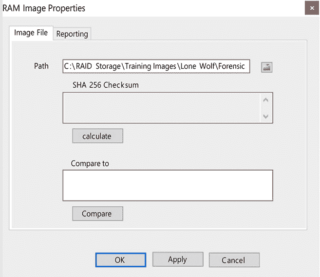

# 第七章：RAM 内存取证分析

RAM 是一个重要的数字证据来源，但在历史上常常被忽视。随着我们对数字证据的了解不断深入，检查员意识到 RAM 中存在潜在的数字证据来源。最终，你将有一个额外的多吉字节信息来源需要检查，可能包含传统位置中不存在的数字痕迹。

本章将介绍内存的基础知识。然后，我们将了解不同的内存来源，并学习如何使用 RAM 捕获工具来捕获 RAM。在本章结束时，你将理解处理易失性内存的各种方法和工具。

本章将涵盖以下主题：

+   内存基础

+   随机存取内存

+   识别内存来源

+   捕获 RAM

+   探索 RAM 分析工具

# 内存基础

**随机存取内存** (**RAM**) 包含什么信息？它将提供系统在关闭之前的当前运行状态信息。它将包含任何正在运行的程序信息；这些可能是合法的进程，也可能包含正在运行的恶意程序进程。如果攻击者已侵入主机，恶意程序可能驻留在 RAM 中。

你还会发现与主机与其他节点之间网络连接相关的信息。这可能是合法的点对点文件共享，也可能显示与攻击者主机的连接。这些连接是你可以追踪的线索。用户也可能正在共享非法图片。同样，连接到其他计算机将允许你跟踪并调查更多的用户，查明同样的犯罪。

如果用户使用云服务，我们可能永远无法在系统的物理磁盘中找到他们创建的数据。相反，我们可能只能看到以 RAM 形式托管在云中的数据证据。

RAM 是计算机系统中的“厨房桌”。用户/系统的任何操作都会访问 RAM。例如，每次鼠标点击和每次按下的键盘按钮都会通过 RAM 进行处理，并且你可以恢复整个文件、密码以及放入剪贴板的文本。所有这些都是潜在的数字证据来源。有时，你还能恢复用户创建的加密容器中的加密密钥。

2004 年，Rajib K. Mitra 因干扰警察无线电通讯而被定罪。调查结果没收了多件数字证据。主侦探 Cindy Murphy 在 2009 年得知，恢复仅存在于 RAM 中的加密密钥是可能的。Murphy 侦探回过头重新检查了证据，成功找到了 Mitra 用来保护加密容器的加密密钥。当 Murphy 侦探打开加密容器时，发现了许多非法图片，最终导致 Mitra 因持有这些图片而被定罪。

分析 RAM 与分析硬盘有何不同？RAM 是一个活跃运行系统的快照，而硬盘检查则是静态的。在检查硬盘时，我们已经关闭了系统，并正在检查物理设备上的数据。RAM 更加短暂，如果你在两个不同的时间点获取 RAM 的法医影像，你将得到不同的结果。捕获 RAM 中的数据会导致潜在证据的丢失。你在收集 RAM 时实际上是在改变证据。

那么，让我们来讨论一下什么是 RAM。

# 随机存取内存？

RAM 暂时存储在活动计算机系统上的工作数据/代码。与传统的存储设备（如硬盘）不同，数据可以以极快的速度在 RAM 上读取/写入。当前技术允许在一个集成电路芯片上制造 RAM 芯片，并使用金属氧化物半导体单元。存储在 RAM 芯片中的数据是易失性的。

当计算机系统断电时，我们会丢失易失性数据。这是“*拔掉插头*”战术不再推荐用于应对激活计算机系统的现场的一个重要原因。

你可能会遇到两种不同类型的 RAM：**静态 RAM**（**SRAM**）和**动态 RAM**（**DRAM**）。SRAM 被认为在速度和能效方面更优，而 DRAM 比 SRAM 更便宜。因此，SRAM 通常用于作为 CPU 的缓存内存，而 DRAM 则作为计算机系统的内存芯片。

以下是你在调查中可能遇到的 DRAM 芯片的表示：


图 7.1：DRAM 图像

不要将 RAM 与 **只读内存**（**ROM**）混淆。ROM 永久存储数据在内存芯片中，并且是非易失性的。

例如，32 位的微软 Windows 系统计算机内存限制为 4 GB，而 64 位的微软 Windows 系统计算机内存限制为 128 GB。这是一个相当显著的潜在证据，历史上尚未进行过分析。

为了让 CPU 访问存储在内存芯片中的数据/执行代码，必须为该数据的位置提供一个唯一的标识符。当我们开始检查原始内存转储时，我们将处理物理地址，这是内存转储的偏移量。

存储在 RAM 中的数据以 4 KB 大小的页面存储（但大小可以变化），当系统处理并添加/读取数据到 RAM 中的页面时，它们正在使用虚拟地址。

所有操作系统以相同的方式访问 RAM。因此，让我们讨论一些操作系统中常见的概念：

+   **权限分离**：权限决定了用户、用户帐户和进程可以访问的内容。它是一种访问控制形式，当操作系统使用时，它通过将用户和 CPU 内核的操作隔离来帮助提供系统的稳定性。操作系统在受信模式下运行，即内核模式，而用户应用程序则在不受信模式下运行，即用户模式，在系统中执行命令时。

+   **系统调用**：为了访问由操作系统内核控制的资源，用户应用程序必须请求访问。这是通过对内核进行系统调用来实现的。它是应用程序与操作系统之间的桥梁，使得不受信任模式在特定实例中变得可信。

+   **进程管理**：程序代码在内存中执行。操作系统负责管理进程。当前的操作系统作为多程序系统运行，允许多个进程同时执行。在分析内存转储时，我们正在查看在捕获时执行了哪些进程，并分析存储在 RAM 中的数据。

+   **线程**：一个进程可以有多个线程。线程是使用系统资源（如 CPU）的基本单位。当我们分析内存转储时，我们正在寻找进程的时间戳和起始地址，这有助于识别进程中的代码。

RAM 的内容可能包括系统中发生的或曾经发生过的事件的痕迹。它可以包括以下内容：

+   配置信息

+   输入的命令

+   密码

+   加密密钥

+   未加密的数据

+   IP 地址

+   上网历史

+   聊天记录

+   电子邮件

+   恶意软件

正如你所看到的，通过收集 RAM，可以获得大量有价值的证据。那么，在哪里可以找到存储在 RAM 中的数据呢？有几个不同的来源，接下来我们将讨论这些来源。

# 识别内存来源

如果你不是现场的调查员，且在收集 RAM 中的数字证据时，他们没有收集易失性数据，会发生什么？即便系统已经关闭，是否仍然可以访问 RAM？虽然你无法分析 RAM，但仍然可以检查其他包含存储在 RAM 中相同数据的来源。这个选项可能并不总是可行，具体取决于数字证据扣押时的具体情况。

你需要知道，在 RAM 中可能还包含有相同或相似数据的潜在额外来源。它们如下所示：

+   **休眠文件（hiberfill.sys）**：休眠是指在关闭计算机电源的同时，仍然保持系统的当前状态。在 Windows 中，RAM 被压缩并存储在 `hiberfill.sys` 文件中。这样，系统可以完全关机，但当系统重新启动时，`hiberfill.sys` 文件的内容将重新加载到 RAM 中。

    **注意**

    如果你正在检查一台笔记本电脑，休眠通常是通过关闭笔记本电脑来启动的。在台式机中，这将由用户手动启动。`hiberfill.sys` 文件的文件头可能是 `hibr`、`HIBR`、`wake` 或 `WAKE`。当系统重新启动时，文件头会被清零。`hiberfill.sys` 文件是一个压缩文件，必须在分析之前进行解压。

    在分析 `hiberfill.sys` 文件时，最后修改日期/时间戳将显示 RAM 内容被添加到该文件的时间。

    **注意**

    如果你处于现场且无法进行实时内存捕获，另一种选择是将系统置于休眠状态，这样会创建 `hiberfill.sys` 文件，并保存系统当前的状态。

+   **分页文件（pagefile.sys）**：分页是一种存储/检索数据的方法，使用虚拟内存文件在传统存储设备上存储与 RAM 芯片中使用的数据。虽然它的速度不如单独使用 RAM，但它允许程序超出物理内存的容量。当使用分页时，系统会以页面为单位传输数据。分页文件中存储的数据通常是内存中请求最少的数据。当对这些数据的请求被处理时，它会将数据重新放回物理内存。

    **注意**

    在 Windows 操作系统中，分页文件 `pagefile.sys` 存储在操作系统卷的根目录下。请注意，用户可以更改此位置。通常，分页文件的大小可以是系统物理内存的 1 到 3 倍。

+   **交换文件（Swapfile.sys）**：在 Microsoft Windows 8 中，Microsoft 引入了 `Swapfile.sys` 文件。它与我们刚才讨论的分页文件类似，但有所不同。交换文件的创建是为了让操作系统可以用于处理挂起的现代 Windows 应用程序的分页操作。当应用程序挂起时，系统会将应用程序的所有数据写入交换文件中。这释放了物理内存中的空间，当应用程序恢复时，数据会被移回物理内存。

+   **崩溃转储（memory.dmp）**：如果你使用过任何版本的 Microsoft Windows，你可能会遇到系统崩溃或 **蓝屏死机**（**BSoD**）。发生这种情况时，系统可能会创建内存转储，存储崩溃时系统状态的信息。

根据设置，你可能会得到以下几种类型之一：

+   **完整内存转储**：包含物理内存中的数据。（由于物理内存芯片的容量问题，这种方式并不常见。）

+   **内核内存转储**：只会包含处于内核模式下的数据页面。

+   **小型转储文件**：包含崩溃时运行的进程/加载的驱动程序信息。

`SYSTEM` hive 中将包含一个键，用于确定在你正在检查的系统上存在的内存转储。你需要查看的键如下：

```
SYSTEM\CurrentControlSet\Control\CrashControl\CrashDumpEnable 
```

转储文件将采用专有格式，并需要使用第三方工具进行转换（可在[`www.comae.com`](https://www.comae.com)下载）。到目前为止，我们已经讨论了提供内存来源的位置。最终，你需要捕获内存芯片中的数据，这是我们接下来的话题。

# 捕获 RAM

当决定从系统中捕获 RAM 时，必须考虑多个因素。最重要的问题是，在收集易失性数据时，你将改变系统的状态。

**数字证据科学工作组**（**SWGDE**）已探讨了易失性数据的收集，并提出了以下考虑事项：

+   用于收集内存数据的应用程序将覆盖一些内存内容。

+   工具及其相关文件越大，它覆盖的数据就越多。

+   系统可能会将 USB 设备驱动程序加载到内存中。

+   系统可能会将 USB 设备驱动程序加载到注册表中。

+   用于收集内存数据的应用程序将出现在一些**最近使用的文件**（**MRUs**）中。

收集 RAM 可能会导致系统死机或不稳定。因此，数字取证调查员必须了解该工具如何影响不同的操作系统。

在计算了风险与回报后，你决定继续并收集 RAM 内容。那么，你需要做些什么才能完成这项任务呢？最好决定选择哪种工具，它在你创建内存转储的环境中最适用。关于工具选择的一个考虑因素是该工具在系统上留下的痕迹有多大。

## 准备捕获设备

要成功地获取 RAM 镜像，你需要三样东西：

+   捕获设备（如 USB 设备）

+   访问系统

+   管理员权限

**注意**

记住，系统中安装的 RAM 数量将决定外部存储设备的大小。如果系统有 16GB 的 RAM，那么你的外部存储设备需要大于 16GB。内存转储的大小将与已安装的 RAM 容量相同。

在响应现场之前，你需要准备好外部存储设备。你的设备应该格式化为 NTFS 分区。这样可以避免如果你使用 FAT32 格式化设备时可能遇到的文件大小问题。

现在我们将讨论一些用于创建 RAM 原始取证镜像的工具。

### 探索 RAM 捕获工具

我将简要介绍一些用于捕获 RAM 的工具。还有其他商业和开源工具可供选择。我们可以写一本完整的书（实际上已经有这样的书）来介绍一些内存取证工具。本节的目标是为你提供概览和完成成功内存转储所需的技能，但请注意，你可以比我在本章中所讲的更深入地了解这些工具。

以下工具都是开源的，并且可以自由使用。

### 使用 DumpIt

DumpIt（可在 [`github.com/thimbleweed/All-In-USB/tree/master/utilities/DumpIt`](https://github.com/thimbleweed/All-In-USB/tree/master/utilities/DumpIt) 上找到）最初由 MoonSols 开发。随后，Comae 维护了该项目。截至 2021 年，DumpIt 似乎已被整合到 Comae Platform V2.0 的闭门测试版中。它是 `Win32dd` 和 `Win64dd` 的结合体，打包成一个可执行文件。最终用户无法进行任何配置。这款工具快速、小巧、便携，并且对 RAM 的占用极少。

DumpIt 是所有工具中最简单的一个。创建外部设备并回应场景后，你需要按照以下步骤操作：

1.  将你的 U 盘插入目标主机。

1.  输入 `cmd`（如下面的截图所示）：


图 7.2：搜索栏

1.  右键点击 **命令提示符**，以管理员身份运行（如下图所示）：


图 7.3：以管理员身份运行

1.  一旦命令提示符出现，导航到 U 盘上的文件夹，找到包含可执行文件的文件夹。然后你需要输入 `cmd` 命令并执行它。

1.  系统将显示一个屏幕，展示物理内存的大小和设备上的空间。然后它会询问你是否继续。选择 `y`，如下面的截图所示：


图 7.4：DumpIt 屏幕

1.  安装的 RAM 大小将决定创建内存转储所需的时间。一旦该过程完成，程序会通知你成功：


图 7.5：DumpIt 成功

DumpIt 并不是唯一可用的工具。还有其他开源替代工具，如 FTK Imager，接下来我们将讨论它。

### 使用 FTK Imager

FTK Imager Lite（可在 [`accessdata.com`](http://accessdata.com) 获取）是一个基于图形界面的工具，允许用户转储运行 Windows 32 位或 64 位操作系统的计算机系统的内存。这个工具易于使用，并且可以部署在 U 盘上。它还允许我们挂载二进制转储文件进行查看。由于是图形界面的，它对 RAM 留下了较大的足迹。

FTK Imager 也相对易于使用。记住，它是基于图形界面的，因此在从外部存储设备启动可执行文件时，它会在内存中覆盖比基于命令行的工具更多的数据。

一旦你回应了该场景，你需要执行以下操作：

1.  将你的 U 盘插入目标主机。

1.  如果 **文件资源管理器** 没有自动启动，请使用 *Windows* + *E* 快捷键打开它。

1.  启动 FTK Imager，左键点击 **文件**，然后选择 **捕获内存...**，如下面的截图所示：


图 7.6：FTK Imager 菜单

1.  **Memory Capture**窗口将会如以下截图所示出现。在这里，您可以填写目标路径：

    图 7.7：FTK Imager 内存捕获

    然而，请确保选择您的外部存储设备。

1.  您还可以选择`pagefile`。没有理由不选择它。勾选该框，然后左键点击**Capture Memory**。

1.  一旦工具完成操作，您将收到成功通知，如下图所示。此操作将把内存文件存储到您的外部存储设备上：


图 7.8：FTK Imager 成功

无论您使用哪种工具来收集内存，一旦收集完成，您需要获取刚刚创建的文件的哈希值。您不想使用嫌疑人的系统，因为任何发出的命令都会改变证据的状态。您将需要使用您的取证笔记本电脑或实验室的取证工作站来生成哈希值。

现在您已经创建了 RAM 的内存转储，接下来用什么工具来分析它呢？让我们来讨论一些可以用来分析 RAM 的工具。

# 探索 RAM 分析工具

就像我们分析来自传统存储设备的取证镜像一样，您有选择开源或商业软件的权利。选择哪个工具取决于检查员的个人偏好（有时还涉及预算），用以分析数据集。我们将介绍一些可用的工具，但这不是一个全面的列表。大多数商业工具都能分析内存文件；在这里，我们将讨论一些可用的开源选项：

+   Bulk Extractor：Bulk Extractor（可从[`digitalcorpora.org/downloads/bulk_extractor`](http://digitalcorpora.org/downloads/bulk_extractor)下载）扫描目标介质（磁盘镜像、文件、目录）并提取它认为有用的信息。它忽略文件系统结构，这使得它能够并行处理源数据集的不同部分。与传统的取证工具相比，这使得它非常快速。随着 Bulk Extractor 找到它认为相关的数据，它会生成一个艺术品的直方图。

+   Volatility：Volatility（可从[`www.volatilityfoundation.org`](https://www.volatilityfoundation.org)下载）是一个开源框架，用于事件响应和恶意软件分析。Volatility 支持多种操作系统的内存转储。Volatility 非常强大，并且有许多插件可用。

+   VOLIX II v2：VOLIX II（可从[`www.fh-aachen.de/en/people/schuba/forschung/it-forensik/projekte/volix-en`](https://www.fh-aachen.de/en/people/schuba/forschung/it-forensik/projekte/volix-en)下载）是 Volatility 的图形用户界面前端。它允许您结合命令以增强可用性和速度。它省去了使用命令行界面的麻烦，并且使您可以通过点击和选择来实现相同的结果。

我们将讨论一些开源选项的使用。

## 使用 Bulk Extractor

让我们看看 Bulk Extractor 是如何工作的：

1.  Bulk Extractor 的文档列出了其输出的以下信息：


图 7.9：Bulk Extractor 输出选项

1.  您需要左键单击 **工具** 并选择 **运行 bulk_extractor…** 来开始分析您的内存转储，如下图所示。当您运行 Bulk Extractor 时，查看器将显示出来：

    图 7.10：Bulk Extractor 菜单 – 运行 bulk extractor 选项

    然后，它将呈现 **运行 bulk_extractor** 菜单。

1.  将工具指向您的图像文件位置和您希望使用的输出目录。如下面的截图所示，您可以看到 Bulk Extractor 工具使用的多个扫描器，它们用于在内存文件中查找证据：

    图 7.11：Bulk Extractor 菜单选项以运行

    您可以根据需要选中或取消选中特定的证据搜索项。

1.  一旦您对设置感到满意，左键单击 **提交运行** 按钮以开始提取过程。一旦提取开始，它将呈现提取窗口，如下面的截图所示：


图 7.12：Bulk Extraction 窗口

1.  左键单击 **关闭** 按钮以返回查看器。以下截图显示了 **Bulk Extractor 查看器**：


图 7.13：Bulk Extractor 查看器 – 提取的内容

在左侧，我们可以看到该工具恢复的具体证据。在前面的截图中，我选择了 `email_histogram.txt` 文件，它提供了该工具找到某个特定电子邮件地址的时间列表。通过查看直方图窗口，我可以看到它找到了 `jcloudy1` 电子邮件地址超过 8,000 次。当您浏览电子邮件列表时，可能会找到具有证据价值的邮件，以便在使用传统媒体时跟进。

Bulk Extractor 是一个快速高效的工具，用于提取您可以在调查中跟进的数据字符串。接下来我们将讨论的工具是 Volix II。

## 使用 VOLIX II

Volix 是 Volatility 框架的 GUI 前端。它使得不习惯使用 **命令行界面**（**CLI**）的用户操作起来更加简便。下载程序并首次启动后，它将呈现以下界面：


图 7.14：Volix 设置

然后，您将被指引到 Volatility 框架的位置。您可以使用独立的可执行文件或二进制文件来运行 Python 脚本。在这里，我已经下载了独立的可执行文件并将 Volix 指向它。

你可以选择的其他选项包括你希望使用的 Volix 语言。如果你有 VirusTotal API 密钥，你可以在该页面插入它。这将比较从 RAM 捕获的数据，并查看是否与 VirusTotal 跟踪的任何恶意软件匹配。

你还可以选择将 Volix 指向 John the Ripper 可执行文件。如果你想解码/解密可能存储在 RAM 中的潜在密码，请按照以下步骤操作：

1.  一旦你选择了**案例**，选择**新建**。它会询问你要分析的内存文件的位置，如下图所示：



图 7.15：Volix RAM 位置

1.  如果你点击**报告**，你可以指定 Volix 生成的报告文件路径。

1.  一旦你选择**确定**，Volix 向导屏幕将出现。你现在可以选择通过问卷来确定你希望在内存文件上运行的选项。你还可以选择一个预创建的脚本来搜索特定的工件，如**病毒检测**或**解密 SAM 哈希值**，如下图所示：


图 7.16：VOLIX 向导

1.  我选择了**完整扫描**。你可以在以下截图中看到结果：


图 7.17：Volix 扫描结果

从前面的截图中，你可以看到我选择了`getsids`。在屏幕下方，它列出了在收集时内存中的 SIDs。

你要求它一次搜索多少个工件，会决定应用程序完成所需的时间。总体而言，与其他工具相比，这是一个相对快速的搜索。

# 总结

在本章中，你了解了从 RAM 中可以恢复的各种工件。你了解了可以用于收集过程的不同工具，以及可以用于分析的工具。记住，工具会随着技术不断变化，随着新操作系统的发布，你的主要工具可能无法收集到 RAM 数据。遇到这种情况时，一定要有备份计划。

现在你已经具备了识别和捕获符合最佳实践的 RAM 的技能。当你分析捕获到的 RAM 时，你可能会发现一些工件，显示出用户在系统上的活动，例如社交媒体工件、密码或加密密钥，这些都可以恢复。

你甚至可能会发现与用户使用电子邮件相关的信息，这将引导我们进入下一章，专门讲解电子邮件取证。

# 问题

1.  以下哪些是 RAM 数据的来源？

    1.  物理内存

    1.  `Pagefile.mem`

    1.  `Swapfile.page`

    1.  ROM

1.  当计算机进入睡眠状态时，哪个文件会被创建？

    1.  `Pagefile.sys`

    1.  `Swapfile.sys`

    1.  `Hiberfill.sys`

    1.  `Hibernation.sys`

1.  你应该什么时候捕获 RAM？

    1.  每小时

    1.  每周

    1.  在每次数字取证调查中

    1.  当你认为它很重要时

1.  通常来说，你需要多少项才能收集 RAM？

    1.  1

    1.  2

    1.  3

    1.  4

1.  DumpIt 是一个图形界面工具。

    1.  正确

    1.  错误

1.  在嫌疑人的计算机上安装 DumpIt 是可以接受的。

    1.  正确

    1.  错误

1.  以下哪些是分析工具？

    1.  DumpIt

    1.  FTK Imager

    1.  Volatility

    1.  MD5 哈希

# 进一步阅读

Ligh, M. H., Case, A., Levy, J., & Walters, A. (2014). *记忆取证的艺术：检测 Windows 中的恶意软件和威胁*，Linu。约翰·威利父子公司。（可在[`www.amazon.com/Art-Memory-Forensics-Detecting-Malware/dp/1118825098`](https://www.amazon.com/Art-Memory-Forensics-Detecting-Malware/dp/1118825098)获取。）

# 加入我们在 Discord 上的社区

加入我们社区的 Discord 空间，与作者和其他读者进行讨论：

[`packt.link/CyberSec`](https://packt.link/CyberSec)


