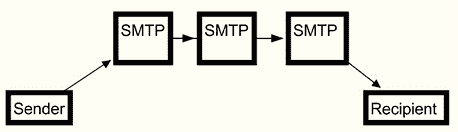
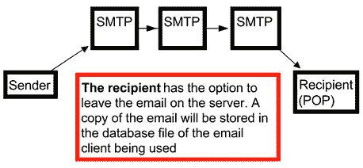
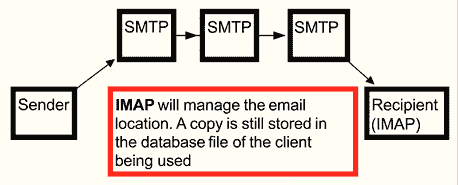
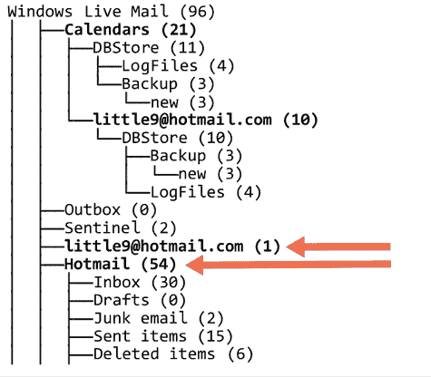
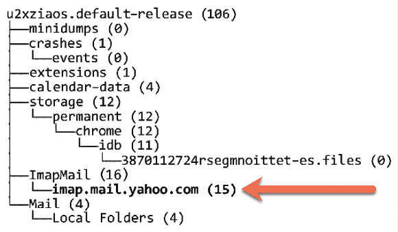
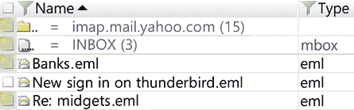
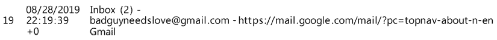
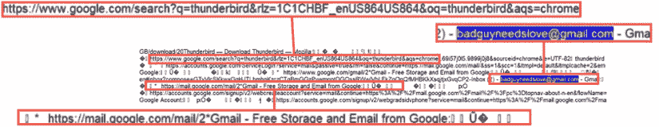
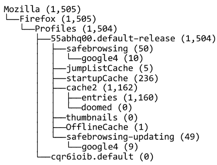
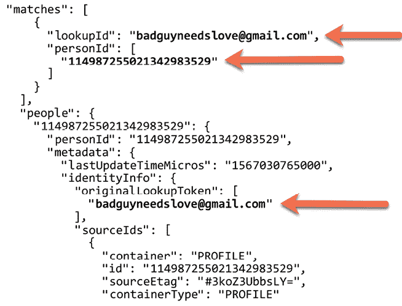

# 第八章：电子邮件取证 - 调查技术

电子邮件只是全球互联网的一部分，已成为消费者和企业领域的日常资源。它已成为几乎每个工业化国家公民的主要通信工具之一。既然电子邮件已成为每个人日常生活的一部分，罪犯也将利用这一途径犯罪，并与同谋合作。

对于数字取证调查员来说，将电子邮件从目标追溯到源头可能是困难的。因此，数字取证调查员必须熟悉电子邮件生命周期中的方法和传递系统。当数字取证调查员成功确定电子邮件的来源时，这将引导他们对源头发现的数字证据进行进一步的取证调查。

在电子邮件调查中，你可以在哪里找到与电子邮件相关的数字证据？本地机器将保存目标版本的电子邮件，邮件服务器，访问电子邮件的设备（如手机），以及互联网服务提供商的日志。数字取证调查员必须知道哪些工具可以分析电子邮件及其复合文件，特别是某些邮件套件使用的邮箱文件。了解如何将这些信息呈现给非技术人员，对于传达调查员恢复数据的相关性至关重要。在本章结束时，你将了解用于发送和接收电子邮件的协议、如何解码电子邮件头以及如何分析客户端和基于 Web 的电子邮件。

本章将涵盖以下主题：

+   理解电子邮件协议

+   解码电子邮件

+   理解基于客户端的电子邮件分析

+   理解 WebMail 分析

# 理解电子邮件协议

电子邮件协议是一种标准，用于允许两个计算机主机之间交换电子邮件通信。当电子邮件被发送时，它从发送方的主机传输到邮件服务器。邮件服务器可以通过一系列中继转发电子邮件，直到它到达一个接近接收方主机的邮件服务器。接收方会收到一条通知，说明有邮件可用；接收方随后将联系邮件服务器以获取邮件。

用户通常使用电子邮件客户端访问邮件。电子邮件客户端可以使用不同的协议来访问邮件。现在，我们将讨论一些在进行数字取证调查时可能遇到的电子邮件协议。

## 理解 SMTP - 简单邮件传输协议

SMTP 是电子邮件传输的协议。它是基于 RFC 821 的互联网标准，但后来更新为 RFC 3207、RFC 5321/5322。

**提示**

RFC 代表“请求评论”。它用于互联网/通信技术中制定标准。RFC 可以来自不同的机构，例如互联网架构委员会/互联网工程任务组或独立研究人员。最初它是为了跟踪原始 ARPANET 的发展，但现在已经发展成关于互联网规范和通信协议的官方文档来源。

邮件服务器使用 SMTP 从访问互联网的所有位置发送和接收电子邮件消息。通常，您会在网络上找到一个利用**传输控制协议**（**TCP**）端口**25**的 SMTP 服务器。发送方到接收方的路径在下图中进行了概述：



图 8.1：通过 SMTP 发送的电子邮件示意图

当用户发送电子邮件时，邮件将从主机出发，经过一系列 SMTP 服务器，直到到达目标 SMTP 服务器。接收方需要使用不同的协议来检索电子邮件，这是我们接下来的话题。

我们将讨论的下一个协议是 POP3。

## 理解邮局协议

POP3 是标准化的协议，允许用户访问收件箱并下载电子邮件。POP3 专门设计用于接收电子邮件；该系统不允许用户发送电子邮件。此协议使用户在撰写、阅读或回复时可以离线，并可以根据用户的请求随时访问在线邮箱。请注意，您正在进行数字取证检查的电子邮件可能是唯一副本。用户可以选择不将电子邮件副本保留在服务器上。一旦电子邮件被下载，系统可以将其删除，以减少服务器上的存储空间。

您会发现 POP 使用端口**110**进行网络通信。

在下图中，您可以看到 SMTP-POP 过程的基本功能：



图 8.2：SMTP-POP 地图

在这里，您可以看到电子邮件的传输路径，如下所示：

1.  电子邮件来自发送方。

1.  SMTP 服务器将其转发到目标地址。

1.  接收方从服务器收取电子邮件。接收方可以决定电子邮件副本是否保留在服务器上，或者在用户从服务器下载电子邮件时电子邮件是否被删除。

当我们查看下一个协议时，我们将讨论与 SMTP 相似的功能，但有一些显著的不同之处。我们将在下一节中讨论这些不同之处。

## IMAP – 互联网邮件访问协议

**IMAP**是**互联网邮件访问协议**，是一种标准协议，供电子邮件客户端访问邮件服务器上的电子邮件。该协议设计用于允许多个客户端对收件箱进行完整的管理。在大多数情况下，电子邮件消息会保留在服务器上，直到用户将其删除。IMAP 比 POP 协议更新，但两者仍然是目前广泛使用的电子邮件标准。IMAP 和 POP 之间最显著的区别在于，POP 检索邮箱内容，而 IMAP 则是为远程访问邮箱而设计的协议。

在下面的图示中，你可以看到 SMTP-IMAP 流程的基本功能：



图 8.3：IMAP 地图

在这里，你可以看到电子邮件的传递路径：

1.  电子邮件来源于发件人。

1.  SMTP 服务器将其转发到目标地址。

1.  收件人从服务器收取电子邮件。电子邮件的副本会保留在服务器上，直到用户明确删除它。

我们刚才讨论的三种协议通常用于电子邮件客户端和服务器之间的关系。用户在访问电子邮件时还可以选择另一种方式，称为基于 Web 的电子邮件，这是下一节的主题。

## 理解基于 Web 的电子邮件

基于 Web 的电子邮件是用户通过 Web 浏览器访问的服务。标准的 Web 邮件服务商有 Gmail、Yahoo Mail 和 Outlook/Hotmail。一些互联网服务提供商也提供用户可以通过 Web 浏览器访问的电子邮件账户。

用户删除的电子邮件存储在基于 Web 的电子邮件服务器上，通常会保留在服务器上，直到系统删除它们。基于 Web 的电子邮件的一个特点是，当用户删除电子邮件时，它会从收件箱移动到**已删除/垃圾箱**文件夹，并且仍然可以访问。然而，在电子邮件在**已删除**文件夹中保留一段设定的时间后，系统会永久将其从用户的收件箱中删除。

我们已经讨论了用户访问电子邮件服务的不同方法。然而，一旦你获得了可供检查的电子邮件数据集，你可能会发现电子邮件的内容是经过编码的。那么，如何解码电子邮件的内容以判断是否发生了犯罪/违规行为呢？

在下一个话题中，我们将解码电子邮件头部，以便你可以对你的调查工作做出明智的选择。

# 解码电子邮件

电子邮件具有许多独特的标识符，供数字取证调查员识别和追踪。邮箱和域名，以及消息 ID，将允许数字取证调查员向供应商送达司法批准的传票/搜索令，以跟进任何调查线索。

在本节中，我们将逐一解析电子邮件头部的各个部分，以便你可以决定如何进行调查。首先，我们将从讨论电子邮件信封开始。

## 理解电子邮件消息格式

绝大多数电子邮件用户只熟悉基本的电子邮件信息，如下所示：

```
Subject background checks 
Date 07/19/2008 23:39:57 +0 
Sender alison@m57.biz 
Recipients jean@m57.biz 
```

我们回到处理我们的朋友 Jean 的问题，通过查看这封邮件，我们可以看到几个通常与电子邮件相关的字段。在这里，我们知道主题是背景调查，用户发送邮件的日期和时间，发送者和收件人。

我们还可以看到邮件的内容，如下所示：

```
Jean,
One of the potential investors that I've been dealing with has asked me to get a background check of our current employees. Apparently they recently had some problems at some other company they funded.
Could you please put together for me a spreadsheet specifying each of our employees, their current salary, and their SSN? Please do not mention this to anybody.
Thanks.
(ps: because of the sensitive nature of this, please do not include the text of this email in your message to me. Thanks.) 
```

当我们查看这封邮件时，似乎邮件是从*Alison*发送给*Jean*的。Alison 请求一个包含机密员工信息的电子表格。根据对这封邮件的基本检查，邮件的内容似乎没有什么与初始的假设相矛盾。

用户已经创建了*收件人*和*发件人*字段，以及邮件的*主题*和*内容*。系统从系统时间中推导出日期和时间，用户可以设置系统时间。

在典型的邮件信息下，另一层数据在进行调查时至关重要。这就是所谓的*邮件头*，它包含了关于特定邮件的来源、传输和目的地的信息。

大多数电子邮件客户端需要额外的命令来查看邮件头。例如，Gmail 需要你点击**显示原始邮件**才能查看邮件头。例如，以下是 Jean 从 Alison 收到的邮件头：

```
-----HEADERS-----
Return-Path: simsong@xy.dreamhostps.com
X-Original-To: jean@m57.biz
Delivered-To: x2789967@spunkymail-mx8.g.dreamhost.com
Received: from smarty.dreamhost.com (sd-green-bigip-81.dreamhost.com [208.97.132.81]) by spunkymail-mx8.g.dreamhost.com (Postfix) with ESMTP id E32634D80F for <jean@m57.biz>; Sat, 19 Jul 2008 16:39:57 -0700 (PDT)
Received: from xy.dreamhostps.com (apache2-xy.xy.dreamhostps.com [208.97.188.9]) by smarty.dreamhost.com (Postfix) with ESMTP id 6E408EE23D for <jean@m57.biz>; Sat, 19 Jul 2008 16:39:57 -0700 (PDT)
Received: by xy.dreamhostps.com (Postfix, from userid 558838) id 64C683B1DAE; Sat, 19 Jul 2008 16:39:57 -0700 (PDT)
To: jean@m57.biz From: alison@m57.biz 
subject: background checks 
Message-Id: 20080719233957.64C683B1DAE@xy.dreamhostps.com
Date: Sat, 19 Jul 2008 16:39:57 -0700 (PDT) 
```

邮件头显示了邮件的来源以及它经过了哪些服务器。从底部开始，我们可以看到`Message-Id`字段：

```
Message-Id: <20080719233957.64C683B1DAE@xy.dreamhostps.com> 
```

`Message-Id`字段包含每封已发送邮件的唯一 ID。当用户发送邮件时，邮件将从其接触的第一个邮件服务器接收消息 ID。该消息 ID 将是全球唯一的，因此不应该有其他邮件与相同的消息 ID。如果你发现不同的邮件包含相同的消息 ID，可能出现以下两种情况之一：

+   该邮件服务器不符合标准。

+   用户已更改了邮件。

当你查看消息 ID 时，你会看到一串随机的字母数字字符，以及`@`符号和域名。有时，这串任意的字母数字字符包含一个日期/时间戳。从前面的例子来看，我们可以看到数字`20080719233957`，它可以翻译为*2008 年 07 月 19 日*——年、月、日。*23:39:57*是电子邮件到达第一个服务器时的时间（GMT），按小时、分钟和秒表示。

我们可以从底部向上看到第一条**Received**行。此邮件经过三个不同的邮件服务器。在邮件到达目的地的过程中，每个邮件服务器都会在前一条**Received**行的顶部附加一条**Received**行。你可以从源头到目的地跟踪邮件路径。在这封邮件中，我们正在检查邮件接触的第一个服务器，具体如下：

```
Received: by xy.dreamhostps.com (Postfix, from userid 558838) id 64C683B1DAE; Sat, 19 Jul 2008 16:39:57 -0700 (PDT) 
```

这是邮件触及的第一个服务器；我们有域名 `dreamhostps.com` 和用户 ID。下一步逻辑将是向 ISP 提交传票并识别用户 ID `558838`。最后，术语 `Postfix` 标识了邮件服务器。Postfix 是一个免费的开源邮件传输代理，可能是一个商业邮件服务器，或由潜在恶意行为者维护的邮件服务器。

接下来的两行 **Received** 标识了到达目的地的路径中的后续服务器：

```
Received: from smarty.dreamhost.com (sd-green-bigip-81.dreamhost.com [208.97.132.81])
by spunkymail-mx8.g.dreamhost.com (Postfix) with ESMTP id E32634D80F for <jean@m57.biz>; 
Sat, 19 Jul 2008 16:39:57 -0700 (PDT)
Received: from xy.dreamhostps.com (apache2-xy.xy.dreamhostps.com [208.97.188.9]) 
by smarty.dreamhost.com (Postfix) with ESMTP id 6E408EE23D for <jean@m57.biz>; 
Sat, 19 Jul 2008 16:39:57 -0700 (PDT) 
```

在这两种情况下，我们现在得到了触及该邮件的具体服务器的 IP 地址（和服务器名称）。

有趣的是，当我们查看 `Return-Path` 字段时：

```
Return-Path: <simsong@xy.dreamhostps.com> 
```

`Return-Path` 是发送无法投递的邮件的地址。`Return-Path` 还会覆盖用户看到的 `From` 字段。你会看到在邮件列表中使用这个字段，在那里你可以回复发帖的用户，而不是回复整个列表。

在你的调查中，你可能会遇到一些可选字段。这些字段通常以 `X–` 开头，如此处所示：

```
X-Priority: 3 
X-Mailer: PHPMailer 5.2.9 (https://github.com/PHPMailer/PHPMailer/)
Message-Id: ff176aaf06e2f6958ada6e2d3c43b095@x3.netcomlearning.com
X-Report-Abuse: Please forward a copy of this message, including all headers, to abuse@mandrill.com 
X-Report-Abuse: You can also report abuse here: http://mandrillapp.com/contact/abuse?id=30514476.1925a088d66f450cb25a4034f3ec6942 X-Mandrill-User: md_30514476 
```

这些字段不是电子邮件协议标准的一部分。它们可以包含关于病毒扫描、垃圾邮件扫描或服务器信息等内容。如你所见，它提供了关于滥用（如垃圾邮件）相关的联系信息。你可能还会看到一个可选字段 `X–Originating–IP`，它可能包含发送者的 IP 地址，当用户发送消息时。电子邮件提供商可以删除这些信息，并用服务器地址替代，当邮件从 Gmail 发送时就是这种情况。

关于 IP 地址的备注：IPv4 地址有两种类型：公有地址和私有地址。在邮件头中，你可能会看到这两种地址。然而，如果你看到的是私有 IP 地址，你无法识别出提供商（除非你在组织内部进行调查）。私有 IPv4 地址的地址方案如下：

+   10.X.X.X

+   127.X.X.X

+   172.16.X.X

+   192.168.X.X

我们将在下一部分讨论电子邮件附件。

## 邮件附件

**MIME** 是 **多用途互联网邮件扩展** 的缩写，这是允许电子邮件接受除了 ASCII 以外的文本、二进制附件、多部分消息体以及非 ASCII 基本头信息的互联网标准。当你查看邮件头时，你会看到 MIME 用以下方式表示：

```
MIME-Version: 1.0 
```

一个例子如下：

```
MIME-Version: 1.0 
Content-Type: text/html; charset=us-ascii 
Content-Transfer-Encoding: 7bit 
```

在这里，我们可以看到内容类型是 HTML，并且接下来的这一行显示它使用了 7 位编码。如果有附件，我们还会看到 Base64 编码，它将二进制数据转换为 ASCII 文本。

系统会根据每个段落的数据类型分离邮件正文。例如，一个 JPEG 图像将与一个段落一起存储，而 ASCII 文本则存储在另一个段落中。此外，每个段落都会以一个 MIME 头开始，该头包含关键字 `_PART_`。

既然我们已经讨论了电子邮件和邮件头，接下来需要看看用户可能使用的某些客户端来访问这些电子邮件。

# 理解基于客户端的电子邮件分析

用户可以访问多种电子邮件客户端来检索、阅读和发送电子邮件。根据你所处的消费者或商业环境，你可能会遇到不同的电子邮件客户端。在消费市场中，由于 Microsoft Outlook/Outlook Express 是预装在系统中的，因此它们会占据主导地位。此外，Microsoft Outlook 还随 Microsoft Office 套件一起提供。也有一些免费的选项，例如 Thunderbird 电子邮件客户端。

你可以通过导出客户端使用的容器并用安装在法医计算机上的电子邮件客户端打开它来进行电子邮件检查。另一种选择是使用为电子邮件检查创建的专用商业法医软件。更常见的法医套件通常会分析更常见的电子邮件客户端容器。

我们将在接下来的章节中讨论一些更常见的电子邮件客户端。

## 探索 Microsoft Outlook/Outlook Express

Outlook 将电子邮件信息存储在几种文件类型中，例如 `pst`、`.mdb` 和 `.ost`。我们将在用户的硬盘中找到 PST 文件，路径如下：

```
\Users\$USER$\AppData\Local\Microsoft\Outlook 
```

OST 文件是一个离线文件，也可能存储在用户硬盘上，与 PST 文件在相同路径下。最后，你会在服务器上找到 MDB 文件。通常，在调查企业环境时会找到这个文件。

系统会将 Outlook 客户端使用的所有内容存储在 PST/OST 文件中。请注意，用户可以更改默认位置和命名约定。你不需要登录就可以访问 PST/OST 文件。

如果你需要从存储设备的未分配空间中提取 PST/OST 文件，可能需要处理文件碎片问题，因为 PST/OST 文件可能会非常大。

Microsoft 已用 Windows Live 替代了 Outlook Express。以下部分将提供关于此客户端的详细信息。

## 探索 Microsoft Windows Live Mail

从 Windows Vista 和 Windows 7 开始，Windows Live 成为 Windows 操作系统默认的电子邮件客户端。（请注意，Windows Live 已经停用，现在 Windows 10 包含 Windows Mail 作为默认客户端。Windows Mail 不会将电子邮件存储在硬盘上，电子邮件仅存在于云端。）客户端会将电子邮件消息存储在以下路径：

```
\Users\$USER$\AppData\Local\Microsoft\Windows Live Mail 
```

用户还可以使用此客户端访问基于 Web 的电子邮件。Windows Live Mail 会下载这些账户的内容，并在用户的路径中创建文件夹结构。

客户端会将电子邮件作为 `.eml` 文件存储在 Windows Live Mail 文件夹中，如下所示：



图 8.4：Windows Live Mail 文件夹

如你所见，这个用户正在使用 Windows Live Mail 应用程序访问 Hotmail。你可以看到电子邮件地址`little9@hotmail.com`，并且可以看到有 54 封电子邮件被存储在用户的文件夹中。

电子邮件采用标准的文本格式`.eml`，任何取证工具都可以读取这种格式。或者，你也可以使用文本编辑器。下一个客户端也是非常流行且免费的：Mozilla Thunderbird。

## Mozilla Thunderbird

Thunderbird 是由 Mozilla 提供的免费开源电子邮件客户端。Thunderbird 会将电子邮件存储在`.MBOX`文件中。MBOX 格式是用于存储电子邮件的一种通用文件格式术语。它将文件夹中的所有电子邮件保存在一个单一的数据库文件中。默认情况下，检查者可以在以下路径中找到 MBOX 文件：

```
$USERNAME$\AppData\Roaming\Thunderbird\Profiles 
```

以下是 Thunderbird 安装时会看到的文件夹结构：



图 8.5：Thunderbird 文件夹结构

配置文件名称由 Thunderbird 创建。用户安装的软件的发布版本也可以在此处查看。通过分析文件夹结构，我们将看到它包含有关崩溃的信息，并在发生崩溃时将数据存储在 minidump 中。此文件夹中可能还有日历数据和邮件箱。

在这里，用户使用 IMAP 协议访问他们的 Yahoo 邮件账户，文件夹中存储了 15 项内容。

当我们查看文件夹时，将看到以下文件：

+   `Archive.msf`

+   `Archives.msf`

+   `Bulk Mail.msf`

+   `Draft.msf`

+   `Drafts.msf`

+   `INBOX`

+   `INBOX.msf`

+   `msgFilterRules.dat`

+   `Sent-1.msf`

+   `Sent.msf`

+   `Templates.msf`

+   `Trash.msf`

**MSF**文件是**邮件摘要文件**，是电子邮件的一部分。电子邮件客户端 Thunderbird 将邮件数据存储在两个不同的部分。第一部分是 MBOX 文件，没有文件扩展名。MSF 文件是 Thunderbird 的索引文件，包含电子邮件头和摘要。Thunderbird 使用这些文件作为索引来定位存储在 MBOX 中的电子邮件。

在以下截图中，三封电子邮件被存储在 MBOX 中。当 X-Ways 解析收件箱时，电子邮件将具有`.eml`文件扩展名：



图 8.6：Thunderbird 收件箱

MBOX 格式被许多电子邮件客户端使用，包括 Apple Mail、Opera Mail 和 Thunderbird。此外，大多数商业和开源取证工具套件将处理 MBOX 文件并提供访问电子邮件的功能。

虽然用户可以通过客户端访问他们的电子邮件，但另一种流行的选择是让用户无需使用客户端即可访问电子邮件：WebMail。

# 理解 WebMail 分析

随着我们从二十世纪过渡到二十一世纪，基于 Web 的电子邮件变得越来越流行。它易于访问，几乎不需要用户配置，并且可以从任何计算机访问。简单来说，WebMail 只是另一种用于进行浏览器分析的互联网工件（我们将在*第九章*，*互联网工件*中介绍互联网工件）。

服务提供商维护用户的电子邮件，并可能提供其他服务，如通讯录和日历。用户可以使用主机客户端访问基于网页的电子邮件。然而，我发现当内容由服务提供商托管时，使用主机客户端的用户是少数，这为数字取证调查员带来了额外的障碍。与内容相关的唯一证据可能存在于用户的互联网历史中，这些记录可能是碎片化的。如果数字取证调查员希望访问用户的基于网页的电子邮件内容，他们必须向服务提供商提交搜索令状（在美国如此，你的管辖区可能有不同要求）。你可能无法访问或恢复任何已删除的邮件，这将取决于每个服务提供商的具体情况。

假设数字取证调查员希望调查用户对基于网页的电子邮件的使用。在这种情况下，他们必须分析用户系统上的临时互联网文件或互联网*缓存*。临时互联网文件/缓存包含了用户在浏览器中查看过的图像、文本或任何网页组件。

他们的浏览器将这些信息保存在临时互联网**文件/缓存**位置，以提升用户体验。这样做可以通过更快的响应时间来展示页面内容，而不是不断重新下载内容，可以从缓存中提取并展示这些信息给用户。

Gmail 非常流行，当该服务首次部署其网页应用程序时，改变了 WebMail 的展示方式。不再是静态网页显示电子邮件内容和用户的电子邮件文件夹。相反，Gmail 动态地为每个用户即时生成内容。系统不再将图像文件和文本保存到用户的本地存储设备，而是使用了**异步 JavaScript**（**AJAX**）和 XML 文件。不幸的是，这种新方法使得调查员无法重建网页。

你仍然可以从互联网缓存以及其他潜在来源中恢复相关信息，如用户本地存储设备上的 RAM 或页面文件。你需要对电子邮件地址或与调查相关的术语进行关键词搜索。

在查看缓存之前，我想先查看已安装浏览器的互联网历史记录，看看用户是否访问过基于网页的电子邮件。对于 Chrome 浏览器，你可以在以下路径找到存储的历史记录，这些历史记录保存在名为`History`的 SQLite 数据库中：

```
$USER$\AppData\Local\Google\Chrome\User Data\Default 
```

`History` 数据库的分析显示，用户访问了 Gmail 的基于网页的服务，具体见下图：



图 8.7：电子邮件 - 历史记录

我们有日期/时间戳和电子邮件地址。该信息还显示，当用户访问服务时，收件箱中有两封未读邮件。

我在 Google Chrome 浏览器的互联网缓存中发现了这个，检查员可以在以下位置找到它：

```
$USER$\AppData\Local\Google\Chrome\User Data\Default\History Provider Cache 
```

如下所示的 Chrome 缓存截图中，内容难以解读，并且没有给我们提供很多后续线索：



图 8.8：显示的 Chrome 缓存

如果我们继续搜索在缓存中找到的电子邮件地址`badguyneedslove@gmail.com`，可能会找到其他证据，如下所示：

```
{"endpoint_info_list":[{"endpoint":"**smtp:badguy27@yahoo.com**",
"c_id":"d24c.2d00",
"c_name":"**Joe Badguy Smith**"},
{"endpoint":"**smtp:badguyneedslove@gmail.com**",
"c_id":"e80f.5b71","c_name":"**John Badguy Smith**"},
{"endpoint":"**smtp:yahoo@mail.comms.yahoo.net**",
"c_id":"624f.10f0","c_name":"**Yahoo! In********c.**"}]}**** 
```

****检查员可以在缓存中找到的这个证据提供了另一个电子邮件地址`badguy27@yahoo.com`，以供进一步调查。不幸的是，电子邮件的内容仍然无法访问。

让我们看看 Firefox 缓存，看看它是否能提供更好的缓存和历史记录视图。

检查员可以在以下位置找到 Firefox 浏览器的缓存和历史记录：

```
$USERS$\AppData\Local\Mozilla\Firefox\Profiles\<profile>\cache2 
```

Firefox 会将互联网历史和缓存存储在用户的个人资料中。你将看到的文件夹结构可能如下所示：



图 8.9：Firefox 文件夹结构

看起来，Firefox 缓存的视觉呈现并没有好多少：



图 8.10：Firefox 缓存

它没有提供大量信息，但它为我们提供了可以跟进的线索，进行进一步的调查。

在取证领域，你依赖的证据可能会随着软件的更新或操作系统的变化而迅速变化。要灵活运用调查技术，以便能够及时适应最新的技术，使你的调查获得成功。一旦你确定你的调查对象使用的是基于网页的电子邮件，最佳的做法是向服务提供商提交适当的司法文件，冻结账户并获取所需的内容。

# 总结

在本章中，我们讨论了标准电子邮件协议：系统使用 SMTP 发送电子邮件，而 POP 和 IMAP 用于接收电子邮件。IMAP 还包括用户可用于管理收件箱的功能。我们还讲解了电子邮件头信息以及组成头信息的各个组件。我们还讨论了 WebMail 和电子邮件客户端。

你现在具备了读取电子邮件头信息的技能，可以确定用户用于发送电子邮件的服务器以及系统用于发送和接收电子邮件的协议。在进行数字取证检查时，你现在能够识别出典型电子邮件客户端和基于网页的电子邮件的证据。

在下一章中，你将了解基于网页的电子邮件客户端之间的相似性。

# 问题

1.  以下哪一项不是电子邮件协议？

    1.  HTML

    1.  POP

    1.  SMTP

    1.  IMAP

1.  以下哪项允许用户管理他们的收件箱？

    1.  COC

    1.  POP

    1.  FreeBSD

    1.  IMAP

1.  电子邮件头信息是由用户输入的信息创建的。

    1.  正确

    1.  错误

1.  Thunderbird 将电子邮件存储在哪个文件中？

    1.  收件箱

    1.  发件箱

    1.  MBOX

    1.  信箱

1.  哪个电子邮件客户端使用 PST 文件？

    1.  Thunderbird

    1.  Gmail

    1.  Yahoo Mail

    1.  Outlook

1.  Windows Live Mail 被哪个客户端替代了？

    1.  Outlook Express

    1.  Outlook

    1.  Windows Mail

    1.  Windows Email

1.  你总是能在用户的缓存中找到基于网页的电子邮件内容。

    1.  正确

    1.  错误

你将在本书的后面找到答案，位于*评估*部分。

# 进一步阅读

+   *Jones, R. (2006). Internet forensics: 北京：OReilly*（可在[`shop.oreilly.com/product/9780596100063.do`](http://shop.oreilly.com/product/9780596100063.do)购买）

# 练习

## 数据集

`Jean outlook.pst`

## 所需软件

Autopsy - [`www.autopsy.com/`](https://www.autopsy.com/)

## 情境

一家公司 XYZ 有限公司发现一份包含机密信息的电子表格作为附件被发布在竞争对手网站的“技术支持”论坛上。

该电子表格来自 XYZ 有限公司的首席财务官 Jean 的电脑。

### 面谈

你的任务是调查机密信息泄露事件。为此，你将分别与 XYZ 有限公司的总裁和首席财务官，Alison 和 Jean 进行面谈。以下是他们面谈的摘录：

Alison（总裁）：

+   我不知道 Jean 在说什么。

+   我从未向 Jean 索要电子表格。

+   我从未通过电子邮件收到电子表格。

Jean（首席财务官）：

+   Alison 让我准备电子表格，作为新一轮融资的一部分。

+   Alison 让我通过电子邮件将电子表格发送给她。

+   这是我所知道的全部信息。

## 电子邮件账户

Alison（总裁）：

`alison@m57.biz`

Jean（首席财务官）：

`jean@m57.biz`

## 待回答问题

检查 Jean 的电子邮件——这些文件是如何出现在竞争对手的网站上的？使用 Autopsy（或你选择的工具）分析`.pst`文件中包含的电子邮件。

# 加入我们在 Discord 上的社区

加入我们社区的 Discord 空间，与作者和其他读者进行讨论：

[`packt.link/CyberSec`](https://packt.link/CyberSec)

****
