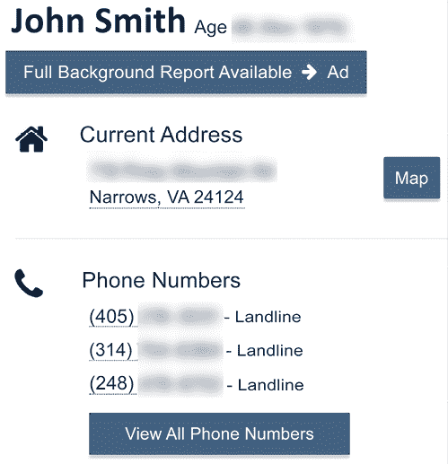
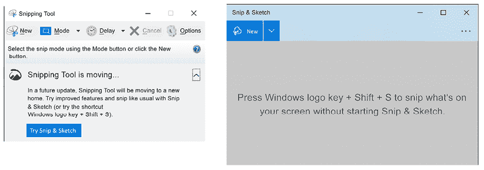

# 第十章：在线调查

在线环境中有哪些信息是可以获取的？你是否已识别出一个潜在的嫌疑人？是否有数据库可以用来查找潜在目标的信息？是否可以使用在线资源进行诱捕行动？这些都是有效的问题，在大多数情况下，这些问题的答案是肯定的。当你要求某人查找关于某个个体的信息时，首先进行的搜索通常是通过 Google。Google 会给你提供很多信息，这些信息可能与搜索目标相关，也可能无关。Google 搜索会给你提供许多不同的线索，这些线索可能需要追踪，但也可能将你引入死胡同，无法提供任何有用的信息。

法律执行机构和私人组织正在进行在线调查。执法机构正在寻找犯罪活动，例如成年人试图性剥削儿童。私人组织则在筛选潜在的新员工，可能还在进行竞争对手的反对派研究，而高等教育机构则在研究即将入学的班级人数。我相信你也读到过有工作邀请或大学录取被撤销的案例，因为他们发现了用户曾在网上发布过贬低性或煽动性的言论。

本章将涵盖以下主题：

+   卧底调查

+   背景搜索

+   保存在线通讯

# 卧底调查

什么是在线调查？它是一组资源，还是用户在数字世界中的活动？在线调查是对互联网进行系统性搜索，以识别、保存、分析并报告与调查主题相关的信息。我们大多数人都熟悉有人因为在线发布的内容而被解雇的事情。可能是一个不合时宜的推文，一个在工作中拍摄的 TikTok 视频，或者一条可能被视为冒犯的 Facebook 帖子。

请考虑以下情况：2020 年和 2021 年发生的事情：

+   马里兰州因阿瑟·洛夫在 Facebook 上支持凯尔·里滕豪斯的言论而解雇了他。洛夫曾是马里兰州社区倡导办公室的副主任。解雇的原因是他的帖子包含了“分裂性的图像和言论”。洛夫随后提起了诉讼，称马里兰州侵犯了他的权利，他不应因在私人时间和个人社交媒体账户上发布的内容而受到惩罚。

+   “Eli”，一名星巴克的咖啡师，在他们将一段视频发布到社交媒体平台 TikTok 后被解雇。视频的内容包括了一段小品，展示了咖啡师们如何回应挑剔的顾客。Eli 表示，拍摄时没有顾客在场，未损坏任何公司设备，并且拍摄是在店铺关闭后进行的。星巴克回应称，Eli 被解雇是因为所有员工都应当“创造一个尊重、安全和欢迎的环境”。星巴克进一步表示，Eli“通过在 TikTok 上发布内容，展示了与星巴克使命价值观不符的行为，该内容显示员工在嘲笑顾客。”

+   第三巡回上诉法院表示，雇主可以基于社交媒体帖子解雇员工。此案件为“Ellis 诉纽约梅隆银行公司”。该名员工在其公开的 Facebook 账户上发布了几条支持对抗议者使用暴力的帖子，因此被解雇。雇主收到关于这些帖子的投诉后，进行了内部调查，并包括了对员工的面谈。调查结束后，银行因该员工违反了银行的社交媒体政策而解雇了她。银行认为这些帖子“具有攻击性，显示出糟糕的判断力，缺乏对他人的尊重，并鼓励暴力行为。”

开源信息可以是与您调查相关的信息宝库。

Michael Brazzell 编写了《开源情报技术》一书，该书深入探讨了如何将互联网作为资源。我将提供一个概述，但如果您想深入了解，我推荐阅读他的作品。

信息收集是隐秘在线调查的一个方面吗？是的，绝对是。非执法机构是否可以进行隐秘调查，还是仅限于政府特工的职权范围？不，非执法机构也可以进行隐秘的在线调查，原因多种多样，比如对竞争对手的反向研究、调查服务盗窃、与嫌疑“威胁行为者”互动以确认他们是否会针对该组织，或出于任何其他保护组织的原因。

## 隐秘平台

进行在线隐秘调查需要充分的准备。

在开始在线隐秘调查之前，首要考虑的是您将使用哪个平台与其他用户互动。您想使用个人的台式机/笔记本电脑、组织的设备，还是使用全新的台式机/笔记本电脑？无论您选择哪种方式，都要确保所选平台没有留下任何可能暴露隐秘调查员或组织真实身份的信息。确保没有以下内容：

+   间谍软件

+   恶意软件

+   跟踪 Cookie

+   网络缓存

如果你的平台上有上述任何项目，当你使用真实身份时，这些信息可能会危及你的卧底身份。

在决定使用哪个平台时，你需要确保该平台能够支持你的卧底身份。例如，如果你的卧底身份应该是一个精通使用**命令行界面**（**CLI**）的精英威胁行为者，但你只通过 Windows 10 的**图形用户界面**（**GUI**）与其他用户互动，那么这种不一致可能会导致你的可信度受到质疑。

另一个需要考虑的因素是，如果你的在线卧底活动导致了逮捕或在行政或民事环境中的诉讼，你所使用的平台将作为证据。如果你没有充分删除所有与真实身份相关的数据，这些信息有可能会被用来对付你。虽然在一个理想的世界中，显而易见的答案是只使用全新的设备，但不幸的是，这并非现实。当你使用曾经使用过的设备作为平台时，必须重新格式化并重新安装操作系统及任何需要的应用程序，以进行卧底在线调查。

完成上述过程后，卧底调查员必须专门使用该平台进行卧底在线调查。

你还需要确保你的网络连接是安全的。例如，你需要部署反恶意软件/杀毒解决方案来监控你的平台和网络连接。此外，你还需要使用**虚拟私人网络**（**VPN**）连接，这将帮助你掩盖位置。VPN 还会加密从平台到目的地的流量，使任何试图窃听你的流量的人无法读取。你可以使用多个免费的和付费的 VPN 服务，或者选择自己创建 VPN。

另一种保护你的在线卧底身份的方式是使用洋葱网络，也称为 Tor 网络。Tor 项目是一个非营利组织，使命是“通过创建和部署自由和开源的匿名和隐私技术，支持无限制的可用性和使用，促进其科学和普及理解，从而推动人权和自由。”Tor 项目维护着 Tor 网络。Tor 网络使用开源软件创建一个由志愿者支持的覆盖网络。Tor 网络帮助用户通过保护其在线活动来保持匿名。如果卧底人员需要使用或访问“暗网”，他们必须使用 Tor 网络。

一旦平台创建完成，下一步是创建卧底在线调查员的网络身份。

## 在线身份

创建一个在线身份需要什么？首先，你需要假装是另一个人，因此你应该有一个与普通用户相似的在线足迹。你需要确保你的隐秘在线身份能够经得起审查。

创建一个隐秘的在线身份的第一步是创建一个邮箱地址。显而易见的选择是使用像 Gmail 或 Yahoo 这样的免费邮箱提供商。使用免费的提供商将需要提供一个已建立的邮箱账户或非语音 IP（VoIP）电话账户。此外，某些提供商允许你创建一个临时邮箱地址用于验证目的。

临时邮箱地址是一种在在线互动中使用独特邮箱地址的方法。这种方法的优势在于，如果该地址被泄露或用于非法活动，用户可以快速取消它，而不会影响其他在线互动。

你将会找到免费和付费的临时账户选项。以下是一些临时邮箱提供商的样本：

+   Temp Mail [`temp-mail.org/en/`](https://temp-mail.org/en/)

+   Guerrilla Mail [`www.guerrillamail.com/`](https://www.guerrillamail.com/)

+   Tutanota [`tutanota.com/`](https://tutanota.com/)

+   ProtonMail [`protonmail.com/`](https://protonmail.com/)

Guerrilla Mail 界面如下所示：

图 10.1：Guerrilla Mail 界面

Guerrilla Mail 是一个免费的服务。当你访问该网站时，它会自动生成一个用户名，然后你可以选择邮箱账户的域名。还有一个选项可以创建一个“Scramble Address”，用于为临时邮箱账户创建一个别名。

隐秘的在线调查员可能需要进行购买或向调查目标传送资金。在这种情况下，你不希望使用任何可以追溯到你真实身份或标识你所工作的组织的金融资源。在这种环境下，且受到这些限制的情况下，加密货币是非常合适的选择。加密货币使用加密的数据字符串，并通过区块链进行管理。区块链还充当“账本”，记录交易，包括加密货币何时转移给另一方。你将不会找到一个集中式的基础设施来维持加密货币；它是去中心化的过程，这保证了其匿名性。

比特币是一种去中心化的、开源的、点对点的虚拟货币，始于 2009 年。一些国家已将比特币视为法定货币，但大多数情况下，只有少数地方和国家政府在某些程度上使用它。比特币已被普通消费者所认识，因此现在越来越多的组织开始接受它。存储用户比特币需要一个比特币钱包。许多供应商提供用户的数字货币钱包。有许多类似比特币的数字货币可以选择。例如，在 2013 年，Billy Marcus 和 Jackson Palmer 发布了狗狗币。这被认为是第一个“表情币”，因为他们是开玩笑地创建它，用来讽刺投资者对加密货币的投机。狗狗币的官方标志是柴犬的面孔。

伪装身份调查员还可以使用**个人对个人**（**P2P**）交易的世界。这通常是通过移动设备或家庭计算机系统上的应用程序进行的转账。一些应用程序包括 Cash App、Venmo 和 Zelle。这些应用程序通常与用户的信用卡或银行账户相关联。

另一个选项是预付费信用卡/借记卡，它们不需要个人身份信息。

为了创建这个特定的伪装身份，我喜欢使用网站 Fake Name Generator（[`www.fakenamegenerator.com`](https://www.fakenamegenerator.com)）。该网站提供免费的服务，可以生成名字、地址、电子邮件地址、电话号码、母亲的娘家姓、信用卡号码、国家身份证号码，并可以根据任何地区、国籍或性别定制内容。在下面的截图中，你可以看到这个虚拟名字生成器的界面。

下拉菜单已展开，可以选择性别、名字类型和国家。如果你愿意，还可以创建特定类型的名字，例如美国人、德国人、哈比人、克林贡人和流行的忍者。在截图的主要部分，你可以看到生成的信息。

保罗·D·沃克（Paul D. Walker）这个名字是在肯塔基州创建的。我们还掌握了沃克的电话号码、生日、星座和一些在线信息。他们为这个虚拟身份创建了一个真实的电子邮件地址和用户名/密码。

图 10.2：Fake Name Generator 虚拟身份创建

以下截图展示了该虚拟身份的身体特征、工作信息和信用卡号码。网站声明他们使用了一个信用卡号码生成器来创建语法有效的信用卡号码。

然而，过期日期是随机生成的，信用卡前缀并不是有效的输入，以帮助防止欺诈。

图 10.3：虚拟身份的其余信息

潜伏的在线身份可能还需要一张图片来帮助增加身份的可信度。网站 This Person Does Not Exist ([`thispersondoesnotexist.com`](https://thispersondoesnotexist.com))会生成一个随机的计算机生成的头像，你可以刷新页面生成不同的图像。

以下截图展示了该网站生成的部分图像。

图 10.4：来自 https://thispersondoesnotexist.com 的随机图像集

移动通讯接下来也会被匿名化。你可以使用多种物理和数字方法来保护潜伏调查员的真实身份。许多按需付费的移动电话供应商提供 1 到 3 个月的服务计划，有时还包括移动设备。通讯公司通常会将语音和数据服务捆绑销售。例如，Mint Mobile ([`www.mintmobile.com`](https://www.mintmobile.com))提供每月$15 的服务。如果需要移动设备，每月费用会增加到$20 至$44 之间。你可以选择接收 OnePlus n200 手机、三星 Galaxy A02 或苹果 iPhone SE。

一个数字化的选项是 Fake Caller ID ([`fakecallerid.io`](https://fakecallerid.io))，这是一款可以在苹果或安卓设备上使用的应用程序。该服务的价格从$9.95（60 积分）到$49.95（350 积分）不等。它允许用户创建虚假的来电显示，改变用户的声音，录音通话，将来电直接转入语音信箱，以及国际电话服务。

要录音通话，执法部门必须获得司法官员的批准，才能拦截电线、口头和电子通讯。假设你不是执法人员，在这种情况下，你仍然需要确定该州（这里是指美国，你所在的地方可能有不同的录音规定）是单方同意州还是双方同意州。单方同意州只需通讯渠道中的一方同意录音即可；双方同意州则要求通讯渠道中的双方都同意录音。美国仅有 12 个双方同意州。根据不同的州，可能有一些特定的要求。例如，俄勒冈州只要求一方同意电子通讯的录音，但要求面对面通讯时必须获得双方同意。

如果你曾经给供应商或组织打电话并收到提示称他们会录音以供培训使用的消息，他们会认为你保持通话即表示同意。如果你告诉组织的代表你不愿被录音，他们会迅速结束通话。

# 背景调查

在确定潜在目标后，在线调查员应开始对目标进行侦察。调查员需要熟悉在线和离线可用的资源。一些你可能会发现的信息包括以下内容：

+   个人标识符

+   物理位置

+   社交媒体活动

+   专业会员身份/活动

+   参与在线群组

你可能没有所有信息来识别目标的在线身份，并将其与实体身份连接起来。例如，如果目标有一个常见的姓氏，那么很难区分不同的约翰·史密斯。然而，识别目标的电子邮件地址可能帮助你从可能有数百万条结果的“约翰·史密斯”中区分出来。

即使有了电子邮件地址，你也可能得不到任何回应。例如，假设调查对象使用的电子邮件地址是“`badguy27@yahoo.com`”，而你没有得到任何回应。这可能是因为电子邮件地址有错误、缺少字符或拼写错误。

下一步应该是验证电子邮件地址以确定其有效性。许多在线服务可以帮助你验证电子邮件地址。以下是一些服务。一些是收费的，而其他只需要你创建一个账户：

+   Email Hippo ([`tools.emailhippo.com/`](https://tools.emailhippo.com/))

+   Hunter ([`hunter.io/`](https://hunter.io/))

+   验证电子邮件 ([`verify-email.org/`](https://verify-email.org/))

+   DeBounce ([`debounce.io/`](https://debounce.io/))

+   Emailable ([`emailable.com/`](https://emailable.com/))

+   Reacher ([`reacher.email/`](https://reacher.email/))

+   WhoisXML API ([`geekflare.com/email-verification-api/`](https://geekflare.com/email-verification-api/))

在以下示例中，我使用了 WhoisXML API 服务。我输入了如下所示的电子邮件地址：

图 10.5：WhoisXML API 输入 badguy27@yahoo.com

WhoisXML API 提供了非常快速的响应。响应如下所示：

图 10.6：WhoisXML API 对 badguy27@yahoo.com 的响应

如你所见，电子邮件地址“`badguy27@yahoo.com`”是有效的。接下来，你可能需要确定该电子邮件账户是否曾经被泄露。Pastebin ([`pastebin.com/`](https://pastebin.com/)) 是一个允许用户创建公开帖子、"pastes" 的网站，这些内容以纯文本形式展示。用户通常会在此分享代码或任何其他基于文本的内容，如：

+   超过 Twitter 字符限制的内容（用户可以在 Pastebin 上提供完整内容的链接）

+   Google Docs 替代品

+   网站推广

+   分享源代码

+   转载被禁内容

+   分享从网络泄露中获得的数据集

+   分享来自暗网的内容/链接

来自索尼影业攻击、InfraGard 攻击和 Ring 入侵的内容都被发布到 Pastebin 上。

有几个在线资源可以检查一个电子邮件地址是否属于已泄露的数据信息集。以下是一些例子，虽然不全面，但可以作为样本参考。

+   PSBDMP ([`psbdmp.ws/`](https://psbdmp.ws/))

+   我是否被黑客入侵？([`haveibeenpwned.com/`](https://haveibeenpwned.com/))

+   SpyCloud ([`spycloud.com/`](https://spycloud.com/))

使用“我是否被黑客入侵？”，我输入了电子邮件地址“`badguy27@yahoo.com`”，以确定该电子邮件账户是否涉及任何网络攻击或数据泄露。

图 10.7：我是否被黑客入侵？搜索 badguy27@yahoo.com

在下面的截图中，你会看到电子邮件地址“`badguy27@yahoo.com`”曾涉及两次数据泄露，分别是 2008 年的 MySpace 数据泄露和 2020 年的 Gravatar 数据泄露。

图 10.8：我是否被黑客入侵？badguy27@yahoo.com 的结果

到目前为止，我们已确定该电子邮件地址有效，但可能已被泄露。如果你参与刑事调查，且此案件正在接受司法审理或裁决，对方律师可能会尝试使用“威胁行为者”防御。一个电子邮件地址涉及数据泄露，但并不意味着它已被泄露。如果你能够访问该对象的数字设备，你需要确保这些设备没有被入侵。

你需要采取积极措施，排除“威胁行为者”防御，以便对方不能先用这个防御。

在线调查员还可以使用用户名来帮助识别潜在的目标。用户在不同账户间使用相同用户名并不罕见。例如，在使用电子邮件地址 `badguy27@yahoo.com` 时，用户名“bad guy 27”可能会在 Gmail 或 AOL 等多个电子邮件提供商中使用。该用户还可能在 Facebook、Instagram 或 TikTok 等社交媒体中使用相同的用户名。因此，你在对目标进行背景调查时，需要使用“bad guy 27”或该用户名的变体。

Knowem ([knowem.com](https://knowem.com)) 是一个允许用户在多个平台上搜索用户名的网站。该网站的目标是帮助用户发现他们的商标、版权或品牌名是否未经许可被他人使用。

图 10.9：Knowem 搜索 badguyneedslove

一旦输入用户名并开始搜索，该服务将开始在社交媒体和其他网站上查找，并告诉你该用户名是否“可用”，如果“可用”一词被划掉并灰显，表示该用户名已在该网站上使用。

图 10.10：Knowem 搜索结果（badguyneedslove）

以下截图显示用户名“badguyneedslove”在多个网站上可用。我们寻找的结果是那些显示“available”字样被灰显的网站，例如 Facebook.com。

当我们添加用户名 URL [www.facebook.com/badguyneedslove](https://www.facebook.com/badguyneedslove)时，你将看到潜在目标的 Facebook 页面。

图 10.11：Facebook 和 Twitter 结果

通过 Google 搜索引擎进行个人搜索是完全允许的。只需要准备好筛选搜索结果，希望能找到目标的信息。有一些专门为搜索个人信息而设计的搜索引擎。这些搜索引擎通常允许你获取目标的基本信息，然后在提供任何深入的结果之前要求支付费用。以下是一些较为常见的个人搜索引擎，列表并不详尽。我建议使用多个个人搜索引擎，以确保获得最全面的信息。在我使用这些搜索引擎时，准确性因引擎不同而有所差异，但我会将所有结果汇总到一个文档中。

我发现了当前和过去的地址、当前和过去的固定电话和手机号码、直系和旁系家庭成员、当前和过去的账户，以及生日。在某些情况下，我还能够确定他们的选民登记信息和邻居。

我首先使用的个人搜索引擎是 True People Search ([`truepeoplesearch.com/`](https://truepeoplesearch.com/))。

图 10.12：True People Search – 搜索界面

在搜索 True People Search 时，你可以选择按姓名、电话号码或地址进行搜索。

当你选择搜索结果时，系统会显示目标的名字、年龄和出生年份、当前地址和电话号码。你还可以创建一张显示当前地址的地图，并获取与该目标关联的所有电话号码。（如下所示）

图 10.13：True People Search – 结果（姓名）

接下来，你将看到与该目标关联的以前的地址。这些地址将包括街道地址、城市、州和邮政编码，同时还会显示该地址与此人关联的月份和年份。（如下所示）

图 10.14：True People Search – 结果（地址）

接下来的字段将包含与对象相关的当前电子邮件地址。搜索引擎不会标明电子邮件地址的日期，这使得判断用户是否仍在使用这些电子邮件帐户变得更加困难。用户可以选择一个对话按钮，以查看可能与对象关联的其他电子邮件地址。记住，验证这些结果是你的责任；不能保证这些结果会返回到执行侦察的实际人身上。有时候，在对对象进行侦察时，你可能会遇到假阳性结果。

图 10.15：True People Search – 结果（电子邮件）

在报告的末尾（如下所示），你会找到可能的亲属、同事和商业信息列表。这些信息为你提供了额外的调查途径，帮助你确认或否定这些信息是否与正在调查的对象相关。

图 10.16：True People Search – 结果（可能）

有许多可供你进行人员搜索的服务。太多了，我无法在本书中列出所有服务。随着你了解哪些网站提供人员搜索，你可以开始创建自己喜欢的人员搜索引擎列表。

正如我之前所说，True People Search 是我使用的第一个人员搜索引擎之一。以下也会提供关于你搜索对象的信息。结果之间会有一些重叠；你需要分析这些结果，确定所提供的信息是否适用于你正在调查的对象。以下是我过去使用过的一些其他人员搜索引擎：

+   Whitepages – [`www.whitepages.com/`](https://www.whitepages.com/)

+   ZabaSearch – [`zabasearch.com/`](https://zabasearch.com/)

+   People Search Now – [`peoplesearchnow.com/`](https://peoplesearchnow.com/)

+   Spokeo – [`www.spokeo.com/`](https://www.spokeo.com/)

接下来，我们将讨论如何保存你在线调查的各个方面，以便你能够正确记录你的努力，并在行政或司法程序中提供证据。

# 保存在线通信记录

如果你进行了调查，但未能记录你的努力，调查是否真的发生过？你记录调查努力的能力与调查本身同样关键。你必须在结果中记录你的努力，既包括积极的结果，也包括消极的结果。当在线调查员执行调查活动时，必须有文档记录。这个要求要求你要么追溯性地记录你的努力，要么在事情发生时实时记录。

屏幕截图是捕捉屏幕显示内容的有效方法。然而，截图必须聚焦于你所捕捉的物体或行为，才能使屏幕截图发挥作用。我的意思是，当进行屏幕截图时，捕捉的内容需要集中在重要的部分。例如，捕捉一个打开了六七个窗口的桌面并不能有效地向第三方传达重要信息。macOS 和 Windows 操作系统都可以原生截取屏幕显示内容。

在 macOS 中，你可以通过同时按下*command*键和*空格键*（<Command> + <Spacebar>）来进行 Spotlight 搜索（如下所示）。

图 10.17：Spotlight 搜索 – “屏幕截图”

在 Windows 操作系统中，你可以使用截图工具，这个工具正在过渡到新的 Snip and Sketch 工具。这两个工具提供相同的功能。下面是你在使用截图工具或 Snip and Sketch 工具时可能遇到的界面示例。

图 10.18：MS Windows – 截图工具和 Snip and Sketch

另外，使用视频录制屏幕事件也是一个选择。在 macOS 系统中，你可以使用免费的实用工具 QuickTime Player。QuickTime Player 可以使用 USB 摄像头录制视频，并创建一个显示器显示内容的屏幕录制。如果你正在录音，请确保如果周围有同事，他们知道你正在录制。录制进行到 30 分钟时，如果某个同事在你展示证据时突然大声骂脏话，这可能会非常令人沮丧。

图 10.19：QuickTime Player 菜单

在使用 Microsoft Windows 时，你可以使用*Windows 键* + *Alt* + *R* 来启动屏幕录制。一个小的录制小部件会出现。再次使用*Windows 键* + *Alt* + *R* 停止录制，或者左键点击小部件上的停止按钮。会出现一个通知，*游戏片段已录制*。系统会将视频保存在用户的`视频/捕获`文件夹中。

Edge 浏览器可以截取网页。使用键盘按下*Control*、*Shift* 和 *S* 键来调出该界面。

图 10.20：Edge 浏览器截图菜单

另一种通过浏览器保存显示数据的选项是工具 Hunchly（[`www.hunch.ly/`](https://www.hunch.ly/)）。在线调查员通常会在浏览器中打开一个标签页并开始调查工作。当调查员发现新的调查线索时，会打开额外的标签页。随着调查的深入，会有许多标签页同时打开。如果调查员没有做好适当的笔记或文档记录，之后回去准确保存所看到的内容可能会非常具有挑战性。Hunchly 工具帮助避免了这个困境。调查员需要使用基于 Chrome 的浏览器并安装 Hunchly 应用程序。

该应用程序还将安装一个浏览器扩展。

图 10.21：Hunchly 扩展菜单

Hunchly 提供免费 30 天的试用期，之后你可以以非常合理的价格购买一年的许可证。

一旦你通过扩展激活 Hunchly，它将监控你从网页到网页的切换进度。如果你打开额外的标签页，Hunchly 也会记录这些网站。例如，在下面的截图中，你可以看到当前的**案件**，接下来你会看到**查看的页面**和**搜索**的指示器，以及这些标题下方的数字。在这次试运行中，我访问了十个网页并进行了六次搜索。

图 10.22：Hunchly 桌面

我访问的一个网站是**美国养犬俱乐部**（**AKC**）网站，我查看了迷你雪纳瑞犬种的信息。我还通过 Google 图像搜索查找了迷你雪纳瑞犬的相关图片。在下面的截图中，仪表板显示了我访问的页面，以及日期和时间戳。

图 10.23：Hunchly 历史

Hunchly 不仅仅收集网页的视觉内容，它还会收集嵌入的数据，如电子邮件地址、IP 地址、Google 分析数据，甚至在某些情况下，还包括 GPS 坐标。例如，在下面的截图中，你可以看到美国养犬俱乐部网页的预览，预览的正上方和中央位置有一个**数据**按钮。

图 10.24：Hunchly 预览

在这个案例中，已经从网站中恢复了 311 条数据记录。在下面的截图中，你可以看到 Google 分析、Facebook 跟踪、电子邮件地址和 IP 地址的记录。所有这些信息都嵌入在网站中。

图 10.25 Hunchly 数据视图

Hunchly 还允许用户将捕获的数据导出为 PDF 文件。如果需要传播调查行动，你可以创建一份纸质副本。

这只是一个可以用来捕捉网页的选项，你还可以使用以下其中的其他选项：

+   FireShot [`getfireshot.com/`](https://getfireshot.com/)

+   HTTrack [`www.httrack.com/`](https://www.httrack.com/)

+   Web2Disk [`www.web2disk.com/`](http://www.web2disk.com/)

+   SiteSucker [`ricks-apps.com/osx/sitesucker/index.html`](https://ricks-apps.com/osx/sitesucker/index.html)

+   X1 Social Discovery [`www.x1.com/products/x1-social-discovery/`](https://www.x1.com/products/x1-social-discovery/)

+   EyeWitness [`github.com/FortyNorthSecurity/EyeWitness`](https://github.com/FortyNorthSecurity/EyeWitness)

+   一汽 [`en.fawproject.com`](https://en.fawproject.com)

这个清单并不详尽，可能还有其他工具具有相同的功能。一些工具可以免费使用，一些价格合理，而一些则非常昂贵。你的具体情况将决定你能够使用哪些工具。使用哪种工具并不重要；一些付费工具与免费的工具具有相同的功能。然而，付费工具提供的是附带的客户支持，而免费工具则可能需要你自己做研究来解决可能遇到的问题。最终的目标是熟练使用你所使用的工具。你还必须了解工具的视觉界面下发生的事情。

# 总结

在本章中，我们讨论了在线调查。我们研究了卧底操作以及如何创建在线调查员可以使用的虚拟身份。你绝对不想使用个人的在线身份进行调查。如果你调查的目标能够识别出你的真实身份，而且你一直使用的是个人在线身份，你可能会将自己置于危险之中。我们还研究了调查员可以使用的各种方法，以确定受调查对象并进行背景调查。一个人可能没有数字足迹，但我认为这不太可能。通过使用开源信息，你可能能够收集到该数据集，而不引起目标的注意。最后，你需要记录所有的调查工作。

你可以通过使用截图、视频和网站捕获来完成这一任务。现在你应该能够：

+   确定如何从在线来源收集个人信息

+   确定如何在线进行调查

+   确定如何保存互联网通信、视频、照片以及其他对案件重要的内容

在下一章中，我们将介绍网络基础知识。了解数据如何在互联网上传输，将对理解如何找到有助于证明或反驳你正在调查的指控的证据至关重要。

# 问题

1.  你必须是执法人员才能进行在线调查。

    1.  正确

    1.  错误

1.  进行在线卧底调查时，首要考虑的因素是什么？

    1.  内存

    1.  操作系统

    1.  平板

    1.  加密工具

1.  以下哪项应该从卧底平台中移除？

    1.  间谍软件

    1.  恶意软件

    1.  Facebook

    1.  Cookies

1.  什么可以用来掩盖你的位置信息？

    1.  Starbuck 的 WIFI

    1.  游客账户

    1.  虚拟私人网络

    1.  Mosaic 浏览器

1.  以下哪项是一次性电子邮件提供商？

    1.  Temp Mail

    1.  Tal Shiar 邮件

    1.  秘密邮件

    1.  第三十一部分 邮件

1.  以下哪项是 2009 年开始的点对点虚拟货币？

    1.  Trekcoin

    1.  Dogecoin

    1.  Bytecoin

    1.  比特币

1.  谁可以授权执法机关拦截电话、口头和电子通讯？

    1.  法官

    1.  Admiral

    1.  州长

    1.  不需要授权

1.  Email Hippo 提供什么服务？

    1.  验证电子邮件地址

    1.  验证电子邮件的内容

    1.  验证电子邮件的发件人

    1.  验证收件箱的位置

1.  以下哪项不是用户使用 Pastebin 的原因？

    1.  超过 Facebook 字符限制的内容

    1.  网站推广

    1.  分享源代码

    1.  重新发布被禁内容

1.  在 True People Search 上搜索之前，你需要授权吗？

    1.  正确

    1.  错误

# 深入阅读

Bazzell, M. (2018). *开源情报技巧：搜索和分析在线信息的资源*。美国：Inteltechniques.com。

Troia, V. (2020). *追捕网络罪犯：黑客的在线情报收集工具与技术指南*。印第安纳州印第安波利斯：John Wiley & Sons Inc.

# 加入我们在 Discord 上的社区

加入我们社区的 Discord 空间，与作者和其他读者进行讨论：

[`packt.link/CyberSec`](https://packt.link/CyberSec)

