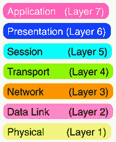
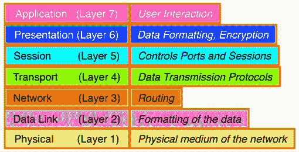
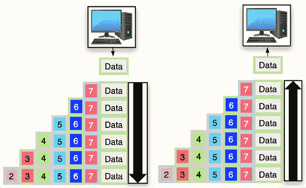
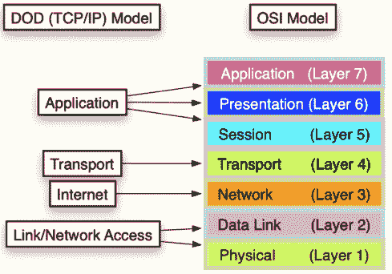
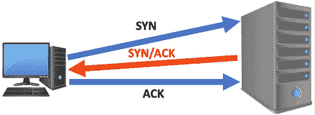
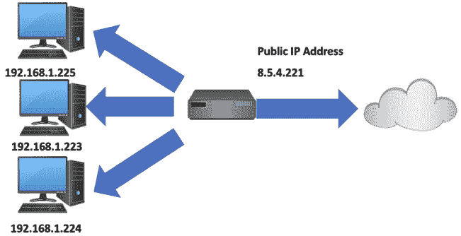
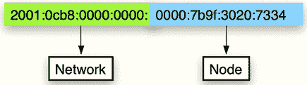
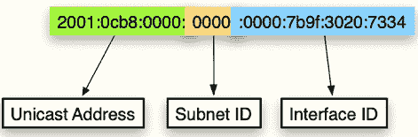
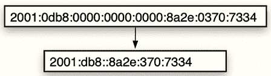

# 第十一章：网络基础

在你的职业生涯中，很少会遇到需要调查一台没有连接到网络的计算机。当我说“计算机”时，这包括了移动设备。台式机、笔记本电脑和移动设备都设计用来通过我们称之为“互联网”的网络共享信息。这样的设备有合法的用途，也有非法的用途。例如，使用这些设备的用户已知会录制自己实施犯罪行为的音频和视频。这些用户还会利用互联网研究他们未来计划执行的活动；这些活动包括犯罪行为。

也可能会有某个时候，你被要求调查一起犯罪案件，设备成为犯罪目标：服务器可能被黑客攻击，用户的移动设备可能被入侵，或者用户的在线存储可能遭到泄露。这些行为要求你了解设备如何在网络上进行通信。本章将讨论一些你需要了解的关于网络的基本信息，从理论概念到网络拓扑、地址分配以及一些基本协议，以增加你对网络的了解。我建议你准备 CompTIA Network+ 考试和 Security+ 考试。

本章将涵盖以下主题：

+   OSI 和 DOD 模型

+   网络硬件

+   常见的端口和协议

网络是建立在一套标准和模型之上的。如果网络中的客户端不遵守某个标准，就会缺乏通信。这样可以确保网络中的所有客户端都能互相通信。

配置网络的主要参考模型是**开放系统互联**（**OSI**）模型。开发人员使用 OSI 模型将通信拆分为不同的层，每一层在数据传输和接收中都有特定的角色。（如果你希望更详细地了解 OSI 标准，可以访问 [`www.iso.org/standard/20269.html`](https://www.iso.org/standard/20269.html)。）

# 开放系统互联（OSI）模型

这个参考模型只是开发人员在创建用户连接到网络的协议和设备时使用的参考。这个分层模型有一些优点，比如：

+   通信过程包括允许更容易开发和故障排除的组件

+   通过遵循标准，不同类型的设备和软件可以相互通信

+   一层的变化不会影响其他层

+   组件的标准化允许多个组织开发和部署组件

通过使用 OSI 模型，你可以让来自 Microsoft、Apple、UNIX 和 Linux 的主机连接并相互通信到同一个网络。如*图 11.1*所示，你可以看到 OSI 模型由七个不同的层组成。各层如下：



图 11.1：OSI 模型

你可以使用助记符来记住从第一层到第七层的顺序，例如“Please do not throw sausage pizza away（请不要扔掉香肠披萨）。”从第七层到第一层，可以使用助记符“All people seem to need data processing（所有人似乎都需要数据处理）。”



图 11.2：OSI 模型 – 各层功能

## 物理层（第一层）

物理层（第一层）负责在网络上不同主机之间创建路径。这可以是用于数据传输的物理拓扑。物理拓扑包括以太网网络，其中以太网电缆连接到主机和网络设备；数据传输的一个例子是 Wi-Fi 网络，其中数据通过无线电信号而非物理介质传输。该层负责传输数据和接收数据。此层还控制物理介质的规格以及主机与物理/传输介质之间使用的连接。

在此层级，你可能会遇到的一些设备包括：

+   中继器 – 接收并重新传输数据的电子设备

+   集线器 – 用于连接多个主机和网络设备的网络设备

+   调制解调器 – 用于编码和解码包含网络数据的信号的网络设备

## 数据链路层（第二层）

数据链路层（第二层）负责数据传输。它提供流量控制、错误通知以及连接到同一逻辑段的主机和网络设备之间的网络拓扑要求。此外，该层还负责将数据传递到正确的目的地。通过使用网络接口设备的物理地址（即 MAC 地址，媒体访问控制地址）来完成这一任务。数据链路层包含两个子层：

+   逻辑链路控制（LLC）– 负责识别网络层协议

+   媒体访问控制（MAC）– 负责数据包的定位和物理地址

在此层，数据被格式化成帧。

在此层级，你可能会遇到的一些设备包括：

+   网络适配器 – 允许主机连接到网络介质

+   桥接器 – 用于连接两个网络段的网络设备

+   无线接入点 – 用于创建有线网络和无线网络之间桥接的网络设备

## 网络层（第三层）

网络层（第 3 层）负责主机和网络设备的逻辑寻址，确定数据传输的最佳路径，并映射连接到网络的所有设备的位置。该层使用的逻辑寻址将取决于网络。你可能熟悉的最常见地址是分配给本地主机的 IP 地址。目前有两种不同版本的 IP 寻址可用：IPv4 和 IPv6。在此层，数据被格式化为数据包。

你在这一层可能遇到的一些设备包括：

+   路由器——一种网络设备，负责根据逻辑寻址（IP 地址）进行数据路由

+   交换机——一种可以根据逻辑寻址（通常，交换机被视为第 2 层设备，但某些交换机也具有在网络层工作的功能）的网络设备

## 传输层（第 4 层）

传输层（第 4 层）负责可靠的数据传输，包括建立/关闭虚拟连接，如主机和服务器之间的 HTTP 连接。多路复用数据流也在这一层进行处理。端口号和网络应用程序的使用是第 4 层的功能；一个例子是，网页流量被引导到端口 80（HTTP），而电子邮件流量则被引导到端口 25（SMTP）。在此层，数据被格式化为段。

你在这一层可能遇到的一些设备包括：

+   网关——一种网络设备，负责连接使用不同协议的两个网络。网关将充当两个不同网络之间的翻译器。

+   防火墙——一种网络设备，用于防止未经授权访问网络上的资源。

## 会话层（第 5 层）

会话层（第 5 层）负责创建、维护和关闭使用表示层协议的主机之间的数据会话。此层将利用以下模式协调网络中主机/服务器之间的数据流：

+   单工——数据只能单向传输

+   半双工——数据可以双向传输，但一次只能在一个方向上传输

+   全双工——数据可以同时在两个方向上传输

## 表示层（第 6 层）

表示层（第 6 层）负责将数据呈现给应用程序，并将应用程序使用的格式转换为网络传输格式。这可能包括编码方案，如 ASCII（美国信息交换标准代码）和 Unicode。

## 应用层（第 7 层）

应用层（第 7 层）为网络上的软件应用程序和主机提供接口。一个例子是系统之间的文件传输。这使得使用不同操作系统和文件系统的应用程序能够进行通信，并为用户提供服务。

## 封装

随着数据穿越协议栈的不同层次，每一层都会添加信息，目的地的相应层将读取这些信息。一个示例如*图 11.3*所示。左侧的主机向右侧的主机发送请求。数据在传输并沿协议栈传递时，每一层可能会向数据添加一个“头部”，将头部和前一层添加的数据封装在一起。当数据到达目标主机时，数据将被解封装，就像剥洋葱一样，直到它到达目的地。例如，如果请求是 HTTP 请求，则会向数据添加应用层头部。在传输层，TCP 头部会被添加，网络层会添加 IP 头部，而数据链路层则会创建以太网头部，将数据转换为帧。帧接着会沿物理层传输。在目的地，过程会被反转，每一层都会打开并读取相应层添加的信息。



图 11.3：封装

# TCP/IP

虽然 OSI 模型是理论性的，但 TCP/IP 是当前网络环境中主导的一套实际协议。TCP/IP 是由**美国国防部**（**DoD**）创建的，目的是为了确保在灾难发生时通讯的完整性。因此，TCP/IP 也被称为 DoD 模型，由以下四个层次组成：

+   应用

+   传输

+   互联网

+   链路/网络接入

它可以映射到不同的 OSI 模型层，如*图 11.4*所示。



图 11.4：TCP/IP 模型与 OSI 模型的对比

链路/网络接入层对应于 OSI 模型中的物理层和数据链路层。此层定义了网络设备如何连接到网络。

互联网层对应于 OSI 模型中的网络层。此层负责数据的逻辑寻址和路由。

传输层对应于 OSI 模型中的传输层。此层负责在源和目的地之间建立连接。

应用层对应于 OSI 模型中的会话层、表示层和应用层。此层负责管理系统中不同应用的数据流。一些你可能遇到的服务包括 FTP 和 HTTP。

TCP/IP 是一套用于主机和网络设备连接时使用的协议。TCP/IP 的主要协议包括 TCP（传输控制协议）、IP（互联网协议）和 UDP（用户数据报协议）。

TCP 是一种面向连接的协议，这意味着在发送/接收数据之前，主机和服务器之间必须建立连接。这是通过三次握手来实现的。当主机想要与服务器通信时，它们会通过发送一个 SYN 数据包到服务器来发起连接。如果服务器可用，它会用一个 SYN/ACK 数据包响应主机。主机随后会用一个 ACK 数据包回应，连接就可以建立。这个过程如*图 11.5*所示。



图 11.5：TCP 三次握手

TCP 是一种传输层协议，用于确保数据的准确传输。每个数据包在从源到目的地的传输过程中都必须得到确认。如果数据包在传输过程中丢失，目的地将通知源端该数据包丢失，需要重新发送。因此，TCP 通信可能会经历延迟，并且不适合速度优先于准确性的通信通道。

UDP 是一种无连接的协议。TCP 需要在通信通道建立之前进行三次握手，而 UDP 不需要。因此，当使用 UDP 作为通信通道时，源端永远不会知道是否发生了数据包丢失，因为目的端没有追踪哪些数据包被发送的手段。一个例子是视频流媒体；如果发生数据包丢失，用户可能永远不会注意到，因为这不会影响视频的质量。

## IPv4

IP 负责数据在网络中的传输和路由。目前，**IP 第四版**（**IPv4**）是该协议的主流版本，但 IPv6 正在逐步推出并被越来越多的组织使用。IP 还负责连接到网络时，主机使用的逻辑地址。IPv4 使用一个 32 位的地址方案，由 4 个字节组成，每个字节之间用点号（`.`）分隔。

例如，`8.8.8.8` 是一个有效的 IPv4 地址。IP 地址会被分配到特定的类别。IP 地址的类别决定了网络上可以容纳多少个主机。

| **类别** | **地址范围** | **最大主机数量** | **私有 IP 范围** |
| --- | --- | --- | --- |
| A 类 | `1.0.0.1` - `126.255.255.254` | 16,777,214 主机 | `10.0.0.0` – `10.255.255.255` |
| B 类 | `128.1.0.1` - `191.255.255.254` | 65,532 主机 | `176.16.0.0` – `172.31.255.255` |
| C 类 | `192.0.1.1` - `223.255.254.254` | 256 主机 | `192.168.0.0` – `192.168.255.255` |
| D 类 | `224.0.0.0` - `239.255.255.255` | 保留用于多播 |  |
| E 类 | `240.0.0.0` - `254.255.255.254` | 保留用于研究 |  |

表 11.1：IPv4 IP 地址类别

A 类网络将分配第一个八位字节给网络，其余三个八位字节用于网络上的主机（`NNN.HHH.HHH.HHH`）。B 类网络将保留前两个八位字节用于网络，剩下两个八位字节用于主机（`NNN.NNN.HHH.HHH`）。C 类网络将前面三个八位字节分配给网络，最后一个八位字节分配给主机（`NNN.NNN.NNN.HHH`）。如果你运行的是 C 类网络，网络上最多只能有 256 个主机。

每个类别也有一组可以在内部网络中使用的私有 IP 地址，但不能通过外部路由器发送流量。这个 IP 地址范围用于封闭的本地网络。使用这些范围内的 IP 地址无法与本地网络以外的设备通信。通常，使用此 IP 地址范围的本地网络都位于路由器后面，并且正在使用**网络地址转换**（**NAT**）。

NAT 将私有 IP 地址映射到公共 IP 地址。这项技术用于节省地址空间，避免 IPv4 地址耗尽。NAT 允许路由器转换来自私有网络主机的流量，然后使用公共 IP 地址转发流量。当流量返回时，路由器将流量发送回主机。唯一暴露的 IP 地址是公共 IP 地址。

使用 NAT 网关的一个公共 IP 地址可以为整个私有网络提供服务，如*图 11.6*所示。



图 11.6：NAT 示例

### 端口号

端口是附加到 IP 地址上的 16 位数字，在计算机网络中使用。每个服务（或协议）都会指定一个端口号。端口号完成数据流的目的地或源网络地址。有些端口号被保留用于特定服务。低于 1024 的端口号通常称为“知名”端口号。大于 1024 的端口号称为临时端口。**传输控制协议**（**TCP**）和**用户数据报协议**（**UDP**）使用端口号。

## IPv6

IPv6 的创建是为了应对使用 IPv4 时可用 IP 地址不足的问题。当 IPv4 被开发时，设计者无法预见到我们现在所处的互联世界。虽然 IPv4 可以提供超过 40 亿个 IP 地址，但由于网络设备的需求和可用性日益增加，最终这些地址将不够用。IPv6 是一个 128 位的寻址方案，可以为地球上的每个人提供大约 4000 个逻辑地址。IPv6 的设计者预见到了移动设备与**物联网**（**IoT**）之间的无线连接世界。IPv6 正在逐渐部署到连接网络的设备上，但在消费者世界中，它仍然不是主要的寻址方案。IPv6 基于十六进制编号系统，包含八组四个十六进制字符；每组之间用冒号分隔。

每组由四个数字组成，每个数字代表四位二进制位。每个段可以有从零到 FFFF 的十六进制值。一个 IPv6 地址的示例如*图 11.7*所示。


图 11.7：IPv6 地址

IPv6 地址被分为两个 64 位段。第一个段是网络部分，第二个段是节点部分，如*图 11.8*所示。



图 11.8：分隔的 IPv6 地址

IPv6 地址的网络部分用于数据的路由。节点部分标识主机的网络接口（节点），并来自于连接到网络的网络适配器的物理地址（MAC 地址）。

IPv6 地址的网络部分被分为 48 位的全局单播地址和 16 位的子网 ID，如*图 11.9*所示。



图 11.9：IPv6

IPv6 地址有三种不同的类别：

+   全局单播地址——该地址可以在互联网上路由（以 2001 开头）

+   唯一本地——用于内部网络，不可在互联网上路由

+   链路本地——既不可在本地路由，也不可在互联网上路由

IPv6 使用以下类型的寻址方案：

+   唯一本地地址——这些地址用于非路由目的。它们几乎是全球唯一的，因此不太可能与其他任何地址重叠。此外，设计唯一本地地址是为了替代站点本地地址；这允许在整个站点内通信，同时可以路由到多个本地网络。链路本地地址和唯一本地地址的区别在于，唯一本地地址可以在你的组织或公司内部进行路由。

+   多播——传递到多播地址的数据包会传递到由该多播地址标识的所有接口。有时人们称其为一对多地址。IPv6 中的多播地址始终以 FF 开头。

+   任播——类似于多播地址，任播地址标识多个接口。任播数据包只会传递到一个地址。

IPv6 地址也可以缩短。在 IPv6 中，一个组可以由全零组成。在这种情况下，地址中不需要写出所有的零，而是可以写一个零，这个零表示该组中的四个零（如*图 11.10*所示）。



图 11.10：IPv6 简写示例

以下是一些你在调查过程中可能遇到的协议。这些协议按 TCP/IP 协议栈的层次进行排序。

### 应用层协议

**文件传输协议（FTP）（TCP 端口 20 和 21）**

该协议允许用户通过基于 IP 的网络发送和接收文件。FTP 也是一个程序。当 FTP 作为协议使用时，应用程序用于启动 FTP 过程；当作为程序使用时，用户启动 FTP 过程。

**安全外壳协议（SSH）（TCP 端口 22）**

该协议允许在基于 IP 的网络中创建安全的 Telnet 会话。建立 SSH 连接后，用户可以像在远程主机前操作一样执行命令。SSH 通过加密技术在源主机和目标主机之间创建一个安全的隧道。

**Telnet（TCP 端口 23）**

该协议连接到远程主机，即终端。用户可以像在远程主机前操作一样执行命令。由于 Telnet 连接不安全，容易受到中间人攻击。

**简单邮件传输协议（SMTP）（TCP 端口 25）**

该协议是用于电子邮件传输的通信协议。邮件服务器使用 SMTP 发送和接收邮件。

**域名服务（DNS）（TCP 端口 53，UDP 端口 53）**

该协议用于将主机名解析为 IP 地址。例如，用户输入[`www.packtpub.com`](https://www.packtpub.com)比输入类似`104.22.1.175`这样的 IP 地址要容易得多。

**动态主机配置协议（DHCP）（UDP 端口 67）**

该协议在主机加入网络时自动分配 IP 地址。这允许网络的自动管理，当主机进入和离开网络时，相关信息会自动更新。DHCP 服务器提供的信息包括 IP 地址、子网掩码、默认网关和 DNS 服务器的 IP 地址。

**超文本传输协议（HTTP）（TCP 端口 80）**

该协议用于浏览器与 Web 服务器之间的通信。

**安全超文本传输协议（HTTPS）（TCP 端口 443）**

该协议是 HTTP 的安全版本。它在浏览器和服务器之间创建了一个安全的通信通道。

**远程桌面协议（RDP）（TCP 端口 3389）**

该协议用于与另一个主机建立安全连接。它类似于 Telnet 和 SSH，但用户可以访问图形用户界面，而不是命令行。这是一个专有的微软协议。

### 传输层协议

**传输控制协议（TCP）**

一种面向连接的协议，用于可靠的数据传输。

**用户数据报协议（UDP）**

一种面向无连接的协议，用于快速传输数据；它不要求数据的可靠传输。

### 互联网层协议

**互联网协议（IP）**

互联网协议是 TCP/IP 栈中的互联网层，其他互联网层协议对其提供支持。该协议负责数据包的传输。其传输完全基于逻辑地址，也就是 IP 地址。IP 是面向无连接的协议。目前有两个版本，IPv6 和 IPv4。

**互联网控制消息协议（ICMP）**

ICMP 是 IP 的管理协议和消息服务。ICMP 可以提供有关网络问题的信息，例如：

+   目标不可达——当数据报无法到达最终目的地时，会生成此错误。

+   回显请求/回显应答——这是通过 Ping 命令生成的，用于测试网络连接。

+   超时（TTL）——当数据包未能在指定的跳数内到达目的地时，产生该错误。跳数是指数据包从一台路由器发送到另一台路由器的次数。

+   重定向——如果路由器能够确定更高效的路由，将生成重定向消息并发送给主机，以更新其路由表。

Ping 是一个用于识别网络问题的工具。Ping 会向目标发送一个数据包，然后跟踪目标服务器响应所需的时间。在以下示例中，我使用了`ping`命令将数据包发送到 IP 地址`104.22.1.175`，你可以看到服务器有响应，响应时间在 9 到 14 毫秒之间。

```
User@Server ~ % ping packtpub.com
PING packtpub.com (104.22.1.175): 56 data bytes
64 bytes from 104.22.1.175: icmp_seq=0 ttl=60 time=10.270 ms
64 bytes from 104.22.1.175: icmp_seq=1 ttl=60 time=9.949 ms
64 bytes from 104.22.1.175: icmp_seq=2 ttl=60 time=14.081 ms
64 bytes from 104.22.1.175: icmp_seq=3 ttl=60 time=13.323 ms
64 bytes from 104.22.1.175: icmp_seq=4 ttl=60 time=9.048 ms
64 bytes from 104.22.1.175: icmp_seq=5 ttl=60 time=9.077 ms
64 bytes from 104.22.1.175: icmp_seq=6 ttl=60 time=9.254 ms 
```

如果 ping 命令不成功，将会显示“目标主机不可达”或“请求超时没有回复”的信息。这并不意味着存在连接问题；系统管理员可以选择阻止来自本地网络之外的 ICMP 流量，如下面的示例所示。

```
User@Server ~ % ping 192.168.86.22
PING 192.168.86.22 (192.168.86.22): 56 data bytes
Request timeout for icmp_seq 0
Request timeout for icmp_seq 1
Request timeout for icmp_seq 2
Request timeout for icmp_seq 3
ping: sendto: No route to host 
```

**地址解析协议（ARP）**

ARP 用于将逻辑地址转换为物理地址。这是通过 ARP 向同一网络段上的主机发送广播消息来实现的。广播消息会询问网络接口设备是否具有特定的 IP 地址。如果网络接口设备分配了该 IP 地址，则它会回复 MAC 地址。ARP 是一种广播协议，所有网络段上的主机都能看到请求和回复。ARP 请求是不可路由的，这意味着 ARP 数据包无法跨越路由器边界。

**互联网协议安全（IPSec）**

IPSec 是一种安全协议，通过提供端到端加密和数据包认证来增强安全性。虚拟私人网络（VPN）在建立安全通信通道时会利用 IPSec。

# 概要

本章中，我们讨论了计算机网络的基础知识。首先，你了解了 OSI 模型和 TCP/IP（DoD）模型之间的区别。OSI 模型只是理论性的，没有物理实现。不要在有人提到 TCP/IP 模型时感到困惑，因为那是在谈论 TCP/IP 协议套件。我们还看了在网络环境中可能找到的不同类型的硬件，以了解集线器和路由器之间的区别。路由器是一个更加复杂的设备，负责将数据发送到下一跳。相比之下，集线器仅用于通过为额外的主机提供连接到网络的位置来扩展网络段。集线器不“做”任何事；它仅仅是网络的扩展。

你应该能够解释面向连接协议和无连接协议之间的区别，以及在什么情况下使用每种协议。例如，当数据吞吐量是主要考虑因素时，使用面向连接的协议可能不合适。目前的 IP 地址方案仍在使用中，但变化正在缓慢发生，IPv6 将成为主流协议。

现在，考官应该能够：

+   确定 OSI 模型和 TCP/IP（DoD）模型之间的区别

+   确定网络上正在使用的地址方案

+   理解公有 IP 地址和私有 IP 地址之间的区别

+   理解端口号和 IP 地址之间的区别

+   识别一些常用的协议和端口

在下一章中，我们将讨论报告写作。能够编写报告，使读者在使用非技术性语言的同时理解技术性主题，这一点至关重要。如果你不能书面解释你是如何完成考试文件的，这将影响你成为一名成功调查员的能力。

# 问题

1.  OSI 模型有多少层？

    1.  5

    1.  6

    1.  7

    1.  8

1.  DoD 模型中有多少层？

    1.  4

    1.  5

    1.  6

    1.  7

1.  OSI 模型的第 1 层是什么？

    1.  应用程序

    1.  会话

    1.  网络

    1.  物理

1.  以下哪个是第 3 层设备？

    1.  集线器

    1.  路由器

    1.  交换机

    1.  打印机

1.  IPv4 地址有多长（以位为单位）？

    1.  16

    1.  32

    1.  64

    1.  128

1.  IPv6 地址有多长（以位为单位）？

    1.  16

    1.  32

    1.  64

    1.  128

1.  “2001:db8::8a2e:370:7334”是什么的例子？

    1.  MAC 地址

    1.  物理地址

    1.  IPv6 地址

    1.  加密密钥

1.  以下哪项不是成功的 ping 命令的响应？

    1.  64 字节来自`104.22.1.175`

    1.  ttl=60

    1.  time=10.270 ms

    1.  没有路由到主机

1.  IP 的管理协议和消息服务是什么？

    1.  ICMP

    1.  DHCP

    1.  TYFMS

    1.  ARP

1.  哪种协议允许创建一个安全的 telnet 会话？

    1.  FTP

    1.  HTTPS

    1.  SSH

    1.  IFYKYK

# 进一步阅读

Neil, I. (2018). *CompTIA Security+认证指南：掌握 CompTIA Security+ SY0-501 认证的 IT 安全要点和考试主题*。Packt 出版公司。

Davies, G. (2019). *网络基础：培养通过微软 Mta 网络基础考试 98-366 所需的网络技能*。Packt Publishing Ltd.

# 加入我们在 Discord 的社区

加入我们社区的 Discord 空间，与作者和其他读者讨论：

[`packt.link/CyberSec`](https://packt.link/CyberSec)


