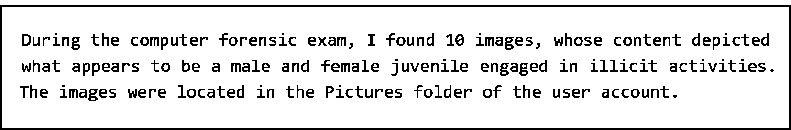
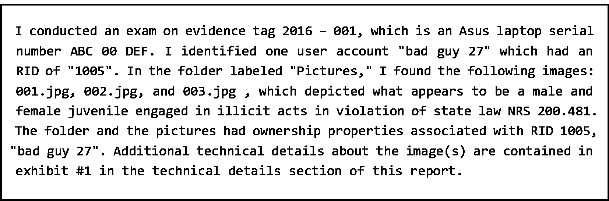
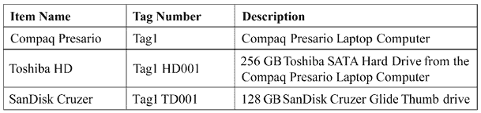
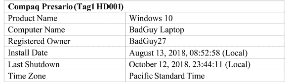
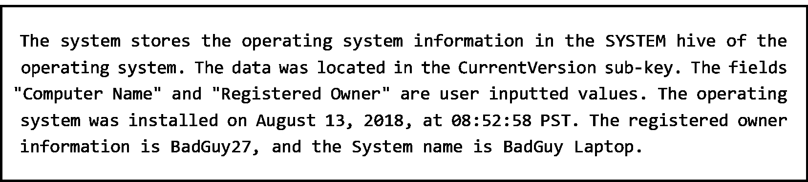

# 第十二章：报告写作

我曾与一些喜欢深入到调查细节的检查员一起工作。没有人比他们更努力地检查数字证据，追踪数字痕迹，直到他们找到了所需的证据。他们聪明且才华横溢，如果我犯了数字犯罪，我是绝对不希望让他们来调查的。这与他们的调查能力无关，而完全与他们的报告写作能力有关。说他们的报告有缺陷，简直是轻描淡写。

报告写作是数字取证调查员可以做的最困难的事情之一。你必须将一个非常技术性的主题以一种非技术性的人能够理解的方式来解释，同时不能对潜在的用户或数字证据做出任何假设。

本章将涵盖以下主题：

+   高效的记笔记

+   撰写有价值的报告

# 高效的记笔记

你记笔记的能力将直接影响你撰写数字取证调查报告的能力。你的笔记将成为报告的基础。一个在我进行考试时深有感触的简单短语是*如果你没有写下来，那就没有发生过*。你的某次调查可能会持续数天甚至数月；你根本不可能记得在第 14 天你到底做了什么。

记笔记的基本要素应包括以下内容：

+   你何时做了某件事

+   你做了什么

+   你看到了什么

+   你为什么做了某件事

你的记笔记工作从你收到通知时就开始了，你必须赶到现场。这包括你收到通知的日期/时间，谁通知了你，以及你到达现场的时间。记录你采取的任何行动；如果你收集了易失性数据，系统中的 RAM，你是否改变了数字证据？答案是*是的*。在这里，*为什么*是至关重要的。*为什么*你要改变数字证据？在这里，答案很简单——因为如果不在那个时候收集证据，它将会丢失。

另一个例子是，如果你正在回应一个商业企业，数字证据是否包含在服务器环境中。你不能（在大多数情况下）关闭服务器来创建整个磁盘的取证镜像；你将不得不对相关文件创建一个逻辑取证镜像。同样，*为什么*的问题可能会被提问，你必须做出解释。

如果你正在调查的事项进入审判程序，对方律师将能够访问相同的数字证据和在调查过程中记录的笔记。他们将使用你的笔记和报告来重现你对数字证据的检查。他们试图查看是否能根据你的行动得到不同的结果或得出不同的结论。

你的笔记应该有多详细？笔记的格式通常是根据每个数字取证调查员的个性化需求而定的。基本的考虑标准应该是，如果几年后此事进入审判，你能记得调查的细节吗？

没有标准的笔记格式，但你应包含以下信息：

+   受调查对象的详细信息。

+   受调查事件中受害的个人或实体的详细信息

+   数字证据在现场的位置。

+   数字证据的具体信息，系统的品牌、型号、序列号、任何识别标志（还要包括损坏情况——曾有人声称系统是在被扣押后损坏的。如果你记录了扣押时系统的状况，这将削弱这些投诉的有效性）。

+   证据袋/封条的状况——如果有损坏或封条破损。

+   使用的取证硬件的详细信息，如固件/序列号。

+   使用的取证软件的详细信息，如版本号。

+   支持或不支持你关于发生了什么的假设的任何发现。

最少情况下，这些是你应该在笔记中包含的信息。你可以加入更多内容吗？绝对可以！

你应该使用什么媒介来做笔记？我更喜欢现场手写笔记，然后将笔记转入数字媒介。我的字迹不是最容易解读的，这也是为什么我采用这种方法。另外，数字照片也是一种做笔记的媒介。当记录系统状态或存储设备时，拍摄一张数字图像然后在完成报告时参考该图像非常直接。

每个组织/检查员会有自己的标准，关于需要记录的信息以及使用什么方法记录信息。无论你使用哪种方法，确保在整个调查过程中保持组织性和一致性至关重要。

如你所见，笔记是撰写报告的基础，这是我们下一个讨论的主题。

# 撰写报告

你报告的目的是记录你的取证检查结果。你的报告可能用于支持额外的调查工作。报告也可能用于刑事法院诉讼、民事法院诉讼或行政程序中。其他人可以使用你的发现来支持可能的原因听证会、大陪审团程序，或作为企业环境中行政处罚的依据。

你的报告将是提供证词的第一步，关于你正在调查的事项。对方会仔细审查你的报告，如果他们传唤你作证，准备好被问及你所撰写报告的内容。

在准备起草报告时，请确定您的受众是谁。假设您正在为信息主任、IT 安全部门或任何基于技术的团队编写报告。在这种情况下，您的报告应包含比面向律师、法官或陪审团的报告更详细的技术内容。如果您对每一个发现的证据都详细说明，您会失去非技术性的受众。虽然技术受众需要这些具体细节，并且如果您用非技术性的方式解释这些细节可能会让他们感到受辱，但完全有可能起草一份同时兼顾技术和非技术受众的报告。

以下是您可以遵循的通用模板：

+   行政信息

+   执行摘要

+   叙述部分

+   证据/技术细节

+   词汇表

行政部分将包含有关您调查的信息，具体包括以下内容：

+   机构名称、案件编号以及调查中的参与者。这将包括有关调查员、受害者和嫌疑人的信息。如果调查最初由其他机构开始，您还需要包括该组织的行政信息。请简要概述调查历史。

+   调查何时开始，您被分配到调查之前发生了什么事件？这可能包括谁接受了采访或讯问，或任何已准备并执行的搜查令。您需要提供在您参与之前的调查概要。包括您在调查/检查证据时所拥有的搜查权限。包括您正在调查的内容，即搜查的范围，以及是谁授权了搜查。如果数字取证检查是根据搜查令进行的，请将搜查令和用于作为*证据/技术细节*部分的宣誓书包括在内。

执行摘要是总结报告的一部分。报告的叙述部分将比执行摘要详细得多。读者在阅读完执行摘要后，应能够获得调查发生的总体概述。执行摘要应遵循以下指南：

+   应仅占报告的 10%

+   以简短、清晰、简洁的段落写成

+   应遵循与叙述部分相同的时间线

+   不应包括任何在叙述中未提到的信息

+   应包含您的发现/结论

这使得非技术性用户能够理解您在调查过程中采取了哪些行动，而不必涉及技术细节。例如，如果您在基于 Windows 10 操作系统的用户图片文件夹中发现了非法图像，您可以在执行摘要中这样报告：

您的非技术观众将完全理解您的意图。大多数消费者都熟悉 Windows 操作系统，以及如何访问和使用用户帐户中的`Pictures`文件夹。在叙述部分，您可以包括更详细的解释，例如以下内容：

清晰度是您起草叙述时追求的目标之一。您不希望读者有疑问或对您的报告感到不清楚。由于您正在结合调查的技术和非技术方面，这可能很困难。您还不希望通过技术细节和缩写让读者感到不知所措。如果您在刑事司法环境中工作，并且起诉律师将阅读您的报告，您很可能需要向他们讲解技术方面的内容。在详细叙述中定义技术术语和概念。叙述需要多详细？

没有简单的答案。您应该详细描述叙述内容，向读者传达调查信息，这样即使您无法回答问题，法官、陪审团或律师也能理解。基于您叙述中的细节，是否能够重建您的调查？对方律师将有能力审查证据和您的报告。

如果没有足够的细节让他们重新创建您的操作，它会让他们有能力质疑您的结果。请记住，司法程序可能会在几个月或几年后进行。您的报告将成为您所在组织对调查过程中所发生事情的官方记忆。

您还需要确保叙述不带有偏见。您的目标是报告事实，而不是夸大或低估它们的重要性。在调查过程中，最困难的事情之一是识别键盘背后的实际人员。您将根据用户帐户的数字身份进行识别。您正在将用户帐户与操作键盘的物理人员关联起来，并使用其他数字证据源。

叙述应包含各种子部分，我们现在将逐一讨论。

## 已分析证据

在此部分，您将包括所有已审查的证据，包括制造商/型号、序列号等。如果是台式机/笔记本电脑，您应将硬盘列为一个独立但相关的项目。

以下是可能被审查的证据示例：

图 12.1：证据标签示例

在这个例子中，具体项目已经被识别并分配了组织识别号。我已经为 Compaq 笔记本分配了组织识别号“Tag1”。计算机中找到的任何存储设备也将包含相同的标签号。笔记本内部有一个 Toshiba 硬盘存储设备，因此它的组织识别号是“Tag1 HD001”。HD 是硬盘（hard disk）的缩写。如果笔记本有两个硬盘，第二个硬盘的组织识别号将是“Tag1 HD002”。如果在查封笔记本时，发现 USB 端口中插有一个 U 盘，则该 U 盘的组织识别号将是“Tag1 TD001”。TD 代表 U 盘。你还可以在描述字段中包含该物品的序列号（如果有的话）。

## 获取细节

本节将描述创建法医图像的获取过程，正如我们在*第三章*中讨论的，*证据获取*。首先，识别过程中使用的硬件或软件，并包含其序列号/版本号。你还应该包括硬件/软件验证的日期。你的叙述应包括你（或同事）创建法医图像的逐步分析。描述执行的步骤哪些按预期完成，哪些未按预期功能运行。如果法医图像的哈希值没有经过验证，请在报告中注明这一点，并说明你采取了哪些步骤来排除问题。最后，你必须了解创建法医图像过程中是否存在问题。未能识别这些问题可能会质疑你调查的全面性以及法医图像的分析。

## 分析细节

这一部分将构成你叙述的主要部分。你的分析不能只是你认为与调查相关的文件页的打印件。你必须分析文物，并向读者解释它为何与调查相关。包括截图以帮助读者参考你的解释。包括截图并不意味着可以省略对截图内容的解释。告诉读者截图的重要性，并解释它与调查的相关性。不要假设读者能够自行判断截图中哪些信息是重要的。你可以采用不同的方式来呈现你的分析，可以按时间顺序、按设备或按嫌疑人来呈现。没有对错之分。我的偏好是按时间顺序和主题来撰写报告。例如，对于作为桌面/笔记本系统盘的存储设备，我会先确立设备的所有权和使用情况。然后，我会继续调查该事件的具体文物。小心不要陷入过于技术化的描述，避免过于细节化。我会在你描述的具体证物中，详细说明技术描述部分。

例如，如果文物的日期/时间戳是相关的，你可以在叙述中提到用户在某年某月某日的某个时间访问了某个应用程序。然后，在下一部分中，你可以进一步详细说明文件记录中 MFT 的日期/时间戳的字节偏移。

在处理绝对性陈述或使用不必要的形容词时要小心。我曾经读过一篇报告，将用户的 Google 搜索描述为“令人不安”。你不应该对在进行数字取证检查时发现的行为/行动进行分类。你的职责是向事实查明者（法官/陪审团）提供事实，并允许他们做出判断。

在叙述的结尾，是呈现结论/发现的时刻。这是你在数字取证调查中提出你对主体责任的看法的地方。保持简洁明了——例如，*根据我对以下证据的审查（列出你在数字取证过程中审查的项目），我的观点是……*——然后基于你分析的文物陈述事实。你要避免使用任何煽动性/描述性的语言，保持客观和专业。

## 证物/技术细节

在你编写*分析*部分时，你将引用特定的证据。你应该将这些证据的截图放在证据/技术细节部分。这也包括你在检查过程中使用的取证工具的输出报告。如果你在叙述中引用了某个证据，你必须将它包括在证据/技术细节部分；同样，如果你在该部分有证据，你必须在叙述中引用它。我发现将证据和技术细节按我在叙述中引用的顺序整理会很有帮助。如果读者在阅读完叙述后查看证据，并且它们的顺序一致，能帮助他们更好地理解报告内容。

在下面的示例中，我已包括操作系统的所有者信息，以及安装日期/时间戳、时区和最后关机日期/时间戳：

图 12.2：证据示例

该信息的适当叙述如下：

该描述简明、真实且公正，这是报告的目标。

本节的最后部分将是一个软件/硬件使用情况的表格。你需要包括软件/固件的版本号，以便其他人可以重复你的检查。你还需要确保你所使用的软件的组织许可证是合法的。这个列表可以很简单，如下所示：

+   FTK Imager 3.0.0.1443

+   X-Ways Forensics 19.7

+   Paladin 7.05

+   Recon 3.14.1.12

曾经有过组织在检查过程中使用未经授权/盗版软件的情况。这种做法不推荐，并且可能会导致对你和你的机构的负面制裁。此外，使用未经授权/盗版软件可能会质疑你调查结果的有效性。

我无法强调，校对报告的重要性。你第一次（或第二次）写报告时不可能完美无缺。报告中会有语法、拼写和内容上的错误。因此，第一稿完成后，你应该请第二个人来校对报告。第二个人能够发现你遗漏的错误，并帮助判断报告各部分的衔接是否顺畅。你心中已经有了要表达的内容；第二位校对者将帮助你判断这些内容是否有效。第二位校对者还会从不同的角度审视报告的呈现方式，确保结论逻辑清晰、没有偏见。每当我校对同事的报告时，我会从对方的立场来看待它。我的目标是找到报告中的不一致或漏洞，以防对方在审判时加以利用。另一种选择是，在报告最终定稿后，你所在的组织可能会进行同行评审。上级或同事会审核你的报告和发现，以确保你遵循了适当的政策和程序，并且结论是基于事实的。

当报告传达给相关方时，应该以什么格式呈现？我个人倾向于将报告以数字签名的 PDF 格式提交。如果报告被修改，数字签名会失效。有些数字取证调查员会创建基于 HTML 的报告并将其刻录到光盘上，而其他人则使用取证工具的报告功能。你可以选择多种方式来呈现报告；你需要确保，如果需要在司法/行政程序中作证时，能够验证其内容。PDF 格式允许你通过数字签名进行验证，同时将报告和相关数据保存到光盘上，这样你就可以生成哈希值来确保没有人篡改内容。

# 总结

本章讨论了记录笔记及其重要性。你了解到，记录笔记是撰写报告的基础构建块。你明白了数字取证检查报告的构成及其应包含的信息。我们还讨论了技术性和非技术性读者可能会阅读你的报告，因此你需要考虑这一点来起草报告。通过这些，你能够有效地记录笔记并准备一份清晰简洁的报告。

在下一章中，我们将讨论调查的总结和报告写作，作为证人出庭作证。

# 问题

1.  你应该在何时开始记录笔记 __________？

    1.  当你收到通知时

    1.  当你到达现场时

    1.  当你开始检查时

    1.  当你开始撰写报告时

1.  你应该在笔记中包含哪些信息？

    1.  你早餐吃了什么

    1.  嫌疑人的鞋码

    1.  现场数字证据的位置

    1.  天气状况

1.  有一个国家标准用于记录笔记。

    1.  正确

    1.  错误

1.  在撰写报告时，应该考虑谁？

    1.  主管

    1.  警察局局长

    1.  地区检察官

    1.  读者

1.  *行政信息*部分不包含哪些信息？

    1.  你的生日

    1.  机构名称

    1.  嫌疑人信息

    1.  证人信息

1.  执行摘要不应超过报告的 25%。

    1.  正确

    1.  错误

1.  你的报告草稿应该是什么样的？

    1.  详细

    1.  简洁

    1.  清晰

    1.  高效

答案可以在本书的后面找到。

# 进一步阅读

如需更多信息，请参考*数字证据的法医检查*，*执法人员指南*，网址：[`www.ncjrs.gov/pdffiles1/nij/199408.pdf`](https://www.ncjrs.gov/pdffiles1/nij/199408.pdf)。

# 加入我们的 Discord 社区

加入我们社区的 Discord 空间，与作者和其他读者进行讨论：

[`packt.link/CyberSec`](https://packt.link/CyberSec)

