# 第二章：建立实验室

在上一章中，我们学习了黑客攻击的概念。在本章中，我们将学习如何搭建虚拟环境，以便稍后进行渗透测试。本章将介绍虚拟机的概念，并执行安装步骤。稍后，我们将学习如何在 VirtualBox 中安装 Kali Linux，以及两台受害者机器：Windows 和 Metasploitable。我们还将讨论这些机器的功能，以及为什么我们要使用它们。在本章的末尾，我们将了解快照的概念，并学习如何实现它们。

本章将涵盖以下主题：

+   实验室概述

+   安装 Kali Linux

+   安装 Metasploitable

+   安装 Windows

+   创建快照并使用快照

# 实验室概述

由于本书高度实践化，我们需要一个实验室，一个可以学习和执行攻击的地方。为了创建这个环境，我们将使用一个叫做 VirtualBox 的程序。

# VirtualBox

VirtualBox 是一个程序，它允许我们在自己的计算机内安装其他计算机，就像普通计算机一样。我们将拥有一台计算机，并在其中安装其他计算机，这些计算机将作为虚拟机运行。虚拟机在渗透测试中非常重要，我们将在搭建实验室时频繁使用它们。需要特别注意的是，虚拟机就像是一个完全独立、正常工作的计算机；安装操作系统作为虚拟机并不会丢失任何内容，它的性能和安装在单独笔记本电脑上时一样。基本上，我们不需要四五台电脑或笔记本（以便进行黑客攻击），我们将把它们作为虚拟机安装在自己的计算机内部。现在可能有些模糊，但随着我们进一步深入本章，VirtualBox 的工作原理会变得更加清晰。

基本上，我们将在主计算机内部拥有三台计算机。我们的实验室将包含以下三台机器：

+   攻击者机器：Kali Linux

+   受害者 1：Metasploitable

+   受害者 2：Windows

举个例子，如果我们的主计算机是 macOS，我们就不需要做任何修改。我们将有一台攻击者机器，运行 Kali Linux，稍后在本章中我们会详细了解 Kali Linux。

我们还将有两台受害者机器：

+   一台运行 Windows 的受害者机器。

+   一台运行操作系统叫做**Metasploitable**的受害者机器。

所以，我们将拥有自己的计算机，并在其中创建三台独立的计算机。这将通过使用 VirtualBox 实现。

# 安装 VirtualBox

下载 VirtualBox 时，只需选择与你的操作系统兼容的版本。Windows、macOS X 和 Linux 都有对应版本的 VirtualBox。

VirtualBox 是免费的，你可以从以下链接下载：[`www.virtualbox.org/wiki/Downloads`](https://www.virtualbox.org/wiki/Downloads)

所以，只需找到与你操作系统兼容的 VirtualBox 版本，双击它并安装。安装非常简单；你只需双击它，点击“下一步”，“下一步”，“下一步”，就安装完成了。以下是 VirtualBox 的截图；如我们所见，它已经安装好了，并且在窗口的左侧没有任何虚拟机：

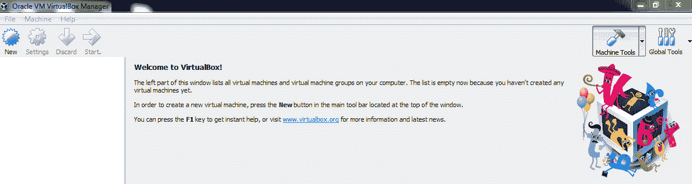

# 安装 Kali Linux

在本书中，我们将使用一些渗透测试工具。你可以手动安装每个工具，或者像我这样做，大多数渗透测试员都这么做——通过使用为黑客设计的操作系统来节省时间和精力。我们将使用名为 Kali Linux 的操作系统，它是基于 Debian 的 Linux 版本。它预装并预配置了我们需要使用的所有程序和应用。这意味着我们只需安装操作系统，然后就可以开始学习黑客技术。

安装 Kali 有两种方式：将其作为虚拟机安装在当前操作系统中，或者将其作为主操作系统安装在主机上。在本书中，我们实际上将以虚拟机的方式使用它，因为以虚拟机方式使用与作为主操作系统使用完全相同；它会完全与我们运行在 VirtualBox 中的电脑隔离开。如果我们弄坏了它，或出错了，修复起来非常容易。可以轻松恢复到其他快照或配置，而且使用虚拟机时我们不会失去任何功能。这就是我们总是以这种方式使用它的原因。

不管你使用的是哪个操作系统，无论是 Windows、Linux 还是 OS X，步骤完全相同。

安装 Kali Linux 的步骤如下：

1.  下载适用于你电脑的 VirtualBox 版本。

1.  设置好 VirtualBox 后，下载 Kali Linux，下载链接为[`www.offensive-security.com/kali-linux-vm-vmware-virtualbox-hyperv-image-download/`](https://www.offensive-security.com/kali-linux-vm-vmware-virtualbox-hyperv-image-download/)。

1.  向下滚动，确保点击的是 Kali Linux VirtualBox 镜像，而不是 VMware；然后，下载与你系统兼容的 Kali 版本。所以，如果你使用的是 64 位电脑，请下载 64 位版本，如果是 32 位电脑，请下载 32 位版本。

1.  下载后，你应该会得到一个`.ova`扩展名的文件；文件名后面会跟着`.ova`扩展名，如下所示：

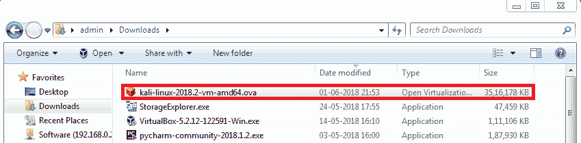

1.  要在 VirtualBox 中安装此系统，我们只需双击该文件。你会看到一个窗口，允许你导入虚拟机。现在我们暂时保持默认设置，点击导入按钮。就这样；虚拟机准备好了：

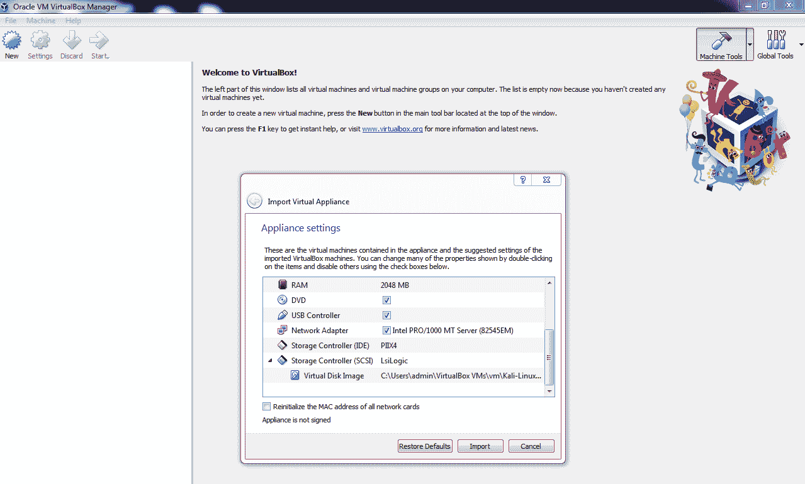

1.  在我们开始之前，我们将先看看如何修改一些设置。我们将点击 Kali-Linux 标签，这个标签可以在窗口的左侧看到。然后，我们将点击设置。我们要做的第一件事是进入系统并修改其内存大小。根据你电脑上的内存大小，你可以设置为 2GB，但 Kali 使用 1GB 就足够了。通常，我会设置为 2GB，因为我的电脑有 16GB 的内存。

1.  此外，当你点击处理器标签时，你会看到，默认情况下我们为它分配了两个处理器。再说一次，我有 8 个 CPU，所以 2 个处理器对我的电脑压力不大；但 1 个 CPU 对于 Kali 来说也足够了。

1.  接下来，我们将进入网络设置，并将其设置为使用 NAT 网络。有时，当我们将其设置为 NAT 网络时，这里可能看不到网络名称；如果是这样，请查看链接 [`www.youtube.com/watch?v=y0PMFg-oAEs`](https://www.youtube.com/watch?v=y0PMFg-oAEs)，它会展示如何创建 NAT 网络。这个设置基本上会创建一个虚拟网络，我们的主机将作为路由器，而所有虚拟机将作为客户端连接到这个网络。因此，它们将通过主机获取互联网连接，同时，我的所有虚拟机也将连接到一个虚拟网络。这非常方便，因为我的虚拟机可以相互通信；我们可以使用其中一台来攻击另一台，并可以用它来测试网络攻击等等。

这将使我的虚拟机能够连接到互联网，并且也能相互通信，所有这些都将通过虚拟网络完成。它不会使用任何无线适配器或无线网卡；它将创建一个虚拟以太网网络，因此就虚拟机而言，它们是通过以太网电缆连接到网络的。

1.  现在，我们可以点击确定并启动虚拟机。

1.  现在，要开始，我们只需要点击开始按钮。然后，点击虚拟机内，按下*Enter*键；现在我们已经进入虚拟机：

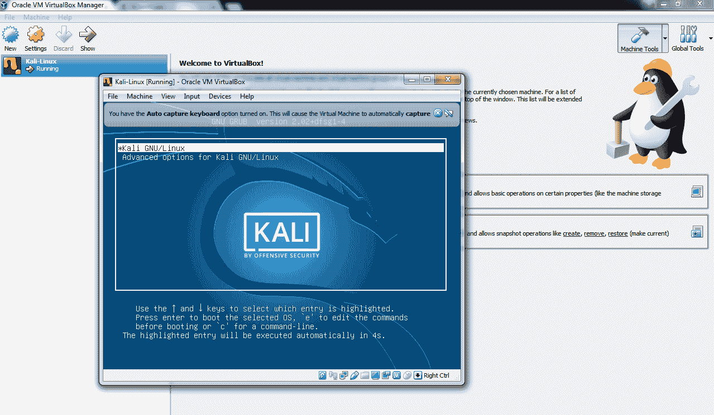

1.  现在它要求我们输入用户名，默认的用户名是`root`，然后它要求我们输入密码，默认密码是这个的反向，即`toor`。由于我们是使用现成的镜像安装的，因此我们可以直接点击绿色按钮，或者可以进入查看 | 全屏；屏幕会自动调整为我们的屏幕大小。

1.  现在，请注意屏幕的右上角，我们应该能看到一个网络图标，因为我们设置了这台机器使用 NAT 网络。如果没有网络图标，意味着机器没有连接到 NAT 网络，所以如果我们打开浏览器，会发现它无法连接到互联网。

1.  为了解决这个问题，我们只需进入屏幕顶部，它会显示菜单。进入“设备”|“网络”，我们可以点击“连接网络适配器”，如下图所示：

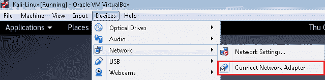

我们只需要做这一步，然后虚拟机会自动连接到 NAT 网络。一旦完成，几秒钟后我们将看到网络图标，如果点击它，我们就会连接到有线网络。

1.  如下图所示，它显示为“已连接到有线网络”，所以 Kali 认为它已连接到有线网络：

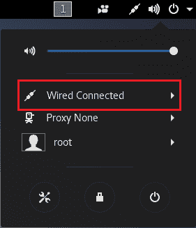

现在，如果我们在浏览器中点击“再试一次”，我们将看到互联网连接正常。

不要被这个新操作系统吓到；我们会逐步了解基本操作，并且我们会经常使用它。实际上，使用它会变得非常容易。

此外，正如我所说，当你以虚拟机形式安装 Kali Linux 时，你不会失去任何功能。实际上，作为虚拟机安装它更好，因为它完全与计算机隔离，如果出现问题，修复起来会非常容易。

# 安装 Metasploitable

我们将使用的第二台机器是 Metasploitable。Metasploitable 是另一台 Linux 机器，你可以把它看作是 Kali 的对立面。Kali 设计用于让你入侵其他设备，而 Metasploitable 设计用于让你入侵它，所以它是为那些想学习渗透测试的人设计的。它被设计成有多个漏洞，我们将尝试使用 Kali Linux 来入侵 Metasploitable。因此，这将成为目标或受害者机器之一。

你可以在[`information.rapid7.com/metasploitable-download.html`](https://information.rapid7.com/metasploitable-download.html)下载 Metasploitable。

你将得到一个 ZIP 文件，像这样。解压后，你会得到一个名为`metasploitable-linux-2.0.0.zip`的目录；双击它，你将看到以下文件：

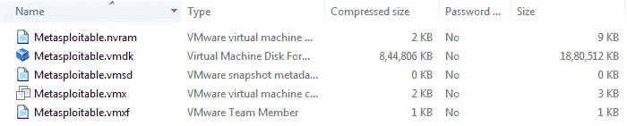

所以，我们将通过以下步骤创建一个新机器：

1.  要获取虚拟机，我们将点击“新建”，然后将其命名为`Metasploitable`并将其类型更改为 Linux 机器。接着，点击“下一步”，并仅为其分配 1GB 的内存。

1.  接下来，我们将使用现有的虚拟文件选项，这与我们创建 Kali Linux 时不同（即，当我们创建新的虚拟硬盘时）。这样做的原因是我们现在拥有的镜像实际上是为 VMware Player 设计的。因此，我们将导入硬盘文件或硬盘镜像，这样我们就能直接使用安装好的虚拟机，无需重新安装。我们只需使用现有的硬盘文件。我们将进入`Metasploitable`目录并选择`.vmdk`文件。

1.  点击“打开并创建”。我们现在就要启动虚拟机。以下是虚拟机启动并完全安装后的界面：

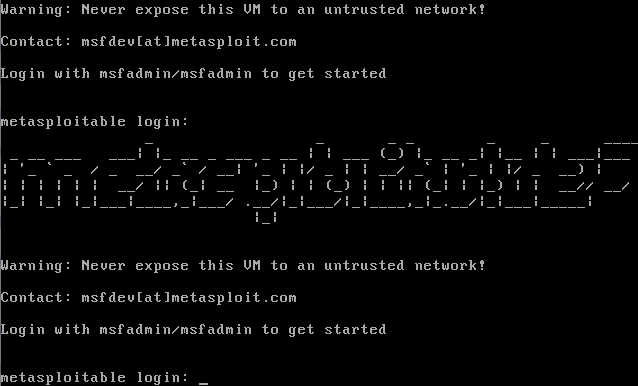

1.  我们不需要安装任何东西，因为我们只是导入了一个预先安装好的系统，一个准备好的硬盘。所以，现在它要求输入用户名`msfadmin`，密码是相同的。我们现在已经登录：

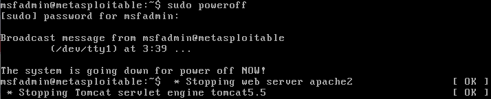

这个虚拟机只有一个终端，并且它会给出一个警告，告诉你绝对不应该将此虚拟机暴露给外部互联网连接，因为它是一个脆弱的机器，设计上就是容易被攻击。它只在我们的实验室内，作为虚拟机安装，这样外部的人就无法访问它，这是非常安全的使用方式。如前所述，在接下来的章节中，我们将讨论如何尝试入侵这台机器。不要被终端吓到，我们会频繁使用它，并且我们将一步一步学习如何使用它。

如果我们想关闭这台机器，只需要输入`sudo poweroff`命令——运行这个命令后，它会要求输入管理员密码，然后机器就会关闭：

# 安装 Windows

最后，我们将讨论安装的机器是 Windows 机器。这是一个普通的 Windows 机器，运行的是 Windows 10。这将是另一个受害者，我们将看到如何破解它。同样，我们安装 Metasploitable 是因为它有大量的漏洞，并且它的设计就是为了被攻击。它的终端不是很友好，也不能模拟普通用户。而 Windows 机器则将用于模拟普通用户的场景，比如一个用户只是用 Windows 浏览互联网或者做其他普通用户在机器上做的事情。

所以，微软实际上发布了免费的版本，或者免费的虚拟机，您可以下载并使用。这些都可以在微软的网站上找到。您可以在[`developer.microsoft.com/en-us/microsoft-edge/tools/vms/`](https://developer.microsoft.com/en-us/microsoft-edge/tools/vms/)下载它们。

所以，我们将通过以下步骤创建一台新机器：

1.  确保选择您的主机操作系统。如果您使用 Windows，点击 Windows 选项卡；如果您使用 Mac，则点击 Mac 选项卡，依此类推。

1.  从下拉框中选择 MSEdge on Win (10)，并确保选择 VirtualBox 镜像。这些都是允许我们安装虚拟机的应用程序。目前，我们使用的是 VirtualBox，所以只需确保选择 VirtualBox 镜像。完成后，您将得到一个名为`MSEdge.Win10.VirtualBox.zip`的 ZIP 文件。解压它，您将得到文件`MSEDGE-Win10TH2.ova`。

1.  双击 `.ova` 文件，VirtualBox 会要求你导入机器——它已经为你设置好了相关设置。你现在可以按原样导入，稍后再修改设置，Windows 就会安装完成。

1.  在启动之前，修改设置，将 RAM 改为 2 GB。然后我们可以启动它。Windows 会直接启动——它已经准备好，由微软提供给我们。

这里我们有一台完全正常运行的 Windows 机器，Windows 10，这将是我们在实验室中使用的第三台机器。它将是我们的第二台攻击机——我们的第二台受害者或目标机器。

# 创建和使用快照

既然我们已经创建了虚拟机，拍摄快照是一个不错的主意。快照允许我们存储当前虚拟机的状态，这样我们就可以回到或前进到某个特定状态。我们可以把快照想象成书签——例如，我们可以拍摄操作系统全新安装的快照，如果以后我们进行更新、配置或出现故障，可以回到全新安装的状态，或者恢复到出厂设置。我们也可以从那里前进到更新后的系统。我们可以随时拍摄快照，在不同的状态之间来回切换。

以下是拍摄快照的步骤：

1.  点击我们安装的 Kali Linux；创建快照非常简单。你只需要进入“快照”并点击顶部图标栏中的相机图标：

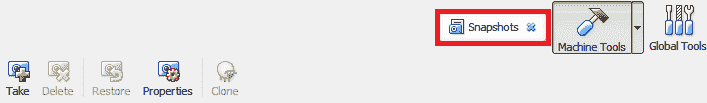

1.  它会要求我们命名快照，所以我们将其命名为`Fresh Install`，并且给出描述，说明这是一个没有更新的全新快照。给快照一个有意义的名称和描述总是一个好主意，这样将来我们才能记住快照的具体含义：

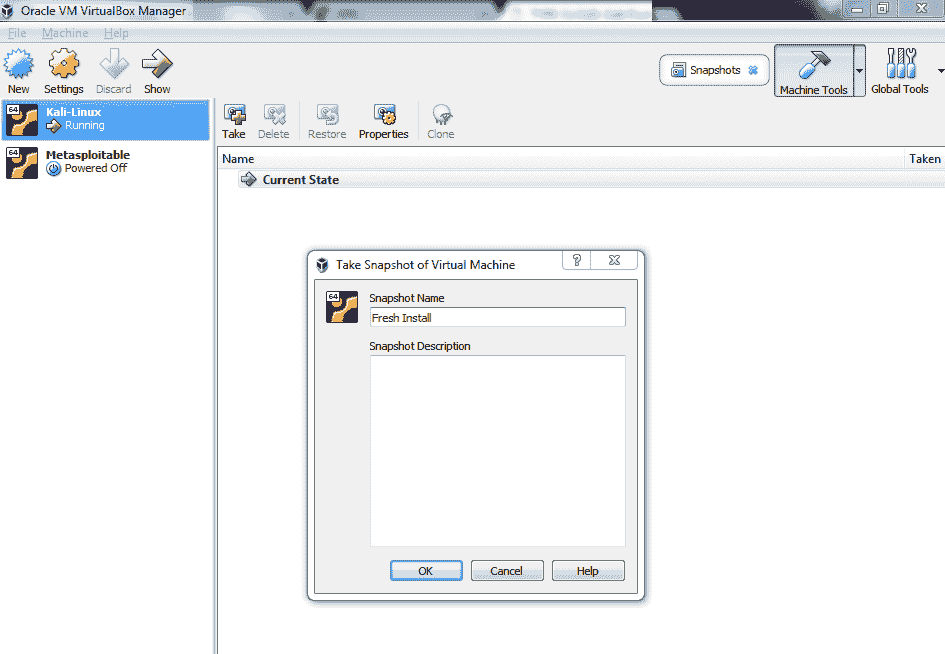

1.  所以现在我们完成了，可以点击“确定”，这时我们将得到当前状态。我们可以更新或安装程序，甚至安装库，如果我们破坏了某些东西并且/或者想回到全新安装的状态，我们可以点击“全新安装”来恢复。

现在，我们可以回到正常的细节并启动我们的虚拟机。接下来，我们将看到一个例子。让我们在 Kali Linux 中创建一个新目录——我们将其命名为`test`。假设我们实际上更新了系统；当我们更新系统时，某些程序可能没有像将要安装的库那样及时更新，这些程序可能会开始出现问题。如果发生这种情况，建议回退或降级到旧版本，而不是继续使用更新版本。

我们只需要回到全新安装的状态。我们刚刚创建了一个新文件来展示，一旦你回到之前的状态，一切都会恢复到修改前的样子。关闭 Kali 后，如果我们回到快照中，我们将看到当前状态（已经被修改的状态）。如果我们更新并且更新成功，我们还可以创建一个名为“已更新系统”的快照，并包括日期和描述，例如*无问题更新*。点击“确定”，我们将看到两个快照——全新安装和已更新系统。

如果更新后遇到问题，我们只需要点击我们刚创建的“全新安装”，然后点击恢复图标来恢复更改。现在，如果我们启动 Kali 机器，我们会看到我们创建的新目录消失了。我们回到了没有新目录、什么都没有的状态，实际上我们回到了 Kali 的全新安装状态，回到我们拍摄快照时的状态。

假设我们已经回到了全新安装的状态，出于某种原因，我们希望回到更新后的状态，以查看是否能解决问题（可能通过在网上找到解决方案）。如果我们想回到未来的状态，只需点击“已更新系统”，然后点击“恢复”，并且——无需从当前状态创建快照——启动机器。我们将回到更新后的状态，也就是我们创建新目录的状态，`test`目录。

如你所见，快照确实非常有用。它们允许我们标记操作系统的状态，以便我们可以在不同配置之间切换，随时切换。快照也非常有用，尤其是在安装了 Windows 时，因为 Windows 实际上提供了一个试用版本，如果未来出现问题，我们可以回到 Windows 的全新安装状态。

# 总结

在本章中，我们学习了如何使用 VirtualBox，它允许我们在自己的机器中安装像 Kali Linux 和 Windows 这样的虚拟机。我们还学习了如何安装 Kali Linux，它将作为我们整个书中的攻击机，以及如何安装我们的受害者机器——Windows 和 Metasploitable。最后，我们研究了快照是什么，以及它们如何帮助我们保留虚拟环境中过去的设置。

在接下来的章节中，我们将看到如何使用 Kali Linux 机器攻击 Windows 机器和 Metasploitable 机器。
