# 第三章：Linux 基础

本章将介绍 Kali Linux 的基础知识。我们将看到 Kali Linux 在作为虚拟机安装时的外观，并将详细解释 Kali Linux 的一些基本元素。此外，在本章后半部分，我们将学习在 Linux 终端中可以使用的不同命令。掌握这些命令后，我们将学习如何更新源以及如何在 Linux 上安装程序。

本章将涵盖以下主题：

+   Kali Linux 概述

+   Linux 命令

+   更新源

# Kali Linux 概述

现在我们已经安装了 Kali Linux，让我为你提供系统概述：什么是 Linux，文件系统结构，以及我们将要使用的一些基本应用程序。我们将现在查看系统概况，稍后我们将介绍一些命令，这些命令将在后面的章节中详细讨论。

# 状态栏图标

如你所见，在以下截图中，顶部有一个状态栏，靠近末尾（在应用程序菜单的左侧），有一个应用程序选项卡，用于访问 Kali Linux 默认预装的所有应用程序。这些应用程序按攻击类型分为不同的类别。我们可以看到以下分类：01 - 信息收集，02 - 漏洞分析，03 - Web 应用程序分析，04 - 数据库评估，08 - 利用工具，以及 07 - 逆向工程。这些都是可以用于渗透测试的应用程序类型：

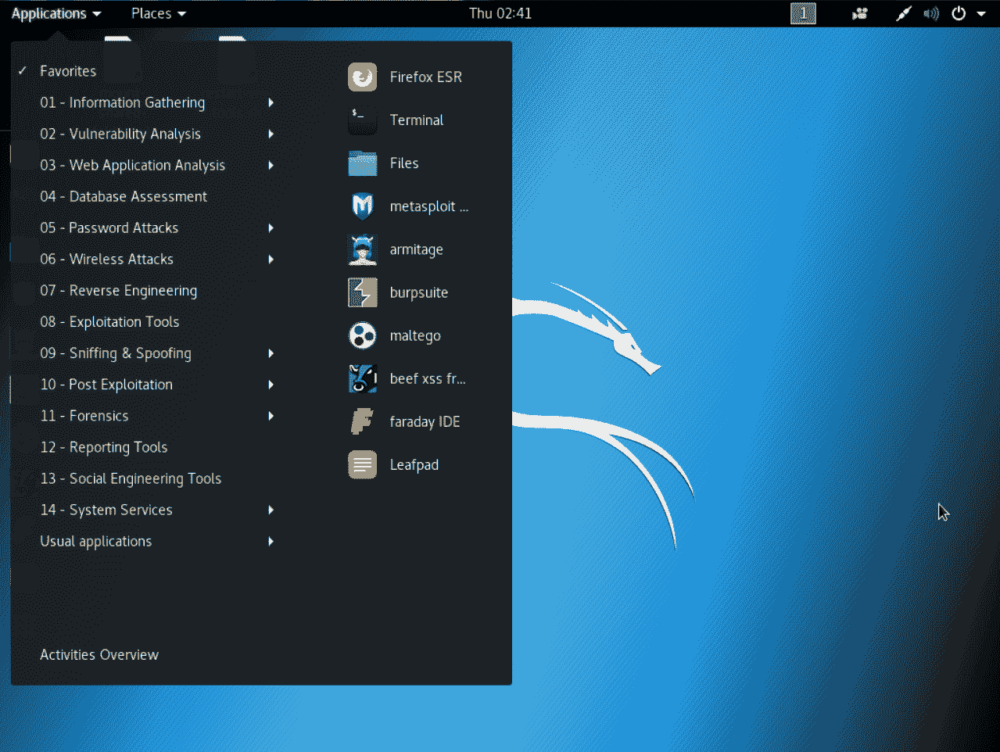

Places 菜单允许你访问文件系统——你将要使用的文件。这类似于 Windows 系统中的“我的文档”功能。如果我们点击计算机（Computer），可以访问所有文件和设备，但我们很少使用这个菜单；通常通过左侧竖直栏中的“主页”图标来访问它。如果我们进入 Places 菜单，然后点击“主页”，就能访问桌面、文档、下载、音乐等内容，方式与 Windows 或 macOS X 中类似。我们甚至可以看到回收站（Trash），那里就是你丢弃文件的地方。这只是一个基本的文件管理器，支持后退和前进，你可以双击文件来运行它，或者双击目录来打开它：

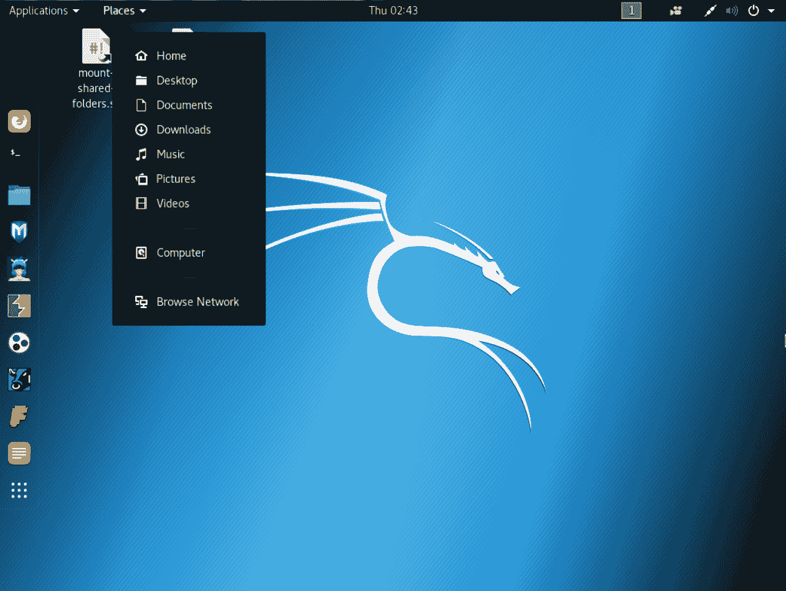

在右侧，有一个名为工作区（Workspaces）的图标，在这里，你可以看到多个桌面或工作区的数量。Linux 通常支持工作区，因此你可以在不同的工作区上打开不同的窗口；如果没有其他窗口打开，你无法使用下一个工作区。不过，例如，如果你在这里打开了文件管理器，你可以切换到下一个工作区，它会是空的，然后你可以在那里运行其他内容。你可以根据需要使用任意数量的工作区，且在它们之间切换非常方便。在我们进行渗透测试攻击时，我们将使用这些工作区。

现在，在工作区图标的右侧，如果你有多个键盘并且想在它们之间切换，你可以看到一个键盘图标：

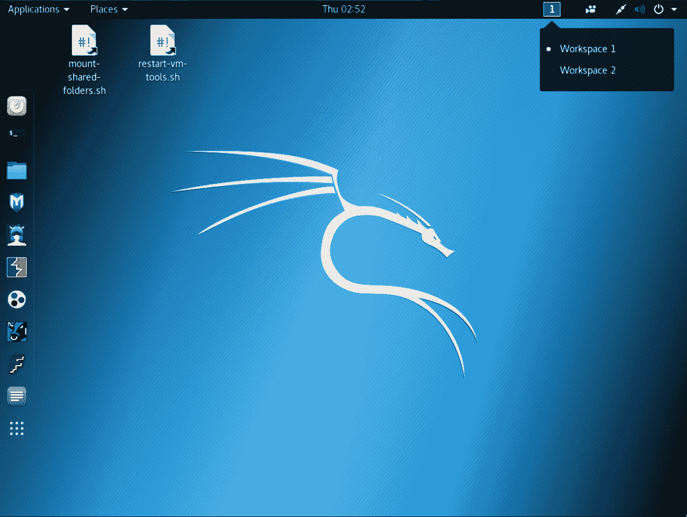

然后我们有网络图标，如下图所示。通过它，我们可以访问有线和无线网络。有一点需要注意的是，我们无法通过虚拟机访问内部无线网卡。我们已经将计算机的设置配置为通过 NAT 连接，这意味着它有互联网连接，但互联网连接是通过主机机器提供的。因此，实际上在这个设备和主设备之间设置了一个虚拟网络。这个设备仅因为主机提供的互联网连接而能访问互联网：

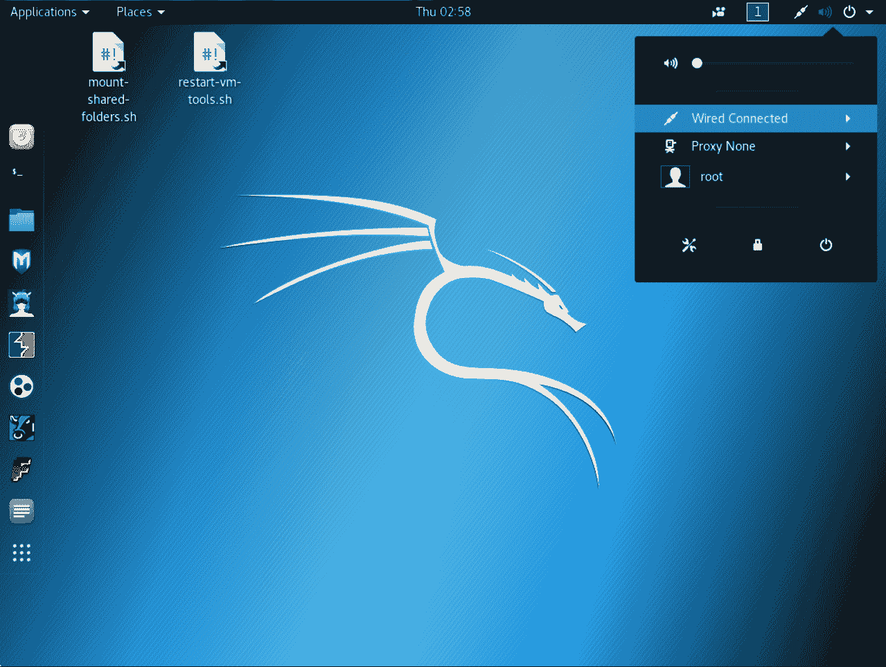

在这里，我们也可以通过相同的菜单更改音量；我们可以关闭计算机、锁定它，或进入偏好设置。这些只是常规的偏好设置，你应该熟悉它们。它们包括背景、通知、显示、鼠标和网络。接着是电池设置，可以通过状态栏访问。应用程序和位置是我们最常使用的对象，你可以从中访问你的网络设置。

# 连接无线网卡

如果我们连接了无线网卡，我们将能够看到可用的网络。如果我们想要连接无线网卡（我有一个 USB 无线网卡），我们可以按照以下步骤操作：

1.  转到菜单栏上的“设备”菜单，然后进入 USB。这一过程是一样的，无论你连接的是哪种 USB 设备（无线、存储棒等）。进入设备 | USB，然后选择你要连接的设备。

1.  所以我们连接了一个无线网卡，网卡使用的芯片组叫做 Ralink 802.11n WLAN [0101]。这是无线网卡，我们将点击它。这应该会将它连接到 Kali 机器：

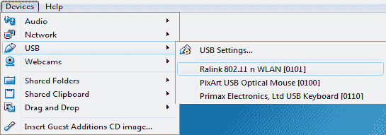

1.  转到状态栏上的无线图标，进入 Wi-Fi 未连接的“选择网络”选项，然后选择一个网络。接着，我们可以看到周围可用的网络，并且可以选择任何想连接的网络；只需要输入密码，按正常方式连接网络，就像连接其他任何网络一样：

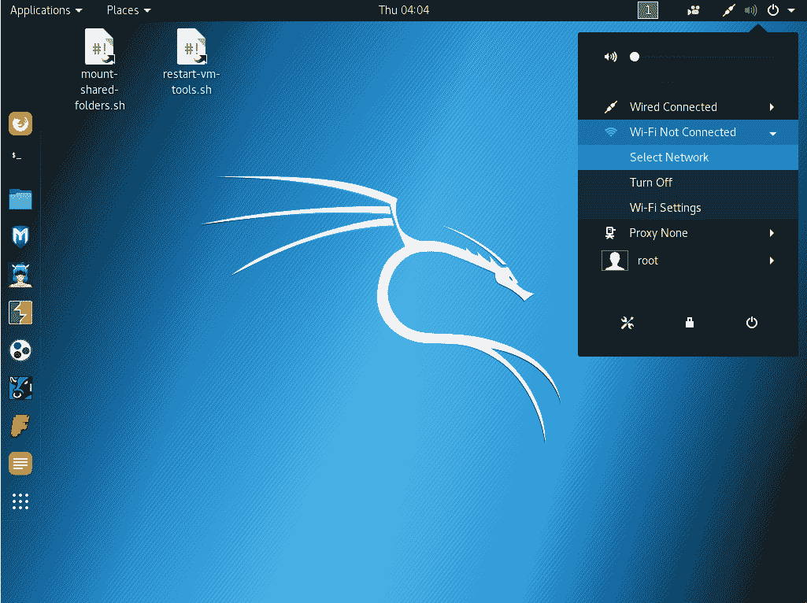

即使我们现在断开无线网卡，我们也会看到仍然有互联网连接，因为我们的主机（例如 macOS X）已经连接到网络，而这个虚拟机通过内部虚拟网络连接到 Mac 机器。所以，Kali Linux 附带的浏览器是 Firefox ESR，我们可以去 Google 检查一下，看看我们是否有互联网连接。

# Linux 命令

这些不是黑客命令；它们不是渗透测试命令。它们只是 Linux 中用来在操作系统上执行不同操作的命令。

这个关于终端如何工作的概述旨在让你更熟悉终端的结构、如何浏览目录等等。

现在，让我们来了解一下 Linux 终端。终端是你可以在操作系统上做任何事情的地方，通过执行与我们想要的程序相关的命令来运行任何程序。Linux 终端非常强大；它基本上允许我们做比图形界面更多的事情。我们将要使用的许多程序都有图形界面，但命令行要更简单、更快捷。而且，在许多场景下，你会在目标计算机上获得一个安全外壳（SSH）或命令提示符，你需要知道命令才能在计算机上执行你想做的事情，或进行渗透测试。

学习如何使用命令提示符非常重要。我们将在接下来的章节中频繁使用它，但现在，我们将提供一个非常简单的概述。它比通过图形界面操作要简单得多。使用它非常简单；你只需输入命令，结果就会以文本形式显示在屏幕上。

# 命令

以下章节展示了基本的 Linux 命令。

# ls 命令

`ls` 命令列出了当前工作目录中所有存在的文件和目录。所以它类似于 Windows 机器中的 `dir` 命令；它只是列出当前目录中所有存在的文件和目录：

```
ls
```

当我们执行这个命令时，它的输出列出了所有目录，如 `Desktop`、`Documents`、`Downloads` 和 `Music`：

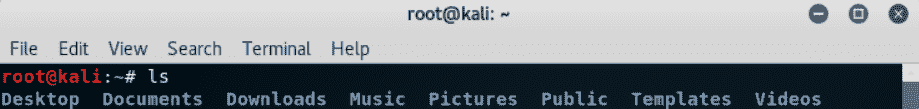

现在，让我们使用一些选项运行 `ls` 命令。我们将使用 `ls`，然后加上 `-l`，这样就会显示关于文件的更多信息。这基本上是我们之前运行的同一个命令，但正如我们在下面的屏幕截图中看到的那样，我们现在可以看到更多的信息。我们可以看到当前工作目录中存在的总条目数，我们还可以看到之前看到的相同目录，但我们还能看到它们的创建或修改日期。我们可以看到负责它们的用户、根用户，还可以看到权限：

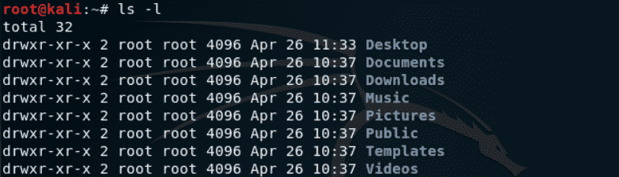

我们将在接下来的章节中深入了解权限。权限指定哪些用户可以做什么（读取、写入、执行）。这只是 `ls` 命令的一个示例。

# man 命令

其中一个最重要的命令，将来对你非常有用，是 `man` 命令。它代表**手册**。`man` 命令可以用来查询并获取任何其他命令的手册。例如，我们刚刚使用了 `ls` 命令列出了当前工作目录中所有存在的目录：

```
man ls
```

执行此命令后，它会显示`ls`命令的手册。如我们所见，它显示`ls`用于列出内容，因为它列出了文件和目录。我们还可以看到此命令实际上接受选项，因此它接受比仅仅`ls`更多的选项：

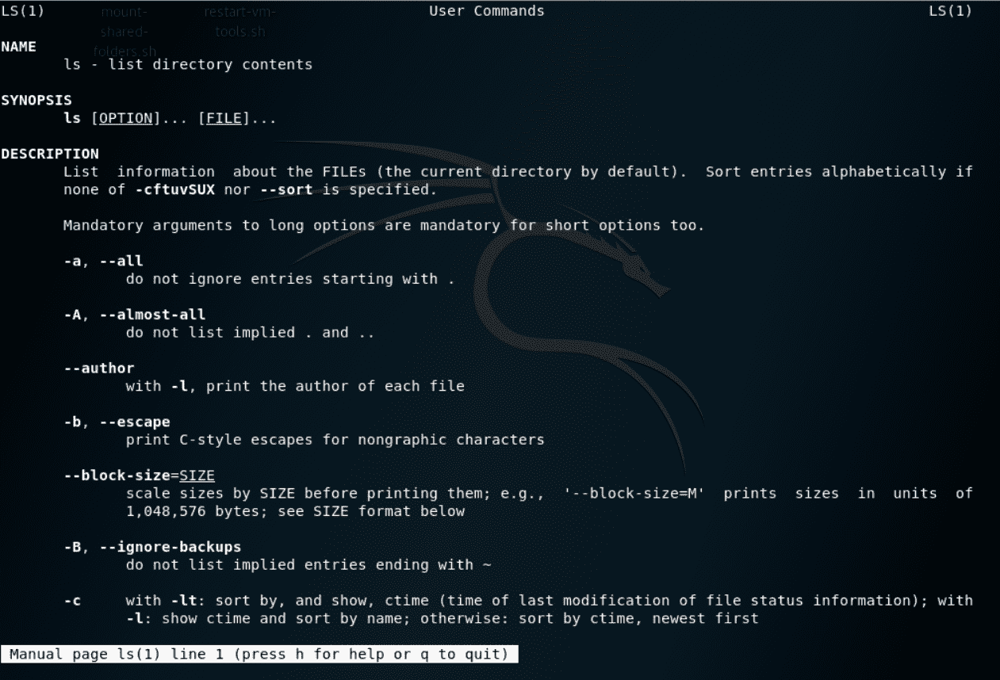

在上面的截图中，我们可以看到 Linux 中选项的格式；它要么是`-`字母缩写，要么是`--`，然后输入完整选项。例如，`--all`选项不会忽略以点开头的条目。如果我们按下或输入*Enter*键，手册就会继续向下滚动，直到你读取更多的信息。这些都是你可以用命令做的所有操作。我们可以看到，例如，`-l`使用长格式列出。要退出此命令，我们只需输入`q`，这样就会退出手册。

# `help`命令

另一个非常有用的选项是`--help`。我们再次使用`ls`，并执行`--help`命令。现在，`man`和`--help`几乎适用于所有命令，因此你可以使用`man ls`或`ls --help`，它将始终显示程序的帮助或手册页。所以，在执行前述命令后，在下图中，我们可以看到使用`ls`的帮助页面，它告诉我们所有`ls`命令的选项：

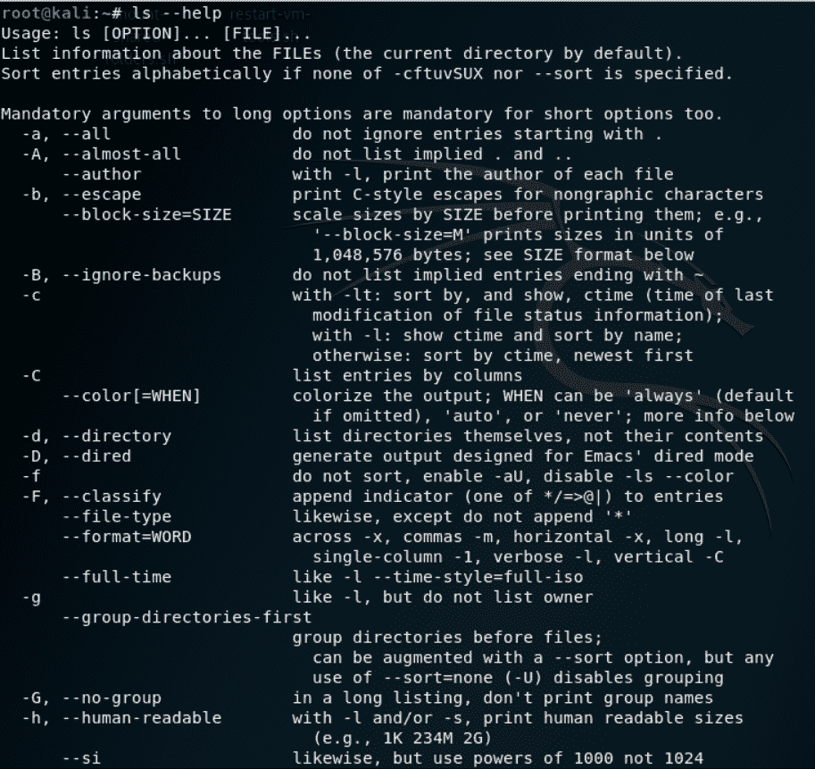

再次提醒，它是一个`-`或`--`，然后我们输入选项名称，就像之前那样。顶部显示关于命令功能的信息，并提供命令的格式，因此它应该以这种特定格式使用：`Usage: ls`。接着输入选项，然后决定是否对文件进行操作。它与`man`命令非常相似；有时候，程序没有`man`，而只有`help`命令。

如果我们遇到不确定如何使用的命令或程序，我们可以始终输入`man`和命令名称，或者命令名称和`--help`。在处理终端时，另一个有用的技巧是按上下箭头键可以查看命令历史记录。因此，我们可以通过上下箭头键在`man ls`、`ls -l`和`ls --help`命令之间切换。

# Tab 键

另一个非常有用的工具是键盘上的*Tab*键。如果我们正在输入一个命令，或者如果我们在寻找一个文件但不确定时，可以使用*Tab*键进行自动补全。例如，假设我们想输入一个文件名。首先创建一个文件；我们只需转到“文件”|“主目录”，因为现在我们要创建一个新文件。我们创建一个名为`test`的新文件夹。假设我们正在寻找与`test`文件夹相关的操作；可以使用`cd`命令将工作目录切换到另一个目录。

假设我们要进入`test`目录；我们可以使用命令，然后进入`test`目录：

```
cd test/
```

另一个有用的命令是`pwd`；它显示当前的工作目录。只需执行它，正如我们所看到的，我们现在在`root/test`目录下：

```
pwd
```

现在，如果我们想返回，可以使用`cd`命令，切换目录，并且，如果不输入目标目录名，我们可以直接输入`cd ..`。

这些只是一些基本命令，Linux 中有很多命令。同样，每个我们安装的程序都会有一个命令行版本，我们可以通过命令行访问该程序。许多我们将使用的程序甚至没有图形界面，因此我们需要通过终端来使用它们。别害怕，我们将来会详细讲解的。

# 更新资源

现在我们知道如何与终端和 Linux 基础知识互动，我们将看一些最终步骤：

+   更新源列表

+   安装`terminator`

+   安装所需的更新

进入 Kali 机器后，我想先给你展示的是如何以全屏模式查看机器。只需点击“视图”然后选择“全屏”，这样就会自动扩展所有内容并进入适当的全屏模式。

让我们来看一下 Kali Linux 中的包管理器。我们可以使用一个叫做`apt-get`的命令来安装程序。我们通常输入`apt-get`，然后，如果我们想安装某个程序，就输入`apt-get install`，后面跟上包的名称（即程序的名称）。在我们执行这些操作之前，我们需要先更新源；这个程序的工作方式是通过获取一系列的库文件。在全新安装的系统中，我们需要更新源，确保它有最新的库文件和可用程序。我们只需要使用`apt-get update`。这个命令不会更新系统，它只会更新可安装程序的列表：

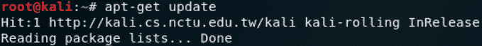

现在，一切都已经更新，我们可以开始安装程序了。我们将看一个安装有用终端应用程序`terminator`的示例。命令如下：

```
apt-get install terminator
```

按下*Enter*键；现在，它会询问我们是否真的要安装这个程序。我们通过输入`y`并按*Enter*键来确认，程序将自动下载并为我们安装：

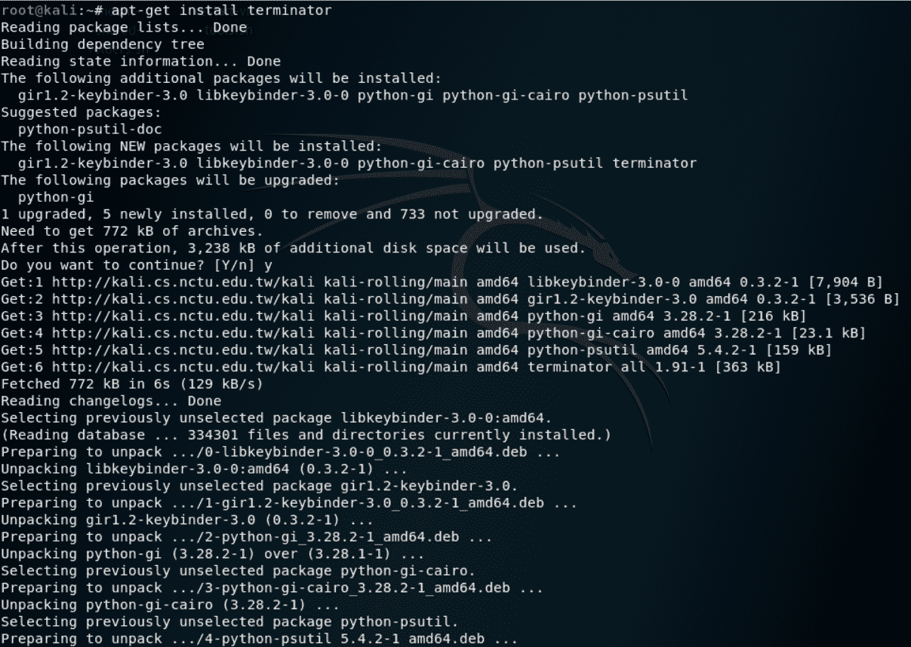

现在，我们可以继续尝试使用`terminator`。为此，我们将前往左侧菜单栏中的“应用程序”，并搜索`terminator`。我们将右键点击它并将其添加到“我的收藏夹”，这样它就会出现在桌面栏中。我们将打开它，它只是另一个终端应用程序。我们可以在这里增加文本的大小，实际上可以通过终端运行程序，使用我们之前展示过的任何命令。Terminator 的优点是我们可以分割屏幕，运行多个命令。如果我们右键点击屏幕，我们可以将其水平分割，我们可以同时拥有三个不同的窗口，分别运行三个不同的命令或程序。所以，这非常方便；它可以让你将来轻松很多。

另一个命令涉及到系统升级。在许多情况下，当我们升级系统时，我们会遇到一些问题，比如库文件损坏；当程序依赖的库已经更新而程序本身没有更新时，某些程序可能无法正常工作。如果我们遇到问题，我们可以恢复到之前的快照；但通常情况下，我们干脆不升级。如果有 Kali 的新版本，我们只是将其作为另一个虚拟机导入，而不是升级现有的 Kali 版本。

现在，如果你想升级你的系统，你只需输入`apt-get upgrade`。如果你按下*Enter*，它会告诉你会有大量的库和包被升级。如果你再次按下*Enter*，它将开始下载、安装并配置这些包，正如以下截图所示：

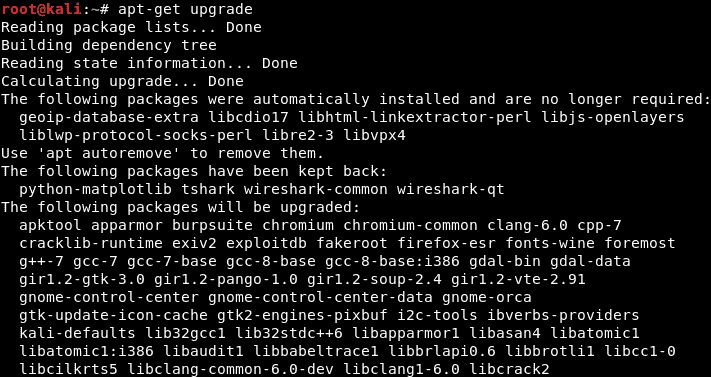

它可能会要求你配置一些内容，所以不要太冒险尝试更改一些设置——保持原样。再次强调，大多数时候，我们保持一切不变。

# 总结

在这一章中，我们了解了 Kali Linux 是什么，以及当它安装在虚拟机上时使用它的优势。之后，我们浏览了 Kali Linux 的图形界面，包括它所拥有的各种图标。然后，我们使用了几个将在未来章节中使用的 Linux 命令。最后，我们了解了如何更新系统的资源。

接下来的章节将重点介绍网络渗透测试。最初，我们将学习所有基础知识；之后，我们将学习可以在网络上执行的攻击。
