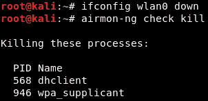

# 第四章：网络渗透测试

在本章中，我们将涵盖开始进行网络渗透测试所需的所有概念。我们将从网络是什么开始，看看两种类型的网络：有线和无线。随后，我们将学习如何将无线适配器连接到虚拟机。之后，我们还将了解什么是 MAC 地址，以及如何更改 MAC 地址的步骤。最后，我们将学习启用监控模式的方法。

本章将涉及以下主题：

+   什么是网络？

+   网络基础

+   连接到无线适配器

+   MAC 地址

+   无线模式——管理模式与监控模式

+   手动启用监控模式

+   使用`airmon-ng`启用监控模式

# 什么是网络？

我们将要覆盖的第一个渗透测试部分是网络渗透测试。我们将尝试访问的大多数系统和计算机都会连接到网络，无论是设备、计算机、手机，还是任何连接到互联网的设备。因此，在深入了解各种渗透测试之前，你需要学习设备如何在网络中相互作用，以及网络如何工作。

网络渗透测试可以分为四个主要部分：

1.  连接前

1.  获得访问权限

1.  连接后

1.  检测与安全

第一部分（连接前）和第二部分（获取访问权限）都针对无线网络。通常，对于无线网络来说，它有保护（加密），我们需要使用密钥才能连接到网络。有 WEP、WPA 和 WPA2 加密，我们将学习如何破解它们。我们还将了解在不连接网络的情况下可以执行的攻击类型，以及使用无线网卡可以做什么。

我们在前两部分中没有提到有线连接的原因是，要获得对有线网络的访问权限，你只需要一根以太网线。某些有线网络使用安全性保护，某些则使用 MAC 过滤，我们稍后会讨论这些——更改 MAC 地址非常容易。

第三部分才是有趣的开始——我们将学习如何嗅探网络数据包、如何控制连接、如何嗅探密码、用户名和 Cookies、如何将它们注入到浏览器中，并如何发起攻击，允许我们获得网络中任何设备的完全访问权限，无论是有线的还是无线的。第三部分适用于有线和无线网络，操作完全相同，无需更改配置。在最后一部分，我们将讨论如何保护自己免受攻击，以及如何检测攻击。

# 网络基础

在开始尝试入侵网络之前，我们需要了解一些基本知识。什么是网络？网络是多个设备通过连接共享数据的方式。这些数据可以是文件、资源（例如家庭网络上的资源），或者仅仅是连接到互联网的一种方式。

所有网络，无论是 Wi-Fi 还是有线网络，都通过相同的原理实现数据共享—一个作为服务器的设备，所有其他设备与之通信。服务器拥有资源，网络中的所有其他设备都可以访问服务器上的数据。在大多数 Wi-Fi 网络中，服务器就是路由器，所有设备都连接到路由器并通过它访问互联网。网络中唯一一个直接连接互联网的设备就是 Wi-Fi 路由器。

在下面的图示中，客户端 1、2 和 3 无法直接访问互联网，但它们可以通过路由器访问互联网：

例如，每当客户端 3 想要打开 Google 时，它会向路由器发送请求。路由器访问互联网，抓取[`www.google.com`](http://www.google.com)，然后将其转发回客户端 3。客户端 3 不能直接访问互联网—它必须通过路由器，路由器获取请求并将响应返回给客户端。所有这些数据—请求和响应—都是通过数据包传输的，因此在客户端和路由器之间会有很多数据包传输。在 Wi-Fi 网络中，这些数据包是通过空气传输的，因此它们是广播的。如果我们处于这些数据包的范围内，我们可以嗅探它们，捕获它们，并读取其中的所有信息。所有这些数据—无论是用户名、密码、视频、音频、音乐、图表等等—都是以数据包的形式传输的，并且始终在路由器和客户端之间传输。因此，如果我们捕获到这些数据包，我们就可以在我们的设备上读取所有信息。

# 连接到无线适配器

在本章的这一部分，我们将学习如何将 USB 设备连接到虚拟机。作为示例，我们将把一个无线适配器连接到 Kali 机器上，但同样的方法也可以用来连接任何 USB 设备。我们将在网络渗透测试的破解部分需要一个无线适配器，因为在后续章节中，我们将学习如何破解 Wi-Fi 网络的密码。除此之外，其他操作无需无线适配器。

无线适配器是一种通过 USB 连接到计算机的 USB 设备，它使我们能够与无线网络通信。如今，大多数计算机和笔记本电脑都内置了无线网卡。唯一的问题是，首先，我们无法从虚拟机访问内置无线网卡。其次，即使你将 Kali 安装为主机，内置无线网卡也不适合黑客攻击，因为我们需要一个支持监控模式和数据包注入的强大适配器（我们将进一步解释这些模式的含义）。基本上，内置无线适配器不支持这些模式，因此无法用于黑客攻击。

推荐使用强大的无线适配器。欲了解更多信息，请查看[`www.youtube.com/watch?v=0lqRZ3MWPXY`](https://www.youtube.com/watch?v=0lqRZ3MWPXY)。

现在，我们将通过以下步骤将适配器连接到 Kali：

1.  我们需要打开 VirtualBox（如果已经打开，它会显示在屏幕的左侧），然后点击我们希望连接适配器的虚拟机。

1.  接着，我们进入设置 | USB，并确保启用 USB 控制器选项已勾选；如果没有，点击启用 USB 控制器：

1.  现在，我们需要选择适配器使用的 USB 硬件类型——USB 1.0、2.0 或 3.0。然后，我们点击加号（+）按钮：

1.  我们会看到有许多设备可以连接到 Kali 虚拟机。首先，我们连接适配器，仅仅是为了查看可用的设备。我们看到的名称是适配器内部使用的芯片组名称，而不是适配器本身的品牌名称。当我们点击它时，会看到一个新的条目叫做 ATHEROS——这实际上是我的无线适配器，一个 Alpha AWS 036NHA。我们点击它，然后点击确定，适配器就添加到 Kali 上了：

在我们开始使用 Kali 之前，我们需要安装扩展程序，以便 VirtualBox 可以使用 USB 设备。你可以在 [`www.virtualbox.org/wiki/Downloads`](https://www.virtualbox.org/wiki/Downloads) 下载这些扩展程序，你会看到有一个 VirtualBox 扩展包的链接。这些扩展包仅适用于 VirtualBox 5.1.22 及以上版本。

如果你使用的是不同版本的 VirtualBox，可以通过访问 VirtualBox | 关于 VirtualBox 来查看你的版本；如果你使用的是 Windows，则需要访问文件 | 关于 VirtualBox。在那里你可以看到版本号。如果在链接中找不到最新版本，你需要访问 VirtualBox 的旧版本页面，找到 5.0 版本，并下载 5.0.20 版本的扩展包。下载与您的版本兼容的扩展包。

下载完成后，它会保存在你默认的下载位置。你只需双击它进行安装。如果你已经安装过，它会弹出重新安装的提示；否则，它会显示一个安装按钮。如果你正在重新安装，你需要向下滚动并同意相关条款，并输入密码。完成后，扩展包将被安装。

在启动虚拟机之前，我们将物理上断开无线适配器的连接，等到 Kali 完全加载后再连接适配器。启动 Kali 虚拟机，输入用户名 `root` 和密码 `toor`。现在，Kali 已经完全加载，我们可以物理连接无线适配器。这样做是为了避免冲突。一旦适配器连接并且虚拟机启动，我们将通过打开终端并输入 `ifconfig` 命令来确认适配器是否已连接。此命令列出所有连接到计算机的接口，正如以下截图所示，它应该列出一个名为 `wlan0` 的适配器，这是无线适配器：

如果你点击屏幕右上角的电源图标，你会看到一个“Wi-Fi 未连接”选项，可以用来连接 Wi-Fi 网络：

我们不需要连接到任何 Wi-Fi 网络，因为我们已经设置了一个 NAT 网络，Kali 通过该 NAT 网络已经可以访问互联网。我们只需要无线适配器来入侵其他网络并破解它们的密码。

# MAC 地址

在本节中，我们将学习 MAC 地址。每个网卡，无论是 Wi-Fi 卡还是有线网卡，都有一个由卡制造商分配的物理静态地址，这就是 **媒体访问控制**（**MAC**）地址。MAC 地址写在卡上，并且是物理的，因此永远不会更改。它用于设备之间的识别，并且用于将数据包传输到正确的方向。这是因为每个数据包都有源 MAC 地址和目标 MAC 地址，并从源地址传输到目标地址。

由于 MAC 地址是静态的并且永不更改，因此它可以用来追踪和识别设备。而且，由于设备使用 MAC 地址来相互识别，我们可以设置一些只允许特定 MAC 地址连接的网络（通过使用白名单），或者将 MAC 地址列入黑名单，使其无法连接到网络。更改 MAC 地址可以帮助你通过进入白名单连接网络，或绕过黑名单。更改 MAC 地址的唯一方法是将其更改为 RAM 中的地址——因此它只会在当前会话中更改，重启后需要重新更改。

现在，让我们更改 MAC 地址；步骤如下：

1.  我们将使用一个名为 `macchanger` 的工具。首先，为了获取 Wi-Fi 卡的名称，只需输入 `iwconfig`，它将显示所有无线网卡。在以下截图中，`eth0` 没有无线扩展，`lo` 同样如此；我们可以看到 `wlan0` 是无线网卡：

1.  我们将禁用无线网卡，使用 `ifconfig wlan0 down` 命令。

1.  现在，我们将使用一个名为`macchanger`的工具来更改 MAC 地址。使用这些工具时，查看帮助部分总是个好主意；只需进入终端并输入`macchanger --help`，我们就可以看到所有可以与该工具一起使用的选项。你可以使用`--help`和`--version`来显示帮助和版本，`--show`来显示当前的 MAC 地址，`-e`可以防止更改供应商字节（MAC 地址的制造商）。另一种方法是尝试一个相同类型的随机供应商 MAC（`-A`只是为了设置一个随机供应商）。`-p`选项将重置原始的永久 MAC 地址，因此如果我们更改了 MAC 地址并想再次使用旧的地址，我们可以使用`-p`。`-r`选项将为我们提供一个随机的 MAC 地址，而`-l`将打印出我们可以使用的已知供应商。`-m`选项将帮助我们选择自己的 MAC 地址：

如果有白名单，我们将学习如何查看所有连接的设备；例如，对于你的目标网络，三个设备已连接，而目标网络只允许三个设备连接。我们可以直接取一个白名单中的 MAC 地址，更改它，并使用它。

1.  要更改 MAC 地址，首先我们需要通过使用`ifconfig wlan0 down`命令禁用`wlan0`无线网卡。我们可以使用`--random`选项来通过`macchanger`设置一个随机的 MAC 地址。命令就是`macchanger --random wlan0`。如果需要，我们可以使用`m`来指定自己的 MAC 地址。按下*Enter*后，我们可以看到原始的 MAC 地址被更改为`5a:c4:0c:9a:ac:79`：

现在，我们的无线网卡已经准备好，并且我们已经更改了它的 MAC 地址。

1.  现在我们需要重新启用无线网卡，因为我们之前禁用了它。所以，我们将做相反的操作；我们将使用`ifconfig wlan0 up`。就这样；网卡已启用，并且其 MAC 地址已被更改。让我们在下图中查看一下；如果我们输入`ifconfig wlan0`，现在可以看到新的 MAC 地址：

# 无线模式 – 管理模式和监控模式

现在我们知道 MAC 地址是用来确保数据包走向正确方向的，因此每个数据包都有一个源 MAC 和一个目标 MAC，它从具有源 MAC 的设备流向具有目标 MAC 的设备。这就是无线网卡在默认模式下的工作方式。所以，如果我们进入 Kali 机器并使用`iwconfig`，在下图中，你可以看到我们有一个无线网卡，名为`wlan0`，而且默认模式是称为管理模式：

所以，基本上，在这个模式下，我们的无线设备将只接收数据包，或者只会尝试捕获那些目标 MAC 地址是我们设备 MAC 地址的数据包。它只会捕获实际发送到我们计算机的数据包。

然而，我们想要做的是使它能够捕获我们周围的任何数据包——任何在我们范围内的数据包。为此，我们将使用一种叫做监视模式的模式。它指示无线网卡捕获周围的所有内容，即使目的 MAC 地址不是我们的 MAC。基本上，我们将能够捕获我们范围内的所有数据包，即使它们并不是发送给我们设备的。

启用监视模式的方法不止一种；我们将在本章讨论三种方法，从最基础的方法开始。在某些情况下，监视模式已启用，但当我们实际执行攻击时，攻击不会成功。此时我们可能需要尝试另一种启用监视模式的方法。

现在我们将讨论第一种方法，使用`airmon-ng`来实现。首先，我们输入`airmon-ng`，如以下截图所示，它列出了可用的无线网卡：

我们有一个无线网卡，名为`wlan0`，所以我们将在这个接口上启动监视模式，命令是`airmon-ng start wlan0`。这个操作非常简单；`airmon-ng`是程序的名称，`start`用于初始化监视模式，`wlan0`是无线网卡的名称，也就是接口名。我们现在已经在`mon0`上启用了监视模式，因此在接下来的章节中，任何需要使用监视模式的地方，我们都将指定`mon0`作为接口：

不是所有的接口名称都相同，所以它可能被称为`wlan0mon`或其他名称；这没关系，只要记得以后使用启用了监视模式的名称即可。如果我们使用`iwconfig wlan0mon`，我们会看到（如以下截图所示），模式现在是监视模式，而不是管理模式：

这意味着我们可以使用这张卡捕获我们范围内的任何数据包，即使该数据包不是发给我们设备的，也即使它的目的 MAC 地址不是我们设备的 MAC 地址。

需要注意几点：

+   首先，当我们启用监视模式时，网卡会失去连接。所以，如果它之前连接到了无线网络，它将会断开连接。这是正常的，因为网卡将不再处于管理模式，而是会捕获它所能接收到的所有数据包，而不是仅仅捕获指向它的数据包。这没关系，因为当我们启用监视模式时，我们实际上是想攻击其他网络或捕获我们没有密码的网络的数据包。所以，失去互联网连接是完全正常的。

+   接下来要确保使用启用了监视模式的名称。如前所述，这个名称是`wlan0mon`；它会根据系统不同而变化，因此一定要使用`airmon-ng`命令显示的名称。

+   第三点是，如果我们启用监控模式并在将来进行攻击时，结果不如预期，我们可以返回并尝试其他启用监控模式的方法。

如果我们想停止监控模式，可以使用`airmon-ng stop wlan0mon`命令。现在，监控模式已被禁用，如下图所示，我们可以在管理模式下使用`wlan0`连接到网络并正常使用：

# 手动启用监控模式

随着`aircrack-ng`的最新更新，`airmon-ng`在某些无线网卡上停止工作。它实际上会显示它已在`wlan0mon`上启用监控模式；所以，它将不再仅使用`mon0`，而是开始称无线网卡为`wlan0mon`。当我们尝试使用这张卡时，即使该卡支持监控模式，它可能在监控模式下无法正常工作。目前，在 Kali 2.1 版本中，建议使用不同的方法来启用监控模式。这个方法实际上是手动启用监控模式的方法。

我们的无线网卡是`wlan0`，让我们来看一下它。我们使用`iwconfig wlan0`命令；执行命令后，可以在下图中看到无线网卡：

如前图所示，`wlan0`现在处于管理模式。所以，我们要做的是通过手动方法启用它。我们将使用`ifconfig wlan0 down`命令禁用卡，就像我们在上一个方法中做的那样，然后卡会被禁用。

接下来，我们的命令是启用卡的监控模式：它是`iwconfig wlan0`，卡的名称，然后是`mode monitor`。非常简单：`iwconfig wlan0 mode monitor`。然后，我们按*Enter*，就完成了。

现在，如果没有错误信息，说明命令执行成功。然后我们可以再次启用卡，因此我们将执行`ifconfig wlan0 up`命令，将卡启用。如果我们使用`iwconfig wlan0`，卡会进入监控模式：

所以，在这一部分中，我们实际上使用了启用监控模式的旧方法，如果我们使用了`airmon-ng`，那么我们将使用`wlan0mon`作为监控模式下的卡，但如果使用旧方法，则`wlan0`将处于监控模式。我们将使用`wlan0`而不是`wlan0mon`，因为监控模式现在已在`wlan0`上启用。

这张卡现在工作正常，并且已启用监控模式。我们可以选择任何我们想要的方法，但这种方法适用于所有卡，而`aircrack`和`airmon-ng`方法只适用于某些卡。

# 使用 airmon-ng 启用监控模式

到目前为止，我们已经学习了两种启用监控模式的方法，接下来我们将学习第三种方法。所有这些方法的目标都是相同的，都是启用你的无线网卡的监控模式。哪种方法对你有效取决于你的操作系统、主机系统以及无线网卡的兼容性。在很多情况下，所有方法都会启用网卡的监控模式，但并非所有攻击都会成功。有时候，注入可能无法成功，或者创建虚假接入点可能会失败——这些问题我们将在后续章节中学习，所以现在不用太担心。

基本上，关键点是：如果我们知道我们的网卡支持注入（例如它是 036H 或 036NHA 这样的 Alpha 网卡，或者其他已知支持注入的网卡），但注入效果不好，那么我们可以拔掉网卡，再重新插回去，并尝试另一种启用监控模式的方法。到目前为止，你已经学会了两种方法，接下来我们将学习第三种方法。

如果前面的方法对你有效，就继续使用它；如果无效，那就试试这个方法。我们已经连接了无线网卡，它的名字叫做`wlan0`。接下来，我们将像往常一样禁用网卡，使用`ifconfig wlan0 down`，并运行一个命令来终止可能干扰启用监控模式的服务。这个命令是`airmon-ng check kill`；如你在以下截图中看到的，它终止了三个`airmon`认为可能干扰启用监控模式的进程：

现在，我们将按照第一种方法启用监控模式，使用`airmon-ng start wlan0`命令。现在，监控模式已经在`wlan0mon`这个虚拟无线接口上启动，我们可以使用`iwconfig`命令进行检查；此时，它就处于监控模式：

如我们所见，所有这些方法都可以启用监控模式，未来我们将在不同的攻击中使用监控模式。如果某个攻击失败，我们只需拔掉网卡，再重新插回去，尝试另一种启用监控模式的方法。希望其中某一种能够生效，然后我们就能继续进行攻击。

# 总结

在这一章中，我们学习了什么是网络以及它是如何工作的，还学习了基本的网络术语，以及如何将无线适配器连接到虚拟的 Kali 机器上。大部分情况下，我们只需要这个适配器来进行网络渗透测试，破解密码。我们还了解了 MAC 地址这一重要概念，它是每台机器的唯一标识。此外，我们还了解了如何修改 MAC 地址，以便在黑客攻击时不被追踪。最后，我们学习了如何使用三种不同的技巧来启用监控模式。

在下一章中，我们将学习如何进行网络渗透测试。
