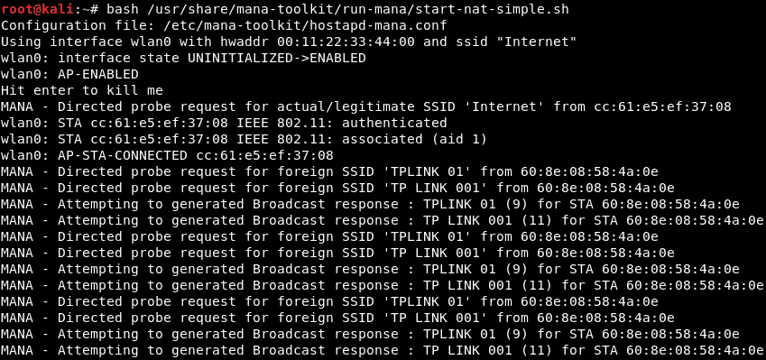
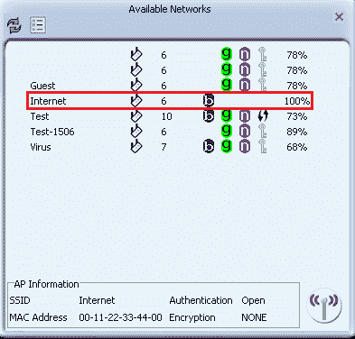

# 第五章：连接前攻击

在本章中，我们将重点介绍网络渗透测试的第一部分——即连接前攻击。为了执行这些攻击，我们将了解基础知识；我们将学习嗅探的概念。一旦我们对嗅探有了清晰的理解，我们将研究有针对性的包裹嗅探，以及嗅探的一个重要工具——Wireshark 工具。然后，我们将发起第一个攻击：去认证攻击。最后，我们将创建一个假接入点。

在本章中，我们将讨论以下主题：

+   包裹嗅探基础

+   有针对性的包裹嗅探

+   去认证攻击

+   什么是假接入点？

+   使用 MANA 工具包创建假接入点

# 包裹嗅探基础

在上一章中，我们将 Wi-Fi 卡设置为监控模式，这样我们就可以嗅探到我们 Wi-Fi 范围内的包裹，即使它们没有直接连接到我们的设备，甚至我们没有通过用户名和密码连接到网络。现在，我们将使用一个名为`airodump-ng`的工具，它是 Aircrack-ng 工具套件的一部分。它是一个包裹嗅探器，可以让我们捕获周围的所有包裹。我们可以对周围的所有网络运行它，并收集我们范围内的任何包裹。我们还可以将它针对特定的**接入点**（**AP**）运行，这样我们只收集来自某个 Wi-Fi 网络的包裹。

首先，让我们看一下如何运行这个程序。你需要将 Wi-Fi 卡设置为监控模式；在我们的例子中，Wi-Fi 卡的名称是`wlan0`。所以，我们将运行`airodump-ng wlan0`命令——就是这么简单。启用了监控模式的 Wi-Fi 卡名称是`wlan0`。正如你在下面的截图中看到的，这将列出我们周围的所有网络：


`airodump-ng`的另一个用途是识别所有连接到我们周围网络的设备。

我们可以按*Ctrl + C*停止嗅探。我们没有保存我们嗅探到的包裹，因此没有必要分析它们——我们只是对周围的 AP 运行了`airodump-ng`，以查看有哪些网络并收集有关它们的信息。从前面的截图中，我们可以看到周围有相当多的网络。

在前面的截图中，有一些我们需要熟悉的参数，以便我们可以分析输出：

+   `BSSID`是 AP 的 MAC 地址；正如我们所知，每个网络设备都有一个 MAC 地址。

+   `PWR`是功率——表示 AP 距离我们 Wi-Fi 卡的远近。`Test`是我们将要针对其执行一些攻击的测试路由器。往下看，你可以看到网络越来越远。网络越近，你嗅探包裹的难度就越小。网络越近，攻击越有效，你越能快速访问并实现目标。

+   `Beacons` 是 AP 发送的信号；每个 AP 都会发送某种类型的数据包，告知周围的客户端它的存在。所以，即使网络是隐藏的，它仍然会发送这些信标包，告诉周围的人它存在。我们的 `BSSID` 是 `EC:1A:59:5A:E1:46`，并且我们当前信号强度是 `-34`。因此，`50` 是每个 AP 发送的 `Beacons` 数量。

+   `Data` 是我们嗅探到的有效数据包的数量；我们稍后会详细讨论这个，特别是在研究 WEP 解密和加密时。

+   `S` 是我们在过去 10 秒内收集到的数据包数量；如我们所见，这里显示的是 `0`，意味着过去 10 秒内没有收集到数据包。

+   `Channel` 是 AP 所广播的频道数。每个 AP 都会在某个频道上广播，以避免相邻的 AP 之间发生干扰。假设我们有一个 AP，五米外有另一个，如果它们使用相同的频道，就会发生干扰，两个 AP 之间的信号会减弱，从而缩短它们的信号范围。

+   `MB` 是该 AP 支持的最大速度；它最高可以达到 `54`。

+   `ENC` 是 AP 使用的加密类型；我们有 WEP、WPA 和 WPA2 加密。如果是开放网络，我们会看到 `OPN` 作为加密类型。

+   `CIPHER` 是用来解密数据包的密码。对于 WEP，它是 `WEP`，但对于 WPA2，它可以是 `CCMP` 或 `TKIP`；我们稍后会在讨论 WPA 破解时提到这些。

+   `AUTH` 是该 AP 所需的认证类型。我们可以看到 **预共享密钥** (**PSK**)，还可以看到 `MGT`。我们稍后会在讨论 WPA 破解时提到这些。

# 定向数据包嗅探

你现在已经了解了嗅探的基本概念。一旦我们有一个（或一组）网络需要目标，最好只在那个网络上运行 `airodump-ng`，而不是在我们周围的所有网络上运行它。在本节中，我们将展示如何做到这一点。

我们目前正在运行 `airodump-ng` 来监控我们周围的所有网络；我们将针对 `BSSID` 为 `EC:1A:59:5A:E1:46` 的网络。那是我们的测试网络，名为 `Test`。我们将只对该网络进行嗅探。

为了做到这一点，我们将使用相同的程序。命令如下：

```
airodump-ng --channel 10 --bssid EC:1A:59:5A:E1:46 --write test-upc wlan0
```

我们需要指定频道。这里的 `--channel` 是频道号 `10`，如前面的代码片段所示；`--bssid` 应该是目标网络的 MAC 地址。我们将添加一个 `--write` 选项，这告诉 `airodump-ng` 将捕获的所有数据包记录到一个文件中。我们还需要一个文件名，可以将其命名为 `test-upc`。然后我们输入我们 Wi-Fi 网卡的名称（在监控模式下），它是 `wlan0`。

然后，我们按*Enter*键，正如你所看到的，唯一显示的网络是`Test`，没有其他网络列出。在前面的截图（*目标数据包嗅探*部分）中，我们有太多网络，所以并不是所有信息都能显示出来。

在下面的截图中，正如我们所见，前面章节中看到的所有参数包含了所有在我们 Wi-Fi 范围内的 AP，这一部分内容：


现在，前面的截图包含了所有与 AP 关联的客户端；当我们看到`EC:1A:59:5A:E1:46`时，那就是客户端连接的网络的 MAC 地址。第一部分中的 MAC 地址与第二部分中的 MAC 地址相同。这意味着该客户端连接到网络`EC:1A:59:5A:E1:46`。`STATION`是客户端的 MAC 地址——连接到网络的设备的 MAC 地址。`PWR`是我们与设备之间的距离，`Rate`是设备运行的最大速度。`Lost`是我们丢失的数据包数量（我们无法从目标设备捕获的），而`Frames`是我们从该设备收集到的有效数据包数量。关于帧和数据的更多内容，我们将在学习 WEP 破解时讨论，详见第六章，*网络渗透测试 - 获取访问权限*。

`airodump-ng`的第一个主要部分是我们 Wi-Fi 范围内的接入点（AP），第二个部分是与这些 AP 关联的客户端。我们还可以看到 AP 的 MAC 地址和实际客户端的 MAC 地址。现在，我们将使用*Ctrl* + *C*来停止嗅探。所有数据已经记录到名为`test-upc`的文件中，我们将使用`ls`命令来列出 Linux 中的文件；如果在其后添加`*`，我们将看到`airodump-ng`自动创建了四种文件格式：


在我们的命令中，我们只指定了文件名为`test-upc`；`airodump-ng`自动在文件名后加了`01`，以防有另一个文件使用了相同的名称。我们可以看到四种不同的文件格式——`CAP`、`CSV`、`KISMET`和`KIDMET XML`。

如果我们执行`pwd`，我们将看到我们在`root`目录中。嗅探完数据包后，我们可以使用 Wireshark 等程序来分析数据包，查看收集到的信息。这个特定网络的问题是它使用了 WPA2 加密，所以所有数据包都被加密，除非我们有密钥，否则无法解密它们。我们将在本书的后续章节中讨论如何破解这个密钥。

我们将在本书的第七章，*连接后攻击*中讨论如何使用 Wireshark，所以目前，我们只是运行 Wireshark，快速浏览一下数据包的显示方式。它们目前没有用，因为它们是加密的。

我们将通过执行`wireshark`命令打开 Wireshark 工具，然后转到选项文件 | 打开，如下图所示：


在`/root`目录中查找`test-upc.cap`文件：


打开捕获文件后，我们可以看到一些信息——例如，源设备是以下截图中的 Belkin 设备：


我们还可以看到（在前面的截图中）有一台设备与 Belkin 进行通信；显示了 MAC 地址、设备以及制造商。这些信息非常简单，因为网络是加密的。如果是开放网络，我们可以直接连接，并跳转到有关渗透测试的进一步章节。目前，我们只是希望你能看到加密网络中数据包的样子。将来，你将学习更多相关内容。

# 去认证攻击

在本书的这一部分，我们将讨论可以在任何处于我们 Wi-Fi 范围内的网络上发起的攻击，即使该网络有加密或使用了密钥。我们不需要连接到网络就能发起这些攻击。

去认证攻击非常有用；它们允许我们断开任何处于我们 Wi-Fi 范围内的设备与网络的连接。为了执行这些攻击，我们伪造自己的 MAC 地址来获取目标 MAC 地址（目标是我们想要断开的客户端）。我们假装自己是客户端，然后向路由器发送去认证数据包，告诉路由器我们希望断开连接。同时，我们将自己的 MAC 地址伪造为 AP 的 MAC 地址，告知目标客户端需要重新进行身份验证。然后，连接将丢失。

让我们看看如何使用一个名为`aireplay-ng`的工具来实现：

1.  首先，我们需要在目标网络上运行`airodump-ng`，因为我们想查看哪些客户端已连接到该网络。这一次，我们不需要`--write`选项，所以我们会去掉它。我们只需要`airodump-ng`，`--channel`（我们指定目标网络的频道），以及`--bssid`（目标网络的 MAC 地址）。命令如下：

```
airodump-ng --channel 10 --bssid 00:10:18:90:2D:EE wlan0
```

我们按下*Enter*键，并开始嗅探目标网络`Test`。这种方法适用于任何设备，无论是 Linux、Windows、Mac 还是 Android 设备——都没有关系；它们使用相同的数据包传输方法：


现在，我们将运行`aireplay-ng`，将其中一台设备与网络断开连接。我们可以运行它来断开所有设备，但我发现，当我们这么做时，并不能真正断开所有设备，因为目标设备太多，无法全部断开。所以，我们将选择一个目标设备，即设备`6C:C4:D5:6F:A6:DC`。

1.  使用`aireplay-ng`，我们将添加`--deauth`（用于去认证攻击），然后输入我们将发送的去认证数据包数量；我们会输入一个非常大的数字，以保持设备断开连接。接着，我们将输入目标 AP（我们目标 AP 的 MAC 地址），以及源（或客户端的 MAC 地址），即我们想要断开连接的设备。我们还会包括`wlan0`，即我们处于监控模式的 Wi-Fi 卡。如果我们按下*回车*，`aireplay-ng`将开始发送去认证数据包。命令如下所示：

```
aireplay-ng --deauth 10000 -a EC:1A:59:5A:E1:46 -c 6C:C4:D5:6F:A6:DC wlan0
```

输出将类似于以下内容：


去目标设备，看看它是否仍然有互联网连接。我们将看到它失去了连接，并且正在尝试重新连接；它将无法重新连接，因为我们仍在发送去认证数据包。我们可以对我们选择的任何网络发起这种攻击；我们不需要知道密码或密钥。

# 什么是假冒接入点？

基本上，假接入点是一个看起来对用户正常的 AP，而且没有加密，这样人们就可以连接而无需输入密钥。它是一个开放网络，并且应该有一个互联网连接，以吸引人们连接。我们为什么要创建一个假接入点？好吧，如果我们创建了一个，就会吸引大量的人连接到网络并访问互联网。他们将登录自己的账户，我们可以通过数据包嗅探捕捉到他们登录的信息。

创建一个 AP 很简单；只需要正确设置，这样 AP 就能正常工作。我们需要的第一件事是两张卡：

+   需要有一张卡连接到互联网。卡的类型不重要——无论是 3G、网线还是无线——我们需要的只是能连接到互联网的卡。

+   第二张卡必须是 Wi-Fi 卡。这张 Wi-Fi 卡将用作 AP，广播 AP 的信号。

在下图中，Hacker 是我们的黑客设备；我们需要将前两张卡连接到我们的设备。第二张卡将广播，告诉周围的所有设备，它是一个用于上网的 AP：


我们将如何做到这一点，它将如何工作呢？假设客户端 1 想访问 Google，它将请求我们的 Wi-Fi 卡，因为我们的 Wi-Fi 卡伪装成了 AP（接入点）。现在，Wi-Fi 卡没有互联网连接，所以我们必须以一种方式设置它，使得一旦收到请求，它会与第二张卡进行通信，而第二张卡*已经*连接到互联网。然后，第二张卡将打破请求，通过我们的设备转发到 Wi-Fi 卡，再发送回客户端 1：


上述是关于假 AP 如何工作的理论。接下来，我们将实现它，以便查看需要使用的命令。

# 使用 MANA 工具包创建假接入点

在本节中，我们将讨论一个叫做 MANA 工具包的工具。MANA 工具包允许我们创建假 AP。它非常易于使用，能够自动为我们创建假 AP，因此我们不必手动输入命令。该工具还包含一些脚本，允许我们运行多个工具来嗅探假 AP 中的流量，绕过 HTTPS，甚至尝试绕过 HSTS。

该工具包含三个主要脚本：

1.  `start-noupstream.sh`：这个脚本基本上会创建一个假 AP。这个 AP 没有互联网连接，因此当有人连接到这个假 AP 时，他们将无法连接到互联网。

1.  `start-nat-simple.sh`：这个脚本会创建一个带有互联网连接的假 AP。因此，当有人连接到这个 AP 时，他们将能够访问互联网，所有的数据包都会通过我们的设备（因为我们是路由器），所以我们可以分析、捕获并读取这些数据包。

1.  `start-nat-full.sh`：这个脚本将创建一个带有互联网连接的 AP，并且它还会自动开始嗅探并记录流经假 AP 的数据包；它还会尝试绕过 HTTPS 和 HSTS。

我们不会使用`start-nat-full.sh`脚本，因为它实际上经常失败。我们只会使用`start-nat-simple.sh`脚本来创建一个有互联网连接的 AP。未来，我们将看到如何捕获并分析数据包。

在更详细介绍之前，我们先来看看 Kali 机器的设置。进入设置 | 网络，确保你正在使用 NAT 网络。这正是我们在第三章中看到的，*Linux 基础*。

运行以下命令来安装 MANA 工具包：

```
apt-get install mana-toolkit
```

如果已经安装，它会告诉我们已经安装，并显示其版本。如果我们使用`ifconfig`，我们会看到一个名为`eth0`的接口；这个接口实际上是 VirtualBox 在 NAT 网络中使用的，因此它是一个虚拟接口，连接到该网络：


它正在为机器提供互联网连接。目前，我们没有无线网卡连接到它。如果我们使用`iwconfig`，我们会看到互联网连接来自`eth0`：


如果我们尝试使用`ping www.google.com -c 5`命令进行 ping 操作，我们将收到来自 Google 的响应，这意味着机器已经连接到互联网：


现在，我们将无线网卡连接到 Kali 机器；进入设备 | USB，选择我们的网卡。运行`iwconfig`时，网卡应该会显示出来：


所以，`wlan0`网卡只是用来广播信号的；它不用于提供互联网连接。这个网卡处于管理模式，且没有连接到任何网络。

现在，我们将设置 MANA 的配置并启动虚拟 AP：

1.  首先，我们需要修改位于`/etc/mana-toolkit`的`hostapd-mana.conf`文件，使用 Leafpad 编辑器。我们使用 Leafpad 是因为这是我们用来修改文件的编辑器。我们将输入文件所在的路径：

```
leafpad /etc/mana-toolkit/hostapd-mana.conf
```

1.  在这里，我们可以修改我们使用的虚拟 AP 的设置。最重要的是我们将用来广播信号的接口；对我们来说，这个接口被称为`wlan0`。记住，当我们运行`iwconfig`时，`wlan0`就是我们用来广播信号的无线网卡，并且它没有连接到任何东西。现在，我们可以修改 MAC 地址（或网络名称）；在我们的例子中，网络名称将设置为`Internet`，并且`channel`将设置为`6`。我们不会修改其他任何内容；这只是为了说明如何检查名称：


1.  我们想要修改的另一个文件是`start-nat-simple.sh`脚本；这个文件将启动虚拟 AP。我们将再次使用 Leafpad，命令如下：

```
leafpad /usr/share/mana-toolkit/run-mana/start-nat-simple.sh
```

1.  首先要做的是确保正确设置了`phy`参数；这将是你的无线网卡。我们已经知道无线网卡的名称是`wlan0`。接下来，`upstream`参数非常重要；我们应该指定有互联网连接的网卡。在我们的例子中，它被称为`eth0`，是 VirtualBox 创建的虚拟网卡。同样，如果一切设置正确，我们不会修改任何内容。保存文件：


1.  我们的最后一步是运行 MANA，它将运行`start-nat-simple.sh`脚本。这次我们将使用`bash`，而不是使用`leafpad`，来执行文件。我们的命令如下：

```
bash /usr/share/mana-toolkit/run-mana/start-nat-simple.sh
```

有时候，我们会遇到一个错误，提示无法配置文件；在这种情况下，只需重新运行命令，第二次应该就能正常工作，如下图所示：



在这个虚假 AP 运行之后，我们将去我们的 Windows 机器上并尝试从中连接。我们将使用另一张无线网卡为 Windows 机器，因为 Windows 机器也将作为虚拟机存在。我们可以尝试从我们的手机或另一台笔记本电脑连接；不要从主机机器连接，因为它将没有互联网连接（它为所有设备提供互联网连接）。可以从您的手机、独立的笔记本电脑或虚拟 Windows 机器测试连接，但一定要使用不同的无线网卡。

1.  回到我们的 Windows 设备，我们将搜索要连接的网络。如下面的截图所示，我们有一个额外的网络，称为 Internet，并且没有密码：



1.  我们将尝试连接到这个网络。一旦成功连接，我们将看到我们通过虚假 AP 有了互联网连接，并且所有的数据包现在都流经这个设备：


设备就是 AP，就像路由器一样。我们实际上可以使用 Wireshark（或任何其他工具）、`tcpdump`或 TShark 来捕获和分析数据包。

# 总结

在本章中，你迈出了学习网络渗透测试的一步。我们从嗅探的基础知识开始，并使用`airodump-ng`查看我们 Wi-Fi 范围内的所有网络。我们收集了关于网络的信息，包括`BSSID`、信道、我们与 AP 之间的距离以及使用的加密方式。然后，我们讨论了有针对性的数据包嗅探，并概述了 Wireshark 工具。接着，我们演示了如何发动去认证攻击。在章节末尾，我们研究了虚假 AP，展示了如何使用 MANA Toolkit 创建一个。

在下一章中，我们将通过连接到网络来攻击目标，这将允许我们发动更强大的攻击。
