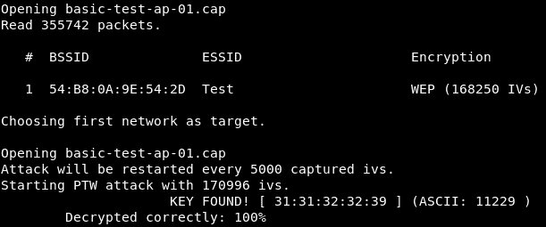
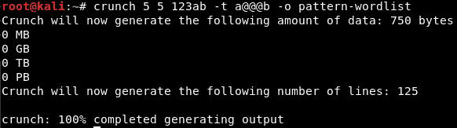

# 第六章：网络渗透测试 - 获取访问权限

到目前为止，在本书中，我们并不需要连接到网络进行任何操作。在这一章中，随着我们迈出学习网络渗透测试的步伐，我们将连接到网络。这将使我们能够发起更强大的攻击并获得更准确的信息。如果一个网络没有加密（换句话说，它是一个开放的无线网络），我们可以连接到它并嗅探未加密的数据。如果是有线网络，我们仍然可以尝试连接它，可能通过更改我们的 MAC 地址。我们可能遇到的主要问题是网络使用了加密（例如 WEP、WPA 或 WPA2）。如果我们遇到加密数据，我们需要知道密钥来解密它，这也是本章的主要目的。

如果你的目标网络使用某种加密方式，你无法进行任何操作，除非解密它。在这一章中，我们将讨论如何解密 WEP、WPA 和 WPA2 加密。

本章将涵盖以下内容：

+   WEP 理论

+   基础网页破解

+   假认证攻击

+   ARP 请求重放

+   WPA 介绍

+   WPA 破解

+   握手理论

+   捕获握手

+   创建字典

+   字典破解

+   保护网络免受攻击

# WEP 理论

我们将讨论的第一个加密方式是**有线等效隐私**（**WEP**）加密，因为它是最古老的加密方式，也是最容易破解的。WEP 加密使用一种叫做 RC4 的算法；每个数据包都在**接入点**（**AP**）加密，然后发送到空中。一旦客户端接收到数据包，客户端就能解密数据包并读取其中的信息，因为客户端拥有密钥。简而言之，AP 加密数据包并发送出去，客户端接收并解密它。同样，当客户端自身发送数据包时，客户端加密数据包然后发送出去，AP 接收并使用密钥解密它。

每个发送的数据包都有一个唯一的密钥流。WEP 通过使用 24 位**初始化向量**（**IV**）来确保密钥流的唯一性。IV 是一个随机数，它以明文形式发送到每个数据包中，未加密。如果我们读取该数据包，就能以明文方式读取其中的一部分。

IV 的问题在于它非常短（24 位，长度不算长）。在一个繁忙的网络中，会发送大量的数据包，随机 IV 的可能性会被耗尽，最终会出现两个数据包具有相同的 IV。如果发生这种情况，我们可以使用 `aircrack-ng`，它通过统计攻击来确定密钥流；它能够确定 WEP 密钥。

从前面的信息中，我们知道，收集的 IV 数量越多，我们破解 WEP 密钥成功的可能性就越大。我们尝试破解 WEP 的主要目标是尽可能多地收集 IV，因为当我们收集到大量的 IV 时，就会出现两个使用相同 IV 的包，`aircrack-ng`就能通过这些包确定密钥流和目标网络的 WEP 密钥。在本章的下一部分，我们将看到这个过程如何实际工作，应该会更容易理解。

# 基本的 WEP 破解

通过前面的部分，我们知道，破解 WEP 密钥所要做的就是嗅探目标网络的数据包并尽可能多地收集 IV。一旦完成这些操作，`aircrack-ng`就能利用统计攻击来确定目标网络的密钥流和 WEP 密钥。显然，当我们拥有超过两个数据包时，这种方法会更有效，我们破解密钥的成功几率会更高——我们将尽量收集尽可能多的 IV。

让我们看看最基本的破解 WEP 密钥的案例。Wi-Fi 卡必须处于监控模式，我们要做的第一件事是查看所有在我们 Wi-Fi 范围内的网络；然后，我们将选定其中一个网络作为目标。我们将运行`airodump-ng wlan0`，这是一个非常基础的命令，其中`wlan0`代表接口。以下将作为输出显示：


第一个出现的网络是`Test`；这是我们将要进行攻击的网络。我们将使用以下命令对`Test`网络启动`airodump`：

```
airodump-ng --bssid 54:B8:0A:9E:54:2D --channel 11 --write basic-test-ap wlan0
```

在这里，我们输入`--bssid`并对`Test`接入点启动`airodump`。我们包括`--channel`频道号`11`，并添加`--write`来将我们捕获到的所有数据包存储到一个名为`basic-test-ap`的文件中。当我们运行上述命令时，我们将能够看到以下屏幕截图中的输出，我们收集到的数据很繁忙，而且数据和帧正在传输：


这是一个繁忙的网络；以下是我们可以看到客户端的部分：


现在我们要做的就是启动`aircrack-ng`，这是`aircrack`套件的一部分，针对`airodump`为我们创建的文件进行攻击。即使我们没有停止`airodump`，也可以对该文件启动`aircrack`；它会继续读取文件，并读取`airodump`正在捕获的新数据包。使用的命令如下：

```
aircrack-ng basic-test-ap-01.cap
```

当我们使用 `aircrack-ng` 时，我们将输入文件名 `basic-test-ap-01.cap`。在文件仍在创建中，随着新数据包的不断加入文件越来越大时，我们可以运行 `aircrack-ng`，它会不断更新，最终给出我们破解所需的密码。如果 `aircrack` 未能确定密钥，它会等待直到达到 5000 个 IV，然后再试一次。

IV 的数量实际上取决于 WEP 加密的类型。WEP 加密有两种类型：128 位和 64 位。唯一的区别是密钥的长度；显然，64 位需要的 IV 数量低于 128 位。记住我们在讨论 `aircrack` 时曾指出，获得的无唯一 IV 的数据包越多，我们破解 WEP 密钥的机会就越大。

现在，我们基本上在等待 `aircrack` 成功破解 WEP 密钥。一旦它解密了密钥，我们可以按 *Ctrl + C*。如以下截图所示，`aircrack` 已成功在数据包中找到了密钥；这是因为目标 AP 使用的是 64 位密钥：



让我们看看如何使用这个密钥连接到网络。我们将复制密钥并使用该密钥进行连接。然后我们就可以连接到目标网络：


如你所见，我们的连接已经建立；我们成功地从目标网络恢复了 WEP 密钥。我们可以通过 ping Google 来确认：


# 假身份认证攻击

在前一部分中，我们看到在繁忙的网络中破解 WEP 密钥是多么容易。在繁忙的网络中，数据增长非常迅速。问题是，我们现在要伪装成一个没有任何客户端连接的 AP，或者一个虽然有客户端连接，但该客户端使用网络的频率比上一部分的客户端低（可能该客户端只是在阅读文章或浏览 Facebook，并没有像上次那样使用大量数据）的 AP。

看一个例子。我们将对目标 AP `Test` 运行 `airodump`，来查看一个空闲的 AP。现在我们有了 `Test`，就是之前使用过的那个 AP，但不同的是我们已经断开了之前连接的设备。如我们所见，在第二个区域（客户端区域），没有客户端连接。同时，我们还可以看到 `#Data` 是 `0`——它甚至没有到达 `1`。

这将是我们面临的问题——我们希望能够破解像这样具有 `0` 数据的密钥：


我们可以做的是向流量中注入数据包。当我们向流量中注入数据包时，我们可以强制 AP 生成带有新 IV 的数据包，然后捕获这些 IV。但是在注入数据包之前，我们必须先将设备认证到目标 AP。AP 会记录所有已连接到它的设备，并会忽略任何来自未连接设备的数据包。如果设备没有密钥并尝试向路由器发送数据包，路由器会直接忽略它；它甚至不会尝试读取数据包内容或查看里面是什么。在我们向路由器注入数据包之前，必须先通过认证。我们将使用一种称为伪认证的方法，它非常简单。

我们在上一节中已经执行了`airodump`。现在让我们看看如何使用伪认证。在前面的截图中，我们可以看到`AUTH`下没有任何值。一旦我们完成伪认证，我们会看到`OPN`显示在这里，这意味着我们已经成功地将设备伪认证到目标 AP 上。为此，我们将使用以下命令：

```
aireplay-ng --fakeauth 0 -a 54:B8:0A:9E:54:2D -h 2e:a0:66:4b:85:29 wlan0
```

使用`aireplay-ng`时，我们将使用`--fakeauth`攻击；我们包括了攻击类型以及我们希望发送的数据包数量，即`--fakeauth 0`。

我们只会输入`0`；有些人会使用一个较大的数字，当他们进行一个需要 5 到 10 分钟的攻击时，但对于我们来说，我们只会使用`0`，之后可能会再更改。

我们将使用`-a`选项并指定目标 MAC 地址（即`54:B8:0A:9E:54:2D`）。接着我们将使用`-h`来包含我们的 MAC 地址，这样我们就可以将自己的 MAC 地址与目标网络进行认证。为了获取我们的 MAC 地址，我们将运行`ifconfig wlan0`命令：


我们的 Wi-Fi 卡的名称是`wlan0`。使用`aireplay-ng`时，我们尝试执行的攻击类型是伪认证攻击，用于将我们的 MAC 地址认证到目标网络，以便我们可以向目标网络注入数据包。我们将发送`0`（表示只执行一次），然后是`-a`（后跟 AP 的 MAC 地址），接着是`-h`（这里我们填入需要进行伪认证的设备的 MAC 地址），最后是`wlan0`，即 Wi-Fi 卡的名称；现在按下*Enter*键：


如前面的截图所示，`-a`发送了一个认证请求，并且认证成功。网络变成了开放网络，我们的客户端（即我的攻击设备）看起来像是一个已连接到网络的客户端。我们实际上并没有连接，但我们已与网络完成认证并建立了关联，这样我们就可以向 AP 注入数据包——它现在会接收我们发送的任何请求。以下是输出结果：


在接下来的部分中，我们将看到如何注入数据包，以及如何使数据快速增长。

# ARP 请求重放

现在，接入点接受我们发送的数据包，因为在成功通过伪认证攻击与接入点关联后，它不会再忽视我们。我们现在已经准备好向接入点注入数据包，并迅速增加数据量，以便解密 WEP 密钥。

我们将讨论的第一个数据包注入方法是 ARP 请求重放。在这个方法中，我们会等待一个 ARP 数据包，捕获这个数据包，然后将其注入到流量中。这样做时，接入点会被迫生成一个带有新 IV 的新数据包；我们捕获这个新数据包后，再将它注入到流量中，强迫接入点生成另一个带有新 IV 的数据包。我们将不断重复这个过程，直到数据量足够大，能够破解 WEP 密钥。

让我们在 Kali Linux 中进行操作。我们要做的第一件事是使用以下命令启动`airodump-ng`：

```
airodump-ng --bssid 54:B8:0A:9E:54:2D --channel 11 --write arp-request-replt-test wlan0
```

我们将向命令中添加`--write`选项；我们将其命名为`arp-request-reply-test`。运行后，我们会看到目标网络的`0`数据，它没有任何客户端与之关联，也没有流量通过，因为没有客户端连接，这意味着它没有用，我们无法破解其密钥。

我们要做的第一件事是进行伪认证攻击，如*伪认证*部分所示，以便我们可以开始向网络注入数据包，并且它会接受这些数据包。

这就引出了我们的下一步，即 ARP 请求响应步骤，在这一阶段我们将向目标网络注入数据包，迫使它生成带有新 IV 的数据包。命令如下：

```
aireplay-ng --arpreplay -b 54:B8:0A:9E:54:2D -h be:03:87:39:5e:5a wlan0
```

这个命令与之前的命令非常相似，但我们不使用`--fakeauth`，而是使用`--arpreplay`。我们还将包括`-b`，用于 BSSID。使用这个命令，我们将等待一个 ARP 数据包，捕获它，然后将其重新注入到空中。接着我们可以看到，我们已经捕获到一个 ARP 数据包，注入后又捕获到另一个，注入到流量中，依此类推；接入点（AP）会生成新的数据包，带有新的 IV，我们接收到这些数据包后再将它们注入，这个过程会不断重复：


当`Data`的数量达到 9000 或以上时，我们可以启动`aircrack-ng`。当我们使用`aircrack-ng`和文件名时，果然可以看到 WEP 密钥，并且我们能够在`15012`个 IV 之后破解它。


# WPA 介绍

在本章接下来的部分中，我们将讨论**Wi-Fi 受保护访问** (**WPA**) 加密。这种加密是在 WEP 后设计的，目的是解决 WEP 很容易被破解的问题。WEP 的主要问题是 IV （初始化向量）太短，它以明文形式在每个数据包中发送。短 IV 意味着在活跃的网络中，数据包中每个包都能有唯一 IV 的可能性会被耗尽，因此当我们注入数据包（或者在自然的活跃网络中）时，我们会遇到多个数据包具有相同的 IV。当这种情况发生时，`aircrack-ng` 可以利用统计攻击来确定密钥流和网络的 WEP 密钥。

然而，在 WPA 中，每个数据包都是使用唯一的临时密钥加密的。这意味着我们收集的数据包数量并不重要；即使我们能够收集到一百万个数据包，这些数据包也没用，因为它们不包含任何有助于我们破解 WPA 密钥的信息。WPA2 也是如此；它采用相同的方法，并且可以通过相同的方法进行破解。WPA 和 WPA2 之间的唯一区别是 WPA2 使用了一种叫做**计数模式密码块链消息认证码协议** (**CCMP**) 的加密算法。

# WPS 破解

破解 WPA 或 WPA2 加密的网络并不简单，特别是因为所有发送出去的数据包对我们并没有什么用处，因为它们不包含任何有助于我们确定 WPA 密钥的信息。在我们开始破解 WPA 和 WPA2 之前，我们将先了解一个叫做 WPS 的功能；它允许用户和客户端通过按下一个按钮连接到网络。在 Windows 8 上，如果你查看一些 Wi-Fi 打印机，它们有一个 WPS 按钮；如果你按下 WPS 按钮，然后去你的路由器按下 WPS 按钮，或者如果你进入配置页面并按下 WPS 按钮，那么客户端、打印机或 Windows 设备将无需输入密钥即可连接到网络。WPS 是一种允许客户端轻松连接到网络的功能，无需手动输入 WPA 密钥；它只是路由器中的一个功能。

这个功能通过 8 位数字 PIN 验证客户端， 它并不使用实际的 WPA 密钥。WPS 仅包含数字，其可能性并不多。如果我们使用暴力破解攻击，必定能够猜出 PIN。如果我们成功猜出了 PIN，我们可以使用一个叫做`reaver`的工具，它将根据 PIN 计算出 WPA 密钥。我们将对 PIN 进行暴力破解；因为它只有 9 位数，所以我们一定能成功。一旦破解成功，我们可以使用`reaver`来计算 WPA 密钥。

为了寻找启用了 WPS 的接入点，我们将使用一个叫做 `wash` 的工具。我们将使用 `wash -i wlan0` 命令。我们在以下截图中看到我们的`Test`接入点——这就是我们要破解的接入点，实际上它现在正在使用 WPA，而不是像我们之前看到的使用 WEP：

为了检查 AP 是否实际使用了 WPA 加密，可以运行 `airodump-ng wlan0`。

上述是启用了 WPS 的 AP 列表。我们可以看到 `Ch`、`dBm`（即我们与 AP 之间的距离）、`WPS` 显示了 WPS 版本，`Lck` 显示其是否被锁定。现在，一些路由器在我们尝试暴力破解 WPS PIN 时，会在几次失败后被锁定。例如，如果我们输入四个错误的 PIN，它们会被锁定，并且在一段时间内不再接受任何 PIN。如果 `Lck` 显示 `Yes`，我们将无法继续使用攻击；需要稍等一段时间，然后再连接到 AP。

我们现在运行 `reaver`，它将暴力破解 WPS PIN，一旦找到 WPS PIN，它就会计算出 WPA 密钥。`reaver` 支持暂停和恢复。例如，如果我们通过暴力破解已经尝试了 30% 的可能性，然后取消了攻击，当我们回来时，它将从 30% 继续，而不是从 0% 开始。

让我们启动 `reaver`；我们将使用 `-b` 选项选择目标 AP 的 BSSID（即 MAC 地址），然后使用 `-c` 选项选择频道，这里是 `11`，接着，我们可以选择 Wi-Fi 卡 `-i`，并启用监控模式，这里是 `wlan0`。命令如下：

```
reaver -b 54:B8:0A:9E:54:2D -c 11 -i wlan0
```

我们按下 *Enter*，`reaver` 会与目标 AP 进行关联；它将尝试确定 WPS PIN。在截图中，我们可以看到一个简单的 PIN，即 `12345670`；通过这个，`reaver` 能够计算出 WPA 密钥 `UAURWSXR`：


现在，我们可以直接连接到网络；如果输入我们刚刚找到的密钥 `UAURWSXR`，就可以连接了。

现在，`reaver` 有一些选项。我们可以运行 `reaver --help` 来查看所有可以与 `reaver` 一起使用的选项。如前所述，一些路由器在几次失败后会锁定；因此，我们可以使用这些高级选项来让 `reaver` 针对这些 AP 进行工作。例如，我们可以使用 `--delay` 选项来指定每次暴力破解尝试或每次 PIN 尝试之间 `reaver` 应等待的时间（单位：秒）。我们还可以使用 `--lock-delay` 告诉 `reaver` 在 AP 被锁定后，例如 60 秒，再继续暴力破解尝试。我们还可以使用 `--fail-wait` 选项来设置在 10 次失败尝试后 `reaver` 应该等待的时间。此外，我们可以使用 `-r` 选项来告诉 `reaver` 在一定次数的尝试后休眠若干秒。我们可以设置 `--timeout` 选项，调整这些选项、`--delay` 选项和 `--fail-wait`，如果 AP 被锁定或忽略了我们的一些暴力破解尝试。

# 握手理论

在上一节中，我们看到如何利用路由器的 WPS 功能来破解 WPA 密钥。这个过程在每个启用 WPS 的网络上都能保证有效；因此，如果你的目标使用 WPA 或 WPA2 加密并且启用了 WPS，那么应该首先尝试使用 WPS 破解密码。然而，如果 WPS 没有启用，我们就得破解实际的 WPA 密钥。如我们在*WPS 破解*部分中所解释的，WPA 中每个数据包都是使用一个独特的临时密钥加密的，这不同于 WEP，其中 IV 是重复的，我们会收集大量具有相同 IV 的数据包。在每个 WPA 数据包中，都会有一个临时的唯一 IV，即使我们收集了一百万个数据包，这些数据包对我们也没有用——它们不包含任何能帮助我们确定实际 WPA 密钥的信息。

唯一包含可以帮助我们确定密钥信息的数据包是握手数据包。这些是四个数据包，在一个新设备或新客户端连接到目标网络时发送。例如，当我们在家时，我们的设备连接到网络，已知密码，并且一个被称为四次握手的过程会在设备与 AP 之间发生。在这个过程中，四个数据包（称为握手数据包）在两个设备之间传输，用于验证设备的连接。通过使用`aircrack-ng`，我们可以利用字典列表，通过握手测试字典中的每一个密码。要破解 WPA 加密网络，我们需要两样东西：我们需要捕获握手，并且需要一个包含密码的字典列表。

# 捕获握手

要破解 WPA 密钥，我们首先需要做的是捕获握手。我们将使用`airodump-ng`来捕获握手，方式与我们在 WEP 加密网络中使用的方法相同。我们将使用`airodump-ng --bssid`，就像我们对 WEP 网络运行时一样；归根结底，我们只是使用`airodump-ng`来捕获数据包，它执行的工作是一样的。我们将包括频道信息，然后将数据写入一个文件，文件名为`test-handshake`；同时还会包括无线网卡的监控模式。我们使用与捕获 WEP 网络数据包时相同的命令`airodump-ng --bssid`。我们指定目标 AP，`--channel`；目标频道，`--write`；存储文件的名称；以及`wlan0`，我们的 Wi-Fi 卡，处于监控模式。命令如下：

```
airodump-ng --bssid 54:B8:0A:9E:54:2D --channel 11 --write test-handshake wlan0
```

一旦我们启动此命令，我们将拥有一个 WPA 加密的网络，并且会有一个客户端连接到该网络。为了捕获握手，我们可以坐下来等待一个设备连接到网络。一旦设备连接上网络，我们就可以捕获握手，或者我们也可以使用在上一章中学到的一种方法（第五章，*预连接攻击*），即去认证攻击。

在去认证攻击中，我们将会断开任何在我们 Wi-Fi 范围内的设备与网络的连接。如果我们只断开很短的时间，我们可以让设备从网络断开一秒钟；设备会自动尝试重新连接网络，甚至使用设备的人也不会注意到他的设备已经断开并重新连接。我们就能够捕获握手数据包。再说一次，每当设备连接到目标网络时，握手信息都会发送。

现在我们只需要运行一个基本的认证攻击，使用`aireplay-ng`。我们在第四章中研究过它，*网络渗透测试*，在这一节我们使用了大量的数据包来断开目标设备的连接。现在我们只会发送少量数据包：四个去认证数据包。接下来，我们会指定`-a`，即目标 AP 的 MAC 地址，`-c`，指定要断开连接的客户端的 MAC 地址。然后我们会指定 Wi-Fi 网卡名称，即`wlan0`。我们使用`aireplay-ng --deauth`，攻击类型，以及`4`个认证数据包来断开设备与 AP 的连接。命令如下：

```
aireplay-ng --deauth 4 -a 54:B8:0A:9E:54:2D -c B8:76:3F:F8:F5:CD wlan0
```

如下图所示，我们成功捕获了 WPA 握手，目标设备甚至没有改变，或者没有断开连接：


我们没有收到任何关于断开连接的消息，因为我们只断开了很短的时间；结果，甚至使用设备的人都没有注意到，我们也成功捕获了握手信息。现在我们可以使用词表，并将其与握手进行比对，尝试确定主要的 WPA 密钥。

# 创建词表

现在我们已经捕获了握手信息，接下来只需要通过创建一个词表来破解 WPA 密钥。词表只是一个单词列表，`aircrack-ng`会逐个尝试这些单词与握手信息进行比对，直到成功确定 WPA 密钥。词表越好，破解 WPA 密钥的成功几率就越高。如果密码不在你的词表文件中，你将无法确定 WPA 密钥。

我们将使用一个名为`crunch`的工具。它实际上只是一个脚本；我们指定希望出现在密码中的字符，它就会创建这些密码的所有可能组合。使用`crunch`的命令格式是`crunch [min] [max]`。`[min]`是我们希望创建的密码的最小字符数，可以设置为四、五、六等；`[max]`是密码的最大字符数。我们可以指定密码中使用的字符，例如可以指定`abcdefg`，所有小写字母，然后可以加入大写字母，数字和符号。

`-t` 选项非常有用，如果我们知道密码的一部分；它是一个模式。例如，如果我们试图猜测密码，并且我们看到有人输入密码，我们知道它以`a`开头，以`b`结尾，我们可以使用模式选项，并告诉`crunch`创建始终以`a`开头，以`b`结尾的密码，并且它会将我们在命令中指定的字符的所有可能组合放在一起。

假设我们要创建最少六个字符和最多八个字符的密码，并且密码将是由字符`1, 2, 3, 4, 5`和符号组合而成。它将存储在名为`wordlist`的文件中，模式是`wordlist`文件中密码始终以`a`开头，且始终以`b`结尾。我们将在文件中看到的所有密码都将以`a`开头，以`b`结尾，并且它们将具有我们在`a`和`b`之间指定的字符的所有可能组合。

让我们只运行`crunch`并创建一个示例单词表。我们将使用`crunch`，然后设置最小为`4`，最大为`6`。我们只需放入`123ab`，并将其存储在`sample-wordlist`中。`crunch`将创建密码组合（至少四个字符，至多六个字符），并将创建`123ab`的所有可能组合。它将把组合存储在名为`sample-wordlist`的文件中。命令如下：

```
crunch 4 6 123ab -o sample-wordlist
```

以下是前述内容的输出：


我们可以通过运行`cat sample-wordlist`来读取，并且我们可以看到文件中存储的所有密码，如下面的截图所示：


我们可以看到`crunch`为我们创建的所有密码。我们在命令中放入的密码越大且包含的字符越多，我们可以制作的密码就越多，它们会占用更多的空间。

让我们来看看模式选项。我们将使用`crunch`，最小为`5`，最大为`5`，因此所有密码都将是五个字符长，然后我们将放入字符`123ab`（如前所述），然后我们将添加`-t`选项，即模式选项。然后，我们将说明密码以`a`开头，以`b`结尾，并且我们希望在`a`和`b`之间的字符的所有可能组合。然后，我们将指定输出文件`-o`；让我们称之为`pattern-wordlist`。以下是命令：

```
crunch 5 5 123ab -t a@@@b -o pattern-wordlist
```

输出如下所示：



它创建了`125`个密码；让我们看看它们。正如我们在下面的截图中所见，它们始终以`a`开头，始终以`b`结尾：


我们可以使用`crunch`来创建您的单词列表，在下一节中，我们将使用单词列表和握手文件来确定实际的 WPA 密钥。

# 单词列表破解

现在我们已经从目标 AP 捕获了握手，我们准备好使用单词列表，我们可以使用`aircrack-ng`来破解目标 AP 的密钥。`aircrack-ng`将遍历单词列表文件，将每个密码与我们目标 AP 的名称结合起来，并创建一个**Pairwise Master Key**（**PMK**）。 PMK 是通过使用称为 PBKDF2 的算法创建的，它不像只是将密码和 BSSID 组合在一起；它以一定的方式对它们进行加密，并将 PMK 与握手进行比较。如果 PMK 有效，则使用的密码是目标 AP 的密码；如果无效，则`aircrack-ng`尝试下一个密码。

我们使用`aircrack-ng`，包含握手的文件名`test-handshake-01.cap`，以及`-w`和单词列表的名称`wordlist`。命令如下：

```
aircrack-ng test-handshake-01.cap -w wordlist
```

现在我们要按下*Enter*，`aircrack-ng`将遍历列表；它将尝试所有密码，并将每个密码与目标 AP 的名称结合以创建一个 PMK，然后将 PMK 与握手进行比较。如果 PMK 有效，则用于创建 PMK 的密码是目标 AP 的密码；如果 PMK 无效，则它将尝试下一个密码。

如下截图所示，密钥已找到：


这是使用单词列表的最基本方法：破解密码只需`42 秒`。速度取决于处理器的快慢，以及我们是否有任何正在运行的进程使我们的计算机变慢。

# 从攻击中保护网络

为了防止我们的网络受到本章中解释的破解方法的影响，我们需要访问路由器的设置页面。每个路由器都有一个网页，用户可以在该网页上修改路由器的设置，通常在路由器的 IP 上。首先，我们要获取我的计算机或设备的 IP，然后运行`ifconfig wlan0`命令；如下截图所示，突出显示的部分是计算机的 IP：


现在打开浏览器，访问`192.168.0.1`；对于这个示例，计算机的 IP 是`25`。通常情况下，路由器的 IP 是子网的第一个 IP。此时，它是`192.168.0.0`，我们只需加上`1`，因为那是子网中的第一个 IP，这将带我们进入路由器设置页面。在设置页面，它会要求输入用户名和密码。路由器通常都有预设的用户名和密码——我们可以查看默认的用户名和密码；强烈建议之后更改它们。通常这些信息会写在手册中，所以查看手册，了解默认的用户名和密码，然后用这些凭证登录。

现在，在某些情况下，攻击者可能正在对我们进行去认证攻击，这样攻击者可能会阻止我们无线连接到网络。我们可以做的是通过以太网线连接到路由器；这样做时，攻击者就无法通过去认证攻击来断开我们的连接，我们将能够通过有线连接访问路由器设置。我们可以修改安全设置，改变加密方式，修改密码，做所有的安全增强操作，以避免攻击者能够攻击网络并获取密钥。

现在，每个路由器的设置都是不同的，取决于制造商，甚至是路由器的型号。但通常情况下，修改设置的方式是相同的；在 90%的情况下，路由器的 IP 总是子网的第一个 IP，我们只需要使用`ifconfig`命令获取 IP，就像我们在本节开始时所做的那样。我们获得了`192.168.0.25`的 IP，然后将最后的`25`改成`1`，就是第一个 IP，这就是我们的路由器的 IP。

现在，我们将导航到**无线**设置。正如我们所见，有很多设置可以修改我们的网络，目前我们关注的是**无线**设置：


如前所示，**无线**设置已启用，我们甚至可以在**SSID**下更改网络名称；我们还可以更改**频道**和**带宽**。

进入**安全**选项后，我们可以在以下截图中看到，我们正在使用 WPA 加密和 WPA/WPA2 认证，且加密方式使用的是 AES+TKIP：


如果我们进入 WPS 选项，我们可以看到 WPS 已禁用；我们没有使用 WEP 加密，这样攻击者就无法使用任何攻击手段来破解 WEP 加密：


我们正在使用更加安全的 WPA，并且已经禁用了 WPS，这样攻击者就无法使用`reaver`来确定 WPS PIN，然后反向工程密码。黑客能够访问或获取密码的唯一方法是首先获取握手，然后使用一个单词列表找到密码。密码非常随机，即使实际上没有使用数字或数字，只是字母；但它非常随机，所以很难有人能够猜到它。

现在，还有访问控制；使用这个，我们可以添加策略，比如允许策略或拒绝策略：


我们可以指定我们想要允许连接到我们网络的 MAC 地址；我们也可以指定我们想要从我们网络中拒绝的 MAC 地址。例如，如果你家里没有很多人或很多访客，或者如果你在一家有指定数量计算机的公司，并且只想允许一定数量的计算机连接到网络，你可以获取他们的 MAC 地址（对于你想要允许的人）并将它们添加到允许列表中。即使有人有实际的密钥，但他们不在白名单或允许列表中，他们将无法访问网络。当我们想要拒绝某台计算机或某个我们认为可疑的人时，我们可以添加他们的 MAC 地址到拒绝列表中，他们将无法连接到你的网络：


路由器设置页面通常对不同的路由器有不同的外观；选项的名称可能不同，但主要点是我们应该能够使用子网 IP 访问路由器设置，并在末尾添加数字`1`，这是第一个 IP。如果你遭受攻击并且完全无法连接到你的网络，那么只需使用一根电缆并修改设置，就像我们讨论过的那样。

# 总结

这一章我们研究了即使没有设备连接到目标网络，即使网络处于空闲状态，破解 WEP 加密网络有多么容易。我们还看到了一些方法将数据包注入到流量中，并导致数据量迅速增加，以便在很短的时间内破解 WEP 密钥。

然后我们研究了黑客可以利用的所有弱点，以便入侵 WEP、WPA 和 WPA2 加密网络。然后我们看到黑客如何利用弱点来破解密码并获取网络的密钥。之后我们作为攻击者将能够取消认证，或者从任何网络中断开任何设备，而无需知道密钥。

在本章末尾，我们讨论了如何修改我们自己路由器的设置，以增加网络的加密和安全性，防止黑客使用攻击并获取密码。

在下一章，我们将学习
