# 第七章：连接后攻击

在之前章节中进行的所有攻击中，我们都没有连接到网络。然而，在这一章中，我们将研究在突破网络后可以执行的攻击。首先，我们将学习在进入网络后能够收集的所有重要信息，这些信息将帮助我们发起攻击；我们将使用 netdiscover 工具来实现这一目标。我们还将学习一种与 netdiscover 类似的工具——AutoScan。它的界面更好，功能比 netdiscover 更强大。我们还将学习另一个工具 Zenmap，它的工作原理与 AutoScan 和 netdiscover 类似，用于探索所有连接到系统的客户端。

在本章中，我们将讨论以下主题：

+   连接后攻击

# 连接后攻击

到目前为止，我们所做的一切都没有涉及到连接网络。在这一部分，我们将讨论连接后攻击——换句话说，就是我们在连接到网络后可以执行的攻击。现在，不管这个网络是无线网络还是有线网络，也不管我们是如何连接到它的。我们将不再考虑到目前为止所做的所有操作，假设我们已经成功连接到网络。我们可能是通过物理连接线缆连接到路由器或服务器，也可能是通过破解密钥（如果目标使用的是 WEP 或 WPA 密钥）来连接，或者也许该网络是一个没有加密的无线网络，我们直接连接到它。无论我们是如何获得连接的，只要我们已经获得了网络访问权限，就可以发起我们将在这一部分讨论的所有攻击。

首先需要注意的一个重要事项是，在之前的所有攻击中，我们都将无线网卡设置为监视模式，以便能够捕获任何空中传输的数据包。在这一部分，我们将使用无线网卡的管理模式，因为我们只想捕获定向给我们的数据包，因为我们已经有网络访问权限，所以不需要捕获所有的流量。另一个需要记住的事项是，如果我们在实验室里进行测试，并希望在不使用多个无线网卡的情况下进行这些攻击，我们应该进入 Kali 虚拟机的 VirtualBox 设置，进入设置 | 网络，并确保它使用 NAT 网络，并且与其他虚拟机在同一子网（如我们的示例中的 NatNetwork），如下所示的截图所示：

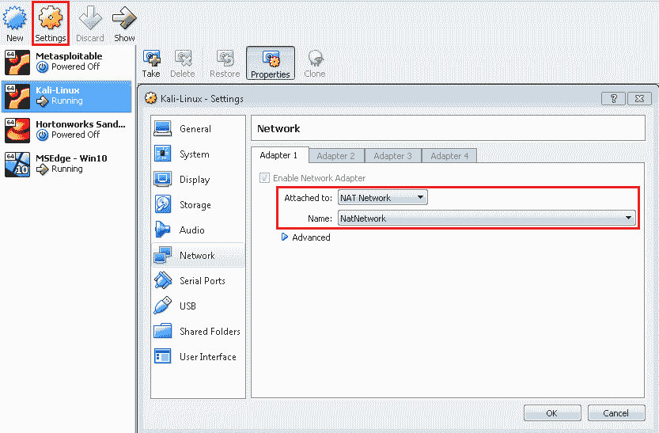

我们可以在 Kali 虚拟机中使用`eth0`网卡接口进行攻击；这将是一个虚拟接口，但它会像普通接口一样工作。或者，我们也可以使用无线网卡——只需从 Kali 连接到目标网络，然后我们就可以测试网络中任何设备的安全性。

所以，我们可以将我们的虚拟机，或我们的 Windows 虚拟机，连接到同一网络，或者我们可以测试任何其他设备，无论是我们的手机、旧笔记本，还是其他设备。

# netdiscover 工具

本节我们要讨论的第一件事是信息收集。收集有关连接的客户端和路由器的信息非常重要，因为它可以帮助我们了解它们的 IP 地址和 MAC 地址，以及它们运行的操作系统，还可以了解它们设备上开放的端口。至于路由器，我们能够知道路由器的制造商，然后我们就可以寻找可以用来攻击路由器或客户端的漏洞和利用方式，如果我们想要攻击它们的话。

在第四章《网络渗透测试》中，我们看到如何使用`airodump-ng`来发现连接的客户端。在`airodump-ng`的第二部分输出中，我们学到了如何看到关联的客户端及其 MAC 地址。就这些了——这是我们在连接到目标接入点之前能获得的一切信息。现在，连接后，我们可以收集更多关于这些设备的详细信息。有很多程序可以完成这个任务，但我们将讨论三种程序，从最简单最快的 netdiscover 开始。

如我们之前所说，netdiscover 是最快、最简单的程序，但它并没有显示关于目标客户端的详细信息。它只会显示它们的 IP 地址、MAC 地址，有时还会显示硬件制造商。我们通过输入`netdiscover`来使用它，然后输入`-i`来指定我们的无线设备，即`eth0`。接着，我们输入范围，可以是我们想要的任何范围。查看 IP（即`10.0.2.1`）可以告诉我们所在的网络。我们希望发现这个网络中的所有客户端，所以我们会尝试看看是否有设备在`10.0.2.1`。然后我们会尝试`12`、`13`、`14`、`15`、`16`，一直到`254`——这是范围的终点。为了指定整个范围，我们可以写`/24`。这意味着我们要从`10.0.2.1`开始，然后这个 IP 将一直增加到`10.0.2.254`，这是网络中的 IP 范围的终点。这个命令如下所示：

```
 -i eth0 -r 10.0.2.1/24
```

我们按下*Enter*键。它会非常快速地返回输出，生成如下截图所示的结果：

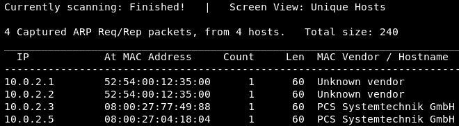

正如我们所说，这是最快的方法，我们可以从前面的截图看到，我们已经有四个设备连接到网络。我们有它们的`MAC 地址`，以及它们的`MAC 供应商`。就是这些了。这个方法非常快速，并且只显示简单的信息。

# AutoScan 工具

AutoScan 是另一个可以用于发现连接到同一网络的计算机或客户端的程序。它不像 netdiscover 那样快，但它有一个图形界面，因此更容易使用，并且它实际上显示了更多关于发现的客户端的详细信息。让我们去 Kali 机器，从 [`sourceforge.net/projects/autoscan/files/AutoScan/autoscan-network%201.42/autoscan-network-1.42-Linux-x86-Install.tar.gz/download`](https://sourceforge.net/projects/autoscan/files/AutoScan/autoscan-network%201.42/autoscan-network-1.42-Linux-x86-Install.tar.gz/download) 下载 AutoScan 的 Linux 版本。最新版本（1.5 版）有一个 bug，因此工作不太好。所以，我们要做的是下载一个较旧的版本，即 1.42。如果我们去 Files | Downloads，我们将看到该文件。我们通过右键单击它并从下拉菜单中点击 Extract Here 来解压该文件。这将打开安装程序。

我们将在终端中运行此安装程序，但在此之前，AutoScan 使用的一个库需要安装。此库仅适用于具有 32 位架构的计算机，即使用 32 位处理器的计算机，因此我们需要首先添加该架构，然后再安装该库。我们要输入的第一个命令是为我们的 64 位计算机添加 32 位兼容性。如果您的计算机已经是 32 位的，则无需运行该命令，但如果是 64 位计算机，则需要运行该命令。我们将启动 `dpkg --add-architecture i386` 命令。现在，我们需要更新源。为此，我们输入 `apt-get update`。接下来，我们将安装 AutoScan 需要的库，名为 `libc6`。运行 `apt-get install libc6: i386` 命令，并在询问是否继续时输入 `Yes`。

稍后，它会要求我们重新启动服务，因为配置已完成—当它提示时，输入 `Yes` 。好了，现在应该都安装好了。现在我们已经安装了 AutoScan 所需的库，接下来只需安装 AutoScan 本身。

正如你可能记得，AutoScan 是下载到 `Downloads` 文件夹中的。我们将通过运行 `cd Downloads` 进入 `Downloads` 文件夹。然后，如果我们使用 `ls` 列出 `Downloads` 中的文件，我们会看到 AutoScan 安装程序本身以绿色显示：

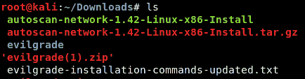

要运行安装程序，我们将输入 `./`，然后输入安装程序的名称，即 `autoscan-network-1.42-Linux-x86-Install`，并按下 *Enter*：

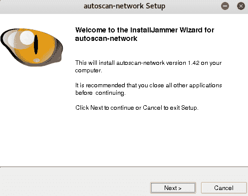

如果我们希望继续安装 AutoScan，它会要求我们点击 Next。确认选择后，它会问我们希望将其安装在哪里。我们将保留默认位置，即 `/opt/AutoScan`：

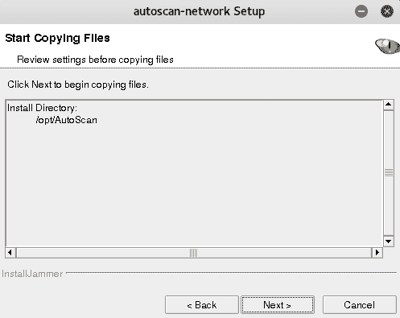

现在，程序应该已经完全安装。如果我们去桌面上，我们会看到桌面上有一个启动器。此外，如果我们去“显示应用程序”并搜索 AutoScan，我们会看到有两个文件：卸载程序和 AutoScan 本身：

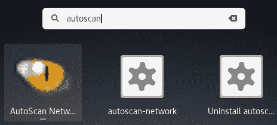

我们现在将运行 AutoScan。我们可以用它来发现与我们连接到同一网络的客户端。AutoScan 向导（如下截图所示）将帮助我们启动扫描并查看结果：

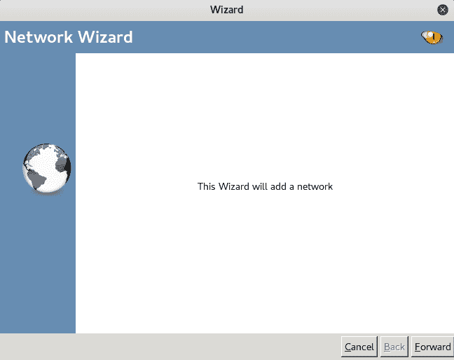

我们只需要点击“前进”。接下来，它会要求我们命名网络——我们就保留为“本地网络”，然后点击“前进”：

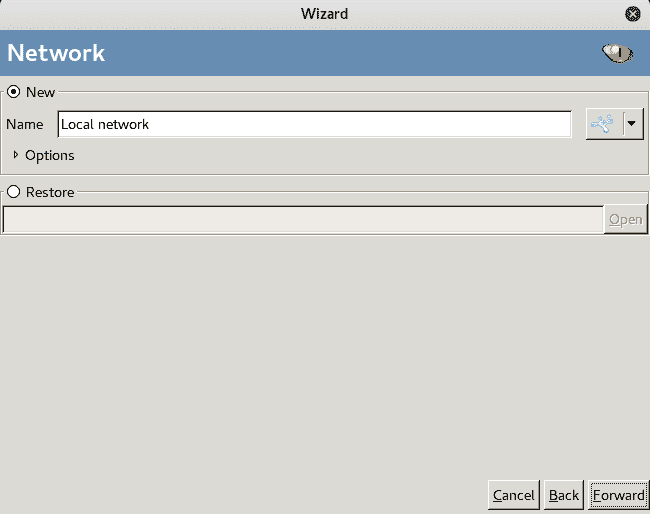

这个程序仍然会询问我们网络的位置。它是我们的本地主机，因此我们保持不变：

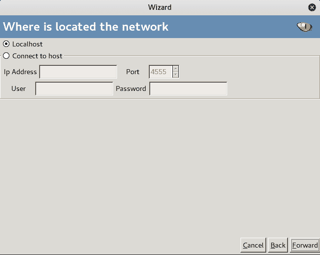

接下来，我们点击“前进”。然后，AutoScan 会显示可用的接口。这非常重要，因为，取决于我们选择哪个接口，我们将发现与该接口连接到相同网络的设备。例如，wlan0 [192.168.0.3] 是一张实际的无线网卡，连接到我们的家庭网络，因此如果我们使用这个接口，我们将能够发现连接到我们 Wi-Fi 家庭网络的所有设备，因为 wlan0 [192.168.0.3] 正连接到那个网络：

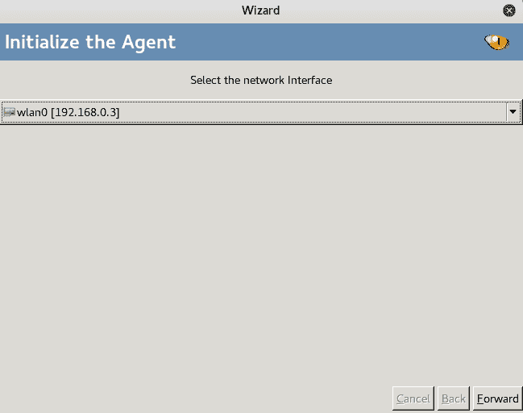

我们将点击“前进”，然后再点击一次“前进”。现在，程序正在工作，正如我们在下方截图中看到的，它已经开始发现我们网络中的设备：

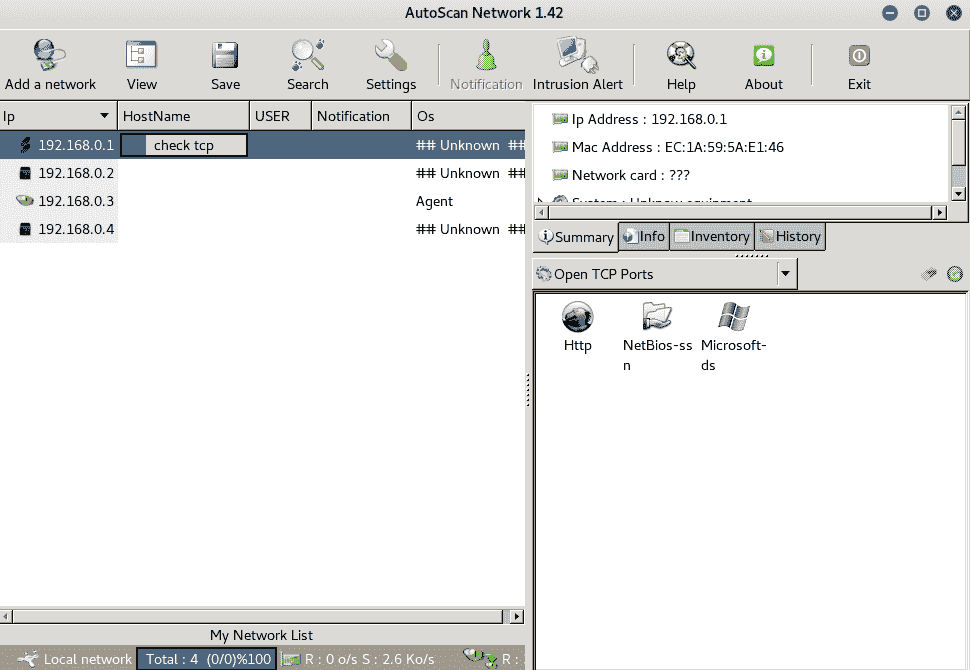

给它一些时间。首先，它会发现 IP 地址，然后它将尝试收集有关开放端口、操作系统以及这些开放端口上使用的服务的信息。

扫描完成后，我们将能够看到网络中的所有设备，正如我们在下方截图中看到的：

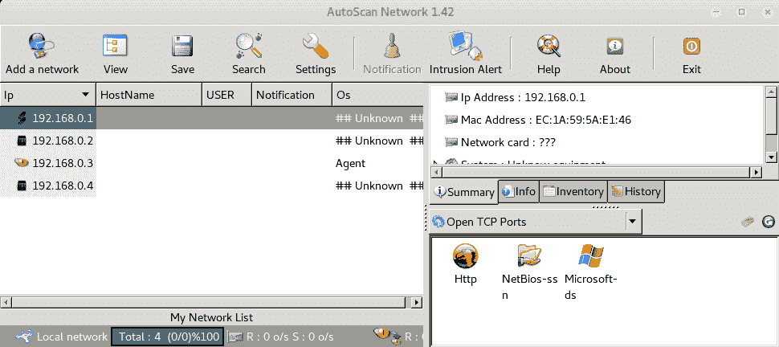

点击任何设备将会显示右侧标签页中的更多信息。例如，如果我们点击路由器，如前面截图所示，它会比 netdiscover 提供更多的信息，如下图所示：

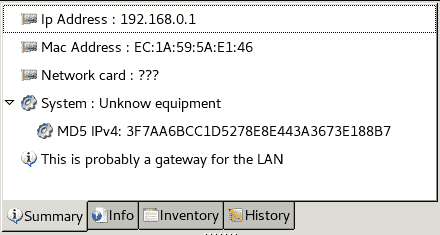

一开始，我们可以看到 IP 地址和 Mac 地址。它还告诉我们，这可能是局域网的网关，因此它可能不是一台实际的计算机，而是一个路由器。现在，在信息标签中，我们可以看到我们有开放的端口，并且其中两个开放的端口分别是 TCP 和 UDP 端口：

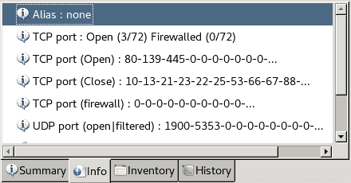

如我们所见，这个工具比 netdiscover 更易于使用，且能展示更多的信息，但实际扫描网络并发现信息的时间较长。在接下来的部分，我们将看看 Zenmap，它将向我们展示有关连接到我们网络的客户端的更多详细信息。

# Zenmap

我们将要看的第三个程序是**网络映射器** (**Nmap**)。Nmap 是一个网络发现工具，可以用来收集几乎任何设备的信息。使用它，我们可以收集关于我们网络内的任何客户端的信息，发现我们网络内的客户端，收集关于我们网络外的客户端的信息，甚至仅通过知道它们的 IP 地址来收集信息。我们甚至可以输入它们的 IP 地址，然后收集相关信息。Nmap 是一个非常强大的工具，具有许多用途。它可以用来绕过防火墙，以及各种保护和安全措施。关于如何使用 Nmap，已经有了整本书籍和课程。在本节中，我们将简要了解 Nmap，并学习一些基本的 Nmap 命令，这些命令可以用来发现连接到我们网络的客户端，同时还可以发现这些客户端的开放端口。

我们将使用 Zenmap，这是 Nmap 的图形用户界面。如果我们在终端中输入`zenmap`，它将启动该应用程序：

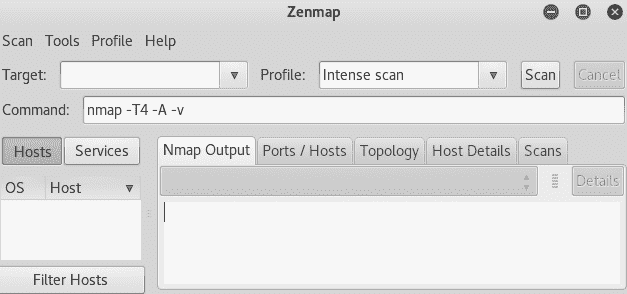

在 目标 字段中，我们将输入我们的 IP 地址。如果我们只想收集一个 IP 地址的信息，可以直接输入该地址，或者像我们在 netdiscover 中做的那样输入一个范围。在本次练习中，我们将输入`10.0.2.1/24`。在 配置文件 下拉菜单中，我们可以选择不同的配置文件：

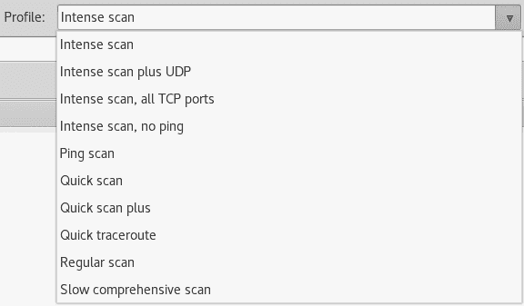

如果需要，我们可以在 命令 选项中输入自定义命令，或者使用配置文件下拉菜单中已有的配置文件。让我们看看这些现成的配置文件。首先，我们将看看 Ping 扫描 配置文件。选择 Ping 扫描 配置文件后，点击 扫描 按钮：

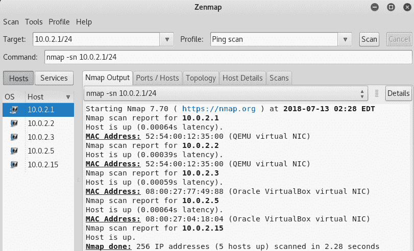

上面的扫描有点像快速扫描，但它显示的信息不多，正如我们在前图中所见。它只显示了连接的设备。如图所示，我们在左侧面板中有连接的设备，并且显示了它们的 IP 地址、MAC 地址和厂商信息。有时在 netdiscover 中，我们无法看到设备的制造商。有时这些信息也会被 AutoScan 隐藏。然而，我们可以通过 Nmap 查看制造商，正如前面的截图所示。我们还能够知道`10.0.2.5`是一个 VirtualBox 虚拟网络接口设备。这是一个虚拟无线网卡，因为我们正在有线实验室中进行扫描。在无线扫描的情况下，它会显示路由器或设备的制造商，我们可以进一步查找这些设备中的漏洞。再次强调，Ping 扫描非常迅速。我们能够找出连接客户端的制造商、IP 地址和 MAC 地址。

接下来我们要看的是快速扫描（Quick scan）。现在，快速扫描的速度会稍微慢于 Ping 扫描，但我们会得到比 Ping 扫描更多的信息；我们能够识别每个设备的开放端口：

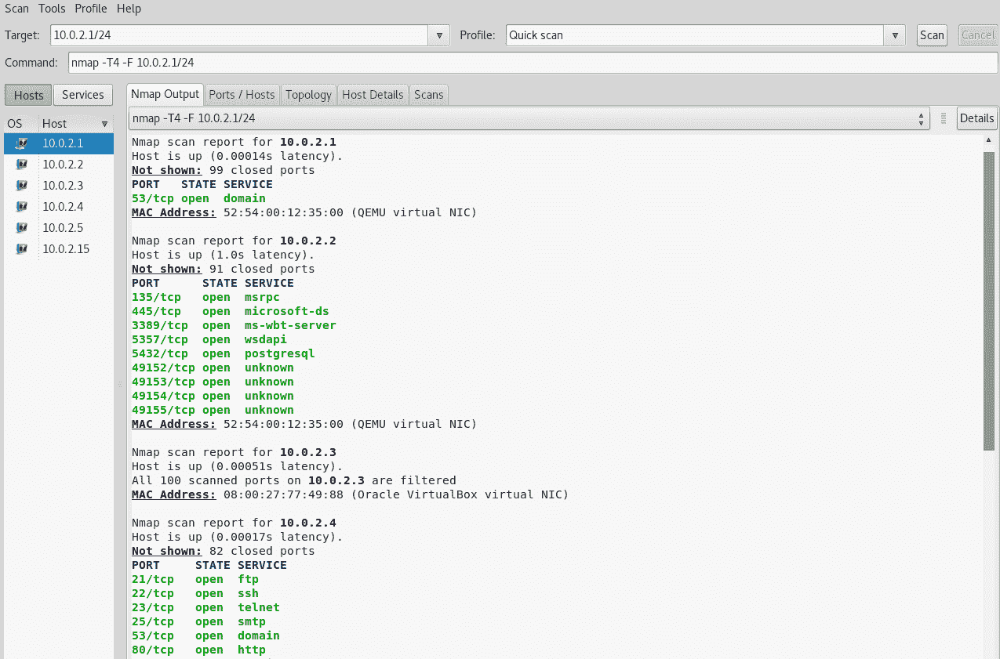

如前图所示，主路由器有一个开放的端口叫做`53/tcp`。

现在，让我们来看一下“快速扫描加”（Quick scan plus），它将快速扫描推进一步。它比快速扫描慢，但它会显示我们打开端口上运行的程序。因此，在快速扫描中，我们看到了端口`80`是开放的，但我们不知道端口`80`上运行的是什么，我们看到端口`22`在运行，但我们也不知道运行的是什么。我们知道它是 SSH，但我们不知道运行在该端口上的 SSH 服务器是什么。

所以，这将比快速扫描花费更长时间。这个扫描比我们之前谈到的所有扫描都要慢，但我们可以看到它收集了更多的信息，如下图所示：

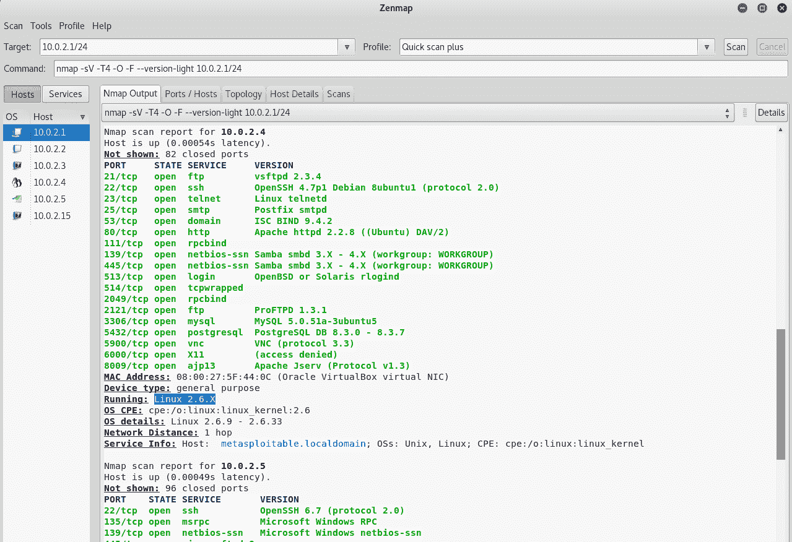

我们可以看到，在前面的截图中，我们有一台 Linux 设备连接。我们可以看到该设备的操作系统，并且它还为我们提供了程序的版本信息。上次，我们只知道端口`22`是开放的——现在我们知道它正在运行，并且运行的服务器是 OpenSSH 4.7。

从快速扫描提供的关于我们 Linux 设备的信息中，我们能够识别端口`80`，并且知道该端口是开放的。我们知道 HTTP 在上面运行，但我们不知道运行的是哪个版本的服务器。现在我们知道它是 Apache HTTP 服务器 2.2.8，并且它是一个 Linux 设备。所以再次强调，这个扫描非常准确。我们可以继续查找漏洞和弱点。

这只是一个例子，展示了收集信息的实用性。即使这个方法不起作用，我们仍然可以继续寻找这些程序的漏洞，并成功获取对该网络的访问权限。因此，收集信息是渗透测试中的一个重要步骤。Zenmap 或 Nmap 是一个强大的工具，我们可以用它执行多种类型的扫描。我们可以尝试这些现成的配置文件，看看它们能做什么。

# 总结

在这一章中，我们介绍了所有可以用来突破网络并收集有关网络中客户端的关键信息的技术。这将帮助我们对目标系统发起攻击。为此，我们学习了三种不同的工具——netdiscover、AutoScan 和 Zenmap。这些工具各有独特的功能，使它们在收集目标信息时非常高效。

在下一章中，我们将学习各种中间人攻击。我们还将学习 Wireshark 工具。
