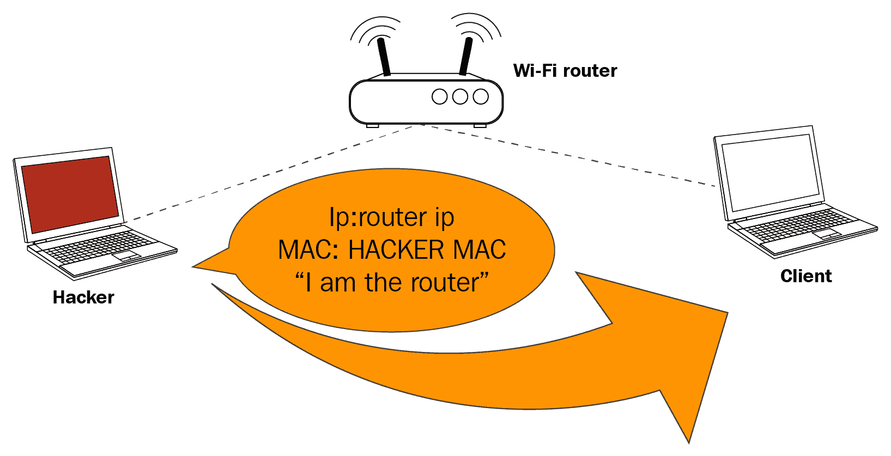
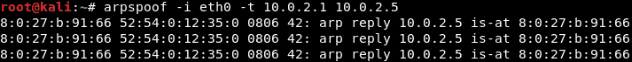
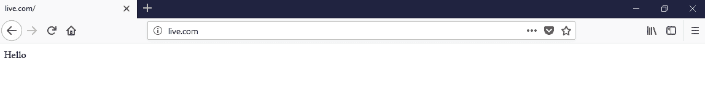
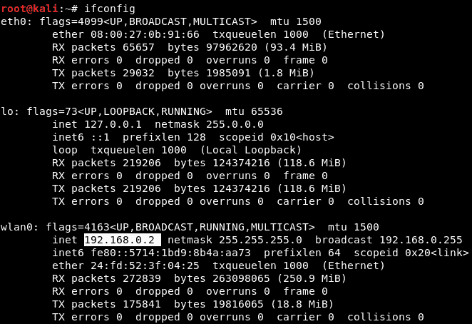
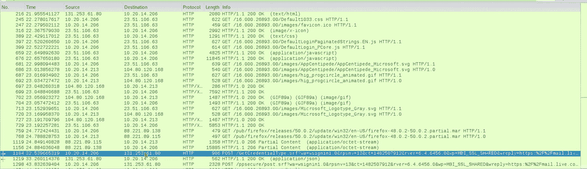

# 第八章：中间人攻击

在上一章中，我们介绍了如何借助各种工具收集信息并进行分析。在本章中，我们将了解**中间人框架**（**MITMf**），这是一个用于最强大攻击之一的工具包。为了实施 MITMf，我们将使用 ARP 欺骗、绕过 HTTPS 和 DNS 欺骗。我们还将使用键盘记录器，并研究 MITMf 实现中的代码注入技术。

在本章的最后部分，我们将了解一个名为 Wireshark 的特殊工具，它在分析网络时非常高效。使用它，我们可以捕获数据包并了解它们所携带的信息。在本节中，我们将学习如何操作这个工具，以及如何使用一些过滤器。

在本章中，我们将覆盖以下主题：

+   中间人攻击

+   Wireshark

# 中间人攻击

在接下来的几个章节中，我们将讨论所谓的**中间人**（**MITM**）攻击。这是我们在网络中可以执行的最危险、最有效的攻击之一。只有在连接到网络后，我们才能进行此攻击。它可以用于将数据包的流量从任何客户端重定向到我们的设备。这意味着，发送到客户端或从客户端发送的任何数据包都必须经过我们的设备，并且由于我们知道密码，因此知道网络的密钥，我们就能读取这些数据包。它们不会被加密，我们将能够修改它们、丢弃它们，或者仅仅读取它们，看它们是否包含密码或重要信息。这个攻击非常有效，因为它很难防御。我们会讨论如何防御这种攻击，但完全防御这种攻击非常困难。这是因为 ARP 协议的工作方式。它的设计非常简单而且有效，但安全性不足。

ARP 有两个主要的安全问题。第一个是每个 ARP 请求或响应都是被信任的，所以我们设备对其他设备说的任何内容都会被信任。我们可以告诉网络中的任何设备我们是路由器，设备会信任我们。它不会去验证我们是否真的是路由器，也不会做任何身份验证测试。如果我们告诉任何设备我们是路由器，它会相信我们。同样地，如果我们告诉路由器我们是网络中的另一个设备，路由器也会信任我们，并开始将我们当作那个设备来处理；这就是第一个安全问题。第二个安全问题是客户端可以接受即使它没有发送请求的响应。例如，当一个设备连接到网络时，它首先会询问“谁是路由器？”，然后路由器会发送一个响应，表示“我就是路由器”。现在，我们可以在设备没有询问路由器是谁的情况下直接发送响应。我们可以直接告诉设备我们是路由器，且由于设备信任任何人，它们会信任我们，并开始将数据包发送给我们，而不是发送给路由器。

那么，让我们更深入地看看这个 MITM 攻击是如何运作的。它将通过一种叫做 ARP 中毒或 ARP 欺骗的技术来进行。通过利用前一段中提到的两个安全问题，这种攻击得以实现。以下是典型的 Wi-Fi 网络，我们可以在图示中看到，当客户端请求某个内容时，它会将请求发送给**Wi-Fi 路由器**，然后路由器从互联网获取请求，并将响应发送回**客户端**：


现在，所有这些操作都是通过数据包完成的。所以，我们要做的是向**客户端**发送一个 ARP 响应，这样我们就可以在**客户端**没有请求的情况下发送响应。**客户端**并没有请求任何内容，但我们仍然可以给它发送响应。我们将告诉它我们的 IP 是路由器的 IP。例如，路由器的 IP 是`192.168.1.1`；我们将告诉**客户端**，IP 为`192.168.1.1`的设备拥有我们的 MAC 地址，因此我们基本上是在告诉**客户端**我们就是路由器。

这将导致**客户端**开始将数据包发送给我们，而不是发送给路由器。下图说明了这一点：



之后，我们将对 Wi-Fi 路由器做相反的操作。我们将告诉路由器我们是客户端。我们会通过告诉路由器我们的 IP 是**客户端**的 IP，并且**客户端**拥有我们的 MAC 地址，来实现这一点，这样数据包的通信将通过 MAC 地址进行，**Wi-Fi 路由器**将开始将任何原本要发送到**客户端**的数据包发送给我们。这样，数据包的流动就会被重定向到我们的设备，当**客户端**想要发送请求时，它将把请求发送给我们：


所以，例如，在下面的截图中，当**客户端**想要打开 Google 时，它会将请求发送到我们的设备，而不是发送到**Wi-Fi 路由器**：


现在，我们的设备将去访问**Wi-Fi 路由器**，它将获取 Google，**Wi-Fi 路由器**会将响应发送到我们的设备，而不是发送给**客户端**，然后我们会把数据包发送回去。这意味着每个发送到**客户端**或从**客户端**发出的数据包，都必须通过我们。既然数据包会通过我们，而我们拥有密钥，那么我们就可以读取这些数据包、修改它们，或者直接丢弃它们。

所以，这就是 MITM 攻击和 ARP 中毒的基本原理。基本上，我们将告诉**客户端**我们是**Wi-Fi 路由器**，然后我们再告诉路由器我们是**客户端**。这样，我们就会处于数据包流的中间，位于**客户端**和**Wi-Fi 路由器**之间，所有的数据包都会通过我们的设备流动。然后我们可以读取这些数据包、修改它们，或者丢弃它们。

# 使用 arpspoof 进行 ARP 欺骗

现在，让我们来看看如何运行一个实际的 ARP 中毒攻击，重定向数据包流并使其通过我们的设备。我们将介绍一个叫做 arpspoof 的工具，它是一个叫做 dsniff 的工具套件的一部分。dsniff 是一个包含多个程序的套件，这些程序可以用来发起 MITM 攻击。我们只会讲解 arpspoof，看看如何使用它来进行 ARP 中毒，从而重定向数据包流通过我们的设备。arpspoof 工具比较老旧，但仍然有效，而且由于它非常简单，所以它已经被移植到 Android、iOS 以及其他小型操作系统上。有很多人喜欢用它来进行 ARP 中毒，这也是我们要展示如何使用这个工具的原因。在接下来的部分以及之后的所有章节中，我们将使用一个叫做 ettercap 的工具。我们将看到如何使用它以及如何通过它进行 ARP 中毒，但在这一部分，我们只想展示如何使用 arpspoof，因为它将会被频繁使用，所以我们需要知道如何使用它。反正它非常简单。

所以，我们现在已经连接到目标网络。让我们看看如何使用这个工具。它的命令是 `arpspoof -i`，用来选择我们的网卡（虚拟网卡），所以是 `eth0`。接着，我们会输入目标 IP 地址。我们的目标是 Windows 设备，它的 IP 是 `10.0.2.5`。然后我们将输入接入点的 IP 地址，即 `10.0.2.1`。我们将告诉接入点，客户端的 IP 地址对应我们的 MAC 地址，基本上，我们要告诉接入点，我们就是目标客户端：


完成这一步之后，我们需要再次运行 arpspoof，而这次我们不再告诉接入点我们是目标客户端，而是告诉客户端我们是接入点，所以我们只需要交换 IP 地址：



所以，通过运行之前的两个命令，我们将欺骗接入点和客户端，并让数据包通过我们的设备流动。

现在，看看目标设备，目标设备是 Windows，所以我们要查看 ARP 表。如果我们在 Windows 机器上运行 `arp -a` 命令，它将显示 ARP 表。我们可以在以下截图中看到，接入点的 IP 地址是 `10.0.2.1`，并且可以看到它的 MAC 地址是 `52-54-00-12-35-00`。它存储在这个 ARP 表中：


现在，一旦我们进行攻击，我们将看到目标接入点的 MAC 地址 `08-00-27-0b-91-66` 会发生变化，变成攻击者的 MAC 地址：


我们还需要做一件叫做启用 IP 转发的事情。我们这么做是为了确保当数据包通过我们的设备时不会被丢弃，从而使每个经过我们设备的数据包都能被转发到它的目的地。因此，当我们从路由器接收到一个数据包时，它会转发给客户端，而当一个数据包来自客户端时，它应该被转发到路由器，而不会在我们的设备中丢失。所以，我们将通过以下命令来启用它：

```
echo 1 > /proc/sys/net/ipv4/ip_forward
```

现在，Windows 设备认为攻击者设备是接入点，每当它试图访问互联网，或者每当它尝试与接入点通信时，它会将这些请求发送到攻击者设备，而不是实际的接入点。这将把我们的攻击者设备置于连接的中间，我们就可以读取、修改或丢弃这些数据包。

我们将在接下来的章节中看到如何做到这一点；现在我们只需要知道如何进行基本的 ARP 欺骗。每当我们尝试进行中间人攻击时，都需要这样做。

# 使用 MITMf 进行 ARP 欺骗

在本节以及接下来的几节中，我们将讨论一个名为 MITMf 的工具，正如其名字所示，这个工具可以让你执行多种 MITM 攻击。接下来，我们将运行这个工具，看看如何使用它，并且我们将进行一个基本的 ARP 中毒攻击，完全按照之前的操作进行。我们还将使用以太网内部虚拟网卡而不是 Wi-Fi 网卡，所以我们实际上可以对 Wi-Fi 或有线网络进行这些攻击，并且可以使用你的无线网卡。

我们将它连接到网络，连接到目标网络，然后像使用 arpspoof 那样进行攻击，或者也可以使用以太网虚拟网卡来进行攻击。

如果我们执行`ifconfig`命令查看我们的网络接口，我们会看到`eth0`网卡连接到内部网络，IP 地址为`10.0.2.15`：


现在，去 Windows 机器上运行`arp -a`命令查看我们的 MAC 地址，我们可以在以下截图中看到网关 IP 为`10.0.2.1`，MAC 地址以`35-00`结尾：


所以，我们将进行 ARP 中毒攻击，看看 MAC 地址是否发生变化，以及我们是否能成为中间人（MITM）。

为了使用名为 MITMf 的工具，我们首先输入命令。接着，我们将指示它进行 ARP 中毒攻击，然后提供网关（路由器的 IP），接着提供目标的 IP，最后提供接口。命令如下：

```
mitmf --arp --spoof --gateway 10.0.2.1 --target 10.0.2.5 -i eth0
```

如果我们没有指定目标，它将默认攻击整个网络、整个子网。接口指定了我们的虚拟接口，但如果它连接到无线网络，我们也可以指定无线网卡。所以，我们只需要按*Enter*，工具就会开始运行：


让我们去 Windows 机器上，运行`arp -a`，看看我们是否成功成为连接的中心。我们可以在以下截图中看到，MAC 地址已经从`35-00`更改为`91-66`，这正是我们在 Kali 中使用的虚拟接口的 MAC 地址，因此它的结尾是`91-66`：


所以，这意味着我们此时是中间人（MITM），而该工具会自动为我们启动嗅探器。所以，与 arpspoof 仅仅让我们处于中间位置不同，这个工具实际上启动了嗅探器，捕获了网络中设备发送的数据。

我们将访问一个网站。首先，我们将访问一个 HTTP 网站，看看如何捕获用户名和密码，然后我们将看看如何从使用 HTTPS 的网站捕获密码。

所以，在一台 Windows 机器上，我们将访问一个名为 Hack.me 的网站，然后进入登录页面登录账户，同时 MITM 攻击正在进行。接下来，我们将使用一个用户名和密码。我们将 Email 地址填写为`zaid@isecur1ty.org`，然后设置一个假的密码；但我们只是想看看如何捕获这个密码。所以我们将密码设置为`123456`。现在，如果我们返回到 MITMf 控制台，我们将看到捕获到的内容；用户名已经捕获，即`zaid@isecur1ty.org`，密码也被捕获，即`123456`：


所以，基本上，我们能够捕获所有通过我们 ARP 欺骗的计算机输入的用户名和密码。我们还可以看到该人请求的所有 URL。例如，我们可以看到他们请求了`me.hack.me`。我们还可以看到 Hack.me 请求的 URL。这些仅仅是网站上显示的广告请求的 URL。

# 绕过 HTTPS

在上一节中，我们看到如何嗅探并捕获通过 HTTP 请求发送的所有内容。大多数著名网站使用 HTTPS 而非 HTTP。这意味着，当我们试图成为 MITM 时，当目标访问该网站时，网站会显示警告，提示该网站的证书无效。这样，目标就会产生怀疑，并且可能不会登录该页面。所以，我们要做的是使用一个名为 SSLstrip 的工具，它可以将任何 HTTPS 请求降级为 HTTP；因此，当目标访问[`hotmail.com`](https://hotmail.com)时，他们将被重定向到`hotmail.com`的 HTTP 版本。我们进入目标浏览器，尝试访问`hotmail.com`。现在，如下截图所示，在地址栏顶部你会看到该网站使用 HTTPS，因此，如果我们试图成为 MITM，该网站将显示警告：


为了绕过警告，我们将使用一个名为 SSLstrip 的工具，将任何请求 HTTPS 网站的连接降级为 HTTP 版本，并将其重定向到该网站的 HTTP 版本。一旦我们访问 HTTP 版本，嗅探数据将变得非常简单，就像在上一节中发生的那样。

我们可以手动使用 SSLstrip，但幸运的是，MITMf 会自动为我们启动它。我们实际上会运行与上一节看到的完全相同的命令，且不会对其做任何更改。

如果我们查看以下截图，一旦运行这个程序，我们将看到它实际上会告诉我们 SSLstrip 已经启动并且在线：


所以，我们将返回并尝试访问`hotmail.com`，我们将在接下来的截图中看到，与我们这里获取到的 HTTPS 版本不同，我们实际上将访问 hotmail.com 的 HTTP 版本。现在，注意这里的地址栏。没有 HTTPS，所以我们实际上是访问网站的 HTTP 版本。我们还会注意到没有看到任何警告，它看起来就像一个正常的网站，和 hotmail.com 一模一样。

所以，我们要输入我们的电子邮件，再次使用一个错误的密码。我们只是输入`123456`，然后点击登录。现在，如果我们去 Kali 机器上查看，我们会看到我们成功捕获了来自`zaid@hotmail.com`的电子邮件，并且我们也成功捕获了密码，它是`123456`：


像 Facebook 和 Google 这样的网站实际上使用了一个叫做 HSTS 的功能，它的作用是这样的：基本上，浏览器会带着一个预先硬编码的网站列表，这些网站必须以 HTTPS 方式浏览。所以，即使我们尝试将 HTTPS 连接降级为 HTTP，浏览器也会拒绝显示该网站，或者只会显示其 HTTPS 版本。这是因为，在不连接任何内容的情况下，浏览器在本地计算机上存储了一个列表，说明它不应该以 HTTP 方式打开 Facebook、Gmail 等网站。因此，无论我们尝试什么方式，网站都会拒绝以 HTTP 打开。

现在，MITMf 实际上有一个 HSTS 插件，尝试绕过 HSTS，但它只对旧版浏览器有效。它曾经利用一个旧的漏洞，现在在新浏览器中已经修复了。对于新浏览器，目前没有办法绕过到 Gmail 和 Facebook 的 HTTPS 连接，因为它们使用了 HSTS，这基本上意味着它们带着一个硬编码的列表，因此浏览器拒绝以 HTTP 打开这些网站。

# 会话劫持

到目前为止，我们已经看到如何从我们网络上的任何计算机捕获密码，并且我们也看到如何绕过 HTTPS 来捕获那些尝试使用加密的著名网站的密码。那么，如果目标用户根本没有输入密码呢？如果他们使用了**记住我**功能，当他们访问该网站时，已经自动登录到该网站了呢？这样，他们就不需要输入密码，密码也不会发送到服务器，因此我们永远无法捕获到密码，因为密码根本没有被发送。那么，我们来看看这个情况。

所以，我们在目标的 Windows 计算机上。如果我们访问 Dailymotion，我们之前已经登录过，并且点击了“记住我”功能。所以，如果我们访问该网站，[`www.dailymotion.com/ie`](https://www.dailymotion.com/ie)，我们将看到自己已经自动登录到账户，无需输入密码。在这种情况下，用户实际上是通过 cookies 进行认证的。cookies 被存储在浏览器中，每次用户访问该网站时，他们都会基于这些 cookies 自动登录。我们可以做的是嗅探这些 cookies 并将它们注入到我们的浏览器中，这样我们就能在不输入密码的情况下登录账户，完全按照目标用户的认证方式来登录。

为此，我们将使用一个名为 ferret 的工具，而 ferret 并没有预装在 Kali 中。要安装它，我们需要运行 `apt-get install ferret-sidejack`。安装完成后，首先我们将通过前面章节中使用的相同命令成为 MITM，使用 MITMf。现在，我们可以通过任何我们想要的方式成为 MITM，使用 arpspoof 或任何其他工具。

一旦我们成为 MITM，我们将使用 ferret 来捕获 cookies。MITMf 自带一个 ferret 插件，但我们将通过命令行来操作，以了解整个过程如何与另一个名为 hamster 的工具配合工作。我们将运行 ferret，运行 ferret 非常简单。我们所需要做的就是输入 `ferret`，然后指定我们的接口，在我们的情况下是 `eth0`。如果我们使用无线网卡，则应指定无线网卡的名称作为接口。命令如下：

```
ferret -i eth0
```

Ferret 现在正在运行，并且已经准备好捕获 cookies。事实上，它已经在捕获 cookies：


我们还将启动一个图形界面（web GUI），它将允许我们注入 cookies 并进入我们的系统会话。为此，我们将使用一个名为 hamster 的工具，运行 hamster 比运行 ferret 还要简单。我们所需要做的就是运行 `hamster`，然后就可以开始了：


所以，现在一切都准备好了。我们将进入目标系统并登录到我们的账户。所以，我们假装自己在浏览互联网。我们将访问 Udemy 网站，直接进入该网站，我们将自动认证，无需输入用户名或密码。现在，让我们回到终端，并且如我们所见，我们已经成功捕获了 cookies：


我们将复制 hamster 给我们的代理链接，即`http://127.0.0.1:1234`，然后我们将打开浏览器。现在，我们需要修改我们的代理设置以使用 hamster，因此在我们的 Kali 浏览器中，我们将进入首选项 | 高级 | 网络 | 设置，并设置为使用手动配置，端口设置为`1234`。

所以，我们使用的是`127.0.0.1`，这是我们的本地地址，端口是`1234`：


点击“确定”，然后我们将导航到 ferret 提供给我们的 URL，即`127.0.0.1:1234`：


我们进入适配器并选择`eth0`，然后点击提交查询：


我们可以看到这里有两个目标：


我们的目标是`10.0.2.5`；这是我们的目标 IP。我们将点击它，正如我们在以下截图中看到的，左侧列出了所有包含与我们目标相关的 cookie 的 URL：


显然，列出的大部分 URL 是广告网站或广告 URL，但我们可以看到其中一个 URL 是 Udemy.com，如果我们点击它，我们实际上会直接登录，而无需输入用户名或密码。因此，我们可以进入该频道并执行目标用户能够做的任何操作，而不使用用户名和密码，这一切都可能，因为我们窃取了目标用户用来认证自己的网站 cookie。

# DNS 欺骗

在这一部分，我们将学习什么是 DNS 欺骗以及如何执行它。DNS 本质上是一个服务器，它将域名（如 www.google.com）转换为存储 Google 网站的设备的 IP 地址。由于我们是 MITM（中间人），我们可以在我们的计算机上运行一个 DNS 服务器，并按我们希望的方式解析 DNS 请求。例如，每当有人请求 Google 时，我们实际上可以将他们引导到另一个网站，因为我们处于中间。所以，当有人请求时，我们会给他们一个我们希望的 IP 地址，然后他们会看到一个完全不同的网站，跟他们预期的完全不一样。因此，我们可以在自己的 Web 服务器上运行一个假的网站，并获取来自 live.com 的请求，重定向到该网站。

我们可以让一个网站要求目标用户下载后门；当我们假扮成另一个网站时，我们可以做任何我们想做的事情。这种攻击的可能性是无穷的。

让我们看看如何实现这个目标。首先，我们要做的是将人们重定向到我们的 Web 服务器。Web 服务器将运行在我们的本地 Kali 机器上。我们可以将用户重定向到任何地方的 Web 服务器，但在本节中我们将他们重定向到我们本地的 Web 服务器。为此，我们将启动 Apache Web 服务器。Kali 系统预安装了 Apache，所以我们只需运行`service apache2 start`，Web 服务器就会启动。

Web 服务器的文件存储在`/var/www/html`目录中。我们将打开文件管理器，进入`/var/www/html`目录，以下截图中的页面将显示给浏览我们 Web 服务器的用户：


我们可以在这里安装一个完整的网站，每当有人访问我们的 Web 服务器时，它就会显示。如果我们在浏览器中访问`10.0.2.15`，即我们的内部 IP 地址，我们会看到`index.html`页面。接下来，我们将配置 MITMf 附带的 DNS 服务器；为此我们将使用 Leafpad，这是一个文本编辑器，然后运行`leafpad /etc/mitmf/mitmf.conf`。接下来，向下滚动到`A`记录的位置，如下截图所示；`A`记录基本上是负责将域名转换为 IP 地址的记录：


我们将以`live.com`为目标，并使用`*`作为通配符。因此，基本上我们在说任何指向`live.com`的子域名都应重定向到`10.0.2.15`——我们的 IP 地址。我们可以用任何 IP 地址替换这里的 IP。例如，我们可以放入我们在任何托管公司上托管的远程网站的 IP 地址，或者我们也可以将其重定向到 Google，例如，如果我们放入 Google 的 IP 地址。我们在这里放入的任何 IP 都会重定向到`live.com`。保存文件并关闭，然后我们将运行命令。它与我们之前在其他部分运行的命令非常相似。唯一的区别是，我将添加一个额外的选项，即`--dns`。所以命令几乎相同，`mitmf --arp --spoof --gateway --target --i`，然后我们添加了一个额外的选项`--dns`。命令如下：

```
mitmf --arp --spoof --gateway 10.0.2.1 --target 10.0.2.5 -i eth0 --dns
```

按下*回车*后，DNS 欺骗已启用。让我们访问目标网站，尝试进入`live.com`，看看会发生什么。如以下截图所示，`live.com` 实际上使用 HTTPS，并且已被重定向到我们自己的网页，这里显示了一些简单的文本，但我们可以安装任何我们想要的内容。我们可以要求他们下载某些东西，或者可以设置一个假页面，盗取数据和凭证：



它还可以用于向目标人物提供虚假的更新，例如，或者用于即时下载后门程序。DNS 欺骗有很多用途。这只是 DNS 欺骗的基本操作方式，之后我们可以将其与其他攻击或其他方法结合，执行非常强大的攻击。

# MITMf 截图键盘记录器

在本节中，我们将展示一个 MITMf 自带的简单插件示例。我们将运行`mitmf --help`，然后在滚动到`help`之后，我们会看到很多可以用于目标电脑上执行各种操作的插件，如下图所示：


我们可以使用`--inject`插件将代码注入到目标人物加载的网页中，稍后我们会展示这个插件的例子。现在我们做的只是展示一个简单插件的示例，之后我们会做更多的尝试。现在，例如，我们可以看到以下截图中，我们有一个`ScreenShotter`插件，该插件会截取目标人物使用的每个页面的截图。每当目标人物使用一个页面时，它就会拍摄该页面的截图：


我们可以设置`--interval`；这是程序拍摄截图的时间间隔。默认值为 10 秒，所以它每隔 10 秒拍一次截图，但我们可以使用`--interval`选项来修改它。

我们先简单了解一下如何使用插件，首先做的就是使用插件名称，然后设置我们想要的选项。我们将使用我们常用的命令，然后将插件名称放在后面。插件名称是`--screen`，如果我们想更改间隔时间，可以添加`--interval`选项。然后，我们设置拍摄截图的时间间隔。我们将保持为 10 秒，所以我们不做任何更改。以下是命令：

```
mitmf --arp --spoof --gateway 10.0.2.1 --target 10.0.2.5 -i eth0 --screen
```

我们应该去目标电脑并浏览互联网。

访问 Bing 或 Google，搜索任何内容，进入图片等。插件现在已经开始每隔 10 秒拍摄一次截图，接下来我们可以看到截图中，实际上每次都会注入代码：


使用*Ctrl* + *C*停止进程，然后我们去查看插件在`/var/log/mitmf`目录下捕获的截图：


我们可以看到我们在目标电脑上 Google 到的图片：


所有的图片将存储在`/var/log/mitmf`目录中，我们可以查看它们，并了解目标人物在其电脑上的操作。还有其他可以使用的插件。

我们有`--jskeylogger`，它基本上会在目标页面中注入一个键盘记录器，但这有点没用，因为既然我们是中间人（MITM），我们本来就能看到用户名和密码，以及发送到目标计算机上的其他任何内容。但是如果我们出于某种原因想要将键盘记录器注入到目标计算机或目标网站中，那么我们只需要执行我们通常运行的相同命令，并在其后输入`--jskeylogger`，这样就会注入键盘记录器。以下是命令：

```
mitmf --arp --spoof --gateway 10.0.2.1 --target 10.0.2.5 -i eth0 --jskeylogger
```

再次强调，我们可以在目标网页浏览器上进行搜索，尝试使用假凭据登录。我们输入了邮箱`zaid@isecurity.org`和密码`123456`。显然，由于我们处于连接的中间，这些信息已经被捕获。如果我们查看 MITMf 终端，我们可以看到我们的 JSKeylogger 正在检测到`email`和`password`字段中有信息被输入：


所以，再次强调，如果目标用户在任何页面上输入任何内容，我们将能够通过键盘记录器捕捉到这些信息。但由于我们是中间人（MITM），我们也可以使用 Wireshark 进行捕获，分析所有数据包，查看目标用户正在输入什么内容。

这是一种方法的示例，展示了如何使用 MITMf 附带的插件。再次强调，输入`mitmf --help`会列出所有选项和插件，我们可以使用它们，使用的方法与我们之前的操作非常相似。所以我们通常只需要输入选项或插件名称，如果需要设置选项，就设置相应的选项。

# MITMf 代码注入

在本节中，我们将讨论如何将代码注入到浏览器中，即注入到目标计算机中。由于我们是中间人（MITM），并且所有的流量都经过我们的设备，当某人请求页面时，我们实际上可以将任何类型的代码插入到该页面中。浏览器可以运行两种类型的代码；它们可以运行 HTML 代码，也可以运行 JavaScript 代码。HTML 代码负责页面的外观，所以它控制按钮、文本、图片等的显示。它不能真正用于做任何能够让我们获取目标计算机访问权限的事情。而 JavaScript 则是一种编程语言，可以用于做很多事情，我们将在后续章节中看到这一点。在这一节中，我们将看到如何将 JavaScript 代码注入到目标浏览器中。我们也可以使用相同的方法来注入 HTML 代码，但 JavaScript 更为实用。因此，我们将使用我们的示例来注入 JavaScript。

所以，首先让我们运行带有`--help`命令的 MITMf，它将显示我们在`--inject`插件下有哪些选项，如下图所示：


我们将使用我们一直使用的相同命令。唯一的区别是我们将插入`--inject`插件，然后我们有不同的注入选项。主要有三个选项：

+   我们可以将我们的代码存储到一个文件中，并且可以使用`--js-file`或`--html-file`来注入您指定的文件中存储的代码。

+   代码可以在线存储，并且有一个 URL。我们可以使用`--js-url`或`--html-url`选项来使用该 URL。

+   我们实际上可以通过命令本身提供代码，使用`--js-payload`或`--html-payload`选项。

我们将首次通过命令提供代码，然后使用文件进行操作。我们将使用`--inject payload`，然后我们将使用`--js-payload`。

我们的命令将和往常一样是`mitmf`，然后我们将添加选项，即插件，即`--inject`，然后我们将告诉它我们要通过命令指定代码。我们将使用`--js-payload`，然后我们可以在`--js-payload`选项后放置 JavaScript 代码。我们将放入我们的 JavaScript 代码，我们将使用非常简单的代码，它只会在目标计算机上显示一个消息框。我们的代码不会尝试入侵任何东西；它只会在目标计算机上显示一个消息框，在后续部分中我们将看到如何使用这个选项进行更强大的攻击。所以，基本上，我们的代码将在 JavaScript 中执行一个`alert()`函数，而这个警报只会显示`test`。所以，我们的命令是一样的，就是`mitmf --arp --spoof`；我们的接口，`-i`；`--gateway`；`--target`；然后我们加载了`--inject`插件；并告诉它我们通过命令指定代码。我们要运行的代码是`alert('test')`，就是这样。命令如下：

```
mitmf --arp --spoof -i eth0 --gateway 10.0.2.1 --target 10.0.2.5 --inject --js-payload "alert('test')"
```

我们可以通过转到目标系统，浏览普通网页，并查看发生了什么来检查结果。我们只需转到 Carzone.ie，如下截图所示，页面显示了一个消息框，消息框上写着 test：


所以，这是非常简单的代码，实际上并不能让我们在目标计算机上执行任何操作，但我们可以在后续部分中使用它来进行更强大的攻击。

同样，我们实际上可以搜索 JavaScript 代码，并查看对我们有用的代码。例如，有 JavaScript 键盘记录器，有可以在目标计算机上截图的代码，还有许多其他代码。您可以将目标计算机重定向到其他地方，窃取他们的 cookie；您可以执行许多这些强大的攻击。

另一种运行`inject`攻击的方法是使用文件。如果我们使用的是更复杂的代码之一，通过命令行编写将会很困难，所以最好将代码存储到文件中，并使用`--js-file`选项。我们只需打开 Leafpad 并获取我们的代码。实际上，我们只需运行`leafpad`，然后将在前面示例中编写的相同代码写入文件中。我们将使一个警报弹出，`alert('test2');`。我们将文件保存为`alert.js`，并将其存储在我们的`/root`目录中：


所以，如果我们在谷歌搜索或使用更复杂的代码，我们可以将所有内容存储在这个文件中，然后进行注入。运行与之前相同的命令；唯一的区别是，不再使用`--js-payload`，而是使用`--js-file`，并指定文件，即文件的完整路径。我们将其存储在`/root`目录中，文件名为`alert.js`。如果我们从互联网下载包含键盘记录器的文件，例如，或者一个将目标计算机重定向到其他网站的文件，那么我们再次使用相同的命令，但确保我们使用`--js-file`，然后指定文件的完整路径。命令如下：

```
mitmf --arp --spoof -i eth0 --gateway 10.0.2.1 --target 10.0.2.5 --inject --js-file /root/alert.js
```

然后我们将启动这个命令，MITMf 将开始进程。我们将回到目标机器。让我们浏览一些内容。我们将看到我们注入的第二个代码`test2`在目标机器上执行。攻击的结果可以在下面的截图中看到：


现在，这些只是显示消息框的非常简单的代码，但我们可以下载或寻找更复杂的 JavaScript 代码，或者只需在后续部分中跟进，看看我们如何使用这个功能进行更强大的攻击。

# 对真实网络进行 MITMf 攻击

MITMf 可以针对真实网络进行攻击，方式与我们针对虚拟网络使用它的方式完全相同；唯一的区别是，我们要确保指定正确的 IP 地址、正确的接口，并连接到目标人员连接的相同网络。我们还应该了解一些可能会导致 MITMf 无法正常工作的要点。

现在要做的第一件事是运行`ifconfig`命令查看我们的配置。我们可以看到在下面的截图中，我们有`eth0`，它连接到我们的 NAT 网络，因为我们配置了 Kali 机器使用 NAT 网络：


首先，在我们攻击真实网络之前，我们需要确保 Kali 只连接到了那个网络。我们需要做的第一件事是断开与 IP 为`10.0.2.15`的网络连接，这就是我们的虚拟网络。这个步骤非常重要，实际上，它是 MITMf 可能遇到干扰的主要原因。攻击可能会成功，但我们可能会遇到 DNS 问题，或者目标机器的互联网连接会变得非常慢，甚至完全丧失连接。请进入设备 | 网络，并查看“连接网络适配器”选项旁边的勾选框：


勾选表示我们已连接到网络，因为它连接了网络适配器。我们将点击“连接网络适配器”，这将使我们从 NAT 网络中断开，如下图所示：


现在，如果我们在 Kali 机器中运行`ifconfig`命令，我们会看到`eth0`没有连接到任何设备，表示我们在 Kali 机器上处于离线状态。我们甚至无法`ping`任何东西：


接下来，我们需要做的是连接到目标机器所连接的同一网络。我们将攻击一台 Windows 机器。它是一台物理计算机，连接到一个物理 Wi-Fi 网络，网络名称是`Test`。如前所述，我们不能在 VirtualBox 内的虚拟机中使用内部无线网卡，所以为了连接到 Wi-Fi 网络，我们需要使用外部无线适配器。我们将通过 USB 端口连接无线适配器，然后进入设备 | USB，连接一张名为 ATHEROS 的无线网卡：


现在，如果我们运行`ifconfig`命令，我们会看到一个新的接口叫做`wlan0`。它是一个无线网卡，但正如我们在下图中看到的，这个无线网卡没有连接到任何网络：


我们需要连接到 Windows 机器所连接的同一网络。连接后，如果我们运行`ifconfig`，我们会看到`wlan0`有了一个 IP 地址，并且注意到 Kali 的 IP 地址前三部分与 Windows 中的前三部分相同：



这是 Windows 机器的 IP 地址：


基本上，这意味着两个无线网卡在同一子网和网络上，现在我们可以使用`wlan0`来定位 Windows 计算机。

如果我们运行`arp -a`，请注意现在的 MAC 地址。这里是路由器的正确 MAC 地址，当我们运行 MITMf 时，它应该会变成攻击者的 MAC 地址：


我们继续像之前一样运行 MITMf。我们将运行`mitmf`，并执行`--arp --spoof`，给定接口，这次我们目标是一个真实的计算机。我们连接到一个真实的网络，`wlan0`接口连接到该网络。因此，我们将使用`wlan0`作为接口，而不是`eth0`。然后，我们将设置`--gateway`，这通常是子网中的第一个 IP 地址，因此是`192.168.0.1`，接着我们指定`--target`，这是 Windows 机器，其 IP 地址是`192.168.0.3`。命令如下：

```
mitmf --arp --spoof -i wlan0 --gateway 192.168.0.1 --target 192.168.0.3
```

唯一的区别是我们使用了不同的参数；我们使用`wlan0`是因为`wlan0`是连接到目标网络的无线网卡，我们使用`--gateway`是我们拥有的相同 IP 中的第一个 IP，然后我们使用`--target`，这是这台 Windows 机器，我们将其设置为`192.168.0.3`。按下*Enter*后，我们可以看到路由器的旧 MAC 地址是`ec:1a:59:5a:ce:de`；现在，如果我们运行`--arp -a`命令，MAC 地址应该会更改为 Kali 机器的 MAC 地址：


实际上，这可能需要一分钟半的时间才能看到更改的反映。只需稍等片刻，然后检查 MAC 地址，如果没有反映出来，再查看一遍。

访问一个网站，生成一些流量在 Windows 计算机上，以便它更新其 ARP 表。MITMf 正在嗅探数据并捕获 Windows 机器发送的数据：


尝试在 Windows 机器上使用虚假凭据登录一个 HTTP 网站。如下图所示，我们成功获得了电子邮件`zaid@isecurity.org`和密码`123456`：


MITMf 对连接到真实网络的计算机有效。需要记住的主要事项是确保我们与目标设备连接到同一网络。如果该设备连接到 Wi-Fi 网络，确保我们使用的是外部无线适配器，而不是桥接或 NAT 网络。我们需要通过 Kali Linux 的网络管理器进行连接，因此我们需要连接无线网卡并连接到目标网络。同时，记得如果 Kali 机器曾连接到 NAT 网络，应该断开连接，通过进入设备|网络，取消选择虚拟适配器，确保 Kali 机器与目标网络隔离。我们不希望它连接到任何其他网络。

如果我们运行`ifconfig`，可以看到`eth0`没有任何 IP 地址。唯一拥有 IP 地址并连接到互联网的设备是`wlan0`：


一旦我们完成了攻击操作，如果我们想要恢复使用 NAT 网络来定位其他虚拟机，或者如果我们只是想通过宿主机获取互联网连接，我们只需要进入设备 | 网络，然后点击连接网络适配器：


这样就会重新将我们的`eth0`连接到 NAT 网络，并且允许我们像之前一样使用它。所以，如果我们现在运行`ifconfig`，我们会看到`eth0`已经有了 IP 地址，并且再次连接到 NAT 网络：


# Wireshark

在本节中，我们将讨论一个名为 Wireshark 的工具。Wireshark 是一个网络协议分析工具。它并不是为黑客设计的，也不是为了黑客攻击或监视网络上其他人而设计的。它是为网络管理员设计的，帮助他们查看网络中发生的事情，确保一切正常工作，没有人在网络上做任何恶意或可疑的事情。Wireshark 的工作方式是，它允许你选择一个接口，然后记录所有通过该接口传输的数据包，或者所有的流量。所以，我们选择一个接口（它可以是无线网卡，也可以是我们当前计算机上的有线网卡），然后它会开始记录通过该接口流动的所有信息。它还具有一个非常友好的图形界面，允许我们分析这些流量，因此我们可以根据协议（如 HTTP 或 TCP）来过滤这些数据包。它还允许我们查找特定的内容，如 cookie 或`POST`或`GET`请求，并且它还允许我们搜索这些数据包中的信息。我们可以在这些数据包存储的信息中进行搜索，找到我们要寻找的内容。这个工具有着广泛的应用，我们可能需要一本完整的书来涵盖所有内容，因此在本书中，我们实际上只会在几个章节中使用它，重点讲解基础知识以及与我们相关的内容。

这里的主要思想是，Wireshark 不是一个黑客工具。它只允许我们捕获通过我们自己计算机或接口流动的流量。所以，我们只需要进入 Kali，启动 Wireshark。我们可以从终端运行`wireshark`命令。首先，你实际上可以直接进入文件 | 打开，在这里你可以打开我们已经捕获的文件。例如，你可能使用了其他抓包工具，如 Airodump、MITMf 或 TShark（Wireshark 的终端部分）来捕获数据包。

如果我们使用这些程序中的任何一个捕获了数据包，并将其存储在一个文件中，我们可以进入这里，打开它，然后开始分析该文件：


这非常方便，因为有时我们并不想实时分析流量。有时我们只是想从一台小型笔记本或手机捕获流量，而我们甚至可能不在家。我们可能正在其他地方进行渗透测试，然后回到家后，我们想分析我们捕获的内容。在这种情况下，我们可以将其存储在一个文件中，然后只需打开 Wireshark 并打开我们想要分析的文件。这里的主要思想是，Wireshark 不是一个黑客工具，它不会捕获其他设备上发生的事情。它只会捕获流经我们自己接口的流量。

所以，我们可以在下面的截图中看到我们计算机上的所有接口。我们可以看到 eth0，此外还有其他一些接口，其中一些是由 VirtualBox 创建的：


上面截图中的主要接口是 eth0，它是连接到我们 NAT 网络的虚拟接口。

现在，打开浏览器，访问一个正常的网站，例如 Google。现在，正如我们在下面的截图中看到的，我们可以看到 eth0 接口图中的流量出现了峰值，说明通过该接口生成了流量：


所以，如果我们在 eth0 上嗅探，我们将能够捕获到发送的包。

现在，去我们的 Windows 机器上验证这一点；浏览一个网站，我们会看到 eth0 不会受到影响。在与 Kali 机器处于同一网络的 Windows 机器上生成的流量，将不会被 Kali 机器捕获。

那么，为什么 Wireshark 如此有用？如果我们只能看到流经自己计算机的流量，那我们为什么还要讨论它呢？我们之所以谈论它，是因为我们已经看到有许多方法可以让我们成为 MITM（中间人攻击者）。

现在，我们讨论了成为 MITM 的两种方法。我们谈到通过 ARP 欺骗来实现，如果我们创建一个伪造的接入点，那么我们自然会成为 MITM，因为所有的请求都会通过这个伪接入点，并开始在用来成为 MITM 的接口上嗅探。我们将能够捕获到所有我们在 MITM 攻击中针对的目标产生的流量。所以，如果我们启动一个伪接入点，我们可以开始在广播信号的接口上嗅探，并捕获所有发送给或接收到与这个伪接入点连接的任何人的包。如果我们通过 ARP 欺骗成为 MITM，那么只需选择我们在发起 ARP 欺骗攻击时使用的接口。我们将使用 ARP 欺骗来执行这个操作，因为它比生成一个伪接入点更快更简单，但这两种方法都适用。如果我们能够通过其他方式成为 MITM，也可以使用这种方法。只要确保选择我们在发起该攻击时使用的接口即可。

所以，我们将要讲解 ARP 欺骗。我们可以使用 arpspoof 来进行，或者你也可以使用 MITMf 来进行。我们将使用 MITMf，我们的命令将是`mitmf --arp --spoof -i`，其中`eth0`是我们的接口，接着我们会指定`--gateway`为`10.0.2.1`，然后是`--target`，目标地址为`10.0.2.5`。所以，我们之前已经执行过这个命令。它会将我们放置为中间人（MITM），并将来自 IP 地址`10.0.2.5`的流量重定向到我们的计算机，将我们置于中间。使用以下命令执行攻击：

```
mitmf --arp --spoof -i eth0 --gateway 10.0.2.1 --target 10.0.2.5
```

转到 Windows 机器。如果我们在这里进行任何浏览，它将影响 eth0 上的流量。我们将看看 Wireshark 是否能捕获由这台 Windows 机器生成的流量。访问 Google 或其他网站，如果我们回到工具中，在下面的截图中，你会看到这里有流量正在生成。我们可以看到 eth0 实际上正在捕获来自一个完全不同设备的数据包，这个设备甚至没有连接到我们的网络：


这是因为当我们是中间人（MITM）时，所有由 Windows 设备生成的数据包实际上都会被重定向到我们的 Kali 设备，然后 Wireshark 从 Kali 机器上嗅探这些数据包，它是从我们自己的本地机器上嗅探的。它不是从网络上嗅探的，也不是从目标计算机上嗅探的，它只是在当前接口（即 eth0）上监听，并且可以捕获通过 eth0 流动的数据包，因为 MITMf 已经将 Windows 机器的流量重定向到 Kali 机器上。

所以，再次强调，如果使用虚假接入点执行攻击，那么只需要监听我们正在广播的接口。如果我们使用真实的无线网络进行攻击，假如我们通过 wlan0 连接到家里的无线网络，那么我们就可以使用 wlan0 进行攻击。但在 ARP 欺骗中，我们必须先重定向流量。然后，我们可以使用 Wireshark。现在，这只是为了展示 Wireshark 是什么以及它是如何工作的，我们要强调的是 Wireshark 并不是一个黑客工具。它只是一个让我们记录通过某个接口流动的数据包并进行分析的程序。因此，在下一部分，我们将看到如何使用 Wireshark 来嗅探和分析数据包。

# Wireshark 基础

在上一节中，我们看到如何启动 Wireshark，并且我们提到可以打开一个包含我们已经捕获的数据包的文件，并使用 Wireshark 开始分析它们。在这一节中，我们将开始嗅探数据包，然后在 Windows 机器上生成一些流量，然后我们将看到如何使用 Wireshark 分析这些数据包。正如我们所知，首先我们需要成为 MITM 才能使用 Wireshark，然后流经 eth0 接口的流量就是在 Windows 机器中生成的，正如我们在上一节中看到的。因此，在开始捕获数据包之前，我们需要通过点击齿轮图标进入选项：


我们可以看到所有可以设置的选项，我们拥有的所有接口，以及在这些接口上生成的流量，如下图所示：


eth0 接口时不时会生成一些流量，因为它来自 Windows 机器。我们可以选择我们要开始捕获的接口，实际上我们可以选择多个接口，所有需要做的就是按住*Ctrl*键，然后点击其他接口。如果我们点击“输出”标签，我们可以选择存储数据包的选项：


如果我们只想嗅探而不想分析数据，那么我们可以直接进入“浏览”并将我们要嗅探的数据包存储在某个地方，之后我们可以在有时间时随时进行分析。我们只需像在上一节看到的那样，用 Wireshark 打开它们。只需要点击“文件”|“打开”，然后打开数据包并开始分析。

现在，我们已经选择了 eth0 接口，接下来点击“开始”，这将开始捕获数据包。任何将流经 eth0 的数据都会被捕获并在 Wireshark 中显示出来：


任何计算机在互联网上进行的操作（我们指的是图片、消息、cookie 等）都会通过 eth0 流动，因此都会被 Wireshark 捕获。这与 MITMf 不同，MITMf 只显示我们重要的信息。而在 Wireshark 中，我们将看到所有内容，所有产生的流量。因此，首先让我们生成一些流量并尝试分析我们生成的数据包或流量。

在 Wireshark 的主界面中，如下图所示，我们可以看到每条记录都是一个数据包：


我们可以看到列。首先是用于数据包编号的 No. 列。在时间列中，我们将看到此数据包被捕获的时间。时间随着向下滚动而增加，显示这些数据包被捕获的时间。我们还可以看到源列，显示数据包发送的设备。目标列显示接收设备的 IP 地址。协议列显示数据包使用的协议名称。在长度列中，我们可以看到数据包的大小。我们还可以在信息列中看到有关数据包的更多信息：


我们还可以看到数据包具有不同的颜色。通常，绿色表示 TCP 数据包，深蓝色表示 DNS 数据包。浅蓝色通常表示 UDP，但目前我们没有任何 UDP 数据包，我们还可以看到一些黑色数据包，这些是存在问题的 TCP 数据包。如果我们双击任何数据包，它将显示更多信息。这些信息与主界面底部显示的信息相同。我们可以在以下截图中看到，数据包包括帧、以太网、互联网协议和传输控制协议，我们可以使用箭头点击查看更多存储的信息。现在，如果我们双击数据包，我们将获得完全相同的信息，并能获取所选数据包的详细信息：


现在，我们生成的大部分流量是 HTTP 流量，因此为了去除所有这些我们难以阅读的信息，我们只需要在过滤器中输入 HTTP，并按下*Enter*。如我们所见，这样就将所有数据包过滤为 HTTP 流量。例如，我们有一个从目标计算机发送到服务器的 `POST` 请求。我们仍然不知道这个服务器是什么，但它是一个互联网上的服务器。当我们双击它时，我们将获得有关此数据包的更多信息。我们将在这里将其缩小。接下来，在帧下，我们可以看到所使用的接口。我们可以看到关于数据包本身的信息。在以太网 II 中，如下图所示，可以看到目标和源的信息，所以我们可以看到使用了 MAC 地址。在互联网协议中，我们将看到诸如目标地理位置等信息，显示该数据包被发送到哪里。在传输协议中，我们可以看到有关所使用端口的信息：


现在，对我们来说，真正有趣的部分是超文本传输协议（HTTP），因为这里是我们看到有趣信息的地方。在这里，我们可以看到请求被发送到 bing.com，我们将看到这个请求是在搜索 www，我们还可以看到内容类型是 text。所以，我们可以获取这些信息，正如以下截图所示，关于每一个发送的包，并且可以看到 Wireshark 记录了发生的所有事情。它不仅显示有趣的信息，它实际上记录了所有内容。它包含了有趣的内容，还有更多：


所以，重新来看，我们可以看到我们所做的所有搜索。我们可以看到用户迄今为止输入的所有网址。如果我们向下滚动，就能够看到我们访问的其他网址。

# Wireshark 过滤器

在这一部分，我们将看到如何使用更多的 Wireshark 过滤器捕获用户名和密码，并且我们还将看到如何查看一个已经登录服务且没有重新输入用户名和密码的人的 cookies。所以，我们将开始一个新的捕获。我们将进入 Hotmail，登录用户名是`zaid@hotmail.com`，然后输入密码，这将是一个随机密码，将被捕获。我们将输入`123456`并按*回车*。当我们进入 Wireshark 工具时，我们将看到它成功地捕获了流量，正如以下截图所示。在流量中，我们将寻找 HTTP，并寻找 POST 请求：



我们看到一个 POST 请求，从目标计算机发送到服务器。我们将打开它，查看其中的内容。我们将扫描这些捕获的数据，找出哪些会话包含我们的用户名和密码。

我们将打开所有 HTTPS 网址，还有一个包含 POST 请求的网址。在以下截图中，我们找到了捕获我们登录凭据的会话。我们通过 HTML 表单查看它们。我们捕获到的登录会话是`zaid@hotmail.com`，所以这是我们输入的内容，你还可以看到发送的密码，`123456`：


所以，再次说明，MITMf 为我们嗅探了所有数据，并显示了信息。它过滤了重要信息。我们可以看到，我们能够使用 Wireshark 捕获网络上发送的任何内容。

我们可以做的另一件事是搜索整个数据包。我们可以直接点击“编辑”选项，然后选择“查找数据包”，我们可以在数据包列表中或数据包详情中进行搜索。如果我们在数据包详情中搜索，我们将保持`Narrow & Wide`，然后得到一个字符串。实际上，如果我们想要，我们可以设置一个显示过滤器，但我们搜索的是一个字符串，就是普通文本。如果我们搜索`Zaid`，它实际上会直接跳转到包含我们用户名的数据包。当我们找到它时，可以双击它，选择对我们来说更方便的方式。在下面的截图中，我们成功捕获了用户名`zaid@hotmail.com`：


现在，我们可以点击“查找下一个”，它会找到下一个数据包，里面实际上包含我们的密码。同样，这里的搜索功能是非常有用的，它可以帮助我们在所有数据包中找到我们需要的内容。

现在，让我们开始一次新的捕获，看看是否能够实际捕获 cookie。我们将前往我们的 Windows 机器，然后访问之前已经登录过的 Dailymotion 网站。如我们所见，它没有要求我重新登录，因为我们已经登录了，并且页面上已经显示了用户名，我们就进入这个频道。这是我们创建的一个假频道。我们进入 Wireshark 并停止捕获，然后我们不再搜索 HTTP，而是搜索 http.cookie：


如果我们往下看，用户到达了他们的主页，这是我们之前创建的假用户名。现在，如果我们去查看前面的`POST`请求，并查看超文本，我们可以看到用来认证这个用户的 cookie。我们只需要为浏览器下载一个插件，并将这些 cookie 注入到浏览器中。这样我们就可以像用户一样登录到该账户，而不需要密码。这就像我们之前在使用 ferret 和 hamster 时做的一样。同样，我们这样做是为了证明 Wireshark 可以用于进行我们之前执行的所有攻击，甚至更多，因为基本上它可以捕获任何流经我们设备的数据。任何发送或接收的请求，不管是来自还是发往目标计算机的数据，都会流经我们的接口，Wireshark 将捕获一切。无论 Wireshark 认为这些数据是否重要，它都会捕获所有内容，因此它是一个非常非常方便和有用的工具。

# 总结

本章的第一部分讲述了 MITM 框架，它可以用于我们在网络上执行的最强大攻击之一。我们使用 arpspoof 进行了 MITM 攻击，绕过了 HTTPS，进行会话劫持，研究了 DNS 欺骗，观察了键盘记录器，并涵盖了代码注入。

后来，我们了解了 Wireshark 工具，它是通过分析特定目标进出数据包来收集客户端信息的非常有效的工具。它允许用户解码其中携带的信息。我们学习了如何使用它的基础知识，也学习了如何应用和分析一些过滤器。

下一章将介绍 ARP 中毒攻击，以及如何检测和防止这种攻击。我们将使用 Wireshark 进行检测。
