# 第九章：网络渗透测试、检测与安全

在本章中，我们将学习如何检测 ARP 中毒；为此，我们将首先了解 ARP 中毒是什么，如何执行该攻击，然后如何检测它。本章还涵盖了如何检测可疑行为，我们将使用 Wireshark 工具来实现。

总结一下，在本章中，我们将涵盖以下主题：

+   检测 ARP 中毒

+   检测可疑行为

# 检测 ARP 中毒

让我们来看一下如何检测 ARP 中毒攻击。首先，我们需要了解 ARP 表。在我们的 Windows 设备上，这也是我们总是攻击的设备，我们将运行`arp -a`命令来列出 ARP 表中的所有条目。每台计算机都有一个 ARP 表，该表将 IP 地址与 MAC 地址关联起来。我们有一个路由器的 IP 地址`10.0.2.1`，它与 MAC 地址`52-54-00-12-35-00`相关联，如下图所示：

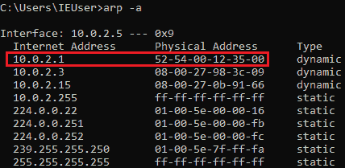

ARP 中毒通过可信请求来实现；正如你在之前的截图中看到的，当一个请求被信任时，客户端会接受响应，即使实际上并未发送请求。黑客向客户端发送一个响应，告诉它他们是路由器，这个响应会被自动信任并接受。接着，黑客会向路由器发送另一个响应，告诉它我们是客户端。这将修改路由器和客户端的 ARP 表中的条目，将黑客的 MAC 地址与路由器的 IP 地址关联起来。换句话说，路由器的 MAC 地址现在是攻击者的 MAC 地址。通过这种方式，黑客将能够读取、分析并修改通过该设备的任何数据包，如下图所示：

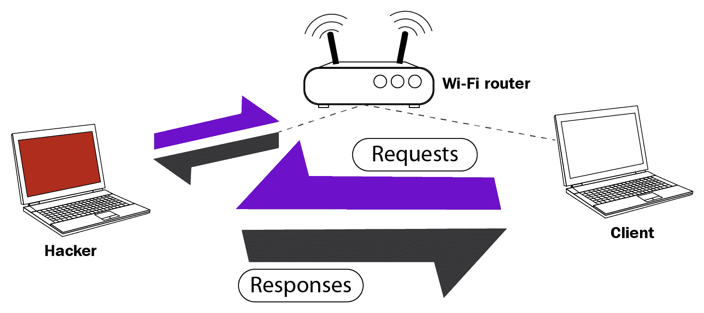

现在我们将从 Kali 机器上执行一次正常的 ARP 中毒攻击。以下是命令：

```
mitmf --arp --spoof --gateway 10.0.2.1 --target 10.0.2.5 -i eth0
```

当我们返回并执行与之前相同的命令`arp -a`时，我们应该看到不同的 MAC 地址，如下图所示：

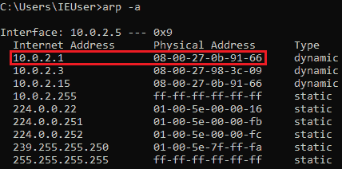

路由器的 MAC 地址曾经是`52-54-00-12-35-00`，但现在已更改为`08-00-27-0b-91-66`，这是攻击者使用的网卡的 MAC 地址。

如果我们在 Kali 机器上运行`ifconfig eth0`，我们将得到相同的 MAC 地址，如之前的截图所示：

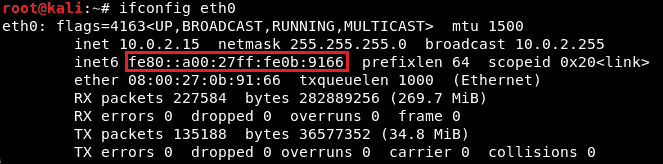

这是检测 ARP 中毒攻击最简单的方法，但不是最有效的。为了节省时间，建议使用一个名为 XArp 的工具，它为我们执行`ifconfig`命令。XArp 可在 Linux 和 Windows 上使用，并且可以从网络上下载。当 XArp 停止攻击时，修改过的 IP 地址会恢复为原始值；在这种情况下，路由器的 MAC 地址会恢复为默认地址。

运行 XArp 会触发一个类似于`arp -a`命令的过程，如下图所示：

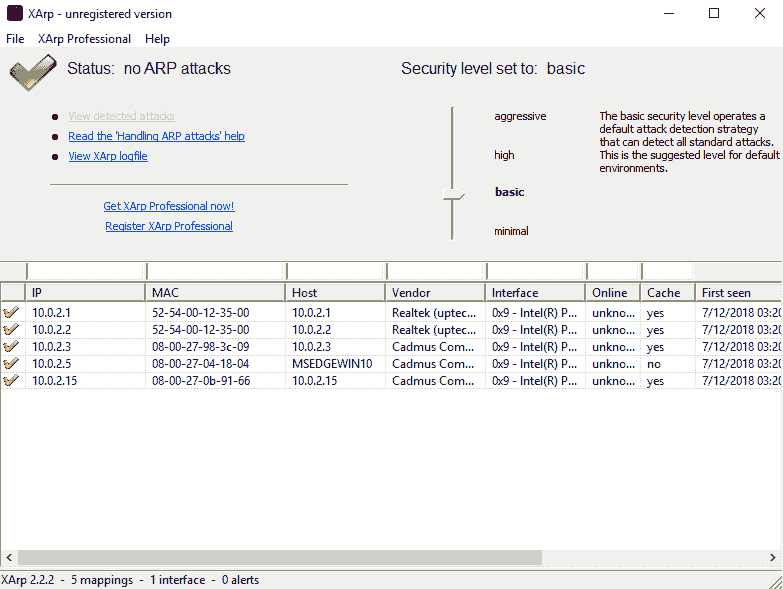

正如我们在前面的截图中看到的，XArp 工具为我们提供了与之关联的 IP 地址和 MAC 地址。该工具会自动监控这些值，通知用户任何变化或重复情况。

如果我们执行一个类似之前的 ARP 欺骗攻击，XArp 应该会显示警报，如下图所示：

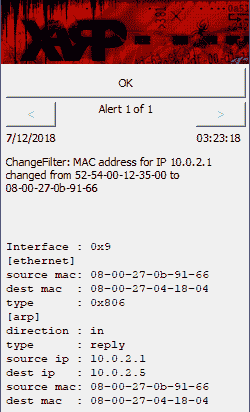

通知将传达一条消息，表示 IP 的 MAC 地址从 52-54-00-12-35-00 更改为 08-00-27-0b-91-66。

一旦我们点击“确定”，我们可以看到受影响的机器是路由器、我们的 Windows 机器和我们的攻击者 Kali 机器，如下图所示：

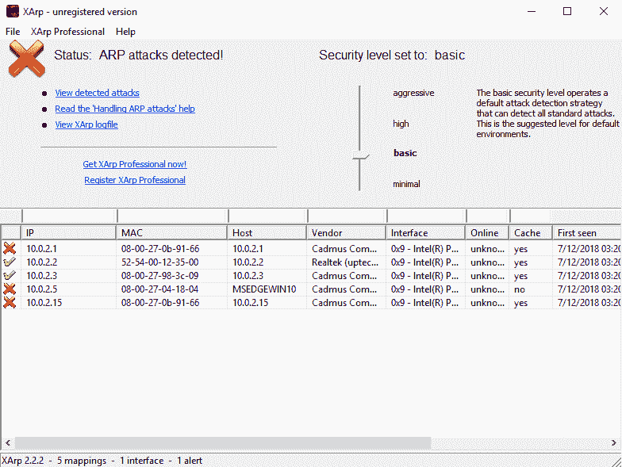

上面的截图告诉我们，`10.0.2.15` 机器正在尝试执行 ARP 欺骗攻击，因为路由器的 MAC 地址已更改为该值。

如我们所见，XArp 工具非常方便，因为它不仅自动监控你的机器，还会告诉你什么时候有人试图进行 ARP 欺骗攻击。

# 检测可疑行为

现在我们将学习如何使用 Wireshark 来查找网络中的可疑活动。在继续之前，我们需要更改 Wireshark 内的一些设置；前往 Edit | Preferences...，在 Protocols 下找到 ARP/RARP 并启用 Detect ARP request storms 选项：

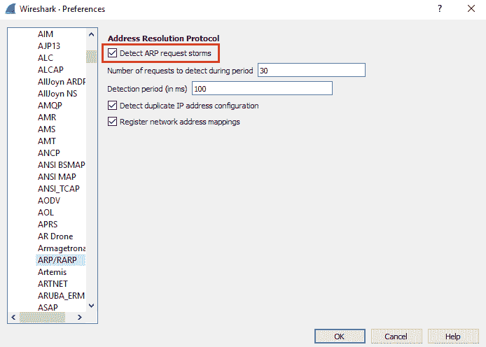

这将通知我们如果有人试图发现网络上的设备。点击“确定”并通过点击 Capture | Start 开始捕获：

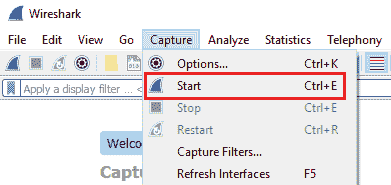

现在我们需要切换到 Kali 机器并使用`netdiscover`。与 ARP 欺骗不同，我们要尝试发现哪些设备连接到了网络。这是通过执行以下命令来完成的：

```
netdiscover -i eth0 -r 10.0.2.1/24
```

一旦我们启动了`netdiscover`命令，它会迅速发现网络上的可用设备：

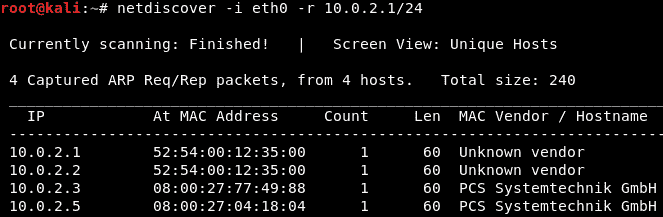

然后，Wireshark 会生成包含设备名称、目标和每个 IP 地址请求内容的数据包，如下图所示：

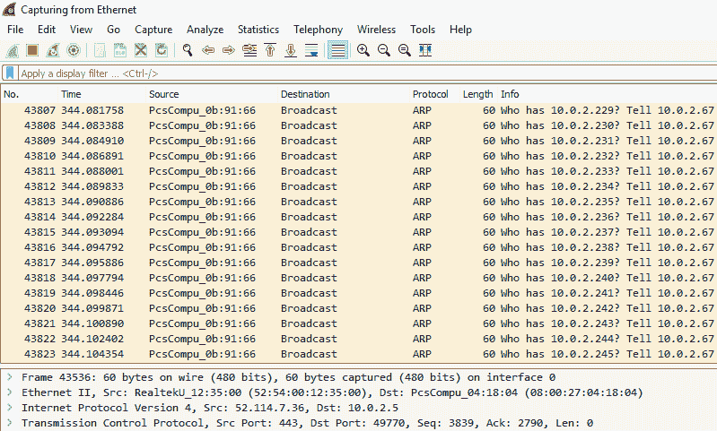

如结果所示，一台设备正在检查某个特定范围内是否存在任何可能的 IP 地址。该设备要求将响应发送到`10.0.2.67`，因此可以安全地推断，试图发现我们连接设备的人具有 IP 地址`10.0.2.67`。

如果我们进入 Analyze | Expert Information，你会看到检测到 ARP 数据包风暴：

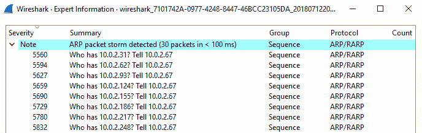

这意味着有一个设备正在发送大量 ARP 数据包，很可能是为了寻找连接的设备和端口。

我们现在将使用中间人框架执行 ARP 欺骗攻击，以查看是否会在 Wireshark 中收到任何通知或警告。如果我们再次进入 **Analyze | Expert Information**，应该会出现一条警告，告诉我们配置了重复的 IP 地址：

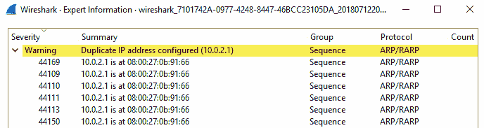

这意味着路由器的 IP 地址有两个不同的 MAC 地址，这表明有人正在篡改连接，并试图通过 ARP 欺骗攻击将自己置于中间。

现在我们已经探讨了多种检测 ARP 欺骗的方法，接下来我们来讨论如何防止这些攻击并保护自己免受攻击。运行 `arp -a` 命令将生成以下表格：

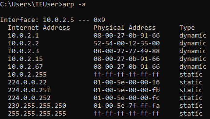

如前面截图所示，`arp -a` 命令监控我们的网络，并会通知我们，甚至防止任何 ARP 欺骗攻击。另一种方法是利用路由器表中看到的动态条目。动态类型本质上是一个物理地址，系统会允许其发生更改。在前面的截图中，这些值是静态的，这意味着这些值无法更改。尽管使用静态 ARP 表意味着需要手动配置每个 IP 地址、ARP 表和 MAC 地址，但系统将拒绝任何外部更改这些值的尝试。

静态解决方案在大公司或企业中使用效率不高，但对于小公司来说，这是理想的解决方案，因为这些公司更可能配置这些值。如果表格被设置为固定且非动态的，那么任何 ARP 欺骗攻击都应该失败。

# 总结

在本章中，我们研究了如何检测系统上的 ARP 攻击。首先，我们了解了什么是 ARP 攻击并亲自发起了一次攻击。接着，我们学习了如何使用 Wireshark 检测 ARP 攻击以及一般可疑行为。

在接下来的几章中，我们将研究如何访问受害者的机器，并学习服务器端和客户端攻击。
