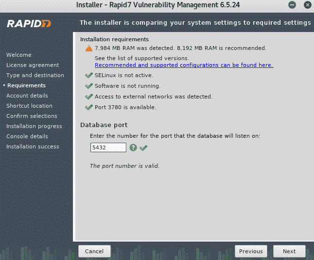
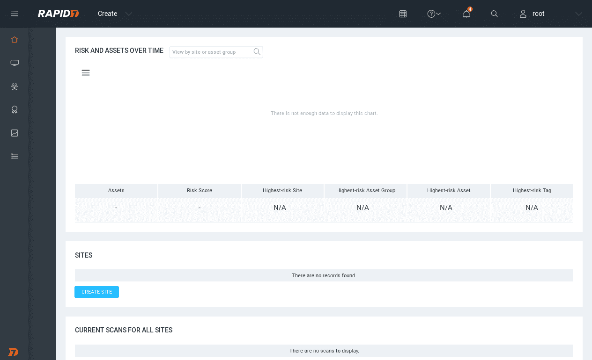
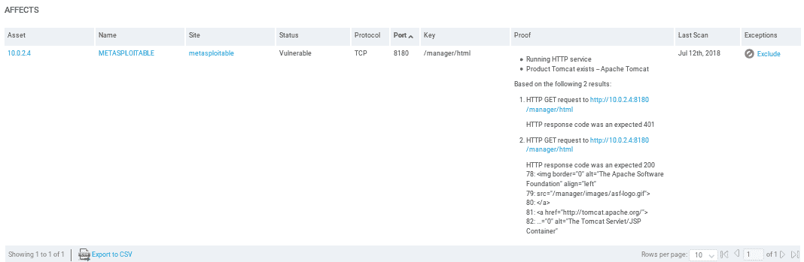
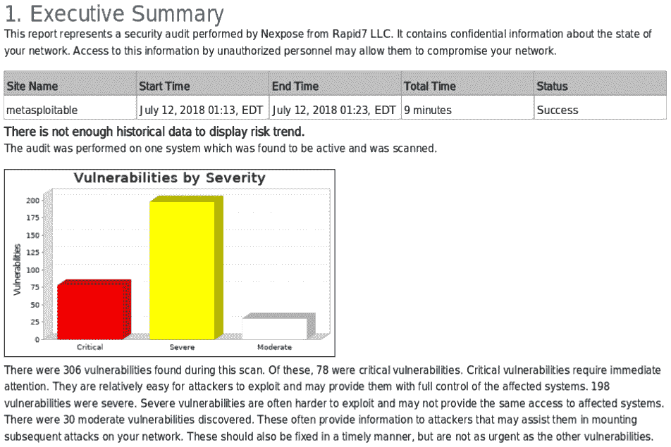

# 第十一章：使用工具扫描漏洞

在本章中，我们将学习如何安装 MSFC，了解扫描过程，并最终查看报告分析。我们还将安装一个名为 Nexpose 的工具，它将扫描我们的系统以查找漏洞。我们还将学习如何生成报告并分析它们。

本章涵盖以下主题：

+   安装 MSFC

+   MSFC 扫描

+   MSFC 分析

+   安装 Nexpose

+   运行 Nexpose

+   Nexpose 分析

# 安装 MSFC

在本节中，我们将查看 Metasploit Community。这是一个基于 Web 的图形界面，使用 Metasploit，但它除了漏洞利用功能外，还有其他功能。它可以像 Zenmap 一样用来发现开放端口和安装服务，但不仅仅如此。它还会将这些端口和服务映射到 Metasploit 中现有的漏洞和模块。从那里，你可以直接使用 Metasploit 利用漏洞。让我们看看如何使用它，随着了解，你将更清楚它的应用场景。

该工具不包含在 Kali Linux 中。我们需要从[`www.rapid7.com/products/metasploit/metasploit-community-registration.jsp`](https://www.rapid7.com/products/metasploit/metasploit-community-registration.jsp)下载它。我们还需要使用我们的电子邮件地址，因为我们需要产品激活密钥，该密钥将通过我们下载时输入的电子邮件发送。下载完成后，我们将使用`cd`命令导航到我们的`Downloads`目录。如果我们执行`ls`列出当前文件，我们将看到已下载的安装程序`metasploit-latest-linux-x64-installer.run`文件。首先，我们需要更改权限为可执行权限，以便执行此文件。在 Linux 中更改权限，可以使用`chmod`命令，然后输入我们希望设置的权限，即可执行权限`+x`，然后输入文件名`metasploit-latest-linux-x64-installer.run`。接下来，我们将执行以下命令：

```
chmod +x metasploit-latest-linux-x64-installer.run
```

如果我们执行`ls`命令，我们会看到某些文本被高亮显示为绿色，表示它是一个可执行文件：


在 Linux 中运行任何可执行文件，只需键入`./`并输入文件名即可。`./metasploit-latest-linux-x64-installer.run`文件将为我们运行此可执行文件。现在，我们将按步骤执行该过程。

安装过程非常简单：

1.  首先，我们点击“我接受协议”，然后点击“下一步”。接着选择我们希望安装的位置：

如果我们已在该文件夹中安装了 Metasploit，它会提示该文件夹非空。如果我们想重新安装，我们将把它命名为 metasploit2。

1.  它会问我们是否希望每次机器启动时都自动启动 Metasploit 作为服务。我们可以选择“是”或“否”。我个人喜欢选择“否”，但你也可以选择“是”。如果选择“是”，那么每次计算机启动时，Metasploit UI 将自动启动。点击“Forward”：


1.  然后它会询问我们要使用的 SSL 端口。由于该服务以网页 GUI 形式运行，我们可以将其设置为任何我们想要的值，但我们将保持为`3790`：


1.  然后它会询问我们服务器名称，我们将保持为`localhost`，因为它安装在我们的`localhost`上：


1.  数据库服务器端口；再次保持相同，不要更改它。接下来是薄集群端口；仍然保持相同，`7337`。这些都是程序运行所需的配置。我们其实不需要更改它们。只有在你已经安装了程序，并且它不允许你使用相同的端口时才需要更改它们，但通常情况下它应该会保持一致：

设置数据库服务器端口

1.  现在，它提示安装已准备好。按下“Forward”后，它将为你安装，并会要求你为网页界面设置用户名和密码。设置好后，选择一个用户名和密码，安装过程将顺利完成。

现在，一旦我们完成安装程序，就需要运行`metasploit`服务。因为它将作为服务安装，作为一个网页服务器，当我们想使用 Metasploit Community 时，我们必须使用`service`命令来运行它，就像在 Linux 中运行任何服务一样。我们输入`service metasploit start`来启动该服务。服务启动后，我们只需要打开浏览器，导航到`https`。确保输入的是`https`而不是`http://localhost/`，然后输入 Metasploit 运行的端口号，即`3790`。按下*Enter*键。现在它会要求我们登录。我们使用在安装程序时设置的用户名和密码登录，然后就可以开始使用它了。我们将在下一部分讨论如何登录和使用该工具。

# MSFC 扫描

现在，我们将使用在安装工具时设置的用户名和密码登录。如下面的截图所示，我们可以看到一个用于使用该工具的网页界面：

Metasploit 社区的网页界面

现在，我们可以访问账户，进入用户设置或退出。我们也可以检查软件更新。

第一次登录时，它会要求我们输入激活码。激活码将通过电子邮件发送到我们在下载工具时提供的邮箱地址。确保在下载工具时提供有效的电子邮件地址。

我们将开始扫描，并点击“项目 | 新建项目”。我们将把这个项目命名为`metasploitable`，将“描述”留空，然后它要求我们设置“网络范围”。我们可以像使用 Zenmap 一样设置它。我们可以设置一个范围。实际上，它有一个范围，位于我们当前的子网内。是`10.0.2.1`到`254`。我们可以扫描整个网络的漏洞和攻击，但现在我们不会这么做；我们只会扫描`10.0.2.4`，也就是 Metasploitable 机器。

现在，我们将点击“创建项目”。下面的截图显示了我们讨论过的所有参数：

添加网络范围

现在，项目已创建，我们将开始对其进行扫描。我们将点击屏幕左侧的“扫描”按钮，然后点击它。我们可以直接启动扫描，或者点击“显示高级选项”来设置一些高级选项。如果我们有一个范围，我们可以使用排除地址来排除某些 IP。例如，如果我们要扫描从`1`到`254`的整个网络，我们可以通过输入`10.0.2.15`（这是我们的 IP 地址）将其排除在搜索之外。您还可以设置自定义 Nmap 参数，因为 Metasploit 实际上会使用 Nmap 来获取服务和安装的应用程序。我们可以添加额外的 TCP 端口，或移除 TCP 端口。再者，我们可以做同样的事。我们甚至可以设置扫描速度。我们还可以启用 UDP 服务发现，它实际上会发现端口上安装的服务。我们还可以设置凭据。如果目标计算机使用某种认证，我们可以进行设置，但我们的目标不使用任何认证，所以没有问题。我们还可以为目标计算机或目标扫描设置标签。现在，我们不打算调整这些设置。为了简便起见，我们保持设置不变，然后启动扫描。给它一些时间完成扫描，扫描完成后，我们将看看如何分析和发现，了解如何利用这些发现的信息。

# MSFC 分析

扫描过程已完成。大约需要两分钟，它将发现一台新主机，因为我们只有一台主机，并且在其上安装了 33 个新服务。现在，我们将返回并点击我的 Metasploitable 机器，查看我们发现了什么。我们可以在以下截图中看到，它发现了 33 个服务，并且成功检测到一个漏洞：

Metasploitable 扫描结果

转到“分析 | 主机”，我们可以看到我们的主机在这里，并且已被正确扫描。它是 VMware，属于一台服务器，运行在 Linux 8.04 上：

主机扫描

如果我们点击 IP 地址，我们会看到以下截图。我们首先看到的是安装的服务：

已安装的服务

我们可以看到服务的名称，例如，`dns`，运行在端口`53`上；协议（PROTO）是`udp`；这是一个开放端口；同时我们也可以看到服务信息。

你可以使用页面右下角的箭头按钮切换页面。它将显示与 Nmap 相同的结果，只是有一个更好的图形界面。会话（Sessions）标签是我们查看连接的地方。如果我们利用了任何东西，我们将在会话中看到它们。图形界面如下所示：

已利用的会话

漏洞（Vulnerabilities）标签将显示已发现的漏洞。通过 Nmap，我们只能获得服务信息。而在 Metasploitable 中，如果它发现了漏洞，且 Metasploit 有针对该漏洞的利用方法，它会将其展示给我们。我们可以点击它，获取更多关于该漏洞的信息。凭证（Credentials）标签将显示程序是否找到了任何有趣的凭证。我们可以看到在以下截图中，程序成功找到了 PostgreSQL 的用户名和密码，用户名是`postgres`，密码也为`postgres`。这是一个弱密码，且是管理员的密码。如果我们点击“验证”列下的密钥图标，它会为我们验证，状态将变为“已验证”。

凭证

现在，我们可以使用前面的信息。我们可以继续使用这些信息连接到 SQL 数据库，使用用户名 postgres 和密码 postgres。让我们来看一个简单的例子。我们将打开 Kali 中的终端，使用连接到 SQL 的命令，即`psql`。在`-h`选项后输入我们要连接的 IP 地址。命令如下所示：

```
psql -h 10.0.2.4 postgres
```

然后，我们输入用户名。现在，它会要求输入密码，我们将输入我们捕获的密码，即 postgres。我们将登录到数据库。现在我们可以在目标计算机上运行任何 SQL 命令。SQL 是与数据库进行通信的语言。我们这里不会深入讨论太多，只是说明我们成功捕获了数据库的用户名和密码，并且我们可以使用 SQL 语言与数据库进行通信。我们可以运行`select current_database();`命令作为示例。我们可以看到它选择了我们的`current_database`，也叫做`postgres`。这是一个快速的示例，证明捕获的数据是正确的；在 Metasploit 的捕获数据（Captured Data）标签中，没有来自文件或目标计算机的捕获数据。但在备注（Notes）中，我们将看到一些有趣的备注，其中一些关于我们使用的一些方法的 HTTP 请求。我们可以浏览这些备注，这对信息收集过程是有帮助的。

**File Shares**标签将显示目标计算机上共享的任何文件。**Attempts**标签将显示我们在目标计算机上进行的尝试，而**Modules**标签将显示我们可以用来利用已发现漏洞的模块。我们有一个漏洞叫做**Java RMI Server**，并且我们有一个模块可以发现**Java RMI Server**漏洞。我们将启动**Exploit: Java RMI Server Insecure Default Configuration Java Code Execution**，并且我们将直接从工具中启动它。我们只需要点击**Launch**。它将允许我们在 Metasploit Community 中运行这个利用程序。`exploit/multi/misc/java_rmi_server`是模块名；执行`use exploit/multi/misc/java_rmi_server`，设置`PAYLOAD`，设置`LHOST`，设置`RHOST`，然后执行`exploit`，就像我们在`msfconsole`中做的那样。或者，我们可以让 Metasploit Community 为我们完成所有的工作。

我们可以看到它已经正确选择了目标地址，并且我们将连接设置为**Reverse**，同时将**Payload Type**保持为**Meterpreter**。现在，我们可以选择命令行界面，如以下截图所示，这就是我们之前使用的，Meterpreter 只是另一种类型的负载，我们稍后会详细介绍。现在，我们只需要点击**Run Module**来运行模块：

命令行界面的选择

正如我们在以下截图中看到的，模块确实已经运行，并且输出非常类似于从 Metasploit 控制台得到的输出，并且它显示会话 1 已打开。它已经为我们创建了一个会话。现在，我们可以与它进行通信：

命令行界面的输出

我们可以看到前面截图中显示的**Session**标签。它的编号是 1。如果我们点击它，我们会看到一个会话已经打开，并且是在 Metasploitable 机器上，或者是 Metasploitable 项目上，并且它使用了 Java RMI 服务器。如果我们点击该会话，我们将看到我们可以在那台计算机上执行的所有操作。现在，我们可以使用**Collect System Data**来获取一些敏感数据，但我们无法使用该功能，因为它仅适用于 Pro 版本，而我们的是社区版。我们可以使用**Access Filesystem**，并且我们实际上可以拥有一个基于 Web 的文件浏览器。我们可以浏览目标计算机上的文件，或者我们可以获取一个 Meterpreter 的命令提示符，就像我们之前所使用的那样。如果我们通过返回上一页进入**Command shell**，我们将看到我们有一个 Meterpreter 命令行界面，允许我们使用 Meterpreter 负载。

现在，我们将研究 Meterpreter 有效负载以及如何在后期利用中使用它，但我们只会看到从这里我们可以完全访问目标计算机，并能够在其上执行任何我们想做的操作。Metasploit 通过浏览器完成了一切。我们无需手动运行 Metasploit 并配置有效负载和利用程序。现在，我们将看到最后一个功能——模块标签。某些模块不需要为我们提供完全访问权限。有些模块只能用于执行拒绝服务攻击，有些则是代码执行漏洞，但它们可能无法工作。我们可以尝试它们，看看它们是否有效。我们可以点击它们并从计算机内部运行。

在收集模块中，它并不利用任何漏洞。它只是允许我们上传文件，其中一些文件会给我们带来一个 Meterpreter 会话。只需点击它，我们就可以从 Web 界面内运行它。该工具还提供其他功能，例如 Web 应用功能，可以扫描 Web 应用。我们只需进入报告选项，就可以创建一个包含所有发现的报告，但问题是这些功能仅限于专业版。除非我们支付费用，否则无法使用这些功能。

# 安装 Nexpose

在本节中，我们将讨论一个名为 Nexpose 的工具。Nexpose 由 Rapid7 公司开发。它由与 Metasploit 和 Metasploit Community 相同的团队制作，在某些方面与 Metasploit Community 相似，因为它具有 Web 图形界面，允许我们发现、评估并处理发现的漏洞。它还将这些漏洞映射到现有的利用程序，但不同之处在于，Metasploit Community 只向我们展示可以在 Metasploit 内使用的漏洞，而 Nexpose 实际上会展示在 Rapid7 和 Metasploit 之外发布的漏洞。它的工作范围更广，展示了更多漏洞，并且帮助我们在扫描结束时创建报告，以便与技术人员共享，同时也能生成一个适合与管理层共享的简要报告。它还帮助我们创建定时扫描。例如，假设我们有一家公司，或者我们在处理大型基础设施，想要每周或每月进行定期扫描；我们可以使用这个工具来实现。

让我们看看如何安装并运行它，区别会更加明显：

1.  Nexpose 在 Kali Linux 中并未预装，我们需要手动安装。要下载它，你需要从[`www.rapid7.com/products/nexpose/download/`](https://www.rapid7.com/products/nexpose/download/)下载。它会要求你填写姓名和地址。填写并下载。我们将下载免费的社区版本。在安装之前，首先要停止与其一同安装的 PostgreSQL 服务，或者停止在 Kali Linux 中运行的 PostgreSQL 服务。只需运行`service postgresql stop`命令即可停止 SQL 服务。

1.  通常，当我们打开终端时，默认不会处于`Downloads`目录。我们需要使用`cd`命令切换到`Downloads`目录。当我们进入`Downloads`目录后，可以列出所有可用的文件，我们会找到`Nexpose Rapid7Setup-Linux64.bin`安装文件。我们需要将该文件的权限更改为可执行文件。如果你已经更改了权限，当我们执行`ls`命令时，它将以绿色显示。首先，我们使用`chmod`命令更改权限，使其成为可执行文件。命令为`chmod +x filename`；`filename`是我们想要更改权限的文件，对于我们来说是`Rapid7Setup-Linux64.bin`。下面是命令：

```
chmod +x Rapid7Setup-Linux64.bin
```

1.  现在，运行这个安装程序。要在 Linux 系统中运行可执行文件，我们只需输入`./`，然后输入你想运行的文件名。对于我们来说，是`Rapid7Setup-Linux64.bin`。命令如下：

```
./Rapid7Setup-Linux64.bin
```

安装程序会弹出，如下截图所示：


1.  现在，我们只需要点击“下一步”，然后它会要求我们接受协议。我们将安装带有扫描引擎的控制台。我们可能会遇到一个问题：Nexpose 只兼容 Kali 2。如果我们想继续安装，我们需要修改本地系统的两个文件，使我们的系统看起来像 Kali 2，以便安装程序允许我们在系统上安装它。如果你没有遇到这个问题，那么现在只需点击“下一步”，但我们将通过修改两个文件来使我的系统看起来像 Kali 2。

1.  只有当你遇到系统不兼容的错误时，才按照以下步骤操作：

+   +   点击完成（Finish）。我们需要修改系统版本为 Kali 2 的说明文件在本书的 GitHub 仓库中（[`github.com/PacktPublishing/Fundamentals-of-Ethical-Hacking-from-Scratch`](https://github.com/PacktPublishing/Fundamentals-of-Ethical-Hacking-from-Scratch)）。需要修改的两个文件是`lsb-release`和`os-release`。我们将打开两个标签页，每个文件一个，第一个文件位于`/etc`目录，名为`lsb-release`。在修改文件之前，我们将先复制它并备份，因为完成此步骤后我们将恢复文件至原始状态。

    +   我们将创建一个新的文件夹，命名为`backup`，然后将文件粘贴到`backup`文件夹中。完成后，我们将根据说明修改文件。我们将使用 Leafpad 打开它，复制所有内容，保存并退出。接着，我们将对下一个文件进行相同的操作，这个文件是`os-release`，存储在`/usr/lib/os-release`路径下。我们将复制该文件并将其放入`backup`文件夹中，然后根据指示修改代码。

    +   好的，一旦一切完成，我们将返回并再次运行安装程序，它应该会认为我们已经安装了 Kali 2，并继续安装。

1.  向下滚动，点击接受（Accept），然后点击下一步（Next），我们将看到软件认为我们已经安装了 Kali 2，所以它会允许我们继续安装。

1.  现在，端口已设置为`5432`，我们将点击下一步（Next）：



1.  现在，我们需要输入名字、姓氏和公司信息。系统会要求我们输入数据库的端口，该数据库将与 Nexpose 一起使用：


1.  确保我们不勾选以下截图中显示的复选框。如果在安装过程中勾选此框，会出现很多问题；该框的作用是安装完成后自动启动 Nexpose，但我们不打算勾选它。我们只会进行安装，安装完成后再手动启动它。请确保没有勾选此框，确保它保持未选中状态。现在，它将为我们进行安装：


1.  好的，一旦安装成功，由于我们还没有启动 Nexpose，如果我们访问`https://localhost:3780`，什么也不会发生。我们需要先运行一个命令，然后才能访问它。我们将在下一节讲解这个过程。目前，我们点击完成（Finish），这样就完成了：


现在，我们将返回并确保将文件恢复到原来的状态。如果你没有修改过文件，可以跳过这一步；如果你修改过文件，请确保将它们恢复到原来的状态。

# 运行 Nexpose

好的，现在我们已经成功安装了 Nexpose，接下来让我们看看如何运行它并了解它的功能。我们之前讨论了很多，并且走过了安装过程，但我们还没有看到工具的实际功能。在我们能够运行工具之前，首先要确保 Kali Linux 自带的数据库已关闭，因为 Nexpose 使用的是自己的数据库。如果它们在同一个端口上运行，会互相冲突。我们要做的第一件事是停止`postgresql`服务；记住，每次运行 Nexpose 之前，都要关闭数据库。我们可以使用在第十章*获取计算机设备访问权限*中用过的命令来做到这一点。命令是`service postgresql stop`，它会确保服务已停止。

现在，我们将导航到安装 Nexpose 的位置。除非在安装过程中更改了安装位置，否则它应该安装在`/opt/rapid7/nexpose/`目录下。运行服务器的文件存储在名为`nsc`的目录中，我们要运行的文件是`nsc.sh`。我们可以像之前运行安装程序一样运行它。正如我们之前所说，运行可执行文件时，始终使用`./`，然后写上可执行文件的名称，即`nsc.sh`：


第一次运行时可能需要一些时间。只需要让它运行，直到加载完成，一旦加载框架完成，我们就能看到如何访问并使用它。

工具已经成功加载，如你所见，它告诉我们我们可以通过`https://localhost:3780` URL 进行访问：


现在我们要做的是启动浏览器并复制它刚才给我们的 URL。现在它要求我们登录。使用安装工具时创建的用户名和密码进行登录：


登录成功后，我们可以在下图看到，首先它要求我们输入产品密钥：


现在，我们知道这是一个免费版本，当我们下载该工具时，我们需要填写一份表格。在表格中，我们填写了电子邮件地址，然后他们会将产品密钥发送到我们的邮箱。去你的邮箱获取产品密钥并粘贴它。粘贴后，点击**使用密钥激活**。如我们所见，激活成功。它现在会刷新。如我们看到的下图，它只显示了关于许可证的信息。所有内容都已激活，我们可以开始使用了：



我们将从左侧菜单进入主页。我们可以在上面的截图中看到，一切都是空的。这是工具的主页。在我们开始讨论每个功能的意义之前，先添加一个目标，然后我们会做一个测试，因为这些内容会在我们测试后自动填充。我们要做的第一件事是点击**Create**，然后点击**Site**来添加目标：


我们将目标的**Name**设置为`metasploitable`：


我们将进入**ASSETS**标签页，添加目标。目标的添加方式与我们之前使用 Zenmap 进行网络渗透测试时相同。我们可以添加一个范围，或者添加一个特定的 IP 地址。在我们的例子中，我们实际是针对 Metasploitable 机器进行攻击。我们将添加目标，目标是`10.0.2.4`，并将其添加到一个组中，组名为`test`：


现在，在**AUTHENTICATION**标签页中，如果目标使用某种认证方式，除非通过某种服务（如 FTP 服务、Web HTTP 认证、Telnet 或 SQL 服务器）进行身份验证，否则任何人都无法访问目标。我们可以从**AUTHENTICATION**标签页中选择认证方式，输入域名、用户名和密码，并确认密码。这样，框架就能够通过该服务进行认证，并测试服务器的安全性。现在，我们的服务器不使用任何认证方式，因此我们不需要此功能。此外，如果我们正在攻击一个需要登录的 Web 应用程序，例如 Facebook 的用户登录页面，那么除非我们使用用户名和密码登录，否则无法访问 Facebook 的大部分功能。使用这里的功能，我们可以先登录，然后再测试目标的安全性。

**TEMPLATES**标签页是我们选择扫描类型的地方。它与 Zenmap 中的扫描类型非常相似。在 Zenmap 中，我们有快速扫描、快速扫描增强版和强力扫描，概念是一样的。每个配置文件不同，扫描的内容也不一样。例如，我们有**Full audit**，虽然时间较长，但几乎可以检查所有内容。还有**Full audit enhanced logging without Web Spider**：


Web Spider 是一个工具或脚本，用来查找目标中的所有文件和目录。默认的扫描配置是**Full audit without Web Spider**。我们也有网络专用的配置文件，此外还有 Web 审计。我非常鼓励你尝试大多数配置文件，并熟悉它们。

我们只会尝试进行完整的审计增强日志记录，而不使用 Web Spider，因为使用它们是一样的。我们将扫描 ICMP、TCP 和 UDP 端口。我们将保持不变。我们也将保持 ENGINE 选项卡不变，这意味着它将使用我们安装的本地引擎，而不是使用 Rapid7 提供的引擎。在警报选项卡中，我们可以设置自定义警报，以便在发现漏洞时收到通知。计划是一个非常酷的功能。现在，假设我们为一家公司或企业工作，他们每天都在推送代码，或者今天我们做了一个测试，我们正在处理的一切都很好；我们的 Web 服务器、程序、应用程序，一切都是最新的，其中没有漏洞。假设明天我们推送了一个新的有漏洞的代码，或者明天有人发现了我们在 Web 服务器上使用的程序的一个新漏洞。我们就不再安全了。这个功能允许我们安排这个测试，使其每周、每小时或每月运行一次，具体取决于其重要性。进入创建计划并创建计划。我们可以设置开始日期，并将频率设置为每天、每周四、每月 26 日，具体取决于我们的需求：


我们创建了计划，然后扫描将在我们指定的每个间隔运行，我们甚至可以让它为我们生成报告。当我们查看报告并看到有什么变化，或者发现了什么时，我们可以进行检查。

最重要的部分是我们将目标放在 ASSETS 选项卡中。然后我们从 TEMPLATES 选项卡中选择一个模板。当这两个选项卡都配置好后，我们将点击保存并扫描，这将保存这个配置并为我们启动扫描。正如我们所看到的，我们的资产发现正在进行中，之后我们将讨论我们得到的结果：


# Nexpose 分析

我们的扫描已经结束，我们现在在资产页面上，正如我们在下面的截图中所看到的，我们已经扫描了一个资产。我们可以看到这个资产正在运行 Ubuntu，我们需要入侵这个资产的技能是初学者：


从前面的截图中，我们可以看到 Nexpose 向我们展示的信息比 Metasploit Community 更多，它是一个更先进的漏洞管理框架。

我们可以看到我们扫描了一个目标，METASPLOITABLE，该站点是全球的。它运行在 Ubuntu Linux 8.04 上，我们没有发现恶意软件，175 个漏洞利用和 306 个漏洞。请记住，使用 Metasploit Community，我们只发现了 1 个可利用的漏洞和 8 个可用的模块。在这里，我们发现了 306 个漏洞。我们发现了更多的漏洞和漏洞利用。

我们可以看到有一个风险因素，以及上次扫描的时间。如果我们向下滚动，我们可以看到我们发现的**操作系统**。同样，它是**Ubuntu Linux 8.04**。我们可以看到安装在目标计算机上的**软件**，不仅是运行在端口上的服务。我们可以看到实际安装在目标计算机上的软件：


在我们成功入侵计算机之后，这可能非常有用。在我们成功入侵后，找到可以用来提升权限的本地漏洞非常有用。例如，如果我们设法，如果我们获得了一个普通用户并且想要成为 root 用户，那么我们可以使用本地缓冲区溢出来提升权限或执行其他类型的操作。这些在后期利用方面非常有用。

如果我们继续往下走，我们将看到安装在目标计算机上的**服务**。就像 Nmap 给我们的那样，我们可以看到**HTTP**正在运行，**DNS**等等：


如果我们点击任何这些服务，我们将看到更多关于它们的信息。例如，对于 HTTP 服务，我们有关于它的描述，以及它运行的端口。我们可以看到 HTTP 运行在端口`80`和端口`8180`上：


现在，让我们向上滚动，如果我们想更仔细地查看漏洞，我们可以转到**漏洞**页面：


正如您在前面的截图中所看到的，我们有一个关于漏洞的图表，左侧按照风险因素分类，右侧按照利用它们所需的技能水平分类。当我们向下滚动时，我们可以看到所有漏洞的列表，并可以使用箭头在它们之间切换：


再次，如果有任何恶意软件，我们将在恶意软件图标下看到它，如果有利用漏洞，我们将在利用漏洞图标下看到它。现在，列出的前几个漏洞没有使用工具进行利用，但它们是根据风险排序的。列出的漏洞非常危险，随着我们继续进行，风险会降低。

我们可以看到在前面的截图中，我们发现了**VNC**的密码是"password"。我们可以尝试使用 VNC 连接。VNC 是一种非常类似于远程桌面的服务。基本上，它会显示给我们桌面，并允许我们完全访问目标计算机，就像远程桌面一样。它告诉我们登录的密码是**password**。它还告诉我们有一个后门**Shell Backdoor Service**正在运行，我们已经使用过了。

现在，让我们看一些可能被利用的东西。我们将点击漏洞图标以按漏洞排序，我们可以看到所有这些都有一个 M 标志，这意味着它们可以使用 Metasploit 进行利用：


如上图所示，我们可以使用 Remote Shell Service，另外也可以使用 Remote Login Service，之前我们已经看过这个。让我们点击一个我们之前没见过的选项，比如 Default Tomcat User and Password。在下图中我们可以看到关于这个漏洞的描述：


再次，我们可以看到它运行的端口，并且可以理解为什么它认为这个特定目标对这个漏洞是脆弱的：



如果我们向下滚动，它会显示如何利用这个漏洞：


有三个不同的模块可以用来利用它，但实际上不一定非得利用它。有时我们只是看到可以用来验证此漏洞存在的模块，但基本上这些就是与之相关的模块。如果我们点击任何 Exploit 的 Source Link，它会带我们到以前通过谷歌搜索时看到的 Rapid7 页面：


我们看到了 Module Name，我们可以将其复制并粘贴到 Metasploit 中，接着运行 `show options`，然后像之前章节中看到的那样使用该漏洞。向下滚动还会显示关于该漏洞的 REFERENCES：


最后，它会显示关于如何修复该漏洞的 REMEDIATIONS：


对于这个漏洞，我们所需要做的就是更改管理员密码，并且不要使用默认配置。

另一个有用的功能是在 Reports 标签页中：


这个框架允许我们为每次扫描生成报告，并且报告有不同的模板类型。在 Create a report 中，我们可以看到有一个 Audit Report，其中包含大量的详细信息，适合程序员或技术人员。我们还可以使用 Executive Report，它包含的信息较少，适合经理或对技术不太了解的高层人员。我们可以选择任何想要的模板，并为其命名。我们将此报告命名为 `metasploitable report`，如上图所示。如果我们稍微向下滚动，就可以选择我们想要的格式：


在上图中，它被设置为 PDF。接下来，我们将点击 Select Scan，选择我们要生成报告的目标扫描，并选择 metasploitable：


然后，我们点击 SAVE & RUN THE REPORT 生成报告：


我们还可以每次自动生成报告，因为我们可以安排报告、安排扫描，还可以每次扫描完成后安排自动报告。例如，如果我们每周扫描一次，您也可以每周生成一次报告，每次扫描完成后。现在，只需点击报告下载，就可以查看报告内容：


如下图所示，它包含了日期、标题以及所有已发现的漏洞，但这是一个执行报告。它包含了有关漏洞的小细节，并且有更多图形化的内容，目的是向高层展示已发现的风险及其严重性：



如上图所示，Nexpose 展示了更多细节，而且功能更加先进。它针对的是更大的公司和更复杂的基础设施，我们需要始终确保一切都是最新的，所有东西都已安装，并且没有漏洞。

# 摘要

我们已经了解了如何使用 Metasploit 框架，该框架预装在 Kali Linux 中。我们随后使用这个框架进行了各种扫描，并学习了如何分析生成的报告。接着，我们安装了 Nexpose 工具，并了解了如何使用它扫描漏洞并生成图形报告。我们还学习了如何解读报告内容。

在下一章中，我们将讨论各种客户端攻击。
