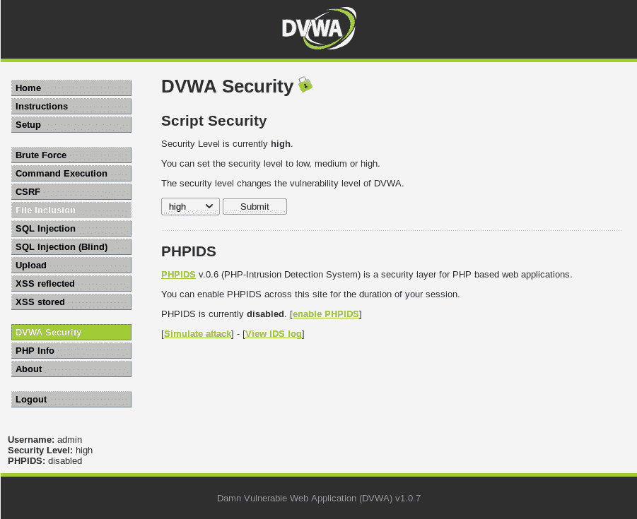
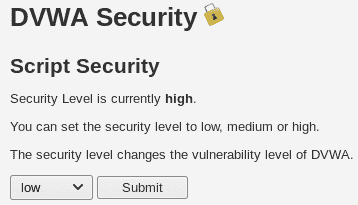

# 第十七章：网站渗透测试

本章重点介绍我们在开始进行网站应用渗透测试之前需要了解的基础知识。我们将从了解网站到底是什么开始，并概述当我们请求访问网站时，后台发生的处理过程。随后，我们将讨论攻击网站的方法，并介绍一些工具。

本章将涵盖以下主题：

+   什么是网站？

+   攻击网站

# 什么是网站？

在开始网站渗透测试之前，我们需要了解网站究竟是什么。网站只是安装在计算机上的一个应用程序。计算机可能比我们的计算机配置更高，但从根本上讲，它的工作方式和其他计算机一样，这意味着它有操作系统，并且有多个应用程序使它能够作为 Web 服务器运行。它的两个主要应用程序是 Web 服务器（例如 Apache）和数据库（例如 MySQL）：

+   **Web 服务器** 基本上理解并执行 Web 应用程序。我们的 Web 应用程序可以用 PHP、Python 或任何其他编程语言编写。唯一的限制是 Web 服务器需要能够理解并执行 Web 应用程序。

+   **数据库** 存储着 Web 应用程序使用的数据。所有这些数据都存储在一台叫做服务器的计算机上。服务器连接到互联网，并具有 IP 地址；任何人都可以访问或 ping 它。

Web 应用程序要么由 Web 服务器执行——它安装在我们的服务器上——要么在目标上执行；因此，每当我们请求一个页面或运行一个 Web 应用程序时，它实际上是在 Web 服务器上执行，而不是在客户端计算机上执行。一旦它在 Web 服务器上执行，Web 服务器就会将准备好的 HTML 页面发送给目标用户或客户端，如下图所示：

比如说，我们正在使用手机或计算机，想要访问 facebook.com。如果我们在 URL 中输入 facebook.com，它将通过 DNS 服务器转换为 IP 地址。DNS 是一个服务器，它将每个名称（例如 `.com`、`.edu` 或任何带有名称或域名的网站）转换为相关的 IP 地址。如果我们请求 facebook.com，请求会发送到 DNS 服务器，DNS 服务器将 facebook.com 转换为 Facebook 存储所在的 IP 地址，然后 DNS 服务器会访问 Facebook 的 IP 地址，使用我们所说的所有应用程序执行所需的页面，然后只给我们一个准备好的 HTML 页面。

现在，我们得到的只是用 HTML 编写的标记——它是一种标记语言——是执行程序结果的标记；程序在服务器上执行，我们只是得到了结果。这非常重要，因为将来如果我们想在 Web 服务器上执行任何东西，例如 Shell，或者让病毒在目标计算机上执行，那么我们需要以 Web 服务器能够理解的语言发送它（例如 PHP），一旦我们在服务器内部执行它，它将在目标计算机上执行。

这意味着，无论是谁访问页面，我们要发送的 Web Shell（如果是用 PHP 或服务器理解的语言编写的）将在服务器上执行，而不是在我们的计算机上执行。因此，它将让我们访问服务器，而不是访问那个访问了服务器的人。另一方面，一些网站使用 JavaScript，这是一种客户端语言。如果我们设法找到一个允许运行 JavaScript 代码的网站，那么该代码将由客户端执行。即使代码可能被注入到 Web 服务器中，它也将在客户端执行，并允许我们对客户端计算机进行攻击，而不是对服务器进行攻击。因此，区分客户端语言和服务器端语言是非常重要的。

# 攻击网站

在这一节中，我们将讨论如何攻击一个网站。我们有两种攻击网站的方法：

+   我们可以使用迄今为止学到的攻击网站的方法。因为我们知道网站是安装在计算机上的，我们可以像攻击其他计算机一样尝试攻击并入侵它。我们还可以尝试使用服务器端攻击，看看安装了哪些 Web 服务器、操作系统或其他应用程序，如果我们发现任何漏洞，看看是否可以利用其中的漏洞访问该计算机。

+   另一种攻击方式是使用客户端攻击。因为网站是由人类管理的，所以一定有人在管理和维护这些网站。这意味着，如果我们设法黑入网站的任何管理员，我们可能会得到他们的用户名和密码，然后从那里登录他们的管理面板或**安全套接字外壳**（**SSH**）。然后我们将能够访问他们用来管理网站的任何服务。

如果这两种方法都失败了，我们可以尝试测试网页应用程序，因为它只是在该网站上安装的一个应用程序。因此，我们的目标可能实际上不是网页应用程序——也许我们的目标仅仅是使用该网站的一个人，但他的计算机是无法访问的。相反，我们可以访问该网站，黑入该网站，然后从那里找到我们的目标人物。

所有这些应用程序和设备都是相互连接的，我们可以利用其中之一，并通过它进入其他地方或其他计算机。在本节中，我们不会再关注服务器和客户端的攻击，而是将学习如何测试 web 应用程序本身的安全性。

我们的目标将是一个 Metasploitable 机器，如果我们在 Metasploitable 上运行`ifconfig`命令，我们将看到其 IP 地址是`10.0.2.4`，如下图所示：

如果我们查看`/var/www`文件夹，我们将看到所有网站文件存储在其中，如下图所示：

在上面的截图中，我们可以看到`phpinfo.php`页面，并且我们有`mutillidae`、`dvwa`和`phpMyAdmin`。如果我们进入 Kali 机器，或者进入同一网络中的任何机器，尝试打开浏览器并访问`10.0.2.4`，我们将看到为 Metasploitable 制作的网站，如下图所示。网站只不过是安装在网页浏览器上的一个应用程序，我们可以访问任何 Metasploitable 网站并用它们来测试其安全性：

另一个需要查看的是 DVWA 页面。它需要用户名和密码进行登录；用户名是`admin`，密码是`password`。输入这些凭据后，我们可以登录，如下图所示：

登录后，我们可以通过使用 DVWA 安全选项卡来修改安全设置：

在 DVWA 安全选项卡下，我们将 Script Security 设置为低，并点击提交：

在接下来的部分中，我们将保持此设置为低。因为这只是一个入门课程，我们只讨论如何发现 DVWA 和 Mutillidae web 应用程序中的基本漏洞。

如果我们以与访问 DVWA web 应用程序相同的方式访问 Mutillidae web 应用程序，我们应该确保将安全级别设置为 0，如下图所示：

我们可以通过点击页面上的切换安全选项来切换安全级别：

# 总结

在本章中，我们了解了执行网站渗透测试所需的概念和方法。我们首先了解了什么是网站，并简要概述了当我们在设备上请求特定网站时，后端处理的过程。然后，我们讨论了攻击网站的技术以及 Metasploitable 和 DVWA 等工具。

在下一章，我们将重点讲解信息收集与分析，并且如何利用这些信息来攻击目标系统。
