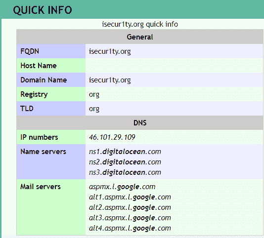
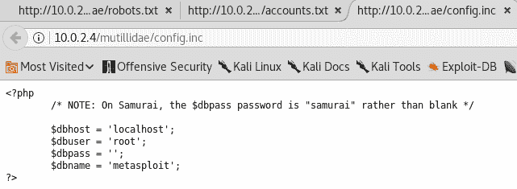

# 第十八章：网站渗透测试 - 信息收集

在本章节中，我们将专注于使用 `Whois` 命令、Netcraft 和 Robtex 等工具来收集客户信息的各种技巧。接着，我们将学习如何通过针对托管在该服务器上的网站来攻击服务器。进入信息收集部分后，我们将学习子域名以及它们在执行攻击时的作用。之后，我们将搜索目标系统中的文件，以收集一些信息并分析这些数据。

本章节将涵盖以下主题：

+   信息收集

+   同一服务器上的网站

+   从目标网站收集信息

# 使用工具进行信息收集

如我们在上一章节所见，了解客户的相关信息将有助于我们对受害者发动攻击，在本节中，我们将使用诸如 Whois 等命令，以及 Netcraft 和 Robtex 等工具，从目标系统收集信息。

# Whois 查找

在开始尝试利用或寻找任何漏洞之前，首先要做的是信息收集。因此，我们尽可能多地收集关于目标的信息，网络应用程序也不例外。我们将从尽可能收集目标 IP 地址、域名信息、网站使用的技术、编程语言、安装的服务器类型以及使用的数据库类型开始。我们还将收集有关公司及其 DNS 记录的信息，并查看能否找到任何未列出的文件，或者任何其他人无法看到的子域名。现在，我们可以使用之前使用过的任何信息收集工具；例如，我们可以使用 Maltego，只需将实体设置为网站，然后开始执行操作。这和我们在第十一章中对普通人进行的操作*客户端攻击 - 社会工程学*完全相同。我们还可以使用 Nmap，甚至 Nexpose，测试网站的基础设施，看看能从中收集到什么信息。再次强调，我们不会在本章详细讲解这些，因为之前章节已经介绍过了。网站和普通计算机没有区别——正如我们所知，网站只不过是另一台计算机。所以，我们将专注于在网站上才能看到的技术，例如域名、DNS 记录等，这些内容是我们在之前的章节中没有接触过或无法使用的。

现在，我们首先要了解的是 Whois 查找。Whois 查找是一种用于查找互联网资源所有者的协议，例如服务器、IP 地址或域名。因此，我们并不是真正在进行黑客攻击；我们仅仅是从一个包含互联网资源所有者信息的数据库中检索信息。例如，当我们注册域名时，如果我们想注册一个域名，比如 za1d.com，当我们这样做时，我们需要提供关于注册人的信息、地址，然后该域名将会登记在我们的名下，其他人就能看到 Zaid 拥有这个域名。这就是我们要做的所有事情。

如果我们搜索 Whois 查找，我们会看到很多提供此服务的网站，因此我们将使用 [`whois.domaintools.com/`](http://whois.domaintools.com/)，[输入我们的目标域名 `isecurity.org`，然后点击搜索：](http://whois.domaintools.com/)


如下图所示，我们可以获取到关于目标网站的大量信息：


我们可以看到可以用来联系域名信息的电子邮件地址。通常，我们会看到注册域名的公司的地址，但我们可以看到该公司在其域名上使用了隐私保护；但如果他们没有使用隐私保护，也就是说，如果他们没有启用隐私保护，我们将能够看到他们的地址以及关于实际公司的更多信息。

我们可以看到域名创建的时间，并且可以看到 `isecur1ty.org` 的 IP 地址。如果我们 ping 该 IP，我们应该得到与前面截图中提到的相同的 IP 地址。

如果我们运行 `ping www.isecur1ty.org`，会返回相同的 IP 地址：


我们可以看到 IP 位置，可以看到域名状态，我们还可以访问历史记录，但需要注册才能查看。现在，我们可以利用这些信息来寻找漏洞。

在接下来的截图中，在 Whois 记录中，我们可以找到更多关于注册此域名的公司的信息：


这是基本信息，但从长远来看，它非常有帮助，能让我们了解目标是什么、它们的 IP 是什么，以及它们使用了哪些服务。我们还可以看到所使用的名称服务器，以及这些服务器由哪家公司提供。

# Netcraft

在这一部分，我们将学习如何获取关于目标网站所使用技术的信息。我们将使用一个名为 Netcraft 的网站（[`www.netcraft.com`](https://www.netcraft.com)），然后输入目标地址，选择我们的目标 `isecur1ty.org`，并点击箭头：


接下来，点击站点报告：


在下图中，我们可以看到一些基本信息，例如站点标题、描述、关键词以及网站创建的时间：


再向下滚动，我们可以看到网站本身，域名，IP 地址，就像我们在前一部分看到的那样，域名注册商是为 isecur1ty 注册域名的公司：


在前面的截图中，我们通常能看到有关组织的信息，但在这里我们看不到，因为 isecur1ty 正在使用隐私保护。通常，我们应该能够看到这些信息，甚至更多。

在前面的截图中，我们可以看到它托管在英国，我们可以看到**Nameserver**，它是 `ns1.digitalocean.com`，再一次，如果我们直接访问 `ns1.digitalocean.com`，我们会发现这是一个提供网站托管的服务。

现在，我们知道这是一个网站托管公司，在最坏的情况下，我们可以利用这个信息，或者尝试黑入 `ns1.digitalocean.com` 本身，以获得对 isecur1ty 的访问权限。

继续向下滚动，我们将看到 isecur1ty 使用的托管公司的托管历史，我们可以看到最新的托管服务是在 Linux 上运行，使用 Apache，和我们在前一部分看到的一样，版本是 2.2.31，并且带有 Unix mod_ssl 和其他所有附加组件：


再次强调，找到目标计算机的漏洞和利用方式非常重要：

向下滚动到 Web Trackers，它将显示我们目标使用的第三方资源或应用程序，因此我们可以看到我们的目标使用了 Google、MaxCDN 和其他 Google 服务。这也可能帮助我们找到或获得对目标计算机的访问：


“技术”标签是这里最重要的标签或部分之一，因为它向我们展示了目标网站使用的技术：


我们可以在上面的截图中看到它正在使用 Apache Web 服务器，在服务器端，我们可以看到该网站使用了 PHP，这意味着该网站能够理解并运行 PHP 代码。这一点非常重要，因为如果我们将来能够在目标上运行任何类型的代码，我们就知道代码应该以 PHP 代码的形式发送。要在 Metasploit 或 Veil-Evasion 上创建有效载荷，我们应该以 PHP 格式创建它们，目标网站能够运行它们，因为它支持 PHP。在客户端，我们可以在前面的截图中看到该网站支持 JavaScript，所以如果我们运行 JavaScript，或者我们成功在网站上运行 JavaScript 代码，它不会在网站上执行，而是在查看网站的用户的设备上执行，因为 JavaScript 是客户端语言，而 PHP 是服务器端语言。如果我们成功运行 PHP 代码，它将直接在服务器上执行。如果我们成功运行 JavaScript，它将在访问该网站的用户的机器上执行。jQuery 也是如此，它只是 JavaScript 的一个框架。

向下滚动，我们可以在以下截图中看到该网站使用了 WordPress 自托管软件。这一点非常重要。Netcraft 还会显示网站上使用的任何 Web 应用程序：


WordPress 只是一个 Web 应用程序，因此我们可以看到我们案例中的其他示例，它是一个开源 Web 应用程序，可能有许多其他网站也在使用。幸运的是，我们可以去查找 Web 应用程序中的漏洞或弱点。如果我们足够幸运找到现有的漏洞，我们就可以在目标网站上利用它。例如，在我们的示例中我们使用的是 WordPress，所以如果我们去 [`www.exploit-db.com/`](https://www.exploit-db.com/) 搜索 WordPress，我们会发现很多与 WordPress 相关的漏洞。

WordPress 有不同的版本。我们需要确保我们和目标使用的是相同的版本。我们将通过示例来查看如何利用漏洞，但这只是展示了信息收集的强大功能。继续向下滚动，我们还可以找到其他信息，比如该网站使用了 HTML5 和 CSS 等内容：


因此，Netcraft 对了解网站非常有用。我们收集到了关于该网站的信息——它运行在 PHP 上，并支持 JavaScript。它使用 WordPress，因此我们可以利用 WordPress 对网站进行攻击。如果我们向上滚动，我们还发现了该网站的 Web 主机。因此，在最坏的情况下，我们可以尝试攻击 Web 主机服务器，并获得对目标网站的访问权限。

# Robtex

在本节中，我们将学习如何获取目标网站的综合 DNS 信息。简要回顾一下 DNS 的概念，当我们输入**FACEBOOK.COM**时，**DNS 服务器**会将该名称转换为 IP 地址。**DNS 服务器**包含多个记录，每个记录指向不同的域名或不同的 IP 地址。有时它们指向相同的 IP 地址，但一般情况下，它们会请求域名并将其转换为 IP 地址，之后，依据地址，信息需要被存储在某个地方。我们将查询**DNS 服务器**并查看我们能从中获取哪些信息。以下图示展示了这个过程：


我们将使用一个名为 Robtex 的网站（[`www.robtex.com/`](https://www.robtex.com/)），搜索`isecur1ty.org`。接下来，点击 GO 并选择网站上的第一个结果。

现在，我们可以看到这个报告包含了很多信息，但我们有一个很好的索引帮助我们浏览。很多信息比较复杂，因此我们会跳过其中的一些内容，因为我们希望尽量保持内容的基础性。网络渗透测试本身是一个庞大的话题。因此，我们会保持内容的简单性，并查看以下截图中能看到的哪些信息：



首先，我们获取到网站的信息。我们可以看到 DNS 记录，看到使用的名称服务器，以及一些邮件服务器。我们还可以看到我们提到过的记录和 DNS 服务器：


在这里，我们可以看到所有这些记录。我们可以看到 A 记录，它将域名转换为 IP 地址。如果我们记得，在执行 DNS 欺骗时，我们在`dns.conf`和`iter.conf`文件中添加了一个`A`记录。A 记录实际上是 DNS 服务器用来将 isecur1ty.org 链接到其 IP 地址的记录，但还有另一种类型的记录；例如，我们有 NS 记录，它将域名与名称服务器关联。我们还可以在下面的截图中看到 MX 记录，它将域名链接到邮件服务器，并且可以看到该网站使用了 Google 邮件服务器，因此它可能使用 Gmail 提供邮件服务：


向下滚动，我们看到了一张图，展示了所有服务如何相互作用，服务如何使用这些记录，以及它们如何被转换为 IP 地址：

服务之间的相互作用

在共享选项卡中，我们将查看是否有任何资源正在共享：


我们还可以看到它使用了三个名称服务器。我们可以看到邮件服务器，并且还可以看到多个网站指向相同的 IP 地址，多个域名也指向相同的 IP 地址。因此，上述网站存储在同一 Web 服务器上。现在，再次有关于名称服务器和共享邮件服务器的网站的更多信息。这并不意味着这些网站在同一服务器上，但最重要的是我们看到这些网站指向相同的 IP 地址，这意味着这些网站存在于同一服务器上。现在，如果你获得了上述任何一个网站的访问权限，那么攻击[isecur1ty.org](http://www.isecur1ty.org/)将变得非常容易。

# 同一服务器上的网站

网站安装在普通计算机上的网络服务器上，正如我们之前所说，这些普通计算机有 IP 地址，利用 IP 地址，我们可以访问目标网站。现在，在许多场景中，我们的目标网站或目标服务器上会包含大量的网站，因此它不仅包含我们要攻击的网站，还会包含同一服务器上的其他网站，即同一文件系统上的网站。例如，如果我们在目标网站中找不到任何漏洞，我们仍然可以尝试攻击安装在同一服务器上的其他网站。如果我们能做到这一点，那么我们就能访问服务器。访问服务器基本上意味着我们能够访问所有其他网站，因为服务器只是一个计算机，我们可以导航到我们想要攻击的网站并获得访问权限。假设我们试图攻击一个网站，但找不到漏洞，那么下一步就是尝试攻击同一服务器上存在的任何其他网站。因此，我们所说的同一服务器上存在的意思是它们有相同的 IP 地址。

# 从目标网站收集信息

到目前为止，我们只是使用命令和工具来收集有关受害者的信息。现在，我们将利用从受害者浏览的网址获取的信息，以及如何分析我们可以访问的目标机器上的文件，并查看我们能通过它们收集到哪些有用的信息。然后，我们将看看如何使用收集到的信息发起攻击。

# 查找子域名

在本节中，我们将学习子域名。我们到处都能看到子域名，例如，`subdomain.target.com`。现在，如果我们有`beta.facebook.com`，那么我们也许会有`mobile.facebook.com`，或者我们可能会看到`user.facebook.com`。假设我们在谷歌搜索`mail.google.com`，它会直接带我们到 Gmail。子域名之所以重要，是因为在很多情况下，网站会为自己的用户设置子域名，例如，为员工或特定客户设置，因此这些子域名通常不会公开，除非是某种 VIP 客户或者我们是员工。我们不会在搜索引擎上看到这些子域名，也永远不会看到通向它们的链接，因此它们可能包含漏洞或利用程序，帮助我们访问整个网站，但我们根本不知道它们的存在，因为它们没有被公开。另一个原因是，很多大网站在尝试安装新更新或添加新功能时，会先在子域名上进行安装，所以我们会看到`beta.facebook.com`，它实际上包含了 Facebook 的测试版，并且包含一些实验性功能。现在，实验性功能非常棒，因为它们仍然在开发阶段，发现漏洞的机会很大。事实上，最近就有人通过`beta.facebook.com`暴力破解了任何 Facebook 用户的恢复密码密钥，成功进入任何 Facebook 用户的账户。这只通过`beta.facebook.com`才有可能，因为 Facebook 曾经只在正式版中检查失败的尝试次数，而他们在测试版中并没有实现这个安全功能，因为他们认为没有人会访问那里。Beta 版通常比正式版包含更多的问题，因此尝试入侵它非常有用。在本节中，我们将学习如何找到那些没有被公开的子域名，甚至是公开的子域名，从而获得我们目标的子域名。

我们将使用一个叫做 knock 的工具。这个工具非常简单，我们实际上不需要安装它；我们只需要使用`git`命令下载它。命令是`git clone`，然后我们将工具的 URL 放在下面：

```
git clone https://github.com/guelfoweb/knock.git 
```

下载完成后，使用`cd`命令进入它，我们会看到一个`.py`文件。我们将使用`python knockpy.py`命令运行它，然后输入我们想要获取子域名的网站，即`isecur1ty.org`。以下是命令：

```
python knockpy.py isecur1ty.org
```

执行后，命令将显示一些关于网站的信息，如下图所示：


它将执行一次暴力破解和基于 Google 的子域名搜索，针对 isecur1ty，展示我们可以尝试并测试其安全性并查看其安装内容的任何子域名。也许我们能够通过该子域名访问网站。一旦扫描完成，如下图所示，我们成功找到了七个未公开的子域名：


其中一个是 `ftp.isecur1ty.org`。我们已经知道 `isecurity.org`，`localhost.isecur1ty.org` 只是一个本地子域名。我们可以看到邮件服务器 `mail.isecur1ty.org` 也有自己的子域名，我们还可以看到一个很有意思的子域名 `news.isecur1ty.org`。它实际上包含了一个正在开发中的脚本的测试版本。因此，如果有人试图入侵我们的网站，他们会看到一个正在开发中的脚本，并且有很大的机会能够找到其中的漏洞，从而获得整个网站的访问权限。

这再次显示了信息收集的重要性，它可以用于获取网站访问权限。如果我们不做这些，我们会错过很多东西。例如，我们可能会错过一个包含多个漏洞的完整脚本，或者错过一个管理员登录页面或员工登录页面。

# 使用文件进行信息收集

到目前为止，我们已经学会了如何找到目标网站上未列出的子域名。在本节中，我们将看到如何查找存储在目标计算机或目标网站上的文件和目录。同样，这些文件可能包含密码、配置文件，或者包含有关实际服务器的信息，这将帮助我们进一步利用目标。

让我们首先看看“文件和目录”是什么意思，展示 Web 服务器上的目录结构。我们有我们的 Metasploitable 机器，通常 Web 服务器的内容存储在 `var/www/` 目录中。如果我们运行 `ls`，我们将看到如下一些文件和目录：


如果我们运行 `ls -la` 命令，它将给出有关文件和目录的详细信息。

我们可以在上面的截图中看到有一个名为 `mutillidae` 的目录。Mutillidae 是一个设计用来像 Metasploitable 一样运行的 Web 应用程序。它的设计包含了许多漏洞，帮助我们学习如何利用它进行黑客攻击。你将看到它安装在名为 `mutillidae` 的目录中。

现在，如果我们访问 Metasploitable 机器的 IP 地址 `10.0.2.4`，我们可以轻松访问 Mutillidae。如果我们点击 URL，`10.0.2.15 /mutillidae`，应该能看到如下内容：


这意味着我们在`mutillidae`目录内。因此，每当我们看到一个正斜杠时，通常意味着我们在一个目录内。现在，如果我们运行`cd mutillidae`并且运行`ls`命令，我们会看到有大量的文件：


例如，假设我们想要打开其中一个文件，我们有`index.php`。如果我们输入`index.php`，那么这是我们当前在浏览器上的文件，它叫做`index.php`，我们能够在网址中看到它。

现在，我们从中学到的是，`mutillidae`只是我们网页根目录中的一个子目录。所以，目前，Metasploitable 网页应用程序存储在`/var/www/mutillidae`目录下，接着我们访问的文件是`index.php`。如果我们运行`pwd`命令，我们会看到我们在`/var/www/mutillidae`目录下：


IP 地址某种程度上隐藏了我们的`www`根目录，它隐藏了`/var/www`路径，然后在 IP 地址后面显示的将是所有内容。

因此，我们要查找的是所有我们无法看到的目录和文件。通过这些链接，我们将能够访问不同类型的页面。这与其他任何网站都一样，但总是有一些隐藏的文件和目录我们从未见过。我们将看到如何获取文件的 URL 并访问它们，读取其中的信息。为此，我们将使用一个叫做`dirb`的工具，接着为了了解如何使用这个工具，我们会运行`man dirb`命令，查看与该工具相关的所有选项。在下面的截图中，我们可以看到语法。要使用该工具，我们只需输入`dirb`，目标网址，然后输出一个字典列表。它的工作方式是基于暴力破解攻击，使用的是一个包含名字的字典列表，并用这些名字发送请求。每当它找到某个东西时，它会告诉我们，然后我们就能找到一个与字典列表中的名字相符的文件。因此，它只能根据我们提供的字典列表找到名字和目录：


我们可以使用`crunch`创建字典文件，或者使用`dirb`工具自带的字典文件。这里的选项允许我们配置工具的工作方式。我们可以根据需要更改设置。例如，我们可以禁用工具的递归目录遍历，让它只在一个目录中运行，而不是尝试多个目录。我们还可以让它询问我们是否要访问某个目录，而不是自动访问目录并尝试在其中查找文件，因为如果我们的目标是一个大型网站，这可能会变得非常耗时；可能有很多目录，工具会尝试访问所有这些目录并在其中查找文件。我们可以看到树的深度有多大。如果目标网站使用某种认证方式，我们还可以设置使用用户名和密码，并且可以使用`-v`选项来输出详细信息，使用`-o`将结果输出到文件中。

现在，让我们来看一个非常简单的例子。我们只是要在我们的目标`http://10.0.2.4`上运行`dirb`。我们加上了`http://`，因为记住，我们的目标是一个网站，而不是一个 IP 地址。接着，我们将输入我们想要查找文件和目录的目录，在我们这个例子中是`mutillidae`目录。我们不希望它访问其他目录中的内容，因为我们在 Metasploitable Web 服务器上安装了一些脚本；我们只希望它在`mutillidae`目录下工作。所以，命令如下：

```
dirb http://10.0.2.4/mutillidae/
```

在终端中输入命令并按下*回车*后，它将开始在 Web 应用程序中查找 URL 和文件。我们可以在以下截图中看到命令的执行情况：


处理过程需要一段时间，`dirb`将使用一个字典文件，并且它会使用存储在`usr/share/dirb/wordlists/common.txt`中的默认小型字典文件。

我们可以查看`usr/share/dirb/wordlists/common.txt`目录，看看是否有其他我们想使用的字典文件，但我们只能通过在命令后面提供字典文件的完整路径来使用它们。因此，和我们之前写命令的方式不同，我们只需要指定字典文件所在的路径。例如，假设它在`root`目录下，我们可以这样写：`root/wordlist.txt`，但目前使用的是默认的字典文件，存储在`usr/share/dirb/wordlists/common.txt`目录下。在下一部分中，我们将看到如何分析使用`dirb`工具下载的文件。

# 分析文件结果

在以下的结果截图中，我们可以看到`dirb`工具能够找到一些文件。其中一些文件我们已经知道：


现在，正如我们在前面的截图中看到的，`favicon.ico`只是一个图标；`footer`和`header`可能只是样式文件；而`index.php`是我们通常看到的首页。我们可以看到我们发现了一个`login`页面，允许用户登录。

现在，在很多场景中，我们可能通过利用一个非常复杂的漏洞找到目标的用户名和密码，结果却因为找不到登录入口而无法登录。在这种情况下，像`dirb`这样的工具非常有用。我们可以看到，`phpinfo.php`文件通常非常有用，因为它显示了关于在 Web 服务器上运行的 PHP 解释器的很多信息，正如我们在接下来的截图中看到的，这个文件包含了大量的信息：


前面的信息很有用，我们可以了解一些目录。从前面的截图中，我们知道它正在运行 php5，配置存储在`.cgi`文件中。`.ini`文件通常是 PHP 的配置文件，因此我们可以看到它们存储的位置。

当我们进一步向下滚动时，我们会看到安装的权限。我们还会看到它安装了 MySQL，所以它正在使用 MySQL：


我们可以在前面的截图中看到不同类型的配置文件存储的目录。我们还可以看到所有与 PHP 一起使用的模块和扩展，因此`phpinfo.php`文件非常有用。我们可以在接下来的截图中看到，我们成功找到了`phpMyAdmin`的登录页面，这基本上是用来登录数据库的：


另一个非常有用的文件是`robots.txt`文件，它告诉搜索引擎（如 Google）如何处理网站。因此，它通常包含我们不希望网站或 Google 看到或读取的文件。如果我们能读取`robots.txt`文件，那么我们就能看到网站管理员想要隐藏的内容。我们可以在下图中看到，网站管理员不希望 Google 看到一个名为`passwords`的目录，并且不希望我们看到名为`config.inc`的文件，也不希望它看到以下这些文件：


现在，让我们来看一下`./passwords`和`./config.inc`文件：


我们可以在前面的截图中看到一个名为`accounts.txt`的文件，点击该文件后，我们可以看到一些用户名和密码。因此，我们可以看到有一个`admin`用户，密码是`adminpass`，并且我们可以看到`adrian`用户的密码是`somepassword`。所以，我们成功找到了用户名和密码，如下图所示：


现在，我们仍不确定前面的用户名和密码是用来做什么的，但我们确定我们已经找到了非常有用的信息。另一个有用的文件是`config.inc`文件，我们可以在下面的截图中看到，其中包含了允许我们连接到数据库的信息，因为它们有`$dbhost`、`$dbuser`、`$dbpass`和`$dbname`参数：



我们可以看到用户名是`root`，密码为空，因此我们可以根据前面的截图中的命令继续尝试连接到数据库，然后我们应该能够访问数据库。

此外，我们仍不确定这些信息可以用在哪里，但我们可以将它们添加到列表中，尝试登录管理员账户，或者仅仅将它们存储在列表中，以便在进行暴力破解攻击时使用。

# 总结

本章重点讲解了信息收集。首先，我们使用了 WhoIs 查询、Netcraft 和 Robtex 等工具。然后，我们重点探讨了如何利用托管在服务器上的网站来攻击该服务器。接着，我们学习了域名以及它们如何成为可以用于攻击受害者的重要信息来源。之后，我们研究了如何访问目标系统或目标网站上的文件，并且如何从各种文件中分析出重要信息。

现在，在下一章中，我们将看到信息收集是多么重要和强大，它能够帮助我们发起对受害者的攻击。
